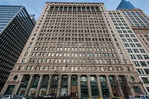
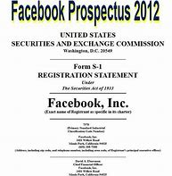

= eco 2020-06-06
:toc:

---

== Hong Kong’s uncertain future 词汇解说

(2020-6-6 / Finance & economics / Hong Kong’s future: Electrical storm)

Can Hong Kong *remain* a global financial centre?

The $10trn financial centre *is* in the eye 风眼（风暴等的中心平静区） of a geopolitical storm

Jun 4th 2020 | HONG KONG

THE BEST way *to get your head around* 能够理解；接受得了 the role that Hong Kong plays(v.) in the global financial system, says a business figure there, *is* `表` *to think of* it *as* an electrical transformer 电力变压器 that *connects* two circuits *with* different voltages 电压；伏特数. One is the global financial system with its freewheeling 随心所欲的；无拘无束的 capital flows, open dissemination 宣传；散播；传染（病毒） of information and the rule of law. The other circuit  电路；线路  *is* China’s vast and growing financial system with its controls on capital, censorship  审查；检查；审查制度 and capricious(a.)（态度或行为）反复无常的；任性的 enforcement of contracts 合同，契约.

- *get your head 头脑；脑筋 round sth* : ( BrE informal ) to be able to understand or accept sth 能够理解；接受得了 +
-> She's dead. *I can't get my head round it yet*. 她死了。我仍然无法相信这事。

- capricious : /kəˈprɪʃəs/  a. showing sudden changes in attitude or behaviour （态度或行为）反复无常的；任性的 / changing suddenly and quickly 变化无常的；变幻莫测的；多变的 +
=> 古人发现，山羊在低头安静吃草时，有时候会突然地跳跃起来。单词caprice原本就是表示山羊的这种突然跳跃。后来，caprice引申为人心意的突然变化、一时的兴致。
-> a capricious climate 变化无常的气候 +

Over the past two decades, as China *has risen to become* the world’s second-largest economy, Hong Kong *has skilfully cultivated* 种植；栽培；培育; 逐渐形成（某种态度、谈话或举止方式等）its role [in the middle], such that it has become the most important international financial centre after New York and London. Around Victoria Harbour, China’s tech tycoons *flog* 出售（某物给某人） shares *to* Californian hedge 树篱;防止损失（尤指金钱）的手段 funds 对冲基金；避险基金, its state-run banks *issue loans(n.) to fund* Belt and Road projects /and its authorities 当局，官方 *intervene* 出面；介入 to control(v.) its tightly 紧紧地；牢固地；紧密地 managed exchange rate 汇率；兑换率. Much of the business *is denominated* 以（某种货币）为单位 in the world’s reserve currency 储备货币; 可作为国际付款方式接受外国货币, the dollar, *organised by* Western firms and *overseen* by independent courts and regulators that *have [more] in common with* their peers  身份（或地位）相同的人；同龄人；同辈 in the rich world *[than]* with their counterparts in Beijing or Shanghai.

- flog : v. [ often passive ] to punish sb by hitting them many times with a whip or stick 鞭笞，棒打（作为惩罚） / *~ sth (to sb) |~ sth (off)* ( BrE informal ) to sell sth to sb 出售（某物给某人） +
=> 来自flagellate, 鞭打，鞭笞。

[Under the wrong conditions] transformers *can become* less efficient or even, in extremis 在最紧要关头, *blow up* 爆炸；被炸毁. This risk *is growing* for Hong Kong’s position as a financial centre, 随着 as tensions *build* over China’s interference in its government and legal system, `主` which, under the formulation 制订 of “one country, two systems”, `谓` *are supposed to be* largely autonomous 自治的；有自治权的 until at least 2047. On May 28th China *commissioned*(v.)正式委托（谱写或制作、创作、完成） a national-security law *to prevent* sedition 煽动叛乱的言论（或行动） and terrorism in the territory. In response the White House *has proposed* removing some of the legal privileges that Hong Kong enjoys -- privileges that *help* it *connect seamlessly  无（接）缝地 with* the global economy.

- in extremis /ɪn ɪkˈstriːmɪs/ : PHRASE If someone or something is *in extremis*, they are in a very difficult situation and have to use extreme methods. 在最紧要关头 +
-> The use of antibiotics is permitted *only in extremis*.
只有在万不得已的情况下才允许使用抗生素。

- formulation : N-UNCOUNT The formulation of something such as a policy or plan is *the process of creating or inventing it*. 制订 / N-VAR A formulation is the way in which you express your thoughts and ideas. 表述方式 +
-> ...the process of *policy formulation* and implementation. …政策制订及执行过程。

- sedition : /sɪˈdɪʃn/  n. [ U ] ( formal ) the use of words or actions that are intended to encourage people to oppose a government 煽动叛乱的言论（或行动） +
  => sed-,分开，来自 se-在元音前的异体形式，-it,走，词源同 exit,transit.比较前缀 re-在元音前的 异化形式 redolent,olfactory.字面意思即分开走，使分开，引申词义煽动叛乱。 +

The most likely scenario (对某事未来会如何发展的)设想；方案；预测; （电影或戏剧的）剧情梗概 *is that* Hong Kong’s institutions （大学、银行等规模大的）机构;（由来已久的）风俗习惯，制度 *face* gradual 逐渐的；逐步的；渐进的 decay （社会、机构、制度等的）衰败，衰退，衰落;腐烂；腐朽 and *that* it *drifts 漂流；漂移 away from* being a globalised financial centre *towards* one that is more mainland Chinese. China *would be left  使保留，让…处于（某种状态、某地等）;剩余；余下 with more control over* a less effective capital market, *raising* the cost of capital for its firms. *The unlikely but not impossible worst case is that* 一种不太可能但并非不可能发生的情况是 a miscalculation 算错；误算 *destabilises* 使（制度、国家、政府等）动摇；使不安定；使不稳定 some of the $10trn edifice 大厦；宏伟建筑 of cross-border financial claims 债权，财务金融要求权 that *sits* in Hong Kong, *causing* a shock that *ripples* （使）如波浪般起伏; 涟漪;(感觉等)扩散；涌起 across China and Asia. Local executives and officials *often call this* the nuclear outcome.

- scenario : /səˈnærioʊ/ n. a description of how things might happen in the future 设想；方案；预测  / a written outline of what happens in a film/movie or play （电影或戏剧的）剧情梗概 +
-> *The worst-case scenario* (= the worst possible thing that could happen) would be for the factory to be closed down. 最坏的情况可能是工厂关闭。

- destabilize : /ˌdiːˈsteɪbəlaɪz/ v. [ VN ] to make a system, country, government, etc. become less firmly established or successful 使（制度、国家、政府等）动摇；使不安定；使不稳定 +
=> de-, 不，非，使相反。stabilize, 使稳定。 +
->The news *had a destabilizing effect* on the stock market. 这消息引起了股市的动荡。

- edifice : /ˈedɪfɪs/ ( formal ) a large impressive building 大厦；宏伟建筑 +
=> 来自PIE*aidh, 燃烧，词源同ash, ether. 原指火炉，引申义居住地，大厦。-fice,做，建造。 +
-> an edifice of lies 谎话连篇 +

- ripple => 可能来自 rip,撕开，撕裂，-le,表反复。引申词义波浪，涟漪。 +

When Hong Kong returned to Chinese sovereignty 主权；最高统治权；最高权威 in 1997, it was a lively(a.)精力充沛的；生气勃勃的；活跃热情的;繁忙活跃的；兴旺的 entrepot 转口港；转运口岸 *known for* its rags-to-riches 贫穷到富裕的；白手起家的 magnates 权贵；要人；富豪；（尤指）产业大亨 and well-oiled  (系统或机构)运转顺畅的 expatriate 居住在国外的人；侨民 bankers, but *not* a global powerhouse 强大的集团（或组织）;精力充沛的人；身强力壮的人. Since then it has been transformed. It is nine times 倍 bigger than in 2000, using the median 中位数 of a panel of four capital-markets measures, and *ranks* third among global financial centres (see chart 1). It has learned new tricks, including how to sell derivatives 衍生物,衍生金融投资工具, private banking, fintech 金融科技 and life insurance 人寿保险. Financiers 金融家；理财家 *have leapt 跳跃；跳越;猛冲；突然做（某事） to offer* the services that mainland China *cannot provide* and *tolerates* 容许，允许（不同意或不喜欢的事物） being offered(v.) offshore 设在海外（尤指税制较宽松的国家）的；投放国外的；离岸的. In the 1990s and early 2000s Hong Kong *courted* （为有所求，尤指寻求支持而）试图取悦，讨好，争取;试图获得；博得 initial public offerings 首次公募；初次公开承销 of Chinese state-owned firms, and then *shifted to listing*  使(公司) 上市;把…列入正式名单 private companies. Since 2014 it has hosted “Stock Connect” 股票连接, a platform that *allows* limited cross-border trading in securities 有价证券 between it and the mainland, and which now *accounts for* 8% of share trading in Hong Kong. [Even when Chinese firms *have conspicuously 显著地，明显地 declined* 谢绝；婉言拒绝 to use(v.) Hong Kong’s markets] they *have used* legal structures *engineered 设计制造 by* its lawyers and accountants. When Alibaba, China’s most valuable firm, *listed* in New York in 2014, its prospectus （企业的）招股章程， 募股章程 *mentioned* Hong Kong 72 times (in November last year it *floated* （公司或企业）发行（股票）上市;浮动；漂流 in the territory, too, after *worries about* America *punishing* Chinese firms *listed* on Wall Street).

- magnate : /ˈmæɡneɪt/ a person who is rich, powerful and successful, especially in business 权贵；要人；富豪；（尤指）产业大亨 +
=> 来自拉丁语magnus,伟大的，巨大的，富贵的，词源同major,master.引申词义伟人，贵族等，但现多含贬义。 +
-> *a media/property/shipping magnate* 媒体╱房地产╱航运业大亨

- well-oiled : ADJ Journalists sometimes refer to a system or organization that is operating very efficiently as a well-oiled machine. (系统或机构)运转顺畅的

- expatriate : n. a. ( also informal expat ) a person living in a country that is not their own 居住在国外的人；侨民 +
=> ex-, 向外。-patri, 父亲，祖国，词源同father. 即离开祖国的人。

- court :  /kɔːrt/ v. [ VN ] to try to please sb in order to get sth you want, especially the support of a person, an organization, etc. （为有所求，尤指寻求支持而）试图取悦，讨好，争取 / [ VN ] ( formal ) to try to obtain sth 试图获得；博得 +
=> 来自co-, 强调。-hort, 庭院，词源同yard, garden. 原指王室宫廷，后词义外延不断扩大。 +
-> Both candidates have spent the last month *courting the media*. 两位候选人在过去的一个月里都在取悦媒体。 +
-> He *has never courted popularity*. 他从不追求名望。

- prospectus :  /prəˈspektəs/ n. ( business 商 ) a document that gives information about a company's shares before they are offered for sale （企业的）招股章程， 募股章程 / a book or printed document that gives information about a school, college, etc. in order to advertise it （学校的）简章，简介 +
=> 来自拉丁语prospectus,展望，视野，词源同prospect.引申词义简章，简介。 +

Of course mainland China’s financial markets *have expanded*, too. Shanghai *has* a stockmarket capitalisation 市值;资本额 that *rivals* 与…相匹敌；比得上 Hong Kong’s, and China’s bond market is vast. Global bank chiefs *love* the entrepreneurial 具有创业素质的 vim 精力；活力；力量 of Shenzhen, whose sizeable 相当大的 stockmarket *hosts* over 2,000 firms. But scale *doesn’t mean* compatibility 和睦相处；并存；相容 with the requirements of global investors. Disclosure 揭露；透露；公开 standards *are* often terrible; the government sometimes *rigs* （以不正当的手段）操纵，控制 prices; moving capital across the border *is* hard; and [even in some fairly 一定地；相当地 plain-vanilla(a.)普通的；寻常的；毫无特色的;有香子兰香味的；香草味的 areas] mainland China *lacks* critical mass(大量；许多;质量)（核链式反应的）临界质量. It *hosts* only 1.6% of global currency trading, for example, and a puny 不起眼的；可怜的；微不足道的 0.2% of worldwide interest-rate-derivatives 利率衍生品 activity.

- compatibility : the ability of people or things to live or exist together without problems 和睦相处；并存；相容 / the ability of machines, especially computers, and computer programs to be used together （尤指计算机及程序的）兼容性，相容性

- rig : v. to arrange or influence sth in a dishonest way in order to get the result that you want （以不正当的手段）操纵，控制  / *~ sth (with sth)* to provide a ship or boat with ropes, sails, etc.; to fit the sails, etc. in position （给船只）装帆，提供索具 +
/ n. ( especially in compounds 尤用于构成复合词 ) a large piece of equipment that is used for taking oil or gas from the ground or the bottom of the sea 钻井设备；钻塔 +
=> 可能来自北欧某语言，最终来自 PIE*reig,绑定，来自 PIE*reg,拉直，管理，词源同 rack,regulate. 引申词义帆，索具，后引申动词义操纵，控制等。 +
-> He said *the election had been rigged*. 他说选举被人操纵了。 +
image:../../+ img_单词图片/r/rig.jpg[100,100]

- vanilla : /vəˈnɪlə/ a.  ( informal ) ( especially NAmE ) ordinary; not special in any way 普通的；寻常的；毫无特色的 / flavoured with vanilla 有香子兰香味的；香草味的 +
=> 来自拉丁语 vagina,剑鞘，字母 g 脱落，-illa,小词后缀。因这种植物豆荚形如剑鞘而得名。 +
image:../../+ img_单词图片/v/vanilla.jpg[100,100]

- *critical mass* : ( physics 物 ) the smallest amount of a substance that is needed for a nuclear chain reaction to take place （核链式反应的）临界质量

Tycoons and typhoons 大亨与台风

A frequently made point *is that* 一个经常被提及的观点是 Hong Kong’s markets *have become* more mainland Chinese. The share of local businesses in the stockmarket by value, for example, *has dropped* from 69% in 2000 to 24% now. A few, such as Li Ka-shing’s empire and Jardine Matheson, *have successfully and discreetly （言行）谨慎地，慎重地，考虑周到地 diversified （使）多样化;增加…的品种；从事多种经营；扩大业务范围 away* from Hong Kong and China. But most *have faded away* 衰弱；病重死亡 and, disconcertingly(ad.)令人不安的; 令人困惑的; 令人尴尬的, no Hong Kong firm *has hit the big time* （尤指在娱乐行业的）巨大成功，大红大紫 in the mainland. Meanwhile the share of mainland firms in the stockmarket *has risen* from 31% to 73%, with nine of China’s ten most valuable firms *listed* in Hong Kong, including Tencent, a tech giant, and Ping An, the world’s most valuable insurance firm. China’s economy *is not especially dependent on* foreign capital. But, *based on* the total figures for equity （公司的）股本；资产净值;（公司的）普通股 and dollar-bond 美元债券 issuance 发布，发行, around two-thirds of the cross-border funds that it does raise(v.)筹募；征集 *are mobilised* 组织；鼓动；动员;调动；调用 in Hong Kong.

Strikingly 显著地，突出地，引人注目地, even as Hong Kong *has become* more Chinese, its financial infrastructure *has remained similar to* that of an advanced Western economy. The constitutional formulation of “one country, two systems” *has* a cascade 倾泻；流注;小瀑布（尤指一连串瀑布中的一支） of benefits *going beyond* the rule of law. A layer 层 down from the courts *are* world-class, independent regulators （某行业等的）监管者，监管机构, including the Hong Kong Monetary 货币的，钱的（尤指一国的金融） Authority (HKMA), the central bank, and the securities 有价证券 regulator. Their rules *require* companies and financial firms in Hong Kong, especially big ones, *to achieve* a reasonable  不错的；还算好的；过得去的;公平的；合理的 standard of corporate governance  统治；管理；治理；统治方式；管理方法, and *have* accurate accounts and timely 及时的；适时的 disclosure. Freedom of speech *means* firms and securities *are subject to* scrutiny 仔细检查；认真彻底的审查, an essential 完全必要的；必不可少的；极其重要的 part of the price-formation process 价格形成过程 in well-run markets.

Such squeaky-clean 品行端正的; 高尚纯洁的 credentials 提供证明书（或证件） *mean* Hong Kong *has been granted access to* the heart of the West’s financial systems, of a kind that China *can only dream of*. America’s 1992 Hong Kong Policy Act, though vague, *says that* it *should treat* the territory *as* a distinct 截然不同的；有区别的；不同种类的 customs 关税；进口税;海关 zone and *guarantees* 保证；担保；保障 currency convertibility 可兑换性,自由兑换. There is a mesh  网状物；网状织物 of other less well-known agreements. Hong Kong firms *are treated similarly to* American ones by America’s derivatives 派生物；衍生物 regulator 衍生品监管机构; Wall Street’s securities supervisor 监督人；指导者；主管人 *has an enforcement agreement* with Hong Kong; and the territory *is* on the oversight(n.)负责；照管 board 监督委员会 of CLS, a global currency-settlement （欠款的）支付，偿付，结算 platform *backed by* the Federal Reserve which *deals* in Hong Kong’s currency, among others. Most bank supervisors and risk officers *treat* a counterparty 合同的一方,(合同或金融交易中)对方 in Hong Kong *like* one in Heidelberg. These are all perks （工资之外的）补贴，津贴，额外待遇 and symbols that China and the yuan *do not have* --  and, perhaps, cannot get.

- mesh : [ UC ] material made of threads of plastic rope or wire that are twisted together like a net 网状物；网状织物 +
=> 来自古英语max,网，来自PIE*mezg,纺织，编织，可能来自PIE*meik,混合，词源同mix,miscellany. +
image:../../+ img_单词图片/m/mesh.jpg[100,100]

-  oversight : n. [ U ] ( formal ) the state of being in charge of sb/sth 负责；照管 / [ CU ] the fact of making a mistake because you forget to do sth or you do not notice sth 疏忽；忽略；失察 +
-> The committee has *oversight(n.) of finance and general policy*. 委员会负责处理财政和综合政策。

- 如此清白的凭证, 意味着香港获得了进入西方金融体系核心的机会，这是中国只能梦想的。美国1992年的香港政策法案，虽然含糊其词，但表示, 它应该把香港作为一个独特的关税区，并保证货币的可兑换性。还有其他一些不太知名的协议。美国衍生品监管机构对待香港公司的态度, 与美国公司相似；华尔街的证券监管机构与香港有执行协议;香港是CLS的监管委员会成员，CLS是由美国联邦储备委员会(Federal Reserve)支持的全球货币结算平台，它也交易港币等。大多数银行监管机构和风险管理人员, 对待在香港的合约方, 就像对待在海德堡的合约方一样。这些都是中国和人民币没有的特权和象征，或许也得不到。

Of all Hong Kong’s privileges, the most important *is* its role as the dominant 首要的；占支配地位的；占优势的；显著的 offshore dollar funding 提供资金 centre 离岸美元融资中心 in Asia, a status that the Fed *has tolerated*, if *not encouraged*. Since 1983 its currency *has been pegged 使工资、价格等固定于某水平（或与…挂钩）;用夹子夹住；用楔子钉住 to* the greenback 美钞, *underwritten* 承担经济责任（包括支付特别费用或损失）;包销，承销（未获认购的新发行股份）  by foreign reserves 外汇储备 of about $440bn, over twice the value of the local money supply, narrowly defined. `主` Firms *dealing* in Hong Kong’s currency `谓` *assume that* it is perfectly fungible 代替的；可取代的,可互换的 with the greenback.

- peg : v. ~ sth (out) to fasten sth with 用夹子夹住；用楔子钉住 / n. （木、金属或塑料）钉子，楔子，橛子，短桩 /  晾衣夹子 +
image:../../+ img_单词图片/p/peg.jpg[100,100]

- underwrite : v. to accept financial responsibility for an activity so that you will pay for special costs or for losses it may make 承担经济责任（包括支付特别费用或损失） / to accept responsibility for an insurance policy so that you will pay money in case loss or damage happens 承担保险责任；承保

More importantly, they *also assume that* an American dollar in Hong Kong *is perfectly fungible 可互换的,可替代 with* one in New York. This belief *explains* why so much activity *is denominated* 以（某种货币）为单位 in American dollars, including 97% of foreign-exchange 外汇,外汇交易 deals, 58% of cross-border loans 贷款；借出的款 and other bank instruments 受利用（或控制）的人；工具, 43% of cross-border derivatives 衍生物  and 37% of deposits 存款 (see chart 2). The stock of dollar cross-border claims(n.)（尤指对财产、土地等要求拥有的）所有权;（尤指向公司、政府等）索款，索赔 *is* $4trn, *equivalent to* a tenth of the value of America’s stockmarket.

Chaps （对男子的友好称呼）家伙，伙计 *chat about* chips

*To command* 应得；博得；值得 the confidence of investors, Hong Kong *relies on* a home-grown  本国（或本地）制造的（或培养的、教育的） payments infrastructure that *links it to* America’s money markets. One monetary artery 动脉,干线（指主要公路、河流、铁路线等）, called USD CHATS, *allows* banks in the territory *to transact* （与人或组织）做业务，做交易 in dollars *with each other* and *is then connected to* New York by HSBC, a London-headquartered bank that *does* most of its business in Asia. `主` Total payments *pumped  用泵（或泵样器官等）输送;涌出；涌流；奔流 through* this system `谓` *amounted to* $10.4trn last year. Nine of the ten largest mainland Chinese banks *piggyback* 利用；借助；攀附利用;背着；肩驮 off it, *using* USD CHATS accounts 账户 with HSBC. Though it *is not possible* to estimate(v.) what share of China’s total dollar payments *use* this mechanism, it *may be* chunky （含有）厚片的，大块的. China *does have* alternatives. It *can use* bespoke(a.)定做的，定制的 arrangements with Western banks. Five mainland lenders *participate in* an American dollar-payments venue 聚会地点（如音乐厅、体育比赛场馆、会场）, known as CHIPS, although none *is* a member of the exclusive （个人或集体）专用的，专有的，独有的，独占的 club of global banks that owns it.

- command : v. [ VN ] [ no passive ] ( not used in the progressive tenses 不用于进行时 ) to deserve and get sth because of the special qualities you have 应得；博得；值得 +
-> *to command sympathy/support* 值得同情╱支持

- venue :  a place where people meet for an organized event, for example a concert, sporting event or conference 聚会地点（如音乐厅、体育比赛场馆、会场） +
=> 来自拉丁语 venire,来，来自 PIE*gwa,来，往，词源同 come,acrobat,advent. +
->  Please note the change of *venue for this event*. 请注意：这次比赛易地进行。 +

*Assured 使确信；向…保证 of* Hong Kong’s fair play 按规则比赛；公平办事, good standing 地位；级别；身份；名声 in the rest of the world and fungible money, financial firms *have been happy* to locate(v.) there. The territory has 163 licensed 得到正式许可的 banks, three of the five largest of which *are* Western-controlled, and 1,600-odd 大约；略多 asset managers 资产经理, most of which are global and *source*(v.)（从…）获得 half of their money *from* America, Europe and non-Chinese Asia. While mainland investment banks *dominate* business on the mainland, Western firms still *reign over* 统治；当政；为王;成为最佳；成为最重要的 complex 复杂的 cross-border deals. Four of the five underwriters(n.)承保人，保险商（尤指船只）;核保人（对投保项目进行风险评估并决定保险费率） for Alibaba’s recent flotation （公司的）发行股份 *were* American or European, including Morgan Stanley and Credit Suisse 瑞士信贷. The participation 参加；参与 of many global firms in Hong Kong *is evidence that* its markets are run well, and *creates* jobs: 13% of the territory’s employment and 26% of its GDP *come from* professional services and finance. For workers (*outside* these gilded 镀金的；涂金色的;富贵的；上层阶级的 sectors), though, life *is* less easy. The high cost of living *is* one reason why protesters *have repeatedly brought* Hong Kong *to* a standstill 停止；停顿；停滞.

- source : v. [ VN ] [ often passive ] ( business 商 ) ~ sth (from...) to get sth from a particular place （从…）获得 +
-> We *source* all the meat sold in our stores *from* British farms. 我们商店里卖的肉均从英国农场购进。

- standstill : n. [ sing. ] a situation in which all activity or movement has stopped 停止；停顿；停滞 +
SYN halt +
->  The security alert *brought the airport to a standstill*. 安全警戒使机场陷入停顿状态。

Those at the pinnacle 顶点；顶峰；鼎盛时期;（建筑物）小尖顶 of Hong Kong’s financial world *say that* its role in the global system *is not threatened* by social unrest 动荡；动乱；骚动 and geopolitics. China’s security law, though clumsy 笨拙的；不灵巧的;无技巧的；冒犯人的；不得体的, *will*, they hope, *dampen* 抑制，控制，减弱（感情、反应等） the protests. Both HSBC and Standard Chartered 渣打银行 *have voiced* support for it. According to five sources, there is no sign of international bank depositors 储户；存户 *pulling money from* Hong Kong in the past two weeks. A wave of Chinese firms, such as JD.com, *are seeking* listings in Hong Kong, *drawing in* capital 吸引资本.

- pinnacle : /ˈpɪnəkl/ n. [ usually sing. ] ~ of sth the most important or successful part of sth 顶点；顶峰；鼎盛时期 / a small pointed stone decoration built on the roof of a building （建筑物）小尖顶 +
=> 来自pinna,箭，尖刺，来自PIE*spei,尖刺，词源同spike,pin. +
-> the pinnacle of her career 她事业的顶峰 +
image:../../+ img_单词图片/p/pinnacle.jpg[100,100]

`主` The White House’s threat *to revoke* 取消；废除；使无效 Hong Kong’s special status, according to this view 观点, `系` *is* bluster 气势汹汹地说话，咄咄逼人，威吓（但效果不大）. Its status as a distinct customs zone *might be withdrawn* （使）撤回，撤离;停止提供；不再给予, but Hong Kong *does not manufacture* （用机器）大量生产，成批制造; 生成，产生（一种物质） much any more. Doomsters 预言灾难的人 *have predicted* the end of Hong Kong since the city *began to be built* in the 19th century.

- revoke => re-,向后，往回，-vok,说话，词源同 voice,invoke.引申词义撤消，废除。

Yet it is complacent(a.)自满的；自鸣得意的；表现出自满的 *to suppose that* Hong Kong can be immune(a.)有免疫力;不受影响 to worsening 使变得更糟; 变得更糟 Sino-American relations and China’s rising authoritarianism 独裁主义. If the territory’s government has become a proxy  代理人 of the Communist Party, it *seems* rational 合理的；理性的；明智的 *to worry about* how long its independent institutions, including the courts and the central bank, *can remain unaffected*(a.)未被改变的；未受影响的；无动于衷的. HKEX, the thriving 欣欣向荣的，兴旺发达的 stock exchange 证券交易所, *has long had* government appointees 被任命者；被委任者 on its board. The decline of free speech in Hong Kong *may impede* 阻碍；阻止 its efficiency as a financial market. *Could* `主` an analyst’s note (*inviting* 招致（尤指坏事） speculation 推测；猜测；推断;投机买卖；炒股 against China’s exchange rate 汇率；兑换率), or (*identifying* 确认；认出；鉴定 fraud 欺诈罪；欺骗罪 at its banks), `谓` *be designated 命名；指定 as* sedition 煽动叛乱的言论（或行动）?

- complacent : a. *~ (about sb/sth)* ( usually disapproving ) too satisfied with yourself or with a situation, so that you do not feel that any change is necessary; showing or feeling complacency 自满的；自鸣得意的；表现出自满的 +
=> com-, 强调。-plac, 满意，词源同please, placate.

- designate  : /ˈdezɪɡneɪt/ v. ~ sth (as) sth~ sth (as being sth) to say officially that sth has a particular character or name; to describe sth in a particular way 命名；指定 /  to show sth using a particular mark or sign 标明；标示；指明 +
-> This area *has been designated (as)* a National Park. 本区已定为国家公园。 +
-> The different types *are designated* by the letters A, B and C. 不同的类型分别用字母A、B和C标明。

- 如果一份分析师的报告, 引发了对中国汇率的投机，或该报告指认出中国的银行存在欺诈行为，这份报告是否会被认为是在煽动叛乱?

`主` The perception 看法；见解 that Hong Kong *is converging(v.)(多条线、小路等)（向某一点）相交，会合;汇集；聚集；集中 towards* China `谓` *could lead* counterparties *to apply* a higher risk score *to* the territory. Stigma 耻辱；羞耻 may become a problem: [in the past] Hong Kong firms *have been able to buy* strategic assets, from European utilities 公用事业 to American banks. That may be changing. In 2019 HKEX *abandoned a bid* for the London Stock Exchange, which *controls* some of America’s financial plumbing  （建筑物的）管路系统，自来水管道; it is possible that [if it *had gone ahead* 发生；进行] America’s foreign-investment board *would have blocked the deal*. Israel *has reportedly blocked a deal* involving a Li Ka-shing-backed firm, at America’s request.

- converge :  /kənˈvɜːrdʒ/ v. *~ (on...)* ( of people or vehicles 人或车辆 ) to move towards a place from different directions and meet 汇集；聚集；集中 / ( of two or more lines, paths, etc. 多条线、小路等 ) to move towards each other and meet at a point （向某一点）相交，会合 / if ideas, policies, aims, etc. *converge* , they become very similar or the same （思想、政策、目标等）十分相似，相同 +
=> con-, 强调。-verge, 转，词源同diverge, versus. 即转到一起，汇集。 +
-> Thousands of supporters *converged on London* for the rally. 成千上万的支持者从四面八方汇聚伦敦举行集会。 +
image:../../+ img_单词图片/c/converge.jpg[100,100]

- stigma : /ˈstɪɡmə/ n. [ U ] [ Cusually sing. ] feelings of disapproval that people have about particular illnesses or ways of behaving 耻辱；羞耻 +
=> 在西方是用烧红的烙铁在罪犯脸上或身体其他部位烙下印记。这种刑罚所留下的烙印就是stigma。该单词与stick（戳、粘贴）同源，因为行刑时需要用烧红的烙铁来stick罪犯的皮肤。该词后来常用于比喻“耻辱、污名”。 +
-> *the social stigma* of alcoholism 酗酒在社会上的恶名

- plumbing : the system of pipes, etc. that supply water to a building （建筑物的）管路系统，自来水管道 +

No safe harbour 避风港；躲避危险的地方

[In this base-case 基本情况 scenario] there *could eventually be* a Hong Kong discount 折扣,打折, *instead of* a halo （绘画等中环绕圣人头上的）光环，光轮. Firms doing business with China *would still have* nowhere better *to be*, but other activity *could easily shift* somewhere(n.) less controversial  引起争论的；有争议的. This slice 部分；份额 of mobile 易于变换社会阶层（或工作、住处）的；流动的 business *could be* material(a.)重要的；必要的; 物质的，实际的（非精神需求的） -- almost two-thirds of currency trades *involve* [neither] the Hong Kong dollar [nor] the yuan; and over half of fund assets 基金资产 *are invested in* Europe, America and other parts of Asia.

If this global business *shrinks*, Hong Kong *would still have* China-related business *to compensate*. There *will be* many more public offerings 公开发售;公开销售证券. And [as Chinese pension funds 养老基金；退休基金 *grow*] they *may build up* 加大；加强；增多 their efforts *to invest globally*: today only a fifth [or so] of asset managers(n.)经营者 in Hong Kong *are controlled* by mainland owners. The overall effect *would be tolerable* for Hong Kong and only modestly 些许的；不太大（或太贵、太重要等）地 bad for China, which *would lose* some economic benefits from Hong Kong *becoming* less cosmopolitan(a.)世界性的；全球各国的；有各国人的；受各国文化影响的;接触过许多国家的人（或事物）的；见过世面的；见识广的.

But [in the back of some minds] *is *the nuclear scenario, in which Hong Kong’s role as a financial hub *is destabilised* 使（制度、国家、政府等）动摇；使不安定；使不稳定. [By accident or design] the American authorities *could clog* （使）阻塞，堵塞 or *cut* the payments arteries 动脉 by *imposing* sanctions, additional administrative requirements 行政规定,行政要求,管理需求 or penalties 惩罚；处罚；刑罚 on individuals, firms or banks *operating* in Hong Kong. Any of these measures *could seed concern* that money parked(v.)停（车）；泊（车） in Hong Kong *is* no longer perfectly interchangeable 可交换的；可互换的；可交替的 with that in the West.

*Viewed narrowly*, America *doesn’t have much to lose*: less than 1% of its banks’ assets *are* in Hong Kong. But *fully weaponising* 使适合用作武器；使武器化 the financial system *would be* a huge escalation 增加；扩大；逐步上升. Hong Kong *might find* it harder *to protect* its currency peg 使工资、价格等固定于某水平（或与…挂钩） *from* capital outflows(n.)外流；流出量. On June 3rd Paul Chan, the territory’s finance minister, *said that* [if sanctions *were imposed*] it *would get help with* dollar funding *from China’s central bank*, according to Bloomberg. China *might still find that* [without easy access to the West via Hong Kong] it *has to scramble*  艰难地（或仓促地）完成;争抢；抢占；争夺 *to find* workarounds 应变方法；变通方法 *to make* dollar payments. This *could be* traumatic  痛苦的；极不愉快的;创伤的；外伤的；损伤的 and expensive. Paying an extra 0.5% on its dollar debts, for example, *would cost* China $7bn a year.

- 但将金融体系完全武器化将是一种巨大的升级。香港可能会发现，保护其联系汇率制不受资本外流影响的难度加大了。

- workaround : n. ( computing 计 ) a way in which you can solve or avoid a problem when the most obvious solution is not possible 应变方法；变通方法 +
image:../../+ img_单词图片/w/workaround.jpg[100,100]

- traumatic : /trəˈmætɪk/ a. extremely unpleasant and causing you to feel upset and/or anxious 痛苦的；极不愉快的 / [ only before noun ] ( psychology 心medical 医 ) connected with or caused by trauma 创伤的；外伤的；损伤的 +
=> trauma,痛苦，创伤，-atic,形容词后缀。 +
-> Divorce *can be traumatic*(a.) for everyone involved. 离婚对所有相关的人都会造成痛苦。 +
-> *traumatic amnesia* 创伤性遗忘 +

- 如果实施制裁，香港将从中国央行获得美元资金的帮助。中国可能仍会发现，由于无法通过香港方便地与西方联系，它不得不匆忙寻找替代办法来支付美元。这可能会造成创伤，而且代价高昂。例如，如果中国不得不为其美元债务, 额外支付0.5%(的利息)，每年将花费70亿美元。

[If the shock *were* severe] China *might lash out* 怒斥；严厉斥责;（突然）狠打，痛打 against American multinationals 跨国公司的 in China. Over time 随着时间的过去,久而久之 it *might also seek* to conduct 组织；安排；实施；执行 cross-border finance on its own terms （协议、合同等的）条件，条款 by *coaxing* 哄劝；劝诱 more foreign financial firms *to bulk up* 使某物加大（或加厚、加重） in mainland China on the condition that they *accept* China’s way of doing business, and *use* the yuan. And it *might have* another go(n.)（做某事的）尝试，一番努力 at *promoting* the yuan as a global payments currency by pushing digital-payments systems, where Chinese technology is world-leading. The goal  目标；目的 would be `表` *to end [once and for all* 最终地；最后地；彻底地；一次了结地] its dependence on the West’s financial system and, by implication 含意；暗指;（被）牵连，牵涉, Hong Kong.

- coax : /koʊks/   v.  [ VN speech ] *~ sb (into doing sth) |~ sb (into/out of sth)* to persuade sb to do sth by talking to them in a kind and gentle way 哄劝；劝诱 +
=> 来自cock(公鸡)拼写异体，俚语义笨蛋。

- bulk : n. [ sing. ] the weight or shape of sb/sth large 巨大的体重（或重量、形状、身体等）/ [ U ] the (large) size or quantity of sth （大）体积；大（量）  +
/ v. *bulk sth out/up* : to make sth bigger, thicker or heavier 使某物加大（或加厚、加重） +
-> *She heaved her bulk*(n.) out of the chair. 她挪动庞大的躯体，费力地从椅子里站起来。 +
-> *a bulk order* (= one for a large number of similar items) 一份大批量的订单

- go : n. ( BrE ) [C] ( NAmE BrE also try ) an attempt at doing sth （做某事的）尝试，一番努力 +
-> *It took three goes*(n.) to get it right. 试了三次才把它弄好

- *once and for all* : now and for the last time; finally or completely 最终地；最后地；彻底地；一次了结地 +
-> We need *to settle this [once and for all]*.
我们需要把这事一次解决。

- implication : n. [ Cusually pl. ] ~ (for/of sth) a possible effect or result of an action or a decision 可能的影响（或作用、结果）  +
/ [ CU ] something that is suggested or indirectly stated (= sth that is implied) 含意；暗指  +
/ [ U ] *~ (of sb) (in sth)* the fact of being involved, or of involving sb, in sth, especially a crime （被）牵连，牵涉 +
-> They failed to consider *the wider implications of their actions*. 他们没有考虑到他们的行动会产生更广泛的影响。 +
-> He criticized the Director and, *by implication* , the whole of the organization. 他抨击主管，其实是间接批评了整个机构。 +
-> He resigned *after his implication in a sex scandal*. 他在涉及一件性丑闻之后辞职了。 +
image:../../+ img_单词图片/i/implication.jpg[100,100]

No one at the top of Hong Kong’s financial establishment 机构；大型组织；企业；旅馆;（通常反对变革的）当权派，权势集团；（统称）权威人士 *believes that* this bad scenario *is* likely(a.). But everyone *thinks that* `主` moves by America or China *to disrupt 扰乱；使中断；打乱 its role* as a global dollar centre `系` *would be* dangerous. *Consider* a selection of comments  议论；评论；解释;批评；指责 from bigwigs 要人；大人物: it would be “incredibly dangerous”; “ a really serious mistake”; “a very, very radical 根本的；彻底的；完全的;激进的；极端的  and extreme measure that *would backfire*(v.)产生事与愿违的不良（或危险）后果”; “an act of war”. `主` That Hong Kong has become [so] important to global finance [that] people are terrified by the prospect of its being damaged `系` *is* a backhanded(a.)间接的；拐弯抹角的；有言外之意的 compliment(赞扬；称赞) 隐含讥讽的恭维 -- and a reminder of how hard it is *to absorb*  吸收（液体、气体等）;减轻（打击、碰击等的）作用 the jolts  颠簸；震动；摇晃 and shocks *from* two superpowers (*moving apart* 分开).

- *A BACKHANDED COMPLIMENT* : ( US also also *left-handed compliment* ) a remark that seems to express admiration but could also be understood as an insult 隐含讥讽的恭维

---

== Hong Kong’s uncertain future

Can Hong Kong remain a global financial centre?

The $10trn financial centre is in the eye of a geopolitical storm

Jun 4th 2020 | HONG KONG

THE BEST way to get your head around the role that Hong Kong plays in the global financial system, says a business figure there, is to think of it as an electrical transformer that connects two circuits with different voltages. One is the global financial system with its freewheeling capital flows, open dissemination of information and the rule of law. The other circuit is China’s vast and growing financial system with its controls on capital, censorship and capricious enforcement of contracts.

Over the past two decades, as China has risen to become the world’s second-largest economy, Hong Kong has skilfully cultivated its role in the middle, such that it has become the most important international financial centre after New York and London. Around Victoria Harbour, China’s tech tycoons flog shares to Californian hedge funds, its state-run banks issue loans to fund Belt and Road projects and its authorities intervene to control its tightly managed exchange rate. Much of the business is denominated in the world’s reserve currency, the dollar, organised by Western firms and overseen by independent courts and regulators that have more in common with their peers in the rich world than with their counterparts in Beijing or Shanghai.

Under the wrong conditions transformers can become less efficient or even, in extremis, blow up. This risk is growing for Hong Kong’s position as a financial centre, as tensions build over China’s interference in its government and legal system, which, under the formulation of “one country, two systems”, are supposed to be largely autonomous until at least 2047. On May 28th China commissioned a national-security law to prevent sedition and terrorism in the territory. In response the White House has proposed removing some of the legal privileges that Hong Kong enjoys—privileges that help it connect seamlessly with the global economy.

The most likely scenario is that Hong Kong’s institutions face gradual decay and that it drifts away from being a globalised financial centre towards one that is more mainland Chinese. China would be left with more control over a less effective capital market, raising the cost of capital for its firms. The unlikely but not impossible worst case is that a miscalculation destabilises some of the $10trn edifice of cross-border financial claims that sits in Hong Kong, causing a shock that ripples across China and Asia. Local executives and officials often call this the nuclear outcome.

When Hong Kong returned to Chinese sovereignty in 1997, it was a lively entrepot known for its rags-to-riches magnates and well-oiled expatriate bankers, but not a global powerhouse. Since then it has been transformed. It is nine times bigger than in 2000, using the median of a panel of four capital-markets measures, and ranks third among global financial centres (see chart 1). It has learned new tricks, including how to sell derivatives, private banking, fintech and life insurance. Financiers have leapt to offer the services that mainland China cannot provide and tolerates being offered offshore. In the 1990s and early 2000s Hong Kong courted initial public offerings of Chinese state-owned firms, and then shifted to listing private companies. Since 2014 it has hosted “Stock Connect”, a platform that allows limited cross-border trading in securities between it and the mainland, and which now accounts for 8% of share trading in Hong Kong. Even when Chinese firms have conspicuously declined to use Hong Kong’s markets they have used legal structures engineered by its lawyers and accountants. When Alibaba, China’s most valuable firm, listed in New York in 2014, its prospectus mentioned Hong Kong 72 times (in November last year it floated in the territory, too, after worries about America punishing Chinese firms listed on Wall Street).

Of course mainland China’s financial markets have expanded, too. Shanghai has a stockmarket capitalisation that rivals Hong Kong’s, and China’s bond market is vast. Global bank chiefs love the entrepreneurial vim of Shenzhen, whose sizeable stockmarket hosts over 2,000 firms. But scale doesn’t mean compatibility with the requirements of global investors. Disclosure standards are often terrible; the government sometimes rigs prices; moving capital across the border is hard; and even in some fairly plain-vanilla areas mainland China lacks critical mass. It hosts only 1.6% of global currency trading, for example, and a puny 0.2% of worldwide interest-rate-derivatives activity.

Tycoons and typhoons

A frequently made point is that Hong Kong’s markets have become more mainland Chinese. The share of local businesses in the stockmarket by value, for example, has dropped from 69% in 2000 to 24% now. A few, such as Li Ka-shing’s empire and Jardine Matheson, have successfully and discreetly diversified away from Hong Kong and China. But most have faded away and, disconcertingly, no Hong Kong firm has hit the big time in the mainland. Meanwhile the share of mainland firms in the stockmarket has risen from 31% to 73%, with nine of China’s ten most valuable firms listed in Hong Kong, including Tencent, a tech giant, and Ping An, the world’s most valuable insurance firm. China’s economy is not especially dependent on foreign capital. But, based on the total figures for equity and dollar-bond issuance, around two-thirds of the cross-border funds that it does raise are mobilised in Hong Kong.

Strikingly, even as Hong Kong has become more Chinese, its financial infrastructure has remained similar to that of an advanced Western economy. The constitutional formulation of “one country, two systems” has a cascade of benefits going beyond the rule of law. A layer down from the courts are world-class, independent regulators, including the Hong Kong Monetary Authority (HKMA), the central bank, and the securities regulator. Their rules require companies and financial firms in Hong Kong, especially big ones, to achieve a reasonable standard of corporate governance, and have accurate accounts and timely disclosure. Freedom of speech means firms and securities are subject to scrutiny, an essential part of the price-formation process in well-run markets.

Such squeaky-clean credentials mean Hong Kong has been granted access to the heart of the West’s financial systems, of a kind that China can only dream of. America’s 1992 Hong Kong Policy Act, though vague, says that it should treat the territory as a distinct customs zone and guarantees currency convertibility. There is a mesh of other less well-known agreements. Hong Kong firms are treated similarly to American ones by America’s derivatives regulator; Wall Street’s securities supervisor has an enforcement agreement with Hong Kong; and the territory is on the oversight board of CLS, a global currency-settlement platform backed by the Federal Reserve which deals in Hong Kong’s currency, among others. Most bank supervisors and risk officers treat a counterparty in Hong Kong like one in Heidelberg. These are all perks and symbols that China and the yuan do not have—and, perhaps, cannot get.

Of all Hong Kong’s privileges, the most important is its role as the dominant offshore dollar funding centre in Asia, a status that the Fed has tolerated, if not encouraged. Since 1983 its currency has been pegged to the greenback, underwritten by foreign reserves of about $440bn, over twice the value of the local money supply, narrowly defined. Firms dealing in Hong Kong’s currency assume that it is perfectly fungible with the greenback.

More importantly, they also assume that an American dollar in Hong Kong is perfectly fungible with one in New York. This belief explains why so much activity is denominated in American dollars, including 97% of foreign-exchange deals, 58% of cross-border loans and other bank instruments, 43% of cross-border derivatives and 37% of deposits (see chart 2). The stock of dollar cross-border claims is $4trn, equivalent to a tenth of the value of America’s stockmarket.

Chaps chat about chips

To command the confidence of investors, Hong Kong relies on a home-grown payments infrastructure that links it to America’s money markets. One monetary artery, called USD CHATS, allows banks in the territory to transact in dollars with each other and is then connected to New York by HSBC, a London-headquartered bank that does most of its business in Asia. Total payments pumped through this system amounted to $10.4trn last year. Nine of the ten largest mainland Chinese banks piggyback off it, using USD CHATS accounts with HSBC. Though it is not possible to estimate what share of China’s total dollar payments use this mechanism, it may be chunky. China does have alternatives. It can use bespoke arrangements with Western banks. Five mainland lenders participate in an American dollar-payments venue, known as CHIPS, although none is a member of the exclusive club of global banks that owns it.

Assured of Hong Kong’s fair play, good standing in the rest of the world and fungible money, financial firms have been happy to locate there. The territory has 163 licensed banks, three of the five largest of which are Western-controlled, and 1,600-odd asset managers, most of which are global and source half of their money from America, Europe and non-Chinese Asia. While mainland investment banks dominate business on the mainland, Western firms still reign over complex cross-border deals. Four of the five underwriters for Alibaba’s recent flotation were American or European, including Morgan Stanley and Credit Suisse. The participation of many global firms in Hong Kong is evidence that its markets are run well, and creates jobs: 13% of the territory’s employment and 26% of its GDP come from professional services and finance. For workers outside these gilded sectors, though, life is less easy. The high cost of living is one reason why protesters have repeatedly brought Hong Kong to a standstill.

Those at the pinnacle of Hong Kong’s financial world say that its role in the global system is not threatened by social unrest and geopolitics. China’s security law, though clumsy, will, they hope, dampen the protests. Both HSBC and Standard Chartered have voiced support for it. According to five sources, there is no sign of international bank depositors pulling money from Hong Kong in the past two weeks. A wave of Chinese firms, such as JD.com, are seeking listings in Hong Kong, drawing in capital.

The White House’s threat to revoke Hong Kong’s special status, according to this view, is bluster. Its status as a distinct customs zone might be withdrawn, but Hong Kong does not manufacture much any more. Doomsters have predicted the end of Hong Kong since the city began to be built in the 19th century.

Yet it is complacent to suppose that Hong Kong can be immune to worsening Sino-American relations and China’s rising authoritarianism. If the territory’s government has become a proxy of the Communist Party, it seems rational to worry about how long its independent institutions, including the courts and the central bank, can remain unaffected. HKEX, the thriving stock exchange, has long had government appointees on its board. The decline of free speech in Hong Kong may impede its efficiency as a financial market. Could an analyst’s note inviting speculation against China’s exchange rate, or identifying fraud at its banks, be designated as sedition?

The perception that Hong Kong is converging towards China could lead counterparties to apply a higher risk score to the territory. Stigma may become a problem: in the past Hong Kong firms have been able to buy strategic assets, from European utilities to American banks. That may be changing. In 2019 HKEX abandoned a bid for the London Stock Exchange, which controls some of America’s financial plumbing; it is possible that if it had gone ahead America’s foreign-investment board would have blocked the deal. Israel has reportedly blocked a deal involving a Li Ka-shing-backed firm, at America’s request.

No safe harbour

In this base-case scenario there could eventually be a Hong Kong discount, instead of a halo. Firms doing business with China would still have nowhere better to be, but other activity could easily shift somewhere less controversial. This slice of mobile business could be material—almost two-thirds of currency trades involve neither the Hong Kong dollar nor the yuan; and over half of fund assets are invested in Europe, America and other parts of Asia.

If this global business shrinks, Hong Kong would still have China-related business to compensate. There will be many more public offerings. And as Chinese pension funds grow they may build up their efforts to invest globally: today only a fifth or so of asset managers in Hong Kong are controlled by mainland owners. The overall effect would be tolerable for Hong Kong and only modestly bad for China, which would lose some economic benefits from Hong Kong becoming less cosmopolitan.

But in the back of some minds is the nuclear scenario, in which Hong Kong’s role as a financial hub is destabilised. By accident or design the American authorities could clog or cut the payments arteries by imposing sanctions, additional administrative requirements or penalties on individuals, firms or banks operating in Hong Kong. Any of these measures could seed concern that money parked in Hong Kong is no longer perfectly interchangeable with that in the West.

Viewed narrowly, America doesn’t have much to lose: less than 1% of its banks’ assets are in Hong Kong. But fully weaponising the financial system would be a huge escalation. Hong Kong might find it harder to protect its currency peg from capital outflows. On June 3rd Paul Chan, the territory’s finance minister, said that if sanctions were imposed it would get help with dollar funding from China’s central bank, according to Bloomberg. China might still find that without easy access to the West via Hong Kong it has to scramble to find workarounds to make dollar payments. This could be traumatic and expensive. Paying an extra 0.5% on its dollar debts, for example, would cost China $7bn a year.

If the shock were severe China might lash out against American multinationals in China. Over time it might also seek to conduct cross-border finance on its own terms by coaxing more foreign financial firms to bulk up in mainland China on the condition that they accept China’s way of doing business, and use the yuan. And it might have another go at promoting the yuan as a global payments currency by pushing digital-payments systems, where Chinese technology is world-leading. The goal would be to end once and for all its dependence on the West’s financial system and, by implication, Hong Kong.

No one at the top of Hong Kong’s financial establishment believes that this bad scenario is likely. But everyone thinks that moves by America or China to disrupt its role as a global dollar centre would be dangerous. Consider a selection of comments from bigwigs: it would be “incredibly dangerous”; “ a really serious mistake”; “a very, very radical and extreme measure that would backfire”; “an act of war”. That Hong Kong has become so important to global finance that people are terrified by the prospect of its being damaged is a backhanded compliment—and a reminder of how hard it is to absorb the jolts and shocks from two superpowers moving apart.

