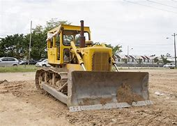
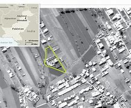
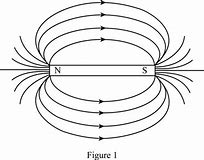
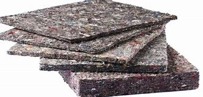
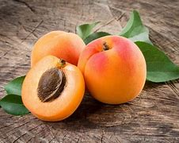
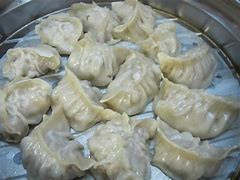

= eco 2020-06-13
:toc:

---

== On every street 词汇解说

(eco 2020-6-13 / China / Urban society: On every street)

China’s Communist Party *worries about* its grassroots  (组织、运动的) 基层 weakness

It *wants to extend* its presence *deeper into* neighbourhoods 街区；城区；（统称）某街区（或城区）的居民;所在地；邻近的地方

Jun 11th 2020 | BEIJING

MANY CHINESE *are familiar with* a poem by Mao Zedong called “Farewell(n.)告别；辞行;再见；再会 to the god of plague （老鼠或昆虫等肆虐造成的）灾害，祸患;瘟疫，鼠疫”. It *was written* in 1958 *to celebrate* the country’s victory over snail(蜗牛) fever 血吸虫病, a disease that *blighted* 损害；妨害；贻害 the lives（life的复数） of many millions of people in China (and *still afflicts* 折磨；使痛苦 thousands). Today that poem *is recalled* by officials in their fight against covid-19, because this, too, *has involved* mobilising(v.)组织；鼓动；动员 citizens on a massive scale, and also to great effect. Life *is gradually returning to normal*, but the pandemic’s impact on the way (urban society *is organised* at the grassroots) *may be* long-lasting. Features of the Mao era *are enjoying a revival* 复兴；再流行.

- blight :  /blaɪt/  v.  [ VN ] to spoil or damage sth, especially by causing a lot of problems 损害；妨害；贻害 +
-> 词源不详，该词来自于农业用语，原指植物叶上的斑点，可能同blemish, 斑点。-ght, 拼写模仿eight, fight, light, night 等。 +
-> His career *has been blighted by injuries*. 他的事业不断受到伤病的困扰。 +
-> an area *blighted by unemployment* 饱受失业之苦的地区 +
image:../../+ img_单词图片/b/blight.jpg[100,100]

Since China *launched* its economic reforms in 1978, two years after Mao’s death, life in urban neighbourhoods *has been transformed*. Housing, once *almost entirely owned by* the state, *has been privatised* 私有化. Many long-established communities *have been scattered* 散开；四散；使分散；驱散 as bulldozers 推土机 *have moved in*. Gated 有门的 compounds 有围栏（或围墙）的场地（内有工厂或其他建筑群）;复合物；混合物;化合物 *have sprung up* 迅速出现；突然兴起, *providing* homes *for* a new middle class. Migrants from the countryside 乡村；农村 *have flooded in* 大量涌入；蜂拥而出, *occupying* run-down (建筑物或地方)破败的；失修的;(商业机构等)衰败的；不景气的 buildings that *have yet to be flattened* （使）变平；把…弄平;摧毁，推倒，弄倒（建筑物、树木等） by developers. Amid this flux  不断的变动；不停的变化, the party *has struggled to maintain* its once ever-watchful 不断地；总是；始终 注意的；警惕的；提防的 presence. Its mobilisation 动员；调动 efforts during the pandemic, however, *have strengthened its resolve*  决心；坚定的信念 to do so, and *taught（teach的过去分词） it* that it can.

- bulldozer => bulldoze原本指的是足以放到一头公牛（bull）的剂量（doze），比喻采用鞭打、枪杀等野蛮手段来阻止黑人参加选举的行为，而bulldozer就是通过暴力威吓手段阻止黑人投票的白人，泛指欺凌者、威吓者。推土机出现后，人们用bulldozer一词来称呼它，因为推土机威力巨大，可以野蛮地推倒一切障碍，特别适合暴力拆迁等场合。 +

- compound : an area surrounded by a fence or wall in which a factory or other group of buildings stands 有围栏（或围墙）的场地（内有工厂或其他建筑群） +
-> a prison compound 监狱场地 +

- *spring up* : to appear or develop quickly and/or suddenly 迅速出现；突然兴起 /spring : 弹簧；发条; 弹性；弹力

- flux : /flʌks/ [ U ] continuous movement and change 不断的变动；不停的变化 / [ Cusually sing.U ] ( technical 术语 ) a flow; an act of flowing 通量；流动 +
=> 来自拉丁语fluere, 流动，词源同fluent. 引申持续流动，改变，变迁。 +

Lockdown in the neighbourhoods, now *[all but 几乎] lifted* 解除，撤销，停止（限制）;（被）提起，举起，抬高，吊起 in most cities, *was not* a matter simply of *telling* residents *to stay at home*. It *involved* deploying armies 大群 of people *to act as* guards, health monitors, helpers for the infirm(a.)（长期）病弱的；年老体弱的;病弱的人；体弱的人  and procurers 拉皮条者; 淫媒者 of supplies 物资采购者. Central(a.)在中心的；中央的;最重要的；首要的；主要的 to these efforts *were* two organisations: residents’ committees 居民委员会 and neighbourhood party committees 社区党委 (their memberships *are* often the same). The “two committees”, as they are often called, *had their heyday* 最为强大（或成功、繁荣）的时期 in the Mao era *as* enforcers 实施者；强制执行者 of the party’s will. Since then they *have become* less visible, *focusing mainly on* registering(v.)登记；注册 new residents, *administering* local clubs, *distributing* welfare payments 福利金支出 and *providing* proof-of-address 住址证明 and other useful documents.

- infirm => in-,不，非，firm,固定的，坚实的。引申词义体弱的，生病的。

- procurer : /prə'kjʊərə/ N a person who procures, esp one who procures women or girls as prostitutes 拉皮条者; 淫媒者 +
=> 来自procure,费力取得，获得，-er,人。来自该词的古词义。

- heyday : /ˈheɪdeɪ/ => 来自感叹词heyda,表示惊叹，惊讶，后拼写俗化为day.引申词义盛世，全盛时期。

But during the height 最佳点；最强点；顶点 of the lockdown, between late January and mid-March, these committees *played a prominent 显眼的；显著的；突出的 role*. Their staff *stood guard* 站岗,放哨 at entrances to housing compounds 住宅区 in China’s more than 100,000 neighbourhoods, *policing* 监督；管制;巡查；维护治安 who could leave or enter. They *supervised*  监督；管理；指导；主管 self-isolators, sometimes *using* webcams and alarms. They *organised* deliveries 传送；递送；交付 of food and other essentials 必不可少的东西；必需品 for residents and *transmitted* the government’s latest instructions via WeChat.

- 他们的工作人员, 在中国10万多个居民区的住宅区入口处站岗.

But 因为；由于；作为…的结果 *with* each neighbourhood *having* only a handful 少数人（或物） of permanent  永久的；永恒的；长久的 staff *to monitor and help* hundreds of people, manpower 劳动力；人手；人力 *was* far from adequate. So the party *called in*  召来，叫来（服务） reinforcements 援军；增援警力, including party members, local officials and volunteers. In many neighbourhoods “temporary party committees” *were created* to oversee(v.)监督；监视 these efforts, *headed by* officials from higher levels of the urban bureaucracy 官僚体制；实行官僚体制的国家. The new committees *established* numerous 众多的；许多的 other bodies: temporary party branches for each neighbourhood “grid” (an area often *comprising* 包括；包含；由…组成;是（某事物的）组成部分；组成；构成 a single residential compound 住宅小区, 有围墙围起来的居民区) and party cells （尤指秘密的）政治小组，基层组织;细胞 for each building.

- comprise : v. ( also be comprised of ) to have sb/sth as parts or members 包括；包含；由…组成 / to be the parts or members that form sth 是（某事物的）组成部分；组成；构成 +
=> com-共同 + -pris-抓住,包含 + -e → 抓到一起 +
-> The committee *is comprised of* representatives from both the public and private sectors. 委员会由政府和私人部门的双方代表组成。  +
-> Older people *comprise a large proportion of* those living in poverty. 在那些生活贫困的人中，老年人占有很大的比例。 +
image:../../+ img_单词图片/c/comprise.jpg[100,100]

The party now *trumpets* 宣扬；鼓吹；吹嘘; 小号；喇叭 this mobilisation *as* evidence of its strength and that of China’s political system. But *it is clear* [from official documents and reports in the party-controlled media] *that* {the party *also sees* `宾` many weaknesses in its grassroots network}. *It was* often the temporary committees *that* got the job done. The neighbourhoods’ existing structures [not only] *lacked* sufficient staff, [but also] clout(n.)影响力；势力;（用手或硬物的）击，打.

- clout : n.  [ U ] power and influence 影响力；势力 / v. [ VN ] ( informal ) to hit sb hard, especially with your hand （尤指用手）猛击，重打 +
=> 词源同clod,clot,cloud.原指大块状的东西。 +

- 但从官方文件和党控制的媒体报道中可以清楚地看到，党也看到了其基层网络的许多弱点。

This *has long been* a worry. In the 1990s, when many state-owned enterprises (which *had once owned* much of urban China’s housing) *closed down*, so too *did* the firms’ party branches. Alongside the neighbourhood party committees, these *had played a vital role* in *maintaining* the party’s grip. Most of the new private firms that began to spring up *did not have* party organisations *embedded* within them. Neither *did* the homeowners’ associations 业主委员会 that *formed* in the middle-class blocks of flats. These associations *interact 交流；沟通；合作;互动 mainly with* the property-management companies 物业管理公司 that *look after* 对…负责；照料；照顾 common areas 公共区域 in their compounds, rather than *with* the old residents’ committees 居委会,居民委员会 (which *are supposed* to be democratically elected(v.), but mostly *are installed* by higher-up 上级；上司；长官 government).

The pandemic(n.)（全国或全球性）流行病；大流行病  *has prompted* debate about *how to give* the neighbourhood committees *more muscle*. State media *quoted* one scholar *as saying that* the party *must “thread”*  穿（针）；纫（针）；穿过 them *together* with landlords’ associations and property-management firms. In recent years the party *has been laying  （尤指轻轻地或小心地）放置，安放，搁; 铺，铺放，铺设（尤指在地板上） the groundwork 基础工作；准备工作 for this* by forming(v.) cells within these groups. The central city of Hefei *wants* at least half of those (*sitting* on landlords’ committees) *to be* party members, according to Legal Daily 法制日报. State media *often use* the term “red property-management” *to refer to* firms that *use* their party cells *to interact with* property owners 业主；产权人 and *try to keep them happy*.

- groundwork : n. *~ (for sth)* work that is done as preparation for other work that will be done later 基础工作；准备工作 +
-> Officials *are laying the groundwork* for a summit conference of world leaders. 官员们正在为世界首脑峰会做准备工作。

-  lay : v. [ usually + adv./prep. ] to put sb/sth in a particular position, especially when it is done gently or carefully （尤指轻轻地或小心地）放置，安放，搁  +
/ [ VN ] to present a proposal, some information, etc. to sb for them to think about and decide on 提出，提交（建议、信息等）  +
/
[ VN ] ( formal ) to put sb/sth in a particular position or state, especially a difficult or unpleasant one 使处于特定状态（尤指困境） +
=> 来自PIE*legh,躺，放置，词源同lie,lair,beleaguer.语法上为lie的宾格动词形式。
-> The floor *was laid with newspaper*. 地板上铺了报纸。 +
-> *to lay a responsibility/burden* on sb 把责任╱重担加于某人身上 +
image:../../+ img_单词图片/l/lay.jpg[100,100]

That is an important aim. `主` *Resolving* local disputes 争论；辩论；争端；纠纷 before they *erupt into* street protests `系` *is* one of the main tasks of the neighbourhood committees. Many such disputes(n.) *involve* property, *including* shoddy 做工粗糙的；粗制滥造的；劣质的;奸诈的；卑鄙的 service by property-management firms. The police *use* the committees *to watch for* 观察等待（某人出现或发生某事） trouble. In recent years they *have installed* officers *as* deputy chiefs 副长官 of many of them. This *has helped* the police *to nip 啃咬；掐；咬住；夹住;快速去（某处）；急忙赶往 problems in the bud* 将…扼杀在萌芽状态；防患于未然, the authorities *claim*.

- shoddy :  /ˈʃɑːdi/ a. ( of goods, work, etc. 商品、工作等 ) made or done badly and with not enough care 做工粗糙的；粗制滥造的；劣质的  +
/ dishonest or unfair 奸诈的；卑鄙的 +
-> shoddy goods 劣质商品 +

- nip : v. *~ (at sth)* to give sb/sth a quick painful bite or pinch 啃咬；掐；咬住；夹住  +
/ *~ (at sth)* ( of cold, wind, etc. 寒气、风等 ) to harm or damage sth 伤害；损害  +
/ [ V + adv./prep. ] ( BrE informal ) to go somewhere quickly and/or for only a short time 快速去（某处）；急忙赶往 +
=> 词源不详，可能来自nib，鸟嘴，喙，引申词义咬，捏，冻伤。 +
-> He winced *as the dog nipped his ankle*. 狗咬了他的脚腕子，疼得他龇牙咧嘴。 +
-> The icy wind *nipped at our faces*. 寒风刺疼了我们的脸。 +
-> He's just *nipped out to the bank*. 他急匆匆去银行了。 +

One idea *is* to promote(v.) the creation of “big party committees” in neighbourhoods. These *would have* a clearer mandate （政府或组织等经选举而获得的）授权; （尤指旧时授予某国对别国或地区的）委任统治权;（政府的）任期 *to wield authority* over other party branches at the same level, including those in firms. Experiments 实验；试验;尝试；实践 with this *have been praised* 表扬；赞扬；称赞 in the party’s press. “A solo 独唱；独奏；独舞；单人表演 *has become* a chorus  歌队，合唱队;合唱曲,” *as* one local government *put 说；表达 it*. Mao *would be proud*.

- mandate => 来自拉丁语mandatum,命令，委托，交付，来自manus,手，词源同manual, -dat,给予，词源同data,date.即交付给某人，引申词义授权，命令等。

- “独唱变成了合唱，”一位当地政府官员如是说。

---

== On every street

(eco 2020-6-13 / China / Street life: Back peddling)

China’s Communist Party worries about its grassroots weakness

It wants to extend its presence deeper into neighbourhoods

Jun 11th 2020 | BEIJING

MANY CHINESE are familiar with a poem by Mao Zedong called “Farewell to the god of plague”. It was written in 1958 to celebrate the country’s victory over snail fever, a disease that blighted the lives of many millions of people in China (and still afflicts thousands). Today that poem is recalled by officials in their fight against covid-19, because this, too, has involved mobilising citizens on a massive scale, and also to great effect. Life is gradually returning to normal, but the pandemic’s impact on the way urban society is organised at the grassroots may be long-lasting. Features of the Mao era are enjoying a revival.

Since China launched its economic reforms in 1978, two years after Mao’s death, life in urban neighbourhoods has been transformed. Housing, once almost entirely owned by the state, has been privatised. Many long-established communities have been scattered as bulldozers have moved in. Gated compounds have sprung up, providing homes for a new middle class. Migrants from the countryside have flooded in, occupying run-down buildings that have yet to be flattened by developers. Amid this flux, the party has struggled to maintain its once ever-watchful presence. Its mobilisation efforts during the pandemic, however, have strengthened its resolve to do so, and taught it that it can.

Lockdown in the neighbourhoods, now all but lifted in most cities, was not a matter simply of telling residents to stay at home. It involved deploying armies of people to act as guards, health monitors, helpers for the infirm and procurers of supplies. Central to these efforts were two organisations: residents’ committees and neighbourhood party committees (their memberships are often the same). The “two committees”, as they are often called, had their heyday in the Mao era as enforcers of the party’s will. Since then they have become less visible, focusing mainly on registering new residents, administering local clubs, distributing welfare payments and providing proof-of-address and other useful documents.

But during the height of the lockdown, between late January and mid-March, these committees played a prominent role. Their staff stood guard at entrances to housing compounds in China’s more than 100,000 neighbourhoods, policing who could leave or enter. They supervised self-isolators, sometimes using webcams and alarms. They organised deliveries of food and other essentials for residents and transmitted the government’s latest instructions via WeChat.

But with each neighbourhood having only a handful of permanent staff to monitor and help hundreds of people, manpower was far from adequate. So the party called in reinforcements, including party members, local officials and volunteers. In many neighbourhoods “temporary party committees” were created to oversee these efforts, headed by officials from higher levels of the urban bureaucracy. The new committees established numerous other bodies: temporary party branches for each neighbourhood “grid” (an area often comprising a single residential compound) and party cells for each building.

The party now trumpets this mobilisation as evidence of its strength and that of China’s political system. But it is clear from official documents and reports in the party-controlled media that the party also sees many weaknesses in its grassroots network. It was often the temporary committees that got the job done. The neighbourhoods’ existing structures not only lacked sufficient staff, but also clout.

This has long been a worry. In the 1990s, when many state-owned enterprises (which had once owned much of urban China’s housing) closed down, so too did the firms’ party branches. Alongside the neighbourhood party committees, these had played a vital role in maintaining the party’s grip. Most of the new private firms that began to spring up did not have party organisations embedded within them. Neither did the homeowners’ associations that formed in the middle-class blocks of flats. These associations interact mainly with the property-management companies that look after common areas in their compounds, rather than with the old residents’ committees (which are supposed to be democratically elected, but mostly are installed by higher-up government).

The pandemic has prompted debate about how to give the neighbourhood committees more muscle. State media quoted one scholar as saying that the party must “thread” them together with landlords’ associations and property-management firms. In recent years the party has been laying the groundwork for this by forming cells within these groups. The central city of Hefei wants at least half of those sitting on landlords’ committees to be party members, according to Legal Daily. State media often use the term “red property-management” to refer to firms that use their party cells to interact with property owners and try to keep them happy.

That is an important aim. Resolving local disputes before they erupt into street protests is one of the main tasks of the neighbourhood committees. Many such disputes involve property, including shoddy service by property-management firms. The police use the committees to watch for trouble. In recent years they have installed officers as deputy chiefs of many of them. This has helped the police to nip problems in the bud, the authorities claim.

One idea is to promote the creation of “big party committees” in neighbourhoods. These would have a clearer mandate to wield authority over other party branches at the same level, including those in firms. Experiments with this have been praised in the party’s press. “A solo has become a chorus,” as one local government put it. Mao would be proud.

---

== Back peddling 词汇解说

(eco 2020-6-13 / China / Street life: Back peddling)

China *once banned* street vendors 小贩；摊贩. Now it *welcomes* them

Some cities, however, *are not* so sure

Jun 11th 2020 | SUZHOU

IN A COUNTRY of high-tech factories and giant state-owned firms, you *might not expect* street hawkers *to attract much attention*. But in China these days, `主` people like Shui Jin, an old lady *pedalling* 骑自行车, 踩着踏板 a wooden cart 手推车；手拉车 *laden 载满的；装满的 with* apricots 杏子；杏 and cherries *through* the narrow lanes （乡间）小路;小巷；胡同；里弄 of Suzhou, an eastern city, `系` *are* in the spotlight 聚光灯;媒体和公众的注意. Both of her daughters-in-law 儿媳妇 recently *lost their jobs*, among the tens of millions in China *hurt* by the coronavirus slump 重重地坐下（或倒下）;（价格、价值、数量等）骤降，猛跌，锐减. Her family *needs the money* (she *can scrape 艰难取得；勉强获得 together* 勉强凑集；费力聚拢；艰难筹措). `主` Whether the country *needs* her on the streets `系` *has become* a matter for debate.

- cart : a vehicle with two or four wheels that is pulled by a horse and used for carrying loads （两轮或四轮）运货马车 / ( also hand·cart ) a light vehicle with wheels that you pull or push by hand 手推车；手拉车 +

-  apricot :  /ˈæprɪkɑːt,ˈeɪprɪkɑːt/  => 该词的字面意思是：早熟的水果。 词根词缀：a- "the" (阿拉伯语定冠词“al”的变体，相当于英语中的定冠词“the”) + pri- "before" (前缀“pre-”的元音变体) + cot- "ripe" (词根“coc-”的变体)。所以，其字面意思就是：the early-ripening (fruit)，即：早熟的水果。 其名称源于最初“杏”被认为是另外一种桃子，只是它比其它种类的桃子成熟得早。于是就有了这个怪异的名称，而“杏”这种水果本身最初是由中国传到西方的。 +

- scrape : to remove sth from a surface by moving sth sharp and hard like a knife across it 刮掉；削去 / to manage to win or to get sth with difficulty 艰难取得；勉强获得 +
-> She *scraped the mud off her boots*. 她刮掉了靴子上的泥。 +
-> The team *scraped a narrow victory* last year. 这支队去年险胜。 +
*scrape through | scrape through sth* : to succeed in doing sth with difficulty, especially in passing an exam 艰难完成；勉强通过（考试） +
-> I might *scrape through the exam* if I'm lucky. 要是走运的话，我也许能勉强及格。 +
image:../../+ img_单词图片/s/scrape.jpg[100,100]

- *scrape sth together/up* : to obtain or collect together sth, but with difficulty 勉强凑集；费力聚拢；艰难筹措 +
-> We managed *to scrape together eight volunteers*. 我们好不容易凑齐八名志愿者。

- 这个国家是否需要她走上街头, 已经成为一个值得讨论的问题。

For years, municipal 市政的；地方政府的 officials *pushed out* 驱逐；开除 hawkers, *trying to tidy up* 收拾妥；整理好 the colourful hubbub 喧闹声；嘈杂声;喧闹；骚乱；混乱 that once *characterised* 是…的特征；以…为典型 China’s cities. In the name of “*civilising*” 教化；开化；使文明；使有教养 urban life, they *wanted to see* steamed 水蒸气；蒸汽 dumplings (小面团；汤团；饺子)  蒸饺 and plastic toys *sold* inside shopping malls, *not* from the back of carts. On June 1st Li Keqiang, the prime minister, *seemed* to signal(v.)发信号；发暗号；示意;表达；表示出；显示出 a change, *declaring* that street vendors *were vital to* the economy. “[Only when the people *are* in good shape 状况；情况] *can* the nation *be* in good shape,” he said.

- hubbub : /ˈhʌbʌb/ n. a situation in which there is a lot of noise, excitement and activity 喧闹；骚乱；混乱 +
=> 拟声词，喧闹声。 +
-> the hubbub of city life 闹哄哄的城市生活

- dumpling : a small ball of dough (= a mixture of flour, fat and water) that is cooked and served with meat dishes 小面团；汤团；饺子 +
=> dump堆,团 + -ling名词词尾,小

- steamed dumpling 蒸饺 +

That *generated* much buzz 嗡嗡声；蜂鸣声;唧唧喳喳的谈话声;（愉快、兴奋或成就的）强烈情感 about the revival of China’s “street-stall economy”, as it has been called. At least 27 provinces and cities *said* they *would welcome* hawkers. Chengdu, a bustling 繁忙的；熙熙攘攘的 city in Sichuan province in the south-west, *was seen as* a shining example. Firms there *started* setting up street stalls 货摊，摊位，售货亭（尤指集市上的） in March, *creating* more than 100,000 jobs, the local government *says*. China *certainly needs to boost* employment 就业. Between 60m and 100m people -- perhaps as many as 20% of non-farm workers -- *were out of work* in April, according to Ernan Cui of Gavekal, a research firm.

- bustling : /ˈbʌslɪŋ/ a. *~ (with sth)* full of people moving about in a busy way 繁忙的；熙熙攘攘的 +
=> 来自bust, 同burst, 爆发。

In small towns, officials *are excited* 使激动；使兴奋 about the street-stall idea. For instance, Zhangye, a poor western town, *says* it *will create spaces for* 4,120 hawkers in its markets. But for Ms Shui, the fruit vendor in Suzhou, change *has not been radical* 根本的；彻底的；完全的;激进的；极端的. Last year `主` the officers who *enforce* urban rules `谓` *would often seize her cart* and *fine* 处…以罚金 her. Now they *just tell her* to move on 让（某人）离开（事故现场等）.

- *move on (to sth)* : to start doing or discussing sth new 开始做（别的事）；换话题 +
-> I've been in this job long enough -- it's time *I moved on*. 这工作我已经干得够久了 +
-> Can we *move on to the next item* on the agenda? 我们可以接着讨论下一项议程吗？

- *move sb on* : ( of police, etc. 警察等 ) to order sb to move away from the scene of an accident, etc. 让（某人）离开（事故现场等）

Officials in China’s richest cities *are afraid that* encouraging street vendors *will lead to a mess*. “It *is not* for Beijing,” *declared* the capital 首都；国都 city’s main newspaper. Shanghai *has made it clear that* it *will not allow* vendors *to set up stalls willy-nilly*  不管愿意不愿意；无论想要不想要;随意地；乱糟糟地. Licences 许可证，执照 *must be obtained* and, for those selling food, hygienic 卫生的 standards 卫生标准 *met*.

- willy-nilly : /ˌwɪli ˈnɪli/ ad.  whether you want to or not 不管愿意不愿意；无论想要不想要 / in a careless way without planning 随意地；乱糟糟地 +
=> 缩写自短语 will I,nill i.nill,不想，不愿，词源同 not,nullify.
-> *She was forced willy-nilly* to accept the company's proposals. 她被迫无奈接受了公司的提议。 +
-> Don't *use your credit card willy-nilly*. 别拿着你的信用卡随便花。

*Can* the stalls, such as they are, *really help* the economy? Some investors 投资者；投资机构 *see a business opportunity*. `主` The price of shares in Wuling Motors 五菱汽车, which *makes* a new van 客货车；厢式送货车 that *can double as* 兼任；兼作 a mobile kiosk （出售报纸、饮料等的）小亭；售货亭；报刊亭, `谓` *has doubled* since Mr Li’s comments. Other firms that *might benefit*, including Yindu Kitchen 银都厨房, which *makes* portable  便携式的；手提的；轻便的 cooking equipment, also *saw* their shares *surge*.

- *double as sth | double up as sth* : to have another use or function as well as the main one 兼任；兼作 +
-> The kitchen *doubles as* a dining room. 这厨房兼做饭厅。

- kiosk : /ˈkiːɑːsk/ => 来自土耳其语koshk,亭子，凉亭。进入英语用于指报刊亭，售货亭等。 +

- mobile kiosk +

The direct impact on job creation, alas （表示悲伤或遗憾）哎呀，唉, *is unlikely to be* so spectacular 壮观的；壮丽的；令人惊叹的. The demise(n.) 终止；失败；倒闭 of street stalls in recent years *is* only partially the result of government restrictions. It *also reflects* the rise of e-commerce platforms, where products *are* often both better and cheaper. Whether online or on the street, the main concern for vendors now *is* weak demand. On one historic street in Suzhou, a 62-year-old woman *walks back and forth* with flashing glow-sticks for sale. With few tourists, there are few buyers. She *has cut* her asking price 要价；索价 *from* ten yuan ($1.40) *to* five.

- demise :  /dɪˈmaɪz/  n. the end or failure of an institution, an idea, a company, etc. 终止；失败；倒闭 / ( formal ) ( humorous ) death 死亡；逝世；一命呜呼 +
=> de-, 向下，离开。-mis, 送出，词源同mission. 委婉语。 +
-> his *imminent/sudden/sad demise* 他死到临头；他的猝死；他悲惨的死亡

- 小贩们最担心的是疲软的消费需求.

But the street stalls *do dovetail 吻合；与…吻合 with* a separate 单独的；独立的；分开的 policy, *launched* last year, *to develop* China’s night-time(n.)夜间；黑夜；夜晚 economy. Suzhou and Shanghai, among other cities, *have recently opened* glitzy 盛大的；浮华的 outdoor night markets. Though *far more* orderly(a.)整洁的；有秩序的；有条理的 and corporate(a.)组成公司（或团体）的；法人的 *than* the hawkers’ free-for-all 不加管制；自由放任 of old, they *are* lively 精力充沛的；生气勃勃的；活跃热情的. And they *help* the government *to deliver* 递送；传送；交付；运载 an important message. Officials *cautiously 慎重地，谨慎地 avoid* proclaiming(v.)宣布；宣告；声明 that covid-19 *has been beaten* in China. But the reinvigoration 重新振作 of street life *looks like* a declaration of victory.

- dovetail : /ˈdʌv-teɪl/ v. *~ (sth) (with/into sth)* ( formal ) if two things dovetail or if one thing dovetails with another, they fit together well 吻合；与…吻合 / n. ( also ˌdovetail ˈjoint ) a joint for fixing two pieces of wood together 鸠尾榫（接头） +
=> 因这种工具形如鸽尾而得名。 +
-> My plans *dovetailed nicely with hers*. 我的计划与她的计划正好吻合。 +
image:../../+ img_单词图片/d/dovetail.jpg[100,100]

- glitzy : /ˈɡlɪtsi/ ADJ Something that is glitzy is exciting and attractive in a showy way. 浮华的 +
->  ...Aspen, Colorado, one of *the glitziest ski* resorts in the world. ...卡罗拉多的阿斯本，世界上最奢华的滑雪场之一。

- 但这些街边小摊, 确实与中国去年推出的另一项发展夜间经济的政策相吻合。苏州、上海和其他一些城市最近都开设了浮华的露天夜市。尽管比那些叫卖的老年人更有秩序，更公司化，但他们也很有活力。他们帮助政府传递一个重要的信息。官员们谨慎地避免宣布中国已经战胜了covid-19。但街头生活的复兴看起来就像是战胜疫情后的宣言。

Late(ad.)临近日暮；接近午夜 one recent evening in Suzhou, thousands of people *flocked 群集；聚集；蜂拥 to* its official night market. Most *were not wearing* face masks, a sight unthinkable just a month ago. “I *was cooped up* 把…关（或禁锢）起来；拘禁 at home for a long time,” says Cao Yunqiang, 19, *visiting* from Henan province, further inland. “Things *aren’t fully back to normal*, but it’s the right time *to come out* and *have some fun*.”

- late : ad. near the end of the day 临近日暮；接近午夜 +
-> There's a good film *on late*. 深夜有一场好电影。 +
-> *Late that evening*, there was a knock at the door. 那天深夜，有人敲过门。 +
-> Share prices fell early on but rose again *late in the day*. 那天股票价格起先跌了，临近收盘时又涨了。

---

== Back peddling

China once banned street vendors. Now it welcomes them

Some cities, however, are not so sure

Jun 11th 2020 | SUZHOU

IN A COUNTRY of high-tech factories and giant state-owned firms, you might not expect street hawkers to attract much attention. But in China these days, people like Shui Jin, an old lady pedalling a wooden cart laden with apricots and cherries through the narrow lanes of Suzhou, an eastern city, are in the spotlight. Both of her daughters-in-law recently lost their jobs, among the tens of millions in China hurt by the coronavirus slump. Her family needs the money she can scrape together. Whether the country needs her on the streets has become a matter for debate.

For years, municipal officials pushed out hawkers, trying to tidy up the colourful hubbub that once characterised China’s cities. In the name of “civilising” urban life, they wanted to see steamed dumplings and plastic toys sold inside shopping malls, not from the back of carts. On June 1st Li Keqiang, the prime minister, seemed to signal a change, declaring that street vendors were vital to the economy. “Only when the people are in good shape can the nation be in good shape,” he said.

That generated much buzz about the revival of China’s “street-stall economy”, as it has been called. At least 27 provinces and cities said they would welcome hawkers. Chengdu, a bustling city in Sichuan province in the south-west, was seen as a shining example. Firms there started setting up street stalls in March, creating more than 100,000 jobs, the local government says. China certainly needs to boost employment. Between 60m and 100m people—perhaps as many as 20% of non-farm workers—were out of work in April, according to Ernan Cui of Gavekal, a research firm.

In small towns, officials are excited about the street-stall idea. For instance, Zhangye, a poor western town, says it will create spaces for 4,120 hawkers in its markets. But for Ms Shui, the fruit vendor in Suzhou, change has not been radical. Last year the officers who enforce urban rules would often seize her cart and fine her. Now they just tell her to move on.

Officials in China’s richest cities are afraid that encouraging street vendors will lead to a mess. “It is not for Beijing,” declared the capital city’s main newspaper. Shanghai has made it clear that it will not allow vendors to set up stalls willy-nilly. Licences must be obtained and, for those selling food, hygienic standards met.

Can the stalls, such as they are, really help the economy? Some investors see a business opportunity. The price of shares in Wuling Motors, which makes a new van that can double as a mobile kiosk, has doubled since Mr Li’s comments. Other firms that might benefit, including Yindu Kitchen, which makes portable cooking equipment, also saw their shares surge.

The direct impact on job creation, alas, is unlikely to be so spectacular. The demise of street stalls in recent years is only partially the result of government restrictions. It also reflects the rise of e-commerce platforms, where products are often both better and cheaper. Whether online or on the street, the main concern for vendors now is weak demand. On one historic street in Suzhou, a 62-year-old woman walks back and forth with flashing glow-sticks for sale. With few tourists, there are few buyers. She has cut her asking price from ten yuan ($1.40) to five.

But the street stalls do dovetail with a separate policy, launched last year, to develop China’s night-time economy. Suzhou and Shanghai, among other cities, have recently opened glitzy outdoor night markets. Though far more orderly and corporate than the hawkers’ free-for-all of old, they are lively. And they help the government to deliver an important message. Officials cautiously avoid proclaiming that covid-19 has been beaten in China. But the reinvigoration of street life looks like a declaration of victory.

Late one recent evening in Suzhou, thousands of people flocked to its official night market. Most were not wearing face masks, a sight unthinkable just a month ago. “I was cooped up at home for a long time,” says Cao Yunqiang, 19, visiting from Henan province, further inland. “Things aren’t fully back to normal, but it’s the right time to come out and have some fun.”

