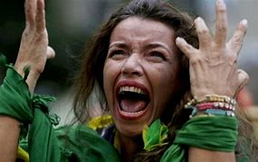
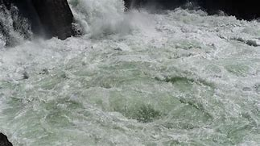
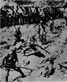
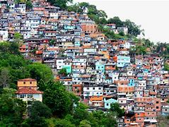
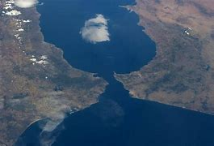
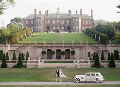

= eco 2020-06-13
:toc:

---

== So other people would be also free 词汇解说

(eco 2020-6-13 / International / Black Lives Matter: So other people would be also free)

The killing of George Floyd *has sparked* global soul-searching 反省；内省

Protests *have broken out* in dozens of countries

Jun 11th 2020 | AMSTERDAM, JOHANNESBURG, MELKSHAM, MEXICO CITY, PARIS AND SÃO PAULO

LOCAL POLICE *arrested* Giovanni López, a 30-year-old Mexican bricklayer 砌砖工；瓦工, in Ixtlahuacán de los Membrillos, a town near Guadalajara, on May 4th. `主` Why they *detained* him `系` *is* unclear. The next morning his family *found* him *dead* in a nearby hospital, with bruises on his head and a bullet in his ankle. His name *did not go viral* (病毒的；病毒性的；病毒引起的)像病毒般扩散;走红; no politician *lamented* 对…感到悲痛；痛惜；对…表示失望 his death.

- bricklayer +
image:../../+ img_单词图片/b/bricklayer.jpg[100,100]

Christian López, who *filmed* his brother’s arrest, *stayed silent* at first. He *would later claim that* `主` messengers 信使 (*acting on behalf of* the local mayor) `谓` *threatened* to kill(v.) his family if the footage  (描述某一事件的) 片段镜头 *went public*. But then *came* the killing of George Floyd in Minneapolis, and the anti-police, anti-racism backlash that *has swept* the world. “I *saw* it and *thought*, this *is* the same thing that *happened to* my brother,” he says. On June 1st he *went to* the press 记者；新闻工作者；新闻界;报章杂志；报刊；印刷媒体.

The chief prosecutor 公诉人；检察官 in the state of Jalisco 墨西哥太平洋岸的一个州, where the death *occurred*, *faced* a barrage 接二连三的一大堆（质问或指责等）; 火力网；弹幕射击；（尤指）掩护炮火 of questions. On June 4th `主` a march 示威游行；抗议游行 in Guadalajara, marking 纪念；庆贺 a month since Giovanni’s death, `谓` *turned* violent. `主` Calls (*demanding* #Justiciaparagiovanni) `谓` *increased*. The three officers connected with Giovanni’s death *were arrested*. The mayor’s role *is* under investigation. Protests *have since spread to* Tijuana and the state of Veracruz *against* two local pre-Floyd police killings, of Oliver López (no relation) in March and Carlos Andrés Navarro in May.

- barrage : n.  /bəˈrɑːʒ/  [ Cusually sing. ] the continuous firing of a large number of guns in a particular direction, especially to protect soldiers while they are attacking or moving towards the enemy 火力网；弹幕射击；（尤指）掩护炮火 +
/ [ sing. ] *~ (of sth)* a large number of sth, such as questions or comments, that are directed at sb very quickly, one after the other, often in an aggressive way 接二连三的一大堆（质问或指责等） +
/ [ C ] a wall or barrier built across a river to store water, prevent a flood, etc. 堰；水坝；拦河坝 +
=> 词源同bar, 杆，棍，原指用杆棍搭建的拦河坝，阻挡洪水，火力网是后来义。 +
image:../../+ img_单词图片/b/barrage.jpg[100,100]

Mr Floyd’s death *has provoked protests* around the world. `主` {Why his death *set off* 引发；激起 a global movement *whereas* （用以比较或对比两个事实）然而，但是，尽管 `主` countless 无数的；数不胜数的；数不尽的 other unjust killings `谓` *did not*} `系` *is* hard to say. Mr Floyd was American, of course, and the world *pays more attention to* the United States *than* to Mexico or any other country. His death *was filmed* in excruciating 极痛苦的；极坏的；糟糕透顶的 detail. It *happened* at a time when billions of people *were cooped up* and *frustrated* at home, *thanks to* covid-19. Lockdowns *have surely made* the global mood *more combustible* 易燃的；可燃的.

- 为什么他的死引发了一场全球性的运动，而其他无数的不公正的杀戮却没有做到这一点，这个原因很难说。

But the important points *are that* police brutality(n.)无情；残忍；暴行 *is* rife(a.)（坏事）盛行，普遍 in many countries and minorities 少数民族；少数族裔 *fear* discrimination everywhere. That *is* why Mr Floyd’s fate *resonated* 使产生联想；引起共鸣；和…的想法（或观念）类似;产生共鸣；发出回响；回荡. Just as women on every continent *found* common cause 原因；起因;（支持或为之奋斗的）事业，目标，思想 in the #MeToo movement, despite the range （变动或浮动的）范围，界限，区间;类；种 of their experiences, so protesters around the world *have united around* the cry 口号 (that black lives *matter*).

- rife :  /raɪf/ a. if sth bad or unpleasant is rife in a place, it is very common there （坏事）盛行，普遍 / *~ (with sth)* full of sth bad or unpleasant 充斥，充满（坏事） +
=> 词源同 river,rift.通常用于形容坏事的盛行。 +
-> It is a country *where corruption is rife*. 这是个腐败成风的国家。

- resonate =>  /ˈrezəneɪt/ re-,向后，往回，-son,声音，词源同 sound,sonorous.即回声，引申词义共鸣，回响。

- cause :   /kɔːz/  n. [ C ] the person or thing that makes sth happen 原因；起因 / [ C ] an organization or idea that people support or fight for （支持或为之奋斗的）事业，目标，思想 +
-> Drinking and driving is *one of the most common causes* of traffic accidents. 酒后驾车是导致交通事故最常见的原因之一 +
-> *a good cause* (= an organization that does good work, such as a charity) 崇高的事业

- 但重要的一点是，警察暴行在许多国家很普遍，而且少数民族害怕处处受到歧视。这就是为什么弗洛伊德的命运引起了共鸣。正如世界各地的妇女在“我也是”运动中找到了共同的目标，尽管她们的经历各不相同，世界各地的抗议者也团结在一起，呼吁黑人的生命很重要。

[At their simplest] the protests *mark*  是…的迹象；成为…的征兆；表明 people’s antipathy(n.)厌恶；反感 towards cops 警察(复数) who *beat or kill* those whom they *vowed to protect*. Protests *have spread throughout* Mexico, where nine in ten homicides(n.)（蓄意）杀人罪 *go unpunished*(a.)未受惩罚的 and many police *moonlight*(v.)（暗中）兼职，从事第二职业 for the other side. `主` The country’s most notorious 声名狼藉的；臭名昭著的 unsolved crime, the disappearance and presumed 推测;假定 (某事实) 为真 murder in 2014 of 43 student teachers in the town of Ayotzinapa, `谓` *is thought to have been orchestrated*  精心安排；策划；密谋;编配（或创作管弦乐曲） by police *paid by* drug gangs.

- 简单地说，抗议活动表达了人们对警察的反感，这些警察殴打或杀害了他们本来发誓要保护的人。

Some of the global anger *is directed 把…对准（某方向或某人） at* the United States. Protests *have erupted* outside American embassies from Spain to South Africa. Nana Akufo-Addo, Ghana’s president, *tweeted that*: “Black people, the world over, *are* shocked and distraught(a.)心烦意乱的；心急如焚的；发狂的.” President Cyril Ramaphosa of South Africa *said*: “The killing of George Floyd *has opened up* deep wounds for us all.”

- distraught : /dɪˈstrɔːt/ a. extremely upset and anxious so that you cannot think clearly 心烦意乱的；心急如焚的；发狂的 +
=> 来自distract, 分心。-ght,拼写模仿caught. 即分心的，发狂的。 +

Many protesters *would agree*. But many also *seethe 强压怒火；生闷气;怒火中烧 that* {their leaders *condemn* police *abuse* in Minnesota /while *allowing or even encouraging it* at home}. America’s police *kill* more people than those of any other rich democracy, but cops in some developing countries *are* much more lethal 致命的；可致死的;危害极大的；破坏性极大的 (see chart 1). So plenty of the protests around the world *are* about local abuses as well.

- seethe : v.  /siːð/ *~ (with sth) | ~ (at sth)* to be extremely angry about sth but try not to show other people how angry you are 强压怒火；生闷气 / ( formal ) ( of liquids 液体 ) to move around quickly and violently 翻滚；翻腾；涌动 +
=> 来自 PIE*seut,煮沸， 词源同 sodden,sutler.后基本词义完全由 boil 取代，引申比喻词义愠怒，强压怒火等。 +
-> The grey ocean *seethed* beneath them. 灰蒙蒙的大海在他们下面翻滚。 +

- lethal : a.  causing or able to cause death 致命的；可致死的 SYN deadly fatal  / ( informal ) causing or able to cause a lot of harm or damage 危害极大的；破坏性极大的 +
=> 来自拉丁语letum,死亡，词源不详。可能同Lethe,冥河，地狱，引申词义死去的，致命的。 +
-> a lethal dose of poison 毒药的致死剂量 +
-> You and that car -- it's *a lethal combination*! 你和那辆车 -- 真是一对杀手！

- 世界各地的许多抗议活动, 也同样谴责(本国的)当地警察滥用职权。

On June 8th in Mathare, a poor part of Nairobi 内罗比（肯尼亚首都）, about 200 Kenyans 肯尼亚人 *marched* against police atrocities(n.)（尤指战争中的）残暴行为. [Since a covid-19 curfew 宵禁令；宵禁时间 *was introduced* in Kenya’s capital on March 27th] police *have killed* 15 people, according to the country’s Independent Police Oversight Authority 监督机构;监管局. “The poor people of this country *have come together* to say no to police killings... and also *stand [in solidarity] with* the global protest *against* police excesses 超过；过度；过分; 放肆行为；越轨行为,” Juliet Wanjera, a member of the Mathare Social Justice Centre, an NGO, *has told* journalists.

-  atrocity : /əˈtrɑːsəti/ n. [ Cusually pl.U ] a cruel and violent act, especially in a war （尤指战争中的）残暴行为 +
=>  atroc（可怕的、残忍的）+ity（名词后缀）→暴行 / 来自PIE*火。-oc, 同词根op, 眼睛，见optic, 光学的。指发狂，暴行，眼睛射出火。 +

- curfew : /ˈkɜːfjuː/ 宵禁令；宵禁时间 => 来自古法语cuevrefeu, 来自cuevr, 同cover,遮盖，feu, 同focus, 火，火炉，焦点。

Since 2012 there *have been* more than 40,000 complaints against the South African Police Service for alleged （未提出证据）断言，指称，声称 crimes including rape and murder, with just 531 convictions(n.)判罪；定罪；证明有罪. Security forces *have killed* at least 11 people during South Africa’s lockdown, in place since March 27th, and more than 200,000 *have been arrested*. Mr Ramaphosa *has said [merely 仅仅；只不过] that* authorities *have been guilty(a.) of* 犯了罪；有过失的；有罪责的 “over-enthusiasm”.

That *will not wash with* （解释、借口等）对某人来说站不住脚，令某人不能接受 many South Africans. The killing on April 10th of Collins Khosa, a 40-year-old man from Alexandra, a township （旧时南非的）黑人城镇，黑人居住区;镇区（美国和加拿大县以下一级的地方政府） in Johannesburg, by soldiers, *has prompted* particular outrage 愤怒；义愤；愤慨. According to his family, Mr Khosa *was targeted* for *drinking a beer* even though he was on his own property. (Buying alcohol *was illegal* in April and May, *as* per lockdown regulations, but *drinking it* was not.)

- *sth wont/doesnt wash (with sb)* : used to say that sb's explanation, excuse, etc. is not valid or that you/sb else will not accept it （解释、借口等）对某人来说站不住脚，令某人不能接受 +
-> That excuse *simply （强调某说法）确实，简直 won't wash with me*. 那种托词根本不能令我信服。

- 根据禁闭规定，4月和5月买酒是违法的，但喝酒不是。

Some analysts 分析者；化验员;分析人士 *worry that* police abuse in America *may make it easier* for others *to follow suit* 跟着某人做；仿效某人；照着做;跟牌（跟着别人出同花色的牌）. “It *will certainly be very easy* for leaders in Africa, those with their own dictatorial 独裁的；专政的 tendencies 倾向；偏好；性情; 趋势；趋向, *to justify* 证明…正确（或正当、有理）;对…作出解释；为…辩解（或辩护） future behaviour by *referencing* 参考；查询；查阅 the actions of the US administration in the last few weeks,” *argues* Idayat Hassan of the Centre for Democracy and Development, a think-tank in Abuja, Nigeria. Police brutality 残忍; 野蛮; 暴虐行为 in developing countries *rarely prompts* a global reaction. The killing (by Zimbabwean security forces) of 17 protesters in January 2019 *did not lead to* mass protests elsewhere.

- 对于那些有独裁倾向的非洲领导人来说，参照美国政府过去几周的行动，肯定很容易为其未来的暴力行为做辩护。

In the state of Rio de Janeiro 里约热内卢（巴西港市，州名） (population 6.3m), police *killed* 1,810 people last year, nearly twice as many as in the United States (population 328m). Police *say* most of the dead *are* gunmen 持枪歹徒；持枪杀人者 from favelas （巴西城市或边缘的）棚户区，贫民窟, informal settlements （尤指拓荒安家的）定居点 that *are often controlled* by criminals. But watchdogs （监督公司活动及监护人们权利的）监察人，监察团体 *point to* a rise in extrajudicial  未按法律程序的；法庭以外的 killings, including massacres of more than ten people, *fuelled* 给…提供燃料;增加；加强；刺激 by warlike 好战的；好斗的；尚武的 police operations, sometimes with snipers 狙击手 in helicopters. `主` Images of smiling children killed by police `谓` all(ad.)很；十分；非常 too often *appear* on people’s televisions. They *include* eight-year-old Agatha, *shot* by a stray 走失的；无主的;零星的；孤立的；离群的；走散的 bullet 流弹 last September while *riding in a van* 客货车；厢式送货车;面包车（通常为12座左右） with her mother, and 14-year-old João Pedro, *killed* in a botched （尤指工作）一团糟的;笨拙地弄糟 police raid 突然袭击 last month.

- favela :  /fæˈvelə/  n. ( from Portuguese ) a poor area in or near a Brazilian city, with many small houses that are close together and in bad condition （巴西城市或边缘的）棚户区，贫民窟 +
=> 来自葡萄牙语，原指巴西里约热内卢的贫民窟。其本义为一种豆子树，词源同fava. 原贫民窟的建立者，一群无家可归的退役老兵因为对这种树的深厚感情，用来命名他们的新居住区。 +

- sniper :  /ˈsnaɪpər/ 狙击手 +
=> snipe [snaɪp] n.鹬鸟，感觉异常灵敏，所以很不好捉到，即使步枪发明后，枪手也需要隐蔽的很好才可能不被发现，所以sniper狙击手（猎捕snipe之人），多单独活动，用树枝和山石等来隐蔽。

- snipe +
image:../../+ img_单词图片/s/snipe.jpg[100,100]

-  all  :( informal ) very 很；十分；非常 +
-> She was *all excited*. 她非常激动。 +
-> Now don't get *all upset about it*. 别再为那件事那么难过了。

- botch : /bɑːtʃ/ v. [ VN ] *~ sth (up)* ( informal ) to spoil sth by doing it badly 笨拙地弄糟 +
=> 词源同bodge (粗制滥造；拙劣地修补).
-> He *completely botched up* the interview. 他面试表现得糟透了。

- 人们的电视上, 经常出现被警察杀害的微笑着的孩子的画面。

Brazilians in more than ten cities *took to （尤指为逃避危险）逃往，躲到 the streets* on June 7th *to mourn* （因失去…而）哀悼，忧伤 their deaths and *to protest against* the government of Jair Bolsonaro, a populist 平民主义者;民粹主义；民意论 who *campaigned* 参加运动，领导运动（如为实现政治变革或赢得竞选胜利） on promises *to give* immunity(n.)受保护；豁免；免除 *to* police (who *kill*). He *said last year that* a bill to this effect *would cause criminals to “die* in the streets *like* cockroaches 蟑螂”. Congress *rejected* the measure, but Brazil’s trigger-happy 以开枪为乐的；好斗的；爱动武的；动辄开枪的 police *are rarely prosecuted* 起诉；控告；检举. Still, on June 5th a Supreme Court judge *banned* most police operations in favelas for the remainder 其他人员；剩余物；剩余时间 of the pandemic.

- *take to sth* :  [无被动态] to go away to a place, especially to escape from danger （尤指为逃避危险）逃往，躲到 +
-> The rebels *took to the hills*. 反叛者躲进山里。

- 6月7日，十多个城市的巴西人走上街头, 哀悼他们的死亡，并抗议Jair Bolsonaro的政府，这位民粹主义者(即Jair Bolsonaro)在竞选中承诺给予杀人警察豁免权。他去年曾说, 这样的法案能让罪犯“像蟑螂一样死在街上”。国会否决了这项措施，但是巴西好开枪的警察很少被起诉。尽管如此，6月5日，最高法院的一名法官, 禁止了在疫情的剩余时间里, 大多数警察在贫民窟的行动。

Of the 6,220 people *killed* by Brazil’s police in 2018, three out of four *were* black. In Indonesia, #BlackLivesMatter *has found* new relevance 相关性;关联 as #PapuanLivesMatter. Indonesia *runs* 经营; 管理 half of the island of New Guinea 新几内亚（澳大利亚北方岛屿）, and *controls it* almost *as if* it *were* an occupying power 占领国. Papuans  巴布亚人 -- whose skin *is* darker than that of other Indonesians -- *face* bleak economic prospects and violence at the hands of security forces.

- relevance : N-UNCOUNT Something's *relevance to* a situation or person is its importance or significance in that situation or to that person. 相关性 +
->  Politicians' private lives *have no relevance to* their public roles. 政治家的私生活与他们的公众角色没有相关性。

- 印度尼西亚控制着新几内亚岛的一半，几乎像占领国一样控制着它。

In 2019 a Papuan student dormitory 集体宿舍；学生宿舍 in Surabaya in eastern Java *was besieged* by a mob *claiming* its inhabitants 居民 *had thrown* the national flag *into* a gutter 路旁排水沟；阴沟. Some *taunted* 辱骂；嘲笑；讽刺；奚落 them *as* “monkeys”. Rather than *dispersing* （使）分散，散开；疏散；驱散 the mob, riot police *stormed* 突袭；攻占;气呼呼地疾走；闯；冲 the dorm with tear-gas and *arrested* 43 Papuans. That and similar actions in other cities *were* the catalyst 催化剂; 促使变化的人；引发变化的因素  last summer *for* huge  巨大的；极多的；程度高的 demonstrations 集会示威；游行示威 by young Indonesians *in support of* Papuans. [In recent days] calls(n.) *have grown* for Indonesians *to denounce* 谴责；指责；斥责 the discrimination (that Papuans *suffer*).

- gutter : [ C ] a long curved channel made of metal or plastic that is fixed under the edge of a roof to carry away the water when it rains 檐沟；天沟  +
/ [ C ] a channel at the edge of a road where water collects and is carried away to drains 路旁排水沟；阴沟 +
/ *the gutter* [ sing. ] the bad social conditions or low moral standards sometimes connected with the lowest level of society 恶劣的社会环境；道德沦落的社会最低阶层 +
image:../../+ img_单词图片/g/gutter.jpg[100,100]

- taunt /tɔːnt/ [ VN ] to try to make sb angry or upset by saying unkind things about them, laughing at their failures, etc. 辱骂；嘲笑；讽刺；奚落 +
=> 来自法语 *tant pour tant*,以眼还眼，以牙还牙，原倍奉还，来自 tant,等同，同样，词源同 tantamount,pour,为了，词源同 for.引申词义嘲笑，奚落。

A determined  坚定的；坚决的；果断的 people

Even where police brutality *is* rarer 稀少的；稀罕的(比较级), attention *has turned to* domestic 本国的；国内的 racism 种族主义；种族偏见. In Melksham, a small town in England, 120 people *gathered* on June 7th *to protest against* it. Some 97% of the town’s inhabitants *are* white. It *has not seen* a major protest since woollen 羊毛制的；毛纺织业的-mill 工厂；制造厂 workers *rioted* 发生骚乱；闹事;暴乱 in 1802. “White privilege *doesn’t mean* your life *hasn’t been hard*,” Botan Williams, the event’s 15-year-old organiser, *told* the crowd, “it just *means* your skin colour *isn’t* one of the things *making it harder*.”

- 即使在警察暴力很少的地方，那里的人们的注意力也转向了国内的种族主义。6月7日，在英格兰小镇梅尔克舍姆，120人聚集在一起抗议种族偏见。该镇约97%的居民是白人。自1802年纺织厂工人骚乱以来，这里还没有发生过大规模抗议活动。该活动的组织者、15岁的博坦·威廉姆斯(Botan Williams)对人群说 : “白人特权, 并不意味着你们的生活就不难了，这只意味着你们的肤色不是造成种族偏见的唯一因素。”

Throughout 各处；遍及;自始至终；贯穿整个时期 Britain demonstrators （集会或游行的）示威者  *have echoed*  重复，附和（想法或看法） their American counterparts, *chanting* “hands up, don’t shoot” at (unarmed) police. Placards 标语牌；广告牌；招贴；海报 *named* black victims of British police violence: Mark Duggan, Rashan Charles and Edson Da Costa. Black people *are* just 3% of the population in England and Wales but 12% of prisoners. Black men *are stopped and searched* at nine times the rate of white men.

- 整个英国的示威者, 和美国同行一样，对(未武装的)警察高喊“举起手来，不要开枪”。标语牌上写着在英国警察暴力事件中的黑人受害者:马克·达根、拉善·查尔斯和埃德森·达·科斯塔。在英格兰和威尔士，黑人只占人口的3%，但在囚犯中却占12%。黑人被拦下和搜查的比率是白人的九倍。

[Similarly] [in Australia] `主` Aboriginals （尤指澳大利亚的）土著，土人 and Torres Strait 海峡 islanders 岛上居民，岛民（尤指小岛上的） `系` *are* just over 3% of the overall population but 29% of those in prison. An indigenous 本地的；当地的；土生土长的 female Australian *is more likely to be* behind bars 坐牢,在监狱服刑 *than* a non-indigenous male. Scott Morrison, the conservative prime minister, *says*: “*There is no need* to import(v.) things *happening* in other countries here *to* Australia” because “Australia is a fair （按法律、规定）平等待人的，秉公办事的，公正的 country... [it] is not the United States.” Protesters *were* unconvinced 不信服的；未被说服的. Indigenous Australians *are* poorer and less healthy -- and *have less access to* housing, land, education and social workers -- *than* other Australians.

- aboriginal  : /ˌæbəˈrɪdʒənl/ ( usually Aboriginal ) a member of a race of people who were the original people living in a country, especially Australia （尤指澳大利亚的）土著，土人 +
=> aborigine 土著居民，土生动物（或植物） 一般辞书认为，该词直接源自拉丁语短语 ab origine ‘from the beginning’（从一开始）。 +
image:../../+ img_单词图片/a/aboriginal.jpg[100,100]

- strait : n.   /streɪt/ ( also straits ) [ pl. ] ( especially in the names of places 尤用于地名 ) a narrow passage of water that connects two seas or large areas of water 海峡；（联结两大水域的）水道 +
=> 来源于拉丁语strictus,经由古法语estreit(窄的,紧的)进入英语为strait。 -strict-束缚 → strait狭窄的水道,困难 +

- 类似地，在澳大利亚，土著居民和托雷斯海峡岛民, 仅占总人口的3%多一点，但在监狱中却占29%。澳大利亚本土女性, 比非本土男性更容易入狱。英国保守党总理斯科特•莫里森(Scott Morrison)表示:“没有必要把其它国家发生的事情引入澳大利亚”，因为“澳大利亚是一个公平的国家……(它)不是美国。抗议者对此并不信服。与其他澳大利亚人相比，土著澳大利亚人更贫穷，健康状况更差，获得住房、土地、教育和社会服务的机会也更少。

The first demonstration in France since Mr Floyd’s death *brought* 20,000 people *carrying* “Black Lives *Matter*” banners *to* the main Paris courthouse 法院大楼 on June 2nd. It *centred 把…当作中心；（使）成为中心 on* a French controversy(n.)（公开的）争论，辩论，论战: the death in 2016 of Adama Traoré, a 24-year-old who *was pinned to* the ground by police officers during his arrest. `主` A medical report *released* on the morning of the demonstration `谓` *suggested that* he *was asphyxiated*(v.)使窒息；闷死. The Floyd protests *carry* particular resonance 共鸣；共振；谐振;激发联想的力量；引起共鸣的力量；引起的联想（或共鸣） in the banlieues 郊区, high-rise (建筑物)高层的 estates  住宅区；工业区；工厂区;（通常指农村的）大片私有土地，庄园 where `主` friction 摩擦;摩擦力;争执；分歧；不和 between the police and residents, many of them of immigrant origin, `谓` *frames*  给…做框；给…镶边 daily life. This distrust 不信任；怀疑 *can erupt* into confrontation 对抗；对峙；冲突, violence and, occasionally 偶尔；有时候, death. There *were* 19 deaths in France during police operations last year.

- *centre around/on/round/upon sb/sth | centre sth around/on/round/upon sb/sth* : to be or make sb/sth become the person or thing around which most activity, etc. takes place 把…当作中心；（使）成为中心 +
-> Discussions *were centred on* developments in Eastern Europe. 讨论围绕着东欧的发展这一中心议题进行。

- asphyxiate : /əsˈfɪksieɪt/ [ VN ] to make sb become unconscious or die by preventing them from breathing 使窒息；闷死 SYN suffocate +
=>  a（没有）+sphyx（脉搏）+ia（名词后缀）→没有脉搏→窒息

- estate : [ C ] ( BrE ) an area of land with a lot of houses or factories of the same type on it 住宅区；工业区；工厂区  +
/  [ C ] a large area of land, usually in the country, that is owned by one person or family （通常指农村的）大片私有土地，庄园 +
/ ( law 律 ) [ CU ] all the money and property that a person owns, especially everything that is left when they die 个人财产；（尤指）遗产 +
=> e-, 缓音字母。-stat, 站立，词源同stand,instate.用来指庄园或房产。 +

France *is* the first European country where the protests *have changed* policy. Earlier this year, after a motorbike courier （递送包裹或重要文件的）信使，通讯员，专递公司;（旅游公司的）导游 *died of asphyxiation* during his arrest in Paris, President Emmanuel Macron *asked* Christophe Castaner, his interior （国家的）内政，内务 minister, *to come up with  找到（答案）；拿出（一笔钱等） ways* to “improve police ethics 道德;行为准则”. On June 8th those proposals *were hastily(a.)匆忙的；仓促而就的；草率的 put together*. Mr Castaner *acknowledged* racism within the police force, and *said that* choke holds *would be banned*. France *would take* a “zero tolerance” approach （待人接物或思考问题的）方式，方法，态度 *to* racism, he *declared*.

- courier : /ˈkʊriər/ a person or company whose job is to take packages or important papers somewhere （递送包裹或重要文件的）信使，通讯员，专递公司 +
=> cour(-curr-)流,跑 + -ier人 +
image:../../+ img_单词图片/c/courier.jpg[100,100]

- 6月8日，这些提议被匆忙地拼凑在一起。卡斯塔纳承认警察内部存在种族主义，并表示将禁止“扼住脖子”。他宣称，法国将对种族主义采取“零容忍”态度。

Before the protests, New Zealand *was mulling* 认真琢磨，反复思考（计划、建议等） whether *to equip* more of its usually unarmed police *with guns*. Evaluation [审计]评估；估价；求值;评价 of a six-month trial *was to have been completed* by the end of June. But on June 9th the head of police *said* he *had received* over 4,000 letters in a week, and that the plan *would be permanently scrapped* 废弃；取消；抛弃；报废.

- 6个月试验的评估将于6月底完成。

Some Europeans 欧洲人 *have deplored* 公开谴责；强烈反对 American racism while *failing to see* the parallels in their own countries. Europe’s biggest Black Lives Matter rallies 公众集会，群众大会（尤指支持某信念或政党的） *were* in Germany. Signs 招牌；标牌；指示牌；标志 in English *were* far more prominent than German ones. In Spain, too, demonstrators （集会或游行的）示威者 *mostly condemned* American racism, with only cursory 粗略的；仓促的 mentions  提及；说起；写上一笔 of Europe’s treatment of African migrants. There *were* few mentions of Europe’s widespread religious discrimination against Muslims.

- deplore => de-, 向下，强调。-plor, 呼喊，呼叫，词源同explore, implore.比较declaim, denounce.

- cursory : /ˈkɜːrsəri/ a. ( often disapproving ) done quickly and without giving enough attention to details 粗略的；仓促的 SYN brief perfunctory +
->  a cursory glance/examination/inspection 匆匆的一瞥；粗略的审查╱检查

- 一些欧洲人谴责美国的种族主义，却没有看到自己国家的相似之处。欧洲最大的黑人生命重要集会发生在德国。英语标识比德语标识更显眼。在西班牙，同样的，示威者大多谴责美国的种族主义，对欧洲对待非洲移民的方式只字未提。很少有人提到欧洲对穆斯林普遍存在的宗教歧视。

Europeans *are sometimes complacent(a.)自满的；自鸣得意的；表现出自满的 about* racism. Granted （表示肯定属实，然后再作另一番表述）不错，的确, European police *shoot* far fewer people *than* American police do. But this is largely because they *are less likely to be shot at*. Last year 48 police *were killed* -- most of them *shot* -- *in the line 行业；活动的范围 of duty* 在执行任务时；在履行职责时 in America; in Britain one was.

- line : n. [ sing. ] a type or area of business, activity or interest 行业；活动的范围 +
-> *My line of work* pays pretty well. 我的职业报酬颇丰厚。 +
-> You can't do much *in the art line* without training. 没经过训练，你在艺术行业是不会有多大作为的。

- *in the ˌline of duty* : while doing a job 在执行任务时；在履行职责时 +
-> A policeman was injured *in the line of duty* yesterday. 昨天有一名警察在执行公务时受伤。

- 欧洲人有时会对种族主义感到自满。诚然，欧洲警察开枪打死的人比美国警察少得多。但这在很大程度上是因为他们不太可能遭到枪击。去年，美国有48名警察在执行任务时被杀，其中大部分是被枪杀的；在英国，有一名警察被打死。

Measuring prejudice 偏见；成见 *is* hard. Racist attitudes *have been socially unacceptable* nearly everywhere for decades, so `主` many who *harbour* 怀有，心怀（尤指反面感情或想法）;包含；藏有 them `谓` *will not admit it to* pollsters. But some *do*. And *according to* a recent international World Values Survey, more Germans and Dutch *say* they *would not want* “people of another race” *as* neighbours *than* Americans (see chart 2).

- 要想衡量偏见, 是很难的。几十年来，种族主义态度, 几乎在任何地方都不为社会接受，所以许多怀有种族主义态度的人不会向民调机构承认这一点。但有些调查会表露出来。根据最近的一项"国际世界价值观"调查，比起美国人，更多的德国人和荷兰人说, 他们不想要“其他种族的人”作为邻居(见表2)。

image:../../+ img_单词图片/other/other_002.jpg[]

Ethnic profiling(n.)（有关人或事物的）资料搜集 by police *is illegal* in most countries, but *common*. Members of minorities (especially young men) *are routinely frisked*  搜（某人）的身 and *asked for* identification 身份证明 when out in public. In private 私下里, many police *admit* to taking account of 考虑到；顾及 race when *deciding* whom *to stop*, *noting 指出；特别提到 that* some groups, for a variety of reasons, *commit more crimes* than others. Such profiling （有关人或事物的）资料搜集 *makes life much harder* for those who *happen to belong to* those groups, the vast majority of whom *are* law-abiding 遵纪守法的；安分守己的.

- profiling : [ U ] the act of collecting useful information about sb/sth so that you can give a description of them or it （有关人或事物的）资料搜集 +
-> customer profiling 客户情况汇集 +
-> offender profiling 犯人资料收集

- frisk : v. [ VN ] to pass your hands over sb's body to search them for hidden weapons, drugs, etc. 搜（某人）的身 / [ V ] ~ (around) ( of animals 动物 ) to run and jump in a lively and happy way 活蹦乱跳 +
=> 词源同fresh, 新鲜的，充满活力的，引申词义活蹦乱跳的。后来衍生词义搜身，可能是来自顽皮的小孩乱翻大人衣服。

Many people *do not care*. Brazilians *knew* what to expect when they *elected* Mr Bolsonaro. Two-thirds of Germans *think* racial profiling *is* an acceptable tool of policing(n.)（用警察）维护治安；治安保卫;（对行业、活动等的）监督，管理，检查, according to a poll in 2017 by YouGov. “`主` The worst thing about it,” says Sony Kapoor, an Indian-born Briton who lives in Norway, “`系` *is* the smugness 沾沾自喜；自鸣得意 of Europeans who *think* they *don’t harbour* the same sort of racism as Americans.”

- smug : a. ( disapproving ) looking or feeling too pleased about sth you have done or achieved 沾沾自喜的；自鸣得意的 +
=> 来自 PIE*smeug,滑动，词源同 smock,smug.词义贬义 化为沾沾自喜的，自鸣得意的。 +
image:../../+ img_单词图片/s/smug.jpg[100,100]

---

== So other people would be also free

The killing of George Floyd has sparked global soul-searching

Protests have broken out in dozens of countries

Jun 11th 2020 | AMSTERDAM, JOHANNESBURG, MELKSHAM, MEXICO CITY, PARIS AND SÃO PAULO

LOCAL POLICE arrested Giovanni López, a 30-year-old Mexican bricklayer, in Ixtlahuacán de los Membrillos, a town near Guadalajara, on May 4th. Why they detained him is unclear. The next morning his family found him dead in a nearby hospital, with bruises on his head and a bullet in his ankle. His name did not go viral; no politician lamented his death.

Christian López, who filmed his brother’s arrest, stayed silent at first. He would later claim that messengers acting on behalf of the local mayor threatened to kill his family if the footage went public. But then came the killing of George Floyd in Minneapolis, and the anti-police, anti-racism backlash that has swept the world. “I saw it and thought, this is the same thing that happened to my brother,” he says. On June 1st he went to the press.

The chief prosecutor in the state of Jalisco, where the death occurred, faced a barrage of questions. On June 4th a march in Guadalajara, marking a month since Giovanni’s death, turned violent. Calls demanding #Justiciaparagiovanni increased. The three officers connected with Giovanni’s death were arrested. The mayor’s role is under investigation. Protests have since spread to Tijuana and the state of Veracruz against two local pre-Floyd police killings, of Oliver López (no relation) in March and Carlos Andrés Navarro in May.

Mr Floyd’s death has provoked protests around the world. Why his death set off a global movement whereas countless other unjust killings did not is hard to say. Mr Floyd was American, of course, and the world pays more attention to the United States than to Mexico or any other country. His death was filmed in excruciating detail. It happened at a time when billions of people were cooped up and frustrated at home, thanks to covid-19. Lockdowns have surely made the global mood more combustible.

But the important points are that police brutality is rife in many countries and minorities fear discrimination everywhere. That is why Mr Floyd’s fate resonated. Just as women on every continent found common cause in the #MeToo movement, despite the range of their experiences, so protesters around the world have united around the cry that black lives matter.

At their simplest the protests mark people’s antipathy towards cops who beat or kill those whom they vowed to protect. Protests have spread throughout Mexico, where nine in ten homicides go unpunished and many police moonlight for the other side. The country’s most notorious unsolved crime, the disappearance and presumed murder in 2014 of 43 student teachers in the town of Ayotzinapa, is thought to have been orchestrated by police paid by drug gangs.

Some of the global anger is directed at the United States. Protests have erupted outside American embassies from Spain to South Africa. Nana Akufo-Addo, Ghana’s president, tweeted that: “Black people, the world over, are shocked and distraught.” President Cyril Ramaphosa of South Africa said: “The killing of George Floyd has opened up deep wounds for us all.”

Many protesters would agree. But many also seethe that their leaders condemn police abuse in Minnesota while allowing or even encouraging it at home. America’s police kill more people than those of any other rich democracy, but cops in some developing countries are much more lethal (see chart 1). So plenty of the protests around the world are about local abuses as well.

On June 8th in Mathare, a poor part of Nairobi, about 200 Kenyans marched against police atrocities. Since a covid-19 curfew was introduced in Kenya’s capital on March 27th police have killed 15 people, according to the country’s Independent Police Oversight Authority. “[T]he poor people of this country have come together to say no to police killings...and also stand in solidarity with the global protest against police excesses,” Juliet Wanjera, a member of the Mathare Social Justice Centre, an NGO, has told journalists.

Since 2012 there have been more than 40,000 complaints against the South African Police Service for alleged crimes including rape and murder, with just 531 convictions. Security forces have killed at least 11 people during South Africa’s lockdown, in place since March 27th, and more than 200,000 have been arrested. Mr Ramaphosa has said merely that authorities have been guilty of “over-enthusiasm”.

That will not wash with many South Africans. The killing on April 10th of Collins Khosa, a 40-year-old man from Alexandra, a township in Johannesburg, by soldiers, has prompted particular outrage. According to his family, Mr Khosa was targeted for drinking a beer even though he was on his own property. (Buying alcohol was illegal in April and May, as per lockdown regulations, but drinking it was not.)

Some analysts worry that police abuse in America may make it easier for others to follow suit. “It will certainly be very easy for leaders in Africa, those with their own dictatorial tendencies, to justify future behaviour by referencing the actions of the US administration in the last few weeks,” argues Idayat Hassan of the Centre for Democracy and Development, a think-tank in Abuja, Nigeria. Police brutality in developing countries rarely prompts a global reaction. The killing by Zimbabwean security forces of 17 protesters in January 2019 did not lead to mass protests elsewhere.

In the state of Rio de Janeiro (population 6.3m), police killed 1,810 people last year, nearly twice as many as in the United States (population 328m). Police say most of the dead are gunmen from favelas, informal settlements that are often controlled by criminals. But watchdogs point to a rise in extrajudicial killings, including massacres of more than ten people, fuelled by warlike police operations, sometimes with snipers in helicopters. Images of smiling children killed by police all too often appear on people’s televisions. They include eight-year-old Agatha, shot by a stray bullet last September while riding in a van with her mother, and 14-year-old João Pedro, killed in a botched police raid last month.

Brazilians in more than ten cities took to the streets on June 7th to mourn their deaths and to protest against the government of Jair Bolsonaro, a populist who campaigned on promises to give immunity to police who kill. He said last year that a bill to this effect would cause criminals to “die in the streets like cockroaches”. Congress rejected the measure, but Brazil’s trigger-happy police are rarely prosecuted. Still, on June 5th a Supreme Court judge banned most police operations in favelas for the remainder of the pandemic.

Of the 6,220 people killed by Brazil’s police in 2018, three out of four were black. In Indonesia, #BlackLivesMatter has found new relevance as #PapuanLivesMatter. Indonesia runs half of the island of New Guinea, and controls it almost as if it were an occupying power. Papuans—whose skin is darker than that of other Indonesians—face bleak economic prospects and violence at the hands of security forces.

In 2019 a Papuan student dormitory in Surabaya in eastern Java was besieged by a mob claiming its inhabitants had thrown the national flag into a gutter. Some taunted them as “monkeys”. Rather than dispersing the mob, riot police stormed the dorm with tear-gas and arrested 43 Papuans. That and similar actions in other cities were the catalyst last summer for huge demonstrations by young Indonesians in support of Papuans. In recent days calls have grown for Indonesians to denounce the discrimination that Papuans suffer.

A determined people

Even where police brutality is rarer, attention has turned to domestic racism. In Melksham, a small town in England, 120 people gathered on June 7th to protest against it. Some 97% of the town’s inhabitants are white. It has not seen a major protest since woollen-mill workers rioted in 1802. “White privilege doesn’t mean your life hasn’t been hard,” Botan Williams, the event’s 15-year-old organiser, told the crowd, “it just means your skin colour isn’t one of the things making it harder.”

Throughout Britain demonstrators have echoed their American counterparts, chanting “hands up, don’t shoot” at (unarmed) police. Placards named black victims of British police violence: Mark Duggan, Rashan Charles and Edson Da Costa. Black people are just 3% of the population in England and Wales but 12% of prisoners. Black men are stopped and searched at nine times the rate of white men.

Similarly in Australia Aboriginals and Torres Strait islanders are just over 3% of the overall population but 29% of those in prison. An indigenous female Australian is more likely to be behind bars than a non-indigenous male. Scott Morrison, the conservative prime minister, says: “There is no need to import things happening in other countries here to Australia” because “Australia is a fair country...[it] is not the United States.” Protesters were unconvinced. Indigenous Australians are poorer and less healthy—and have less access to housing, land, education and social workers—than other Australians.

The first demonstration in France since Mr Floyd’s death brought 20,000 people carrying “Black Lives Matter” banners to the main Paris courthouse on June 2nd. It centred on a French controversy: the death in 2016 of Adama Traoré, a 24-year-old who was pinned to the ground by police officers during his arrest. A medical report released on the morning of the demonstration suggested that he was asphyxiated. The Floyd protests carry particular resonance in the banlieues, high-rise estates where friction between the police and residents, many of them of immigrant origin, frames daily life. This distrust can erupt into confrontation, violence and, occasionally, death. There were 19 deaths in France during police operations last year.

France is the first European country where the protests have changed policy. Earlier this year, after a motorbike courier died of asphyxiation during his arrest in Paris, President Emmanuel Macron asked Christophe Castaner, his interior minister, to come up with ways to “improve police ethics”. On June 8th those proposals were hastily put together. Mr Castaner acknowledged racism within the police force, and said that choke holds would be banned. France would take a “zero tolerance” approach to racism, he declared.

Before the protests, New Zealand was mulling whether to equip more of its usually unarmed police with guns. Evaluation of a six-month trial was to have been completed by the end of June. But on June 9th the head of police said he had received over 4,000 letters in a week, and that the plan would be permanently scrapped.

Some Europeans have deplored American racism while failing to see the parallels in their own countries. Europe’s biggest Black Lives Matter rallies were in Germany. Signs in English were far more prominent than German ones. In Spain, too, demonstrators mostly condemned American racism, with only cursory mentions of Europe’s treatment of African migrants. There were few mentions of Europe’s widespread religious discrimination against Muslims.

Europeans are sometimes complacent about racism. Granted, European police shoot far fewer people than American police do. But this is largely because they are less likely to be shot at. Last year 48 police were killed—most of them shot— in the line of duty in America; in Britain one was.

Measuring prejudice is hard. Racist attitudes have been socially unacceptable nearly everywhere for decades, so many who harbour them will not admit it to pollsters. But some do. And according to a recent international World Values Survey, more Germans and Dutch say they would not want “people of another race” as neighbours than Americans (see chart 2).

Ethnic profiling by police is illegal in most countries, but common. Members of minorities (especially young men) are routinely frisked and asked for identification when out in public. In private, many police admit to taking account of race when deciding whom to stop, noting that some groups, for a variety of reasons, commit more crimes than others. Such profiling makes life much harder for those who happen to belong to those groups, the vast majority of whom are law-abiding.

Many people do not care. Brazilians knew what to expect when they elected Mr Bolsonaro. Two-thirds of Germans think racial profiling is an acceptable tool of policing, according to a poll in 2017 by YouGov. “The worst thing about it,” says Sony Kapoor, an Indian-born Briton who lives in Norway, “is the smugness of Europeans who think they don’t harbour the same sort of racism as Americans.”

