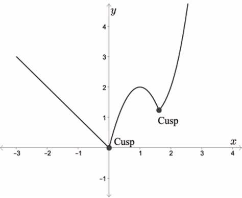
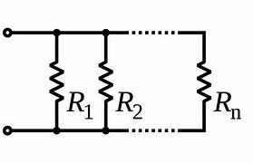
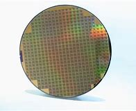

= eco 2020-06-13
:toc:

---

==  Artificial intelligence and its limits 词汇解说

(eco 2020-6-13 / Technology Quarterly / Artificial intelligence and its limits: Reality check)

An understanding of AI’s limitations *is starting to sink in* (话语、事情等)被完全理解；被充分意识到

After years of hype （电视、广播等中言过其实的）促销广告，促销讨论;天花乱坠的广告宣传, many people *feel* AI *has failed to deliver* 履行诺言；不负所望；兑现, says Tim Cross

Jun 11th 2020 |

- *sink in | sink into sth* : (of words, an event, etc. 话语、事情等) to be fully understood or realized 被完全理解；被充分意识到 / (of liquids 液体) to go down into another substance through the surface 渗透；渗入 +
-> He paused *to allow his words to sink in*. 他停了一下，好让人充分领会他的意思。

- hype => 俚语词，可能来自希腊语hyper,超过的，过度的，词源同super.

- deliver : v. *~ (on sth)* to do what you promised to do or what you are expected to do; to produce or provide what people expect you to 履行诺言；不负所望；兑现 +
-> She always *delivers on her promises*. 她总是信守诺言。

IT *WILL BE* as if the world *had created* a second China, *made not of* billions of people and millions of factories, but *of* algorithms and humming computers. PwC, a professional-services firm, *predicts that* artificial intelligence (AI) *will add* $16trn *to* the global economy by 2030. `主` The total of all activity -- *from* banks and biotech *to* shops and construction -- in the world’s second-largest economy `系` *was* just $13trn in 2018.

- 就好像世界创造了第二个中国，...2018年，世界第二大经济体的所有活动 --  -- 从银行、生物技术到商店和建筑 --  -- 总额仅为13万亿美元。(2018年，中国的GDP总量是13.89万亿美元)

PwC’s claim *is no* outlier 离群值,异常值,局外人. Rival 竞争对手 prognosticators 预言者 at McKinsey *put the figure at* $13trn. Others *go for* 被…所吸引；（更）喜欢某人（或某事物） qualitative 质量上的;质的;品质的；性质的 drama, rather than quantitative 数量的;与数量有关的. Sundar Pichai, Google’s boss, *has described* developments in AI *as* “more profound  巨大的；深切的；深远的 than fire or electricity”. Other forecasts *see* similarly large changes, but less happy ones. `主` Clever computers (capable of *doing* the jobs of radiologists 放射科医生；X光科的医生, lorry drivers or warehouse workers) `谓` *might cause* a wave of unemployment.

- *go for sb/sth*  : to be attracted by sb/sth; to like or prefer sb/sth 被…所吸引；（更）喜欢某人（或某事物） +
-> *I don't really go for* modern art.  我并不是很喜欢现代艺术。

- 其他预测也看到了AI会带来的类似的巨大变化，但却是不那么令人高兴的变化后果。

Yet [lately] doubts *have been creeping 悄悄地缓慢行进；蹑手蹑脚地移动 in* 开始发生（或影响）about whether today’s AI technology *is* really as world-changing as it seems. It *is running up against* 遭遇（困难） limits of one kind or another 各种不同的, and *has failed to deliver on* 履行诺言；不负所望；兑现 some of its proponents’ 倡导者；支持者；拥护者 more grandiose 华而不实的；浮夸的；不切实际的 promises.

- *creep in/into sth* : to begin to happen or affect sth 开始发生（或影响） +
-> As she became more tired, errors *began to creep into* her work. 由于越来越疲劳，她的工作开始出现差错。

- *un up against sth* : to experience a difficulty 遭遇（困难） +
-> The government *is running up against* considerable opposition （强烈的）反对，反抗，对抗;对立；对立的事物 to its tax reforms.  政府的税务改革遇到了相当大的阻力。

- *of one kind, sort, etc. or another* : used when you are referring to various types of a thing, without saying exactly what you mean 各种不同的 +
-> We've all got *problems of one kind or another*. 我们都有这样那样的问题。

- grandiose : |ˈgrændiəʊs; 美 -oʊs| a. (disapproving) seeming very impressive but too large, complicated, expensive, etc. to be practical or possible 华而不实的；浮夸的；不切实际的 +
=> 来自grand, 壮丽的，堂皇的。后形容语言浮夸。 +
-> *The grandiose scheme* for a journey across the desert came to nothing. 不切实际的穿越沙漠计划已成泡影。 +
-> a grandiose opera house 华而不实的歌剧院

- 然而，最近人们开始怀疑, 今天的人工智能技术是否真的像看起来那样能改变世界。它正在遭遇这样或那样的限制，并且未能兑现其支持者的一些更不切实际的承诺。

There is no question that AI -- or, to be precise 确切地说；准确地说, machine learning, one of its sub-fields -- *has made much progress*. Computers *have become dramatically better* at many things they previously struggled with. The excitement 激动；兴奋；刺激 *began to build in academia* in the early 2010s, when new machine-learning techniques *led to* rapid improvements in tasks such as *recognising pictures* and *manipulating* （暗中）控制，操纵，影响 language. [From there] it *spread to* business, *starting with* the internet giants. *With* vast computing resources and oceans of data, they *were well placed* 有良好的（或理想的、独特的等）机遇；处于有利等的位置 *to adopt* 采用（某方法）；采取（某态度） the technology. Modern AI techniques now *power* 驱动，推动（机器或车辆） search engines and voice assistants, *suggest* email replies, *power*(v.) the facial-recognition systems that *unlock* smartphones and *police*(v.)监督；管制;(警察、军队等)巡查；维护治安 national borders, and *underpin* 加强，巩固，构成（…的基础等） the algorithms that *try to identify* unwelcome posts on social media.

- *be well, ideally, uniquely, better, etc. placed for sth/to do sth* : to be in a good, very good, etc. position or have a good, etc. opportunity to do sth 有良好的（或理想的、独特的等）机遇；处于有利等的位置 +
-> Engineering graduates *are well placed* for a wide range of jobs. 工程科毕业生, 在很多职业中处于优势。 +
-> The company *is ideally placed* to take advantage of the new legislation. 这家公司条件理想得很，恰好可以充分利用新法规。

- 毫无疑问，人工智能 -- 确切地说，是它的子领域机器学习 -- 已经取得了很大进展。计算机在许多以前难以处理的事情上, 已经大大改进。这种兴奋感在21世纪10年代初开始在学术界产生，当时新的机器学习技术, 导致了识别图片和操纵语言等任务的快速改进。从那时起，它从互联网巨头开始, 蔓延到了商业领域。由于拥有巨大的计算资源和海量的数据，他们处于采用AI技术的有利地位。现代人工智能技术, 如今为搜索引擎和语音助手提供动力，为电子邮件回复提供建议，为解锁智能手机和监控国家边境的面部识别系统, 提供动力，并为社交网站上不受欢迎帖子的识别, 提供了算法加强.

Perhaps the highest-profile 印象；形象;最高调的 display of the technology’s potential(n.)可能性；潜在性;潜力；潜质 *came* in 2016, when `主` a system *built* by DeepMind, a London-based AI firm *owned* by Alphabet, Google’s corporate parent 创始机构；母公司；总部, `谓` *beat* one of the world’s best players at Go 围棋, an ancient Asian board game. The match *was watched* by tens of millions; the breakthrough 重大进展；突破 *came* years, even decades, earlier than AI gurus 专家；权威；大师;古鲁（印度教或锡克教的宗教导师或领袖） *had expected*.

*As* Mr Pichai’s comparison 比较;对比；相比 with electricity and fire *suggests*, machine learning *is* a general-purpose 多用途的；多功能的 technology -- one capable of *affecting* entire economies. It *excels(v.)擅长；善于；突出 at* recognising(v.) patterns in data, and *that is useful* everywhere. Ornithologists 鸟类学家 *use* it *to classify* birdsong; astronomers *to hunt for* planets in glimmers(n.)微弱的闪光；闪烁的微光 of starlight; banks *to assess* 评估，评定（性质、质量） credit risk and *prevent* fraud. In the Netherlands, the authorities *use* it *to monitor* social-welfare payments. In China AI-powered facial recognition *lets* customers *buy* groceries 杂货；食品；生活用品 -- and *helps* run(v.) the repressive (政治体制)压制的；专制的；严厉的 mass-surveillance （对犯罪嫌疑人或可能发生犯罪的地方的）监视 system the country *has built* in Xinjiang, a Muslim-majority region.

- excel : [ V ] *~ (in/at sth/at doing sth)* to be very good at doing sth 擅长；善于；突出

- ornithologist :  /ˌɔːrnɪˈθɑːlədʒɪst/  鸟类学家，鸟类学者 => 来自希腊语ornis的所有格ornithos,鸟，-logy,学说。

- 正如皮查伊先生对电和火的比较所表明的那样，机器学习是一种通用技术 -- 一种能够影响整个经济的技术。

AI’s heralds （旧时的）信使，传令官，使者 *say* further transformations *are still to come*, for better and for worse 不论好坏；不管是福是祸；不管怎样. In 2016 Geoffrey Hinton, a computer scientist who *has made fundamental contributions to* modern AI, *remarked that* “*it’s quite obvious that* we *should stop training* radiologists 放射科医生；X光科的医生,” *on the grounds 充分的理由；根据 that* computers *will soon be able to do everything* they do, only cheaper and faster. Developers of self-driving cars, meanwhile, *predict that* robotaxis *will revolutionise* 彻底改变；完全变革 transport 交通运输系统;交通车辆；运输工具；旅行方式. Eric Schmidt, a former chairman of Google (and a former board member of The Economist’s parent company) *hopes that* AI *could accelerate* research, *helping* human scientists *keep up with* 熟悉，了解（消息、形势等） a deluge 暴雨；大雨；洪水 of papers and data.

- herald : /ˈherəld/ v. to be a sign that sth is going to happen 是（某事）的前兆；预示 / n.(in the past) a person who carried messages from a ruler （旧时的）信使，传令官，使者 +
=> her-,军队，词源同harry,harbor,-ald,命令，统率，词源同wield.即军队统率官，指挥官，将军，后引申词义指挥官的使者，传令员，后用于指传达，通报。 +
image:../../+ img_单词图片/h/herald.jpg[100,100]

- 人工智能的先驱们说，无论好坏，进一步的转变仍将到来。

In January a group of researchers *published a paper* in Cell *describing* an AI system that *had predicted* antibacterial 灭菌的；抗菌的 function from molecular structure. Of 100 candidate molecules 分子 *selected* by the system for further analysis, one *proved to be* a potent new antibiotic 抗菌素；抗生素（如青霉素）. The covid-19 pandemic *has thrust* 猛推；冲；搡；挤；塞;刺；戳 such medical applications 医疗应用 *firmly into* the spotlight. An AI firm called BlueDot *claims* it *spotted* signs of a novel virus in reports from Chinese hospitals *as early as* December. Researchers *have been scrambling* （迅速而吃力地）爬，攀登 *to try to apply AI to everything* [from] drug discovery [to] *interpreting* 诠释；说明 medical scans and *predicting* how the virus *might evolve*.

- 今年1月，一组研究人员在《细胞》杂志上发表了一篇论文，描述了一人工智能系统, 从分子结构层面来预测抗菌功用。该系统选择了100个候选分子进行进一步分析，其中一个被证明是有效的新抗生素。covid-19大流行将这类AI医疗应用, 坚实地推到了聚光灯下。一家名为BlueDot的人工智能公司称，早在去年12月，它就在中国医院的报告中, 发现了一种新型病毒的迹象。研究人员一直在努力尝试将人工智能, 应用于方方面面 : 从药物发现, 到对医学扫描的结果进行解读, 以及预测病毒可能如何进化。

Dude 男人, where’s my self-driving car?

- dude n.  /duːd/ ( slang ) ( especially NAmE ) a man 男人 +
-> He's *a real cool dude*. 他真是个帅哥。 +
-> Hey, *dude*, what's up? 喂，哥们儿，怎么啦？

This *is not* the first wave of AI-related excitement (see timeline in next article). The field *began* in the mid-1950s when researchers *hoped that* building human-level intelligence *would take* a few years -- a couple of decades at most. That early optimism *had fizzled* 虎头蛇尾地结束;（火等）发出嘶嘶声 by the 1970s. A second wave *began* in the 1980s. Once again the field’s grandest 壮丽的；堂皇的；重大的(最高级) promises *went unmet*(a.)未满足的. *As* reality *replaced* the hype 大肆的宣传广告; 炒作, the booms *gave way to* 屈服；退让；让步;让…在先；让…先行 painful busts 破产的;经济萧条 *known as* “AI winters”. Research funding *dried up*, and the field’s reputation 名誉；名声 *suffered* （因疾病、痛苦、悲伤等）受苦，受难，受折磨.

- *FIZZLE OUT* : ( informal ) to gradually become less successful and end in a disappointing way （顺利开始）结果失败，终成泡影；虎头蛇尾

- bust : ( NAmE ) a thing that is not good 蹩脚的东西；没价值的事物  / V-T If you *bust* something, you break it or damage it so badly that it cannot be used. 打碎+
=> [As a show] *it was a bust*. 作为一场演出，那可不怎么样。

- *boom and bust* 繁荣与萧条

- 随着现实取代了炒作，繁荣让位于被称为“人工智能冬天”的痛苦萧条。研究资金枯竭，该领域的声誉受损。

Many of the grandest claims made about AI *have once again failed to become reality*

Modern AI technology *has been* far more successful. Billions of people *use it* every day, mostly without noticing, inside their smartphones and internet services. Yet despite this success, the fact *remains* that many of the grandest claims made about AI *have once again failed to become reality*, and confidence *is wavering* as researchers *start to wonder*  想知道；想弄明白；琢磨 whether the technology *has hit a wall*. Self-driving cars *have become* more capable, but *remain* perpetually 永恒地，持久地 on the cusp （两曲线相交的）尖点，会切点，交点 of *being safe enough* to deploy(v.)部署，调度（军队或武器）; 有效地利用；调动 on everyday streets. `主` Efforts *to incorporate* 将…包括在内；包含；吸收；使并入 AI *into* medical diagnosis `谓` *are*, similarly, *taking longer* than expected: despite Dr Hinton’s prediction, there *remains* a global shortage of human radiologists.

- cusp :  /kʌsp/ ( technical 术语 ) a pointed end where two curves meet （两曲线相交的）尖点，会切点，交点 / the time when one sign of the zodiac ends and the next begins （黄道十二宫的）两宫会切的时辰 +
=> 来自PIE*sker, 切，砍，词源同shear,carnal. +
-> the cusp of a leaf 叶尖 +

-  deploy : v. ( technical 术语 ) to move soldiers or weapons into a position where they are ready for military action 部署，调度（军队或武器） / ( formal ) to use sth effectively 有效地利用；调动 +
image:../../+ img_单词图片/d/deploy.jpg[100,100]

- 自动驾驶汽车已经变得更有能力，但离足够安全地可以部署在日常街道上,  却永远还差那么一点。

*Surveying* the field of medical AI in 2019, Eric Topol, a cardiologist 心脏病医生；心脏病学家 and AI enthusiast 热衷于…的人；热心者；爱好者, *wrote that* “the state of AI hype *has far exceeded* the state of AI science, especially when it *pertains 存在；适用 to* 与…相关；关于 validation(n.)证实,确认…有效 and readiness(n.)准备就绪;愿意；乐意 for implementation 生效；贯彻；执行；实施 in patient care”. Despite a plethora(n.)过多；过量；过剩 of ideas, covid-19 *is mostly being fought with old weapons* that are already to hand 在手边；随时可得到. Contact tracing *has been done* with shoe leather 皮革 and telephone calls. Clinical trials 临床试验 *focus on* existing drugs. Plastic screens and paint on the pavement *enforce* low-tech distancing advice.

- pertain : [ V ] ( formal ) to exist or to apply in a particular situation or at a particular time 存在；适用 +
=> per-完全,贯穿 + -tain-握,持有 +
-> Living conditions are vastly different from *those pertaining in their country of origin*. 生活条件与他们祖国大不相同。 +
->  Those laws *no longer pertain*. 那些法律已不适用了。

- *PERTAIN TO STH/SB* : ( formal ) to be connected with sth/sb 与…相关；关于 +
-> the laws *pertaining to adoption* 有关收养的法律

- validation : v. to prove that sth is true 证实；确认；确证 / to state officially that sth is useful and of an acceptable standard 批准；确认…有效；认可 / to make sth legally valid 使生效；使有法律效力 +
-> *to validate a theory* 证实理论 +
-> *to validate a contract* 使合同生效

- implement : /ˈɪmplɪment/  [ VN ] to make sth that has been officially decided start to happen or be used 使生效；贯彻；执行；实施 +
-> *to implement changes/decisions/policies/reforms* 实行变革；执行决议╱政策；实施改革 +
-> the implementation(n.) of the new system 新体制的实施

- 心脏病学家、人工智能爱好者埃里克•托波尔(Eric Topol), 在2019年调查了医疗人工智能领域，他写道:“人工智能的炒作程度, 远远超过了人工智能的科学水平，尤其是在涉及患者护理的验证和实施准备方面” 尽管有太多的关于AI如何运用的想法，但在对付covid-19上, 还是用的手头已经有的旧武器上。对接触者进行追踪, 是通过鞋皮和电话进行的。临床试验, 集中在现有药物上。人行道上的塑料屏幕和油漆, 强法治执行了低技术含量的保持距离的建议。

`主` The same consultants 顾问 (who *predict that* AI *will have* a world-altering （使）改变，更改，改动 impact) `谓` also *report that* {real managers in real companies *are finding* AI *hard to implement*}, and *that* {enthusiasm for it *is cooling*}. Svetlana Sicular of Gartner, a research firm, *says that* 2020 *could be* the year (AI *falls* onto the downslope of her firm’s well-publicised 广泛宣传的 “hype cycle”). Investors *are beginning to wake up to* 意识到；认识到 bandwagon-jumping 赶时髦: a survey of European AI startups by MMC, a venture-capital fund, *found that* 40% *did not seem* to be using(v.) any AI at all. “I *think* there’s definitely a strong element of ‘investor marketing 推销；促销’,” *says* one analyst *delicately*  熟练的；需要技巧的；需要小心处理的；微妙的.

- *wake up to sth* : to become aware of sth; to realize sth 意识到；认识到 +
-> He *hasn't yet woken up to* the seriousness of the situation. 他还没有认识到形势的严重性。

- 预测人工智能将产生改变世界影响的咨询师们, 还报告称，现实企业的经理们发现，人工智能很难实施，对它的热情也在降温。研究公司Gartner的斯维特拉娜•西库勒(Svetlana Sicular)表示，到2020年，人工智能可能会跌入她公司大肆宣传的“AI炒作周期”的低谷。投资者开始意识到他们在做的只是"赶时髦":风险投资基金MMC, 对欧洲人工智能初创公司进行了调查, 它发现: 40%的创业公司似乎根本没有使用任何人工智能。一位分析师谨慎地表示道:“我认为，AI虚火的原因, 肯定有‘对金主来做营销忽悠’这个很强的因素在里面。”

This Technology Quarterly 季刊 *will investigate* why enthusiasm *is stalling* （使）熄火，抛锚;暂缓；搁置；停顿. It *will argue 论证；说理；争辩;证明；表明 that* although modern AI techniques *are* powerful, they *are* also limited, and they *can be* troublesome(a.)令人烦恼的；讨厌的；令人痛苦的 and difficult to deploy. `主` Those *hoping to make use of* AI’s potential `谓` *must confront* two sets of problems.

The first *is* practical 实际的；真实的；客观存在的. The machine-learning revolution *has been built on* three things: improved algorithms, more powerful computers *on which to run them*, and -- *thanks to* the gradual digitisation 数字化 of society -- more data *from which* they *can learn*. Yet data *are not always readily available*. *It* is hard *to use* AI *to monitor* covid-19 transmission 传送；传递；传达；传播；传染 *without* a comprehensive 全部的；所有的；（几乎）无所不包的；详尽的 database of everyone’s movements, for instance. Even when data *do exist*, they *can contain* hidden assumptions 假定；假设 that *can trip* 将…绊倒；使跌倒 the unwary 粗心的人；不警觉的人. The newest AI systems’ demand(n.) for computing power *can be* expensive. Large organisations *always take time to integrate*  （使）合并，成为一体;（使）加入，融入群体 new technologies: *think of* electricity in the 20th century or the cloud in the 21st. None of this *necessarily reduces* AI’s potential, but it *has* the effect of *slowing* its adoption.

- practical : a. connected with real situations rather than with ideas or theories 实际的；真实的；客观存在的 +
-> *practical problems* 实际问题

- unwary : a. [ only before noun ] not aware of the possible dangers or problems of a situation and therefore likely to be harmed in some way 不警觉的；不提防的 +
-> *the unwary* : [ pl. ] people who are unwary 粗心的人；不警觉的人

The second set of problems *runs deeper*, and *concerns*  与…有关；涉及 the algorithms themselves. Machine learning *uses* thousands or millions of examples *to train* a software model (the structure of which *is loosely based on* the neural architecture 建筑学;体系结构；（总体、层次）结构 of the brain). The resulting systems *can do* some tasks, such as *recognising* images or speech, far more reliably(ad.)可信赖的；可依靠的 *than* those *programmed* the traditional way with hand-crafted 手工制作的 rules, but they *are not* “intelligent” in the way that most people *understand* the term. They *are* powerful pattern-recognition 模式识别 tools, but *lack* many cognitive abilities that biological brains *take for granted* 认为…是理所当然;（因习以为常）对…不予重视；（因视为当然而）不把…当回事. They *struggle 艰难地行进；吃力地进行 with* reasoning(n.)推想；逻辑推理；理性的观点；论证, *generalising* 概括，归纳，推论 from the rules they *discover*, and *with* the general-purpose  多用途的；多功能的 savoir faire(n.)（应付自如的）社交能力；处世能力 that `主` researchers, for want(n.)缺少；缺乏；不足 of a more precise description, `谓` *dub* 把…戏称为；给…起绰号 “common sense”. The result *is* an artificial idiot savant 独通一行的人；独开一窍的人 that *can excel at* well-bounded 清楚的周界 tasks, but *can get things very wrong* if *faced with* unexpected input.

- *take it for granted (that…)* : to believe sth is true without first making sure that it is 认为…是理所当然 +
-> *I just took it for granted that* he'd always be around. 我还想当然地以为他总能随叫随到呢。

- *take sb/sth for granted* : to be so used to sb/sth that you do not recognize their true value any more and do not show that you are grateful （因习以为常）对…不予重视；（因视为当然而）不把…当回事 +
-> We *take* having an endless supply of clean water *for granted*. 我们想当然地认为洁净水的供应无穷无尽而不予以珍惜。

- generalize :  /ˈdʒenrəlaɪz/ v.  ~ (from sth) to use a particular set of facts or ideas in order to form an opinion that is considered valid for a different situation 概括；归纳

- *savoir faire* : n.   /ˌsævwɑː ˈfeə(r)/ [ U ] ( from French approving ) the ability to behave in the appropriate way in social situations （应付自如的）社交能力；处世能力

-  want : n. [ Using. ] *~ of sth* ( formal ) a situation in which there is not enough of sth; a lack of sth 缺少；缺乏；不足 +
-> a want(n.) of adequate medical facilities 缺少足够的医疗设施

- savant : /səˈvɑːnt/ a person with great knowledge and ability 博学之士；学者；专家 / a person who is less intelligent than others but who has particular unusual abilities that other people do not have 独通一行的人；独开一窍的人 +
=> 来自拉丁语 sapere,品尝，鉴别，词源同 sapient,savor.即有鉴 别力的人，有智慧的人。引申词义智者，专家。 +
image:../../+ img_单词图片/s/savant.jpg[100,100]

- 第二组问题更为深入，与算法本身有关。机器学习使用成千上万的样本来训练软件模型(其结构松散地基于大脑的神经架构)。由此产生的系统可以完成一些任务，比如识别图像或语音，比那些用传统方式用手工制定的规则编程的系统要可靠得多，但它们并不像大多数人理解的那样“智能”。它们是强大的模式识别工具，但缺乏生物大脑天生就具有的许多认知能力。它们艰难地进行逻辑推理; 从自己的发现中概括出规则; 并进行通用多功能的社交行为 -- 由于研究人员缺乏精确到词汇来描述这种任务, 因此就统称为"常识"能力. 结果, ai就只是一个人造的白痴, 它只能精通一个领域的工作, 并且还必须对任务边界界定清楚. 否则, 如果遇到意想不到的数据输入，就会把事情做得很糟糕。

Without another breakthrough 重大进展；突破, these drawbacks 缺点; 障碍 *put fundamental limits on* what AI *can and cannot do*. Self-driving cars, which *must navigate* 导航；确定（船、飞机、汽车等）的位置和方向;找到正确方法（对付困难复杂的情况） an ever-changing 千变万化的；常变的 world, *are already delayed*, and *may never arrive* at all. Systems that *deal with* language, *like* chatbots 聊天机器人 and personal assistants, *are built on* statistical approaches 统计方法 that *generate* a shallow 肤浅的；浅薄的 appearance 外貌；外观；外表 of understanding, without the reality. That *will limit* how useful they can become. `主` Existential(a.)存在主义;关于人类存在的；与人类存在有关的 worries(n.) about clever computers *making* radiologists or lorry drivers *obsolete*(a.)淘汰的；废弃的；过时的 -- let alone 更不必说, *as* some doom-mongers 末世论者；散布恐怖威胁论的人 *suggest*, *posing a threat to* humanity’s survival -- `系` *seem* overblown(a.)过分的；夸张的；虚饰过度的. Predictions of a Chinese-economy-worth of extra GDP *look* implausible 似乎不合情理的；难以置信的,不像真实的.

- 如果没有其他突破，这些缺陷就会从根本上限制人工智能能做什么和不能做什么。必须在瞬息万变的世界中行驶的自动驾驶汽车已经被推迟了，而且可能永远不会到来。处理语言的系统，如聊天机器人和个人助理，都是建立在统计方法上的，这些统计方法产生的只是肤浅的理解，而不是真实的理解。这将限制它们的用途。对AI会令放射科医生或卡车司机失业的存在主义式担忧, 看上去言过其实了. -- 更不必说像一些末日论者所说的那样，AI会对人类的生存构成威胁. 认为AI会产生另一个如同中国GDP般巨大的价值, 这种看法现在看来是不可信的.

- overblown : a. that is made to seem larger, more impressive or more important than it really is SYN exaggerated 过分的；夸张的；虚饰过度的 / ( of flowers 花朵 ) past the best, most beautiful stage 残败的；盛期已过的

Today’s “AI summer” *is different from* previous ones. It *is* brighter and warmer, because the technology *has been so widely deployed*. Another full-blown  具所有特征的；成熟的 winter *is* unlikely. But an autumnal 秋天的；秋季的 breeze *is picking up* 改善；好转；增强.

- full-blown : a. [只用于名词前] having all the characteristics of sb/sth; fully developed 具所有特征的；成熟的 +
-> The border dispute *turned into a full-blown crisis*.
边境争端已演变成全面危机。

- *pick up* : to get better, stronger, etc.; to improve 改善；好转；增强 +
-> *The wind is picking up* now. 现在风愈刮愈大了。 +
-> *Sales have picked up 14%* this year. 今年销售额增长了14%。

- 今天的“AI之夏”与以往不同。它更明亮、更温暖，因为这项技术已经得到了如此广泛的部署。另一个全面的冬天不太可能到来。但是，秋风正在吹起。

---

== Artificial intelligence and its limits

An understanding of AI’s limitations is starting to sink in

After years of hype, many people feel AI has failed to deliver, says Tim Cross

Jun 11th 2020 |

IT WILL BE as if the world had created a second China, made not of billions of people and millions of factories, but of algorithms and humming computers. PwC, a professional-services firm, predicts that artificial intelligence (AI) will add $16trn to the global economy by 2030. The total of all activity -- from banks and biotech to shops and construction -- in the world’s second-largest economy was just $13trn in 2018.

PwC’s claim is no outlier. Rival prognosticators at McKinsey put the figure at $13trn. Others go for qualitative drama, rather than quantitative. Sundar Pichai, Google’s boss, has described developments in AI as “more profound than fire or electricity”. Other forecasts see similarly large changes, but less happy ones. Clever computers capable of doing the jobs of radiologists, lorry drivers or warehouse workers might cause a wave of unemployment.

Yet lately doubts have been creeping in about whether today’s AI technology is really as world-changing as it seems. It is running up against limits of one kind or another, and has failed to deliver on some of its proponents’ more grandiose promises.

There is no question that AI -- or, to be precise, machine learning, one of its sub-fields -- has made much progress. Computers have become dramatically better at many things they previously struggled with. The excitement began to build in academia in the early 2010s, when new machine-learning techniques led to rapid improvements in tasks such as recognising pictures and manipulating language. From there it spread to business, starting with the internet giants. With vast computing resources and oceans of data, they were well placed to adopt the technology. Modern AI techniques now power search engines and voice assistants, suggest email replies, power the facial-recognition systems that unlock smartphones and police national borders, and underpin the algorithms that try to identify unwelcome posts on social media.

Perhaps the highest-profile display of the technology’s potential came in 2016, when a system built by DeepMind, a London-based AI firm owned by Alphabet, Google’s corporate parent, beat one of the world’s best players at Go, an ancient Asian board game. The match was watched by tens of millions; the breakthrough came years, even decades, earlier than AI gurus had expected.

As Mr Pichai’s comparison with electricity and fire suggests, machine learning is a general-purpose technology -- one capable of affecting entire economies. It excels at recognising patterns in data, and that is useful everywhere. Ornithologists use it to classify birdsong; astronomers to hunt for planets in glimmers of starlight; banks to assess credit risk and prevent fraud. In the Netherlands, the authorities use it to monitor social-welfare payments. In China AI-powered facial recognition lets customers buy groceries -- and helps run the repressive mass-surveillance system the country has built in Xinjiang, a Muslim-majority region.

AI’s heralds say further transformations are still to come, for better and for worse. In 2016 Geoffrey Hinton, a computer scientist who has made fundamental contributions to modern AI, remarked that “it’s quite obvious that we should stop training radiologists,” on the grounds that computers will soon be able to do everything they do, only cheaper and faster. Developers of self-driving cars, meanwhile, predict that robotaxis will revolutionise transport. Eric Schmidt, a former chairman of Google (and a former board member of The Economist’s parent company) hopes that AI could accelerate research, helping human scientists keep up with a deluge of papers and data.

In January a group of researchers published a paper in Cell describing an AI system that had predicted antibacterial function from molecular structure. Of 100 candidate molecules selected by the system for further analysis, one proved to be a potent new antibiotic. The covid-19 pandemic has thrust such medical applications firmly into the spotlight. An AI firm called BlueDot claims it spotted signs of a novel virus in reports from Chinese hospitals as early as December. Researchers have been scrambling to try to apply AI to everything from drug discovery to interpreting medical scans and predicting how the virus might evolve.

Dude, where’s my self-driving car?

This is not the first wave of AI-related excitement (see timeline in next article). The field began in the mid-1950s when researchers hoped that building human-level intelligence would take a few years -- a couple of decades at most. That early optimism had fizzled by the 1970s. A second wave began in the 1980s. Once again the field’s grandest promises went unmet. As reality replaced the hype, the booms gave way to painful busts known as “AI winters”. Research funding dried up, and the field’s reputation suffered.

Many of the grandest claims made about AI have once again failed to become reality

Modern AI technology has been far more successful. Billions of people use it every day, mostly without noticing, inside their smartphones and internet services. Yet despite this success, the fact remains that many of the grandest claims made about AI have once again failed to become reality, and confidence is wavering as researchers start to wonder whether the technology has hit a wall. Self-driving cars have become more capable, but remain perpetually on the cusp of being safe enough to deploy on everyday streets. Efforts to incorporate AI into medical diagnosis are, similarly, taking longer than expected: despite Dr Hinton’s prediction, there remains a global shortage of human radiologists.

Surveying the field of medical AI in 2019, Eric Topol, a cardiologist and AI enthusiast, wrote that “the state of AI hype has far exceeded the state of AI science, especially when it pertains to validation and readiness for implementation in patient care”. Despite a plethora of ideas, covid-19 is mostly being fought with old weapons that are already to hand. Contacttracing has been done with shoe leather and telephone calls. Clinical trials focus on existing drugs. Plastic screens and paint on the pavement enforce low-tech distancing advice.

The same consultants who predict that AI will have a world-altering impact also report that real managers in real companies are finding AI hard to implement, and that enthusiasm for it is cooling. Svetlana Sicular of Gartner, a research firm, says that 2020 could be the year AI falls onto the downslope of her firm’s well-publicised “hype cycle”. Investors are beginning to wake up to bandwagon-jumping: a survey of European AI startups by MMC, a venture-capital fund, found that 40% did not seem to be using any AI at all. “I think there’s definitely a strong element of ‘investor marketing’,” says one analyst delicately.

This Technology Quarterly will investigate why enthusiasm is stalling. It will argue that although modern AI techniques are powerful, they are also limited, and they can be troublesome and difficult to deploy. Those hoping to make use of AI’s potential must confront two sets of problems.

The first is practical. The machine-learning revolution has been built on three things: improved algorithms, more powerful computers on which to run them, and -- thanks to the gradual digitisation of society -- more data from which they can learn. Yet data are not always readily available. It is hard to use AI to monitor covid-19 transmission without a comprehensive database of everyone’s movements, for instance. Even when data do exist, they can contain hidden assumptions that can trip the unwary. The newest AI systems’ demand for computing power can be expensive. Large organisations always take time to integrate new technologies: think of electricity in the 20th century or the cloud in the 21st. None of this necessarily reduces AI’s potential, but it has the effect of slowing its adoption.

The second set of problems runs deeper, and concerns the algorithms themselves. Machine learning uses thousands or millions of examples to train a software model (the structure of which is loosely based on the neural architecture of the brain). The resulting systems can do some tasks, such as recognising images or speech, far more reliably than those programmed the traditional way with hand-crafted rules, but they are not “intelligent” in the way that most people understand the term. They are powerful pattern-recognition tools, but lack many cognitive abilities that biological brains take for granted. They struggle with reasoning, generalising from the rules they discover, and with the general-purpose savoir faire that researchers, for want of a more precise description, dub “common sense”. The result is an artificial idiot savant that can excel at well-bounded tasks, but can get things very wrong if faced with unexpected input.

Without another breakthrough, these drawbacks put fundamental limits on what AI can and cannot do. Self-driving cars, which must navigate an ever-changing world, are already delayed, and may never arrive at all. Systems that deal with language, like chatbots and personal assistants, are built on statistical approaches that generate a shallow appearance of understanding, without the reality. That will limit how useful they can become. Existential worries about clever computers making radiologists or lorry drivers obsolete -- let alone, as some doom-mongers suggest, posing a threat to humanity’s survival -- seem overblown. Predictions of a Chinese-economy-worth of extra GDP look implausible.

Today’s “AI summer” is different from previous ones. It is brighter and warmer, because the technology has been so widely deployed. Another full-blown winter is unlikely. But an autumnal breeze is picking up.

---

== Computing hardware 词汇解说

(eco 2020-6-13 / Technology Quarterly / Computing hardware: Machine, learning)

The cost of training machines *is becoming a problem*

Increased complexity and competition 竞争；角逐 *are* part of it

Jun 11th 2020 |

THE FUNDAMENTAL assumption 基本假设 of the computing industry *is that* `主` number-crunching 数字运算 `谓` *gets cheaper* all the time. Moore’s law 摩尔定律, the industry’s master metronome 节拍器, *predicts that* `主` the number of components 组成部分；成分；部件 that *can be squeezed* （使）挤入；挤过；塞入(狭小的空间);挤压；捏 onto a microchip of a given size -- and thus, loosely, the amount of computational power (available at a given cost) -- `谓` *doubles* every two years.

- number crunching : N-UNCOUNT If you refer to *number crunching*, you mean activities or processes concerned with numbers or mathematical calculation, for example in finance, statistics, or computing. 数字运算

- metronome :  /ˈmetrənoʊm/ a device that makes a regular sound like a clock and is used by musicians to help them keep the correct rhythm when playing a piece of music 节拍器 +
=> 来自希腊语metron,测量，词源同meter,measure,nemein,管理，分配，词源同number,economy.用于指一种音乐节拍管理装置。 +

For many comparatively simple AI applications （尤指理论、发现等的）应用，运用, that *means that* the cost of training a computer *is* falling, says Christopher Manning, the director of Stanford University’s AI Lab. But that *is not true* everywhere. A combination of ballooning （突然）膨胀，涨大 complexity and competition *means* costs at the cutting edge *are rising sharply*.

- 不断增长的复杂性, 及竞争, 结合起来就意味着, 那些最前沿技术的成本在急剧上升。

Dr Manning *gives the example* of BERT, an AI language model *built by Google* in 2018 and *used* in the firm’s search engine. It *had* more than 350m internal parameters 参数；系数 and a prodigious 巨大的；给人印象深刻的 appetite(n.)食欲；胃口;强烈欲望 for data. It *was trained* using 3.3bn words of text *culled 选出；挑出；采集; 部分捕杀，宰杀（为防止动物种群量过多而杀掉其中一定数量） mostly from* Wikipedia, an online encyclopedia 百科全书. These days, says Dr Manning, Wikipedia *is not* such a large data-set. “[If you *can train* a system on 30bn words] it’*s going to perform better* than one *trained* on 3bn.” And more data *means* more computing power *to crunch it all*.

- parameter :  /pəˈræmɪtər/ n. [ usually pl. ] something that decides or limits the way in which sth can be done 决定因素；规范；范围 +
-> to set/define the parameters 制订╱设定规范 +
image:../../+ img_单词图片/p/parameter.jpg[100,100]

- prodigious :  /prəˈdɪdʒəs/ a. [ usually before noun ] ( formal ) very large or powerful and causing surprise or admiration 巨大的；伟大的 +
=> 来自prodigy,天才，神童。引申词义天才般的，奇迹的，巨大的，伟大的。 +
来自拉丁语prodigium,预言，预兆，奇怪的预示，妖怪，来自pro-,向前，-igium,说，预言，可能来自PIE*ag,说，词源同adage.后用于指天赋异禀的孩子，天才，神童。 +
-> a prodigious achievement/memory/talent 惊人的成就╱记忆力╱才华 +

- cull : /kʌl/ [ VN ] to kill a particular number of animals of a group in order to prevent the group from getting too large 部分捕杀，宰杀（为防止动物种群量过多而杀掉其中一定数量） +
=> 来自collect,收集。 +
*cull sth from sth* : to choose or collect sth from a source or several different sources 选出；挑出；采集 +
-> an exhibition of paintings *culled from* regional art galleries 从各地区画廊中精选出来的绘画作品展

- 如今维基百科已经不是一个庞大的数据集了。“如果你300亿个单词来训练一个系统，它的表现会比用30亿个单词来训练一个系统好。” 而更多的数据, 意味着需要更多的计算能力, 来处理这些数据。

OpenAI, a research firm *based* in California, *says* demand(n.) for processing power *took off* 起飞 in 2012, as excitement around machine learning *was starting to build*. It *has accelerated sharply*. By 2018, `主` the computer power *used* to train(v.) big models `谓` *had risen* 300,000-fold, and *was doubling* 翻一番 every three and a half months (see chart). It *should know* -- *to train* its own “OpenAI Five” system, *designed to beat* humans *at* “Defense of the Ancients 2”, a popular video game, it *scaled* 改变…的大小 machine learning “*to* unprecedented 前所未有的；空前的；没有先例的 levels”, *running* thousands of chips non-stop 不间断的；不停的 [for more than ten months].

`主` Exact figures on how much this all costs(v.) `系` *are* scarce 缺乏的；不足的；稀少的. But a paper published in 2019 by researchers at the University of Massachusetts Amherst *estimated that* training one version of “Transformer”, another big language model, *could cost* as much as $3m. Jerome Pesenti, Facebook’s head of AI, *says that* one round 阶段；轮次 of training for the biggest models *can cost* “millions of dollars” in electricity consumption （能量、食物或材料的）消耗，消耗量.

- scarce : /skers/ a. if sth is scarce , there is not enough of it and it is only available in small quantities 缺乏的；不足的；稀少的 +
-> scarce resources 稀缺资源 +
-> Details of the accident *are scarce*. 事故的详细情况了解不多。

- round : n. a set of events which form part of a longer process 阶段；轮次 / a stage in a sports competition 比赛阶段；轮次；局；场 +
-> *the next round* of peace talks 下一轮和谈 +

- 这一切要花费多少资金, 这个确切数字, 很少知道. ... 对最大的模型的一轮训练, 需要耗掉“数百万美元”的电力。

Help from the cloud

Facebook, which *turned* （使）变成，成为 a profit of $18.5bn in 2019, *can afford* those bills. Those less flush(a.)富有，很有钱（通常为短期的）;(两个表面)完全齐平 with cash *are feeling* the pinch 捏；掐；拧;一撮. Andreessen Horowitz, an influential 有很大影响的；有支配力的 American venture-capital firm, *has pointed out that* many AI startups *rent*  租用进，租借入（他人的房屋、土地、机器等给自己用） their processing power *from* cloud-computing firms like Amazon and Microsoft. The resulting 因而发生的，作为结果的 bills 账单 -- sometimes 25% of revenue or more -- *are* one reason, it *says*, that AI startups *may make for*  促成 less attractive investments *than* old-style software companies. In March Dr Manning’s colleagues 同事；同僚 at Stanford, including Fei-Fei Li, an AI luminary 专家；权威；有影响的人物, *launched* the National Research Cloud, a cloud-computing initiative 倡议；新方案 *to help* American AI researchers *keep up with* spiralling 急剧增长;螺旋式上升（或下降）；盘旋上升（或下降） bills.

- luminary : /ˈluːmɪneri/ n. a person who is an expert or a great influence in a special area or activity 专家；权威；有影响的人物 +
=> 来自拉丁语lumen,光亮，光线，词源同light.引申词义发光的人，专家，权威。

- *make for sth* : to help to make sth possible 促成 / to move towards sth 向…移动. 同义词:head for +
-> Constant arguing *doesn't make for a happy marriage*. 不断争吵不可能使婚姻幸福。

- `主` The resulting bills -- sometimes 25% of revenue or more -- `系` are one reason, it says, that(是做one reason的定语) AI startups *may make for* 促成 less attractive investments than old-style software companies. 该公司表示，由此产生的账单 -- 有时占收入的25%或更多 -- 是人工智能初创企业投资吸引力可能低于老式软件公司的原因之一。

The growing demand for computing power *has fuelled* a boom in chip design and specialised devices 仪器 that *can perform* the calculations (*used* in AI) *efficiently*. The first wave of specialist chips *were* graphics processing units (GPUs), *designed* in the 1990s *to boost* video-game graphics 图样；图案；绘图；图像. *As luck would have it* 碰巧；偶然；幸而；不巧, GPUs *are also fairly well-suited to* the sort of mathematics *found* in AI.

- *as luck would have it* : in the way that chance decides what will happen 碰巧；偶然；幸而；无巧不成书; 不巧 +
-> *As luck would have it*, the train was late. 不巧火车晚点了。

Further specialisation 特殊化，专门化 *is* possible, and companies *are piling 蜂拥；拥挤;堆放；摞起；叠放 in* to provide(v.) it. In December, Intel, a giant chipmaker, *bought* Habana Labs, an Israeli firm, for $2bn. Graphcore, a British firm *founded* in 2016, *was valued at* $2bn in 2019. Incumbents such as Nvidia, the biggest GPU-maker, *have reworked* 修改；重做；再加工(使完善) their designs *to accommodate* AI. Google *has designed* its own “tensor 张肌-processing unit” (TPU) chips in-house 机构内部的;在机构内部. Baidu, a Chinese tech giant, *has done the same* with its own “Kunlun” chips. Alfonso Marone at KPMG *reckons* the market for specialised AI chips *is already worth* around $10bn, and *could reach* $80bn by 2025.

- tensor : n. /ˈtensə(r); -sɔ:(r)/ (anatomy 解) a muscle that tightens or stretches part of the body 张肌 +
image:../../+ img_单词图片/t/tensor.jpg[100,100]

“Computer architectures *need to follow* the structure of the data they’re processing,” says Nigel Toon, one of Graphcore’s co-founders. The most basic feature of AI workloads （某一人或组织的）工作量，工作负担 *is that* they *are* “embarrassingly 使人尴尬地；令人难堪地 parallel(a.)并行的;平行的;极相似的；同时发生的；相应的；对应的”, which *means* they *can be cut into* thousands of chunks which *can all be worked* on at the same time. Graphcore’s chips, for instance, *have* more than 1,200 individual number-crunching 数字运算  “cores”, and *can be linked together* to provide(v.) still more power. Cerebras, a Californian startup, *has taken* an extreme approach. Chips *are usually made [in batches 一批;（食物、药物等）一批生产的量]*, with dozens or hundreds *etched*  蚀刻，凿出（玻璃、金属等上的文字或图画） onto standard silicon wafers 薄片 (300mm in diameter 直径). Each of Cerebras’s chips *takes up* 占用（时间）；占据（空间） an entire wafer by itself. That *lets* the firm *cram* 把…塞进；挤满；塞满 400,000 cores onto each.

- 人工智能工作负载的最基本特点是，它们必须“难堪地并行工作”

- parallel : /ˈpærəlel/ a. ( computing 计 ) involving several computer operations at the same time 并行的 +
-> parallel processing 并行处理 /very similar or taking place at the same time 极相似的；同时发生的；相应的；对应的 +
-> parallel trends 并行发展的趋势 +
-> a parallel case 同类型事例 +

- wafer : ~ (of sth) a very thin piece of sth 薄片 / a thin crisp light biscuit/cookie, often eaten with ice cream 威化饼，薄脆饼（常与冰激凌同吃） +
=>  来自 waffle,华夫饼，用于指一种轻饼干。 +

- *take up sth* : to fill or use an amount of space or time 占用（时间）；占据（空间） +
-> The table *takes up too much room*. 这张桌子太占地方。 +
-> I won't *take up any more of your time*. 我不再占用你的时间了。

- cram : /kræm/ v. *~ (sth) into/onto sth | ~ (sth) in* : to push or force sb/sth into a small space; to move into a small space with the result that it is full 把…塞进；挤满；塞满 / *~ (for sth)* ( rather old-fashioned ) to learn a lot of things in a short time, in preparation for an exam （为应考）临时死记硬背 +
=> 来自PIE*ger, 围，集中，词源同cramp, gregarious. +
-> I could never *cram in* all that she does in a day. 我可做不了她在一天之内做的事情。 +

Other optimisations 最佳化，最优化 *are* important, too. Andrew Feldman, one of Cerebras’s founders, *points out that* AI models *spend a lot of their time* multiplying(v.) 乘 numbers by zero. Since those calculations *always yield* zero, each one *is* unnecessary, and Cerebras’s chips *are designed* to avoid(v.) performing them. Unlike many tasks, says Mr Toon at Graphcore, ultra-precise 超精密的 calculations *are not needed* in AI. That *means* chip designers *can save energy* by *reducing* the fidelity 准确性；精确性 of the numbers their creations *are juggling* 尽力同时应付（两个或两个以上的重要工作或活动）;玩杂耍（连续向空中抛接多个物体）;有效地组织，有效利用（信息、数字、开支等）. (`主` Exactly how fuzzy  糊涂的；含混不清的;（形状或声音）模糊不清的 the calculations can get `系` *remains* an open question.)

- fidelity : /fɪˈdeləti/ n. *~ (of sth) (to sth)* ( formal ) the quality of being accurate 准确性；精确性 / ~ (to sth) ( formal ) the quality of being loyal to sb/sth 忠诚；忠实；忠贞 +
=>  -fid-信任 + -el名词词尾 + -ity名词词尾 +
-> *the fidelity* of the translation to the original text 对原文翻译的准确性 +
image:../../+ img_单词图片/f/fidelity.jpg[100,100]

- juggle : /ˈdʒʌɡl/ v. *~ sth (with sth)* to try to deal with two or more important jobs or activities at the same time so that you can fit all of them into your life 尽力同时应付（两个或两个以上的重要工作或活动）/ to organize information, figures, the money you spend, etc. in the most useful or effective way 有效地组织，有效利用（信息、数字、开支等） +
=> 来自拉丁语joculari,玩耍，玩乐，词源同joke,jocular.引申词义玩杂耍同时抛接物体，同时应付等。

All that *can add up to* big gains. Mr Toon *reckons that* Graphcore’s current chips *are* anywhere 在任何地方；无论何处 between ten and 50 times *more efficient than* GPUs. They *have already found their way* into specialised computers *sold* by Dell, *as well as* into Azure, Microsoft’s cloud-computing service. Cerebras *has delivered* equipment *to* two big American government laboratories 实验室.

“Moore’s law *isn’t possible any more*”

Such innovations *will be* increasingly important, for `主` the AIfuelled explosion in demand(n.) for computer power `谓` *comes* [just *as* Moore’s law *is running out of steam* 筋疲力尽；丧失热情]. Shrinking(v.) chips *is getting harder*, and the benefits of doing so *are not* what they were. Last year Jensen Huang, Nvidia’s founder, *opined  表达，发表（意见） bluntly 直言地；单刀直入地 that* “Moore’s law *isn’t possible any more*”.

- *run out of steam* : ( informal ) to lose energy and enthusiasm and stop doing sth, or do it less well 筋疲力尽；丧失热情

- opine : /oʊˈpaɪn/ [ V that ] ( formal ) to express a particular opinion 表达，发表（意见） +
=> 来自拉丁语opinari,发表观点，表达意见，词源同opinion.

- 在人工智能推动下，对算力的需求出现爆炸式增长，而此时摩尔定律正失去效力。缩小芯片的难度越来越大，这样做的好处也不如从前了。

Quantum solutions and neuromantics

Other researchers *are therefore looking at* more exotic 来自异国（尤指热带国家）的；奇异的；异国情调的；异国风味的 ideas. One *is* quantum computing, which *uses* the counter-intuitive 反直觉的；与正常预期相反的 properties 性质；特性 of quantum mechanics *to provide* big speed-ups 加速；增加生产 *for* some sorts of computation. `主` One way *to think about* machine learning `系` *is* as an optimisation problem, in which a computer *is trying to make trade-offs* （在需要而又相互对立的两者间的）权衡，协调 between millions of variables *to arrive at* a solution that *minimises* 使减少到最低限度;降低；贬低；使显得不重要 as many as possible. A quantum-computing technique called Grover’s algorithm *offers* big potential speed-ups, says Krysta Svore, who *leads* the Quantum Architectures and Computation Group at Microsoft Research.

Another idea *is* to take inspiration 灵感 from biology, which *proves that* `主` current brute-force 依靠蛮力（获得）的;强力攻击 approaches `系` *are not* the only way. Cerebras’s chips *consume* around 15kW when *running flat-out*(ad.a.)全速；全力以赴;直白地；直率地, enough *to power*(v.) dozens of houses (an equivalent number of GPUs *consumes* many times more). A human brain, by contrast, *uses* about 20W of energy -- about a thousandth 千分之一 as much  一样；同等 -- and *is* in many ways *cleverer than* its silicon counterpart. Firms such as Intel and IBM *are therefore investigating* 研究；调查 “neuromorphic” 神经形态 chips, which *contain* components *designed to mimic more closely* the electrical behaviour of the neurons 神经元，神经细胞 that *make up* 形成；构成; 拼装；组成 biological brains.

- *as much* : the same 一样；同等 +
-> Please help me get this job -- you know *I would do as much for you*. 请帮我弄到这份工作long chinese dash你知道我也会为你的事同样尽力。 +
-> ‘Roger stole the money. ’ ‘*I thought as much* . ’
“那钱是罗杰偷的。”“我也这么认为。

- *I thought as much* : that is what I expected or suspected 我早料到了；果然不出我所料

For now, though, all that *is* far off (时间) 久远的，遥远的; (距离) 远的. Quantum computers *are* relatively well-understood in theory, but despite billions of dollars in funding(n.) from tech giants such as Google, Microsoft and IBM, `主` *actually building* them `谓` *remains* an engineering challenge. Neuromorphic chips *have been built* with existing technologies, but their designers *are hamstrung* 妨碍；使不能正常工作（或行动）;腘绳肌腱 by the fact that neuroscientists 神经系统科学家 *still do not understand* what exactly brains *do*, or how they do it.

- hamstring : /ˈhæmstrɪŋ/ v. [ VN ] [ often passive ] to prevent sb/sth from working or taking action in the way that is needed 妨碍；使不能正常工作（或行动） /  n. one of the five tendons behind the knee that connect the muscles of the upper leg to the bones of the lower leg 腘绳肌腱 +

=> ham,膝弯，string,弦。引申词义肌腱。 +

- 不过，就目前而言，所有这些都遥遥无期。量子计算机在理论上相对容易理解，但尽管谷歌、微软和IBM等科技巨头提供了数十亿美元的资金，但实际建造量子计算机仍然是一个工程挑战。神经形态芯片是用现有的技术制造的，但神经科学家们仍然不清楚大脑到底是如何运转的，也不知道它们是如何做到的，这一事实让它们的设计者无法很好的来设计神经芯片。

That *means* that, for the foreseeable 可预料的；可预见的；可预知的 future, AI researchers *will have to squeeze* every drop of performance *from* existing computing technologies. Mr Toon *is* bullish(a.)对未来有信心的；积极乐观的; （对股票价格）看涨的；牛市的, *arguing that* there are plenty of gains *to be had* from more specialised hardware and from *tweaking* 稍稍调整（机器、系统等）;扭；拧；扯 existing software *to run faster*. *To quantify*  以数量表述；量化 the nascent 新生的；萌芽的；未成熟的 field’s progress, he *offers* an analogy 类比；比拟；比喻 with video games: “We’re past 从一侧到另一侧；经过 Pong 乒乓球,” he says. “We’*re maybe* at Pac-Man 吃豆人（游戏名） by now.” All those without millions to spend *will be hoping* he is right.

- nascent : /ˈneɪsnt/ a. ( formal ) beginning to exist; not yet fully developed 新生的；萌芽的；未成熟的 +
=> 来自拉丁语nasci,出生，来自PIE*gen,生育，词源同gene,natal,native.

- 这意味着，在可预见的未来，人工智能研究人员将不得不从现有计算技术中, 榨取每一滴性能。图恩先生对此持乐观态度，他认为, 更专业化的硬件, 和调整现有软件以提高运行速度, 会带来很多好处。为了量化这个新兴领域的进展，他给出了一个与电子游戏的类比：“我们已经超越了乒乓球，”他说。“我们现在可能已经到吃豆人的阶段了。”所有那些没有数百万美元来投入在AI上的人, 都会希望他是对的。

---

== Computing hardware

The cost of training machines is becoming a problem

Increased complexity and competition are part of it

Jun 11th 2020 |

THE FUNDAMENTAL assumption of the computing industry is that number-crunching gets cheaper all the time. Moore’s law, the industry’s master metronome, predicts that the number of components that can be squeezed onto a microchip of a given size—and thus, loosely, the amount of computational power available at a given cost—doubles every two years.

For many comparatively simple AI applications, that means that the cost of training a computer is falling, says Christopher Manning, the director of Stanford University’s AI Lab. But that is not true everywhere. A combination of ballooning complexity and competition means costs at the cutting edge are rising sharply.

Dr Manning gives the example of BERT, an AI language model built by Google in 2018 and used in the firm’s search engine. It had more than 350m internal parameters and a prodigious appetite for data. It was trained using 3.3bn words of text culled mostly from Wikipedia, an online encyclopedia. These days, says Dr Manning, Wikipedia is not such a large data-set. “If you can train a system on 30bn words it’s going to perform better than one trained on 3bn.” And more data means more computing power to crunch it all.

OpenAI, a research firm based in California, says demand for processing power took off in 2012, as excitement around machine learning was starting to build. It has accelerated sharply. By 2018, the computer power used to train big models had risen 300,000-fold, and was doubling every three and a half months (see chart). It should know—to train its own “OpenAI Five” system, designed to beat humans at “Defense of the Ancients 2”, a popular video game, it scaled machine learning “to unprecedented levels”, running thousands of chips non-stop for more than ten months.

Exact figures on how much this all costs are scarce. But a paper published in 2019 by researchers at the University of Massachusetts Amherst estimated that training one version of “Transformer”, another big language model, could cost as much as $3m. Jerome Pesenti, Facebook’s head of AI, says that one round of training for the biggest models can cost “millions of dollars” in electricity consumption.

Help from the cloud

Facebook, which turned a profit of $18.5bn in 2019, can afford those bills. Those less flush with cash are feeling the pinch. Andreessen Horowitz, an influential American venture-capital firm, has pointed out that many AI startups rent their processing power from cloud-computing firms like Amazon and Microsoft. The resulting bills—sometimes 25% of revenue or more—are one reason, it says, that AI startups may make for less attractive investments than old-style software companies. In March Dr Manning’s colleagues at Stanford, including Fei-Fei Li, an AI luminary, launched the National Research Cloud, a cloud-computing initiative to help American AI researchers keep up with spiralling bills.

The growing demand for computing power has fuelled a boom in chip design and specialised devices that can perform the calculations used in AI efficiently. The first wave of specialist chips were graphics processing units (GPUs), designed in the 1990s to boost video-game graphics. As luck would have it, GPUs are also fairly well-suited to the sort of mathematics found in AI.

Further specialisation is possible, and companies are piling in to provide it. In December, Intel, a giant chipmaker, bought Habana Labs, an Israeli firm, for $2bn. Graphcore, a British firm founded in 2016, was valued at $2bn in 2019. Incumbents such as Nvidia, the biggest GPU-maker, have reworked their designs to accommodate AI. Google has designed its own “tensor-processing unit” (TPU) chips in-house. Baidu, a Chinese tech giant, has done the same with its own “Kunlun” chips. Alfonso Marone at KPMG reckons the market for specialised AI chips is already worth around $10bn, and could reach $80bn by 2025.

“Computer architectures need to follow the structure of the data they’re processing,” says Nigel Toon, one of Graphcore’s co-founders. The most basic feature of AI workloads is that they are “embarrassingly parallel”, which means they can be cut into thousands of chunks which can all be worked on at the same time. Graphcore’s chips, for instance, have more than 1,200 individual number-crunching “cores”, and can be linked together to provide still more power. Cerebras, a Californian startup, has taken an extreme approach. Chips are usually made in batches, with dozens or hundreds etched onto standard silicon wafers 300mm in diameter. Each of Cerebras’s chips takes up an entire wafer by itself. That lets the firm cram 400,000 cores onto each.

Other optimisations are important, too. Andrew Feldman, one of Cerebras’s founders, points out that AI models spend a lot of their time multiplying numbers by zero. Since those calculations always yield zero, each one is unnecessary, and Cerebras’s chips are designed to avoid performing them. Unlike many tasks, says Mr Toon at Graphcore, ultra-precise calculations are not needed in AI. That means chip designers can save energy by reducing the fidelity of the numbers their creations are juggling. (Exactly how fuzzy the calculations can get remains an open question.)

All that can add up to big gains. Mr Toon reckons that Graphcore’s current chips are anywhere between ten and 50 times more efficient than GPUs. They have already found their way into specialised computers sold by Dell, as well as into Azure, Microsoft’s cloud-computing service. Cerebras has delivered equipment to two big American government laboratories.

“Moore’s law isn’t possible any more”

Such innovations will be increasingly important, for the AIfuelled explosion in demand for computer power comes just as Moore’s law is running out of steam. Shrinking chips is getting harder, and the benefits of doing so are not what they were. Last year Jensen Huang, Nvidia’s founder, opined bluntly that “Moore’s law isn’t possible any more”.

Quantum solutions and neuromantics

Other researchers are therefore looking at more exotic ideas. One is quantum computing, which uses the counter-intuitive properties of quantum mechanics to provide big speed-ups for some sorts of computation. One way to think about machine learning is as an optimisation problem, in which a computer is trying to make trade-offs between millions of variables to arrive at a solution that minimises as many as possible. A quantum-computing technique called Grover’s algorithm offers big potential speed-ups, says Krysta Svore, who leads the Quantum Architectures and Computation Group at Microsoft Research.

Another idea is to take inspiration from biology, which proves that current brute-force approaches are not the only way. Cerebras’s chips consume around 15kW when running flat-out, enough to power dozens of houses (an equivalent number of GPUs consumes many times more). A human brain, by contrast, uses about 20W of energy—about a thousandth as much—and is in many ways cleverer than its silicon counterpart. Firms such as Intel and IBM are therefore investigating “neuromorphic” chips, which contain components designed to mimic more closely the electrical behaviour of the neurons that make up biological brains.

For now, though, all that is far off. Quantum computers are relatively well-understood in theory, but despite billions of dollars in funding from tech giants such as Google, Microsoft and IBM, actually building them remains an engineering challenge. Neuromorphic chips have been built with existing technologies, but their designers are hamstrung by the fact that neuroscientists still do not understand what exactly brains do, or how they do it.

That means that, for the foreseeable future, AI researchers will have to squeeze every drop of performance from existing computing technologies. Mr Toon is bullish, arguing that there are plenty of gains to be had from more specialised hardware and from tweaking existing software to run faster. To quantify the nascent field’s progress, he offers an analogy with video games: “We’re past Pong,” he says. “We’re maybe at Pac-Man by now.” All those without millions to spend will be hoping he is right.

