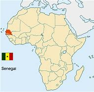
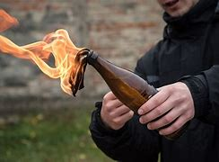

= eco 2020-06-20
:toc:

---

== Power plays 权力游戏; 高压攻势（政治）；集中攻势（球赛）   词汇解说

Who *runs the world*?

(eco 2020-6-20 / Special report / Power plays: Who’s in charge?)

*As* America *gets tired*, China *gets busy*

Jun 18th 2020 |

CRISES *CAN bring clarity*(n.)清晰；清楚；明确. In the financial crisis of 2008-09, the G20 club of big economies *came into 继承，得到（遗产） its own*, *reflecting* how economic power *had spread beyond* the rich world’s G7. 主 One thing the covid-19 pandemic *has laid bare* 暴露；揭露 系 *is* an absence of global leadership. This time the G20 *has done little* beyond 除…之外 a rhetorical 辞藻华丽的；虚夸的；花言巧语的;修辞的；修辞性的；带有修辞色彩的 pledge 保证，誓言 *to “do* whatever it takes 无论代价多少;不计代价” and *supporting debt-repayment suspension* 暂缓；推迟；延期 *for* poor countries. America, which *led* global campaigns *to defeat* HIV/AIDS and Ebola, *has been absorbed in* its internal arguments. And the UN Security Council *has confirmed* its dysfunctionality 机能不良，功能紊乱，官能障碍.

- G20 : 二十国集团（G20）由七国集团财长会议于1999年倡议成立，由阿根廷、澳大利亚、巴西、加拿大、中国、法国、德国、印度、印度尼西亚、意大利、日本、韩国、墨西哥、俄罗斯、沙特阿拉伯、南非、土耳其、英国、美国以及欧盟20方组成。 +
image:../../+ img_单词图片/g/G20.jpg[100,100]

- *lay sth bare* : (formal) to show sth that was covered or to make sth known that was secret 暴露；揭露 +
-> Every aspect of their private lives *has been laid bare*.
他们的私生活全面曝光了。

- 危机可以带来(现状真相的)清晰化。在2008-09年的金融危机中，由大型经济体组成的20国集团, 形成了自己的集团，反映出经济实力是如何扩散到富裕世界七国集团(G7)之外的。covid-19大流行暴露了全球领导力的缺失。covid-19大流行暴露了全球领导力的缺失。这一次，20国集团除了口头承诺“不惜一切代价”, 和支持暂停贫穷国家的债务偿还之外，几乎没有做什么。领导了全球抗击艾滋病毒/艾滋病和埃博拉的美国，已经被自己的国内争论所吸引。联合国安理会也证实了自己的功能失调。

The council’s 政务委员会，地方议会 five permanent members (P5) *are split*(v.)分裂，使分裂（成不同的派别）;分担；分摊；分享 *between* the Western three *and* Russia and China; some *suspect* the authoritarian(a.)威权主义的；专制的 duo(n.)一对表演者；搭档;二重奏；二重唱；二人组 *of* having(v.) a formal pact 条约；协议；公约. Russia *wields(v.) its veto* 否决权 often, sometimes alongside China. Instead of *leaping into action*(n.) (over covid-19), the council *mustered(v.)集合，召集，集结（尤指部队） its first discussion of the crisis* only in April. France and Russia *have both been keen for* the leaders of the P5 *to get together* in the UN’s anniversary year, but *have found* this hard to arrange.

- split : v. to divide, or to make a group of people divide, into smaller groups that have very different opinions 分裂，使分裂（成不同的派别） /  *~ sth (between sb/sth) | ~ sth (with sb)* to divide sth into two or more parts and share it between different people, activities, etc. 分担；分摊；分享 +
-> *The committee split* over government subsidies. 在政府补贴的问题上，委员会出现了相互对立的意见。
-> She *split* the money she won *with* her brother. 她把得到的钱与弟弟分了。

- muster :  /ˈmʌstər/ v.  *~ sth (up)* to find as much support, courage, etc. as you can 找寻，聚集，激起（支持、勇气等） /  to come together, or bring people, especially soldiers, together for example for military action 集合，召集，集结（尤指部队） / ( AustralE NZE ) to gather together sheep or cows 赶拢（牛、羊） +
=> 来自拉丁语monstrare,显示，展示，来自monere,提醒，警告，词源同admonish,demonstration.后用于军事术语指召集，聚集，战前动员等。鼻音n脱落，比较dental,tooth. +
-> *We mustered* what support we could *for* the plan. 我们极尽所能, 为这项计划寻求支持。 +
-> She left(v.) the room [*with all the dignity she could muster*(v.)] . 她尽量庄重体面地走了出去。

- 安理会的五个常任理事国(P5), 分为西方的三个国家以及俄罗斯和中国; 一些人怀疑这两个威权政体的二人组,有一个正式的协议。俄罗斯经常行使否决权，有时与中国一起行使否决权。理事会并没有立即就covid-19采取行动，而是在4月份才召集了第一次关于该危机的讨论。法国和俄罗斯都希望P5国家的领导人, 能在联合国周年纪念日聚在一起，但却发现这很难安排。。

The pandemic *hit* when competition between America and China, the world’s dominant(a.)处于支配地位的 and emerging superpowers, *was already intense*, *stretching from* trade and technology *to* finance and regional dominance(n.)优势; 统治地位 in Asia. In America *there is* a bipartisan 两党的；涉及两党的 perception of China *as* a rival(n.) (that *steals* intellectual property, *takes advantage of* America’s openness and *is intent(a.)决心做（尤指伤害他人的事） on* chipping(v.) away at 不停地削（或凿） America’s lead). For its part 就其本身而言, China *is increasingly brazen*(a.)厚颜无耻的;黄铜制的；黄铜色的 in *pushing back against* 反击 America (or any country *that resists(v.)抵制 it*).

- intent : a. *~ on/upon sth | ~ on/upon doing sth* ( formal ) determined to do sth, especially sth that will harm other people 决心做（尤指伤害他人的事） +
->  *Are you intent upon* destroying my reputation? 你是不是存心要败坏我的名誉？

- *chip away at sth* : to keep breaking small pieces off sth 不停地削（或凿） +
-> He *was chipping away at* the stone. 他不停地凿那块石头。 +
-> They *chipped away at the power of the government* (= gradually made it weaker) . 他们不断削弱政府的权力。

- 当疫情大流行来袭时，美国和中国, 一个是世界霸主, 一个是新兴的超级大国, 它们之间的竞争已经很激烈，领域包括从贸易和技术, 到金融, 及对亚洲地区的主导地位。在美国，两党都认为中国是一个窃取知识产权、利用美国的开放, 并意图削弱美国领先地位的对手。就其自身而言，中国越来越肆无忌惮地反击美国(或任何抵制它的国家)。

Any retreat by America from global leadership *is* an opportunity for China

The covid-19 crisis *is proving a telling(a.)生动的；显露真实面目的，说明问题的（通常并非有意） case study* 个案研究；专题研究；案例研究 of this rivalry 竞争；竞赛；较量, as America *blames* China *for* causing the pandemic / and China *positions 安装；安置；使处于 itself as* the country (most capable of *dealing with it*). Any retreat by America from global leadership *is* an opportunity for China *to gain ground* 变得更强大（或更有成效、更成功）；有进步；获得进展. Whereas America *has suspended funding(n.)基金；资金；提供基金；提供资金 to* the WHO, China *has promised* $2bn *to fight* the pandemic.

- *case study* : n. a detailed account of the development of a person, a group of people or a situation over a period of time 个案研究；专题研究；案例研究

- 美国退出全球领导地位的任何行动，对中国都是一个机会 +
covid-19危机就是一个很好的例子，美国指责中国造成了疫情，而中国将自己定位为最有能力应对疫情的国家。美国从全球领导地位上的任何退却，都是中国取得进展的机会。在美国暂停向世界卫生组织提供资金的同时，中国承诺为抗击疫情提供20亿美元。

President Xi Jinping *portrays  将…描写成；给人以某种印象；表现 China as* a champion of multilateralism 多边主义，多边政策（为达成核裁军多边协议） and *talks of* *taking “an active part in* leading(v.) the reform of the global governance system”. China *has been building channels(n.) of influence [outside* the institutions that America *designed*]. It *set up* the Asian Infrastructure Investment Bank, *encroaching 侵蚀，蚕食（土地）;侵占（某人的时间）；侵犯（某人的权利）；扰乱（某人的生活等） on* the World Bank’s territory. It *has championed* 为…而斗争；捍卫；声援 the BRICS 金砖四国 (*bringing it together* with Brazil, Russia, India and South Africa) and the Shanghai Co-operation Organisation, an eight-member group that *includes* Russia and Central Asian countries *as well as* India and Pakistan. And then there is Mr Xi’s Belt and Road Initiative (BRI), an all-embracing(a.)无所不包的；概括一切的 infrastructure and development campaign.

- 习表示，中国是多边主义的倡导者，将“积极参与引领全球治理体系改革”。中国一直在美国设计的制度之外建立影响渠道。中国成立了亚洲基础设施投资银行(Asian Infrastructure Investment Bank)，蚕食了世界银行(World Bank)的地盘。中国支持金砖国家(包括巴西、俄罗斯、印度和南非)和上海合作组织(一个包括俄罗斯、中亚国家以及印度和巴基斯坦的8国集团)。然后是习近平的一带一路倡议(BRI), 该活动是对各种基础设施建设和和开发活动的总括。

China *has also been methodically 有方法地；有系统地;有条不紊的,有条理地 increasing(v.) its influence* in existing institutions, not least the UN. It *has raised its financial support* even as America *became stingier*  小气的；吝啬的(比较级), *becoming* the second-biggest contributor *to* [both] the general 正常的；一般的；常规的 [and] the peacekeeping budgets. It *has grown more assertive*  坚定自信的；坚决主张的. “Ten years ago, China *was pretty discreet* (a.)（言行）谨慎的，慎重的，考虑周到的, *pretending to be* just an emerging country,” says one European diplomat at the UN. “Now *I can tell you* they are totally uninhibited(a.)纵情的；无拘无束的；随心所欲的, they *want to run the system*.”

- 中国还在有条不紊地增强其在现有机构中的影响力，尤其是在联合国。在美国变得更加吝啬的情况下，它却增加了财政支持，成为军费和维和预算的第二大贡献者。它变得更加自信。“十年前，中国相当谨慎，假装只是一个新兴国家，”联合国的一位欧洲外交官表示。“现在我可以告诉你，它们完全不受约束，它们想要管理这个系统。”

China has *been patiently placing*(v.)（小心或有意）放置，安放;使（人）处于某位置；安置；安顿 high-fliers(n.)有雄心壮志者; 可展翅高飞者(复数) *to work their way up* 逐步升职；按部就班晋升 through the ranks. Chinese nationals （某国的）公民 now *head*(v.) four of the UN’s 15 specialised agencies, including the Food and Agriculture Organisation in Rome and the International Telecommunication Union in Geneva. Americans *lead*(v.) only one. Chinese officials *toil （长时间）苦干，辛勤劳作;艰难缓慢地移动；跋涉  away* （用于动词后）持续地，劲头十足地 at *inserting into documents* ① favourable 有利的；有助于…的 references to the BRI and ② language (*friendly to* their interpretation of human rights), *stressing* national sovereignty 主权；最高统治权；最高权威 and development (“mutual respect and win-win co-operation”). [Behind the scenes] China *twists  扭转，转动（身体部位） arms* 软硬兼施;劝说；强迫；生拉硬拽；施加压力 to avoid(v.) criticism of its repression in Xinjiang or Tibet.

- *work your way up* : to move regularly to a more senior position in a company 逐步升职；按部就班晋升 +
-> He *worked his way up* from messenger boy to account executive. 他从送信员一步一步晋升为客户经理。

- *work your way through sth* : to do sth from beginning to end, especially when it takes a lot of time or effort 自始至终做（尤指耗费时间或力量的事） +
-> *She worked her way* through the pile of documents.
她从头至尾处理了那一堆文件。

- away : used after verbs to say that sth is done continuously or with a lot of energy （用于动词后）持续地，劲头十足地 +
-> She *was still writing away furiously* when the bell went. 铃声响时她还在不停地写着。 +
-> They *were soon chatting away* like old friends. 他们很快就像老朋友一样聊起天来。

- *twist sb's arm*  : ( informal ) to persuade or force sb to do sth 劝说；强迫；生拉硬拽；施加压力

- 中国一直在耐心地安置雄心勃勃的人，让他们在联合国机构中一路晋升。中国人现在领导着联合国15个专门机构中的4个，其中包括位于罗马的联合国粮农组织(Food and Agriculture Organisation), 和位于日内瓦的国际电信联盟(International Telecommunication Union)。美国人只领导这其中一个。中国官员努力在文件中加入对“一带一路”的支持，插入有利于他们解释人权的有利提法和语言，强调国家主权和发展(“相互尊重、合作共赢”)。在幕后，中国为了避免外界对其在新疆或西藏的镇压行为的批评，采取了软硬兼施的手段。

Small victories 胜利 for China *have mounted up*, often *in* obscure  无名的；鲜为人知的 documents and little-noticed forums, but occasionally *raising eyebrows* 扬起眉毛（表示不赞同或惊讶）. In the 15-member Security Council, for example, the West and its friends *can normally count on* 依赖，依靠，指望（某人做某事）；确信（某事会发生） the requisite 必需的；必备的；必不可少的 nine votes *to get their way* 执意地按自己的方式行事；不达到目的不罢休 on procedural （商业、法律或政治上的）程序 matters 程序事项. But in March 2018 主 an American-backed proposal for the UN high commissioner (一个国际委员会的)高级专员  for human rights *to brief(v.)给（某人）指示；向（某人）介绍情况;向（辩护律师）提供案情摘要 a formal session* （议会等的）会议，会期 on abuses 虐待 in Syria 谓 *was defeated* when, *after* Chinese pressure, Ivory Coast 象牙海岸（非洲）;科特迪瓦 *switched sides* [at the last minute].

- *count on sb/sth* : to trust sb to do sth or to be sure that sth will happen 依赖，依靠，指望（某人做某事）；确信（某事会发生） bank on sth +
-> ‘I'm sure he'll help. ’ ‘ *Don't count on it* . ’
“我肯定他会帮忙的。”“那可靠不住。”

- *get/have your own way* : to get or do what you want, especially when sb has tried to stop you 一意孤行；为所欲为 +
-> She always *gets her own way* in the end.
到最后总是她说了算。

- procedural : /prəˈsiːdʒərəl/ ADJ Procedural means involving a formal procedure. 程序的 +
->  A Spanish judge *rejected the suit [on procedural grounds*].
一名西班牙法官以程序理由驳回了该起诉。

- 中国取得的小胜利, 不断增加，通常是在一些不为人知的文件, 和不为人注意的论坛上，但偶尔也会引起人们的惊讶。例如，在由15个成员国组成的安理会中，西方国家及其盟友, 通常可以依靠必要的九票, 来解决程序性问题。但在2018年3月，一项由美国支持的提议, 被否决，该提议要求联合国人权事务高级专员, 就叙利亚的虐权问题, 举行一次正式会议，但因为在中国的压力下，科特迪瓦在最后一刻改变了立场。

The aim 目的；目标 *may not be* 表 *to replace*(v.) America *as* a superpower that *bears burdens* all around the world. More likely, China *simply wants* an unencumbered 无负担的；没有阻碍的；不受妨碍的 path *for* further development. “People’s Republic of the United Nations”, a report last year from the Centre for a New American Security (CNAS), a think-tank, *concluded that* China *was “making* the world *safe for autocracy*” 独裁政体；专制制度. For a long time *America paid little attention*, but *it is now pushing back*. In January the State Department （美国）国务院 *appointed* a senior diplomat, Mark Lambert, *to counter(v.)抵制；抵消; 反驳；驳斥 the “malign 有害的；引起伤害的 influence”* of China and others at the UN. In March these efforts *succeeded* in *thwarting* 阻止；阻挠；对…构成阻力 China’s bid for the top job at a fifth UN agency, the World Intellectual Property Organisation in Geneva.

- thwart : /θwɔːt/ [ VN ] *~ sth /~ sb (in sth)* to prevent sb from doing what they want to do 阻止；阻挠；对…构成阻力 +
=> 原义为副词，来自古诺斯语 thvert,穿过，横过. 词源同 turn,through,trans-. 后引申动词词义相反，阻止，阻挠等。

- 其目的可能不是要取代美国，成为一个在世界各地背负重担的超级大国。更有可能的是，中国只是想要一条不受阻碍的发展道路。智库“新美国安全中心”(CNAS)去年发布的一份报告《联合国人民共和国》断定，中国正在“为独裁统治创造世界安全”。在很长一段时间里，美国几乎没有注意到这一点，但现在它正在反击。今年1月，美国国务院任命高级外交官马克•兰伯特(Mark Lambert), 来对抗中国和其他国家在联合国的“恶意影响”。。今年3月，这些努力成功地挫败了中国对其联合国第五个机构 --  -- 位于日内瓦的世界知识产权组织(World Intellectual Property Organisation) --  -- 最高职位的申请。

At least such moves(n.) *reflect* a recognition  认出；认识；识别;承认；认可 by the American administration *that* multilateral institutions *matter*(v.). Just as Mr Trump no longer *calls* NATO “obsolete”(a.)淘汰的；废弃的；过时的, *as he did* [before *coming to power* （开始）掌权，上台], he *may yet find* more use(n.) [in the UN]. He *would not be* the first American president *to come to believe that*, annoying *as* 尽管；虽然；即使 international forums are, they are better *than* a constant 连续发生的；不断的；重复的;不变的；固定的；恒定的 free-for-all(n.)不加管制；自由放任;混战；众人激烈争辩；大吵大闹, and they *can take* some of the load 负载；负荷 *off* a superpower. But his transactional 交易的，业务的； （社会交往中）相互作用的; approach *has unnerved* allies, and *badly dented  损害，伤害，挫伤（信心、名誉等）;使凹陷；使产生凹痕 their trust*(n.) in American leadership.

-  as : used to say that in spite of sth being true, what follows is also true 尽管；虽然；即使
SYN though +
-> Happy *as* they were, there was something missing. 尽管他们很快乐，但总缺少点什么。 +
-> Try *as* he might (= however hard he tried) , he couldn't open the door. 他想尽了办法也没能打开门。

- constant : a. [常用于名词前] happening all the time or repeatedly 连续发生的；不断的；重复的 / that does not change 不变的；固定的；恒定的 +
-> Babies need *constant attention*. 婴儿一刻也离不开人。
-> travelling *at a constant speed of 50 m.p.h*.
以每小时50英里的恒定速度行驶

- 至少这些举动, 反映了美国政府对多边机构的重视。正如特朗普不再像上台前那样称北约为“过时的”一样，他或许还会在联合国找到更多有用之处。他不会是第一个相信这样一种观点的美国总统，尽管国际论坛令人讨厌，但它们总比一场持续的混战要好，而且它们可以减轻一个超级大国的负担。但他的交易方式让盟友不安，严重削弱了他们对美国领导地位的信任。

In search(n.) of a middle way

As a result, “middle powers” 中等强国,中等国家 *have been searching for* other ways *to defend* the liberal order. A white paper (*presented* last year by Norway’s foreign ministry *to* its parliament) *identified*  确认；认出；鉴定 *preventing* the erosion of international law and multilateral systems *as* a “primary foreign-policy interest”. In New York, France and Germany *launched* an Alliance （国家、政党等的）结盟，联盟，同盟 for Multilateralism 多边主义, with the aim of *forging(v.)艰苦干成；努力加强;锻造；制作 varied coalitions* （尤指多个政治团体的）联合体，联盟 *to take the initiative 掌握有利条件的能力（或机会）；主动权 on* issues *ranging from* fake news and responsible use of cyberspace *to* gender equality and strengthening international institutions.

- 因此，“中等国家”一直在寻找其他方式来捍卫自由秩序。挪威外交部去年向其议会提交的一份白皮书, 将防止国际法和多边体系的侵蚀, 确定为“首要的外交政策利益”。在纽约，法国和德国启动了多边主义联盟，目的是结成各种联盟，在假新闻、负责任地使用网络空间、性别平等, 和加强国际机构等问题上, 采取主动。

Coalitions of like-minded 想法相同的；志趣相投的 countries *have proliferated* 激增. After Mr Trump *abandoned* the Trans-Pacific Partnership, a free-trade deal, Australia, Japan and nine other countries *pressed ahead 坚决继续进行；匆忙前进；加紧 on their own*. The EU and Japan *completed a trade agreement* covering a third of the world’s GDP. On defence, President Emmanuel Macron of France *has gathered* 13 other countries *into* a European Intervention Initiative and *is ever keener on* “strategic autonomy”(n.)自治；自治权;自主；自主权 for Europe. 主 Asian countries *worried about* growing Chinese assertiveness 魄力，自信, and *unsure of* America’s commitment, 谓 *are deepening(v.) ties*.

- *press ahead/on (with sth)* : to continue doing sth in a determined way; to hurry forward 坚决继续进行；匆忙前进；加紧 +
-> The company *is pressing ahead* with its plans for a new warehouse. 这家公司正加紧推动设置新仓库的计划。 +
-> ‘Shall we stay here for the night?’ ‘No, *let's press on*.’ “我们今晚在这里住下好吗？”“不，咱们继续走。”

- 志同道合的国家联盟激增。在特朗普放弃了自由贸易协定《跨太平洋伙伴关系协定》(Trans-Pacific Partnership，简称tpp)之后，澳大利亚、日本和其他9个国家自行推进。欧盟和日本达成了一项涵盖全球三分之一GDP的贸易协定。在国防方面，法国总统伊曼纽尔·马克龙召集了其他13个国家加入欧洲干预倡议，并越来越热衷于让欧洲实现“战略自治”。亚洲国家对中国日益增长的自信很担忧，又不确定美国的承诺，这些都加深了中等国家之间的联系。

In such “minilateralist” or “plurilateralist” 多样的；多元的多边主义 ventures, national governments *are not* the only actors. Regional states, non-governmental organisations (NGOs) and business leaders *are* on stage too. In the response to covid-19, the Bill & Melinda Gates Foundation, a philanthropic  慈善的; 博爱的 giant, *is taking a more prominent part* than many governments. Several American states *have been busy* since Mr Trump *withdrew from* the Paris agreement. California’s governor, Jerry Brown, *hosted* a Global Climate Action Summit in 2018. *Totting up* 把…加起来；计算…的总和 actions at subnational 低于国家的/地方的 levels *that collectively would amount to* the world’s second-biggest economy, one estimate *suggests* they *could reduce* America’s greenhouse-gas emissions by 2030 *by* as much as 37% *from* 2005 levels.

-  plural :  /ˈplʊrəl/ a. relating to more than one 多样的；多元的 +
-> a plural society (= one with more than one racial , religious, etc. group) 多元社会

- philanthropic :  /ˌfɪlənˈθrɑːpɪk/ ADJ A philanthropic person or organization freely gives money or other help to people who need it. 慈善的; 博爱的 +
=> From French philanthropique

- *tot sth up* : ( informal ) ( especially BrE ) to add together several numbers or amounts in order to calculate the total 把…加起来；计算…的总和 / tot  : n. 幼儿 +
=> 词源不详，可能缩写自 totter,蹒跚，摇摆。

- 在这种“微型多边主义”或“多元多边主义”的冒险中，各国政府并不是唯一的行动者。地区国家、非政府组织和商业领袖也在台上发挥作用。在应对covid-19的行动中，慈善巨头比尔和梅林达•盖茨基金会(Bill & Melinda Gates Foundation)所起的作用, 比许多政府更为突出。自特朗普退出《巴黎协定》以来，美国几个州一直在忙碌。加州州长杰里·布朗(Jerry Brown)在2018年主持了一次全球气候行动峰会。将地方层面的行动加起来，就相当于世界第二大经济体，一项估计表明，到2030年，这些行动将使美国的温室气体排放量, 比2005年的水平减少37%。

主 Whether these scattered mid-level moves *can amount to* 总计；共计 *more than* the sum of their parts 系 *is* unclear. Michael Fullilove of the Lowy [人名]洛伊 Institute, an Australian think-tank, *suggests that* like-minded 想法相同的；志趣相投的 countries *should form* a “coalition of the responsible”. Since some middle powers, such as Taiwan and South Korea, *have distinguished(v.)使出众；使著名；使受人青睐 themselves* by their response to the pandemic, he also *proposes* “coalitions of the competent(a.)足以胜任的；有能力的；称职的;合格的；不错的；尚好的”. Further bungling 笨手笨脚地做；把…搞糟 by the big powers over covid-19 *could make* a concert 与…合作（或同心协力） of middle powers *more urgent*. But *do not bank on* 依靠；指望 this *being* a middle-power moment, says Kori Schake of the American Enterprise Institute, another think-tank. Without a dominant power *to set an agenda*, *force(v.)用力，强行（把…移动）;使发生（尤指趁他人尚未准备）;强迫，迫使（某人做某事） momentum*(n.)推进力；动力；势头 and *provide(v.) a chunk 相当大的量;厚块；厚片；大块 of funding*, *it is very hard* for co-operation among lesser countries “*to reach* escape velocity(n.)速度”. At best 充其量,至多 *it may slow rather than stop* the erosion of the liberal order.

- distinguish : v.  *~ yourself (as sth)* : to do sth so well that people notice and admire you 使出众；使著名；使受人青睐 +
-> *She has already distinguished(v.) herself as* an athlete. 作为运动员她已享有盛名。

- momentum : /moʊˈmentəm/ n. the ability to keep increasing or developing 推进力；动力；势头 / a force that is gained by movement 冲力 / ( technical 术语 ) the quantity of movement of a moving object, measured as its mass multiplied by its speed 动量 +
-> *They began to lose momentum* in the second half of the game. 在比赛的下半场，他们的势头就逐渐减弱。 +

- velocity : /vəˈlɑːsəti/ n. ( technical 术语 ) the speed of sth in a particular direction （沿某一方向的）速度 / ( formal ) high speed 高速；快速 +
=> 来自拉丁语 volo,飞，词源同 volatile,volley.引申词义极快的速度。或来自拉丁语 vehere,携带， 运载，词源同 vehicle. +
-> *the velocity of light* 光速 +

- 目前尚不清楚，这些中等力量国家, 它们分散的(结盟)行动, 其成效是否会超过其独自行动的总和。澳大利亚智库洛伊研究所的Michael Fullilove建议, 志同道合的国家应该组成一个“负责任的联盟”。由于一些中等强国，如台湾和韩国，在应对疫情方面表现突出，他还建议“有能力的国家结成联盟”。大国在covid-19问题上的进一步失误, 可能会使中等强国之间的协调合作变得更加紧迫。但是，另一个智库, 美国企业研究所的科里•斯卡克说，不要指望这是一个属于中等强国的时刻。如果没有一个主导力量, 来制定议程、推动势头, 并提供大量资金，较小国家之间的合作就很难“达到逃逸速度”。充其量，它可能会减缓而不是阻止对自由秩序的侵蚀。

If middle powers *are active*(a.)积极的, so *are* smaller ones. By *clubbing together* 凑份子；分担费用, even minnows 米诺鱼（多种小型鱼类的总称）; 无足轻重的（小）公司；不起眼的（小型）运动队 *can have influence*. [Under its charter 宪章，章程] the UN *is “based on the principle of* the sovereign(a.)有主权的；完全独立的 equality(n.)平等；均等；相等 of all its members”, 因此 so each of the 193 countries in the General Assembly *has one vote*(n.). India (1.4bn people) *counts* the same as Tuvalu (12,000).

- *club together* : ( BrE ) if two or more people club together , they each give an amount of money and the total is used to pay for sth 凑份子；分担费用 +
-> *We clubbed together* to buy them a new television. 我们凑钱给他们买了一台新电视机。

- minnow : /ˈmɪnoʊ/ n. a very small freshwater fish 米诺鱼（多种小型鱼类的总称） / a company or sports team that is small or unimportant 无足轻重的（小）公司；不起眼的（小型）运动队 +
=> 来自古英语myne,可能来自PIE*men,小的，词源同minute,minimum.用于指一种小的淡水鱼，后引申词义不起眼的小公司。 +
image:../../+ img_单词图片/m/minnow.jpg[100,100]

- 如果中等国家是积极行动的，那么较小的国家也能做到。通过联合起来，即使是小鱼也能产生影响。根据联合国宪章，联合国“基于所有成员国主权平等的原则”，因此联合国大会193个成员国各有一票投票权。印度(14亿人口)与图瓦卢(1.2万人口)的人口数量相同。

The Group of 77, *formed in 1964* and *now embracing(v.)包括；包含 134 members*, *pushes(v.) the interests of* 推动...的利益 developing countries. *It is less homogenous(a.) than it was* but *it can have influence* (eg, *over* the choice of secretary-general  秘书长) and *get attention* (*picking* Palestine 巴勒斯坦 *to serve as its chair* last year). The Alliance of Small Island States *helped* 宾 *put* the climate-change issue *on the map* 使出名；使有重要性. Samantha Power, America’s UN ambassador during Barack Obama’s second term, *made a point of* （因重要或必要）保证做，必定做 *visiting* her counterparts (from every member country) *at* their New York missions 使团；代表团；执行任务的地点: she *managed all* except North Korea’s.

- homogeneous : /ˌhoʊməˈdʒiːniəs/ a. ( formal ) consisting of things or people that are all the same or all of the same type 由相同（或同类型）事物（或人）组成的；同种类的 +
=>  -homo-同,同一 + -gen-生(殖) + -eous有…性质的 +
-> The unemployed *are not a homogeneous group*.
失业者并不都是同一类人。

- *put sb/sth on the map* : to make sb/sth famous or important 使出名；使有重要性 +
-> The exhibition *has helped put(v.) the city on the map*. 展览会使这个城市名扬四方。

- *make a point of doing sth* : to be or make sure you do sth because it is important or necessary （因重要或必要）保证做，必定做 +
-> *I made a point of* closing all the windows before leaving the house. 我离家前**必定要**把所有的窗子都关好。

- 77国集团成立于1964年，现在有134个成员国，致力于推动发展中国家的利益。虽然它不像以前那样具有同质性了，但是它依然可以拥有影响力(例如，在秘书长的选择上), 并且引起人们的关注(去年选择巴勒斯坦作为其主席)。小岛国家的联盟, 将气候变化问题提上了议事日程。萨曼莎·鲍尔(Samantha Power)是巴拉克·奥巴马(Barack Obama)第二任期内的美国驻联合国大使，，她特意拜访了所有成员国的驻纽约大使:她处理了除朝鲜以外的所有事务。

With just six embassies 大使及其随员; 大使馆 around the world, 主 *the diplomatic footprint* of *the Caribbean state* of *St Vincent and the Grenadines* 圣文森特和格林纳丁斯（岛名） (population: 111,000) 系 *is* tiny, but a good example of small-country influence. One of its embassies *is* in Taipei: it is among *a handful of states* that *officially recognise(v.) Taiwan*. Its mission in New York *has been expanding*, since St Vincent currently *has one of the ten non-permanent 非永久的 seats*(n.) on the 15-member Security Council. 主 “*The bedrock 牢固基础；基本事实；基本原则; 基岩（松软的沙、土层下的岩石） principle* that all small states *advocate追拥护；支持；提倡 for* 系 *is* 表 *adherence to* international law,” says Inga Rhonda King, St Vincent’s ambassador. They’*re* “very hard core” *over* sovereign equality, non-interference (物理客观)不干涉；不干预 and non-intervention （尤指对外国事务的）(人为主观)不干涉；不干涉（原则）, she *adds*. The Security Council seat *gives her a chance* to press(v.)坚持；反复强调 core concerns （对人、组织等）重要的事情 (especially climate security and relations with Africa) and, hers *being* a small country, *to do so nimbly* 敏捷地；机敏地. Ms King *would like to see* similar nimbleness 灵活,敏捷 in the council’s response to covid-19, *drawing attention to Africa* as the pandemic’s likely next frontier.

- bedrock : [ U ] the solid rock in the ground below the loose soil and sand 基岩（松软的沙、土层下的岩石） +
image:../../+ img_单词图片/b/bedrock.jpg[100,100]

- interference 和 intervention 的区别:

|===
|interference (不一定要改变结果) |intervention (会导致不同的结果)

|*Interfere* means to hinder, slow down, or obstruct the normal course of things, or the desired course of things.  +
*Interfere* means action to slow down or obstruct an action, *but not necessarily to change the outcome*. +

Interfere 的意思是阻碍、放慢或阻碍事物的正常进程或期望的进程。  +
*Interfere* 意味着行动放慢或阻碍行动，*但不一定要改变结果。*
|*Intervene* means to take action in order to change the outcome.  +
*Intervention* means action *to cause a different result*. +

Intervene 是指采取行动改变结果。 +
Intervene 意味着采取行动**导致不同的结果**。

|*interference* is to interfere / get between something.  +
for example: I am interfering into my friend's relationships. +
interference就是干涉某事。例如:我正在干涉我朋友的关系。 +
|*intervention* is more direct / stronger than interference.  +
for example: I will take you aside and lecture you about what you are doing wrong because you need an intervention. +
intervention 比 interference 更直接/更有力。例如:我会把你拉到一边，告诉你你做错了什么，因为你需要一个干预

|"*Interference*" is when external factors change the results of something: +

- If you put two speakers in the same place, you'll the interference. +
- Get out! You're interfering my experiment! +
- The weather interfered the results of the termometer. +

“*interference*”是指外部因素改变了某事的结果: +
- 如果你把两个扬声器放在同一个地方，你会受到干扰。 +
-  --  -- 出去!你在干扰我的实验! +
- 天气影响了测量结果。
|"*Intervention*" is an action, commonly used by the artistic community, that aims a change or a simple interaction with the public: +

- Yoko Ono made some remarkable interventions +
- Greenpeace did an intervention to stop air pollutions +

“*intervention*”是艺术界常用的一种行动，目的是改变或与公众进行简单的互动: +
- 小野洋子做了一些了不起的干预 +
- 绿色和平组织采取干预措施阻止空气污染

|
|

|===

- concern : n. something that is important to a person, an organization, etc. （对人、组织等）重要的事情 +
-> What are your *main concerns* as a writer? 作为一名作家，你主要关注的是哪些问题？ +
-> *The government's primary concern* is to reduce crime. 政府的头等大事是减少犯罪。

- nimble : /ˈnɪmbl/ a. able to move quickly and easily 灵活的；敏捷的 / ( of the mind 头脑 ) able to think and understand quickly 思路敏捷的；机敏的 +
=> 来自PIE*nem,分开，分配，拿，带，词源同number,numb.引申词义灵活的，敏捷的。

- 加勒比海国家圣文森特和格林纳丁斯(人口：111,000), 在世界各地只有6个大使馆，其外交足迹很小，但却是小国影响力的一个很好的例子。它的一个大使馆在台北：它是少数几个正式承认台湾的国家之一。由于圣文森特目前是安理会15个理事国中的10个非常任理事国之一，它在纽约的使命一直在扩大。圣文森特大使英加·朗达·金(Inga Rhonda King)表示：“所有小国倡导的基本原则, 就是遵守国际法。”她补充说，他们是主权平等、不妨碍和不干涉政策的“非常坚定的核心”贯彻者。安理会席位给了她一个机会来强调核心问题(特别是气候安全和与非洲的关系)，而且，作为一个小国，她可以灵活地做到这一点。金女士希望看到理事会在应对covid-19时也能采取类似的灵活措施，让人们注意到非洲可能是流感大流行的下一个前沿。

- 常任理事国 : 5个国家.
- 非常任理事国 : 10个国家. 任期2年，经选举每年更换5个，不能连选连任。 西欧及其他国家2个, 亚洲2个、非洲3个、拉美2个、东欧1个。

---

== Power plays

Who runs the world?

As America gets tired, China gets busy

Jun 18th 2020 |

CRISES CAN bring clarity. In the financial crisis of 2008-09, the G20 club of big economies came into its own, reflecting how economic power had spread beyond the rich world’s G7. One thing the covid-19 pandemic has laid bare is an absence of global leadership. This time the G20 has done little beyond a rhetorical pledge to “do whatever it takes” and supporting debt-repayment suspension for poor countries. America, which led global campaigns to defeat HIV/AIDS and Ebola, has been absorbed in its internal arguments. And the UN Security Council has confirmed its dysfunctionality.

The council’s five permanent members (P5) are split between the Western three and Russia and China; some suspect the authoritarian duo of having a formal pact. Russia wields its veto often, sometimes alongside China. Instead of leaping into action over covid-19, the council mustered its first discussion of the crisis only in April. France and Russia have both been keen for the leaders of the P5 to get together in the UN’s anniversary year, but have found this hard to arrange.

The pandemic hit when competition between America and China, the world’s dominant and emerging superpowers, was already intense, stretching from trade and technology to finance and regional dominance in Asia. In America there is a bipartisan perception of China as a rival that steals intellectual property, takes advantage of America’s openness and is intent on chipping away at America’s lead. For its part, China is increasingly brazen in pushing back against America (or any country that resists it).

Any retreat by America from global leadership is an opportunity for China

The covid-19 crisis is proving a telling case study of this rivalry, as America blames China for causing the pandemic and China positions itself as the country most capable of dealing with it. Any retreat by America from global leadership is an opportunity for China to gain ground. Whereas America has suspended funding to the WHO, China has promised $2bn to fight the pandemic.

President Xi Jinping portrays China as a champion of multilateralism and talks of taking “an active part in leading the reform of the global governance system”. China has been building channels of influence outside the institutions that America designed. It set up the Asian Infrastructure Investment Bank, encroaching on the World Bank’s territory. It has championed the BRICS (bringing it together with Brazil, Russia, India and South Africa) and the Shanghai Co-operation Organisation, an eight-member group that includes Russia and Central Asian countries as well as India and Pakistan. And then there is Mr Xi’s Belt and Road Initiative (BRI), an all-embracing infrastructure and development campaign.

China has also been methodically increasing its influence in existing institutions, not least the UN. It has raised its financial support even as America became stingier, becoming the second-biggest contributor to both the general and the peacekeeping budgets. It has grown more assertive. “Ten years ago, China was pretty discreet, pretending to be just an emerging country,” says one European diplomat at the UN. “Now I can tell you they are totally uninhibited, they want to run the system.”

China has been patiently placing high-fliers to work their way up through the ranks. Chinese nationals now head four of the UN’s 15 specialised agencies, including the Food and Agriculture Organisation in Rome and the International Telecommunication Union in Geneva. Americans lead only one. Chinese officials toil away at inserting into documents favourable references to the BRI and language friendly to their interpretation of human rights, stressing national sovereignty and development (“mutual respect and win-win co-operation”). Behind the scenes China twists arms to avoid criticism of its repression in Xinjiang or Tibet.

Small victories for China have mounted up, often in obscure documents and little-noticed forums, but occasionally raising eyebrows. In the 15-member Security Council, for example, the West and its friends can normally count on the requisite nine votes to get their way on procedural matters. But in March 2018 an American-backed proposal for the UN high commissioner for human rights to brief a formal session on abuses in Syria was defeated when, after Chinese pressure, Ivory Coast switched sides at the last minute.

The aim may not be to replace America as a superpower that bears burdens all around the world. More likely, China simply wants an unencumbered path for further development. “People’s Republic of the United Nations”, a report last year from the Centre for a New American Security (CNAS), a think-tank, concluded that China was “making the world safe for autocracy”. For a long time America paid little attention, but it is now pushing back. In January the State Department appointed a senior diplomat, Mark Lambert, to counter the “malign influence” of China and others at the UN. In March these efforts succeeded in thwarting China’s bid for the top job at a fifth UN agency, the World Intellectual Property Organisation in Geneva.

At least such moves reflect a recognition by the American administration that multilateral institutions matter. Just as Mr Trump no longer calls NATO “obsolete”, as he did before coming to power, he may yet find more use in the UN. He would not be the first American president to come to believe that, annoying as international forums are, they are better than a constant free-for-all, and they can take some of the load off a superpower. But his transactional approach has unnerved allies, and badly dented their trust in American leadership.

In search of a middle way

As a result, “middle powers” have been searching for other ways to defend the liberal order. A white paper presented last year by Norway’s foreign ministry to its parliament identified preventing the erosion of international law and multilateral systems as a “primary foreign-policy interest”. In New York, France and Germany launched an Alliance for Multilateralism, with the aim of forging varied coalitions to take the initiative on issues ranging from fake news and responsible use of cyberspace to gender equality and strengthening international institutions.

Coalitions of like-minded countries have proliferated. After Mr Trump abandoned the Trans-Pacific Partnership, a free-trade deal, Australia, Japan and nine other countries pressed ahead on their own. The EU and Japan completed a trade agreement covering a third of the world’s GDP. On defence, President Emmanuel Macron of France has gathered 13 other countries into a European Intervention Initiative and is ever keener on “strategic autonomy” for Europe. Asian countries worried about growing Chinese assertiveness, and unsure of America’s commitment, are deepening ties.

In such “minilateralist” or “plurilateralist” ventures, national governments are not the only actors. Regional states, non-governmental organisations (NGOs) and business leaders are on stage too. In the response to covid-19, the Bill & Melinda Gates Foundation, a philanthropic giant, is taking a more prominent part than many governments. Several American states have been busy since Mr Trump withdrew from the Paris agreement. California’s governor, Jerry Brown, hosted a Global Climate Action Summit in 2018. Totting up actions at subnational levels that collectively would amount to the world’s second-biggest economy, one estimate suggests they could reduce America’s greenhouse-gas emissions by 2030 by as much as 37% from 2005 levels.

Whether these scattered mid-level moves can amount to more than the sum of their parts is unclear. Michael Fullilove of the Lowy Institute, an Australian think-tank, suggests that like-minded countries should form a “coalition of the responsible”. Since some middle powers, such as Taiwan and South Korea, have distinguished themselves by their response to the pandemic, he also proposes “coalitions of the competent”. Further bungling by the big powers over covid-19 could make a concert of middle powers more urgent. But do not bank on this being a middle-power moment, says Kori Schake of the American Enterprise Institute, another think-tank. Without a dominant power to set an agenda, force momentum and provide a chunk of funding, it is very hard for co-operation among lesser countries “to reach escape velocity”. At best it may slow rather than stop the erosion of the liberal order.

If middle powers are active, so are smaller ones. By clubbing together, even minnows can have influence. Under its charter the UN is “based on the principle of the sovereign equality of all its members”, so each of the 193 countries in the General Assembly has one vote. India (1.4bn people) counts the same as Tuvalu (12,000).

The Group of 77, formed in 1964 and now embracing 134 members, pushes the interests of developing countries. It is less homogenous than it was but it can have influence (eg, over the choice of secretary-general) and get attention (picking Palestine to serve as its chair last year). The Alliance of Small Island States helped put the climate-change issue on the map. Samantha Power, America’s UN ambassador during Barack Obama’s second term, made a point of visiting her counterparts from every member country at their New York missions: she managed all except North Korea’s.

With just six embassies around the world, the diplomatic footprint of the Caribbean state of St Vincent and the Grenadines (population: 111,000) is tiny, but a good example of small-country influence. One of its embassies is in Taipei: it is among a handful of states that officially recognise Taiwan. Its mission in New York has been expanding, since St Vincent currently has one of the ten non-permanent seats on the 15-member Security Council. “The bedrock principle that all small states advocate for is adherence to international law,” says Inga Rhonda King, St Vincent’s ambassador. They’re “very hard core” over sovereign equality, non-interference and non-intervention, she adds. The Security Council seat gives her a chance to press core concerns (especially climate security and relations with Africa) and, hers being a small country, to do so nimbly. Ms King would like to see similar nimbleness in the council’s response to covid-19, drawing attention to Africa as the pandemic’s likely next frontier.

---

== Global firefighting(n.)消防; 救火  词汇解说

(eco 2020-6-20 / Special report / Global firefighting: Missions impossible)

The UN *has too much on its plate*(盘子；碟子) 有许多事等着做

Missions impossible

Jun 18th 2020 |

- *have enough/a lot/too much on your plate* : ( informal ) to have a lot of work or problems, etc. to deal with 问题（或工作等）成堆

主 MANKEUR NDIAYE, a former foreign minister of Senegal 塞内加尔（非洲国家） who *heads* the UN’s *peacekeeping(a.)维护和平的 mission* in the Central African Republic (CAR), 系 *is a tall man* with a tall task （尤指艰巨或令人厌烦的）任务，工作. 主 *The peace agreement* between the CAR and 14 armed groups *signed* in February 2019 系 *is* the eighth [since 2013], when 主 French intervention 谓 *narrowly averted(v.)防止，避免（危险、坏事） a genocide*(n.)种族灭绝；大屠杀. *The situation remains(v.) fragile* in a country *that is rich in diamonds and gold* but *poor in other respects*. Elections 选举，推选（尤指从政） *loom* in December. With a budget of $1bn, *twice* 两倍 that of the national government, the UN mission’s 12,000-odd 大约；略多 soldiers and 2,000 police *operate(v.) across a territory* (the size of France and Belgium combined). [In some areas] the state *has no effective presence*. The CAR 中非共和国 *has porous(a.)多孔的；透水的；透气的 borders* with other troubled places, such as the Democratic Republic of Congo, Sudan and South Sudan. *The hope is that* 主 peacekeepers *plus* international aid 谓 *give* the brittle state *a chance*.

- Senegal +

-  Central African Republic +
image:../../+ img_单词图片/c/Central African Republic.jpg[100,100]

- porous : /ˈpɔːrəs/ a. having many small holes that allow water or air to pass through slowly 多孔的；透水的；透气的 +
=> 词源解释见pore²词条 与词根-port-(运输)同源词根词缀： -por-(通过,通道) + -ous +
image:../../+ img_单词图片/p/porous.jpg[100,100]

- MANKEUR NDIAYE，塞内加尔前外交部长，现任联合国驻中非共和国维和任务负责人，他个子高高的，面临着艰巨的任务。中非共和国和14个武装组织, 于2019年2月签署了和平协议，这是自2013年以来的第8份和平协议。2013年法国的干预, 勉强避免了一场种族灭绝。对于一个钻石和黄金丰富, 但在其他方面贫乏的国家来说，这种和平协议仍然很脆弱。该国在12月即将举行大选。联合国维和部队的预算为10亿美元，是该国政府预算的两倍，其1.2万多名士兵和2000多名警察, 在面积比法国和比利时加起来还大的该国国土上, 执行任务。在该国一些地区，政府甚至没有有效存在。中非共和国的边界管理漏洞百出, 其周边就是刚果民主共和国、苏丹和南苏丹等其他动乱地区。希望维和部队和国际援助, 能给这个脆弱的国家一个维持稳定的机会。

The idea of a non-violent, international military operation *was invented* to clear up the Suez mess （组织欠佳等导致的）麻烦，困境，混乱 in 1956, with a lot of imagination and improvisation 即兴创作;临时准备;临时拼凑；临时做 (the first “blue helmets” 头盔 *were created* by spraying(v.) 喷；喷洒；向…喷洒 the liners 衬里；内衬 of American army helmets (*readily 快捷地；轻而易举地；便利地 available* in Europe)). Today, peacekeeping *is* one area 领域；方面 where the Security Council  安全理事会 *operates well*. Some 100,000 people from 120 countries *serve* in 13 missions, which *range from* ceasefire monitoring 监视,监控 in Cyprus and Lebanon *to* large, complex operations such as those in the CAR, Congo and Mali. The UN *claims* to protect(v.) about 125m vulnerable people around the world [*on a budget*(n.) *not much bigger than* that of New York City’s police department].

- improvise => im-,不，非，-provise,准备，词源同provide.即没准备，临时做的，即兴准备。

- 1956年，为了解决苏伊士运河的混乱局面，人们想出了非暴力的国际军事行动的主意，这个想法其实是充满了想象力和即兴发挥的(第一批“蓝盔”是通过向欧洲现成的美国陆军头盔的衬垫, 喷洒涂料而制造出来的)。今天，维持和平已经是安全理事会运作良好的一个领域了。来自120个国家的约10万人, 参与了13项任务，包括从塞浦路斯和黎巴嫩的停火监督，到中非共和国、刚果和马里的大型复杂行动。联合国声称，其保护全球约1.25亿弱势群体的预算，并不比纽约市警察局的预算大多少。

The peacekeepers’ role *has expanded into* supporting(v.) fragile states and *protecting civilians*. At its best 处在最好状态, this is admirable 可钦佩的；值得赞赏的；令人羡慕的.  In 2013 the UN *opened its military compounds*(n.)有围栏（或围墙）的场地（内有工厂或其他建筑群） in South Sudan *to* tens of thousands of 成千上万；数以万计 people *fleeing slaughter*. “主 No decision (*taken* since 1945) -- *at any level* in the UN -- 谓 ever *resulted in* the direct saving of more lives *than* that one,” *believes* Andrew Gilmour, until last December the UN’s *assistant(a.)助理的；副的 secretary-general* for human rights.

- 维和人员的职责, 已经扩大到支持脆弱的国家和保护平民。在它最好的时候，其效果是令人钦佩的。2013年，联合国向数万名逃离屠杀的人, 开放了其在南苏丹的军事基地。安德鲁·吉尔穆尔(Andrew Gilmour)认为：“自1945年以来--在联合国的任何层面上--做出的任何决定, 都没有比这一决定更直接地拯救过这么多人的生命。” 直到去年12月，他一直担任联合国负责人权事务的助理秘书长。

But the peace business *is getting harder*. The blue helmets’ job *used to be* to preserve(v.) stability after a settlement. “Now you *have* peacekeeping forces *in areas* where *there is no peace at all to keep*,” says Mr Guterres. In Congo, for example, 主 rebels *hiding* in the forests *close to* the north-eastern city of Beni frequently 谓 *abduct* 诱拐；劫持；绑架 people and *hack 砍；劈 them to death* with machetes 大刀；大砍刀. 主 Protests against MONUSCO 联合国驻刚果（金）稳定特派团, the UN peacekeeping mission, 系 *are common*. “The rebels *are killing us*, if you *cannot kill them*, then *go home*,” says Kizito bin Hangi, a civil-society 公民社会;组成民主社会的各个方面，如言论自由、司法独立等 leader in Beni. When *eight people were killed* less than 2km *from* MONUSCO’s offices last November, a protest the next day *got out of hand* 不可收拾；失去控制；难于控制. Furious civilians *tossed* （轻轻或漫不经心地）扔，抛，掷 in Molotov cocktails(（常指掺合不太相容的）混合物;鸡尾酒) 瓶装汽油弹；莫洛托夫燃烧瓶, *setting(v.) the place on fire* and *sending(v.) staff 宾补 fleeing*. Today, the former offices *consist of* 由…组成（或构成） some blackened  变黑的,烧焦的 bricks, *strewn* 把…布满（或散布在）；在…上布满（或散播） around a grassy field.

- *Molotov cocktail* : n.   /ˌmɒlətɒf ˈkɒkteɪl/
( BrE also ˈpetrol bomb ) a simple bomb that consists of a bottle filled with petrol/gas and a piece of cloth in the end that is made to burn just before the bomb is thrown 瓶装汽油弹；莫洛托夫燃烧瓶 +

- 但和平事务正变得越来越困难。蓝盔部队过去的工作是, 在和解后维护稳定。古特雷斯说：“现在，维和部队驻扎在根本没有和平可维护的地区。”例如，在刚果，躲藏在东北部城市贝尼附近的森林里的叛军, 经常绑架人们，并用砍刀砍死他们。反对联合国维和行动MONUSCO的抗议活动屡见不鲜。 “叛军正在杀害我们，如果你不能杀死他们，那就回家吧，”贝尼的一位公民社会领袖基齐托·本·汉吉(Kizito Bin Hangi)说。去年11月，在距离MONUSCO办公室不到2公里的地方，8人被杀，第二天的抗议活动失控。愤怒的平民投掷燃烧弹，放火焚烧了这个地方，工作人员纷纷逃离。今天，以前的办公室变成了一些烧焦的砖块组成，散落在草地上。

The changing nature of conflict *doesn’t help*. 主 Wars between states, which the UN *was set up to stop*, 谓 *have become rare*. Most fights *are now within countries*, often *involving* many parties. The humanitarian(a.)人道主义的（主张减轻人类苦难、改善人类生活）；慈善的 consequences *are disastrous*(a.)极糟糕的；灾难性的；完全失败的. The number of internally 内部地；国内地；内在地 displaced 无家可归的, 使背井离乡 people *has more than doubled* in a decade *to a record 51m*, according to the Norwegian Refugee 难民 Council. Of those, 46m *have been displaced within their own countries* by conflict and violence. Civil wars *are especially difficult to stop* through negotiation, since 主 *laying down* arms 兵器；武器 谓 *can seem too risky*.

- 冲突性质的改变也无济于事。国与国之间的战争 --  联合国成立的初衷就是为了制止战争 --  已经变得很少了。目前，大多数冲突都发生在国家内部，往往涉及多个党派。人道主义后果是灾难性的。根据挪威难民委员会(Norwegian Refugee Council)的数据，国内流离失所者的人数在10年内增加了一倍以上，达到创纪录的5100万人。其中，4600万人因国内冲突和暴力而流离失所。通过谈判来停止内战尤其困难，因为放下武器似乎风险太大。

Many organisations *are crowding in* 大批涌入（狭小的空间） *to help*. The art of peace *is* increasingly the art of partnerships, with the likes of the African Union, the World Bank and the European Union. Private diplomacy *is* also on the rise （数量或水平的）增加，提高, as groups such as the Centre for Humanitarian Dialogue (HD) 人道主义对话 in Geneva or the Berlin-based Berghof Foundation 基金会 *try to build bridges* where official channels *are missing or mistrusted*. Both the UN and private outfits 团队；小组；分队 *are striving to get* more women *involved*, *to make* peace work *more inclusive*(a.).

- 许多组织都参与进来提供帮助。和平相处的艺术手段, 日益成为与非洲联盟、世界银行和欧盟等组织, 建立伙伴关系的艺术。私人外交也在上升，日内瓦的人道主义对话中心(HD), 和柏林的伯格霍夫基金会(Berghof Foundation)等组织, 试图在官方渠道缺失或不信任的地方, 搭建桥梁。联合国和私营机构, 都在努力让更多的妇女参与进来，使和平工作更具包容性。

*In spite of* these efforts (and sometimes because of them, as the many actors 角色,男演员 *trip(v.)绊；绊倒 over* one another), frustration 受挫；受阻；阻止；挫败;懊丧；懊恼；沮丧 *abounds*(v.)大量存在；有许多. Conflicts *are still starting*, but big new peace agreements *have become rarer*: only seven or eight in the past decade, says David Harland of HD, *compared with* 30 or so in the 20 years after the fall of the Berlin Wall. In the Middle East since 2011 *a succession of UN envoys*  使者；使节；（谈判等的）代表 -- three in Yemen, four in Syria and six in Libya -- *have tried to resolve civil wars*, without success. Well-intentioned 用意良好的 (但却常事与愿违) mediation 调解；仲裁；调停 *can end up favouring(v.) one side over others*. In Syria, for example, local ceasefires *gave* President Bashar al-Assad *a chance to regroup*(v.)重整旗鼓；重新部署.

- trip : v. [ Voften + adv./prep. ] *~ (over/up) | ~ (over/on sth)* to catch your foot on sth and fall or almost fall 绊；绊倒 +
-> Be careful you *don't trip up on the step*. 你小心别在台阶上绊倒了。

- 尽管做出了这些努力(有时正是因为这些努力，许多角色会被另一个绊倒)，挫折还是比比皆是。冲突仍会爆发，而新的重大和平协议却越来越少:HD的David Harland说，在过去的十年里, 只签署了七八个和平协议，而在柏林墙倒塌后的20年里, 是有30个左右的。在中东，自2011年以来，联合国的一系列使团 --  3个在也门，4个在叙利亚，6个在利比亚 -- 试图解决内战，但都没有成功。善意的调解最终可能有利于一方而不是另一方。例如，在叙利亚，当地停火给总统巴沙尔·阿萨德(Bashar al-Assad)重新部署的机会。

Mr Guterres *has tried to leverage(v.)利用；举债经营;杠杆作用 the pandemic for peace*. On March 23rd *he called for* a global ceasefire, *to fight the virus*. A surprising number of armed groups *seemed interested in an excuse*(n.)借口；理由；辩解 to give talks a chance. [In Yemen] the Saudi-led coalition *announced* and then *extended a unilateral 单边的,单方面的 ceasefire*. In Afghanistan, for the first time in years, the UN *convened 召集，召开（正式会议） a digital meeting* of the Afghan government and six neighbours *plus* America and Russia (a “six plus two” formula 方案；方法 *that also brought* Iran and America *around the same table*). But war *persists* in Afghanistan, and ceasefires in Colombia and the Philippines *were broken*. And, as America and China *squabbled （为琐事）争吵，发生口角 over* the wording 措辞；用词 of a resolution, the Security Council *failed to throw its weight behind* 鼎力支持；全力相助 the initiative.

- squabble :  /ˈskwɑːbl/  v. [ V ] *~ (with sb) (about/over sth)* to argue noisily about sth that is not very important （为琐事）争吵，发生口角

- *throw/put your weight behind sth* : to use all your influence and power to support sth 鼎力支持；全力相助

- 古特雷斯试图利用疫情的机会来实现和平。3月23日，他呼吁全球停火，以抗击埃博拉病毒。数量惊人的武装组织似乎对给谈判一个机会的借口感兴趣。在也门，沙特领导的联盟宣布并延长了单方面停火。在阿富汗，联合国多年来第一次召开了由阿富汗政府、六个邻国,加上美国和俄罗斯参加的数字会议(“六加二”方案也将伊朗和美国拉到了同一张桌子上)。但阿富汗的战争仍在继续，哥伦比亚和菲律宾的停火协议被打破。而且，当美国和中国在决议的措辞上争论不休时，安理会也未能对该倡议表示支持。

If 主 ending(v.) conflicts 谓 *has become tougher*(a.)艰苦的；艰难的；棘手的(比较级), what about *tackling 应付，处理，解决（难题或局面） their causes 起因; 原因 and consequences*? That *opens vast vistas(n.)（未来可能发生的）一系列情景，一连串事情;（农村、城市等的）景色，景观 for* helping humanity. Perhaps *too vast*.

- 如果对结束冲突的努力, 变得更加困难了，那么转而处理造成其问题的原因和后果, 又会怎样呢? 这为如何帮助人类, 打开了广阔的前景。也许太庞大。

The short-term task *is* humanitarian 人道主义的 relief, *whether* from man-made *or* natural disasters. 主 That job -- *feeding(v.) the hungry*, *housing(v.) refugees*, *protecting(v.) health* -- 系 *is* huge. Last year about $18bn in humanitarian funding, some 70% of the world’s total, *was channelled(v.)（利用某途径）输送资金，提供帮助 through the UN*, *estimates* Mark Lowcock, the UN’s emergency-relief co-ordinator 协调人, *helping* more than 100m people. Roughly 60% of the money *comes from* America, Germany, Britain and the EU. China *provides very little*.

- 短期任务是人道主义救济，无论是对于人为灾害还是自然灾害。为饥民提供食物、为难民提供住房、保护健康的工作量是巨大的。据联合国紧急救援协调员Mark Lowcock估计，去年, 大约180亿美元的人道主义资金(约占世界总资金的70%)是通过联合国提供的，帮助了1亿多人。大约60%的资金来自美国、德国、英国和欧盟。中国提供的很少。

*The long* and *the short* of it

[Early this year] extra troubles *loomed*, with the assault on Idlib in Syria *as well as* locusts 蝗虫(复数) *swarming(v.) (人、动物等)成群地来回移动;(蜜蜂或其他飞行昆虫)成群地飞来飞去 across Africa*. Now covid-19 *threatens to multiply 成倍增加；迅速增加 the misery*. Mr Lowcock *suggests that* humanitarian relief this year *may need to rise by 20% or so*; and 主 perhaps $60bn in cheap finance from international financial institutions 谓 *should be targeted at* social protection. He *believes* this *could largely protect 700m people* across several dozen of the world’s poorest and most vulnerable countries. *It could also help* 宾 *to prevent*(v.) a one-year problem *from* becoming a ten-year one.

- swarm => 来自古英语 swearm,嗡嗡声，来自 Proto-Germanic*swarmaz,嗡嗡声，来自 PIE*swer,蜂鸣声， 耳语声，拟声词，词源同 absurd.

- 今年早些时候，随着对叙利亚伊德利卜地区的袭击, 以及蝗虫在非洲的肆虐，更多的麻烦隐现了。现在，covid-19有可能加剧这种痛苦。Lowcock先生建议, 今年的人道主义救济可能需要增加20%左右; 来自国际金融机构的600亿美元廉价融资，或许应该用于社会保障。他相信，这将在很大程度上保护世界上几十个最贫穷、最脆弱国家的7亿人。这也有助于防止一年的问题变成十年的问题。

主 Acting(v.) early 谓 *makes sense*, and *not* just over covid-19. 主 Rigidities 刻板；僵化 in funding(n.) (much of which *is tied to* specific programmes) 谓 *restrict(v.) Mr Lowcock’s room 空间；余地;可能性；机会 for manoeuvre*(n.)细致巧妙的移动；机动动作;策略；手段；花招；伎俩, but *he is keen to get ahead of 走在（某人的）前面；领先；胜过（某人） crises* through *risk pooling*(集中资源（或材料等）)风险共担 and *smart use of data*. He *reckons that* 主 some 10% of global emergencies, including hurricanes and droughts  久旱；旱灾, 系 *are insurable* 可保险的，适合保险的. And a further 10-15% *are [to some extent] predictable*. More effort on “anticipatory(a.)期待中的 action” *would mean* achieving(v.) cheaper, faster responses(n.) with less suffering.

- rigidity :  /rɪˈdʒɪdəti/  n. [物] 硬度，[力] 刚性；严格，刻板；僵化；坚硬 +

- manoeuvre: /məˈnuːvər/  n.  [ CU ] a clever plan, action or movement that is used to give sb an advantage 策略；手段；花招；伎俩
SYN move +
-> *diplomatic manoeuvres* 外交策略

-  risk pooling : 风险共担, 风险汇聚

- anticipatory :  /ænˌtɪsɪˈpeɪtərɪ/
ADJ An anticipatory(a.) feeling or action is *one that you have or do because you are expecting something to happen soon*. 期待中的 +
-> *an anticipatory smile*. 一个期待中的笑容。

- 及早采取行动是有道理的，而且不仅仅是针对covid-19。资金的僵化(其中大部分与特定项目挂钩)限制了洛科克的回旋余地，但他渴望通过风险汇集, 和对数据的巧妙利用，来在危机前取得进展。他估计大约10%的全球紧急情况，包括飓风和干旱，是可以投保的。另外的10-15%, 在某种程度上是可以预测的。在“预期行动”上付出更多努力，就意味着能够以更少的痛苦, 来实现更低成本、更快速的反应。

In Bangladesh, for example, 主 *giving money to people* early *to get out of the way 不再挡路；不再碍事 of floods* 谓 *has proved* to be efficient. Some scientists *think* they *can predict* outbreaks of cholera 霍乱 in Africa *before* a single case *is recorded*, [once *a threshold 阈；界；起始点 is reached* in trigger 触发器；引爆器;（尤指引发不良反应或发展的）起因，诱因 metrics 米制的；公制的]; 主 early action 谓 *could greatly reduce(v.) the damage*. Mr Lowcock *would like(v.) to experiment(v.) with a commitment* to release(v.) money against pre-agreed 预先约定的 problems (that *lend themselves to* 适合于 this approach). “*You can be wrong* on a lot,” he says, “and *it can still make sense*.”

- threshold :  /ˈθreʃhoʊld/ the level at which sth starts to happen or have an effect 阈；界；起始点; / 门槛；门口 +
=> 来自古英语 threscold,门槛，来自 threscan,踩踏，词源同 thresh.后拼写可能受 hold 影响俗化， 引申诸相关词义。
-> He has *a low boredom threshold* (= he gets bored easily) . 他极易感到乏味。 +
-> My earnings *are just above the tax threshold* (= more than the amount at which you start paying tax) . 我的收入刚刚超过征税起点。 +
image:../../+ img_单词图片/t/threshold.jpg[100,100]

- *LEND ITSELF TO STH* : to be suitable for sth 适合于 +
-> Her voice *doesn't really lend itself well to* blues singing. 她的嗓子不是很适于唱布鲁斯歌曲。

- 例如，在孟加拉国，早早给人们钱来躲避洪水, 已被证明是有效的。一些科学家认为，一旦达到触发指标的阈值，他们就可以在记录单个病例之前, 预测非洲的霍乱爆发；及早采取行动, 可以大大减少损害。Lowcock先生想试验一种承诺，即对预先商定好的, 适用于本处理方法的问题, 提供资金支持。“你可能在很多方面都是错的，”他说，“但这仍然是有意义的。”

In the medium term 中期, attention *turns to* the Sustainable Development Goals (SDGs) 可持续发展目标, `a set of aspirations` 渴望；抱负；志向 in 17 broad categories (with 169 targets) (*agreed upon* by `the UN General Assembly` 联合国大会 in 2015 and *meant 被普遍认为是 to be achieved by 2030*). *They make a comprehensive list* of human development, *covering(v.) everything* [from] `ending(v.) poverty and hunger` [to] `fighting(v.) inequality and pollution`. If `all the goals *were achieved*`, humanity *would be happy*. But in many areas `they *are* badly behind schedule`, and covid-19 *will set them back further*. This year, for the first time this century, the proportion of people `in extreme poverty` *is expected to grow*, `*wiping out* almost all the gains` of the past five years, if not more. The SDGs *are* anyway *more* of `a call to action` *than* `a realistic plan`. In that vein 风格；方式, the UN *is campaigning 从事运动 for* a “Decade of Action” *to honour* 信守，执行（承诺） these promises.

- *be meant to be sth* : to be generally considered to be sth 被普遍认为是 +
-> This restaurant *is meant to be excellent*. 都说这家饭店很棒

- vein : [ sing.U ] a particular style or manner 风格；方式 / 静脉 +
=>  来自拉丁语 vena,水道，管道，血管，来自 PIE*wegh,走，运送，词源同 wagon,way,引申词 义静脉。拼写比较 rain,irrigate. +
-> A number of other people *commented in a similar vein* . 其他一些人也以类似的腔调评论。 +
-> ‘And that's not all,’ he continued *in angry vein*. “那还不算全部呢。”他生气地继续说道。

- 中期而言，人们的注意力转向了可持续发展目标(SDGs)。2015年，联合国大会通过了17大类目标(共169项目标)的一系列目标，并计划到2030年实现。他们列出了人类发展的全面清单，涵盖了从消除贫困和饥饿, 到消除不平等和污染的方方面面。如果所有的目标都实现了，人类将会感到幸福。但在许多地区，它们严重落后于时间表，covid-19将使它们进一步倒退。今年，极端贫困人口的比例, 预计将出现本世纪第一次增长，这将抵消过去五年(甚至更长时间)取得的几乎所有成果。可持续发展目标, 更多的是一种行动号召，而不是一个现实的计划。本着这种精神，联合国正在开展“十年行动”，以兑现这些承诺。

Mr Guterres *started [as secretary-general]* by *emphasising* crisis prevention, but `this *has proved* heavy going`(n.)进展速度；难度, *given* `the divisions 分歧；不和；差异 among the big powers` and `the growing complexity of conflicts`. The climate crisis *has since come to the fore* 涌现出来,崭露头角,变得重要（或突出）；起重要作用, *both because of* its intrinsic 固有的；内在的；本身的, long-term importance *and because* it seems to offer the UN a way *to resonate(v.)产生共鸣；发出回响；回荡;使产生联想；引起共鸣；和…的想法（或观念）类似 with* young people. In New York last September Mr Guterres *organised* a climate-action summit. Greta Thunberg, a teenage Swedish activist, *warned* leaders *that* “young people are starting to understand your betrayal”(n.)（被）背叛，出卖.

- going : n. [ U ] ( used with an adjective 与形容词连用 ) *the speed with which sb does sth*; *how difficult it is to do sth* 进展速度；难度 +
-> Walking four miles in an hour *is pretty good going* for me. 一小时走四英里对我来说是相当不错了。 +
-> She had her own company by 25—*not bad going* ! 她25岁时就有了自己的公司—干得不错！ +
-> *It was hard going* getting up at five every morning. 每天早上五点钟起床太难了。

- *be/come to the fore* : (British English) (North Amercian English *be at the fore*) to be/become important and noticed by people; to play an important part 变得重要（或突出）；起重要作用
.. She *has always been to the fore* at moments of crisis.
在危急时刻她总是挺身而出。
.. The problem *has come to the fore again* in recent months.
近几个月来这个问题又成为热点。

- 古特雷斯在担任联合国秘书长之初就强调了预防危机，但鉴于大国之间的分歧和日益复杂的冲突，这被证明是一项艰巨的任务。从那时起, 气候危机问题就引人注目起来，不光是因为它具有着内在的、长期的重要性，也因为它似乎为联合国提供了一种途径, 能与年轻人产生共鸣。去年9月，古特雷斯在纽约组织了一次气候行动峰会。一位名叫Greta Thunberg的瑞典青少年活动家警告领导人说, “年轻人开始明白你们的背叛”。

The pandemic *has meant* the postponement 延期 of `the COP26 climate summit` in Glasgow (as well as `a biodiversity 生物多样性 summit` in Kunming and `an ocean conference` in Lisbon), to which countries *were meant to* bring(v.) bolder national commitments 承诺；许诺 *to cut carbon emissions*. But the delay *has* a green lining. Mr Guterres *has tried to link* the twin crises, *arguing for* policies  政策 that *ensure that* the recovery from covid-19 *helps* to save the planet.

- 这场疫情大流行, 意味着在格拉斯哥举行的COP26气候峰会(以及昆明的生物多样性峰会, 和里斯本的海洋会议), 被推迟. 各国本应在这次会议上做出更大胆的国家承诺，减少碳排放。但推迟也有一线希望。古特雷斯试图将这两场危机联系起来，主张制定政策，确保从covid-19中的恢复, 能帮助拯救地球。

On `Earth Day` 世界地球日, April 22nd, he *proposed* a six-point framework *to* that effect. His suggestions *are extremely broad* -- *tie*(v.)连接；联合；使紧密结合 `business rescues` *to* `creating(v.) green jobs`, for example, *end*(v.) `fossil-fuel 化石燃料 subsidies` 补贴金 and, unsurprisingly 不出所料的；不出奇的；意料中的, “*work together [as* an international community”] -- but they *are* a taste 体验；尝试 of `a campaign to come`. Advocacy(n.) （对某思想、行动方针、信念的）拥护，支持，提倡 of `drastic climate action` *has become* something of `a rallying cry` （团结众人的）战斗口号，信念 for the UN. *As* Richard Gowan, UN director at the International Crisis Group (ICG), an NGO, *points out*: “UN optimists 乐观主义者 *are* mostly people (*with the bleakest 不乐观的；无望的；暗淡的(最高级) view* on climate), because they *imagine* `it’s what *draws* the UN *back together*`.”

- tie : [ usually passive ] v. *~ sb/sth (to sth/sb)* to connect or link sb/sth closely with sb/sth else 连接；联合；使紧密结合
.. Pay increases *are tied(v.) to inflation*. 提高工资和通货膨胀紧密相关。

- *rallying cry* :  n. a phrase or an idea that is used to encourage people to support sb/sth （团结众人的）战斗口号，信念

- 在4月22日的世界地球日，他为此提出了一个六点框架。他提的建议, 与创造绿色就业机会有着极其广泛的联系，例如，结束化石燃料补贴，并不出所料地“作为一个国际社会共同努力” -- 但这些都只是一场即将到来的运动的一个尝试。倡导采取严厉的气候行动, 已经成为联合国的战斗口号。正如非政府组织"国际危机组织"(ICG)的联合国事务总监理查德·高恩(Richard Gowan)指出的那样：“联合国的乐观主义者, 大多是对气候问题持最悲观看法的人，因为他们认为, 正是气候问题, 才将联合国重新团结在一起。”

- The World Earth Day : 世界地球日. 每年的4月22日，专为世界环境保护而设立的节日.

*Has* Mr Guterres *got his priorities 优先处理的事 right*? `主` The criticism (that *stings* 激怒；使不安;刺；蜇；叮 most) `系` *is* personal. *It is that* the secretary-general *puts politics [over `core principles`]* and *pulls his punches*(n.)重拳击打；用力的捶打 in an area `that is *neither* short-, medium- *nor* long-term *but* timeless`(a.)永恒的；不受时间影响的: human rights. Mr Guterres *is accused of* failing(v.) *to defend(v.) the charter* (which *commits* the UN *to promote* “universal `respect(n.) for`, and `observance(n.)（对法律、习俗的）遵守，奉行 of`, human rights”) by *speaking out against* 挺身（反对某事物）；公开站出来（反对） abuses(n.) by powerful governments, including `China’s detention 拘留；扣押；监禁 of Uighurs` and `Saudi Arabia’s murder of Jamal Khashoggi`, a critic of the regime. Some predecessors 前任, such as Kofi Annan, *were more forceful* 强有力的；坚强的;有说服力的. Even the often invisible Ban Ki-moon 潘基文 *launched* `Human Rights up Front`  在前锋位置, a campaign `*to insert* the issue *across* the UN’s work`. Zeid Ra’ad al-Hussein, a former UN human-rights commissioner, *has condemned* Mr Guterres’s “weakness”. Kenneth Roth, head of Human Rights Watch 值班（人）；警戒（人）；守夜（人）, an NGO, *has warned that* his term *was becoming* “*defined* by his silence on human rights”.

- *up front* : (informal) as payment in advance 预付；先付 / in sports 体育运动 in a forward position 在前锋位置
.. *We'll pay you half [up front]* and the other half when you've finished the job. 我们先付一半给你，工作完成后再付另一半。
.. to play *up front* 担任前锋

- 古特雷斯先生的优先任务做对了吗? 最伤人的批评是针对个人的。这就是秘书长将政治置于核心原则之上，并在一个既不是短期、中期也不是长期但永恒的领域出拳：人权。古特雷斯被指控未能捍卫《宪章》(该宪章要求联合国促进“普遍尊重和遵守人权”)，他公开反对强势政府的暴行，包括中国拘留维吾尔人, 以及沙特阿拉伯谋杀政权批评者贾马尔•哈苏吉。他的一些前任，如科菲•安南(Kofi Annan)，更为强硬。甚至连经常隐身的潘基文也发起了“人权先行”(Human Rights up Front)运动，将这个问题贯穿联合国的工作。前联合国人权专员扎伊德•拉阿德•侯赛因谴责古特雷斯的“软弱”。非政府组织人权观察(Human Rights Watch)的负责人肯尼斯•罗斯(Kenneth Roth)警告说，"他在人权问题上的沉默, 该态度定义了他的说话言辞"。

Mr Guterres’s defenders *say* {such attacks *are unfair*}. He *has picked* his moments *to speak up* in public, *whether* on Uighurs in China *or* Rohingyas in Myanmar, and *has championed women’s rights*, [*within* the UN *and beyond*]. Yes, *he avoids confrontations*(n.) `that *would be* counter-productive`(a.)产生相反结果的 (he *never criticises* Donald Trump *by name*, for example). But `this *gives* him the ability` *to deliver a strong message* behind the scenes. `宾` What powder 粉末；细面 `主` he *has must be kept dry*. “[At the UN] `there is practically 实际地；几乎；事实上 no power at all`,” he says. “[When you’re in government] `you have some power`. Here `it’s basically a bluff` 虚张声势；唬人；吹牛, or `an illusion 错误的观念；幻想`.”

- *keep one's powder dry* : 有备无患. powder指枪炮用的火药。

- bluff => 词源同blow. 或直接来自拟声词。

- 古特雷斯的支持者说, 这样的攻击是不公平的。无论是在中国的维族人还是在缅甸的罗兴亚人问题上，他都抓住机会公开发言，并在联合国内外支持妇女权利。是的，他避免会适得其反的对抗(例如，他从不指名道姓地批评唐纳德·特朗普(Donald Trump))。但这让他有能力在幕后传递强有力的信息。他必须有备无患。他说:“在联合国几乎没有任何权力。”“当你在政府里的时候，你有一些权力。而在这里(联合国)基本上只能是虚张声势，或只是幻想。”

`A second, broader 更广泛的, criticism` of the UN `系` *is that* it simply does too much. It *is*, in effect, *trying to save the world [several times over 再；又]*. Its many aims 目的；目标 *may be wonderful*, and *interconnected* 使互相联系; 互相联系, but *it lacks(v.) the capacity* `to pursue(v.) them all [effectively]`. It *has taken on* more than *it was designed for*. And the design itself *needs(v.) a fresh look*  样子；外观；相貌；外表;时尚；式样；风格.

- over : again 再；又
.. He *repeated it several times over* until he could remember it. 他重复了几遍直到能记住为止。
( NAmE )
.. It's all wrong -- *you'll have to do it over*. 完全错了。你得重做一遍。

- 对联合国的第二个更广泛的批评是, 它做得太多了。实际上，它曾多次试图拯救世界。它的许多目标可能是美好的，相互关联的，但它缺乏能力, 来有效地实现所有这些目标。它现在所承担的, 已经远远超出了当年对联合国任务的设计范畴。而这个联合国设计, 它现在本身也需要重新来规划, 以焕然一新。

---

== Global firefighting

The UN has too much on its plate

Missions impossible

Jun 18th 2020 |

MANKEUR NDIAYE, a former foreign minister of Senegal who heads the UN’s peacekeeping mission in the Central African Republic (CAR), is a tall man with a tall task. The peace agreement between the CAR and 14 armed groups signed in February 2019 is the eighth since 2013, when French intervention narrowly averted a genocide. The situation remains fragile in a country that is rich in diamonds and gold but poor in other respects. Elections loom in December. With a budget of $1bn, twice that of the national government, the UN mission’s 12,000-odd soldiers and 2,000 police operate across a territory the size of France and Belgium combined. In some areas the state has no effective presence. The CAR has porous borders with other troubled places, such as the Democratic Republic of Congo, Sudan and South Sudan. The hope is that peacekeepers plus international aid give the brittle state a chance.

The idea of a non-violent, international military operation was invented to clear up the Suez mess in 1956, with a lot of imagination and improvisation (the first “blue helmets” were created by spraying the liners of American army helmets readily available in Europe). Today, peacekeeping is one area where the Security Council operates well. Some 100,000 people from 120 countries serve in 13 missions, which range from ceasefire monitoring in Cyprus and Lebanon to large, complex operations such as those in the CAR, Congo and Mali. The UN claims to protect about 125m vulnerable people around the world on a budget not much bigger than that of New York City’s police department.

The peacekeepers’ role has expanded into supporting fragile states and protecting civilians. At its best, this is admirable. In 2013 the UN opened its military compounds in South Sudan to tens of thousands of people fleeing slaughter. “No decision taken since 1945 -- at any level in the UN -- ever resulted in the direct saving of more lives than that one,” believes Andrew Gilmour, until last December the UN’s assistant secretary-general for human rights.

But the peace business is getting harder. The blue helmets’ job used to be to preserve stability after a settlement. “Now you have peacekeeping forces in areas where there is no peace at all to keep,” says Mr Guterres. In Congo, for example, rebels hiding in the forests close to the north-eastern city of Beni frequently abduct people and hack them to death with machetes. Protests against MONUSCO, the UN peacekeeping mission, are common. “The rebels are killing us, if you cannot kill them, then go home,” says Kizito bin Hangi, a civil-society leader in Beni. When eight people were killed less than 2km from MONUSCO’s offices last November, a protest the next day got out of hand. Furious civilians tossed in Molotov cocktails, setting the place on fire and sending staff fleeing. Today, the former offices consist of some blackened bricks, strewn around a grassy field.

The changing nature of conflict doesn’t help. Wars between states, which the UN was set up to stop, have become rare. Most fights are now within countries, often involving many parties. The humanitarian consequences are disastrous. The number of internally displaced people has more than doubled in a decade to a record 51m, according to the Norwegian Refugee Council. Of those, 46m have been displaced within their own countries by conflict and violence. Civil wars are especially difficult to stop through negotiation, since laying down arms can seem too risky.

Many organisations are crowding in to help. The art of peace is increasingly the art of partnerships, with the likes of the African Union, the World Bank and the European Union. Private diplomacy is also on the rise, as groups such as the Centre for Humanitarian Dialogue (HD) in Geneva or the Berlin-based Berghof Foundation try to build bridges where official channels are missing or mistrusted. Both the UN and private outfits are striving to get more women involved, to make peace work more inclusive.

In spite of these efforts (and sometimes because of them, as the many actors trip over one another), frustration abounds. Conflicts are still starting, but big new peace agreements have become rarer: only seven or eight in the past decade, says David Harland of HD, compared with 30 or so in the 20 years after the fall of the Berlin Wall. In the Middle East since 2011 a succession of UN envoys -- three in Yemen, four in Syria and six in Libya -- have tried to resolve civil wars, without success. Well-intentioned mediation can end up favouring one side over others. In Syria, for example, local ceasefires gave President Bashar al-Assad a chance to regroup.

Mr Guterres has tried to leverage the pandemic for peace. On March 23rd he called for a global ceasefire, to fight the virus. A surprising number of armed groups seemed interested in an excuse to give talks a chance. In Yemen the Saudi-led coalition announced and then extended a unilateral ceasefire. In Afghanistan, for the first time in years, the UN convened a digital meeting of the Afghan government and six neighbours plus America and Russia (a “six plus two” formula that also brought Iran and America around the same table). But war persists in Afghanistan, and ceasefires in Colombia and the Philippines were broken. And, as America and China squabbled over the wording of a resolution, the Security Council failed to throw its weight behind the initiative.

If ending conflicts has become tougher, what about tackling their causes and consequences? That opens vast vistas for helping humanity. Perhaps too vast.

The short-term task is humanitarian relief, whether from man-made or natural disasters. That job -- feeding the hungry, housing refugees, protecting health -- is huge. Last year about $18bn in humanitarian funding, some 70% of the world’s total, was channelled through the UN, estimates Mark Lowcock, the UN’s emergency-relief co-ordinator, helping more than 100m people. Roughly 60% of the money comes from America, Germany, Britain and the EU. China provides very little.

The long and the short of it

Early this year extra troubles loomed, with the assault on Idlib in Syria as well as locusts swarming across Africa. Now covid-19 threatens to multiply the misery. Mr Lowcock suggests that humanitarian relief this year may need to rise by 20% or so; and perhaps $60bn in cheap finance from international financial institutions should be targeted at social protection. He believes this could largely protect 700m people across several dozen of the world’s poorest and most vulnerable countries. It could also help to prevent a one-year problem from becoming a ten-year one.

Acting early makes sense, and not just over covid-19. Rigidities in funding (much of which is tied to specific programmes) restrict Mr Lowcock’s room for manoeuvre, but he is keen to get ahead of crises through risk pooling and smart use of data. He reckons that some 10% of global emergencies, including hurricanes and droughts, are insurable. And a further 10-15% are to some extent predictable. More effort on “anticipatory action” would mean achieving cheaper, faster responses with less suffering.

In Bangladesh, for example, giving money to people early to get out of the way of floods has proved to be efficient. Some scientists think they can predict outbreaks of cholera in Africa before a single case is recorded, once a threshold is reached in trigger metrics; early action could greatly reduce the damage. Mr Lowcock would like to experiment with a commitment to release money against pre-agreed problems that lend themselves to this approach. “You can be wrong on a lot,” he says, “and it can still make sense.”

In the medium term, attention turns to the Sustainable Development Goals (SDGs), a set of aspirations in 17 broad categories (with 169 targets) agreed upon by the UN General Assembly in 2015 and meant to be achieved by 2030. They make a comprehensive list of human development, covering everything from ending poverty and hunger to fighting inequality and pollution. If all the goals were achieved, humanity would be happy. But in many areas they are badly behind schedule, and covid-19 will set them back further. This year, for the first time this century, the proportion of people in extreme poverty is expected to grow, wiping out almost all the gains of the past five years, if not more. The SDGs are anyway more of a call to action than a realistic plan. In that vein, the UN is campaigning for a “Decade of Action” to honour these promises.

Mr Guterres started as secretary-general by emphasising crisis prevention, but this has proved heavy going, given the divisions among the big powers and the growing complexity of conflicts. The climate crisis has since come to the fore, both because of its intrinsic, long-term importance and because it seems to offer the UN a way to resonate with young people. In New York last September Mr Guterres organised a climate-action summit. Greta Thunberg, a teenage Swedish activist, warned leaders that “young people are starting to understand your betrayal”.

The pandemic has meant the postponement of the COP26 climate summit in Glasgow (as well as a biodiversity summit in Kunming and an ocean conference in Lisbon), to which countries were meant to bring bolder national commitments to cut carbon emissions. But the delay has a green lining. Mr Guterres has tried to link the twin crises, arguing for policies that ensure that the recovery from covid-19 helps to save the planet.

On Earth Day, April 22nd, he proposed a six-point framework to that effect. His suggestions are extremely broad -- tie business rescues to creating green jobs, for example, end fossil-fuel subsidies and, unsurprisingly, “work together as an international community” -- but they are a taste of a campaign to come. Advocacy of drastic climate action has become something of a rallying cry for the UN. As Richard Gowan, UN director at the International Crisis Group (ICG), an NGO, points out: “UN optimists are mostly people with the bleakest view on climate, because they imagine it’s what draws the UN back together.”

Has Mr Guterres got his priorities right? The criticism that stings most is personal. It is that the secretary-general puts politics over core principles and pulls his punches in an area that is neither short-, medium- nor long-term but timeless: human rights. Mr Guterres is accused of failing to defend the charter (which commits the UN to promote “universal respect for, and observance of, human rights”) by speaking out against abuses by powerful governments, including China’s detention of Uighurs and Saudi Arabia’s murder of Jamal Khashoggi, a critic of the regime. Some predecessors, such as Kofi Annan, were more forceful. Even the often invisible Ban Ki-moon launched Human Rights up Front, a campaign to insert the issue across the UN’s work. Zeid Ra’ad al-Hussein, a former UN human-rights commissioner, has condemned Mr Guterres’s “weakness”. Kenneth Roth, head of Human Rights Watch, an NGO, has warned that his term was becoming “defined by his silence on human rights”.

Mr Guterres’s defenders say such attacks are unfair. He has picked his moments to speak up in public, whether on Uighurs in China or Rohingyas in Myanmar, and has championed women’s rights, within the UN and beyond. Yes, he avoids confrontations that would be counter-productive (he never criticises Donald Trump by name, for example). But this gives him the ability to deliver a strong message behind the scenes. What powder he has must be kept dry. “At the UN there is practically no power at all,” he says. “When you’re in government you have some power. Here it’s basically a bluff, or an illusion.”

A second, broader, criticism of the UN is that it simply does too much. It is, in effect, trying to save the world several times over. Its many aims may be wonderful, and interconnected, but it lacks the capacity to pursue them all effectively. It has taken on more than it was designed for. And the design itself needs a fresh look.

