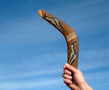
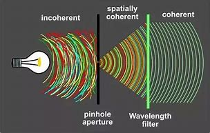

= eco 2020-06-20
:toc:

---

==  Reflections 沉思；深思；审慎的思考 at 75 词汇解说

(eco 2020-6-20 / Special report / Reflections at 75: The wisdom of youth)

The UN *is mobilising* 组织；鼓动；动员 for the next quarter-century 四分之一个世纪

The wisdom of youth

Jun 18th 2020 |

LUCKILY, *GIVEN* the pandemic, the UN *did not plan(v.) a boastful birthday*. Instead, it *decided to ask* `what the world *thinks*`. It *has launched an effort* to gather(v.) views from everywhere, in the spirit of `the opening words 开场白;起始句 of its charter`, “We the peoples”.

- “We the people”一词，源自于美国联邦宪法序言：“ We `the people of the United States`, *in order to form*(v.) a more perfect Union, *establish* justice, *insure* domestic tranquility 宁静；平静, *provide for* the common defense, *promote* the general welfare, and *secure* the blessings 好事；有益之事;上帝的恩宠；祝福；祝颂 of liberty *to* ourselves and our posterity, do *ordain* 授予圣秩（品）；授予圣职; (神、法律或命运)主宰；掌握；规定 and *establish* this Constitution *for* the United States of America. ” +
这个序言的中文意思是“我们合众国人民，为建立更完善的联盟，树立正义，保障国内安宁，提供共同防务，促进公共福利，并使我们自己和后代得享自由的幸福，特为美利坚合众国制定本宪法。” +
(ordain  /ɔːrˈdeɪn/  => 来自拉丁语ordinare,安排，布置，指定，词源同order.引申词义安排职位，授予圣职或圣秩。)

- 幸运的是，考虑到疫情大流行局面，联合国并没有计划庆祝一个自吹自擂的生日。相反，它决定问问世界对其是怎么想的。它本着《宪章》开头话语“我们联合国人民”的精神，发起了一项收集世界各地意见的努力。

*With the help of* a mass online survey, in-depth 彻底的；深入详尽的 polling(n.)民意测验 across 50 countries, hundreds of `live 现场直播的；实况转播的 “dialogues”` and `a trawl （对资料、文件等的）查阅;（海上捕鱼用的）拖网 of research`, the plan *is* to find out `what people *would like to see* 25 years from now`, when the UN *reaches* 100. The views of young people *are* a special focus 焦点;中心点（指人或事物）. Half the world’s population *is* under 30, *points out* Jayathma Wickramanayake, the secretary-general’s youth envoy 使者；使节；（谈判等的）代表, yet *they have little say(n.)决定权；发言权 in* how it is run.

- say : n. [ sing.U ] *~ (in sth)* the right to influence sth by giving your opinion before a decision is made 决定权；发言权 +
-> People *want a greater say(n.) in local government*. 人们要求在当地的政务中有更大的发言权。

- 在一项大规模在线调查的帮助下, 该调查在50个国家进行了深入的民意调查、数百场现场“对话”, 把做了大量研究. 该调查计划, 旨在找出25年后，当联合国达到100岁时，人们希望看到什么。年轻人的观点到底是怎样的, 是一个特别的焦点领域。联合国秘书长的青年特使Jayathma Wickramanayake指出，世界上有一半的人口在30岁以下，但他们对联合国如何运作几乎没有发言权。

The aim of UN75 *is* `表` ① “*to give* `a vitamin 维生素；维他命 shot` *to* what [at times] *feels like* `quite a fatigued 身心交瘁；精疲力竭 enterprise` （尤指艰巨而重大的）规划，事业 and ② *come up with new ideas*,” says Fabrizio Hochschild, the official *in charge*. The results *will be presented to* the General Assembly in September. `主` Preliminary 预备性的；初步的；开始的 findings(n.) *released* in April `谓` *suggest* {主 the world 谓 *thinks* pretty much 几乎,差不多就是 `what the UN *was hoping*`}. The priorities 优先事项；最重要的事；首要事情 *were* environmental protection, human rights, less conflict, equal access to basic services and zero discrimination. Fully 95% of survey respondents 回答问题的人；（尤指）调查对象 *thought* `主` international co-operation `系` *was “essential” or “very important”* (the number *ticked (钟表等)发出滴答声；滴答地走时 up* [as covid-19 *took hold*]). As for 至于，就…方面说来 `how co-operation *might work better*`, ideas *included* a more bottom-up (计划、项目等)自下而上的；从点到面的 approach, more effective partnerships 伙伴关系;合作关系；合作 and more involvement of `women, young people and the vulnerable` （身体上或感情上）脆弱的，易受…伤害的.

- enterprise : n. [ C ] a large project, especially one that is difficult SYN venture （尤指艰巨而重大的）规划，事业
.. his latest *business enterprise* 他最新的企业规划
.. *a joint enterprise* 共同事业

- UN75的目标是“给有时感觉相当疲惫的联合国事业,注入维他命; 并提出新的想法” 该项目负责人法布里齐奥·霍奇希尔(Fabrizio Hochschild)说。结果将于9月提交给联合国大会。4月公布的初步调查结果表明，全世界的看法与联合国的期望相当接近。优先事项是: 环境保护、人权、减少冲突、平等获得基本服务, 和零歧视。95%的受访者认为, 国际合作是“必要的”或“非常重要的”(这一数字随着covid-19的出现而上升)。至于如何更好地开展合作，一些想法包括: 采用更自下而上的执行方式、更有效的合作关系, 以及让妇女、年轻人和弱势群体更多地参与进来。

All this *aligns 使一致 nicely with* themes(n.) `the UN *hopes to use*(v.) 目的状 *to breathe(v.) life into* （给某事物）带来起色，注入活力 the “inclusive” multilateralism` that Mr Guterres *espouses*  支持，拥护，赞成（信仰、政策等）. On climate change, it *wants* business, finance, NGOs, youth movements and others *to pile 堆放；摞起；叠放 pressure on* governments 目的状 `*to make* more ambitious carbon-cutting pledges`(n.)保证；诺言；誓约 at `the COP26 climate summit` in Glasgow next year. Beyond that, the green theme *will run and run*. The covid-19 crisis *will pass*, but the climate one *will remain a priority* for years to come.

- align : [ VN ] *~ sth (with/to sth)* to change sth slightly so that it is in the correct relationship to sth else 使一致 +
-> Domestic prices *have been aligned with* those in world markets. 国内价格已调整到与世界市场一致

- *breathe (new) life into sth* : to improve sth by introducing new ideas and making people more interested in it （给某事物）带来起色，注入活力

- espouse : |ɪˈspaʊz| => e-, 缓音字母。spouse, 配偶。比喻义相互扶持，相互支持。

- 所有这些, 都与古特雷斯所拥护的联合国主题相一致。联合国希望用该主题, 来为更具有“包容性”的多边主义, 注入新的活力。在气候变化问题上，它希望商业、金融、非政府组织、青年运动, 和其他组织, 向政府施加压力，促使它们在明年格拉斯哥举行的COP26气候峰会上, 做出更雄心勃勃的减排承诺。除此之外，绿色主题运动还将继续运行下去。covid-19危机将会过去，但气候危机仍将是未来多年的优先事项。

Gender equality *is* a second test 考验. The UN *is trying to lead by example* 以身作则. Half the 180 `senior leaders` in its secretariat （大型国际组织、政治组织的）秘书处，书记处 *were women* [at the start of this year], *up from a third* three years ago. 主 `*Achieving parity(n.)（尤指薪金或地位）平等，相同，对等 out* [in the field]` 系 *is harder*. [In peacekeeping operations] the aim *is* for [at least] a quarter of `military observers` and `staff officers` *to be women* by 2028, *compared with 15%* last year. 主 `*Overcoming* 克服；解决 resistance from governments` 系 *is harder still*, so the UN *is trying to build alliances with* businesses, NGOs and local authorities, *to achieve change [from the bottom up]*.

- lead by example 以身作则

- 性别平等是第二个考验。联合国正努力以身作则。今年年初，联合国秘书处的180位高级领导人中, 有一半是女性，而三年前这一比例只有三分之一。要在这一领域实现平等, 则更加困难。维和行动的目标是，到2028年，至少四分之一的军事观察员和参谋人员是女性，而去年这一比例为15%。克服来自政府的阻力更加困难，因此联合国正试图与企业、非政府组织和地方当局建立联盟，以实现自下而上的变革。

You *say* `you want a revolution`

`主` A third area (that *lends(v.)给予，提供（帮助、支持等）;给…增加，增添（特色）  itself to* innovative 引进新思想的；采用新方法的；革新的；创新的 efforts(n.)) `系` *is* digital. The pace of change *is such* `*that* regulation *struggles to keep up*`. If governments *take years to negotiate agreements* and even more *to ratify(v.)正式批准；使正式生效 them*, [by the time `rules *are* ready`] `主` the real world (and *even more* the virtual one) `谓` *has moved on*  开始做（别的事）；换话题. The UN *favours* a nimbler 灵活的；敏捷的(比较级) way, involving *not just* governments *but* companies, research centres and NGOs [*in a form of* soft regulation 目的状 `*to exchange* best practices` and `*set boundaries for* new technologies such as artificial intelligence`]. Mr Guterres *set up* a high-level panel, *co-chaired by* Jack Ma and Melinda Gates (philanthropists 慈善家 of, respectively 分别；各自;顺序为；依次为, Alibaba and Microsoft fame), *to draw up 拟订；制订；起草 a report* on digital interdependence （各部分）相互依存，相互依赖. `主` Working groups (on `digital human rights` and `digital public goods`) `谓` *have picked up 付账 its recommendations* 正式建议；提议. In this “new multilateralism”, says Mr Guterres, `主` what *was once done* [only by governments] `谓` *is now done* [*through* “permanent platforms of co-operation], with a multi-stakeholder （某组织、工程、体系等的）参与人，参与方；有权益关系者(投入资金的人) approach”.

- ratify => -rat-计算,思考 + -ify动词词尾. 来自 rate,评估，评价，-fy,使。即经过评估的。

- 第三个有利于创新的领域是数字领域。变化的步伐如此之快，以至于监管部门难以跟上。如果各国政府花了数年时间来谈判协议，甚至花了更多时间来批准它们，等到规则准备好时，现实世界(甚至是虚拟世界)已经发生了变化。联合国倾向于一种更灵活的方式，不仅让政府参与，还让企业、研究中心和非政府组织以一种软监管的形式参与，以交流最佳实践，并为人工智能等新技术设定边界。古特雷斯成立了一个高级别小组，由马云和梅琳达•盖茨(分别是阿里巴巴和微软的慈善家)联合主持，起草一份关于数字相互依存的报告。数字人权和数字公共产品工作组已经采纳了它的建议。古特雷斯说，在这种“新多边主义”中，过去只有政府才能做的事情，现在通过“永久的合作平台，以及多方利益相关者的方式”来实现。

Inclusive multilateralism *has other attractions*. The UN, which *has* the convening 召集，召开（正式会议） power *to bring parties together*, *sees a chance* to play a leading role. Wider participation *could deepen* trust, and *give* more opportunities *to hold* governments *to account* 解释；说明. Flexible approaches *could also help* tackle(v.) other frontier issues that are likely to grow in importance, such as the interface （两学科、体系等的）接合点，边缘区域 *between* Earth systems *and* the international system (`主` `the recent clash (over the Amazon)` between the Brazilian and French presidents `系` *may be* a foretaste 预先的体验；预示；征象) and `the governance` of everything *from* genetic engineering and new weaponry （总称某一类型或某国、某组织的）武器，兵器 *to* the ocean and space.

- interface : *~ (between A and B)* the point where two subjects, systems, etc. meet and affect each other （两学科、体系等的）接合点，边缘区域 +
-> *the interface between* manufacturing *and* sales 制造和销售之间的衔接

- foretaste :  /ˈfɔːrteɪst/ n. *a ~ (of sth)* : a small amount of a particular experience or situation that shows you what it will be like when the same thing happens on a larger scale in the future 预先的体验；预示；征象 +
-> They were unaware that the street violence was just *a foretaste of what was to come*. 他们没有意识到，这起街头暴力预示着未来大规模的暴力行为。

- 具有包容性地多边主义, 还有其他吸引力。联合国拥有召集各方的能力，它看到了自己在其中发挥主导作用的机会。更广泛的参与, 可以加深信任，并为政府问责提供更多机会。灵活的方法也可能有助于解决其他可能变得越来越重要的前沿性问题，比如全球体系和国际间体系之间的衔接处问题(最近巴西和法国总统, 在亚马逊大火问题上的冲突, 就可能是一个预兆)，以及从基因工程和新型武器, 到海洋和太空的一切治理问题。

Multi-stakeholder 多方利益相关者 initiatives *are not new*. Various sorts *have proliferated* 迅速繁殖（或增殖）；猛增 in recent years, *whether* `to chivvy(v.)强求；催促 particular sectors` （尤指一国经济的）部门，领域，行业 (`the Extractive(a.)提取的；提炼的；（尤指矿物）冶炼的 Industries` Transparency Initiative *or* the Roundtable 圆桌的，圆台 on `Sustainable （对自然资源和能源的利用）不破坏生态平衡的，合理利用的;可持续的 Palm Oil`), `*run* the internet` (ICANN) or `*improve* government` (Open Government Partnership). But inclusiveness  包容；包容性 *is not a panacea* 万灵药；万能之计. It *raises* `accountability 问责;有义务；有责任；可说明性 issues` of its own. A bigger role for businesses and NGOs *sounds good*, but they *don’t answer to 向某人（为某事）负责 voters* （尤指政治性选举的）投票人，选举人，有选举权的人. Some initiatives *find* {*it* easier `*to issue* 宣布；公布；发出 broad pleas *for* good behaviour` (like `the Paris Call` for `Trust and Security` in Cyberspace) *than* `*to produce(v.) rules*`, let alone `*ensure(v.) compliance*(n.)服从；顺从；遵从`}. [In authoritarian 威权主义的；专制的 countries] *it* is not easy *to include* voices(n.) from civil society; `主` one tactic 策略；手段；招数 `in China’s efforts(n.) to influence(v.) international organisations`, according to the CNAS study, `系` *is* the creation of “government-organised non-government organisations”, or GONGOs. 由政府组织的非政府组织; 官办非政府组织

- chivvy : /ˈtʃɪvi/ [ VN to inf ] *~ sb (into sth) | ~ sb (along)* : ( BrE ) to try and make sb hurry or do sth quickly, especially when they do not want to do it 强求；催促 +
=> 来自15世纪的一首民谣Ballad of Chevy Chase，反映的是英格兰和苏格兰的一场最终演变成战争的打猎活动。地名Chevy词义也发生了变化。 +
-> He chivvied them into the car. 他催促他们上车。

- ICANN : abbr. 互联网名称与数字地址分配机构（Internet Corporation for Assigned Names and Numbers）

- panacea : /ˌpænəˈsiːə/ *~ (for sth)* something that will solve all the problems of a particular situation 万灵药；万能之计 +
=> 来源于希腊语形容词pas, pasa, pan(全部的)和名词akos(治疗)。 词根词缀： pan-全 + acea治疗 +
panacea一词直接借自希腊语。在希腊神话里Panacea是医药神Asclepius之女，她能治百病，所以被人尊奉为医药女神。Panacea这一名字本身在希腊语中就含有“能治百病”的意思。正是由于这个原因，panacea进入英语后常作“万应药”或“灵丹妙药”解，但在现代用法中panacea常用于讽刺意义。

- "多方利益相关者"的倡议并不新鲜。近年来，各种各样的组织如雨后春笋，有针对特定行业的(采掘行业透明度倡议, 或可持续棕榈油圆桌会议)，有运营互联网的(ICANN)，也有改善政府的(开放政府伙伴关系)。但"包容性"也并不是万灵药。它本身也提出了问责的问题。让企业和非政府组织发挥更大的作用, 这种方式听起来不错，但它们并不对选民负责。一些倡议发现，对良好行为发出广泛的呼吁(比如巴黎会议上呼吁网络空间的信任和安全问题), 比制定规则要更容易，更不用说还要确保它们被遵守了。在威权国家，要想包含来自民间社会的声音, 也并不容易; 根据CNAS的研究，中国试图影响国际组织的一个策略就是, 创建“由政府组织的非政府组织”(GONGOs)。

And for `all the good intentions` of `the secretary-general’s panel` on digital interdependence, the biggest development *is* the stand-off （双方）僵持局面 between America and China over technology, amid arguments(n.) over `who *will dominate* the next generation of telecoms infrastructure` and *fears that* `a “splinternet” 互联网分裂 of rival digital spheres *is* in the making`  在生产（或形成）过程中. The covid-19 crisis *has reinforced* the power of states, *from* massive intervention in economies *to* monitoring(v.) people’s movement. `主` *Opening up* the multilateral system *to* more voices `系` *is* welcome, but [as the UN *looks ahead to* life at 100], 强调句 *it is* governments -- especially `the big beasts` among them -- *that* will still shape(v.) the future world order.

- *in the making* : in the process of becoming sth or of being made 在生产（或形成）过程中

- 尽管秘书长的"数字化相互依赖"的专家小组, 有着良好的意图，但最大的事态发展却是, 美国和中国在技术问题上的对峙，围绕着谁将主导下一代电信基础设施的争论，以及担忧着正在形成中的"互联网领域, 会在竞争对手之间分裂成两个独立的数字世界"。新冠肺炎危机, 强化了国家的力量，从大规模干预经济, 到监控人员流动。向更多的呼声要求, 开放多边体系, 这个行动是受欢迎的，但当联合国展望其100岁的生命时，政府——尤其是其中的庞然大物——仍将是塑造未来的世界秩序的主要力量。

---

== Reflections at 75

The UN is mobilising for the next quarter-century

The wisdom of youth

Jun 18th 2020 |

LUCKILY, GIVEN the pandemic, the UN did not plan a boastful birthday. Instead, it decided to ask what the world thinks. It has launched an effort to to gather views from everywhere, in the spirit of the opening words of its charter, “We the peoples”.

With the help of a mass online survey, in-depth polling across 50 countries, hundreds of live “dialogues” and a trawl of research, the plan is to find out what people would like to see 25 years from now, when the UN reaches 100. The views of young people are a special focus. Half the world’s population is under 30, points out Jayathma Wickramanayake, the secretary-general’s youth envoy, yet they have little say in how it is run.

The aim of UN75 is “to give a vitamin shot to what at times feels like quite a fatigued enterprise and come up with new ideas,” says Fabrizio Hochschild, the official in charge. The results will be presented to the General Assembly in September. Preliminary findings released in April suggest the world thinks pretty much what the UN was hoping. The priorities were environmental protection, human rights, less conflict, equal access to basic services and zero discrimination. Fully 95% of survey respondents thought international co-operation was “essential” or “very important” (the number ticked up as covid-19 took hold). As for how co-operation might work better, ideas included a more bottom-up approach, more effective partnerships and more involvement of women, young people and the vulnerable.

All this aligns nicely with themes the UN hopes to use to breathe life into the “inclusive” multilateralism that Mr Guterres espouses. On climate change, it wants business, finance, NGOs, youth movements and others to pile pressure on governments to make more ambitious carbon-cutting pledges at the COP26 climate summit in Glasgow next year. Beyond that, the green theme will run and run. The covid-19 crisis will pass, but the climate one will remain a priority for years to come.

Gender equality is a second test. The UN is trying to lead by example. Half the 180 senior leaders in its secretariat were women at the start of this year, up from a third three years ago. Achieving parity out in the field is harder. In peacekeeping operations the aim is for at least a quarter of military observers and staff officers to be women by 2028, compared with 15% last year. Overcoming resistance from governments is harder still, so the UN is trying to build alliances with businesses, NGOs and local authorities, to achieve change from the bottom up.

You say you want a revolution

A third area that lends itself to innovative efforts is digital. The pace of change is such that regulation struggles to keep up. If governments take years to negotiate agreements and even more to ratify them, by the time rules are ready the real world (and even more the virtual one) has moved on. The UN favours a nimbler way, involving not just governments but companies, research centres and NGOs in a form of soft regulation to exchange best practices and set boundaries for new technologies such as artificial intelligence. Mr Guterres set up a high-level panel, co-chaired by Jack Ma and Melinda Gates (philanthropists of, respectively, Alibaba and Microsoft fame), to draw up a report on digital interdependence. Working groups on digital human rights and digital public goods have picked up its recommendations. In this “new multilateralism”, says Mr Guterres, what was once done only by governments is now done through “permanent platforms of co-operation, with a multi-stakeholder approach”.

Inclusive multilateralism has other attractions. The UN, which has the convening power to bring parties together, sees a chance to play a leading role. Wider participation could deepen trust, and give more opportunities to hold governments to account. Flexible approaches could also help tackle other frontier issues that are likely to grow in importance, such as the interface between Earth systems and the international system (the recent clash over the Amazon between the Brazilian and French presidents may be a foretaste) and the governance of everything from genetic engineering and new weaponry to the ocean and space.

Multi-stakeholder initiatives are not new. Various sorts have proliferated in recent years, whether to chivvy particular sectors (the Extractive Industries Transparency Initiative or the Roundtable on Sustainable Palm Oil), run the internet (ICANN) or improve government (Open Government Partnership). But inclusiveness is not a panacea. It raises accountability issues of its own. A bigger role for businesses and NGOs sounds good, but they don’t answer to voters. Some initiatives find it easier to issue broad pleas for good behaviour (like the Paris Call for Trust and Security in Cyberspace) than to produce rules, let alone ensure compliance. In authoritarian countries it is not easy to include voices from civil society; one tactic in China’s efforts to influence international organisations, according to the CNAS study, is the creation of “government-organised non-government organisations”, or GONGOs.

And for all the good intentions of the secretary-general’s panel on digital interdependence, the biggest development is the stand-off between America and China over technology, amid arguments over who will dominate the next generation of telecoms infrastructure and fears that a “splinternet” of rival digital spheres is in the making. The covid-19 crisis has reinforced the power of states, from massive intervention in economies to monitoring people’s movement. Opening up the multilateral system to more voices is welcome, but as the UN looks ahead to life at 100, it is governments—especially the big beasts among them—that will still shape the future world order.

---

==  Time to rediscover(v.)重新发现；重新找到 statesmanship 政治才能；治国才干 词汇解说

(eco 2020-6-20 / Special report / Three future scenarios 设想; 可能的情况: Bedlam 混乱嘈杂的场面；喧闹, bumbling 笨手笨脚的（常马虎出错）;装模作样 or boldness 大胆；冒失；显著?)

Three future scenarios for the UN

Bedlam, bumbling or boldness?

Jun 20th 2020 |

- scenario : /səˈnærioʊ/

- bedlam : /ˈbedləm/ n. [ U ] a scene full of noise and confusion 混乱嘈杂的场面；喧闹 SYN chaos +
=> bedlam是Bethlehem（伯利恒）的缩写 Bethlem（伯利恒）是英国伦敦一所著名的精神病院。单词bedlam就来自该精神病院的名称，用来表示“精神病院”。后来，该词又衍生出“喧闹”或“喧闹之地”的含义，并一直使用到现在，成为该词当前的主要含义。 助记窍门：bedlam→bed lamb→床上有只羔羊→喧闹的地方

- 是时候重新发现政治家的才能了 +
联合国未来的三种情况 : 争吵喧闹, 装模作样, 还是大胆革新?

[IN A SPEECH in January] Mr Guterres *conjured 使…呈现于脑际；使想起 up* “four horsemen” 骑兵；骑士 *to describe* the challenges *facing the world*. The first *represented* the worst `geostrategic 地缘政治学的 tensions` in years, with a real risk of a “great fracture” （指事实）骨折，断裂，折断，破裂. Next, said the secretary-general, the planet 行星;地球（尤指环境） *was burning*, and `an existential 存在主义的；有关存在的 crisis` *was close to a point of* no return 不可逆转. His third horseman *took the form of* 表现为…的形式 rising(a.) global mistrust, often *spilling 溢出；漫出 into hatred*(n.)仇恨；憎恨；厌恶, amid ① `discontent(n.)不满；不满足 over inequality` and ② `the sense(n.)（对重大事情的）感觉，意识 (among too many 许多人) that globalisation *is not working*`. Lastly, the dark side of digital technology *threatened ① to invade(v.) privacy*, ② `*disrupt*(v.) work` ③ and `*unleash*(v.) lethal 致命的；可致死的 autonomous 自主的；有自主权的 machines in war`.

- Four Horsemen of the Apocalypse : 末日四骑士，又称天启四骑士，出自《圣经新约》末篇《启示录》第6章，传统上和文学作品里, 将其解释为 : +
.. 白马骑士-征服（或胜利）(/瘟疫)、 +
.. 红马骑士-战争、 +
.. 黑马骑士-饥荒、 +
.. 绿马骑士（一说灰马骑士）-死亡， +
不过，对于白马骑士的解释略有争议，有神职人员和宗教学者认为其代表瘟疫。

- conjure : /ˈkɑːndʒər/ : v. to do clever tricks such as making things seem to appear or disappear as if by magic 变魔术；变戏法；使…变戏法般地出现（或消失） +
=> con-, 强调。-jur, 发誓，念咒，词源同abjure, jurist. +
image:../../+ img_单词图片/c/conjure.jpg[100,100]

- *CONJURE STH UP* :
(1) to make sth appear as a picture in your mind 使…呈现于脑际；使想起 / (2) to make sb/sth appear by using special magic words 用咒语使…出现

- 在今年1月的一次演讲中，古特雷斯用“末日四骑士”来描述世界面临的挑战。第一个危机, 是多年来最严重的地缘政治紧张局面，存在实际的风险会“关系大破裂”。接着的第二个危机，秘书长说，大地正在燃烧，一场生存危机已经接近于不可逆转的地步(临界点)。第三个危机的表现形式是 : 全球不信任的加剧，往往会演变(蔓延)成仇恨 / 对不平等的不满 / 以及太多的人感觉到, 全球化并没有发挥作用。最后一个危机，是数字技术的阴暗面, 有着三大威胁 : 侵犯隐私 / 破坏(扰乱)正常的工作 / 及 在战争中制造出(释放出)致命的具有自主能力的武器.

If this *was not apocalyptic(a.)描述（历史）大动乱的；预示（未来）大灾变的;似末世的；像世界末日的 enough*, a fifth horseman *is now galloping(v.)（马等）飞奔，奔驰，疾驰 around the globe*. Covid-19 *has claimed hundreds of thousands of lives* and `*plunged* 使经历，使陷入（不快的事情） the world *into* a recession` *far deeper than* that of 2008-09. *Worse could be to come* if `the virus *proceeds*(v.)继续做（或从事、进行） *to devastate* 彻底破坏；摧毁；毁灭 poorer countries` before *boomeranging 回旋镖,飞去来器 back into* rich ones. And [in response] the world *has seemed rudderless*(a.)无人管理的；无指导的；漫无目的的. National leaders *have been too preoccupied*(a.)心事重重；一门心思 fighting(v.) the disease in their own countries *to have much appetite 食欲；胃口;强烈欲望 for* international efforts. And at the UN, the Security Council *has been a bystander* 旁观者.

- apocalyptic : /əˌpɑːkəˈlɪptɪk/ a. describing very serious damage and destruction in past or future events 描述（历史）大动乱的；预示（未来）大灾变的 / like the end of the world 似末世的；像世界末日的

- gallop  /ˈɡæləp/  => 来自wallop的拼写变体，即well leap.

- boomerang : /ˈbuːməræŋ/ [ V ] if a plan boomerangs on sb, it hurts them instead of the person it was intended to hurt 害人反害己；自食其果 +
=> 来自澳大利亚土著语。现主要用于短语boomerang kid, 啃老族。 +

- rudderless : a. /ˈrʌdərləs/ ( formal ) with nobody in control; not knowing what to do 无人管理的；无指导的；漫无目的的 +
=> rudder  :（船的）舵；（飞机的）方向舵. 来自古英语 rothor,舵，来自 Proto-Germanic*rothru,舵，来自*ro,划，划船，词源同 row,-thor, 工具格后缀，词源同 tether,weather.古英语-th-简化为-d-,比较 burden,来自古英语 byrthen.

- 如果这还不够预示世界末日的话，第五个骑士(危机)正在世界各地驰骋。新冠肺炎夺去了数十万人的生命，使世界陷入比2008-09年严重得多的衰退。如果这种病毒在传染回富裕国家之前, 继续在贫穷国家中肆虐的话, 那么情况就会更糟糕。对此，世界似乎失去了领导。各国领导人一直忙于在本国抗击疫情，对国际社会的努力没有多大兴趣。在联合国，安理会一直是旁观者。

The nightmare scenario *is* `a descent 下降；下倾 into deepening disorder`(n.)混乱;骚乱；动乱. *Imagine that* `[after the covid-19 crisis *is over*], Mr Guterres’s horsemen *run(v.) rampant*`(a.)(坏事)泛滥的；猖獗的. `主` Any hope(n.) (that `the world *can summon 召唤; 召集，召开（会议） the will*`(n.) to tackle(v.) climate change) `谓` *vanishes*(v.)复存在；消亡；绝迹;（莫名其妙地）突然消失. Under pressure, `主` institutions (that *have sustained* a rules-based system) `谓` *buckle* （被）压垮，压弯;双腿发软. Unrestrained 无节制的；放纵的；不加制约的 protectionism （贸易）保护主义 *kills* the WTO. America *abandons* NATO 北大西洋公约组织, 因为 *as* its European partners *slash*(v.)大幅度削减；大大降低 defence spending(n.) 目的状 *to prioritise*(v.)优先处理 economic recovery. Divisions(n.) between northern and southern members *prove too much* for the EU. The UN *goes(v.) the way of the League of Nations*, *failing to stop* rival powers *from* provoking(v.)挑衅；激怒；刺激 each other and, in the end, *fighting*.

- buckle : /ˈbʌkl/ v. to become crushed or bent under a weight or force; to crush or bend sth in this way （被）压垮，压弯 / n. （皮带等的）搭扣，锁扣
[ V ] +
=> 来自拉丁词bucca, 下巴，脸颊。原指系在下巴上的帽子，搭扣。来自PIE *bheu, 膨胀，鼓起来，词源同bucket.
.. The steel frames *began to buckle*(v.) under the strain. 钢架在重压下开始变形。
( figurative )
.. A weaker man *would have buckled*(v.) under the pressure. 意志薄弱的人在这种压力下可能就垮了。 +
image:../../+ img_单词图片/b/buckle.jpg[100,100]

- 噩梦般的情景是, 世界会陷入越来越严重的混乱。想象一下，在covid-19危机结束后，Guterres所说的灾难四骑士们会肆虐。任何的"世界能够唤起解决气候变化的意愿", 这些希望消失了。在压力下，原本基于规则来行事的国际机构, 崩溃了。毫无节制的保护主义扼杀了世贸组织。美国放弃了北约，因为它的欧洲伙伴们削减国防开支以优先考虑经济复苏。北方和南方成员国之间的分歧, 对欧盟来说太大了。联合国走的是国际联盟(League of Nations)的老路，未能阻止敌对国家间的相互挑衅，并最终导致争斗。

While `such bedlam(n.)混乱嘈杂的场面；喧闹 *is possible*`, a likelier scenario *is less dramatic*: *bumbling(v.)笨手笨脚；跌跌撞撞 along*. ① Inertia 惯性 *helps* the main multilateral institutions 宾补 *survive*, despite `their inability(n.) *to modernise(v.)使（制度、方法等）现代化 themselves*`, ② and second-tier powers 二线大国 *keep co-operation alive*. Future American presidents *restore(v.)恢复（某种情况或感受） a degree of confidence* in the country’s commitment to the international order, although `主` the trauma 痛苦经历；挫折; 损伤；外伤 of transactional 交易型的；事务性的；事务处理的 Trumpism 特朗普主义 `谓` *casts a long shadow*. America’s return to the Paris agreement  *lends 给予，提供（帮助、支持等） weight 重要性；影响力；力量 to* efforts(n.) *to tackle* climate change.

- bedlam => 来自于13世纪伦敦Hospital of Saint Mary of Bethlehem, 一所专门收治精神病人的医院。bedlam为Bethlehem的变体。

- Trumpism : 特朗普主义,有两层含义：(1) 美国政客唐纳德·特朗普倡导的政策，特别是那些涉及抵制当前政治体制以及积极追求美国民族利益的政策。(2) 唐纳德·特朗普发表的有争议或令人震惊的声明。

- lend : v. *~ sth (to sb/sth) | ~ (sb/sth) sth* to give or provide help, support, etc. 给予，提供（帮助、支持等）
.. I was more than happy *to lend my support to* such a good cause. 我非常乐意给这样美好的事业提供援助。
.. He came along *to lend me moral support*. 他来给予我精神上的支持。

- 尽管这种(四骑士带来的)混乱是可能的，但更有可能出现的情况, 却并不那么戏剧化 -- 国际社会依然会向以前那样蹒跚前行。尽管主要多边机构, 无力实现自身的现代化，但惯性帮助它们生存下来，而二线大国则让合作得以延续。尽管交易型的特朗普主义, 造成的创伤很大, 但在"美国对国际秩序的承诺"这个问题上, 未来的美国总统, 在一定程度上恢复了人们对此的信心. 美国重返巴黎协定, 也有助于应对气候变化的努力。

The tussle(n.)扭打，争斗，争执（尤指为了争得物品） between America and China *continues*. But America *makes* a more concerted 协调的；共同筹划决定的；同心协力的 counter-push 反推,反击；回击, *working with* its European and Asian allies, with `a revived 重新使用；使重做 championing 为…而斗争；捍卫；声援 of` universal values. [In many parts of the world] mistrust(n.) of China *runs deep*. Russia still *makes mischief*(n.)(伤害；毁损)搬弄是非；挑拨离间, but *less often*, 因为 since `a more coherent 连贯的;能把自己的意思说清楚的;(看法、思想、论点等)合乎逻辑的；有条理的；清楚易懂的 West` *gives it fewer opportunities*. The multipolar system *becomes less “chaotic” and more contained* 包含的,容纳的, *settling into* 安顿下来；习惯于（新居）；适应（新工作） an uneasy stalemate. Perhaps `this is enough *to keep* the four horsemen *in their stables*` 马厩.

- tussle : /ˈtʌsl/ => 来自 tousle 拼写变体，来自 tease,拔羊毛，-le,表反复。引申词义扭打，争斗。

- mischief : /ˈmɪstʃɪf/ n. 淘气；恶作剧；顽皮 / 恶意；使坏的念头 / ( formal ) harm or injury that is done to sb or to their reputation 伤害；毁损 +
=> mis-,坏的，错的，不好的，-chief,头，词源同captain,chief.此处用于比喻义发生，露头，即坏事发生的苗头，不幸，厄运，恶意，伤害。后词义弱化为指小孩淘气，恶作剧。
.. The incident *caused a great deal of political mischief*. 这一事件造成了严重的政治危害。 +

- *MAKE MISCHIEF* : to do or say sth deliberately to upset other people, or cause trouble between them 搬弄是非；挑拨离间

- coherent +

- 中美之间的争斗仍在继续。但美国采取了更加协调一致的反击行动，与欧洲和亚洲盟友合作，重新拥护普世价值。世界上许多地方对中国的不信任很深。俄罗斯仍在挑拨离间，但已经不那么频繁了，因为一个更加协调的西方国家给了它更少的机会。多极体系变得不那么“混乱”，更加包容，以一种不稳定的状态存在了下来。也许这就足够把这四骑士关在马厩里了。

Just possibly, extraordinary 不平常的；不一般的；非凡的；卓越的;意想不到的；令人惊奇的；奇怪的 times *could provide* `the jolt 颠簸；震动；摇晃 the world *needs to be bolder*`

- 更可能，非常时期, 能给世界带来它所需要的更大胆的行动。

`主` Bumbling(v.)笨手笨脚；跌跌撞撞 along in this way `谓` *would not be* the worst outcome. But it *would be* a waste of a crisis. Just possibly, extraordinary times *could provide* `the jolt 颠簸；震动；摇晃 the world *needs to be bolder*`, even if [for now] *this seems improbable* 不大可能真实的（或发生的）；不大可能的. Little or no 几乎没有,很少 global leadership *can be expected* from America under Mr Trump. The pandemic *has pushed* most other issues *aside*: `主` planned(a.)有计划的；根据计划的 gatherings(n.)聚集；聚会；集会 on big global issues, such as `climate change` and `nuclear non-proliferation` 激增；涌现；增殖；大量的事物, `谓` *have been postponed*. Yet the delay may be *a blessing 好事；有益之事 in disguise*(伪装物；化装用具;假扮；装扮；伪装)*因祸得福；祸中有福*, *giving* fresh thinking 新鲜的想法 宾补 a chance.

- *A BLESSING IN DISGUISE* : something that seems to be a problem at first, but that has good results in the end 因祸得福；祸中有福

- 如此这般跌跌撞撞地前行, 不会是最坏的结果。但这却浪费了这次危机能给联合国带来的改革. 更可能，非常时期, 能给世界带来它所需要的更大胆的行动. 尽管目前看来这似乎不太可能。特朗普领导下的美国, 几乎不能期待它能发挥全球领导力。疫情也把大多数其他问题搁置了: 原定的有关气候变化和核不扩散等重大全球问题的会议, 被推迟。然而，延期或许能带来因祸得福，因为这能给新思维的出现带来机会。

Already, some *see* opportunities ahead. In Europe Mr Macron *is alive(a.)意识到；认识到；注意到 to the idea that* `the time *may become ripe for* big ideas`. Britain’s Boris Johnson *always welcomes a chance* to play(v.) Churchill. `主` Ideas for `*making* the post-covid-19 economy *greener*` `谓` *are sprouting* 发芽;出现；（使）涌现出, as *are* concerns *to make it fairer*. Perhaps China *could be persuaded* to take part in `a new round of nuclear arms control`, which *could serve as* a start *to rebuild relations* with Russia.

- alive : a. *~ to sth* : aware of sth; knowing sth exists and is important 意识到；认识到；注意到 +
-> *to be alive(a.) to* the dangers/facts/possibilities 意识到危险；认识到事实；注意到可能

- 一些人已经看到了未来的机遇。在欧洲，马克龙意识到，提出大想法的时机可能已经成熟。英国的鲍里斯•约翰逊(Boris Johnson)总是喜欢扮演丘吉尔(Churchill)的机会。让疫情后的经济更加绿色(环保健康)的想法, 正在涌现，人们也在关注如何让经济更加公平。新一轮的核军备控制, 中国或许能被说服加入，这可以作为一个开始, 以与俄罗斯重建关系。

Global organisations *have a shot 尝试；努力 at* change, too. Just as 正如 the second world war *prompted* leaders *to create* institutions *to prevent wars*, Bill Gates *believes* the covid-19 crisis *will lead them* to build(v.) institutions *to prevent pandemics* and, *alongside* `national and regional bodies`, *to guard against* bioterrorism 生物恐怖主义. Co-operation on viruses *could serve as* a model for collaboration 合作；协作 *to strengthen(v.) resilience* 还原能力；弹力; 快速恢复的能力；适应力 in cyberspace. The shock to the system *could even be profound(a.)巨大的；深切的；深远的 enough* to prompt(v.) `a serious go`(n.) at `*reforming* the UN Security Council` *before* `it *grows even less representative 有代表性的;代表各类人（或事物）的 of* the realities of power` in the 21st century. Ample groundwork 基础工作；准备工作 *has been done*. `主` What is missing `系` *is* political will.

- shot : *~ (at sth/at doing sth)* : (informal) the act of trying to do or achieve sth 尝试；努力 +
.. Just *give it your best shot* (= try as hard as you can) and you'll be fine.
只要尽自己最大努力，你就会有好的结果。
.. I've never produced a play before but *I'll have a shot at it*. 我从来没有写过戏剧，不过我要尝试一下。

- 全球组织也有机会进行变革。就像第二次世界大战促使各国领导人创建防止战争的机构一样，比尔·盖茨相信，新冠肺炎危机将促使他们建立预防流行病的机构，并与国家和地区机构一起，防范生物恐怖主义。在病毒问题上的合作, 可以作为加强网络空间复原力的合作模式。对该体系的冲击, 甚至可能深到足以促使联合国安理会, 在它变得更不能代表21世纪的大国现实之前，认真地进行改革。现在已经做了大量的基础工作。缺少的只是政治意愿。

*Let’s go to* San Francisco

None of this *can happen overnight*. A start *could come from* a P5 summit, with a further push at `the 75th-anniversary meeting` of `the Global Assembly` in September. Because of the pandemic, this *will be* a more limited affair *than* originally envisaged(v.)设想；展望, perhaps with a mix of physical and virtual presence 在场；出席, but it *can still dignify*(v.)使有尊严；使崇高；使显贵；使增辉 the occasion and *show a worldwide wish* for closer collaboration. It *should also be* an opportunity *to look ahead*, *mapping*(v.)绘制…的地图 the way to reforms(n.) (*designed(v.) to ensure(v.) that* the UN *is still in business* 在经营,在业务 at 100.

If the wartime model *were followed*, the road *might even lead to* a grand convention （国家或首脑间的）公约，协定，协议, as in San Francisco in 1945. The main actors at that conference *were* the delegates 代表；会议代表 of the governments (involved), especially the big powers. But in all -- *counting* the secretariat （大型国际组织、政治组织的）秘书处，书记处 workers, the press, interpreters 口译译员, security personnel and assorted(a.)各种各样的；混杂的；什锦的 lobbyists 说客 and observers -- about 5,000 people *crowded into* town, in a foretaste 预先的体验；预示；征象 of the General Assembly that *clogs* （使）阻塞，堵塞 New York every September. `主` “Consultants” 顾问 *representing* industries, labour, religions, professions, women and minorities `谓` *were accredited* 正式认可;委任，委派（某人为大使等）. They *managed to influence* the charter on education and human rights, and *successfully pushed for* （向某人）反复要求，施压争取 an article （协议、契约的）条款，项 *allowing* the UN’s Economic and Social Council *to consult* 咨询；请教 NGOs. A rethink of the rules *ought to be* even more inclusive.

- foretaste : n.  *a ~ (of sth)* a small amount of a particular experience or situation that shows you what it will be like when the same thing happens on a larger scale in the future 预先的体验；预示；征象
.. They were unaware that `the street violence *was just a foretaste of what was to come*`. 他们没有意识到，这起街头暴力预示着未来大规模的暴力行为。

- 如果遵循战时模式，这种方式甚至可能导致一场盛大的大会，就像1945年旧金山那样。那次会议的主要参与者是各国政府的代表，特别是大国的代表。但算上秘书处工作人员、媒体、口译员、安全人员，以及各式各样的游说者和观察员，总共约有5000人涌入城市，作为每年9月都会挤满纽约的联合国大会(General Assembly)的预演。代表工业、劳工、宗教、专业、妇女和少数群体的“顾问”获得认可。他们成功地影响了关于教育和人权的宪章，并成功地推动了一项条款，允许联合国经济及社会理事会, 去咨询非政府组织。对规则的重新思考应该更具包容性。

Such a prospect *looks far-fetched* 难以置信的；牵强的 when the world *is consumed* by the fight against a virus, and when America and two other big powers *are waging*(v.)开始，发动，进行，继续（战争、战斗等） a new cold war. But [in the midst of the second world war] *it was hard to imagine that* {institutions *would emerge* (that *would keep the peace* for three-quarters of a century)}. `主` The statesmanship  政治才能；治国才干 that created them `谓` *is now needed once again*.

- 当全世界都在与病毒作斗争时，当美国和另外两个大国正在发动新的冷战时，这样的前景看起来很难发生。但在第二次世界大战期间，也很难想象会出现一个机构, 能够维持和平长达四分之三个世纪。因此, 我们现在再一次需要"能够创造这些制度"的政治才能出现。

---

== Time to rediscover statesmanship

Three future scenarios for the UN

Bedlam, bumbling or boldness?

Jun 20th 2020 |

IN A SPEECH in January Mr Guterres conjured up “four horsemen” to describe the challenges facing the world. The first represented the worst geostrategic tensions in years, with a real risk of a “great fracture”. Next, said the secretary-general, the planet was burning, and an existential crisis was close to a point of no return. His third horseman took the form of rising global mistrust, often spilling into hatred, amid discontent over inequality and the sense among too many that globalisation is not working. Lastly, the dark side of digital technology threatened to invade privacy, disrupt work and unleash lethal autonomous machines in war.

If this was not apocalyptic enough, a fifth horseman is now galloping around the globe. Covid-19 has claimed hundreds of thousands of lives and plunged the world into a recession far deeper than that of 2008-09. Worse could be to come if the virus proceeds to devastate poorer countries before boomeranging back into rich ones. And in response the world has seemed rudderless. National leaders have been too preoccupied fighting the disease in their own countries to have much appetite for international efforts. And at the UN, the Security Council has been a bystander.

The nightmare scenario is a descent into deepening disorder. Imagine that after the covid-19 crisis is over, Mr Guterres’s horsemen run rampant. Any hope that the world can summon the will to tackle climate change vanishes. Under pressure, institutions that have sustained a rules-based system buckle. Unrestrained protectionism kills the WTO. America abandons NATO, as its European partners slash defence spending to prioritise economic recovery. Divisions between northern and southern members prove too much for the EU. The UN goes the way of the League of Nations, failing to stop rival powers from provoking each other and, in the end, fighting.

While such bedlam is possible, a likelier scenario is less dramatic: bumbling along. Inertia helps the main multilateral institutions survive, despite their inability to modernise themselves, and second-tier powers keep co-operation alive. Future American presidents restore a degree of confidence in the country’s commitment to the international order, although the trauma of transactional Trumpism casts a long shadow. America’s return to the Paris agreement lends weight to efforts to tackle climate change.

The tussle between America and China continues. But America makes a more concerted counter-push, working with its European and Asian allies, with a revived championing of universal values. In many parts of the world mistrust of China runs deep. Russia still makes mischief, but less often, since a more coherent West gives it fewer opportunities. The multipolar system becomes less “chaotic” and more contained, settling into an uneasy stalemate. Perhaps this is enough to keep the four horsemen in their stables.

Just possibly, extraordinary times could provide the jolt the world needs to be bolder

Bumbling along in this way would not be the worst outcome. But it would be a waste of a crisis. Just possibly, extraordinary times could provide the jolt the world needs to be bolder, even if for now this seems improbable. Little or no global leadership can be expected from America under Mr Trump. The pandemic has pushed most other issues aside: planned gatherings on big global issues, such as climate change and nuclear non-proliferation, have been postponed. Yet the delay may be a blessing in disguise, giving fresh thinking a chance.

Already, some see opportunities ahead. In Europe Mr Macron is alive to the idea that the time may become ripe for big ideas. Britain’s Boris Johnson always welcomes a chance to play Churchill. Ideas for making the post-covid-19 economy greener are sprouting, as are concerns to make it fairer. Perhaps China could be persuaded to take part in a new round of nuclear arms control, which could serve as a start to rebuild relations with Russia.

Global organisations have a shot at change, too. Just as the second world war prompted leaders to create institutions to prevent wars, Bill Gates believes the covid-19 crisis will lead them to build institutions to prevent pandemics and, alongside national and regional bodies, to guard against bioterrorism. Co-operation on viruses could serve as a model for collaboration to strengthen resilience in cyberspace. The shock to the system could even be profound enough to prompt a serious go at reforming the UN Security Council before it grows even less representative of the realities of power in the 21st century. Ample groundwork has been done. What is missing is political will.

Let’s go to San Francisco

None of this can happen overnight. A start could come from a P5 summit, with a further push at the 75th-anniversary meeting of the Global Assembly in September. Because of the pandemic, this will be a more limited affair than originally envisaged, perhaps with a mix of physical and virtual presence, but it can still dignify the occasion and show a worldwide wish for closer collaboration. It should also be an opportunity to look ahead, mapping the way to reforms designed to ensure that the UN is still in business at 100.

If the wartime model were followed, the road might even lead to a grand convention, as in San Francisco in 1945. The main actors at that conference were the delegates of the governments involved, especially the big powers. But in all—counting the secretariat workers, the press, interpreters, security personnel and assorted lobbyists and observers—about 5,000 people crowded into town, in a foretaste of the General Assembly that clogs New York every September. “Consultants” representing industries, labour, religions, professions, women and minorities were accredited. They managed to influence the charter on education and human rights, and successfully pushed for an article allowing the UN’s Economic and Social Council to consult NGOs. A rethink of the rules ought to be even more inclusive.

Such a prospect looks far-fetched when the world is consumed by the fight against a virus, and when America and two other big powers are waging a new cold war. But in the midst of the second world war it was hard to imagine that institutions would emerge that would keep the peace for three-quarters of a century. The statesmanship that created them is now needed once again.

