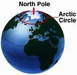
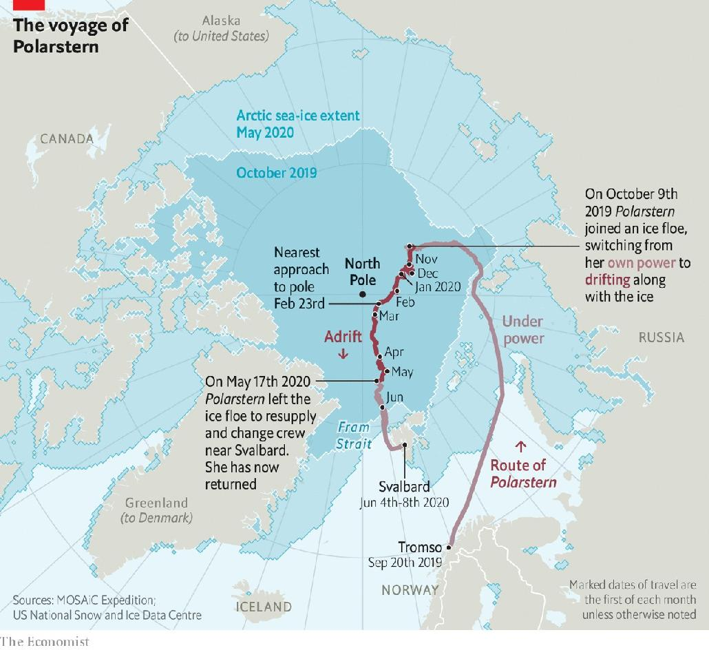
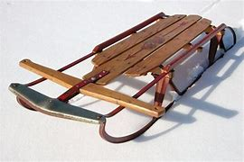
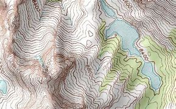
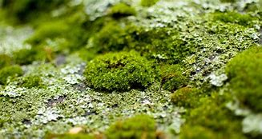
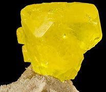

= eco 2020-06-20
:toc:

---

== A floating Arctic 北极的；北极地区的;极冷的；严寒的 laboratory 词汇解说

(eco 2020-6-20 / Science & technology / Arctic exploration: Pole position)

An icebreaker called Polarstern *is revealing the Arctic’s secrets*

Everything *depends on* how the ice *behaves*

Jun 20th 2020 |

- Arctic : /ˈɑːktɪk/ =>  arct（大熊星座）+ic（形容词后缀）→正对大熊星座的→北极的 +

- 漂浮的北极实验室 +
一艘名为“极地斯特恩”的破冰船, 正在揭开北极的秘密 +
一切都取决于冰的行为

THERE IS “LOCKDOWN”. And then there is lockdown. `主` Those who *have spent* the past weeks *allowed out* only `to exercise`(v.) and `visit(v.) the shops` `谓` *might spare 抽出；拨出；留出；匀出 a thought for* the passengers and crew of Polarstern (Pole Star 北极星), *pictured above*. Polarstern *is* an icebreaker** belonging to** the Alfred Wegener Institute for `Polar and Marine 海的；海产的；海生的 Research`, in Germany, and her ship’s company *are* in a different class 种类；类别；等级 of lockdown entirely. Their vessel *is afloat* in the `pack ice` 聚集的浮冰；大块的浮冰 of the Arctic Ocean, and communications *are* [so] minimal [as to] preclude(v.)使行不通；阻止；妨碍；排除 phone calls, *let alone* Zoom (一视频会议软件名)快速移动；迅速前往;(价格、费用等)急剧增长；猛涨. Only pictureless messages and emails *are possible*.

- spare : v.  *~ sth/sb (for sb/sth) | ~ (sb) sth* : to make sth such as time or money available to sb or for sth, especially when it requires an effort for you to do this 抽出；拨出；留出；匀出
.. I'd love to have a break, but *I can't spare the time just now*. 我是想休息一下，可眼下找不出时间。
.. You should *spare a thought for* (= think about) the person who cleans up after you. 你应该为随后打扫的人着想啊。

- so ... as to : 那么地...以至

- preclude => pre-,在前，-clud,关闭，词源同close,conclude.

- 这儿有“紧闭”。那儿也有. 那些在过去几周只被允许外出锻炼身体和逛商店的人, 可以来考虑一下上图中极地之星(Polarstern)上的乘客和船员。Polarstein是一艘破冰船，隶属于德国阿尔弗雷德·韦格纳极地和海洋研究所，它的公司完全处于另一种级别的禁闭状态。他们的船漂浮在北冰洋的浮冰中，通讯是如此微弱，以至于无法打电话，更不用说来视频会议了。只能发出没有图片的信息和电子邮件。

Polarstern is the location of MOSAiC 马赛克, the Multidisciplinary （涉及）多门学科的 `drifting Observatory` 天文台；天文观测站；气象台 for `the Study of Arctic Climate`. She *sailed* from Tromso, in Norway, on September 20th 2019 and *travelled to* a point at latitude 纬度 85°N (*see* map). Here, *mimicking* 模仿，摹拟 the first high-Arctic voyage, made in 1893 by Fridtjof Nansen, a Norwegian explorer, her captain *fixed her into an ice floe* 浮冰 that *carried her along* at about 7km/h, *courtesy(n.)承蒙…的允许（或好意）;作为…的结果 of* an ocean current *called* the transpolar 经过北极的；横越南极或北极的 drift stream. Her closest approach to the pole itself, 156km, *was* on February 24th.

- multidisciplinary : /ˌmʌltiˈdɪsəpləneri/ a. involving several different subjects of study （涉及）多门学科的 +
=> multi-,许多，多个，discipline,学科。

- courtesy : n. /ˈkɜːrtəsi/ 礼貌；谦恭；彬彬有礼 +
=> 来自court, 宫廷，宫廷礼仪。

- *courtesy of sb/sth* +
(1) ( also by courtesy of sb/sth ) with the official permission of sb/sth and as a favour 承蒙…的允许（或好意） +
-> The pictures have been reproduced *by courtesy(n.) of* the British Museum. 承蒙大英博物馆惠允，复制了这些画。 +
(2) given [as a prize] /or provided free by a person or an organization 蒙…提供；赞助；赠送 +
-> Win a weekend in Rome, *courtesy(n.) of Fiat*  （当权者的）法令，命令，谕.  +
赢了就可以获得菲亚特公司提供的到罗马度周末的机会。 +
(3) as the result of a particular thing or situation 作为…的结果 +
-> Viewers can see the stadium from the air, *courtesy(n.) of* a camera fastened to the plane. 由于飞机上安装有摄像机，电视观众可从空中鸟瞰体育场。

- Polarstein号, 是MOSAiC的所在地. MOSAiC 是研究北极气候的多学科的漂移观测站。她于2019年9月20日从挪威的Tromso出发，航行到北纬85度(见地图)。这是效仿挪威探险家弗里德科夫·南森(Fridtjof Nansen) 1893年的首次高维度北极航行，Polarstein号的船长将船固定在浮冰上，借助一股被称为跨极地漂流的洋流，以每小时7公里的速度向前移动。2月24日，她距离极点最接, 只有156公里。

Things *have not*, however, *gone* according to plan. The idea *was* for a revolving 旋转的 cast of 300 scientists *each to spend(v.) two months on board*. This *would have permitted* specialists (*in the study of* different seasons and conditions -- winter or summer ice, say) -- *to be there* at the appropriate 合适的；恰当的 moment, and *would also have had the benefit of* protecting(v.) everyone from `cabin 小木屋;船舱 fever` 幽居病.

- *cabin fever* : N-SING If you describe someone as having *cabin fever*, you mean that they feel restless and irritable because they have been indoors in one place for too long. 幽居病

- 然而，事情并没有按照计划进行。原计划是, 将300名科学家轮流上船, 每个人将船上只呆上两个月。这能让研究不同季节和条件的专家 -- 比如冬季或夏季的冰 -- 在恰当的时间到达那里，还可以保护每个人免受幽居病的伤害。

*Unplugging* 拔去…的电源插头 the freezer 冷冻柜；冰柜

`主` A planned rotation 轮换；交替；换班 in April `谓` *had*, though, *to be cancelled*. `主` Norway, the new shipmates’ 同船的水手 `intended departure point` [航][水运] 出发点；起程点；起航点, `谓` *had closed its borders* in response to covid-19. That *left* the original company 在一起的一群人 *with* no liberation 释放，解放 date. Eventually, two `transfer （旅途中的）中转，换乘，改变路线 ships` with the newbies 新手 on board *sailed* from Bremerhaven, in Germany. And [on May 17th] Polarstern `*broke free* 冲破藩篱,解脱 from her icy prison` and `*headed* south *to meet* them *off* 离开（某处）；（在时间或空间上）距，离 the coast of Svalbard`. On June 8th she *began* the return trip, and *arrived back at* her original piece of ice (which *had moved*) on June 17th, *to resume* 重新开始；（中断后）继续 *drifting with it* until she *breaks free* 冲破藩篱,解脱 in September, in the Fram Strait 海峡 between Greenland and Svalbard.

- newbie : /ˈnuːbi/ ( informal ) a person who is new and has little experience in doing sth, especially in using computers SYN novice （尤指使用电脑的）新手 +
=> new,新的，-bie,有争议，可能来自baby.

- 不过，原计划在4月进行的轮换, 不得不取消。为应对covid-19疫情，新船员的预定出发地点挪威, 已经关闭了边境。这使得船上原先的同伴们, 无法解脱. 最终，两艘载有新手的转运船, 从德国不来梅港启航。5月17日，Polarstern号从冰封的监狱中挣脱出来，向南前往斯瓦尔巴特群岛海岸与他们会合。6月8日，她开始了返程，6月17日，她回到了原来的那块冰(冰块已经移动了)，继续随它漂流，直到9月份, 她在格陵兰岛和斯瓦尔巴群岛之间的弗拉姆海峡中挣脱出来。

The coronavirus *has not changed MOSAiC’s objectives* 目标, however. These *are* to study(v.) `the structure of Arctic ice` and `how this *changes*(v.) with the seasons`, and *to look at* ① the air above that ice, ② the water below ③ and the creatures *living in* that water -- and, indeed, in the ice itself. All of these *are interlinked* 互相关联的. They also *link* the place *with* the wider world, for the Arctic *is both* a recorder *and* a driver of climate change.

- 然而，冠状病毒并没有改变MOSAiC的目标。这是为了研究北极冰的结构以及它是如何随着季节变化的，并且观察冰上面的空气，下面的水和生活在水里的生物——事实上，也包括冰本身。所有这些都是相互联系的。它们还将北极与更广阔的世界联系起来，因为北极既是气候变化的记录器，也是气候变化的推动者。

It is a recorder because `主` `the visible difference` *between* ice *and* water, and `the obvious relationship` *between* global temperatures *and* the amount of ice around, `谓` *mean together that* `主` the ice’s `waxing 给…打蜡 and waning`(（月亮）亏缺;减弱; 减少) 盈亏,诸如月之盈虚,消长变化 `谓` *shows* [in an easily graspable 可抓住的；能理解的 way] how things *are changing*. And `主` changing(n.) they are, for the extent 大小；面积；范围 of `the Arctic sea ice` in summer `谓` *has declined by 30%* in the past 30 years, and that loss *is accelerating* (see chart).

- wane : /weɪn/ v. to become gradually weaker or less important 衰落；衰败；败落；减弱 / ( of the moon 月亮 ) to appear slightly smaller each day after being round and full 缺；亏 +
=> wane : 来源于原始印欧语wan-(缺乏的)和古斯堪的纳维亚语vanta(缺乏)。 词根词缀： wan(-van-)空 + -e +
-> Her enthusiasm for the whole idea *was waning rapidly*. 她对整个想法的热情迅速冷淡了下来。

- 它是一个记录器，因为冰和水之间的明显差别，以及全球温度和北极周围冰量之间的明显关系，共同意味着, 冰的消长以一种容易理解的方式, 显示了事情在如何变化。在过去的30年里，北极海冰在夏季的面积, 已经减少了30%，而且减少的速度还在加快(见图表)。

The Arctic *is* also a driver of climate change, though, because the whiteness of ice *means* it *reflects* sunlight *back into space*, thus *cooling* Earth, whereas the darkness of `open water` 开阔水面；无冰水面 *means* it *absorbs* that light. *The less* of the former that is happening, and *the more* of the latter(a.)（刚提及的两者中）后者的；（系列中）最后的，末尾的, *the faster* `global temperatures *will rise*`.

- 然而，北极也是气候变化的推动者，因为白色的冰块, 意味着它能将阳光反射回太空，从而冷却地球; 而深色的无冰的水域, 意味着它会吸收阳光。前一种情况发生得越少，后一种情况就会发生得越多，从而全球气温上的升速度也会越快。

*Start*, then, *with* the ice. [At the moment] *this is monitored mainly by* satellite. `主` *Measuring* the extent of the Arctic’s ice [*from space*] `系` *is* easy. `主` *Measuring* its thickness `系` *is* trickier 难办的；难对付的(比较级). From orbit （天体等运行的）轨道, *this is done* by a mixture of radar and laser beam 激光光束,雷射光束. Icesat 2, an American craft 飞行器,飞船, *provides* `laser-altimeter （尤指用于飞行器中的）测高仪，高度表 data` that *record* the height (above sea level) of the top of the snow (that *overlies* 覆在……上面，铺 the ice). Cryosat 2, a European one, *uses* radar ① *to penetrate* 渗透，打入（组织、团体等） the snow and ② *measure* the height of the top of the ice itself. `The thickness 厚；厚度 of the ice` in a particular place *can then be calculated* by `*applying* Archimedes’ 阿基米德 principle of floating bodies *to* the mixture of ice and snow`, and *subtracting* 减去；扣掉 the thickness of the snow. However, Julienne Stroeve of University College London, now *safely returned from* her leg 一段路程（或赛程） of the mission, *believes that* `主` the data *collected by* these two satellites `系`  *may be inaccurate*, *leading to* an overestimation 过高的估计 of the ice’s thickness.

- 那么，就从冰开始吧。目前这主要是由卫星来监测的。从太空测量北极冰的面积大小很容易, 但要想测量它的厚度却更加棘手。在太空轨道上，这是由雷达和激光束共同完成的。Icesat 2是一艘美国飞船，它提供激光测高仪数据, 来记录覆盖在冰层上的积雪的顶部高于海平面的高度。欧洲的Cryosat 2 则利用雷达, 来穿透积雪，测量冰层本身的高度。将阿基米德的浮体原理应用于冰和雪的混合物，然后减去雪的厚度，就可以计算出特定地方的冰的厚度。不过，伦敦大学学院的Julienne Stroeve , 现在已安全地从其任务中返回, 她认为，这两颗卫星收集的数据可能不准确，导致高估了冰层的厚度。

When *all is working perfectly*, the return signal for Cryosat 2 *comes exactly from the boundary* between the ice and any overlying snow. Dr Stroeve *thinks*, though, *that* this is not always what happens. Variables such as layering 分层,层次 within the snow, *along with* its temperature and salinity 盐度；盐分, *might affect* the returning radar signal *by changing* the snow’s structure and density. This *could cause* the signal *to be reflected from inside the snow layer*, rather than *from the boundary* where it meets the ice. If *that were happening*, it *would create the illusion* that `主` the ice (beneath 在（或往）…下面；在（或往）…下方 the snow) `系` *is thicker than* is actually the case.

- salinity : /səˈlɪnəti/ n. 盐度；盐分；盐性

- 当一切正常运行时，Cryosat的返回信号, 就会准确地从冰和上面积雪的边界传回来。但施特略夫博士认为，情况并不总是这样。诸如雪内的分层、温度和盐度等变量, 可能会改变雪的结构和密度, 从而的返回的雷达信号造成影响。这可能会导致信号从雪层内部反射，而不是从它与冰相遇的边界反射。如果发生这种情况，就会产生一种错觉，即雪下的冰, 比实际情况更厚。

[*To investigate this possibility*] Dr Stroeve *took* a purpose-built radar [*on board Polarstern*]. Each week, she and a colleague *mounted* 准备；安排；组织开展;使骑上马；安装，架置 this 170kg instrument [*on a sled* 雪橇] and *dragged it to* a new site, *to sample* 抽样检验；取样；采样 different snow conditions. *As* they *towed* （用绳索）拖，拉，牵引，拽 it, they *sent* `radar pulses` 脉冲 [on `the frequency bands` 频带 (used by the satellites)] *downwards into the snow* /and *measured* the amount of backscatter (辐射或微粒的)向后散射. The deflection （尤指击中某物后）突然转向，偏斜，偏离 of the signals in this backscatter *gives a picture of* `主` how particular snow conditions `谓` *might be changing* the way (the satellite’s radar *is returned*).

- sled +

- *frequency band* : N a continuous range of frequencies, esp in the radio spectrum, between two limiting frequencies 频带

- backscatter : n. 反向散射体, 背反射, 后向散射; +
image:../../+ img_单词图片/b/backscatter.jpg[100,100]

- 为了研究这种可能性，斯特罗夫博士在“极地”号上搭载了一台特制的雷达。每周，她和一位同事将这台重达170公斤的仪器安装在雪橇上，并将其拖到一个新的地点，以采样不同的雪情。当他们拖着它时，他们使用和在卫星上相同的频段, 向下发送雷达脉冲到雪中，并测量后向散射量。后向散射中信号的偏转, 会给出了一幅图像，说明特定的降雪条件, 可能会如何改变卫星雷达的返回方式。

Dr Stroeve’s radar *died* on January 31st -- one of many of the expedition’s 远征；探险；考察 machines *that fell 进入（某状态）；开始变成（某事物） victim 受害者；罹难者；罹病者；牺牲品 to the Arctic winter*. But [by the time *that had happened*] she *had managed to gather* a fairly good set of data. *Her conclusion is that* the reflection *does indeed sometimes come from* the interface between snow and ice, *as it is supposed to*. But *not always*. The discrepancy 差异；不符合；不一致 *is important*. Her measurements *already show that* the ice *is “definitely thinner than* the satellites suggested”. She *has yet to analyse the data fully*, but preliminary 预备性的；初步的；开始的 investigation *indicates that* `主` [both] snow depth [and] temperature `谓` *influence*(v.) backscatter. *It therefore looks likely that* the amount of Arctic sea ice around *has been overestimated*. That *brings closer* the moment when, if temperatures *continue to rise*, the ice *will vanish altogether* in the summer.

- discrepancy  : /dɪˈskrepənsi/ n.
 *~ (in sth) | ~ (between A and B)* : a difference between two or more things that should be the same 差异；不符合；不一致 +
=>  dis-, 分开，散开。-crep, 破裂声，词源同crevice, decrepit. 引申词义争吵，不一致。 +
->  *wide discrepancies* in prices quoted for the work 这项工作的报价出入很大 +
-> What are the reasons for *the discrepancy between girls' and boys' performance* in school? 女生和男生在学校表现不同的原因何在呢？ +

- Stroeve博士的雷达于1月31日报废——这是探险队的许多设备中的一个，它们都成了北极冬季的牺牲品。但此时，她已经设法收集了一组相当好的数据。她的结论是，正如本会如此的那样，反射确实有时候来自冰与雪之间的表面，这是应该的。但并非总是如此。其差异也很重要。她的测量结果已经表明，冰层“肯定比卫星预测的要薄”。她还没有对数据进行充分分析，但初步的调查表明，积雪的深度和温度都会影响后向散射。因此，北极海冰的数量似乎被高估了。如果气温继续上升，冰盖将在夏季完全消失。

The thickness of the pack ice *is not the only thing that matters*, though. Its topography  地形；地貌；地势；地形学 *is also important*. This is the province 知识（或兴趣、职责）范围；领域 of Jennifer Hutchings of Oregon State University. She *is using* GPS buoys 浮标；航标 *to track* the motion of the ice around the ship. Though sea ice *is solid* 固体的(非液体╱气体)；坚硬的, it *is not rigid* 坚硬的；不弯曲的；僵直的. It *forms but a thin skin* on the ocean -- *varying in depth* [from] around 30cm in summer [to] a couple of metres 米；公尺 in winter -- so *is readily moved by wind and current*.

- topography :  /təˈpɑːɡrəfi/ ( technical 术语 ) the physical features of an area of land, especially the position of its rivers, mountains, etc.; the study of these features 地形；地貌；地势；地形学 +
=> 来自希腊语 topos,地方，-graphy,写，记录，学说。引申诸相关词义。 +

- 然而，浮冰的厚度并不是唯一重要的因素。它的地形也很重要。这是俄勒冈州立大学的Jennifer Hutchings所研究的专业领域。她使用GPS浮标来跟踪船周围冰层的运动。海冰虽然是固体的，但却并不坚硬。它在海上形成了好似一层薄薄的皮肤一样——其深度从夏季的30厘米左右, 到冬季的几米不等——所以很容易随着风和洋流移动。

[*As* the ice *moves*] it *stretches* and *cracks* in some places. `主` Large cracks (*formed in this way*) `谓` *are called* leads 带路；领路；引领;通向；通往, because they are wide enough *to “lead” a ship*. In other places, by contrast, movement *makes the ice thicker*. 随着 *As* individual panes （一片）窗玻璃 of ice *butt* （人）用头顶撞 up against each other, they *create* ridges 隆起；脊；垄;山脊；山脉 (that *can be* metres(n.) high). Dr Hutchings *has not yet had a chance* to process(v.) her data. But [even from the ship’s deck] she *has been able to watch* `leads *opening*` and `ridges *forming*` [around the vessel]. Her eyes and ears, *as well as* her instruments, *tell her that* this winter the ice *has been particularly mobile* -- and *has thus become* particularly rough 粗糙的；不平滑的；高低不平的, with a surprising number of ridges.

- pane : /peɪn/ n. a single sheet of glass in a window （一片）窗玻璃 +
-> a pane of glass 一片窗玻璃 +
image:../../+ img_单词图片/p/pane.jpg[100,100]

- ridge : /rɪdʒ/ n. a raised line on the surface of sth; the point where two sloping surfaces join 隆起；脊；垄 / 山脊；山脉

- 当冰移动时，它会在某些地方伸展并破裂。以这种方式形成的大裂缝称为"引导线路"，因为它们的宽度足以“引领”一艘船向前行驶。相比之下，在其他地方，冰的移动, 也会使某些冰块变得更厚。当一块块冰相互碰撞时，就会形成高达几米的山脊。哈钦斯博士还没有机会处理她的数据。但即使是在甲板上，她也能看到"引导路线"在在船体周围打开, 或形成山脊。她的眼睛、耳朵和仪器都告诉她，今年冬天的冰特别容易移动，因此变得非常高低不平，出现了数量惊人的隆起。

These ridges *may affect the rate* at which the ice *melts* -- but *to complicate(v.)使复杂化 matters*, this *could happen* in two opposing ways. Ridges *make ice thicker*, and thicker ice *melts more slowly*. On the other hand, a ridge *projects down into the sea* as well as *up into the air* (Archimedes 阿基米德, again), so *it may stir up （水或空气中）搅起；吹起 water* from below the surface. Deep water *is warmer than* the surface layer, so this stirring *would serve to increase* melt rates. Moreover, *to add to the confusion*, ridges *are prone(a.)有做…倾向的；易于遭受…的 to* having(v.) pieces of ice *fall off them into the sea*, *to form* small blocks *known as* brash (东西、地方)耀眼的；嘈杂的;盛气凌人的；自以为是的. `主` This brash, *having more surface area* per `unit volume` 单位体积 *than* unbroken ice, `谓` *melts faster*.

-  *stir sth up* : to make sth move around in water or air （水或空气中）搅起；吹起 +
-> The wind *stirred up* a lot of dust. 风吹起大量尘土。

- brash :  /bræʃ/ a. confident in an aggressive way 盛气凌人的；自以为是的 / ( BrE ) ( of things and places 东西、地方 ) too bright or too noisy in a way that is not attractive 耀眼的；嘈杂的 +
=> 词源不详。可能来自brush, 刷子，挥舞。

- 这些冰脊可能会影响冰融化的速度，但让事情变得复杂的是，这可能会以两种截然相反的方式发生。冰脊会使冰更厚，更厚的冰会使融化更慢。另一方面，冰脊既向下延伸到海里，也向上延伸到空中(同样是阿基米德原理)，所以它可能会在海面下搅动水流。更深处的水的温度, 比洋面上的水的温度更高，所以这种搅拌会加快冰融化的速度。此外，更增添困扰的是，冰脊上的冰块往往会掉落到海里，形成被称为brash的小冰块。这种碎块的单位体积, 其表面积, 比完整的冰块大，因此融化速度也更快。

Dr Hutchings’s main observation, though, *is* a change in the ice’s structure. Historically, this far north, where ice *is always present(a.v.) in some form*, winter is the time (when it *builds up* [当...时 *as* new layers *are adding to* existing floes]), *thickening* them. In summer the ice then *melts back a little*. But a core of the stuff *remains from year to year* and, *over* successive 连续的；接连的；相继的 winters, more layers *are added*. That *forges* what *is known as* multi-year perennial 长久的；持续的；反复出现的;多年生的 ice.

- perennial : /pəˈreniəl/ a. continuing for a very long time; happening again and again 长久的；持续的；反复出现的 / ( of plants 植物 ) living for two years or more 多年生的 +
=> per-,整个的，-enn,年，词源同annual.原义为终年的，终年不凋的，后引申词义多年的，长久的。 +
-> *the perennial problem* of water shortage 缺水这个老问题 +
-> that *perennial favourite*, hamburgers 汉堡包，这种永远受喜爱的食品

- 然而，Hutchings博士的主要观察结果, 是冰层结构的变化。从历史上看，在这个遥远的北方，冰总是以某种形式存在，冬天是冰堆积的季节，因为新的冰层会增加到现有的浮冰上，使它们变厚。到了夏天，冰就会融化一点。但其内部的核心物质,会年复一年地保存下来，而且在连续的冬天里，会有更多的冰层被添加上去。这形成了所谓的"多年生的冰"。

Dr Hutchings and her colleagues *have, however, found* `主` something rather different `谓` *is now going on*. Instead of *being composed 组成，构成（一个整体） of* ice (*accumulated 积累；积聚 over many years*), much of `the perennial ice pack` *is no longer truly perennial* -- it is “juvenile” 少年的；未成年的, *having built up* over only the past two years.

- 然而，Hutchings博士和她的同事们发现，一些截然不同的事情正在发生。大部分的常年冰群, 并不是由多年积累而成的，它们已经不是真正的常年冰群了——它们只是在过去的两年里逐渐形成的，还处于“幼年期”。

To Dr Hutchings, this is further evidence *confirming* what satellite images of `the ebbing 退潮 and flowing` 涨；涨潮  of the pack ice *suggest* -- that `主` the end of `year-round 全年的；整整一年的 ice` (*cover* at the North Pole) `系` *may be near*, with a summer melt-back [*so*] substantial (数量)大量的；价值巨大的；重大的 [*that*] `主` the pole itself `谓` *sees* clear, blue water.

- 对哈钦斯博士来说，这进一步证实了卫星图像中, 浮冰的涨退暗示出的 北极全年覆盖的冰层可能即将结束. 夏季时冰块融化的幅度如此之大，以至于在北极本身都能看到清澈的蓝色海水。

Jeff Bowman of the Scripps Institution of Oceanography 海洋学, in San Diego, *is also interested in* the behaviour of the ice. In his case, that interest *is directed towards* its effects on Arctic life. The main question he has been asking *is* `主` whether the Arctic ecosystem [as a whole] `系` *is* `a net producer or absorber` of carbon dioxide. The answer to this question *has* implications 可能的影响（或作用、结果） for the amount (that the Arctic 北极的；北极地区的 *contributes to* global warming). It *depends on* how much photosynthesis 光合作用 *is taking place* in the region. And that, in turn 相应地; 转而, *depends on* the extent and topography 地形；地貌；地势；地形学 of the ice cover.

- photosynthesis : /ˌfoʊtoʊˈsɪnθəsɪs/ => -photo-光 + syn-共同,同时 + thes放置 + -is名词词尾

- in turn : as a result of sth in a series of events 相应地；转而 / 依次；轮流；逐个+
-> Increased production will, *in turn*, lead to increased profits. 增加生产会继而增加利润。

- 圣地亚哥斯克里普斯海洋研究所的杰夫·鲍曼也对冰的行为感兴趣。在他的例子中，其兴趣集中在冰的行为会对北极生物造成怎样的影响上。他探寻的主要课题是，整个北极的生态系统, 到底是二氧化碳的净产生者, 还是吸收者? 其答案, 会影响着北极对全球变暖的贡献度. 其答案也取决于该地区进行光合作用的程度, 而这又相应取决于冰盖的范围和地形。

The Arctic Ocean *has few* multicellular  [生物] 多细胞的；多空隙的 plants. But it *does have* `single-celled algae` 藻；海藻 and `photosynthesising 光合作用的 bacteria`. These *live [both] in* the water *[and] in* the ice itself. And, though *tiny*, they *are abundant*. 强调句 *It is* they *that* Dr Bowman, who is a marine microbiologist, *is studying*, *to discover* how they *affect* the Arctic’s carbon balance.

- algae :  /ˈældʒiː,ˈælɡiː/ +

- 北冰洋很少有多细胞植物。但它确实有单细胞藻类和光合细菌。它们既生活在水里, 也生活在冰里。尽管它们很小，但数量却很多。海洋微生物学家鲍曼博士研究的正是它们，为了发现它们是如何影响北极的碳平衡的。

[*To measure* the activity of these micro-organisms] *he has been analysing* the amount of oxygen in the water. This *is* an indicator of how much photosynthesis *is taking place*. In doing so 在做此事过程中, he *has discovered that* the physical condition of the ice -- particularly the ridges *being studied by* Dr Hutchings -- *has an important effect on* these creatures and their productivity.

- 为了测定这些微生物的活性，他一直在分析水中的氧气含量。这是一个指标, 能显示出有多少光合作用正在发生。在此过程中，他发现冰层的物理条件——尤其是哈钦斯博士所研究的冰脊——对这些生物及其生产率, 有着重要的影响。

Oceans, the Arctic *included*, *fall 可以分为；能够分成 naturally into* layers, with the stillest 静止的；平静的(最高级) water at the bottom, where there is also little light. *Ascend*(v.)上升；升高；登高 the water column /and `主` both motion and light `谓` *increase*. Near the top *is* what is known as `the surface mixed layer`, which *turns over (使)翻转;(使)颠倒;(使)倾覆 continuously* in response to the wind. Sea ice *generally reduces* this wind-induced 引起的 mixing. But ice ridges *act like* tiny sails 帆, *catching* the wind, *moving in response* and thus *stirring the water beneath*. `主` The consequence, Dr Bowman *has found*, `系` *is* a surprisingly deep mixed layer.

- *fall into sth* : to be able to be divided into sth 可以分为；能够分成 +
-> My talk *falls naturally into three parts*. 我的谈话可以自然分成三个部分

- 海洋，包括北极在内，会自然地分为几个水层，最平静的水层在底部，那里也几乎没有光线。沿着水柱上升，水层中的运动和光线量也都会增加。靠近顶层的是所谓的水面混合层，它会随着风向不断地翻转。海冰通常会减少这种由风引起的混合层。但冰脊的作用却会像小帆，它会被风影响，并随之移动，从而搅动下面的水流。鲍曼博士发现，其结果是会造成一个令人惊讶的深层混合水层。

*That is bad news for* photosynthesising `planktonic 浮游生物的，浮游的 microbes`. The already `low level of light` below the ice *means* they *can grow* only when they are close to the surface. [If they *get “mixed down”* away from the light] they *cannot photosynthesise*(v.)进行光合作用.

- planktonic : /,plæŋk'tɔnik/

- 这对光合作用的浮游微生物来说是个坏消息。冰层下面的光线已经很少，这意味着它们只有在接近表面的时候才能生长。如果它们被“混合”在远离光线的地方，它们就不能进行光合作用。

*This is not, however, a problem for* those organisms 有机体；生物；（尤指）微生物 *actually embedded in the ice*. For them, thinner ice *means* they *get more light*, rather than less. That *raises their productivity*. The result, as *observed by* Dr Bowman, *was* an unusually `early spring-ice algal(a.)海藻的 bloom` this year.

- 然而，对于那些嵌在冰层中的生物来说，这并不是一个问题。对他们来说，更薄的冰意味着他们能得到更多的光线，而不是更少。这提高了他们的生产率。结果，正如Bowman博士所观察到的那样，今年的春季出现了异常的早春冰藻的爆发。

*It remains to be seen* `主` what the effects of the early bloom `系` *are*. But shifts in the timing 时间的选择；（事情发生或计划安排的）特定时间 of events of this sort *can have consequences*. For example, if the algae *bloom early*, the tiny animals that eat them *may hatch(v.) too late to catch*(v.) their main food source. Fewer of these zooplankton 浮游动物 *means*, in turn, *less to eat* [*for* things (*further up* the food chain)] -- *like* fish, seals 海豹 and polar bears.

- seal : 海豹 +
image:../../+ img_单词图片/s/seal.jpg[100,100]

- 冰藻提前爆发的影响, 还有待观察。但这类事件发生时间的变化, 可能会产生后果。例如，如果藻类过早繁殖，以藻类为食的小动物可能会因孵化得相对太晚, 而无法获得它们主要的食物来源。这些浮游动物数量的减少，反过来也意味着其食物链上游的比如鱼类、海豹和北极熊的数量, 也会减少。

- 海狮和海豹的区别:

|===
|海狮(能直起上半身顶球) |海豹(无法抬起上半身, 只能蠕动的方式前行)

|海狮身上滑溜溜的，几乎没有别的颜色.
|海豹身上通常会有很多小的斑点，甚至整体都是花的. 所以它叫"豹"(豹身上也有斑点). +
大多数的海豹都是身披短毛，腹部呈现淡黄色，背部为灰蓝色，而且带有蓝黑色的斑点，这是它们重要的一个特征之一。

|有耳朵，也就是外耳
|只有耳洞，没有耳部轮廓

|海狮的爪子更像是鳍，光光滑滑比较长，足鳍可以朝前摆放
|海豹的爪子毛茸茸的，还带有小钩钩，前脚比较短。

|海狮的脖子比较长，可以高高的抬起头来. 海狮能够抬起上半身，海豹不能
|脖子超级无敌短

|海狮的前脚比较长，因此能够抬起上半身来，也就是将肚皮抬起远离地面. 海狮的头比较尖，而且能够抬起身体，所以海洋馆经常用海狮来做玩球表演. 海豹做不到这点，海豹只能出现在“海报”里面。
|海豹做不到这点，海豹只能肚皮贴着地面活动，拖着身体慢慢前行。海豹是通过蠕动的方式行走的，有点像是太胖的虫子。

|===

But `主` what is true of winter `系` *is not necessarily true of* summer. The return of the sun *means* `主` the winter’s subtleties(n.)精妙之处; 微妙差异 `谓` *are now being replaced by* `a stronger, more obvious consequence` of `the reduced sea ice`. *This is that* more light *can blast 向…猛吹；（用水）向…喷射;（用炸药）炸毁，把…炸成碎片；爆破 through the water into* the ecosystem. That, too, *will affect* the timing and intensity of phytoplankton 浮游植物（群落） and ice-algal 海藻的 blooms.

- phytoplankton : /,faɪto'plæŋktən/ n. [植] 浮游植物（群落）

- 但是冬天的情形是怎样的，到了夏天就不一定是这样了。太阳的回来, 意味着冬季的微妙之处, 现在正被海冰减少所带来的更强烈、更明显的后果所取代。这是因为更多的光线可以通过水, 进入生态系统。这会影响浮游植物和冰藻的繁殖时间和强度。

`主` `The effects on the carbon balance` of the early algal 海藻的 bloom in the spring `谓` *will play out* （使）（戏剧性的事件）逐渐发生；（使）展开 in the coming months. The uneaten algae *may act as* a carbon sink 碳汇, *mopping up* 吸干净；吸去…的水分;消灭（残敌） carbon dioxide. Alternatively （引出第二种选择或可能的建议）要不，或者, they *may increase* levels of carbon dioxide [if their mistiming(n.v.)误时;在不适当的时机做；选错…的时机 *serves* to put *out of kilter*(n.) （与…）不一致，不同;不正常；失常 an ecosystem (that *would otherwise have absorbed it*)]. The new set of researchers on MOSAiC *will follow this up* 对…采取进一步行动；…后接着 / 追查更多情况.

- *play out* :  (PHRASAL VERB) （使）（戏剧性的事件）逐渐发生；（使）展开 If a dramatic event is played out, it gradually takes place.
-> Her union reforms *were played out* against a background of rising unemployment... 她对工会的改革, 是在失业率不断上升的背景下展开的。

- *carbon sink* : N areas of vegetation, especially forests, and the phytoplankton-rich seas that absorb the carbon dioxide produced by the burning of fossil fuels 碳汇. +
碳汇，是指通过植树造林、森林管理、植被恢复等措施，利用植物光合作用, 来吸收大气中的二氧化碳，并将其固定在植被和土壤中，从而减少温室气体在大气中浓度的过程、活动或机制。 +
碳汇(Carbon Sink)主要是指森林吸收并储存二氧化碳的多少，或者说是森林吸收并储存二氧化碳的能力。

- mop : v. to clean sth with a mop 用拖把擦干净 / *~ sth (from sth)* : to remove liquid from the surface of sth using a cloth 用布擦掉（表面）的液体 +
image:../../+ img_单词图片/m/mop.jpg[100,100]

- *mop sth/sb up* : to remove the liquid from sth using sth that absorbs it 吸干净；吸去…的水分
.. Do you want some bread *to mop up that sauce*? 要不要用块面包把这酱料蘸蘸吃了？
.. A number of smaller companies *were mopped up* (= taken over) by the American multinational. 有若干较小的公司都被美国跨国集团吞掉了。

- kilter : /ˈkɪltər/ n. 平衡；顺利；良好状态 +
=> 来自英语方言kelter,秩序，常见于短语out of kilter,混乱，不一致。

- *OUT OF KILTER* :
(1) not agreeing with or the same as sth else （与…）不一致，不同 +
-> His views *are out of kilter* with world opinion. 他的观点与世人的看法不一致。 +
(2) no longer continuing or working in the normal way 不正常；失常 +
-> Long flights *throw my sleeping pattern [out of kilter]* for days. 长途飞行使我的睡眠习惯, 给打乱了好几天。 +

- *FOLLOW STH UP* : (1) to add to sth that you have just done by doing sth else 对…采取进一步行动；…后接着 +
-> You should *follow up your phone call* with an email or a letter. 你打电话后, 应该接着发一封电子邮件或写封信。 +
(2) to find out more about sth that sb has told you or suggested to you 追查更多情况
SYN investigate +
-> The police *are following up several leads* after their TV appeal for information. 警方在电视上呼吁提供信息后, 正沿着几条线索继续追查。

- 春季的藻类过早爆发, 对碳平衡的影响, 会在未来几个月显现出来。未被北极生物吃掉的藻类, 可以被当做碳汇，来吸收二氧化碳。或者, 如果它们起作用的时期不当, 导致本应吸收二氧化碳的情况, 变成了破坏 了生态系统的平衡, 那么它们也可能会增加二氧化碳的水平. 对此, MOSAiC 的新一组研究人员将继续跟进这个问题。

`主` `The changes in the ice` that Dr Hutchings has been observing `谓` *also seem to influence* the atmosphere, according to one of the other researchers on board Polarstern -- Lauriane Quéléver of the University of Helsinki. Ms Quéléver *is interested in* the chemical composition 化学成分;化学组成 of Arctic air, and [in particular] how `certain scarce 缺乏的；不足的；稀少的 molecules(n.) in it` *act as* precursors 先驱；先锋；前身 *for* the formation of clouds. This, she *has discovered*, *seems to be controlled by* the behaviour of the ice.

- 据极地号上的另一位研究人员——赫尔辛基大学的劳里安·奎尔韦尔说，哈钦斯博士观察到的冰层变化, 似乎也影响了大气。Quelever女士对北极空气的化学成分很感兴趣，特别是其中的某些稀有分子,是如何作为云形成的前兆的。她发现，这似乎是由冰的行为所控制的。

[On most parts of Earth] clouds *form* [当...时 *as* `droplets 小滴 of water` *condense(v.)（由气体）冷凝；（使气体）凝结;（使）浓缩，变浓，变稠 around* “seeds” of dust or organic molecules 有机分子]. In the Arctic *there is little dust*. Biological activity, too, *is* in short supply *compared with* elsewhere -- and *is*, moreover, *conducted* [mainly *below* the barrier 屏障；障碍物 of the sea ice]. *It might therefore be expected that* there *would be* few seeds present *for* clouds *to form around*. And yet, clouds *are present*.

- 在地球的大部分地区，当水滴, 在尘埃或有机分子的“种子”周围凝结时, 云就会形成. 但是在北极, 几乎没有灰尘。与其他地方相比，生物活动也极少，而且主要都在海冰屏障之下进行。因此，可以预计，几乎没有云形成所必须的"种子"存在。然而，云却仍然存在。

Clouds on the horizon

`主` Ms Quéléver’s `starting(a.) point` for *investigating this matter* `系` *was* previous research (*carried out* on islands at lower latitudes in the Arctic -- specifically, Greenland and Svalbard). Cloud seeds there *tended to be* compounds 复合物；混合物 *containing* sulphur 硫；硫磺, nitrogen  氮；氮气, chlorine 氯；氯气, bromine 溴（富集于海水） or iodine 碘. *Using* a score 约20个 of instruments *held in a container* at the ship’s bow 船头;弓, she *looked for* these molecules. And she *found them*.

- sulphur : /ˈsʌlfər/ => 来自拉丁语 sulphur,硫，硫磺，可能来自 PIE*swelp,燃烧，扩大形式自 PIE*swel,照射，发光， 词源同 swelter,热昏，酷热。 +

- nitrogen : n. /ˈnaɪtrədʒən/ => nitr-,硝，-gen,产生。因研究硝石化学性质时认识这种气体而得名。

- chlorine : /ˈklɔːriːn/ => 来自PIE*ghel, 发光，照耀，词源同gall, gold. -ine, 衍生物化学名词。因其看起来呈现黄绿色而得名。

- bromine : /ˈbrəʊmiːn/ => 来自希腊词bromos, 发臭。-ine, 化学名词后缀。

- iodine : /ˈaɪədaɪn/ => 来自希腊语ideides,紫色的，来自io-,紫色，词源同violet,-eides,像，相似 +
image:../../+ img_单词图片/i/iodine.jpg[100,100]

- Quelever女士调查这件事情, 是以之前的研究来做为起点的. 之前的研究是在北极低纬度的岛屿上进行的——特别是在格陵兰岛和斯瓦尔巴群岛。那里的云的形成, 所依赖的"种子", 往往是含有硫、氮、氯、溴或碘的复合物。她在船头的一个容器中放置了几十个仪器，用这些仪器寻找这些分子。她找到了它们。

That *was not* a complete surprise. `主` What *did surprise* her, though, `系` *were* the quantities 数量 she found them in. She *expected* their concentrations 浓度；含量 in winter, `the least 最小的；最少的；程度最轻的 biologically active time` of year, *to be* low to non-existent. In fact, *they were similar to* those found in Greenland.

- 这并不完全出乎意料。不过，真正让她吃惊的是她发现它们的数量。她原来预计，在一年中生物活动最少的冬季，它们的浓度会低到根本不存在。事实上，它们的含量与在格陵兰岛发现的类似。

`The only plausible 有道理的；可信的 source` of these molecules *is* the micro-organisms (Dr Bowman is studying). And, as if *to support that idea*, she *also saw that* `主` spikes(n.)迅速升值；急剧增值;尖状物；尖头；尖刺 in the concentrations 浓度；含量 of molecules of interest `谓` *correlated 和…相关 (尤指互有因果关系); 相近 with* “ice events” around the ship, such as the opening of big leads(n.) which *brought the air into contact with* the seawater below.

- 这些分子到底是从哪来的, 唯一可信的来源, 是鲍曼博士正在研究的微生物。而且，似乎是支持了这一观点，她还发现，她感兴趣的分子的浓度峰值, 与船周围的“海冰情况”有关，比如"引导线路"的打开，使空气能与下面的海水接触。

`主` The link *between* the sea ice cracking *and* the release of potential cloud seeds `谓` *suggests that* `主` more cracks in the ice sheet 一大片（覆盖物）;一大片，一大堆，一大摊（移动的东西） `谓` *could lead to more clouds* in the Arctic. `主` What overall effect(n.) (that *might have* on the climate) `系` *is* unclear. Summer clouds *would reflect sunlight back into space*, *cooling* the planet. Those *formed* in winter, when the sun *is below the horizon*, *would serve as* insulation(n.) 隔热；隔音；绝缘；隔热（或隔音、绝缘）材料, *warming* it. As *with the way* (Dr Hutching’s ridges *affect* the melting of ice), two opposite outcomes *are possible* -- or perhaps *the net effect(n.) will be that* `主` they `谓` *cancel each other out* 抵消.

- sheet :  /ʃiːt/ 床单；被单 / a wide flat area of sth, covering the surface of sth else 一大片（覆盖物） / a large moving mass of fire or water 一大片，一大堆，一大摊（移动的东西）
.. The road *was covered with a sheet of ice*. 路面结了一层冰.
.. *a sheet of flame* 一片火海
.. The rain *was coming down in sheets* (= very heavily) . 大雨倾盆而下。

- cancel out : v.  If one thing *cancels out* another thing, the two things have opposite effects, so that when they are combined no real effect is produced. 抵消

- 海冰的破裂, 和潜在的云的"种子"的释放, 这两者之间的联系表明，冰盖上的裂缝越多, 就可能导致北极出现越多的云。这会对气候变化会产生何种总的影响, 尚不清楚。夏季的云, 会将太阳光反射回太空，使地球降温。而那些在冬天形成的云，此时季节, 太阳在地平线以下，会起到隔热作用，使地球变暖. 其方式正如哈钦博士所研究的冰脊, 会起影响冰层融化的方式一样，这可能会产生两种相反的结果(要么有利于温室效应, 要么阻止温室效应) ——或者, 最终的结果是它们会相互抵消。

正如 As this example *shows*, `主` *properly disentangling*(v.)理顺，分清，清理出（混乱的论据、想法等）;解开…的结；理顺 the interactions 相互作用，相互影响 between Arctic ice, atmosphere and ocean life `谓` *will require* data (*collected across a full year*) -- for `主` the contrast 明显的差异；对比；对照 between winter and summer at the poles `系` *is greater than* anywhere else on the planet. Polarstern’s unexpected detour 绕行的路；迂回路；兜圈子 *has come at the cost of* some of these data, but in partial compensation 补偿（或赔偿）物；（尤指）赔偿金，补偿金；赔偿 the expedition 远征队；探险队；考察队 *left* several autonomous 自主的；有自主权的 machines on the ice, *to continue harvesting* 采集（人体的细胞或组织，以供医学实验等）;收割（庄稼）；捕猎（动物、鱼） *as much information as possible* during the ship’s absence. With luck, then, the expedition  远征；探险；考察 *has been saved* to finish(v.) `what will be the most comprehensive study so far` (*made of*(v.)从 (某事物) 中得出 (某印象、看法、理解等) the Arctic and its influence on the climate). If that *happens*, the researchers on board *will have had* the most productive lockdown imaginable -- with no Zoom involved.

- disentangle : v. *~ sth (from sth)* : to separate different arguments, ideas, etc. that have become confused 理顺，分清，清理出（混乱的论据、想法等） +
-> It's not easy *to disentangle* the truth *from* the official statistics. 从官方统计资料中理出真实情况并不容易。

- detour => de-, 向下，离开。-tour, 转，词源同turn, tourism. 即转开，迂回。

- *make of* : PHRASAL VERB If you ask a person what they make of something, you want to know what their impression, opinion, or understanding of it is. 从 (某事物) 中得出 (某印象、看法、理解等) +
->  Nancy wasn't sure *what to make of Mick's apology*.
南希不确定该怎样看待米克的道歉。

- 正如这个例子所表明的那样，要想正确地解开北极冰层、大气和海洋生物之间的相互作用，就需要全年地收集数据，这是因为, 两极的冬季和夏季之间的反差, 比地球上其他任何地方都要大。Polarstern号未被预料到的绕行，是以牺牲了其中一些数据的获取为代价的，但部分地, 作为补偿，探险队在冰上留下了几台自主运行的机器，以便在船不在期间能继续收集尽可能多的信息。幸运的是，这次远征考察, 得以挽救保留, 而没被放弃. 考察队得以完成了迄今为止最全面的关于北极及其对气候影响的研究。如果的确如此，船上的研究人员, 就度过了可想象到的最有工作成果的"封锁" -- 还没用到视频会议。

---

== A floating Arctic laboratory

An icebreaker called Polarstern is revealing the Arctic’s secrets

Everything depends on how the ice behaves

Jun 20th 2020 |

THERE IS “LOCKDOWN”. And then there is lockdown. Those who have spent the past weeks allowed out only to exercise and visit the shops might spare a thought for the passengers and crew of Polarstern (Pole Star), pictured above. Polarstern is an icebreaker belonging to the Alfred Wegener Institute for Polar and Marine Research, in Germany, and her ship’s company are in a different class of lockdown entirely. Their vessel is afloat in the pack ice of the Arctic Ocean, and communications are so minimal as to preclude phone calls, let alone Zoom. Only pictureless messages and emails are possible.

Polarstern is the location of MOSAiC, the Multidisciplinary drifting Observatory for the Study of Arctic Climate. She sailed from Tromso, in Norway, on September 20th 2019 and travelled to a point at latitude 85°N (see map). Here, mimicking the first high-Arctic voyage, made in 1893 by Fridtjof Nansen, a Norwegian explorer, her captain fixed her into an ice floe that carried her along at about 7km/h, courtesy of an ocean current called the transpolar drift stream. Her closest approach to the pole itself, 156km, was on February 24th.

Things have not, however, gone according to plan. The idea was for a revolving cast of 300 scientists each to spend two months on board. This would have permitted specialists in the study of different seasons and conditions—winter or summer ice, say—to be there at the appropriate moment, and would also have had the benefit of protecting everyone from cabin fever.

Unplugging the freezer

A planned rotation in April had, though, to be cancelled. Norway, the new shipmates’ intended departure point, had closed its borders in response to covid-19. That left the original company with no liberation date. Eventually, two transfer ships with the newbies on board sailed from Bremerhaven, in Germany. And on May 17th Polarstern broke free from her icy prison and headed south to meet them off the coast of Svalbard. On June 8th she began the return trip, and arrived back at her original piece of ice (which had moved) on June 17th, to resume drifting with it until she breaks free in September, in the Fram Strait between Greenland and Svalbard.

The coronavirus has not changed MOSAiC’s objectives, however. These are to study the structure of Arctic ice and how this changes with the seasons, and to look at the air above that ice, the water below and the creatures living in that water—and, indeed, in the ice itself. All of these are interlinked. They also link the place with the wider world, for the Arctic is both a recorder and a driver of climate change.

It is a recorder because the visible difference between ice and water, and the obvious relationship between global temperatures and the amount of ice around, mean together that the ice’s waxing and waning shows in an easily graspable way how things are changing. And changing they are, for the extent of the Arctic sea ice in summer has declined by 30% in the past 30 years, and that loss is accelerating (see chart).

The Arctic is also a driver of climate change, though, because the whiteness of ice means it reflects sunlight back into space, thus cooling Earth, whereas the darkness of open water means it absorbs that light. The less of the former that is happening, and the more of the latter, the faster global temperatures will rise.

Start, then, with the ice. At the moment this is monitored mainly by satellite. Measuring the extent of the Arctic’s ice from space is easy. Measuring its thickness is trickier. From orbit, this is done by a mixture of radar and laser beam. Icesat 2, an American craft, provides laser-altimeter data that record the height above sea level of the top of the snow that overlies the ice. Cryosat 2, a European one, uses radar to penetrate the snow and measure the height of the top of the ice itself. The thickness of the ice in a particular place can then be calculated by applying Archimedes’ principle of floating bodies to the mixture of ice and snow, and subtracting the thickness of the snow. However, Julienne Stroeve of University College London, now safely returned from her leg of the mission, believes that the data collected by these two satellites may be inaccurate, leading to an overestimation of the ice’s thickness.

When all is working perfectly, the return signal for Cryosat 2 comes exactly from the boundary between the ice and any overlying snow. Dr Stroeve thinks, though, that this is not always what happens. Variables such as layering within the snow, along with its temperature and salinity, might affect the returning radar signal by changing the snow’s structure and density. This could cause the signal to be reflected from inside the snow layer, rather than from the boundary where it meets the ice. If that were happening, it would create the illusion that the ice beneath the snow is thicker than is actually the case.

To investigate this possibility Dr Stroeve took a purpose-built radar on board Polarstern. Each week, she and a colleague mounted this 170kg instrument on a sled and dragged it to a new site, to sample different snow conditions. As they towed it, they sent radar pulses on the frequency bands used by the satellites downwards into the snow and measured the amount of backscatter. The deflection of the signals in this backscatter gives a picture of how particular snow conditions might be changing the way the satellite’s radar is returned.

Dr Stroeve’s radar died on January 31st—one of many of the expedition’s machines that fell victim to the Arctic winter. But by the time that had happened she had managed to gather a fairly good set of data. Her conclusion is that the reflection does indeed sometimes come from the interface between snow and ice, as it is supposed to. But not always. The discrepancy is important. Her measurements already show that the ice is “definitely thinner than the satellites suggested”. She has yet to analyse the data fully, but preliminary investigation indicates that both snow depth and temperature influence backscatter. It therefore looks likely that the amount of Arctic sea ice around has been overestimated. That brings closer the moment when, if temperatures continue to rise, the ice will vanish altogether in the summer.

The thickness of the pack ice is not the only thing that matters, though. Its topography is also important. This is the province of Jennifer Hutchings of Oregon State University. She is using GPS buoys to track the motion of the ice around the ship. Though sea ice is solid, it is not rigid. It forms but a thin skin on the ocean—varying in depth from around 30cm in summer to a couple of metres in winter—so is readily moved by wind and current.

As the ice moves it stretches and cracks in some places. Large cracks formed in this way are called leads, because they are wide enough to “lead” a ship. In other places, by contrast, movement makes the ice thicker. As individual panes of ice butt up against each other, they create ridges that can be metres high. Dr Hutchings has not yet had a chance to process her data. But even from the ship’s deck she has been able to watch leads opening and ridges forming around the vessel. Her eyes and ears, as well as her instruments, tell her that this winter the ice has been particularly mobile—and has thus become particularly rough, with a surprising number of ridges.

These ridges may affect the rate at which the ice melts—but to complicate matters, this could happen in two opposing ways. Ridges make ice thicker, and thicker ice melts more slowly. On the other hand, a ridge projects down into the sea as well as up into the air (Archimedes, again), so it may stir up water from below the surface. Deep water is warmer than the surface layer, so this stirring would serve to increase melt rates. Moreover, to add to the confusion, ridges are prone to having pieces of ice fall off them into the sea, to form small blocks known as brash. This brash, having more surface area per unit volume than unbroken ice, melts faster.

Dr Hutchings’s main observation, though, is a change in the ice’s structure. Historically, this far north, where ice is always present in some form, winter is the time when it builds up as new layers are adding to existing floes, thickening them. In summer the ice then melts back a little. But a core of the stuff remains from year to year and, over successive winters, more layers are added. That forges what is known as multi-year perennial ice.

Dr Hutchings and her colleagues have, however, found something rather different is now going on. Instead of being composed of ice accumulated over many years, much of the perennial ice pack is no longer truly perennial—it is “juvenile”, having built up over only the past two years.

To Dr Hutchings, this is further evidence confirming what satellite images of the ebbing and flowing of the pack ice suggest—that the end of year-round ice cover at the North Pole may be near, with a summer melt-back so substantial that the pole itself sees clear, blue water.

Jeff Bowman of the Scripps Institution of Oceanography, in San Diego, is also interested in the behaviour of the ice. In his case, that interest is directed towards its effects on Arctic life. The main question he has been asking is whether the Arctic ecosystem as a whole is a net producer or absorber of carbon dioxide. The answer to this question has implications for the amount that the Arctic contributes to global warming. It depends on how much photosynthesis is taking place in the region. And that, in turn, depends on the extent and topography of the ice cover.

The Arctic Ocean has few multicellular plants. But it does have single-celled algae and photosynthesising bacteria. These live both in the water and in the ice itself. And, though tiny, they are abundant. It is they that Dr Bowman, who is a marine microbiologist, is studying, to discover how they affect the Arctic’s carbon balance.

To measure the activity of these micro-organisms he has been analysing the amount of oxygen in the water. This is an indicator of how much photosynthesis is taking place. In doing so, he has discovered that the physical condition of the ice—particularly the ridges being studied by Dr Hutchings—has an important effect on these creatures and their productivity.

Oceans, the Arctic included, fall naturally into layers, with the stillest water at the bottom, where there is also little light. Ascend the water column and both motion and light increase. Near the top is what is known as the surface mixed layer, which turns over continuously in response to the wind. Sea ice generally reduces this wind-induced mixing. But ice ridges act like tiny sails, catching the wind, moving in response and thus stirring the water beneath. The consequence, Dr Bowman has found, is a surprisingly deep mixed layer.

That is bad news for photosynthesising planktonic microbes. The already low level of light below the ice means they can grow only when they are close to the surface. If they get “mixed down” away from the light they cannot photosynthesise.

This is not, however, a problem for those organisms actually embedded in the ice. For them, thinner ice means they get more light, rather than less. That raises their productivity. The result, as observed by Dr Bowman, was an unusually early spring-ice algal bloom this year.

It remains to be seen what the effects of the early bloom are. But shifts in the timing of events of this sort can have consequences. For example, if the algae bloom early, the tiny animals that eat them may hatch too late to catch their main food source. Fewer of these zooplankton means, in turn, less to eat for things further up the food chain—like fish, seals and polar bears.

We were here first!

But what is true of winter is not necessarily true of summer. The return of the sun means the winter’s subtleties are now being replaced by a stronger, more obvious consequence of the reduced sea ice. This is that more light can blast through the water into the ecosystem. That, too, will affect the timing and intensity of phytoplankton and ice-algal blooms.

The effects on the carbon balance of the early algal bloom in the spring will play out in the coming months. The uneaten algae may act as a carbon sink, mopping up carbon dioxide. Alternatively, they may increase levels of carbon dioxide if their mistiming serves to put out of kilter an ecosystem that would otherwise have absorbed it. The new set of researchers on MOSAiC will follow this up.

The changes in the ice that Dr Hutchings has been observing also seem to influence the atmosphere, according to one of the other researchers on board Polarstern—Lauriane Quéléver of the University of Helsinki. Ms Quéléver is interested in the chemical composition of Arctic air, and in particular how certain scarce molecules in it act as precursors for the formation of clouds. This, she has discovered, seems to be controlled by the behaviour of the ice.

On most parts of Earth clouds form as droplets of water condense around “seeds” of dust or organic molecules. In the Arctic there is little dust. Biological activity, too, is in short supply compared with elsewhere—and is, moreover, conducted mainly below the barrier of the sea ice. It might therefore be expected that there would be few seeds present for clouds to form around. And yet, clouds are present.

Clouds on the horizon

Ms Quéléver’s starting point for investigating this matter was previous research carried out on islands at lower latitudes in the Arctic—specifically, Greenland and Svalbard. Cloud seeds there tended to be compounds containing sulphur, nitrogen, chlorine, bromine or iodine. Using a score of instruments held in a container at the ship’s bow, she looked for these molecules. And she found them.

That was not a complete surprise. What did surprise her, though, were the quantities she found them in. She expected their concentrations in winter, the least biologically active time of year, to be low to non-existent. In fact, they were similar to those found in Greenland.

The only plausible source of these molecules is the micro-organisms Dr Bowman is studying. And, as if to support that idea, she also saw that spikes in the concentrations of molecules of interest correlated with “ice events” around the ship, such as the opening of big leads which brought the air into contact with the seawater below.

The link between the sea ice cracking and the release of potential cloud seeds suggests that more cracks in the ice sheet could lead to more clouds in the Arctic. What overall effect that might have on the climate is unclear. Summer clouds would reflect sunlight back into space, cooling the planet. Those formed in winter, when the sun is below the horizon, would serve as insulation, warming it. As with the way Dr Hutching’s ridges affect the melting of ice, two opposite outcomes are possible—or perhaps the net effect will be that they cancel each other out.

As this example shows, properly disentangling the interactions between Arctic ice, atmosphere and ocean life will require data collected across a full year—for the contrast between winter and summer at the poles is greater than anywhere else on the planet. Polarstern’s unexpected detour has come at the cost of some of these data, but in partial compensation the expedition left several autonomous machines on the ice, to continue harvesting as much information as possible during the ship’s absence. With luck, then, the expedition has been saved to finish what will be the most comprehensive study so far made of the Arctic and its influence on the climate. If that happens, the researchers on board will have had the most productive lockdown imaginable—with no Zoom involved.

