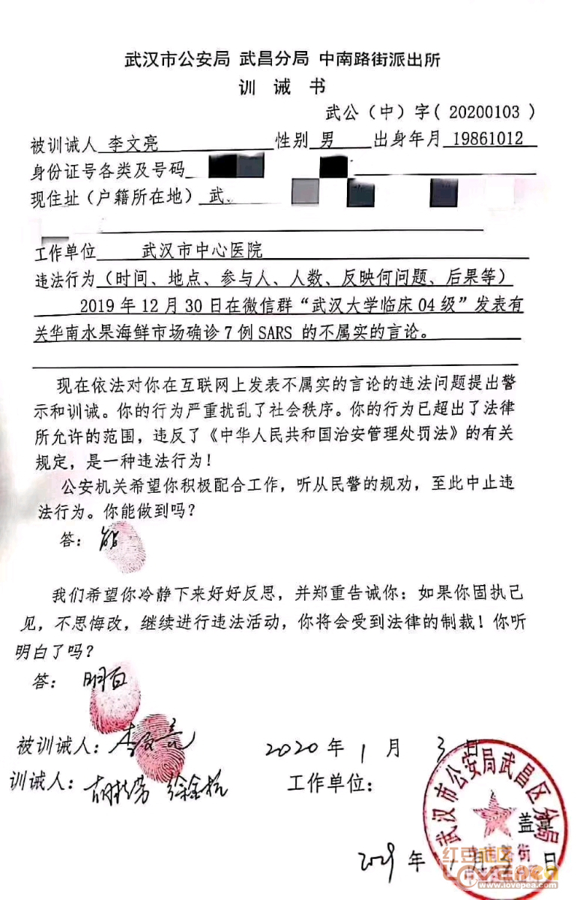

= eco 2020 - (22-23)
:toc:
---

== 22. Li Wenliang’s death exposes the costs of China’s authoritarianism(`=authoritarianism : 威权主义`)

Public anger(n.) over the virus-related tragedy 悲惨的事；不幸；灾难；惨案 *will fade*(v.), but those who feel the ground shake *never forget*

李文良之死, 暴露了中国执行的威权主义的代价 +
病毒带来的惨剧, 带给公众的愤怒, 这种情绪会逐渐褪去，但对于那些被地动山摇的后果所影响到的人, 却永远不会忘记它.

Feb 13th 2020 | +
eco 2020.02.15 / China / Chaguan: Death of an everyman

THE DEATH of Li Wenliang *has shaken* China like an earthquake.

He was a young doctor who *was reprimanded*(`=reprimand : v. 申斥；训斥；斥责`) by Chinese police for *alerting* colleagues(`=colleague :同事；同僚；同人`) *to* a new virus that *has now killed* more than 1,300 people, Dr Li among them (see article).

There *was* nationwide soul-searching(`=:n. 反省；内省`) when the ophthalmologist(`=ophthalmologist : 眼科医生`) *told* Chinese media, days before his death on February 6th in Wuhan, Hubei province, *that* {`主` silencing(v.) truth-tellers 说真话者;讲真话的人 `谓` *can make* a country sick}.

“I *think* there *should be* more than one voice in a healthy society,” he said.

李文良之死像地震一样震撼了中国。他是一名年轻的医生，曾因提醒同事注意一种新病毒, 而受到中国警方的训斥。该病毒已导致1300多人死亡，李就是其中之一。这位眼科医生于2月6日在湖北武汉去世，去世前几天，他对中国媒体说，让说真话的人闭嘴, 会让一个国家生病，这引起了全国上下的反思。他说:“我认为，在一个健康的社会里，应该有不止一种声音。”

There *is* special outrage 愤怒；义愤；愤慨 that this everyman 普通人；常人-physician *died* with the charge of rumour谣言-mongering 贩卖的；兜售的 still on his police file.

“What kind of society *have we created*?” *asked* Chinese netizens, with a mixture of anger and shame.

[In the hours after Dr Li’s death] nearly 2m of them *shared* or *viewed* a hashtag 标签 *meaning* “I *want* freedom of speech”, before it *was deleted* by censors （书籍、电影等的）审查员，审查官.

Open letters and petitions(`=petition : *~ (against/for sth)* a written document signed by a large number of people that asks sb in a position of authority to do or change sth 请愿书`) *have called on* the Communist Party’s leaders *to honour* 尊敬，尊重（某人） the constitution’s neglected 被忽略的；被忽视的；未被重视的 guarantee 保证；担保 of free expression, *arguing 论证；说理；争辩 that* truth-telling *saves* lives.

“We *should learn from* Li Wenliang’s death,” *said* an academic in Wuhan behind(`=:prep. giving support to or approval of sb/sth 支持；赞成`) one petition.

尤其令人愤慨的是，在这个普通医生死的时候，他在警方的档案中, 仍被指控为造谣。“我们创造了什么样的社会?”中国网民带着既愤怒又羞愧的表情问道。在李去世后的几个小时里，有近200万人分享或观看了一个表示“我想要言论自由”的标签，然后被审查人员删除。公开信和请愿书呼吁中国共产党领导人尊重宪法中被忽视的言论自由保障，认为讲真话可以挽救生命。“我们应该从李文良的死中, 吸取教训，”武汉的一位学者在一份请愿书中写道。

Party leaders *will not learn* to embrace(v.) free speech or political pluralism(`=pluralism : n. 多元化，多元性（不同种族、不同政治或宗教信仰的多种群体共存）;/ 多元主义（不同群体可以有益地在同一社会中和平共处的主张）`).

====
- plural => 来自拉丁语plus的所有格形式pluris,更多的，词源同plus,full.引申词义复数的，多元的。
====

They *know* their history and *that* {[in Chinese tradition] `主` the death of an honest man, *wronged*(v.)不公正（或不诚实）对待 by those in power, `系` *can be* a potent, dangerous event}.

Many times over the centuries, `主` public gatherings(n.) *to mourn*(`=mourn : v.（因失去…而）哀悼，忧伤`) such people `谓` *have sparked* 引发；触发;冒火花；飞火星 political crises 危机，紧要关头；危险期, *including* in Communist times.

Party chiefs *have duly*(ad.)(`=:in the correct or expected manner 适当地；恰当地`) *rushed* to co-opt(v.)（经所有成员同意）增选（某人）为委员;拉拢；笼络 Dr Li *as* a hero whose suffering *should be blamed on* isolated, local wrongdoing(`= illegal or dishonest behaviour 不法行为；坏事；作恶；欺骗行径`).

*To bolster*(`=bolster : v. *~ sth (up)* : to improve sth or make it stronger 改善；加强`) that idea, officials *have been sent* from Beijing *to look into* his case.

Global Times, a nationalist tabloid(`=tabloid : 小报（版面通常比大报小一半）`), *has stressed* 强调；着重 in its reporting *that* Dr Li *was* a loyal party member.

It *alleges  （未提出证据）断言，指称，声称 that* `主` calls(n.) *to honour* Dr Li’s memory `谓` *are being whipped up*(`=*whip sb/sth up* : to deliberately try and make people excited or feel strongly about sth 激发；激励；煽动`) by “anti-China forces” abroad and in Hong Kong.

====
- tabloid => 来自 tablet,药片，-oid,类。比喻用法，即像小药片一样包含各种原料的，后用于指通俗小报， 八卦报纸，缩写于 tabloid journalism.
====

政党领导人不会学会拥抱言论自由或政治多元化。他们知道自己的历史，在中国的传统中，一个正直的人被当权者冤枉而死，可能是一个潜在的、危险的事件。几个世纪以来，公众集会悼念这些人, 多次引发政治危机，包括在共产主义时期。党的领导们适时地将李塑造成一个英雄，他的苦难应该归咎于孤立的地方错误行为。为了支持这一观点，北京已经派出官员调查他的案子。民族主义小报《环球时报》在其报道中强调，李是一名忠诚的党员。据称，海外和香港的“反华势力”正在煽动纪念李的呼声。

After a few days in which Xi Jinping, the country’s leader, *was* relatively invisible, the propaganda machine *has now cleared* front pages *for* accounts(n.)(`=:a written or spoken description of sth that has happened 描述；叙述；报告`) of his virus-control work.

Mr Xi *made* a rare public appearance, *visiting* hospital and community 社区；社会 offices in Beijing.

[Three days later] he *reshuffled*(`=reshuffle : to change around the jobs that a group of people do, for example in a government 改组；进行岗位调整；更改职责配置`) the leadership of Hubei, the worst-hit 受灾最严重的;最受打击的 area.

The state news agency, Xinhua, *called* him the “commander of the people’s war against the epidemic 流行病”.

To some readers, the martial 战争的；军事的 title *may sound* stirring(a.)令人激情澎湃的；激动人心的.

Others *may fear* it *leaves little room for* scientific debate or scrutiny(n.)(`=scrutiny : 仔细检查；认真彻底的审查`) by outsiders *such as* journalists, notably those brave Chinese reporters who *have done* remarkable work in recent weeks in their efforts *to cover*(`=to report on an event for television, a newspaper, etc.; to show an event on television 报道；电视报道`) the virus’s spread.

[In a war] instructions from the top *are* orders.

几天前，中国领导人习近平还相对默默无闻，如今，这台宣传机器清除了头版上有关他的病毒控制工作的报道。习近平罕见地公开露面，参观了北京的医院和社区办公室。三天后，他改组了受灾最严重的湖北的领导层。国家通讯社新华社称他为“人民抗击艾滋病战争的指挥官”。对一些读者来说，这个军事标题可能听起来很激动人心。另一些人可能担心，它几乎没有留给记者等局外人进行科学辩论或审查的空间，尤其是那些勇敢的中国记者，他们最近几周在报道病毒传播方面做了出色的工作。在战争中，上级的指示就是命令。

Censorship 审查；检查；审查制度 *is being tightened*, *ending* a brief period of unusual liberty for social-media users.

The country’s largest internet platforms *have been placed* under “special supervision 监督” by cyber-regulators, with extra controls on anything *resembling* 像 citizen journalism 新闻业；新闻工作.

Yet shows(n.)(`=:something that is done in a particular way 表现;/装出的样子；虚假的外观；假象`) of authority 当局；官方；当权者 *cannot stop* the public from *brooding about*(`=brood : *~ (over/on/about sth)* : to think a lot about sth that makes you annoyed, anxious or upset 焦虑，忧思（使人厌烦、担忧或不安的事;/孵（蛋））`) Dr Li.

====
- brood => 来自breed, 繁殖，孵化。原指母鸡孵蛋过程中的暴躁症状，后指忧虑。
====

As millions of Chinese *read* and *share* accounts(n.)描述；叙述；报告 of his short life and tragic death, they *are being forced* *to devote* 把…用于 unusual attention *to* their social compact(n.)(`=:a formal agreement between two or more people or countries 协定；协议；契约；合约`) with the country’s authoritarian(a.)(`=authoritarian : 威权主义的；专制的`) rulers.

====
- *DEVOTE STH TO STH* : to give an amount of time, attention, etc. to sth 把…用于 +
-> I *could only devote* two hours a day *to* the work. 我一天只能在这个工作上花两个小时。
====

审查正在收紧，结束了社交媒体用户短暂的不寻常的自由期。中国最大的互联网平台, 已经被网络监管机构置于“特别监管”之下，对任何类似于公民新闻的东西, 都有额外的控制。然而，当局所做的所作所为, 并不能阻止公众对李的思念。当数以百万计的中国人, 阅读和分享着有关他短暂的生命, 和悲惨的死亡故事时，他们也因此将注意力, 不同寻常地投向了与中国威权统治者的社会契约上。

[Sometimes] `主` adherence(n.)(`=:the fact of behaving according to a particular rule, etc., or of following a particular set of beliefs, or a fixed way of doing sth 坚持；遵守；遵循`) to that compact `系` *seems* almost painless -- for instance last October, when many Chinese *expressed* deep, unfeigned(a.)(`=unfeigned : real and sincere 真诚的；真挚的；不虚伪的`) pride *on* the 70th anniversary of a People’s Republic with shiny mega-cities, high-speed trains and aircraft-carriers 搬运人；运送人；运输工具 that *awe* the world.

Unbidden(a.)(`=without being asked, invited or expected 未经要求；未被邀请；擅自`), `主` many Chinese `谓` *credit*(`=credit : *~ A with B /~ B to A`* 认为是…的功劳；把…归于) one-party rule *with* offering(v.) efficiency  效率；效能；功效 and stability, especially when `主` democratic countries `系` *seem* mired(a.)(`=mire : a. 陷入泥沼；深陷泥潭; /陷入困境；处境艰难`) in dysfunction(n.)(`=dysfunction :  If someone has a physical dysfunction, part of their body is not working properly. 机能障碍; 功能不良; / If you refer to a dysfunction in something such as a relationship or someone's behaviour, you mean that it is different from what is considered to be normal. (关系或行为的)异常`).

====
- mire => 来自PIE*meus,泥沼，污泥，词源同moss,mysophobia.
====

有时，遵守这一协定, 几乎是毫无痛苦的 ——比如去年10月，许多中国人在庆祝中华人民共和国成立70周年时, 表达了由衷的自豪，因为这个国家拥有令世界敬畏的大都市、高铁和航空母舰。许多中国人不请自来地认为，一党执政带来了效率和稳定，尤其是在民主国家似乎陷入功能障碍的时候。

Such confidence *is* harder now.

Dr Li’s last weeks on Earth *oblige* （以法律、义务等）强迫，迫使 his fellow citizens *to confront* the costs of a system without free speech, an uncensored 未作删剪的；未经审查的 press or independent legal system.

Many *have read* the humiliating 丢脸的；羞辱性的 letter that police in Wuhan *made* him *sign*, *agreeing that* his truth-telling 讲真话 *was* in fact a lie that “*gravely disturbed* 打扰；干扰；妨碍 social order”.

*Not content(v.)满意；满足 with* forcing(v.) the doctor *to deny* 否认；否定 reality, police *added* school-bully 仗势欺人者；横行霸道者 phrases 短语, 习语, 措辞, *asking* him *to write* “I can” and “I understand” [when *asked* if he *would now calm down* and *heed*(v.)(`=heed : to pay careful attention to sb's advice or warning 留心，注意，听从（劝告或警告）`) the police, or *face* legal penalties(n.)(`=penalty : 惩罚；处罚；刑罚`)].

如今, 这种信心就较难存在了. 李医生生命的最后几周, 迫使他的同胞们面对着一个专政体制所带来的代价, 这个体制缺乏言论自由, 不受审查约束的新闻报道, 及独立的司法系统.  +
许多人都阅读了那封羞辱性的训诫书, 武汉的警察迫使李医生签署了它, 要求他承认自己所说的真话, 其实是扰乱社会秩序的造谣行为. +
不满足于迫使李医生否认真相, 警察还附加了犹如学校霸凌式的措辞, 要求他在"闭嘴", 及 "听从警方劝诫"上, 签署"我能够做到"; 及他可能会面临法律惩罚时, 签署"我了解这个后果".

====

====

`主` Lots of patriotic 爱国的, law-abiding 遵纪守法的；安分守己的 Chinese `谓` *have glimpsed* 开始领悟；开始认识到;瞥见；看一眼 [for themselves] the casual, swaggering 神气十足地走；大摇大摆地走 sadism(n.)(`=sadism : enjoyment from watching or making sb suffer 施虐癖，施虐狂；虐待狂;/ 性施虐狂`) of a system without accountability 有义务；有责任；可说明性, in which `主` the law `系` *is* just another instrument 器械；仪器；器具;促成某事的人（或事物）；手段 for *frightening* the defenceless(a.)(`=weak; not able to protect yourself; having no protection 软弱的；不能自卫的；无防御的`).

====
- sadism => sadism和sad之间设有任何联系。sad来自盎格鲁撒克逊词saed，原意为“吃饱的”，今义为“悲哀的”；而sadism则来自人名，意指“（性）施虐狂”。 法国有个色情文学作家叫de Sade侯爵.
====

They *can see* how, when `主` agents of the state `谓` *fear* no external 外部的；外面的 checks and balances, *it* is rational(a.)(`=rational : ( of behaviour, ideas, etc. 行为、思想等 ) based on reason rather than emotions 合理的；理性的；明智的`) for them *to bury* bad news, *right up* 一直到 until `主` a crisis `谓` *becomes* too big to hide: a dynamic(n.)（人或事物）相互作用的方式，动态;力学；动力学  that *builds* instability *into* the way China is run.

很多爱国的、守法的中国人, 亲身认识到了一个缺乏责任的体制的肆意, 傲慢地施虐行为. 这个体制中的法律, 只是用来恐吓那些手无寸铁的弱者的一种手段而已. 他们也看到, 这个国家的代理人的权力, 当不受到任何外在的审查和平衡时, 他们很自然会对外消息, 采取镇压措施, 直到问题变得越来越大而无法隐藏. 这种动力学, 为中国所运行的体制带来了社会不稳定性.

Then they *came* for the Weibo users

然后, 他们为微博用户而来

Even(`=:used to emphasize sth unexpected or surprising （强调出乎意料）甚至，连，即使`) today’s tight censorship *is teaching* bleak 不乐观的；无望的；暗淡的 lessons *to* millions of apolitical(a.)(`=apolitical : 不关心政治的；不重视政治的`) folk who *normally never see* their posts *deleted*, or *notice* when news reports *vanish* after *causing* too much fuss  无谓的激动（或忧虑、活动）；大惊小怪;/（为小事）大吵大闹，大发牢骚.

Some *may be comforted*(v.)(`=comfort : 安慰；慰藉；宽慰`) by familiar propaganda about good national leaders *let down* 使失望 by bad apples in the provinces.

====
-  If you *let someone down*, you disappoint them, by not doing something that you have said you will do or that they expected you to do. 使失望
====

Such tales *draw on*(`=*draw on/upon sth* : to use a supply of sth that is available to you 凭借；利用；动用`) traditions with deep roots, *involving* virtuous(a.)(`=virtuous : behaving in a very good and moral way 品行端正的；品德高的；有道德的`), faraway emperors and local tyrants 暴君；专制君主；暴虐的统治者.

The gains *are* short-term, however.

`主` Each attack on local corruption or bungling(`=bungle : to do sth badly or without skill; to fail at sth 笨拙地做；把…搞糟; 失败`) `谓` *stokes*(v.)(`=stoke : *~ sth (up) (with sth)* : to add fuel to a fire, etc. 给…添加（燃料）;/ *~ sth (up)* :  to make people feel sth more strongly 煽动；激起`) public distrust /and *makes the case （在审判、讨论等中支持一方的）论据，理由，辩词 for* further centralisation 集中化；中央集权管理.

But China *is* too big *to be ruled* from its capital, *let alone* 更不用说 by one man. Even `主` those who *think* Mr Xi a great commander `谓` *know that* he *needs* good lieutenants(`=lieutenants : a person who helps sb who is above them in rank or who performs their duties when that person is unable to 副职官员；助理官员；代理官员`).

====
-  lieutenant => 来自古法语lieu tenant,替代，副职，lieu,地方，tenant,占用，引申词义代替，副职官员，陆军中尉等。
====

今天严格的审查制度, 甚至给数百万不关心政治的人, 也上了灰暗的一课，他们通常不会看到自己发的帖子被删除，也不会注意到新闻报道在引起太多骚动后消失了。一些人可能会从熟悉的宣传中得到安慰，这些宣传说，好的国家领导人对各省的坏苹果感到失望。这样的故事借鉴了根深蒂固的传统，涉及善良、久远历史中的皇帝和地方上的暴君恶官。然而，收益是短期的。对地方腐败或拙劣行为的每一次批判, 都会引发公众的不信任，并为进一步收紧中央集权提供理由。但中国太大了，不能只由它的首都来统治，更不用说由一个人来统治了。即使是那些认为习先生是一位伟大的指挥官的人也知道，他需要好的副手。

None of this *presages*(v.)(`=presage : to be a warning or sign that sth will happen, usually sth unpleasant 预兆，警示，预言（尤指不祥之事）`) a revolution.

====
- presage => pre-,在前，早于，预先，-sag,感知，寻求，词源同seek,sagacious.
====

The virus *is* a hard test for the party, but it *has survived* worse.

A vanishingly 难以察觉地；消遁似地；趋于零地 small number of Chinese *see* a viable(a.)(`=viable : 可实施的；切实可行的;/能独立发展的；能独立生存的；可生长发育的`) alternative(n.)可供选择的事物 to the social compact that *binds them to* their rulers.

Still, Dr Li’s death *has obliged* （以法律、义务等）强迫，迫使 an unusually broad range of citizens *to contemplate*(`= : to think about whether you should do sth, or how you should do sth 考虑；思量；思忖;/考虑接受（发生某事的可能性）`) the unhappy compromises (*needed*) *merely to survive* in a bossy, paranoid(a.)(`=paranoid : afraid or suspicious of other people and believing that they are trying to harm you, in a way that is not reasonable 多疑的；恐惧的;/患偏执症的；有妄想狂的`) dictatorship 独裁；专政;独裁国家.

After some good(`= : not less than; rather more than 不少于；稍多于`) years, a fresh crisis *has reminded* millions of Chinese *that* their rulers *define* truth *as* they see fit.

`主` Public anger(n.) about Dr Li’s fate `谓` *will fade*, *just as* countries *recover from* earthquakes. But `主` those who *feel* the ground shake `谓` *never forget* or *trust in* its solidity [the same way again].

====
- good : *not less than; rather more than* 不少于；稍多于 +
-> We waited for *a good hour*. 我们等了整整一小时。 +
-> It's *a good three miles* to the station. 到车站至少有三英里。
====

这些不会预示着一场革命. 这个病毒, 对中共来说是一场艰巨的考验, 但它从糟糕的处境中幸存了下来. +
虽然只有极少数中国人, 看到了他们与统治者当前契约外的新的替代方案. 但依然有不同寻常数量的中国百姓, 因李医生的死亡, 而迫使他们思考, 在一个专制的, 多疑的独裁国家, 他们仅仅想要活着, 就必须接受的不愉快的承诺. +
不需要多少年, 新的危机, 会提醒百万的中国人, 他们的统治者会按自己想要的方式, 来定义何为事实"真相". +
公众对于李医生之死的愤怒情绪, 会消退. 正如国家会从地震中恢复一样. 但是那些被这次"病毒大地震"所影响的人, 不会忘记, 也不会再次信任这个政体的稳定.

---

== 22. Li Wenliang’s death exposes the costs of China’s authoritarianism 纯净版

Public anger(n.) over the virus-related tragedy *will fade*, but those who *feel* the ground shake `谓` *never forget*

Feb 13th 2020 |

THE DEATH of Li Wenliang *has shaken* China like an earthquake. He *was* a young doctor who *was reprimanded* by Chinese police for *alerting* colleagues *to* a new virus that *has now killed* more than 1,300 people, Dr Li among them (see article). There was nationwide soul-searching when the ophthalmologist *told* Chinese media, days before his death on February 6th in Wuhan, Hubei province, *that* `主` silencing(v.) truth-tellers `谓` *can make* a country sick. “I *think* there *should be* more than one voice in a healthy society,” he said.

There *is* special outrage that this everyman-physician *died* with the charge of rumour-mongering still on his police file. “What kind of society *have we created*?” *asked* Chinese netizens, with a mixture of anger and shame. [In the hours after Dr Li’s death] nearly 2m of them *shared or viewed* a hashtag (*meaning* “I *want* freedom of speech”), before it *was deleted* by censors. Open letters and petitions *have called on* the Communist Party’s leaders *to honour* the constitution’s neglected guarantee of free expression, *arguing that* `主` truth-telling `谓` *saves* lives. “We *should learn from* Li Wenliang’s death,” *said* an academic in Wuhan behind one petition.

Party leaders *will not learn to embrace* free speech or political pluralism. They *know* their history and *that* [in Chinese tradition] `主` the death of an honest man, *wronged by* those in power, `谓` *can be* a potent, dangerous event. Many times over the centuries, `主` public gatherings(n.) *to mourn* such people `谓` *have sparked* political crises, *including* in Communist times. Party chiefs *have duly(ad.) rushed to co-opt* Dr Li *as* a hero whose suffering *should be blamed on* isolated, local wrongdoing. *To bolster* that idea, officials *have been sent* from Beijing *to look into* his case. Global Times, a nationalist tabloid, *has stressed* in its reporting *that* Dr Li *was* a loyal party member. It *alleges that* `主` calls(n.) *to honour* Dr Li’s memory `谓` *are being whipped up* by “anti-China forces” abroad and in Hong Kong.

After a few days in which Xi Jinping, the country’s leader, *was* relatively invisible, the propaganda machine *has now cleared* front pages *for* accounts(n.) of his virus-control work. Mr Xi *made* a rare public appearance, *visiting* hospital and community offices in Beijing. [Three days later] he *reshuffled* the leadership of Hubei, the worst-hit area. The state news agency, Xinhua, *called him* the “commander of the people’s war against the epidemic”. To some readers, the martial title *may sound* stirring(a.). Others *may fear* {it *leaves little room for* scientific debate or scrutiny(n.) by outsiders such as journalists, notably those brave Chinese reporters who *have done remarkable work* in recent weeks in their efforts *to cover* the virus’s spread}. [In a war] instructions from the top *are* orders.

Censorship *is being tightened*, *ending* a brief period of unusual liberty for social-media users. The country’s largest internet platforms *have been placed* under “special supervision” by cyber-regulators, with extra controls on anything *resembling* citizen journalism. Yet shows of authority *cannot stop* the public *from brooding(v.) about* Dr Li. As millions of Chinese *read and share* accounts of his short life and tragic death, they *are being forced* to devote(v.) unusual attention *to* their social compact(n.) with the country’s authoritarian rulers.

[Sometimes] adherence(n.) to that compact *seems* almost painless -- *for instance* last October, when many Chinese *expressed* deep, unfeigned pride on the 70th anniversary of a People’s Republic with shiny mega-cities, high-speed trains and aircraft-carriers that *awe* the world. Unbidden, many Chinese *credit* one-party rule *with* offering(v.) efficiency and stability, especially when democratic countries *seem* mired(a.) in dysfunction.

Such confidence *is* harder now. Dr Li’s last weeks on Earth *oblige* his fellow citizens *to confront* the costs of a system without free speech, an uncensored press or independent legal system. Many *have read* the humiliating letter that police in Wuhan *made him sign*, *agreeing that* his truth-telling *was* in fact a lie that “*gravely disturbed* social order”. Not content with *forcing* the doctor *to deny reality*, police *added* school-bully phrases, *asking* him *to write* “I can” and “I understand” when *asked* if he *would now calm down* and *heed* the police, or *face* legal penalties.

Lots of patriotic, law-abiding Chinese *have glimpsed* for themselves the casual, swaggering sadism of a system without accountability, in which the law *is* just another instrument for *frightening* the defenceless. They *can see* how, when agents of the state *fear* no external checks and balances, *it* is rational for them *to bury* bad news, *right up until* a crisis *becomes* too big to hide: a dynamic that *builds* instability *into* the way (China is run).

Then they *came* for the Weibo users

Even today’s tight censorship *is teaching* bleak lessons *to* millions of apolitical folk who *normally never see* their posts deleted, or *notice* when news reports *vanish* [after *causing* too much fuss]. Some *may be comforted* by familiar propaganda about good national leaders *let down* by bad apples in the provinces. Such tales *draw on* traditions(n.) with deep roots, *involving* virtuous, faraway emperors and local tyrants. The gains *are* short-term, however. `主` Each attack(n.) on local corruption or bungling `谓` *stokes* public distrust /and *makes* the case for further centralisation. But China *is* too big to be ruled from its capital, *let alone* by one man. Even `主` those who *think* Mr Xi a great commander `谓` *know that* he *needs* good lieutenants.

None of this *presages* a revolution. The virus *is* a hard test for the party, but it *has survived* worse. A vanishingly small number of Chinese *see* a viable alternative to the social compact(n.) that *binds them to* their rulers. Still, Dr Li’s death *has obliged* an unusually broad range of citizens *to contemplate* the unhappy compromises (*needed*) 目的状 *merely to survive* in a bossy, paranoid dictatorship. After some good years, a fresh crisis *has reminded* millions of Chinese *that* {their rulers *define* truth *as* they see fit}. Public anger(n.) about Dr Li’s fate *will fade*, just as countries *recover from* earthquakes. But `主` those who *feel* the ground shake `谓` *never forget* or *trust in* its solidity [the same way again].

---

== 23. Immigration to America is down. Wages are up

Are the two *related* ?

到美国的移民减少了。工资上涨了 +
两者相关吗?

Feb 13th 2020 | CLEVELAND AND SAN FRANCISCO +
eco 2020-02-15 / United States / The economics of migration: Delayed reaction

[IN BOTH 2018 and 2019] nominal 名义上的；有名无实的 wages *rose* by more than 3%, the fastest growth(n.)  since before the recession 经济衰退；经济萎缩 a decade ago.

Americans at the bottom of the labour market *are doing especially well*. [In the past year] the wages of those without a high-school diploma 毕业文凭 *have risen* by nearly 10%.

Intriguingly(`= : 有趣地；有魅力地`), this *has come* 当...时 as America *has turned* considerably less friendly(a.) to immigrants, who *are assumed* 假定；假设；认为 by many *to steal jobs from* natives /and *lower*(v.) the wages of less-educated folk.

The two phenomena *may be* connected -- but only for a while.

在2018年和2019年，名义工资增长超过3%，这是自十年前经济衰退以来最快的增长。处于劳动力市场底部的美国人做得尤其好。去年，没有高中文凭的人的工资, 上涨了近10%。有趣的是，这是因为美国对移民的态度变得相当不友好，很多人认为, 移民偷走了当地人的工作，降低了受教育程度较低的人的工资。这两种现象可能有联系，但只是暂时的。

[For the first time] [in half a century] America’s immigrant population *appears to be* in sustained decline （数量、价值、质量等的）减少，下降，衰落，衰退, *both* in absolute terms(`=*in terms of /in ... terms* : 谈及；就…而言；在…方面`) *and* as a share of the total.

Net 净得的；纯的 migration(n.) to America (ie, the difference *between* people arriving *and* people leaving the country) *fell to 595,000* in 2019, the lowest [in over 在…期间 a decade].

This *is* a profound(`= : very great; felt or experienced very strongly 巨大的；深切的；深远的`) shift in a country which *has often prided itself on* its openness to outsiders.

====
- over : *during sth* 在…期间 +
-> We'll discuss it *over lunch*. 我们吃午饭时商量此事吧。 +
-> *Over the next few days* they got to know the town well. 在以后几天中，他们逐渐熟悉了这个小镇。 +
-> He built up the business *over a period of ten years*. 他用了十年时间, 把这个企业创建起来。
====

半个世纪以来，美国移民人口的绝对数量, 和占总人口的比例, 首次出现持续下降。到2019年，美国净移民人数(即移民和离境人数之间的差距)降至59.5万人，为10多年来的最低水平。对于一个经常以对外开放为荣的国家来说，这是一个深刻的转变。

The number of highly qualified immigrants *continues to rise*.

San Francisco airport *remains* just as(`= : *just as good, nice, easily, etc.* : no less than; equally 不少于；同样`)) crammed(a.)塞满的；挤满的 with Allbirds(`= : 品牌名`)-and-gilet(`=gilet : 厚夹克背心`)-wearing tech investors from all over the world.

====
- just : *~ as good, nice, easily, etc.* : no less than; equally 不少于；同样 +
-> She's *just as smart as* her sister. 她与她姐姐一样聪明。 +
-> You can get there *just as cheaply* by plane. 你坐飞机到那儿同样便宜。
====

It *appears instead that* `主` the overall decline in the foreign-born population `系` *is* a result of falling numbers of low-skilled migrants.

Those numbers *slumped*(v.)(`=slump : （价格、价值、数量等）骤降，猛跌，锐减`) a decade ago because of the recession 经济衰退；经济萎缩 that *began* in 2007, changing demographics(`= demographics : 人口统计数据`) in Mexico /and tougher border policing.

[More recently] the number of low-skilled migrants *appears to be* in decline again. That *is* probably a consequence of policies *implemented 使生效；贯彻；执行；实施 by* President Donald Trump, *as well as* 除…之外；也；还 the off-putting(a.)(`= : not pleasant, in a way that prevents you from liking sb/sth 令人烦恼的；令人讨厌的`) effects of his rhetoric(n.)(`=rhetoric : 华而不实的言语；花言巧语;/修辞技巧；修辞`) on foreigners.

高素质移民的数量持续增长。旧金山机场(San Francisco airport)仍然挤满了来自世界各地的科技投资者。相反，出生于外国的美国人数量的整体下降, 似乎是由于低技能移民数量下降所带来的。十年前, 这些人口数量就开始下降, 是源于始于2007年的经济衰退、墨西哥人口结构的变化, 以及更严格的边境监管。最近，低技能移民的数量, 似乎再次下降。这可能是源于唐纳德•特朗普(Donald Trump)总统所实施政策的后果，也由于他的言论对外国人造成不快的影响。

Many factors *lie behind* America’s growing wages. Labour demand *is* exceptionally （用于形容词和副词之前表示强调）罕见，特别，非常 high, with unemployment 失业；失业人数 at 3.6%, *giving* some workers *more bargaining power*.

`主` Ambitious 有野心的；有雄心的 increases(n.) in state-level minimum wages in recent years `谓` *have boosted* 使增长；使兴旺 the wages of the lowest earners 挣钱者；挣工资者.

Nominal wages *are rising* *[not just]* in America *[but]* across rich countries -- even though `主` the foreign-born population in many of them `谓` *continues to grow rapidly*.

美国工资增长的背后, 有很多因素导致。对劳动力的需求异常高，失业率为3.6%，这给了一些工人更多的议价能力。近年来，各州大幅提高了最低工资标准，提高了最低收入者的工资。名义工资不仅在美国，而且在整个发达国家都在上涨 ——尽管其中许多国家的外国出生人口, 依然在继续快速增长。

There *are* nonetheless 尽管如此 scraps(`=scrap :  a small amount of sth 一丁点`) of evidence that some workers *are benefiting from* America’s growing antipathy(n.)(`=antipathy : a strong feeling of dislike 厌恶；反感`) to immigrants.

Gordon Hanson of Harvard University *suggests that* if the impact of reduced 减少的 low-skill migration *is showing up* anywhere, it *will be* in three particular occupations(`=occupation : a job or profession 工作；职业`): housekeepers(`= : a person, usually a woman, whose job is to manage the shopping, cooking, cleaning, etc. in a house or an institution 管家，杂务主管（通常为女性）`), building-and-grounds maintenance workers 维修工；保养工, and drywall(`= : Drywall is material such as plasterboard that can be used to make walls without using wet plaster. (不抹灰的)板墙; 干墙是一种类似石膏板的材料，可以在不使用湿石膏的情况下用来建造墙壁`) installers.

These occupations *rely 依赖；依靠 heavily on* immigrant labour /and `主` the services (they *provide*) `谓` *cannot be traded internationally*.

Average wages in those occupations *are rising* considerably(`= : much; a lot 非常；很；相当多地`) faster than wages in other low-paid jobs, *according to* calculations by The Economist.

尽管如此，仍有零星的证据表明，美国人对移民们日益增长的反感, 给一些工人带来了好处. 哈佛大学(Harvard University)的戈登•汉森(Gordon Hanson)认为，低技能移民的数量减少, 其影响, 在三个特定的职业中表现最突出: 即, 管家、建筑与地面维护工人, 和干墙安装工.  因为这些工作严重依赖外来的移民劳工，他们所提供的服务, 是无法通过国际贸易来进口的。根据《经济学人》的计算，这些职业的平均工资增长速度, 要比其他低薪工作快得多。

Intriguing(a.)(`=intriguing : very interesting because of being unusual or not having an obvious answer 非常有趣的；引人入胜的；神秘的`) evidence *also shows up geographically* 在地理上；地理学上.

====
- intriguing => 来自intrigue,激发，激起好奇心。
====

*According to* research by William Frey of the Brookings Institution, a think-tank, `主` five big metro 地铁;大都市 areas `谓` *saw* absolute declines in their foreign-born populations in 2010-18.

Wages in those areas *are now rising* by 5% a year, *according to* our calculations.

Cleveland, which *is* in one such area, *has* pockets(`= : a small group or area that is different from its surroundings （与周围不同的）小组织，小区域`) of severe(a.)(`= : extremely bad or serious 极为恶劣的；十分严重的`) poverty *but seems to be* doing better than before.

Many of the city centre’s astonishingly(ad.)(`= : very surprising; difficult to believe 令人十分惊讶的；使人大为惊奇的；难以置信的`) grand buildings *are being converted into* luxury lofts for millennials(`=millennial : 一千年的;千禧一代`).

有趣的证据, 也出现在地理上。根据智库布鲁金斯学会的威廉•弗雷的研究，2010-2018年, 五大都会区中的外国移民数量, 出现了绝对的下降。根据我们的计算，这些地区的工资, 正以每年5%的速度增长。克利夫兰就在这样的一个地区，那里有一些极度贫困的地区，但该地区的情况似乎比以前要好。这座城市中心的许多宏伟建筑, 正被改造成千禧一代出生的人居住的豪华公寓。

The apparent short-term boost(n.) to wages *may encourage* politicians 政治家，政客 *to go further*.

*Inspired 激励；鼓舞 by* the president, some Republican senators 参议员 *are pushing* to cut immigration by half 目的状 *in order* 目的在于；为了；以便, they say, *to boost* workers’ wages.

But `主` several recently published academic papers, *looking at*(`= : to think about, consider or study sth 思考；考虑；研究`)) other occasions when America *has clamped down on*(`= *clamp down (on sb/sth)* : to take strict action in order to prevent sth, especially crime 严厉打击（犯罪等）;/ *clamp* :（用夹具）夹紧，夹住，固定`) immigration, `谓` *suggest that* `主` these episodes （人生的）一段经历；（小说的）片段，插曲 `谓` *ultimately*(`=ultimately : in the end; finally 最终；最后；终归`) *offer* little benefit *to* native workers -- and *may even harm* them.

短期内明显的工资增长, 可能会鼓励政客们走得更远。受到总统法案的鼓舞，一些共和党参议员, 正在推动将移民人数削减一半，他们说，这样做, 是为了提高工人的工资。但是最近发表的几篇学术论文指出，当美国限制移民时，这些事件最终对本国工人没有什么好处，甚至可能伤害他们。

Restrictions on Chinese labourers *were* some of America’s earliest anti-immigration measures.

`主` Mary Coolidge, who *wrote* one of the world’s first studies of *the effect* of immigration *on* pay(`= : 这里的on, 其实是和前面的 effect 连接在一起的, 即是 : *the effect on sth 对...的影响*. 这里是 the effect on pay, 即"对薪酬支付的影响"`), `谓` *could see* no benefit to the expulsion(`=expulsion : 驱逐；逐出;/开除；除名`).

`主` The perceived(`=perceive : to notice or become aware of sth 注意到；意识到；察觉到`) decline in wages in California which *had motivated* the reform, she *argued* in 1909, `谓` *was “due to* a number of causes 原因；理由 *with which* Chinese competition *had nothing to do*.”(`=*BE/HAVE NOTHING TO DO WITH SB/STH* : to have no connection with sb/sth 与…毫不相干；与…无关`)

Expulsion 驱逐；逐出 *did* little *to raise* earnings.

[A few decades later] America *enacted*(`= :  to pass a law 通过（法律）;/to take place 发生；进行；举行`) its first big immigration reform, *shutting out* 使…不能进入；挡住；遮住 immigrants from Europe for the first time.

A paper *released* in December, by Ran Abramitzky of Stanford University and colleagues, *finds that* {after the border closure of the 1920s `主` the occupation 工作；职业 *based* earnings of native-born workers `谓` *actually declined*}.

对中国劳工的限制, 是美国最早的反移民措施之一。玛丽·柯立芝(Mary Coolidge)撰写了世界上最早的移民对薪酬影响的研究之一，她认为, 驱逐中国劳工没有任何好处。她在1909年辩称，加州推动了改革, 但其工资的明显下降, 其实“是由一些与中国的竞争无关的因素所导致的”。驱逐中国劳工, 对提高收入几乎没有起到什么作用。 +
几十年后，美国颁布了它的第一次重大移民改革，第一次将来自欧洲的移民拒之门外。斯坦福大学(Stanford University)的兰·阿布拉米茨基(Ran Abramitzky)和他的同事, 在12月发表了一篇论文, 他们发现，在20世纪20年代边境关闭后，土生土长的工人的职业收入, 实际上有所下降。

Giovanni Peri of the University of California, Davis, and his colleagues *find that* {[during the Depression] state and local governments *sent* up to 500,000 residents of Mexican descent(`=descent : *~ (from sb)* : a person's family origins 血统；祖籍；祖先；出身`) *to* Mexico, a move *intended to boost* American wages.

`主` Cities *subject to* 使臣服；使顺从；（尤指）压服 a larger number of repatriations 遣送回国；调回本国 `谓` *saw* little change or even declines in native employment and wages.

`主` Another paper, by Michael Clemens of the Centre for Global Development and two colleagues, *looks at*(`= : to think about, consider or study sth 思考；考虑；研究`) the expulsion of 500,000 Mexican seasonal 季节性的；随季节变化的 workers in the 1960s, `谓` *concluding that* the exclusion 排斥；排除在外 “*did not increase* the employment or wages of native workers”.

加州大学戴维斯分校的乔瓦尼·佩里, 和他的同事们发现，在经济大萧条时期，州政府和地方政府, 为了提高美国人的工资水平，将多达50万的墨西哥裔居民, 送回墨西哥。但那些将大量人员遣送回去的城市, 其本地就业和工资, 却几乎没有发生变化，甚至还有所下降。 +
另一篇由全球发展中心的迈克尔·克莱门斯, 和他的两名同事撰写的论文, 研究了20世纪60年代, 季节性活动的50万的墨西哥工人被驱逐的情况，得出的结论是，这种排斥, “并没有增加美国本土工人的就业率或工资”。

The lesson from all these papers *is that*, over time 随着时间的过去, 久而久之, the economy *adjusts to* a fall in the number of immigrants.

In the short term, native workers *may well*(`= : *can/could/may/might well* :  with good reason 有充分理由；合理地`) *see* a wage boost 当 as labour supply *falls*.

But businesses then *reorient*(v.)(`=reorient : 重定向;重新确定方向`) production *towards* less labour-intensive products; `主` natives `谓` *take* jobs (previously *occupied by* foreign-born folk), which *may be worse paid*; and `主` bosses `谓` *invest in* labour-saving 节省劳力的 machinery, which *can reduce* the pay of remaining workers.

====
- reorient => re-,再，重新，orient,定位。
====

从所有这些论文中得出的教训是，随着时间的推移，经济会逐渐适应移民数量的下降。短期内，随着劳动力供应下降，本地工人很可能会得到工资上涨。但随后, 企业会重新调整生产方向，转向劳动密集型程度较低的生产上; 以前是由外国移民所做的工作, 现在由当地人来做, 但薪水可能变得更低; 而且在老板们转而投资于节省劳动力的机器后, 国内剩下的工人, 其工资也会被降低。

Even the apparent 貌似的；表面上的；未必真实的 short-term benefits to wages *are* a poor economic argument 论据；理由；论点 for tough immigration restrictions.

Migrants *have* economic effects *far beyond* the labour market.

They *spur* 鞭策；激励；刺激；鼓舞 innovation and entrepreneurship 企业家(身份、行为); 企业家精神 /and they *help* create(v.) trade links(n.) between America and their home countries.

Both low- and high-skilled migration *are linked with* higher productivity.

即使是表面上的短期工资收益, 也不足以成为严格限制移民的经济依据。移民对经济的影响, 远远超出劳动力市场。他们能够刺激创新和创业精神，帮助美国和他们的母国立贸易联系。低技能和高技能移民, 都与更高的生产率有关。

As America *ages*(v.), it *will need* a lot more people *willing to work* in health care.

Study(n.) after （表示反复不断或一个接着一个） study(n.) *finds* a positive association 因果关系 *between* immigration *and* long-run economic growth -- and therefore, ultimately 最终, the living standards of all Americans.

The Trump administration’s immigration restrictionism 限制政策；限制主义 *may achieve* a temporary boost in wages of the low-paid now, but at a cost to the country’s future prosperity.

====
- *... after...* :  used to show that sth happens many times or continuously （表示反复不断或一个接着一个） +
-> *day after day* of hot weather 日复一日的炎热天气 +
-> I've told you *time after time* not to do that. 我一再告诉过你不要干那件事。
====

随着美国老龄化，它将需要更多的人, 愿意在医疗保健领域工作。一项又一项研究发现，移民和长期经济增长之间, 存在着一种积极的联系，因此, 最终会影响到所有美国人的生活水平。特朗普政府的移民限制主义, 可能会暂时提振低收入者的工资，但代价是美国未来的繁荣。

---

== 23. Immigration to America is down. Wages are up 纯净版

Are the two related?

Feb 13th 2020 | CLEVELAND AND SAN FRANCISCO

[IN BOTH 2018 and 2019] nominal wages *rose by* more than 3%, the fastest growth since before the recession (a decade ago). Americans (at the bottom of the labour market) *are doing especially well*. [In the past year] the wages of those without a high-school diploma *have risen* by nearly 10%. Intriguingly, this *has come* [as America *has turned* considerably less friendly to immigrants, who *are assumed* by many *to steal jobs from* natives /and *lower* the wages of less-educated folk]. The two phenomena *may be* connected -- but only for a while.

[For the first time in half a century] America’s immigrant population *appears to be* in sustained decline, *both* in absolute terms *and* as a share of the total. `主` Net migration to America (ie, the difference *between* people arriving *and* people leaving the country) `谓` *fell to* 595,000 in 2019, the lowest [in over a decade]. This *is* a profound shift in a country which *has often prided itself [on* its openness to outsiders].

The number of highly qualified immigrants *continues to rise*. San Francisco airport *remains* just as *crammed(a.) with* Allbirds-and-gilet-wearing tech investors from all over the world. It *appears instead that* `主` the overall decline in the foreign-born population `系` *is* a result of falling numbers of low-skilled migrants. `主` Those numbers `谓` *slumped* a decade ago [because of the recession that *began* in 2007], *changing* demographics in Mexico /and tougher border policing. [More recently] the number of low-skilled migrants *appears to be* in decline again. That *is* probably a consequence of policies *implemented by* President Donald Trump, *as well as* the off-putting effects of his rhetoric on foreigners.

Many factors *lie behind* America’s growing wages. Labour demand *is* exceptionally high, with unemployment at 3.6%, *giving* some workers *more bargaining power*. Ambitious increases(n.) in state-level minimum wages in recent years *have boosted* the wages of the lowest earners. Nominal wages *are rising* [not just] in America [but] across rich countries -- *even though* the foreign-born population in many of them *continues to grow rapidly*.

There *are* nonetheless scraps of evidence that `主` some workers `谓` *are benefiting from* America’s growing antipathy to immigrants. Gordon Hanson of Harvard University *suggests that* if the impact of reduced low-skill migration *is showing up* anywhere, it *will be* in three particular occupations: housekeepers, building-and-grounds maintenance workers, and drywall installers. These occupations *rely heavily on* immigrant labour /and `主` the services they *provide* `谓` *cannot be traded internationally*. Average wages in those occupations *are rising* considerably faster than wages in other low-paid jobs, *according to* calculations by The Economist.

Intriguing evidence *also shows up [geographically]*. *According to* research by William Frey of the Brookings Institution, a think-tank, five big metro areas *saw* absolute declines in their foreign-born populations in 2010-18. Wages in those areas *are now rising* by 5% a year, *according to* our calculations. `主` Cleveland, which *is* in one such area, `谓` *has* pockets of severe poverty *but seems to be* doing better than before. Many of the city centre’s astonishingly grand buildings *are being converted into* luxury lofts for millennials.

The apparent short-term boost to wages *may encourage* politicians *to go further*. *Inspired by* the president, some Republican senators *are pushing* to cut immigration by half 目的状 *in order*, they say, *to boost* workers’ wages. But `主` several recently published academic papers, *looking at* other occasions when America *has clamped down on* immigration, `谓` *suggest that* these episodes *ultimately offer* little benefit *to* native workers -- and *may even harm* them.

Restrictions on Chinese labourers *were* some of America’s earliest anti-immigration measures. `主` Mary Coolidge, who *wrote* one of the world’s first studies of *the effect* of immigration *on* pay, `谓` *could see* no benefit to the expulsion. `主` The perceived decline in wages in California which *had motivated* the reform, she *argued* in 1909, `系` *was “due to* a number of causes(n.) *with which* Chinese competition *had nothing to do*.” Expulsion *did little* to raise earnings. [A few decades later] America *enacted* its first big immigration reform, *shutting out* immigrants from Europe for the first time. A paper *released* in December, by Ran Abramitzky of Stanford University and colleagues, *finds that* {[after the border closure of the 1920s] `主` the occupation *based* earnings of native-born workers `谓` *actually declined*}.

Giovanni Peri of the University of California, Davis, and his colleagues *find that* {[during the Depression] `主` state and local governments `谓` *sent* up to 500,000 residents of Mexican descent *to* Mexico, a move *intended to boost* American wages}. `主` Cities *subject to* a larger number of repatriations `谓` *saw* little change or even declines in native employment and wages. `主` Another paper, by Michael Clemens of the Centre for Global Development and two colleagues, `谓` *looks at* the expulsion of 500,000 Mexican seasonal workers in the 1960s, *concluding that* the exclusion “*did not increase* the employment or wages(n.) of native workers”.

The lesson from all these papers *is that*, over time, the economy *adjusts to* a fall in the number of immigrants. In the short term, native workers *may well see* a wage boost 当 as labour supply *falls*. But businesses *then reorient* production *towards* less labour-intensive products; natives *take jobs* (*previously occupied by* foreign-born folk, which *may be* worse paid); and bosses *invest in* labour-saving machinery, which *can reduce* the pay of remaining workers.

Even the apparent short-term benefits to wages *are* a poor economic argument for tough immigration restrictions. Migrants *have* economic effects *far beyond* the labour market. They *spur* innovation and entrepreneurship /and they *help create* trade links between America and their home countries. Both low- and high-skilled migration *are linked with* higher productivity.

As America *ages*(v.), it *will need* a lot more people *willing to work* in health care. Study after study *finds* a positive association *between* immigration *and* long-run economic growth -- and therefore, ultimately, the living standards of all Americans. The Trump administration’s immigration restrictionism *may achieve* a temporary boost in wages of the low-paid now, but *at a cost* to the country’s future prosperity.

---

== 熟悉单词

|===
|word |description
|authoritarianism|
|reprimand|
|colleague|
|ophthalmologist|
|petition|
|pluralism|
|mourn|
|bolster|
|tabloid|
|*whip sb/sth up*|
|reshuffle|
|scrutiny|
|brood|
|authoritarian|
|unfeigned|
|credit|
|mire|
|dysfunction|
|heed|
|penalty|
|sadism|
|rational|
|apolitical|
|comfort|
|*draw on/upon sth*|
|virtuous|
|bungle|
|stoke|
|lieutenants|
|presage|
|viable|
|paranoid|

|---|---

|*in terms of /in ... terms*|
|gilet|
|slump|
|demographics|
|rhetoric|
|scrap|
|antipathy|
|occupation|
|intriguing|
|millennial|
|*clamp down (on sb/sth)*|
|ultimately|
|expulsion|
|perceive|
|*BE/HAVE NOTHING TO DO WITH SB/STH*|
|descent|
|reorient|
|===

---

