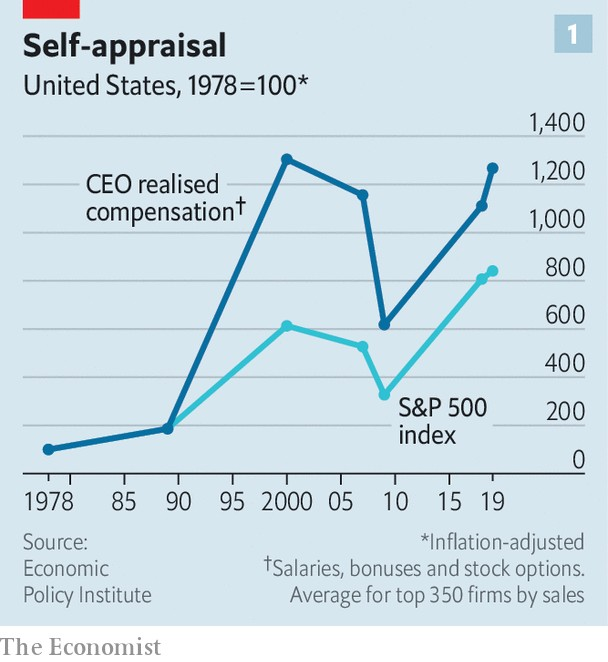
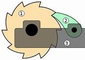

= eco 2020-07-11
:toc:

---

== Pay guaranteed 肯定的; 保证的, performance optional 词汇解说

(eco 2020-7-11 / Business / Executive compensation: Pay guaranteed, performance optional)

How CEO pay(n.) in America *got out whack* (系统或机器)运行不正常；不对头；有毛病

Bosses *claim that* their firms’ `superior 质量卓越的；出类拔萃的；超群的 returns` *justify* their own `hefty(a.)(钱的数额)很大的；超出一般的；可观的;(人或物体)大而重的 pay cheques`. Really?

Jul 11th 2020 | NEW YORK

- whack :  /wæk/ v. ( informal ) to hit sb/sth very hard 猛打；重击；狠揍 / n. 重击；重击声 +
=> 拟声词。 +
image:../../+ img_单词图片/w/whack.jpg[100,100]

- *out of whack* : ( NAmE , informal ) ( of a system or machine 系统或机器 ) not working as it should because its different parts are not working together correctly 运行不正常；不对头；有毛病

- 薪酬有保证，但公司执行的业绩却是可选的 +
美国CEO的薪酬, 是如何大幅下降的 +
老板们声称, 他们公司的利润高回报, 证明了他们自己拿到的丰厚的薪水是合理的。真是如此吗?

“TOO OFTEN, `executive compensation` 补偿（或赔偿）物；（尤指）赔偿金，补偿金；赔偿 in the US *is ridiculously 荒唐可笑地 out of line with* 与…不同（或不一致）；不符合 performance… The deck （屋后供憩息的）木制平台 *is stacked 使成叠（或成摞、成堆）地放在…；使码放在… against* investors.” *It* was with these words *that* in 2006 Warren Buffett, `a legendary investor` and `red-blooded 充满活力的；性欲旺盛的 capitalist`, *challenged* `the received(a.)被承认的；被一致认可的 wisdom` in corporate America about CEO pay. This *maintains that* bosses *deserve* generous rewards *because* these *are tightly linked to* their companies’ financial performance. [Fourteen years’ worth of evidence later] the received wisdom *is still looking shaky* 不稳固的；不牢靠的；摇晃的；不确切的;成问题的；可能失败的.

- *out of line (with sb/sth)* : not forming a straight line 不成直线 / different from sth 与…不同（或不一致）；不符合
.. London prices *are way out of line with* the rest of the country. 伦敦的物价与英国其他地方存在着很大的差异。

- “在美国，高管的薪酬往往与其业绩极不相符……形势不利于投资者。”2006年，传奇投资人、热血资本家沃伦•巴菲特(Warren Buffett)就是用这句话, 挑战了美国企业界对CEO薪酬的惯常看法。该惯常看法认为，老板应该得到丰厚的报酬，因为这些报酬与公司的财务表现紧密相关。但14年的证据表明，这个惯常观点看起来仍然不可靠。

“Pay for performance” *has been* the mantra 曼怛罗（某些宗教的念咒）；咒语 of America Inc [over the past few decades]. A small circle of `influential pay consultants` 薪酬顾问 , `compensation analysts` 薪酬分析师  and `academics` *has argued that* American firms *must pay top dollar for* top candidates *because* they *compete* in a global market *for talent*. They *argue that* firms *have grown more complex* and bosses *must know* how to *manage* `new technologies` and `the vagaries`(n.)出乎意料的变化;难以预测的转变 of globalisation. `The controversial 引起争论的；有争议的 corollary` 必然的结果（或结论） *is that* pay *should be allowed to rise ever higher* because superior CEO performance *is maximising 最大化,使增加到最大限度 shareholder returns*.

- vagary : [ˈveɡəri, vəˈɡɛri]  (N-COUNT) 出乎意料的变化;难以预测的转变 Vagaries are unexpected and unpredictable changes in a situation or in someone's behaviour which you have no control over. +
=> 来自拉丁语vagus("wandering").

- corollary :[ˈkɔ:rəleri; ˈkɑ:r-] n. *~ (of/to sth)* (formal,or technical 术语) a situation, an argument or a fact that is the natural and direct result of another one 必然的结果（或结论） +
=> 来自corolla, 花冠。字面意思即买花要付钱，付钱买花。后用于逻辑术语，指推论。

- 在过去的几十年里，“绩效薪酬”一直是美国公司的口头禅。一小群有影响力的薪酬顾问、薪酬分析师和学者认为，美国公司必须支付高薪来聘用顶尖人才，因为它们在全球市场上竞争, 以获取人才。他们争辩说, 公司已经变得更加复杂，老板们必须知道如何管理新的技术, 和管理由全球化带来的变幻莫测的结果。有争议的推论是，应该允许薪酬越来越高，因为卓越的CEO业绩, 正在使股东回报最大化。

Rise *it has* -- *and then some* 而且还远不止此, 而且还要多. According to Bloomberg, a research firm, `主` `the median(a.)中间值的；中位数 CEO compensation` at big American firms `in the S&P 500 share index` `谓` *reached $14m* last year. America’s top earners *made far more*. Alphabet’s Sundar Pichai *received* a cool $281m. The sums *are considerably smaller* across the Atlantic, where `pay practices` 通常的做法；惯例；常规 *have historically been more restrained*. The ten best-paid British bosses together *did not make as much as* Mr Pichai in 2019.

- 它已经上升——而且还在上升。据研究公司彭博社报道，去年标准普尔500指数中美国大型公司的CEO薪酬中值, 达到1400万美元。美国的顶级收入者赚得更多。Alphabet的桑达尔•皮查伊(Sundar Pichai)拿到了2.81亿美元。而大西洋彼岸的薪酬水平则要低得多，因为那儿的薪酬制度历来较为严格。2019年，英国薪酬最高的十位老板加起来的收入, 还不如皮查伊(Alphabet的首席执行官)。

`A forthcoming 即将发生（或出版等）的 report` by the Economic Policy Institute (EPI), a left-leaning think-tank, *scrutinises* 仔细查看；认真检查；细致审查 `主` how much bosses (at the 350 biggest American firms *by revenue* 财政收入；税收收入；收益) `谓` *actually made* [once stocks and options *were vested(v.)授予，赋予，给予（合法权利或权力） and exercised*(v.)行使; 运用] (*as opposed to* （表示对比）而，相对于 their `notional values` at the time *they were granted*). Lawrence Mishel of EPI *calculates that* [from 1978 to 2019] `the average “realised”(=realize)实现；将…变为现实;把（财产等）变卖，变现 compensation` *swelled 使增大; 增大 nearly thirteen-fold* [in inflation-adjusted terms], *outpacing*(=outpace)(v.)在速度上）超过；比…快 the stockmarket (see chart 1). It *shot up 迅速成长;迅速增加 by 14%* in 2019 alone.

- *vest sth in sb / vest sb with sth* : (1) to give sb the legal right or power to do sth 授予，赋予，给予（合法权利或权力） / to make sb the legal owner of land or property 使合法拥有（土地或财产）/vest （衬衣等里面贴身穿的）背心，汗衫 +
=> 来自 PIE*wes,穿衣，词源同 wear,invest.引申词义授权，赋予，来自特定衣服的象征意义。
.. The Supreme Council *is vested with* overall authority. 最高苏维埃拥有一切权力。 +

- *AS OPPOSED TO* : ( formal ) used to make a contrast between two things （表示对比）而，相对于
.. 200 attended, *as opposed to 300* the previous year. 出席的有200人，而前一年是300人。
.. This exercise develops suppleness *as opposed to* (= rather than) strength. 这项锻炼不是增强力量，而是增强柔韧性的。

- *realize(v.) your assets* : ( formal ) to sell things that you own, for example property, in order to get the money that you need for sth 把（财产等）变卖，变现

- 左倾智库经济政策研究所(EPI)即将发布的一份报告, 仔细研究了美国350家最大的公司的老板, 在股票和期权被授予并行使后, 实际赚了多少钱(而不是他们被授予时的名义价值)。EPI的劳伦斯·米歇尔(Lawrence Mishel)计算出，从1978年到2019年，经通胀调整后的平均“变现”薪酬的价值, 增长了近13倍，超过了股市(见表1)。仅在2019年就猛增了14%。

Such numbers *were setting off 引发;触发;激起;引爆(炸弹);触发，拉响(警报等) alarm bells* before the covid-19 crisis. Now `主`  `the mass lay-offs` 下岗人员 and `bleeding balance-sheets` *resulting from* the recession `谓` *have brought it into* stark(a.)完全的；十足的;（指区别）明显的，鲜明的 relief （不快过后的）宽慰，轻松；解脱. According to `official filings` 存档；归档(复数), *one in ten* members of `the Russell 3000` 罗素指数, a broad index of listed American companies, *has slashed 大幅度削减；大大降低;（用利器）砍，劈 bosses’ salaries* in response to covid-19. They *include* big airlines (*like* United and Delta), `hotel chains` (such as Marriott and Wyndham) and `industrial conglomerates`  联合大公司；企业集团;合成物；组合物；聚合物 (for example, GE). Many others *plan to review* their compensation plans. Todd Sirras of Semler Brossy, a pay consultancy, *predicts* a busy autumn 秋天；秋季 for his industry.

- stark : a. [ only before noun ] complete and total 完全的；十足的 SYN utter / very different to sth in a way that is easy to see （指区别）明显的，鲜明的
.. The children watched [*in stark terror*].  子们极端恐惧地看着。
.. Social divisions in the city *are stark*. 城市里各社会阶层有明确的分野。

- conglomerate : /kənˈɡlɑːmərət/ [ C ] ( business 商 ) a large company formed by joining together different firms 联合大公司；企业集团  +
/ [ sing. ] ( formal ) a number of things or parts that are put together to form a whole 合成物；组合物；聚合物  +
/  ( geology 地 ) a type of rock made of small stones held together by dried clay 砾岩 +
=> con-, 强调。-glom, 球，块，词源同global, agglomerate. +

- 在covid-19危机爆发之前，这样的数字就敲响了警钟。现在，经济衰退造成的大规模裁员, 和资产负债表的大幅缩水, 使这一问题得到了明显的缓解。根据官方文件，罗素3000指数(Russell 3000是美国上市公司的一个广泛指数)中有十分之一的公司, 为了应对新冠病毒，已经削减了老板们的薪水。其中包括大型航空公司(如美联航和达美航空)、连锁酒店(如万豪和温德姆酒店), 和工业集团(如通用电气)。其他许多公司, 计划重新审视他们的薪酬计划。薪酬咨询公司Semler Brossy的托德•西拉斯(Todd Sirras)预测，他的行业将迎来繁忙的秋季。

Though *portraying* 描绘 (事物) this *as* a show of `solidarity with workers`, a few *have quietly also handed* bosses 双宾 `lucrative 赚大钱的；获利多的 perquisites` 特权；利益. A week [after Hyatt Hotels *cut its chief executive’s salary* in March], *it awarded him* 双宾 shares and options (*that could*, if the company’s `share price` *rebounds*, *be worth much more* than `the forgone 放弃的被抛弃的 pay`). Courtney Yu of Equilar, a research firm, *observes that* `主` bonuses 奖金(复数), grants 补助金；津贴(复数) of stocks and options (*tied to* performance at big American firms) `谓`  *have risen* *[from]* a small portion of `executive compensation` two decades ago *[to]* more than half today.

- perquisite : /ˈpɜːr-kwɪ-zɪt/ n. *~ (of sb)* something to which sb has a special right because of their social position 特权；利益 +
=> per-,完全的，-quis,寻求，要求，探索，词源同question,exquisite.引申词义过分要求，特权。后也用于指额外补贴，津贴。

- 虽然这被描绘成是工人团结一致的表现，但也有一些人悄悄地给老板们提供了丰厚的福利。凯悦酒店(Hyatt Hotels)在3月份削减了其首席执行官的工资一周后，就向他授予了股票和期权，如果公司股价反弹，这些股票和期权的价值, 可能会远远超过其放弃的薪酬。研究公司Equilar的考特尼·余(Courtney Yu)观察到，与美国大公司业绩挂钩的奖金、股票和期权, 其比例已经从20年前只占高管薪酬的一小部分, 上升到今天的一半以上。

Total recall 全面回忆

The favoured 大众喜爱的  measure of performance *is* a company’s total returns, which *combine* share-price moves(n.) *with* any `dividend 红利；股息；股利 payouts` 付出的巨款. *As a consequence of* `a record bull market` 牛市 in equities [after `the global financial crisis` of 2007-09], only *brought to a halt* 停止；阻止；暂停 by the covid-19 pandemic, `主` executive pay` in America `谓` *shot up into the stratosphere* 平流层;在（或到）极高水平. Today, after `a rollercoaster 过山车；剧烈起伏的事物 ride` this year, the S&P 500 *is nearly back to* where it was before the coronavirus struck; compensation *may continue to rise*.

- stratosphere : /ˈstrætə-sfɪr/ *IN/INTO THE STRATOSPHERE* : at or to an extremely high level 在（或到）极高水平 +
=> 来自拉丁语 stratus,展开，铺开，-sphere,球，层，词源同 atmosphere. +
.. The technology boom *sent share prices into the stratosphere*. 科技热潮使得股价飙升到极高的水平。 +
image:../../+ img_单词图片/s/stratosphere.jpg[100,100]

- rollercoaster +

- 最受青睐的业绩衡量标准, 是公司的总回报，它将股价变动与股息支付结合在一起。在2007年至2009年的全球金融危机后，股市出现了创纪录的牛市，只是因为新冠肺炎疫情的爆发才停滞不前，这导致美国高管薪酬飙升至极高水平。今天，在经历了今年的过山车行情后，标准普尔500指数几乎回到了冠状病毒来袭之前的水平；因此高官薪酬可能会继续上升。

In 2017 MSCI, a research firm, *published* its analysis of `realised chief-executive pay` between 2007 and 2016 at more than 400 big public American firms. At more than three-fifths of the firms, it *showed* `no correlation with` ten-year total returns (see chart 2). Some firms *overpaid* `lousy 非常糟的；极坏的；恶劣的 bosses`; others *underpaid* successful ones. Pay-for-performance “*may be broken*”, MSCI *concluded*. `主` A recent paper *co-authored by* Lucas Davis of the Haas School of Business `谓` *finds “strong evidence” that* bosses of energy firms *see* clear pay gains *when* stock valuations （专业）估价；估定的价值；估值 rise(v.) *as a result of* an oil-price *spike* 迅速升值；急剧增值 (which *they have no way to influence*).

- lousy : /ˈlaʊzi/ a.  very bad 非常糟的；极坏的；恶劣的
SYN awful terrible /  [ only before noun ] used to show that you feel annoyed or insulted because you do not think that sth is worth very much （认为某物无太大价值而不满或感到受辱）讨厌的，倒霉的 +
=> 来自louse,虱子，引申词义极糟糕的。
.. What lousy weather! 这天气真糟糕！
.. All she bought me was *this lousy T-shirt*. 她给我买的就这件破T恤。

- 2017年，研究公司摩根士丹利资本国际(MSCI), 发布了对美国400多家大型上市公司在2007年至2016年间变现的首席执行官薪酬的分析。在超过五分之三的公司中，他们CEO的薪酬与他们公司十年的总回报, 没有相关性(见表2)。一些公司对糟糕的老板支付了过高的薪酬，而另一些公司却对成功的老板支付了过低的薪酬。摩根士丹利资本国际(MSCI)得出结论称，绩效薪酬的假象“可能已被打破”。哈斯商学院(Haas School Of Business)的卢卡斯·戴维斯(Lucas Davis)最近与人合著的一篇论文发现，有“强有力的证据”表明，当油价飙升导致股价上涨时，在能源公司的老板身上, 能看到明显的薪酬增长，但是油价的飙升与否是这些老板无法影响的。

A fresh analysis by Equilar, *commissioned  正式委托（谱写或制作、创作、完成） by* CalPERS, a big Californian public `pension fund` 退休基金,养老金基金, *identifies* similar trends. It *looked at* the past five years of realised CEO pay for most firms in the Russell 3000 and *compared this with* the companies’ total returns. The bosses in the top pay quartile 四分位数；四分位值 *made twelve times* what those in the bottom quartile *did*, but *produced* financial returns *only twice as good* 和...一样好 . The bosses in the second-lowest pay quartile *made nearly three times as much as* those in the bottom quartile, even though their firms’ total returns *were actually worse*. “*There is no evidence that* boards *can tell in advance* who is a talented 有才能的；天才的；有才干的 CEO,” *sums up* 总结;概括 Simiso Nzima of CalPERS.

- quartile : /ˈkwɔːrtaɪl,ˈkwɔːrtl/ ( statistics 统计 ) one of four equal groups into which a set of things can be divided according to the distribution of a particular variable 四分位数；四分位值
.. women *in the fourth quartile* of height (= the shortest 25% of women) 身高在第四个四分位值的妇女（即最矮的25%妇女） +
image:../../+ img_单词图片/q/quartile.jpg[]

- 加州大型公共养老基金CalPERS委托Equilar进行的一项最新分析, 也发现了类似的趋势。它考察了过去五年罗素3000指数成份股公司中, 大多数公司已变现的CEO薪酬，并将其与这些公司的总收益回报进行了比较。薪酬最高的四分位数的老板的收入, 是最低四分位数的12倍，但产生的财务回报, 却只有最低四分位数的两倍。薪酬排名在倒数第二个四分位数上的老板的收入, 几乎是最后四分位数上格子上的老板的三倍，尽管他们的公司的总回报实际上更差。CalPERS的Simiso Nzima总结道：“没有证据表明, 董事会可以提前判断谁是一位有才华的CEO。”

Critics 评论人士 *point to* problems *besides* rewarding(v.) luck *instead of* skill. One *is* rent-seeking 寻租行为 by bosses, who *can take advantage of* the opacity 不透明性；模糊 that *tends to surround* 与…紧密相关；围绕 pay-setting. The process *was* long a dark art, *explains* David Larcker of Stanford University’s Graduate School of Business. Lucian Bebchuk of Harvard Law School, another expert in the field, *has argued that* American CEOs, who *tend to tower over* 高于，超过（附近的人或物） their boardrooms 董事会议室, *have too much influence over* this opaque process. Don Delves of Willis Towers Watson, a consultancy (with a big pay-advisory arm), *points to* “lots of `positive changes`” in pay-setting over the last two decades, *from* `greater independence` for `compensation committees` 薪酬委员会 *to* `more sophisticated setting` of `performance targets` 绩效目标. However, he *concedes  承认（某事属实、合乎逻辑等） that* bosses *retain “more influence* over their own pay *than* any other person”.

- Rent-seeking 寻租行为: 是指人们凭借政府保护而进行的寻求财富转移的活动。它包括“旨在通过引入政府干预或者终止它的干预而获利的活动”。即, 企业贿赂官员为本企业得到项目、特许权或其它稀缺的经济资源。 寻租往往使政府的决策或运作受利益集团或个人的摆布。

- *ˌtower over/above sb/sth* : (1) to be much higher or taller than the people or things that are near 高于，超过（附近的人或物） / (2) to be much better than others in ability, quality, etc. （在能力、品质等方面）胜过，远远超过（其他）
.. He *towered over* his classmates. 他的个儿比班里其他同学高出一大截。
.. She *towers over* other dancers of her generation. 她远远超过同时代的舞蹈演员。

- 批评人士指出，除了存在"奖励运气而不是技能"的问题之外，还有其他问题。其中一个就是老板的寻租行为，他们能从薪酬设定的不透明上, 获得利益. 薪酬设定的过程就是个黑箱, 斯坦福大学商学院研究生院的大卫·拉克解释说。哈佛法学院的卢西恩·贝布丘克(Lucian Bebchuk)是该领域的另一位专家，他认为，美国的CEO往往实际权力高于董事会议室中的其他人, 因此对这个不透明的薪酬设定过程, 有着太大的影响力。Willis Towers Watson是一家咨询公司, 它有着一个大型的"薪酬咨询"分支部分，该公司的唐·德尔夫斯指出，在过去的二十年里，在薪酬设定方面, 发生了“许多积极的变化”，包括从薪酬委员会更具独立性, 到更复杂的绩效目标设定上。但是，他也承认，老板们对自己薪酬的影响力, 是“比其他任何人都大”的。

Compensation committees *often rely on* `advice` -- and `political cover`(n.)掩护；防护 -- *from pay consultants*. A recent study of 2,347 firms, by Kevin Murphy of the Marshall School of Business and colleagues, *finds that* `主` companies (*using* consultants) `谓` *pay more*. Independently, those (with `higher pay` and `more complex pay plans`) *are also likelier to hire* advisers. Most problematic(a.)造成困难的；产生问题的 *is* their use of `pay benchmarking` 标杆分析法, which *has led to* the ratcheting (防倒转的)棘齿; 棘轮-up （使）逐渐小幅增长 of pay *for all bosses*. *As* Mr Nzima of CalPERS *observes*, “Everyone *is targeting* *[either]* median *[or]* above-median pay, so median *is always going higher* regardless of actual performance.” Gregg Passin of Mercer, another consultancy which *advises* clients *on pay*, *accepts that* `the ratchet effect` 棘轮效应 *is* real. “I *can’t deny it*,” he says. His firm *recommends 劝告；建议 that* some bosses, such as first-time CEOs, *should be paid below the median*.

- benchmarking : N-UNCOUNT In business, benchmarking is a process in which a company compares its products and methods with those of the most successful companies in its field, in order to try to improve its own performance. 标杆分析法. +
 标杆分析法, 就是将本企业各项活动, 与从事该项活动最佳者进行比较，从而提出行动方法，以弥补自身的不足。

- ratchet : /ˈrætʃɪt/ n. a wheel or bar with teeth along the edge and a metal piece that fits between the teeth, allowing movement in one direction only （防止倒转的）棘轮，棘齿 +
=> 来自法语 rochet,线轴，纺锤，词源同 rock,rocket.引申词义棘轮。插入字母 t,比较 bake,batch. +

- *ratchet(v.) (sth) up* :to increase, or make sth increase, repeatedly and by small amounts （使）逐渐小幅增长
.. Overuse of credit cards *has ratcheted up* consumer debt *to* unacceptable levels. 滥用信用卡, 使消费债务逐渐增加到了难以接受的地步。

- Ratcheting effect : 棘轮效应，是指人的消费习惯形成之后, 有"不可逆性"，即易于向上调整，而难于向下调整。尤其是在短期内消费是不可逆的，其习惯效应较大。这种习惯效应，使消费取决于"相对收入"，即相对于自己过去的高峰收入。消费者易于随收入的提高而增加消费，但不易于随收入降低而减少消费，以致产生有正截距的短期消费函数。这种特点被称为"棘轮效应"。

- 薪酬委员会, 经常依赖薪酬顾问的建议和政治掩护。马歇尔商学院的凯文·墨菲(Kevin Murphy)及其同事, 最近对2347家公司进行的一项研究, 他们发现，那些使用了薪酬顾问的公司, 支付给CEO的薪酬会更高。独立而言，那些薪酬更高、薪酬计划更复杂的人, 也更有可能聘请薪酬顾问。使用薪酬顾问会带来的最大问题是, 他们使用的"薪酬标杆分析法"，这导致了老板们的整体薪酬不断上涨。正如CalPERS的Nzima先生观察到的那样，“每个人想要得到薪酬目标, 要么是中位数，要么是高于中位数的，所以无论他们的实际业绩表现如何，薪酬中位数总是会更高。”另一家为客户提供薪酬咨询的咨询公司美世(Mercer), 其格雷格·帕辛(Gregg Passin)承认, 棘轮效应是真实存在的。“我不能否认，”他说。他的公司建议，一些老板(CEO)，比如首次担任首席执行官的人，薪酬应该低于中位数。

The good news, *says* Pamela Marcogliese of Freshfields, a law firm, *is that* `institutional investors` *are paying more attention to* remuneration  酬金；薪水；报酬. She *points to* a surge(n.) *in attention* [among `big activist 积极分子；活跃分子 investment funds`] *to* `“say [on pay]” proposals 提议；建议；动议`, which *let* investors *express(v.) dissatisfaction with* excessive(a.)过分的；过度的 pay.

- remuneration  : /rɪˌmjuː-nəˈreɪʃn/ [ UC ] ( formal ) an amount of money that is paid to sb for the work they have done 酬金；薪水；报酬 +
=> 来自拉丁语 remunerari,支付，奖励，来自 re-,向后，往回，munerari,给予，来自 munus,相互， 礼物，职责，服务，词源同 mutual,municipal.即对别人的服务应支付的报酬。比较 emolument.

- say on pay 股东决定薪酬, 薪酬话语权, 薪酬发言权, 薪酬决定权

- 富而德律师事务所(Freshfield)的帕梅拉·马尔科利斯(Pamela Marcogliese)表示，好消息是, 机构投资者更加关注薪酬。她指出，大型活跃投资基金对“薪酬话语权”(say on pay)提案的关注激增，这让投资者表达了对过高薪酬的不满。

Though these votes *are non-binding*(a.)（协议或决定）无约束力的, managements *typically respond to* `negative votes` 反对票 by *paring(=pare) back* 逐步减小（数量或体积）；使缩小 pay. Even `mainstream 主流思想；主流群体 investors` like BlackRock 黑岩集团, `a giant fund` that *rarely gainsays* 反驳；反对；否认 the management *[on pay]*, *are increasingly voting against* compensation-committee members (*promoting* egregious 极糟的；极坏的 pay schemes).

- pare : v. *~ sth (off/away)* : to remove the thin outer layer of sth 削皮；去皮 / *~ sth (back/down)* : to gradually reduce the size or amount 逐步减小（数量或体积）；使缩小

- gainsay : v. ( often used in negative sentences 常用于否定句 ) ( formal ) [ VN ] to say that sth is not true; to disagree with or deny sth 反驳；反对；否认 +
=> gain, 相反，来自again的原义，同against.

- egregious : /ɪˈɡriːdʒiəs/ a. ( formal ) extremely bad 极糟的；极坏的 +
=> e-, 向外。-greg, 群，集中，词源同yard, gregarious. 原义为鹤立鸡群的，极好的，现义贬义化。参照拉丁文egregium, 非凡，伟业。

-  BlackRock 黑岩集团，不同于全球最大私募股权基金之一的"黑石集团"(The Blackstone Group)。

- 虽然这些投票, 不具有约束力，但管理层面对这些反对票的, 通常也会以削减薪酬的方式来做出回应。甚至像贝莱德(BlackRock)这样的主流投资者群体，也越来越多地投票反对那些"推动了极其糟糕的薪酬方案的"薪酬委员会。贝莱德是一家大型基金，它通常很少在薪酬问题上对管理层表示异议。

America’s influential Council 委员会 of Institutional Investors, which *represents* big asset managers, last year *called for* simplifying(v.) `pay structures` 薪酬结构. CalPERS *wants to replace* 代替；取代 common `pay packages` 薪酬包, (such as those *based on* three-year performance), *with* plans ① *reflecting* rigorous 严格的；严厉的 five-year performance measures, or ② *delay(v.) payouts 付出的巨款 from equity （公司的）股本；资产净值 grants*(补助金)*股权补助* for at least five years. *It is also rebelling 造反；反抗；背叛 against* using(v.) `median 中位数 pay` *as* the favoured benchmark.

- 美国具有影响力的"机构投资者委员会"(Council Of Institution Investors), 它代表着大型资产管理公司. 去年, 它呼吁简化薪酬结构。CalPERS希望用新的方式, 来取代老的"只看3年业绩"的薪酬方案，例如, 用新的更严格的公司5年业绩方式, 或者将股权发放推迟至少5年。它还反对使用"中位数薪酬"作为受欢迎的基准。

[In May] Vanguard 先锋，先驱者, a big American `mutual fund` 共同基金,互助基金, *warned* boards *not to use* the pandemics *as an excuse* to “create(v.) ‘easier’ performance targets”, *adding that* `主` “at-risk pay `谓` *should remain* at-risk.”

- vanguard => 来自法语 avant-garde,先锋，先头部队，avant,前面，为 advance 原型，garde,护卫，词源同 guard.

- *领航投资（The Vanguard Group，也称先锋集团）*，创办者为约翰·柏格，是美国最大的基金管理公司之一，与**富达基金（Fidelity）**并列为美国两大基金管理公司。

- 5月，美国大型共同基金Vanguard 警告董事会, 不要以疫情为借口来“制定‘更容易’的业绩目标”，并补充说, “风险薪酬应处于风险之中”。

Glass Lewis, a shareholder-advisory firm, *has said that* `主` *offsetting*(v.)抵消；弥补；补偿 bosses’ pay cuts(n.) [*with* `options 期权 packages`  （必须整体接收的）一套东西，一套建议；一揽子交易] `谓` *may lead to* lawsuits 诉讼案. Institutional Shareholder Services, the other big proxy adviser 代理顾问, *has discouraged* 阻拦；阻止；劝阻 sudden changes(n.) to `long-term compensation` 补偿（或赔偿）物；（尤指）赔偿金，补偿金；赔偿, especially `the repricing 重新定价 of options`. Norges Bank Investment Management, which *oversees* 监督；监视 $1trn in Norwegian `pension assets`, *has criticised* the short-termism 只注重短期效益的思维方式 of `current compensation schemes`, *arguing that* “a substantial 大量的；价值巨大的；重大的 proportion” of pay *should [instead 代替；顶替；反而；却] be* shares *that are locked in* for five or ten years.

- short-termism : /ˌʃɔːrt ˈtɜːrmɪzəm/ n. [ U ] a way of thinking or planning that is concerned with the advantages or profits you could have now, rather than the effects in the future 只注重短期效益的思维方式

- 股东咨询公司Glass Lewis表示，用期权补偿老板的减薪, 可能会导致诉讼。另一家大型代理顾问机构机构:股东服务公司(Institutional Shareholder Services), 不鼓励对长期薪酬进行突然调整，尤其是对期权的重新定价。负责监管1万亿美元挪威养老金资产的挪威银行投资管理公司(Norges Bank Investment Management), 批评了目前薪酬计划的短视性，认为薪酬中的“很大一部分”, 应该是锁定了5年或10年的股票。

`主` Incentive(n.)激励；刺激；鼓励 packages` (that *postpone* payouts) `谓` *may*, it is true, *prompt* bosses *to demand* higher pay *to compensate* them *for* the added wait. Martine Ferland, boss of Mercer, *admits* a tension *exists* [*between*] the short term [*and*] the long term. Even so, she *is convinced* 使确信；使相信；使信服 {change *is afoot*(a.)计划中；进行中}. Executives “*cannot prosper*(v.)繁荣；兴旺；成功；发达 *at the expense” of* everyone else. Mr Larcker of Stanford *sees* the pandemic *as* “a wake-up call 催醒电话；叫早电话 *for* boards”. About time.

- 的确，推迟发放奖金的激励方案, 可能会促使老板们要求更高的薪酬，以补偿他们增加的等待时间。Mercer的老板Martine Ferland承认, 短期和长期之间存在紧张关系。尽管如此，她还是确信变革正在进行中。高管们“不能以牺牲他人的利益为代价”来获得成功。斯坦福大学的拉克尔先生, 将这场疫情视为“对董事会的一个警钟”, 关于时间。

---

== Pay guaranteed, performance optional

How CEO pay in America got out whack

Bosses claim that their firms’ superior returns justify their own hefty pay cheques. Really?

Jul 11th 2020 | NEW YORK

“TOO OFTEN, executive compensation in the US is ridiculously out of line with performance…The deck is stacked against investors.” It was with these words that in 2006 Warren Buffett, a legendary investor and red-blooded capitalist, challenged the received wisdom in corporate America about CEO pay. This maintains that bosses deserve generous rewards because these are tightly linked to their companies’ financial performance. Fourteen years’ worth of evidence later the received wisdom is still looking shaky.

“Pay for performance” has been the mantra of America Inc over the past few decades. A small circle of influential pay consultants, compensation analysts and academics has argued that American firms must pay top dollar for top candidates because they compete in a global market for talent. They argue that firms have grown more complex and bosses must know how to manage new technologies and the vagaries of globalisation. The controversial corollary is that pay should be allowed to rise ever higher because superior CEO performance is maximising shareholder returns.

Rise it has—and then some. According to Bloomberg, a research firm, the median CEO compensation at big American firms in the S&P 500 share index reached $14m last year. America’s top earners made far more. Alphabet’s Sundar Pichai received a cool $281m. The sums are considerably smaller across the Atlantic, where pay practices have historically been more restrained. The ten best-paid British bosses together did not make as much as Mr Pichai in 2019.

A forthcoming report by the Economic Policy Institute (EPI), a left-leaning think-tank, scrutinises how much bosses at the 350 biggest American firms by revenue actually made once stocks and options were vested and exercised (as opposed to their notional values at the time they were granted). Lawrence Mishel of EPI calculates that from 1978 to 2019 the average “realised” compensation swelled nearly thirteen-fold in inflation-adjusted terms, outpacing the stockmarket (see chart 1). It shot up by 14% in 2019 alone.

Such numbers were setting off alarm bells before the covid-19 crisis. Now the mass lay-offs and bleeding balance-sheets resulting from the recession have brought it into stark relief. According to official filings, one in ten members of the Russell 3000, a broad index of listed American companies, has slashed bosses’ salaries in response to covid-19. They include big airlines (like United and Delta), hotel chains (such as Marriott and Wyndham) and industrial conglomerates (for example, GE). Many others plan to review their compensation plans. Todd Sirras of Semler Brossy, a pay consultancy, predicts a busy autumn for his industry.

Though portraying this as a show of solidarity with workers, a few have quietly also handed bosses lucrative perquisites. A week after Hyatt Hotels cut its chief executive’s salary in March, it awarded him shares and options that could, if the company’s share price rebounds, be worth much more than the forgone pay. Courtney Yu of Equilar, a research firm, observes that bonuses, grants of stocks and options tied to performance at big American firms have risen from a small portion of executive compensation two decades ago to more than half today.

Total recall

The favoured measure of performance is a company’s total returns, which combine share-price moves with any dividend payouts. As a consequence of a record bull market in equities after the global financial crisis of 2007-09, only brought to a halt by the covid-19 pandemic, executive pay in America shot up into the stratosphere. Today, after a rollercoaster ride this year, the S&P 500 is nearly back to where it was before the coronavirus struck; compensation may continue to rise.

In 2017 MSCI, a research firm, published its analysis of realised chief-executive pay between 2007 and 2016 at more than 400 big public American firms. At more than three-fifths of the firms, it showed no correlation with ten-year total returns (see chart 2). Some firms overpaid lousy bosses; others underpaid successful ones. Pay-for-performance “may be broken”, MSCI concluded. A recent paper co-authored by Lucas Davis of the Haas School of Business finds “strong evidence” that bosses of energy firms see clear pay gains when stock valuations rise as a result of an oil-price spike which they have no way to influence.

A fresh analysis by Equilar, commissioned by CalPERS, a big Californian public pension fund, identifies similar trends. It looked at the past five years of realised CEO pay for most firms in the Russell 3000 and compared this with the companies’ total returns. The bosses in the top pay quartile made twelve times what those in the bottom quartile did, but produced financial returns only twice as good. The bosses in the second-lowest pay quartile made nearly three times as much as those in the bottom quartile, even though their firms’ total returns were actually worse. “There is no evidence that boards can tell in advance who is a talented CEO,” sums up Simiso Nzima of CalPERS.

Critics point to problems besides rewarding luck instead of skill. One is rent-seeking by bosses, who can take advantage of the opacity that tends to surround pay-setting. The process was long a dark art, explains David Larcker of Stanford University’s Graduate School of Business. Lucian Bebchuk of Harvard Law School, another expert in the field, has argued that American CEOs, who tend to tower over their boardrooms, have too much influence over this opaque process. Don Delves of Willis Towers Watson, a consultancy with a big pay-advisory arm, points to “lots of positive changes” in pay-setting over the last two decades, from greater independence for compensation committees to more sophisticated setting of performance targets. However, he concedes that bosses retain “more influence over their own pay than any other person”.

Compensation committees often rely on advice—and political cover—from pay consultants. A recent study of 2,347 firms, by Kevin Murphy of the Marshall School of Business and colleagues, finds that companies using consultants pay more. Independently, those with higher pay and more complex pay plans are also likelier to hire advisers. Most problematic is their use of pay benchmarking, which has led to the ratcheting-up of pay for all bosses. As Mr Nzima of CalPERS observes, “Everyone is targeting either median or above-median pay, so median is always going higher regardless of actual performance.” Gregg Passin of Mercer, another consultancy which advises clients on pay, accepts that the ratchet effect is real. “I can’t deny it,” he says. His firm recommends that some bosses, such as first-time CEOs, should be paid below the median.

The good news, says Pamela Marcogliese of Freshfields, a law firm, is that institutional investors are paying more attention to remuneration. She points to a surge in attention among big activist investment funds to “say on pay” proposals, which let investors express dissatisfaction with excessive pay.

Though these votes are non-binding, managements typically respond to negative votes by paring back pay. Even mainstream investors like BlackRock, a giant fund that rarely gainsays the management on pay, are increasingly voting against compensation-committee members promoting egregious pay schemes.

America’s influential Council of Institutional Investors, which represents big asset managers, last year called for simplifying pay structures. CalPERS wants to replace common pay packages, such as those based on three-year performance, with plans reflecting rigorous five-year performance measures, or delay payouts from equity grants for at least five years. It is also rebelling against using median pay as the favoured benchmark.

In May Vanguard, a big American mutual fund, warned boards not to use the pandemics as an excuse to “create ‘easier’ performance targets”, adding that “at-risk pay should remain at-risk.”

Glass Lewis, a shareholder-advisory firm, has said that offsetting bosses’ pay cuts with options packages may lead to lawsuits. Institutional Shareholder Services, the other big proxy adviser, has discouraged sudden changes to long-term compensation, especially the repricing of options. Norges Bank Investment Management, which oversees $1trn in Norwegian pension assets, has criticised the short-termism of current compensation schemes, arguing that “a substantial proportion” of pay should instead be shares that are locked in for five or ten years.

Incentive packages that postpone payouts may, it is true, prompt bosses to demand higher pay to compensate them for the added wait. Martine Ferland, boss of Mercer, admits a tension exists between the short term and the long term. Even so, she is convinced change is afoot. Executives “cannot prosper at the expense” of everyone else. Mr Larcker of Stanford sees the pandemic as “a wake-up call for boards”. About time.

---

== Parkinson's Law 帕金森定律

《帕金森定律》(Parkinson's Law)一书。帕金森经过多年调查研究，发现一个人做一件事所耗费的时间差别如此之大：他可以在10分钟内看完一份报纸，也可以看半天；一个忙人20分钟可以寄出一叠明信片，但一个无所事事的老太太为了给远方的外甥女寄张明信片，可以足足花一整天：找明信片一个钟头，寻眼镜一个钟头，查地址半个钟头，写问候的话一个钟头零一刻钟……特别是在工作中，工作会自动地膨胀，占满一个人所有可用的时间，如果时间充裕，他就会放慢工作节奏或是增添其他项目以便用掉所有的时间。

由此得出结论：在行政管理中，行政机构会像金字塔一样不断增多，行政人员会不断膨胀，每个人都很忙，但组织效率越来越低下。这条定律又被称为“金字塔上升”现象。

他在书中阐述了机构人员膨胀的原因及后果：一个不称职的官员，可能有三条出路。

1. 第一是申请退职，把位子让给能干的人；
1. 第二是让一位能干的人来协助自己工作；
1. 第三是任用两个水平比自己更低的人当助手。

这第一条路是万万走不得的，因为那样会丧失许多权力；第二条路也不能走，因为那个能干的人会成为自己的对手；看来只有第三条路最适宜。于是，两个平庸的助手分担了他的工作，他自己则高高在上发号施令。两个助手既无能，也就上行下效，再为自己找两个无能的助手。如此类推，就形成了一个机构臃肿、人浮于事、相互扯皮、效率低下的领导体系。

---

== Slackers  偷懒的人；怠惰的人 and Stakhanovites 词汇解说

(eco 2020-7-11 / Business / Bartleby: Parkinson’s law updated)

How the lockdown *has affected* a classic dictum 名言；格言 about work

Jul 11th 2020 |

- Slacker => slack,松懈的，懒散的，-er,人。

- Stakhanovites : 前苏联被载入史册的采煤工人。1935年8月31日，斯达汉诺夫在一班工作时间内采煤一百零二吨，超过普通采煤定额十三倍。所获奖项：列宁勋章、红旗勋章、Hero of Socialist Labour(1970)。1977年病死在精神病院。
.. stakhanovites model workers 模范工人

- dictum : /ˈdɪktəm/ n. ( formal ) a statement that expresses sth that people believe is always true or should be followed 名言；格言 +
=> 来自词根dict, 说话，命令，词源同dictionary. 引申义格言。

- 禁闭如何影响了关于工作的经典格言

*AS* LAWS 定律 *GO*, `主` the dictum *devised 构思; 设计 by* C. Northcote Parkinson, a naval 海军的 historian, `系` *was admirably succinct* 简明的；言简意赅的: “Work *expands*(v.) *so as to fill the time* available for its completion.” `主` His essay （用来刊登的）论说文；小品文, first *published* in The Economist in 1955, `谓` *has stood the test of time* 经受住了时间的考验, *in the sense that* 从...的意义上说 people *still refer to* “Parkinson’s law”. But `the experience of working life` during the pandemic *means that* Bartleby *would now like to suggest* three corollaries  必然的结果（或结论） *to* the theorem （尤指数学）定理.

- corollary : /ˈkɔːrəleri/ n. ( formal ) ( technical 术语 ) ~ (of/to sth) a situation, an argument or a fact that is the natural and direct result of another one 必然的结果（或结论） +
=> 来自corolla, 花冠。字面意思即买花要付钱，付钱买花。后用于逻辑术语，指推论。

- theorem : /ˈθiːərəm,ˈθɪrəm/

- 就定律而言，海军历史学家c•诺思科特•帕金森(C. Northcote Parkinson)提出的格言简洁得令人钦佩:“不管一个任务有多么简单或者复杂，它总会自动填满你给它分配的所有时间。”他的文章于1955年首次发表在《经济学人》(The Economist)上，从人们至今仍在提到“帕金森定律”的意义上来说，它经受住了时间的考验。但是，现在疫情期间的工作经历意味着，巴特比现在想对这个定理提出三个推论。

At the start of his essay, Parkinson *cited the case of* an elderly lady *requiring* a day *to send a postcard to* her niece 侄女；甥女. The process *involved* time *spent*(v.) *searching for* spectacles 眼镜(复数), postcard and umbrella, *as well as* composing(v.)撰写（信函、讲稿、诗歌等） the message. The details *may be dated*(a.)过时的；陈旧的 but the idea *is still resonant*(a.)引起联想的；产生共鸣的;共振的；谐振的；共鸣的 -- *faced with a task*, people *procrastinate* 拖延；耽搁.

- resonant : /ˈrezənənt/

- procrastinate : /prəˈkræs-tɪ-neɪt/ => 来自pro-,向前，crastinus,明天的，来自cras,明天。

- 在文章的开头，帕金森举了一个例子:一位上了年纪的女士需要一天时间给她的侄女寄一张明信片。这个过程包括花时间寻找眼镜、明信片和雨伞，以及撰写信息。细节可能过时了，但这个想法仍然很有共鸣——面对一项任务，人们会拖延。

When it *comes to* office work, `主` the incentives(n.)激励；刺激；鼓励 *to dawdle*(v.)拖延；磨蹭；游荡 `系` *are pretty clear*. *Finish* an assignment （分派的）工作，任务 *quickly*, and the employee *will just be given another*. That second task *may be even more unpleasant* than the first. Workers *may end up like 就像 a hamster 仓鼠 on a treadmill* （尤指旧时由人或牲畜踩动踏板使之转动的）踏车,（锻炼身体的）跑步机, *stuck* in an endless cycle of needless effort.

- hamster : /ˈhæmstər/

- 在办公室工作方面，偷懒的激励作用是非常明显的。快速完成一项任务，员工就会得到另一项任务。而第二项任务可能比第一项任务更加令人讨厌。员工就最终会像在跑步机上的仓鼠一样，陷入毫无必要的努力的无尽循环中.

Office workers *know*, however, *that* the mission itself *is not* the only thing. *It* is important *to be seen* to be working. This *leads to* “presenteeism” 超时工作 -- *being at your desk* for long enough *to impress the boss* (and even *turning up*  (常指出其不意地或经长久等待后)出现，到来，露面;找出;发现;注意到;出现 while sick). [In the pre-internet era] this *would involve* endless redrafting  改写；重新起草 of memos, long phone calls, or *staring(v.)盯着看; 凝视 meaningfully 有用意的; 有目的的 at* documents. *Thanks to* the pioneering work of Tim Berners-Lee, presenteeism *now requires less effort*: many hours *can be wasted on* the world wide web.

- presenteeism : /ˌpreznˈtiːɪzəm/ n. [ U ] ( BrE ) the practice of spending more time at your work than you need to according to your contract 超时工作 +
=> 来自present,在场的，现场的，-ee,人，-ism,主义，思想。幽默用法，比较absenteeism.

- turn up : (PHRASAL VERB-ERG) 找出;发现;注意到;出现 If you *turn something up* or if it *turns up*, you find, discover, or notice it.
.. Investigations *have never turned up any evidence*.
调查从没发现任何证据。

- 然而，办公室职员知道，任务本身并不是唯一的事情。让别人看到你在工作是很重要的。这就导致了“出勤主义”——长时间坐在办公桌前给老板留下深刻印象(甚至在生病的时候出现)。在前互联网时代，这需要无休止地重新起草备忘录，打长时间的电话，或者有目的地盯着文件看。多亏了Tim Berners-Lee的开创性工作，现在的假性出勤不需要那么多努力:很多时间可以浪费在万维网上。

When *working at home*, the boss *is out of sight* but *not out of mind*. *Broadly speaking*, the result *is* `表` *to divide*(v.) workers *into* two factions 派系. The first group, the slackers, *has spent* the lockdown *working(v.) out* the minimum level of effort (they *can get away with* （做坏事而）未受惩罚；（做冒险之事而）未遭遇不测). They *have no need to drag out 不必要地拖延;使持续过久 each task*; they *do* what is required and *spend the rest of the day [at leisure 闲散；悠闲]*, *submitting  提交，呈递（文件、建议等） the work* just before deadline. For this group, Parkinson’s law *can be amended(v.)修正 as follows*: “For the unconcerned 淡的；漠视的；漫不经心的;不关心的；无兴趣的, [when unobserved 不被看见（或发现）的], `主` work `谓` *shrinks to fill the time required*.”

- drag out : (PHRASAL VERB) 不必要地拖延;使持续过久 If you drag something out, you make it last for longer than is necessary.
.. The company was willing *to drag out the proceedings for years*... 公司愿意将诉讼拖上几年。

- 在家工作时，老板在视线范围之外，但心里还惦记着。总的来说，其结果就是工人们会分成两类。第一类是"懒惰"之人，他们在禁闭期间, 只会将工作做到能应付交差而不受惩罚的程度。他们不需要来拖延工作, 他们只做需要做的事，然后在一天的剩余时间里就能悠闲地度过，他们只需在截止时间之前提交工作即可。对于这类人，帕金森定律可以修改如下:“对于那些对工作不感兴趣的人，当他们不被其他人注意到时，其工作就会缩水到仅需要完成任务的程度。”

The second group *takes the opposite approach*. *Consumed  使充满（强烈的感情）;消耗，耗费（燃料、能量、时间等）  by* guilt, anxiety about their `job security` 职业安全感 or ambition, they *work(v.) even harder than before*. Being at home, they *find* no clear demarcation （工种、人、土地等的）划分，区分，界线 *between* work time *and* leisure time. This group *is* the Stakhanovites (*named after* `a heroically productive miner` in the Soviet Union). They *require* their own amendment （法律、文件的）改动，修正案，修改，修订: “For anxious home workers, work *expands(v.) to fill(v.) all their waking hours*.”

- 第二类员工则采取相反的方法。他们因职业安全感和野心, 而感到内疚和焦虑, 这种强烈的情感, 使他们比以前更加努力地工作。待在的家里他们发现, 工作时间和休闲时间没有了明确的界限。这群人就变成了Stakhanovites(以苏联一位高产矿工的名字命名)。对他们, 就需要符合他们自己的"帕金森修整定律"了:“对于焦虑的在家工作的人来说，他们醒着的时间都被工作占据了。”

But Parkinson *was making a much broader point*(n.) *than* people’s tendency (to be dilatory(a.)拖拉的；拖延的；延误的). The bulk of his essay *was concerned(a.)感兴趣的；关切的；关注的 with* the growth of bureaucracy in government. He *warned that* `主` hiring(v.) more civil servants `谓` *did not necessarily lead to* more effective work.

- 但帕金森氏症提出了一个比"人们做事会拖拉"更广泛的观点。他文章的大部分是关注于政府官僚主义的发展状况上的。他警告说，雇佣更多的公务员并不一定会带来更有效的工作。

This tendency *resulted from two factors*. First, officials *want to multiply*(v.)成倍增加；迅速增加;（使）繁殖，增殖 subordinates(n.)下级；部属, *not* rivals. Second, officials *tend to make work for each other*. `主` Any official (who *feels* overworked) `谓` *will ask to be given* two subordinates (`主` *asking for* just one `谓` *would create* a rival). The senior official *will then spend lots of time* checking(v.) their subordinates’ work.

- 这种趋势, 是由两个因素造成的。首先，官员们希望增加下属人数，而不是竞争对手。其次，官员们倾向于给彼此工作。任何觉得自己工作过度的官员, 都会要求给自己配备两个下属(如果只要求拥有一个下属的话, 会给自己造成一个竞争对手)。高级官员会花很多时间来检查下属的工作。

How *does* this process *apply* in the lockdown? *Like* their staff, managers *also want to appear useful*. In the office, they *can seem busy* by *walking(v.) around* and *talking to their teams*. At home, this is more difficult; a phone call *is* more intrusive 侵入的；闯入的；侵扰的；烦扰的 *than* a casual chat. The answer *is* to organise(v.) more Zoom meetings.

- 这个过程如何适用于禁闭期间的工作呢? 和他们的员工一样，经理们也希望自己显得"有用"。在办公室里，他们通过四处走动，与团队成员交谈，来显得自己很忙。但在家里工作, 想要做到这一点就比较困难了; 打别人电话会比随意聊天更具有烦扰性。那么更好的方法就是组织更多的Zoom视频会议。

Bartleby *has heard* from a number of contacts 熟人；（尤指）社会关系 in recent weeks *that* they *spend* their day *going from one Zoom meeting to another*. *Just as* Parkinson *suggested*, managers *are making more work for each other*. Hence the third amendment to his law: “In lockdown, Zoom *expands* to fill(v.) all of the manager’s available time.”

- 最近几周，巴特比从一些熟人那里听说，他们每天都在不停地开一个又一个Zoom会议。正如帕金森所言，经理们在为彼此创造更多的工作。因此，他的法则的第三条修正就是:“在禁闭期间，Zoom视频会议, 会扩展到经理的所有可用时间。”

*To the extent that* these meetings *are voluntary* 自愿的, this *creates* another divide *between* slackers *and* Stakhanovites. The first group *will avoid such meetings* and the latter group *will sign up 跟…签订合同; 报名 for all of them*. Furthermore, in the pre-lockdown days, staff *could earn brownie points*  讨好上级所得的好印象；拍马屁得分 by *turning up* for such gatherings, *provided* 如果；假如；在…条件下 they *caught the boss’s eye*. Mere attendance *is insufficient(a.)不充分的；不足的；不够重要的 for a Zoom meeting*; one *must be seen and heard*. In turn 反过来, that *makes* Zoom meetings *longer*, further *using up* the time of managers and their Stakhanovite subordinates (many slackers *have yet to learn* how to *use*(v.) the “raise hand” 举手 button). It is a digital version of the paperwork 文书工作 shuffling 把（纸张等）变换位置，打乱次序 *described by Parkinson* 65 years ago.

- *brownie point* : [ usually pl. ] ( informal ) if sb does sth to earn brownie points , they do it to make sb in authority have a good opinion of them 讨好上级所得的好印象；拍马屁得分 +
=>  源自幼女童军（the Brownies）。该俱乐部是为年龄不够参加女童子军的女孩设立的。表现好或成绩好的女孩奖以分数鼓励。

- brownie : /ˈbraʊni/ [ C ] a thick soft flat cake made with chocolate and sometimes nuts and served in small squares 巧克力方块蛋糕（有时放有坚果） /  [ C ] ( BrE also also ˈBrownie Guide ) a member of the Brownies （一个）幼女童军 +
=> 指一种棕色的巧克力蛋糕。棕仙子义可能来自于传说中其棕色的皮肤，或因其在夜间出没帮助小孩。幼女童子军以BROWNIE命名，取助人为乐之意。 +

- 鉴于这些会议都是自愿的，这就在偷懒者和斯塔卡哈诺派之间, 划分出了另一个人群类型. 第一组将避免这样的会议，而后一组将报名参加所有的会议。此外，在封锁前的日子里，只要能引起老板的注意，员工就可以通过出席这样的聚会, 来赢得好印象的加分。召开一次Zoom会议，仅仅出席是不够的;一个人必须被看到和听到。反过来，这又延长了Zoom会议的时间，进一步耗尽了经理和他们斯塔卡哈诺维奇下属的时间(许多偷懒的人还没有学会如何使用“举手”按钮)。这是65年前帕金森所描述的"打乱文书"工作的数字化版本。

---

== Slackers and Stakhanovites

Slackers and Stakhanovites

How the lockdown has affected a classic dictum about work

Jul 11th 2020 |

AS LAWS GO, the dictum devised by C. Northcote Parkinson, a naval historian, was admirably succinct: “Work expands so as to fill the time available for its completion.” His essay, first published in The Economist in 1955, has stood the test of time, in the sense that people still refer to “Parkinson’s law”. But the experience of working life during the pandemic means that Bartleby would now like to suggest three corollaries to the theorem.

At the start of his essay, Parkinson cited the case of an elderly lady requiring a day to send a postcard to her niece. The process involved time spent searching for spectacles, postcard and umbrella, as well as composing the message. The details may be dated but the idea is still resonant—faced with a task, people procrastinate.

When it comes to office work, the incentives to dawdle are pretty clear. Finish an assignment quickly, and the employee will just be given another. That second task may be even more unpleasant than the first. Workers may end up like a hamster on a treadmill, stuck in an endless cycle of needless effort.

Office workers know, however, that the mission itself is not the only thing. It is important to be seen to be working. This leads to “presenteeism”—being at your desk for long enough to impress the boss (and even turning up while sick). In the pre-internet era this would involve endless redrafting of memos, long phone calls, or staring meaningfully at documents. Thanks to the pioneering work of Tim Berners-Lee, presenteeism now requires less effort: many hours can be wasted on the world wide web.

When working at home, the boss is out of sight but not out of mind. Broadly speaking, the result is to divide workers into two factions. The first group, the slackers, has spent the lockdown working out the minimum level of effort they can get away with. They have no need to drag out each task; they do what is required and spend the rest of the day at leisure, submitting the work just before deadline. For this group, Parkinson’s law can be amended as follows: “For the unconcerned, when unobserved, work shrinks to fill the time required.”

The second group takes the opposite approach. Consumed by guilt, anxiety about their job security or ambition, they work even harder than before. Being at home, they find no clear demarcation between work time and leisure time. This group is the Stakhanovites (named after a heroically productive miner in the Soviet Union). They require their own amendment: “For anxious home workers, work expands to fill all their waking hours.”

But Parkinson was making a much broader point than people’s tendency to be dilatory. The bulk of his essay was concerned with the growth of bureaucracy in government. He warned that hiring more civil servants did not necessarily lead to more effective work.

This tendency resulted from two factors. First, officials want to multiply subordinates, not rivals. Second, officials tend to make work for each other. Any official who feels overworked will ask to be given two subordinates (asking for just one would create a rival). The senior official will then spend lots of time checking their subordinates’ work.

How does this process apply in the lockdown? Like their staff, managers also want to appear useful. In the office, they can seem busy by walking around and talking to their teams. At home, this is more difficult; a phone call is more intrusive than a casual chat. The answer is to organise more Zoom meetings.

Bartleby has heard from a number of contacts in recent weeks that they spend their day going from one Zoom meeting to another. Just as Parkinson suggested, managers are making more work for each other. Hence the third amendment to his law: “In lockdown, Zoom expands to fill all of the manager’s available time.”

To the extent that these meetings are voluntary, this creates another divide between slackers and Stakhanovites. The first group will avoid such meetings and the latter group will sign up for all of them. Furthermore, in the pre-lockdown days, staff could earn brownie points by turning up for such gatherings, provided they caught the boss’s eye. Mere attendance is insufficient for a Zoom meeting; one must be seen and heard. In turn, that makes Zoom meetings longer, further using up the time of managers and their Stakhanovite subordinates (many slackers have yet to learn how to use the “raise hand” button). It is a digital version of the paperwork shuffling described by Parkinson 65 years ago.

