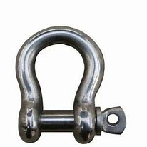

= eco 2020-07-18
:toc:

---

== The darkness behind 词汇解说

(eco 2020-7-18 / China / Hong Kong’s companies: The darkness behind)

Why business in Hong Kong *should be worried*

A new national-security law *is not the only threat*

Jul 18th 2020 | HONG KONG

- 为什么香港的企业应该感到担忧 +
新的国家安全法并不是唯一的威胁

JUST OVER two weeks after its enactment(n.)（法律、法案、法令的）制订，通过，颁布；法律；法规, `主` Hong Kong’s national-security law -- a Leninist 列宁主义者的 set of measures *designed* in Beijing and *clamped* （用夹具）夹紧，夹住，固定 on top of a legal system (hitherto 迄今；直到某时 *admired* for its respect for individual rights) -- `谓` *looms ever larger* over the territory. In response, on July 14th, President Donald Trump *signed* the Hong Kong Autonomy 自治；自治权 Act. This *authorises*(v.)批准；授权 sanctions 制裁 [*on* those *involved in* “`*extinguishing* 毁灭；消灭；使破灭;熄灭；扑灭 Hong Kong’s freedom`”], *as well as* [*on* financial firms that *knowingly 故意地；蓄意地 do business with them*]. He *also ruled that* Hong Kong *was no longer* a separate economic entity (*justifying*  证明…正确（或正当、有理） different treatment from the rest of China).

- 在颁布两周后，香港的国家安全法——一套由北京设计的列宁主义的措施-- 在香港的影响力越来越大。迄今因尊重个人权利, 而备受推崇的香港的法律体系, 被其束缚住了。作为回应，7月14日，唐纳德·特朗普总统签署了《香港自治法案》。该法案授权对那些参与“扼杀香港自由”的人，以及故意与这些人做生意的金融公司, 进行制裁。他还裁定，香港不再是一个独立的经济实体，因此不应受到与中国其他地区不同的待遇。

The act *will sharpen  （使感觉或感情）加强，加重，变得更明显;（使）变得锋利，变得清晰 differences* between America and China, and *give* Hong Kong’s Communist Party overlords （尤指旧时的）领主 宾补 *an excuse*(n.)借口；理由 *to divine*(v.)（用丫形杖）探测（地下水）;猜到；领悟 foreign *meddling 干涉 in* every corner of the territory’s life. They *already spy*(v.)从事间谍活动；搜集情报 enemies in many places. They *have denounced* 谴责 the recent holding 托住,支撑…的重量 of informal `primary elections` 初选；预选, in which 610,000 Hong Kongers *helped choose*(v.) candidates (*fielded 使参加竞选；使参加比赛 by* anti-establishment 反对现有权力结构的，反对权威当局的 parties) *for* polls(n.)选举投票；计票 for `the Legislative Council` 立法委员会（英国议会上院） , or Legco, in September. They *accused* those who *conducted* `the unprecedented 前所未有的；空前的；没有先例的 exercise` of *harbouring* 怀有，心怀（尤指反面感情或想法）;窝藏，庇护（罪犯等） “evil intentions”(n.)打算；计划；意图；目的, *including* the use of Hong Kong as a base for “subversion”(n.)颠覆企图 and foreign “infiltration”  渗透；渗透物. `主` These *relate to* crimes that, *along with* sedition 煽动叛乱的言论（或行动） and terrorism, `谓` *are covered* by the security law.

- 这一行动将加剧中美之间的分歧，并给香港的共产党领主一个借口，让他们探测外国干预香港生活每一个角落的程度。他们已经在很多地方刺探敌人了。他们谴责了最近举行的非正式初选，在这次选举中，61万名香港人帮助选择了反建制政党派出的候选人，以便在9月份举行的立法会选举中进行投票。他们指责那些怀有“邪恶的意图”的人进行的史无前例的抗议活动，包括利用香港作基地来进行“颠覆”和外国的“渗透”活动。这些都是犯罪, 并且连同煽动叛乱和恐怖主义，都在国家安全法的涵盖范围之内。

The mantra 曼怛罗（某些宗教的念咒）；咒语 of `establishment （通常反对变革的）当权派，权势集团；（统称）权威人士 types` *is that* this law *is working to “stabilise”* （使）稳定，稳固 Hong Kong. They *mean that*, by *constraining* political and civil strife(n.)冲突；争斗；倾轧, the city *is now reverting to* its age-old role *as* a business hub. Officials *point out* how the Hang Seng index 恒生指数 *surged* after the law’s promulgation 颁布；公布 on June 30th. Since then, they *note*, `主` `daily stockmarket 股市 turnover` （一定时期内的）营业额，成交量 `谓` *has been the highest* in more than two years.

- 当权人士的口头禅是，这部法律正致力于“稳定”香港。他们的意思是，通过限制政治和内乱，这座城市正在恢复其作为商业中心的古老角色。官员们指出，6月30日新法颁布后，恒生指数飙升。他们指出，自那以后，股市的日成交量达到了两年多来的最高水平。

*It is not surprising that* they *use* such indicators 指标, 指示器. Business interests *are deeply enmeshed 使陷入，使卷入（困境等） in* Hong Kong’s political structures -- even more so [now] 现在更是如此 *than* in British colonial days. The Basic Law, the mini-constitution that Hong Kong *adopted* at the time of its handover （权力、责任等的）移交，移交期 to China in 1997, *gives* companies *a big share of the vote* in the 1,200-strong committee that *chooses* the chief executive. `主` Nearly half of Legco’s seats *are “functional” constituencies (会支持某政党或政客的) 选民阵营;选区 `谓` *set aside 留；存 for* commercial and other special interests. The chief executive’s advisory body, the Executive Council （顾问、立法、研究、基金等）委员会, *is stuffed(v.)填满；装满；塞满；灌满 with* representatives from business and finance.

- enmesh  : v. *~ sb/sth (in sth)* : ( formal ) to involve sb/sth in a bad situation that it is not easy to escape from 使陷入，使卷入（困境等） +
=> en-, 进入，使。mesh, 网。

- aside : to be used later 留；存
.. We *set aside some money* for repairs. 我们存了一些钱作为修理费用。

- council :  /ˈkaʊnsl/  a group of people chosen to give advice, make rules, do research, provide money, etc. （顾问、立法、研究、基金等）委员会

- 他们使用这样的指标并不奇怪。商业利益已经深深地融入了香港的政治结构中——甚至比英国殖民时期还要深。香港1997年回归中国时通过的迷你宪法《基本法》(Basic Law), 赋予了企业在1200人组成的行政长官选举委员会中, 有很大一部分投票权。立法会近一半的席位, 是为商业和其他特殊利益集团预留的“功能性”选区阵营。行政长官的顾问机构 -- 行政会议, 由商界和金融界的代表组成。

Since China *took control of* the city, businesspeople *have had good reason* to talk up 大声讲；大胆讲；赞扬 its prospects. The territory *has continued to be* a vital intermediary  中间人；调解人 between China and the world. In Hong Kong, mainland companies *enjoy access(n.)（使用或见到的）机会，权利 to* hard currency, free(n.) of the capital controls that *shackle(v.)束缚；阻挠；成为…的羁绊; 给（某人）戴镣铐 them at home*. International investors *have benefited from* Hong Kong’s `sound 完好的；健康的；无损伤的；未受伤的 legal, monetary 货币的，钱的（尤指一国的金融） and regulatory systems`. `主` Hong Kong’s position as Asia’s pre-eminent 杰出的；出类拔萃的；卓越的 `international financial powerhouse` 强大的集团（或组织）;经济体 `谓` *has remained nearly unassailable* 无法摧毁的；不可战胜的；不容置疑的. Its abundance of financial, legal, accounting and other professional expertise 专门知识；专门技能；专长 *has encouraged* more than 1,500 companies *to put* their regional headquarters *in the city*.

- shackle : /ˈʃækl/ => 来自古英语 sceacel,镣铐，脚链，来自 Proto-Germanic*skakulaz,镣铐，脚链，来自 PIE*skek, 摇晃，词源同 shake.-le,工具格后缀。 +

- 自从中国控制了这座城市，商人们有充分的理由谈论它的前景。该领土继续是中国与世界之间的重要媒介。在香港，内地企业可以获得硬通货，摆脱了束缚它们的国内资本管制。国际投资者受益于香港健全的法律、货币和监管体系。香港作为亚洲首屈一指的国际金融中心的地位，几乎一直是不容置疑的。它丰富的金融、法律、会计和其他专业知识的人才, 鼓励了1500多家公司将它们的地区总部设在香港。

Strikingly, *neither* last year’s turmoil 动乱；骚动；混乱；焦虑 *nor* this year’s pandemic *dented* 损害，伤害，挫伤（信心、名誉等）;使凹陷；使产生凹痕 Hong Kong’s pre-eminence. In November Alibaba *raised nearly $13bn* in a secondary listing in Hong Kong. JD.com, another e-commerce giant, *followed* last month, *raising $3.9bn*. Officials and financial executives *talk of* a coming listings bonanza 发财（或成功）的机遇;兴盛；繁荣. Hong Kong *is* even a beneficiary 受益者；受惠人;遗产继承人 in this regard(n.)注意；关注；关心 of Sino-American tensions. Among other things 除了其它方面, 此外, American *moves to tighten* auditing 审计 procedures *make* listings 上市 in New York *harder for Chinese firms*.

- bonanza : /bəˈnænzə/ a situation in which people can make a lot of money or be very successful 发财（或成功）的机遇 / a situation where there is a large amount of sth pleasant 兴盛；繁荣 +
=> 来自西班牙语。来自词根bon, 好，见bonus. 美国19世纪中期淘金热时的流行词。-anza, 同-ance.

- regard : n. [不可数名词] ~ to/for sb/sth (formal) attention to or thought and care for sb/sth 注意；关注；关心
.. to do sth *with scant/little/no regard(n.) for sb/sth* 做事不怎么 / 几乎不 / 根本不顾及某人 / 某事物

- 引人注目的是，无论是去年的动荡, 还是今年的疫情，都没有削弱香港的卓越地位。去年11月，阿里巴巴在香港二次上市，筹资近130亿美元。另一家电商巨头京东(JD.com)上月紧随其后，融资39亿美元。政府官员和金融业高管, 都在谈论即将到来的上市热潮。香港甚至是中美紧张关系的受益者。除其他因素外，美国收紧审计程序的举措, 使中国公司在纽约上市变得更加困难。

Yet business is also a source of social tension. Yes, finance and related services *remain* globally competitive(a.)竞争的,有竞争力的, *accounting for* about a quarter of the economy. But finance *employs*(v.) relatively few people *compared with* less competitive services, and *pushes up prices* for everyone in the territory. *In the absence 不存在；缺乏 of* other vibrant(a.)充满生机的；生气勃勃的；精力充沛的 sectors, property prices *have grown out of kilter(n.) 不正常；失常;（与…）不一致，不同 with* most Hong Kongers’ incomes. `主` Government efforts to *foster* 抚育，照料（他人子女一段时间）;促进；助长；培养；鼓励 high tech, the arts, `medical tourism` 旅游业；观光业 and even `wine trading` `谓` *have produced little*. In the time (it *took* Alibaba, JD.com and a dozen other Chinese startups *to emerge as* giants), no new Hong Kong company *has achieved the same*.

- *OUT OF KILTER(n.)* : (1) not agreeing with or the same as sth else （与…）不一致，不同 +
-> His views *are out of kilter with* world opinion. 他的观点与世人的看法不一致。 +
(2) no longer continuing or working in the normal way 不正常；失常 +
-> Long flights *throw my sleeping pattern out of kilter for days*. 长途飞行使我的睡眠习惯给打乱了好几天。 +
=> kilter : 来自英语方言kelter,秩序，常见于短语out of kilter,混乱，不一致。

- 然而，商业上的问题也是社会紧张的一个根源。是的，香港的金融及相关服务业, 仍在全球具有竞争力，约占中国经济的四分之一。但是与竞争力较弱的服务业相比，金融业能雇佣的员工相对较少，并且推高了香港所有人的价格。在缺乏其他充满活力的行业的情况下，房地产价格已经与大多数香港人的收入不平衡。政府培育高科技、艺术、医疗旅游甚至饮酒贸易的努力, 收效甚微。在阿里巴巴、京东(JD.com)和其他十多家中国初创企业, 发展成为巨头的那段时间里，没有一家新的香港公司取得同样的成就。

This is a consequence of `the government’s close ties with business`. `主` Nearly every `major business sector` `系` *is in the hands of* one or another of the city’s handful of `established 著名的；成名的；公认的 property conglomerates` 联合大公司；企业集团. These *stifle*(v.)压制；扼杀；阻止；抑制;（使）窒息，无法自如地呼吸，感觉窒闷 competition /and *keep* the cost of property (the world’s most expensive) and other basic services *prohibitively(ad.)(价格或费用)高昂得令人难以承受的；贵得买不起的 high*.

- conglomerate  /kənˈɡlɑːmə-rət/ n. [ C ] ( business 商 ) a large company formed by joining together different firms 联合大公司；企业集团 / [ sing. ] ( formal ) a number of things or parts that are put together to form a whole 合成物；组合物；聚合物 / [ U ] ( geology 地 ) a type of rock made of small stones held together by dried clay 砾岩 +
=> con-, 强调。-glom, 球，块，词源同global, agglomerate.

- stifle : /ˈstaɪfl/ v. （使）窒息，无法自如地呼吸，感觉窒闷 +
=> 词源不确定，可能最终来自 PIE*steip,压紧，打包，塞满，词源同 stiff,stuff.-le,表反复。引申 词义窒息，压制，扼杀等。

- prohibitive => pro-前 + -hibit-持,握 + -ive形容词词尾. 来自prohibit,禁止。引申词义昂贵的，贵得买不起的。

- 这是政府与商业密切联系的结果。几乎每一个主要的商业领域, 都掌握在香港为数不多的几家成熟的房地产企业集团的手中。这抑制了竞争，并使房地产(世界上最昂贵的)和其他基本服务的成本, 高得令人望而却步。

The government *should years ago have broken the dominance 优势; 统治地位 of* such family-owned groups. And it *should have done much more to build* new public housing. Instead, *writes* Simon Cartledge for Gavekal Dragonomics, a consultancy, because these firms *are over-represented* 使代表人数超出比例，使有过多的代表 in government, “Hong Kong’s single biggest disincentive(n.)起抑制作用的事物；遏制因素 to risk-taking and entrepreneurship 企业家(身份、行为); 企业家精神 -- its high costs, *especially for* property -- *cannot be tackled* 应付，处理，解决（难题或局面）.” That *is* `主` why the back-to-business message `系` *is unlikely to resonate 使产生联想；引起共鸣；和…的想法（或观念）类似;（使）回响，起回声 with* ordinary Hong Kongers.

- disincentive => dis-, 不，非，使相反。incentive, 刺激因素。

- resonate => re-,向后，往回，-son,声音，词源同 sound,sonorous.即回声，引申词义共鸣，回响。

- 政府早就应该在几年前打破这种家族集团的主导地位。而且在建造新的公共住房方面, 它应该做得更多。然而，咨询公司龙洲经讯(Gavekal Dragonomics)的西蒙·卡特利奇(Simon Cartledge)写道，由于这些公司在政府中有过多的代表，“对于承担风险和企业家精神的最大阻碍 -- 高昂的成本，尤其是房地产成本 -- 香港政府无法解决。”这就是为什么"回归到商业上"的信息, 不太可能引起普通香港人的共鸣。

The security law, meanwhile, *may generate(v.) problems for* business. Admittedly （尤用于句首）诚然，无可否认, many executives *say* they *are confident that* `主` street turmoil 动乱；骚动；混乱；焦虑 on last year’s scale `系` *is unlikely to erupt again*, and *that* the stockmarket *will keep booming*. Many local firms *say* they *support(v.) the new law*. But some *dare(v.) not voice(v.) their anxiety*. A new survey of members of the American `Chamber of Commerce` 商会 *is revealing*: 76% of respondents 回答问题的人；（尤指）调查对象 *said* they *were somewhat or extremely worried about* the legislation.

- *Chamber of Commerce* :  n. a group of local business people who work(v.) together to help business and trade in a particular town 商会

- 与此同时，安全法可能会给企业带来问题。诚然，许多高管表示，他们相信去年那种规模的街头骚乱, 不太可能再次爆发，股市将继续繁荣。许多当地公司表示，他们支持新法律。但有些人不敢说出他们的焦虑。一项针对美国商会成员的新调查显示：76%的受访者表示，他们多多少少地, 或非常担心这项立法。

In private, concerns *are more fully aired*(=air)公开发表. Hong Kong *is* a world leader *in* commercial arbitration 仲裁；公断, a niche 生态位; （产品的）商机；市场定位 the government *has actively promoted*. Yet `leading experts` in this field *fear that* clients 客户；顾客；委托人 with mainland counterparties *will, however irrationally 无理性地，不合理地, think that* `the law *undermines* Hong Kong’s impartiality`(n.)公正，公平；不偏不倚 and `*will stipulate 保证,规定；明确要求 a seat for* possible disputes 争论；辩论；争端；纠纷 *other than* Hong Kong`. Singapore *is vigorously 精神旺盛地，活泼地 recruiting* 征募；聘用 Hong Kong `arbitration lawyers`.

- niche : /nɪtʃ/ n. a comfortable or suitable role, job, way of life, etc. 舒适或称心的工作（或生活等） +
=> niche舒适或称心的工作，商机，壁龛
来自法语niche,狗窝，可能来自拉丁语 nidus,鸟巢，窝，词源同nest.引申词义壁龛，商机，称心的工作等。 +
-> He *eventually found his niche* in sports journalism. 最后他在体育新闻界找到了理想的工作。 +
2.( business 商 ) an opportunity to sell a particular product to a particular group of people （产品的）商机；市场定位 +
-> *They spotted a niche* in the market, with no serious competition. 他们看到市场上一个竞争不激烈的商机。 +
3.a small hollow place, especially in a wall to contain a statue, etc., or in the side of a hill 壁龛；（山体）凹进的地方 +
SYN nook +
4.( biology 生 ) the conditions of its environment within which a particular type of living thing can live successfully 生态位（一个生物所占生境的最小单位） +

- 在私下里，人们的关注会更充分地表达出来。香港是世界上商业仲裁的领头羊，政府一直积极推动这一领域的发展。然而，这一领域的主要专家担心，与内地交易方有往来的客户会认为法律破坏了香港的公正性，并保证了一个席位给在香港以外地方可能发生的纠纷。新加坡正在大力招聘香港的仲裁律师。

Foreign media companies *are also alarmed*. The law *requires* `tightened(v.) management of them` and *allows* their communications 通信；信息；书信；电话 *to be seized 起获；没收；扣押 or intercepted* 拦截；拦阻；截住. This week the New York Times *said* it *would move* its digital operations 数字业务, about a third of its Hong Kong staff, *to* South Korea.

- 外国的媒体公司也对此感到震惊。法律要求加强对他们的管理，并允许扣押或拦截他们的通信信息。本周，“纽约时报”(New York Times)表示，将把其数字业务(人数约占香港员工总数的三分之一)迁往韩国。

Tech and social-media companies *have the biggest worries*. The law *demands* they *take down* 拆掉；拆除；拆卸 material 材料；原料 *in breach （对法规等的）违背，违犯 of* `national security`, or *provide* user information *demanded by* police investigating(v.) `national-security cases`. `主` Alarm 惊恐；惊慌；恐慌;警报 at `having to do this` `谓` *has led* Facebook, Twitter and others *to pause* `all consideration` 仔细考虑；深思；斟酌 of `all requests from the government`. Providers of `cloud services`, *including* Amazon, Google and Microsoft, *are also under pressure* to agree(v.) to `demands`(n.) from regulators （某行业等的）监管者，监管机构 `for customers’ banking records`. They too *are stalling* 故意拖延（以赢得时间）, but *that can only be a stopgap* 权宜之计；临时替代的东西. If executives *are not to face(v.) fines 罚款 or prison*, firms *must [either] comply [or] leave*. The Hong Kong Autonomy Act *only sharpens(v.) their dilemma* （进退两难的）窘境，困境. `主` *Helping* America *to enforce sanctions* 制裁 `谓` *would violate* the security law. `主` Not doing so `谓` *would incur* 招致；遭受；引起 American penalties(n.)惩罚；处罚；刑罚.

- penalty : /ˈpenəlti/ => -pen-惩罚 + -al形容词词尾 + -ty名词词尾

- 科技和社交媒体公司, 有着最大的担忧。该法要求他们删除违反"国家安全"的内容，或将用户信息提供给警方, 以方便警方调查国家安全案件。由于担忧不得不这么做，Facebook、Twitter和其他网站, 都暂停了对政府一切请求的考虑。包括亚马逊(Amazon)、谷歌和微软(Microsoft)在内的云服务提供商, 也面临着压力，要求它们同意监管机构的要求, 即交出客户的银行记录信息。他们也在拖延，但这只能是权宜之计。如果高管们不想面临罚款或牢狱之灾，它们要么必须遵守法规，要么离开香港。《香港自治法》只会加剧他们的困境。如果他们帮助美国来执行制裁, 将违反香港安全法。如果他们不这样做, 又会招致美国的惩罚。

*Much as* 虽然，尽管（表让步） it *would like to reassure* 使…安心；打消…的疑虑 firms, the government *is failing to do so*. The Economist *asked* the commerce secretary 商务部长, Edward Yau, what measures *would be taken against* the media [*under the security law*]. He *offered no details*. Perhaps local officials *are [as much] in the dark about* 完全不知道;一无所知 the central government’s specific intentions 打算；计划；意图；目的 *[as] anyone*. *Asked* whether the departure 离开；起程；出发 of Google, Facebook and Twitter *would count as* `a bad day` in the office for him, Mr Yau *said that* [over time] the picture *would become clearer* for tech companies when courts *give rulings(n.) (related to the security law)*. He *added that* it was not the job of `a light-touch 轻触；低干涉（一种经营模式） government` *to pick* which business sectors *should prosper* and which *should fail*. Yet `主` *fostering* 促进；抚育 tech `系` *is* one of the government’s priorities 优先事项；最重要的事；首要事情, while the threat to the sector *is the opposite 对面的；另一边的;相反的；迥然不同的 of* light-handed 手法高明的;手巧的.

- be in the dark about 完全不知道, 对……完全不知;一无所知

- 虽然政府很想安抚公司，但它做不到这一点。《经济学人》问商务部长邱腾华，根据国安法, 将会采取什么措施来打击媒体? 他没有提供任何细节。也许地方官员和任何人一样不清楚中央政府的具体意图。当被问及谷歌、Facebook和Twitter的离开, 是否会被视为他在办公室里的糟糕一天时，丘德威表示，随着时间的推移，当法院做出与安全法有关的裁决时，科技公司的情况将变得更加明朗。他补充称，选择哪些商业部门应该繁荣、哪些应该失败，不是一个"低干预性"政府的职责。然而，培育科技产业发展是政府的首要任务之一，而该行业面临的威胁, 则带来了与政府轻巧手段相反的结果。

For the long term, the security law *introduces* `a new and potentially ominous 预兆的；恶兆的；不吉利的 dimension` 维度 *into* the business-political nexus （错综复杂的）关系，联结，联系. Under it, `主` Luo Huining, the head of `the central government’s liaison(n.)联络；联系 office` in Hong Kong `谓` *has been appointed as* commissar （尤指旧时苏联的）政治委员，政委 *to “advise”(v.) on national security*. But he *also oversees* `a secretive portfolio （个人或机构的）投资组合，有价证券组合;文件夹；公事包 of investments` in Hong Kong *encompassing*(v.)包含，包括，涉及（大量事物） over 300 properties and the largest bookseller and publisher. If you *think that* `主` Hong Kong’s anti-corruption body, which *reports to* the chief executive, `谓` *would have no qualms(n.) （对自己行为的）顾虑，不安 about* going hard after irregularities(n.)不合乎常规的行为；不正常的做法 (within that Communist Party-controlled empire), *think again*. Mr Luo *is* one of China’s most powerful men. Carrie Lam, the chief executive, *is fast becoming* just another small-town mayor.

- liaison /ˈliːəzɑːn,liˈeɪzɑːn/ n [ Using. ] *~ (between A and B)* a relationship between two organizations or different departments in an organization, involving the exchange of information or ideas 联络；联系 +
=> 来自拉丁语ligare,绑定，连结，词源同ligament,oblige.引申词义联络，联系。

- commissar : /ˌkɑːmɪˈsɑːr/ an officer of the Communist Party, especially in the past in the Soviet Union （尤指旧时苏联的）政治委员，政委 +
=> com-, 强调。-miss, 派遣，词源同mission.用于俄语，即派到军队的政治人员，思想指导员。

- qualm : /kwɔːm/ n..  *~ (about sth)* a feeling of doubt or worry about whether what you are doing is right （对自己行为的）顾虑，不安
SYN misgiving +
=> 来自古英语cwealm,死亡，谋杀，折磨，词源同kill,quell.引申词义有死亡危险的，恐惧的，后词义弱化为顾虑，不安。 +
->  He had been working very hard *so he had no qualms(n.) about* taking a few days off. 他一直辛勤工作，所以休息几天他觉得心安理得。

- 从长期来看，安全法为政商关系引入了一个新的、潜在的不祥的维度。根据该决议，中央政府驻香港联络办公室主任骆惠宁, 被任命为政委，就国家安全问题提供“建议”。但他也在香港监管着一个秘密的投资组合，包括300多处房产和最大的书商和出版商。如果你认为, 香港的反腐机构(向行政长官汇报), 会毫不犹豫地对这个共产党控制的帝国内部的违规行为, 采取严厉措施，那你就得三思了。罗是中国最有权势的人之一。香港特首林郑月娥(Carrie Lam)正迅速成为另一个小城的市长。

---

== The darkness behind

Why business in Hong Kong should be worried

A new national-security law is not the only threat

Jul 18th 2020 | HONG KONG

JUST OVER two weeks after its enactment, Hong Kong’s national-security law—a Leninist set of measures designed in Beijing and clamped on top of a legal system hitherto admired for its respect for individual rights—looms ever larger over the territory. In response, on July 14th, President Donald Trump signed the Hong Kong Autonomy Act. This authorises sanctions on those involved in “extinguishing Hong Kong’s freedom”, as well as on financial firms that knowingly do business with them. He also ruled that Hong Kong was no longer a separate economic entity justifying different treatment from the rest of China.

The act will sharpen differences between America and China, and give Hong Kong’s Communist Party overlords an excuse to divine foreign meddling in every corner of the territory’s life. They already spy enemies in many places. They have denounced the recent holding of informal primary elections, in which 610,000 Hong Kongers helped choose candidates fielded by anti-establishment parties for polls for the Legislative Council, or Legco, in September. They accused those who conducted the unprecedented exercise of harbouring “evil intentions”, including the use of Hong Kong as a base for “subversion” and foreign “infiltration”. These relate to crimes that, along with sedition and terrorism, are covered by the security law.

The mantra of establishment types is that this law is working to “stabilise” Hong Kong. They mean that, by constraining political and civil strife, the city is now reverting to its age-old role as a business hub. Officials point out how the Hang Seng index surged after the law’s promulgation on June 30th. Since then, they note, daily stockmarket turnover has been the highest in more than two years.

It is not surprising that they use such indicators. Business interests are deeply enmeshed in Hong Kong’s political structures—even more so now than in British colonial days. The Basic Law, the mini-constitution that Hong Kong adopted at the time of its handover to China in 1997, gives companies a big share of the vote in the 1,200-strong committee that chooses the chief executive. Nearly half of Legco’s seats are “functional” constituencies set aside for commercial and other special interests. The chief executive’s advisory body, the Executive Council, is stuffed with representatives from business and finance.

Since China took control of the city, businesspeople have had good reason to talk up its prospects. The territory has continued to be a vital intermediary between China and the world. In Hong Kong, mainland companies enjoy access to hard currency, free of the capital controls that shackle them at home. International investors have benefited from Hong Kong’s sound legal, monetary and regulatory systems. Hong Kong’s position as Asia’s pre-eminent international financial powerhouse has remained nearly unassailable. Its abundance of financial, legal, accounting and other professional expertise has encouraged more than 1,500 companies to put their regional headquarters in the city.

Strikingly, neither last year’s turmoil nor this year’s pandemic dented Hong Kong’s pre-eminence. In November Alibaba raised nearly $13bn in a secondary listing in Hong Kong. JD.com, another e-commerce giant, followed last month, raising $3.9bn. Officials and financial executives talk of a coming listings bonanza. Hong Kong is even a beneficiary in this regard of Sino-American tensions. Among other things, American moves to tighten auditing procedures make listings in New York harder for Chinese firms.

Yet business is also a source of social tension. Yes, finance and related services remain globally competitive, accounting for about a quarter of the economy. But finance employs relatively few people compared with less competitive services, and pushes up prices for everyone in the territory. In the absence of other vibrant sectors, property prices have grown out of kilter with most Hong Kongers’ incomes. Government efforts to foster high tech, the arts, medical tourism and even wine trading have produced little. In the time it took Alibaba, JD.com and a dozen other Chinese startups to emerge as giants, no new Hong Kong company has achieved the same.

This is a consequence of the government’s close ties with business. Nearly every major business sector is in the hands of one or another of the city’s handful of established property conglomerates. These stifle competition and keep the cost of property (the world’s most expensive) and other basic services prohibitively high.

The government should years ago have broken the dominance of such family-owned groups. And it should have done much more to build new public housing. Instead, writes Simon Cartledge for Gavekal Dragonomics, a consultancy, because these firms are over-represented in government, “Hong Kong’s single biggest disincentive to risk-taking and entrepreneurship—its high costs, especially for property—cannot be tackled.” That is why the back-to-business message is unlikely to resonate with ordinary Hong Kongers.

The security law, meanwhile, may generate problems for business. Admittedly, many executives say they are confident that street turmoil on last year’s scale is unlikely to erupt again, and that the stockmarket will keep booming. Many local firms say they support the new law. But some dare not voice their anxiety. A new survey of members of the American Chamber of Commerce is revealing: 76% of respondents said they were somewhat or extremely worried about the legislation.

In private, concerns are more fully aired. Hong Kong is a world leader in commercial arbitration, a niche the government has actively promoted. Yet leading experts in this field fear that clients with mainland counterparties will, however irrationally, think that the law undermines Hong Kong’s impartiality and will stipulate a seat for possible disputes other than Hong Kong. Singapore is vigorously recruiting Hong Kong arbitration lawyers.

Foreign media companies are also alarmed. The law requires tightened management of them and allows their communications to be seized or intercepted. This week the New York Times said it would move its digital operations, about a third of its Hong Kong staff, to South Korea.

Tech and social-media companies have the biggest worries. The law demands they take down material in breach of national security, or provide user information demanded by police investigating national-security cases. Alarm at having to do this has led Facebook, Twitter and others to pause all consideration of all requests from the government. Providers of cloud services, including Amazon, Google and Microsoft, are also under pressure to agree to demands from regulators for customers’ banking records. They too are stalling, but that can only be a stopgap. If executives are not to face fines or prison, firms must either comply or leave. The Hong Kong Autonomy Act only sharpens their dilemma. Helping America to enforce sanctions would violate the security law. Not doing so would incur American penalties.

Much as it would like to reassure firms, the government is failing to do so. The Economist asked the commerce secretary, Edward Yau, what measures would be taken against the media under the security law. He offered no details. Perhaps local officials are as much in the dark about the central government’s specific intentions as anyone. Asked whether the departure of Google, Facebook and Twitter would count as a bad day in the office for him, Mr Yau said that over time the picture would become clearer for tech companies when courts give rulings related to the security law. He added that it was not the job of a light-touch government to pick which business sectors should prosper and which should fail. Yet fostering tech is one of the government’s priorities, while the threat to the sector is the opposite of light-handed.

For the long term, the security law introduces a new and potentially ominous dimension into the business-political nexus. Under it, Luo Huining, the head of the central government’s liaison office in Hong Kong has been appointed as commissar to “advise” on national security. But he also oversees a secretive portfolio of investments in Hong Kong encompassing over 300 properties and the largest bookseller and publisher. If you think that Hong Kong’s anti-corruption body, which reports to the chief executive, would have no qualms about going hard after irregularities within that Communist Party-controlled empire, think again. Mr Luo is one of China’s most powerful men. Carrie Lam, the chief executive, is fast becoming just another small-town mayor.

---

==
