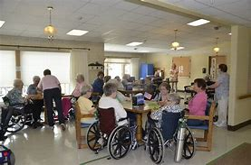
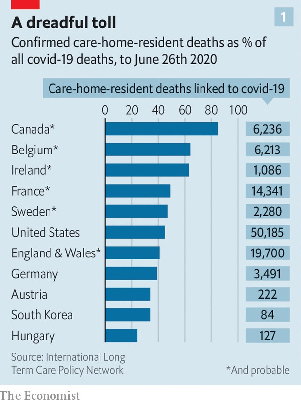

= eco 2020-07-25
:toc:left

---

== Righting(v.)改正；纠正；使恢复正常 wrongs 词汇解说

(eco 2020-7-25 / China / Miscarriages of justice: Righting wrongs)

China *is growing more willing to review*(v.) `dodgy  有毛病的；运转不良的；状况不佳的; 狡猾的；狡诈的；可疑的 convictions` 判罪；定罪；证明有罪

*But not for* political dissidents 持不同政见者

Jul 23rd 2020 | BEIJING

- 纠正错误 +
中国越来越愿意重审可疑的定罪 +
但对持不同政见者来说, 却并非如此

ON A NOVEMBER morning in 2004, Wang Zhansheng’s three- and six-year-old sons *fell suddenly* and *violently ill*. The older boy *recovered*. His little brother *died* the same day. Police in their home province of Henan, in central China, *concluded that* the toddler 学步的儿童；刚学会走路的孩子 *had been murdered*. Soon they *said* they *had caught* the culprit 犯错的人；罪犯;肇事者；引起问题的事物: Wu Chunhong, a 34-year-old neighbour with three children of his own. Under interrogation 审问, Mr Wu *told police that* he *had quarrelled 口角；争吵；拌嘴 with* the boy’s father over a small debt. He *said that* he *had taken revenge* 报复；报仇 by *sneaking 偷偷地走；溜 into* the family’s kitchen and *sprinkling* 撒；洒；把…撒（或洒）在…上 rat poison 老鼠药 *into* cooking ingredients 成分；（尤指烹饪）原料.

- toddler =>  toddle,蹒跚学步，-er,人。

- culprit : /ˈkʌlprɪt/ => 来自culp-,责备，谴责，词源同inculpable.

- sprinkle :  /ˈsprɪŋkl/=>  来自 PIE*spreg,播，洒，溅，词源同 spark,spread,sperm.-le,表反复。

[In April this year] Mr Wu *was freed from prison*, his conviction 判罪；定罪；证明有罪 *quashed* 宣布（法庭的裁决）无效；撤销（判决） during a brief hearing *that was held online* as a result of the covid-19 pandemic. For 16 years Mr Wu *had maintained that* his confession 供词；供状；认罪；供认；坦白 *was false* and *had been obtained* through torture 拷打；拷问；酷刑. He *said that* he *had been shackled 给（某人）戴镣铐 and beaten*, and *that* his resistance 反对；抵制；抗拒 *had broken* when police *threatened to subject*(v.) 使臣服；使顺从；（尤指）压服 his wife *to the same treatment*. His case *is* the most recent of more than 60 big miscarriages 流产;冤假错案 of justice *that have been made public* since Xi Jinping *took power* in 2012, researchers at New York University (NYU) *calculate*. The overturning 推翻 of these verdicts （陪审团的）裁定，裁决，裁断 *is* proof 证据；证明, officials *say*, that China’s criminal justice system *is working better*.

- miscarriage : /ˈmɪskærɪdʒ/ 来自miscarry,流产，-age,名词后缀。

- 今年4月，吴被释放，他的定罪在网上举行的简短听证会上被撤销，这次听证会的原因是covid-19大流行。16年来，吴一直坚称自己的供词是假的，是通过严刑逼供得来的。他说，他被戴上镣铐，遭到毒打，当警察威胁要对他的妻子施以同样的待遇时，他的反抗已经瓦解。据纽约大学(NYU)的研究人员计算，自习近平2012年上台以来，已经有60多起误判事件被公开，张的案件是其中最新的一起。官员们表示，这些判决的被推翻证明，中国的刑事司法体系运行比之前更好了。

Many wrongful 不公正的；不道德的；不合法的 convictions *have come to light* 为人所知；变得众所周知；暴露 after `re-examination 复查 of cases` (*related to* China’s occasional `nationwide 全国性的；遍及全国的；全国范围的 “strike hard” 严打 campaigns` *against* serious offences 违法行为；犯罪；罪行). `主` Big ones (in 1996 and 2000-01) `谓` *aimed to curb(v.)控制，抑制，限定，约束（不好的事物） a rise (in crime)* (that *followed* ① the dismantling 拆开，拆卸（机器或结构）;（逐渐）废除，取消 of the old state-run economy, and ② the easing 缓和；放松 of `strict social controls` that *went with it*). `主` Short-staffed 人员配备不足；人手短缺 police bureaus `谓` *were given* high targets(n.) *for* the number of people (*to be rounded up* 围捕；围剿) . This *led to* many `arbitrary arrests`, a problem *compounded by* the incompetence and bias of judges and prosecutors 公诉人；检察官, who often *lacked* legal training. Many *had simply been assigned to the jobs* [after `military service`].

- *come to light* : to become known to people 为人所知；变得众所周知；暴露

- 在中国全国范围内偶尔开展的对严重犯罪的“严打”中，经过对相关案件的复审，许多错判案件浮出水面。1996年和2000-01年的大行动, 旨在遏制旧的国有经济解体, 以及随之而来的严格的社会控制放松后犯罪率的上升。人手不足的警察局, 被给予了围捕人数的高目标。这导致了许多任意逮捕，而法官和检察官的无能和偏见, 又加剧了这一问题，他们往往缺乏法律培训。许多人只是在服兵役后被分配到工作岗位上。

Anti-crime campaigns (on such a scale) *are rarer* these days, but much about China’s `criminal system` 刑事司法制度 *remains woeful* 糟糕的；严重的；不合意的; 悲惨的；忧伤的. Only 30% of criminal defendants 被告人；被告 *are represented by lawyers*, *guesses* Ira Belkin of NYU. Verdicts （陪审团的）裁定，裁决，裁断 *are almost always agreed* before trials *begin*, [during private meetings of judges, police and prosecutors]. These officials *are easily intimidated 恐吓；威胁 by* higher-ups  高层人物; 要员 (*seeking* the swift closure of cases), or *by* `families of victims` 受害者 (who *threaten to protest* （公开）反对；抗议;坚决地表示；申辩 [*should* （表示可能）假如，万一 suspects *not be punished*]). Once defendants *reach* a courtroom, the `conviction rate`  定罪率;判罪率 *is above 99.9%*.

A common cause of wrongful conviction is the convention in serious cases that suspects must confess. Police often use force to make sure this happens. In 2018 academics in Hong Kong and Macau analysed 141 exonerations that had taken place on the mainland since 1982. They found that false admissions of guilt had been a factor in nearly 90% of them. In America, by contrast, false confessions are thought to contribute to about a quarter of wrongful convictions. A more common cause there is mistaken or deceitful testimony by witnesses (a scourge in China, too).

- 如今，如此大规模的反犯罪活动, 已经很少见了，但中国的刑事司法制度仍有很多糟糕的地方。纽约大学的Ira Belkin猜测，只有30%的刑事被告, 是由律师代表的。在审判开始前，法官、警察和检察官在私下会议上, 几乎总是会达成一致的判决。这些官员很容易受到寻求快速了结案件的上级的威胁，或者受到受害者家属的威胁, 如果嫌疑人不受到惩罚, 这些受害者家属就会上诉。因此被告一旦进入法庭，定罪率就会超过99.9%。

*Questioning* all this `系` *was* once taboo 禁忌，忌讳. That *changed swiftly* during the 2000s, *in part because of* two cases involving `egregious 极糟的；极坏的 errors` by the police. One of them *was exposed in 2005* when a woman in Hubei, another central province, *turned up (常指出其不意地或经长久等待后)出现，到来，露面 alive* 11 years after her husband *told police that* he had killed her (she had left her home to begin a new life). The other *came to light* 显露， 为大家所周知; 东窗事发 in 2010 when a villager returned to his home in Henan, more than a decade after his neighbour had admitted(v.) to murdering(v.) him during an argument 争论；争吵；争辩；辩论. [In both cases] police *had misidentified*(v.)识别错 `decomposed 已腐烂的，已分解的 bodies`. The publicity （媒体的）关注，宣传，报道 (*given to* these wrongful convictions) `系` *was* a hint of officials’ concern about the impact (such cases *were having* on public confidence `in the justice system` and `in the Communist Party’s competence`(n.)能力；胜任).

- egregious : /ɪˈɡriːdʒiəs/ a. ( formal ) extremely bad 极糟的；极坏的 +
=> e-, 向外。-greg, 群，集中，词源同yard, gregarious. 原义为鹤立鸡群的，极好的，现义贬义化。参照拉丁文egregium, 非凡，伟业。

- 对这一切的质疑, 曾经是禁忌。但这种情况在本世纪头十年迅速改变，部分原因是两起涉及警方严重错误的案件。其中一起是在2005年被曝光的，当时另一个中部省份湖北的一名女子, 在她的丈夫告诉警方他杀死了她(她已经离开家开始新生活)11年后出现，她还活着。另一起案件于2010年曝光，当时一名村民回到了他在河南的家，十多年前，他的邻居承认在一场争吵中谋杀了他。在这两起案件中，警方都误认了腐烂的身体。媒体曝光了这些错误定罪的案例, 暗示了官员们对此类案件对公众造成影响的担忧. 即, 公众对司法系统的信任度, 和对共产党能力信心的下降。

After *taking power*, Xi Jinping *put new emphasis on* a campaign, *begun by* his predecessors 前任, *to stop* such embarrassments. *Encouraged by this*, some lawyers and law professors *launched co-ordinated efforts* to get(v.) `shaky  不稳固的；不牢靠的；摇晃的；不确切的-looking cases` *reopened*, *using* tactics *learned from* similar `grassroots 草根,基层 campaigns` in America.

- 在掌权后，习重新强调了一场由他的前任发起的运动，以阻止这种尴尬。受此鼓舞，一些律师和法学教授, 利用从美国类似的草根运动中学到的策略，发起了协调一致的努力，让看起来可信性摇摇欲坠的案件, 重新进行开庭审理。

Officials *have shown no eagerness* 渴望；热心 *to re-examine(v.) cases* involving dissidents 持不同政见者;异议分子 -- indeed, [under Mr Xi’s rule] the party’s critics *have been subject(v.) 使臣服；使顺从；（尤指）压服 to* harsher repression. `主` Lawyers who *have tried to defend* ordinary people *against* the power of the state `谓` *have been harassed(v.)侵扰；骚扰;不断攻击（敌人） and jailed*. But over the past eight years, there *has been* a string of 一系列；一连串；一批 directives 指示；命令 *aimed at* curbing(v.) other miscarriages 冤假错案;流产 of justice. Two revisions(n.)（一项、一轮等）修订，修改 to `the criminal-procedure 刑事诉讼程序 law`, the most recent in 2018, *have sought to make it easier* for defendants *to challenge(v.) evidence* (obtained(v.) under duress(n.)胁迫；强迫). In January the government *ordered that* people (*accused of* major crimes), as well as their lawyers, *be interviewed* 面试；面谈;（常指公开的）记者采访，访谈  at the end of investigations *to ascertain* 查明；弄清 whether torture 拷打；拷问；酷刑 *was used*. It *has also been trying to make* trials *less of a mere ritual* 习惯；老规矩: for example, by *giving courts more power* *to compel*(v.) 强迫；迫使；使必须 witnesses *to appear [in person 亲自；亲身]*. In 2017 the government *said* it *wanted* all defendants in criminal cases *to have access to* a lawyer, though *it gave no deadline*.

- duress :/djuˈres/ n.  [ U ] ( formal ) threats or force that are used to make sb do sth 胁迫；强迫 +
=> 来自拉丁语durus, 硬，词源同endure, tree.引申义强硬，胁迫。

- 官员们没有表现出热心, 来重审那些涉及"政治异见分子"的案件 -- 事实上，在习的统治下，那些批评党的人, 受到了更严厉的镇压。那些试图保护普通人不受国家权力侵害的律师, 也遭到了不断的骚扰甚至监禁。但在过去的八年里，国家还是出台了一系列的指示, 旨在遏制其他的司法冤假错案。刑事诉讼法已经做了两次修订，其最近一次是在2018年，以求让被告能更容易地质疑证据 -- 那些在胁迫下获得的证据。今年1月，政府命令, 被控犯有重大罪行的人, 以及他们的律师, 在调查结束时应该接受讯问，以确定他们是否被施加了酷刑。国家也一直在努力使审判不再仅仅是一种老做法：例如，通过赋予法院更多权力, 迫使证人亲自出庭。2017年，政府表示希望刑事案件中的所有被告, 都能找到律师，但没有给出最后期限。

There have been other encouraging trends. He Jiahong of Renmin University in Beijing *says* the increasing availability 可获得性 of `electronic evidence`, such as from `mobile phones`, `cashless payments` and `security cameras` 监控摄像头, is likely to reduce(v.) the value of obtaining confessions 供词；供状；认罪；供认；坦白. And he *spots* a change in attitudes, whereby 凭此；借以；由于 `主` people who work(v.) in the justice system `谓` *are increasingly inclined to agree that* {it is better to let(v.) the guilty go(v.) free *than* to punish(v.) innocents}.

- whereby : ( formal ) by which; because of which 凭此；借以；由于
.. They have introduced a new system *whereby* all employees must undergo regular training. 他们采用了新的制度，所有的雇员都必须定期进行培训。

- 还有其他令人鼓舞的趋势。北京人民大学的何家红表示，越来越多的电子证据，如来自手机、无现金支付, 和安全摄像头的证据，很可能会令"获取到的供词"的价值降低。他在人们的态度中, 发现了一种变化，在司法系统工作的人, 越来越倾向于同意"让罪犯获释,比惩罚无辜者更好"这个观点。

But *it* is difficult *to judge* {how much *this is helping* to make(v.) justice fairer 更公平}. `主` Information (that *might be helpful*), such as changes(n.) in the proportion 比例;份额 of cases *being concluded 断定；推断出；得出结论;（使）结束，终止 without a confession* 供词；供状；认罪；供认；坦白, `系` *is hard to come by* 弄到;得到. `主` *Proving* trends(n.) in abuses  滥用；妄用;虐待 *committed 做出（错或非法的事）；犯（罪或错等） by police* `系` *is “almost impossible”*, says NYU’s Mr Belkin. The party’s secrecy *may also be directly obstructing(v.)（故意）妨碍，阻挠，阻碍 change*. Tobias Smith of the University of California, Berkeley, *says* the government *has neglected its promise (to ensure that* defence lawyers *take part in* reviews of `death-penalty 死刑 cases`) because *it does not want them to work out* how many people *are executed*, which *is* a state secret.

- come by :  (PHRASAL VERB) 弄到;得到 To come by something means to obtain it or find it.

- 但这在多大程度上有助于司法更加公平, 却很难判断。那些可能有帮助的信息，比如, "在无证词情况下就定罪的案子"的比例变化程度, 是很难获得的。纽约大学的贝尔金说，要证明警察滥用职权的趋势如何, 也“几乎是不可能的”。党的保密性也可能直接阻碍变革的进行。加州大学伯克利分校(University of California，Berkeley)的托拜厄斯·史密斯(Tobias Smith)表示，政府忽略掉了它的承诺, 即确保辩护律师参与死刑案件审查. 因为它不想让辩护律师计算出有多少人被处决，这是属于国家机密。

`Criminal 刑法的；刑事的 justice` 司法制度；法律制裁；审判 in China *is increasingly splitting 分裂，使分裂（成不同的派别） along two tracks*. `主` People *accused of crimes* that *are unrelated to politics* `谓`  *are gradually receiving* better protection. `主` Those *accused of political crimes* or official corruption `谓` *are being treated more harshly*, says Joshua Rosenzweig of Amnesty （对政治犯的）赦免，大赦 International. The idea *is* `表` to have(v.) a legal system (that *looks fairer to* many citizens /but still just as *threatening to people* (whom the party *fears* might oppose(v.) or undermine(v.) it)). That *could be called* progress, but few *would call it* justice.

- amnesty : /ˈæmnəsti/ => 由a（not）+mnestis（记忆）构成，字面意思就是“遗忘，不再记得”

- 中国的刑事司法制度, 正在分裂成两条轨道。被指控犯有"与政治无关的罪行"的人, 正逐渐得到更好的保护。大赦国际的Joshua Rosenzweig说，但那些被指控犯有政治罪, 或官员腐败的人, 正受到更严厉的对待。这种想法是要建立一个在许多公民看来更公平的法律体系，但对那些党担心会反对或破坏它的人来说，这个体系仍然要保持威胁性. 这个法律体系, 可以被称为进步，但很少有人会称它是正义的。

---

== Righting wrongs

China is growing more willing to review dodgy convictions

But not for political dissidents

Jul 23rd 2020 | BEIJING

ON A NOVEMBER morning in 2004, Wang Zhansheng’s three- and six-year-old sons fell suddenly and violently ill. The older boy recovered. His little brother died the same day. Police in their home province of Henan, in central China, concluded that the toddler had been murdered. Soon they said they had caught the culprit: Wu Chunhong, a 34-year-old neighbour with three children of his own. Under interrogation, Mr Wu told police that he had quarrelled with the boy’s father over a small debt. He said that he had taken revenge by sneaking into the family’s kitchen and sprinkling rat poison into cooking ingredients.

In April this year Mr Wu was freed from prison, his conviction quashed during a brief hearing that was held online as a result of the covid-19 pandemic. For 16 years Mr Wu had maintained that his confession was false and had been obtained through torture. He said that he had been shackled and beaten, and that his resistance had broken when police threatened to subject his wife to the same treatment. His case is the most recent of more than 60 big miscarriages of justice that have been made public since Xi Jinping took power in 2012, researchers at New York University (NYU) calculate. The overturning of these verdicts is proof, officials say, that China’s criminal justice system is working better.

Many wrongful convictions have come to light after re-examination of cases related to China’s occasional nationwide “strike hard” campaigns against serious offences. Big ones in 1996 and 2000-01 aimed to curb a rise in crime that followed the dismantling of the old state-run economy, and the easing of strict social controls that went with it. Short-staffed police bureaus were given high targets for the number of people to be rounded up. This led to many arbitrary arrests, a problem compounded by the incompetence and bias of judges and prosecutors, who often lacked legal training. Many had simply been assigned to the jobs after military service.

Anti-crime campaigns on such a scale are rarer these days, but much about China’s criminal system remains woeful. Only 30% of criminal defendants are represented by lawyers, guesses Ira Belkin of NYU. Verdicts are almost always agreed before trials begin, during private meetings of judges, police and prosecutors. These officials are easily intimidated by higher-ups seeking the swift closure of cases, or by families of victims who threaten to protest should suspects not be punished. Once defendants reach a courtroom, the conviction rate is above 99.9%.

A common cause of wrongful conviction is the convention in serious cases that suspects must confess. Police often use force to make sure this happens. In 2018 academics in Hong Kong and Macau analysed 141 exonerations that had taken place on the mainland since 1982. They found that false admissions of guilt had been a factor in nearly 90% of them. In America, by contrast, false confessions are thought to contribute to about a quarter of wrongful convictions. A more common cause there is mistaken or deceitful testimony by witnesses (a scourge in China, too).

Questioning all this was once taboo. That changed swiftly during the 2000s, in part because of two cases involving egregious errors by the police. One of them was exposed in 2005 when a woman in Hubei, another central province, turned up alive 11 years after her husband told police that he had killed her (she had left her home to begin a new life). The other came to light in 2010 when a villager returned to his home in Henan, more than a decade after his neighbour had admitted to murdering him during an argument. In both cases police had misidentified decomposed bodies. The publicity given to these wrongful convictions was a hint of officials’ concern about the impact such cases were having on public confidence in the justice system and in the Communist Party’s competence.

After taking power, Xi Jinping put new emphasis on a campaign, begun by his predecessors, to stop such embarrassments. Encouraged by this, some lawyers and law professors launched co-ordinated efforts to get shaky-looking cases reopened, using tactics learned from similar grassroots campaigns in America.

Officials have shown no eagerness to re-examine cases involving dissidents—indeed, under Mr Xi’s rule the party’s critics have been subject to harsher repression. Lawyers who have tried to defend ordinary people against the power of the state have been harassed and jailed. But over the past eight years, there has been a string of directives aimed at curbing other miscarriages of justice. Two revisions to the criminal-procedure law, the most recent in 2018, have sought to make it easier for defendants to challenge evidence obtained under duress. In January the government ordered that people accused of major crimes, as well as their lawyers, be interviewed at the end of investigations to ascertain whether torture was used. It has also been trying to make trials less of a mere ritual: for example, by giving courts more power to compel witnesses to appear in person. In 2017 the government said it wanted all defendants in criminal cases to have access to a lawyer, though it gave no deadline.

There have been other encouraging trends. He Jiahong of Renmin University in Beijing says the increasing availability of electronic evidence, such as from mobile phones, cashless payments and security cameras, is likely to reduce the value of obtaining confessions. And he spots a change in attitudes, whereby people who work in the justice system are increasingly inclined to agree that it is better to let the guilty go free than to punish innocents.

But it is difficult to judge how much this is helping to make justice fairer. Information that might be helpful, such as changes in the proportion of cases being concluded without a confession, is hard to come by. Proving trends in abuses committed by police is “almost impossible”, says NYU’s Mr Belkin. The party’s secrecy may also be directly obstructing change. Tobias Smith of the University of California, Berkeley, says the government has neglected its promise to ensure that defence lawyers take part in reviews of death-penalty cases because it does not want them to work out how many people are executed, which is a state secret.

Criminal justice in China is increasingly splitting along two tracks. People accused of crimes that are unrelated to politics are gradually receiving better protection. Those accused of political crimes or official corruption are being treated more harshly, says Joshua Rosenzweig of Amnesty International. The idea is to have a legal system that looks fairer to many citizens but still just as threatening to people whom the party fears might oppose or undermine it. That could be called progress, but few would call it justice.

---

== Who cares? 词汇解说

(eco 2020-7-25 / International / Care homes: No place like home)

The pandemic *shows* the urgency of *reforming* care for the elderly

Most people *should be helped at home* as they *age*

Jul 25th 2020 | AMSTERDAM, MISSISSAUGA AND TOKYO

- 谁在乎啊？ +
这场流行病, 表明了老年人护理改革的紧迫性。 +
随着年龄的变老，大多数人应该在家里得到帮助。

“IT *SMELLED LIKE* death,” says Stephanie (not her real name) of her first day at Camilla Care Community, a `nursing home` 小型私立疗养院；（尤指）私立养老院 in Mississauga, a city in Canada. `主` She and other `care workers` （精神病人、残疾人、尤指住院治疗者的）护理员 `谓` *were sent(v.) to help out* 帮助…做事;借钱给… [*at* the 236-bed facility] [in April] 当...时 as covid-19 *ripped through* （快速而猛烈地）钻入，穿透 its `narrow corridors` and `crowded 人（太）多的；拥挤的 wards` 病房；病室. Dozens of staff *fell ill* or *refused to work*. [By mid-July] nearly one-third of the residents *had died*. Outside, on a patch of grass, `主` 69 small white crosses 十字架 `谓` *commemorate(v.)（用…）纪念；作为…的纪念 them*.

- nursing home : a small private hospital, especially one where old people live and are cared for 小型私立疗养院；（尤指）私立养老院 +

- *rip into/through sb/sth* : to go very quickly and violently into or through sb/sth （快速而猛烈地）钻入，穿透 / rip : v. to tear sth or to become torn, often suddenly or violently （突然或猛烈地）撕破，裂开
.. A bullet *ripped into his shoulder*. 一颗子弹穿透了他的肩头。

- 在谈到她在加拿大密西索加市的一家疗养院卡米拉护理社区的第一天时, 斯蒂芬妮(化名)说：“它闻起来就像是死亡的味道。”今年4月，当新冠肺炎横扫这个狭窄的走廊和拥挤的病房时，她和其他护理人员, 被派往这个有236个床位的养老院设施中帮忙。数十名员工生病或拒绝工作。到7月中旬，近三分之一的居民死亡。在外面的一片草地上，69个白色的小十字架, 纪念着他们。

[Across the rich world] nearly half of all deaths from covid-19 *have happened [in* care and nursing homes], *even though* less than 1% of people *live(v.) in them*. In Canada 80% of all the deaths from covid-19 *have happened in places* such as Camilla (see chart 1). In Britain the pathogen 病原体 *has killed* an estimated 5% of all people *living in such institutions*. The problem *is not only that* the residents’ age *makes them particularly vulnerable*, *but also that* their living arrangements *created opportunities for* the virus *to spread*. Countries with fewer care homes *have had fewer covid-19 deaths*, all else *being equal*. The number of care-home beds *explains* 28% of the variation （数量、水平等的）变化，变更，变异 in death rates (among European countries) and 16% (among American states), *according to a study by* Neil Gandal and colleagues at Tel Aviv University.

- pathogen : /ˈpæθədʒən/ ( technical 术语 ) a thing that causes disease 病原体 +
=> patho-,疾病的，-gen,产生，原，词源同antigen.

- 纵观富裕国家，新冠肺炎造成的死亡人数中, 有近一半发生在疗养院里，尽管只有不到1%的人住在疗养院。在加拿大，新冠肺炎致死的人数中, 有80%都发生在卡米拉这样的地方(见图表1)。在英国，据估计，这种病原体已经导致了生活在这类机构中的所有人数中的5%, 死亡. 问题不仅源于居民的年龄使他们特别容易受到伤害，还在于他们的生活安排方式, 也为病毒的传播创造了机会。在其他条件相同的情况下，疗养院较少的国家, 死于新冠肺炎的人数也较少。根据特拉维夫大学Neil Gandal及其同事的一项研究，疗养院床位的数量, 在欧洲国家中, 解释了死亡率变化原因的28%，在美洲各国中, 解释了死亡率变化原因的16%。

Politicians *are under pressure* to put(v.) more cash *into* care-home `safety, inspections 检查；查看；审视 and quality standards`. [In the short term] care homes *will need* more `personal protective equipment` (PPE) and `better access to testing`. But the disaster 灾难；灾祸；灾害 *also offers a chance* to reimagine(v.)重新构想 care. In the future, many experts *argue*, the vast majority of old people *should be looked after [at home]* for as long as possible. *In [all but 几乎；差不多;除…外全部] the most severe cases* this is cheaper. *It is also* what most old people *want*. `主` Putting them in big institutions `系` *is the opposite 对立面；反面 of* `what they *say* they *value most*`: autonomy 自治；自主 and independence. And [*for those* who still need it], `residential care` 福利社为需求比住宿更多的照应的人(如儿童或智力残疾人士)提供的带有社工监管的家庭式住宅 *should be transformed*.

- *residential care* : N `the provision` (by a welfare agency) (`of a home` (with social-work supervision)) `for people` (who *need(v.) more than just* housing accommodation), such as `children in care` or `mentally handicapped adults` 福利社为某些人提供的家庭式住宅, 该住宅带有社工监管. 那么是为哪些人提供的呢? 如儿童或智力残疾人士.

- 政客们面临压力，要求他们投入更多资金, 在养老院的安全、检查和质量标准上。短期中，疗养院需要更多的个人防护装备(PPE), 和更好的检测(疫病阳性)机会。但这场灾难也提供了一个机会, 来重新考虑"养老医疗服务"的革新。许多专家认为，未来，绝大多数的老年人, 应该尽可能地在自己家里得到照顾。除了最严重的情况外，这是更便宜的护理方法。这也是大多数的老年人想要的。把他们放入大型机构里来照料养老, 与他们所说的他们最看重的东西 -- 自治和独立 -- 相反。而对于那些仍然需要这类大型机构的人来说，住宿护理的方式应该得到转变。

Most people *will need care* [as they *age*]. [In some countries] that *will bankrupt them*. `主` Some 70% of Americans who reach the age of 65 `谓` *will eventually need help(v.) doing* at least two basic daily activities, such as *washing or dressing* 穿衣服; 48% *will receive* paid care; 16% *will get dementia*(n.)痴呆；精神错乱. The risks *are higher [for women]*. For `one in ten` people who *reach the age of 65* in Britain, the cost of care [in their remaining years] *will exceed £100,000 ($127,000)*, according to a review *conducted* in 2011. Demand *is only growing*. [In rich countries] `主` the share of the population that is over 80 `谓` *will double* by 2050, [by which time] there *will be* only two people (of working age) *for* every over-65-year-old. Although people’s lives *are getting longer*, the number of years (during which they *enjoy* good health) *is not rising [as swiftly]*.

- dementia :   /dɪˈmenʃə/ n. ( medical 医 ) a serious mental disorder caused by brain disease or injury, that affects the ability to think, remember and behave normally 痴呆；精神错乱 +
=> de-去掉 + -ment-记忆,智力 + -ia名词词尾

- 随着年龄的增长，大多数人都需要护理的帮助。在一些国家，这将使他们破产。美国65岁以上的人中, 大约有70%的人最终会需要有人帮助他们, 来做至少两项基本的日常活动，如洗衣或穿衣；美国65岁以上的人中, 48%的人将接受有偿护理；16%的人将患上老年痴呆症。女性的风险更高。根据2011年进行的一项审查，英国65岁以上老人中, 有十分之一的人，他们余生的护理费用将超过10万英镑(£)(12.7万美元)。这些需求只会不断增长。在富裕国家中，到2050年，80岁以上的人口比例将翻一番，到那时，每个65岁以上的老年人, 只对应两个尚处在工作年龄的年轻人(即老龄化会很严重)。虽然人们的寿命越来越长，但他们安享健康的年数, 却并没也同样增长得那么快。

In countries such as Norway and Sweden, care for the elderly *is pretty good* but *costs* taxpayers *[so] much* [that] *it may not be sustainable* 可持续的 [as their populations age]. In others, such as Britain and America, taxpayer-financed 由纳税人资助的 care *is intended 为…打算（或设计）的 as* a last resort  应急措施；可首先（或最后）采取的手段 *for* the poorest and sickest. This *usually means* a bed in a care home. These institutions *have typically received(v.) most of the funding* that governments *set aside* 留作…之用;留出…用于 for *looking after* the elderly.

- 在挪威和瑞典等国家，照顾老年人的事, 做的相当不错，但随着他们国家人口老龄化，纳税人的成本会变得如此之高，以至于可能无法持续。在其他国家，如英国和美国，由纳税人出资的医疗保健, 是最贫穷和病最重的人的最后手段。这通常意味着他们只能在疗养院中得到一张床位。这些机构通常收到了政府为照顾老年人而专门拨款的大部分资金。

“Let’s be honest,” says David Grabowski of Harvard Medical School. [Even before the pandemic] “nobody *ever wanted to go to* a nursing home. This was a crisis *on top of* a long-standing crisis.” The sector *is understaffed*(a.)人员不足；人手太少. [In several countries] *it is unhelpfully detached 拆卸；（使）分开，脱离 from* the health system. Care homes *were “at the back of the queue* 排在队伍的最后面 during covid, when it came to things (like testing),” says Jos Schols at the University of Maastricht. [In places such as Hong Kong and Taiwan (that *experienced the SARS outbreak* of 2002-03)] care homes *had* stockpiles(n.)囤聚的物资 of PPE 人防护用品(=Personal Protective Equipment). [In other places] they *were very poorly supplied*. People (*working* in British care homes) *say* `主` the pandemic `谓` *has confirmed* their “`Cinderella 灰姑娘；未得到应有注意的人（或事物） status`”. They were about twice *as likely* to die(v.) of covid-19 *as* workers in hospitals. “Everyone *is furious(a.)狂怒的；暴怒的 about what happened* but *too knackered(a.)筋疲力尽；疲惫不堪 to do anything about it*,” says one carer.

- “坦率地说，”哈佛医学院的大卫·格拉博斯基(David Grabowski)说。甚至在疫情之前，就“从来没有人想去疗养院。这是一个在长期危机之上的危机。"。养老院领域的人手不足。在一些国家，它与医疗系统脱离, 是毫无益处的。马斯特里赫特大学的乔斯·肖尔斯(Jos Schols)说，疗养院“在接受疫情阳性检查时, 排在队伍的最后面”。在那些经历了2002-03年SARS爆发的地方, 比如香港和台湾，养老院中都有个人防护用品的库存。而在其他地方，这些东西的供应则非常匮乏。在英国疗养院工作的人说，疫情确认了他们的“灰姑娘身份”。他们因新冠肺炎而死亡的可能性, 大约是医院工作人员的两倍。一位护理人员说：“每个人都对所发生的事情感到愤怒，但又累得疲惫不堪而无能为力。”

[All around the world] staff(n.) at care homes *turn over 移交(职位、责任) quickly*. In Germany nearly a third of long-term-care workers *leave their jobs* after only one year. In France a fifth of home-care positions *were vacant* in 2018. *That is not surprising* （表示原因）考虑到 *given that* carers *are paid on average 35% less than* people *who do similar jobs* in hospitals, according to the OECD 经合组织, a club of mostly rich countries. `主` *Receiving* care *from* `a rotating 旋转的 cast （一出戏剧或一部电影的）全体演员 of strangers` `系` *is bad for everyone*, but *it is a particular problem* for people (with dementia 痴呆). They *make up* the majority of care-home residents *but* `主` mostly `谓` *do not live in* institutions (that *specialise in* their condition). [At the height of the outbreak in London] more than one-quarter of staff in care homes for the elderly *could not work*, or *would not*. Officials *sent in* 派某人去（应付困难局面） temporary workers *to replace them*. That *probably spread(v.) the virus even further*.

- *send sb in* : to order sb to go to a place to deal with a difficult situation 派某人去（应付困难局面）
.. Troops *were sent in* to restore(v.) order.
部队被派去恢复秩序。

- 在世界各地，疗养院的工作人员很快就会换岗。在德国，近三分之一的长期护理人员仅在一年后就离职了。在法国，2018年有五分之一的家庭护理职位空缺。根据经济合作与发展组织(OECD，一个主要由富裕国家组成的俱乐部)的数据，这并不令人惊讶，因为养老院中护工的报酬, 比在医院做类似工作的人平均要少35%。对每个人来说, 接受陌生人的轮流照顾, 这种情形是糟糕的，但这对老年痴呆患者来说, 这还是一个特别严重的问题。而他们构成了疗养院中居住者的大多数，这些人中的大多数也并不住在专门治疗他们这种疾病的机构里。在伦敦疫情最严重的时候，养老院工作人员中有超过四分之一的人, 不能工作，或者不愿意工作。官员们只能派来临时工来接替他们。但这很可能会同时将病毒也传播得更远。

Age is just a number

Many governments *spend very little on* long-term care. In rich countries it *ranges from* 0.2% of GDP in Hungary 匈牙利 *to* 3.7% in the Netherlands. Canada *spends* 1.3%, *less than* the rich-country average. It *has less than* half the number of care-home workers per 100 residents *as Norway*. [In America and Britain] a frugal  （对金钱、食物等）节约的，节俭的 monopsony  买方垄断 payer (Medicaid  医疗补助制度（美国政府向贫困者提供的医疗保险） and local authorities) *typically reimburses*(v.)报销; 偿还 *less than* the cost of residential care 住宿式护理. *To make up 凑足;补齐 the shortfall* 缺口；差额；亏空, American nursing homes  养老院; 疗养院 *actively recruit* 吸收（新成员）；征募（新兵） patients *covered by Medicare*, a lavish programme *that pays(v.) medical costs* (but *not* long-term care costs) for the elderly. They *tend to come for short stays(n.) to recover* after operations such as `hip replacements` 髋关节置换, and *bring with them* more generous reimbursements 报销; 偿还. But the pandemic *has largely stopped that*.

- frugal :  /ˈfruːɡl/ 来自fructus, 果实，词源同fruit. 原义为丰产的，丰富的，衍生词义节约的，节俭的，即节俭才能富裕之义。比较thrive, 繁盛，thrift，节俭。

- reimburse : /ˌriːɪmˈbɜːrs/ [ VN ] *~ sb (for sth)* ( formal ) to pay back money to sb which they have spent or lost 偿还；补偿 +
=>  re-,向后，往回，-im,进入，burse,钱包。引申词义偿还，补偿。

- 许多政府在长期护理上的花费很少。富裕国家中，这一比例, 从匈牙利GDP的0.2%, 到荷兰的3.7%不等。加拿大的支出为1.3%，低于富裕国家的平均水平。它每100名居民中的疗养院工作人员的数量, 不到挪威的一半。在美国和英国，像医疗补助制度, 和当地政府这样的垄断型支付者, 对支出很节约, 他们对"养老院"上的报销费用, 通常少于在"住宿式护理"上的报销费用. 为了弥补费短缺，美国疗养院于是积极招募那些能被联邦医疗保险(Medicare)所覆盖的患者，这是一项为老年人支付医疗费用(但不是长期护理费用)的奢侈计划。该计划针对那些在髋关节置换等手术后, 短暂修养以恢复健康的患者，并为他们带来更慷慨的报销。但疫情在很大程度上阻碍了这一计划。

*As well as* exposing(v.) fragile business models, the pandemic *has highlighted(v.) the tension* between *keeping old people safe* and *keeping them happy and well*, says Adam Gordon of the University of Nottingham. Regulators *encourage* `nursing homes` *to focus relentlessly(ad.)不放弃的；严格的；苛刻的；无情的;不停的；持续强烈的；不减弱的 on* `negative 负的；消极的 metrics` 度量标准;公制的；米制的 such as falls, `bed sores` 褥疮 and `weight loss` 体重减轻. But there is more to `quality(n.) of life` *than* not falling over 跌倒，摔倒；绊了一跤. Anne Tumlinson, an expert on ageing, *would like to see* care homes *become less “custodial”*(a.)监禁的；拘留的;监护权的；监管职责 and *more enthusiastic 热情的；热心的 about* “making people happy”.

- bed sore :  N-COUNT Bedsores are sore places on a person's skin, caused by having to lie in bed for a long time without changing position. 褥疮. +
 压疮又称压力性溃疡、褥疮，是由于局部组织长期受压，发生持续缺血、缺氧、营养不良而致组织溃烂坏死。皮肤压疮在康复治疗、护理中是一个普通性的问题。

- custodial : /kʌˈstəʊdiəl/ a. connected with the right or duty of taking care of sb; having custody 监护权的；监管职责的；有监护权的 +
=> 来自PIE*skeu, 覆盖，遮盖，词源同sky, house, hide.
.. The mother is usually *the custodial(a.) parent* after a divorce. 离婚后通常是母亲拥有孩子的监护权。

- 诺丁汉大学(University Of Nottingham)的亚当·戈登(Adam Gordon)表示，这除了暴露出商业模式的脆弱外，疫情还突显了"保障老年人的安全"与"让他们生活得快乐安康"之间的冲突关系。监管机构鼓励疗养院要不断严格关注老年人的跌倒、褥疮和体重下降等负面指标。但是，生活质量不仅仅是摔倒问题。老龄问题专家安妮·汤姆林森(Anne Tumlinson)希望看到养老院变得不那么“监护”，而应更热诚关注于“令老人们活得幸福”。

A better system *would make it easier* for most people *to age(v.) at home*. Technology *could help*. The *urge* to move(v.) someone to a `care home` *often starts(v.) with concerns(v.) for* their safety. Care-givers 照料者，护理者 *begin to spot*(v.) unexplained bumps and bruises. `主` Questions about `cigarette burns` on the duvet  羽绒被 `谓` *are waved away* 对…置之不理；不理会;挥手示意…离开. Pills *are not taken*. The milk *is always off* 不新鲜；变质; (菜单中的项目)没有；不再供应.

- duvet :  /ˈduːveɪ,duːˈveɪ/  羽绒被 +
=> 来自法语duvet, 绒毛，词源同down. +

- *wave sth aside/away* : to not accept sth because you do not think it is necessary or important 对…置之不理；不理会
dismiss +
.. My objections to the plan *were waved aside*.
我对这项计划的反对意见未被理会。

- off : ad. (especially British English) (of an item on a menu 菜单中的项目) no longer available or being served 没有；不再供应 / a. (of food 食物) no longer fresh enough to eat or drink 不新鲜；变质
.. Sorry, *the duck is off*. 对不起，鸭子卖光了。
.. This fish *has gone off*. 这条鱼已变质了。

- 一个更好的养老制度, 能让大多数人更方便在家里养老。技术可以有所帮助。将老人送到养老院的冲动, 通常始于对老人们安全的担忧。护理人员开始发现老人身上不明原因的肿块和瘀伤。羽绒被上被烟头烫坏的原因得不到回答。老人不吃药。牛奶总是变质。

Now *imagine*(v.) a home where sensors *keep an eye on* all of those things. They *spot* a change in `gait` 步态；步法, `appetite` 食欲；胃口 or `activity *early enough to predict* a fall`, `dehydration` 脱水 or `depression`. `A smart pill dispenser` （取款、售货等用的）自动取物装置 *helps with* medication 药；药物. A `companion robot` *provides* reassurance 能消除疑虑的说话（或行动）；保证.安慰, information, brain training and company. Some of `the most compelling 引人入胜的；扣人心弦的 recent scientific and technological developments` *aim to help* people with dementia 痴呆. A product *produced by* Elovee, an American startup, *allows* them *to have simple conversations （非正式）交谈，谈话 with* a digital avatar （尤指电脑游戏或聊天室中代表使用者的）化身 *styled(v.)把…设计（或缝制、做）成某种式样 to look and sound like* one of their relatives. The idea *is* to provide(v.) reassurance(n.) during moments of anxiety or boredom(n.)厌烦；厌倦；无聊 that *occur* when their loved ones *are not around*.

- gait : /ɡeɪt/ [ sing. ] a way of walking 步态；步法 +
=> 来自PIE*ghe, 走，词源同go. 即走的姿势。

- dehydration :  /ˌdiːhaɪˈdreɪʃn/ n. 脱水 +
=> de-, 不，非，使相反。hydrate, 补水。即脱水。 -hydr-水 + -ate名词词尾

- dispenser : n.  /dɪˈspensər/  a machine or container holding money, drinks, paper towels, etc. that you can obtain quickly, for example by pulling a handle or pressing buttons （取款、售货等用的）自动取物装置 +
=> 来自dispense, 分配，分发。用于指自动取款机或自动售货机。
.. a soap dispenser 皂液瓶 +
image:../../+ img_单词图片/d/dispenser.jpg[100,100]

- 想象一下带有着传感器的家庭，这些传感器会监视所有以下事情。他们监视着老人们的步态、食欲, 或足以预测摔倒的行为变化，还预测脱水或抑郁情况。智能药丸分配器, 有助于药物治疗。陪伴型机器人, 能提供老人以安稳、资讯、大脑训练和陪伴。最近一些很引人注目的科技发展, 旨在帮助痴呆症患者。美国初创公司Elovee生产的一款产品, 能令老人们同一个看起来和听起来都像他们的亲戚的数字化身, 进行简单的对话。目的是为了在他们所爱的人不在身边时, 当老人们出现的焦虑或无聊时, 能提供安慰。

Technology “*will never replace* `the loving attention` of a carer,” says Wilco Achterberg of the University of Leiden. But data-crunching 数据分析;数据处理 *could make it easier to work out* how to deploy(v.)部署，调度（军队或武器） carers [more efficiently]. Video calling *is making it easier* for `relatives`, `paid carers` and `doctors` *to check in [more frequently]*. Joan Gallimore, a 91-year-old who *lives alone* in England, *says that* `主` calling(v.) her family` *using* a tablet (her home-carers *gave her* [when lockdowns *began*]) `谓` *has been a revelation*(（上帝的）启示;披露；揭露)让人大开眼界；令人耳目一新；出乎意料. She *has enjoyed* ① `chats(n.) with her granddaughters` and ② `performances` 表演；演出 (*put on by* her son-in-law 女婿), who *is learning* to play(v.) a ukulele 尤克莱利琴（四弦小吉他）.

- revelation : n. something that is considered to be a sign or message from God （上帝的）启示 / ~ (of sth) the act of making people aware of sth that has been secret 披露；揭露
SYN disclosure

- *COME AS/BE A REVELATION (TO SB)* : to be a completely new or surprising experience; to be different from what was expected 让人大开眼界；令人耳目一新；出乎意料

- ukulele  : /ˌjuːkəˈleɪli/ +

- 莱顿大学(University Of Leiden)的威尔科·阿克特伯格(Wilco Achterberg)说，科技“永远无法取代照看者的关爱”。但是，数据分析可以更容易地计算出, 如何更有效地来部署护工的问题。视频通话, 能使亲属、付费护理人员和医生, 方便他们更多地到来。91岁的琼·加里莫尔(Joan Gallimore)在英国独自生活，她说，在封锁开始时，她用护理人员给她的平板电脑, 同家人打电话, 这给了她耳目一新的感觉. 她喜欢和孙女聊天，也享受女婿表演的乐趣，她女婿正在学习弹奏四弦琴。

`主` *Improving* `conventional 传统的；习惯的 ways` of `providing(v.) care at home` `系` *is essential*, too. Buurtzorg, a `nursing provider` in the Netherlands, *champions a model* (that *has been tried out* in 25 countries). Its secret *is simple*, says Jos de Blok, its founder: *let* nurses *do their jobs*. Small teams of them *are given considerable 相当多（或大、重要等）的 autonomy* to care(v.) for a neighbourhood. By *stripping away* 剥去;剥下;揭去 bureaucracy 官僚主义；官僚作风, the model *allows* nurses *to spend more time* dispensing(v.)分配；分发 help. Because all staff *are* qualified nurses, their salaries *are higher than* traditional carers. But [because *they are better trained*] they *can get as much 同样多的, 同样的 done* [despite *spending a third less time* with each patient].

- 改善"在家中提供护理"的传统做法, 也至关重要。荷兰的护理提供商Buurtzorg, 倡导一种已经在25个国家试用的模式。它的创始人何塞·德·布洛克(Jos De Blok)说，它的秘诀很简单：让护士做好自己的工作。他们中的小群体, 被赋予相当大的自主权来照顾邻居。摆脱官僚主义后，这种模式能令护士花更多时间提供帮助。因为所有的工作人员都是合格的护士，他们的工资比传统的护理员要高。因为他们受过更好的训练，所以即使在每个病人身上少花了三分之一的时间，他们也能做到同样多的事情。

For some people, particularly `the very lonely` and `those with dementia`, home visits *are not enough*. Day-care centres *can help them*. Some of those in Switzerland *pick people up* from their homes, *help them get dressed* and *return them home* at the end of the day. In Sweden `day care` for the elderly *is offered* by the state, *in much the same way as* child care *is*. Chile 智利 *has* only a small formal care sector, but its government *has decided* *to make* `day care` for the elderly *a priority*  优先；优先权；重点.

- 对于一些人，特别是非常孤独和患有痴呆症的老人来说，家访是不够的。日托中心可以帮助他们。瑞士的一些人会把老人们从家里接走，帮他们穿衣，然后在一天结束时把他们送回家。在瑞典，老年人的日托服务由国家提供，与托儿服务的方式大致相同。智利只有一个很小的正规护理部门，但其政府已决定将老年人的日托作为优先事项。

Day-care services *can improve* older people’s mental and physical health. They *also provide advice(n.) and respite*(n.)短暂的延缓；喘息 for their families. In rich countries `主` more than one in eight people (*aged* over 50) `谓` *provide care to* another person at least once a week. `主` Keeping them from burning(v.) out 耗尽体力；积劳成疾；累垮 `系` *is key to* helping(v.) people (*age* at home). More support for these carers *also helps* reduce(v.) the risk that their own health *will decline*, and *makes it less likely that* they *will drop out of 不参与，退出 the workforce* （国家或行业等的）劳动力，劳动大军，劳动人口. In America `主` 48% of people (who *provide help to* older adults) `谓` *care for* someone (with dementia) (a quarter of those people *have at least one child* under the age of 18 *to look after [as well]*). Of those who *previously had jobs*, `主` 18% `谓` *moved from* full- *to* part-time work [when *called upon* 请求，要求，要（某人做某事） to help]. Some 16% *took a leave of absence* and 9% *quit(v.) altogether*.

- respite : /ˈrespɪt/ n. a short delay allowed before sth difficult or unpleasant must be done 短暂的延缓；喘息 / *~ (from sth)* a short break or escape from sth difficult or unpleasant 暂停；暂缓 +
=> 来自古法语 respit,延迟，来自拉丁语 respectus,考虑，思考，来自 re-,再，-spect,看，词源同 despite,retrospect.比喻用法，即再看再研究，引申词义暂停，暂缓。
.. His creditors agreed to *give him a temporary respite*. 他的债权人同意给他一个喘息的机会。
.. The drug *brought a brief respite(n.) from the pain*. 药物暂时缓解了疼痛。 +

- *burn out | burn yourself/sb out* : to become extremely tired or sick by working too hard over a period of time 耗尽体力；积劳成疾；累垮

- *call on/upon sb* : (formal)
(1) to formally invite or ask sb to speak, etc. 邀请，要求（某人讲话等）；恭请 +
-> I now *call upon* the chairman *to address* the meeting. 现在请主席向大会致辞。 +
(2) to ask or demand that sb do sth 请求，要求，要（某人做某事） +
-> *I feel called upon (= feel that I ought) to warn you that*… 我觉得我应该警告你…

- 日托服务可以改善老年人的身心健康。他们还为老人的家人提供建议和喘息之机。在富裕国家，超过八分之一的50岁以上的人(以下称乙方), 每周至少为另外一个人(以下称甲方)提供一次护理。帮助人们在家中养老的关键是, 防止他们(乙方)在照顾其他老人时累垮。对这些照顾者(乙方)的更多支持, 也有助于降低他们(乙方)自己健康状况下降的风险，也能降低他们退出劳动力大军的可能性。在美国，为老年人提供帮助的人(乙方)中, 有48%在照顾痴呆症患者(其中四分之一的人(乙方), 至少还有一个18岁以下的孩子要照顾)。在那些以前有工作的人中，18%的人(乙方)在被要求帮助时, 从全职工作转为兼职工作。约16%的人请假，9%的人干脆辞职。

Some old people *will have to move out of* unsuitable homes. But most *need not move to* an institution, even then 即使那样；即使在那时. Denmark *is* a leader *in providing alternatives* 替代选择. Its government *spends more on* `non-residential 非居住的;非住宅的 care` *than* the residential sort. Options for ageing Danes 丹麦人 *include* `retirement communities` 退休社区（退休人员、老年人居住） and `flats` (*built close to* but *not in* `care homes`). Authorities in some other places *are trying to make it easier* for families *to build* annexes 附属建筑物；附加建筑物 that old relatives *can move into*. Students and some other youngsters 年轻人；少年；儿童 in the Netherlands *are encouraged to share* courtyards or buildings *with* elderly people who *are not* part of their family, sometimes *in exchange for* cheaper rent. The idea *is that* they *will provide them with* companionship 友情；交谊；友谊 and occasional help.

- annexe : /ˈæneks/ a building that is added to, or is near, a larger one and that provides extra living or work space 附属建筑物；附加建筑物 +
=> 前缀an-同ad-, 去，往，在n开头词根前同化为an-. -nex, 同词根nect, 联结，见connect.

- 一些老人将不得不搬出不合适他们养老的家。但即使到那时，大多数人也不需要搬到养老机构里去。丹麦在提供替代方案方面, 处于领先地位。丹麦政府花在非住宅类护理上的钱, 比花在住宅类上的更多。老年丹麦人的选择包括, 搬到靠近养老院的老年社区, 或公寓里去住. 其他地方的政府, 帮助家庭能更方便地建造家庭附加房间, 来为年老的亲戚提供住处. 荷兰则鼓励学生和其他一些年轻人, 共享出自己创庭院或房间, 来给不是他们家人的老年人住, 以换取年轻人能得到便宜的租金。这样做的目的是，年轻人能为老年人提供陪伴和偶尔需要帮助时的帮忙。

Daan Livestro, a consultant at Gupta Strategists, *estimates that* `主` 25-60% of care *given to elderly people* in Dutch institutions `谓` *could be provided at home*. In Canada, too, some 40% of residents *could go home* if *given the right support*, according to recent research. A study in 2014 in Alabama *found that* `主` people (with similar needs) `谓` *fared(v.)成功（或不成功、更好等） about [as well]* in their own houses *[as]* those who *stayed* in care homes. But `主` the group (*receiving care* at home) `谓` *saved $4,500 per year* in costs. `主` “*Decanting* （把液体，尤指酒）倒入，注入 nursing homes” `系` *is* a growing opportunity, says Zayna Khayat of SE Health, a Canadian care provider.

- decant : /dɪˈkænt/[ VN ] *~ sth (into sth)* to pour liquid, especially wine, from one container into another （把液体，尤指酒）倒入，注入 +
=> de-, 向下。-cant, 弯，倾斜，词源同cantilever. 即向下倾斜，倒入。 +

- Gupta策略师的顾问Daan Livestro估计，荷兰机构为老年人提供的护理中, 有25%-60%可以在家中提供。根据最近的一项研究，在加拿大也是如此，如果得到适当的支持，大约40%的老年人可以回家养老。2014年阿拉巴马州的一项研究发现，有类似需求的人, 在自己的房子里的表现, 与那些住在疗养院的人一样好。但是在家中接受护理的群体, 每年节省了4500美元的费用。加拿大护理提供商SE Health的Zayna Khayat说，“减少疗养院”是一个越来越大的机会。

There *will always be* people who *want or need* residential care. [In those cases] “smaller *is often better*”, says Dr Grabowski. Research *shows that* smaller nursing homes `*use* fewer restraints`, `*see* fewer infections` and `*have* more satisfied residents *than* larger ones`. `主` Small institutions `谓` *promote* ① `closer friendships` between residents and ② `closer connections` with staff.

- 总会有想要或需要住宿护理的人。格拉博斯基博士说，在这些情况下，“规模通常保持越小越好”。研究表明，与大型疗养院相比，小型疗养院使用更少的约束，感染更少，居民更满意。小型机构能促进居民之间更紧密的友谊，并能与员工建立更紧密的联系。

In Tupelo, Mississippi, residents of `the Green House` *wake up* to the smell of bacon, cinnamon  肉桂皮，桂皮香料 and fresh coffee. `主` The constant smell of baked goods in the open kitchen `系` *is deliberate* 故意的；蓄意的；存心的; declining(a.) appetite *can be a problem* in old age. “I’*ve seen* people *come from* traditional nursing homes and they *start eating again*, they *start walking again* and they *start talking again*,” says Steve McAlilly, one of the founders. The Green House *consists of*  由…组成（或构成） ten homes, each *with* 10-12 housemates  同屋，室友（指同住一所房子但非家庭成员的人）. There are `no vinyl 乙烯基塑料 floors`, `no dinners 晚餐 on trays` 托盘 and `no bingo`. “*Do you have* `planned(a.) activities` in your home?” asks Mr McAlilly. “[If it isn’t in a home] it isn’t in a Green House.” Bill Thomas, an American geriatrician 老年病科医师；老年病学专家 who *founded* the Green House movement in 2003, *calls himself* a “nursing home abolitionist” 主张废除…的人 and *says* he *is guided* by two principles: “*It is better* to live(v.) in a house *than* a warehouse 仓库；货栈；货仓,” and “People *should be* the boss of their own lives.” `主` Care homes (that *follow* the Green House model) `谓` *now exist* in more than 30 American states.

- cinnamon n.   /ˈsɪnəmən/
[ U ] the inner bark of a SE Asian tree, used in cooking as a spice, especially to give flavour to sweet foods 肉桂皮，桂皮香料（东南亚一种树的内层树皮，尤用于甜食调味） +

- vinyl  : /ˈvaɪnl/ a strong plastic that can bend easily, used for making wall, floor and furniture coverings, book covers, and, especially in the past, records 乙烯基；乙烯基塑料；（尤指旧时）压制唱片的塑料 +
=> vin-,葡萄，葡萄酒，-yl,化学名词后缀，基。用于指乙烯基。 +
image:../../+ img_单词图片/v/vinyl.jpg[100,100]

- geria·tri·cian n.   /ˌdʒeriəˈtrɪʃn/
a doctor who studies and treats the diseases of old people 老年病科医师；老年病学专家 +
=> geri-, 老人，老年。-atric, 治疗，见psychiatric. +
image:../../+ img_单词图片/g/geriatrician .jpg[100,100]

- bingo [ U ] a game in which each player has a card with numbers on. Numbers are called out in no particular order and the first player whose numbers are all called out, or who has a line of numbers called out, wins a prize. 宾戈游戏（玩者均持有一张数字卡，第一个凑齐庄家喊出的全部或一组数字者胜出）

- 在密西西比州的图珀洛，"绿屋"的居民醒来时闻到了培根、肉桂和新鲜咖啡的味道。开放式厨房里持续不断的烘焙食品气味是故意营造的；食欲下降可能是老年人的一个问题。“我见过从传统养老院过来的人，他们又开始吃了，又开始走路了，又开始说话了，”创始人之一史蒂夫·麦克阿利(Steve McAlilly)说。"绿屋"由10个家庭组成，每个家庭有10-12个室友。这里没有塑料地板，没有摆在餐盘上的晚餐，也没有宾果游戏。“你们家里有没有计划好的活动？”麦克阿利利问道。“如果你家里没有，"绿屋"里也没有。” 美国老年病学家比尔·托马斯称自己是一名“养老院废除主义者”，他在2003年创立了绿色之家运动，他称自己遵循两个原则：“住在房子里要比住在养老仓库里要好”，“人们应该是自己生活的主人”。目前，美国30多个州都有遵循“绿色之家”模式的疗养院。

A room with a view

The Hogeweyk in the Netherlands *is sometimes called* a “dementia(n.)痴呆 village”. It *hosts* 169 residents who *live in* six-bedroom houses. All *have* advanced （发展）晚期的，后期的 dementia. They *move around freely* on a campus that *includes* a high street 大街（城镇的主要商业街道）  with a pub, a hairdresser 理发店；美发店 and a supermarket 超市. Residents *may bring their own* furniture and pets. They *help with* `household chores` 日常事务；例行工作;令人厌烦的任务；乏味无聊的工作. Twenty-five social clubs *organise activities*. “Almost nobody *wants to be* `a passive 消极的；被动的 recipient` 受方；接受者 of care,” says Eloy van Hal, its founder. Twenty years ago, when he *tore down* the conventional nursing home that *used to inhabit* 居住在；栖居于 the same spot, he *was warned that* “people *will fall over* (计算机或程序)（突然）发生故障，不运转，死机;被…绊倒；几乎被…绊倒.” *Instead* residents *became healthier and more cheerful*. “We *take [far too  非常,极其,太] few risks* in life,” he says.

- 荷兰的Hogeweyk 有时被称为“痴呆者村”。它容纳了169名居民，他们住在有六间卧室的房子里。他们都患有晚期痴呆症。他们能在园区里自由走动，园区里有一条带酒吧的商业街，一家理发店和一个超市。居民可以自带家具和宠物来住。他们也帮助做家务。25个社交俱乐部, 会组织他们活动。该公司创始人埃洛伊·范哈尔(Eloy Van Hal)表示：“几乎没有人想成为被动的医疗接受者。”20年前，当他拆掉了位于同一地点的一家传统疗养院时，他被警告说“人们的生活会毁掉”。然而，如今居民们变得更健康、更快乐了。“我们在生活中冒的风险太少了，”他说。

Technology *could help improve*(v.) residential care, *even as* it *reduces* the number of people who need it. `主` Sensors *placed* in nursing homes in Norway and the Netherlands `谓` *have reduced* hospitalisations 住院治疗. Telemedicine 电信治疗; 通过计算机或卫星连线向远方专家问询伤病治疗意见 *is having the same effect* in Estonia and Israel.

- telemedicine  : /ˈtɛlɪˌmɛdɪsɪn, -ˌmɛdsɪn/
N the treatment of disease or injury by consultation with a specialist in a distant place, esp by means of a computer or satellite link 电信治疗; 通过计算机或卫星连线向远方专家问询伤病治疗意见

- 技术可以帮助改善住宿护理，即使它减少了需要它的人数。放置在挪威和荷兰疗养院的传感器, 减少了住院人数。远程医疗在爱沙尼亚和以色列也有同样的效果。

In southern Tokyo, in a bland 平淡的；乏味的 `conference room` on the tenth floor of a grey office tower, a robot *glides 滑行；滑动；掠过 towards* visitors and *announces*: “The food you ordered *has arrived*.” The Future Care Lab *was set up* by Sompo, one of Japan’s largest insurers 保险公司. It *has experimented with* `labour-saving devices` *such as* `a self-cleaning bath` and `a wheelchair` that *turns into a bed*. It *has also invented* a pad 软垫，护垫，垫状物 `主` that [when *placed* under a mattress 床垫] `谓` *monitors* `breathing`, `heart rate` and `quality of sleep`. A nursing home (that *tested* it last year) *said that* it *reduced* the time (staff *had to spend* “*patrolling*”(v.) 巡逻；巡查 its 54 rooms) [*from* seven hours a day *to* 20 minutes]. Residents *slept(v.) better* [because staff *no longer routinely woke(v.) them up*].

- 东京南部的一座灰色写字楼, 在10层楼的一间不起眼的会议室里，一个机器人滑向来访者，并说道：“你点的食物到了。” 未来护理实验室, 是由日本最大的保险公司之一Sompo设立的。它已经试验了一些能节省劳力的设备，比如自动清洁浴缸和可以变成床的轮椅。它还发明了一种垫子，当把它放在床垫下时，它可以监测呼吸、心率和睡眠质量。一家疗养院去年对其进行了测试, 该养老院说，它令工作人员"巡查"54个房间的时间, 从每天7小时, 减少到20分钟。居住者也睡得更好了，因为工作人员不用再例行地叫醒他们。

Improving(v.) care *will not be cheap*. But `主` *settling for* 勉强接受；将就 bad care `谓` *only stores up （把强烈的感情或问题）郁积，憋在心里 costs for later*. Research in America *links* a 10% cut(n.) (in Medicaid reimbursement 报销; 偿还) *to* a nearly 10% decline(n.) (in older people’s ability *to do things* such as walk and bathe), *as well as* a 5% increase(n.) (in persistent pain). [Each month] the health system in Britain *loses* about 83,000 hospital days to “bed-blocking” 赖病床; 不能居住在老人院的年老病人因无法离开医院而对医院病床的使用 that *results* （因…）发生；（随…）产生 when `主` elderly patients (who are no longer sick enough *to remain in hospital*) `谓` *get stuck there* [because no good care *is available outside of it*].

- 改善医疗护理的成本不会低。但是，将就于糟糕的护理, 只会把负担推到未来. 美国的研究表明，在医疗报销上削减10%的费用, 就与老年人在走路、洗澡等活动能力上下降近10%, 以及持续性的疼痛增加5%, 有因果关联。英国由于医院外缺乏良好的护理机构, 造成那些不需要住院治疗的老年人, 依然赖在病床上, 给医院每月都会损失83000天的住院时间.

Governments *could make more use of* personal-care budgets. These *are* `pots （某种用途的）容器;一罐，一瓶，一壶（的量） of money` *allocated to* someone who needs support. Recipients 受方；接受者 *are entitled* 使享有权利；使符合资格 *to decide for themselves* how the cash *should be spent*. That *encourages* `care providers` ① *to dream up* 凭空想象出;虚构出 ever more `personalised services` and ② *to keep down costs*. `主` Training(v.), recruiting(v.) and trying(v.) harder to retain(v.) carers `系` *are also urgent priorities*. The number of `care workers` in rich countries *will need to increase by 60%* by 2040 *just to maintain(v.) the present ratio* of `carers to elderly people`, says the OECD (see chart 2). Investments in technology and more efficient use of skilled staff *could at best meet* half that gap.

- 政府可以更多地利用个人护理预算。这些钱是分配给那些需要获得支持的人的。受助人有权自行决定如何使用这笔现金。这能鼓励护理提供商, 来想出更个性化的服务，并降低成本。对护理者的培训、招聘和更努力地留住他们, 也是当务之急。经合组织表示，到2040年，富裕国家中的护理人员, 其数量需要增加60%，才能维持住目前的护理人员对老年人的比例(见表2)。对技术的投资, 和更有效地使用熟练员工, 充其量只能填补一半的缺口。

Experts *are hopeful*. “I’*ve been preaching 布 (道); 布道; 宣扬 this stuff* for decades /and *nobody ever wanted to hear it*. Then `covid *hit*` /and `my phone *hasn’t stopped ringing*`,” says Ms Tumlinson. The pandemic *is persuading more people that* “`主` the mass institutionalisation 把 (病人、精神病人、老人等) 收容在社会福利机构;使制度化 of older people `系` *isn’t such a good idea*,” *reckons* Mr Thomas of the Green House Project. Social care *has never enjoyed 享有；享受 so much attention*, *agrees* José Luis Fernández of the London School of Economics. But he *worries that* governments “*will struggle to fund*(v.) new commitments 承诺；许诺 [at a time when `public finances` *are under huge pressure*].” There *have been* lots of broken promises [in the past].

- 专家们对此抱有希望。“几十年来，我一直在宣扬这些东西，但从来没有人想听。然后疫情来袭, 我的手机就一直响个不停，“汤姆林森说。绿屋项目的托马斯先生认为，这场疫情正说服更多的人认同“将老年人大规模送进养老院, 并不是一个好主意”。伦敦经济学院的何塞·路易斯·费尔南德斯(JoséLuis Fernández)同意，社会关怀从未如此这般受到世人关注。但他担心，在各国政府的“公共财政受到巨大压力的时候，他们将很难为新的承诺提供资金”。政府过去已有很多违背诺言的事情发生。

---

== Who cares?

The pandemic shows the urgency of reforming care for the elderly

Most people should be helped at home as they age

Jul 25th 2020 | AMSTERDAM, MISSISSAUGA AND TOKYO

Editor’s note: Some of our covid-19 coverage is free for readers of The Economist Today, our daily newsletter. For more stories and our pandemic tracker, see our hub

“IT SMELLED LIKE death,” says Stephanie (not her real name) of her first day at Camilla Care Community, a nursing home in Mississauga, a city in Canada. She and other care workers were sent to help out at the 236-bed facility in April as covid-19 ripped through its narrow corridors and crowded wards. Dozens of staff fell ill or refused to work. By mid-July nearly one-third of the residents had died. Outside, on a patch of grass, 69 small white crosses commemorate them.

Across the rich world nearly half of all deaths from covid-19 have happened in care and nursing homes, even though less than 1% of people live in them. In Canada 80% of all the deaths from covid-19 have happened in places such as Camilla (see chart 1). In Britain the pathogen has killed an estimated 5% of all people living in such institutions. The problem is not only that the residents’ age makes them particularly vulnerable, but also that their living arrangements created opportunities for the virus to spread. Countries with fewer care homes have had fewer covid-19 deaths, all else being equal. The number of care-home beds explains 28% of the variation in death rates among European countries and 16% among American states, according to a study by Neil Gandal and colleagues at Tel Aviv University.

Politicians are under pressure to put more cash into care-home safety, inspections and quality standards. In the short term care homes will need more personal protective equipment (PPE) and better access to testing. But the disaster also offers a chance to reimagine care. In the future, many experts argue, the vast majority of old people should be looked after at home for as long as possible. In all but the most severe cases this is cheaper. It is also what most old people want. Putting them in big institutions is the opposite of what they say they value most: autonomy and independence. And for those who still need it, residential care should be transformed.

Most people will need care as they age. In some countries that will bankrupt them. Some 70% of Americans who reach the age of 65 will eventually need help doing at least two basic daily activities, such as washing or dressing; 48% will receive paid care; 16% will get dementia. The risks are higher for women. For one in ten people who reach the age of 65 in Britain, the cost of care in their remaining years will exceed £100,000 ($127,000), according to a review conducted in 2011. Demand is only growing. In rich countries the share of the population that is over 80 will double by 2050, by which time there will be only two people of working age for every over-65-year-old. Although people’s lives are getting longer, the number of years during which they enjoy good health is not rising as swiftly.

In countries such as Norway and Sweden, care for the elderly is pretty good but costs taxpayers so much that it may not be sustainable as their populations age. In others, such as Britain and America, taxpayer-financed care is intended as a last resort for the poorest and sickest. This usually means a bed in a care home. These institutions have typically received most of the funding that governments set aside for looking after the elderly.

“Let’s be honest,” says David Grabowski of Harvard Medical School. Even before the pandemic “nobody ever wanted to go to a nursing home. This was a crisis on top of a long-standing crisis.” The sector is understaffed. In several countries it is unhelpfully detached from the health system. Care homes were “at the back of the queue during covid, when it came to things like testing,” says Jos Schols at the University of Maastricht. In places such as Hong Kong and Taiwan that experienced the SARS outbreak of 2002-03 care homes had stockpiles of PPE. In other places they were very poorly supplied. People working in British care homes say the pandemic has confirmed their “Cinderella status”. They were about twice as likely to die of covid-19 as workers in hospitals. “Everyone is furious about what happened but too knackered to do anything about it,” says one carer.

All around the world staff at care homes turn over quickly. In Germany nearly a third of long-term-care workers leave their jobs after only one year. In France a fifth of home-care positions were vacant in 2018. That is not surprising given that carers are paid on average 35% less than people who do similar jobs in hospitals, according to the OECD, a club of mostly rich countries. Receiving care from a rotating cast of strangers is bad for everyone, but it is a particular problem for people with dementia. They make up the majority of care-home residents but mostly do not live in institutions that specialise in their condition. At the height of the outbreak in London more than one-quarter of staff in care homes for the elderly could not work, or would not. Officials sent in temporary workers to replace them. That probably spread the virus even further.

Age is just a number

Many governments spend very little on long-term care. In rich countries it ranges from 0.2% of GDP in Hungary to 3.7% in the Netherlands. Canada spends 1.3%, less than the rich-country average. It has less than half the number of care-home workers per 100 residents as Norway. In America and Britain a frugal monopsony payer (Medicaid and local authorities) typically reimburses less than the cost of residential care. To make up the shortfall, American nursing homes actively recruit patients covered by Medicare, a lavish programme that pays medical costs (but not long-term care costs) for the elderly. They tend to come for short stays to recover after operations such as hip replacements, and bring with them more generous reimbursements. But the pandemic has largely stopped that.

As well as exposing fragile business models, the pandemic has highlighted the tension between keeping old people safe and keeping them happy and well, says Adam Gordon of the University of Nottingham. Regulators encourage nursing homes to focus relentlessly on negative metrics such as falls, bed sores and weight loss. But there is more to quality of life than not falling over. Anne Tumlinson, an expert on ageing, would like to see care homes become less “custodial” and more enthusiastic about “making people happy”.

A better system would make it easier for most people to age at home. Technology could help. The urge to move someone to a care home often starts with concerns for their safety. Care-givers begin to spot unexplained bumps and bruises. Questions about cigarette burns on the duvet are waved away. Pills are not taken. The milk is always off.

Now imagine a home where sensors keep an eye on all of those things. They spot a change in gait, appetite or activity early enough to predict a fall, dehydration or depression. A smart pill dispenser helps with medication. A companion robot provides reassurance, information, brain training and company. Some of the most compelling recent scientific and technological developments aim to help people with dementia. A product produced by Elovee, an American startup, allows them to have simple conversations with a digital avatar styled to look and sound like one of their relatives. The idea is to provide reassurance during moments of anxiety or boredom that occur when their loved ones are not around.

Technology “will never replace the loving attention of a carer,” says Wilco Achterberg of the University of Leiden. But data-crunching could make it easier to work out how to deploy carers more efficiently. Video calling is making it easier for relatives, paid carers and doctors to check in more frequently. Joan Gallimore, a 91-year-old who lives alone in England, says that calling her family using a tablet her home-carers gave her when lockdowns began has been a revelation. She has enjoyed chats with her granddaughters and performances put on by her son-in-law, who is learning to play a ukulele.

Improving conventional ways of providing care at home is essential, too. Buurtzorg, a nursing provider in the Netherlands, champions a model that has been tried out in 25 countries. Its secret is simple, says Jos de Blok, its founder: let nurses do their jobs. Small teams of them are given considerable autonomy to care for a neighbourhood. By stripping away bureaucracy, the model allows nurses to spend more time dispensing help. Because all staff are qualified nurses, their salaries are higher than traditional carers. But because they are better trained they can get as much done despite spending a third less time with each patient.

For some people, particularly the very lonely and those with dementia, home visits are not enough. Day-care centres can help them. Some of those in Switzerland pick people up from their homes, help them get dressed and return them home at the end of the day. In Sweden day care for the elderly is offered by the state, in much the same way as child care is. Chile has only a small formal care sector, but its government has decided to make day care for the elderly a priority.

Day-care services can improve older people’s mental and physical health. They also provide advice and respite for their families. In rich countries more than one in eight people aged over 50 provide care to another person at least once a week. Keeping them from burning out is key to helping people age at home. More support for these carers also helps reduce the risk that their own health will decline, and makes it less likely that they will drop out of the workforce. In America 48% of people who provide help to older adults care for someone with dementia (a quarter of those people have at least one child under the age of 18 to look after as well). Of those who previously had jobs, 18% moved from full- to part-time work when called upon to help. Some 16% took a leave of absence and 9% quit altogether.

Some old people will have to move out of unsuitable homes. But most need not move to an institution, even then. Denmark is a leader in providing alternatives. Its government spends more on non-residential care than the residential sort. Options for ageing Danes include retirement communities and flats built close to but not in care homes. Authorities in some other places are trying to make it easier for families to build annexes that old relatives can move into. Students and some other youngsters in the Netherlands are encouraged to share courtyards or buildings with elderly people who are not part of their family, sometimes in exchange for cheaper rent. The idea is that they will provide them with companionship and occasional help.

Daan Livestro, a consultant at Gupta Strategists, estimates that 25-60% of care given to elderly people in Dutch institutions could be provided at home. In Canada, too, some 40% of residents could go home if given the right support, according to recent research. A study in 2014 in Alabama found that people with similar needs fared about as well in their own houses as those who stayed in care homes. But the group receiving care at home saved $4,500 per year in costs. “Decanting nursing homes” is a growing opportunity, says Zayna Khayat of SE Health, a Canadian care provider.

There will always be people who want or need residential care. In those cases “smaller is often better”, says Dr Grabowski. Research shows that smaller nursing homes use fewer restraints, see fewer infections and have more satisfied residents than larger ones. Small institutions promote closer friendships between residents and closer connections with staff.

In Tupelo, Mississippi, residents of the Green House wake up to the smell of bacon, cinnamon and fresh coffee. The constant smell of baked goods in the open kitchen is deliberate; declining appetite can be a problem in old age. “I’ve seen people come from traditional nursing homes and they start eating again, they start walking again and they start talking again,” says Steve McAlilly, one of the founders. The Green House consists of ten homes, each with 10-12 housemates. There are no vinyl floors, no dinners on trays and no bingo. “Do you have planned activities in your home?” asks Mr McAlilly. “If it isn’t in a home it isn’t in a Green House.” Bill Thomas, an American geriatrician who founded the Green House movement in 2003, calls himself a “nursing home abolitionist” and says he is guided by two principles: “It is better to live in a house than a warehouse,” and “People should be the boss of their own lives.” Care homes that follow the Green House model now exist in more than 30 American states.

A room with a view

The Hogeweyk in the Netherlands is sometimes called a “dementia village”. It hosts 169 residents who live in six-bedroom houses. All have advanced dementia. They move around freely on a campus that includes a high street with a pub, a hairdresser and a supermarket. Residents may bring their own furniture and pets. They help with household chores. Twenty-five social clubs organise activities. “Almost nobody wants to be a passive recipient of care,” says Eloy van Hal, its founder. Twenty years ago, when he tore down the conventional nursing home that used to inhabit the same spot, he was warned that “people will fall over.” Instead residents became healthier and more cheerful. “We take far too few risks in life,” he says.

Technology could help improve residential care, even as it reduces the number of people who need it. Sensors placed in nursing homes in Norway and the Netherlands have reduced hospitalisations. Telemedicine is having the same effect in Estonia and Israel.

In southern Tokyo, in a bland conference room on the tenth floor of a grey office tower, a robot glides towards visitors and announces: “The food you ordered has arrived.” The Future Care Lab was set up by Sompo, one of Japan’s largest insurers. It has experimented with labour-saving devices such as a self-cleaning bath and a wheelchair that turns into a bed. It has also invented a pad that when placed under a mattress monitors breathing, heart rate and quality of sleep. A nursing home that tested it last year said that it reduced the time staff had to spend “patrolling” its 54 rooms from seven hours a day to 20 minutes. Residents slept better because staff no longer routinely woke them up.

Improving care will not be cheap. But settling for bad care only stores up costs for later. Research in America links a 10% cut in Medicaid reimbursement to a nearly 10% decline in older people’s ability to do things such as walk and bathe, as well as a 5% increase in persistent pain. Each month the health system in Britain loses about 83,000 hospital days to “bed-blocking” that results when elderly patients who are no longer sick enough to remain in hospital get stuck there because no good care is available outside of it.

Governments could make more use of personal-care budgets. These are pots of money allocated to someone who needs support. Recipients are entitled to decide for themselves how the cash should be spent. That encourages care providers to dream up ever more personalised services and to keep down costs. Training, recruiting and trying harder to retain carers are also urgent priorities. The number of care workers in rich countries will need to increase by 60% by 2040 just to maintain the present ratio of carers to elderly people, says the OECD (see chart 2). Investments in technology and more efficient use of skilled staff could at best meet half that gap.

Experts are hopeful. “I’ve been preaching this stuff for decades and nobody ever wanted to hear it. Then covid hit and my phone hasn’t stopped ringing,” says Ms Tumlinson. The pandemic is persuading more people that “the mass institutionalisation of older people isn’t such a good idea,” reckons Mr Thomas of the Green House Project. Social care has never enjoyed so much attention, agrees José Luis Fernández of the London School of Economics. But he worries that governments “will struggle to fund new commitments at a time when public finances are under huge pressure.” There have been lots of broken promises in the past.

