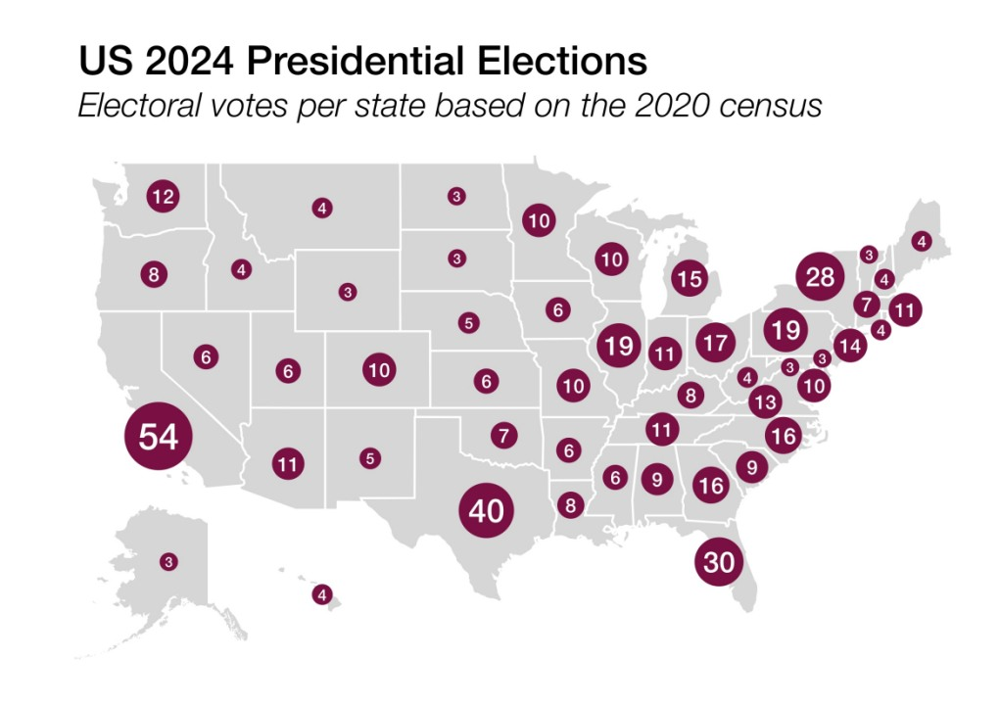
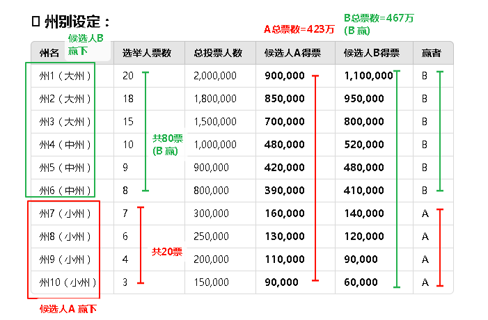
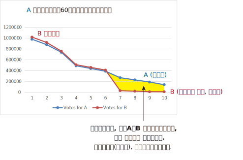
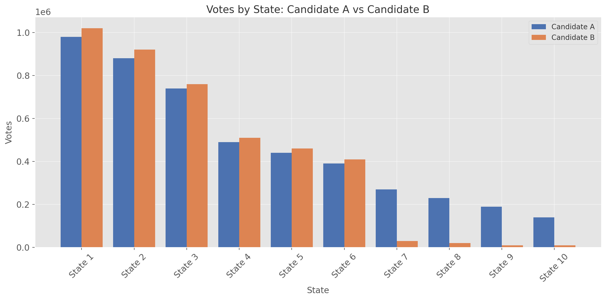

= 2024.09 How do we build trust in elections
:toc: left
:toclevels: 3
:sectnums:
:stylesheet: myAdocCss.css

'''

== 释义

==== Introduction by Katie Dunn Tenpas
Hi, I'm Katie Dunn Tenpas, a visiting fellow 访问学者 in governance studies 治理研究 at the Brookings Institution and director of the Katzmann Initiative on Improving Interbranch Relations 部门间关系 and Government. This is Democracy in Question, a podcast about contemporary American politics 当代美国政治. In each episode, I'll be asking a different question about democracy to my guests. You’ve probably noticed that there’s a lot happening in U.S. politics at the moment, including a highly contested 激烈竞争的 presidential race 总统选举. But in this podcast, I’m trying to get at the deeper questions of how democracy in this country and abroad works—or is supposed to work.

On today’s episode, the question is: How do we build trust in elections 选举信任? In case you’ve not been paying attention, there have been widespread 广泛的 election fraud claims 选举舞弊指控 after the past two presidential elections, despite little to no evidence. In a Washington Post poll among New Hampshire Republicans, more than 50% believed that Biden’s win was fraudulent 欺诈的, including 85% of Trump supporters. In 2022, the Pew Research Center found a party gap 党派差异 in terms of trust in elections. By a significant margin 显著差距, Democratic voters tended to think that elections will be administered well 妥善管理 in the upcoming election. Overall, however, since 2018, both Democrats and Republicans have expressed less trust in elections—a finding that should make everyone nervous 不安, since faith in elections is vital 至关重要的 to American democracy.

To explore answers to this important question—how do we build trust in elections?—I’m talking to two of my esteemed 受尊敬的 colleagues who have both spent decades studying the electoral process 选举流程. First, E.J. Dionne, the W. Averell Harriman Chair and Senior Fellow in Governance Studies. He’s also a syndicated columnist 联合专栏作家 for the Washington Post and a university professor in the Foundations of Democracy and Culture at Georgetown University. Then I’ll be joined by Elaine Kamarck, also a Senior Fellow in Governance Studies and founding director 创始主任 of the Center for Effective Public Management here at Brookings. She has written extensively 广泛著述 on the subject and is a highly regarded 备受推崇的 expert on the presidential electoral process.

==== Interview with E.J. Dionne: Introduction
E.J., welcome to Democracy in Question. Thank you, it’s great to be here, and thanks for all the work you’re doing in honor of 纪念 our late colleague Bob Katzmann. He would have wonderful ideas in answer to all the questions you’re going to ask me, and I wish he were with us. Yes, me too. Thank you for being here. As an opening question 开场问题, I’d like to get your thoughts on trends 趋势 in Americans’ trust in the electoral process. I know there have been periods in American history where there’s been more and less trust in government, so can we start by looking historically, and then you can talk about the general concept?

Historical Trends in Trust in Government and Elections
Well, I think, as you suggest, there are two separate issues 独立问题 here that end up affecting each other: one is trust in government overall 整体信任, and the other is trust in the electoral process. Trust in government has varied sharply 剧烈波动, partly depending on how the country was doing. The period of highest trust in government came after the Great Depression 大萧条 and World War II, where the Great Depression discredited 失去信誉 the private sector for quite some time, and government was broadly seen as having achieved two great things: the end of the Depression and victory in World War II. That capital in public sentiment 公众情绪 lasted through to the late 1960s. After a period of upheaval 动荡, especially with the backlash 强烈反对 against the Vietnam War and then Watergate, we went through something entirely different, where we’ve had struggles over confidence in government. You had some rises during the Reagan years, then it went back down with Iran-Contra. You had some rises in the Clinton years, but of course, we had the Clinton scandal at the end of that. Trusting government relates to what people see as happening in the country, but government also needs to cultivate it 培养信任. It’s always important for people who run government to realize that people can have difficult relations with government in their personal interactions 个人互动, and there are ways government can be made to function more efficiently or appropriately. That work has to go on all the time.

Faith in elections 选举信任 is something quite different. Yes, we’ve had periods where political machines 政治机器 stole votes 窃取选票 literally—in Chicago, in Illinois. There’s a great old saying 古老谚语 that Republicans would complain about stolen votes in Chicago, but Democrats would reply, "Well, Republicans stole votes in downstate 伊利诺伊州南部 Illinois," to balance out 抵消 the corruption. The saying was Chicago Democrats saying, "Look, we may vote corpses 给死人投票, but cows and pigs 牛和猪 vote downstate." So there were periods when we had actual corruption 实际腐败.

==== Current Challenges to Electoral Trust
What’s so troubling 令人不安 now is that we’re really only having this conversation because former President Donald Trump decided he was not going to accept the result of an election he had lost. What’s striking 引人注目的 about the post-2020 election period is there was massive litigation 大规模诉讼 about the election, and in every case—I think it’s 60 or 61 cases—courts of various kinds, with appointees from both parties, decided there was no fraud here. What’s unfortunate is that to have trust in elections, you really have to have both parties agreeing that we’ll challenge elections when appropriate—occasionally there is fraud—but there’s so little evidence of fraud now, no evidence of fraud on any large scale. Indeed, it’s ironic 讽刺的 that some of the few recent prosecutions for voting have been against Republicans more than Democrats, maybe just luck of the draw 随机结果, but it doesn’t point to massive Democratic fraud on behalf of Biden. It may take the end of the period when Trump has such influence, but I think it’s incumbent upon 义不容辞的 Republicans to speak out consistently—as, to their credit 值得称赞, they did, for example, in Georgia and in many states around the country.

If I could add one more thing quickly, I think we should pay attention to how elections actually function 实际运作 at the local level. If we do vote in person 现场投票, think of the people running the polls 管理投票站 for us. These are our neighbors, people like us, including Republicans and Democrats. My late mother-in-law was an election official 选举官员 in her precinct 选区 in Rockaway, New York, and she and her best friend, who was a Republican, were a team. They trusted each other, but they were looking out for the interest of each party, and the elections were perfectly fair. They went home after a long day’s work satisfied that everybody got to vote.

==== The Role of Donald Trump in Eroding Trust
Your comments suggest 表明；显示 that this moment we’re in now, where people do not have trust in the electoral 选举的 process 过程，is largely a function 作用；功能 of the former president. Does it seem to you as though it’s an explicit 明确的；清楚的 strategy 策略？Interestingly, when there are congressional 国会的 elections or big gubernatorial 州长的 races and Democrats win, there aren’t these allegations 指控；宣称 of voter fraud 选民欺诈. It seems to only happen in the presidential election. Not only that, the charge 指控 of voter fraud in 2020 was so odd 奇怪的 because no Republican who got elected in that election charged voter fraud affected their election that day. It’s a peculiar 特殊的；独特的 problem. Even though I do think this is the effect of Donald Trump, we have to think about what people who run elections—at the federal 联邦的，state, and very local levels—can do to increase confidence in elections. Some people will stick with 坚持 a fraud story no matter what, but there are ways elections can be run more efficiently 高效地.
For example, one thing we don’t fund 为… 提供资金 very well is election administration 选举管理. This shouldn’t surprise us because if you’re on a city council 市议会，a mayor 市长，or a county official 县官员，people are far more likely to complain about schools not running well, not having enough parks, or, in the case of a city, sanitation 卫生设施 and trash pickup 垃圾收集 or snow removal 除雪. You rarely get complaints about elections. Yet we can do far more to support elections and make it easier for people to vote. Secondly, the reason I raised my late mother-in-law is that I think we need to celebrate 赞扬；赞美 the hundreds of thousands of people around the country who make our elections work. We need to bring in high school students who are 18 or over to do some of this work and get involved 参与 in early on. One problem with the attacks on elections is we’ve lost a lot of election officials—at higher levels and all the way down—who have said, “I don’t want to do this anymore. I don’t want to be attacked. I don’t want people pretending I’m stealing votes for somebody.” In extreme 极端的 cases, it’s included threats of violence 暴力，which is unacceptable 不可接受的 and discourages 使气馁；阻碍 the very thing we want: citizens of all sides involved in running our elections.

==== Universal Voting as a Solution

Apart from 除… 之外 election administration, you’ve written a really interesting book—or co-authored 合著 an interesting book—about universal 普遍的；全体的 voting. Can you talk about how that might boost 增强；提高 confidence in the system? Thank you for mentioning that. The book is called 100% Democracy: The Case for Universal Voting, and my colleague Miles Rapoport, who really understands elections because he was Secretary of State 国务卿 in Connecticut—or, as the official title in Connecticut and only Connecticut is, Secretary of the State — co-authored it with me. We wrote this book because we were both inspired by systems, particularly in Australia, which has done this for nearly a hundred years, where, as a matter of citizenship 公民身份，every citizen is required to vote.
We call it universal voting rather than compulsory 强制的 voting because, in good American fashion, we propose a system that would largely look like Australia’s, but we would let everyone who wanted to apply for conscientious objector 拒服兵役者；出于良心拒服兵役者 status—if you really didn’t want to vote, and there are some religious traditions that stay away from 远离 politics altogether—apply for that status, and it would be granted liberally 自由地；慷慨地. We’re not requiring people who have a principled 有原则的 opposition 反对 to voting to cast 投（票） a ballot 选票. We don’t think most people would avail themselves of 利用 that, but they should.

In Australia, at the front end, there’s a national election board, which we don’t see happening in the U.S., but it helps make elections very efficient. The government helps people register 登记；注册，makes it as easy as possible to register to vote, with the result that about 96% or 97% of Australians are registered. Of the 96% who are registered, 90% vote on Election Day. If you don’t vote, you get a notice from the government saying you didn’t vote and asking if you had a reason. If you don’t have a reason, you’re asked to pay a $20 Australian fine, which, last I checked, is around $15. They accept reasonable excuses—like working, a sick parent, or being sick—and only about 1% to 3% of people ever pay the fine. It’s not a punitive 惩罚性的 system. We would do several things to make sure it’s not punitive: it would not be a criminal fine. We view this as a nudge 轻推；推动，not a shove 猛推，not punitive. It’s declaring that there’s a civic 公民的 duty 责任 and changing the culture around voting, which is what it’s done in Australia.

Elections are on Saturdays—we might not do them on Saturdays for religious reasons; we think Election Day should be a holiday—but you can go anywhere to vote in your state. Because of this civic feeling, elections become a giant party. There’s good political science showing that when parties or celebrations are associated with elections, turnout 投票率 is higher. Civic groups and schools use Election Day to raise money for all kinds of civic projects. When you go vote, there’s all kinds of food available. It’s become such a thing in Australia that they now have websites rating the food at different polling places, so you can decide where you want to eat. Australians are famous for their democracy sausages at these celebrations. We say we should have democracy sausages too, but there should be vegan 素食主义者的 alternatives 替代品.

==== Comparing Voter Registration: Australia vs. U.S.

I’m curious—with such high numbers of registered voters in Australia, how does that compare to the 与… 相比 United States? In Australia, around 96% are registered; here, about 69% are registered. Their efforts to make it easy for people to register, and for the government to take real responsibility 责任 in this, really make a big difference 产生很大影响. What you’re saying is that in this effort to promote 促进 universal voting, you’re basically saying the United States needs to eliminate 消除 a lot of the barriers 障碍 that currently exist around voting, try to make it more of a civic 公民的 duty 责任 and an event or celebration, and you can do that by eliminating these barriers. Is that right? Yes, in our book, we have a whole chapter devoted to 致力于 gateway reforms 入门改革. You should be able to vote early, there should be easy voter registration 选民登记，mail voter registration, mail balloting 邮寄投票 should be easy—there should be all sorts of ways to make it easy to vote. The Australians are very conscious 意识到的 that if you have a requirement 要求，you’ve got to make it as easy as possible to achieve 实现 this.

We actually did some polling 民意调查 on our idea. I used to joke that we’re either the dumbest or most honest book writers ever—although somebody pointed out you could be both. Our polling shows right now only about 26% of Americans would buy a version of our idea, but about half of Americans are at least open to 愿意接受 persuasion 说服. We thought that was pretty good for an idea that has never been pushed in the United States, and it does seem to fly in the face of 违背 certain libertarian 自由主义的 proclivities 倾向 that Americans have. But the other side of this, which goes to the purpose of your show today, is that if everybody knows that everybody is going to vote, it has a real opportunity to increase confidence in the system. You build a system that really works, accommodates 容纳；适应 everybody, and everyone knows that everybody else is engaged. One of my favorite photos of voting in Australia, just to show that everybody takes it seriously, is of a polling booth 投票站 near Bondi Beach in Sydney: three surfers in their wetsuits with their surfboards leaning up against the booth as they dutifully 尽职地 cast 投（票） their ballots 选票 and presumably 大概；推测地 then jump right back into the surf.

==== Challenges to Voting Reforms in the U.S.

It’s interesting to me, E.J., that if there are listeners out there who aren’t very familiar with American politics, or people from other countries, they might think: How can there be so much disagreement 分歧 on removing barriers to entry for voting? Why is this a difficult topic? Why can’t we pass these reforms overnight 一夜之间？The easiest way to pass reforms is when, at best, both parties 政党 are for them, or at worst, neither party thinks they’ll be hurt by them very much. Right now, you’ve had various moments in history where people have tried to exclude 排除 some groups from voting. We obviously have the long history of discrimination 歧视 against Black Americans, explicitly 明确地 excluding them from the vote or implicitly 含蓄地 doing so with phony 虚假的 literacy tests 识字测试 —like guessing how many jelly beans are in a jar for Black voters. Women have only had the right to vote for a little over 100 years. At the beginning of our republic, it was white men with property in most places. We’ve steadily 稳步地 expanded 扩大 the right to vote. A lot of people mistrusted 不信任 immigrants—the Know-Nothing Party in the 1840s and 1850s. Even some progressive 进步的 reformers were mistrustful of immigrants at the turn of the last century because they often voted for machine Democrats—or political machines 政治团体，though there were Republican machines too. We’ve always had battles over exclusion of groups, and now those battles are fought indirectly 间接地. No one says, “We want to stop X group from voting,” but they use voter fraud 选民欺诈 as a flag. One of the most popular excuses these days among opponents 反对者 of opening up the process is that illegal immigrants 非法移民 will vote. There’s no evidence that illegal immigrants vote in any substantial 大量的 numbers—it’s illegal in every state—yet that’s used as an excuse.

Putting aside 把… 放在一边 our idea, we welcomed what happened in the pandemic election. I think as a country, we should celebrate what we did early in the pandemic. Everyone wondered how you could have an election if people were worried that the price of casting a vote would be showing up and getting COVID. All over the country, in Republican as well as Democratic jurisdictions 管辖区，local and state officials said, “We’ve got to make it possible to hold an election where people don’t have to worry about getting infected with COVID.” That’s how we opened it up, and we got the highest turnout 投票率 in about 100 years—two-thirds of us voted. That’s a cause for celebration. I always like to say that I cast my mail ballot in a dropbox in front of Walt Whitman High School in Bethesda, Maryland. I love that for two reasons: one, that’s where our kids went to high school, but two, Walt Whitman was the poet of American democracy, and so I thought of it as a poetic act as I dropped that ballot in that dropbox. Why shouldn’t we make it easy all the time for everybody?

==== Additional Ideas to Restore Trust
Are there any other ideas you have, besides universal voting, that you think could help restore 恢复 trust in elections? What will it take, besides maybe a certain individual moving on to other things? Given that the polls 民意调查 are clear—as you suggested earlier—that the Americans who claim the 2020 election was rigged 操纵的 are overwhelmingly 压倒性地 Republican, I think it’s very important that Republican politicians not be complicit 同谋的 in this, or worse, half-complicit by saying things like, “Well, I don’t believe that, but there were problems in the election.” What problems? Spell those out. It’s usually a way of evading 逃避. The Secretary of State in Georgia, a Republican, said, “No, this was an honest election,” and actually won the next election—I think he ran ahead of the ticket because a lot of people on both sides appreciated that he said honestly, “We ran a good election.”
Every change made to make it easier to vote helps. Local election officials are transparent 透明的 about what they do, but they need to go out in the community and tell people, “Here is what we are doing, and here is why we are doing it.” Before all this crying about the so-called stolen election, in a lot of communities, Republicans and Democrats were grateful in 2020 that local officials went to a lot of trouble to make it easier for people to vote, and they were thanked for it. They need to do a lot more civic work at Rotary clubs 扶轮社，churches, and schools—education—just to say, “Here’s how our elections run, and if you want to be involved, we’d welcome you there.”

==== Concerns About the Future of American Democracy
One final question: I think anybody who’s concerned about trust in elections might also be concerned about the future of American democracy. On a scale of 1 to 10, how worried are you about the future of American democracy? I’m more on the worried side than I would have been even a year or two ago, so I’d probably put myself at a six or maybe a seven. It depends a lot on how this election turns out and what happens afterward, and neither the outcome 结果 nor what’s going to happen after is easily predicted. I’m also worried about what will happen at polling places 投票站. There’s a lot of talk about people showing up at polling places to fight voter fraud 选民欺诈 —will that turn into voter intimidation 选民恐吓 at the polls? If you ask me which I’m more worried about this time—another January 6th or voter intimidation on Election Day—I’d lean toward 倾向于 voter intimidation on Election Day right now. I hope we don’t have to go through 经历 that, which we have at some points in our history, particularly after Reconstruction 重建 in the South.
I am concerned. A lot of people say we have great institutions 机构 in America, and they’ve stood the test of time 经受住时间的考验. We do have really strong democratic—in small “d”—institutions, although some of them—like the Electoral College 选举人团 and the structure of the Senate 参议院的结构 —are antidemocratic 反民主的，as is the Supreme Court 最高法院 and the way it works. These are institutions we should and I do value, but we’ve seen again and again in history that institutions are only as good as the actors 参与者 called upon to protect and defend them. It’s very easy, even for the best institutions, to go haywire 陷入混乱 or operate badly if the stewards 管理者 of those institutions don’t take full responsibility for them. Right now, if you look at the polling 民意调查，we don’t even agree on what we mean when we say we’re trying to protect democracy. It’s striking 引人注目的 that Democrats will say protecting democracy means making sure no one is deprived of 被剥夺 the right to vote, making it as easy as possible to vote, and accepting the outcome of legitimate 合法的 elections. Republicans will say, “Oh, I care about democracy too—I don’t want people illegitimately 非法地 participating in the process; I don’t want people to rig 操纵 the elections.” They both say they mean democracy, but it’s as if they’re speaking two languages. It’s really hard to hope we can unite to defend our democracy when there’s this kind of division over what defending democracy means.
==== An Optimistic Note
If you had to end on an optimistic note 以乐观的态度结束，what would you look to for your source of optimism? Number one, I’ve had the blessing 幸运 of teaching for 20 years, and I really do love the generation that’s coming up now. I’ve taught a whole generation over those years, and contrary to 与… 相反 what a lot of people say about the new generation, I find a lot of real engagement 参与 with problems of democracy, wanting to protect the country. Yes, right now there’s some disillusionment 幻灭；醒悟 out there—that’s going to be a challenge this year—but I find real engagement among the young, and that gives me hope for the future. In principle 原则上，despite the split 分歧 I just mentioned, the vast majority of Americans do appreciate their institutions and understand the value of liberal democracy—I use “liberal” not in the ideological 意识形态的 sense, but to refer to democracy linked to rights, so you could say constitutional democracy 宪政民主: democracy linked with freedom of speech, press, assembly, religion. I think people in principle know that’s valuable—a significant majority knows that’s valuable—and you’re going to see that play out 展现；呈现 in this election with a lot of explicit 明确的 arguments about why defending democracy right now matters a great deal to our country. The fact that you’re holding these discussions fits in with 符合；与… 一致 the fact that in this particular election year, democracy will not be some side issue 次要问题 or back-of-the-train issue. It’s going to be central to the conversation. You’ve got to talk and argue about democracy if you’re going to spend the energy to save it, and that gives me some hope too. Well, it was a pleasure to talk to you this afternoon, and thank you so much for your time. Thank you.
==== Interview with Elaine Kamarck: Introduction
[Music]
And now, Elaine Kamarck. She’s the author of numerous works, including Primary Politics: Everything You Need to Know About How America Nominates Its Presidential Candidates, now in its fourth edition, just in time for the 2024 presidential election. Elaine, welcome to Democracy in Question. Thank you, Katie, nice to be here. Maybe we could kick it off 开始 with the central question of this podcast episode: How do we build trust in elections?
Addressing Election Fraud Claims with Data
The first way we build trust in elections is by making sure there’s honest data out there about the extent of fraud in elections. I would turn people to an article we wrote a couple of years ago here at Brookings. It took as its basis the Heritage Foundation’s monitoring of election fraud. This is a very interesting project they’ve got. Heritage is a conservative 保守的 think tank 智库，and they’ve been very supportive of Donald Trump and have blasted headlines about election fraud cases. Here at Brookings, we went through 仔细检查 every single election fraud case on the Heritage website and realized they were not examining the numbers in context 结合背景. For instance, in Texas, Heritage found 103 cases of confirmed election fraud, but those cases range from 2005 to 2022, during which time over 107 million ballots 选票 were cast 投（票）. In other words, the fraud in Texas amounted to 相当于 0.00096% of all ballots cast. This is hardly evidence of a fundamentally corrupt 腐败的 system.
As we know from studying conspiracy theorists 阴谋论者，they’ll always come back and say, “Well, they didn’t bother to commit much fraud there because Trump was going to win, so the Democrats didn’t try,” etc. But the story is the same in the swing states 摇摆州. For instance, in Arizona, where Biden won by a mere 10,000 votes, Heritage documents four cases of fraudulent 欺诈的 voting in the general election. This is hardly enough to swing the election. That goes on and on. I’d ask you to have a look at this on the Brookings website if you want to hear more. Essentially, this notion that Trump himself has started, and that the Republican MAGA types have promoted—that elections in America are fundamentally corrupt—simply doesn’t bear up 经得起检验，even on the Heritage Foundation’s own website.

==== Combating Perceptions of Fraud
What could combat 对抗；抵制 that? Would it have to be some sort of extensive 广泛的 civic education 公民教育 program? How do people who believe in elections, have faith, and understand there’s not enough evidence to say these elections are fraudulent 欺诈的 combat the perception 观念；看法 that there is fraud? Part of it is simply educating the public on what the voting system 投票制度 is like. Let’s take the case of the widespread 广泛流传的 rumor 谣言 that fraudulent ballots 欺诈性选票 were shipped to Maricopa County, Arizona—the county that has Phoenix in it—from China, and that these ballots were all pre-filled out 预先填写 with Biden’s name. If you know anything about voting, you know that ballots are printed county by county 逐县 because there are all sorts of different people on them. Maybe the Chinese could have figured out 弄清楚 all the dog catchers 捕狗员 and county commissioners 县委员 in Maricopa County, but that’s the first challenge. Secondly, ballots are printed on a special kind of paper, and the theorists 理论家 were looking for bamboo traces 痕迹 in the alleged 所谓的 Chinese paper. Don’t you think that if the Chinese were really trying to do fraudulent ballots, they would have used the kind of paper used in Maricopa County? Thirdly, the ballots themselves are kept under lock and key 妥善锁藏 both before and after Election Day.
Here’s the thing people really don’t understand: elections are contests 竞赛 between two big, well-funded 资金充足的，and highly competent 能力强的 political parties 政党. In most of these elections, when there’s counting 计票 or a recount 重新计票 going on, the Democratic and Republican parties have a representative 代表 in the room. Those representatives run to court the minute they see something fishy 可疑的. They’re armed with injunctions 禁令，they get themselves to the courthouse 法院，the judges are alerted 通知，etc. For there to have been widespread 广泛的 fraud in 2020, you have to assume the Republican Party was completely asleep at the switch—which is why, going back to the Heritage Foundation study, you find a minuscule 极小的 amount of voting fraud in the United States. It’s interesting too that even in 2020, there were so many lawsuits 诉讼 and claims 声称 of fraud, but none of the other Republican races 竞选 mattered. All the other Republicans who won those elections were fraud-free 无欺诈的 somehow. Right, the only fraudulent elections in 2020 were the ones Donald Trump lost. By the way, the down-ballot Republicans in 2020 did pretty well, and they didn’t challenge 质疑 those.

==== Expectations for 2024

Heading into 2024’s election, do you expect more of the same? Is there any reason to expect something different, or that maybe people have become more attuned to 使习惯；使适应 what each state does to protect the election and are more respectful of it, or do you think it’s going to be more of the same? The secretaries of state 州务卿 are making concerted 协同的；一致的 efforts to educate the public. There’s a lot of public education going on. Do I think Donald Trump and the MAGA people will cry fraud? Yes, of course—they’re already doing it, and not a ballot has been cast 投（票）. They will, but the question is: Do people take this seriously? Is it undermining 削弱 confidence in the elections? The situation in Maricopa County, where you had people looking for bamboo traces in paper ballots they were examining, was so ridiculous 荒谬的 that a lot of people probably looked at that and said, “Boy, that’s dumb.” This time, the secretaries of state are not taking for granted 想当然；认为… 理所当然 that voters know what happens to their ballots before and after they get to the polling place 投票站. My guess—and maybe I’m just being an eternal 永远的 optimist 乐观主义者 —is that it will be harder to argue massive 大规模的 fraud this time than it was four years ago.
In one of your emails, you mentioned you’re working with secretaries of state across the country. Can you talk a little bit about that? We’ve been in conversations with several secretaries of state over the last four years. It began with a project we did in 2020 where we were monitoring 监测 the adaptations 调整 the secretaries of state were making to deal with voting in a pandemic 大流行病，to deal with COVID. That began our relationship with them, and we’ve followed ever since, particularly the actions of people in swing states 摇摆州 who are trying to educate the public and make sure they don’t have the same high levels of suspicion 怀疑 as last time. In 2020, there were massive 大规模的 changes in how Americans voted. On Election Day 2020, we didn’t have a vaccine 疫苗 yet. We were still hurting as a country—people were still dying, people were sick, people were scared. To run a presidential election in the middle of a pandemic, most secretaries of state did things like ease up on 放宽 requirements for absentee voting 缺席投票 and allow a lot of early voting 提前投票. That became the basis for a lot of suspicion afterward, and Trump played into that to argue he had really won the election, not lost it.

[.my1]
.案例
====
.absentee voting
缺席投票（英语：absentee voting；日语：不在者投票制度，中文被称为不在籍投票），是指, 当选民因故无法到"投票所"现场(如美国海外公民), 来进行投票时，为他们提供其他投票的途径。

现在越来越多的州, 允许"在国外出生, 但从未在美国居住过的美国公民", 使用其有资格投票的父母或其他亲属的地址, 进行投票。

====

What we have to realize is that at the same time it played into conspiracy theories 阴谋论，people loved it. People loved the new way of voting—it was very popular. You could vote early—wasn’t the participation rate 参与率 up compared to other elections? Yes, participation was way up. People loved the fact that you could get an absentee ballot, go to early voting, etc. There’s very little public demand for these new voting systems to be taken back.

==== Managing Election Night Reporting

The second thing—and this I think we can do something about—is that because the Republicans made such a big deal about fraud in absentee ballots, what happened was, on Election Night, the in-person vote 现场投票 came in first, and that was a Republican vote because Republicans were told not to vote absentee. When they added in the absentee ballots and early ballots in many states, the picture changed, and the Democrats caught up and, in some cases, surpassed 超过 Trump. That was interpreted in many places as, “Oh, they did some funny business 不正当行为 in the middle of the night.” That now is in the hands of reporters. I’ve made a more radical 激进的 suggestion: states should not report votes until they have 99% of the votes in, not even talk to the media on Election Night. The media would probably have a fit about that—they love election nights—but at least what they’re doing now, as you saw in 2022, is constantly reminding voters, “This is only part of the vote; we don’t have the absentee vote yet.” Still, it makes people suspicious: “What do you mean one candidate is winning at one point, then losing at another point?”

Did the secretaries of state respond to this idea of waiting until all ballots were in? I know the media would be impatient, but were they receptive 愿意接受的？The media hates it. I can’t speak for the secretaries of state on this because, in a way, it makes it easier for them—it’s just one answer. It would make it much easier for them, and I may promote this a little more again because it’s crazy the way this goes on. If you go to bed at 10:00 thinking your candidate has won and wake up at 6:00 in the morning and your candidate has lost, you’re going to be upset. You might wonder, and if somebody’s telling you there’s a lot of fraud, you’re going to believe there’s a lot of fraud.

==== AI, Disinformation, and Elections
I wanted to talk for a moment because you mentioned people are inclined to 倾向于 believe certain things they hear. You and our colleague Darrell West have recently written a book about AI and disinformation 虚假信息 and misinformation 错误信息. Can you talk a little about how that plays into Americans’ capacity to trust election results? There are two aspects to disinformation. One is the persuasion 说服；劝说 aspect, where people are very worried about deep fakes 深度伪造 —like Kamala Harris doing something outrageous 离谱的；令人无法容忍的 or saying something outrageous, or Donald Trump doing something outrageous. That’s a big worry, and that goes to the persuasion part. There’s also disinformation that goes to the voting part, which is as old as Methuselah 非常古老 but now has a different form: emails that say voting day has been moved from Tuesday to Wednesday because of thunderstorms or snowstorms, trying to confuse 使困惑；使糊涂 voters—particularly the other person’s voters—about when the election is. Or sending out fake 虚假的 information on getting absentee ballots 缺席选票 —when do you need to register for an absentee ballot? All that stuff is all over the place. A lot of it is noise in the system and doesn’t matter, but when you’re in a very close election, these little things end up mattering. While most of us wouldn’t believe that Kamala Harris was in a porno film—one of the favorite ones running around—most of us would say, “That’s ridiculous 荒谬的，that’s not going to happen,” but when elections are this close, you just need a very small number of people to believe it to make a difference.
Tell me you have a solution for how to combat 对抗；抵制 that. Is it possible, or is it just that technologically we can’t keep up right now? Technologically, we can’t keep up, but campaigns 竞选活动 are going to have to spend a lot of money and resources not just reaching voters but literally looking for this junk 垃圾信息 on the internet and stopping it as soon as they can. It’s hard to stop, hard to trace 追踪 who’s doing it and where it is, but campaigns have the primary 主要的 responsibility right now—it’s in their interest. Eventually, we might have technical solutions. We may have ways of instantly seeing an AI fake. Right now, though, it’s hard, and we’re not there. I think 2024 is one of the most dangerous elections ever on disinformation because it’s new enough and good enough that we can’t really combat it. I’m hoping—maybe this is too optimistic—but by 2028 or 2032, two things will have happened: one, the public will have gotten sophisticated 见多识广的；老练的 and will see some of these things and say, “That’s ridiculous, that’s probably fake,” and two, there will be tools at hand 在手边；可用的 to decipher 破译；辨别 disinformation from real information—like the McAfee virus protection 病毒防护 we have on our computers. We’ll have to have something like that. People smarter than me tell me that’s not happening right now, which is why I say 2024 is a very dangerous year. My guess is we’ll adapt to this as we’ve adapted to other forms of technology. Of all the times for it to be at its zenith 顶点 in terms of affecting an election outcome, it’s affecting one that’s as close as can be. It’s a bad year for it to have this effect.

==== Additional Ideas for Building Trust
Do you have any other ideas about building trust in elections? I know you talked a lot about civic education 公民教育 and secretaries of state 州务卿 being more transparent 透明的 about what they do so voters understand how careful election workers are with ballots 选票，but do you have other ideas? I think educating the public on the party system 政党制度 is key. The parties are often forgotten in this, yet they’re the major players 主要参与者 in keeping elections honest. We’re all familiar with the underlying theory of capitalism—that competition 竞争 is good, that a car with doors falling off won’t sell well, and competition ensures quality. It’s the same in elections. The two political parties 政党 are mostly fairly competent 有能力的 at watching elections. They have an idea of where their vote is. If it’s coming in all screwy 混乱的 —if the South Bronx is voting 85% for Donald Trump—people run to the courts and say, “Hey, something’s wrong here.” The two parties are the primary line of defense 主要防线 to keep our elections honest. You can even contribute to 为… 做贡献 their election funds 竞选资金 to pay for the work they do. But even very educated people sometimes talk to me as if only the Republicans or only the Democrats can get away with things. No, there are two of them, and they’re usually fairly competent. They’ll litigate 提起诉讼 this, and that’s what keeps it fairly honest.

==== Historical Parallels
Historically, can you think of another moment in time where the American electorate 选民 has had such doubts about election outcomes? The election of 1876. That was the Reconstruction 重建 election where white Southerners took over from newly enfranchised 获得选举权的 Black voters. Three states sent in confusing and opposite electoral slates 选举名单，and it had to be decided in the House of Representatives. It was a mess because the actual voting was a mess. In some places, they were lynching 私刑处死 freed slaves who tried to vote; in others, the Union Army was protecting polling places 投票站 from white Southerners. That makes today look like a picnic. That was the Civil War fought to its end.
What about Bush v. Gore? Do you think that has made people more likely to be concerned in this current era? Bush v. Gore was simply a very close election. There’s data from the press recount 重新计票 of Florida that indicates if Gore had chosen to go for a statewide recount instead of a recount of Broward, Dade, and one other county, he probably would have won the state because Jacksonville was left out, and it turns out there were a lot of issues there. Under the legal process followed, the Supreme Court cut off the recount, saying they had to have the Electoral College 选举人团 vote by the second week in December, which is in the Constitution. We know what happened in Bush v. Gore: Gore got the most votes, no doubt about it, but the Electoral College vote in Florida, which was very close, was decided legally by the courts, and that was the end of it.

==== The Electoral College and Trust
What this brings up is a bigger problem: the Electoral College. I think the Electoral College undermines 削弱 trust in government because the person with the most votes—twice now in this century—has not become president. A small portion of the electorate decides the majority of the United States Senate because every state, even tiny ones with few people, has two senators. We’re in trouble now because of the Electoral College.

==== Concerns About American Democracy
On a scale of 1 to 10, where would you be in terms of your concerns that declining trust in elections is undermining American democracy? Do you think it’s affecting American democracy, and how do you feel generally—are you nervous about the future of American democracy? I am, as most people are. I’m very nervous about it, but I also think we have a lot of guardrails 防护措施 built into the system. In 2020, there were 62 lawsuits 诉讼 brought by the Trump campaign alleging 声称 one kind of voter fraud 选民欺诈 or another; 61 of them were thrown out of court—some by Trump-appointed judges, Republican judges, etc. There are guardrails still in America; they’re still working. Like many people, I fear a Trump presidency would try to undermine those guardrails, but so far, so good. Where would you be on that scale of 1 to 10, if 10 is the most afraid about the future of American democracy and 1 is the least? I’d probably be a seven.
E.J. was talking about not being so concerned about the fact that faith in election results is declining because he thinks it’s largely a function of a personality—Donald Trump—who’s saying, “Don’t trust the election results.” Do you think the decline in trust is an aberration 异常现象 and really a function of an overwhelming 有巨大影响力的 personality casting doubt, and that without that personality, Americans would be more inclined to trust election outcomes? Yes, I think so. Trump is very unique. I get this question all the time about presidents. When Trump was president, a lot of young people would say, “Is this how it always is?” No, it’s not how it always is. Donald Trump was and is a very unique actor in American politics. I, for one, think that once he goes from the scene—either he loses and he’s done, or he wins and he only has four years—we will have turned the page on a pretty ugly chapter in American history. Well, thank you, Elaine. I’m really grateful for your time and insights. Nice to see you, Katie.

==== Outro by Katie Dunn Tenpas
Democracy in Question is a production of the Brookings Podcast Network. Thank you for listening and thank you to my guests for sharing their time and expertise on this podcast. Also, thanks to the team at Brookings who make this podcast possible, including Kuwilileni Hauwanga, supervising producer; Fred Dews, producer; Colin Cruickshank, Steve Kameron, and Gaston Reboredo, audio engineers; the team in Governance Studies, including Tracy Viselli, Catalina Navarro, and Adele Patton; and the promotions teams in both Governance Studies and the Office of Communications at Brookings. Shanté Mendes designed the beautiful logo. You can find episodes of Democracy in Question wherever you like to get your podcasts and learn more about the show on our Brookings website at brookings.edu/democracyinquestion, all one word. I’m Katie Dunn Tenpas. Thank you for listening.

'''

== 中文翻译

==== 凯蒂·邓·坦佩斯塔的开场介绍

大家好，我是凯蒂·邓·坦佩斯塔，布鲁金斯学会治理研究访问学者，也是卡兹曼部门间关系与政府改进计划主任。这里是《民主之问》，一档探讨当代美国政治的播客。每期节目我将向嘉宾提出不同的民主相关问题。您可能注意到当前美国政坛热点不断，包括激烈竞争的总统选举。但本节目旨在探讨更深层问题：美国及全球民主如何运作——或应该如何运作。

本期核心问题是：**如何建立选举信任？**过去两届总统选举后，尽管缺乏证据，仍**出现了广泛的选举舞弊指控。**《华盛顿邮报》民调显示，新罕布什尔州"共和党人"中超50%认为, 拜登胜选存在欺诈，特朗普支持者中这一比例达85%。2022年"皮尤研究中心"发现党派差异：民主党选民, 更倾向于相信下届选举将得到妥善管理。但**自2018年以来，两党对选举的信任度均下降——这应引起全民警觉，因为"选举信任"对"民主"至关重要。**

为探讨此问题，我邀请两位研究选举流程数十年的资深同事。首先是治理研究高级研究员E.J.迪昂，他同时是《华盛顿邮报》联合专栏作家, 和乔治城大学民主与文化基础教授。另一位是"布鲁金斯有效公共管理中心"的创始主任伊莱恩·卡马克，她在"总统选举流程研究"领域, 备受推崇。

==== 采访E.J.迪昂：开场
欢迎来到《民主之问》，E.J.。感谢您为纪念已故同事鲍勃·卡兹曼所做的工作。他本会给出精彩答案，真希望他还在世。是的，我也如此认为。感谢您的到来。作为开场问题，请谈谈美国人对选举流程信任度的趋势。美国历史上政府信任度有高低起伏，能否先从历史视角切入？

政府与选举信任的历史变迁

如您所言，这是两个相互影响的独立问题："政府整体信任", 和"选举流程信任"。政府信任度曾剧烈波动，部分取决于国家状况。**最高信任期, 出现在大萧条和二战后——当时私营部门信誉扫地，政府被视为结束萧条和赢得二战的双重功臣。**这种公众情绪资本持续至1960年代末。**经历越战反弹, 和水门事件等动荡后，局面彻底改变，政府信任陷入挣扎。**里根时期信任度回升，但因伊朗门事件再次下跌；克林顿时期虽有回升，却以丑闻告终。政府信任既关乎民众对国家状况的认知，也需主动培养。执政者需意识到：民众在日常互动中, 可能与政府关系紧张，因此须持续改进政府效能。

"选举信任"是另一回事。确实，我们曾经历过政治机器公然窃取选票的时期——比如芝加哥和伊利诺伊州。**有个古老谚语说：共和党人会抱怨芝加哥的选票被窃取，而民主党人则反驳"共和党在伊利诺伊州南部, 也偷选票"来抵消腐败指控。**芝加哥民主党人还**有句名言："我们顶多给死人投票，但南部可是连牛和猪都投票了。"**这些时期确实存在实际腐败。

==== 选举信任的当前挑战

当前令人不安的是，这场讨论完全因特朗普拒绝承认败选而起。**2020年大选后, 出现大规模诉讼，60余起案件中，两党任命的各级法院, 均裁定"无欺诈"。**讽刺的是，近期少数投票相关起诉更多针对共和党人，但这不表明民主党存在大规模舞弊。或许需待特朗普影响力消退，但共和党人理应持续发声——值得称赞的是，佐治亚等州已有此类表率。

补充一点：我们应关注地方选举的实际运作。现场投票时，管理投票站的是我们的邻居，包括两党支持者。我已故岳母曾是纽约罗克威选区的选举官员，她与共和党好友搭档监督，确保选举公正。他们结束漫长工作后满意回家，因为每位选民都行使了投票权。

==== 特朗普在侵蚀信任中的作用

您的观点表明, 当前选举信任危机主要归因于前总统。您认为这是明确策略吗？有趣的是，当民主党赢得国会或州长选举时，却未出现舞弊指控。这种现象仅存在于总统选举。更奇怪的是，2020年指控当天当选的共和党人, 并未声称舞弊影响其选举结果。这是特殊问题。尽管我认为这是特朗普的影响，但选举管理者（联邦、州和地方层面）仍需思考如何增强信任。

例如，**#"选举管理资金"长期不足。市政官员更常收到教育、公园、环卫等投诉，"选举问题"却鲜少被提及。#**我们应加强选举支持：首先表彰基层选举工作者，其次招募18岁以上高中生参与选举工作。*#当前攻击选举的恶果是：许多选举官员因遭受暴力威胁, 而离职，这阻碍了我们期待的全民选举参与。#*

==== 唐纳德・特朗普在削弱信任方面的作用

你的评论表明，我们现在所处的这个"人们对选举过程缺乏信任"的时刻，在很大程度上是这位前总统造成的。在你看来，这似乎是一种明确的策略吗？有趣的是，当举行国会选举或大型州长竞选且民主党获胜时，就不会有这些选民欺诈的指控。似乎只有在总统选举中才会出现这种情况。不仅如此，2020 年的选民欺诈指控很奇怪，因为在那次选举中当选的共和党人, 没有一个声称选民欺诈影响了他们当天的选举。这是个特殊的问题。尽管我确实认为这是唐纳德・特朗普的影响，但我们必须考虑负责选举的人 —— 在联邦、州和地方各级 —— 可以做些什么来增强人们对选举的信心。有些人无论如何都会坚持欺诈的说法，但有一些方法可以让选举更高效地进行。

例如，我们没有很好地资助的一件事, 是"选举管理"。这并不奇怪，因为**如果你是市议员、市长或县官员，人们更有可能抱怨学校运转不佳、公园不足，或者就城市而言，抱怨卫生设施、垃圾收集或除雪问题。你很少收到关于选举的投诉。**然而，我们可以做更多的事情来支持选举，让人们更容易投票。其次，我提到我已故的岳母的原因是，我认为我们需要赞扬全国成千上万让我们的选举得以顺利进行的人。我们需要让 18 岁及以上的高中生参与这项工作，并尽早参与进来。*对选举的攻击带来的一个问题是，我们失去了很多选举官员 —— 从高层到基层 —— 他们说：“我不想再做这件事了。我不想受到攻击。我不想让人们假装我在为某人偷选票。” 在极端情况下，还包括暴力威胁，这是不可接受的，也阻碍了我们所希望的事情：各方公民参与管理我们的选举。*

==== 普遍投票作为一种解决方案

除了选举管理之外，你写了一本非常有趣的书 —— 或者说与人合著了一本关于普遍投票的有趣的书。你能谈谈这如何能增强人们对选举制度的信心吗？谢谢你提到这一点。这本书名为《100% 民主：普遍投票的理由》，我的同事迈尔斯・拉波波特和我一起合著了这本书，他非常了解选举，因为他曾是康涅狄格州的国务卿 —— 在康涅狄格州，官方头衔是 “国务秘书”，而且只有康涅狄格州是这样称呼。我们写这本书是因为, *我们都受到了一些制度的启发，特别是澳大利亚的制度，澳大利亚已经实行了近百年，在那里，作为公民身份的一部分，每个公民都被要求投票。*

我们称之为"普遍投票", 而不是"强制投票"，因为按照美国的良好传统，我们提议的制度, 在很大程度上看起来会像澳大利亚的制度，但我们会让任何想申请出于良心拒服兵役者身份的人 —— 如果你真的不想投票，而且有一些宗教传统完全远离政治 —— 申请这种身份，而且会宽松地批准。我们不会要求有原则反对投票的人去投票。我们认为大多数人不会利用这一点，但他们应该有这个选择。

**在澳大利亚，一开始就有一个国家选举委员会，这在美国是看不到的，但它有助于使选举非常高效。**政府帮助人们登记，让登记投票尽可能容易，结果是大约 96% 或 97% 的澳大利亚人都登记了。在登记的 96% 的人中，有 90% 在选举日投票。**如果你不投票，你会收到政府的通知，说你没有投票，并询问你是否有原因。如果你没有原因，你会被要求支付 20 澳元的罚款，**据我上次查看，大约是 15 美元。**他们接受合理的借口 —— 比如工作、父母生病或自己生病 —— 只有大约 1% 到 3% 的人会支付罚款。这不是一个惩罚性的制度。**我们会采取一些措施来确保它不是惩罚性的：它不会是刑事罚款。我们认为**这是一种推动，而不是强迫，不是惩罚性的。这是在宣称有一种公民责任，**并改变围绕投票的文化，这就是澳大利亚所做的。

选举在星期六举行 —— 由于宗教原因，我们可能不会在星期六举行选举；*我们认为"选举日"应该是一个节日* —— 但你可以在你所在的州的任何地方投票。由于这种公民意识，选举变成了一个盛大的聚会。**#有很好的政治学研究表明，当聚会或庆祝活动与选举相关联时，投票率会更高。# 公民团体和学校利用"选举日", 为各种公民项目筹集资金。**当你去投票时，有各种各样的食物可供选择。在澳大利亚，这已经成为一种风气，他们现在有网站, 对不同投票点的食物进行评级，这样你就可以决定你想去哪里吃饭。澳大利亚人在这些庆祝活动中, 以他们的 “民主香肠” 而闻名。我们说我们也应该有 “民主香肠”，但也应该有素食替代品。

==== 选民登记比较：澳大利亚与美国

我很好奇 —— 澳大利亚有如此高的选民登记率，与美国相比情况如何呢？*在澳大利亚，大约 96% 的人进行了登记；而在美国，大约 69% 的人进行了登记*。他们努力让人们更容易进行登记，并且政府在这方面切实承担起责任，这确实产生了很大的影响。

你的意思是，在推动普遍投票的努力中，基本上是说**美国需要消除目前围绕投票存在的许多障碍，努力让投票更像是一种公民责任，以及一个活动或庆祝仪式，**并且可以通过消除这些障碍来实现这一点，对吗？

是的，在我们的书中，有一整章专门讨论入门改革。**你应该能够提前投票，应该有简便的选民登记方式，邮寄选民登记，邮寄投票也应该简便 —— 应该有各种各样的方式让投票变得容易。**澳大利亚人非常清楚，如果有一个要求，就必须尽可能让人们容易实现它。

实际上，我们对我们的想法做了一些民意调查。我过去常开玩笑说，我们要么是有史以来最愚蠢的，要么是最诚实的书籍作者 —— 尽管有人指出我们可能两者皆是。**我们的民意调查显示，目前只有大约 26% 的美国人会接受我们想法的一个版本，但大约一半的美国人至少愿意接受说服。**我们认为，对于一个在美国从未被大力推动过的想法来说，这已经相当不错了，而且**它似乎确实违背了美国人的某些自由主义倾向。但另一方面，**这也关系到你今天节目的目的，那就是**如果每个人都知道每个人都会去投票，那么就真的有机会, 能增强人们对选举制度的信心。**你建立一个真正有效的制度，能够适应每个人，而且每个人都知道其他人也参与其中。我最喜欢的一张澳大利亚投票的照片，只是为了表明每个人都很认真对待投票，那是悉尼邦迪海滩附近的一个投票站的照片：三个穿着潜水服的冲浪者，他们的冲浪板靠在投票站旁边，他们尽职地投下选票，然后大概又直接跳进了海里冲浪。

==== 美国投票改革面临的挑战

E.J.，对我来说很有趣的是，如果有不太熟悉美国政治的听众，或者来自其他国家的人，他们可能会想：在消除投票的准入障碍方面，怎么会有如此多的分歧呢？为什么这是一个困难的话题呢？为什么我们不能一夜之间通过这些改革呢？

**#通过改革的最容易的情况是，最好是两党都支持这些改革，或者最起码两党都不认为这些改革会对他们造成很大伤害。#**目前，**在历史上有很多时刻，人们试图将一些群体排除在投票之外。**显然，我们有长期歧视美国黑人的历史，明确地将他们排除在投票之外，或者含蓄地通过虚假的识字测试, 来达到这一目的 —— 比如让美国黑人选民猜测, 罐子里有多少颗软糖。*女性获得投票权才仅仅一百多年多一点。在美国建国初期，在大多数地方只有有财产的白人男性才有投票权。我们稳步地扩大了投票权。很多人不信任移民* —— 比如 19 世纪 40 年代和 50 年代的一无所知党。甚至在上个世纪之交，一些进步的改革者也不信任移民，因为他们经常投票给政治团体民主党人 —— 或者说是政治团体，尽管也有共和党的政治团体。我们一直都在围绕"群体的排除问题"进行斗争，而现在这些斗争, 是以间接的方式进行的。没有人会说，“我们想阻止某个群体投票”，但他们会以"选民欺诈"为幌子。如今，在反对开放投票程序的人中，**最流行的借口之一就是"非法移民会投票"。**没有证据表明有大量的非法移民投票 —— 在每个州这都是非法的 —— 然而这却被用作一个借口。

把我们的想法放在一边，我们欢迎在疫情期间选举中发生的事情。我认为，作为一个国家，我们应该赞扬我们在疫情初期所做的事情。每个人都在想，如果人们担心去投票的代价是感染新冠病毒，那该如何举行选举呢。在全国范围内，在共和党和民主党管辖的地区，地方和州官员都说，“我们必须让举行一场人们不必担心感染新冠病毒的选举成为可能。” 这就是我们开放选举的方式，我们迎来了大约 100 年来最高的投票率 —— 三分之二的人参与了投票。这是值得庆祝的事情。我总是喜欢说，我把我的邮寄选票投进了马里兰州贝塞斯达的沃尔特・惠特曼高中前面的投票箱里。我喜欢这样做有两个原因：其一，那是我们的孩子上高中的地方；其二，沃尔特・惠特曼是美国民主诗人，所以当我把选票投进那个投票箱时，我认为这是一个富有诗意的行为。为什么我们不应该一直让每个人都能轻松投票呢？

==== 恢复信任的其他想法
除了普遍投票之外，你还有其他认为可以帮助恢复人们对选举信任的想法吗？除了某个特定的个人去做其他事情之外，还需要做些什么呢？

鉴于民意调查很清楚 —— 就像你之前提到的 —— 声称 2020 年选举被操纵的美国人, 绝大多数是共和党人，**我认为非常重要的是，共和党政治家不要在这件事情上同流合污，或者更糟糕的是，#不要半推半就，说什么 “嗯，我不相信那个说法，但选举中确实存在问题。” 存在什么问题呢？把那些问题说清楚。这通常是一种逃避的方式。#**佐治亚州的一位共和党州务卿说，“不，这是一次诚实的选举”，而且他实际上赢得了下一次选举 —— 我认为他在选票上领先，是因为很多两党的人都欣赏他诚实地说，“我们举办了一次很好的选举。”

每一项"让投票变得更容易"的改变, 都是有帮助的。地方选举官员对他们所做的事情, 应该保持透明，但他们需要走进社区，告诉人们，“这是我们正在做的事情，这是我们这样做的原因。” 在所有关于所谓的"选举被窃取"的哭诉之前，在很多社区，共和党人和民主党人在 2020 年, 都很感激地方官员为让人们更容易投票所付出的努力，并且也因此感谢他们。*他们需要在扶轮社、教堂和学校做更多的公民工作 —— 也就是教育工作* —— 只是为了说，“这就是我们的选举是如何进行的，如果你想参与其中，我们欢迎你。”

==== 对美国民主未来的担忧

最后一个问题：我认为任何关心选举信任的人, 可能也会关心美国民主的未来。从 1 到 10 的程度来衡量，你对美国民主的未来有多担心呢？

我现在比一两年前更加担心了，所以我可能给自己打个六分或者七分。这在很大程度上取决于这次选举的结果, 以及之后会发生什么，而且**选举结果和之后会发生的事情, 都很难预测。**我也担心投票站会发生什么事情。**有很多人说, 会有人出现在投票站来打击选民欺诈行为 —— 这会不会在投票时演变成"选民恐吓"呢？**如果你问我这次我更担心什么 —— 是另一个 “1 月 6 日事件”（国会山骚乱）, 还是选举日的选民恐吓 —— 我现在更倾向于担心选举日的选民恐吓。我希望我们不必经历那样的事情，*而在我们历史上的某些时候我们确实经历过，特别是在南方重建之后。*

我很担心。**#很多人说美国有伟大的机构，而且它们经受住了时间的考验。#**我们确实有非常强大的民主（小写的 “d”，表示一般性的民主概念）机构，**尽管其中一些机构 —— 比如"选举人团"和"参议院的结构" —— 是反民主的，最高法院及其运作方式也是如此。**这些是我们应该而且我也确实重视的机构，**#但我们在历史上一次又一次地看到，机构的好坏, 取决于被要求保护和捍卫它们的参与者。即使是最好的机构，如果这些机构的管理者不对它们承担全部责任，也很容易陷入混乱或运作不良。(即事情的好坏终究在人为.)#**

现在，如果你看看民意调查，**我们甚至对 “我们试图保护民主” 这句话的含义, 都无法达成一致 (很正常, 抽象概念的定义是由你自己下的. 没有统一和唯一的定义. 这就是"社会人文学科"相对于"理科"的不同之处)。**引人注目的是，**民主党人会说, "保护民主"意味着确保没有人被剥夺投票权，让投票尽可能容易，**并接受合法选举的结果。*共和党人会说，*“哦，*我也关心民主 —— 我不希望人们非法参与这个过程；我不希望人们操纵选举。*” 他们都说自己说的是民主，但就好像他们说的是两种不同的语言。当在 “保护民主意味着什么” 这个问题上存在这样的分歧时，很难指望我们能够团结起来捍卫我们的民主。

==== 乐观的一面

如果你必须以乐观的态度结束谈话，你会从什么地方找到乐观的源泉呢？第一，我有幸教了 20 年书，我真的很喜欢现在正在成长起来的这一代人。在那些年里，我教了整整一代人，而且与很多人对新一代的看法相反，我发现他们很多人真正参与到了民主问题中，想要保护这个国家。是的，现在外面确实存在一些幻灭情绪 —— 这今年会是一个挑战 —— 但我在年轻人中发现了真正的参与，这让我对未来充满希望。原则上，尽管我刚才提到了分歧，但绝大多数美国人确实欣赏他们的机构，并理解自由民主的价值 —— 我使用 “自由” 这个词, 不是在意识形态的意义上，而是指与权利相关的民主，所以你可以说是宪政民主：与言论自由、新闻自由、集会自由和宗教自由相关的民主。我认为人们原则上知道这是有价值的 —— 相当多的人知道这是有价值的 —— 而且你会在这次选举中看到这一点的体现，会有很多明确的论据说明, 为什么现在捍卫民主对我们的国家非常重要。你正在进行这些讨论这一事实与这样一个事实相符，即在这个特殊的选举年，民主将不再是一个次要问题或无关紧要的问题。它将成为谈话的核心。**如果你要花精力去拯救民主，你就必须谈论和辩论民主，**这也给了我一些希望。嗯，今天下午很高兴和你交谈，非常感谢你抽出时间。谢谢。

==== 对伊莱恩・卡马克的采访：引言
[音乐]
现在，伊莱恩・卡马克。她是许多作品的作者，包括《初选政治：你需要知道的关于美国如何提名总统候选人的一切》，现在已经是第四版了，正好赶上 2024 年总统选举。伊莱恩，欢迎来到《民主存疑》节目。谢谢你，凯蒂，很高兴来到这里。也许我们可以从这期播客节目的核心问题开始：我们如何建立对选举的信任？

用数据回应选举欺诈的说法

我们建立对选举信任的第一种方法, 是确保有关于选举中欺诈程度的真实数据。我会让人们去看我们几年前在布鲁金斯学会写的一篇文章。这篇文章以传统基金会对选举欺诈的监测为基础。这是他们开展的一个非常有趣的项目。**传统基金会是一个保守的智库，**他们一直非常支持唐纳德・特朗普，并且发布了很多关于选举欺诈案件的头条新闻。在布鲁金斯学会，我们仔细检查了传统基金会网站上的每一个选举欺诈案件，并且意识到他们没有结合背景来审查这些数据。例如，在得克萨斯州，传统基金会发现了 103 起已确认的选举欺诈案件，但这些案件的时间跨度是从 2005 年到 2022 年，在这段时间里，有超过 1.07 亿张选票被投出。换句话说，得克萨斯州的欺诈案件数量, 相当于所有投出选票的 0.00096%。这很难证明这是一个从根本上腐败的选举制度。

正如我们从研究阴谋论者那里了解到的，他们总会反驳说，“嗯，他们在那里没怎么费心去实施欺诈，因为特朗普本来就要赢了，所以民主党人没有尝试” 等等。但在摇摆州也是同样的情况。例如，在亚利桑那州，拜登仅以 1 万票的优势获胜，传统基金会记录了在大选中有四起欺诈性投票的案件。这根本不足以改变选举结果。这样的情况还有很多。如果你想了解更多，我建议你去布鲁金斯学会的网站上看看这篇文章。从本质上讲，特朗普自己提出的、共和党 “让美国再次伟大”（MAGA）一派所宣扬的那种观点 —— 即美国的选举从根本上是腐败的 —— 即使在传统基金会自己的网站上也经不起检验。

==== 消除对选举欺诈的看法

有什么能够抵制这种看法呢？是不是必须要有某种广泛的公民教育项目？那些相信选举、有信心, 并且明白没有足够证据表明这些选举存在欺诈的人，要如何消除人们认为"选举存在欺诈"的观念呢？部分原因就是要简单地让公众了解, 投票制度是什么样的。我们以**一个广泛流传的谣言**为例，**说"欺诈性选票从中国被运到了亚利桑那州的马里科帕县（凤凰城所在的县）"，而且这些选票都预先填写了拜登的名字。**如果你对投票有所了解，你就知道**选票是逐县印制的，因为选票上有各种各样不同的人（的信息）。**也许中国人能够弄清楚马里科帕县所有的捕狗员和县委员（的信息），但这是第一个难题。**其次，选票是用一种特殊的纸张印制的，而那些理论家们在所谓的中国纸张中寻找竹子的痕迹。你不觉得如果中国人真的试图制作欺诈性选票，他们会使用马里科帕县所使用的那种纸张吗？**第三，选票本身在选举日前后, 都被妥善锁藏着。

这里有一件人们真的不理解的事情：*选举是两个大型的、资金充足且能力很强的政党之间的竞赛。在大多数这些选举中，当进行计票或重新计票时，民主党和共和党都会有一名代表在现场。那些代表一看到有可疑的情况就会立刻跑去法院。他们带着禁令，前往法院，通知法官等等。要想让 2020 年存在广泛的选举欺诈，你就得假设共和党完全玩忽职守* —— 这就是为什么，回顾传统基金会的研究，你会发现美国的选举欺诈数量极少。**同样有趣的是，即使在 2020 年，有那么多关于选举欺诈的诉讼和声称，但其他共和党的竞选却都没有受到影响。所有其他在那些选举中获胜的共和党人, 不知怎么地都没有欺诈行为。没错，2020 年唯一存在欺诈的选举, 就是唐纳德・特朗普输掉的那些选举。顺便说一下，2020 年那些排名靠后的共和党人表现得相当不错，而且他们也没有对那些选举结果提出质疑。**

==== 对 2024 年选举的预期

即将进入 2024 年的选举，你预计, 情况会和以前差不多吗？有没有理由期待会有所不同，或者也许人们已经更加习惯每个州为保护选举所做的事情，并且更加尊重这些措施，又或者你认为情况会和以前差不多呢？各州的州务卿正在协同努力对公众进行教育。有很多公众教育活动正在进行。我认为唐纳德・特朗普和 “让美国再次伟大”（MAGA）一派的人, 会声称选举存在欺诈吗？

是的，当然 —— 他们已经在这么做了，而且还一张选票都没有投呢。他们会这么做，但问题是：人们会认真对待这种说法吗？这会削弱人们对选举的信心吗？在马里科帕县的那种情况，人们在检查纸质选票时寻找竹子的痕迹，是如此荒谬，以至于很多人可能看到后会说，“哎呀，那太愚蠢了。” 这次，各州的"州务卿"不再理所当然地认为, 选民知道他们的选票在到达投票站前后会发生什么。我猜测 —— 也许我只是一个永远的乐观主义者 —— 这次要像四年前那样声称存在大规模的选举欺诈, 会更难。

在你的一封电子邮件中，你提到你正在和全国各地的"州务卿"合作。你能稍微谈谈这件事吗？

在过去的四年里，我们一直在和几位州务卿进行交流。这始于我们在 2020 年开展的一个项目，当时我们正在监测各州"州务卿"为应对疫情期间的投票、应对新冠疫情所做的调整。这开启了我们与他们的关系，从那以后我们一直在关注，特别是摇摆州的人们所采取的行动，他们试图对公众进行教育，并确保公众不会像上次那样有如此高的怀疑度。在 2020 年，美国人的投票方式发生了大规模的变化。在 2020 年的选举日，我们还没有疫苗。作为一个国家，我们仍在遭受痛苦 —— 人们仍在死亡，人们生病了，人们很害怕。*为了在疫情期间举行总统选举，大多数"州务卿"采取了一些措施，比如放宽"缺席投票"的要求，并允许大量的提前投票。这在后来成为了很多怀疑的基础，而特朗普利用了这一点来声称他实际上赢得了选举，而不是输掉了选举。*

我们必须意识到的是，**与此同时，这也助长了阴谋论，**但人们却很喜欢这种新的投票方式。人们喜欢这种新的投票方式 —— 它非常受欢迎。你可以提前投票 —— 与其他选举相比，参与率不是提高了吗？是的，参与率大幅提高。人们喜欢可以获得"缺席选票"、进行"提前投票"等等这些事实。公众很少要求取消这些新的投票制度。

==== 管理选举夜的报道

第二件事 —— 我认为我们可以对此采取一些措施 —— 是因为共和党人对"缺席选票"中的欺诈问题, 小题大做，结果是，在选举夜，现场投票的结果首先公布，而那是共和党人的选票，因为共和党人被告知不要进行"缺席投票"。**当在许多州把"缺席选票"和"提前选票"统计进去后，情况发生了变化，民主党人追了上来，**在某些情况下，还超过了特朗普。在很多地方，这被解读为，“哦，他们在半夜做了一些不正当的事情。” 现在这件事掌握在记者手中。**我提出了一个更激进的建议：各州在收到 99% 的选票之前, 不应该公布投票结果，甚至在"选举夜"都不要和媒体交流。**媒体可能会对此大发雷霆 —— 他们喜欢"选举夜" —— 但至少他们现在正在做的，*就像你在 2022 年看到的那样，是不断提醒选民，“这只是部分选票的结果；我们还没有统计"缺席选票"呢。” 尽管如此，这还是让人们产生了怀疑：“你说一个候选人在某个时候领先，然后又在另一个时候落后，这是什么意思？”*

各州的州务卿对"等到所有选票都统计完, 再公布结果"这个想法, 有什么回应吗？

我知道媒体会不耐烦，但他们愿意接受吗？媒体讨厌这个想法。在这件事上我不能代表各州的州务卿说话，因为从某种程度上说，这对他们来说更容易 —— 这只是一个解决方案。这会让他们轻松很多，而且我可能会再次多宣传一下这个想法，因为现在的情况太荒唐了。**如果你在晚上 10 点睡觉的时候, 认为你的候选人赢了，而早上 6 点醒来时却发现你的候选人输了，你会很沮丧。你可能会感到疑惑，如果有人告诉你存在很多选举欺诈，你就会相信存在很多"选举欺诈"。**

==== 人工智能、虚假信息与选举

我想谈一谈，因为你提到人们倾向于相信他们听到的某些事情。你和我们的同事达雷尔・韦斯特最近写了一本关于人工智能、虚假信息和错误信息的书。你能稍微谈谈这对"美国人信任选举结果的能力"有什么影响吗？

虚假信息有两个方面。 +
一是说服方面，人们非常担心深度伪造的内容 —— 比如卡玛拉・哈里斯做了什么离谱的事情或说了什么离谱的话，或者唐纳德・特朗普做了什么离谱的事情。这是一个很大的担忧，这属于说服的范畴。 +
还有与投票相关的虚假信息，这种情况非常古老，但现在有了不同的形式：比如电子邮件称由于雷暴或暴风雪，投票日从周二改到了周三，试图让选民 —— 尤其是对方候选人的选民 —— 对选举时间感到困惑。**或者发布关于获取"缺席选票"的虚假信息 —— 你需要在什么时候登记"缺席选票"呢？**所有这些东西到处都是。

**其中很多**在整个系统中**只是噪音，无关紧要，但当选举结果非常接近时，这些小事情最终就会产生影响。**虽然我们大多数人不会相信卡玛拉・哈里斯出演了色情电影 —— 这是流传甚广的谣言之一 —— 我们大多数人会说，“那太荒谬了，那不可能发生”，但当选举结果如此接近时，只需要极少数人相信它就能产生影响。

告诉我你有什么办法来抵制这种情况。这有可能做到吗，还是说目前在技术上我们无法跟上？

从技术上来说，我们无法跟上，但竞选活动将不得不花费大量的资金和资源，不仅要接触选民，还**要切实地在互联网上寻找这些垃圾信息，并尽快阻止它们传播。这很难阻止，也很难追踪是谁在做, 以及信息在哪里，**但目前竞选活动负有主要责任 —— 这符合他们的利益。最终，我们可能会有技术解决方案。我们也许会有办法立即识别出人工智能伪造的内容。不过目前，这很难做到，我们还没有达到那个水平。

我认为 2024 年的选举, 在虚假信息方面, 是有史以来最危险的选举之一，因为虚假信息足够新, 且足够逼真，我们真的无法有效对抗它。我希望 —— 也许这太乐观了 —— 到 2028 年或 2032 年，会发生两件事：其一，公众会变得更加见多识广，看到一些这样的信息时会说，“那太荒谬了，那可能是假的”；其二，会有可用的工具来辨别虚假信息和真实信息 —— 就像我们电脑上的迈克菲病毒防护软件一样。我们必须要有类似的东西。比我聪明的人告诉我, 目前还做不到，这就是为什么我说 2024 年是非常危险的一年。(*#中国的策略, 能利用人工智能技术, 来在美国人民中间制造对民主过程的怀疑, 量变到质变, 到信心崩塌的程度, 就能推翻美国的民主制度.#*) 我猜测我们会像适应其他形式的技术一样, 适应这种情况。在所有影响选举结果的时期中，它正处于影响选举结果的顶峰时期，而且影响的是一场极其势均力敌的选举。在这一年出现这种影响很糟糕。

==== 建立信任的其他想法
关于建立对选举的信任，你还有其他想法吗？我知道你谈了很多关于公民教育, 以及"州务卿"对他们所做的事情更加透明，以便选民了解选举工作人员对选票有多么谨慎，但你还有其他想法吗？

我认为对公众进行"政党制度"方面的教育是关键。在这个问题上，政党常常被忽视，但它们是确保选举诚实进行的主要参与者。*我们都熟悉资本主义的基本理论* —— 竞争是有益的，一辆车门都要掉下来的汽车, 是卖不出去的**，竞争确保了质量。选举也是如此。**两个主要政党在监督选举方面, 大多相当有能力。他们清楚自己的选票来自哪里。如果情况变得很混乱 —— 比如南布朗克斯区 85% 的人投票给唐纳德・特朗普 —— 人们就会跑去法院说，“嘿，这里有问题。” **两个政党是确保我们的选举"诚实进行"的主要防线。**你甚至可以为他们的竞选资金捐款，以支付他们所做的工作。但即使是受过良好教育的人，有时也会跟我说，好像只有共和党人或者只有民主党人才能为所欲为。不是的，*有两个政党，而且它们通常都相当有能力。他们会为此提起诉讼，这就是保持选举相当诚实的原因。*

==== 历史类比
从历史上看，你能想到"美国选民对选举结果有过类似怀疑"的其他时刻吗？

**1876 年的选举。那是"重建时期"的选举，当时南方白人, 从新获得选举权的黑人选民手中, 夺回了权力。**三个州提交了令人困惑, 且相互矛盾的选举名单，不得不由众议院来决定结果。那是一团糟，因为实际的投票过程就是一团糟。**在一些地方，他们对试图投票的自由黑人, 进行私刑处死；在另一些地方，联邦军队则保护"投票站"免受南方白人的干扰。**相比之下，今天的情况就像是一次野餐。那是美国内战接近尾声时的情况。

"布什诉戈尔案"呢？你认为那件事, 让人们在当前这个时代更有可能感到担忧吗？

"布什诉戈尔案"只是一次非常势均力敌的选举。有来自媒体对佛罗里达州重新计票的数据表明，如果戈尔选择进行全州范围的重新计票，而不是只对布劳沃德县、戴德县和另一个县进行重新计票，他可能会赢得该州，因为杰克逊维尔市被排除在外了，结果发现那里存在很多问题。按照所遵循的法律程序，**最高法院停止了重新计票，称他们必须在 12 月的第二周进行"选举人团投票"，这是宪法规定的。**我们知道在布什诉戈尔案中发生了什么：毫无疑问，戈尔获得了最多的选票，但佛罗里达州的选举人团投票结果非常接近，最终由法院依法裁决，事情就那样结束了。

==== 选举人团与信任
这引出了一个更大的问题：选举人团。我认为"选举人团"削弱了人们对政府的信任，因为在本世纪已经有两次，获得最多选票的人, 没有成为总统。一小部分选民决定了美国"参议院"的多数席位，因为每个州，即使是人口很少的小州，也有两名参议员。因为"选举人团"，我们现在陷入了困境。

==== 对美国民主的担忧

从 1 到 10 的程度来衡量，对于"选举信任度下降正在削弱美国民主"这一问题，你有多担忧呢？你认为这正在影响美国民主吗，你总体上有什么感受 —— 你对美国民主的未来感到紧张吗？

和大多数人一样，我很紧张。我对此非常紧张，但我也认为我们的制度中有很多防护措施。*在 2020 年，特朗普竞选团队, 提起了 62 起诉讼，声称存在这样或那样的选民欺诈行为；其中 61 起被驳回* —— 有些是被特朗普任命的法官、共和党法官等驳回的。美国仍然有防护措施；它们仍然在发挥作用。和很多人一样，我担心特朗普担任总统会试图破坏这些防护措施，但到目前为止，情况还好。从 1 到 10 的程度来衡量，如果 10 表示对美国民主的未来"最担心"，1 表示"最不担心"，你会给自己打几分呢？我可能会打七分。

E.J. 谈到他对"选举结果信任度下降"这一事实, 并不是很担心，因为他认为, 这在很大程度上是一个人的影响 —— 唐纳德・特朗普 —— 他说，“不要相信选举结果。” 你认为"信任度的下降"是一种异常现象，真的是一个有巨大影响力的人提出质疑的结果，而且如果没有这个人，美国人会更倾向于信任选举结果吗？

是的，我是这么认为的。特朗普非常独特。关于总统，我经常被问到这个问题。**当特朗普担任总统时，很多年轻人会说，“一直都是这样的吗？” 不，并非一直如此。唐纳德・特朗普过去是、现在仍然是美国政治中一个非常独特的人物。**就我而言，*我认为一旦他从政治舞台上消失* —— 要么他输掉选举后退出，要么他赢得选举但也只有四年任期 —— **我们将翻过美国历史上相当丑陋的一页。**

嗯，谢谢你，伊莱恩。非常感谢你抽出时间并分享你的见解。很高兴见到你，凯蒂。

'''

== ★ 相关的基本常识

=== 选举人团制度

==== 起源
"选举人团"的设立源于1787年费城的制宪会议.

==== 该制度规定:
[.small]
[options="autowidth" cols="1a,1a"]
|===
|Header 1 |Header 2

|「间接选举」
|选举人团制度, 是**#通过各州选出的"选举人", 来决定总统#，**而不是直接由全国选民投票决定。 +
美国正副总统, 由各州推出的「选举人团」选出，而非直接由普选结果产生。 +
但美国的参众议员、州长等, 均是由”全民普选”产生的.

在"选举人团制度"运作初期，选民并不直接选择总统，而是选出”选举人团成员”，这些成员可「自行判断」选出总统和副总统。

|「获胜者全拿」
|目前美国除缅因、内布拉斯加州以外，其他州均采用「赢者全拿」制度设计，导致选民的选票, 在不同州的影响力存在显着差异。

*选举人团的##“赢家通吃” : 某些州的选举中，候选人只需赢得多数票, 便可获得该州"所有的选举人票"。##* +
除少数州份外（缅因、内布拉斯加州），美国州＋华盛顿特区，均以该州普得票相对对应的正副总统候选人，拿下该州各州全数选举人票。

|「比例代表」
|*每个州的选举人数量, 与其在国会中的代表人数相等，这一安排使得小州在选举中, 拥有相对较大的发言权。*

各州选举人的数量，主要反映该州人口规模。**#美国每10年会进行一次人口普查，"选举人团票"的分配, 则主要依据该调查进行调整。#**但华盛顿特区因身为首都的「特权」，按照宪法规定，拥有「不得低于最小州的选举人团票数」，目前有3张。

**#目前美国大选的”选举人团”总票数，相当于各州参众议员的总数（约435人+参议院100人+华盛顿特区3人=538张，但「选举人」不得由参众议员等兼任），换言之, 辩论只要赢得过半选举人票（大于270张选举人票, 即大于 538/2=269）即可当选总统。#**

至于若出现「平局」（即269：269）投票）的情况，那么将会出现“附加选举”，下一任总统和副总统的决定权, 就不再由公众决定, 而由"国会"决定下任总统。

"根据国会研究服务处的规定，在‘附加选举’中，每个州无论人口多少, 仅能投一票来选举总统。”这意味着每州的众议员, 将从三位拥有最多选举人票的候选人中, 选择一位，获得多数州支持的候选人, 将胜出。不过，除了民主党和共和党之外，很少有其他党派候选人, 能够在选举中具有竞争力。

**在这种情况下，将由1月上任的新一届国会投票，**因此国会选举结果将发挥重大影响。目前(2024.11月)，共和党控制着26个州的众议院多数席位，民主党则控制着22个州的多数席位，此外有两个州（明尼苏达州和北卡罗来纳州）席位平分。国会议员不一定要投票给自己党派的候选人，但他们肯定会面临巨大压力来支持本党候选人。

管华盛顿特区在总统选举中拥有三张选举人票，但由于它不是一个州，因此在“附加选举”中的众议院投票中无投票权。

在“附加选举”中，副总统由参议院全体投票选出，每位参议员可为两位拥有最多选举人票的副总统候选人之一投票。

附加选举中还会出现平局吗？50个州是个偶数，这意味着理论上确实可能会再出现一场平局。这种情形下则重复投票，直到一位候选人获得多数票。

但如果一直到就职日当天仍没有获胜者，那就由参议院投票, 选出的副总统来担任总统。

当然，副总统票数也可能出现平局，那就由众议院议长从就职日起担任总统，直到就总统或副总统达成一致为止。

|===

==== 设立该制度的目的

- 直选的话, 可能由于民众的无知, 而导致暴政. +
直接普选, 可能导致选民的投票行为因受到极端情绪的影响，进而影响选举出的总统的质量。
- 旨在平衡各州在总统选举中的权力，**防止人口较多的州, 对选举结果的过度影响。**

==== 该制度带来的一些结果

[.small]
[options="autowidth" cols="1a,1a"]
|===
|Header 1 |Header 2

|选举人团的“赢家通吃”制度, 使得候选人往往集中精力在关键的"摇摆州"进行竞选，而忽视了其他州的选民需求。
|这导致了其他州的选民的声音在选举中被边缘化，尤其是在那些被视为“安全州”的地区。

如，在2016年和2020年的选举中，密歇根州（Michigan）、威斯康星州（Wisconsin）和宾夕法尼亚州（Pennsylvania）等摇摆州成为了候选人竞选的重点。这些州的选民在选举中被高度重视，而其他州的选民则可能被忽视。  +
宾州、密西根州等）民意，近年明显更受红（祈祷）、蓝（民主）两党总统竞选的重视；反观传统上的「深蓝州」和「深红州」，其少数派参与者的影响力几乎毫无意义。

由于“赢家通吃”的制度，候选人可能会选择不在那些他们认为已经稳固支持某一方的州, 进行竞选活动，从而导致这些州的选民在选举过程中, 感到被边缘化。

|常常导致候选人赢得总统职位时, 并未获得全国的普选票。
|- 1876年
- 1888年

- 2000年 +
在2000年，尽管阿尔·戈尔（Al Gore）在全国范围内赢得了超过50万张普选票，但由于佛罗里达州的”选举人团”票数的微弱差距，乔治·W·布什（George W. Bush）最终获得了总统职位。

- 2016年 +
2016年美国大选，民主党再次「吃了选举人团制度的亏」：希拉蕊虽赢得了全国普选票，但却因选举人票不足而失败了步伐。 +
2016年，唐纳德·特朗普在普选中落后于希拉里·克林顿（Hillary Clinton）近三百万票，但凭借在”关键摇摆州”的胜利，成功当选。

|“失信选举人”现象 : 这些选举人未按照各州的普选结果去投票.
|
|===

'''

==== #★★★ 模拟"虽然赢了普选, 却输了总统"的情况#

假设美国只有10个州的情况:

- 总共有10个州，总共 100张选举人票，胜选门槛是51张。
- 候选人有两位：A 和 B
- 每个州仍然使用 "胜者全得"（Winner-Take-All） 的"选举人票制度"。
- "每州的人口"和"选举人票", 设置为不均等，以模拟现实中“大州 vs 小州”的结构。

先看一下正常的情况, 即选举人票, 反映了普选民意的情况：

再来看一下两者相悖时的情况: +
改一下设定，制造一个“普选赢, 但败选”的真实模拟：
我们保留上述结构，但调整小州的票数，*#让 "候选人A" 在"小州"中极大幅度领先，而 "候选人B" 在"大州"只是小幅领先。#*

image:../img/0005.png[,100%]

小结：为什么会发生？ +

- *#虽然 A (上面曲线图中的 蓝色)在小州大幅领先，赢了很多选民的支持，但这些州的"选举人票"很少。#* +
- *#而 B (红色) 在大州只小幅领先，却能获得"大量选举人票"，因为“胜者全得”机制让每一点微弱优势被放大。#*

上图展示了候选人 A(蓝色) 和 B(橙色) 在每个州的得票对比：

- 你可以看到 A(蓝色) 在小州（右侧几个州）, 获得了压倒性胜利。
- 而 *#B(橙色) 在大州（左侧几个州）虽只小幅领先，但因为"选举人票"多，最终赢得了总统选举。#*

'''

==== 如今美国人对总统选举制度的民意调查

根据皮尤研究中心（Pew Research Center）2024年9月的民调，约63%的美国人支持废除"选举人团"，转而采用"全国普选制"。这一趋势在年轻选民中尤为明显，66%的年轻人倾向于支持普选制，而年长选民的支持率则相对较低。

'''

==== 对”选举人团”制度, 要求改革

支持改革的论点, 主要集中在两点:

[.small]
[options="autowidth" cols="1a,1a"]
|===
|Header 1 |Header 2

|1.选举人团导致的选举结果不公
|

|2.对小州的过度保护
|**「一人一票、但选举票不等值」：**选举人票的分配，「原则上」是基于州人口的多寡而定，但「实务上」**小州的选民票，却往往比大州的选民票多。**例如，虽然根据美国联邦选委会的统计，*人口稀疏的怀俄明，一张普选票大约相当于 19 万分一张选举人票；但在人口密集的加州，每张普选票，却只相当于 72 张万分一张选举人票。(即每州的选票含金量, 民意代表率, 相差悬殊. )*
|===

'''

==== 改革的可选方案: 国家普选票州际协议（NPVIC）

[.small]
[options="autowidth" cols="1a,1a"]
|===
|Header 1 |Header 2

|采取该方式的原因
|美国宪法明文规定了「总统选举须， 采取选举人团制度」进行，「选举人团的产生以及方式」。而修改宪法的门槛极高，须由参众两院分别以 3 分之 2 的多数提出，再由 4 分之 3 的各州议会通过，实务上几乎难以达成。

因此，力推改革者们只能退而求其次，从「选举人团的投票方式」找机会：由于美国宪法中并未明确规定各州产生的选举人要「如何投票」，后续的联邦最高法院判决， 也仅规定选举人「必须遵照该州选举结果」投票，换言之， 各州其实是可以自行立法决定该州选举人票的分配方式的。

|NPVIC 的内容及理由:
|参与州, 将其选举人票, 分配给全国普选票的获胜者，而不再依赖于各州的选举结果。

简单来说，这个协议的内容如下：各州在总统大选时的”选举人团票”，将一致投给「全国普选票数触发」的正副总统竞选，但必须有选举人票总计超过半数的州份加入，这个协议才会（于各州）生效。

「修改全国普选人投票协议」就是由（加入协议的）各州, 立法通过选举人投票规定，「间接达成」而普选得票结果将等同于总统大选结果的目的，也能避免「（选）少数总统」的出现。

要达成上述「间接改革」的目的，加入协议的各州选举人团总票数, 必须完全左右美国大选，换言之, 就是要取得掌握过半数（270）张）选举人票的州份支持，这样「各州在总统大选时的选举人票，将一致投给『全国普选票数决』的正副总统竞选」才会有实质意义，也相对没有违宪疑虑，因此协议也会有「必须有选举人票总计超过半数的州份加入，该协议才会存在（于各州生效）」的前提条件。

|NPVIC 协议现状：209 / 270，蓝红两方激烈攻防
|简单地说「全国普选人投票协议」就是企图颠覆美国宪法，让美国的总统大选能够「间接实行直接选举制度」，取代「直接实行间接选举制度」的现状。

美国目前已有以下多州通过了「全国普选人票协议」：马里兰州、新泽西州、伊利诺伊州、夏威夷州、华盛顿州、麻萨诸塞州、佛蒙特州、加利福尼亚州、罗德岛、纽约州、康乃狄克州、科罗拉多州、德拉瓦州、新墨西哥州、奥勒冈州、明尼苏达州、缅因州及哥伦比亚特区。

这部分地区的”选举人票总数”为209票，尚未达到生效所需的270票，但已经越来越接近。从上述名单中我们也难看出，这些州大多都是近年美国大选中的“蓝州”.

但整体而言，「大州」和「民主党」的代表相对支持此案，「小州」 则持反对态度.
|===

'''

=== 选举人团制度, 可能导致普选最多的候选人, 却未能当上总统

选举人团制度确实会导致“赢得普选票（popular vote）的人, 却没能当选总统”的情况，这背后有几个关键的制度设计原因。

[.small]
[options="autowidth" cols="1a,1a"]
|===
|Header 1 |Header 2

|一、选举人团制度是怎么运作的？
|美国总统不是由"全民选票直接"选出，而是通过一个叫做“选举人团”（Electoral College）的机制来选出。

- *每个州, 有一定数量的"选举人票"*（electoral votes）： +
*每个州的选举人票数 = 众议员人数 + 参议员人数（每州2位）。* +
比如"加州"人口多，有55张选举人票；而像怀俄明州人口很少，也有最少的3张票。

- “胜者全得”规则： +
除了"缅因州"和"内布拉斯加州"，#*多数州都是“胜者全得”（Winner-Take-All），也就是说，哪怕你在某州只多赢对手一张票，你就拿下该州所有的选举人票。*# +
举例：如果候选人在佛罗里达, *以49.9%对49.8%赢了，#只多了几千张票，他就能获得全部29张选举人票。#*

| 二、为什么选票最多的人, 可能没赢？
|- 原因1：选举人团票数分布, 不等比例反映人口 +
小州的人口虽然少，但由于每州至少有2位参议员（加上至少1位众议员），他们的选举人票比重, 不成比例地高。 +
举个例子： +
**加州大概有3900万人，有55张票，相当于约 71万人/1票。 **+
*怀俄明州只有不到60万人，也有3张票，相当于 19万人/1票。* +
*所以怀俄明州选民的“每票价值”(民意表达率), 远高于加州选民。*

- 原因2：胜者全得, 放大了微小的胜利 +
*#如果某个候选人以极小优势, 赢下几个大州，他就能迅速获得大量选举人票。#* +
*而另一个候选人, 即使在其他州以压倒性多数获胜，获得的"选举人票"也无法追赶。*

- 原因3：关键州（swing states）影响巨大 +
*##实际上, 只有少数几个“摇摆州”决定大选结果，##大量选票集中在“红州”和“蓝州”中起不到决定性作用。* +
候选人会集中资源争夺这些州，而不是全国普遍赢得支持。
|===

'''

=== 选举人团制度是否可能改革？

[.small]
[options="autowidth" cols="1a,1a"]
|===
|Header 1 |Header 2
|理论上可以：通过宪法修正案, 改变或废除"选举人团制度"，最直接的方法是通过修改《美国宪法》。

|但——难度极高, 因为**宪法修正需要**：

- *国会两院2/3通过*
- *3/4的州（38个州）批准*

**#修正案在生效之前，须经国会"参众两院"的三分之二表决通过，或是由三分之二的"州会议"（称作宪法第五条会议）的要求，而后才能提呈给各州，并经过四分之三"州议会"的批准。#**迄今为止，没有任何一个修正案是由州议会要求而提出。只有1933年的第二十一修正案，是采用州制宪会议的方式来批准。(维基百科)

*问题来了：小州在当前制度下受益，它们不太可能同意削弱自己的影响力，所以很难集齐38个州的同意。*

|现实中可能的“变通方案”："全国普选"州际协议（National Popular Vote Interstate Compact, NPVIC）
|*这是一种“曲线救国”的做法，不用修改宪法。*  +
核心思想： *各州自愿立法，承诺将自己州的"选举人票", 投给“全国普选票最多的候选人”，而不是该州自己的赢家。* +
但它 只有在"签署州"的"选举人票总和 ≥ 270"（胜选所需票数）时才生效。

截至目前（2025年初）：
已有16个州 + 华盛顿特区加入，总计选举人票：205票（还差65票才能生效）。

这个方案的优势是, 它绕过了宪法修正的高门槛，但仍然面临政治上的巨大阻力。
|===

'''

=== 其他国家是如何选总统的？

很多国家采取的都是“直接普选制度”（popular vote），更能反映多数人的意愿。

[.small]
[options="autowidth" cols="1a,1a"]
|===
|Header 1 |Header 2

|德国：*议会选举总理*（议会制国家）
|*选民投票选"议会成员"，议会多数党,* 或联合政府, *推举"总理"。* +
*政府更容易形成稳定的多数*，制度更注重政党代表性。

|法国：*两轮制*（Two-Round System）
|*全民投票，如果第一轮没有候选人获得超过50%，就进入第二轮，由得票最高的前两位竞争。* +
*优点： 确保最终当选者得到“大多数”选民支持。*

|韩国 / 台湾：*一轮全民直选*
|总统由所有合格选民投票，*得票最多者直接当选（即使没过半）*。 +
简单明了，反映直接民意。
|===

'''

=== NPVIC = National Popular Vote Interstate Compact（全国普选州际协议）

NPVIC（全国普选州际协议），这是目前在美国最现实可行的"选举人团改革"路径。

一、什么是 NPVIC？ +
NPVIC = National Popular Vote Interstate Compact（全国普选州际协议）

*这个协议是这样设计的：
一旦加入协议的州, 所拥有的选举人票总数, 达到270票（赢得总统所需），这些州将承诺：无论本州投票结果如何，都把"选举人票"投给"全国普选票最多的候选人"。*

目标：
让 全国得票最多的人当选总统，而不废除"选举人团制度"本身。

二、目前的进展（截至2025年）

[.small]
[options="autowidth" cols="1a,1a,1a"]
|===
|状态	|州数量	|选举人票总数

|已签署并立法	|16个州 + D.C.	|205票
|还差	|—	|65票（才能达到270票生效门槛）
|===

已加入的州（都是蓝州/倾向民主党）： +
加州、纽约、伊利诺伊、马里兰、新泽西、华盛顿、马萨诸塞、夏威夷、佛蒙特、罗德岛、康涅狄格、科罗拉多、特拉华、新墨西哥、俄勒冈、缅因 + 华盛顿D.C.

image:../img/NPVIC.png[,100%]

三、优点 +
- 反映"全民真实意愿"：谁得票多谁就赢，直观、公平。 +
- 不需要修改宪法：绕开冗长的宪法修正流程。 +
- 保留"选举人团结构"：不触碰宪法原设计，只是“用不同方式分配选举人票”。

四、面临的挑战和争议

[.small]
[options="autowidth" cols="1a,1a"]
|===
|Header 1 |Header 2

|1.政治极化
|- 当前加入的州, 几乎都是民主党控制州，红州普遍反对。
- 共和党倾向维护现有制度，因为他们近年在"选举人团"中更有优势。

|2.法律挑战
|- 有人质疑：*这样"跨州协调"是否违宪？需不需要国会批准？* *目前没有法院裁定其违宪，但一旦临近生效，可能会引发宪法诉讼。*

|3.技术性问题
|- *#如果协议生效，选举人可能不得不投票给“他们自己州反对的候选人”，是否引发民意反弹？(的确是个问题, 相当于是被迫"少数服从多数"了)#*
- **如何处理"极端接近的普选结果"(也就是说, 即使你避开了"州层面"的势均力敌的选票, 也避不开"国家层面"的势均力敌的选票, 依然要面对这种"双方候选人如果微弱优势"的问题, 该怎么解决)？**是否引发全国范围内的重新计票混乱？
|===

五、未来可能情景

- Scenario A：协议达到270票 → 生效 +
如果再有一些州加入（例如密歇根、明尼苏达、亚利桑那等），NPVIC 就能生效。 +
总统选举, 将变成实际上的“全国普选”。

- Scenario B：部分州退出协议 +
**有些州的立法是“可随时撤销的”，在政治风向变化时, 可能退群。 **+
如果在"选举年"退出，可能引发重大法律和政治争议。

'''

== pure

==== Introduction by Katie Dunn Tenpas
[Music]

Hi, I'm Katie Dunn Tenpas, a visiting fellow in governance studies at the Brookings Institution and director of the Katzmann Initiative on Improving Interbranch Relations and Government. This is Democracy in Question, a podcast about contemporary American politics. In each episode, I'll be asking a different question about democracy to my guests. You’ve probably noticed that there’s a lot happening in U.S. politics at the moment, including a highly contested presidential race. But in this podcast, I’m trying to get at the deeper questions of how democracy in this country and abroad works—or is supposed to work.

On today’s episode, the question is: How do we build trust in elections? In case you’ve not been paying attention, there have been widespread election fraud claims after the past two presidential elections, despite little to no evidence. In a Washington Post poll among New Hampshire Republicans, more than 50% believed that Biden’s win was fraudulent, including 85% of Trump supporters. In 2022, the Pew Research Center found a party gap in terms of trust in elections. By a significant margin, Democratic voters tended to think that elections will be administered well in the upcoming election. Overall, however, since 2018, both Democrats and Republicans have expressed less trust in elections—a finding that should make everyone nervous, since faith in elections is vital to American democracy.

To explore answers to this important question—how do we build trust in elections?—I’m talking to two of my esteemed colleagues who have both spent decades studying the electoral process. First, E.J. Dionne, the W. Averell Harriman Chair and Senior Fellow in Governance Studies. He’s also a syndicated columnist for the Washington Post and a university professor in the Foundations of Democracy and Culture at Georgetown University. Then I’ll be joined by Elaine Kamarck, also a Senior Fellow in Governance Studies and founding director of the Center for Effective Public Management here at Brookings. She has written extensively on the subject and is a highly regarded expert on the presidential electoral process.

==== Interview with E.J. Dionne: Introduction
E.J., welcome to Democracy in Question. Thank you, it’s great to be here, and thanks for all the work you’re doing in honor of our late colleague Bob Katzmann. He would have wonderful ideas in answer to all the questions you’re going to ask me, and I wish he were with us. Yes, me too. Thank you for being here. As an opening question, I’d like to get your thoughts on trends in Americans’ trust in the electoral process. I know there have been periods in American history where there’s been more and less trust in government, so can we start by looking historically, and then you can talk about the general concept?

Historical Trends in Trust in Government and Elections
Well, I think, as you suggest, there are two separate issues here that end up affecting each other: one is trust in government overall, and the other is trust in the electoral process. Trust in government has varied sharply, partly depending on how the country was doing. The period of highest trust in government came after the Great Depression and World War II, where the Great Depression discredited the private sector for quite some time, and government was broadly seen as having achieved two great things: the end of the Depression and victory in World War II. That capital in public sentiment lasted through to the late 1960s. After a period of upheaval, especially with the backlash against the Vietnam War and then Watergate, we went through something entirely different, where we’ve had struggles over confidence in government. You had some rises during the Reagan years, then it went back down with Iran-Contra. You had some rises in the Clinton years, but of course, we had the Clinton scandal at the end of that. Trusting government relates to what people see as happening in the country, but government also needs to cultivate it. It’s always important for people who run government to realize that people can have difficult relations with government in their personal interactions, and there are ways government can be made to function more efficiently or appropriately. That work has to go on all the time.

Faith in elections is something quite different. Yes, we’ve had periods where political machines stole votes literally—in Chicago, in Illinois. There’s a great old saying that Republicans would complain about stolen votes in Chicago, but Democrats would reply, “Well, Republicans stole votes in downstate Illinois,” to balance out the corruption. The saying was Chicago Democrats saying, “Look, we may vote corpses, but cows and pigs vote downstate.” So there were periods when we had actual corruption.

==== Current Challenges to Electoral Trust
What’s so troubling now is that we’re really only having this conversation because former President Donald Trump decided he was not going to accept the result of an election he had lost. What’s striking about the post-2020 election period is there was massive litigation about the election, and in every case—I think it’s 60 or 61 cases—courts of various kinds, with appointees from both parties, decided there was no fraud here. What’s unfortunate is that to have trust in elections, you really have to have both parties agreeing that we’ll challenge elections when appropriate—occasionally there is fraud—but there’s so little evidence of fraud now, no evidence of fraud on any large scale. Indeed, it’s ironic that some of the few recent prosecutions for voting have been against Republicans more than Democrats, maybe just luck of the draw, but it doesn’t point to massive Democratic fraud on behalf of Biden. It may take the end of the period when Trump has such influence, but I think it’s incumbent upon Republicans to speak out consistently—as, to their credit, they did, for example, in Georgia and in many states around the country.

If I could add one more thing quickly, I think we should pay attention to how elections actually function at the local level. If we do vote in person, think of the people running the polls for us. These are our neighbors, people like us, including Republicans and Democrats. My late mother-in-law was an election official in her precinct in Rockaway, New York, and she and her best friend, who was a Republican, were a team. They trusted each other, but they were looking out for the interest of each party, and the elections were perfectly fair. They went home after a long day’s work satisfied that everybody got to vote.

==== The Role of Donald Trump in Eroding Trust
Your comments suggest that this moment we’re in now, where people do not have trust in the electoral process, is largely a function of the former president. Does it seem to you as though it’s an explicit strategy? Interestingly, when there are congressional elections or big gubernatorial races and Democrats win, there aren’t these allegations of voter fraud. It seems to only happen in the presidential election. Not only that, the charge of voter fraud in 2020 was so odd because no Republican who got elected in that election charged voter fraud affected their election that day. It’s a peculiar problem. Even though I do think this is the effect of Donald Trump, we have to think about what people who run elections—at the federal, state, and very local levels—can do to increase confidence in elections. Some people will stick with a fraud story no matter what, but there are ways elections can be run more efficiently.

For example, one thing we don’t fund very well is election administration. This shouldn’t surprise us because if you’re on a city council, a mayor, or a county official, people are far more likely to complain about schools not running well, not having enough parks, or, in the case of a city, sanitation and trash pickup or snow removal. You rarely get complaints about elections. Yet we can do far more to support elections and make it easier for people to vote. Secondly, the reason I raised my late mother-in-law is that I think we need to celebrate the hundreds of thousands of people around the country who make our elections work. We need to bring in high school students who are 18 or over to do some of this work and get involved early on. One problem with the attacks on elections is we’ve lost a lot of election officials—at higher levels and all the way down—who have said, “I don’t want to do this anymore. I don’t want to be attacked. I don’t want people pretending I’m stealing votes for somebody.” In extreme cases, it’s included threats of violence, which is unacceptable and discourages the very thing we want: citizens of all sides involved in running our elections.

==== Universal Voting as a Solution
Apart from election administration, you’ve written a really interesting book—or co-authored an interesting book—about universal voting. Can you talk about how that might boost confidence in the system? Thank you for mentioning that. The book is called 100% Democracy: The Case for Universal Voting, and my colleague Miles Rapoport, who really understands elections because he was Secretary of State in Connecticut—or, as the official title in Connecticut and only Connecticut is, Secretary of the State—co-authored it with me. We wrote this book because we were both inspired by systems, particularly in Australia, which has done this for nearly a hundred years, where, as a matter of citizenship, every citizen is required to vote.

We call it universal voting rather than compulsory voting because, in good American fashion, we propose a system that would largely look like Australia’s, but we would let everyone who wanted to apply for conscientious objector status—if you really didn’t want to vote, and there are some religious traditions that stay away from politics altogether—apply for that status, and it would be granted liberally. We’re not requiring people who have a principled opposition to voting to cast a ballot. We don’t think most people would avail themselves of that, but they should.

In Australia, at the front end, there’s a national election board, which we don’t see happening in the U.S., but it helps make elections very efficient. The government helps people register, makes it as easy as possible to register to vote, with the result that about 96% or 97% of Australians are registered. Of the 96% who are registered, 90% vote on Election Day. If you don’t vote, you get a notice from the government saying you didn’t vote and asking if you had a reason. If you don’t have a reason, you’re asked to pay a $20 Australian fine, which, last I checked, is around $15. They accept reasonable excuses—like working, a sick parent, or being sick—and only about 1% to 3% of people ever pay the fine. It’s not a punitive system. We would do several things to make sure it’s not punitive: it would not be a criminal fine. We view this as a nudge, not a shove, not punitive. It’s declaring that there’s a civic duty and changing the culture around voting, which is what it’s done in Australia.

Elections are on Saturdays—we might not do them on Saturdays for religious reasons; we think Election Day should be a holiday—but you can go anywhere to vote in your state. Because of this civic feeling, elections become a giant party. There’s good political science showing that when parties or celebrations are associated with elections, turnout is higher. Civic groups and schools use Election Day to raise money for all kinds of civic projects. When you go vote, there’s all kinds of food available. It’s become such a thing in Australia that they now have websites rating the food at different polling places, so you can decide where you want to eat. Australians are famous for their democracy sausages at these celebrations. We say we should have democracy sausages too, but there should be vegan alternatives.

==== Comparing Voter Registration: Australia vs. U.S.
I’m curious—with such high numbers of registered voters in Australia, how does that compare to the United States? In Australia, around 96% are registered; here, about 69% are registered. Their efforts to make it easy for people to register, and for the government to take real responsibility in this, really make a big difference. What you’re saying is that in this effort to promote universal voting, you’re basically saying the United States needs to eliminate a lot of the barriers that currently exist around voting, try to make it more of a civic duty and an event or celebration, and you can do that by eliminating these barriers. Is that right? Yes, in our book, we have a whole chapter devoted to gateway reforms. You should be able to vote early, there should be easy voter registration, mail voter registration, mail balloting should be easy—there should be all sorts of ways to make it easy to vote. The Australians are very conscious that if you have a requirement, you’ve got to make it as easy as possible to achieve this.

We actually did some polling on our idea. I used to joke that we’re either the dumbest or most honest book writers ever—although somebody pointed out you could be both. Our polling shows right now only about 26% of Americans would buy a version of our idea, but about half of Americans are at least open to persuasion. We thought that was pretty good for an idea that has never been pushed in the United States, and it does seem to fly in the face of certain libertarian proclivities that Americans have. But the other side of this, which goes to the purpose of your show today, is that if everybody knows that everybody is going to vote, it has a real opportunity to increase confidence in the system. You build a system that really works, accommodates everybody, and everyone knows that everybody else is engaged. One of my favorite photos of voting in Australia, just to show that everybody takes it seriously, is of a polling booth near Bondi Beach in Sydney: three surfers in their wetsuits with their surfboards leaning up against the booth as they dutifully cast their ballots and presumably then jump right back into the surf.

==== Challenges to Voting Reforms in the U.S.
It’s interesting to me, E.J., that if there are listeners out there who aren’t very familiar with American politics, or people from other countries, they might think: How can there be so much disagreement on removing barriers to entry for voting? Why is this a difficult topic? Why can’t we pass these reforms overnight? The easiest way to pass reforms is when, at best, both parties are for them, or at worst, neither party thinks they’ll be hurt by them very much. Right now, you’ve had various moments in history where people have tried to exclude some groups from voting. We obviously have the long history of discrimination against Black Americans, explicitly excluding them from the vote or implicitly doing so with phony literacy tests—like guessing how many jelly beans are in a jar for Black voters. Women have only had the right to vote for a little over 100 years. At the beginning of our republic, it was white men with property in most places. We’ve steadily expanded the right to vote. A lot of people mistrusted immigrants—the Know-Nothing Party in the 1840s and 1850s. Even some progressive reformers were mistrustful of immigrants at the turn of the last century because they often voted for machine Democrats—or political machines, though there were Republican machines too. We’ve always had battles over exclusion of groups, and now those battles are fought indirectly. No one says, “We want to stop X group from voting,” but they use voter fraud as a flag. One of the most popular excuses these days among opponents of opening up the process is that illegal immigrants will vote. There’s no evidence that illegal immigrants vote in any substantial numbers—it’s illegal in every state—yet that’s used as an excuse.

Putting aside our idea, we welcomed what happened in the pandemic election. I think as a country, we should celebrate what we did early in the pandemic. Everyone wondered how you could have an election if people were worried that the price of casting a vote would be showing up and getting COVID. All over the country, in Republican as well as Democratic jurisdictions, local and state officials said, “We’ve got to make it possible to hold an election where people don’t have to worry about getting infected with COVID.” That’s how we opened it up, and we got the highest turnout in about 100 years—two-thirds of us voted. That’s a cause for celebration. I always like to say that I cast my mail ballot in a dropbox in front of Walt Whitman High School in Bethesda, Maryland. I love that for two reasons: one, that’s where our kids went to high school, but two, Walt Whitman was the poet of American democracy, and so I thought of it as a poetic act as I dropped that ballot in that dropbox. Why shouldn’t we make it easy all the time for everybody?

==== Additional Ideas to Restore Trust
Are there any other ideas you have, besides universal voting, that you think could help restore trust in elections? What will it take, besides maybe a certain individual moving on to other things? Given that the polls are clear—as you suggested earlier—that the Americans who claim the 2020 election was rigged are overwhelmingly Republican, I think it’s very important that Republican politicians not be complicit in this, or worse, half-complicit by saying things like, “Well, I don’t believe that, but there were problems in the election.” What problems? Spell those out. It’s usually a way of evading. The Secretary of State in Georgia, a Republican, said, “No, this was an honest election,” and actually won the next election—I think he ran ahead of the ticket because a lot of people on both sides appreciated that he said honestly, “We ran a good election.”

Every change made to make it easier to vote helps. Local election officials are transparent about what they do, but they need to go out in the community and tell people, “Here is what we are doing, and here is why we are doing it.” Before all this crying about the so-called stolen election, in a lot of communities, Republicans and Democrats were grateful in 2020 that local officials went to a lot of trouble to make it easier for people to vote, and they were thanked for it. They need to do a lot more civic work at Rotary clubs, churches, and schools—education—just to say, “Here’s how our elections run, and if you want to be involved, we’d welcome you there.”

==== Concerns About the Future of American Democracy
One final question: I think anybody who’s concerned about trust in elections might also be concerned about the future of American democracy. On a scale of 1 to 10, how worried are you about the future of American democracy? I’m more on the worried side than I would have been even a year or two ago, so I’d probably put myself at a six or maybe a seven. It depends a lot on how this election turns out and what happens afterward, and neither the outcome nor what’s going to happen after is easily predicted. I’m also worried about what will happen at polling places. There’s a lot of talk about people showing up at polling places to fight voter fraud—will that turn into voter intimidation at the polls? If you ask me which I’m more worried about this time—another January 6th or voter intimidation on Election Day—I’d lean toward voter intimidation on Election Day right now. I hope we don’t have to go through that, which we have at some points in our history, particularly after Reconstruction in the South.

I am concerned. A lot of people say we have great institutions in America, and they’ve stood the test of time. We do have really strong democratic—in small “d”—institutions, although some of them—like the Electoral College and the structure of the Senate—are antidemocratic, as is the Supreme Court and the way it works. These are institutions we should and I do value, but we’ve seen again and again in history that institutions are only as good as the actors called upon to protect and defend them. It’s very easy, even for the best institutions, to go haywire or operate badly if the stewards of those institutions don’t take full responsibility for them. Right now, if you look at the polling, we don’t even agree on what we mean when we say we’re trying to protect democracy. It’s striking that Democrats will say protecting democracy means making sure no one is deprived of the right to vote, making it as easy as possible to vote, and accepting the outcome of legitimate elections. Republicans will say, “Oh, I care about democracy too—I don’t want people illegitimately participating in the process; I don’t want people to rig the elections.” They both say they mean democracy, but it’s as if they’re speaking two languages. It’s really hard to hope we can unite to defend our democracy when there’s this kind of division over what defending democracy means.

==== An Optimistic Note
If you had to end on an optimistic note, what would you look to for your source of optimism? Number one, I’ve had the blessing of teaching for 20 years, and I really do love the generation that’s coming up now. I’ve taught a whole generation over those years, and contrary to what a lot of people say about the new generation, I find a lot of real engagement with problems of democracy, wanting to protect the country. Yes, right now there’s some disillusionment out there—that’s going to be a challenge this year—but I find real engagement among the young, and that gives me hope for the future. In principle, despite the split I just mentioned, the vast majority of Americans do appreciate their institutions and understand the value of liberal democracy—I use “liberal” not in the ideological sense, but to refer to democracy linked to rights, so you could say constitutional democracy: democracy linked with freedom of speech, press, assembly, religion. I think people in principle know that’s valuable—a significant majority knows that’s valuable—and you’re going to see that play out in this election with a lot of explicit arguments about why defending democracy right now matters a great deal to our country. The fact that you’re holding these discussions fits in with the fact that in this particular election year, democracy will not be some side issue or back-of-the-train issue. It’s going to be central to the conversation. You’ve got to talk and argue about democracy if you’re going to spend the energy to save it, and that gives me some hope too. Well, it was a pleasure to talk to you this afternoon, and thank you so much for your time. Thank you.

==== Interview with Elaine Kamarck: Introduction
[Music]

And now, Elaine Kamarck. She’s the author of numerous works, including Primary Politics: Everything You Need to Know About How America Nominates Its Presidential Candidates, now in its fourth edition, just in time for the 2024 presidential election. Elaine, welcome to Democracy in Question. Thank you, Katie, nice to be here. Maybe we could kick it off with the central question of this podcast episode: How do we build trust in elections?

Addressing Election Fraud Claims with Data
The first way we build trust in elections is by making sure there’s honest data out there about the extent of fraud in elections. I would turn people to an article we wrote a couple of years ago here at Brookings. It took as its basis the Heritage Foundation’s monitoring of election fraud. This is a very interesting project they’ve got. Heritage is a conservative think tank, and they’ve been very supportive of Donald Trump and have blasted headlines about election fraud cases. Here at Brookings, we went through every single election fraud case on the Heritage website and realized they were not examining the numbers in context. For instance, in Texas, Heritage found 103 cases of confirmed election fraud, but those cases range from 2005 to 2022, during which time over 107 million ballots were cast. In other words, the fraud in Texas amounted to 0.00096% of all ballots cast. This is hardly evidence of a fundamentally corrupt system.

As we know from studying conspiracy theorists, they’ll always come back and say, “Well, they didn’t bother to commit much fraud there because Trump was going to win, so the Democrats didn’t try,” etc. But the story is the same in the swing states. For instance, in Arizona, where Biden won by a mere 10,000 votes, Heritage documents four cases of fraudulent voting in the general election. This is hardly enough to swing the election. That goes on and on. I’d ask you to have a look at this on the Brookings website if you want to hear more. Essentially, this notion that Trump himself has started, and that the Republican MAGA types have promoted—that elections in America are fundamentally corrupt—simply doesn’t bear up, even on the Heritage Foundation’s own website.

==== Combating Perceptions of Fraud
What could combat that? Would it have to be some sort of extensive civic education program? How do people who believe in elections, have faith, and understand there’s not enough evidence to say these elections are fraudulent combat the perception that there is fraud? Part of it is simply educating the public on what the voting system is like. Let’s take the case of the widespread rumor that fraudulent ballots were shipped to Maricopa County, Arizona—the county that has Phoenix in it—from China, and that these ballots were all pre-filled out with Biden’s name. If you know anything about voting, you know that ballots are printed county by county because there are all sorts of different people on them. Maybe the Chinese could have figured out all the dog catchers and county commissioners in Maricopa County, but that’s the first challenge. Secondly, ballots are printed on a special kind of paper, and the theorists were looking for bamboo traces in the alleged Chinese paper. Don’t you think that if the Chinese were really trying to do fraudulent ballots, they would have used the kind of paper used in Maricopa County? Thirdly, the ballots themselves are kept under lock and key both before and after Election Day.

Here’s the thing people really don’t understand: elections are contests between two big, well-funded, and highly competent political parties. In most of these elections, when there’s counting or a recount going on, the Democratic and Republican parties have a representative in the room. Those representatives run to court the minute they see something fishy. They’re armed with injunctions, they get themselves to the courthouse, the judges are alerted, etc. For there to have been widespread fraud in 2020, you have to assume the Republican Party was completely asleep at the switch—which is why, going back to the Heritage Foundation study, you find a minuscule amount of voting fraud in the United States. It’s interesting too that even in 2020, there were so many lawsuits and claims of fraud, but none of the other Republican races mattered. All the other Republicans who won those elections were fraud-free somehow. Right, the only fraudulent elections in 2020 were the ones Donald Trump lost. By the way, the down-ballot Republicans in 2020 did pretty well, and they didn’t challenge those.

==== Expectations for 2024
Heading into 2024’s election, do you expect more of the same? Is there any reason to expect something different, or that maybe people have become more attuned to what each state does to protect the election and are more respectful of it, or do you think it’s going to be more of the same? The secretaries of state are making concerted efforts to educate the public. There’s a lot of public education going on. Do I think Donald Trump and the MAGA people will cry fraud? Yes, of course—they’re already doing it, and not a ballot has been cast. They will, but the question is: Do people take this seriously? Is it undermining confidence in the elections? The situation in Maricopa County, where you had people looking for bamboo traces in paper ballots they were examining, was so ridiculous that a lot of people probably looked at that and said, “Boy, that’s dumb.” This time, the secretaries of state are not taking for granted that voters know what happens to their ballots before and after they get to the polling place. My guess—and maybe I’m just being an eternal optimist—is that it will be harder to argue massive fraud this time than it was four years ago.

In one of your emails, you mentioned you’re working with secretaries of state across the country. Can you talk a little bit about that? We’ve been in conversations with several secretaries of state over the last four years. It began with a project we did in 2020 where we were monitoring the adaptations the secretaries of state were making to deal with voting in a pandemic, to deal with COVID. That began our relationship with them, and we’ve followed ever since, particularly the actions of people in swing states who are trying to educate the public and make sure they don’t have the same high levels of suspicion as last time. In 2020, there were massive changes in how Americans voted. On Election Day 2020, we didn’t have a vaccine yet. We were still hurting as a country—people were still dying, people were sick, people were scared. To run a presidential election in the middle of a pandemic, most secretaries of state did things like ease up on requirements for absentee voting and allow a lot of early voting. That became the basis for a lot of suspicion afterward, and Trump played into that to argue he had really won the election, not lost it.

What we have to realize is that at the same time it played into conspiracy theories, people loved it. People loved the new way of voting—it was very popular. You could vote early—wasn’t the participation rate up compared to other elections? Yes, participation was way up. People loved the fact that you could get an absentee ballot, go to early voting, etc. There’s very little public demand for these new voting systems to be taken back.

==== Managing Election Night Reporting
The second thing—and this I think we can do something about—is that because the Republicans made such a big deal about fraud in absentee ballots, what happened was, on Election Night, the in-person vote came in first, and that was a Republican vote because Republicans were told not to vote absentee. When they added in the absentee ballots and early ballots in many states, the picture changed, and the Democrats caught up and, in some cases, surpassed Trump. That was interpreted in many places as, “Oh, they did some funny business in the middle of the night.” That now is in the hands of reporters. I’ve made a more radical suggestion: states should not report votes until they have 99% of the votes in, not even talk to the media on Election Night. The media would probably have a fit about that—they love election nights—but at least what they’re doing now, as you saw in 2022, is constantly reminding voters, “This is only part of the vote; we don’t have the absentee vote yet.” Still, it makes people suspicious: “What do you mean one candidate is winning at one point, then losing at another point?”

Did the secretaries of state respond to this idea of waiting until all ballots were in? I know the media would be impatient, but were they receptive? The media hates it. I can’t speak for the secretaries of state on this because, in a way, it makes it easier for them—it’s just one answer. It would make it much easier for them, and I may promote this a little more again because it’s crazy the way this goes on. If you go to bed at 10:00 thinking your candidate has won and wake up at 6:00 in the morning and your candidate has lost, you’re going to be upset. You might wonder, and if somebody’s telling you there’s a lot of fraud, you’re going to believe there’s a lot of fraud.

==== AI, Disinformation, and Elections
I wanted to talk for a moment because you mentioned people are inclined to believe certain things they hear. You and our colleague Darrell West have recently written a book about AI and disinformation and misinformation. Can you talk a little about how that plays into Americans’ capacity to trust election results? There are two aspects to disinformation. One is the persuasion aspect, where people are very worried about deep fakes—like Kamala Harris doing something outrageous or saying something outrageous, or Donald Trump doing something outrageous. That’s a big worry, and that goes to the persuasion part. There’s also disinformation that goes to the voting part, which is as old as Methuselah but now has a different form: emails that say voting day has been moved from Tuesday to Wednesday because of thunderstorms or snowstorms, trying to confuse voters—particularly the other person’s voters—about when the election is. Or sending out fake information on getting absentee ballots—when do you need to register for an absentee ballot? All that stuff is all over the place. A lot of it is noise in the system and doesn’t matter, but when you’re in a very close election, these little things end up mattering. While most of us wouldn’t believe that Kamala Harris was in a porno film—one of the favorite ones running around—most of us would say, “That’s ridiculous, that’s not going to happen,” but when elections are this close, you just need a very small number of people to believe it to make a difference.

Tell me you have a solution for how to combat that. Is it possible, or is it just that technologically we can’t keep up right now? Technologically, we can’t keep up, but campaigns are going to have to spend a lot of money and resources not just reaching voters but literally looking for this junk on the internet and stopping it as soon as they can. It’s hard to stop, hard to trace who’s doing it and where it is, but campaigns have the primary responsibility right now—it’s in their interest. Eventually, we might have technical solutions. We may have ways of instantly seeing an AI fake. Right now, though, it’s hard, and we’re not there. I think 2024 is one of the most dangerous elections ever on disinformation because it’s new enough and good enough that we can’t really combat it. I’m hoping—maybe this is too optimistic—but by 2028 or 2032, two things will have happened: one, the public will have gotten sophisticated and will see some of these things and say, “That’s ridiculous, that’s probably fake,” and two, there will be tools at hand to decipher disinformation from real information—like the McAfee virus protection we have on our computers. We’ll have to have something like that. People smarter than me tell me that’s not happening right now, which is why I say 2024 is a very dangerous year. My guess is we’ll adapt to this as we’ve adapted to other forms of technology. Of all the times for it to be at its zenith in terms of affecting an election outcome, it’s affecting one that’s as close as can be. It’s a bad year for it to have this effect.

==== Additional Ideas for Building Trust
Do you have any other ideas about building trust in elections? I know you talked a lot about civic education and secretaries of state being more transparent about what they do so voters understand how careful election workers are with ballots, but do you have other ideas? I think educating the public on the party system is key. The parties are often forgotten in this, yet they’re the major players in keeping elections honest. We’re all familiar with the underlying theory of capitalism—that competition is good, that a car with doors falling off won’t sell well, and competition ensures quality. It’s the same in elections. The two political parties are mostly fairly competent at watching elections. They have an idea of where their vote is. If it’s coming in all screwy—if the South Bronx is voting 85% for Donald Trump—people run to the courts and say, “Hey, something’s wrong here.” The two parties are the primary line of defense to keep our elections honest. You can even contribute to their election funds to pay for the work they do. But even very educated people sometimes talk to me as if only the Republicans or only the Democrats can get away with things. No, there are two of them, and they’re usually fairly competent. They’ll litigate this, and that’s what keeps it fairly honest.

==== Historical Parallels
Historically, can you think of another moment in time where the American electorate has had such doubts about election outcomes? The election of 1876. That was the Reconstruction election where white Southerners took over from newly enfranchised Black voters. Three states sent in confusing and opposite electoral slates, and it had to be decided in the House of Representatives. It was a mess because the actual voting was a mess. In some places, they were lynching freed slaves who tried to vote; in others, the Union Army was protecting polling places from white Southerners. That makes today look like a picnic. That was the Civil War fought to its end.

What about Bush v. Gore? Do you think that has made people more likely to be concerned in this current era? Bush v. Gore was simply a very close election. There’s data from the press recount of Florida that indicates if Gore had chosen to go for a statewide recount instead of a recount of Broward, Dade, and one other county, he probably would have won the state because Jacksonville was left out, and it turns out there were a lot of issues there. Under the legal process followed, the Supreme Court cut off the recount, saying they had to have the Electoral College vote by the second week in December, which is in the Constitution. We know what happened in Bush v. Gore: Gore got the most votes, no doubt about it, but the Electoral College vote in Florida, which was very close, was decided legally by the courts, and that was the end of it.

==== The Electoral College and Trust
What this brings up is a bigger problem: the Electoral College. I think the Electoral College undermines trust in government because the person with the most votes—twice now in this century—has not become president. A small portion of the electorate decides the majority of the United States Senate because every state, even tiny ones with few people, has two senators. We’re in trouble now because of the Electoral College.

==== Concerns About American Democracy
On a scale of 1 to 10, where would you be in terms of your concerns that declining trust in elections is undermining American democracy? Do you think it’s affecting American democracy, and how do you feel generally—are you nervous about the future of American democracy? I am, as most people are. I’m very nervous about it, but I also think we have a lot of guardrails built into the system. In 2020, there were 62 lawsuits brought by the Trump campaign alleging one kind of voter fraud or another; 61 of them were thrown out of court—some by Trump-appointed judges, Republican judges, etc. There are guardrails still in America; they’re still working. Like many people, I fear a Trump presidency would try to undermine those guardrails, but so far, so good. Where would you be on that scale of 1 to 10, if 10 is the most afraid about the future of American democracy and 1 is the least? I’d probably be a seven.

E.J. was talking about not being so concerned about the fact that faith in election results is declining because he thinks it’s largely a function of a personality—Donald Trump—who’s saying, “Don’t trust the election results.” Do you think the decline in trust is an aberration and really a function of an overwhelming personality casting doubt, and that without that personality, Americans would be more inclined to trust election outcomes? Yes, I think so. Trump is very unique. I get this question all the time about presidents. When Trump was president, a lot of young people would say, “Is this how it always is?” No, it’s not how it always is. Donald Trump was and is a very unique actor in American politics. I, for one, think that once he goes from the scene—either he loses and he’s done, or he wins and he only has four years—we will have turned the page on a pretty ugly chapter in American history. Well, thank you, Elaine. I’m really grateful for your time and insights. Nice to see you, Katie.

==== Outro by Katie Dunn Tenpas
Democracy in Question is a production of the Brookings Podcast Network. Thank you for listening and thank you to my guests for sharing their time and expertise on this podcast. Also, thanks to the team at Brookings who make this podcast possible, including Kuwilileni Hauwanga, supervising producer; Fred Dews, producer; Colin Cruickshank, Steve Kameron, and Gaston Reboredo, audio engineers; the team in Governance Studies, including Tracy Viselli, Catalina Navarro, and Adele Patton; and the promotions teams in both Governance Studies and the Office of Communications at Brookings. Shanté Mendes designed the beautiful logo. You can find episodes of Democracy in Question wherever you like to get your podcasts and learn more about the show on our Brookings website at brookings.edu/democracyinquestion, all one word. I’m Katie Dunn Tenpas. Thank you for listening.

'''

