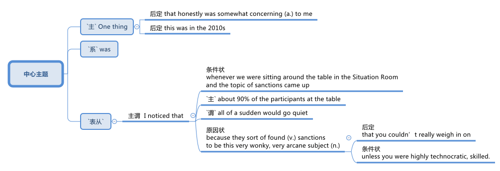
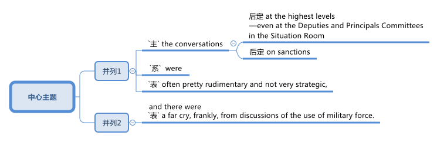

= 2024.02.28 U.S., China, and Economic Warfare A Conversation with Mr. Edward Fishman
:toc: left
:toclevels: 3
:sectnums:
:stylesheet: ../../../myAdocCss.css

'''

视频地址 +
https://www.youtube.com/watch?v=rW4ab8w6T_E&ab_channel=CenterforStrategic%26InternationalStudies

== 本文核心观点

image:../img/svg 004.svg[,100%]

== 释义

==== 主持人介绍与节目开场

I'm Bonnie Lyn, Director of the China Power Project and Senior Advisor 高级顾问 at the Center for Strategic International Studies.  +
In this episode of the China Power Podcast, we're exploring economic warfare (n.)战争，作战 and U.S. application 应用，实施 of it to China and other actors 参与者；行动者.  +
What tools does the United States have for economic warfare? How *have* they *been historically used* (v.), and against China? How did China respond?  +
To explore these questions, we're joined by Mr. Edward Fishman, the author of a new book titled _Choke （使）窒息 Points_: American Power in the Age of Economic Warfare.

==== 嘉宾介绍
Edward Fishman is a leading authority 权威 on economic statecraft 治国才能；管理国家的本领  and sanctions  制裁;处罚，惩罚.  +
He teaches at Columbia University's School of International and Public Affairs #and# is a Senior Research Scholar 高级研究学者 at the Center for Global Energy Policy.  +
He also *advises* (v.) companies *on* geopolitical strategy 地缘政治战略 #and# invests (v.) in early-stage technology startups 初创公司;创业公司.  +
Previously 以前地，先前地, he *served* at the U.S. State Department 国务院 *#as#* a member of the _Secretary of State_’s 国务卿 Policy Planning 政策规划 Staff 全体员工，全体雇员, at the Pentagon 五角大楼 #as# an advisor 顾问 to the Chairman of _the Joint Chiefs_ (领袖，首领) 参谋长联席会议 of Staff, and at the U.S. Treasury Department 财政部 #as# Special Assistant 特别助理 to the _Under Secretary_ 副秘书 for Terrorism  恐怖主义 and Financial Intelligence 财务情报.  +
His writing (n.) and analysis are regularly featured  (v.)担任主演; 是 (展览、杂志等) 的重要内容 by outlets 媒体；渠道 such as The New York Times, The Wall Street Journal, The Washington Post, Foreign Affairs, Politico 政客,政治家, and NPR 美国国家公共电台（=National Public Radio）.  +
He holds 持有 a _B.A._ 文学学士学位（=Bachelor of Arts） in History from Yale, an _M.Phil._ 哲学硕士（=Master of Philosophy）  in International Relations from Cambridge, and an MBA from Stanford.

"Eddie, thank you for joining me today."

"Thanks so much for having me on. I’m a big, big fan of China Power, so I’m glad to be on the podcast today."

"Thank you, it’s very kind 善良；友好 of you."

==== 书籍背景与写作动机
"So, your recent book, Choke Points: American Power in the Age of Economic Warfare, was a fantastic read 读物. I wanted to ask you: what motivated you to write the book, and what, from your perspective 观点；视角, are some of the main arguments 论点 you were making in it?"

"Sure. Maybe I’ll start with the second question #because# I think that’ll help me explain my motivation as well.  +
So, the premise 前提，假设 of the book, Bonnie, is that we are living in an age of economic warfare.  +
Sanctions, export controls have become the primary (a.)主要的，首要的 way that great powers compete (v.) with each other.  +
This has been the case now /(倒装) *for* what I would *argue* at least the last two decades —*really* in the years after 9/11 *is* when this reality came to the fore 前部，前面;前沿；显要位置.  +

[.my1]
.title
====
.Really _in the years after 9/11_ is /when this reality came to the fore.
这句话包含部分倒装，其正常语序是 : *This* `系` *is* `表语从句` when this reality really came to the fore in the years after 9/11. +
这里为了强调 “in the years after 9/11”，将其提前到句首，导致句子出现部分倒装（强调句型的一种）。

按照正常语序，句子可以改写为： +
*It was* really in the years after 9/11 *that* this reality came to the fore. +
这里实际上是一个强调句型，只是原句没有使用 It was ... that ... 这种明显的强调结构，而是用 is 直接引导 when 从句。
====

It wasn’t, I think, totally clear until maybe 10 years ago, and in the last decade, it’s just *taken off 起飞；迅速发展 to* new heights #as# the U.S. has deployed economic weapons #not just# against smaller economies #but also# against Russia and, of course, China."

"The reason I decided to write this book is `表从` there is just no general history of the age of economic warfare.  +
You know, I’ve oftentimes 时常地，经常地 had students in my classes at Columbia, reporters, government officials ask (v.) me, ‘If I want to learn about how we got here —how did we get #from# a place where global economic relations were considered win-win 双赢 in the ’90s and early 2000s #to# one where it’s very zero-sum (a.)零和的 between the great powers?’   +
I couldn’t really recommend (v.) anything to them #because# there’s no general history of what I call (v.) the age of economic warfare.  +
So, my first goal, Bonnie, was really to fill that gap —be able to provide a single-volume 单卷 book that I could recommend to everyone #from# students #to# fellow 同伴，同事 scholars #to# government officials."

"But beyond that, too, you know, I had a very personal experience where I worked in the U.S. government, working #on# these very same issues —#on# sanctions against Iran and Russia and China.  +
`主` #One thing# 后定 that honestly was `表` somewhat concerning (a.)令人担忧的 to me —this was in the 2010s — `系` #was# I noticed that #whenever# we were sitting around the table in the Situation Room 战情室 #and# the topic of sanctions *came up*  发生，出现;提出，想出, about 90% of the participants at the table all of a sudden would go quiet /#because# they sort of found (v.) sanctions *to be* this very wonky (a.)靠不住的；摇晃的，动摇的, very arcane  (a.)神秘的，晦涩难懂的;深奥的  subject (n.) #that# you couldn’t really *weigh in on* 发表意见;参与讨论，表态 #unless# you were highly technocratic (a.)由技术专家官员组成的; 受技术专家官员影响的, skilled.  +

As a result, `主` #the conversations# 对话 at the highest levels 最高级别,最高水平 —#even# at the Deputies 副手 and Principals Committees 主要委员会 in the Situation Room —on sanctions `系` #were# often pretty rudimentary (a.)基本的，初步的；不成熟的，未充分发展的 and not very strategic, and there were a *far cry* 相差甚远, frankly 坦白说, *from* discussions of the use of military force."

[.my1]
.title
====
- arcane -> 词根ark, 保护，隐藏，词源同单词ark, 方舟。
====

"What I realized is `表` a lot of people think (v.) sanctions are complicated, think (v.) that tariffs and export controls are overly complicated, and they don’t think that they can learn about them.  +
So, I really wanted to demystify (v.)使非神秘化；阐明；启发 how economic warfare works (v.) —to show #that# it actually isn’t that hard to understand, #that# you can *wrap your head around 理解，领会 it* 弄明白它 —#because# I think that *in order for* 为了达到某个结果或目的 the United States to actually use (v.) economic weapons effectively, the first step is really understanding.  +
And that’s #not just# amongst, you know, top-level policy officials #but also# students who are going to be tomorrow’s policy officials."

"Thank you so much, Eddie."

==== 经济战争的历史演变
"Maybe we can unpack (v.)打开包裹；分析；卸下 some of the changes that you’ve mentioned.  +
Maybe we can start with: how did we get to the place where, as you said, we’re now using a lot more economic tools? Obviously, your book covers a lot of ground 领域 —#both# changes in terms of 就……而言 capabilities acquired by the United States #as well as# the different tools —#but# maybe we can *walk through* 逐步讲解;详细演示或解释一个过程的步骤 what are the most important global changes first, #and then# we can go to the specific tools that the United States now has 后定 that the United States can use against what you mentioned, #either# smaller actors （行动或过程）参与者 #or# larger actors like China and Russia."

"Sure. Oftentimes, Bonnie, I’m asked, ‘Well, what makes (v.) this age different from previous ones, right? Haven’t we always seen sanctions and trade embargoes?’  +
And look, actually, as an undergraduate 本科生, I studied ancient history, and the earliest use of sanctions occurs (v.) in Thucydides 修西得底斯（古希腊历史学家）, right?  +
We know that during the Peloponnesian War 伯罗奔尼撒战争 —right on the eve 前夕，前一天；傍晚，黄昏 of the Peloponnesian War — `主` #Athens# 雅典, in the time of Pericles 伯里克利（古雅典政治家）, `谓` *#imposes#* (v.) a trade embargo *on* its neighbor, Megara 地名. So, obviously, economic warfare is *as old as* history."

"The thing that’s different about economic warfare today `系` is that for all those thousands of years —#from# the time of Pericles 伯里克利（古雅典政治家） #to# today — `主` using (v.) effective economic warfare `谓` really required the use of naval (a.)海军的，军舰的 force.  +
So, the reason that `主` Athens could impose (v.) such a dramatic trade embargo on Megara `系` was #because# they had the world’s greatest navy, #and# they could blockade (v.)包围，封锁（尤指港口） ports 港口.  +
The same was true with Imperial Britain 大英帝国 #and# their use of embargoes, #even# *all the way up to* 一直到 the 1990s, #when# the United States imposed (v.)强制推行，强制实行, with U.N. backing 支持, a wide-ranging embargo on Saddam Hussein’s Iraq.  +
That embargo was actually backed by a multinational  跨国的 naval force 后定 #that# was parked outside of Iraqi ports for 13 years, #from# 1990 #all the way up till# the 2003 invasion of Iraq.  +
So, `主` economic warfare throughout 遍及，到处；自始至终，贯穿整个时期 most of history `系`  was kind of *on the same spectrum 范围，幅度；光谱 of* 在相同的光谱上 the use of military force #because# it required the deployment 有效运用；部署，调动 of military resources to make it impactful 有效的；有力的."

"What changed —and you know, started to take off  起飞；迅速发展, I think, really in the 1970s #with# the breakdown 崩溃 of the Bretton Woods system 布雷顿森林体系 #and# the financialization 金融化 of the world economy, #but then# 然而接着 really accelerating (v.)加速 in the ’90s #with# the end of the Cold War #and# _the bringing in_ (n.)引入 of Russia and China into the global economic order —is that we got what people now call hyper-globalization 超级全球化, #where# you have just intensively 强烈地；集中地 integrated (a.)各部分密切协调的，综合的 supply chains #and# financial networks.  +
And `主` #what# these integrated supply chains and financial networks create (v.)  `系` #are# these choke points, #which# are *areas* in the world economy #*where*# (指前面的 areas) one state has a dominant 占支配地位的，占优势的 position, #and# `主` *there’s very little*, if any, *redundancy* —there’s basically no substitute  替代品，代替物."

[.my1]
.title
====
._the bringing in_ (n.) of Russia and China into the global economic order
这里的 "of" 并不是多余的，它是 bringing in 作为 "名词短语"（gerund phrase）时所需要的结构。

在这个句子里，"bringing in" 充当 名词（动名词），表示 "the act of bringing in"（引入的行为）。当动名词短语带有宾语时，我们通常需要用 "of" 连接宾语，类似于：

- "the arrival of the guests"（宾客的到来） +
- "the introduction of new policies"（新政策的引入） +
- "_the bringing in_ of reforms"（改革的引入）
====

"So, `主` the classic case 实例 of this `系` is the U.S. dollar, where #if# you really want to conduct (v.)实施，进行 business in the world economy, you need access (v.) to the dollar.  +
`主` #Something# I put in the book, #which# I *stand by* 继续支持 (尤指处于困境者);坚持 (原有的决定、承诺或声明), `系` #is#, you know, `主` trying to do international business #without# access to the dollar `系` *is kind of like* trying to travel (v.) the world #without# access to a passport —it’s just not possible.  +
And there are other choke points, including some of the tools #that# *go into* 涉及 making (v.) advanced 先进的；高级的 semiconductors 半导体, parts of energy supply chains 能源供应链.  +
So, *it’s `表` #not just#* the dollar, *#but# `主` that `系` was* the critical development.  +
It was this unprecedented 前所未有的，史无前例的 economic interdependence 互相依赖 后定① #that# really *takes off* 起飞；迅速发展 in the ’70s #but then# gets to new heights in the ’90s /后定② #that# enables (v.) this sort of new form of economic warfare, #where# you don’t actually need (v.) naval power to make embargoes and sanctions impactful."

==== 美国经济武器的具体工具
"And your book really writes (v.) about how, during this time, the United States was the main beneficiary 受益者，受惠人 of this hyper-globalization.  +
So, you mentioned the U.S. dollar, you mentioned the importance of U.S. technology.  +
As you *look at* the U.S. building up this influence, your book also details (v.) the various ways (n.) 后定 #that# both Treasury 财政部 and Commerce 商务部 *came up with* 提出了，出台了 or *drew on* 利用，借鉴 existing tools and authorities  权限.  +
Could you *walk (v.) us through* some of these tools and authorities #and# how have they been used (v.), #particularly# in the last two decades?"

"So, you know, `主` #the# most impactful weapon that the United States has (v.) *at its disposal* (去掉；清除；处理) *可支配的；可利用的；可运用的* `系` #is# what’s called blocking sanctions 封锁式制裁.  +
This is #when# `主` the Treasury Department’s Office of Foreign Assets Control 外国资产控制 `谓` *cuts off* a foreign company *from* access to the dollar.  +
It means that *they’re fully cut (v.) off (被动句)被切断 from* all transactions 交易，买卖，业务, #as well as# `主` *any assets* 后定 that they have under U.S. jurisdiction, `谓` *are frozen*.  +
`主` #This type# of penalty 惩罚 —_blocking sanctions_ on any business 后定 that wants to conduct (v.) cross-border commerce 跨境贸易 -- `系` #is# really, really, really problematic (a.)成问题的，有困难的, and for banks, it can actually be existential 关乎存在的."

"So, I think `主` #the first very important development# that we see —kind of in the 2000s, and it’s really pioneered (v.)倡导；作先驱 by a person named Stuart Levey, who’s the Treasury Department’s first Under Secretary for Terrorism and Financial Intelligence — `系` #is# he *winds up using* 最终使用 blocking sanctions *to cut off Iran from* the international financial system.  +
At the time, in the sort of 有点儿 mid-2000s —the first decade of the 21st century —there were doubts 怀疑 that Iran could be sanctioned (v.)对……实施制裁，处罚 any more than it was.  +
The U.S. had  a full trade embargo on Iran for a decade 十年，十年期, and so even George W. Bush, the president at the time, was skeptical (a.)不相信的，持怀疑态度的 that more pressure could be deployed #because# you also didn’t *have* (v.)让,使,使得 the U.N. *supporting* (v.) 使联合国来支持 dramatic sanctions on Iran."

[.my1]
.案例
====
.*have* the U.N. *supporting* (v.) dramatic sanctions on Iran
have 这里是 使役动词，表示 "让/使/使得" 的意思。 +
*have  sb. doing* :  这种结构表示 "让某人/某物正在做某事"。 +
the U.N. 是 "宾语"，supporting dramatic sanctions on Iran 作为 "宾补"，说明 the U.N. 处于支持制裁的状态。

让联合国支持对伊朗实施严厉制裁。

chatGPT:
[.my3]
[options="autowidth" cols="1a,1a"]
|===
|Have sb. done（使某人被……） |Have sb. doing（让某人一直做某事）

|have + sb. + done（过去分词） +
表示 让某事被动地发生在某人身上，通常指“让某人受到某种影响”或“让某事被处理”。

1.表示**请别人做某事**（相当于 get sb. to do sth.） +
- I had my hair cut yesterday.（我昨天剪了头发。） +
- She had her car repaired.（她让人修了她的车。） +

2.表示**某人经历了某种情况（通常是不好的事情）** +
- He had his wallet stolen.（他的钱包被偷了。）

|have + sb. + doing（现在分词） +
**让某人处于某种持续状态，**通常强调**持续影响**。 可能表示 "*不情愿地让某人做某事*" 或 "*主动导致某人做某事*"。 +
- The movie had me laughing the whole time.（这部电影让我一直笑个不停。） +
- The teacher had the students writing essays all morning.（老师让学生们写了一上午的作文。） +
- She had me waiting for hours!（她让我等了好几个小时！）

|===

====

"What Levey 人名 realized `系` was that #using# the threat of blocking sanctions, #coupled with# 加上，连同 direct diplomacy (n.)外交，外交技巧；（处理人际关系的）手腕，策略 with bank executives 高管；主管 across the world —#which#, by the way, he was able to get access to these banking executives /#because# `主` his boss at Treasury, Hank Paulson, `系` had been the CEO of Goldman Sachs /*#and so#* 因此、所以 was able to open a lot of doors for Levey —Levey basically came to, you know, the C-suites高管套房 of everyone from banks in London to Singapore to Dubai to Frankfurt /#and# brought them declassified (a.)解密的 intelligence #showing# how Iran was ① using their banks  ② #and# manipulating (v.) the U.S. financial system ① to fund (v.) its nuclear program ② #and# funnel (v.)通过漏斗，穿过狭窄通道；输送，传送（金钱、货物或信息） money to its terrorist proxies 代理；代理人 in Hamas 哈马斯,伊斯兰抵抗运动 and Hezbollah （黎巴嫩）真主党."

"And many of these bank CEOs just decided, ‘Look, this is not worth it for me. I don’t want the reputational (a.)声誉的 hazard (n.)危险，危害 of potentially *being linked to* Iran’s nuclear program.’  +
So, a lot of the banks *just* sort of, of their own volition 意志，意志力；决断力, *decided* (v.) to cut ties with Iran, *even though* legally they were not required to.  +
And then, with the stragglers (落伍的士兵；离群的动物) 和掉队的人在一起, Bonnie, he was able to leverage (v.)充分利用（资源、观点等） this threat of blocking sanctions —leverage (v.)充分利用 continued (a.) access (n.) to the U.S. dollar and the invisible infrastructure 基础设施 of global finance —to basically pressure (v.) them #or# coerce (v.) them to stop doing business with Iran.  +
And this oftentimes *is known as* secondary sanctions 二级制裁, when you’re #not just# applying sanctions on a target like Iran /#but also# its business partners, whether *that’s*, again, *banks* anywhere from China to Turkey to Europe. And *it winds up 以…告终（或终结） proving (v.)证明是* devastatingly 毁灭性地 effective."

[.my1]
.案例
====
- volition -> 来自拉丁语volō("wish, will").
====

"Could you also talk about some of the tools 后定 that your book mentions (v.) `主` that Commerce `谓` now has?"

"Definitely 当然. So, the Commerce Department has always had a range of 一系列 export controls that it has deployed, and these often have taken a backseat (后座；次要位置) 退居次要地位  to sanctions, especially since the end of the Cold War.  +
But `主` what happens during the first Trump administration `系` is that, almost by accident, they realized that `主` Commerce’s export controls `谓` can be a really, really impactful tool in a targeted (a.)定向的；被定为攻击目标的 way, similar to the way 后定 blocking sanctions work (v.)."

And *what winds up happening is*, basically, Wilbur Ross, the only Commerce Secretary 商务部长 of the first Trump administration —when he comes into office, the first thing he does is `表` he signs (v.) this legal settlement （解决争端的）协议，和解 with ZTE, you know, China’s number two 第二位的  telecom equipment maker.  +
ZTE had been caught (v.) violating (v.) American sanctions and _export controls_ 出口管制 on Iran.  +
This had been a legal case 法律案件 that spanned (v.) back to the Obama administration, and *just sort of by happenstance* 偶然事件，巧合; 只是一种偶然, *it was*, like, *right ready to be signed* —the final settlement —on his desk /when he got to his office in March of 2017.

[.my2]
碰巧的是，2017年3月，当他来到办公室的时候，这份协议已经准备好要签署了——最后的和解协议放在了他的办公桌上。

"And *lo and behold* 真沒想到, about a year later, it became very clear that ZTE was wildly 野蛮地；狂暴地；失控地 violating (v.) the terms of the settlement.  +
Even #executives# 高管 后定 that *they (指中国政府) had said that* they (指中兴的高官) would censure (v.)严厉批评，正式谴责 `谓` #were given# 多汁的；丰厚的 bonuses 奖金 and, in some cases, promoted 提升.

[.my2]
就连他们曾经说过要谴责的高管, 也得到了丰厚的奖金，在某些情况下还得到了晋升。

And Wilbur Ross was very angry  about this. He basically felt (v.) that, you know, the U.S. was being made a sucker 被愚弄;易受骗的人 by ZTE.  +
And so, he *came down on* 对……采取严厉措施;批评或惩罚（某人） ZTE very hard 严厉地 in April of 2018 with what’s called a denial order 拒绝令.  +
And this is basically #the closest thing# 最接近的东西 the Commerce Department 商务部 has #to blocking sanctions#.  +
Commerce 商务部 Obviously doesn’t regulate (v.)监管 finance 金融, so it doesn’t *have anything to do with* 与……有关，与……有联系 financial transactions (交易，买卖，业务) 金融交易, but it bans (v.)禁止 all U.S. companies  from exporting (v.) anything to ZTE .

[.my1]
.案例
====
.lo and behold
something that you say when you tell someone about something surprising that happened
真沒想到 +
- I was in Vienna sitting quietly in a café when, *lo and behold*, my cousin walked in.
我靜靜地坐在維也納一間咖啡館裡喝著咖啡，真沒想到，我的表弟走了進來。
====

And honestly, by surprise 出乎意料地, within weeks 在几周内, ZTE  was on the brink 边缘 of shutting its entire business down 关闭整个业务.  +
And this was, like, a big light bulb 灯泡 moment 一个重要的顿悟时刻 for a lot of the China hawks 中国鹰派 in the Trump administration /because they realized, ‘Hold on a second 等一下 —by *cutting off* a major  Chinese company *from*, you know, Qualcomm chips 高通芯片 or, you know, Google’s Android operating system 操作系统, `主` doing things like that `谓` could be just *as effective 同样有效 as* cutting off  a foreign bank  from the dollar.’  +
And so, this was sort of 有点 an ‘aha’ moment 一个‘啊哈’时刻 for the Trump administration  /that it could use (v.) frontier technology 前沿技术—it *could use* the stuff 东西 that Silicon Valley makes (v.) -- 来作为 *as* a choke point 瓶颈 /*in the same way 同样方式 that* `主` it `谓` *used* (v.) Wall Street  and U.S. banks  *as* a choke point.

==== 对中国的经济战争应用
"This is a good transition 过渡 to discuss  how economic warfare was applied 应用 against China. So, your book covers (v.)  a number of efforts from the first Trump administration.  +
Could you walk us through 逐步讲解 what you saw as the most significant 显著的 economic warfare actions?"

"Sure. So, look, during the first Trump term 任期, `主` #a lot of the focus# 焦点 at the very top 最高层 —in terms of 就……而言；从……角度来看 Trump himself — `系` #was# on the trade war.  +
It was imposing (v.) tariffs 关税 on China, and in that respect 在这方面, Bob Lighthizer, the U.S. Trade Representative 美国贸易代表, was very much  in the driver’s seat (驾驶员座椅) 掌控局面.  +
But if you look at how Lighthizer justified (v.)证明……的合理性 the tariffs 关税 and his Section 301 investigation (301条款调查) against China that concluded (v.)得出结论 in 2018, it was all about how China was undermining (v.)破坏 American technological progress 美国技术进步 —by stealing 窃取 intellectual property 知识产权, by forcing 强迫 U.S. companies  to give up 放弃 sort of crown jewel 皇冠上的珠宝 technologies 顶尖技术 in exchange for 换取 access 进入；使用权 to the Chinese market 市场."

And at the same time, a group   of officials   at the NSC 国家安全委员会（=National Security Council）, led (v.) by   Matt Pottinger but including  people like Ivan Kanapathy —who’s actually now in the job 职位 that Pottinger was in during the first Trump administration ; he’s now the Senior Director 资深总监 for Asia 亚洲事务高级主任 at the NSC 国家安全委员会—these folks 这些人 were really worried  about what China was doing on the technological front 技术前沿.  +
And the poster 海报 child 典型代表;代表性人物 for that was Huawei.

Now, Huawei was the number one telecom equipment maker 电信设备制造商 in China and, you know, was really a world-class 世界级的 company. You know, they had come to really dominate (v.)主导 the global telecom market 全球电信市场, and in 5G in particular —which is the next generation of telecoms 电信 that was coming online 上线 right then 当时 in the late 2010s—was basically running the table 横扫一切.  +
And its big competitors 主要竞争对手, Nokia and Ericsson 爱立信, were just, you know, light-years 光年 behind it 远远落后 and not really winning (v.) any of the major contracts 主要合同.

And so, `主` what people 后定 like Pottinger worried (v.) about `系` was that /if China—and Huawei in particular 尤其 —was successfully wiring (v.)装电线 the world 连接世界, and that its telecom equipment 电信设备 was, you know, everywhere 无处不在 from Europe  to Africa  to Asia , that ultimately 最终 China would obtain (v.) access 进入；使用权 to a choke point 瓶颈 *on par with* 与……水平相当 the dollar —that, you know, China could leverage (v.)利用 that type  of economic control  for *an incredible 难以置信的 sort of 某种 type  of power*  around the world 全世界.  +
`主` The way that they phrased (v.)用言语表达 it  `系` was that it could be a ‘kill switch’ ‘致命开关’—that basically 基本上 China could turn off 关闭 telecom networks 电信网络 whenever they so pleased 只要他们高兴,只要他们愿意.

And so, `主` #what# they tried to do  —and this really spanned 跨越 #from# H.R. McMaster as the National Security Adviser 国家安全顾问 #to# John Bolton, #all the way to# 一直到 the time  when Robert O’Brien comes in 上任— `系` #was# they really tried just to convince (v.)说服 U.S. allies 盟友 that Huawei was a threat  #and# not to buy  equipment  from Huawei.  +
And there was a lot of pressure  that they put on 施加在 the British government, on the German government. But *lo and behold* 真沒想到，你瞧,看哪, really, this argument 论点 just didn’t work 没有奏效.

[.my1]
.案例
====
- lo and behold : 我們經常用它來感嘆, 或者引出一件事情**讓人出乎意料的部分**，相當於我們常說的 「真想不到」。
====

There were only a few 少数 governments 政府—particularly 尤其 the Australians 澳大利亚人和 the New Zealanders 新西兰人—who agreed 同意 to ban 禁止 Huawei, sort of 有点 of their own volition 自愿地, but the Europeans 欧洲人 kind of 有点 dove headlong into 一头扎进 this relationship 关系 with Huawei.

And so, `主` what the Trump folks 特朗普团队 realized `系` was that they would have to use economic pressure on Huawei and Huawei’s business partners 商业伙伴 *for them* to actually succeed (v.) in stopping (v.) Huawei’s march 前进 to 5G dominance 主导地位;优势，支配地位.  +
`主` The first thing they tried to do in 2019 `系` was just add (v.) Huawei to the Entity List 实体清单, and that was similar to what the penalty 惩罚 that had been imposed (v.)强加 on ZTE —a little bit 稍微 more mild 温和 *in that* 因为；由于；就在于 there was a license 许可, you know, the ability  to potentially 可能地，潜在地 get a license.  +
And that looked like 看起来 it had worked 奏效 for a little while 一段时间, but very quickly, U.S. companies started to find  workarounds 应变方法；变通方法;解决方法.

In some ways 在某些方面, there were some perverse (a.)反常的;乖戾地; 有悖常理地 incentives 动机 because `主` #the way# 方法 export controls work (v.)运作 `系` #is# it only impacts (v.) direct exports (n.) from the U.S.  to Huawei.  +
So, if a U.S. company had a subsidiary 子公司 in Vietnam 越南 and was shipping (v.) something to Huawei from that subsidiary 子公司, that was allowed.  +
So, in some ways 在某些方面, it perversely 反常地 incentivized (v.)激励 U.S. companies  to offshore (v.)转移到海外 more production 生产.

`主` What they *came upon* 发现;遭遇，碰到, though, in 2020 `系`  was a real innovation 创新 in economic warfare .
They created something called the Foreign Direct Product Rule 外国直接产品规则, which was sort of 有点 like the equivalent 等价物 of secondary sanctions 二级制裁 but for export controls.  +
And what it said 规定 was that `表` if you were a foreign manufacturer 制造商 producing (v.) something like a semiconductor 半导体 for Huawei, you could not use (v.) U.S. equipment to make that semiconductor.

"So, all of a sudden 突然, TSMC 台积电（=Taiwan Semiconductor Manufacturing Company） —who’s making (v.) all the semiconductors for Huawei at the time 当时; I think Huawei was the second biggest customer for TSMC behind Apple —the choice that TSMC  had was #either# 或者 they could stop (v.) doing business with Huawei, #or# they could *rip out* 拆除 all of the U.S. software and equipment that was powering (v.)驱动 their foundries 工厂,铸造车间.  +
And of course, they’re reliant (a.)依赖的 on things like Applied Materials 应用材料公司 and Lam Research 拉姆研究公司 and other very important  U.S. companies.  +
And ultimately 最终, this worked 奏效, and TSMC very importantly cuts (v.) ties with Huawei in 2020, and many, many other leading 领先的 global semiconductor makers (n.) do (v.) the same."

`主` What was so interesting in your account 叙述 of this in your book `系` was `主` how much of _what the United States did_ `系` was very much unilateral 单边的 —driven by 由……驱动 the United States /and against *#what#* many of our allies 盟友 and partners, *both* at the government level *and* their respective 各自的 companies, *#wanted to do#*.  +

[.my2]
====
您在书中对这件事的叙述中所展现出来的有趣之处在于，美国所采取的诸多行动, 在很大程度上是由美国单方面主导的，而且与我们许多盟友和伙伴（无论是在政府层面, 还是在各自的公司层面）所期望的行动, 背道而驰。 +

你在书中对此的描述中最有趣的部分是，美国所做的事情, 究竟有多少是完全单方面的——这些行动由美国推动，并且违背了我们许多盟友和合作伙伴（无论是政府层面还是他们的公司）所希望采取的方向。
====

[.my1]
.案例
====
- 这个句子整体来看，核心结构是 "What was so interesting ... was how much ... was ..."，是典型的 强调“某事很有趣”的表达方式。
- and against *what* many of our allies and partners...*wanted to do*（并且违背了我们的盟友和合作伙伴（无论是政府层面还是他们的公司）想要做的事情）
====

And that goes back to 返回 what you were talking about earlier —how this is so different  now from, *compared to*  100 or 200 years ago, in which `主` any type of economic embargo  `谓` required  a large coalition 大联盟 of countries  in addition to 除了 what you mentioned, naval power.  +
Do you still think that, *having* now *gone through* 经历 5 years since 2020, that many of these tools can still be used (v.) unilaterally 单边地 to achieve (v.) similar  effect?

"Yes, I do. I think that `主` the real question you have to ask `系` is: at what cost 以什么代价, right?  +
Could the U.S. use (v.) ① even more aggressive 更激进的 versions 版本 of the FDPR 外国直接产品规则  ② and, critically 关键地, things like secondary sanctions 二级制裁 to isolate (v.) China’s technology sector  行业 even more?  +
Without question 毫无疑问 —because ultimately 最终, if you are forcing 强迫 banks and companies around the world between the U.S. and Huawei, most of the time, they’re going to choose (v.)  the U.S..  +
It becomes a little harder 变得有点困难 if you’re making them choose (v.) between the U.S. and the China market, right —if it’s sort of 有点 at a national level 国家层面, and we can talk about that —but if it’*s* just *based on* one Chinese company, *I do think that* the U.S. could do this."

[.my2]
毫无疑问——因为从根本上说，如果要让世界各地的银行和企业（比如美国和华为之间）做出选择，大多数时候他们会选择美国。如果要让他们在"美中之间的市场"做出选择的话（比如在国家层面），那就有点难了——我们可以就此展开讨论——但如果只是基于一家中国公司的话，我认为美国是能够做到这一点的。

I think the problem, though, Bonnie, is again: at what cost 以什么代价?  +
And I think `主` the cost 代价 that *you wind up 最终导致 seeing* during the Trump administration `系` is they wind up 最终导致 isolating (v.) themselves from much of the world.  +
There’s this scene 场景 that I decided  to end (v.) the section 部分 of my book on Trump’s first-term China policy 特朗普第一任期的中国政策 on, where, at the very end 在最后 of his administration, when basically 基本上 Trump, who had kind of 有点 vacillated (v.)犹豫不决，摇摆不定 *between* being tough (a.)强硬 on China *and* being very obsequious (a.)谄媚的；奉承的；顺从的 towards Xi Jinping —finally   decides (v.) it’s time  to be very tough 非常强硬 /#because# he kind of 有点 blames (v.)责怪 China for the COVID pandemic 新冠疫情 #and# blames (v.) China for him losing reelection 连任失败 in 2020.

[.my1]
.案例
====
- vacillate -> 来自拉丁语 vacillare,摇摆，犹豫，来自 PIE*weng,弯，转，摇晃，词源同 wink,winch.
- obsequious -> 来自拉丁语obsequium,顺从，履行服务职责，来自ob-,向前，朝向，-sequi,跟随，词源同sequence.原为跟班，跟随，后引申词义巴结的，讨好的。
====

The kind of 有点 *gloves 手套 come off* 毫不留情;撕破脸皮. They effectively 有效地 try to sanction (v.)制裁 everything 一切 in China —you know, that’s when they try to ban 禁止 TikTok for the first time, they impose 强加 export controls on SMIC 中芯国际, you know, they do all kinds of things. DJI 大疆, the big drone company 无人机公司 in China, *gets hit* 受到打击;被打中 with export controls.

"During this time 在这期间 is when the Europeans 欧洲人 sign (v.)签署 the Comprehensive Agreement on Investment 全面投资协定—this landmark 里程碑式的 investment agreement with China.  +
To me 对我来说, that was a poignant (a.)令人沉痛的；悲惨的 sort of 某种 symbol 象征 because, as 当...时  the U.S. is kind of  *swinging (v.)（挥动某物）朝…打去 wildly 疯狂地攻击 at* China, you see the Europeans 欧洲人—who are signing 签署 a big economic agreement 经济协定 with the Chinese 中国人.

[.my1]
.案例
====
.poignant
-> 来自古法语poignant,锋利的，尖锐的，来自拉丁语pungere,刺，词源同pugnacious,point.

.swing
(v.) *~ (sth) (at sb/sth)* : to try to hit sb/sth （挥动某物）朝…打去 +
[ V] +
•She swung at me with the iron bar.她挥着铁棍朝我打来。

====

And so, I think that the costs 代价 of Trump’s approach 方法, #even though# 尽管 they worked (v.)奏效 against Huawei, *I would argue, was that* it isolated (v.) the U.S. #and#, in many ways , encouraged (v.) other countries  *to hedge (v.) against* 对冲;采取保护措施（尤指为避免损失金钱） the United States  #and# *to* sort of  *cozy (v.a.)亲密无间的；密切的 up to* 献殷勤；取悦;亲近 Beijing."

"So, I think that the answer 答案 is, you know, some people  say , ‘Oh, well, export controls and sanctions  could never  work (v.) against China.’ I think they could work.  +
`主` The reason that international coalitions 国际联盟 and allies 盟友 are important `系`  is really to maintain 维持 legitimacy 合法性 #and# *to lower (v.) the risk  of* unintended consequences 意外后果 and spillovers 溢出效应."

==== 中国对美国经济压力的回应
"And in the first Trump administration, #in addition to# 除了 China *reaching out 接触 more to* U.S. allies 美国盟友, partners , including  Europe , #what other measures#  did you see  the Chinese government  take 采取 in terms of 在……方面 responding —*whether* it’s to U.S. pressure  against ZTE  *or* Huawei?"

"So, China really takes 采取 a two-track 双轨 approach 方法. And #one of them#  is a track that I think (v.) *winds up* 最终导致 emulating (v.)模仿 a lot of  the U.S. playbook 剧本,策略, #and another#  that’s more innovative 更具创新性的."

"So, the track 轨道 that emulates 模仿 the U.S. playbook 美国策略 is, right around 就在……附近 the ZTE penalty 中兴惩罚—so in 2018—China starts (v.)  laying the legal groundwork 奠定法律基础 for its own  economic arsenal 经济武库.  +
So, you know, China *has long 长期地 used* 使用 economic coercion 经济胁迫, of course , but throughout 在……期间 most of history and through 通过 certainly modern history , it has done so 这样做 in kind of 有点 an informal 非正式的 way 方法—you know, where _all of a sudden_ 突然 Chinese tourists 中国游客 just stop (v.)停止 showing up 出现 in South Korea 韩国, or _all of a sudden_ 突然, you know, _rare earth_ 稀土 exports 稀土出口 to Japan 日本 just, you know, *slow (v.) to* a trickle 减少到涓涓细流 after the Senkaku incident 尖阁事件 in 2010.  +
But this was much, much less impactful 影响小得多, *much less* institutionalized (v.)使成为惯例；制度化; 制度化程度低 *than* the U.S. economic arsenal 美国经济武库 that we discussed 讨论 being led 由……领导 out of Treasury 财政部 and Commerce 商务部."

"What Xi Jinping does , starting  in 2018, is he starts (v.) building  that legal framework 法律框架. You see  the creation of _an Unreliable Entity List_ 不可靠实体清单, which is kind of 有点 a mirror image 镜像 of the U.S. _Specially Designated Nationals list_ 美国特别指定国民清单—it’s a way  for China to impose 强加 targeted (a.)有针对性的 sanctions  on foreign companies.  +
You see  _an Export Control Law_ 出口管制法 that China has now *wound up* 使用；最终导致 using to ban 禁止 things like _rare earth mineral_ exports 稀土矿物出口 to the United States —with gallium 镓, germanium 锗, and most recently 最近 tungsten 钨, just a couple weeks ago, in response to Trump’s 10% tariffs on Chinese exports.  +
And you also see _an Anti-Foreign Sanctions Law_ 反外国制裁法 that China *puts in place* 实施;安置好，放置好，落实好. And so, you really see China building out 扩展 its offensive 进攻性的 capabilities, and I think those are going to be very relevant 非常相关 in the years to come 在未来几年—especially if Trump does continue (v.) with sort of 某种 a trade and technology war against China."

`主` #The other thing#  that China does *in the wake of* 在……之后；随着……发生 the 2018 ZTE episode 中兴事件—and I think this one is more novel 新颖的, and in some ways 在某些方面 the U.S. *winds up* 最终导致 emulating 模仿 — `系` #is# they start building up 建立 their defensive fortifications 防御工事 against U.S. economic warfare.  +
And they start (v.) mapping out 规划 the choke points 瓶颈 in the global economy to try to understand  #not only#  where 后定 _they have leverage_ (n.影响力，手段；杠杆力) 他们有影响力 #but#, arguably 可论证地，按理;可以说 even more importantly, where 后定 they’re vulnerable 他们是脆弱的 to U.S. and foreign 外国的 coercion 胁迫."

"And what Xi Jinping does is he does things like 像……这样的事 the Dual Circulation Policy 双循环政策, where he tries to insulate 隔离 China from being vulnerable 脆弱 to U.S. sanctions 美国制裁 and export controls, and using things like industrial policy 产业政策 and subsidies 补贴—not just for sort of 某种 economic and mercantilism aims 经济和重商主义目标, but also for national security aims 国家安全目标—and to try to basically 基本上 wean off 逐渐摆脱 China from dependence 依赖 on the U.S.."

"You also see, in the financial arena 金融领域, things like the launching 推出 of the digital renminbi 数字人民币—you know, which today 今天 is by far 迄今为止 the most advanced 先进的 central bank digital currency 中央银行数字货币—and then, most recently 最近, China created 创建 mBridge, which is a way 方法 for cross-border payments 跨境支付 to be cleared 清算 without needing 不需要 the U.S. dollar or access 进入；使用权 to correspondent bank accounts 代理银行账户 in New York 纽约. And this is really important 非常重要 because, in the event 万一 that China is eventually 最终 cut off 切断—Chinese banks 中国银行 are cut off 切断—from that invisible 无形的 infrastructure 基础设施 of global finance 全球金融, projects 项目 like mBridge could allow 允许 Chinese trade 中国贸易 to continue 继续 unimpeded 不受阻碍地."

==== 公司在美国经济战中的角色
"And Eddie, how much 多少 do U.S. efforts 美国努力—either restrict 限制 or sanction 制裁 China—require 需要 cooperation 合作 from Companies, and to what extent 在多大程度上 were Companies willing 愿意 to do so 这样做?"

"That’s a great question, Bonnie. Companies are on the front lines 在前线 in the age of economic warfare .  +
So, I think this is something that’s often misunderstood 被误解 about how sanctions 制裁 and export controls work 运作—you know, the policies 政策 are set 设定 by officials  in Washington, but they’re actually implemented 实施 by Companies.  +
And a key 关键的 reason—and frankly 坦白说, I’d say the primary 主要的 reason—that U.S. financial sanctions 美国金融制裁 have become so potent 有力的 in recent decades 近几十年 is because the U.S. Treasury Department 美国财政部 and Justice Department 司法部 have successfully 成功地 conscripted 征召 banks to be very effective 有效的 frontline infantry 前线步兵."

"And the way 方法 they did this was incentivizing 激励 them through 通过 penalties 惩罚. Basically 基本上, when there have been very egregious 极其恶劣的 sanctions violations 制裁违规, banks have faced 面临 really significant 显著的 fines 罚款. Classically 经典地, in 2012, HSBC 汇丰—the largest bank 最大的银行 in the U.K. 英国—was fined 罚款 $2 billion 20亿美元 for an array 一系列 of sanctions violations 制裁违规. And in 2014, BNP Paribas 法国巴黎银行—the French bank 法国银行—was fined 罚款 $9 billion 90亿美元 for sanctions violations 制裁违规. And in that case 在那种情况下, BNP Paribas 法国巴黎银行, which is, you know, one of the most important 最重要的 Companies in France 法国, had their entire profit 全部利润 for the entire year 全年 wiped out 抹去 by this single 单一的 fine 罚款 for sanctions violations 制裁违规. And so, when you have fines 罚款 that are that large 那么大, banks have to take 采取 U.S. sanctions 美国制裁 and export controls seriously 认真地."

"So, the short answer 简短的回答 to your question is: Companies play 扮演 a critical 关键的 role 角色. The longer answer 更长的回答 is: during the Trump administration, as I mentioned—and what they were doing against China—they’re really weaponizing (v.)武器化 U.S. technology companies  against China.  +
They’re not so much 不太 focused 集中 on financial warfare because, at the time 当时, Steven Mnuchin, the Treasury Secretary 财政部长, was pretty 相当 dovish 鸽派的 on China—wasn’t in favor of 不赞成 a tough 强硬的 policy 政策. So, what does that mean 那意味着什么? It means 意味着 that instead of 而不是 having banks on the front line 前线, you have Companies like Micron 美光, the memory chip maker 存储芯片制造商, or Nvidia 英伟达 on the front line 前线 of U.S. economic warfare 美国经济战争. You even have Companies like ASML 阿斯麦 in the Netherlands 荷兰 who are on the front line 前线, and TSMC 台积电, as I mentioned before 之前."

"And these Companies don’t have the same track record 同样的记录 of really substantial 实质性的 fines 罚款 by the U.S. government 美国政府. On the flip side 另一方面, many of them 他们中的许多 depend 依赖 on access 进入；使用权 to the China market 中国市场 for a big part 很大一部分 of their revenue 收入. And so, it’s a much harder 更困难 call 判断 for some of these CEOs 首席执行官 to decide 决定, you know, ‘How religiously 严格地 do I have to comply with 遵守 American export control laws 美国出口管制法律?’"

"I think there’s this great 很棒的 kind of 某种 story 故事 in my book in which the CEO 首席执行官 of Micron 美光 actually plays 扮演 a big role 重要角色 in the development 发展 of some of these export controls because he advocates 倡导 to Wilbur Ross, the Commerce Secretary 商务部长, for export controls on a Chinese competitor 中国竞争对手 called Fujian Jinhua 福建晋华—because Fujian Jinhua 福建晋华 basically 基本上 stole 窃取 intellectual property 知识产权 from Micron 美光. And he succeeds 成功—the U.S. does impose 强加 export controls on Fujian Jinhua 福建晋华, and Fujian Jinhua 福建晋华 winds up 最终导致 going out of business 破产. But then, after the U.S. imposes 强加 the same types 同样类型的 of export controls on Huawei the next year 下一年, Micron’s CEO 美光的首席执行官 comes back 返回 to D.C. 华盛顿 and is actually lobbying 游说 in the opposite direction 相反的方向 and saying 说, ‘You should lift 解除 export controls on Huawei.’ And the reason he’s doing that 是因为 is because Micron 美光 depends 依赖 on Huawei for a big part 很大一部分 of its revenue 收入—it’s, I think, one of their biggest 最大的, if not their largest 最大的, customer 客户 at the time 当时."

"You realize 意识到 it’s a double-edged sword 双刃剑 for these U.S. tech companies 美国科技公司. Even as of this recording 在这次录音时 in 2025, tech companies 科技公司, industrial companies 工业公司—they’re just not as on board 同意 with enforcement 执行 and implementation 实施 of U.S. sanctions 美国制裁 and export controls as banks are. And I think, for them to get to that point 达到那个地步, you’re going to need 需要 to see really steep 严厉的 fines 罚款 that show 显示 them the costs 代价 of violating 违反 American policy 美国政策. I think that’s probably 大概 a recommendation 建议 you might have for the Trump administration 特朗普政府—to develop 制定 fines 罚款 for tech companies 科技公司—but I think we’ll cover 涵盖 that near the very end 在最后附近."

==== 拜登政府对俄罗斯的经济策略
"Before that 在那之前, though, I do want to get 获得 your insights 见解 on how the economic approach 经济方法 the Biden administration 拜登政府 took 采取 against Russia 俄罗斯—how has that really changed 改变 the U.S. way 方法 of economic warfare ? So, for example 例如, did you see any new 新颖的 tools being used 使用 by the Biden administration 拜登政府 against Russia 俄罗斯 after its invasion 入侵 of Ukraine 乌克兰 in 2022, or did you see existing 现有的 tools being used 使用 in different ways 方法?"

"Yeah, so I’ll give you sort of 某种 a two-part 两部分的 answer 回答 to that. Before we get into 进入 the specific 具体的 tools, I think it’s important 重要的 to talk about 讨论 objectives 目标. What President Biden 拜登总统 wanted to do 想做 with respect to 关于 Russia 俄罗斯 was he wanted to use the threat 威胁 of severe 严重的 economic pain 经济痛苦 to deter 威慑 Putin 普京 from invading 入侵 Ukraine 乌克兰 in the first place 首先. So, whereas 而 whereas Trump kind of 有点 used 使用 export controls and tariffs 关税 against China to try to structurally 结构性改变 change 改变 the U.S. economic relationship 美国经济关系 with China—to try to degrade 削弱 China’s military-industrial complex 中国的军事工业综合体—Biden 拜登 initially 最初 holds 保留 those penalties 惩罚 in reserve 储备 and says 说 they will come into force 生效 only if 只有如果 you invade 入侵 Ukraine 乌克兰. And the idea 想法 was to try to give 给 Putin 普京 an off-ramp 退路—to say 说, ‘Well, if you don’t invade 入侵 Ukraine 乌克兰, you can still buy 购买 chips 芯片 from the United States 美国, you can still have access 进入；使用权 to the U.S. financial system 美国金融体系.’ So, this is a deterrent strategy 威慑策略—very, very different 非常非常不同 from the attritional strategy 消耗策略 that Trump takes 采取 against China."

"And I think the reason we’re able to even try 尝试 that strategy 策略 against Russia 俄罗斯 was because the U.S. intelligence community 美国情报界 successfully 成功地 projects 预测 that Putin 普京 is going to invade 入侵 Ukraine 乌克兰 five months 五个月 before the invasion 入侵 happens 发生. So, the U.S. government 美国政府 has time 时间—months 数月—to plan 计划 sanctions 制裁, to negotiate 谈判 them with allies 盟友, and, critically 关键地, to message 传递信息 at very high levels 非常高级别 that Russia 俄罗斯 will face 面临 swift 迅速的 and severe 严重的 consequences 后果 if it invades 入侵 Ukraine 乌克兰."

"Lo and behold 看哪, Bonnie, Russia 俄罗斯 invades 入侵 Ukraine 乌克兰 anyway 无论如何. So, the deterrent threat 威慑威胁 fails 失败. So, I think in the very first instance 在第一情况下, the initial 最初的 strategy 策略 against Russia 俄罗斯 does not work 没有奏效, and it’s very important 非常重要 to probe 探究 why 为什么—I’m happy 高兴 to go into 深入 that—but before that 在那之前, I want to get to 到达 answering 回答 the other part 另一部分 of your question, which is: what are the novel 新颖的 tools?"

"So, when deterrence 威慑 fails 失败, Biden 拜登 and the G7 leaders G7领导人 are on the hook 必须承担责任 to deliver 交付 on this threat 威胁 of swift 迅速的 and severe 严重的 consequences 后果. Basically 基本上, what they do 做 is they take 采取, you know, the greatest hits 最成功的部分 from the Iran sanctions 伊朗制裁, from the Russia sanctions 俄罗斯制裁 of 2014 after the Crimea annexation 克里米亚吞并 after 之后, and even 甚至 the FDPR 外国直接产品规则 against Huawei, and they repurpose 重新利用 them for use against Russia 俄罗斯. So, you see something 某事 kind of 有点 like a combined-arms 联合武器的 economic warfare —you know, where you’re attacking 攻击 Russia 俄罗斯 from various angles 从各个角度. You’re freezing 冻结 its central bank reserves 中央银行储备, you’re blocking 阻止 its banks from access 进入；使用权 to the SWIFT network SWIFT网络, you are imposing 强加 an FDPR 外国直接产品规则 on the entire 整个 Russian economy 俄罗斯经济 such that 以至于 no Russian company 俄罗斯公司 can import 进口 advanced semiconductors 先进的半导体."

"The big gap 大的空白, though, is that they don’t include 包括 really any significant 显著的 sanctions 制裁 on Russia’s oil sales 俄罗斯石油销售. And the reason for that 是因为 is because, at the time 当时, inflation 通货膨胀’s at a 40-year high 40年高点, oil prices 油价 are going up 上升, gasoline prices 汽油价格 in the U.S. are high 高, and there’s a real 真正的 concern 担忧 by the Biden administration 拜登政府 that if oil prices 油价 spike 激增 and inflation 通货膨胀 continues 继续 to spike 激增, that political support 政治支持 for Ukraine 乌克兰 will evaporate 消失. And so, they played 采取 very cautiously 非常谨慎地 with Russian oil 俄罗斯石油. And I think, in retrospect 回顾起来, that winds up 最终导致 being kind of 有点 a fatal flaw 致命缺陷 to the strategy 策略 because a lot of 许多 the other sanctions 其他制裁 that they impose 强加 wind up 最终导致 being undermined 削弱 by the fact 事实 that, in the first year 第一年 of the war 战争, Russia 俄罗斯 collects 收取 about $220 billion 大约2200亿美元 just from selling 出售 oil 石油 around the world 全世界—which is the largest amount 最大数量 of export revenue 出口收入 they’ve ever 曾经 generated 生成 from selling 出售 oil 石油."

"So, that’s a big gap 大的空白 in the sanctions 制裁. So, I think a key 关键的 learning 经验教训 that we have 是 is that when you’re deploying 部署 economic warfare against another 另一个 great power 大国 like Russia 俄罗斯, there’s always going to be trade-offs 权衡. You’re going to face 面临 probably 大概 some significant 显著的 economic pain 经济痛苦 at home 在国内 and potentially 可能地 political consequences 政治后果. But it’s really hard 真的很难 to have it both ways 两全其美, and trying to 试图 have it both ways 两全其美 sometimes 有时 gets you 给你带来 with none of what you want 你想要的都没有."

==== 经济战的威慑与消耗策略对比
"For this podcast 播客, we probably don’t have time to delve into 深入探讨 the details of what the Biden administration took 采取 against Russia, but at the strategic level 在战略层面, from your perspective 从你的观点来看—given that 鉴于 you outlined 概述 that he used a deterrent strategy 威慑策略 against Russia versus 与……相对 what Trump had intended, which is what you characterize 定性 as an attritional strategy 消耗策略 against China —do you see broadly 您是否认为从广义而言 that economic warfare could be just as effective as a deterrent 威慑 versus 与……相对 for attritional uses 消耗用途?"

"I think it’s very hard to use economic warfare as a deterrent 威慑. I think attrition 消耗 is much easier because, in some ways 在某些方面, if there’s anything that my entire story shows, it’s that U.S. economic weapons 美国经济武器 do create 创造 very significant 显著的 effects 效果 around the world 全世界. And the U.S. has the power 力量—just by signing 签署 documents 文件 in the OFAC director’s office 主任办公室 or in the BIS director’s office —you have the power to impose really significant 显著的 economic pain on foreign companies, on entire countries."

"What’s harder 更困难 is translating 转化 that pain 痛苦 into policy change 政策改变. So, with attrition 消耗, you’re really just trying to 试图 create 创造 economic effects 经济效果, and so we’re pretty 相当 good at that 擅长那个. With deterrence 威慑, you’re trying to 试图 use the threat 威胁 of that pain 痛苦—or maybe 也许 the threat 威胁 of intensifying 加强 pain 痛苦—to change 改变 a foreign leader’s mind 外国领导人的想法. And that’s always really hard 真的很难."

"And in the case 在……情况下 of Putin 普京, you know, there are some people 一些人 who say 说 that Putin 普京 could have never 从未 been deterred 威慑, and the only way 唯一的方法 to deter 威慑 him would have been a credible 可信的 military threat 军事威胁—which the U.S. Obviously was not going to do 不会做 because we don’t want to fight 打仗 a war 战争 with Russia 俄罗斯, which could escalate 升级 to nuclear holocaust 核浩劫. But there’s actually evidence 证据, Bonnie, that Putin 普京 underestimated 低估 how severe 严重的 U.S. sanctions 美国制裁 would be 将会是. The best evidence 最好的证据 of that 是 is that, in the first weekend 第一周末 of the war 战争, the U.S. and the G7 G7 freeze 冻结 Russia’s central bank reserves 俄罗斯的中央银行储备—and that’s, you know, a giant pile 巨大的一堆 of which those reserves 储备—over half of them 超过一半—are denominated 标价 in G7 currencies G7货币. And so, clearly 显然, Putin 普京 didn’t think 认为 that the full 全部 G7 G7 was going to go directly 直接地 after 针对 his central bank 中央银行, or he wouldn’t have left 不会留下, you know, hundreds of billions of dollars 数千亿美元 vulnerable 脆弱的 to U.S. and EU 欧盟 and Japanese sanctions 日本制裁."

"So, you have to ask yourself 你必须问自己: why 为什么 did Putin 普京 underestimate 低估 us 我们? Maybe 也许 it was because he thought 认为 we were democracies 民主国家 and democracies 民主国家 don’t have the stomach 没有胃口 to take 承受 economic pain 经济痛苦. Maybe 也许 he, you know, had thought 认为 that we were feckless 无能的 because he looked at 看到 what happened 发生 after the Crimea annexation 克里米亚吞并, and he saw 看到 that while 虽然 he faced 面临 sanctions 制裁 for about a year 大约一年, pressure 压力 petered off 逐渐减弱 and then really 真的 collapsed 崩溃 during the first Trump administration 特朗普第一届政府. It’s hard to say 很难说."

"But I think that what the evidence 证据 shows 显示 is that we’re very good at 擅长 imposing 强加 economic pain 经济痛苦, but sometimes 有时 foreign leaders 外国领导人 misjudge 误判 how willing 愿意 we are actually to impose 强加 that pain 痛苦, and as a result 结果, deterrence 威慑 breaks down 崩溃."

"I think it’s a very important 重要的 distinction 区别 that you make 提出 between a deterrent strategy 威慑策略 versus 与……相对 an attritional strategy 消耗策略 because, similar 相似 to how you characterize 定性 the Biden approach 拜登方法 towards Russia 俄罗斯, we had a lot of 许多 exploration 探索 at the end 结束 of the Biden administration 拜登政府 of whether 是否 economic pain 经济痛苦 could be used 使用 to deter 威慑 China from engaging in 从事 potential 潜在的 adventurism 冒险主义 in the future 未来. And I just wanted to get 获得 your thoughts 想法 on that, too. Do you think 认为 the logic 逻辑 that you described 描述 for Russia 俄罗斯—and I think it was broader 更广泛 than just Russia 俄罗斯—do you think 认为 that also applies 适用 to China? So, for example 例如, if we do see the Trump team 特朗普团队 wanting to use economic pain 经济痛苦 to potentially 可能地 deter 威慑 China from—whether it’s adventurism 冒险主义 against Taiwan 台湾, South China 南中国, or elsewhere 其他地方—that it wouldn’t be that successful 不会那么成功 compared to 与……相比 an attritional strategy 消耗策略?"

"Yeah, I think that if the goal is to deter 威慑 China from invading 入侵 or quarantining 隔离 Taiwan 台湾, I think the first and foremost 首要的 thing 事情 you need to do 需要做 is get military deterrence 军事威慑 right 正确—because I think that that is going to ultimately 最终 play a preponderant 占主导地位的 factor 因素 over 在……之上 the threat 威胁 of sanctions 制裁. But I do think 认为 that economic statecraft 治国才能；管理国家的本领 does play 扮演 a big role 重要角色—but not in the way 方法 that is ordinarily 通常 assumed 假设."

Because I think that `主` #my own view# 观点, looking at 看到 the situation today, `系` #is that# /if you’re Xi Jinping /and you’re assessing (v.)评估 the fact that `主` the U.S. and the Chinese economies  `谓` remain (v.) very interdependent (a.)非常相互依赖的 —we still have around 大约 $600 billion in bilateral trade 双边贸易 —so, you know, their decoupling (n.)脱钩, in some ways 在某些方面, has not happened (v.) nearly *as much as* 几乎不像 people in Washington  seem (v.) to think it has —if you’re Xi Jinping /and you’re thinking 考虑, ‘Well, if I do make a play 采取行动 on Taiwan, how likely 可能 is the U.S. to respond? How likely 可能 is the U.S. to respond 回应 with military force 军事力量, with dramatic 戏剧性的 economic sanctions 经济制裁?’ I’m thinking to myself 我自己在想 probably 大概 the same thing 同样的事情 Putin 普京 was thinking to himself 自己在想 in January and February of 2022, which is: ‘I don’t think 认为 the U.S. has the stomach 没有胃口 to actually respond 回应 aggressively 激进地.’

"Because the type 种类 of response 回应 that would be required 需要, I think, to either 或者 fight a war 打仗 with China or fight a full-on 全面的 economic war 经济战争 with China would cost 花费 Americans 美国人 a lot 很多. It would almost certainly 几乎肯定 raise 提高 prices 价格, create 创造 inflation 通货膨胀—it could send 发送 us 我们 into a significant 显著的 recession 衰退. And so, if anything 如果有的话, I think the economic dependence 经济依赖 that persists 持续 between the U.S. and China could embolden 使……大胆 Xi Jinping because it’s very easy 很容易 to see Xi 习近平 making the same calculus 计算 Putin 普京 did 做 and assuming 假设 that, you know, the democratic 民主的 United States 美国 just won’t have 不会有, basically 基本上, the tolerance 容忍 for the type 种类 of economic blowback 经济反拨 that a confrontation 对抗 with China would have 会有."

"And so, my own view 观点 is that the best thing 最好的东西 we can do 我们能做 is really focus 集中 on the defensive 防御性的 side 方面 of economic warfare . What can we do 我们能做什么 to insulate 隔离 ourselves 我们自己 from the shock 冲击 of potentially 可能地 a very significant 显著的 decoupling 脱钩? And I think the recipe 方案 for that 是 is, in my view 在我看来, a combination 结合 of industrial strategy 产业战略—you know, investing 投资 in manufacturing 制造业 at home 在国内, our own resources 我们自己的资源—but even more importantly 更重要的是, tightening 加强 our bonds 联系 with our allies 盟友—having, you know, economic agreements 经济协定 that focus 集中 on critical 关键的 supply chains 供应链 with our North American neighbors 北美邻国 like Canada 加拿大 and Mexico 墨西哥, with the European Union 欧盟, with our allies 盟友 in the Indo-Pacific 印太地区."

"It’s what Janet Yellen 珍妮特·耶伦 called 称为 ‘friend-shoring’ ‘友岸外包’, and it’s, frankly 坦白说, what Bob Lighthizer recommended 推荐 in a recent New York Times 《纽约时报》 op-ed 专栏文章, where he said 说 that the U.S. should form 形成 a bloc 集团 of democratic countries 民主国家 that have very low 非常低的 tariffs 关税 amongst each other 彼此之间 but that have high 高的 tariffs 关税 with China and other adversaries 对手. So, I think that’s the recipe 方案 for success 成功 if we’re looking at 考虑 how to prepare 准备 for a potential 潜在的 economic and potentially 可能地 military confrontation 军事对抗 with China."

==== 特朗普第二任期的经济战略展望
"Do you think 认为 that is where the Trump administration 特朗普政府 is going vis-à-vis 关于 China in terms of 在……方面 economic statecraft 治国才能；管理国家的本领 ?"

"So, I think we often 经常 forget 忘记 the history of the first Trump administration 特朗普第一届政府 because, so far 到目前为止, what I’ve seen 看到 in the second Trump administration 特朗普第二届政府—even though 尽管 we’re only a month or so 在一个月左右 in—is it looks 看起来 a lot like 很像 the first 第一, where, you know, there’s actually not a very clear 非常清楚的 direction 方向 given 给出 from the top 最高层. In the first Trump administration 特朗普第一届政府, depending on 取决于 the day of the week 星期几, Trump was either 要么 the biggest 最大的 China hawk 中国鹰派 in Washington 华盛顿 or 或 Xi Jinping’s best friend 习近平最好的朋友—you know, sharing 分享 the most beautiful 最美丽的 piece of chocolate cake 巧克力蛋糕 that Xi Jinping had ever tried 曾经尝试 with Trump at Mar-a-Lago 马阿拉戈 and having 有 Ivanka Trump’s kids 伊万卡·特朗普的孩子 sing 唱 Chinese folk songs 中国民歌 to Xi 习近平 and his wife 妻子."

"Trump, I think, vacillates 摇摆 between these two perspectives 观点. And what we saw 看到 during the first administration 第一届政府 is it allowed 允许 sort of 某种 different factions 不同派系 within 在……内部 the administration 政府 to fight it out 争斗到底. And when Trump was feeling 感觉 in a more hawkish 更鹰派的 frame of mind 心态, people like Matt Pottinger 马特·波廷格 and Bob Lighthizer 鲍勃·莱特希泽 were able to get 获得 their policies 政策 across the finish line 到达终点线. When he was feeling 感觉 in a more dovish 更鸽派的 frame of mind 心态, folks 人们 like Steven Mnuchin 史蒂文·姆努钦—who wanted 想要 a more cautious 更谨慎的 approach 方法 with China—their views 观点 carried the day 占上风."

"I think that’s what we’re going to see this time around 这次. And you’ve already 已经 seen 看到 some of that 那的一些 with respect to 关于 ByteDance 字节跳动 and TikTok 抖音国际版—the fact 事实 that Trump, who had initially 最初 tried to ban 禁止 TikTok 抖音国际版 in his first administration 第一届政府, is now resisting 抵制 the law 法律—the law of the United States 美国的法律—that says 说 that TikTok 抖音国际版 should be banned 应该被禁止. So, we have to see where the winds blow 风向何处 and whether 是否 Trump is more in a hawkish 鹰派的 frame of mind 心态, more in a dovish 鸽派的 frame of mind 心态 on balance 总体上 over the next few years 未来几年."

"The thing 事情 that does worry 担忧 me 我, though, Bonnie—relating to 关于 our last question 上一个问题 about, you know, what the U.S. needs to do 需要做 to prepare 准备 for a potential 潜在的 conflict 冲突 with China—I do think 认为 that tighter 更紧密的 relationships 关系 with allies 盟友 for supply chains 供应链, for other economic reasons 其他经济原因, is very important 非常重要. I’m concerned 担忧 by the fact 事实 that, right out of the gate 一开始 in his second term 第二任期, Trump seems to 似乎 have focused 集中 America’s economic weapons 美国的经济武器 just as much 同样多, if not more 如果不是更多, on our friends 朋友 than he has on our adversaries 对手—you know, the fact 事实 that he came very close 非常接近 to imposing 强加 25% tariffs 25%关税 on Canada 加拿大 and Mexico 墨西哥, that he’s basically 基本上 said 说 that he’ll certainly 肯定 impose 强加 tariffs 关税 on the European Union 欧盟 at some point 在某个时候, he threatened 威胁 very significant 显著的 tariffs 关税 and sanctions 制裁 against Colombia 哥伦比亚."

"So, #I’m worried (v.) that# Trump will discount 忽视 the importance  of working with 与……合作 allies 盟友 #and that# we may be forced 被迫 into a situation  where the U.S. has to confront 对抗 China alone 单独, and we’re basically  striving for 努力追求 some impossible  vision 愿景 of autarky 自给自足 that’ll #both#  make us poorer 使我们更穷 #and# make it more likely 更可能 that we’ll have to fight (v.) a war ."

I guess *that’s still TBD* 有待确定（=to be decided 或 to be determined）, right?  +
It’s possible  that the Trump administration  can *impose* 强加 even higher  tariffs  *on* China moving forward —so, relatively 相对地, there will be lower  tariffs  on our allies 盟友 and partners  #and# higher 较高的 on China —but again, as you said, we’re only a month in 才一个月, so there’s still a lot to be seen (v.) there.

"That’s right. I totally  agree .  +
And I think that that was the trajectory 轨迹 of the first Trump administration —and that really  vacillated 摇摆 back and forth 来回.  +
And I didn’t even mention 甚至没有提到, but, you know, the ZTE  export controls that I talked about earlier —Trump *winds up* 最终导致 pulling back 撤回 a month later /after Xi Jinping asks 请求 him.  +
So, you know, Trump is a mercurial (a.)反复无常的;墨丘利神的；雄辩机智的；活泼善变的 figure 人物—he changes 指 his mind 改变主意 a lot.  +
But by the end of the first Trump administration, he was extremely  hawkish 鹰派的 on China /because this was in the wake of 在……之后 COVID 新冠."

"So, I think we have to see (v.) what happens  in the broader 更广泛的 bilateral relationship 双边关系. Certainly, the people around Trump right now 现在—like Mike Waltz 迈克·沃尔兹 and Marco Rubio 马可·卢比奥—have very hawkish 非常鹰派的 credentials (n.)资历 on China.  +
So, you would expect 期待 things —#not just# in the trade arena /#but#, critically 关键地, in the technology arena —export controls, sanctions 制裁—to, if anything, *be ratcheted （防止倒转的）棘轮，棘齿 up* 加强.  +
But, you know, Trump is the decision-maker 决策者, and we’ll really have to see (v.) how he specifically 具体地 guides (v.) his administration  in the coming months."

==== 中国当前的防御能力与美国的杠杆
"So, one last question for you, Eddie—and that goes back to what you were talking about earlier in terms of the different ways China is both emulating 模仿；效仿 the United States but also shielding 保护；庇护 itself and building up a defensive fortification 防御工事；防御措施. So, as you look at China now, do you think that China has largely shielded 保护；庇护 itself from potential 潜在的；可能的 U.S. pressure on a range of choke points 扼制点, or do you think we still have significant leverage 影响力；杠杆作用 in terms of using economic statecraft 治国才能；管理国家的本领 against China—whether it’s for an attritional 消耗战的 strategy 战略；策略 or for a deterrent 威慑的 strategy 战略；策略?"

"I think we still have a tremendous 巨大的；极大的 amount of leverage 影响力；杠杆作用—particularly 特别是；尤其是在 the financial space 金融领域. In my book, Choke Points, you know, a lot of the narrative 叙述；记叙 is about financial warfare 金融战—how the U.S. has weaponized 将…武器化 the invisible infrastructure 看不见的基础设施 of international finance 国际金融, how it’s weaponized 将…武器化 the dollar. These have been kind of the key tools that have been used against Iran and Russia. So far, there really haven’t been any significant 显著的；重要的 financial sanctions 制裁 imposed 实施；推行 on China—there have been some, but very, very, very mild 温和的；轻微的."

"So, sort of in a very basic sense, if you wanted to do things like really crack down on 严厉打击；镇压 the tech sector 技术部门, starting to threaten the imposition 实施；推行 of secondary financial sanctions 制裁 would be, you know, a major sort of order of magnitude 数量级 stronger than the current restrictions 限制；约束 that are in place. But even if we’re talking about export controls—of course, there’s a lot more that could be done. I think that, at the very end of the Biden administration, that AI Diffusion Rule 人工智能扩散规则—you know, that was, I think, a big step in the direction of a much harsher 严厉的；残酷的 regime 制度；政权 that would really prevent 阻止；防止 equipment 设备 from going to China and even countries that are working with China."

"But I think we’re yet to see where Trump goes. But the idea that somehow China has now fully sanction-proofed 使免受制裁影响 its economy—it’s not true. They’re certainly a lot better protected now than they were in 2017, 2018, but they’re still vulnerable 脆弱的；易受攻击的."

"I think one of the bigger differences, though, between now and 2018 is that these offensive 进攻性的；攻击性的 capabilities；才能 that I mentioned before—like the Unreliable Entity List 不可靠实体清单, like the Anti-Foreign Sanctions Law 反外国制裁法—they’re now sort of locked and loaded 准备就绪的；准备妥当的 and ready to go. And we already saw that China will retaliate 报复；反击 against U.S. tariffs 关税—not just by imposing 实施；推行 its own tariffs 关税 but also responding asymmetrically 不对称地 by doing things like opening antimonopoly 反垄断 investigations 调查 into U.S. tech companies like Google and Nvidia and putting U.S. companies on the Unreliable Entity List 不可靠实体清单—like they’ve done for Albemarle and PVH."

"So, I think that we are likely to see China retaliate 报复；反击—not just through tariffs 关税 but also through things like export controls, sanctions 制裁, and, you know, regulatory 监管的 investigations 调查."

==== 结束语
"Perfect. Thank you, Eddie, for such a wide-ranging 广泛的；全面的 and comprehensive 全面的；综合性的 conversation—describing not only the economic tools the United States has used, the evolution 演变；进化 of U.S. capability 能力；才能, but also the specific ways that we’ve used these tools—China and Russia. Really appreciate 欣赏；感激 you joining me today."

"Bonnie, thanks so much. This has been a fun conversation, and I feel like we could talk for a full other hour."

'''

== 翻译参考

==== 主持人介绍与节目开场

我是邦妮·林，战略与国际研究中心, 中国力量项目主任兼高级顾问。在本期《中国力量播客》中，我们将探讨经济战争, 以及美国对中国和其他参与者的应用。美国在经济战争中拥有哪些工具？这些工具在历史上是如何使用的，特别是针对中国？中国又是如何回应的？为了探讨这些问题，我们邀请了爱德华·菲什曼先生，他是一本新书《瓶颈：经济战争时代中的美国力量》的作者。

==== 嘉宾介绍

爱德华·菲什曼是"经济治国术"和"制裁领域"的领先权威。他在"哥伦比亚大学国际与公共事务学院"任教，并且是"全球能源政策中心"的高级研究学者。他还为公司提供"地缘政治战略"建议，并投资于初创科技公司。此前，他在美国国务院担任"国务卿政策规划团队"的成员，在五角大楼担任"参谋长联席会议主席"的顾问，以及在美国财政部担任"恐怖主义与金融情报副部长"的特别助理。他的写作和分析定期被《纽约时报》、《华尔街日报》、《华盛顿邮报》、《外交事务》、《政治家》和全国公共广播电台等媒体特写。他拥有耶鲁大学历史学士学位、剑桥大学国际关系硕士学位, 以及斯坦福大学工商管理硕士学位。

“埃迪，感谢你今天加入我。”

“非常感谢邀请我。我是"中国力量"的超级粉丝，所以很高兴今天能参加这个播客。”

“谢谢，你真是太友好了。”

==== 书籍背景与写作动机

“所以，你最近的书《瓶颈：经济战争时代中的美国力量》是一次极好的阅读。我想问你：是什么激励你写这本书的？从你的观点来看，你在书中提出的一些主要论点是什么？”

“当然。也许我会先回答第二个问题，因为我觉得这也能帮助我解释我的动机。邦妮，这本书的前提是**我们正生活在"经济战争"的时代。制裁和出口管制, 已经成为大国相互竞争的主要方式。**我认为这种情况至少在过去二十年中都是如此——尤其是在9/11之后的几年，这一现实变得显而易见。我觉得直到大约十年前，这一点还没有完全清楚，而在过去十年中，随着美国不仅对较小的经济体，还对俄罗斯，当然还有中国部署经济武器，这一现象迅速发展到了新的高度。”

“我决定写这本书的原因是，目前还没有关于"经济战争时代"的一般历史。你知道，我在哥伦比亚大学的课堂上, 经常有学生、记者和政府官员问我：‘如果我想了解我们是如何走到这一步的——*我们是如何从90年代和2000年代初, 全球经济关系被认为是"双赢"的局面，变成现在大国之间非常"零和"的局面的？*’我无法真正向他们推荐任何东西，因为没有我所称的"经济战争时代"的一般历史(通史)。所以，邦妮，我的首要目标真的是填补这个空白——能够提供一本单卷的书，我可以推荐给从学生到同行学者, 再到政府官员的每一个人。”

“除此之外，你知道，我还有一段非常个人的经历，我在美国政府工作，处理这些同样的问题——对伊朗、俄罗斯和中国的制裁。老实说，在2010年代，有一件事让我有些担忧，我注意到**##每当我们在"白宫战情室"围着桌子坐下来, 讨论制裁这个话题时，大约90%的参与者会突然变得安静(沉默)，因为他们觉得制裁是一个非常复杂、非常深奥的主题，除非你是高度技术官僚的、有技能的人，否则你无法真正发表意见。因此，即使在情况室最高级别的副手和主要委员会中，关于制裁的对话, 也往往相当初步, 且不具战略性，##坦白说，与使用军事力量的讨论相差甚远。**”

“**我意识到很多人认为"制裁"很复杂，认为"关税"和"出口管制"过于复杂，**他们觉得自己无法学习这些。*所以，我真的很想解开"经济战争"运作的神秘面纱——表明它实际上并不难理解，你可以弄明白它*——因为我认为，为了让美国实际上能有效地使用经济武器，第一步真的是"理解它"。这不仅仅是在最高级别的政策官员中，而且也在将成为未来政策官员的学生中。”

“非常感谢你，埃迪。”

==== 经济战争的历史演变

也许我们可以拆解一些你提到的变化。我们可以从哪里开始：正如你所说，我们是如何走到现在使用更多经济工具的地步的？显然，你的书涵盖了很多领域——包括美国获得的能力变化, 以及不同的工具——但也许我们可以先逐步讲解, 最重要的全球变化是什么，然后再讨论美国现在拥有的具体工具，这些工具可以用来对付你提到的较小的参与者, 或像中国和俄罗斯这样的较大参与者。

“当然。邦妮，经常有人问我，‘嗯，这个时代与以前的时代有什么不同，对吧？我们不是一直都有制裁和贸易禁运吗？’实际上，作为一名本科生，我学习过古代历史，最早使用"制裁"的记录, 出现在修昔底德的作品中，对吗？我们知道，在"伯罗奔尼撒战争"前夕，伯里克利时代的雅典, 对其邻居麦加拉实施了"贸易禁运"。所以，显然，经济战争与历史一样古老。”

“今天经济战争的不同之处在于，从伯里克利时代到今天这几千年来，**使用有效的经济战争, 确实需要海军力量。所以，雅典能够对麦加拉实施如此戏剧性的贸易禁运的原因, 是他们拥有世界上最强大的海军，可以封锁港口。**大英帝国使用禁运也是如此，甚至一直到1990年代，**美国在联合国支持下对萨达姆·侯赛因的伊拉克实施了广泛的禁运。**那次禁运实际上由一支多国海军力量支持，这支力量停泊在伊拉克港口外，从1990年一直持续到2003年入侵伊拉克。*所以，在历史的绝大部分中，"经济战争"有点像是与使用军事力量在同一光谱上，因为它需要部署军事资源来使其具有影响力。*”

“变化发生在——你知道，我认为真正起飞是在1970年代，随着布雷顿森林体系的崩溃, 和世界经济的金融化，但在90年代随着冷战的结束, 以及俄罗斯和中国被引入全球经济秩序，这一变化真正加速——我们得到了人们现在称之为**"超全球化"的东西，你有密集整合的供应链和金融网络。这些整合的供应链和金融网络, 创造了瓶颈(关键节点)，即在世界经济中，一个国家在其中占据主导地位，几乎没有冗余——基本上没有替代品。**”

所以，这方面的**经典案例是美元，**如果你真的想在世界经济中进行商业活动，你需要使用美元。我在书中提到并坚持的一点是，**试图在没有美元的情况下进行国际商业, 有点像试图在没有护照的情况下环游世界——这根本不可能。还有其他的瓶颈，包括制造先进半导体的一些工具，**能源供应链的部分。所以，不仅仅是美元，但这是关键的发展。正是这种在70年代起飞, 并在90年代达到新高度的前所未有的**"经济相互依赖"，使这种新形式的"经济战争"成为可能**，在这种形式中，你实际上不需要海军力量来使"禁运"和"制裁"具有影响力。

==== 美国经济武器的具体工具

“你的书详细描述了在这一时期，美国是如何成为超全球化的主要受益者的。你提到了美元，提到了美国技术的重要性。当你看到美国建立这种影响时，你的书还详述了财政部和商务部提出或利用现有工具和权限的各种方式。你能逐步讲解一些这些工具和权限，以及它们在过去二十年中是如何使用的吗？”

所以，你知道，**美国可支配的最有影响力的武器, 是被称为"封锁制裁"的东西。这是**财政部"外国资产控制办公室"**切断一家外国公司对美元的使用权。这意味着它们完全被切断所有交易，以及它们在美国管辖权下的任何资产被冻结。这种惩罚——封锁制裁——对于任何想进行跨境商业的商业来说, 真的是非常有问题的，对于银行来说，它实际上可能是关乎生死存在的。**

“我认为我们看到的第一个非常重要的发展——有点在2000年代，真正由一位名叫斯图尔特·利维的人开创，他是财政部首位"恐怖主义与金融情报"副部长——是他最终**使用封锁制裁, 切断了伊朗与国际金融体系的联系。**当时，在2000年代中期——21世纪的第一个十年——人们怀疑伊朗还能否再被制裁。美国已经对伊朗实施了十年的全面贸易禁运，所以即使是当时的总统乔治·W·布什, 也怀疑是否还能施加更多压力，因为联合国也没有支持对伊朗实施戏剧性的制裁。”

利维意识到的是，使用"封锁制裁"的威胁，连同与全世界银行高管的直接外交——顺便说一下，他能够接触到这些银行高管, 是因为他在财政部的老板汉克·保尔森, 曾是高盛的首席执行官，因此为利维开了很多门——利维基本上走进了从伦敦到新加坡、迪拜到法兰克福的银行高管套房，给他们带来了解密的情报，显示伊朗如何利用他们的银行, 并操纵美国金融体系来资助其核计划，并将资金输送给其在哈马斯和真主党的恐怖主义代理人。

“许多**这些银行首席执行官**只是决定，‘看，这对我来说不值得。**我不想冒可能与伊朗核计划联系起来的声誉风险。’所以，很多银行有点自愿地决定与伊朗切断联系，**尽管法律上并不要求它们这样做。

然后，对于那些落后的，邦妮，他**能够利用"封锁制裁"的威胁——利用对美元和全球金融无形基础设施的持续使用权——基本上迫使或强迫他们停止与伊朗做生意。这经常被称为"二级制裁"，当你不仅对像伊朗这样的目标实施制裁，还对其商业伙伴实施制裁**，无论是从中国到土耳其到欧洲的银行。这最终证明是毁灭性地有效的。”

“你还能否谈谈, 你的书中提到的商务部现在拥有的一些工具？”

“当然。所以，商务部一直有一系列它部署的出口管制，这些通常在冷战结束以来, 退居制裁的次要地位。但在特朗普第一届政府期间发生的事情是，他们几乎是偶然地意识到，*商务部的"出口管制"可以以一种有针对性的方式, 成为一个非常有影响力的工具，类似于"封锁制裁"的运作方式。*”

“最终发生的是，基本上，威尔伯·罗斯，特朗普第一届政府唯一的商务部长——当他上任时，他做的第一件事, 是签署了与中兴的法律和解，你知道，中兴是中国第二大电信设备制造商。**中兴被抓到违反了对伊朗的美国制裁和出口管制。**这是一个跨越到奥巴马政府的法律案件，只是偶然地，当他在2017年3月上任时，最终和解已经准备好在他的办公桌上签署。”

“看哪，大约一年后，非常清楚的是，**中兴疯狂地违反了和解条款。**甚至他们说要责难的高管被给予了丰厚的奖金，在某些情况下还被提升。**威尔伯·罗斯对此非常生气。**他基本上觉得，你知道，**美国被中兴愚弄了。**所以，他在2018年4月对中兴采取了非常严厉的措施，*发布了一个所谓的拒绝令。这基本上是商务部最接近"封锁制裁"的东西。商务部显然不监管金融，所以与金融交易无关，但它禁止所有美国公司向中兴出口任何东西。*”

“诚实地，出乎意料地，**在几周内，中兴就处于关闭整个业务的边缘。**这就像是特朗普政府中**许多中国鹰派的一个重要顿悟时刻，因为他们意识到，‘等一下——通过切断一家主要中国公司与高通芯片或谷歌安卓操作系统的联系，做这样的事情可能与切断一家外国银行与美元的联系, 同样有效。’**所以，这有点是特朗普政府的一个‘啊哈’时刻，他们可以使用前沿技术——可以使用硅谷制造的东西——作为瓶颈(卡脖子)，就像使用华尔街和美国银行作为瓶颈一样。”

==== 对中国的经济战争应用

“这是一个很好的过渡，让我们来讨论"经济战争"是如何应用于中国的。所以，你的书涵盖了特朗普第一届政府的多项努力。你能逐步讲解一下你认为最重要的"经济战争行动"是什么吗？”

“当然。所以，看，在特朗普第一任期内，最高层的很多焦点——就特朗普本人而言——集中在"贸易战"上。是对中国强加关税，在这方面，美国贸易代表鲍勃·莱特希泽非常掌控局面。但如果你看看莱特希泽如何证明关税的合理性, 以及他在2018年得出的**对中国301条款调查结论，一切都是关于中国如何破坏美国技术进步——通过窃取知识产权，强迫美国公司放弃顶尖技术, 以换取进入中国市场的使用权。**”

“与此同时，国家安全委员会的一组官员，由马特·波廷格领导，但包括像伊万·卡纳帕蒂这样的人——他实际上现在担任特朗普第一届政府期间波廷格的职位；他现在是"国家安全委员会"的亚洲事务高级主任——这些人都非常担忧中国在技术前沿的作为。而这方面的典型代表是华为。”

“现在，**华为**是中国第一大电信设备制造商，你知道，真是一家世界级的公司。他们**已经真正主导了全球电信市场，尤其在5G领域**——那是2010年代末, 上线的下一代电信——基本上横扫一切。*它的大竞争对手诺基亚和爱立信则远远落后，实际上没有赢得任何主要合同。*”

“所以，像波廷格这样的人担忧的是，**如果中国——尤其是华为——成功地连接世界，并且其电信设备无处不在，**从欧洲到非洲到亚洲，*最终中国将获得一个与美元相当的瓶颈(成为能卡脖子的核心节点)*——你知道，**中国可以利用这种经济控制, 在全世界获得难以置信的某种力量。**他们表达的方式是，*这可能是一个‘致命开关’——基本上中国可以随时关闭电信网络，只要他们愿意。*”

“所以，他们试图做的——这真的跨越了从国家安全顾问H.R.麦克马斯特, 到约翰·博尔顿，一直到罗伯特·奥布赖恩上任的时间——**他们真的试图说服美国盟友, 华为是一个威胁，不要购买华为的设备。**他们对英国政府、德国政府施加了很多压力。但看哪，真的，这个论点没有奏效。**只有少数政府——特别是澳大利亚人和新西兰人——同意禁止华为，**有点是自愿的，*但欧洲人有点一头扎进了与华为的关系。*”

“所以，**特朗普团队**意识到，他们将不得不对华为及其商业伙伴施加经济压力，以便实际上成功阻止华为向5G主导地位前进。他们在2019年**尝试做的第一件事, 只是将华为添加到实体清单，**这与对中兴施加的惩罚相似——稍微温和一些，因为有许可，你知道，可能获得许可的能力。*这看起来一段时间内奏效了，但很快，美国公司开始找到解决方法。*”

“在某些方面，有一些反常的动机，*因为出口管制的运作方式, 是它只影响从美国到华为的直接出口。所以，如果一家美国公司在越南有子公司，并从那个子公司向华为运输东西，那是允许的。所以，在某些方面，它反常地激励美国公司将更多生产转移到海外。*”

“不过，他们在2020年发现的是**经济战争中的真正创新。他们创造了所谓的"外国直接产品规则"，这有点像是"出口管制的二级制裁"的等价物。它规定，如果你是一家为华为生产半导体的外国制造商，你不能使用美国设备来制造那个半导体。**”

“所以，突然之间，台积电——当时为华为制造所有半导体；我认为华为是台积电仅次于苹果的第二大客户——**台积电面临的选择是，要么停止与华为做生意，要么拆除驱动其工厂的所有美国软件和设备。**当然，他们依赖应用材料公司和拉姆研究公司等非常重要的美国公司。最终，这奏效了，*台积电在2020年非常重要地切断了与华为的联系，许多其他领先的全球半导体制造商也做了同样的事。*”

“你的书中关于这一点的叙述, 非常有趣的是，**美国所做的很多事情是非常"单边"的——由美国驱动，**并且反对我们许多盟友和伙伴在政府层面及其各自公司想要做的。这回到了你之前谈论的——**现在与100或200年前相比是多么不同，当时任何类型的经济禁运, 都需要一个大联盟的国家，**除了你提到的海军力量。你仍然认为，在经历了2020年以来的5年后，许多这些工具仍然可以"单边地"使用, 以实现类似的效果吗？”

“是的，我认为可以。我认为你必须提出的**真正问题是：以什么代价，**对吧？**美国能否使用更激进的"外国直接产品规则"版本，以及关键的"二级制裁"之类的东西，来进一步隔离中国的科技行业？**毫无疑问——因为最终，如果你强迫全世界的银行和公司, 在美国和华为之间做出选择，大多数时候他们会选择美国。如果你在美国和中国市场之间让他们选择，情况会变得有点困难，对吧——如果是在国家层面，我们可以谈谈这个——但如果只是基于一家中国公司，我确实认为美国可以做到这一点。”

“不过，我认为问题，邦妮，再次是：以什么代价？我认为你**在特朗普政府期间最终看到的代价是, 他们最终隔离了自己，与世界大部分地区隔离开来。**我决定在书中关于特朗普第一任期中国政策的部分结束时, 描述了这样一个场景，在他政府的最后，当基本上, 特朗普——他在对中国强硬和对习近平谄媚之间摇摆——最终决定该是非常强硬的时候，因为他有点责怪中国造成了新冠疫情，责怪中国让他在2020年连任失败。毫不留情。他们有效地试图制裁中国的一切——你知道，那是他们第一次试图禁止抖音国际版的时候，他们对中芯国际施加出口管制，你知道，他们做了各种事情。中国的大疆无人机公司也受到了出口管制的打击。”

“*在这期间，欧洲人签署了全面投资协定*——与中国的这一里程碑式的投资协定。对我来说，这是一个深刻的某种象征，因为**当美国有点疯狂地攻击中国时，你看到欧洲人——他们正在与中国中国人签署一个大的经济协定。**所以，我认为特朗普方法的代价，尽管它们对华为奏效了，我会争辩说，是它隔离了美国，并且在许多方面鼓励其他国家对冲美国，有点亲近北京。”

“所以，我认为答案是，你知道，一些人说，‘哦，"出口管制"和"制裁"永远不会对中国奏效。’我认为它们能奏效。国际联盟和盟友之所以重要，实际上是为了维持合法性，降低出现意外后果和溢出效应的风险。”

==== 中国对美国经济压力的回应

“在特朗普第一届政府中，除了中国更多地接触美国的盟友和伙伴，包括欧洲，你还看到了中国政府在回应方面, 采取了哪些其他措施——无论是针对美国对中兴还是华为的压力？”

“所以，*中国真的采取了一种双轨方法。其中之一是我认为最终模仿了许多美国策略的轨道，另一个则更具创新性。*”

“**模仿美国策略的轨道是，**就在中兴惩罚附近——所以在2018年——**中国开始为其自身的经济武库, 奠定法律基础。**所以，你知道，**中国长期以来当然使用了"经济胁迫"，**但在历史的绝大部分以及通过现代历史，*它以一种非正式的方式这样做*——你知道，**突然之间, 中国游客就不再出现在韩国，**或者突然之间，你知道，在2010年尖阁事件后，**对日本的稀土出口, 减少到涓涓细流。**但这比我们讨论的由"财政部"和"商务部"领导的美国经济武库影响小得多，制度化程度低得多。”

“习近平从2018年开始做的是，他开始建立那个法律框架。你看到了**"不可靠实体清单"的创建，**这有点像是美国特别指定国民清单的镜像——**这是中国对外国公司施加有针对性制裁的一种方式。**你看到了一部**出口管制法，中国现在最终使用它来禁止稀土矿物对美国的出口**——包括镓、锗，以及最近几周前的钨，这是对特朗普对中国出口10%关税的回应。你还看到了**中国实施的"反外国制裁法"。**所以，你真的看到中国扩展其进攻性能力，我认为这些在未来几年将非常相关——尤其是如果特朗普继续对中国进行某种贸易和技术战争。”

“中国在2018年中兴事件之后, **做的另一件事——我认为这个更新颖，在某些方面美国最终模仿——是他们开始建立**对美国经济战争的防御工事。他们开始规划**全球经济中的瓶颈(关键节点)，**试图理解不仅他们在哪有影响力，而且可以说更重要的是，他们在哪对美国和外国胁迫是脆弱的。”

“习近平做的是像**"双循环政策"(经济外循环和内循环)**这样的事情，他**试图隔离中国，使其不因美国制裁和出口管制而脆弱，**并使用产业政策和补贴之类的东西——不仅为了某种经济和重商主义目标，也为了国家安全目标——*试图基本上逐渐摆脱中国对美国的依赖。*”

“你还在金融领域看到，像推出"数字人民币"这样的事情——你知道，今天它迄今为止是最先进的中央银行数字货币——然后，最近，**中国创建了mBridge，这是一种"跨境支付清算"的方法，不需要美元或在纽约的代理银行账户的使用权。**这真的非常重要，因为**万一中国最终被切断——中国银行被切断——与全球金融的无形基础设施，像mBridge这样的项目可以允许中国贸易继续不受阻碍地进行。**”

==== 公司在美国经济战中的角色

“埃迪，*美国的努力——无论是"限制"还是"制裁"中国——在多大程度上需要公司的合作，公司在多大程度上愿意这样做？*”

“这是个很好的问题，邦妮。在经济战争的时代，公司处于前线。所以，我认为这是关于制裁和出口管制如何运作的一个经常被误解的事情——你知道，**政策是由华盛顿的官员设定的，但它们实际上是由公司实施的。**一个关键的原因——坦白说，我会说主要原因——*美国金融制裁在近几十年变得如此有力，是因为美国财政部和司法部, 成功地征召"银行"成为非常有效的前线步兵。*”

“他们这样做的方法, 是通过惩罚来激励它们。基本上，*当有极其恶劣的制裁违规时，银行面临真的显著的罚款*。经典地，在2012年，**英国最大的银行"汇丰"因一系列制裁违规, 被罚款20亿美元。**在2014年，**法国银行法国巴黎银行因制裁违规, 被罚款90亿美元。**在那种情况下，**法国巴黎银行，你知道，法国最重要的公司之一，其全年全部利润, 被这一单一的制裁违规罚款抹去。**所以，*当你有那么大的罚款时，银行必须认真对待美国制裁和出口管制。*”

所以，对你的问题的简短答案是：企业扮演着关键角色。更长的答案是：正如我所提到的，在特朗普政府时期——以及他们针对中国的行动——**他们实际上正在将美国科技公司"武器化"以对抗中国。**他们并不那么关注金融战，因为当时的"财政部长"史蒂文·姆努钦对中国持鸽派态度——并不支持强硬政策。那么，这意味着什么？*这意味着，站在美国经济战前线的不是银行，而是像美光（内存芯片制造商）或英伟达这样的公司。你甚至可以看到像荷兰的ASML这样的公司站在前线，还有我之前提到的台积电（TSMC）。*

“这些公司没有美国政府真的实质性罚款的同样记录。另一方面，它们中的许多依赖中国市场作为其收入的很大一部分。所以，对于一些首席执行官来说，判断‘我必须多严格地遵守美国出口管制法律？’是一个更困难的决定。”

“我认为我的书中有这样一个很棒的故事，美光的首席执行官, 实际上在一些出口管制的发展中扮演了重要角色，因为他向商务部长威尔伯·罗斯提议, 对它在中国的竞争对手福建晋华实施出口管制——因为福建晋华基本上从美光窃取了知识产权。他成功了——美国确实对福建晋华施加了出口管制，福建晋华最终破产了。但随后，在美国下一年对华为施加同样类型的出口管制后，美光的首席执行官回到华盛顿，实际上在游说相反的方向，说，‘你应该解除对华为的出口管制。’他这样做的原因是, 美光依赖华为作为其收入的很大一部分——我想，它是当时他们最大的客户之一，如果不是最大的客户。”

“你意识到, 这对美国科技公司来说是一把双刃剑。即使在2025年这次录音时，**科技公司、工业公司——它们不像银行那样, 同意执行和实施美国制裁和出口管制。**我认为，**要让它们达到那个地步，你将需要看到真的严厉的罚款，向它们显示违反美国政策的代价。**我认为这可能是你对特朗普政府的一个建议——制定对科技公司的罚款——但我想我们会在最后附近涵盖这一点。”

==== 拜登政府对俄罗斯的经济策略
“不过在那之前，我想获得你对"拜登政府对俄罗斯采取的经济方法"的见解——这如何真正改变了美国经济战争的方式？所以，例如，你看到拜登政府在2022年俄罗斯入侵乌克兰后, 使用了任何新颖的工具吗? 或者你看到现有的工具, 以不同的方式被使用了吗？”

“是的，所以我会给你一个两部分的回答。在我们进入具体工具之前，我认为讨论目标很重要。拜登总统关于俄罗斯想做的是，他想使用严重经济痛苦的威胁, 来首先威慑普京入侵乌克兰。所以，而特朗普有点使用对中国的"出口管制"和"关税", 来试图结构性改变美国与中国的经济关系——试图削弱中国的军事工业综合体——拜登最初保留那些惩罚，说它们只有在你入侵乌克兰时才会生效。这个想法是试图给普京一个退路——说，‘好吧，如果你不入侵乌克兰，你仍然可以从美国购买芯片，你仍然可以使用美国金融体系。’所以，这是一个威慑策略——与特朗普对中国采取的消耗策略, 非常不同。”

“我认为, 我们甚至能够尝试对俄罗斯采取那种策略的原因, 是因为美国情报界成功预测普京将在入侵发生前五个月入侵乌克兰。所以，美国政府有时间——数月——来计划制裁，与盟友谈判它们，并且关键地在非常高级别传递信息，如果俄罗斯入侵乌克兰，将面临迅速和严重的后果。”

“看哪，邦妮，俄罗斯无论如何入侵了乌克兰。所以，威慑威胁失败了。所以，我认为在第一情况下，对俄罗斯的最初策略没有奏效，探究为什么非常重要——我很高兴深入探讨这个——但在那之前，我想回答你问题的另一部分，即：有哪些新颖的工具？”

“所以，**当威慑失败时，拜登和G7领导人必须承担责任，兑现"迅速和严重后果的威胁"。**基本上，他们做的是采取，你知道，从伊朗制裁、2014年克里米亚吞并后的俄罗斯制裁，甚至对华为的外国直接产品规则中最成功的部分，并将它们重新利用用于对抗俄罗斯。所以，你看到**有点像"联合武器"的经济战争**——你知道，*你从各个角度攻击俄罗斯。你冻结其中央银行储备，你阻止其银行使用SWIFT网络，你对整个俄罗斯经济施加外国直接产品规则，以至于没有俄罗斯公司可以进口先进的半导体。*”

“**不过，大的空白是, 他们真的没有包括对俄罗斯"石油销售"的任何显著制裁。原因是因为当时通货膨胀处于40年高点，油价上升，美国的汽油价格高，拜登政府真正担忧, 如果油价激增并且通货膨胀继续激增，对乌克兰的政治支持将消失。所以，他们对俄罗斯石油采取非常谨慎的态度。**我认为，回顾起来，**这最终成为策略的一个致命缺陷，因为他们施加的许多其他制裁, 最终被这样一个事实削弱，**即在战争的第一年，俄罗斯仅从全世界出售石油, 就收取了大约2200亿美元——这是他们从出售石油中生成的出口收入的最大数量。”

“**所以，这是制裁中的一个大的空白。**所以，我认为**我们的一个关键经验教训是，当你对像俄罗斯这样的另一个大国部署经济战争时，总会有权衡。你可能会在国内面临一些显著的经济痛苦, 和潜在的政治后果。但真的很难两全其美，**试图两全其美有时, 会让你想要的都没有。”

==== 经济战的威慑与消耗策略对比

虽然在这期播客中，我们可能没有时间深入探讨拜登政府对俄罗斯采取的具体措施细节，但从战略层面来看——鉴于您此前指出，相较于特朗普政府意图对中国采取的"消耗性战略"，拜登对俄使用了"威慑性战略"——您是否认为从广义而言，经济战既能像威慑手段一样有效，也能像"消耗手段"那样发挥作用？

**我认为"将经济战争用作威慑"非常困难。我认为"消耗策略"更容易，**因为在某些方面，如果我的整个故事展示了什么，那就是美国经济武器的确在全世界创造了非常显著的效果。美国有这种力量——仅通过在OFAC主任办公室, 或BIS主任办公室签署文件——你就有力量对外国公司、整个国家施加真的显著的经济痛苦。

更困难的是将那种痛苦转化为政策改变。所以，对于消耗，你真的只是试图创造经济效果，所以我们相当擅长那个。对于威慑，你试图使用那种痛苦的威胁——或者也许是加强痛苦的威胁——来改变外国领导人的想法。那总是真的很难。

**在普京的情况下，你知道，一些人说普京从未可能被威慑，唯一威慑他的方法是一个可信的军事威胁——美国显然不会这样做，**因为我们不想与俄罗斯打仗，这可能升级到核浩劫。**但实际上有证据，邦妮，普京低估了美国制裁会有多严重。**那最好的证据是，*在战争的第一个周末，美国和G7冻结了俄罗斯的中央银行储备*——那是，你知道，巨大的一堆储备——超过一半是以G7货币标价的。所以，*显然，普京没有认为整个G7会直接针对他的中央银行，否则他不会留下数千亿美元易受美国、欧盟和日本制裁的影响。*

“所以，你必须问自己：**为什么普京低估了我们？也许是因为他认为我们是民主国家，民主国家没有胃口承受经济痛苦。也许他，你知道，认为我们无能，因为他看到了克里米亚吞并后发生了什么，他看到虽然他面临大约一年的制裁，压力逐渐减弱，然后在特朗普第一届政府期间真的崩溃了。**很难说。”

但我认为证据显示的是，我们很擅长施加经济痛苦，但有时外国领导人误判我们实际上有多愿意施加那种痛苦，结果，我们对其的威慑就失效了。

我认为你提出的**"威慑策略"与"消耗策略"之间的区别非常重要，**因为，类似于你如何定性拜登对俄罗斯的方法，**我们**在拜登政府结束时,** 有很多探索，经济痛苦是否可以用来威慑"中国在未来从事潜在的冒险主义"。**我也想获得你的想法。你认为你为俄罗斯描述的逻辑——我认为它比仅俄罗斯更广泛——你认为那也适用于中国吗？所以，例如，如果我们看到特朗普团队想使用经济痛苦来潜在地威慑中国——无论是针对台湾、南中国海, 或其他地方的冒险主义——与"消耗策略"相比，它不会那么成功吗？

是的，我认为如果目标是威慑"中国入侵或隔离台湾"，我认为你需要做的首要事情, 是正确处理军事威慑——因为我认为那最终将在"制裁威胁"之上起到占主导地位的因素。但我确实认为, "经济治国术"扮演重要角色——但不是通常假设的方式。

“因为我认为我自己的观点，看今天的情况是，如果你是习近平，*你在评估美国和中国经济仍然非常相互依赖的事实——我们仍然有大约6000亿美元的双边贸易*——所以，你知道，它们的脱钩，在某些方面，几乎不像华盛顿的人似乎认为的那样发生——如果你是习近平，你在考虑，‘好吧，如果我对台湾采取行动，美国有多可能回应？美国有多可能以军事力量、以戏剧性的经济制裁回应？’我自己在想大概普京在2022年1月和2月想的是同样的事情，即：‘我不认为美国有胃口实际上激进地回应。’”

“因为我认为，要么与中国打仗，要么与中国进行全面经济战争所需的那种回应，将花费美国人很多。它几乎肯定会提高价格，创造通货膨胀——它可能使我们陷入显著的衰退。所以，如果有的话，**我认为美国和中国之间持续的经济依赖, 可能使习近平大胆，因为很容易看到习近平可能会做出与普京相同的计算，**并假设，你知道，民主的美国基本上不会有容忍与中国的对抗会有的那种经济反拨。”

所以，我自己的观点是，**我们(美国)能做的最好的事情, 是真的专注于经济战争的防御性方面。我们能做什么来隔离我们自己免受潜在的非常显著的"脱钩"的冲击？**我认为那的方案，在我看来，是产业战略的结合——你知道，**在国内投资制造业，**我们自己的资源——但更重要的是，*加强我们与盟友的联系*——拥有，你知道，**专注于"关键供应链"的经济协定，**与我们的北美邻国如加拿大和墨西哥，与欧盟，与我们在印太地区的盟友。

“这是珍妮特·耶伦称为‘友岸外包’的东西，坦白说，这是鲍勃·莱特希泽在最近的《纽约时报》专栏文章中推荐的，他说**美国应该形成一个民主国家集团，彼此之间有非常低的关税，但对中国和其他对手有高的关税。(即民主阵营国家作为整体来内循环. 把中国孤立出去, 相当于把中国踢回加入世贸前)**所以，我认为那是成功的方案，如果我们在考虑如何为潜在的经济和可能的军事对抗与中国准备。”

==== 特朗普第二任期的经济战略展望

你认为那就是特朗普政府关于中国在"经济治国术"方面的方向吗？

所以，我认为我们经常忘记特朗普第一届政府的历史，因为，到目前为止，我在**特朗普第二届政府**中看到的——尽管我们才一个月左右——看起来很像第一个，你知道，**实际上没有从最高层给出一个非常清楚的方向。**在特朗普第一届政府中，取决于星期几，特朗普要么是华盛顿最大的中国鹰派，要么是习近平最好的朋友——你知道，在马阿拉戈与特朗普分享习近平曾经尝试过的最美丽的巧克力蛋糕，并让伊万卡·特朗普的孩子, 为习近平和他的妻子唱中国民歌。

**特朗普，我认为，在这两个观点之间摇摆。**我们在第一届政府期间看到的是，**它允许政府内部的某种不同派系争斗到底。**当特朗普感觉更鹰派的心态时，像马特·波廷格和鲍勃·莱特希泽这样的人能够让他们的政策到达终点线。当他感觉更鸽派的心态时，像史蒂文·姆努钦这样的人——他们想要对中国的更谨慎方法——他们的观点占上风。

我认为这次我们将要看到的就是这样。你已经看到了一些关于字节跳动和抖音国际版的情况——特朗普，他在第一届政府中最初试图禁止抖音国际版，现在正在抵制美国的法律——说抖音国际版应该被禁止的法律。所以，我们必须看到风向何处，特朗普总体上在未来几年是更鹰派的心态，还是更鸽派的心态。

不过，让我担忧的事情，邦妮——关于我们上一个问题，你知道，*美国需要做什么, 来为与中国的潜在冲突做准备——我确实认为与盟友更紧密的关系, 对于供应链、其他经济原因是重要的。我担忧的事实是，在他第二任期一开始，特朗普似乎将美国的经济武器, 同样多地，如果不是更多地，集中在我们的朋友而不是我们的对手上*——你知道，他非常接近对加拿大和墨西哥强加25%关税，他基本上说肯定会在某个时候对欧盟强加关税，他威胁对哥伦比亚实施非常显著的关税和制裁。

“所以，**我担忧特朗普会忽视与盟友合作的重要性，我们可能会被迫进入一种情况，美国必须单独对抗中国，**我们基本上在努力追求某种不可能的自给自足愿景，这既会使我们更穷，也会使我们更可能不得不打仗。”

我猜那还是有待确定的，对吧？特朗普政府向前推进可能会对中国强加甚至更高的关税——所以，相对地，对我们的盟友和伙伴会有较低的关税，对中国会有较高的——但再次，如你所说，我们才一个月，所以那里还有很多要看的。

没错。我完全同意。我认为那是特朗普第一届政府的轨迹——那真的来回摇摆。我甚至没有提到，但，你知道，我之前谈到的**中兴出口管制——特朗普在习近平请求他一个月后最终撤回了。所以，**你知道，**特朗普是一个反复无常的人物——他改变主意很多。**但到特朗普第一届政府最后，他对中国极其鹰派，因为这是在新冠之后。

所以，我认为我们必须看到更广泛的双边关系中会发生什么。*当然，现在围绕特朗普的人*——像迈克·沃尔兹和马可·卢比奥——**在对中国上有非常鹰派的资历。**所以，你会期待事情——不仅在贸易领域，而且关键地在技术领域——出口管制、制裁——如果有的话，会加强。*但，你知道，特朗普是决策者，我们真的要看他具体如何在未来几个月引导他的政府。*

==== 中国当前的防御能力与美国的杠杆

埃迪，最后一个问题——这回到了你之前谈到的，**中国在模仿美国的同时，也在保护自己并建立防御工事的不同方式。**那么，当你审视现在的中国时，你认为中国是否在很大程度上保护了自己免受美国在一些扼制点上的潜在压力？或者你认为, 我们在利用"经济治国术"对付中国方面，无论是采取"消耗战策略"还是"威慑策略"，仍然有很大的影响力？

我认为我们仍然有巨大的影响力——特别是在金融领域。在我的书《扼制点》中，很多叙述都是关于金融战的——美国如何将国际金融的隐形基础设施"武器化"，如何将美元"武器化"。这些一直是用来对付伊朗和俄罗斯的关键工具。*到目前为止，还没有对中国实施任何重要的金融制裁——有一些，但非常、非常、非常温和。*

因此，从最基本的意义上说，如果你想真正打击科技行业，开始威胁实施"二级金融制裁"，其力度将比现有的限制措施大几个数量级。但即使我们谈论的是"出口管制"——当然，还有很多可以做的。我认为，在拜登政府末期，"人工智能扩散规则"——你知道，我认为这是朝着更严厉的制度迈出的一大步，该制度将真正阻止设备流向中国，甚至流向与中国合作的国家。

但我认为我们还没有看到特朗普会怎么做。但是认为中国现在已经完全使其经济免受制裁影响的说法, 是不正确的。他们现在的确比2017年、2018年受到了更好的保护，但他们仍然很脆弱。

我认为，现在和2018年之间最大的区别之一是，我之前提到的这些进攻能力——比如"不可靠实体清单"，比如"反外国制裁法"——现在已经准备就绪，随时可以启动。我们已经看到，中国将对美国关税进行报复——不仅通过实施自己的关税，还通过不对称地采取行动，比如对谷歌和英伟达等美国科技公司展开反垄断调查，并将阿尔贝马尔和PVH等美国公司列入"不可靠实体清单"。

因此，我认为我们很可能会看到中国进行报复——不仅通过关税，还通过出口管制、制裁, 以及监管调查等手段。

==== 结束语

太好了。埃迪，感谢你进行了如此广泛而全面的对话——不仅描述了美国使用的经济工具，美国能力的演变，还描述了我们使用这些工具的具体方式——针对中国和俄罗斯。非常感谢你今天加入我。

邦妮，非常感谢。这次对话非常愉快，我觉得我们还可以再聊一个小时。

'''

== pure

==== 主持人介绍与节目开场

I'm Bonnie Lyn, Director of the China Power Project and Senior Advisor at the Center for Strategic International Studies. In this episode of the China Power Podcast, we're exploring economic warfare and U.S. application of it to China and other actors. What tools does the United States have for economic warfare? How have they been historically used, and against China? How did China respond? To explore these questions, we're joined by Mr. Edward Fishman, the author of a new book titled Choke Points: American Power in the Age of Economic Warfare.

==== 嘉宾介绍
Edward Fishman is a leading authority on economic statecraft   and sanctions. He teaches at Columbia University's School of International and Public Affairs and is a Senior Research Scholar at the Center for Global Energy Policy. He also advises companies on geopolitical strategy and invests in early-stage technology startups. Previously, he served at the U.S. State Department as a member of the Secretary of State’s Policy Planning Staff, at the Pentagon as an advisor to the Chairman of the Joint Chiefs of Staff, and at the U.S. Treasury Department as Special Assistant to the Under Secretary for Terrorism and Financial Intelligence. His writing and analysis are regularly featured by outlets such as The New York Times, The Wall Street Journal, The Washington Post, Foreign Affairs, Politico, and NPR. He holds a B.A. in History from Yale, an M.Phil. in International Relations from Cambridge, and an MBA from Stanford.

"Eddie, thank you for joining me today."

"Thanks so much for having me on. I’m a big, big fan of China Power, so I’m glad to be on the podcast today."

"Thank you, it’s very kind of you."

==== 书籍背景与写作动机
"So, your recent book, Choke Points: American Power in the Age of Economic Warfare, was a fantastic read. I wanted to ask you: what motivated you to write the book, and what, from your perspective, are some of the main arguments you were making in it?"

"Sure. Maybe I’ll start with the second question because I think that’ll help me explain my motivation as well. So, the premise of the book, Bonnie, is that we are living in an age of economic warfare. Sanctions, export controls have become the primary way that great powers compete with each other. This has been the case now for what I would argue at least the last two decades—really in the years after 9/11 is when this reality came to the fore. It wasn’t, I think, totally clear until maybe 10 years ago, and in the last decade, it’s just taken off to new heights as the U.S. has deployed economic weapons not just against smaller economies but also against Russia and, of course, China."

"The reason I decided to write this book is there is just no general history of the age of economic warfare. You know, I’ve oftentimes had students in my classes at Columbia, reporters, government officials ask me, ‘If I want to learn about how we got here—how did we get from a place where global economic relations were considered win-win in the ’90s and early 2000s to one where it’s very zero-sum between the great powers?’ I couldn’t really recommend anything to them because there’s no general history of what I call the age of economic warfare. So, my first goal, Bonnie, was really to fill that gap—be able to provide a single-volume book that I could recommend to everyone from students to fellow scholars to government officials."

"But beyond that, too, you know, I had a very personal experience where I worked in the U.S. government, working on these very same issues—on sanctions against Iran and Russia and China. One thing that honestly was somewhat concerning to me—this was in the 2010s—was I noticed that whenever we were sitting around the table in the Situation Room and the topic of sanctions came up, about 90% of the participants at the table all of a sudden would go quiet because they sort of found sanctions to be this very wonky, very arcane subject that you couldn’t really weigh in on unless you were highly technocratic, skilled. As a result, the conversations at the highest levels—even at the Deputies and Principals Committees in the Situation Room—on sanctions were often pretty rudimentary and not very strategic, and there were a far cry, frankly, from discussions of the use of military force."

"What I realized is a lot of people think sanctions are complicated, think that tariffs and export controls are overly complicated, and they don’t think that they can learn about them. So, I really wanted to demystify how economic warfare works—to show that it actually isn’t that hard to understand, that you can wrap your head around it—because I think that in order for the United States to actually use economic weapons effectively, the first step is really understanding. And that’s not just amongst, you know, top-level policy officials but also students who are going to be tomorrow’s policy officials."

"Thank you so much, Eddie."

==== 经济战争的历史演变
"Maybe we can unpack some of the changes that you’ve mentioned. Maybe we can start with: how did we get to the place where, as you said, we’re now using a lot more economic tools? Obviously, your book covers a lot of ground—both changes in terms of capabilities acquired by the United States as well as the different tools—but maybe we can walk through what are the most important global changes first, and then we can go to the specific tools that the United States now has that the United States can use against what you mentioned, either smaller actors or larger actors like China and Russia."

"Sure. Oftentimes, Bonnie, I’m asked, ‘Well, what makes this age different from previous ones, right? Haven’t we always seen sanctions and trade embargoes?’ And look, actually, as an undergraduate, I studied ancient history, and the earliest use of sanctions occurs in Thucydides, right? We know that during the Peloponnesian War—right on the eve of the Peloponnesian War—Athens, in the time of Pericles, imposes a trade embargo on its neighbor, Megara. So, obviously, economic warfare is as old as history."

"The thing that’s different about economic warfare today is that for all those thousands of years—from the time of Pericles to today—using effective economic warfare really required the use of naval force. So, the reason that Athens could impose such a dramatic trade embargo on Megara was because they had the world’s greatest navy, and they could blockade ports. The same was true with Imperial Britain and their use of embargoes, even all the way up to the 1990s, when the United States imposed, with U.N. backing, a wide-ranging embargo on Saddam Hussein’s Iraq. That embargo was actually backed by a multinational naval force that was parked outside of Iraqi ports for 13 years, from 1990 all the way up till the 2003 invasion of Iraq. So, economic warfare throughout most of history was kind of on the same spectrum of the use of military force because it required the deployment of military resources to make it impactful."

"What changed—and you know, started to take off, I think, really in the 1970s with the breakdown of the Bretton Woods system and the financialization of the world economy, but then really accelerating in the ’90s with the end of the Cold War and the bringing in of Russia and China into the global economic order—is that we got what people now call hyper-globalization, where you have just intensively integrated supply chains and financial networks. And what these integrated supply chains and financial networks create are these choke points, which are areas in the world economy where one state has a dominant position, and there’s very little, if any, redundancy—there’s basically no substitute."

"So, the classic case of this is the U.S. dollar, where if you really want to conduct business in the world economy, you need access to the dollar. Something I put in the book, which I stand by, is, you know, trying to do international business without access to the dollar is kind of like trying to travel the world without access to a passport—it’s just not possible. And there are other choke points, including some of the tools that go into making advanced semiconductors, parts of energy supply chains. So, it’s not just the dollar, but that was the critical development. It was this unprecedented economic interdependence that really takes off in the ’70s but then gets to new heights in the ’90s that enables this sort of new form of economic warfare, where you don’t actually need naval power to make embargoes and sanctions impactful."

==== 美国经济武器的具体工具
"And your book really writes about how, during this time, the United States was the main beneficiary of this hyper-globalization. So, you mentioned the U.S. dollar, you mentioned the importance of U.S. technology. As you look at the U.S. building up this influence, your book also details the various ways that both Treasury and Commerce came up with or drew on existing tools and authorities. Could you walk us through some of these tools and authorities and how have they been used, particularly in the last two decades?"

"So, you know, the most impactful weapon that the United States has at its disposal is what’s called blocking sanctions. This is when the Treasury Department’s Office of Foreign Assets Control cuts off a foreign company from access to the dollar. It means that they’re fully cut off from all transactions, as well as any assets that they have under U.S. jurisdiction, are frozen. This type of penalty—blocking sanctions—on any business that wants to conduct cross-border commerce is really, really, really problematic, and for banks, it can actually be existential."

"So, I think the first very important development that we see—kind of in the 2000s, and it’s really pioneered by a person named Stuart Levey, who’s the Treasury Department’s first Under Secretary for Terrorism and Financial Intelligence—is he winds up using blocking sanctions to cut off Iran from the international financial system. At the time, in the sort of mid-2000s—the first decade of the 21st century—there were doubts that Iran could be sanctioned any more than it was. The U.S. had had a full trade embargo on Iran for a decade, and so even George W. Bush, the president at the time, was skeptical that more pressure could be deployed because you also didn’t have the U.N. supporting dramatic sanctions on Iran."

"What Levey realized was that using the threat of blocking sanctions, coupled with direct diplomacy with bank executives across the world—which, by the way, he was able to get access to these banking executives because his boss at Treasury, Hank Paulson, had been the CEO of Goldman Sachs and so was able to open a lot of doors for Levey—Levey basically came to, you know, the C-suites of everyone from banks in London to Singapore to Dubai to Frankfurt and brought them declassified intelligence showing how Iran was using their banks and manipulating the U.S. financial system to fund its nuclear program and funnel money to its terrorist proxies in Hamas and Hezbollah."

"And many of these bank CEOs just decided, ‘Look, this is not worth it for me. I don’t want the reputational hazard of potentially being linked to Iran’s nuclear program.’ So, a lot of the banks just sort of, of their own volition, decided to cut ties with Iran, even though legally they were not required to. And then, with the stragglers, Bonnie, he was able to leverage this threat of blocking sanctions—leverage continued access to the U.S. dollar and the invisible infrastructure of global finance—to basically pressure them or coerce them to stop doing business with Iran. And this oftentimes is known as secondary sanctions, when you’re not just applying sanctions on a target like Iran but also its business partners, whether that’s, again, banks anywhere from China to Turkey to Europe. And it winds up proving devastatingly effective."

"Could you also talk about some of the tools that your book mentions that Commerce now has?"

"Definitely. So, the Commerce Department has always had a range of export controls that it has deployed, and these often have taken a backseat to sanctions, especially since the end of the Cold War. But what happens during the first Trump administration is that, almost by accident, they realized that Commerce’s export controls can be a really, really impactful tool in a targeted way, similar to the way blocking sanctions work."

"And what winds up happening is, basically, Wilbur Ross, the only Commerce Secretary of the first Trump administration—when he comes into office, the first thing he does is he signs this legal settlement with ZTE, you know, China’s number two telecom equipment maker. ZTE had been caught violating American sanctions and export controls on Iran. This had been a legal case that spanned back to the Obama administration, and just sort of by happenstance, it was, like, right ready to be signed—the final settlement—on his desk when he got to his office in March of 2017."

"And lo and behold, about a year later, it became very clear that ZTE was wildly violating the terms of the settlement. Even executives that they had said that they would censure were given juicy bonuses and, in some cases, promoted. And Wilbur Ross was very angry about this. He basically felt that, you know, the U.S. was being made a sucker by ZTE. And so, he came down on ZTE very hard in April of 2018 with what’s called a denial order. And this is basically the closest thing the Commerce Department has to blocking sanctions. Commerce obviously doesn’t regulate finance, so it doesn’t have anything to do with financial transactions, but it bans all U.S. companies from exporting anything to ZTE."

"And honestly, by surprise, within weeks, ZTE was on the brink of shutting its entire business down. And this was, like, a big light bulb moment for a lot of the China hawks in the Trump administration because they realized, ‘Hold on a second—by cutting off a major Chinese company from, you know, Qualcomm chips or, you know, Google’s Android operating system, doing things like that could be just as effective as cutting off a foreign bank from the dollar.’ And so, this was sort of an ‘aha’ moment for the Trump administration that it could use frontier technology—it could use the stuff that Silicon Valley makes—as a choke point in the same way that it used Wall Street and U.S. banks as a choke point."

==== 对中国的经济战争应用
"This is a good transition to discuss how economic warfare was applied against China. So, your book covers a number of efforts from the first Trump administration. Could you walk us through what you saw as the most significant economic warfare actions?"

"Sure. So, look, during the first Trump term, a lot of the focus at the very top—in terms of Trump himself—was on the trade war. It was imposing tariffs on China, and in that respect, Bob Lighthizer, the U.S. Trade Representative, was very much in the driver’s seat. But if you look at how Lighthizer justified the tariffs and his Section 301 investigation against China that concluded in 2018, it was all about how China was undermining American technological progress—by stealing intellectual property, by forcing U.S. companies to give up sort of crown jewel technologies in exchange for access to the Chinese market."

"And at the same time, a group of officials at the NSC, led by Matt Pottinger but including people like Ivan Kanapathy—who’s actually now in the job that Pottinger was in during the first Trump administration; he’s now the Senior Director for Asia at the NSC—these folks were really worried about what China was doing on the technological front. And the poster child for that was Huawei."

"Now, Huawei was the number one telecom equipment maker in China and, you know, was really a world-class company. You know, they had come to really dominate the global telecom market, and in 5G in particular—which is the next generation of telecoms that was coming online right then in the late 2010s—Huawei was basically running the table. And its big competitors, Nokia and Ericsson, were just, you know, light-years behind it and not really winning any of the major contracts."

"And so, what people like Pottinger worried about was that if China—and Huawei in particular—successfully was wiring the world, and that its telecom equipment was, you know, everywhere from Europe to Africa to Asia, that ultimately China would obtain access to a choke point on par with the dollar—that, you know, China could leverage that type of economic control for an incredible sort of type of power around the world. The way that they phrased it was that it could be a ‘kill switch’—that basically China could turn off telecom networks whenever they so pleased."

"And so, what they tried to do—and this really spanned from H.R. McMaster as the National Security Adviser to John Bolton, all the way to the time when Robert O’Brien comes in—was they really tried first just to convince U.S. allies that Huawei was a threat and not to buy equipment from Huawei. And there was a lot of pressure that they put on the British government, on the German government. But lo and behold, really, this argument just didn’t work. There were only a few governments—particularly the Australians and the New Zealanders—who agreed to ban Huawei, sort of of their own volition, but the Europeans kind of dove headlong into this relationship with Huawei."

"And so, what the Trump folks realized was that they would have to use economic pressure on Huawei and Huawei’s business partners for them to actually succeed in stopping Huawei’s march to 5G dominance. The first thing they tried to do in 2019 was just add Huawei to the Entity List, and that was similar to what the penalty that had been imposed on ZTE—a little bit more mild in that there was a license, you know, the ability to potentially get a license. And that looked like it had worked for a little while, but very quickly, U.S. companies started to find workarounds."

"In some ways, there were some perverse incentives because the way export controls work is it only impacts direct exports from the U.S. to Huawei. So, if a U.S. company had a subsidiary in Vietnam and was shipping something to Huawei from that subsidiary, that was allowed. So, in some ways, it perversely incentivized U.S. companies to offshore more production."

"What they came upon, though, in 2020 was a real innovation in economic warfare. They created something called the Foreign Direct Product Rule, which was sort of like the equivalent of secondary sanctions but for export controls. And what it said was that if you were a foreign manufacturer producing something like a semiconductor for Huawei, you could not use U.S. equipment to make that semiconductor."

"So, all of a sudden, TSMC—who’s making all the semiconductors for Huawei at the time; I think Huawei was the second biggest customer for TSMC behind Apple—the choice that TSMC had was either they could stop doing business with Huawei, or they could rip out all of the U.S. software and equipment that was powering their foundries. And of course, they’re reliant on things like Applied Materials and Lam Research and other very important U.S. companies. And ultimately, this worked, and TSMC very importantly cuts ties with Huawei in 2020, and many, many other leading global semiconductor makers do the same."

"What was so interesting in your account of this in your book was how much of what the United States did was very much unilateral—driven by the United States and against what many of our allies and partners, both at the government level and their respective companies, wanted to do. And that goes back to what you were talking about earlier—how this is so different now from, compared to 100 or 200 years ago, in which any type of economic embargo required a large coalition of countries in addition to what you mentioned, naval power. Do you still think that, having now gone through 5 years since 2020, that many of these tools can still be used unilaterally to achieve similar effect?"

"Yes, I do. I think that the real question you have to ask is: at what cost, right? Could the U.S. use even more aggressive versions of the FDPR and, critically, things like secondary sanctions to isolate China’s technology sector even more? Without question—because ultimately, if you are forcing banks and companies around the world between the U.S. and Huawei, most of the time, they’re going to choose the U.S. It becomes a little harder if you’re making them choose between the U.S. and the China market, right—if it’s sort of at a national level, and we can talk about that—but if it’s just based on one Chinese company, I do think that the U.S. could do this."

"I think the problem, though, Bonnie, is again: at what cost? And I think the cost that you wind up seeing during the Trump administration is they wind up isolating themselves from much of the world. There’s this scene that I decided to end the section of my book on Trump’s first-term China policy on, where, at the very end of his administration—when basically Trump, who had kind of vacillated between being tough on China and being very obsequious towards Xi Jinping—finally decides it’s time to be very tough because he kind of blames China for the COVID pandemic and blames China for him losing reelection in 2020. The kind of gloves come off. They effectively try to sanction everything in China—you know, that’s when they try to ban TikTok for the first time, they impose export controls on SMIC, you know, they do all kinds of things. DJI, the big drone company in China, gets hit with export controls."

"During this time is when the Europeans sign the Comprehensive Agreement on Investment—this landmark investment agreement with China. To me, that was a poignant sort of symbol because, as the U.S. is kind of swinging wildly at China, you see the Europeans—who are signing a big economic agreement with the Chinese. And so, I think that the costs of Trump’s approach, even though they worked against Huawei, I would argue, was that it isolated the U.S. and, in many ways, encouraged other countries to hedge against, you know, the United States and to sort of cozy up to Beijing."

"So, I think that the answer is, you know, some people say, ‘Oh, well, export controls and sanctions could never work against China.’ I think they could work. The reason that international coalitions and allies are important is really to maintain legitimacy and to lower the risk of unintended consequences and spillovers."

==== 中国对美国经济压力的回应
"And in the first Trump administration, in addition to China reaching out more to U.S. allies, partners, including Europe, what other measures did you see the Chinese government take in terms of responding—whether it’s to U.S. pressure against ZTE or Huawei?"

"So, China really takes a two-track approach. And one of them is a track that I think winds up emulating a lot of the U.S. playbook, and another that’s more innovative."

"So, the track that emulates the U.S. playbook is, right around the ZTE penalty—so in 2018—China starts laying the legal groundwork for its own economic arsenal. So, you know, China has long used economic coercion, of course, but throughout most of history and through certainly modern history, it has done so in kind of an informal way—you know, where all of a sudden Chinese tourists just stop showing up in South Korea, or all of a sudden, you know, rare earth exports to Japan just, you know, slow to a trickle after the Senkaku incident in 2010. But this was much, much less impactful, much less institutionalized than the U.S. economic arsenal that we discussed being led out of Treasury and Commerce."

"What Xi Jinping does, starting in 2018, is he starts building that legal framework. You see the creation of an Unreliable Entity List, which is kind of a mirror image of the U.S. Specially Designated Nationals list—it’s a way for China to impose targeted sanctions on foreign companies. You see an Export Control Law that China has now wound up using to ban things like rare earth mineral exports to the United States—with gallium, germanium, and most recently tungsten, just a couple weeks ago, in response to Trump’s 10% tariffs on Chinese exports. And you also see an Anti-Foreign Sanctions Law that China puts in place. And so, you really see China building out its offensive capabilities, and I think those are going to be very relevant in the years to come—especially if Trump does continue with sort of a trade and technology war against China."

"The other thing that China does in the wake of the 2018 ZTE episode—and I think this one is more novel, and in some ways the U.S. winds up emulating—is they start building up their defensive fortifications against U.S. economic warfare. And they start mapping out the choke points in the global economy to try to understand not only where they have leverage but, arguably even more importantly, where they’re vulnerable to U.S. and foreign coercion."

"And what Xi Jinping does is he does things like the Dual Circulation Policy, where he tries to insulate China from being vulnerable to U.S. sanctions and export controls, and using things like industrial policy and subsidies—not just for sort of economic and mercantilism aims, but also for national security aims—and to try to basically wean off China from dependence on the U.S."

"You also see, in the financial arena, things like the launching of the digital renminbi—you know, which today is by far the most advanced central bank digital currency—and then, most recently, China created mBridge, which is a way for cross-border payments to be cleared without needing the U.S. dollar or access to correspondent bank accounts in New York. And this is really important because, in the event that China is eventually cut off—Chinese banks are cut off—from that invisible infrastructure of global finance, projects like mBridge could allow Chinese trade to continue unimpeded."

==== 公司在美国经济战中的角色
"And Eddie, how much do U.S. efforts—either restrict or sanction China—require cooperation from companies, and to what extent were companies willing to do so?"

"That’s a great question, Bonnie. Companies are on the front lines in the age of economic warfare. So, I think this is something that’s often misunderstood about how sanctions and export controls work—you know, the policies are set by officials in Washington, but they’re actually implemented by companies. And a key reason—and frankly, I’d say the primary reason—that U.S. financial sanctions have become so potent in recent decades is because the U.S. Treasury Department and Justice Department have successfully conscripted banks to be very effective frontline infantry."

"And the way they did this was incentivizing them through penalties. Basically, when there have been very egregious sanctions violations, banks have faced really significant fines. Classically, in 2012, HSBC—the largest bank in the U.K.—was fined $2 billion for an array of sanctions violations. And in 2014, BNP Paribas—the French bank—was fined $9 billion for sanctions violations. And in that case, BNP Paribas, which is, you know, one of the most important companies in France, had their entire profit for the entire year wiped out by this single fine for sanctions violations. And so, when you have fines that are that large, banks have to take U.S. sanctions and export controls seriously."

"So, the short answer to your question is: companies play a critical role. The longer answer is: during the Trump administration, as I mentioned—and what they were doing against China—they’re really weaponizing U.S. technology companies against China. They’re not so much focused on financial warfare because, at the time, Steven Mnuchin, the Treasury Secretary, was pretty dovish on China—wasn’t in favor of a tough policy. So, what does that mean? It means that instead of having banks on the front line, you have companies like Micron, the memory chip maker, or Nvidia on the front line of U.S. economic warfare. You even have companies like ASML in the Netherlands who are on the front line, and TSMC, as I mentioned before."

"And these companies don’t have the same track record of really substantial fines by the U.S. government. On the flip side, many of them depend on access to the China market for a big part of their revenue. And so, it’s a much harder call for some of these CEOs to decide, you know, ‘How religiously do I have to comply with American export control laws?’"

"I think there’s this great kind of story in my book in which the CEO of Micron actually plays a big role in the development of some of these export controls because he advocates to Wilbur Ross, the Commerce Secretary, for export controls on a Chinese competitor called Fujian Jinhua—because Fujian Jinhua basically stole intellectual property from Micron. And he succeeds—the U.S. does impose export controls on Fujian Jinhua, and Fujian Jinhua winds up going out of business. But then, after the U.S. imposes the same types of export controls on Huawei the next year, Micron’s CEO comes back to D.C. and is actually lobbying in the opposite direction and saying, ‘You should lift export controls on Huawei.’ And the reason he’s doing that is because Micron depends on Huawei for a big part of its revenue—it’s, I think, one of their biggest, if not their largest, customer at the time."

"You realize it’s a double-edged sword for these U.S. tech companies. Even as of this recording in 2025, tech companies, industrial companies—they’re just not as on board with enforcement and implementation of U.S. sanctions and export controls as banks are. And I think, for them to get to that point, you’re going to need to see really steep fines that show them the costs of violating American policy. I think that’s probably a recommendation you might have for the Trump administration—to develop fines for tech companies—but I think we’ll cover that near the very end."

==== 拜登政府对俄罗斯的经济策略
"Before that, though, I do want to get your insights on how the economic approach the Biden administration took against Russia—how has that really changed the U.S. way of economic warfare? So, for example, did you see any new tools being used by the Biden administration against Russia after its invasion of Ukraine in 2022, or did you see existing tools being used in different ways?"

"Yeah, so I’ll give you sort of a two-part answer to that. Before we get into the specific tools, I think it’s important to talk about objectives. What President Biden wanted to do with respect to Russia was he wanted to use the threat of severe economic pain to deter Putin from invading Ukraine in the first place. So, whereas Trump kind of used export controls and tariffs against China to try to structurally change the U.S. economic relationship with China—to try to degrade China’s military-industrial complex—Biden initially holds those penalties in reserve and says they will come into force only if you invade Ukraine. And the idea was to try to give Putin an off-ramp—to say, ‘Well, if you don’t invade Ukraine, you can still buy chips from the United States, you can still have access to the U.S. financial system.’ So, this is a deterrent strategy—very, very different from the attritional strategy that Trump takes against China."

"And I think the reason we’re able to even try that strategy against Russia was because the U.S. intelligence community successfully projects that Putin is going to invade Ukraine five months before the invasion happens. So, the U.S. government has time—months—to plan sanctions, to negotiate them with allies, and, critically, to message at very high levels that Russia will face swift and severe consequences if it invades Ukraine."

"Lo and behold, Bonnie, Russia invades Ukraine anyway. So, the deterrent threat fails. So, I think in the very first instance, the initial strategy against Russia does not work, and it’s very important to probe why—I’m happy to go into that—but before that, I want to get to answering the other part of your question, which is: what are the novel tools?"

"So, when deterrence fails, Biden and the G7 leaders are on the hook to deliver on this threat of swift and severe consequences. Basically, what they do is they take, you know, the greatest hits from the Iran sanctions, from the Russia sanctions of 2014 after the Crimea annexation, and even the FDPR against Huawei, and they repurpose them for use against Russia. So, you see something kind of like a combined-arms economic warfare—you know, where you’re attacking Russia from various angles. You’re freezing its central bank reserves, you’re blocking its banks from access to the SWIFT network, you are imposing an FDPR on the entire Russian economy such that no Russian company can import advanced semiconductors."

"The big gap, though, is that they don’t include really any significant sanctions on Russia’s oil sales. And the reason for that is because, at the time, inflation’s at a 40-year high, oil prices are going up, gasoline prices in the U.S. are high, and there’s a real concern by the Biden administration that if oil prices spike and inflation continues to spike, that political support for Ukraine will evaporate. And so, they played very cautiously with Russian oil. And I think, in retrospect, that winds up being kind of a fatal flaw to the strategy because a lot of the other sanctions that they impose wind up being undermined by the fact that, in the first year of the war, Russia collects about $220 billion just from selling oil around the world—which is the largest amount of export revenue they’ve ever generated from selling oil."

"So, that’s a big gap in the sanctions. So, I think a key learning that we have is that when you’re deploying economic warfare against another great power like Russia, there’s always going to be trade-offs. You’re going to face probably some significant economic pain at home and potentially political consequences. But it’s really hard to have it both ways, and trying to have it both ways sometimes gets you with none of what you want."

==== 经济战的威慑与消耗策略对比
"For this podcast, we probably don’t have time to delve into the details of what the Biden administration took against Russia, but at the strategic level, from your perspective—given that you outlined that he used a deterrent strategy against Russia versus what Trump had intended, which is what you characterize as an attritional strategy against China—do you see broadly that economic warfare could be just as effective as a deterrent versus for attritional uses?"

"I think it’s very hard to use economic warfare as a deterrent. I think attrition is much easier because, in some ways, if there’s anything that my entire story shows, it’s that U.S. economic weapons do create very significant effects around the world. And the U.S. has the power—just by signing documents in the OFAC director’s office or in the BIS director’s office—you have the power to impose really significant economic pain on foreign companies, on entire countries."

"What’s harder is translating that pain into policy change. So, with attrition, you’re really just trying to create economic effects, and so we’re pretty good at that. With deterrence, you’re trying to use the threat of that pain—or maybe the threat of intensifying pain—to change a foreign leader’s mind. And that’s always really hard."

"And in the case of Putin, you know, there are some people who say that Putin could have never been deterred, and the only way to deter him would have been a credible military threat—which the U.S. obviously was not going to do because we don’t want to fight a war with Russia, which could escalate to nuclear holocaust. But there’s actually evidence, Bonnie, that Putin underestimated how severe U.S. sanctions would be. The best evidence of that is that, in the first weekend of the war, the U.S. and the G7 freeze Russia’s central bank reserves—and that’s, you know, a giant pile of which those reserves—over half of them—are denominated in G7 currencies. And so, clearly, Putin didn’t think that the full G7 was going to go directly after his central bank, or he wouldn’t have left, you know, hundreds of billions of dollars vulnerable to U.S. and EU and Japanese sanctions."

"So, you have to ask yourself: why did Putin underestimate us? Maybe it was because he thought we were democracies and democracies don’t have the stomach to take economic pain. Maybe he, you know, had thought that we were feckless because he looked at what happened after the Crimea annexation, and he saw that while he faced sanctions for about a year, pressure petered off and then really collapsed during the first Trump administration. It’s hard to say."

"But I think that what the evidence shows is that we’re very good at imposing economic pain, but sometimes foreign leaders misjudge how willing we are actually to impose that pain, and as a result, deterrence breaks down."

"I think it’s a very important distinction that you make between a deterrent strategy versus an attritional strategy because, similar to how you characterize the Biden approach towards Russia, we had a lot of exploration at the end of the Biden administration of whether economic pain could be used to deter China from engaging in potential adventurism in the future. And I just wanted to get your thoughts on that, too. Do you think the logic that you described for Russia—and I think it was broader than just Russia—do you think that also applies to China? So, for example, if we do see the Trump team wanting to use economic pain to potentially deter China from—whether it’s adventurism against Taiwan, South China, or elsewhere—that it wouldn’t be that successful compared to an attritional strategy?"

"Yeah, I think that if the goal is to deter China from invading or quarantining Taiwan, I think the first and foremost thing you need to do is get military deterrence right—because I think that that is going to ultimately play a preponderant factor over the threat of sanctions. But I do think that economic statecraft 治国才能；管理国家的本领  does play a big role—but not in the way that is ordinarily assumed."

"Because I think that my own view, looking at the situation today, is that if you’re Xi Jinping and you’re assessing the fact that the U.S. and the Chinese economies remain very interdependent—we still have around $600 billion in bilateral trade—so, you know, their decoupling, in some ways, has not happened nearly as much as people in Washington seem to think it has—if you’re Xi Jinping and you’re thinking, ‘Well, if I do make a play on Taiwan, how likely is the U.S. to respond? How likely is the U.S. to respond with military force, with dramatic economic sanctions?’ I’m thinking to myself probably the same thing Putin was thinking to himself in January and February of 2022, which is: ‘I don’t think the U.S. has the stomach to actually respond aggressively.’"

"Because the type of response that would be required, I think, to either fight a war with China or fight a full-on economic war with China would cost Americans a lot. It would almost certainly raise prices, create inflation—it could send us into a significant recession. And so, if anything, I think the economic dependence that persists between the U.S. and China could embolden Xi Jinping because it’s very easy to see Xi making the same calculus Putin did and assuming that, you know, the democratic United States just won’t have, basically, the tolerance for the type of economic blowback that a confrontation with China would have."

"And so, my own view is that the best thing we can do is really focus on the defensive side of economic warfare. What can we do to insulate ourselves from the shock of potentially a very significant decoupling? And I think the recipe for that is, in my view, a combination of industrial strategy—you know, investing in manufacturing at home, our own resources—but even more importantly, tightening our bonds with our allies—having, you know, economic agreements that focus on critical supply chains with our North American neighbors like Canada and Mexico, with the European Union, with our allies in the Indo-Pacific."

"It’s what Janet Yellen called ‘friend-shoring,’ and it’s, frankly, what Bob Lighthizer recommended in a recent New York Times op-ed, where he said that the U.S. should form a bloc of democratic countries that have very low tariffs amongst each other but that have high tariffs with China and other adversaries. So, I think that’s the recipe for success if we’re looking at how to prepare for a potential economic and potentially military confrontation with China."

==== 特朗普第二任期的经济战略展望
"Do you think that is where the Trump administration is going vis-à-vis China in terms of economic statecraft 治国才能；管理国家的本领 ?"

"So, I think we often forget the history of the first Trump administration because, so far, what I’ve seen in the second Trump administration—even though we’re only a month or so in—is it looks a lot like the first, where, you know, there’s actually not a very clear direction given from the top. In the first Trump administration, depending on the day of the week, Trump was either the biggest China hawk in Washington or Xi Jinping’s best friend—you know, sharing the most beautiful piece of chocolate cake that Xi Jinping had ever tried with Trump at Mar-a-Lago and having Ivanka Trump’s kids sing Chinese folk songs to Xi and his wife."

"Trump, I think, vacillates between these two perspectives. And what we saw during the first administration is it allowed sort of different factions within the administration to fight it out. And when Trump was feeling in a more hawkish frame of mind, people like Matt Pottinger and Bob Lighthizer were able to get their policies across the finish line. When he was feeling in a more dovish frame of mind, folks like Steven Mnuchin—who wanted a more cautious approach with China—their views carried the day."

"I think that’s what we’re going to see this time around. And you’ve already seen some of that with respect to ByteDance and TikTok—the fact that Trump, who had initially tried to ban TikTok in his first administration, is now resisting the law—the law of the United States—that says that TikTok should be banned. So, we have to see where the winds blow and whether Trump is more in a hawkish frame of mind, more in a dovish frame of mind on balance over the next few years."

"The thing that does worry me, though, Bonnie—relating to our last question about, you know, what the U.S. needs to do to prepare for a potential conflict with China—I do think that tighter relationships with allies for supply chains, for other economic reasons, is very important. I’m concerned by the fact that, right out of the gate in his second term, Trump seems to have focused America’s economic weapons just as much, if not more, on our friends than he has on our adversaries—you know, the fact that he came very close to imposing 25% tariffs on Canada and Mexico, that he’s basically said that he’ll certainly impose tariffs on the European Union at some point, he threatened very significant tariffs and sanctions against Colombia."

"So, I’m worried that Trump will discount the importance of working with allies and that we may be forced into a situation where the U.S. has to confront China alone, and we’re basically striving for some impossible vision of autarky that’ll both make us poorer and make it more likely that we’ll have to fight a war."

"I guess that’s still TBD, right? It’s possible that the Trump administration can impose even higher tariffs on China moving forward—so, relatively, there will be lower tariffs on our allies and partners and higher on China—but again, as you said, we’re only a month in, so there’s still a lot to be seen there."

"That’s right. I totally agree. And I think that that was the trajectory of the first Trump administration—and that really vacillated back and forth. And I didn’t even mention, but, you know, the ZTE export controls that I talked about earlier—Trump winds up pulling back a month later after Xi Jinping asks him. So, you know, Trump is a mercurial figure—he changes his mind a lot. But by the end of the first Trump administration, he was extremely hawkish on China because this was in the wake of COVID."

"So, I think we have to see what happens in the broader bilateral relationship. Certainly, the people around Trump right now—like Mike Waltz and Marco Rubio—have very hawkish credentials on China. So, you would expect things—not just in the trade arena but, critically, in the technology arena—export controls, sanctions—to, if anything, be ratcheted up. But, you know, Trump is the decision-maker, and we’ll really have to see how he specifically guides his administration in the coming months."

==== 中国当前的防御能力与美国的杠杆
"So, one last question for you, Eddie—and that goes back to what you were talking about earlier in terms of the different ways China is both emulating the United States but also shielding itself and building up a defensive fortification. So, as you look at China now, do you think that China has largely shielded itself from potential U.S. pressure on a range of choke points, or do you think we still have significant leverage in terms of using economic statecraft 治国才能；管理国家的本领  against China—whether it’s for an attritional strategy or for a deterrent strategy?"

"I think we still have a tremendous amount of leverage—particularly in the financial space. In my book, Choke Points, you know, a lot of the narrative is about financial warfare—how the U.S. has weaponized the invisible infrastructure of international finance, how it’s weaponized the dollar. These have been kind of the key tools that have been used against Iran and Russia. So far, there really haven’t been any significant financial sanctions imposed on China—there have been some, but very, very, very mild."

"So, sort of in a very basic sense, if you wanted to do things like really crack down on the tech sector, starting to threaten the imposition of secondary financial sanctions would be, you know, a major sort of order of magnitude stronger than the current restrictions that are in place. But even if we’re talking about export controls—of course, there’s a lot more that could be done. I think that, at the very end of the Biden administration, that AI Diffusion Rule—you know, that was, I think, a big step in the direction of a much harsher regime that would really prevent equipment from going to China and even countries that are working with China."

"But I think we’re yet to see where Trump goes. But the idea that somehow China has now fully sanction-proofed its economy—it’s not true. They’re certainly a lot better protected now than they were in 2017, 2018, but they’re still vulnerable."

"I think one of the bigger differences, though, between now and 2018 is that these offensive capabilities that I mentioned before—like the Unreliable Entity List, like the Anti-Foreign Sanctions Law—they’re now sort of locked and loaded and ready to go. And we already saw that China will retaliate against U.S. tariffs—not just by imposing its own tariffs but also responding asymmetrically by doing things like opening antimonopoly investigations into U.S. tech companies like Google and Nvidia and putting U.S. companies on the Unreliable Entity List—like they’ve done for Albemarle and PVH."

"So, I think that we are likely to see China retaliate—not just through tariffs but also through things like export controls, sanctions, and, you know, regulatory investigations."

==== 结束语
"Perfect. Thank you, Eddie, for such a wide-ranging and comprehensive conversation—describing not only the economic tools the United States has used, the evolution of U.S. capability, but also the specific ways that we’ve used these tools—China and Russia. Really appreciate you joining me today."

"Bonnie, thanks so much. This has been a fun conversation, and I feel like we could talk for a full other hour."

'''