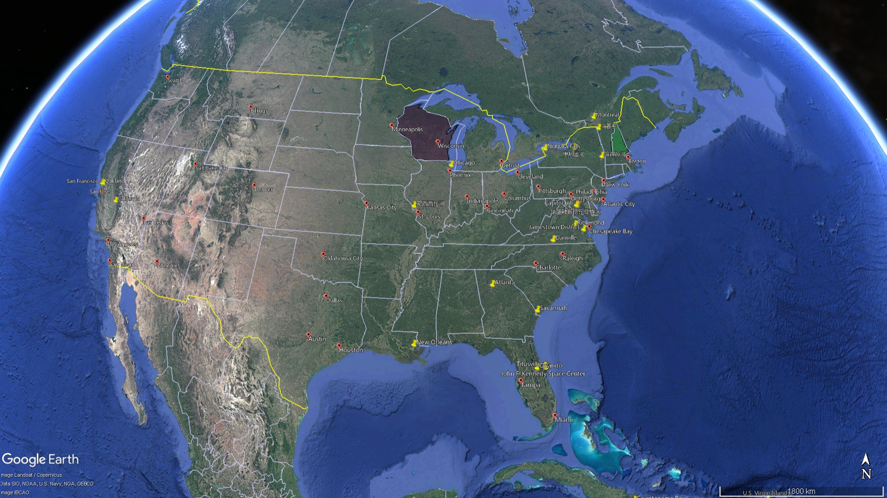
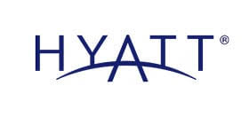
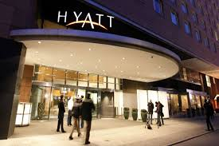
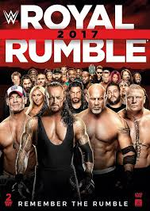
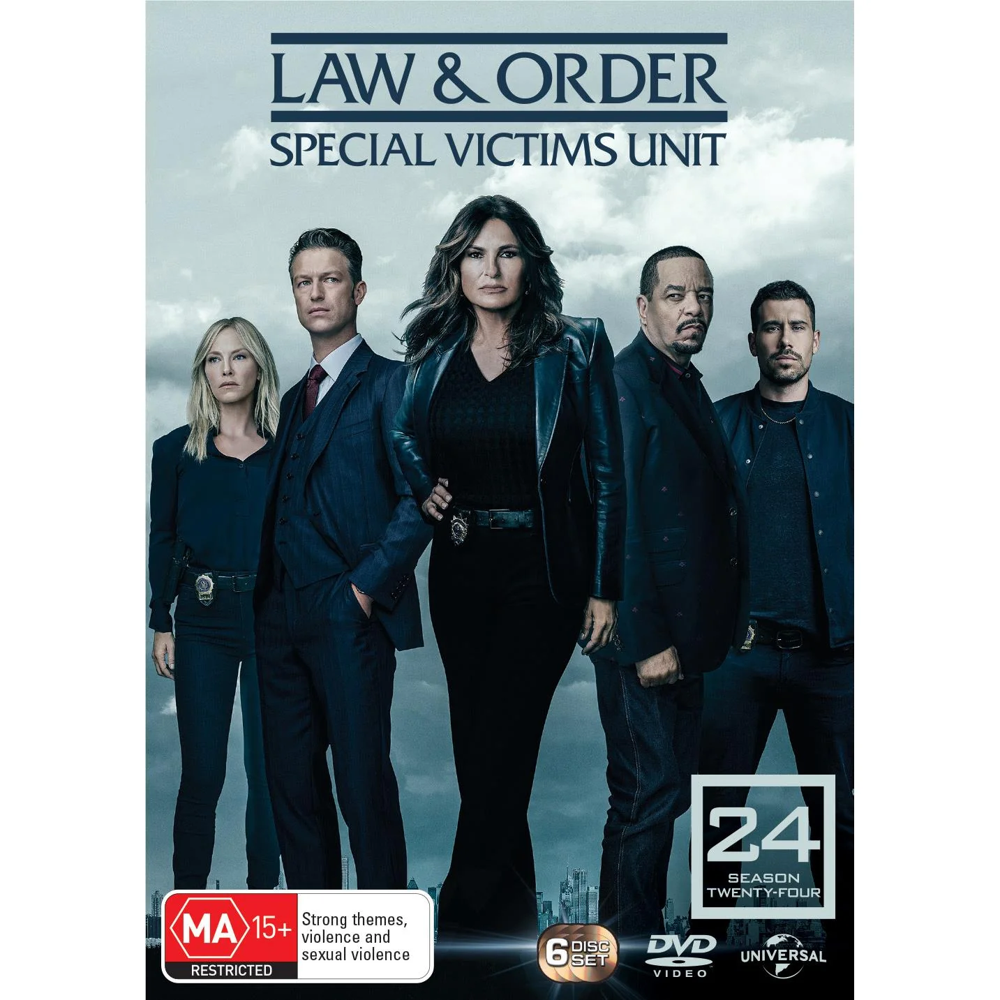
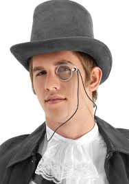
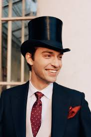
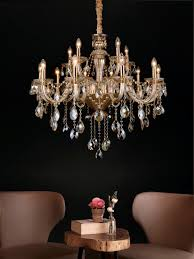

= 2025.04.30 Elon Musk & Billionaires Flood (v.)使淹没；被水淹没；大量涌入；挤满 the Zone in Wisconsin Supreme Court Race
:toc: left
:toclevels: 3
:sectnums:
:stylesheet: ../../../myAdocCss.css

'''

== 释义

This Tuesday, #there's an election for a seat# 席位 on the Wisconsin Supreme Court 最高法院. #And I know what you# coastal 近海的，沿海的 elites 精英 #are thinking#: "So what 那又怎样,那又如何? #They'll rule on what# 他们会裁决什么? *Whether* #it's legal (a.)法律允许的，合法的 to marry (v.)  a# cheese 干酪，奶酪 *or* whatever the issues are in Wisconsin?"

[.my1]
.案例
====
.to marry (v.)  a cheese
嫁给奶酪： 威斯康星州以奶酪闻名，主持人用夸张的方式讽刺当地选举的荒谬。
====

Well, yes, #that is part of it# 这是其中的一部分. But also, #it will determine# whether abortion 堕胎 is legal in Wisconsin /and how to redraw (v.)重画,重绘 election districts 选区, #which could even determine# (v.) which party controls (v.) Congress 国会. And that's why the weather report for Wisconsin is *calling for* 预报 rain —$100 million.

[.my1]
.案例
====
.Wisconsin

.that's why the weather report for Wisconsin is calling for  rain —$100 million.
"calling for" 是一个英语短语，通常表示 ​**"预报；预测；呼吁；要求"**。具体含义取决于上下文。

在本句中的含义：​这里的 "calling for" 是 "预报"（predicting/forecasting）的意思，但带有 ​双关幽默： +
​字面意思：天气预报通常用 ​**"calling for rain"** 表示“预计有雨”。 +
​实际含义：这里的“雨”不是真正的雨水，而是 ​金钱（1亿美元的政治资金）​，讽刺选举烧钱如暴雨倾盆。

其他常见用法

- 天气预报：
The forecast is calling for snow tomorrow. （预报说明天有雪。）
- 呼吁/要求：
Protesters are calling for change. （抗议者呼吁改革。）
- 需要：
This recipe calls for two eggs. （这个食谱需要两个鸡蛋。）
====

#That's how much money 后定 could be spent on# a state supreme court race 竞选 in Wisconsin. And #that would make it# the most expensive judicial election in US history.  +
#`主` The race 后定 *pairing*# (v.)使成对；配对 Judge 法官 _Susan Crawford_ from liberal hotbed (n.)温床；滋生地 _Dane County_ 地名 *#against#* conservative Judge _Brad Shiml_ from Waukesha 地名 `谓` #*has*# big money outside donors 外部捐助者 like George Soros 乔治·索罗斯, JB Pritzker, and Elon Musk #*opening* their wallets#.  +

[.my1]
.案例
====
.Jay Robert Pritzker
JB·普利兹克. 现任伊利诺州州长。JB·普里茨克隶属于普里茨克家族，该家族是"Hyatt Hotels Corporation 凯悦酒店集团"的持有者。

凯悦酒店集团（Hyatt Hotels Corporation）是世界跨国酒店集团，总部位于美国伊利诺伊州芝加哥.

====

Trump's close ally 盟友；同盟者 and financial backer 支持者；后援者, Musk, *has gone all in* 全力以赴 on Shiml's campaign.  `主` The tech billionaire 亿万富翁；巨富 and groups *aligned with* him `谓` have poured 倾注；涌入 more than $20 million into the state. Now, I know $20 million *sounds (v.) like* a lot, but remember that /Elon has over $300 billion. $20 million is like one of his kids. #It means nothing to him.# +

[.my1]
.案例
====
.$20 million is like one of his kids.
埃隆·马斯克的孩子： 暗讽马斯克子女众多. 2000万美元对他来说, 就像养他的一个孩子一样微不足道。

====

But yes, this race has turned into a billionaire 亿万富翁 _royal rumble_ (持续而低沉的声音，隆隆声；<美，非正式>打群架) (<皇家大战>（摔跤比赛）)大乱斗；混战. I mean, they're spending $100 million, #which is obscene# 淫秽的；令人厌恶的. I mean, you know, for _that kind of money_, #you could have bought#  (v.) _tens of thousands of_ Wisconsin residents their _first ever_ 迄今为止第一的,有史以来的第一次 salad.

[.my1]
.案例
====
.royal rumble

====

Instead, they're spending it on ads like this: 'This street's like  any other in Wisconsin, but the new neighbor is a pedophile 恋童癖者, thanks to _Judge Susan Crawford's_ sweetheart sentence 判决，宣判，判刑.'  +
'How corrupt 腐败的；堕落的 is Brad Shiml? Shiml #gave a _plea deal_ 认罪协议 to a man# caught with _child porn_ 儿童色情作品.   +
Crawford *let* the predator 掠夺者；捕食者 *out* in just four years. Brad Shiml #*let* a sex predator *loose* (v.)让…自由；释放；放开;任（某人）自由行动；使随心所欲；放任 on our kids.# Letting the rapist 强奸犯 walk (v.) free /while rapists walked free 无罪释放(从而可以自由地离开) /called Crawford's negligence 疏忽；玩忽职守 utterly 完全地；彻底地 disgusting 令人厌恶的；恶心的. #That's disgusting.# Criminals are praying (v.) Susan Crawford *gets elected*. If you want them to be safe, #don't vote for him#.'

[.my1]
.案例
====
.pedophile
-> pedo-,儿童，男孩，-phile,爱，词源同philosophy.

.let sb/sth ˈloose
(1) to free sb/sth from whatever holds them/it in place 让…自由；释放；放开 +
•She let her hair loose /and it fell around her shoulders. 她的头发一解开，便顺着肩膀垂了下来。 +
•Who's let the dog loose? 谁把狗放出来了？

(2) to give sb complete freedom to do what they want in a place or situation任（某人）自由行动；使随心所欲；放任 +
•He was at last *let loose* in the kitchen. 终于放手让他干厨房里的活儿了。 +
•A team of professionals *were let loose* on the project. 有一组专业人员在放心大胆地做这个项目。
====
SVU
Wow. Why is SVU 特别受害者部门(美剧名) wasting (v.) his time in New York? I mean, you got at least 20 seasons 季 down there in Wisconsin. I mean, #if you got# this many pedophiles 恋童癖者 in Wisconsin, #maybe the problem is# Wisconsin.  +
Because for me, #watching this on the outside# 作为局外人, I'm like, should the rest of us *put a wall up* around Wisconsin /to keep all the pedophiles in there? I mean, I know it'll trap (v.)困住；陷入 the kids in there too, but the kids are probably also pedophiles 恋童癖者, so #it should be fine.# I mean, there's *so* many pedophiles *that* if you want to win, #you should probably be making# pro-pedophile ads /because *it seems like* it's a big constituency 选民；支持者 over there. Like, why don't you do some outreach 拓展服务；外联;外展服务（在服务机构以外的场所提供的社区服务等）?

[.my1]
.案例
====
.SVU

.outreach
[ U]the activity of an organization that *provides* (v.) a service or advice *to* people in the community, especially those who cannot (v.) or are unlikely to come to an office, a hospital, etc. for help 外展服务（在服务机构以外的场所提供的社区服务等） +
•an outreach and education programme外展服务及教育计划
====

But hey, I guess this is the story of American elections: _way (ad.)大大地，远远地；<美>非常，很 too much_ money *paying for* _way (ad.) too many_ negative ads. In fact, Elon Musk is spending so much money on _attack ads_, he's not even paying attention to _who 后定 the ads are attacking_. `主` An attack ad 后定 against _Supreme Court Justice_ candidate Susan Crawford `谓` is using (v.) a picture of a different Susan Crawford. `主` An ad *launched (v.) by* a group *backed by* Elon Musk `谓` instead used a picture of Susan P. Crawford, who's a Harvard University law professor.

Okay, to be fair, if I'm ever talking to a white woman over 50 /and I forget her name, I just call her Susan Crawford, and #I'm usually right# like 例如；譬如；比方 80% of the time. But hey, maybe Elon just needs (v.) glasses. I mean, it could change everything. #He'd be like#, 'Oh my god, that Cybertruck *looks like* shit  屎,无用之物，劣质品.'

[.my1]
.案例
====
.and I’m usually right *like*  80% of the time.
这里的 ​**"like"** 是一个 ​口语中的填充词（filler word）​，**没有实际含义，**主要用于：

1.​**缓和语气，**让句子听起来更随意、不绝对化（*类似中文的“呃”“嘛”*）。 +
2.​*表示估算，暗示“大约80%”（非精确数字）。*

具体解析：
​原句：
"I’m usually right like 80% of the time."
​**= "我通常有大概80%的时候是对的。"**

类似用法： +
- "It's like 10 miles away." （差不多10英里远。） +
- "She's like 30 years old." （她大概30岁。）

对比正式 vs. 口语： +
- 正式："I’m correct *approximately* 80% of the time." +
- 口语："I’m right *like* 80% of the time."
====

But Elon isn't just spending all that money on _attack ads_. He's also *dusting off* 除尘,重新启用；重拾 a tactic 策略；手段 from the 2024 election: voter self-checkout 自助结帐,（让顾客在无收银员的情况下）自行付费结帐的零售系统. `主` The Elon Musk-backed _America Political Action Committee_ `谓` is asking Wisconsin voters to sign (v.) a 'petition' 请愿书；诉状 *in opposition to* 反对；对抗 activist (a.) judges 激进法官. The reward for each signature? $100.

Yo, $100? Come on, Elon, it's going *to take more* than that /for Americans to sell their souls to you. Elon Musk's political action committee *has handed out* 分发；发放 $1 million *to* a voter in Wisconsin /just for signing (v.) a petition 请愿书； 申诉书. A million dollars? Come on, Elon, #*you have taken _way (ad.)大大地，远远地；<美>非常，很 less_* for Americans to sell their souls to you.# All right, I would have done it for 250.  +
For more 想要了解更多信息(*关于...*) *on* _the flood 涌入；泛滥 of billionaire money_, #let's *go live 连线到[某地]进行直播 to*# Wisconsin #with _our very own_# (a.)我们自己的、专属的 Grace Coolins Smith. Grace? Grace?

[.my1]
.案例
====
.A million dollars? Come on, Elon, *you have taken way (ad.)大大地，远远地；<美>非常，很 less* for Americans to sell their souls to you.
这里的 ​**"you have taken way less"** 是一个幽默的反讽表达，字面意思是 ​**"你曾经用比这少得多的代价, 就让美国人出卖灵魂了"**，实际想表达的是： +
"埃隆·马斯克过去用比100万美元低得多的代价（比如推特收购、加密货币喊单等），就成功让许多美国人盲目追随他，甚至'出卖灵魂'（指放弃原则或理性支持他）。现在居然要花100万买一张签名？太浪费了！" (就像说：
"马老板，你以前画个饼就有人排队送钱，现在居然要真发红包？太亏了！")

- ​**"taken"** 在这里是 ​**"让某人屈服/妥协"** 的意思（类似 "it takes very little to convince Americans"）。
- ​**"way (ad.) less"** = ​**"远比这少"**​（强调金额对比）。
- ​**"sell their souls"：夸张说法，指 ​"为利益放弃原则"**​（比如为钱支持马斯克的政治行动）。

.let's go live to Wisconsin
"go live" 是电视/广播行业的固定短语，意思是 ​**"进行现场直播"**​（to begin broadcasting in real time）。 +
​**"go live to [地点]"** = ​**"连线到[某地]进行直播"** +
例句：We now go live to Washington for the latest updates.
（我们现在连线华盛顿，获取最新消息。）

.__our very own__ Grace Coolins Smith
"our very own" 是一个固定表达，带有 ​**"我们自己的、专属的"** 这种自豪或幽默的语气，强调某人是"自己人"。 +
​**"very own"** 加强语气，类似中文的 ​**"我们自家的…"** 或 ​**"我们大名鼎鼎的…"** +

例句：
Here’s _our very own_ superstar, John!
（这位就是我们自家的大明星——约翰！）
====

Grace, wait. #Why are you dressed (v.) like# the Monopoly 垄断,大富翁游戏 man?

Monopoly woman, Ronnie. It's 2025. #Women can do anything men can do#, including *beating up* 打得很惨 an old man /and stealing (v.)偷窃 his monocle 单片眼镜 and _top hat_ 高顶礼帽. Wait, you *beat up* an old man? Is he okay?

[.my1]
.案例
====
.Why are you dressed (v.) like the Monopoly 垄断,大富翁游戏 man?
"大富翁装扮"：记者扮成游戏《大富翁》中的银行家（经典形象：白男+高礼帽+单片眼镜），呼应"金钱操控选举"的主题。

.monocle
-> mono-,单个的，-oc,眼睛，词源同eye,ocular,binocular.

.top hat

====

This race is really heating up 变得温暖或热起来, Ronnie. There's so much money *pouring in* right now, #they're not even being subtle (a.)含蓄的，隐晦的;不易察觉的；不明显的；微妙的 about it# 他们对此毫不掩饰. Elon Musk is *shooting* gold bars 金条 *out of* a _t-shirt cannon_. #That sounds kind of dangerous.# It is, but `主` the people 后定 it didn't kill `系` are filthy (ad.)<非正式>非常 rich 非常富有. Okay, Grace, #this is awful# 这是多么可怕,这是糟透了. All right, billionaires should not have this level of influence (n.) in local elections.

[.my1]
.案例
====
.t-shirt cannon
T-shirt cannon 是一种特制的 ​"空气炮"，通常在体育赛事、演唱会或商业活动中使用，**用来 ​把T恤、小礼品或促销品, 高速射向观众。**它的工作原理类似玩具 Nerf 枪，但威力更大，能把卷起来的T恤, 发射到几十米远。 +
形状像大号火箭筒或加农炮，通常由塑料或金属制成。

使用场景： +
- ​体育比赛：NBA、NFL等比赛中，吉祥物或啦啦队会用它在观众席发射免费T恤。 +
- ​商业活动：促销员用它发射优惠券或小样。 +
- ​脱口秀/喜剧：作为搞笑道具（比如这里吐槽马斯克"发射金条"）。

image:../img/T-shirt Cannon.jpg[,15%]
image:../img/T-shirt Cannon 2.jpg[,15%]
image:../img/T-shirt Cannon 3.jpg[,15%]
====

Are you kidding? This is the best thing to happen to Wisconsin since Brett Favre's penis 阴茎. Look at all this. They painted 油漆 the whole city in gold. The street lamps are crystal chandeliers (枝形吊灯) 吊灯. The birds are diamond-encrusted 镶嵌钻石的. Sure, they're dead, but they're beautiful.

[.my1]
.案例
====
.chandelier
_a large round 圆形的，球形的 frame_ with branches 分支 that hold lights or candles . Chandeliers are decorated with many small pieces of glass and hang from the ceiling. 枝形吊灯 +
-> 词源同candle, 蜡烛。

====

Okay, what? So Wisconsin doesn't mind (v.) the billionaires meddling (v.)干涉；插手;瞎搞，乱弄（尤指不应管或不懂的事物） in the elections?

[.my1]
.案例
====
.meddle  +
(v.) ~ (in/with sth) : ( disapproving) to become involved in sth that does not concern you管闲事；干涉；干预 +
- He had no right to meddle in her affairs. 他无权干涉她的事情。

-> 来自古法语medler,混合，干预，来自拉丁语miscere,混合，搅拌，词源同mix,miscellany.后引申词义干预，管闲事。
====

No. In fact, they're trying *to get* billionaire money *in* all their elections, no matter how small. This morning I saw an _attack ad_ that said `主` Mary Beth Kowalski `谓` should not be _senior 年长的 class president_ 高中毕业班主席 at Sheboygan High /because she failed her driver's test. Look, this is disgusting. I know `主` her mom `谓` still *drops her off* 放下，送到 at school. No, no, no, I mean, #it's outrageous# 骇人听闻的；无法容忍的 for Wisconsin to shift (v.) its entire economy *to depend on* billionaire election money. Uh, okay, #if you can think of a better way# to transfer (v.)（使）转移，搬迁 billionaire money back to society, #I'm all ears# 我洗耳恭听.

[.my1]
.案例
====
.senior class president
高中毕业班主席：高中毕业班级中, 被选举为主席的学生，负责组织和领导毕业典礼等活动。

class president 班级主席：在学校中，由同学们选举产生的代表班级的学生领袖。

在美国的学校体系中，“class president”和“senior-class president”虽然都涉及学生领导职位，但它们代表着不同的范围和层级：

[.my3]
[options="autowidth" cols="1a,1a"]
|===
|Class president（班级主席）： |Senior-class president（高年级主席）

|- 这个职位指的是一个特定年级或班级的学生领导者。 +
例如，一个学校的九年级、十年级、十一年级或十二年级（senior）都可能有自己的班级主席。 即每个年级,都会有自己的班级主席。 +
- 他们的职责通常是: *代表他们所在年级的学生，组织班级活动，以及在"学生会"中代表班级发声。* +

|- 这个职位专门指十二年级（senior year）的班级主席。简单的说，高年级主席，是特指在高中，大学，最后一年，也就是毕业班的，学生主席。 +
- 由于十二年级是高中毕业的最后一年，高年级主席, 通常在学校中扮演着更重要的领导角色。 +
他们的职责可能包括: *组织毕业舞会、毕业典礼等重要活动，以及代表高年级学生与学校管理层沟通。* +

|===

总而言之： +
- “class president”是一个更宽泛的术语，可以指任何年级的班级主席。 +
- “senior-class president”则专门指高中或大学最后一年（毕业班）的班级主席。

A _class president_, also known as a _class representative_, is usually the leader of a student body class, and *presides (v.)主持，担任主持；主管某地，掌管（局势） over* its _class cabinet_ or organization within a _student council_ 委员会，理事会. In a grade school, class presidents are generally elected by the class, a constituency 选区，选区的选民 *composed of* all students in a grade level. +
班级主席 ，也称为班级代表 ，通常是学生班级的领导者，并主持其班级内阁或学生会内的组织。在一所小学时 ，班级总统, 通常由班级选举 ，该选区由所有年级的学生组成。
====

What about taxes 税?

Huh?

Taxes. #Speak up# 大声说话,大声地说. Taxes. One more time. Taxes. Two more times. Taxes, taxes.

Taxes what?

Ronnie, I don't know what language you just slipped into 溜进；使滑入, but #I got to go.# That old man is waking up, and I got to finish the job.  +

All right, don't hurt him, Grace Coolen Smith, everyone. All right."

[.my1]
.案例
====
.I don't know what language you just *slipped into*
"slipped into" 是一个动词短语，字面意思是 ​**"滑入、溜进"**，*但在这句话中，它的引申含义是：
"突然转换到（某种语言/话题/状态）"，通常带有 ​"无意识地、意外地" 的意味。*

"I don't know what language you just slipped into."
= "我不知道你刚才突然切换到什么语言了。"

前文提到 ​**"taxes"（税收）​**，但对方（Grace）假装听不懂，甚至说 "Taxes? What?"，表现得像听到外星语言一样。
所以主持人吐槽：​**"你刚才突然说的是什么鬼话？（怎么一提到税收你就装听不懂）"** 暗示对方是 ​故意装傻​（就像突然说"外星语"逃避话题）。
====

'''

== 中文翻译

本周二，威斯康星州最高法院, 将举行一场席位选举。我知道你们这些沿海精英在想什么：“那又怎样？**他们会裁决什么？能不能和奶酪结婚，**还是威斯康星的其他问题？”

是的，这也是其中一部分。但更重要的是，这次选举将决定"堕胎"在威斯康星州是否合法，以及如何"重新划分选区"，甚至可能决定"哪个党派控制国会"。这就是为什么威斯康星州的天气预报说, 要下“钱雨”了(因为有金主要赞助了)——1亿美元。

这可能是威斯康星州最高法院选举的花费，也将成为美国历史上最昂贵的司法选举。这场选举, 由来自自由派温床戴恩县的法官苏珊·克劳福德, 对阵来自沃基肖县的保守派法官布拉德·希梅尔，吸引了乔治·索罗斯、JB·普利兹克, 和埃隆·马斯克等大金主慷慨解囊。

特朗普的亲密盟友兼金主马斯克, 全力支持希梅尔的竞选。这位科技亿万富翁, 及其相关团体, 已向该州投入超过2000万美元。我知道2000万听起来很多，*但别忘了马斯克身家超过3000亿。2000万对他来说就像他的一个孩子——根本不算什么。*

这场选举已经变成了一场亿万富翁的“皇家大战”。他们花了1亿美元，简直离谱。这么多钱，本可以给成千上万的威斯康星居民, 买他们人生中第一份沙拉，结果却用来投放这种广告：

“这条街和威斯康星的其他街道, 没什么不同，但新邻居是个恋童癖，这要感谢苏珊·克劳福德法官的轻判。”

“布拉德·希梅尔有多腐败？他给一个持有儿童色情内容的人, 达成了认罪协议。克劳福德只关了那个性侵犯四年。希梅尔让性侵犯逍遥法外，克劳福德的疏忽令人作呕。”

“太恶心了！罪犯们巴不得苏珊·克劳福德当选。如果你想保护孩子，就别选他。”

哇，纽约的《法律与秩序：特殊受害者》还在这拍什么？威斯康星起码能拍20季。如果威斯康星有这么多恋童癖，问题可能出在威斯康星本身。

作为局外人，我都在想：*我们是不是该在威斯康星周围修堵墙，把恋童癖都关在里面？虽然孩子们也会被困住，但孩子们可能也是恋童癖，所以问题不大。*

*恋童癖这么多，想赢的话，干脆拍"支持恋童癖的广告"吧，毕竟他们似乎是重要选民群体。*

但这就是美国选举的现状：花太多钱拍太多负面广告。马斯克砸钱拍攻击广告，甚至没注意攻击的是谁。一条针对苏珊·克劳福德的广告, 用了另一个苏珊·克劳福德的照片——哈佛法学院教授苏珊·P·克劳福德。

说实话，如果我遇到一个50多岁的白人女性忘了名字，我就叫她“苏珊·克劳福德”，80%的时候都对。不过马斯克可能需要配副眼镜，说不定他还会突然发现：“我的赛博卡车怎么这么丑？”

马斯克不光砸钱拍广告，还复活了2024年的“选民自助”策略——他的政治行动委员, 会让选民签署“反对激进法官”的请愿书，每签一个名给100美元。

才100块？想让美国人出卖灵魂，得加钱。结果真有人签了个名就拿了100万。要我说，250块我就干。

关于亿万富翁的金钱攻势，我们连线威斯康星州的格蕾丝·库林斯·史密斯。

*格蕾丝！你怎么穿得像大富翁里的银行家？*

“2025年了，女性也能抢老头子的单片眼镜和高礼帽了。”

你还打老头？他还好吗？

“选举白热化了，马斯克直接用T恤炮, 发射金条。”

这有点危险吧？

“没被砸死的人都发财了。”

亿万富翁不该这么干涉地方选举！

“这可是威斯康星自布雷特·法夫尔的‘丑闻’后最棒的事！*满城镀金，路灯是水晶吊灯，连鸟都镶了钻——虽然死了，但很美。”*

威斯康星不介意亿万富翁插手选举？

“何止不介意，他们连高中班长选举, 都要拉亿万富翁投资。今早我看到一条攻击广告说：'玛丽·贝丝·科瓦尔斯基不该当希博伊根高中的毕业班班长，因为她驾照考试挂了。'这也太恶心了，我知道她妈妈现在还在开车送她上学呢。"

不不不，我是说威斯康星把整个经济, 都押在亿万富翁的选举资金上，这也太离谱了。

"那你倒是想个更好的办法, 把亿万富翁的钱还给社会啊？"

比如征税？

"啥？征税？什么？"

征税。

"说清楚点。征税？再说一遍。征税？再说两遍。征税？征税？征税？啥？"

[掌声]

"罗尼，我不知道你突然在说什么外语，但我得走了——那老头要醒了，我得去收尾。"

别打他了！以上就是格蕾丝·库林斯·史密斯的报道！

[音乐]

'''

== pure

"This Tuesday there's an election for a seat on the Wisconsin Supreme Court. And I know what you coastal leagues are thinking. So what? They'll rule on what? Whether it's legal to marry cheese or whatever the issues are in Wisconsin? Well, yes, that is part of it. But also, it will determine whether abortion is legal in Wisconsin and how to redraw election districts, which could even determine which party controls Congress. And that's why the weather report for Wisconsin is calling for rain.

$100 million. That's how much money could be spent on a state supreme court race in Wisconsin. And that would make it the most expensive judicial election in US history. The race pairing Judge Susan Crawford from liberal hotbed Dane County against conservative Judge Brad Shiml from Waukesha has big money outside donors like George Soros, JB Pritzker, and Elon Musk opening their wallets. Trump's close ally and financial backer, Musk, has gone all in on Shiml's campaign. The tech billionaire and groups aligned with him have poured more than $20 million into the state. Now, I know $20 million sounds like a lot, but remember that Elon has over $300 billion. $20 million is like one of his kids. It means nothing to him. But yes, this race has turned into a billionaire royal rumble. I mean, they're spending $100 million, which is obscene. I mean, you know, for that kind of money, you could have bought tens of thousands of Wisconsin residents their first ever salad.

Instead, they're spending it on ads like this: 'This street's like any other in Wisconsin, but the new neighbor is a pedophile, thanks to Judge Susan Crawford's sweetheart sentence.' 'How corrupt is Brad Shiml? Shiml gave a plea deal to a man caught with child porn. Crawford let the predator out in just four years. Brad Shiml let a sex predator loose on our kids. Letting the rapist walk free while rapists walked free called Crawford's negligence utterly disgusting. That's disgusting. Criminals are praying Susan Crawford gets elected. If you want them to be safe, don't vote for him.'

Wow. Why is SVU wasting his time in New York? I mean, you got at least 20 seasons down there in Wisconsin. I mean, if you got this many pedophiles in Wisconsin, maybe the problem is Wisconsin. Because for me, watching this on the outside, I'm like, should the rest of us put a wall up around Wisconsin to keep all the pedophiles in there? I mean, I know it'll trap the kids in there too, but the kids are probably also pedophiles, so it should be fine. I mean, there's so many pedophiles that if you want to win, you should probably be making pro-pedophile ads because it seems like it's a big constituency over there. Like, why don't you do some outreach?

But hey, I guess this is the story of American elections: way too much money paying for way too many negative ads. In fact, Elon Musk is spending so much money on attack ads, he's not even paying attention to who the ads are attacking. An attack ad against Supreme Court Justice candidate Susan Crawford is using a picture of a different Susan Crawford. An ad launched by a group backed by Elon Musk instead used a picture of Susan P. Crawford, who's a Harvard University law professor.

Okay, to be fair, if I'm ever talking to a white woman over 50 and I forget her name, I just call her Susan Crawford, and I'm usually right like 80% of the time. But hey, maybe Elon just needs glasses. I mean, it could change everything. He'd be like, 'Oh my god, that Cybertruck looks like shit.'

But Elon isn't just spending all that money on attack ads. He's also dusting off a tactic from the 2024 election: voter self-checkout. The Elon Musk-backed America Political Action Committee is asking Wisconsin voters to sign a 'petition' in opposition to activist judges. The reward for each signature? $100.

Yo, $100? Come on, Elon, it's going to take more than that for Americans to sell their souls to you. Elon Musk's political action committee has handed out $1 million to a voter in Wisconsin just for signing a petition. A million dollars? Come on, Elon, you have taken way less for Americans to sell their souls to you. All right, I would have done it for 250. For more on the flood of billionaire money, let's go live to Wisconsin with our very own Grace Coolins Smith. Grace? Grace?

Grace, wait. Why are you dressed like the Monopoly man?

Monopoly woman, Ronnie. It's 2025. Women can do anything men can do, including beating up an old man and stealing his monocle and top hat. Wait, you beat up an old man? Is he okay?

This race is really heating up, Ronnie. There's so much money pouring in right now, they're not even being subtle about it. Elon Musk is shooting gold bars out of a t-shirt cannon. That sounds kind of dangerous. It is, but the people it didn't kill are filthy rich. Okay, Grace, this is awful. All right, billionaires should not have this level of influence in local elections.

Are you kidding? This is the best thing to happen to Wisconsin since Brett Favre's penis. Look at all this. They painted the whole city in gold. The street lamps are crystal chandeliers. The birds are diamond-encrusted. Sure, they're dead, but they're beautiful.

Okay, what? So Wisconsin doesn't mind the billionaires meddling in the elections?

No. In fact, they're trying to get billionaire money in all their elections, no matter how small. This morning I saw an attack ad that said Mary Beth Kowalski should not be senior class president at Sheboygan High because she failed her driver's test. Look, this is disgusting. I know her mom still drops her off at school. No, no, no, I mean, it's outrageous for Wisconsin to shift its entire economy to depend on billionaire election money. Uh, okay, if you can think of a better way to transfer billionaire money back to society, I'm all ears.

What about taxes?

Huh?

Taxes. Speak up. Taxes. One more time. Taxes. Two more times. Taxes, taxes.

Taxes what?

Ronnie, I don't know what language you just slipped into, but I got to go. That old man is waking up, and I got to finish the job. All right, don't hurt him, Grace Coolen Smith, everyone. All right."

'''