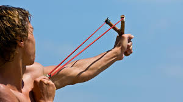

= 2025.04.09 Rahm Emanuel - “Absolute Failure” of Trump’s Tariffs & Path Forward for Dems
:toc: left
:toclevels: 3
:sectnums:
:stylesheet: ../../../myAdocCss.css

'''

== 释义

==== orgasm

#It's no secret 不是秘密 that# women's on-screen portrayals (n.)描绘；表演 have evolved (v.)进化；发展 throughout history. We've gone *from* playing (v.) secretaries 秘书；书记；部长；大臣 being saved by James Bond /*all the way 一直到底，一路上；完全地，彻底地 to* nuclear scientists 核科学家 being saved by James Bond. But #I want to *focus on*# one specific aspect of female depictions 描绘: the orgasm (n.)性高潮. It's when a woman is stimulated (v.)刺激 to the point of climax 高潮, causing (v.) a physical and neurological 神经学的 response (n.) that scientists *refer to as* fucking fantastic 他妈的太棒了.

Over the years, `主` depicting (v.)描绘 female pleasure 愉悦 on screen `系` is something 后定 that's changed (v.) more than the batteries 电池 in your vibrator 振动棒. `主` The first known (a.) female orgasm 性高潮 on the silver screen 银幕 `系` was in the 1933 German film _Ecstasy_  (n.)狂喜，陶醉；摇头丸（Ecstasy）；（情绪或宗教原因引起的）疯狂，出神, when Hedy Lamarr took the fucking express 特快列车 *all the way to* Pleasure Town 愉悦镇. *Turns out* the world wasn't ready for this —everyone denounced (v.)谴责 it, from Hitler to the Pope 罗马教皇. And if you ask me, the Pope #*has no place 身份；地位；资格 weighing (v.) in* 发表意见 on# sex scenes. He’s a bit *out of his depth* 力不从心,超出他的能力范围. I mean, #when we need your opinion# on the best _stain removers_ 去污剂 for white fabrics 白色织物, then we'll call 召唤，呼唤 you.

[.my1]
.案例
====
- Ecstasy
-> ec-, 向外。-st, 站。比喻义，偏离原地的，灵魂出窍的。
====

Unfortunately, `主` being the first actress to climax (v.)达到性高潮 on screen `谓` haunted (v.)困扰 Hedy Lamarr for the rest of her career. She *was typecast (v.)被定型为 as* the seductress 勾引男人的女人, even though she was literally 按照字面意义地，逐字地；真正地，确实地 the smartest person in Hollywood. Yeah, as her _side hustle_ (忙碌喧嚣) 副业,兼职工作, she was a brilliant scientist who invented the basis for all modern wireless technology 无线技术. Without her, no one would be orgasming 性高潮 because we wouldn't be able to watch (v.) porn 色情片 on our cell phones in the bathroom.

[.my1]
.案例
====
.seductress
-> 来自 seduce 诱奸，诱惑，-ct,过去分词格，-ess,表阴性。

.hustle
(n.)[ U]busy noisy activity of a lot of people in one place忙碌喧嚣
•We escaped from the hustle and bustle of the city for the weekend.我们周末时躲开了城市的拥挤喧嚣。

[ VN+ adv./prep.] to make sb move quickly by pushing them in a rough aggressive way 推搡；猛推 +
•He grabbed her arm and hustled her out of the room. 他抓住她的胳膊, 把她推出房间。

-> 来自荷兰语hutselen,摇动，搅拌，扔，后受英语拼写习惯影响字母t,s置换，词干hot-,hut-在日耳曼语系中义为摇动。进入英语后引申词义前后摇摆，摆来摆去，引申词义猛推，猛挤，强迫，以及妓女拉客，骗子骗钱等。受美国电影的影响，开始出现褒义化，如侠盗，神偷等，参照电影《美国骗局》。
====

And that was the last big on-screen _female orgasm_ for a while because, around the same time, the Hays Code 海斯法典（好莱坞审查制度） was enforced 强制执行 in Hollywood. This was _a set of_ censorship 审查，检查 guidelines 审查指南 that banned (v.) movies from explicitly (ad.)清楚明确地，详述地；直截了当地，坦率地；露骨地，不隐晦地 showing (v.) or discussing (v.) sex. Even married couples *had to* be shown in separate beds —or, as it's now called, the reverse 逆转，彻底改变（决定、政策、趋势等） chocolate factory 反向巧克力工厂（讽刺《查理和巧克力工厂》中卧床老人的荒谬设定） with a four-year-old bedridden 卧床不起 for the past 20 years. It takes a lot of work to keep this family going. No one was getting off (（使某人）离开，出发，动身)达到高潮.

_The Hays Code_ finally ended (v.) in the late '60s, which, as timing goes,  is like *having* your _dry January_ 一月戒酒月 *end* at an open bar 开放式酒吧 in Cabo. America *was embarking (v.)上船，登机；着手 on* 开始,着手进行 a sexual revolution 性革命, so _female pleasure_ *came back* on screen. Unfortunately, it was often treated as a novelty 新奇事物 that existed for men's amusement 消遣. So you got scenes 后定 like the one in 1968's Barbarella, where evil Dr. Eyebrows over here *traps*  (v.)设陷阱（或夹子、捕捉器）捕捉；使陷入圈套 Jane Fonda *in* a machine that's supposed (v.)预期，推断；假定；认为 to give her orgasms until she dies —*except that* she climaxes so hard /she breaks the machine. #My fucking goodness# 我的老天. At the time, it was considered a campy (a.)滑稽的;不自然的；装模作样的；举止言行显示有同性恋之倾向的, sexy thing, but *looking at it* now, it's a violation 侵犯. Remember, everyone: if you're going to put a woman in a machine that orgasms (v.)达到性高潮 her to death, you need consent (n.)同意 first.

[.my1]
.案例
====
.dry January
干一月：一种在一月份戒酒的健康活动，旨在鼓励人们在新的一年开始时减少饮酒，提高健康意识。

image:../img/dry January.png[,15%]

====

Another major moment came (v.) a few years later /with the movie _Deep Throat_ 深喉. #It tells the story of# a woman who keeps (v.) giving men _oral sex_ 口交 because her pleasure zone 快感区 is in her throat. #That is not how it works# 它不是这样运作的. But _Deep Throat_ became the first porno (a.)色情的 film 色情电影 to go mainstream 主流化 and inspired (v.) both my uncles to become dentists 牙医.

`主` The__ female orgasms__ in Barbarella 人名 and Deep Throat `系` were basically male fantasies 幻想 about how women experience (v.) pleasure. So #it was appropriate (a.)合适的，相称的 that# `主` *the next on-screen orgasm* 性高潮 后定 to make a splash (（液体）稀里哗啦地溅落，飞溅；朝……泼洒，使……溅湿;以显著版面刊载，以大篇幅报道) 引起轰动 `谓` *totally debunked* (v.)揭穿，拆穿（谎言、神话、误解等） those fantasies 梦想，幻想.  +
1989's _When Harry Met (v.) Sally_ famously includes _an extended scene_ 加长片段
 of _Meg Ryan_ 人名 *faking (v.)假装 an orgasm* in a deli 熟食店 *to prove (v.) to* Billy Crystal *that* maybe he wasn't _the cunnilingus 舔阴，为她口交 king_ he thought (v.) he was. Oh! Oh, yes! Yes! Yes! Oh God!

[.my2]
《芭芭拉》和《深喉》中的女性高潮, 基本上是男性对"女性如何体验快乐"的幻想。所以，下一个在屏幕上引起轰动的高潮, 完全揭穿了这些幻想，这是合适的。1989年的《当哈利遇到莎莉》中有一个著名的加长镜头，梅格·瑞恩在一家熟食店假装高潮，向比利·克里斯托证明，也许他不是他自以为的舔阴之王。哦!哦,是的!是的!是的!哦,上帝!

[.my1]
.案例
====
.debunk
-> de-, 不，非，使相反。bunk, 谎言。

1820年2月25日美国第16届国会, 就奴隶制问题，特别是在人烟稀少的西部地区（如密苏里）建立奴隶制的问题, 展开激烈辩论。密苏里要求以"奴隶州"（实行奴隶制的州）加入联邦。北方议员强烈反对。最后由于南北两方议员争执不休，有人提出一项折衷方案：吸收密苏里为奴隶州，缅因为自由州。

在辩论过程中，北卡罗来纳州**Buncombe县议员沃克(Felix Walker费力克斯 )发表了冗长的讲话，与讨论的问题毫不相关。**许多与会者纷纷退场。沃克不得已中断讲话并表示歉意。他解释说，他作此长篇发言, 不是为了讲给大家听，而是为了发表在Buncombe的地方报上。他说，“I was talking for／to Buncombe．” 就这样，talking for／to Buncombe这一短语成了talking nonsense（发空论）的同义语。尔后该短语被缩略成bunkum，到了20世纪**又简化为bunk，用以表示“空话”、“废话”、“骗人的鬼话”等义。**

实际上，bunk(um)可以说是Buncombe这一地名的变体和缩略。1916年美国汽车制造商福特（Henry Ford，1863 - 1947）说了一句名言：“History is more or less bunk.”（历史多少有点骗人），使bunk一词得以广为流传。

约在1920年有一位名叫William E.Woodward伍德沃的人针对福特写了《骗人的鬼话》(Bunk)一书。他在书中据bunk杜撰了debunk一词，用以表示“揭穿”或“暴露”。今天bunk在美国几乎成了一个家喻户晓的常用词，这或许是人们看到许多社会现象需要予以揭露(they see so much that needs debunking)的缘故吧。

英语另有一个意为“床铺”或“铺位”的bunk是词源截然不同的一个词，该词可能系由bunker（箱）逆构而成。

====

This scene was groundbreaking (a.)开创性的 for a few reasons: it *told* _all the women (后定1) watching_ 正在观看（这部电影） (后定2) _who 指所有看到这一场景的女性观众 had faked orgasms_ *that* they weren't alone 它告诉所有假装高潮的女性，她们并不孤单; it taught (v.) men to try to be attentive (a.)体贴的 to their partner's needs; and it catapulted (v.)推动;（使）猛增，（使）迅速发展;用弹弓发射 pastrami 熏牛肉 to become the top aphrodisiac 春药 of 1989.

[.my1]
.案例
====
.It told* _all the women (后定1) watching_ (后定2) who had faked orgasms *that* they weren’t alone.
这一场景让所有看过电影、​​且曾假装过高潮​​的女性意识到，她们并不孤单。

-  "watching" 是 ​​现在分词（present participle）​​，作 ​​后置定语​​，修饰前面的名词 "women"。 +
直译："正在观看（这部电影）的女性" +
语境引申："所有当时看过这部电影的女性" 或 "所有看到这一场景的女性观众"

- "who had faked orgasms" 是一个 ​​定语从句​​，修饰 "women"。 +
​​"who" 指代的是 "women"​​（即前文提到的 "all the women watching"）。因此，"who" 限定了范围——不是泛指所有女性观众，而是其中 ​​有过假装高潮经历的女性​​。

.catapult
1.( BrE ) ( NAmE also sling·shot ) a stick shaped like a Y with a rubber band attached to it, used by children for shooting stones 弹弓 +
2.a weapon used in the past to throw heavy stones （旧时的）石弩，弩炮 +
3.a machine used for sending planes up into the air from a ship 弹射器（用以从舰船上弹射飞机升空）

[ + adv./prep.] to throw sb/sth or be thrown suddenly and violently through the air （被）猛掷，猛扔 +
[ VN] +
•She was catapulted out of the car as it hit the wall. 汽车撞墙时，她被甩出车外。 +
( figurative) +
•The movie catapulted him to international stardom. 这部电影使他一跃成为国际明星。

-> cata-, 向下。-pul, 扔，投掷，词源同appeal, pulse.

image:../img/catapult.jpg[,15%]

.pastrami
[ U]cold spicy smoked beef 五香熏牛肉 +
-> 可能来自希腊语 pastos,撒盐，来自PIE*kwet,摇动，撒，词源同paste,discuss.拼写受salami影响俗化。

*烟熏肉* (土耳其语：pastırma， 罗马尼亚语: pastramă)*通常由牛肉制成，有时也使用猪肉、羊肉或火鸡肉。*  +
*制作工艺通常包括: 将生肉, 盐水渍之后, 晾到半干，然后涂上香料，烟熏，最后蒸熟。* 传统上使用"牛腹肋排"制作烟熏肉，但现在美国也常用"牛腩"，"腹腿牛排"甚至是"火鸡肉"。

*跟粗盐腌牛肉一样，"烟熏肉"最初也是在没有冷藏手段的时候, 发明的一种"保存肉类"的方法。*

====

It also started a conversation about the _performative nature_ 表演性质 of _the female orgasm_. Women *face (v.) far too much pressure* to satisfy (v.) their partner's ego 自尊 *instead of* themselves. I mean, no one ever *has to fake (v.) it* for their vibrator 振动按摩器. If they ​​值振动棒 don't *get the job done* 完成任务(指“让女性达到高潮”), they just go back into the drawer 抽屉(振动棒被收起来不用了) and think about what they did (拟人化幽默，振动棒“反思自己哪里没做好”（实际是女性懒得再用它）).

[.my1]
.案例
====
.If they don’t get the job done, they just go back into the drawer and think about what they did.
通过将振动棒拟人化（“反思自己”），反衬男性在性行为中常要求女性“表演满足”的不合理。
====

In the years that followed, _female pleasure_ 快乐，满足，欣慰；乐事 *became more common* on screen 女性的快感在银幕上变得更加普遍 but *was still often treated as* punchlines （笑话或故事末尾的）妙语、关键句；点睛之笔;笑料 —like Jennifer Aniston 人名 getting (v.) _unexpected magic (a.)魔法的，魔力的；神奇的，有奇效的；非常好的，令人十分愉快的；重要的，关键的 climaxes_ (高潮，顶点)意想不到的魔法高潮 in _Bruce 布鲁斯（男名） Almighty_ 全能的，无所不能的：具有无限权力和能力的  (冒牌天神（电影名）) or Katherine Heigl accidentally orgasming (v.) at dinner when a little boy grabbed (v.)攫取；捕获；强夺 her _remote-controlled (a.)遥控的，远程控制的 vibrating underwear_ 遥控振动内裤. Okay, #there is so much wrong with this#: it's non-consensual (a.)未经同意的, it's a kid doing it, and #it perpetuates (v.)延续 the dangerous myth (错误的观点，荒诞的说法；神话)危险谬论 that# _vibrating underwear_ gives you anything but a five-alarm electrical burn 五级电击烧伤.

[.my2]
而且它延续了一个危险的神话，即振动内衣会给你带来任何东西，但不会被电灼伤。

[.my1]
.案例
====
.punchline
( also NAmE informal ˈtag line ) the last few words of a joke that make it funny （笑话最后的）妙趣横生的语句，妙语；画龙点睛之语

-> 词源不确定。一种说法是来自punch line,虚线，来自过去演员表演笑话时，在稿子上给最后的一句把观众带上高潮的话打上虚线，因此引申词义妙语，画龙点晴之语。

.Almighty
adj．全能的，无所不能的：具有无限权力和能力的。 +
n．全能者，上帝：指具有无限权力和能力的神。

1.( in prayers祈祷时说 ) having complete power全能的 +
•*Almighty God*, have mercy on us.全能的上主，请垂怜我们。

2.[ only before noun] ( informal ) very great or severe 极大的；十分严重的 +
•*an almighty bang*/crash/roar 砰的╱哗啦╱轰的一声巨响

3.( taboooffensive) used in the expressions shown in the example, to express surprise or anger（表示惊奇或愤怒）全能的，有无限权力的 +
•*Christ/God Almighty!* What the hell do you think you are doing?全能的基督╱上帝！你认为你究竟在干什么？

4.the Almighty noun[sing.]God 全能者（指上帝）

-> al同all, 全部的。might, 能力，同may(原指能力，后指也许）。

.Bruce Almighty
image:../img/Bruce 布鲁斯（男名） Almighty.jpg[,15%]

====

And even when orgasms weren't meant to be funny 不是为了搞笑, #it could be hard to take them seriously# 也很难把他们当回事 —like in _40 Days and 40 Nights_, when Josh Hartnett #makes his partner orgasm# (n.) by caressing (v.)抚摸，爱抚 her with flowers. Which, believe me, is not that easy. Not to be _a size queen_ (尺寸至上者)我不是要成为尺码女王, #but you're going to *have to* use (v.) at least# a sunflower 向日葵.

The 2000s weren't a step forward for orgasms, but they weren't a step back either. They still needed *to step* (v.) a little *to* the side, now the other side, then back and forth 前后移动. Yeah, *fucking right* (真他妈对,没错，操) 才怪.

[.my2]
2000年代对性高潮来说并不是一个进步. 他们仍然需要走到一边，然后走到另一边，然后来来回回.

[.my1]
.案例
====
"fucking right"​​ 字面意思是 ​​“真他妈对”​​ 或 ​​“没错，操”​​，但实际用法更复杂。

本文的背景是: "2000年代对高潮的描写既没进步也没退步", "它们（电影/文化）还需要左右摇摆、前后试探"（讽刺当时对性高潮的刻画依然犹豫不决、不够直白）。最后一句​​：
"Yeah, fucking right." → 表面赞同，实则​​反讽​​（sarcasm）。

"fucking right" 的真实含义​​
这里不是真的说“对”，而是​​翻白眼式吐槽​​，类似： +
​​“呵呵，说得可太对了！”​​（实际意思：​​“鬼才信！”​​） +
​​“是啊，放屁吧！”​​（用粗话加强讽刺）

​语气强化​​：
"fucking" 加强情绪，表达​​不耐烦/不屑​​。
类似中文的​​“可去你的吧！”​

反讽结构​​：
先假装同意（"Yeah, right"），再用 "fucking" 暴露真实态度。

根据语境，可译为：

- ​​“呵呵，可拉倒吧！”​​
- ​​“是啊，骗鬼呢！”​​
- ​​“行行行，你说得都对（反讽）。”​

类似英文表达​​

- "Sure, whatever."（“行吧，随便。” → 实际懒得争）
- "Oh, absolutely."（“哦，绝对。” → 讽刺）
- "Yeah, as if."（“嗯，好像真的一样。” → 不信）
====

[Music]​​

Thankfully (ad.)幸好;感谢地；感激地, in the present day 当今, we're starting to see much more realistic 现实的 and positive 积极的 depictions 描绘 of women 后定 *popping (v.)（使）爆裂，发爆裂声 their turkey timers* 火鸡计时器（俚语：指女性高潮）.

These days 如今, you can hardly *turn (v.) your TV on* 打开电视 without seeing a woman **getting off** 达到高潮 —and finally 终于, movies and shows are doing this *through the female gaze* 女性视角. And #if you don't know what that would look like#, then you haven't seen Bridgerton 《布里奇顿》. It's a show about 19th-century British society 英国上流社会 *taking care of* their Little Women 《小妇人》—she's a Beth 贝丝（乖巧形象） in the streets /but a Jo 乔（叛逆形象） in the sheets 床上. Thanks to Bridgerton 美剧名, there haven't been this many _female orgasms_ /自从 since… well, since everyone started (v.) watching Bridgerton.

[.my2]
谢天谢地，如今我们终于开始看到更真实、更积极描绘女性「烤熟火鸡」的影视作品了。​​（注：此处用"popping their turkey timers"比喻女性高潮，幽默双关）​​现在打开电视，几乎每部剧都有女性享受性快感的镜头——而且这一次，影视作品终于学会了用「女性视角」来呈现。​​如果你想象不出这是什么画面，那你肯定没看过《布里奇顿》。这部剧讲的是19世纪英国上流社会如何「呵护他们的《小妇人》」——​​她们人前是乖乖女贝丝，床上却是狂野乔。​​（注：Beth和Jo是《小妇人》中性格迥异的姐妹，此处双关）​​多亏了《布里奇顿》，自打这部剧火了之后，银幕上的女性高潮数量堪称史无前例……好吧，准确说是「自打所有人开始看《布里奇顿》之后」。​

[.my1]
.案例
====
.turkey timers

​"turkey timer"（火鸡计时器）​​：
指一种插在火鸡（或其他烤肉）里的​​弹出式温度计​​（pop-up timer），当肉烤熟时，计时器会“砰”地弹起（pop up），提示可以吃了。

image:../img/turkey timer.jpg[,15%]

​"popping their turkey timers"​​：
字面意思是 ​​“弹出她们的火鸡计时器”​​，但在这里是比喻 ​女性达到性高潮（orgasm）​.​

.getting off
"get off" 原本可以指「离开」（如 "I got off the bus"），或「逃脱惩罚」（如 "He got off with a warning"）。 +
在非正式语境中，​​"get off"​​ 常指 ​​「性高潮」​​ 或 ​​「获得性满足」​​，男女均可使用，但此处明确指女性（"a woman getting off"）。 +
"Orgasm" 较临床化，而 "get off" 更生活化

.Bridgerton

====

So that's the history 历史 of the female orgasm on screen. And #who knows what the future holds# (v.)未来会怎样? But it is important 重要的 because `主` the way women are portrayed (v.)被描绘 on screen `谓` *holds a mirror up /to* 将镜子对准某物, 反映 how they're treated (v.) in real life. And as all women know, sometimes _holding up a mirror to something_ 举着镜子对着某物 is the only way *to get a good look* 看清楚 and *figure out* 弄明白 how it fucking works 他妈的工作原理.

[.my1]
.案例
====
.hold a mirror up /to something
短语 ​​*"hold a mirror up /to something"*​​ 是一个英语惯用表达，意思是 ​​*「反映、映照、揭示某事物的真实面貌」*​​。这里的 ​​"up to"​​ 并不单独拆解，而是与 ​​"hold a mirror"​​ 构成完整短语，表示 ​​「*将镜子对准某物*」​​，引申为 ​​「让某事物直面自己的真相」​​。 +
*指通过某种方式（如影视、艺术、批评）​​揭露或反映社会现实​​，迫使人们直面问题。*

- She *held* a mirror *up* /to her face. 她把镜子举到脸前。
- Art *holds* a mirror *up* /to society. 艺术是社会的镜子。

the way women are portrayed on screen *holds a mirror up /to* how they’re treated in real life. 影视中对女性的刻画，如实反映了她们在现实中的处境。 +
影视作品像一面镜子，照出社会对待女性的真实态度（如性别歧视、性压抑等）。

对比其他介词​​：

- "hold a mirror ​​to​​ something"（*可省略 "up"，但语气稍弱*）
- "hold a mirror ​​up /to​​ something"（更生动，强调「主动对准」的动作）
====

==== Bras

Bras 胸罩​​—also known as 亦称 braziers 胸衣 or, more formally 更正式地说, over-the-shoulder boulder holders 肩上巨石固定器（戏谑说法）—the history of women and their bras has been pushed together 挤压在一起 and held there 固定住 for as long as we can remember. And you can always tell 看出 a lot about what's going on with women in society by how their breasts 胸部 are being stored 存放.

From the ancient Romans 古罗马人 wearing bandeau-style 抹胸式 sports bras 运动内衣 for athletic competitions 体育竞赛 to the women of the early aughts 2000年代初 who shot whipped cream 喷射奶油 out of their bras as a way to destigmatize 去污名化 public breastfeeding 公开哺乳… (When I was nursing 哺乳期, I could never quite get my milk 乳汁 to come out that frothy 泡沫状的.)

One of the earliest versions 版本 of the bra was in the Middle Ages 中世纪, when women could wear two fabric bags 布袋 over their breasts inside their clothing. These ladies didn't have time for cute underwear 可爱内衣—it was the 1300s, they were more concerned with 忙于 finding new recipes 食谱 for gruel 稀粥 and not dying from a paper cut 被纸割伤.

For a while during the French Revolution 法国大革命 and Victorian era 维多利亚时代, bras took a back seat to 让位于 corsets 束腰, which ever so gently 温柔地 molded 塑造 a woman's body into that super-desirable 极度诱人的 hourglass figure 沙漏身材—because nothing is sexier than a woman who might be filled with sand 装满沙子.

Luckily 幸运的是, by the end of the 19th century, a French woman named Herminie Cadolle had designed 设计 the first modern bra by cutting a corset in two 切成两半 and sewing it into something that was then considered lingerie 内衣 and would now be considered school clothes 校服 on Euphoria 《亢奋》. It gave women more freedom 自由 than the traditional corset, but it was still impossible 不可能 to take your bra off through your shirt 隔着衬衫脱内衣 in the locker room 更衣室 at Planet Fitness 健身房. (Be right there—don’t start Zumba 尊巴舞 without me!)

Thankfully, in 1914, a 19-year-old named Caresse Crosby invented 发明 a bra that ditched 抛弃 the corset altogether 完全. Crosby wanted a bra to wear to her debutante ball 名媛舞会 that was actually comfortable 舒适的, so she made one herself out of two handkerchiefs 手帕 tied together with a ribbon 丝带. It turned out to be a huge hit 大受欢迎 at the ball—probably because, in a corset, the only dance women could do was the robot 机械舞, and no one likes the person at the party doing the robot… especially before robots were invented. ("She's possessed 中邪了! Fetch Father M 快去请神父!")

With her new bra, Caresse Crosby—and women everywhere—were liberated 解放了… except for the fact that they were still women in 1914. But aside from that 除此之外, liberated. Crosby's bra was a hit, but it continued to evolve 演变, and by the 1950s, new styles led to an all-out 全面的 boob party 胸部盛宴. Bras became an intrinsic part 内在部分 of fashion, with underwires 钢圈 and padding 衬垫 allowing women to emulate 模仿 the stars of the era like Marilyn Monroe 玛丽莲·梦露 and Jayne Mansfield. An ample bosom 丰满胸部 was as synonymous with 等同于 1950s womanhood 女性特质 as not having a bank account 没有银行账户 or getting excited 兴奋 when you get a vacuum 吸尘器 for your anniversary 结婚纪念日.

And it wasn't just about the curves 曲线—thanks to torpedo bras 鱼雷胸罩, it was also about the pointiness 尖突感, which may look a little odd 奇怪 now, but at the time, it was the Cold War 冷战, so it made sense 说得通 to have extra missiles 导弹 on hand 备用的 in case Russia invaded 俄罗斯入侵.

But while bras 胸罩 were supporting 支撑 women, not all women were supporting bras. In fact 事实上, by the late 1960s 1960年代末, going braless 不穿胸罩 became a fashion statement 时尚宣言. Boobs 胸部（俚语） were free to hang 自由垂坠 and move around 晃动 and swing 摇摆 as much as all the couples at the party. It was a great time for boobs—except for all the polyester 涤纶 they were rubbing against 摩擦 for the first time.

Contrary to 与...相反 popular belief 普遍认知, burning bras 焚烧胸罩 was never actually a thing 真实发生过. What did happen is that in 1968, demonstrators 示威者 were protesting 抗议 the Miss America pageant 美国小姐选美 for being sexist 性别歧视的, racist 种族歧视的, and forcing women to solve world peace 解决世界和平 in 10 seconds (need at least 5 minutes to do that). So protesters tossed 扔进 symbols of their oppression 压迫象征 into what they referred to as the Freedom Trash Can 自由垃圾桶—which also happens to be what I call the dumpster 垃圾箱 outside Whole Foods 全食超市. And those symbols of oppression included bras, but they never actually set them on fire 点燃. That's just a myth 谣言—like mild menstrual cramps 轻微痛经 or the male orgasm 男性高潮. (I’ll believe it when I see it 眼见为实.)

But by that point 到那时, bras were so ingrained 根深蒂固 in society that many people struggled with 难以接受 the idea that they could be optional 可选择的. The idea took hold 形成观念 that not wearing a bra was somehow inappropriate 不得体 or unprofessional 不专业—like in 1990, when a woman in Arkansas 阿肯色州 was found in contempt of court 藐视法庭 when the judge said her breasts were obviously showing through her shirt. ("Objection 反对, Your Honor 法官大人—my right to a fair trial 公平审判 is up here!")

And only a few years ago, a Florida 佛罗里达州 high school student was forced to put Band-Aids 创可贴 over her nipples 乳头 at school. That's a trip to the school nurse 校医 that will also send you to the school psychiatrist 心理医生. (I’m just kidding—American schools can’t afford those 请不起心理医生.)

But for those who want to wear them, it's a great time for bras right now. Bra designers 胸罩设计师 are no longer telling women what they should be wearing—instead, they're listening to 倾听 what women want to wear. There are so many comfortable options 舒适选择 now, from athleisure 运动休闲装 to sports bras 运动内衣—women can live a life where they aren't being squeezed 挤压 like an empty tube of toothpaste 空牙膏管.

And there's no telling 无法预测 what the future of bras will be like. Maybe 20 years from now, all bras will be NFTs 非同质化代币—who knows? Not me, I literally don't know what that means. But whatever form 形式 bras take, there's one thing you can always count on 指望: they will lose their shape 变形 in the dryer 烘干机… but only if you wash them in the first place 前提是你洗过它们.

A lot of people think America's first female soldier 女兵 was Demi Moore 黛米·摩尔 in G.I. Jane 《魔鬼女大兵》—which is not true, although she was the first Marine 海军陆战队员 to strip 脱衣 through West Point 西点军校. The truth is, there have been women fighting wars 参战 since the beginning of America.

During the Revolutionary War 独立战争, Deborah Samson 黛博拉·桑普森 was the first known woman to enlist 参军—and to do so, she had to pose as 假扮 a man, which had its ups and downs 利弊. On the one hand 一方面, she had to put herself in grave danger 置身险境; on the other hand 另一方面, she didn't have to wear a corset anymore—which, if you ask me, is worth risking your life for 值得拼命. And Samson didn't just fight in the war—she kicked ass 大显身手. She led a raid 带队突袭 that captured 俘虏 15 men. That's right: a woman took down 干掉 15 men without the help of Roe v. Wade 罗诉韦德案（堕胎权法案）.

In the Civil War 南北战争, another woman named Melinda Block 梅琳达·布洛克 also posed as a man to enlist. It's weird 奇怪 that America doesn't know her story, because she fought for the Confederacy 南方邦联—you'd think there'd be statues 雕像 of her all over. But Block was secretly a Union sympathizer 北方军支持者, trying to desert 逃离 the Confederates and escape up North. Before she could, she was shot in the shoulder 肩膀中弹 and discovered as a woman by an army doctor 军医. That's a huge sacrifice 巨大牺牲—because as soon as your doctor realizes you're a woman, all your premiums 保险费 go up.

After Block was discharged 退伍 for the crime of having a vagina 阴道, she escaped to Tennessee 田纳西州 and joined up with 加入 the Union Army 北方军, helping it to win the Civil War, end slavery 奴隶制, and defeat racism 种族主义 in America once and for all 一劳永逸. At least, that's what my nephew's 侄子 textbook 教科书 says—he goes to school in Texas 得克萨斯州.

By World War I 第一次世界大战, women didn't have to drag race 激烈竞争 their way into service—they were actually allowed to enlist 参军. In 1918, Opha May Johnson 奥法·梅·约翰逊 was the first woman to join the United States Marine Corps 美国海军陆战队, along with 300 other women. They came to be known as the Marinettes 女海军陆战队员（非官方昵称）—although, to their credit 值得称赞的是, Marine officials distanced themselves from 疏远 that nickname, probably because Marinettes sounds less like soldiers and more like a dance troupe 舞蹈团 that does high kicks 高踢腿 on the battlefield. Which is really just giving the enemy unrealistic expectations 不切实际的期望 of what their legs should look like.

By World War II 第二次世界大战, women weren't just fighting on the ground—they were taking to the skies 飞上天空. America had a shortage of 缺乏 pilots 飞行员, so women were trained to fly military aircraft 军用飞机. These women were known as WASPs 女子空军服务飞行员, which stood for Women Airforce Service Pilots—and not, as many believe, Wet-Ass Service Pilots 湿漉漉的服务飞行员（俚语玩笑）. This was just another example of women getting to step up 挺身而出 during the war to do jobs previously reserved for 专属于 men: flying planes, playing baseball—women even had to fill in for 顶替 mansplainers 男性说教者. ("See, the reason they call it World War II is because it's a second one—it's a math thing, you wouldn't understand. Go hammer some nails 去钉钉子吧.")

World War II saw another first for women when Charity Adams Earley 查丽蒂·亚当斯·厄尔利 became the first African-American female Army officer 非裔美国女军官 and led the first battalion 营 of Black women to be stationed overseas 驻扎海外—which means, without her inspiration, we never would have had Beyoncé’s Super Bowl halftime show 超级碗中场秀. Earley was given the daunting task 艰巨任务 of delivering airplane hangars 机库 full of undelivered mail 未投递邮件 to soldiers fighting in Europe—and she did such an amazing job that she was eventually promoted to lieutenant colonel 中校, which back then was the highest rank 最高军衔 a woman was allowed to have—just above HBIC (Head Bitch In Charge 女老大) and Girl Boss 女老板.

But not every woman fighting in World War II was as visible as Army officers and Air Force pilots—and in one case, that was on purpose 故意的. Virginia Hall 弗吉尼亚·霍尔 was one of the Allies' 盟军 most important spies 间谍. She recruited resistance fighters 抵抗战士, directed them to the Allied invasion 盟军登陆, rescued 12 fellow agents 特工 out of an internment camp 拘留营—and she did it all with a peg leg 木制假腿. You kidding me? I take a sick day 请病假 when I stub my toe 踢到脚趾.

The Nazis 纳粹 called Hall "the enemy's most dangerous spy," but she was more affectionately known as "the Limping Lady of Lyon 里昂跛脚女士." She gathered intelligence 情报 from everywhere—from nuns 修女 to brothel owners 妓院老板—basically, anyone who spanks men with a ruler 用尺子打男人屁股的人. Hall was truly a master of espionage 间谍大师—like James Bond, without all the pouting 撅嘴 and STDs 性病.

But it wasn't all sunshine and jet fuel 并非一帆风顺 for women veterans 女退伍军人. The families of the women who died while serving didn't get any survivor benefits 抚恤金 or burial expenses 丧葬费—and the women who made it through the war didn't even get veteran status 退伍军人身份 until the late '70s. Which is so messed up 太离谱了. Also, if you're not an official veteran, your dog doesn't get excited when you surprise him by coming home—barely even looks up 连头都不抬.

So this Veterans Day 退伍军人节, we salute 致敬 the women who have kept America safe. They paved the way 铺平道路 for all the brave women fighting today—and the ones who will fight in the future, once the robot apocalypse 机器人末日 kicks off. And they also inspired me to avoid the line for the women's bathroom 女厕所排队.

==== Childbirth

Childbirth 分娩​​ - it's like 3D printing a person 像3D打印一个人. Bringing a baby into this world isn't easy, but for most of recorded history 有记载的历史, other people - usually men - have been dictating to 对...发号施令 women the terms of their own childbirth, even when they don't know what the hell they're talking about. Time to take a couple of deep breaths 深呼吸 and push out another history 再推出一段历史.

[Music]

Let's start all the way back in ancient Greece 古希腊. Plato 柏拉图 may have been one of the greatest philosophers 哲学家 of all time (and he could definitely rock that casual tunic look 轻松驾驭束腰外衣 like nobody's business), but when it comes to baby-making 生育, he was clueless 一窍不通. He thought the womb 子宫 could literally wander around 游走 the body like one of those DVD screensavers DVD屏保. "Who's that? An eyeball? I am definitely on the wrong floor!"

As dumb as Plato's ideas about women's anatomy 女性解剖学 were, they were accepted by male doctors for centuries. And doctors couldn't do their own research because, for most of human history, male doctors refused to even watch a woman give birth 分娩. They avoided the delivery room 产房 like it was an idea a woman said in a meeting.

In fact, in 1522, a curious German doctor decided to sneak into 潜入 the delivery room dressed as a midwife 助产士 - and guess what? He was burned alive 被活活烧死 for it. It's like the most extreme Drag Race 变装皇后挑战赛 challenge ever. So because men didn't have the balls 胆量 to see a vagina 阴道, it was up to the midwives to deliver the baby... that is, until the mid-16th century when men realized how much money they could make by doing it themselves.

But even in the delivery room, men were still so squeamish 过于拘谨 about seeing lady parts 女性私处 that they made women lie on their backs 仰卧 and cover their legs to deliver. That's why lying on your back is still the standard delivery procedure 标准分娩程序 today, even though there are so many more comfortable and efficient positions 姿势 a woman can give birth in: on her side 侧卧, squatting 蹲姿, on all fours 四肢着地... or how I did it - standing in line to get into the Gucci sample sale 古驰特卖会. Fun fact: if you find a placenta stain 胎盘污渍 on the scarf, they'll give you an extra 5% off.

Aside from awkward positions 尴尬姿势, men started doing all kinds of things to women we never would have chosen ourselves. We all know what this is, right? [Miming chainsaw 模仿电锯动作] Why do you think this was invented? To chop down trees 砍树? Hunt down unsuspecting hotties 猎杀毫无防备的美女? Wrong. Originally, the chainsaw 电锯 was invented to assist in childbirth. How horrifying is that? At that point, I'd rather just let the baby grow up inside me.

It's no surprise male doctors would come up with the idea of chainsawing a baby out of a woman, because a woman's pain was never really taken into consideration 被考虑 - which is crazy, because pain is the most traumatic thing 最痛苦的事 about childbirth. Well, that and going on Maury 莫里秀 afterwards to find out who the child's father is.

But for a long time, men believed that women should feel pain during childbirth - that it was part of her destiny 命运. So painkillers 止痛药 weren't even an option. In 1591, a woman from Edinburgh 爱丁堡 had the gall 胆敢 to ask for pain relief 止痛 during the birth of her twins... and, no joke, she was burned at the stake 火刑 for it. Yeah, another one. Apparently just telling someone "no" wasn't invented for another couple centuries.

Painkillers were largely off-limits 被禁止 until the mid-19th century when Queen Victoria 维多利亚女王 used chloroform 氯仿 for the birth of her eighth child. She raved about it 赞不绝口, which made it even more popular. She truly was the original mommy influencer 初代母婴网红. Thanks to Queen Victoria, drugging women during childbirth became much more acceptable.

But after a hundred years or so, the no-drugs philosophy 无药物理念 came back in style - again, thanks to men like Dr. Grantly Dick-Read 格兰特利·迪克-里德医生, the first modern physician 现代医生 to suggest women shouldn't get drugs at all because he claimed that women's pain was all in their heads 全是心理作用. In his defense 为他辩护, he was probably just trying to get revenge on his mom for giving him that name.

Look, if women want drugs during childbirth, that's their choice. If they want to push a watermelon through a bagel hole 把西瓜从百吉饼洞里挤出来 without drugs, that's also their choice. The problem is when decisions are being made by other people without putting the woman first 把女性放在首位. And that's not just in the past - it continues today.

There's OB-GYNs 妇产科医生 who refuse to work with a doula 导乐师, episiotomies 会阴侧切 being performed without consent 未经同意, and unnecessary C-sections 不必要的剖腹产 being pushed on women just to work around a doctor's lunch break 配合医生午餐时间 - which is honestly kind of weird, because if you still have an appetite 胃口 after cutting a person open, then I need a new doctor and you need a shrink 心理医生.

So to all the doctors and medical professionals 医疗专业人士 out there: please listen to the women who are actually pushing another human being out of their bodies. Take their concerns seriously 认真对待她们的担忧. Put their interests first. And for God's sake 看在上帝的份上, please no more burning people at the stake.

Get her!

[Music]

'''

== 中文翻译

==== 性

众所周知，女性在银幕上的形象, 在历史长河中不断演变。我们从扮演被詹姆斯·邦德拯救的秘书，一路演变成被詹姆斯·邦德拯救的核科学家。但我想聚焦于女性形象的一个特定方面：性高潮。

性高潮是指女性受到刺激达到顶点时，身体和神经产生的反应，科学家称之为“Vast and mighty”(浩荡 /浩大 /形容水势汹涌壮阔)。多年来，银幕上对女性快感的描绘变化, 比振动器的电池更换还要频繁。

**银幕上首次出现的女性性高潮, 是在1933年的德国电影《狂喜》中，**海蒂·拉玛一路“最糟糕的快车”直达愉悦。结果, 世界还没准备好接受这一幕。从希特勒到教皇，所有人都谴责它。而在我看来，教皇根本没资格对性爱场景指手画脚。他卖个什么劲儿？我是说，等我们需要你给白色织物推荐最佳去污剂时，自然会找你。

不幸的是，作为首位在银幕上达到高潮的女演员，海蒂·拉玛的职业生涯, 从此被定型为“妖妇”，尽管她实际上是好莱坞最聪明的人。没错，她的副业是发明了现代无线技术基础的杰出科学家。没有她，我们根本没法在浴室用手机看黄片来高潮。

此后很长一段时间，银幕上再没有出现过女性高潮，*因为好莱坞开始执行《海斯法典》。这套审查准则禁止电影直接展示或讨论性爱，连已婚夫妇都必须分床睡*——用现在的话说，就是“反向巧克力工厂里有个卧床20年的四岁小孩”。

“维持这个家可不容易啊。”

没人能爽到。**《海斯法典》终于在60年代末废除，**这个时机就像戒酒一月刚结束, 就碰上卡波圣卢卡斯的开放式酒吧。**美国掀起性革命，女性快感重回银幕，可惜常被当作取悦男性的新奇噱头。**

比如1968年《太空英雌芭芭丽娜》里，这位眉毛邪恶的博士, 把简·方达关进一台“高潮到死”的机器，结果她爽到机器爆炸。

“我的天！”

当年这被视作滑稽性感，*如今看来简直是"性侵"。记住：要用高潮机器弄死女人，得先取得同意。*

几年后，《深喉》成为首部主流色情片，讲述一个因快感区在喉咙, 而不断给人口交的女人——这完全违背生理常识。这片让我两个叔叔都去当了牙医。

*《芭芭丽娜》和《深喉》的女性高潮, 本质是男性幻想*，所以1989年《当哈利遇上莎莉》中, 梅格·瑞恩在熟食店假装高潮的经典场景，彻底揭穿了这些谎言。

“哦！哦，对！对！对！天啊！”

这场戏意义重大：

- 让假装高潮的女性, 知道自己并不孤单
- 教育男性关注伴侣需求
- 让熏牛肉, 成为1989年头号催情药

它也引发了对"女性高潮表演性"的讨论。*女性总被迫满足伴侣虚荣, 而非自身快感*——毕竟没人会对振动器假叫，不爽就扔回抽屉让它面壁思过。

此后银幕女性快感增多，却仍被当作笑料，比如《冒牌天神》里詹妮弗·安妮斯顿莫名高潮，或《意外之孕》里凯瑟琳·海格尔, 被小孩遥控振动内裤搞到当众失态。

“这离谱到家了！”

*这既非自愿, 又涉及儿童，还传播“振动内裤很爽”的危险谬论——实际上只会让你触电烧伤。*

即便非喜剧场景, 也难严肃，比如《禁欲40天》里乔什·哈奈特用爱抚花朵, 让伴侣高潮。

“不是我想挑剔，但至少得用向日葵吧。”

00年代的高潮戏没进步, 也没退步，只是在左右横跳。对，就是这样。

[音乐]

好在当今时代，我们终于看到更真实、更积极的女性高潮描绘。如今打开电视，几乎总能看见女性享受快感——影视作品终于开始用女性视角, 呈现这些场景。如果你想象不出这种画面，那你肯定没看过《布里奇顿》。这部剧讲述19世纪英国上流社会如何照料他们的"小妇人"——她们人前是"乖巧贝丝"，人后是"狂野乔"。多亏《布里奇顿》，自打这部剧播出后，银幕上女性高潮的数量, 堪称空前。

这就是银幕女性高潮的演变史。未来会如何？谁也不知道。但这很重要，**因为##银幕如何描绘女性，直接反映现实社会中她们的处境。##**所有女性都明白：有时候只有举起镜子照一照，才能看清某件事他妈到底是怎么运作的。

==== 胸罩

胸罩——亦称胸衣，或更正式地说，"肩上巨石固定器"——女性与胸罩的历史, 长久以来都被紧紧挤压固定着。*通过女性如何"存放"胸部，你总能窥见社会对女性的态度变迁。*

从古罗马女性穿着"抹胸式运动内衣"参加竞技，到**2000年代初, 女性用胸罩喷射奶油, 以消除"公开哺乳"的污名化**...(我哺乳期时，可挤不出那么绵密的奶泡。)

**中世纪最早的胸罩雏形，是女性在外衣内, 穿戴两个布袋。**这些女士没空讲究可爱内衣——那可是14世纪，她们更忙着研究新式麦粥食谱，以及避免被纸割伤致死。

*法国大革命和维多利亚时期，胸罩一度让位于束腰。这种装置, 温柔地将女性身材塑造成极度诱人的沙漏型*——毕竟没什么比一个可能装满沙子的女人更性感了。

幸运的是，**19世纪末, 法国女性赫敏·卡多尔将束腰一分为二，缝制成史上首件"现代胸罩"。**当时这算内衣，放现在就是《亢奋》里的校服。*它比传统束腰自由，但依然无法让你在健身房更衣室, 隔着衬衫脱掉。*(马上来——别丢下我跳尊巴！)

**1914年，**19岁的卡雷斯·克罗斯, **比发明了"彻底抛弃束腰的胸罩"。**她想要一件参加名媛舞会时, 真正舒适的胸罩，于是用两条手帕加丝带, 自制了一件。**结果在舞会大受欢迎——毕竟穿着束腰时，女性只能跳机械舞，**而没人喜欢派对上跳机械舞的家伙...尤其是在机器人还没发明的年代。("她中邪了！快请神父！")

克罗斯比的新胸罩, 解放了她和全球女性——除了1914年女性依然受压迫这个事实。但除此之外，确实算解放了。这款胸罩虽成功，仍持续演变。**到1950年代，新款式让胸部迎来全面狂欢。**胸罩成为时尚核心，**钢圈和衬垫让女性得以模仿梦露等明星。丰满胸部成为1950年代女性的标配**，就像没有银行账户、或收到吸尘器当结婚纪念礼, 就欣喜若狂一样。

当时追求的不仅是曲线——"鱼雷胸罩"还强调尖突感。如今看来或许怪异，但在冷战时期，多备几个"导弹"防范苏联入侵倒也合理。

然而, **当胸罩支撑着女性时，并非所有女性都支持胸罩。事实上到1960年代末，"不穿胸罩"成了时尚宣言。乳房终于能像派对情侣们一样自由垂坠、晃动摇摆。**那真是胸部的黄金时代——除了首次与涤纶面料摩擦的不适。

与普遍认知相反，"焚烧胸罩"从未真实发生过。真实情况是, 1968年示威者抗议美国小姐选美，反对其性别歧视、种族歧视、以及要求女性在10秒内解决世界和平（至少需要5分钟吧）。抗议者将压迫象征, 扔进"自由垃圾桶"——也是我对"全食超市"外垃圾箱的称呼。这些象征包括胸罩，但从未真正焚烧。这只是个谣言——就像"轻微痛经"或"男性高潮"。（除非亲眼所见）

但彼时, 胸罩已如此根深蒂固，许多人难以接受它是可选项。*"不穿胸罩"被视为不得体或不专业——比如1990年阿肯色州一名女性, 因法官认为她衬衫透出胸部轮廓, 而被判藐视法庭。*（"反对！法官大人——我的公平审判权在这！"）

**几年前, 佛罗里达州还有高中生被强制用创可贴遮盖乳头。**这种校医室之旅, 怕是要转诊心理医生。（开玩笑的——美国学校哪请得起。）

但对佩戴者而言，如今是胸罩的好时代。**设计师不再说教，而是倾听女性需求。**从运动休闲装, 到运动内衣，"舒适选择"丰富到再不会被挤得像空牙膏管。

**胸罩未来**难以预测。或许二十年后全变成NFT？天晓得，反正我不懂。*但无论如何演变，有件事永恒不变：它们总会在烘干机里变形…前提是你洗过。*

很多人以为美国, 首位女兵是《魔鬼女大兵》里的黛米·摩尔——虽然她是首位在西点军校脱衣的海军陆战队员，但这并非史实。真相**是自建国伊始, 就有女性参战。**

独立战争期间，黛博拉·桑普森女扮男装, 成为首位参军女性。这有利有弊：一方面要出生入死，另一方面终于不用穿束腰——要我说值得拼命。她不仅参战还大显身手，带队突袭俘虏15名敌军。没错：在没有罗诉韦德案支持的年代，一个女人干翻了15个男人。

南北战争时期，梅琳达·布洛克同样"女扮男装"参军。奇怪的是, 她的故事鲜为人知，毕竟她为南方邦联而战——按说该立满雕像才对。但其实她是北方军支持者，试图逃离南军时, 肩膀中弹, 被军医识破性别。这牺牲巨大——因为医生发现你是女性后，保险费立马暴涨。

布洛克因"拥有阴道罪"被退伍后，逃到田纳西州**加入北方军，助其赢得内战、废除奴隶制、一劳永逸消灭美国种族主义——至少我德州上学的侄子教科书是这么写的。**

**第一次世界大战时，女性已不必"激烈竞争才能服役"——她们被允许正式参军。**1918年，奥法·梅·约翰逊成为首位加入"美国海军陆战队"的女性，与300名女性共同服役。她们被称为"Marinettes"（女陆战队员）——不过值得称赞的是，海军陆战队官方疏远了这个昵称，大概因为它听起来不像士兵，倒像在战场上高踢腿的舞蹈团。这只会让敌人对女性腿部线条产生不切实际的幻想。

**到了二战，女性不仅在地面作战，更飞上蓝天。美国当时缺乏飞行员，**于是女性受训驾驶军用飞机。她们被称为WASP（女子空军服务飞行员）——并非某些人以为的"湿漉漉服务飞行员"。这再次证明女性在战时挺身而出，承担原属男性的工作：开飞机、打棒球——甚至顶替"男性说教者"。（"听着，之所以叫二战, 是因为这是第二场——数学问题，说了你也不懂。去钉钉子吧。"）

二战期间，查丽蒂·亚当斯·厄尔利成为首位非裔美国女军官，率领首个黑人女性营, 驻扎海外。没有她的激励，就不会有碧昂斯的超级碗中场秀。她负责将机库里积压的邮件, 送往前线欧洲士兵手中，表现出色, 最终晋升中校——当时女性最高军衔，仅次于"女老大"和"女老板"。

但并非所有二战女性, 都像军官和飞行员那样显眼——有时是刻意为之。*弗吉尼亚·霍尔是盟军最重要的间谍之一，她招募抵抗战士、引导盟军登陆、从拘留营救出12名特工*——全程拖着木制假腿。开玩笑吧？我踢到脚趾都要请病假。

纳粹称霍尔为"敌方最危险间谍"，但她更被亲切称为"里昂跛脚女士"。*她能从修女到妓院老板等各种渠道获取情报*——基本上就是所有"会用尺子打男人屁股的人"。她是真正的间谍大师——像007，但没有臭脸和性病。

**但女退伍军人的处境, 并非一帆风顺。阵亡女兵的家属, 拿不到抚恤金和丧葬费——幸存者直到70年代末, 才获得退伍军人身份。**太离谱了。而且若非正式退伍军人，回家时连狗都不会兴奋迎接——头都懒得抬。

因此, 在今年退伍军人节，我们致敬保卫美国的女性。她们为当今奋战的女性, 和未来对抗机器人末日的女性, 铺平道路。还启发我避开女厕所长队。

==== 分娩

分娩——就像3D打印一个人。生孩子本就不易，但有史以来，总有人（通常是男性）对女性分娩指手画脚，哪怕他们根本不懂。现在该深呼吸，再"生"出一段历史了。

[音乐]

让我们从古希腊说起。柏拉图虽是最伟大的哲学家（还能轻松驾驭束腰外衣造型），但对生育一窍不通。他以为子宫会像DVD屏保图标, 在体内游走。"那是谁？眼球？我绝对走错楼层了！"

尽管柏拉图对女性解剖的认知愚蠢，却被男医生奉行数百年。他们无法亲自研究，因为**历史上男医生连看分娩都拒绝，躲产房, 就像躲女性在会议中提的建议。**

1522年, 有位德国医生伪装成助产士, 潜入产房——结果呢？被活活烧死。堪称史上最极端"变装挑战"。*正因男人没胆量看阴道，接生一直是助产士的工作…直到16世纪中叶，男人们发现这行有利可图。*

*即便在产房，男人仍因拘谨, 要求产妇仰卧, 遮腿分娩。这解释了为何"仰卧"仍是现代标准分娩姿势，尽管侧卧、蹲姿、四肢着地等更舒适高效*——或者像我这样在"古驰特卖会"排队分娩。冷知识：围巾沾到胎盘渍, 能打95折。

**除了别扭姿势，男人还强加诸多选择给我们。**都知道这是什么吧？[模仿电锯动作] **电锯发明来干嘛？**砍树？猎杀美女？都错！**最初竟用于助产！**恐怖如斯！换我宁愿让孩子在体内长大。

*男医生想出"电锯接生"不奇怪，因为他们从不考虑女性疼痛*——尽管分娩最痛苦的就是疼痛，以及事后上莫里秀鉴定生父。

**长久以来, 男人认为"分娩疼痛"天经地义，连止痛药都不给。**1591年爱丁堡一位产妇, 胆敢为双胞胎分娩索要止痛——没开玩笑，她被处以火刑。是的又一个。显然"直接拒绝"这个技能当时还没发明。

*"止痛药"被禁用至19世纪中叶，直到维多利亚女王生第八胎时, 使用氯仿。她的盛赞, 让药物助产普及*，真·初代母婴网红。

**但约百年后，"无药物分娩"再度流行——拜格兰特利·迪克-里德医生所赐。这位现代医学先驱声称, 产妇疼痛全是心理作用，反对用药。**为他辩护下，他大概只是想报复给他取这名的母亲。

*##听着，产妇想用止痛药是她们的权利，##想不用止痛药, 把西瓜从百吉饼洞里挤出来, 也是她们的权利。#问题在于决策者不以产妇为先#——这现象至今犹存。*

*有妇产科医生拒绝"导乐师"参与、未经同意实施"会阴侧切"、为配合午餐时间, 强推不必要"剖腹产"*——说真的，切开人体后还有胃口吃饭的医生，我需要换人，你需要看心理医生。

所以全体医疗从业者：请倾听正娩出生命的女性，重视她们的需求，以她们的利益为先。看在上帝份上，别再烧死人了。

搞定她！

[音乐]

'''

== pure

It's no secret that women's on-screen portrayals have evolved throughout history. We've gone from playing secretaries being saved by James Bond all the way to nuclear scientists being saved by James Bond. But I want to focus on one specific aspect of female depictions: the orgasm. It's when a woman is stimulated to the point of climax, causing a physical and neurological response that scientists refer to as fucking fantastic.

Over the years, depicting female pleasure on screen is something that's changed more than the batteries in your vibrator. The first known female orgasm on the silver screen was in the 1933 German film Ecstasy, when Hedy Lamarr took the fucking express all the way to Pleasure Town. Turns out the world wasn't ready for this—everyone denounced it, from Hitler to the Pope. And if you ask me, the Pope has no place weighing in on sex scenes. He’s a bit out of his depth. I mean, when we need your opinion on the best stain removers for white fabrics, then we'll call you.

Unfortunately, being the first actress to climax on screen haunted Hedy Lamarr for the rest of her career. She was typecast as the seductress, even though she was literally the smartest person in Hollywood. Yeah, as her side hustle, she was a brilliant scientist who invented the basis for all modern wireless technology. Without her, no one would be orgasming because we wouldn't be able to watch porn on our cell phones in the bathroom.

And that was the last big on-screen female orgasm for a while because, around the same time, the Hays Code was enforced in Hollywood. This was a set of censorship guidelines that banned movies from explicitly showing or discussing sex. Even married couples had to be shown in separate beds—or, as it's now called, the reverse chocolate factory with a four-year-old bedridden for the past 20 years. It takes a lot of work to keep this family going. No one was getting off.

The Hays Code finally ended in the late '60s, which, timing-wise, is like having your dry January end at an open bar in Cabo. America was embarking on a sexual revolution, so female pleasure came back on screen. Unfortunately, it was often treated as a novelty that existed for men's amusement. So you got scenes like the one in 1968's Barbarella, where evil Dr. Eyebrows over here traps Jane Fonda in a machine that's supposed to give her orgasms until she dies—except that she climaxes so hard she breaks the machine. My fucking goodness. At the time, it was considered a campy, sexy thing, but looking at it now, it's a violation. Remember, everyone: if you're going to put a woman in a machine that orgasms her to death, you need consent first.

Another major moment came a few years later with the movie Deep Throat. It tells the story of a woman who keeps giving men oral sex because her pleasure zone is in her throat. That is not how it works. But Deep Throat became the first porno film to go mainstream and inspired both my uncles to become dentists.

The female orgasms in Barbarella and Deep Throat were basically male fantasies about how women experience pleasure. So it was appropriate that the next on-screen orgasm to make a splash totally debunked those fantasies. 1989's When Harry Met Sally famously includes an extended scene of Meg Ryan faking an orgasm in a deli to prove to Billy Crystal that maybe he wasn't the cunnilingus king he thought he was. Oh! Oh, yes! Yes! Yes! Oh God!

This scene was groundbreaking for a few reasons: it told all the women watching who had faked orgasms that they weren't alone; it taught men to try to be attentive to their partner's needs; and it catapulted pastrami to become the top aphrodisiac of 1989. It also started a conversation about the performative nature of the female orgasm. Women face far too much pressure to satisfy their partner's ego instead of themselves. I mean, no one ever has to fake it for their vibrator. If they don't get the job done, they just go back into the drawer and think about what they did.

In the years that followed, female pleasure became more common on screen but was still often treated as punchlines—like Jennifer Aniston getting unexpected magic climaxes in Bruce Almighty or Katherine Heigl accidentally orgasming at dinner when a little boy grabbed her remote-controlled vibrating underwear. Okay, there is so much wrong with this: it's non-consensual, it's a kid doing it, and it perpetuates the dangerous myth that vibrating underwear gives you anything but a five-alarm electrical burn.

And even when orgasms weren't meant to be funny, it could be hard to take them seriously—like in 40 Days and 40 Nights, when Josh Hartnett makes his partner orgasm by caressing her with flowers. Which, believe me, is not that easy. Not to be a size queen, but you're going to have to use at least a sunflower.

The 2000s weren't a step forward for orgasms, but they weren't a step back either. They still needed to step a little to the side, now the other side, then back and forth. Yeah, fucking right.

[Music]​​

Thankfully, in the present day, we're starting to see much more realistic and positive depictions of women popping their turkey timers. These days, you can hardly turn your TV on without seeing a woman getting off—and finally, movies and shows are doing this through the female gaze. And if you don't know what that would look like, then you haven't seen Bridgerton. It's a show about 19th-century British society taking care of their Little Women—she's a Beth in the streets but a Jo in the sheets. Thanks to Bridgerton, there haven't been this many female orgasms since… well, since everyone started watching Bridgerton.

So that's the history of the female orgasm on screen. And who knows what the future holds? But it is important because the way women are portrayed on screen holds a mirror up to how they're treated in real life. And as all women know, sometimes holding up a mirror to something is the only way to get a good look and figure out how it fucking works.

​​Bras​​—also known as braziers or, more formally, over-the-shoulder boulder holders—the history of women and their bras has been pushed together and held there for as long as we can remember. And you can always tell a lot about what's going on with women in society by how their breasts are being stored.

From the ancient Romans wearing bandeau-style sports bras for athletic competitions to the women of the early aughts who shot whipped cream out of their bras as a way to destigmatize public breastfeeding… (When I was nursing, I could never quite get my milk to come out that frothy.)

One of the earliest versions of the bra was in the Middle Ages, when women could wear two fabric bags over their breasts inside their clothing. These ladies didn't have time for cute underwear—it was the 1300s, they were more concerned with finding new recipes for gruel and not dying from a paper cut.

For a while during the French Revolution and Victorian era, bras took a back seat to corsets, which ever so gently molded a woman's body into that super-desirable hourglass figure—because nothing is sexier than a woman who might be filled with sand.

Luckily, by the end of the 19th century, a French woman named Herminie Cadolle had designed the first modern bra by cutting a corset in two and sewing it into something that was then considered lingerie and would now be considered school clothes on Euphoria. It gave women more freedom than the traditional corset, but it was still impossible to take your bra off through your shirt in the locker room at Planet Fitness. (Be right there—don’t start Zumba without me!)

Thankfully, in 1914, a 19-year-old named Caresse Crosby invented a bra that ditched the corset altogether. Crosby wanted a bra to wear to her debutante ball that was actually comfortable, so she made one herself out of two handkerchiefs tied together with a ribbon. It turned out to be a huge hit at the ball—probably because, in a corset, the only dance women could do was the robot, and no one likes the person at the party doing the robot… especially before robots were invented. ("She's possessed! Fetch Father M!")

With her new bra, Caresse Crosby—and women everywhere—were liberated… except for the fact that they were still women in 1914. But aside from that, liberated. Crosby's bra was a hit, but it continued to evolve, and by the 1950s, new styles led to an all-out boob party. Bras became an intrinsic part of fashion, with underwires and padding allowing women to emulate the stars of the era like Marilyn Monroe and Jayne Mansfield. An ample bosom was as synonymous with 1950s womanhood as not having a bank account or getting excited when you get a vacuum for your anniversary.

And it wasn't just about the curves—thanks to torpedo bras, it was also about the pointiness, which may look a little odd now, but at the time, it was the Cold War, so it made sense to have extra missiles on hand in case Russia invaded.

But while bras were supporting women, not all women were supporting bras. In fact, by the late 1960s, going braless became a fashion statement. Boobs were free to hang and move around and swing as much as all the couples at the party. It was a great time for boobs—except for all the polyester they were rubbing against for the first time.

Contrary to popular belief, burning bras was never actually a thing. What did happen is that in 1968, demonstrators were protesting the Miss America pageant for being sexist, racist, and forcing women to solve world peace in 10 seconds (need at least 5 minutes to do that). So protesters tossed symbols of their oppression into what they referred to as the Freedom Trash Can—which also happens to be what I call the dumpster outside Whole Foods. And those symbols of oppression included bras, but they never actually set them on fire. That's just a myth—like mild menstrual cramps or the male orgasm. (I’ll believe it when I see it.)

But by that point, bras were so ingrained in society that many people struggled with the idea that they could be optional. The idea took hold that not wearing a bra was somehow inappropriate or unprofessional—like in 1990, when a woman in Arkansas was found in contempt of court when the judge said her breasts were obviously showing through her shirt. ("Objection, Your Honor—my right to a fair trial is up here!")

And only a few years ago, a Florida high school student was forced to put Band-Aids over her nipples at school. That's a trip to the school nurse that will also send you to the school psychiatrist. (I’m just kidding—American schools can’t afford those.)

But for those who want to wear them, it's a great time for bras right now. Bra designers are no longer telling women what they should be wearing—instead, they're listening to what women want to wear. There are so many comfortable options now, from athleisure to sports bras—women can live a life where they aren't being squeezed like an empty tube of toothpaste.

And there's no telling what the future of bras will be like. Maybe 20 years from now, all bras will be NFTs—who knows? Not me, I literally don't know what that means. But whatever form bras take, there's one thing you can always count on: they will lose their shape in the dryer… but only if you wash them in the first place.

A lot of people think America's first female soldier was Demi Moore in G.I. Jane—which is not true, although she was the first Marine to strip her way through West Point. The truth is, there have been women fighting wars since the beginning of America.

During the Revolutionary War, Deborah Samson was the first known woman to enlist—and to do so, she had to pose as a man, which had its ups and downs. On the one hand, she had to put herself in grave danger; on the other hand, she didn't have to wear a corset anymore—which, if you ask me, is worth risking your life for. And Samson didn't just fight in the war—she kicked ass. She led a raid that captured 15 men. That's right: a woman took down 15 men without the help of Roe v. Wade.

In the Civil War, another woman named Melinda Block also posed as a man to enlist. It's weird that America doesn't know her story, because she fought for the Confederacy—you'd think there'd be statues of her all over. But Block was secretly a Union sympathizer, trying to desert the Confederates and escape up North. Before she could, she was shot in the shoulder and discovered as a woman by an army doctor. That's a huge sacrifice—because as soon as your doctor realizes you're a woman, all your premiums go up.

After Block was discharged for the crime of having a vagina, she escaped to Tennessee and joined up with the Union Army, helping it to win the Civil War, end slavery, and defeat racism in America once and for all. At least, that's what my nephew's textbook says—he goes to school in Texas.

By World War I, women didn't have to drag race their way into service—they were actually allowed to enlist. In 1918, Opha May Johnson was the first woman to join the United States Marine Corps, along with 300 other women. They came to be known as the Marinettes—although, to their credit, Marine officials distanced themselves from that nickname, probably because Marinettes sounds less like soldiers and more like a dance troupe that does high kicks on the battlefield. Which is really just giving the enemy unrealistic expectations of what their legs should look like.

By World War II, women weren't just fighting on the ground—they were taking to the skies. America had a shortage of pilots, so women were trained to fly military aircraft. These women were known as WASPs, which stood for Women Airforce Service Pilots—and not, as many believe, Wet-Ass Service Pilots. This was just another example of women getting to step up during the war to do jobs previously reserved for men: flying planes, playing baseball—women even had to fill in for mansplainers. ("See, the reason they call it World War II is because it's a second one—it's a math thing, you wouldn't understand. Go hammer some nails.")

World War II saw another first for women when Charity Adams Earley became the first African-American female Army officer and led the first battalion of Black women to be stationed overseas—which means, without her inspiration, we never would have had Beyoncé’s Super Bowl halftime show. Earley was given the daunting task of delivering airplane hangars full of undelivered mail to soldiers fighting in Europe—and she did such an amazing job that she was eventually promoted to lieutenant colonel, which back then was the highest rank a woman was allowed to have—just above HBIC and Girl Boss.

But not every woman fighting in World War II was as visible as Army officers and Air Force pilots—and in one case, that was on purpose. Virginia Hall was one of the Allies' most important spies. She recruited resistance fighters, directed them to the Allied invasion, rescued 12 fellow agents out of an internment camp—and she did it all with a peg leg. You kidding me? I take a sick day when I stub my toe.

The Nazis called Hall "the enemy's most dangerous spy," but she was more affectionately known as "the Limping Lady of Lyon." She gathered intelligence from everywhere—from nuns to brothel owners—basically, anyone who spanks men with a ruler. Hall was truly a master of espionage—like James Bond, without all the pouting and STDs.

But it wasn't all sunshine and jet fuel for women veterans. The families of the women who died while serving didn't get any survivor benefits or burial expenses—and the women who made it through the war didn't even get veteran status until the late '70s. Which is so messed up. Also, if you're not an official veteran, your dog doesn't get excited when you surprise him by coming home—barely even looks up.

So this Veterans Day, we salute the women who have kept America safe. They paved the way for all the brave women fighting today—and the ones who will fight in the future, once the robot apocalypse kicks off. And they also inspired me to avoid the line for the women's bathroom.

Childbirth​​ - it's like 3D printing a person. Bringing a baby into this world isn't easy, but for most of recorded history, other people - usually men - have been dictating to women the terms of their own childbirth, even when they don't know what the hell they're talking about. Time to take a couple of deep breaths and push out another history.

[Music]

Let's start all the way back in ancient Greece. Plato may have been one of the greatest philosophers of all time (and he could definitely rock that casual tunic look like nobody's business), but when it comes to baby-making, he was clueless. He thought the womb could literally wander around the body like one of those DVD screensavers. "Who's that? An eyeball? I am definitely on the wrong floor!"

As dumb as Plato's ideas about women's anatomy were, they were accepted by male doctors for centuries. And doctors couldn't do their own research because, for most of human history, male doctors refused to even watch a woman give birth. They avoided the delivery room like it was an idea a woman said in a meeting.

In fact, in 1522, a curious German doctor decided to sneak into the delivery room dressed as a midwife - and guess what? He was burned alive for it. It's like the most extreme Drag Race challenge ever. So because men didn't have the balls to see a vagina, it was up to the midwives to deliver the baby... that is, until the mid-16th century when men realized how much money they could make by doing it themselves.

But even in the delivery room, men were still so squeamish about seeing lady parts that they made women lie on their backs and cover their legs to deliver. That's why lying on your back is still the standard delivery procedure today, even though there are so many more comfortable and efficient positions a woman can give birth in: on her side, squatting, on all fours... or how I did it - standing in line to get into the Gucci sample sale. Fun fact: if you find a placenta stain on the scarf, they'll give you an extra 5% off.

Aside from awkward positions, men started doing all kinds of things to women we never would have chosen ourselves. We all know what this is, right? [Miming chainsaw] Why do you think this was invented? To chop down trees? Hunt down unsuspecting hotties? Wrong. Originally, the chainsaw was invented to assist in childbirth. How horrifying is that? At that point, I'd rather just let the baby grow up inside me.

It's no surprise male doctors would come up with the idea of chainsawing a baby out of a woman, because a woman's pain was never really taken into consideration - which is crazy, because pain is the most traumatic thing about childbirth. Well, that and going on Maury afterwards to find out who the child's father is.

But for a long time, men believed that women should feel pain during childbirth - that it was part of her destiny. So painkillers weren't even an option. In 1591, a woman from Edinburgh had the gall to ask for pain relief during the birth of her twins... and, no joke, she was burned at the stake for it. Yeah, another one. Apparently just telling someone "no" wasn't invented for another couple centuries.

Painkillers were largely off-limits until the mid-19th century when Queen Victoria used chloroform for the birth of her eighth child. She raved about it, which made it even more popular. She truly was the original mommy influencer. Thanks to Queen Victoria, drugging women during childbirth became much more acceptable.

But after a hundred years or so, the no-drugs philosophy came back in style - again, thanks to men like Dr. Grantly Dick-Read, the first modern physician to suggest women shouldn't get drugs at all because he claimed that women's pain was all in their heads. In his defense, he was probably just trying to get revenge on his mom for giving him that name.

Look, if women want drugs during childbirth, that's their choice. If they want to push a watermelon through a bagel hole without drugs, that's also their choice. The problem is when decisions are being made by other people without putting the woman first. And that's not just in the past - it continues today.

There's OB-GYNs who refuse to work with a doula, episiotomies being performed without consent, and unnecessary C-sections being pushed on women just to work around a doctor's lunch break - which is honestly kind of weird, because if you still have an appetite after cutting a person open, then I need a new doctor and you need a shrink.

So to all the doctors and medical professionals out there: please listen to the women who are actually pushing another human being out of their bodies. Take their concerns seriously. Put their interests first. And for God's sake, please no more burning people at the stake.

Get her!

[Music]
