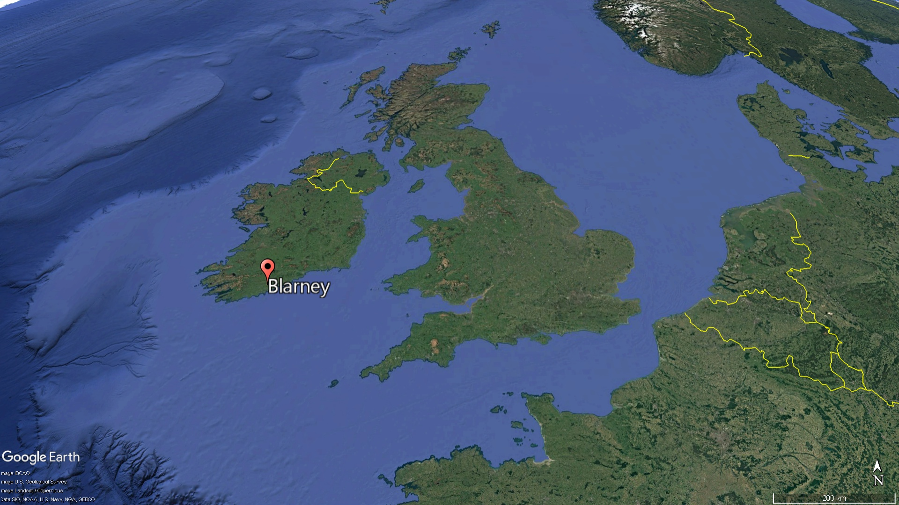

= 2025.04.10  Why Are People Getting Frisky With Statues_ Ronny Chieng on the Horny Phenomenon
:toc: left
:toclevels: 3
:sectnums:
:stylesheet: ../../../myAdocCss.css

'''

== 释义

Statues 雕像—#they're not just# fancy (a.)精美的；时髦的，豪华的 toilets 马桶 for pigeons 鸽子. They're the highest form 形式；类型 of art 艺术, an expression 表达 of beauty 美 that people come from around the world to marvel (v.)惊叹,感到惊奇，大为赞叹 at.

But some idiots 白痴 are trying to marvel (v.) their way to _second base_ 棒球术语，指“二垒”，俚语中比喻“亲密接触”（摸胸）.__ A popular tourist 游客 attraction__ 景点,有吸引力的事物；吸引力 may soon *get an overhaul* 彻底检修 because tourists won't stop (v.) *getting handsy* (a.毛手毛脚的，到处乱摸的) 动手动脚的,对某人进行不适当的身体接触或性骚扰.

REPORTER 记者，通讯员: The famous Dublin 都柏林 statue of a mythical 神话的 fishmonger 鱼贩, Molly Malone. Malone's _low-cut 低胸的 dress_ is attracting  (v.) people's _groping (摸索；搜索；搜寻；探寻) 摸索；猥亵 hands_.

[.my1]
.案例
====
.fishmonger
image:../img/fishmonger.jpg[,15%]

.Molly Malone
《茉莉·梦露》：是一首流行于爱尔兰都柏林的民谣，被视为"都柏林市"非官方主题歌曲。最早对《茉莉·梦露》的文字纪录于波士顿出版。轻快的旋律、悲伤的结局，使她在19世纪末期的美国大学校园广为流行。

image:../img/Molly Malone.jpg[,15%]

.grope

[ V]** ~ (around)(for sth)** : to try and find sth that you cannot see, by feeling with your hands 摸索；搜索；搜寻；探寻 +
•He *groped* around in the dark *for* his other sock. 他在黑暗中到处瞎摸找另一只袜子。 +

[ VN] ( informal ) to touch sb sexually, especially when they do not want you to 猥亵；摸（某人）

-> 词源同grab, grip. 由抓住引申词义摸索，探索。

====

MAN: People are rubbing (v.)摩擦 the statues /*so that* the protective 保护的 covering 覆盖层 has been rubbed away 磨掉，擦掉 already from the bronze 青铜 over a couple of years. #So we will have to# *repatinate* (v.)重新上色 this *regularly* 定期, which is a cost 成本.

That's right, horny (a.)（引起）性冲动的，欲火中烧的;好色的 morons 蠢货,低能者，愚蠢的人（复数） have groped (v.) this statue *so* hard *that* _the bronze 青铜 finish_ (n.)(末道漆；抛光；（漆完抛光后的）成品表面)表面处理 wore off 磨损. Isn't the phrase 短语，词组；惯用语，习语 "kiss me, I'm Irish," not "*motorboat (v.)用脸摩擦（俚语）,摩托艇，汽船 my* cast-iron (a.)铸铁的 *cleavage* 乳沟,劈开，分裂, I'm Irish"? #How about you *just let*# a fishmonger *monger (v.)贩卖 her fish* in peace 平静地  /*without* you morons 低能者，愚蠢的人 trying to touch (v.) her heaving 起伏的 mahi-mahis 鲯鳅鱼（俚语指胸部）. 你们能不能让这位鱼贩安心卖鱼，别用你们的脏手碰她晃荡的‘鲯鳅鱼’

[.my1]
.案例
====
.mahi-mahi
海豚鱼；, 鲯qí鳅qiū鱼（一种热带鱼，俚语中暗指胸部）

image:../img/mahi-mahi.jpg[,15%]

中文俗名三保公鱼、飞虎、海（鱼廉）、鬼头刀，英语称为“海豚鱼”（dolphinfish），**夏威夷语中称mahi-mahi，为壮硕之意。**日语中称鱪、鱰（シイラ），西班牙语称dorado，意为黄金。

.kiss me, I'm Irish
_Kiss me, I'm Irish_ is a _common phrase_ *associated with* St. Patrick's Day. It often appears (v.)on T-shirts. It originates (v.) from the legend of the _Blarney (n.v.)奉承话；谄媚；胡扯 Stone_ 巧言石, which is believed *to bring* luck and eloquence  流利的口才 *to* those who kiss (v.) it.

“吻我吧，我是爱尔兰人” 是"圣帕特里克节"的常用短语，经常出现在 T 恤上。 它源于巧言石的传说，人们相信亲吻它的人会获得好运和口才。

.St.Patrick's Day
圣帕特里克, 生前将福音传至爱尔兰，是爱尔兰最重要的天主教圣人。 +
圣帕特里克节, 是爱尔兰共和国、北爱尔兰、加拿大纽芬兰与拉布拉多省和英国海外领土蒙特塞拉特的公定假日。

.Blarney Stone
巧言石：爱尔兰布拉尼城堡的石头，相传"吻此石头"后, 即善于花言巧语。

-> Blarney 为爱尔兰一城堡名，城堡之上悬一石头，据说任何人如能亲吻该石头，即具备口苦悬河的能力。也可能直接来自拟声词，巴拉巴拉，口苦悬河。

image:../img/Blarney.webp[,49%]

====

[LAUGHTER]

It's almost—[CHEERING] Oh, #it gets worse# 情况越来越来越糟糕. #It's almost like# these people don't know they aren't real boobs 胸部, OK? It's not like a hard-boiled (a.)煮老的；煮硬的,煮得过熟了的；不动感情的 egg, where you crack (v.)敲碎 open the shell 壳 and reveal (v.)露出 real boobs 乳房 inside.

But surely 但肯定的是, people must be doing this *for a good /and not stupid reason*.

REPORTER: The practice 习俗 of rubbing (v.)摩擦；按摩 Molly Malone's breast 胸部 is believed *to have begun* around 2012, instigated (v.)煽动 by an imaginative (a.)富有想象力的 _tour guide_ 导游. They grope (v.) Molly *in the hope* it will bring them luck 运气.

"If it's lucky 如果幸运的话, I will touch it." [LAUGHS] Heh, heh, heh, heh. "If it's lucky, I touch it. If it's a whore 妓女, I fuck 性交 it." Ho, ho, ho, ho, ho.

[.my1]
.案例
====
.whore
-> 来自古英语hore,妓女，来自PIE*ka,爱，喜欢，渴望，词源同cherish,charity,caress,委婉语。比较urine.
====

Can someone in Ireland *please tell (v.) this guy that* `主` skydiving (v.)跳伞 without a parachute 降落伞 `系` is also lucky? Please.

And if you want to fondle (v.)（尤指示爱或两性间）爱抚，抚摸 a sculpture 雕塑, that's your business. But #don't act (v.) like# you're doing it for good luck, OK? You're in Ireland. If you need luck, go find a four-leaf clover 四叶草 or eat (v.) a leprechaun （爱尔兰民间传说中的）小妖精 or make a keychain 钥匙链 with Colin Farrell's （爱尔兰演员） eyebrow 眉毛.

[.my1]
.案例
====
.fondle
-> 来自fond,喜爱。

.leprechaun

A leprechaun (Irish: lucharachán/leipreachán/luchorpán) is a diminutive supernatural being in Irish folklore, classed by some as a type of solitary fairy. They are usually depicted as little bearded men, wearing a coat and hat, who partake in mischief. In later times, they have been depicted as shoe-makers who have a hidden pot of gold at the end of the rainbow.

矮妖精 （ 爱尔兰语 ： lucharachán/leipreachán/luchorpán ）是爱尔兰民间传说中一种体型娇小的超自然生物，有些人将其归类为一种孤独的仙女 。*他们通常被描绘成长着胡须、身穿外套、头戴帽子、喜欢恶作剧的小矮人 。后来，他们被描绘成鞋匠 ，在彩虹的尽头藏有一罐金子。*

Leprechaun-like creatures rarely appear in Irish mythology and only became prominent in later folklore.

类似妖精的生物, 很少出现在爱尔兰神话中，只是在后来的民间传说中才变得突出。

The leprechaun is said to be a solitary creature, whose principal occupation is making and cobbling shoes, and who enjoys practical jokes. In McAnally's 1888 account, the Leprechaun was not a professional cobbler, but was frequently seen mending his own shoes, as "he runs about so much he wears them out" with great frequency. This is, he claims, the perfect opportunity for a human being to capture the Leprechaun, refusing to release him until the Leprechaun gives his captor supernatural wealth.

据说，矮妖精是一种独居的生物，其主要职业是制作和修补鞋子，并且喜欢恶作剧。在麦卡纳利 1888 年的记述中，矮妖精并非专业的鞋匠 ，但经常被看到自己修补鞋子，因为他“跑来跑去，把鞋子磨坏了”。麦卡纳利声称，这正是人类捕捉矮妖精的绝佳机会，除非矮妖精给予捕捉者超自然的财富，否则人类不会放他走。

the leprachaun is thought to only engage in pranks on the level of mischief, and requiring special caution, but in contrast, the Aos Sí may carry out deeds more menacing to humans, e.g., the spiriting away of children.

人们认为小妖精只会做出恶作剧，需要特别小心；相比之下， Aos Sí 可能会做出对人类更具威胁性的行为，例如，绑架儿童。

====

Luckily for Molly 女子名, they *figured out 想出 a way* to protect her from these goofy (a.)愚蠢的,傻瓜的，愚笨的; 高飞（迪士尼卡通人物） dipshits 蠢货.

[.my1]
.案例
====
.goofy

.dipshit
->  dip ‎(“foolish person”) +‎ shit
====

REPORTER: `主` The practice of people *getting more* than _their eyes on the famous fishmonger_ `谓` has prompted (v.)促使 the city council 市议会 to hire (v.) stewards 管理员 to patrol 巡逻 her plinth 底座. They hope *this will be* the end of the mauling 粗手粗脚地摆弄；粗暴地对待;袭击；撕咬 of sweet Molly Malone.

[.my1]
.案例
====
.maul
(v.) +
1.( of an animal动物 ) to attack and injure sb by tearing their flesh袭击；撕咬
SYN savage +
2.to touch sb/sth in an unpleasant and/or violent way粗手粗脚地摆弄；粗暴地对待 +
3.to criticize sth/sb severely and publicly狠狠地批评；猛烈抨击 +
SYN savage +
4.( informal ) to defeat sb easily轻易击败

-> 来自古法语mail,来自拉丁语malleus,铁锤，词源同mallet.引申词义重锤敲打，伤害，打伤，以及动物袭击，撕咬等。
====

Of course, hire (v.) some cops 警察. #It's a great idea.# I mean, sorry, #we can't do anything about# your stolen car. #We're busy# *fend##ing## off* 抵挡 statue squeezers (压榨机；压榨者) 乱摸雕像的人.

I hope they _at least_ give these guys guns 枪. Because I want someone's _last words_ 遗言 to be, "Hey, everyone, check out me 后定 holding this boob 看我拿着这个胸. Oh, wait. Don't shoot 开枪. Don't shoot."

But really, the only way to protect (v.) Molly Malone is `表` to move her to my apartment 公寓. And no, it's not what you think. I will raise (v.)抚养 her like my own daughter. Day and night, I will *watch over* 照看，监视 her, *fending off* 抵挡，挡开 suitors 追求者, killing those who wish (v.) her harm 伤害, and knowing that /her safety 安全 is the only thing _that *adds* (v.) purpose 目的 *to* my life_, until one day, a nice, Irish lad 小伙子 *shows up* /and *begs (v.) for* her hand 求婚, at which point /I will then lower (v.) my rifle 步枪 /and *walk* (v.) her *down* the aisle 婚礼通道 /and say goodbye to my little girl forever.

Anyway, *turns out that* _statue groping_ isn't just happening in Ireland. It's spreading (v.) across the globe 全球 like horny COVID.

Unlucky in love 感情不顺利? Well, there's a tradition 传统 in Verona （意大利城市）, Italy, that promises (v.)承诺 to fix (v.) that. _All you have to do_ is rub (v.)the right breast of _a bronze statue_ of Shakespeare's Juliet 朱丽叶.

The problem is, _tens of thousands of people_ have been lining up 排队 to solve their love dilemmas 困境.

Yes, *I remember that scene* 场景 in Shakespeare so well. "Romeo, oh, Romeo, rub (v.) my right tit (乳头；山雀；各种小鸟) 胸部, oh, Romeo."

[LAUGHTER]

So just so I'm clear on this, thousands of people are looking for love by *standing in line* 排队等候 to touch (v.) a statue. _How about you_ 你怎么样；你呢 just turn around 转身 and say, "Hey, we're both lonely 孤独的. Let's get out of this line and touch (v.) each other."

[LAUGHTER]

And no, it's not just _women statues_ *getting action* 采取行动（俚语指“性行为”）. The _male statues_ are also getting rubbed raw (a.)(红肿疼痛的；皮肤破损的；擦伤的;（皮肤）刺痛的) 擦伤; 被摩擦得生疼.

REPORTER: Thousands of women a year *flocked (v.)蜂拥而至 to Paris* to visit this man's grave 坟墓. It's said that `主` women who *put a flower in his hat* and *kiss him on his lips* `谓` will *find a husband* within a year. Many also believe `主` the statue `谓` can encourage (v.) fertility 生育能力, which encourages (v.) other acts 行为, which can be seen by the shine 光泽 ，（太阳或其他光源）发光,照耀 in other places.

[LAUGHTER]

Hey, buddy, how about you *save* (v.)（为某人）保留 some of _over-the-pants handjobs_ 隔着裤子的自慰,隔着裤子的手淫 *for* the rest of us 我们其他人? I mean, these people are *dry humping* (v.)干磨蹭（指模拟性交但未真正插入的猥亵动作) a dead guy who's just trying *to rest (v.) in peace* 安息 when they could *be going to town* 大干一场, 尽情享受 on this _Dwyane Wade_ statue. I mean, look, he's practically *begging (v.)乞求 for it* 他实际上是在乞求它.

[.my1]
.案例
====
嘿老兄，你能不能把‘隔裤自摸’的机会留点给别人？我是说，这些人宁可对一个只想安息的死人‘空气运动’，也不去玩德怀恩·韦德的雕像——你看他简直在求你们摸他！

go to town​​：俚语指“尽情放纵” +
Dwyane Wade​​：NBA退役球星，以其性感形象闻名.
调侃 韦德雕像的姿势(两手向下指), 像在邀请被摸（"begging for it" 是"性明示"俚语）

.Dwyane Wade
image:../img/Dwyane Wade.webp[,15%]

雕像被认为和Wade完全不像.
====

If there's a _silver lining_ 一线希望;银色衬里，指令人安慰或希望的前景 to these sexy statues, *it's that* they are forcing (v.) _dumb 愚蠢的 people_ to learn (v.) something. I mean, maybe Americans would *be more interested (a.) in* history /if we *slap* (v.)拍打,（尤指生气地）啪的一声放下 some boobs *on* Mount Rushmore 拉什莫尔山.

[.my1]
.案例
====
.Mount Rushmore

====

[LAUGHTER]

"Hey, Dad, do you know George Washington had wooden teeth 木制假牙 and pepperoni 意大利辣香肠 nipples 乳头?"

[LAUGHTER]

[.my1]
.案例
====
华盛顿有几套假牙. 但与流行迷信不同，假牙不是由木头制作的。华盛顿的肖像总有一个别扭的嘴型，这都是假牙套惹的祸。 +
意大利辣肠乳头（Pepperoni nipples）​,完全虚构​, 这是脱口秀演员的​无厘头恶搞.
====

Thanks, statues.

'''

== 中文翻译

雕像——它们不只是鸽子的豪华马桶。它们是艺术的最高形式，是美的表达，吸引着世界各地的人们前来惊叹。

但有些白痴试图用“惊叹”的方式摸到“二垒”。一个热门旅游景点可能很快就要大修，因为游客们总是忍不住动手动脚。

记者：都柏林著名的神话鱼贩雕像——莫莉·马隆。莫莉的低胸连衣裙, 吸引了人们摸索的手。

路人：人们一直在摸雕像，以至于几年间青铜表面的保护层已经被磨掉了。所以我们得定期重新上色，这是一笔开销。

没错，这些饥渴的蠢货, 摸雕像摸得太狠，连青铜表面都磨掉了。难道爱尔兰的俗语不是“亲我，我是爱尔兰人”，而是“用脸蹭我的铸铁乳沟，我是爱尔兰人”吗？你们能不能让这位鱼贩安心卖鱼，别用你们的脏手碰她的“起伏鲯鳅鱼”？

[笑声]

简直——[欢呼声] 哦，更糟的是，这些人似乎不知道雕像的胸部不是真的。这又不是煮鸡蛋，敲开壳就能看到真胸。

但这些人肯定是有正当理由才这么做的，对吧？

记者：*摸莫莉·马隆胸部的习俗, 据说始于2012年，是一位想象力丰富的导游煽动的。他们摸莫莉, 是希望能带来好运。*

“如果摸它能带来好运，我就摸。”[笑] 嘿嘿嘿嘿。“如果摸它能带来好运，我就摸。如果它是妓女，我就操它。”呵呵呵呵。

爱尔兰的朋友们，能不能告诉这家伙，不戴降落伞跳伞, 也能带来好运？求求了。

**如果你想摸雕塑，那是你的事。但别假装是为了好运，行吗？**你可是在爱尔兰。如果你需要运气，去找四叶草，或者吃个小妖精，再不然用科林·法瑞尔的眉毛做个钥匙链。

幸运的是，他们终于找到了保护莫莉不被这些蠢货骚扰的办法。

记者：由于游客对这位著名鱼贩的“过度关注”，市议会决定雇佣管理员, 巡逻雕像底座，希望能终结对莫莉的粗暴对待。

当然，雇几个警察真是个好主意。我是说，*抱歉，你的车被偷了我们管不了，因为我们正忙着阻止摸雕像的变态。*

我希望至少给他们配枪。因为我希望某个人的遗言是：“嘿，大家快看，我正摸着这个胸。哦等等，别开枪！别开枪！”

但说实话，保护莫莉的唯一办法, 是把她搬到我公寓。别想歪了，我会像养女儿一样照顾她。日日夜夜，我会守护她，赶走追求者，杀掉想伤害她的人，并坚信, 她的安全是我生命唯一的意义，直到某天一个爱尔兰小伙来求婚，那时我会放下步枪，牵她走过红毯，永远告别我的“小女儿”。

不过，摸雕像的现象不只发生在爱尔兰，它正像“好色新冠”一样全球蔓延。

情场失意？意大利维罗纳有个传统, 能解决这个问题——只要摸莎士比亚笔下朱丽叶铜像的右胸就行。

问题是，成千上万的人排队摸雕像来解决爱情困境。

是啊，我太记得莎士比亚的那一幕了：“罗密欧，哦罗密欧，摸摸我的右胸，哦罗密欧。”

[笑声]

所以我确认一下：*成千上万的人排队摸雕像找对象？你们不如转身说：“嘿，咱俩都单身，不如别排队了，直接互相摸吧。”*

[笑声]

而且，不只是女性雕像遭殃，男性雕像也被摸得掉漆。

记者：每年有数千女性涌向巴黎, 拜访"这个男人的墓"。*传说女性若在他帽子上放朵花, 并亲吻他的嘴唇，一年内就能找到丈夫。许多人还相信这尊雕像能助孕，因此某些部位被摸得锃亮。*

[笑声]

老兄，给别人留点隔着裤子的自慰机会行吗？这些人宁可对一具想安息的尸体, 上下其手，也不去摸德怀恩·韦德的雕像。你看，他简直在求你们摸他。

*要说这些性感雕像有什么好处，那就是它们逼着蠢货学点历史。或许给拉什莫尔山总统像加个胸，美国人就会更爱历史了。*

[笑声]

“老爸，你知道乔治·华盛顿是木牙配意大利辣肠乳头吗？”

[笑声]

谢谢啊，雕像。

'''

== Baseball metaphors for sex 棒球中的性隐喻

Baseball 棒球 metaphors (n.)隐喻 for sex 性行为​​

[.my1]
.案例
====
.metaphor
-> meta-,改变，-phor,带来，词源同bring.引申词义改变方式，用于语法指暗喻，隐喻。
====

In American slang 俚语, baseball metaphors (n.) for sex #are often used as euphemisms (n.)委婉语 for# the degree of _physical intimacy_ (n.)(亲密；性，性关系) 身体亲密 achieved in _sexual encounters_ 性接触 or relationships. In the metaphor, first prevalent (a.)流行的 in the aftermath (n.)后果，余波 of World War II, sexual activities are described *as if* they are actions in a game of baseball. Baseball has also *served as* the context 背景 for metaphors about sexual roles 性角色 and identity 身份.

[.my1]
.案例
====
.euphemism
-> eu-, 好的。-phem, 说，词源同fame, phone.
====

`主` Among _the most commonly used metaphors_ `系` is the progress 进展 of a batter 击球手 and base-runner 跑垒员 in describing (v.) levels of _physical intimacy_ (traditionally from a heterosexual 异性恋的 perspective 视角). Definitions vary (v.)变化, but `主` #the following `系` *are* typical usages 用法；惯例 of the terms#:

- ​​Strikeout 三振出局​​ – a failure *to engage in* any form of foreplay (n.)前戏；性交前的爱抚 or other sexual activity;
- ​​First base 一垒​​ – mouth-to-mouth kissing 接吻, especially _French kissing_ 法式热吻;
- ​​Second base 二垒​​ – skin-to-skin touching/kissing of the breasts 胸部; in some contexts, #it may instead *refer to*# 指代 touching any erogenous (a.)唤起情欲的；性感的；性欲发生的（等于 erotogenic） zones 性感带 through the clothes;
- ​​Third base 三垒​​ – touching (v.) below the waist 腰部 or _manual stimulation_ 用手刺激 of the genitals (n.)生殖器；外阴部; in some contexts, #it may instead refer to# oral stimulation 口部刺激 of the genitals;
- ​​Home run 全垒打 (home base or scoring 得分)​​ – "full" (penetrative (a.)插入的,渗透的；有穿透力的) sexual intercourse 性交.

The metaphors are found variously 不同地；多方面地 in popular American culture, #with one well-known example# in the Meat Loaf 肉饼,肉块 song "Paradise 天堂，天国；乐土 by the Dashboard Light 仪表灯", which describes a young couple "*making out*" 亲热, with a voice-over (n.)画外音；（电影或电视）旁白 commentary 现场解说，实况报道 of a portion of a baseball game, as a metaphor for the couple's activities.

A similar example can be found in Billy Joel's song "Zanzibar", in which he compares himself to Pete Rose and sings the lines, "Me, I'm trying just to get to second base and I'd steal it if she only gave the sign." Trace Adkins's 2006 song "Swing" is based on the same concept 概念, while the protagonist 主角 in Brad Paisley's 2007 song "Online" is described as having never been to second base with a woman.

Baseball positions 位置 are used as a coded reference 编码参考 to the roles played by men who have sex with men:

- ​​Pitcher 投手​​ – _the penetrative (a.) partner_ 配偶，（同居的）伴侣，情人 in anal sex 肛交;
- ​​Catcher 捕手​​ – _the receptive (a.)接受的;能容纳的，可以接受的；（对治疗）反应良好的；（雌性动物）处于发情期的 partner_ in anal sex.

Similar metaphors for _sexual identity_ (身份，本体)性认同；性身份；性自认 include:

- ​​Switch hitter 左右开弓的击球手​​ – a bisexual 双性恋的 individual, referencing (v.)提及，提到；引用，参照（某书或某作者） a player who can bat (v.)击球 from either side;
- ​​Playing for the other team / Batting (v.) for the other team​​ – indicating 表明，要求；暗示；指示 a person is gay or lesbian 同性恋的;
- ​​Playing for both teams / Batting for both teams​​ – indicating a person is bisexual.

The sequence 顺序 of "running the bases" is often regarded as a script 脚本 for young people experimenting with sexual relationships. The script may have slightly changed since the 1960s. Kohl and Francoeur state that with the growing emphasis 强调 on safe sex 安全性行为 in the 1990s, the "home run" has taken on the additional dimension 维度 of oral sex 口交. Richters and Rissel conversely state that "third base" is now sometimes considered to comprise 包含 oral sex as part of the accepted pattern 模式 of activities.

The use of baseball as a sexual script has been critiqued (v.)批评 by sexuality educators for *misrepresenting* (v.)歪曲 sex *as* a contest 竞赛 with a winner and loser. Deborah Roffman *writes (v.) that* the baseball metaphor has been "insidiously (ad.)阴险地；隐伏地；暗中为害地 powerful 阴险而强大的, singularly effective 特别有效的, and very efficient...as a vehicle 工具 for transmitting (v.)传递 unhealthy sexual attitudes."

There are conflicting perspectives 观点 on the use of the baseball metaphor in sex education 性教育. Some educators find it an effective instructional 教学的 tool, while others argue it reflects U.S. ideas about sex as a contest to be won, rather than a mutual 相互的 and consensual 双方同意的 activity. Critiques suggest alternatives like "sharing a pizza" as a metaphor emphasising mutual enjoyment 共同享受.

​​中文翻译：​​
​​用棒球隐喻性行为​​

在美国俚语中，棒球常被用作"性行为"中, 身体亲密程度的委婉隐喻。这种比喻最早流行于二战后，将"性行为"描述为棒球比赛中的动作。棒球也被用作性角色和身份认同的隐喻背景。

最常见的隐喻是, 用击球手和跑垒员的进展, 来比喻身体亲密程度（传统上以异性恋视角）。定义各有不同，但典型用法如下：

- ​​三振出局​​：未能进行任何形式的前戏或性活动；
- ​​一垒​​：口对口**接吻**，尤其是法式热吻；
- ​​二垒​​：肌肤相亲的**胸部爱抚**或亲吻；某些情况下也指隔着衣物触摸性感带；
- ​​三垒​​：腰部以下的触摸或用手**刺激生殖器**；某些语境下也指口交；
- ​​全垒打​​：指**插入式性交**。

这些隐喻, 广泛存在于美国流行文化中，例如摇滚歌手Meat Loaf的歌曲《仪表盘灯下的天堂》中，用棒球比赛的解说, 隐喻年轻情侣的亲热行为。比利·乔尔的歌曲《桑给巴尔》中，他自比棒球明星皮特·罗斯，唱道：“我连二垒都难攻占，若她暗示我必盗垒。”

棒球位置, 也被用来隐喻男男性行为中的角色：

- ​​投手​​：肛交中的插入方；
- ​​捕手​​：接受方。

其他相关隐喻包括：

- ​​左右开弓击球手​​：双性恋者；
- ​​为另一队效力​​：指同性恋；
- ​​为两队效力​​：指双性恋。

“跑垒”顺序, 常被视为年轻人探索性关系的脚本。这一脚本自1960年代以来略有变化，例如1990年代后，“全垒打”增加了口交的含义。但也有性教育者批评, 该隐喻将性扭曲为输赢竞赛，而非双方同意的互动。部分教材提出替代隐喻（如“分享披萨”）以强调共同愉悦

Some of the girls at my school *talk about* how their boyfriends got to first, second, or third base with them. *I feel kind of left out* because I don't know exactly what they are. Could you tell me what the bases are for girls and guys? #I'd really appreciate it.#

我学校里有些女生会跟她们聊起她们的男朋友是怎么跟她们一起打一垒、二垒或三垒的。我感觉有点被冷落了，因为我不知道具体是什么垒。你能告诉我男生和女生的垒分别是什么吗？非常感谢。

Sports metaphors have a long history in American popular culture. From football to baseball, #they’ve been used (v.) to talk about# war, politics, and yes, sex.

体育隐喻在美国流行文化中源远流长。从橄榄球到棒球，它们被用来谈论战争、政治，当然还有性。

The baseball metaphor *can mean (v.) different things* to different people. While there are no _standard definitions_, one popular version suggests (v.) that “first base” is *kissing*, “second base” is *touching (v.) a woman’s breast*, and “third base” involves *touching (v.) someone else’s genitals*. “Scoring” or “hitting a home run” usually *refers to* _vaginal intercourse_ *that ends (v.) with* someone with a penis having an orgasm 性高潮；极度兴奋 and ejaculating 射精；射出液体.

棒球的隐喻, 对不同的人有不同的含义。虽然没有标准定义，但**一个流行的版本认为, “一垒”指的是接吻，“二垒”指的是触摸女性的胸部，“三垒”指的是触摸他人的生殖器。“得分”或“打出本垒打”通常指的是阴道性交，**最终以拥有阴茎的人达到高潮并射精而告终。

Despite its cultural popularity, the baseball metaphor can be very problematic (a.)成问题的，有困难的；未确定的. At its core, it *presents* (v.) sex *as* a game between two opposing (a.)对抗的，反对的 teams. This usually *takes place* 发生 between those who *identify (v.)认出，识别 as* men /and those who *identify as* women, #with the expectation 期待，预期 that# one partner (usually the man) aggressively tries (v.) to move the game forward. While the other (usually the woman) tries *to resist* or *slow it down*. In this game, the man is usually the player, and the woman is the field *upon which* the game is played.

尽管棒球的隐喻在文化上很流行，但它也可能存在很大问题。其核心在于，它把性描绘成两支对立队伍之间的游戏。这种游戏通常发生在认同自己是男性和认同自己是女性的人之间，期望一方（通常是男性）积极地推动游戏进展。而另一方（通常是女性）则试图抵抗或拖延游戏进程。在这场游戏中，男性通常是玩家，而女性则是游戏的场地。

'''

== pure

Statues—they're not just fancy toilets for pigeons. They're the highest form of art, an expression of beauty that people come from around the world to marvel at.

But some idiots are trying to marvel their way to second base. A popular tourist attraction may soon get an overhaul because tourists won't stop getting handsy.

REPORTER: The famous Dublin statue of a mythical fishmonger, Molly Malone. Malone's low-cut dress is attracting people's groping hands.

MAN: People are rubbing the statues so that the protective covering has been rubbed away already from the bronze over a couple of years. So we will have to repatinate this regularly, which is a cost.

That's right, horny morons have groped this statue so hard that the bronze finish wore off. Isn't the phrase "kiss me, I'm Irish," not "motorboat my cast-iron cleavage, I'm Irish"? How about you just let a fishmonger monger her fish in peace without you morons trying to touch her heaving mahi-mahis.

[LAUGHTER]

It's almost—[CHEERING] Oh, it gets worse. It's almost like these people don't know they aren't real boobs, OK? It's not like a hard-boiled egg, where you crack open the shell and reveal real boobs inside.

But surely, people must be doing this for a good and not stupid reason.

REPORTER: The practice of rubbing Molly Malone's breast is believed to have begun around 2012, instigated by an imaginative tour guide. They grope Molly in the hope it will bring them luck.

"If it's lucky, I will touch it." [LAUGHS] Heh, heh, heh, heh. "If it's lucky, I touch it. If it's a whore, I fuck it." Ho, ho, ho, ho, ho.

Can someone in Ireland please tell this guy that skydiving without a parachute is also lucky? Please.

And if you want to fondle a sculpture, that's your business. But don't act like you're doing it for good luck, OK? You're in Ireland. If you need luck, go find a four-leaf clover or eat a leprechaun or make a keychain with Colin Farrell's eyebrow.

Luckily for Molly, they figured out a way to protect her from these goofy dipshits.

REPORTER: The practice of people getting more than their eyes on the famous fishmonger has prompted the city council to hire stewards to patrol her plinth. They hope this will be the end of the mauling of sweet Molly Malone.

Of course, hire some cops. It's a great idea. I mean, sorry, we can't do anything about your stolen car. We're busy fending off statue squeezers.

I hope they at least give these guys guns. Because I want someone's last words to be, "Hey, everyone, check out me holding this boob. Oh, wait. Don't shoot. Don't shoot."

But really, the only way to protect Molly Malone is to move her to my apartment. And no, it's not what you think. I will raise her like my own daughter. Day and night, I will watch over her, fending off suitors, killing those who wish her harm, and knowing that her safety is the only thing that adds purpose to my life, until one day, a nice, Irish lad shows up and begs for her hand, at which point I will then lower my rifle and walk her down the aisle and say goodbye to my little girl forever.

Anyway, turns out that statue groping isn't just happening in Ireland. It's spreading across the globe like horny COVID.

Unlucky in love? Well, there's a tradition in Verona, Italy, that promises to fix that. All you have to do is rub the right breast of a bronze statue of Shakespeare's Juliet.

The problem is, tens of thousands of people have been lining up to solve their love dilemmas.

Yes, I remember that scene in Shakespeare so well. "Romeo, oh, Romeo, rub my right tit, oh, Romeo."

[LAUGHTER]

So just so I'm clear on this, thousands of people are looking for love by standing in line to touch a statue. How about you just turn around and say, "Hey, we're both lonely. Let's get out of this line and touch each other."

[LAUGHTER]

And no, it's not just women statues getting action. The male statues are also getting rubbed raw.

REPORTER: Thousands of women a year flocked to Paris to visit this man's grave. It's said that women who put a flower in his hat and kiss him on his lips will find a husband within a year. Many also believe the statue can encourage fertility, which encourages other acts, which can be seen by the shine in other places.

[LAUGHTER]

Hey, buddy, how about you save some of over-the-pants handjobs for the rest of us? I mean, these people are dry humping a dead guy who's just trying to rest in peace when they could be going to town on this Dwyane Wade statue. I mean, look, he's practically begging for it.

If there's a silver lining to these sexy statues, it's that they are forcing dumb people to learn something. I mean, maybe Americans would be more interested in history if we slap some boobs on Mount Rushmore.

[LAUGHTER]

"Hey, Dad, do you know George Washington had wooden teeth and pepperoni nipples?"

[LAUGHTER]

Thanks, statues.

'''