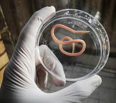
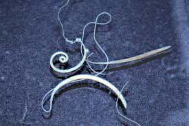

= Pet Poop  宠物粪便中, 会带有能传染人的寄生虫
:toc: left
:toclevels: 3
:sectnums:
:stylesheet: ../myAdocCss.css

'''

== Leaving Pet Poop on the Sidewalk Isn’t Only Bad Manners—It’s Hazardous 将宠物粪便留在人行道上不仅是不礼貌的行为，而且很危险

As a small-animal _primary 主要的；最重要的；基本的 care_ 初级治疗，初级护理 veterinarian 兽医, I deal with the diseases of dog and cat poop （儿语）屎；拉屎 *on a daily basis* 表示某些事情是每天发生的, 或以每天为单位进行的.  Feces 排泄物，粪便；渣滓 represent (v.) potential zoonotic 动物传染病的 hazards 危害,危险, meaning they can transmit (v.)传播；传染 disease from the animals to people.

[.my2]
作为一名小动物初级保健兽医，我每天都处理狗和猫粪便的疾病。粪便代表了潜在的人畜共患病危害，这意味着它们可以将疾病从动物传播给人类。

The reality is that /waste left (v.) to wash (v.) into the soil, #whether# in a neighborhood 附近；街坊；街区, trail （乡间的）小路，小径;（特定）路线，路径 #or# dog park, can spread life-threatening parasites 寄生虫 not just among dogs and cats, but also to wild animals and people of all ages. A 2020 study found /intestinal parasites 肠道寄生虫 in 85% of off-leash 不拴绳的 dog parks across the United States.

[.my2]
现实情况是，无论是在社区、步道还是狗公园，*被冲入土壤的废物, 不仅会在狗和猫之间传播危及生命的寄生虫，还会在野生动物和各个年龄段的人之间传播。* 2020 年的一项研究发现，美国 85% 的不拴绳遛狗公园, 都存在肠道寄生虫。

==== ABANDONED POOP’S IMPACT (v.) ON PEOPLE

[.my2]
废弃粪便对人类的影响

Common dog poop parasites 寄生虫 /include hookworms 钩虫（寄生于人或动物肠道）, roundworms 蛔虫, coccidia 球虫 and whipworms 鞭虫. Hookworms and roundworms can thrive  (v.) in a variety of species, including humans.

[.my2]
常见的狗粪便中的寄生虫包括: 钩虫、蛔虫、球虫和鞭虫。*钩虫和蛔虫可以在包括人类在内的多种物种中, 繁衍生息。*

[.my1]
.案例
====
.hookworm
"钩虫"是"钩口科线虫"的统称，**发达的口囊, 是其形态学的特征。**在寄生人体消化道的线虫中，钩虫的危害性最严重，由于钩虫的寄生，可使人体长期慢性失血，从而导致患者出现贫血及与贫血相关的症状。 +
image:../img/hookworm.jpg[,10%]

钩虫是一种常见的肠道寄生虫，它只有1cm左右长，**寄生于人的十二指肠及小肠里。**每条钩虫一天就可产卵上万个，这些钩虫卵随粪便排出人体外，在适当的条件下就可孵出幼虫。 +

除少部分因食入受污染含虫卵的食物，**主要为赤脚行走在被污染的土壤上感染。幼虫穿过皮肤进入血管，被血液带至肺部（与蛔虫不同，钩虫通常不会引起肺炎），**幼虫从肺部向上移动到气管，被吞咽并带至肠道，完成迁徙周期。

如果，人类接触到"狗钩虫"或"猫钩虫"的幼虫，或某些其他不会感染人类的钩虫，**幼虫可能会穿透皮肤。** +
**有时，幼虫无法在人类中完成它们的迁徙周期。反而，幼虫在皮肤下方迁移，产生蛇状斑纹。**这被称为蠕动性喷发或皮肤幼虫移行症。

具体病征视乎致病物种，*不同物种所引起的病征及病况或有不同。但当中一个病征是"缺铁性贫血"的出现：这是因为当患者体内有大量钩虫存在，这些钩虫会在宿主的肠壁吸走血液，造成贫血。此外，伤口亦会造成十二指肠溃疡。*

.roundworm
a small worm that lives in the intestines of pigs, humans and some other animals 蛔虫；线虫 +

是一种常见的肠道寄生虫，也作“蚘虫”，属于线虫动物门，最长可达35 cm。蛔虫会导蛔虫病. +
蛔虫的身体为灰白色长圆柱状，**长约15—35厘米，形似蚯蚓。尾部向腹面弯曲，**有交合刺两枚；雌虫稍长而粗，圆锥形尾部不弯曲。

蛔虫**寄生在人的小肠中，**吸取人腹内的营养物质，**靠摄取肠内半消化的食物生存。因此，感染蛔虫易造成儿童营养不良。** +
蛔虫成虫在人小肠内产卵，**虫卵随粪便排出人体外。当虫卵存在于水中或附着于水果、蔬菜等上而从人口进入时，对人来说便是感染上蛔虫了。**从小肠到体外，再从人口进入，这就是蛔虫此物种的生存循环过程。

.coccidia
球虫.

球虫病, 是由名为"球虫"的原生动物引起的动物肠道寄生虫病 。 **该病通过接触被污染的粪便, 或摄入被感染的组织, 来在动物个体间传播。 其主要症状为腹泻 ，情况严重时可能出现便血。**大多数感染球虫的动物无症状 ，但幼小或免疫缺陷的动物可能会出现严重症状，甚至死亡。

**不同的球虫, 能感染各种各样的动物，**包括人类、鸟类和 牲畜，然而一种类型的球虫引发的感染通常只针对特定物种。 一个众所周知的例外是**由"弓形虫"造成的"弓形体病", 会感染人。**  弓形虫是一种细胞内寄生的原虫，以猫科动物为最终宿主，但大多数冷血动物和温血动物都会被感染. +
**人类可能在养育受感染的小狗小猫时, 首次接触和了解到"球虫"。**与"弓形虫"不同的是，"球虫病"的病原体只针对猫和狗，不会传染给人类，这与其他人畜共患疾病不同。

image:../img/coccidia.jpg[,10%]

.whipworm

鞭虫病属于土壤媒介的蠕虫病，这个疾病通常借由含有鞭虫卵的饮水或食物传播. *鞭虫的成虫会寄生在大肠，长度约4公分.*

====

Their microscopic 极小的；微小的；需用显微镜观察的 larvae 幼虫，幼体(larva 的复数) can get into your body through small scratches （皮肤或物体表面上的）划痕，划伤 in your skin after contact with contaminated 受污染的，弄脏的 soil or via accidental 意外的，偶然的 oral ingestion 摄取；吸收；咽下. Remember that /next time you’re outside and wipe sweat from your face with a dirty hand /and then lick (v.)舔 your lips or take a drink – it’s that simple. After hose （灭火、浇花等用的）橡皮管，塑料管，水龙带 or rain water *has rinsed* (v.)（用清水）冲洗，洗涮 contaminated poop *into* the soil, these parasite 寄生虫 eggs can survive and infect (v.)传染；使感染 for months or years to come.

[.my2]
**它们的微小幼虫, 可以在接触受污染的土壤后, 通过皮肤上的小划痕或意外口服, 进入您的体内。**请记住，下次您外出时，用脏手擦去脸上的汗水，然后舔嘴唇或喝一杯水 - 就这么简单。*在软管或雨水将受污染的粪便冲入土壤后，这些寄生虫卵可以存活并感染数月或数年。*

Once in the human body, both hookworm and roundworm larvae /can mature (v.) and migrate (v.) through the bloodstream into the lungs. From there, coughs help them gain access to _the digestive tract_ of their host, where they leach (v.)过滤；滤去 nutrients 营养物；养分 by attaching to the intestinal wall. People with healthy immune systems may show no clinical signs of infection, but in sufficient quantities 数量 /these parasites can lead to anemia 贫血；贫血症 and malnourishment 营养不良. They can even cause _an intestinal obstruction_ 肠梗阻,肠道阻塞 which may require surgical intervention, especially in young children.

[.my2]
**一旦进入人体，钩虫和蛔虫幼虫, 都会成熟, 并通过血流迁移到肺部。从那里，咳嗽帮助它们进入宿主的消化道，在那里它们通过附着在肠壁上吸收营养。免疫系统健康的人, 可能不会表现出感染的临床症状，但这些寄生虫数量足够多时, 可能会导致贫血和营养不良。它们甚至可能导致肠梗阻，**可能需要手术干预，尤其是对于幼儿。

Additionally, larval stages of roundworms /can move into the human eye and, in rare cases, lead to permanent blindness. Hookworms can create a severely itchy 发痒的 condition called cutaneous (a.)皮肤的；侵犯皮肤的 _larva migrans_ 幼虫移行症 /as the larval worm moves (v.) just under the skin of its host.

[.my2]
此外，*蛔虫的幼虫阶段可以进入人眼，在极少数情况下，会导致永久性失明。当钩虫幼虫在宿主皮肤下移动时，会引起严重瘙痒，称为"皮肤幼虫移行症"。*

Once the parasite’s life cycle is complete, it may exit the host’s body /as an intact (a.)完好无损；完整 adult worm, which looks like a small piece of cooked spaghetti  意大利式细面条.

[.my2]
**一旦寄生虫的生命周期完成，它可能会以完整的成虫形式, 离开宿主的身体，**看起来就像一小块煮熟的意大利面条。

[.my1]
.案例
====
.Bowel obstruction 或 Intestinal obstruction
肠梗阻. +
系为肠部的机能性阻塞，造成无法正常进行消化运动. 发生部位可能是小肠或是大肠，症状及体征有肚子痛、呕吐、腹部胀气和无法排气. +
image:../img/Intestinal obstruction.avif[,40%]

.larva migrans
image:../img/larva migrans.jpg[,10%]

====

==== THE IMPACT ON OTHER ANIMALS

[.my2]
对其他动物的影响

Dogs and cats can also develop the same symptoms 后定 people do /due to parasitic infections. In addition to risks of hookworms and roundworms, pets are also vulnerable to whipworm, giardia 贾第虫属 and coccidia.

[.my2]
狗和猫也可能因寄生虫感染, 而出现与人类相同的症状。除了钩虫和蛔虫的风险外，宠物还容易感染鞭虫、贾第鞭毛虫和球虫。

[.my1]
.案例
====
.giardia
image:../img/giardia.jpg[,10%]
====

Beyond parasites, unattended 未被处理的 poop may also be contaminated with _canine 犬的；似犬的 or feline 猫似的；猫科动物的 viruses_, such as parvovirus 细小病毒, _distemper 瘟热（动物，尤指猫、狗的传染病） virus_ and _canine coronavirus_ 犬冠状病毒, that can create life-threatening disease in other dogs and cats, especially in adult animals that are unvaccinated (a.)未接种疫苗的 and puppies 小狗 and kittens.

[.my2]
除了寄生虫之外，**无人看管的粪便, 还可能被犬或猫病毒污染，**例如细小病毒、犬瘟热病毒, 和犬冠状病毒，**这些病毒可能会给其他狗和猫带来危及生命的疾病，**特别是在未接种疫苗的成年动物以及小狗和小猫中。

[.my1]
.案例
====
.canine +
-> 来自PIE kwon, 狗，拟声词，词源同 canary, cynic.

====

These viruses attack (v.) rapidly dividing cells, in particular _the intestinal lining_ 肠壁,肠道内部的黏膜层 and _bone marrow_ 骨髓, leaving them unable to absorb nutrients appropriately /and unable to produce replacement red and white blood cells that help defend (v.) against these and other viruses. Vaccination 接种疫苗，种痘 can protect pets.

[.my2]
**这些病毒攻击快速分裂的细胞，特别是肠道内壁和骨髓，使它们无法适当吸收营养，也无法产生替代的红细胞和白细胞, 来帮助防御这些病毒和其他病毒。**疫苗接种可以保护宠物。

Many species of local wildlife are within 不出（某范围或限度）；在（某范围）之内 the canid and felid family groups. They, too, are susceptible (a.)易受影响（或伤害等）；敏感；过敏 to many of the same parasites and viruses as pet dogs and cats – while being much less likely to have received the benefit of vaccinations. Coyotes 丛林狼，草原狼（犬科动物，分布于北美）, wolves, foxes, raccoons, minks 水貂 and bobcats 短尾猫，红猫（北美野猫） are at risk of contracting parvovirus 细小病毒, coronavirus and distemper 瘟热（动物，尤指猫、狗的传染病）.

[.my2]
**许多当地野生动物, 属于犬科动物和猫科动物。它们也像宠物狗和猫一样, 容易受到许多相同的寄生虫和病毒的影响，但接种疫苗的可能性却要小得多。**土狼、狼、狐狸、浣熊、水貂和山猫, 有感染细小病毒、冠状病毒和犬瘟热的风险。

[.my1]
.案例
====
.coyote
-> 来自南美土著语。

.mink
image:../img/mink.jpg[,10%]

.bobcat
image:../img/bobcat.jpg[,10%]

====

==== RESPONSIBLE (a.)（对某人、某事）负责的 PET POOP MANAGEMENT

[.my2]
负责任的宠物粪便管理

So, wherever your dog or cat relieves himself – at the park, in the woods, on the sidewalk, or even in your yard – pick up that poop /but always avoid contact with your skin. It’s safest to use a shovel 铲；铁铲 to place (v.) the poop directly into a plastic bag, or put a baggie 巴吉袋（用于包三明治等的透明小塑料袋） over your hand to grab (v.)攫取，抓住 the poop /and then pull （向某方向）拖，拉动 the plastic bag over it. While it’s tempting to leave the “soft-serve” 软冰淇淋 or _watery (a.)含水的；水分很多的 poops_ behind, these are often the more likely culprits 肇事者；引起问题的事物 for spreading diseases.

[.my2]
因此，无论您的狗或猫在哪里大小便——在公园、在树林、在人行道上，甚至在您的院子里——都要**捡起粪便，但始终避免接触您的皮肤。最安全的方法是用铲子将粪便直接放入塑料袋中，或者将一个袋子放在手上以抓住粪便，然后将塑料袋套在上面。** 虽然人们很想把**“软便”或水样便便**抛在脑后，但这些**往往更可能是传播疾病的罪魁祸首。**

[.my1]
.案例
====
.baggie
image:../img/baggie.jpg[,10%]

.soft-serve

.culprit
-> 来自culp-,责备，谴责，词源同inculpable.

====

Tie up 系紧；捆牢；拴住；扎紧 the bag and make sure to place it in a trash can – not on top – to avoid inadvertent (a.)疏忽的；不注意的 contamination of a neighbor or sanitation 卫生设备；卫生设施体系 worker. Promptly 迅速地；立即，马上 wash (v.) your hands, particularly before touching your face or eating or drinking. Hand sanitizers 消毒杀菌剂 can take care of 照顾，照料 many viruses on your skin, but they won’t kill parasite eggs.

[.my2]
*扎紧袋子, 并确保将其放入垃圾桶中（而不是放在上面），以避免无意中污染邻居或环卫工人。立即洗手，尤其是在触摸脸部或进食或饮水之前。洗手液可以杀死皮肤上的许多病毒，但不能杀死寄生虫卵。*

Other potential sources of #poop# – and parasite – #exposure# /are the sandbox, beaches and park sand 后定 found (v.)把…基于；把…建立在 under and around playgrounds. Sand is comfortable to lounge (v.)懒洋洋地站（或坐、躺）着 on, fun to construct (v.)建筑；修建；建造 into castles, and softens (v.)减轻；减缓；削弱 the impact if you fall off _a play structure_ 游乐设施. But cats and other small mammals love (v.) to use it as a litter box /since it’s easy to dig and absorbs (v.) moisture 潮气，水分. Covering sandboxes when not in use /and closely monitoring your environment at the beach and playground /are key steps toward minimizing (v.) the risks of exposure for everyone.

[.my2]
**粪便和寄生虫暴露的其他潜在来源, 是**游乐场下方和周围的**沙箱、海滩和公园沙子。沙子躺在上面很舒服，**建造城堡很有趣，并且可以减轻从游乐设施上摔下来时的冲击力。**但猫和其他小型哺乳动物喜欢用它作为垃圾箱，**因为它很容易挖掘并吸收水分。不使用时覆盖沙箱, 并密切监测海滩和游乐场的环境, 是最大限度降低每个人暴露风险的关键步骤。

By *keeping* your pets *on* regular _parasite prevention protocols_ 科学实验计划；医疗方案, with annual testing for intestinal parasites and routine removal of fecal material from the environment, you can help to minimize (v.) the potential for these diseases among all the mammals in your environment – human, pet and wild.

[.my2]
通过让您的宠物定期预防寄生虫，**每年检测肠道寄生虫, 并定期清除环境中的粪便，**可以帮助您最大程度地减少环境中所有哺乳动物（人类、宠物和野生动物）感染这些疾病的可能性。

Key points to remember (v.) to avoid parasites and minimize (v.) the impact on your ecosystem:

[.my2]
避免寄生虫, 并尽量减少对生态系统的影响, 需要记住的要点：

- Pick waste up /and safely throw it out /regardless of where your pet poops (v.). Sanitize (v.)（用化学制剂）消毒，使清洁 your hands afterward.

[.my2]
无论您的宠物在哪里排便，都要捡起废物并安全地扔掉。*之后消毒双手。*

- Wash your hands before eating or touching your face /while gardening (v.)做园艺工作；种植花木 or working in the yard.

[.my2]
*在园艺或在院子里干活时，吃饭或触摸脸部之前要洗手。*

- Avoid rinsing （用清水）冲洗 poop into the soil. `主` Using rain or a garden hose `谓` only removes the visible mess, not the microscopic issues.

[.my2]
*避免将粪便冲入土壤中。使用雨水或花园软管只能消除表面可见的混乱，而不能消除微观问题。*

- Make sure sandboxes are covered when not in use.

[.my2]
*确保沙箱在不使用时被覆盖。*

- *Keep* your pets *on* monthly _intestinal parasite_ deworming 除去（动物身上的）虫 schedules.

[.my2]
让您的宠物, 每月进行肠道寄生虫驱虫计划。

- Have your vet 兽医 test (v.) your pet’s poop annually 每年，一年一次地 for intestinal parasites.

[.my2]
*每年让兽医检查宠物的粪便是否有肠道寄生虫。*

'''

== (pure) Leaving Pet Poop on the Sidewalk Isn’t Only Bad Manners—It’s Hazardous

As a small-animal primary care veterinarian, I deal with the diseases of dog and cat poop on a daily basis. Feces represent potential zoonotic hazards, meaning they can transmit disease from the animals to people.

The reality is that waste left to wash into the soil, whether in a neighborhood, trail or dog park, can spread life-threatening parasites not just among dogs and cats, but also to wild animals and people of all ages. A 2020 study found intestinal parasites in 85% of off-leash dog parks across the United States.

==== ABANDONED POOP’S IMPACT ON PEOPLE

Common dog poop parasites include hookworms, roundworms, coccidia and whipworms. Hookworms and roundworms can thrive in a variety of species, including humans.

Their microscopic larvae can get into your body through small scratches in your skin after contact with contaminated soil or via accidental oral ingestion. Remember that next time you’re outside and wipe sweat from your face with a dirty hand and then lick your lips or take a drink – it’s that simple. After hose or rain water has rinsed contaminated poop into the soil, these parasite eggs can survive and infect for months or years to come.

Once in the human body, both hookworm and roundworm larvae can mature and migrate through the bloodstream into the lungs. From there, coughs help them gain access to the digestive tract of their host, where they leach nutrients by attaching to the intestinal wall. People with healthy immune systems may show no clinical signs of infection, but in sufficient quantities these parasites can lead to anemia and malnourishment. They can even cause an intestinal obstruction which may require surgical intervention, especially in young children.

Additionally, larval stages of roundworms can move into the human eye and, in rare cases, lead to permanent blindness. Hookworms can create a severely itchy condition called cutaneous larva migrans as the larval worm moves just under the skin of its host.

Once the parasite’s life cycle is complete, it may exit the host’s body as an intact adult worm, which looks like a small piece of cooked spaghetti.

==== THE IMPACT ON OTHER ANIMALS

Dogs and cats can also develop the same symptoms people do due to parasitic infections. In addition to risks of hookworms and roundworms, pets are also vulnerable to whipworm, giardia and coccidia.

Beyond parasites, unattended poop may also be contaminated with canine or feline viruses, such as parvovirus, distemper virus and canine coronavirus, that can create life-threatening disease in other dogs and cats, especially in adult animals that are unvaccinated and puppies and kittens.

These viruses attack rapidly dividing cells, in particular the intestinal lining and bone marrow, leaving them unable to absorb nutrients appropriately and unable to produce replacement red and white blood cells that help defend against these and other viruses. Vaccination can protect pets.

Many species of local wildlife are within the canid and felid family groups. They, too, are susceptible to many of the same parasites and viruses as pet dogs and cats – while being much less likely to have received the benefit of vaccinations. Coyotes, wolves, foxes, raccoons, minks and bobcats are at risk of contracting parvovirus, coronavirus and distemper.

==== RESPONSIBLE PET POOP MANAGEMENT

So, wherever your dog or cat relieves himself – at the park, in the woods, on the sidewalk, or even in your yard – pick up that poop but always avoid contact with your skin. It’s safest to use a shovel to place the poop directly into a plastic bag, or put a baggie over your hand to grab the poop and then pull the plastic bag over it. While it’s tempting to leave the “soft-serve” or watery poops behind, these are often the more likely culprits for spreading diseases.

Tie up the bag and make sure to place it in a trash can – not on top – to avoid inadvertent contamination of a neighbor or sanitation worker. Promptly wash your hands, particularly before touching your face or eating or drinking. Hand sanitizers can take care of many viruses on your skin, but they won’t kill parasite eggs.

Other potential sources of poop – and parasite – exposure are the sandbox, beaches and park sand found under and around playgrounds. Sand is comfortable to lounge on, fun to construct into castles, and softens the impact if you fall off a play structure. But cats and other small mammals love to use it as a litter box since it’s easy to dig and absorbs moisture. Covering sandboxes when not in use and closely monitoring your environment at the beach and playground are key steps toward minimizing the risks of exposure for everyone.

By keeping your pets on regular parasite prevention protocols, with annual testing for intestinal parasites and routine removal of fecal material from the environment, you can help to minimize the potential for these diseases among all the mammals in your environment – human, pet and wild.

Key points to remember to avoid parasites and minimize the impact on your ecosystem:

- Pick waste up and safely throw it out regardless of where your pet poops. Sanitize your hands afterward.

- Wash your hands before eating or touching your face while gardening or working in the yard.

- Avoid rinsing poop into the soil. Using rain or a garden hose only removes the visible mess, not the microscopic issues.

- Make sure sandboxes are covered when not in use.

- Keep your pets on monthly intestinal parasite deworming schedules.

- Have your vet test your pet’s poop annually for intestinal parasites.
