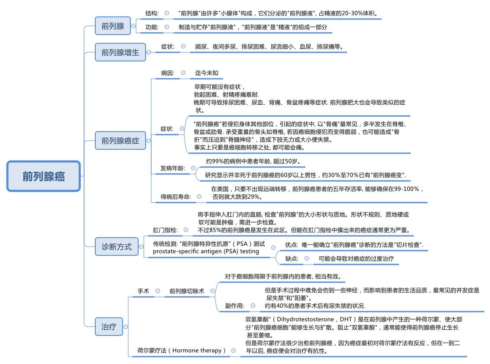
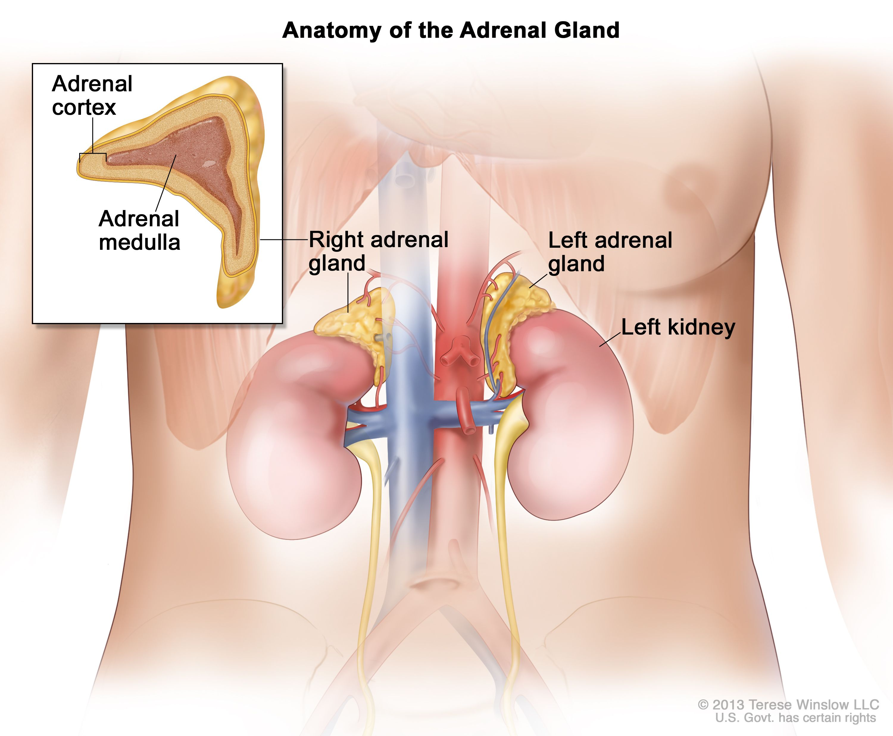
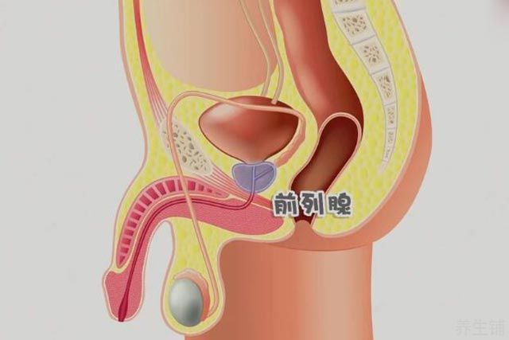
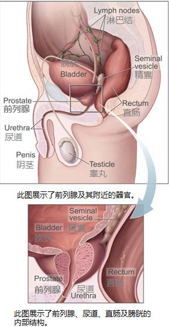

= Prostate Cancer 前列腺癌
:toc: left
:toclevels: 3
:sectnums:
:stylesheet: ../myAdocCss.css

'''

==  New Prostate Cancer Treatments Offer (v.) Hope for Advanced Cases 新的前列腺癌治疗, 为晚期病例带来希望

Deciding how to diagnose (v.) and treat (v.) prostate 前列腺 cancer /has long been the subject of controversy (n.)争论，争议 and uncertainty. A prime example involves _prostate-specific antigen 抗原 (PSA) testing_, a blood test for _a telltale (a.)暴露实情的；能说明问题的 protein_ that can reveal cancer /even when the patient has no symptoms. After its introduction in the early 1990s, _PSA testing_ was widely adopted (v.) —millions of tests are done in the U.S. every year. In 2012, however, a government task force indicated (v.)表明；显示 that /this test can lead to overtreatment of cancers /that might have posed little danger to patients /and so might have been best *left alone*.

[.my2]
**确定如何诊断和治疗前列腺癌, 长期以来一直是争议和不确定性的主题。**一个典型的例子是"前列腺特异性抗原"（PSA）测试，这是一种针对指示性蛋白质的血液测试，即使患者没有任何症状，也可以发现癌症。自 20 世纪 90 年代初推出以来，PSA 检测得到了广泛采用——美国每年进行数百万次检测。然而，2012 年，政府特别工作组表示，这项测试可能会导致对癌症的过度治疗，而某些癌症状态可能对患者几乎没有什么危险，因此最好不要进行干预。

[.my1]
.title
====
.prostate
-> 来自pro-,向前，-st,站立，词源同stand,prostitute.aden,腺体，词源同adenoid.

.telltale
-> tell,告知，tale,故事。比喻用法。
====

Prostate cancer is still one of the most prevalent 盛行的，普遍的 malignancies 恶性肿瘤. Aside from 除了……之外 some skin cancers, prostate cancers are the most common cancers among men in the U.S. It is the fourth most common cancer worldwide. Fortunately, the vast majority of patients will live for years /after being diagnosed /and are more likely *to die of* causes 后定 *unrelated to* a prostate tumor.

[.my2]
**"前列腺癌"仍然是最常见的恶性肿瘤之一。除了一些"皮肤癌"之外，前列腺癌是美国男性中最常见的癌症。***它是全球第四大常见癌症。幸运的是，绝大多数患者在被诊断后将存活数年，并且更有可能死于与前列腺肿瘤无关的原因。*

[.my1]
.title
====

.malignancy
-> 来自malignant ,恶性的，-cy,状态后缀。用于指恶性肿瘤。
====

At its most basic level, prostate cancer is a malignancy /that occurs (v.) in the prostate gland 腺, which produces (v.) fluid that mixes with sperm 精子；精液 from the testicles 睾丸 to make semen. The prostate is located in front of the rectum  直肠, below the bladder 膀胱 and above the penis 阴茎, and cancer in the gland /has four major stages.

[.my2]
从最基本的角度来看，*"前列腺癌"是一种发生在前列腺中的恶性肿瘤，前列腺产生的液体与睾丸中的精子混合, 形成精液。前列腺位于直肠前方、膀胱下方和阴茎上方，腺癌有四个主要阶段。*

[.my1]
.title
====
.basic level
指某个领域或学科的最基本、最基础的知识和技能水平。

.gland
-> 词源同globe. 因呈球体而得名，用于解剖学术语。

.testicle
-> testis 意为“证人”或“证明”, 但testicle却指“睾丸”。当testis 作为借用语直接进入英语时，它也指“睾丸”。那么，这两个词之间有什么联系呢？**古时候，希腊地区的男人宣誓或作证时，必须把一只手放在自己的睾丸上，以此表示如果说假话或作伪证就会断子绝孙。**从生理的角度讲，睾丸（现在写成testicle）能够“证明”男性到底有没有生殖能力。

.rectum
-> 来自 intestinum,肠，词源同 intestinal,rectum,直，词源同 rectangle.

.bladder
-> 来自PIE bhel, 膨胀，鼓起，同blow.
====

Early on 在早期, _localized (a.)在小范围内的；局部的 tumors_ 肿瘤 show (v.) no evidence of extension beyond _the prostate gland_.  +
A second, _“regionally 地域性地，地方地 advanced” form_ of the disease /remains (v.) close to the prostate.  +
Then there are _metastatic （癌细胞的）转移性的 prostate cancers_, which *spread* (v.) outside the gland *to* other parts of the body.  +
Treatment of tumors in this category 种类，范畴 /has benefited from improved diagnostic imaging tests. In fact, with these tests, cancer specialists 专家 have characterized (v.)描述，刻画，表现（…的特征、特点） the fourth category, _oligometastatic 寡转移性（医） prostate cancer_, a disease stage on a continuum （相邻两者相似但起首与末尾截然不同的）连续体 /*between* localized 局部的；地区的；小范围的 prostate cancer *and* more broadly dispersed metastatic （癌细胞的）转移性的 disease. Major discoveries in the past 10 years /have transformed the way we approach each type of prostate cancer, and these advances are likely to continue for decades to come.

[.my2]
**早期，局部肿瘤没有显示出扩展到前列腺以外的证据。第二种是“区域进展型”疾病，仍然接近前列腺。然后是转移性前列腺癌，这种癌症已经扩散到身体的其他部位。** 此类肿瘤的治疗, 受益于诊断成像测试的改进。事实上，通过这些测试，癌症专家已经确定了**第四类，即"寡转移性前列腺癌"，这是介于"局限性前列腺癌"和"更广泛分散的转移性疾病"之间的连续统一体的疾病阶段。**过去十年的重大发现, 改变了我们治疗每种类型"前列腺癌"的方式，并且这些进展可能会在未来几十年持续下去。

[.my1]
.title
====
.寡转移性前列腺癌 (PCa)
可以定义为转移数量有限的癌症. 前列腺癌"寡转移"是一种介于"局限期肿瘤"和"肿瘤广泛转移"的中间状态。尽管不同文献对寡转移的定义，提出了不同的看法，但普遍认为盆腔外的"转移灶"不超过5个。
====

The first treatment steps for _people with localized cancer_ /`谓` involve _risk stratification_ 分层；成层. Through this process, a physician 医生，（尤指）内科医生 gauges (v.)（用仪器）测量 the likelihood #of# a cancer’s *being eliminated (v.)消灭，干掉（尤指敌人或对手） or cured* by local treatment (usually surgery or radiation) and, if it does abate (v.)（使）减弱，减退，减轻，减少, #of# its returning 回归. A physician determines (v.) the risk /based on PSA results, _physical examination_ 体格检查of _the prostate gland_ /and inspection 检查；查看；审视 of cells from _the biopsied 活组织检查；活组织切片检查 tumor_.

[.my2]
"局部癌症"患者的第一个治疗步骤, 涉及风险分层。通过这个过程，医生可以评估"癌症通过局部治疗（通常是手术或放射）被消除或治愈"的可能性，如果癌症确实减轻了，那么癌症复发的可能性也随之而来。医生根据 PSA 结果、前列腺体格检查, 和活检肿瘤细胞, 检查来确定风险。

The right course 行动方式；处理方法 of action for _a patient with elevated 高的；升高的,偏高的 PSA levels_ /`谓`  continues to undergo (v.) constant revision 修订，修改（的进行）. Until five to seven years ago, a physician evaluated (v.)评估；估……的价 a person with high PSA /by feeling (v.) their _prostate gland_ for potentially cancerous (a.)癌的；生癌的；像癌的 abnormalities 畸形；异常情况. Invariably 始终如一地；一贯地, the next step would be a needle biopsy 穿刺活检 — an uncomfortable procedure /in which the physician obtains (v.) _snippets 小片；片断 of prostate tissue_ through the rectum 直肠.

[.my2]
对于 PSA 水平升高的患者，正确的治疗方案会持续不断地修改。直到五到七年前，一位医生通过"感觉前列腺是否存在潜在的癌变异常", 来评估 PSA 高的人。*下一步总是会进行"针刺活检"——这是一种不舒服的手术，医生通过直肠, 获取"前列腺组织"的碎片。*

But we now have a way to biopsy (n.)版本活组织检查（从身体取下细胞或组织进行检验） through the perineum 会阴 — the area between the back of the scrotum 阴囊 and the anal 肛门的-rectal area. Thanks to technical improvements, it can be done in an outpatient 门诊病人 setting /without _general anesthesia_ (麻醉)全身麻醉 or sedation 镇静. The technique reduces the patient’s risk of infection /and need for antibiotics 抗生素 /because it doesn’t disrupt the _bacterial flora_ 细菌菌群 in the rectum 直肠. In a recent study, researchers #compared# outcomes in patients who underwent (v.)经验；遭遇 _a trans­rectal biopsy_ 经直肠活检 and received antibiotics #with# those for people who had _a transperineal 经会阴 biopsy_ with _minimal  极小的，极少的 to no_ antibiotics. They found the two approaches 宾补 comparable /*in terms of* 就…而言；从…角度来看；就…方面而言 complications 并发症 from infections.

[.my2]
但我们现在, **有一种方法可以通过"会阴"（阴囊后部和肛门直肠区域之间的区域）进行活检。**由于技术的改进，它可以在门诊环境中完成，无需全身麻醉或镇静。该技术降低了患者感染的风险和对抗生素的需求，因为**它不会破坏直肠中的细菌菌群。**在最近的一项研究中，研究人员比较了接受经"直肠活检"并接受抗生素治疗的患者的结果, 与接受经"会阴活检"且仅使用极少抗生素或不使用抗生素的患者的结果。他们发现, 这两种方法在"感染并发症"方面具有可比性。

[.my1]
.title
====
.biopsy
-> 词根bio, 生命。词根ops, 看，见optic, 光学的。

.perineum 会阴
( anatomy 解)the area between the anus 肛门 and the scrotum 阴囊 or vulva 阴户.   +
-> 来自希腊语perinaion,会阴，来自peri-,在周围，inan,疏通，疏散，排泄。幽默用法。 +
image:../img/0130.jpg[,30%]

.flora
( technical 术语)the plants of a particular area, type of environment or period of time（某地区、环境或时期的）植物群 +
-> 来自拉丁语Flora, 花神，词源同flower, flourish. 18世纪瑞典植物学家林奈借用该词来指植物群。参照fauna.
====

Even more exciting is `表` the prospect 可能性；希望 of eliminating (v.) biopsies altogether. When a patient has an abnormal PSA value /but their rectal examination 直肠检查 shows (v.) no obvious evidence of cancerous deposits （地下自然形成的）沉积物，沉积层;沉积物，淤积物, physicians can now use (v.) _magnetic 磁的，磁性的 resonance 共鸣；共振；谐振 imaging_ (MRI) to look at the prostate and surrounding tissue. MRI scans are best for identifying (v.)确认，识别；找到，发现 _clinically significant_ 临床意义 cancers —those that, if left (v.) untreated or undiagnosed, could eventually spread. MRI can also uncover (v.) _more extensive cancer spread_ or tumors /in unusual locations such as the front of the prostate.

[.my2]
更令人兴奋的, 是完全消除"活检"的前景。*当患者 PSA 值异常, 但"直肠检查"未显示明显的癌沉积证据时，医生现在可以使用磁共振成像 (MRI) 来观察前列腺和周围组织。* MRI 扫描最适合识别具有"临床意义"的癌症，如果不及时治疗或诊断，这些癌症最终可能会扩散。 MRI 还可以发现"更广泛的癌症扩散"或"异常位置"（例如前列腺前部）的肿瘤。

[.my1]
.title
====
.resonance
->  re-回,向后 + -son-声音 + -ance名词词尾 → 回声,回响

.clinically significant
临床意义：在医学或心理学评估中，指具有实际意义的差异或结果，能够解释客户的现有信息或为干预提供有用的指导。

"临床意义"是指一个症状表现, 或者是一个指标, 对某种疾病的诊断所具有的作用。**如果一个检查结果能够帮助确定某种疾病，或者可以辅助医生进行疾病的诊断和治疗，那么它就具有临床意义。**具体来说，当"检查数值"和"正常标准值"有差异时，这个结果就对临床疾病的诊断, 具有一定的参考价值。*而如果这种差异是由生理或正常情况下出现的变化导致的，且对诊断疾病没有实际价值，那么就会被认为是“无临床意义”的。*

In medicine and psychology, _clinical significance_ is the practical importance of a treatment effect —whether it has a real genuine, palpable, noticeable effect on daily life. +
在医学和心理学中，"临床意义"是指"治疗效果的实际重要性"——是否对日常生活, 产生真正的、明显的、显着的影响。
====

Another benefit of MRI procedures （正常）程序，手续，步骤 is that /they identify (v.) fewer _clinically insignificant_ cancers —those /that are unlikely to cause (v.) problems and might best be left alone. In this case, failure to detect (v.) certain cancers /is a good thing /because it spares (v.) people 双宾 unnecessary treatment.

[.my2]
**MRI 程序的另一个好处是，它们可以识别出较少的"临床上不重要的癌症"，即那些不太可能引起问题、最好不要处理的癌症。**在这种情况下，未能检测到某些癌症是一件好事，因为它可以让人们避免不必要的治疗。

Once a patient is diagnosed with prostate cancer, what happens (v.) next? For decades /the debate （各自发表不同意见的）争论，辩论，讨论 over treatment has been just *as contentious (a.)有争议的，引起争论的 as* the debate over diagnosis. Fortunately, new research from the U.K. has provided some clarity. Investigators 后定 there  /`谓`  studied (v.) several thousand people _with elevated PSA levels_ whose prostate biopsies showed (v.) cancer. These patients were randomized /to receive _surgical (a.)外科的，外科手术的 removal_ of the cancerous gland, radiation treatments *or* no active treatment at all. At the end of 15 years of comprehensive (a.)全部的；所有的；（几乎）无所不包的；详尽的 follow-up (n.)后续行动；后续事物, about 3 percent of patients in each group /had died of prostate cancer, and nearly 20 percent in each group /had died of unrelated causes.

[.my2]
**一旦患者被诊断出患有"前列腺癌"，接下来会发生什么？几十年来，关于"治疗"的争论与关于"诊断"的争论一样, 充满争议。**幸运的是，英国的新研究提供了一些答案。那里的**研究人员对数千名 PSA 水平升高的人进行了研究，他们的前列腺"活检"显示患有癌症。这些患者被随机分配接受癌腺手术切除、放射治疗, 或根本不接受积极治疗。 15 年的全面随访结束时，每组中约有 3% 的患者死于前列腺癌，每组中近 20% 的患者死于无关原因。 (换言之, 得了前列腺癌, 能再活15年的人是非常多的.)**

Based on the results of this study and others, more people are now being offered “active (a.)积极主动的；定期进行的 surveillance 监视，监察” after a prostate cancer diagnosis, in which treatment /is #either# delayed #or# avoided altogether. `主` Careful monitoring 仔细监控 of patients who have not undergone (v.) surgery or radiation /`系` is becoming more common; it is now being extended /even to those with more worrisome (a.)令人担心的；使人担忧的  tumors. The monitoring involves (v.) a range of measures: PSA testing /every three to six months, physical examination of the prostate gland /and assessment of the patient’s urinary (a.)尿的；泌尿的 symptoms 泌尿系统症状. Those tests are followed by _repeat biopsies_ at increasing intervals, as long as 只要……就 there are no significant pathological 病理学的；与病理学相关的;不理智的；无道理的；无法控制的 changes.

[.my2]
**根据这项研究和其他研究的结果，现在有更多的人在前列腺癌诊断后, 接受“主动监测”，其中治疗要么被推迟，要么完全避免。**对未接受"手术"或"放射治疗"的患者进行仔细监测, 变得越来越普遍；现在它甚至扩展到那些患有更令人担忧的肿瘤的人。*监测涉及一系列措施：每三到六个月进行一次 PSA 检测、前列腺体格检查, 以及患者"泌尿系统症状"的评估。只要没有明显的病理变化，这些测试之后就会以增加的间隔, 重复进行"活检"。*

If a cancer is identified as having #either# intermediate （两地、两物、两种状态等）之间的，中间的- #or# high-risk features, doctors need to track its progression, usually with _bone scans_ using radio­­pharma­ceut­i­cals 药物 /and with _abdominal 腹部的-pelvic 骨盆的 computed tomography 体层摄影（利用X射线和超声波清楚显示体内结构） (CT) scans_, which may show (v.) any spread (n.) in the areas /to which prostate cancer most often metastasizes (v.)转移；迁徙; (癌细胞)扩散. Unfortunately, these techniques are not sensitive enough /to reliably detect cancer in structures 后定 less than a centimeter 厘米 in diameter 直径, such as _lymph nodes_ 淋巴结. Consequently 因此，结果, small areas of metastatic (a.)（癌细胞的）转移性的 disease may go undetected. These cases are said to be “understaged (v.)低估（疾病的严重性）.”

[.my2]
**如果癌症被确定为具有中风险或高风险特征，医生需要跟踪其进展，通常使用放射性药物进行骨扫描, 和腹部盆腔计算机断层扫描 (CT) 扫描，这可能会显示该区域的任何扩散情况, 其中前列腺癌最常发生转移。不幸的是，这些技术不够灵敏，无法可靠地检测直径小于一厘米的结构（例如淋巴结）中的癌症。因此，小面积的转移性疾病可能未被发现。**这些病例情况, 可说是就被"低估"了。

[.my1]
.title
====
.pharmaceutical
adj. 制药的

.tomography
[ U]a way of producing an image of the inside of the human body or a solid object using X-rays or ultrasound 体层摄影（利用X射线和超声波清楚显示体内结构） +
-> 借自希腊语 tomos,切片，部分，词源同 tome,-graphy,写，记录。
====

Understaging can now be studied /through more precise diagnostic testing. Typically `主` patients whose disease is understaged /`系` are not treated until the cancer becomes detectable through symptoms such as urination problems or pain. The disease then may require intensive 短时间内集中紧张进行的；密集的 therapies, and there is less of a chance of long-term remission （重病的）缓解期，减轻期. One technology that can help address (v.)设法解决；处理；对付 understaging /is advanced scanning /that #combines# _radiodiagnostic 放射诊断的 positron-emission 正电子发射 tomography_ 体层摄影 (PET) #with# CT.

[.my2]
现在可以通过更精确的诊断测试, 来研究"分期不足"。**通常，疾病未分期的患者, 直到通过排尿问题或疼痛等症状可检测到癌症后, 才接受治疗。这种疾病可能需要强化治疗，并且长期缓解的机会较小。**一种可以帮助解决"分期不足"问题的技术, 是将放射诊断正电子发射断层扫描 (PET) 与 CT 相结合的高级扫描。

[.my1]
.title
====
.positron
正电子；阳电子 +
是电子的反粒子，即电子的对应反物质。它带有+1单位电荷. +
-> 缩写自 positive electron.

.positron emission tomography, PET
正电子发射断层扫描 +
全称为：正电子发射型计算机断层显像（Positron Emission Computed Tomography）

其大致方法是，*将某种物质，一般是生物生命代谢中必须的物质，如：葡萄糖、蛋白质、核酸、脂肪酸，标记上短寿命的放射性核素（如F18，碳11等），注入人体后，通过对于该物质在代谢中的聚集，来反映生命代谢活动的情况，从而达到诊断的目的。* +
最近各医院主要使用的物质是"氟代脱氧葡萄糖"，简称FDG。*其机制是，人体不同组织的代谢状态不同，在高代谢的恶性肿瘤组织中, "葡萄糖"代谢旺盛，聚集较多，这些特点能通过图像反映出来，从而可对病变进行诊断和分析。*

image:../img/Positron Emission Computed Tomography.jpg[,10%]

====

These scans can detect (v.) molecules 后定 commonly found in prostate cancer cells, such as _prostate-specific 前列腺特异性的 membrane （身体内的）膜 antigen_ 抗原 (PSMA). If PSMA is present outside the prostate gland, such as in pelvic 骨盆的 lymph nodes 淋巴结, the affected areas can be identified (v.)鉴定；辨认, and a plan can be made for _targeted (a.)定向的；被定为攻击目标的 radiation treatments_ 放射疗法 or surgical removal.

[.my2]
这些扫描可以检测"前列腺癌细胞"中常见的分子，例如"前列腺特异性膜抗原"（PSMA）。如果 PSMA 存在于前列腺外，例如盆腔淋巴结中，则可以识别受影响的区域，并制定针对性的"放射治疗"或"手术切除"的计划。

[.my1]
.title
====
.prostate-specific
adj.前列腺特异性的：与前列腺特异性相关的，通常用于描述生物标志物或检测方法，特指前列腺特异性抗原（PSA），一种用于前列腺癌筛查的血液检测。

.Prostate Specific Membrane Antigen, PSMA
前列腺特异性膜抗原. **PSMA是一种跟"前列腺癌癌"有着密切关联的物质。**目前很多研究都表明**PSMA是前列腺癌的特征性蛋白，在"前列腺癌细胞"中表达量很高，而在其他肿瘤或正常组织中表达很少，另外，随着"前列腺癌"恶性程度的增高，"前列腺癌细胞"表达PSMA的量也相应增加。由此可见，PSMA可以看作是"前列腺癌"的一个“特征性”分子，能让本来隐藏在体内的前列腺癌细胞“脱颖而出”.**

**目前用于"前列腺癌"临床分期, 最重要的影像工具是"ECT全身骨扫描"和"胸腹部CT检查"，但它们对于肿瘤的敏感性不佳，容易忽视一些体积较小的肿瘤。**  +
**以CT为例，该检查手段主要通过"形态是否异常"来判断病变，因此当肿瘤较小或不典型时，**即便是有经验的影像科医生, 也**很难做出精准的判断。**

不同于传统影像工具的成像原理，**PET/CT 则同时具有"解剖成像（CT）"和"功能成像（PET）"两部分组成，使肿瘤成像更加精准。** +
以目前临床上应用最多的 18F-FDG PET/CT为例，18F-FDG是一种"示踪剂"，由18F和FDG组成，18F具有"成像"作用，而**FDG是一种改造过的葡萄糖。**理论认为，**肿瘤代谢旺盛，摄取"葡萄糖"较正常组织多，因此18F-FDG就可用用于肿瘤的成像。**

PSMA PET/CT本质上也是一种PET/CT，只是它的示踪剂与传统18F-FDG有所不同，目前国际上应用较多的PSMA PET/CT的示踪剂是68Ga-PSMA，其中68Ga具有"成像"功能，而PSMA具有"引导"功能，引导68Ga更精确的向前列腺癌细胞浓聚，这样就大大增加了PSMA PET/CT用于发现前列腺癌的敏感性。而在我们自己的临床工作中也发现了**不少ECT骨扫描正常，但是PSMA PET/CT发现多发转移**的病例。目前，国内外的权威医学指南已经将PSMA PET/CT定位更加精准的前列腺癌影像评估工具。

当然，我们也要客观的认识到，PSMA PET/CT不是万能的，它也只能发现它能检测到的肿瘤，**如果PSA很低或者肿瘤很小，PSMA也无法检测出来。**而且作为一个影像工具，**PSMA PET/CT也会出现假阳性（PSMA认为是，但实际上不是）和假阴性（PSMA认为不是，但实际上是的）的情况，**一定根据临床情况综合判断。

image:../img/Prostate Specific Membrane Antigen.jpg[,10%]
====

Let’s consider /how _PET-CT scanning_ can be used in clinical practice. One of my patients, a 68-year-old man, was diagnosed with _prostate cancer_ that was localized (a.)在小范围内的；局部的 but had high-risk features. The traditional diagnostic bone and CT scans /did not show any evidence of cancer 后定 spread outside the prostate. A PET-CT scan for PSMA, however, did reveal (v.) the presence of several small deposits of cancer cells in well-defined (a.)界限清楚的；定义明确的 areas of the pelvis 骨盆, indicating the cancer had spread to _the lymph nodes_. This finding prompted (v.)促使；导致；激起 treatment that included _radiation therapy_ in _the prostate gland_ and _the cancerous lymph nodes_, as well as _androgen 雄激素-deprivation 剥夺,缺乏 therapy_ (ADT), a treatment that reduces levels of testosterone 睾酮；睾丸素, the hormone that enables prostate cancer to grow and progress.

[.my2]
让我们考虑如何将 PET-CT 扫描应用于临床实践。我的一位 68 岁患者被诊断患有"局限性前列腺癌"，但具有高风险特征。传统的骨诊断和 CT 扫描, 没有显示任何癌症扩散到前列腺外的证据。然而，对 PSMA 的 PET-CT 扫描确实显示，**在骨盆的明确区域存在几个小癌细胞沉积物，表明癌症已扩散到淋巴结。**这一发现促使人们采取治疗措施，包括对"前列腺"和"癌性淋巴结"进行放射治疗，以及"雄激素剥夺疗法"（ADT），这是一种降低"睾酮"水平的治疗方法，*"睾酮"是促进前列腺癌生长和进展的激素。*

Precise identification of small metastatic （癌细胞的）转移性的 deposits /has other positive benefits. ADT has for decades been the mainstay 支柱；中流砥柱 for treating many forms of prostate cancer. Patients must continue the therapy for years, sometimes for the rest of their lives. Side effects of ADT are similar to those experienced during menopause 更年期. In fact, “andropause” 男人更年期  is the term that captures the effects of ADT. Lower levels of testosterone 睾酮，睾丸素 are accompanied by a multitude of symptoms, including but not limited to loss of libido 性欲；性冲动, erectile (a.)能勃起的 dysfunction 功能紊乱；机能障碍, weight gain, hot flashes 潮热, bone loss 骨质流失, cognitive impairment （身体或智力方面的）损伤，缺陷，障碍, mood changes, diminished 减弱的；减退了的 energy, and worsening of preexisting 早已存在的 _heart and vascular 血管的 problems_.

[.my2]
精确识别小的转移性沉积物还有其他积极的好处。几十年来，ADT 一直是治疗多种"前列腺癌"的主要手段。患者必须持续治疗数年，有时甚至是终生。 **ADT 的副作用, 与"更年期"期间经历的副作用相似。**事实上，“男性更年期”这个术语描述了 ADT 的影响。*"睾酮"水平较低, 会伴随多种症状，包括但不限于: 性欲减退、勃起功能障碍、体重增加、潮热、骨质流失、认知障碍、情绪变化、精力减弱, 以及先前存在的心脏和血管问题恶化。*

[.my1]
.案例
====
.libido
-> 来自拉丁语libido,欲望，渴望，词源同love.引申词义爱的冲动，性欲。
====

For advanced (a.)（发展）晚期的，后期的 forms of prostate cancer /that have spread to other parts of the body, ADT has been the main treatment. Physicians historically have generally recommended _surgical removal_ of the testicles 睾丸 —the primary source of testosterone 睾酮，睾丸素（男性荷尔蒙的一种） —or the administration （药物的）施用 of other hormones that block (v.) the production and action of testosterone. In the mid-1980s I was involved with research on drugs called _luteinizing hormone_ 黄体化激素–releasing hormone analogues 类似物 /that lowered testosterone by shutting off 关闭或切断 the signal in the brain that instructs (v.)指示；命令；吩咐 the testicles to make testosterone  睾酮，睾丸素. Today newer agents 代理人,剂 have been added /后定 that further lower (v.) and block (v.) testosterone’s action.

[.my2]
**对于已经扩散到身体其他部位的"晚期前列腺癌"，ADT 一直是主要治疗方法。历史上，医生通常建议通过手术切除睾丸（睾酮的主要来源）或使用其他激素, 来阻止"睾酮"的产生和作用。 **20 世纪 80 年代中期，我参与了黄体生成素释放激素类似物药物的研究，**这种药物通过关闭大脑中指示"睾丸"产生"睾酮"的信号, 来降低"睾酮"。**如今，添加了新的药物，可以进一步降低和阻止"睾酮"的作用。

[.my1]
.title
====
.luteinizing hormone
黄体生成素：由垂体前叶分泌的一种激素，它在女性中刺激排卵和黄体形成的发育，在男性中促进睾丸间质组织的发育。 +

image:../img/luteinizing hormone.avif[,35%]
image:../img/luteinizing hormone2.png[,30%]

====

The goal of prostate cancer treatment at later stages /`系` is to eliminate multiple sources of testosterone. As noted (v.) earlier 如前所述, testosterone in the body /comes predominantly (ad.)绝大多数，主要地 from the testicles 睾丸; _the adrenal 肾上腺的 glands_ also produce a small amount. But _prostate cancer cells_ 前列腺癌细胞 can evolve (v.) to produce their own androgens 雄激素. Testosterone and its active form, dihydrotestosterone (DHT) 二氢睾酮, traverse (v.)横过；横越；穿过；横渡 the membranes of _prostate cancer cells_ /and interact (v.)相互影响；相互作用 with _androgen 雄性激素；男性荷尔蒙 receptors_ in the cytoplasm 细胞质, a cell’s liquid interior 内部；里面. The receptors then *transport* (v.) DHT *to* the nucleus 原子核；细胞核；核心, where it instructs (v.) the cancer cell to grow, replicate (v.)复制；（遗传物质或生物）自我繁殖 and spread.

[.my2]
**前列腺癌后期治疗的目标, 是消除"睾酮"的多种来源。**如前所述，**体内的"睾酮"主要来自"睾丸"。"肾上腺"也产生少量。但"前列腺癌细胞"可以进化产生自己的雄激素。**睾酮及其活性形式二氢睾酮 (DHT) 穿过前列腺癌细胞膜，与细胞质（细胞液体内部）中的雄激素受体相互作用。然后受体将 DHT 转运到细胞核，指示癌细胞生长、复制和扩散。

[.my1]
.title
====
.adrenal
ADJ. on or near the kidneys 肾上的; 肾旁的 +
-> ad- +‎ renal

.traverse
[ VN] ( technical 术语) /trəˈvɜːs/  ( formal ) to cross an area of land or water横过；横越；穿过；横渡
====

Genetics  遗传学 and genomic (a.)基因组的；染色体的 testing of patients and cancers /have also helped in the quest 探索，寻找，追求（幸福等） for improvement of symptoms and longer survival. Some _genetic mutations_ 遗传突变 that are known to increase the risk of breast and ovarian 卵巢的 cancer /have also been associated with a heightened 提高，升高 risk of prostate cancer.

[.my2]
对患者和癌症进行遗传学和基因组测试, 也有助于寻求改善症状和延长生存期。**一些已知会增加"乳腺癌"和"卵巢癌"风险的基因突变, 也与"前列腺癌"风险增加有关。**

These new strategies have begun *to transform* (v.)使改变外观（或性质）；使改观 this once rapidly fatal disease *into* _a chronic condition_ that people can live with for years or even for their full life expectancy 预期寿命.

[.my2]
**这些新策略, 已经开始将这种曾经"迅速致命"的疾病, 转变为一种"慢性疾病"，**人们可以忍受数年甚至整个预期寿命。

'''

== (pure) New Prostate Cancer Treatments Offer Hope for Advanced Cases

Deciding how to diagnose and treat prostate cancer has long been the subject of controversy and uncertainty. A prime example involves prostate-specific antigen (PSA) testing, a blood test for a telltale protein that can reveal cancer even when the patient has no symptoms. After its introduction in the early 1990s, PSA testing was widely adopted—millions of tests are done in the U.S. every year. In 2012, however, a government task force indicated that this test can lead to overtreatment of cancers that might have posed little danger to patients and so might have been best left alone.

Prostate cancer is still one of the most prevalent malignancies. Aside from some skin cancers, prostate cancers are the most common cancers among men in the U.S. It is the fourth most common cancer worldwide. Fortunately, the vast majority of patients will live for years after being diagnosed and are more likely to die of causes unrelated to a prostate tumor.

At its most basic level, prostate cancer is a malignancy that occurs in the prostate gland, which produces fluid that mixes with sperm from the testicles to make semen. The prostate is located in front of the rectum, below the bladder and above the penis, and cancer in the gland has four major stages.

Early on, localized tumors show no evidence of extension beyond the prostate gland. A second, “regionally advanced” form of the disease remains close to the prostate. Then there are metastatic prostate cancers, which spread outside the gland to other parts of the body. Treatment of tumors in this category has benefited from improved diagnostic imaging tests. In fact, with these tests, cancer specialists have characterized the fourth category, oligometastatic prostate cancer, a disease stage on a continuum between localized prostate cancer and more broadly dispersed metastatic disease. Major discoveries in the past 10 years have transformed the way we approach each type of prostate cancer, and these advances are likely to continue for decades to come.

The first treatment steps for people with localized cancer involve risk stratification. Through this process, a physician gauges the likelihood of a cancer’s being eliminated or cured by local treatment (usually surgery or radiation) and, if it does abate, of its returning. A physician determines the risk based on PSA results, physical examination of the prostate gland and inspection of cells from the biopsied tumor.

The right course of action for a patient with elevated PSA levels continues to undergo constant revision. Until five to seven years ago, a physician evaluated a person with high PSA by feeling their prostate gland for potentially cancerous abnormalities. Invariably, the next step would be a needle biopsy—an uncomfortable procedure in which the physician obtains snippets of prostate tissue through the rectum.

But we now have a way to biopsy through the perineum—the area between the back of the scrotum and the anal-rectal area. Thanks to technical improvements, it can be done in an outpatient setting without general anesthesia or sedation. The technique reduces the patient’s risk of infection and need for antibiotics because it doesn’t disrupt the bacterial flora in the rectum. In a recent study, researchers compared outcomes in patients who underwent a trans­rectal biopsy and received antibiotics with those for people who had a transperineal biopsy with minimal to no antibiotics. They found the two approaches comparable in terms of complications from infections.

Even more exciting is the prospect of eliminating biopsies altogether. When a patient has an abnormal PSA value but their rectal examination shows no obvious evidence of cancerous deposits, physicians can now use magnetic resonance imaging (MRI) to look at the prostate and surrounding tissue. MRI scans are best for identifying clinically significant cancers—those that, if left untreated or undiagnosed, could eventually spread. MRI can also uncover more extensive cancer spread or tumors in unusual locations such as the front of the prostate.

Another benefit of MRI procedures is that they identify fewer clinically insignificant cancers—those that are unlikely to cause problems and might best be left alone. In this case, failure to detect certain cancers is a good thing because it spares people unnecessary treatment.

Once a patient is diagnosed with prostate cancer, what happens next? For decades the debate over treatment has been just as contentious as the debate over diagnosis. Fortunately, new research from the U.K. has provided some clarity. Investigators there studied several thousand people with elevated PSA levels whose prostate biopsies showed cancer. These patients were randomized to receive surgical removal of the cancerous gland, radiation treatments or no active treatment at all. At the end of 15 years of comprehensive follow-up, about 3 percent of patients in each group had died of prostate cancer, and nearly 20 percent in each group had died of unrelated causes.

Based on the results of this study and others, more people are now being offered “active surveillance” after a prostate cancer diagnosis, in which treatment is either delayed or avoided altogether. Careful monitoring of patients who have not undergone surgery or radiation is becoming more common; it is now being extended even to those with more worrisome tumors. The monitoring involves a range of measures: PSA testing every three to six months, physical examination of the prostate gland and assessment of the patient’s urinary symptoms. Those tests are followed by repeat biopsies at increasing intervals, as long as there are no significant pathological changes.

If a cancer is identified as having either intermediate- or high-risk features, doctors need to track its progression, usually with bone scans using radio­­pharma­ceut­i­cals and with abdominal-pelvic computed tomography (CT) scans, which may show any spread in the areas to which prostate cancer most often metastasizes. Unfortunately, these techniques are not sensitive enough to reliably detect cancer in structures less than a centimeter in diameter, such as lymph nodes. Consequently, small areas of metastatic disease may go undetected. These cases are said to be “understaged.”

Understaging can now be studied through more precise diagnostic testing. Typically patients whose disease is understaged are not treated until the cancer becomes detectable through symptoms such as urination problems or pain. The disease then may require intensive therapies, and there is less of a chance of long-term remission. One technology that can help address understaging is advanced scanning that combines radiodiagnostic positron-emission tomography (PET) with CT.

These scans can detect molecules commonly found in prostate cancer cells, such as prostate-specific membrane antigen (PSMA). If PSMA is present outside the prostate gland, such as in pelvic lymph nodes, the affected areas can be identified, and a plan can be made for targeted radiation treatments or surgical removal.

Let’s consider how PET-CT scanning can be used in clinical practice. One of my patients, a 68-year-old man, was diagnosed with prostate cancer that was localized but had high-risk features. The traditional diagnostic bone and CT scans did not show any evidence of cancer spread outside the prostate. A PET-CT scan for PSMA, however, did reveal the presence of several small deposits of cancer cells in well-defined areas of the pelvis, indicating the cancer had spread to the lymph nodes. This finding prompted treatment that included radiation therapy in the prostate gland and the cancerous lymph nodes, as well as androgen-deprivation therapy (ADT), a treatment that reduces levels of testosterone, the hormone that enables prostate cancer to grow and progress.

Precise identification of small metastatic deposits has other positive benefits. ADT has for decades been the mainstay for treating many forms of prostate cancer. Patients must continue the therapy for years, sometimes for the rest of their lives. Side effects of ADT are similar to those experienced during menopause. In fact, “andropause” is the term that captures the effects of ADT. Lower levels of testosterone are accompanied by a multitude of symptoms, including but not limited to loss of libido, erectile dysfunction, weight gain, hot flashes, bone loss, cognitive impairment, mood changes, diminished energy, and worsening of preexisting heart and vascular problems.

For advanced forms of prostate cancer that have spread to other parts of the body, ADT has been the main treatment. Physicians historically have generally recommended surgical removal of the testicles—the primary source of testosterone—or the administration of other hormones that block the production and action of testosterone. In the mid-1980s I was involved with research on drugs called luteinizing hormone–releasing hormone analogues that lowered testosterone by shutting off the signal in the brain that instructs the testicles to make testosterone. Today newer agents have been added that further lower and block testosterone’s action.

The goal of prostate cancer treatment at later stages is to eliminate multiple sources of testosterone. As noted earlier, testosterone in the body comes predominantly from the testicles; the adrenal glands also produce a small amount. But prostate cancer cells can evolve to produce their own androgens. Testosterone and its active form, dihydrotestosterone (DHT), traverse the membranes of prostate cancer cells and interact with androgen receptors in the cytoplasm, a cell’s liquid interior. The receptors then transport DHT to the nucleus, where it instructs the cancer cell to grow, replicate and spread.

Genetics and genomic testing of patients and cancers have also helped in the quest for improvement of symptoms and longer survival. Some genetic mutations that are known to increase the risk of breast and ovarian cancer have also been associated with a heightened risk of prostate cancer.

These new strategies have begun to transform this once rapidly fatal disease into a chronic condition that people can live with for years or even for their full life expectancy.

'''

== Prostate cancer 前列腺癌

image:../img/Prostatelead4.webp[,20%] +
image:../img/Prostatelead.webp[,60%]

是出自前列腺的恶性肿瘤。大多数前列腺癌生长速度较为缓慢，但仍有些生长相对快速。癌细胞可转移到骨头和淋巴结等部位。*前列腺癌早期可能没有症状，晚期可导致排尿困难、尿血、背痛、骨盆疼痛等症状. 前列腺肥大也会导致类似的症状。*

**约99%的病例中患者年龄超过50岁。**父亲等亲属患有本病时，本人发病风险较常人高出2至3倍。 +
*其他风险因子包含: 饮食中包含大量乳肉制品（红肉、加工肉品、乳制品）或缺乏某些蔬菜。* +
**前列腺癌可由"活体组织切片"确诊。**医学影像技术, 可检测癌细胞是否扩散到身体其他部位。

*前列腺癌筛查效果尚不明确。前列腺特异抗原（PSA）检测, 可增加癌症检测率，但不会降低死亡率。由于大多数确诊的前列腺癌没有症状，美国预防医学工作组（USPSTF）为防止过度诊断和过度治疗而不建议使用PSA检测。*

大多数前列腺癌患者并不会最终因"前列腺癌"而去世。*在美国，只要不出现远端转移，前列腺癌患者的五年存活率, 能够确保在99-100％，否则就大跌到29%。* +
在全世界，前列腺癌是第二常见的癌症，也是男性与癌症相关的第五大死因。 +
*研究显示并非死于前列腺癌的60岁以上男性，约30％至70％已有"前列腺癌变".*

.前列腺
**"前列腺"**属于男性生殖系统，**主要功能是制造与贮存"前列腺液"，并在射精时成为精液的一部分。**成年男子的前列腺约有3厘米长，重约20公克。它位于骨盆腔，膀胱之下，直肠之前。**尿道出膀胱后穿过前列腺，射精时，精液也同样从尿道射出体外。**

*"前列腺"由许多"小腺体"构成，它们分泌的"前列腺液", 占精液的20-30%体积。* +

**前列腺细胞的增殖, 要靠各种男性荷尔蒙来调节，包括产自睾丸的"睾固酮"（testosterone）、来自肾上腺的"脱氢表雄酮DHEA"（dehydroepiandrosterone）和前列腺本身制造的"二氢睾固酮"（DHT, dihydrotestosterone）。**男性荷尔蒙也掌管第二性征的表现，如脸部的胡须和多于女性的肌肉量。

.症状
*早期的"前列腺癌"大多没有症状。往往是在例行健康检查, 发现PSA值升高，进一步追查才发现。 +
然而有时"前列腺癌"也会引起症状，而且和良性"前列腺增生症"的症状很类似，包括频尿、夜间多尿、排尿困难、尿流细小、血尿、排尿痛等。前列腺癌也可能造成性功能障碍，例如勃起困难、射精疼痛难耐。*

*较严重的"前列腺癌"若侵犯身体其他部位，就可能引起相对应的症状。其中"骨痛"最常见，多半发生在脊椎、骨盆或肋骨，只要是癌细胞转移之处, 都可能会痛。承受重量的骨头如脊椎, 若因癌细胞侵犯而变得脆弱，也可能造成"骨折"而压迫到"脊髓神经"，造成下肢无力或大小便失禁。*

.病因
*造成"前列腺癌"的原因, 迄今未知.*

**前列腺癌在四十五岁以下是少见的，危险性随着年龄而增加。而平均被检测出来的年龄是七十岁。不过，很多人终其一生不知道自己有前列腺癌。**对中国、德国、以色列、牙买加、瑞典以及乌干达的其他死因男性进行尸检发现，*50岁以上男性中30%前列腺内存在癌细胞，而70岁以上者，此比率甚至高达80%。*

.筛检
肛门指检: +
检查者带上手套，涂上润滑剂，**将手指伸入肛门内的直肠, 检查"前列腺"的大小形状与质地。形状不规则、质地硬或软可能是肿瘤，需进一步检查。**这个检查只检查前列腺背面，**不过85%的前列腺癌是发生在此区。但能在肛门指检中摸出来的癌症通常更为严重。**只用肛门指检的筛检方式从来没有表现出防止前列腺癌致命的能力。

前列腺特异抗原PSA: +
**唯一能确立"前列腺癌"诊断的方法是"切片检查"，**也就是切下一小片"前列腺"用显微镜观察。但是切片检查之前还有几个方法能提供更多信息。一是"尿道镜"，是将一个细小的摄影机伸入尿道，进入膀胱。一是"直肠超音波检查"，是将探测器伸入肛门直肠，作出前列腺超音波成像。

.治疗
前列腺癌的治疗包括观察等待、手术、放射治疗、化学治疗、荷尔蒙治疗，或以上几种疗法合并运用。哪种疗法较适合，要看肿瘤侵犯的范围（称为分期）、癌细胞恶性程度（依葛里森评分法Gleason score）、血中PSA浓度等因素一起考虑。当然也要顾及患者的年龄、体能，并尊重患者的选择。由于**部分疗法可能伴随着严重的副作用，如勃起功能失调、尿失禁等，**选择治疗方法时, 要在疗效与生活品质间求取平衡。

.手术
**"前列腺切除术"常用于早期前列腺癌，或放射治疗效果不佳的患者。**最常用的术式是"耻骨后前列腺根除术"，医师从下腹部的切口切除前列腺、精囊和邻近组织。另一种方式是"经会阴前列腺根除术"，伤口位于会阴，也就是阴囊和肛门之间。约有70%的患者可借手术将前列腺癌治愈。

**"前列腺根除术"对于癌细胞局限于前列腺内的患者, 相当有效。但是手术过程中难免会伤到一些神经，而影响到患者的生活品质，最常见的并发症是尿失禁和阳萎。约有40%的患者手术后有尿失禁的状况，**大多是在打喷嚏、咳嗽或大笑的时候。 +
**阳萎**是指患者阴茎无法勃起，或无法维持足够的硬度，以致无法进行性生活。**患者阴茎的知觉大致正常，受到刺激也能达到高潮，但是勃起和射精的功能却很不理想。**服用一些药物如威而钢（Viagra）、犀利士（Cialis）、乐威壮（Levitra）可使患者的性功能恢复一些。若是患者非常在乎勃起功能，也可以考虑植入阴茎假体（俗称人工阴茎），以维持性生活的品质。 +

如果患者癌细胞侵犯的范围很小，也可以用较小规模的手术，设法减少神经的伤害，以避免尿失禁和阳萎。达芬奇外科手术系统广泛使用后, 该机器人可以进行复杂神经下的精密操作，大手术也能在不伤神经的几率大大增加前列腺切除，从而免除后遗症。

.荷尔蒙疗法
荷尔蒙疗法（Hormone therapy）是用内科或外科的方法，*使"前列腺癌细胞"无法获得"双氢睾酮"（Dihydrotestosterone，DHT）、在前列腺中产生的一种荷尔蒙、使大部分"前列腺癌细胞"能够生长与扩散。阻止"双氢睾酮"，通常使得前列腺癌停止生长甚至萎缩。*

**但是荷尔蒙疗法很少治愈前列腺癌，因为癌症最初对荷尔蒙疗法有反应，但在一到二年以后, 癌症便会对治疗有抗性。**因此荷尔蒙疗法，通常用于已经扩散的前列腺癌。它也用于某些作放射治疗或手术的病人，帮助防止前列腺癌复发。

前列腺癌荷尔蒙疗法为瞄准身体生产"双氢睾酮"的路径。"反馈环路"包括: 睾丸、下丘脑、脑下垂体、肾上腺和前列腺控制双氢睾酮的血中浓度。首先，双氢睾酮的低血液浓度，刺激下丘脑生产促性腺激素释放激素（Gonadotropin-releasing hormone，GnRH）。性腺激素释放素GnRH，然后刺激脑下垂体生产黄体生成素（Luteinizing hormone，LH），并且刺激睾丸生产睾酮（Testosterone）。最终，睾酮从睾丸和脱氢表雄酮（Dehydroepiandrosterone，DHEA）从肾上腺，刺激前列腺生产更多"双氢睾酮"。*荷尔蒙疗法用中断这条路径在任何一点，可以减少"双氢睾酮"的浓度。*

'''

