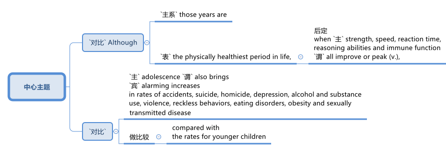
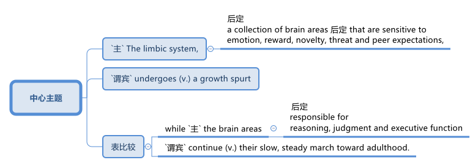
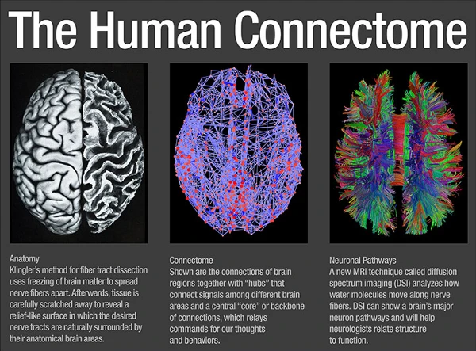
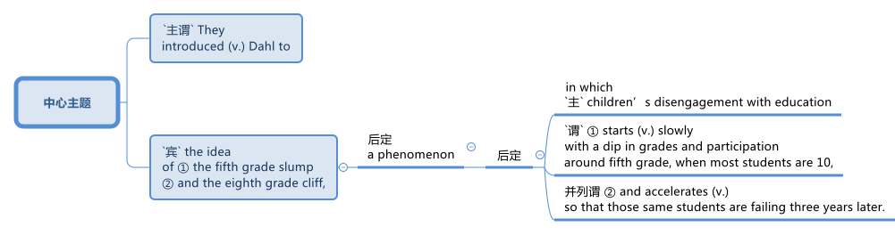

=  ★★★ 青少年的神经连接, 具有窗口期 (在青春期, 10-20岁时).
:toc: left
:toclevels: 3
:stylesheet: ../myAdocCss.css

'''

== Adolescent Brains Are Wired to Want Status and Respect: That’s an Opportunity for Teachers and Parents 青少年的大脑天生想要地位和尊重：这对老师和家长来说是一个机会

Here is a parable 寓言故事 for our time: There once was an adult who wanted to encourage eighth graders 某某年级的学生 to eat healthier food.  The adult designed _a lesson plan_ full of nutritional  营养的 information —why fruit and vegetables are good for you, why junk food is bad for you, and so on.  +
A similar approach *had worked with* 曾经对……起作用;曾经在……中奏效 younger children.  But the eighth graders declared (v.)宣布；宣告,宣称；断言 #the intervention# —and, if we're being honest, the adult —#boring#. They *carried on* 继续;开展; 参与 eating junk food, some of them in greater quantities 数量 than they had before.

[.my2]
====

这是一个适用于我们时代的寓言：曾经有一位成年人想鼓励八年级学生吃更健康的食物。这位成年人设计了一份充满营养信息的课程计划——讲解为什么水果和蔬菜对身体有益，为什么垃圾食品对身体有害，等等。这种方法曾经对较小的孩子起作用。##但八年级的学生认为这种干预——如果说诚实点，连成年人本身——都很无聊。##他们继续吃垃圾食品，有些人甚至比以前吃得更多。
====

[.my1]
.案例
====
.par·able
-> 来自希腊语parabole,比较，对话，类比，来自para-,在旁，在周围，-bole,扔，投掷，词源同ballet,ballistic.即扔在旁边的，引申词义打比方，讲寓言故事。拼写受-able影响俗化。
====

With discouraging (v.)使气馁 regularity 规律性；经常性, researchers find that `主` what works with younger children `系` is no longer effective (v.) with adolescents 青少年. Eighth grade seems to be the *inflection 语调的抑扬变化 point* 拐点；转折点.

Thirteen-year-olds are concerned with status and respect —these kids do not want to feel (v.) patronized  (v.)屈尊俯就地对待；摆出高人一等的派头 by adults.

[.my1]
.案例
====
.patronize
-> 来自patron,赞助，保护，-ize,使。后引申贬义词义屈尊，像别人的父亲的。
====

In a study published in 2019 in Nature Human Behaviour, instead of nutritional information 营养信息, researchers showed more than 300 eighth graders in Texas investigative reports (n.)调查报告 revealing that _food company executives_ 高管；主管;执行总监 use (v.) unhealthy ingredients (尤指烹调用的) 原料, target (v.) young adolescents in their marketing, and won't let their own children eat their products. The students were outraged (v.a.)使震怒 and began to see _healthy eating_ as a way of taking a stand 站立 against being manipulated （暗中）控制，操纵，影响.

For the next three months the students made _healthier snack 点心；小吃；快餐 purchases_ (n.) in the cafeteria 自助餐厅；自助食堂.

And in a follow-up  (a.)后续的；定期复查的 study, the researchers found that `主` #the students#, especially boys, with higher levels of testosterone 睾酮；睾丸素 (a marker of _pubertal 青春期的；发育期的 maturation_  成熟过程；成熟 in both boys and girls) `系` #were# most likely to respond (v.) well to the intervention.

[.my1]
.案例
====
.tes·tos·ter·one
/teˈs-tɒs-tə-rəʊn/  +
-> 来自拉丁语 testis,睾丸，-ster,固化，词源同 sterol,-one,酮。
====

[.my2]
====

令人沮丧的是，#研究人员发现，对年幼儿童有效的方法对青少年不再有效。八年级似乎是一个转折点。#

##十三岁的孩子关心"地位"和"尊重"——这些孩子不想感受到成年人的居高临下。##在 2019 年《自然人类行为》杂志上发表的一项研究中，研究人员向德克萨斯州 300 多名八年级学生展示了调查报告，而不是营养信息，这些报告显示食品公司高管使用不健康的成分，在营销中针对青少年，并且不让自己的孩子孩子们吃他们的产品。学生们感到愤怒，并开始##将健康饮食视为"反对被操纵"的一种方式。##在接下来的三个月里，学生们在食堂购买了更健康的零食。在一项后续研究中，研究人员发现，#睾丸激素（男孩和女孩青春期成熟的标志）水平较高的学生，尤其是男孩，最有可能对干预措施,做出显著反应。#
====

Neuroscience 神经科学 has dramatically changed (v.) our understanding of _the structural and functional changes_ in the brain during adolescence, which runs *from* around the age of 10 *all the way 一路上；从头到尾,一直到 into* the mid-20s. It is a time of _rapid brain growth_ and _neuronal 神经元的 fine-tuning_ (v.)微调；细调 when young people are especially sensitive (a.) to _social cues_ and rewards.

[.my1]
.标题
====

神经科学极大地改变了我们对##青春期（从 10 岁左右一直到 20 多岁）##大脑结构和功能变化的理解。#这是大脑快速生长和神经元微调的时期，年轻人对社交暗示和奖励特别敏感。#
====

A sensitive (a.)敏感的,易受影响的 period for social and emotional processing also suggests that `主` certain phases of adolescence `系` may be more opportune (a.)恰好的；适当的；恰当的 than others for certain approaches 着手处理；对付.  +
Early adolescence in particular —*from* roughly age nine *to* 11 —could be an opportunity to launch (v.)开始从事，发起，发动（尤指有组织的活动） kids *on a positive path* by buttressing (v.)支持；给…以力量 their _sense of self_ 自我意识 and _motivation to learn_ 学习的动机.

`主` To meaningfully compare (v.) the results of `主` _which interventions work (v.) best at age 10 or 14 or 18_ `谓` requires extensive 广泛的；广博的 longitudinal 纵观的,经度的 studies, which have not yet been done.

[.my2]
#社交和情感处理的"敏感期"也表明，青春期的某些阶段, 可能比其他阶段, 更适合采取某些方法。尤其是青春期早期——大约从 9 岁到 11 岁——可能是一个机会，通过增强孩子的"自我意识"和"学习动力"，让他们走上积极的道路。# +
要有意义地比较哪些干预措施在 10 岁、14 岁或 18 岁最有效，需要进行广泛的纵向研究，但目前尚未完成。

[.my1]
.标题
====
.buttress
-> buttress = butt（拱、顶）+ress（名词后缀，表物品）→拱墙 

.longitudinal
(a.)concerning the development of sth over a period of time 纵观的 +
• a longitudinal study of aging 对衰老问题的纵向研究

====

For decades much of the research on adolescence `谓` focused on its dark side. +

Although those years are _the physically healthiest period_ 身体最健康的时期 in life, 后定 when strength, speed, reaction time, _reasoning 推想；推理 abilities_ and _immune function_ 免疫功能 `谓` all improve (v.) or peak (v.)达到高峰；达到最高值, adolescence also brings (v.) alarming increases in rates of accidents, suicide, homicide （蓄意）杀人罪, depression, alcohol and substance 物质；物品；东西 use, violence, _reckless (a.)鲁莽的，不计后果的；粗心大意的 behaviors_ 鲁莽行为, eating disorders 饮食失调, obesity 过度肥胖，肥胖症 and _sexually transmitted 传播；传染 disease_ compared with the rates for younger children.

[.my2]
====

几十年来，大部分关于青春期的研究都集中在其阴暗面。 +
尽管这些年是人生中身体最健康的时期，那时力量、速度、反应时间、推理能力和免疫功能都在提高或达到顶峰，但与较小的孩子相比，青春期也带来了事故、自杀、谋杀、抑郁症、酗酒和药物滥用、暴力、鲁莽行为、饮食失调、肥胖和性传播疾病发生率的惊人增加。
====

Neuroscientists showed that puberty  (n.)青春期 *ushers (v.) in* 开创；开始；开启 a period of _exuberant 繁茂的；茂盛的；茁壮的 neuronal  神经元的 growth_ followed by _a pruning 修剪 (树木),删减 of neural connections_ that is second only to the similar process that occurs (v.) in the first three years of life.  +

[.my2]
神经科学家表明，#青春期迎来了神经元旺盛生长的时期，随后是神经连接的修剪，这种修剪仅次于生命前三年发生的类似过程。#

[.my1]
.标题
====
.usher   /ˈʌʃə(r)/  +
[ VN+ adv./prep.] to take or show sb where they should go 把…引往；引导；引领 +
• The secretary ushered me into his office. 秘书把我领进他的办公室。

.usher sth in +
( formal ) to be the beginning of sth new /or to make sth new begin 开创；开始；开启 +
• The change of management ushered in fresh ideas and policies. 更换领导班子带来了新思想和新政策。

.ex·uber·ant
-> ex-, 向外。-uber, 乳房，乳汁，词源同 udder. 原指多产的，丰富的，引申义兴高采烈的。

.prune
-> 词源上，它相当于前缀pro-（向前）和单词round（圆的）二者缩合在一起的结果；不难理解，它的本义是将不规则形状的棱角修剪整齐，变为圆形，这样更加美观。
====

They also showed that _the maturation 成熟过程；成熟 of the adolescent brain_ is not linear (a.)线的；直线的；线状的.  +

`主` #The limbic 边的；缘的 system#, a collection of brain areas that are sensitive (a.) to emotion, reward, novelty (n.)新奇；新颖；新鲜, threat and _peer 同龄人；同辈 expectations_ 期望；指望, `谓` #undergoes# (v.)经历，经受（变化、不快的事等） a _growth spurt_ (n.)（速度、干劲、活动或感情的）短时激增，迸发 while `主` the brain areas 后定 *responsible for* reasoning, judgment and executive function `谓` *continue* (v.) _their slow, steady march_ *toward* adulthood 成年，成人时期.

[.my1]
.案例
====
.limbic system
边缘系统, 指包含海马体及杏仁体在内，支援多种功能, 例如"情绪、行为, 及长期记忆"的大脑结构。

image:../img/limbic system.jpg[,20%]

.growth spurt
生长突增,急剧增长：在短时间内快速而突然地生长。
====

`主` _The resulting imbalance_ in the developmental forces `谓` helps to explain adolescent impulsivity 冲动；冲动性, risk taking, and sensitivity (a.) to social reward and learning.  +
In an evolutionary sense  意义；含义；理解…的方式；看待…的角度, `主` much of adolescents' behavior `谓` pushes (v.) them to leave (v.) the safety of family to explore (v.) the larger social world — a step on the way to becoming _independent adults_.

[.my2]
他们还表明，##青少年大脑的成熟速度,不是线性的。"边缘系统"##是对情绪、奖励、新奇、威胁, 和同伴期望敏感的大脑区域的集合，它##经历了一个突飞猛进的成长，而负责推理、判断和执行功能的大脑区域, 则继续缓慢、稳定地迈向着"人的成年期"迈进。由此产生的发展力量的不平衡, 有助于解释青少年的冲动、冒险, 以及对社会奖励和学习的敏感性。##从进化的角度来看，#青少年的许多行为(更具有冒险精神), 促使他们离开家庭的安全，去探索更大的社会世界 ——这是成为"独立成年人"的一步。#

Another line （行进的）方向，路线；方位 of research, from _the human connectome 连接体,连接组 project_, shows that adult brains vary (v.) in their _patterns of neural connections_ throughout 遍及，到处 the brain, whereas children's connectomes are less distinctive  (a.)独特的；特别的；有特色的.  +
Those _differentiated (a.)分化型；已分化的；可区分的 patterns of connection_ `谓` emerge (v.) in adolescence —*between* the ages of 10 *and* 16, just when _social values and cognition_ are developing quickly.  +

And `主` the changes in the connectome (大脑中的)连接体 data `谓` show up 出现，露面 [on average] _a year_ to _a year and a half_ *earlier* in girls *than* in boys, just like puberty  青春期 does, which suggests that _the two things are intertwined_ (v.a.)使缠结，缠绕.

[.my2]
====
人类连接组项目的另一项研究表明，##成人大脑的"神经连接模式"各不相同，而儿童的"连接组"则不太独特。这些不同的联系模式, 出现在青春期——10岁到16岁之间，此时社会价值观和认知, 正在迅速发展。"连接组"数据的变化, 在女孩中,平均比男孩早一年到一年半出现，##就像青春期一样，这表明, 这两件事是交织在一起的。
====

[.my1]
.案例
====
.connectome
连接组. 是"大脑中, 神经连接"的综合图，可以被认为是其“接线图”。 更广泛地说，"连接组"将包括生物体神经系统内"所有神经连接的映射"。 +
连接组的产生和研究，称为连接组学（英语：Connectomics）. "连通组学"的最终目标, 是绘制人脑。  这项工作是由美国国立卫生研究院（NIH）赞助的 "人类连接组计划"(Human Connectome Project) 推动的.

====

`主` The idea that _`主` adolescence `谓` might *constitute* (v.)（合法或正式地）成立，设立 a sensitive period *for* social and emotional processing_ `谓` was put forward in 2014 by neuroscientists Sarah-Jayne Blakemore and Kathryn Mills, now at the University of Cambridge and the University of Oregon, respectively 分别；各自；顺序为；依次为.  +
Previous research had assumed (v.) that `主` _social-cognitive abilities_ such as _theory of mind_ 心智理论 `谓` were mature (v.a.) by the middle of childhood, but Blakemore and Mills *laid out* 清晰地表达,摆放 _the many continuing changes_ (n.) across adolescence in ① _social cognition_ and ② _the network of brain regions 后定 governing (v.) social behavior_.

image:../img/136.svg[,80%]

[.my2]
====

青春期可能是社会和情感处理的"敏感期"这一观点, 是由神经科学家Sarah-Jayne Blakemore和Kathryn Mills在2014年提出的，二人现在分别在剑桥大学和俄勒冈大学工作。此前的研究认为，诸如‘心理理论’等社会认知能力, 在儿童期中期已经成熟，但Blakemore和Mills, 详细阐述了青春期期间"社会认知"和"管理社会行为"的大脑区域网络中, 持续发生的诸多变化。
====

`主` Sensitive, or critical (a.)极重要的；关键的；至关紧要的, periods `系`  are _windows of time_ when the brain is primed (v.a.)待发的,使准备好 to make _specific neural connections_ that *depend on* the input 后定 received.  +
They *are timed (v.)为…安排时间；选择…的时机 to* 安排在;与……的时间相匹配 _when important information is available_ /and most useful for development.  +

[.my1]
.案例
====
句子中的 "timed to" 意思是“安排在”或“与……的时间相匹配”。在这里，它指的是"这些(神经元开始连接)敏感期"的时间安排, 与"重要信息的输入"的可用时间相吻合，并且在这一时期，这些"输入信息"对"大脑发展"最为有用。
====

For _sensory (a.)感觉的；感官的 processing_ such as vision and hearing, such periods are well defined (v.)画出…的线条；描出…的外形；确定…的界线；界定 with _an opening, peak and closing_.  +
`主` A brain 后定 *deprived (v.)剥夺；使丧失；使不能享有 of* sight or sound early in development `谓` will never be able to see (v.) or hear (v.) normally.  +

Likewise, `主` _a sensitive period_ for _language acquisition_ `谓` explains why `主` people who learn (v.) a foreign language after puberty 青春期 `谓` typically have an accent 口音，腔调.  +
_Sensitive periods_ for _social learning_ `谓` have been harder to pin down 确定，查明.

[.my2]
====
##敏感期或关键期, 是大脑准备好"建立特定神经连接"的时间窗口，这些连接, 依赖于接收到的输入。##它们的时间安排, 与"重要信息的可获取时间"相吻合，##并且在这个时期, 这些输入的信息对"神经连接的发展"最为有用。## +
#对于视觉和听觉等感官处理，这些时期具有明确的"起始、峰值和结束"的时间窗口期。如果大脑在早期发展中, 被剥夺了视觉或听觉，那么它就将永远无法正常地获得"看见"或"听见"的能力。# +
同样，语言习得的"敏感期", 也解释了为什么在青春期后学习外语的人, 通常会带有口音。 +
#而社会学习的"敏感期", 则更难确定。#
====

These windows of rapid change create (v.) *both* learning opportunities *and* vulnerabilities 易损性，弱点.  +

`主` What adolescents are learning `系`  is all-important (a.)极重要的，至关紧要的. “The adolescent brain *is primed (v.)把（事物）准备好;事先指点；使（某人）做好准备 for* social and emotional learning, to explore (v.), to interact (v.)相互交流，互动, to take chances 冒险 /so they can learn, but it all *depends on* what we do to give them _scaffolded (a.)给……搭脚手架；用支架支撑 opportunities_ in order to learn,” says psychologist Andrew Fuligni of the University of California, Los Angeles.

[.my1]
.案例
====
.scaffolded (a.) opportunities
"scaffolded opportunities" 指的是经过精心设计, 或分阶段提供的学习机会，目的是帮助青少年更好地学习和发展。这里的 "scaffolded" 是形容词，用来描述这些机会的性质。 +
“Scaffolded” 源自教育学中的“脚手架”（scaffolding）概念，指的是教师或教育者在学生学习新技能或概念时，通过提供支持和指导，帮助学生逐步掌握这些技能或概念。随着学生的能力提高，支持会逐渐减少，直到学生能够独立完成任务为止。 +
因此，"scaffolded opportunities" 可以理解为“经过分阶段支持的机会”或“有指导性的学习机会”。
====

Harmful  有害的，造成伤害的 experiences may lead to _negative spirals_  螺旋形 from which it's hard to recover. Research has shown that `主` earlier experimentation with alcohol and drugs `谓` makes an adolescent more likely to become addicted (a.)（吸毒）成瘾的，上瘾的；入迷的，着迷的.

[.my2]
====
#这些快速变化的窗口既创造了学习机会，也创造了脆弱性。青少年正在学习的东西非常重要。 “青少年的大脑已经做好了社交和情感学习、探索、互动、抓住机会的准备，以便他们能够学习，但这一切都取决于我们如何为他们提供学习的机会，#”心理学家安德鲁·富利尼（Andrew Fuligni）说。加州大学洛杉矶分校。#有害的经历可能会导致恶性循环，并且很难从中恢复。研究表明，较早尝试酒精和毒品, 会使青少年更容易上瘾。#
====

Protective factors 保护性因素 in the adolescent's environment could support positive trajectories 轨迹；轨道线. What do _protective factors_ look like? They include supportive relationships with family and caretakers 照看人；监护人；护理人员 and access to resources such as _scaffolded 脚手架 opportunities_ to learn in positive ways.  +
They also include some elements that have previously been underappreciated 未受到充分赏识的；未得到正确评价的.

Fuligni's research shows that adolescents have a need to contribute to society, and `主` doing so `谓` makes them feel (v.) valued and can safeguard (v.)保护；保障；捍卫 against anxiety and depression. “`主` Part of _what the brain is designed to do during the teenage years_ `系`  is to learn how to contribute to the social world,” Fuligni says.

[.my2]
====

##青少年环境中的保护性因素, 可以支持积极的轨迹。保护因素是什么样的？其中包括与家人和看护者的"支持性关系"以及"获得资源的机会"，##例如以积极方式学习的支架机会。它们还包括一些以前被低估的元素。富里尼的研究表明，#青少年需要为社会做出贡献，这样做可以让他们感到受到重视，并可以预防焦虑和抑郁。# “大脑在青少年时期的部分功能, 就是学习如何为社会做出贡献，”富利尼说。
====

There is still debate (n.) about how best to use (v.)the new neuroscientific 神经系统科学的 knowledge to help adolescents. “We've learned an enormous amount about the brain, but `主` the application （尤指理论、发现等的）应用，运用 of that knowledge `系`  is not straightforward 简单的；易懂的；不复杂的,” Allen says.

[.my2]
====

关于如何最好地利用新的神经科学知识来帮助青少年, 仍然存在争议。 “我们已经了解了大量有关大脑的知识，但这些知识的应用并不简单，”艾伦说。
====

A big question is when to intervene (v.). `主` One argument 争辩；辩论;论据；理由；论点 for *zeroing (v.) in on* （用枪炮等）瞄准;集中全部注意力于 early adolescence `系`  is to act (v.)preemptively 先发制人地. Because so many of the problems of adolescence occur (v.) in the _mid- to late_ 中后期 teenage years, many interventions target (v.) that time.  +
“If you're a developmentalist 发展心理学倡导者；发展心理学专家, that is too late.”

[.my1]
.案例
====
.zero (v.) ˈin on sb/sth
(1)to fix all your attention on the person or thing mentioned 集中全部注意力于 +
•They **zeroed (v.) in on** the key issues. 他们集中讨论了关键问题。 +

(2)to aim guns, etc. at the person or thing mentioned （用枪炮等）瞄准
====

They *introduced* Dahl 达尔（人名） *to* the idea of _the fifth grade slump_ （价格、价值、数量等）骤降，猛跌，锐减;重重地坐下（或倒下） and _the eighth grade cliff_ 悬崖，峭壁, a phenomenon in which `主` children's disengagement (n.)脱离；分开 with education `谓` ① #starts (v.) slowly# with a dip （通常指暂时的）减少，下降，衰退 in _grades 成绩等级；评分等级 and participation_ around fifth grade, when most students are 10, ② and #accelerates# (v.)（使）加速，加快 *so that* those same students are failing (v.) three years later.  +
“`主` _Smaller, more subtle (a.)不易察觉的，微妙的, positive interventions_ earlier `系`  are probably _a much more promising way_ to improve population health.”

[.my2]
====
##一个大问题是"何时进行干预"。##关注青春期早期的一个论点是先发制人。#由于青春期的许多问题发生在青少年中后期，因此许多干预措施都针对这一时期。 “如果你是一名发展主义者，那就太晚了#，” “更小、更微妙、更早的积极干预, 可能是改善人口健康的更有希望的方法。”

他们向Dahl介绍了##"五年级低潮"和"八年级悬崖"的概念，这种现象是指孩子们对教育的兴趣逐渐减退，从五年级（大多数学生10岁时）开始，成绩和参与度略有下降，随后加速下滑，以至于三年后这些学生已经处于不及格的状态。##‘更早期、更小、更微妙的积极干预, 可能是改善整体健康的一个更有前途的途径。’

====

[.my1]
.案例
====
.disengagement
N-UNCOUNT Disengagement is a process by which people gradually stop being involved in a conflict, activity, or organization. (从活动、组织或争端中的)脱离 +
•  This policy of disengagement (n.) from the European war had its critics.
 从欧战中逐渐撤军的政策, 遭到了批评。
====

It is not surprising then that `主` those interventions 后定 that look (v.) most promising `谓` *take into account* 考虑，顾及 adolescents' desire for _status_ and _respect_, as well as their need to _contribute_ and _find a sense of purpose_.  +
*According to* 据（…所说） Fuligni, `主` the most successful volunteer programs `谓` give adolescents ① _a say (n.)发言权，决定权 in_ what to work (v.) on 从事，致力于  ② and a chance _to reflect (v.)认真思考；沉思 on the work_, and the projects also feel (v.) meaningful.

[.my1]
.案例
====
.volunteer program
指的是“志愿者项目”或“自愿参与的项目”。这些项目通常是指提供给青少年参与, 并贡献自己时间和精力的机会，而不是以金钱或其他物质报酬为交换的活动。通过这些项目，青少年可以获得参与感和成就感，同时也可以在过程中获得个人成长和发展。

.say
[ sing.U] ~ (in sth) : the right to influence sth by giving your opinion before a decision is made 决定权；发言权
•We had no say (n.) in the decision to sell the company.在决定出售公司的问题上，我们没有发言权。
====

Meaning `谓` seems to matter (v.) in other efforts, too.  +
In a study of early adolescents 后定 participating in a 4-H program, Burrow found that `主` #those# who were asked *to write about* their _sense of purpose_ before *engaging in*  （使）从事，参加 an educational activity `系`  #were# more likely to engage with  与…建立密切关系；尽力理解 the activity /and find it important and interesting.

“Purpose is _a pretty powerful form_ of _identity capital_ 身份资本 because it's not just an answer to _the question of who you are_, but it's an answer to ① _the question of who you're going to be_ ② and _the direction you're heading in_ 朝...走去，进入,” Burrow says. “It's got legs.”

[.my1]
.案例
====
.identity capital
身份资本：指个人在社会中建立和维护自己身份认同的**资源和能力**。这些资源和能力包括: 个人的知识、技能、经验、声誉、社交网络等，可以帮助个人在职业发展、社交关系和个人成长中取得成功。
====

[.my2]
====

因此，毫不奇怪，#那些看起来最有希望的干预措施, 考虑到了青少年对"地位"和"尊重"的渴望，以及他们对"做出贡献"和"找到使命感"的需要。#(马斯洛需求模型.)  +
富里尼表示，##最成功的志愿项目, 让青少年对"做什么工作"有发言权，并有机会反思工作，##而且这些项目也让人感觉很有意义。

##"意义"##似乎在其他努力中##也很重要。##在一项针对参与 4-H 计划的早期青少年的研究中，Burrow 发现那些被要求在参与教育活动之前,#写下自己的"目的感"的人, 更有可能参与该活动, 并发现它重要且有趣。 “目的是一种非常强大的身份资本形式，因为它不仅回答了'你是谁'的问题，而且回答了'你将成为谁', 以及'你前进的方向'的问题#，”伯罗说。 “它有腿。”
====

One series of 一系列的 experiments showed that `主` the framing 框架 of _a request (n.) to take medicine_ `谓` predicted (v.) different rates of compliance (n.)服从；顺从；遵从 /and that `主` those rates `谓` varied (v.) with testosterone 睾酮；睾丸素 levels.  +
Some 18- and 19-year-olds *came into* the lab /and were given instructions _in a condescending (a.)表现出优越感的；居高临下的 way_: I'm the expert 专家, I know what's good for you, take this.  +
Another group of young adults were given instructions in a more respectful manner: Let me explain (v.) the reasons 后定 this medicine can be useful.

[.my1]
.标题
====

一系列实验表明，服药请求的框架, 可以预测不同的依从率，并且这些比率, 随"睾酮"水平的不同,而变化。一些18岁和19岁的人走进实验室，并以一种居高临下的方式得到指示：我是专家，我知道什么对你有好处，拿着这个。另一组年轻人, 以更加尊重的方式接受指示：让我解释一下这种药有用的原因。
====

For ethical  （有关）道德的；伦理的 reasons, the medicine in question was actually a spoonful (n.)一匙，一勺（的量） of Vegemite 维吉米特黑酱（用酵母制成，涂于面包等上）, a notoriously 众所周知地，声名狼藉地 strong-tasting condiment 调味品；佐料. +
Asked respectfully 尊敬地, people were twice 两倍 as likely to take the Vegemite.

Furthermore, `主` participants with _higher testosterone 睾酮，睾丸素 levels_ `系`  were significantly less likely to take the medicine in the disrespectful condition /and more likely to comply (v.)遵从，服从 in the respectful condition.

When Yeager 人名 and his colleagues *manipulated* testosterone levels *with* a nasal 鼻的；与鼻子相关的 inhaler 吸入器（吸药用）, they found that `主` doing so `谓` made _individuals 后定 with naturally 自然地，天然地 low testosterone levels_ *behave (v.) just like* _those 后定 with naturally high testosterone levels_.

[.my2]
====

出于道德原因，有问题的药物, 实际上是一勺 Vegemite，一种臭名昭著的味道浓烈的调味品。如果恭敬地询问，人们服用 Vegemite 的可能性是其他人的两倍。此外，##睾丸激素水平较高的参与者, 在不被人尊重的情况下, 服用药物的可能性显着降低，而在尊重的情况下, 则更有可能遵守。##当耶格尔和他的同事用鼻吸入器,#控制睾酮水平时，他们发现这样做, 会使"天然的睾酮水平较低"的人, 表现得与"天然的睾酮水平较高"的人一样。#
====

'''

== (pure) Adolescent Brains Are Wired to Want Status and Respect: That’s an Opportunity for Teachers and Parents

Here is a parable for our time: There once was an adult who wanted to encourage eighth graders to eat healthier food. The adult designed a lesson plan full of nutritional information—why fruit and vegetables are good for you, why junk food is bad for you, and so on. A similar approach had worked with younger children. But the eighth graders declared the intervention—and, if we're being honest, the adult—boring. They carried on eating junk food, some of them in greater quantities than they had before.

With discouraging regularity, researchers find that what works with younger children is no longer effective with adolescents. Eighth grade seems to be the inflection point.

Thirteen-year-olds are concerned with status and respect—these kids do not want to feel patronized by adults. In a study published in 2019 in Nature Human Behaviour, instead of nutritional information, researchers showed more than 300 eighth graders in Texas investigative reports revealing that food company executives use unhealthy ingredients, target young adolescents in their marketing, and won't let their own children eat their products. The students were outraged and began to see healthy eating as a way of taking a stand against being manipulated. For the next three months the students made healthier snack purchases in the cafeteria. And in a follow-up study, the researchers found that the students, especially boys, with higher levels of testosterone (a marker of pubertal maturation in both boys and girls) were most likely to respond well to the intervention.

Neuroscience has dramatically changed our understanding of the structural and functional changes in the brain during adolescence, which runs from around the age of 10 all the way into the mid-20s. It is a time of rapid brain growth and neuronal fine-tuning when young people are especially sensitive to social cues and rewards.

A sensitive period for social and emotional processing also suggests that certain phases of adolescence may be more opportune than others for certain approaches. Early adolescence in particular—from roughly age nine to 11—could be an opportunity to launch kids on a positive path by buttressing their sense of self and motivation to learn.

To meaningfully compare the results of which interventions work best at age 10 or 14 or 18 requires extensive longitudinal studies, which have not yet been done.

For decades much of the research on adolescence focused on its dark side. Although those years are the physically healthiest period in life, when strength, speed, reaction time, reasoning abilities and immune function all improve or peak, adolescence also brings alarming increases in rates of accidents, suicide, homicide, depression, alcohol and substance use, violence, reckless behaviors, eating disorders, obesity and sexually transmitted disease compared with the rates for younger children.

Neuroscientists showed that puberty ushers in a period of exuberant neuronal growth followed by a pruning of neural connections that is second only to the similar process that occurs in the first three years of life. They also showed that the maturation of the adolescent brain is not linear. The limbic system, a collection of brain areas that are sensitive to emotion, reward, novelty, threat and peer expectations, undergoes a growth spurt while the brain areas responsible for reasoning, judgment and executive function continue their slow, steady march toward adulthood. The resulting imbalance in the developmental forces helps to explain adolescent impulsivity, risk taking, and sensitivity to social reward and learning. In an evolutionary sense, much of adolescents' behavior pushes them to leave the safety of family to explore the larger social world—a step on the way to becoming independent adults.

Another line of research, from the human connectome project, shows that adult brains vary in their patterns of neural connections throughout the brain, whereas children's connectomes are less distinctive. Those differentiated patterns of connection emerge in adolescence—between the ages of 10 and 16, just when social values and cognition are developing quickly. And the changes in the connectome data show up on average a year to a year and a half earlier in girls than in boys, just like puberty does, which suggests that the two things are intertwined.

The idea that adolescence might constitute a sensitive period for social and emotional processing was put forward in 2014 by neuroscientists Sarah-Jayne Blakemore and Kathryn Mills, now at the University of Cambridge and the University of Oregon, respectively. Previous research had assumed that social-cognitive abilities such as theory of mind were mature by the middle of childhood, but Blakemore and Mills laid out the many continuing changes across adolescence in social cognition and the network of brain regions governing social behavior.

Sensitive, or critical, periods are windows of time when the brain is primed to make specific neural connections that depend on the input received. They are timed to when important information is available and most useful for development. For sensory processing such as vision and hearing, such periods are well defined with an opening, peak and closing. A brain deprived of sight or sound early in development will never be able to see or hear normally. Likewise, a sensitive period for language acquisition explains why people who learn a foreign language after puberty typically have an accent. Sensitive periods for social learning have been harder to pin down.

These windows of rapid change create both learning opportunities and vulnerabilities. What adolescents are learning is all-important. “The adolescent brain is primed for social and emotional learning, to explore, to interact, to take chances so they can learn, but it all depends on what we do to give them scaffolded opportunities in order to learn,” says psychologist Andrew Fuligni of the University of California, Los Angeles. Harmful experiences may lead to negative spirals from which it's hard to recover. Research has shown that earlier experimentation with alcohol and drugs makes an adolescent more likely to become addicted.

Protective factors in the adolescent's environment could support positive trajectories. What do protective factors look like? They include supportive relationships with family and caretakers and access to resources such as scaffolded opportunities to learn in positive ways. They also include some elements that have previously been underappreciated. Fuligni's research shows that adolescents have a need to contribute to society, and doing so makes them feel valued and can safeguard against anxiety and depression. “Part of what the brain is designed to do during the teenage years is to learn how to contribute to the social world,” Fuligni says.

There is still debate about how best to use the new neuroscientific knowledge to help adolescents. “We've learned an enormous amount about the brain, but the application of that knowledge is not straightforward,” Allen says.

They introduced Dahl to the idea of the fifth grade slump and the eighth grade cliff, a phenomenon in which children's disengagement with education starts slowly with a dip in grades and participation around fifth grade, when most students are 10, and accelerates so that those same students are failing three years later. “Smaller, more subtle, positive interventions earlier are probably a much more promising way to improve population health.”

It is not surprising then that those interventions that look most promising take into account adolescents' desire for status and respect, as well as their need to contribute and find a sense of purpose. According to Fuligni, the most successful volunteer programs give adolescents a say in what to work on and a chance to reflect on the work, and the projects also feel meaningful. Meaning seems to matter in other efforts, too. In a study of early adolescents participating in a 4-H program, Burrow found that those who were asked to write about their sense of purpose before engaging in an educational activity were more likely to engage with the activity and find it important and interesting. “Purpose is a pretty powerful form of identity capital because it's not just an answer to the question of who you are, but it's an answer to the question of who you're going to be and the direction you're heading in,” Burrow says. “It's got legs.”

One series of experiments showed that the framing of a request to take medicine predicted different rates of compliance and that those rates varied with testosterone levels. Some 18- and 19-year-olds came into the lab and were given instructions in a condescending way: I'm the expert, I know what's good for you, take this. Another group of young adults were given instructions in a more respectful manner: Let me explain the reasons this medicine can be useful.

For ethical reasons, the medicine in question was actually a spoonful of Vegemite, a notoriously strong-tasting condiment. Asked respectfully, people were twice as likely to take the Vegemite. Furthermore, participants with higher testosterone levels were significantly less likely to take the medicine in the disrespectful condition and more likely to comply in the respectful condition. When Yeager and his colleagues manipulated testosterone levels with a nasal inhaler, they found that doing so made individuals with naturally low testosterone levels behave just like those with naturally high testosterone levels.

