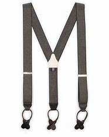
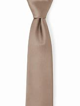

= Prices 商家如何调整[商品价格]和[员工薪水]?
:toc: left
:toclevels: 3
:sectnums:
:stylesheet: ../myAdocCss.css

'''

== `主` Prices for many goods /`谓` do not move the way /economists think they should

Every first-year economics student quickly becomes familiar with _charts of supply and demand_, which *place* (v.) price *on* one axis /and quantity *on* the other.
Given 假定事实,如果，倘若 a drop in demand, the charts show (v.), firms can #either# sell fewer items  方式状 at the prevailing 普遍的；盛行的；流行的 price /#or# cut prices to prop up 支撑; 维持 sales.
But `主` online retailing, which makes it easier to collect fine-grained 有细密纹理的；详细的；深入的 price data, `谓` reveals how poorly textbook models reflect real-world market dynamics. The prices of consumer goods, it turns out, behave oddly 古怪地；怪异地；反常地,令人奇怪地；令人惊奇地.

[.my2]
每个经济学专业的新生, 很快都会熟悉供求关系图，图上两条轴线分别用来标示价格和数量。图表显示，如果需求下降，企业要么维持现价、少卖商品，要么降价以提振销量。
*但是，更容易收集到详细价格数据的"在线零售业"却揭示，教科书上的模型, 远不能正确反映现实的市场动态。事实证明，消费品价格的变动, 很是古怪。*

[.my1]
.标题
====
.prop
(v.) ~ sth/sb (up) (against sth)to support an object by leaning it against sth, or putting sth under it etc.; to support a person in the same way 支撑 +
(n.) 支柱；支撑物 +
-> 来自pro-,向前，-pag,固定，词源同page,compact.

====

A forthcoming paper by Diego Aparicio and Roberto Rigobon of the Massachusetts Institute of Technology /helps make the point 证明一个论点.

Firms that sell thousands of different items /`谓` do not offer them at thousands of different prices, *but rather* slot (v.)把……投入窄孔中，把……放到指定位置 them into a dozen 一打，十二个,一打，十二个 or two price points.
Visit the website for H&M, a fashion retailer, and you will find a staggering 令人难以相信的 array of items for £9.99: hats, scarves 围巾；头巾, jewellery, belts, bags, herringbone （织物等的）人字形平行花纹 braces 吊裤带；背带, satin 缎子 neckties 领带, patterned shirts 有图案的衬衫 for dogs and much more. +
`主` Another vast collection of items `谓` cost £6.99, and another, £12.99.

When sellers change an item’s price, they tend *not* to nudge （用肘）轻推，轻触 it a little, *but rather* to re-slot it into one of the pre-existing price categories.

[.my2]
**销售数千种不同物品的公司, 并不会"以数千种不同的价格出售它们"，而是将它们分成十几个或二十个价格点。**访问时尚零售商H&M的网站，您会发现有大量售价为9.99英镑的物品：帽子、围巾、珠宝、皮带、包、人字背带、缎子领带、狗狗衬衫等等。另一大批物品的价格为6.99英镑，另一批为12.99英镑。*当卖家改变一个物品的价格时，他们往往不会轻微调整价格(不会分成几千档)，而是将其重新分配到现有价格类别(只几个价格档中)之一。*

The authors dub (v.)把…戏称为；给…起绰号 this phenomenon “quantum pricing”. +
(quantum mechanics grew (v.) from the observation /that `主` the properties  性质；特性 of subatomic particles `谓` do not vary (v.) along a continuum （相邻两者相似但起首与末尾截然不同的）连续体 , but rather fall into discrete 分离的；互不相连的 states).

[.my2]
作者将这种现象, 称为“量子定价”，量子力学源于观察到, 亚原子粒子有这种性质: 它不沿着"连续体"变化，而是以"离散状态的形式"变化。

[.my1]
.标题
====
.slot :
v.to put sth into a space that is available or designed for it; to fit into such a space 投放；插入；（被）塞进；（被）装入 +
- He slotted a cassette into the VCR. 他把录像带插入录像机中。 +
- The bed comes in sections which can be quickly slotted together. 这种床以散件出售，很快就可以组装起来。

.stagger
/ˈstæɡər/ to shock or surprise sb very much 使震惊；使大吃一惊 /摇摇晃晃地走；蹒跚；踉跄 +
-> 来自古诺斯语 stakra,推，挤，使打转，来自 Proto-Germanicstakon,棍子，柱子，来自 PIEsteg, 棍子，柱子，词源同 stack,stick.-er,表反复。其字面意思可能是用棍子在后面追打或赶，引申 词义蹒跚，踉跄，及相关比喻义。

.herringbone
/ˈherɪŋ-bəʊn/  [ U] a pattern used, for example, in cloth consisting of lines of V-shapes that are parallel to each other （织物等的）人字形平行花纹 +
=> herring,鲱鱼，bone,骨头。比喻用法，因这种花纹图案如同鲱鱼骨而得名。

image:../img/herringbone.png[,10%]

.herringbone braces

.satin neckties

.nudge
=> 词源不详。 nudie 裸体照片，裸体表演 来自nudist的口语。

.dub
=> 起绰号，来自古法语adober, 原义为封爵士。 2.配音，缩写自double. 即再次录制声音。

.dub
-> 1.起绰号，来自古法语adober, 原义为封爵士。 2.配音，缩写自double. 即再次录制声音。

.quantum mechanics
N the branch of mechanics, based on the quantum theory used for interpreting the behaviour of elementary particles and atoms, which do not obey Newtonian mechanics 量子力学

.continuum :
(n.) a series of similar items /in which each is almost the same as the ones next to it /but the last is very different from the first （相邻两者相似但起首与末尾截然不同的）连续体 +
- It is impossible to say at what point along the continuum a dialect becomes a separate language. 要说出同一语言的方言差异到什么程度就成为一种别的语言, 是不可能的。

.discrete
=> dis-, 分开，散开。-cret,区分，词源同crisis, critic, discern. 词义与discreet在17世纪前没有区别，后来才赋予不同的词义。

====

`主`  Just as surprising as the quantum way /in which prices adjust  `系` is  /`表`  how rarely 罕有；很少 they move (v.) at all.
主 Retailers, Messrs Aparicio and Rigobon suggest, 谓 seem to design (v.) products to fit their preferred 更喜欢,更合意的 price points.

[.my2]
与量子式定价一样令人惊讶的是，价格根本就很少变动。阿帕里西奥和里哥本认为，零售商似乎是根据自己喜欢的价格点,来设计产品的。

Given a big enough shift /in market conditions, such as an increase in labour costs, firms often redesign a product to fit the price /*rather than* tweak 扭；拧；稍稍调整（机器、系统等） the price.
They may make a production process 宾补 less labour-intensive (a.)劳动密集型的  —  #or# *shave* (v.)削减 a bit *off* a chocolate bar.

[.my2]
如果出现"劳动力成本增加"等较大的市场变化，企业常常会根据价格, 来重新设计产品，而不是微调价格。他们可能会削减生产过程中的员工数量(即裁员)，或者把巧克力棒(的重量), 稍微刮掉一些。

[.my1]
.标题
====
.shave
(v.)剃（须），刮去（毛发）,（少量地）削减，调低
====

Wages are notoriously 众所周知地，声名狼藉地 sticky 黏（性）的, especially downwards.
In a world of low inflation, 主 the ability to trim pay /by raising wages less than inflation /系 is lost (a.)得不到的；无法再找到的；无法再造的 to firms, with serious macroeconomic consequences.
Facing reduced demand, `主` firms 后定 that cannot cut pay to maintain (v.) margins while slashing （用利器）砍，劈,大幅度削减 prices/ `谓` instead reduce (v.) output  — and sack (v.)解雇 workers.

[.my2]
工资的粘性之大众所周知，尤其是在向下调整时。
在低通胀的情况下，公司没法用"让工资涨幅低于通胀"的方式, 来削减薪资，这给宏观经济带来了严重后果。 面对需求减少，那些"无法通过降低薪资, 来保持利润率"的公司, 就只能转而"减产"和"裁员"了。

[.my1]
.案例
====
.while slashing prices
chatgpt: +
这里的 "while slashing prices" 意指企业在削减产量的同时, 降低价格。在面对需求减少的情况下，企业可能无法通过降低工资, 来保持利润率; 但它们可以通过减少生产, 并降低产品价格, 来尝试刺激销售。这样的做法可能导致企业陷入困境，因为利润减少，同时还可能导致员工裁减。

====

But nimble 灵活的；敏捷的 firms have other options: the employment version of *shaving* a bit of chocolate *from* the bar.
Some cut (v.) costs /by boosting _output per worker_, often by driving workers harder. +
Tellingly 有效地；显著地 , `主` growth in _output per worker_ now /`谓` tends (v.) to fall [in booms] /and rise (v.)[during busts 经济萧条时期 ], precisely the opposite 相反的,对面的 of the pattern 40 years ago, when inflation was high.

[.my2]
但灵活的公司, 还有其他选择，比如把刮掉一点巧克力这个办法, 挪到用工环节上。
一些公司通过"提高人均产量", 来削减成本 — 通常是加大员工的劳动强度。
很能说明问题的是，现在的人均产量增长, 往往在经济繁荣时下降，在衰退时上升，与40年前通胀高企时的规律正好相反。

Firms can respond to market pressures /by reducing the benefits available to workers; Asda, a supermarket, recently announced plans (n.) to slash（用利器）砍，劈  British workers’ holiday allowances 津贴；补贴.
Or they can offer workers more tortuous 含混不清的；冗长费解的 schedules.
Research published in 2017 suggests that /`主` being able to vary(v.) workers’ hours from week to week `系`  is worth at least 20% of their wages.

[.my2]
公司可以通过减少工人的福利, 来应对市场压力。阿斯达超市（Asda）最近就宣布了削减英国工人"假期津贴"的计划。或者公司也可以给员工安排更含混不清的工作时间。2017年发表的一项研究表明，如果可以每周调整员工的工作时间，便相当于至少节省了20%的工资支出。

On the flipside 另一面；反面, during good times /firms often opt (v.) to reward workers with _office perks_ （工资之外的）补贴 and _one-off 一次性的；非经常的 bonuses_, rather than pay rises /that cannot easily be clawed 抓，撕，挠 back /during downturns.

[.my2]
另一方面，在经济繁荣期，公司往往选择用"办公室福利"和"一次性奖金", 来奖励员工，而不是给他们加薪，因为加好的薪水没法在衰退期轻易再降下来。

[.my1]
.标题
====
.notoriously
/noʊ-ˈtɔːriəsli/

.lost to firms
(ChatGPT 3.5) : 在这句英文中，"lost to firms"的意思是 "对于公司来说不再可用"。这里的"lost"表示某个事物已经不再存在或不再可用，这是一个常用的表达方式。在这个句子中，它表达的是在通货膨胀较低的情况下，通过"表面上提高工资, 但却幅度低于通货膨胀的水平, 来达到实质性的削减工资的目的", 这种手段已经不再可用于公司了。

."Facing reduced demand, firms that cannot cut pay to maintain margins while slashing prices instead reduce output — and sack workers." 在这句英文中, "while" 怎么理解?
(ChatGPT 3.5 的解释): 在这个句子中，"while" 是一个连词，用于连接两个相对独立的部分。"while" 的意思是"尽管"或者"虽然"，它表示前后两个部分之间的对比或者对立。在这个句子中，它连接了两个相对矛盾的部分："不能削减工资以维持利润，而是要削减价格"和"减少产量并裁员"。

.slash :
(v.) to reduce sth by a large amount 大幅度削减；大大降低 +
=> 来自辅音丛 sl-,砍，劈，分开，比较 slab,slip,slat,slit,slot.引申比喻义削减。 +
- to slash costs/prices/fares, etc. 大幅度降低成本、价格、车费等

.sack
=> 来自拉丁语 saccus,袋子，来自希腊语 sakkos,袋子，来自某闪族语词，比较希伯来语 saq,袋 子。通常指比较大的袋子，引申词义麻袋，购物袋等，后引申比喻义抢劫及现代词义解雇， 开除，卷包袱走人。

.nimble
=> 来自PIEnem,分开，分配，拿，带，词源同number,numb.引申词义灵活的，敏捷的。

.telling :
(a.) having a strong or important effect; effective 强有力的；有明显效果的；显著的 +
-> a telling argument 有力的论据 +
(2) showing effectively what sb/sth is really like, but often without intending to 生动的；显露真实面目的，说明问题的（通常并非有意） +
-> The number of homeless people is a telling comment on the state of society. 无家可归者的数量是社会状况的生动写照。

.perk
=> 缩写自perquisite,津贴，额外补贴。
====

'''

== <pure> Prices for many goods do not move the way economists think they should

Every first-year economics student quickly becomes familiar with charts of supply and demand, which place price [on one axis] and quantity [on the other]. Given a drop in demand, the charts show, firms can either sell fewer items [at the prevailing price] or cut prices to prop up sales. But online retailing, which makes it easier to collect fine-grained price data, reveals how poorly textbook models reflect real-world market dynamics. The prices of consumer goods, it turns out, behave oddly.

A forthcoming paper by Diego Aparicio and Roberto Rigobon of the Massachusetts Institute of Technology helps make the point. Firms that sell thousands of different items do not offer them at thousands of different prices, but rather slot them into a dozen or two price points. Visit the website for H&M, a fashion retailer, and you will find a staggering array of items for £9.99: hats, scarves, jewellery, belts, bags, herringbone braces, satin neckties, patterned shirts for dogs and much more. Another vast collection of items cost £6.99, and another, £12.99. When sellers change an item’s price, they tend not to nudge it a little, but rather to re-slot it into one of the pre-existing price categories. The authors dub this phenomenon “quantum pricing” (quantum mechanics grew from the observation that the properties of subatomic particles do not vary along a continuum, but rather fall into discrete states).

Just [underline]#as surprising as# the quantum way (in which prices adjust) is {how rarely they move at all}.  Retailers, Messrs Aparicio and Rigobon suggest,  seem to design products to fit their preferred price points. Given a big enough shift in market conditions, such as an increase in labour costs, firms often redesign a product to fit the price rather than tweak the price. They may make a production process less labour-intensive — or [underline]#shave# a bit [underline]#off# a chocolate bar.

Wages are notoriously sticky, especially downwards. In a world of low inflation,  the ability to trim pay [by raising wages less than inflation]  is lost  to firms, with serious macroeconomic consequences. Facing reduced demand, firms (that cannot cut pay to maintain margins while slashing prices) instead reduce output — and sack workers.

But nimble firms have other options: the employment version of shaving a bit of chocolate from the bar. Some cut costs by boosting output per worker, often by driving workers harder. Tellingly, growth in output per worker now tends to fall [in booms] and rise [during busts], precisely the opposite of the pattern 40 years ago, when inflation was high. Firms can respond to market pressures by reducing the benefits available to workers; Asda, a supermarket, recently announced plans to slash British workers’ holiday allowances. Or they can offer workers more tortuous schedules. Research published in 2017 suggests that {being able to vary  workers’ hours [from week to week] is worth at least 20% of their wages}. On the flipside, [during good times] firms often opt to reward workers with office perks and one-off bonuses, rather than pay rises that cannot easily be clawed back during downturns.

'''
