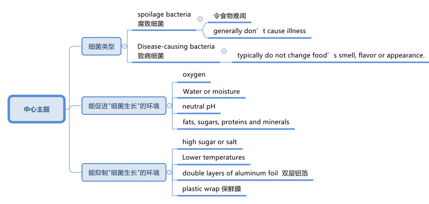
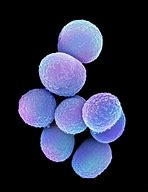
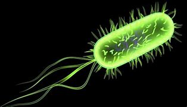
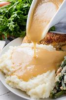

= ★ 食物在室温下每放置 20 分钟，微生物在数量上, 就会增加一倍
:toc: left
:toclevels: 3
:stylesheet: ../myAdocCss.css

'''

== How Long Do Thanksgiving Leftovers Last? 感恩节剩菜能保存多久？

What are some guidelines for storing (v.a.)存储的 leftovers 吃剩的食物；残羹剩饭? +

[.my2]
储存剩菜的一些准则是什么？ +

Smell is a common indicator people use (v.) to see if food has gone bad. +
A foul (a.)难闻的，令人恶心的 odor 气味；名声 may suggest that certain bacteria 细菌, mold 霉菌 or other microorganisms *have gotten the best of* 获胜，占上风;充分利用;从……中得到了大好处 your leftovers. +

[.my2]
气味是人们用来判断食物是否变质的常用指标。 恶臭可能表明某些细菌、霉菌或其他微生物, 已经侵占了你的剩菜。 +

[.my1]
.案例
====
.get the better of someone
(v.) to defeat someone in a competition 在比赛中击败某人 +
- He fought fiercely, but his opponent easily got the better of him. 他打得很凶猛，但对手却轻易地战胜了他。

If a feeling gets the better of you, you cannot stop yourself from allowing that feeling to make you do something, despite knowing that what you are doing is wrong 如果一种感觉控制了你，你就无法阻止自己让这种感觉驱使你做某事，尽管你知道你正在做的事情是错误的. +
- Her curiosity got the better of her and she opened the door and peeped inside. 她的好奇心战胜了她，她打开门，朝里面看了一眼。
====

But surprisingly, _spoilage (n.)（食物的）变质，腐败 bacteria_ generally don’t cause illness. (Although people might *feel (v.) sick* (a.)想呕吐；恶心 from the revolting 令人作呕的；极其讨厌的 scent （人的）气味，气息；（动物留下的）臭迹，遗臭 and taste.) +
Disease-causing bacteria typically do not change food’s _smell, flavor or appearance_. +
That’s why _a sniff 嗅；闻 test_ isn’t always reliable. +

[.my2]
但令人惊讶的是，#"腐败细菌"通常不会引起疾病。#（尽管人们可能会因为令人厌恶的气味和味道而感到恶心。） +
#而相反, 那些能引起疾病的细菌, 即"致病细菌"却通常不会改变食物的气味、味道或外观。# +
#这就是为什么"嗅探测试"并不总是可靠的。# +

Instead /Quinlan 人名 emphasizes (v.) the importance of _taking preventive steps_ when cooking, such as ① avoiding _cross contamination_ ② and not leaving _raw or cooked food_ sitting out  坐在一旁（不参加跳舞、游戏等活动） for too long. +

[.my2]
相反，昆兰(食品科学家)强调##"烹饪时采取预防措施"的重要性，例如避免交叉污染, 以及不要将生食或熟食放置太久。## +

there are several factors that influence (v.) how long certain items stay fresh. +
Animal-derived 动物来源的 foods such as meat and dairy 牛奶场；乳品场 have a higher likelihood 可能；可能性 of containing (v.) pathogens 病原体 that, given enough time, can grow (v.) on leftovers and make people sick. +
The most common _pathogenic 致病的；病原的；发病的 bacteria_ are _Staphylococcus  葡萄球菌 aureus_ (奥里斯; 罗马帝国的一种金币) 金黄色葡萄球菌, _Salmonella_ 沙门氏菌 and _Escherichia 埃希氏杆菌属 coli_ 大肠杆菌. +

[.my2]
有几个因素会影响某些物品的保鲜时间。 +
##肉类和奶制品等动物源性食品, 含有"病原体"的可能性更高，##如果时间足够长，这些病原体可能会在剩菜上生长, 并导致人们生病。 +
最常见的致病菌是"金黄色葡萄球菌"、"沙门氏菌"和"大肠杆菌"。 +

[.my1]
.案例
====
.staphylococcus +
/ˌstæfɪləˈkɑːkəs/ +
--> 杜撰词，来自希腊语 staphyle,葡萄串，和现代拉丁语 coccus,球形细菌，来自希腊语 kokkos, 浆果，莓子，词源同 cocoon.因这种细菌常如葡萄串在一起而得名。构词模仿 streptococcus.

.salmonella
/ˌsælməˈnelə/ +
--> 来自这种细菌的发现者 20 世纪初美国外科医生 Daniel E.Salmon,后为表达对他的敬意而以其 名字命名。-elle,小词后缀。 +

image:../img/salmonella.jpg[,10%]

.Escherichia coli

====

Le recommends throwing away _dairy and meat products_ by the end of the third day after initially cooking them. +

[.my2]
Le建议, #在最初烹饪后的第三天结束时, 扔掉乳制品和肉制品。# +

The food’s composition 成分；构成；组合方式  also matters (v.). +
Water or moisture 潮气，水分 can help _bacteria, yeast 酵母；酵母菌 and other microorganisms_ grow faster, while _high sugar or salt content_  含量；容量 can slow down some microbial growth. +

[.my2]
食物的成分也很重要。#水或湿气, 可以帮助细菌、酵母和其他微生物更快地生长; 而高糖或盐含量, 可以减缓一些微生物的生长。# +

Such _sweet or salty foods_ are more likely to get contaminated 污染；弄脏 by _spoilage microorganisms_ that make your food smell (v.) and look rotten (a.)腐烂的，发臭的 — but they are less likely to cause (v.) life-threatening infections, Le explains. +
These foods are _a little safer_((a.)safe 的比较级) 稍微更安全一些 to eat for longer periods of time, compared with dairy or meat products without such content. +

[.my2]
Le 解释说，#这些甜或咸的食物, 更有可能受到"腐败微生物"的污染，使你的食物闻起来腐烂，看起来腐烂，但它们不太可能引起危及生命的感染。# +
与不含此类成分的乳制品或肉制品相比，这些食物可以更安全地长期食用。 +

[.my1]
.案例
====
这里的 "a little safer" 意思是“稍微更安全一些”。这个表达意味着这些食物相较于不含这种成分的乳制品或肉类产品来说，在较长时间内食用时稍微更安全。换句话说，它们的安全性比其他食品稍微好一点，但并不是完全安全。
====

Acidity 酸味；酸性 is another factor. +
Canned (a.)罐装的 _cranberry 越橘，小红莓（用于烹饪） sauce_ 酱，调味汁, for example, has a pH of about 2.4. +
Le says only a few pathogens can survive in such acidic conditions. +

Meat and dairy, on the other hand, have a neutral pH, making them a more hospitable （作物生长条件）适宜的；（环境）舒适的 environment for microorganisms. +

[.my2]
##酸度是另一个因素。 ##例如，罐装酸果蔓酱的 pH 值约为 2.4。 勒说，#只有少数病原体可以在这种酸性条件下生存。# +
另一方面，#肉类和乳制品的 pH 值为中性，这使得它们成为微生物更适宜的环境。# +

[.my1]
.案例
====
.cranberry
/ˈkrænberi/ +

image:../img/cranberry.jpg[,10%]
====

Additionally, meat and dairy products are rich in nutrients — fats, sugars, proteins 蛋白质 and minerals 矿物质 — that microorganisms need to grow. +
_Fresh vegetables_ or _other plant-based 植物性的 dishes_ `谓` do not have such _an array 大堆；大群；大量 of_ microbe-supporting nutrients, so only _a select (a.)精选的 number_ grow (v.) in these types of foods. +
_Baked goods_ also tend  趋向；走向；倾向；趋于 to lack (v.) such nutrients and to have _a high sugar content_. +

[.my2]
此外，#肉类和乳制品, 富含微生物生长所需的营养物质#——脂肪、糖、蛋白质和矿物质。 +
#新鲜蔬菜或其他植物性菜肴, 不含有如此多的支持微生物的营养物质，因此, 只有被选出的某些微生物, 才能生长在这些类型的食物中。# +
#烘焙食品也往往缺乏此类营养素, 并且糖含量较高。# +

Food safety experts say /dishes should be sealed and stored in the fridge immediately — ideally, under two hours after the food is prepared, *at which point* the risk of illness begins to increase. +
Bacteria and other microorganisms thrive (v.) at room temperature (between 68 and 74 degrees Fahrenheit 华氏温度计的), Le says. +

[.my2]
食品安全专家表示，#菜肴应立即密封, 并存放在冰箱中，理想情况是在食物准备好后两小时内，因为此时患病的风险开始增加。# +
Le 说，#细菌和其他微生物在室温（华氏 68(即摄氏20度) 到 74(即摄氏23.3)度之间）下可以繁殖。# +

[.my1]
.案例
====
.Fahrenheit
(a.) 华氏温度计的，华氏的（冰点为32度，沸点为212度）
====

Some bacteria such as _Clostridium 梭菌属 perfringens_ 产气荚膜梭菌, one of _the most common culprits_ (n.)犯错的人；罪犯;肇事者；引起问题的事物 of _food poisoning_ 食物中毒, can withstand (v.)承受；抵住；顶住；经受住 _the oven’s 烤箱；烤炉 heat_ when a turkey is baking /and can potentially *cross contaminate* (v.) other foods, including stuffing (n.)（烹饪前塞入鸡等膛内的）填料 and gravy  （调味）肉汁. +

“That’s a really bad [bacterium] that you don’t want to leave out for too long /because it grows at _room temperature_ and produces (v.) toxins.” +

[.my2]
一些细菌，如产气荚膜梭菌，是食物中毒最常见的罪魁祸首之一，在烘烤火鸡时可以承受烤箱的热量，并可能交叉污染其他食物，包括馅料和肉汁。 +
“这是一种非常糟糕的[细菌]，你不想让它放置太久，因为它在室温下生长并产生毒素。” +

[.my1]
.案例
====
.Clostridium perfringens
产气荚膜梭菌（Clostridium perfringens）, 是临床上"气性坏疽"病原菌中, 最多见的一种梭菌，因能分解肌肉和结缔组织中的糖，产生大量气体，导致组织严重气肿，继而影响血液供应，造成组织大面积坏死，加之本菌在体内能形成荚膜，故名产气夹膜梭菌。  +
"气性坏疽"是火器伤中最为严重、发展最快的并发症之一，如不及时诊治，可丧失肢体或危及生命，死亡率可达20%～50%。

1892年,美国病理学家W.H.韦尔奇等自一尸体分出本菌,因而又称韦氏梭菌。无鞭毛，有荚膜。糖发酵能力强，产酸产气。本菌的特征之一是在牛乳培养基中呈"暴烈发酵"现象。形成的毒性物质有12种，可损伤细胞膜、血管内皮细胞, 并使糖类分解，导致细胞坏死、组织水肿、充气等病变。

根据产生毒素种类和致病性的不同,本菌有A、B、C、D、E、F6个型。有些菌株产生肠毒素，可引起食物中毒。

本菌广泛存在于土壤、人和动物的肠道, 以及动物和人类的粪便中，会散发臭味。常因深部创伤而感染。

image:../img/Clostridium perfringens.jpg[,10%]

坏疽jū（gangrene）: 指组织坏死后, 因继发腐败菌的感染, 和其他因素的影响, 而呈现黑色、暗绿色等特殊形态改变。 坏死组织经腐败菌分解, 产生硫化氢，后者与血红蛋白中分解出来的铁相结合, 形成硫化铁，使坏死组织呈黑色。

.gravy
--> 来自古法语grane, 沙司，炖汁，来自grain, 颗粒。即肉汁，形成颗粒条纹的汤汁。俚语义，美差。字母u, n拼写变化比较spouse, sponsor,同时在过去很长一段时间字母u,v拼写没有严格的区分。

====

The USDA 美国农业部 says `主` *leaving* food 后定 that has _an internal temperature_ 内部温度 of 40 to 140 degrees Fahrenheit 华氏温度计的 *out* on the table `谓` is typically considered the “danger zone,” Le notes (v.), because _harmful bacteria_ can rapidly divide (v.)（使）分开，分散 and contaminate (v.) the food. +
“Every 20 minutes the food is left out in room temperature, microorganisms are doubling (v.) in number.” +

[.my2]
Le 指出，美国农业部表示，#将内部温度为 40 至 140 华氏度(即 4-60 ℃)的食物放在餐桌上(而不是放到冰箱中), 这么做通常被视为“危险区域”，因为有害细菌会迅速分裂, 并污染食物。# +
“#食物在室温下每放置 20 分钟，微生物在数量上, 就会增加一倍。#” +

[.my1]
.案例
====
.USDA
美国农业部（United States Department of Agriculture）
====

The Centers for _Disease Control and Prevention_ recommends (v.)  refrigerating (v.) 冷藏，冷冻；使冷却 _perishable 易腐烂的；易变质的 food_ in under two hours after preparation. +
If the food has been sitting at temperatures above 90 degrees F, such as in a hot car, the agency recommends (v.)  _refrigerating_ (v.) or _discarding (v.) it within an hour_. +

[.my2]
美国疾病控制与预防中心建议, #在菜肴准备好后两小时内, 就要将易腐烂的食物冷藏起来。# +
如果食物一直处于 90 华氏度, 即32.22℃ 以上的温度下，例如在炎热的汽车中，该机构建议将其冷藏或在一小时内丢弃。 +

[.my1]
.案例
====
.perish +
(v.) 死亡；暴死 +
--> 来源于拉丁语中由前缀per-(完全,贯穿)和基本动词ire(行,走)组成的复合动词perire(去世),经由古法语periss-进入英语为perish。 词根词缀： per-完全,贯穿 + -ish( = -it- )行,走
====

`主` leaving out food *to cool (v.) to* room temperature `谓` may put it in the danger zone for a longer period of time, increasing the risk of bacterial growth. +
He advises (v.) *putting food in the fridge* even if it is still warm. +
`主` *Dividing* large amounts of food *into* smaller portions  部分;（食物的）一份，一客 and *putting* them *in* _shallow containers_ `谓` can help hot food *cool (v.) down* more quickly. +

[.my2]
#把食物放在外面, 来使其冷却到室温状态, 可能会使它长时间处于危险区域中，增加细菌生长的风险。 他建议将食物放入冰箱，即使食物还热。#  +
#将大量食物分成小份, 并放入浅容器中, 可以帮助热食物更快冷却。# +

When food temperature *drops to* refrigeration 冷藏，冷冻 level — *at or below* 40 degrees F — it decreases (v.) the metabolism 新陈代谢 of most microorganisms 微生物, Le says. +

[.my2]
Le 说，#当食品温度降至冷藏水平（40 华氏度, 即 4.44℃ 或以下）时，大多数微生物的新陈代谢就会降低。# +

Lower temperatures *slow (v.) down* many of the chemical processes that normally allow (v.) microbes to reproduce and extract (v.) energy from food sources. +
But this does not mean `宾` the fridge is killing the bacteria.
Rather it keeps them in _suspended animation_  (生气；活力；富有生命力) 蛰伏状态; 冬眠, Le says.
Once you reheat (v.) the food, he adds, “they’re going to *come back to life*.” +

[.my2]
##较低的温度, ##减缓了"通常允许微生物繁殖"和"从食物来源中提取能量"的许多化学过程。但这##并不意味着冰箱可以杀死细菌。##
相反，这会让他们处于假死状态，勒说。 他补充道，##一旦你重新加热食物，“它们就会复活。” ##+

_Freezing (v.) leftovers_ can make them last (v.) about two to three months, *depending on* the fat content. +

As with refrigeration, the colder temperature temporarily *stops* (v.) pathogens 病原体 *from* dividing (v.) and reproducing. +
Although _frozen foods_ can be stored (v.) longer, Le says that there is a trade-off （在需要而又相互对立的两者间的）权衡，协调: _supercold temperatures_ can cause freezer 冷冻柜；冰柜 burn, which changes _the flavor of the food_ the longer it’s stored. +

[.my2]
冷冻剩菜可以保存大约两到三个月，具体取决于脂肪含量。 +
与冷藏一样，较低的温度会暂时阻止病原体的分裂和繁殖。 +
尽管冷冻食品可以保存更长时间，但 Le 表示，这需要权衡：过冷的温度可能会导致冰箱烧毁，从而使食品的风味随着保存时间的延长而改变。 +

`主` Limiting (v.) the oxygen *accessible (a.) to* pathogens such as bacteria and mold `谓` can help slow (v.) their growth. +
Quinlan advises (v.) /①*packing* (v.) leftovers *with* _vacuum-sealed 真空密封的 food storage containers_  ② or wrapping (v.) them tightly. +

[.my2]
#限制细菌和霉菌等病原体可接触的氧气, 有助于减缓其生长。#
昆兰##建议用"真空密封的食品储存容器", 包装剩菜, 或将其紧紧包裹。## +

For wrapping (n.)包装材料；包装纸；包装塑料, Le recommends (v.) using (v.) _double layers of aluminum 铝 foil_ （尤指包装食物等用的）箔 and _plastic wrap_ 保鲜膜 for extra protection. +
_Plastic wrap_ is permeable (a.)可渗透的；可渗入的 to oxygen but not to water. +
_Aluminum foil_ 铝箔 blocks (v.) both oxygen and water, making it better at *depriving* (v.)剥夺  microorganisms *of* the resources they need to divide. +

[.my2]
对于包装，Le #建议使用"双层铝箔"和"保鲜膜"提供额外保护。# +
#保鲜膜可以透过氧气，但不能透过水。# +
#铝箔可以阻挡氧气和水，从而更好地剥夺微生物所需的资源。# +

`主` Where you *place* (v.) your leftovers *in* the fridge `系` is also important. +
“The temperature in the fridge `谓` fluctuates (v.)（大小、数量、质量等）波动；（在…之间）起伏不定 throughout the night, even when it’s closed,” Le says. +

He recommends (v.) *putting* leftovers like meats and dairy, which are _the first_ to go bad, *closer to* the center of the fridge. +
This makes them more likely *to remain (v.)  near* (ad.) a constant temperature. +

[.my2]
将剩菜放入冰箱的位置也很重要。  +
“即使冰箱关着，冰箱里的温度整个晚上都会波动，”Le 说。 +
他建议##将肉类和奶制品等最容易变质的剩菜, 放在靠近冰箱中心的位置。这使得它们更有可能保持在恒定温度附近。##  +

*Put* food 后定 that is the slowest to spoil, such as _high-acid cranberry  越橘，小红莓（用于烹饪） sauce_ or _sugary 含糖的；甜的 sweet potatoes_ 土豆，马铃薯, *by* the door or the edge of the fridge. +
Experts say (v.) these tips can help extend (v.) _the shelf life （食品等的）货架期，保存期 of leftovers_, allowing you to spend more time enjoying them *instead of* throwing them away. +

[.my2]
#将最慢变质的食物#（例如高酸蔓越莓酱或含糖红薯）#放在冰箱门或边缘。# +
专家表示，这些技巧可以帮助延长剩菜的保质期，让您有更多时间享用它们，而不是扔掉它们。

'''

== (pure) How Long Do Thanksgiving Leftovers Last?

What are some guidelines for storing leftovers? +

Smell is a common indicator people use to see if food has gone bad. A foul odor may suggest that certain bacteria, mold or other microorganisms have gotten the best of your leftovers. But surprisingly, spoilage bacteria generally don’t cause illness. (Although people might feel sick from the revolting scent and taste.) Disease-causing bacteria typically do not change food’s smell, flavor or appearance.

That’s why a sniff test isn’t always reliable. Instead Quinlan emphasizes the importance of taking preventive steps when cooking, such as avoiding cross contamination and not leaving raw or cooked food sitting out for too long.

there are several factors that influence how long certain items stay fresh. Animal-derived foods such as meat and dairy have a higher likelihood of containing pathogens that, given enough time, can grow on leftovers and make people sick. The most common pathogenic bacteria are Staphylococcus aureus, Salmonella and Escherichia coli. Le recommends throwing away dairy and meat products by the end of the third day after initially cooking them.

The food’s composition also matters. Water or moisture can help bacteria, yeast and other microorganisms grow faster, while high sugar or salt content can slow down some microbial growth. Such sweet or salty foods are more likely to get contaminated by spoilage microorganisms that make your food smell and look rotten—but they are less likely to cause life-threatening infections, Le explains. These foods are a little safer to eat for longer periods of time, compared with dairy or meat products without such content.

Acidity is another factor. Canned cranberry sauce, for example, has a pH of about 2.4. Le says only a few pathogens can survive in such acidic conditions. Meat and dairy, on the other hand, have a neutral pH, making them a more hospitable environment for microorganisms. Additionally, meat and dairy products are rich in nutrients—fats, sugars, proteins and minerals—that microorganisms need to grow. Fresh vegetables or other plant-based dishes do not have such an array of microbe-supporting nutrients, so only a select number grow in these types of foods. Baked goods also tend to lack such nutrients and to have a high sugar content.

Food safety experts say dishes should be sealed and stored in the fridge immediately—ideally, under two hours after the food is prepared, at which point the risk of illness begins to increase. Bacteria and other microorganisms thrive at room temperature (between 68 and 74 degrees Fahrenheit), Le says. Some bacteria such as Clostridium perfringens, one of the most common culprits of food poisoning, can withstand the oven’s heat when a turkey is baking and can potentially cross contaminate other foods, including stuffing and gravy. “That’s a really bad [bacterium] that you don’t want to leave out for too long because it grows at room temperature and produces toxins.”

The USDA says leaving food that has an internal temperature of 40 to 140 degrees Fahrenheit out on the table is typically considered the “danger zone,” Le notes, because harmful bacteria can rapidly divide and contaminate the food. “Every 20 minutes the food is left out in room temperature, microorganisms are doubling in number.”

The Centers for Disease Control and Prevention recommends refrigerating perishable food in under two hours after preparation. If the food has been sitting at temperatures above 90 degrees F, such as in a hot car, the agency recommends refrigerating or discarding it within an hour.

leaving out food to cool to room temperature may put it in the danger zone for a longer period of time, increasing the risk of bacterial growth. He advises putting food in the fridge even if it is still warm. Dividing large amounts of food into smaller portions and putting them in shallow containers can help hot food cool down more quickly.

When food temperature drops to refrigeration level—at or below 40 degrees F—it decreases the metabolism of most microorganisms, Le says. Lower temperatures slow down many of the chemical processes that normally allow microbes to reproduce and extract energy from food sources. But this does not mean the fridge is killing the bacteria. Rather it keeps them in suspended animation, Le says. Once you reheat the food, he adds, “they're going to come back to life.”

Freezing leftovers can make them last about two to three months, depending on the fat content. As with refrigeration, the colder temperature temporarily stops pathogens from dividing and reproducing. Although frozen foods can be stored longer, Le says that there is a trade-off: supercold temperatures can cause freezer burn, which changes the flavor of the food the longer it’s stored.

Limiting the oxygen accessible to pathogens such as bacteria and mold can help slow their growth. Quinlan advises packing leftovers with vacuum-sealed food storage containers or wrapping them tightly.

For wrapping, Le recommends using double layers of aluminum foil and plastic wrap for extra protection. Plastic wrap is permeable to oxygen but not to water. Aluminum foil blocks both oxygen and water, making it better at depriving microorganisms of the resources they need to divide.

Where you place your leftovers in the fridge is also important. “The temperature in the fridge fluctuates throughout the night, even when it’s closed,” Le says.  He recommends putting leftovers like meats and dairy, which are the first to go bad, closer to the center of the fridge. This makes them more likely to remain near a constant temperature. Put food that is the slowest to spoil, such as high-acid cranberry sauce or sugary sweet potatoes, by the door or the edge of the fridge. Experts say these tips can help extend the shelf life of leftovers, allowing you to spend more time enjoying them instead of throwing them away.

'''

