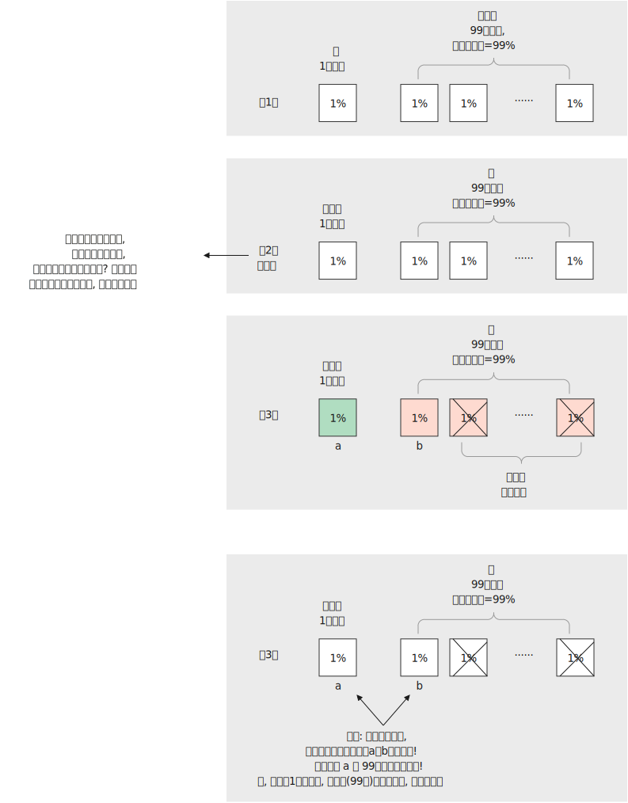

= ★★ 你买一箱99张彩票的整体中奖概率, 并不会因你撕开其中98张后而改变!
:toc: left
:toclevels: 3
:sectnums:
:stylesheet: ../myAdocCss.css

'''

== 三门问题的直观解释

[.small]
[options="autowidth" cols="1a,1a"]
|===
|Header 1 |Header 2

|三门问题
|1. 有3扇门: A,B,C. 其中只有一扇门后面有大奖(比如汽车), 另两扇门背后只有羊.  +
2. 你选中了其中一扇后 (未打开), 主持人(知道大奖在那扇门后面)故意帮你打开剩下两扇门的其中一扇，有羊存在的那扇.   +
3. 现在, 主持人给你一个选择: 你是保留你原来的选择, 还是决定换一扇门?   +
即, 你要思考的是: 你换一扇门的话, 会不会增加获奖的概率?

image:../img/三门问题 01.svg[,40%]

答案是: 你应该换, 你保持原来的选择不换的话, 中奖概率是1/3.  你换了后, 中奖概率是 2/3.

这怎么理解? 当排除掉一扇门后, 剩下的两扇门中, 肯定是一个是羊, 一个是车, 犹如抛硬币, 那不就是 50% vs 50% 的概率么?  +

|其实, 你可以这样来理解:
|1. 我们把选择数量放大, 比如有100张彩票(其中只有1张有奖). +
你选择了其中1张, 相当于主持人有剩下的99张 (因为主持人知道答案). 那么你的中奖概率是1%, 主持人是99%.  +
2. 然后, 主持人说, 我们交不交换手里的全部彩票? 你说, 那肯定呀, 我们交换后, 我的中奖率就变成了99%.
3. *然后##你拿到99张彩票(相当于你买了一箱彩票回来, 一箱彩票的中奖率, 肯定比你单独买一张要大的),## 撕开98张, 都是空白的 (由你撕开这98张, 和由主持人撕开这98张, 其实是没有任何区别的). 显然, 你手里还剩下的1张选票, 其中奖的概率,* 并不会因为你事后撕开的98张而改变, 因为**你99张彩票的整体中奖率依然是99%.**  +

即, 你手里这最后1张彩票的中奖率, 并不是50%, 因为100张彩票中, 每张的中奖率都是一样的. 否则, 如果单张彩票中奖率是50%的话, 你手里的99张彩票的整体中奖率, 岂不是就有 99*50%= 49.5 = 4950% 的中奖率?  +

所以, 一开始你就应该和主持人交换彩票.

那我们在回过头来, 看**#为什么不是 50% vs 50%的几率?#** 因为如果你这样想的话, 就相当于你把你撕掉的那98张彩票的中奖概率, 都清零了! *#你不会认为你一开始买的"一箱99张"的中奖概率, 就等于"最后你剩下的那1张"的中奖概率吧?#*

|===

'''

==  Monty Hall problem 三门问题 (概率)

image:../img/三门问题 03.svg[,100%]

One of the most straightforward ways to see why you should always switch doors `系` is *to draw out* the possible outcomes. Say (v.)比方说；假设 _you pick (v.) door 1_. There are three possible realities 现实；实际情况: the car is behind door 1, 2 or 3.

[.my2]
要明白为什么你应该总是换门，最直接的方法之一就是找出可能的结果。 +
假设您选择 1 号门。存在三种可能的情况：汽车在 1 号门、2 号门或 3 号门后面。

If the car is behind door 2, Monty Hall will open door 3 /and *offer* for you *to switch to* door 2. Switching yields (v.)出产（作物）；产生（收益、效益等）；提供 the correct door.

[.my2]
如果汽车在 2 号门后面， 主持人 Monty Hall 别无选择, 就只能跳过有车的门(2号), 打开有羊的门(3号), 并建议您切换到 2 号门。切换会令你得到正确的门。

If the car is behind door 3, Monty will open door 2 /and offer for you *to switch to* door 3. Switching yields the correct door.

[.my2]
如果汽车在 3 号门后面，Monty 也只能跳过有车的3号门, 而打开2号门, 并建议您切换到 3 号门。切换会令你得到正确的门。

If the car is indeed behind door 1, Monty will open either door 2 or door 3 /and offer for you *to switch to* the one he didn’t open. Switching yields the wrong door.

[.my2]
如果汽车确实在 1 号门后面，蒙蒂手中的两扇门,都只有羊, 他就有选择了, 随便打开 2 号或3号门，并建议您换到他没有打开的那扇门。你的转换, 就会令你来到错误的门。

Put simply, if you selected the correct door initially 开始，最初 (which happens (v.) 1/3 of the time), you shouldn’t switch when you’re offered the chance. If you chose the wrong door initially (which happens 2/3 of the time), you should switch.

[.my2]
简而言之，如果您一开始已经选择了正确的门（这种情况发生三分之一的时间中），那么当您有机会时，您不应该切换。如果您最初选择了错误的门（这种情况有三分之二会发生），您应该切换。(也就是说, 因为你一开始不知道自己选择的门是否正确, 但有2/3的可能性是选择错误的, 所以只要你切换门, 就能来到正确的门上! 即, 你切换后, 中奖的概率就是2/3.)

Imagine there are 100 doors instead of three. Only one has a car behind it, and the other 99 have goats. You select a door, say, number 1, and then Monty walks (v.) down 沿着......走 the line, *flinging (v.)（尤指生气地）扔，掷，抛，丢 open* door after door. He skips (v.) *right over* 立刻，马上 number 72, leaving it closed, before opening the rest. Do you want to stick with number 1 /or switch to 72? Here you really should switch. Your chance of winning is 99 percent /if you do.

[.my1]
.案例
====
"Flinging open" 在这里的意思是“快速且突然地打开”。 +
具体来说，"fling" 这个动词, 通常表示用力地、迅速地抛、甩或扔东西，而在这里，它用来描述 Monty 打开门的动作，意味着他以一种随意且迅速的方式打开了一扇扇门。让人感觉他很轻松地一个接一个地打开门，不太在意这些门后面是什么。 +
所以，"*flinging open* door after door" 可以理解为 Monty 一个接一个地快速打开门的动作。
====

[.my2]
统计学教授通常会提供一种常识性的解释。(更直观的理解是:) 想象一下有 100 扇门, 而不是 3 扇。只有一处后面有汽车，其他 99 处都有山羊。你选择一扇门，比如说 1 号门，然后蒙蒂沿着门的列对走，打开一扇又一扇门。他直接跳过了 72 号(相当于明着告诉你, 这里就是大奖所在地!)，将其关闭，然后打开其余的。您想坚持使用数字 1 还是切换到 72？在这里你真的应该切换 (当然要这么做了! 人家都告诉你大奖所在地可能在哪了! 而且其中奖概率高达99%, 因为主持人手握99扇门, 整体中奖概率就是99%)。如果您这样做，您获胜的机会是 99%。

In _two out of three_ games, the participant picks a goat the first time, meaning the host 主人；主持人 doesn’t have a choice in what door they open to tease (v.)挑逗，撩拨（异性）;取笑；戏弄；揶揄；寻开心 them.  +
In _one out of three_ games, the participant picks the car the first time, so the host *picks* between the two goat doors *at random* for the tease reveal.

[.my2]
(你也可以从"参与游戏的人数"来考虑.)  +
在三分之二的游戏中，参与者第一次会选择一只山羊 (原因是: *汽车中奖率是1/3的话, 那肯定就有2/3的人会第一次没选中, 选到了羊. 也代表了你在2/3的可能性中, 会选中有羊的门*)，这意味着主持人在剩下的两扇门中, 无法选择打开哪扇门, 来戏弄玩家( 即主持人只能跳过有车的那扇, 打开唯一有羊的那扇门. *这就意味着, 在这2/3的人中, 或你在2/3的可能性中, 只要立刻选择交换门, 就会中奖!*)。 +
(*汽车中奖率是1/3, 即) 在三分之一的游戏中，参与者第一次能选中有汽车的门，* 那主持人就能够在两扇有羊的门之中, 随机选择一个打开, 来戏弄你。(*也就是说, 你有1/3的中奖概率, 也就意味着, 交换门的话, 你也只有这1/3的可能性会来到没奖的门.*)

When _the tease-reveal door_ is opened, “people think that everything has changed, but the situation is the same as in the beginning.” That “is the illusion 错误的观念；幻想；错觉 in the problem.”

[.my2]
当(主持人把)揭秘之门(有羊的那扇)打开时，“人们认为一切都变了(误以为每扇门的中奖概率改变了)，但情况却和一开始一样(每扇门的中奖概率依然保持不变)”。这“就是问题中的幻觉”。(两扇门的整体中奖概率, 是永远不变的,  哪怕其中一扇门已被打开. 就像你买一箱彩票共99张, 刮开其中98张, 不影响你这箱彩票的整体中奖概率.)

'''

== (pure)  Monty Hall problem

One of the most straightforward ways to see why you should always switch doors  is to draw out the possible outcomes. Say you pick door 1. There are three possible realities: the car is behind door 1, 2 or 3.

If the car is behind door 2, Monty Hall will open door 3 and offer for you to switch to door 2. Switching yields the correct door.

If the car is behind door 3, Monty will open door 2 and offer for you to switch to door 3. Switching yields the correct door.

If the car is indeed behind door 1, Monty will open either door 2 or door 3 and offer for you to switch to the one he didn’t open. Switching yields the wrong door.

Put simply, if you selected the correct door initially (which happens 1/3 of the time), you shouldn’t switch when you’re offered the chance. If you chose the wrong door initially (which happens 2/3 of the time), you should switch.

Imagine there are 100 doors instead of three. Only one has a car behind it, and the other 99 have goats. You select a door, say, number 1, and then Monty walks down the line, flinging open door after door. He skips right over number 72, leaving it closed, before opening the rest. Do you want to stick with number 1 or switch to 72? Here you really should switch. Your chance of winning is 99 percent if you do.

In two out of three games, the participant picks a goat the first time, meaning the host doesn’t have a choice in what door they open to tease them. In one out of three games, the participant picks the car the first time, so the host picks between the two goat doors at random for the tease reveal.

When the tease-reveal door is opened, “people think that everything has changed, but the situation is the same as in the beginning.” That “is the illusion in the problem.”
