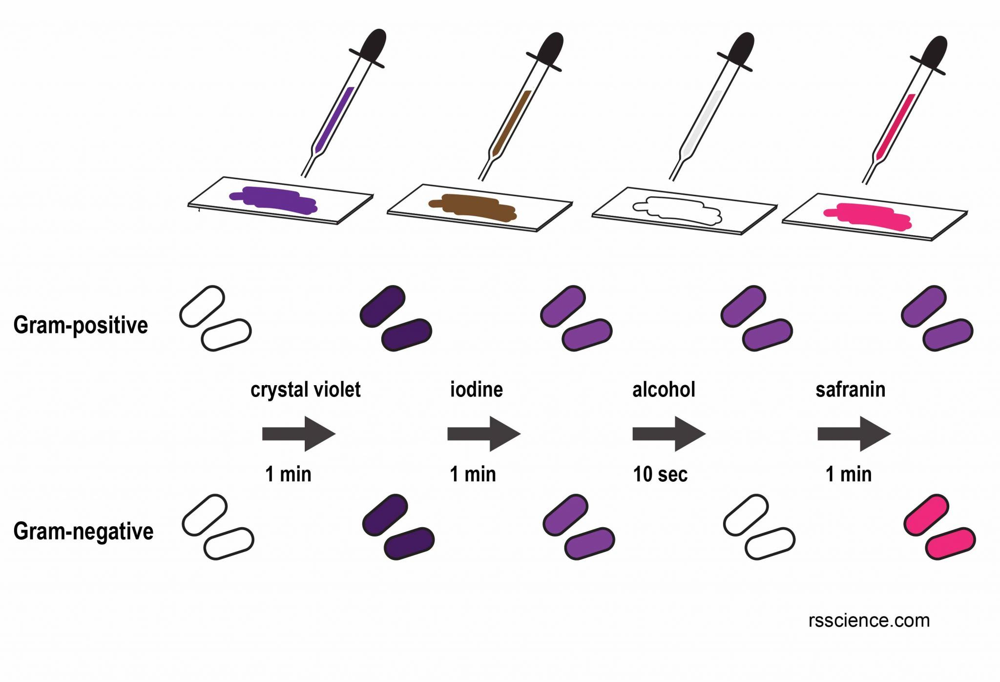
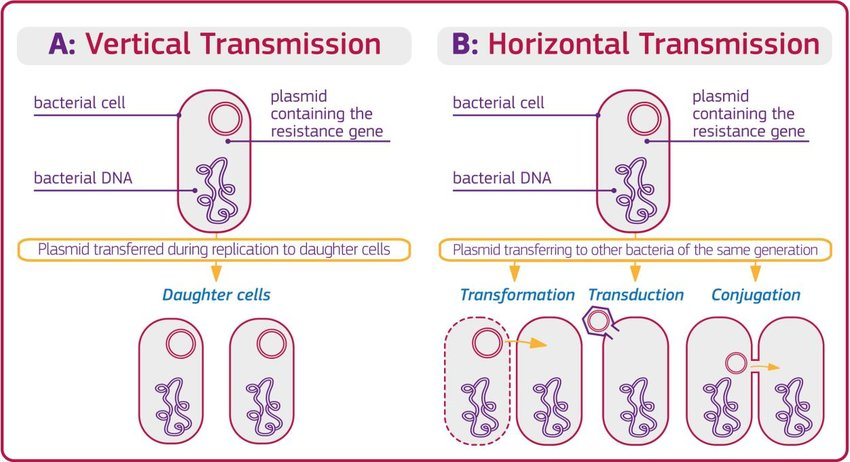
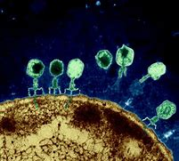
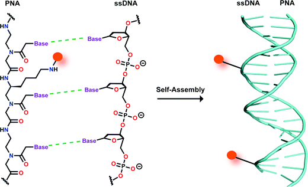

= 0124. Dangerous 'Superbugs' Are on the Rise. What Can Stop Them? 危险的“超级细菌”正在增加。什么可以阻止他们？
:toc: left
:toclevels: 3
:sectnums:
:stylesheet: ../myAdocCss.css

'''

== Dangerous 'Superbugs' Are on the Rise. 危险的“超级细菌”正在增加。

What Can Stop Them? Dangerous ‘Superbugs’ Are on the Rise. +

[.my2]
什么可以阻止他们？ 危险的“超级细菌”正在增加。 +

What Can Stop Them? Traditional antibiotics drive (v.) bacteria toward drug resistance, so scientists are looking to viruses 病毒, CRISPR, _designer (a.)由著名设计师设计的 molecules_ and _protein swords_ for better superbug treatments +

[.my2]
什么可以阻止他们？传统抗生素会导致细菌产生耐药性，因此科学家们正在寻找病毒、CRISPR、设计分子和蛋白质剑, 来寻找更好的超级细菌治疗方法 +

`主` Bacteria’s _rising (a.) resistance_ to antibiotics  `谓`  is making the drugs obsolete 淘汰的；废弃的；过时的. +
Scientists are fighting back 方式状 with viruses, CRISPR, designer molecules and cell-slicing enzymes. +

[.my2]
细菌对抗生素的耐药性, 不断增强，导致这些药物变得过时。
科学家们正在利用病毒、CRISPR、设计分子和细胞切片酶, 进行反击。 +

`主` Seven of the 18 concerning bacteria 后定 tracked by _the Centers for Disease Control and Prevention_ (CDC) /`系` are becoming more resistant (a.) to common antibiotics 后定 considered (v.) essential for maintaining  (v.) public health. +
Meanwhile, drug companies have been slow (a.) to make new antibiotics 后定 capable of beating the microbes. +

[.my2]
美国疾病控制与预防中心 (CDC) 追踪的 18 种相关细菌中，有 7 种对普通抗生素的耐药性越来越强，而这些抗生素, 被认为对维持公众健康至关重要。 +
与此同时，制药公司在生产能够对抗微生物的新型抗生素方面, 进展缓慢。 +

So some scientists are looking beyond 向远处看 traditional antibiotics /for new weapons that won’t fuel (v.)给…提供燃料;增加；加强；刺激 the rise of superbugs. +

`主` Their _emerging (a.)新兴的，发展初期的 arsenal_ （统称）武器 /`谓` features (v.)以…为特色；由…主演；以…为主要组成 ① _viruses_ that kill (v.) bacteria; ② _CRISPR_; ③ and _microbe-slaying （在战争或搏斗中）杀，杀死;谋杀 molecules_.
They hope that /these experimental treatments, some of which have been tested in patients, will kill superbugs without promoting resistance. +

[.my2]
因此，一些科学家正在超越传统抗生素，寻找不会助长超级细菌崛起的新武器。 +
他们新兴的武器库, 包括: 能"杀死细菌的"病毒, 基因编辑技术, 和微生物杀灭分子。
他们希望这些实验性治疗（其中一些已经在患者身上进行了测试）能够杀死超级细菌而不增加耐药性。 +

HOW ANTIBIOTIC RESISTANCE EMERGES (v.) AND SPREADS (v.) +

[.my2]
抗生素耐药性, 是如何出现和传播的? +

Antibiotics #either# directly kill (v.) bacteria #or# slow (v.)  their growth, leaving the immune system to finish the job. 
The drugs work (v.) in several ways — by preventing bacteria from building (v.) sturdy  结实的；坚固的 walls #or# making copies of their DNA, for instance. +
Growth-slowing antibiotics usually disrupt (v.) ribosomes 核糖体, the factories /in which bacterial cells make (v.) proteins. +

[.my2]
抗生素要么直接杀死细菌，要么减缓细菌的生长，让免疫系统来完成这项工作。
这些药物有多种作用，例如阻止细菌建造坚固的墙壁, 或复制其 DNA。
减缓生长的抗生素, 通常会破坏"核糖体"，核糖体是细菌细胞制造"蛋白质"的工厂。 +

[.my1]
.案例
====
.ribosome
/ˈraɪbəsoʊm/ +
N any of numerous minute particles in the cytoplasm of cells, either free or attached to the endoplasmic reticulum, that contain RNA and protein and are the site of protein synthesis 核糖体

核糖体（Ribosome），普遍被认为是细胞中的一种细胞器，除哺乳动物成熟的红细胞，植物筛管细胞外，细胞中都有核糖体存在。 +
核糖体是一种高度复杂的细胞机器。“中心法则”里 "RNA"翻译到"蛋白质"这一过程, 就发生在"核糖体"。"核糖体"其功能是按照mRNA的指令, 将遗传密码, 转换成氨基酸序列, 并从氨基酸单体构建蛋白质聚合物。核糖体又被称为细胞内"蛋白质合成的分子机器"。 +

image:../img/ribosome.jpg[,30%]
image:../img/ribosome2.jpg[,20%]
====

Many antibiotics shoot (v.) for the exact same molecular targets, and `主` so-called _broad-spectrum (a.) 广谱的; 效用广泛的对, 多种疾病或微生物都有抵抗作用的 antibiotics_' mechanisms `系` are #so# universal #that# they work (v.) on both major classes of bacteria: gram-positive 阳性的 and gram-negative 阴性的, which are distinguished by _the makeup_ and _thickness_ of their cell walls. +

[.my2]
许多抗生素针对的是完全相同的分子目标，而所谓的"广谱抗生素"的机制是如此普遍，以至于它们对两大类细菌都有效: 革兰氏阳性细菌, 和革兰氏阴性细菌，它们的区别在于它们细胞壁的"组成"和"厚度"。 +

[.my1]
.案例
====
.gram-positive
革兰氏"阳性菌"和革兰氏"阴性菌", 是利用"革兰氏染色法"来鉴别的两大类细菌。 细胞壁结构的差异, 导致了染料吸收的差异，也导致了很多生理特性的不同。所以首先区分病原菌, 是革兰氏"阳性菌"还是"阴性菌"，在选择"抗生素"方面意义重大。 +

image:../img/gram2.jpg[,20%]

[.my3]
[options="autowidth" cols="1a,1a"]
|===
|G+  革兰氏"阳性菌"  gram-positive |G- 革兰氏"阴性菌" gram-negative

|经过染色后, 细菌细胞仍然保留初染结晶紫的"蓝紫色"
|经过染色后, 细菌细胞则先脱去了初染结晶紫的颜色，带上了复杂"蕃红"或"沙黄的红色"。

|能产生"外毒素"使人致病
|产生"内毒素"使人致病

|大多数"化脓性球菌"都属于革兰氏"阳性菌". +
常见的革兰氏"阳性菌"有：葡萄球菌（Staphylococcus）、链球菌(Streptococcus)、肺炎双球菌、炭疽杆菌、白喉杆菌、破伤风杆菌等.
|大多数肠道菌, 多属于革兰氏"阴性菌" +
常见的革兰氏"阴性菌"有: 痢疾杆菌、伤寒杆菌、变形杆菌、及霍乱弧菌等。

|大多数革兰氏阳性菌, 都对"青霉素"敏感（"结核杆菌"对"青霉素"不敏感）
|革兰氏阴性菌, 则对"青霉素"不敏感（但奈瑟氏菌中的"流行性脑膜炎双球菌"和"淋病双球菌"对"青霉素"敏感），而对"链霉素"、"氯霉素"等敏感。

|===

====

Broad-spectrum antibiotics, in particular, pressure (v.) both harmful and helpful bacteria in the body /to evolve (v.) defensive strategies /that eject (v.)驱逐；逐出；赶出 or disable the drugs, or else alter (v.) their targets. +

[.my2]
尤其是广谱抗生素，会迫使体内的有害细菌和有益细菌, 进化出防御策略，驱逐或禁用药物，或者改变它们的目标。 +

Bacteria can pick up 改善；好转；增强 such defenses /through random DNA mutations, or by swapping "resistance genes" with other bacteria /via a process called _horizontal gene transfer_ 水平基因转移. +

[.my2]
细菌可以通过随机 DNA 突变，或者通过称为"水平基因转移"的过程, 与其他细菌交换“抗性基因”来获得这种防御。 +

[.my1]
.案例
====
.pick ˈup
(1) to get better, stronger, etc.; to improve 改善；好转；增强 +
• Trade usually picks up in the spring. 贸易一般在春天回升。  +
• The wind is picking up now. 现在风愈刮愈大了。  +
• Sales have picked up 14% this year. 今年销售额增长了14%。

.pick sth←→ˈup
(5) to get or obtain sth 得；感染；得到 +
• I seem to have picked up a terrible cold from somewhere. 我似乎从什么地方染上了重感冒。 +
• I picked up ￡30 in tips today. 我今天得到30英镑的小费。

.horizontal gene transfer, HGT
水平基因转移："基因从一个生物体, 转移到另一个不是其后代的生物体"的过程，尤其在细菌中非常普遍。

"水平基因转移"（horizontal gene transfer, HGT），又称"侧向基因转移"（lateral gene transfer, LGT），是指在"差异生物"个体之间，或"单个细胞"内部细胞器之间, 所进行的遗传物质的交流。 +
差异生物个体, 可以是"同种"但"含有不同的遗传信息"的生物个体，也可以是"远缘"的，甚至没有亲缘关系的生物个体。 +
单个细胞内部细胞器, 主要指的是叶绿体、线粒体及细胞核。 +

"水平基因转移", 是相对于"垂直基因转移"（亲代传递给子代）而提出的，它打破了亲缘关系的界限，使基因流动的可能变得更为复杂。

1959年，一系列的文章报道了大肠杆菌（Escherichia coli）的高频转导（Hfr）菌株, 可以将遗传信息, 传递给特定的鼠伤寒沙门氏菌（Salmonella typhimurium）突变菌株。

"抗药性病原菌"的大量出现，许多药物，特别是"抗生素"已经不能抑制或杀死原来敏感的病原菌，这已不仅仅是"基因突变"可解释的，可能与抗药性"基因的水平转移"有关。已发现基因的转移, 不仅仅是发生在"细菌"之间，而且也发生在"细菌"与"高等生物"之间，甚至是"高等生物"之间。

image:../img/horizontal gene transfer2.png[,70%]

====

By making these gene transfers, bacteria can quickly spread (v.) such mutations to additional bacterial populations in the body and in the environment. +

[.my2]
通过进行这些基因转移，细菌可以快速将此类突变, 传播到体内和环境中的其他细菌群体。 +

`主` The misuse of antibiotics /in health care, as well as in agriculture, `谓` has given bacteria endless opportunities /to develop (v.) resistance, raising (v.) the chance /that _once-treatable infections_ will become life-threatening. +

[.my2]
医疗保健和农业中抗生素的滥用, 给细菌提供了无限的机会产生耐药性，从而增加了曾经可治疗的感染变得危及生命的可能性。 +

HARNESSING  (v.) 给（马等）上挽具;控制，利用（以产生能量等） VIRUSES TO FIGHT (v.) BACTERIA +

[.my2]
利用病毒对抗细菌 +

`主` One of _the proposed 被提议的，建议的 alternatives_ to antibiotics /`谓` was first conceived (v.)想出（主意、计划等）；想象；构想；设想; 怀孕；怀（胎） more than a century ago, before the 1928 discovery of penicillin. +

[.my2]
一个多世纪前，即 1928 年"青霉素"被发现之前，人们首次提出了抗生素替代品之一。 +

Called _phage [病毒] 噬菌体 therapy_, it uses _bacteria-infecting viruses_ called bacteriophages [病毒] 噬菌体, or simply "phages," which typically kill the germs 细菌 /by invading their cells /and splitting （使）撕裂 them open from the inside. +

[.my2]
这种疗法被称为"噬菌体疗法"，它使用称为"噬菌体"的细菌, 来感染病毒，或简称为“噬菌体”，通常通过侵入细胞, 并从内部将其切开, 来杀死细菌。 +

[.my1]
.案例
====
.phage
/feɪdʒ/ +
N bacteriophage的缩写. [病毒] 噬菌体 +
--> 来自希腊语phagein,吃，词源同esophagus,geophagy.引申词义噬菌体。

====

Phages can also pressure bacteria into giving up key tools in their drug resistance tool kits. +

[.my2]
噬菌体还可以迫使细菌放弃其"耐药工具包"中的关键工具。 +

For example, a phage called U136B can have this effect on E.coli 大肠杆菌. To infiltrate (v.)（使）悄悄进入，潜入;渗入；渗透 E. coli, the phage uses (v.) an efflux 流出 pump 外排泵, a protein 后定 E. coli normally uses (v.) to pump (v.) antibiotics out of the cell. +
例如，一种名为 U136B 的噬菌体, 可以对大肠杆菌产生这种作用。为了渗透大肠杆菌，噬菌体使用"外排泵"，这是大肠杆菌通常用来"将抗生素, 泵出细胞"的蛋白质。 +

[.my1]
.案例
====
.E. coli
/ˌiː ˈkəʊlaɪ/  +
[ U] a type of bacteria that lives inside humans and some animals, some forms of which can cause food poisoning 大肠杆菌

Escherichiacoli 大肠杆菌, 是动物肠道中的正常寄居菌，其中很小一部分在一定条件下引起疾病。大肠杆菌的血清型, 能够引起人体或动物胃肠道感染. 除胃肠道感染以外，还会引起尿道感染、关节炎、脑膜炎, 以及败血型感染等. +

目前国际公认的分类，主要有六个种类的大肠杆菌.

根据"大肠杆菌"在感染过程中能否产生"肠毒素"的能力，可将大肠杆菌分为两大类：即"产肠毒素性"的大肠杆菌, 和"非产肠毒素性"的大肠杆菌。"产肠毒素性"的大肠杆菌, 是人和多种动物的任何"感染性腹泻"的重要病原.

对人和多种动物来讲，由于病原大肠杆菌常常倾向具有一定的宿主特异性，对人有致病作用的菌株, 常常是很少引起动物的感染，反之亦然，据此可将病原大肠杆菌, 大致上将其划分为两种：即"人病原大肠杆菌"和"动物病原大肠杆菌"。

大肠杆菌是短杆菌，两端呈钝圆形，"革兰阴性"。有时因环境不同，个别菌体出现近似球杆状或长丝状；大肠杆菌多是单一或两个存在，但不会排列呈长链形状.

.infiltrate
(v.)~ (sb) (into sth) : to enter or make sb enter a place or an organization secretly, especially in order to get information that can be used against it （使）悄悄进入，潜入 +
- The headquarters had been infiltrated by enemy spies. 总部混入了敌方特务。 +

--> in-,进入，使，filter,渗透，过滤。即渗进去的，引申词义潜入，渗透。

.efflux = effluence
/ˈɛflʌks/  +
N the act or process of flowing out 流出
====

If the E. coli tries to change this pump to escape the phage, it reduces the bacterium’s ability to pump out antibiotics. +
如果大肠杆菌试图改变这个泵, 以逃避噬菌体，就会降低"细菌泵出抗生素"的能力。 +

And unlike with antibiotics, bacteria are unlikely to gain widespread resistance to phage therapy. +
与抗生素不同的是，细菌不太可能对"噬菌体疗法"产生广泛的耐药性。 +

Antibiotic resistance 细菌对抗生素的耐药性 has been dramatically accelerated （使）加速，加快 by the misuse and overuse of antibiotics, especially broad-spectrum antibiotics that work (v.) on a variety of bacteria. +
滥用和过度使用抗生素，尤其是对多种细菌有效的广谱抗生素，大大加速了抗生素耐药性的产生。 +

Phages, by contrast, can have much narrower targets than even narrow-spectrum antibiotics — for instance, targeting (v.) a protein 后定 found in only one or a few strains 菌株;（动、植物的）系，品系，品种；（疾病的）类型 within one bacterial species. +
相比之下，噬菌体的靶标, 甚至比"窄谱抗生素"还要窄得多，例如，针对一种细菌物种中的, 仅一种或几种菌株中发现的蛋白质。(即利用自然界中的相生相克, 用生物来打败生物, 而不是之前的用化学来打败生物) +

The target bacterium can still evolve (v.) resistance to an individual phage — but by picking the right combination of phages, scientists can make it so that the bacterium’s evolution comes at a cost. +
目标细菌仍然可以进化出"对单个噬菌体的抵抗力"，但通过选择正确的噬菌体组合，科学家可以使细菌的进化付出代价。 +

This cost might be a decrease in virulence 毒性; 致命性 or an increased vulnerability to antibiotics. +
这种代价可能是"毒力降低"或"对抗生素的脆弱性增加"。 +

So far in clinical trials, though, phage therapy generally hasn’t worked (v.) better than standard antibiotics or a placebo  (无药用效果的)安慰剂. +
然而，到目前为止，在临床试验中，噬菌体疗法的效果通常并不比标准抗生素或安慰剂更好。 +

[.my1]
.案例
====
.placebo
/pləˈsiːboʊ/ +
--> 在基督教中，当人去世后要在教堂举行葬礼，在葬礼上要为他念祷词。祷词的第一句是“I will please the Lord in the land of the living”（我请求尘世之主）。在拉丁语中，该祷词的第一个词是placebo，等于英语中的“I will please”，词源与please相同。因此，人们就将这段祷词称为 placebo。 +
由于人们所念的祷词往往会有意美化死者，因此人们就把那种阿谀奉承的话称为 placebo，将阿谀奉承称为sing placebos。  +
18世纪的英国名医 William Cullen 大力宣扬“安慰疗法”，并用 placebo 来表示“安慰剂”，即无特定疗效的方法或药物，仅仅用来舒缓患者情绪。
====

Topline 头条新闻的，顶流的；享有最高声誉的 results from two recent trials hint (v.) at 暗示；透露；示意 the treatment’s effectiveness in specific lung and foot infections, but the full results have yet to be released. +
最近两项试验的主要结果, 暗示了该疗法对特定肺部和足部感染的有效性，但完整结果尚未公布。 +

[.my1]
.案例
====
.hint
(v.) ~ (at sth) : to suggest sth in an indirect way 暗示；透露；示意 +
- What are you hinting at? 你在暗示什么？
====

Success in future trials will be key to getting phages into the clinic, Turner said. +
特纳说，未来试验的成功, 将是噬菌体进入临床的关键。 +

Those trials will have to ① show the therapy works (v.) for multiple types of infections, ② determine (v.) dosage and ③ confirm (v.) phage therapies don’t hurt (v.) helpful bacteria in the body. +
这些试验必须证明, 该疗法适用于多种类型的感染，确定剂量, 并确认"噬菌体疗法"不会伤害体内的"有益细菌"。 +

TURNING (v.) BACTERIA’S DEFENSES AGAINST THEM +
改变细菌的防御机制 +

Although made famous  作为 as a powerful gene-editing tool, CRISPR technology was actually adapted  改编；改写 from an immune system 后定 found in many bacteria: CRISPR-Cas. +
尽管 CRISPR 技术, 因强大的基因编辑工具而闻名，但它实际上是从许多细菌中发现的免疫系统改编而来的：即 CRISPR-Cas。 +

[.my1]
.案例
====
.adapt
(v.)
1.[ VN] ~ sth (for sth)to change sth in order to make it suitable for a new use or situation 使适应，使适合（新用途、新情况） +
2.[ VN] ~ sth (for sth) (from sth) : to change a book or play so that it can be made into a play, film/movie, television programme, etc. 改编；改写 +
• Three of her novels have been adapted for television. 她的长篇小说中有三部已改编成电视节目。
====

The key components of this immune system include molecular scissors, known as Cas proteins, and a memory bank of DNA snippets 片断;一小段（谈话、音乐等）;一小条（消息）；一则（新闻） that a bacterium has collected from phages that once infected it. +
该免疫系统的关键组成部分, 包括分子剪刀（称为 Cas 蛋白）, 以及细菌从曾经感染它的"噬菌体"中收集的 DNA 片段(即噬菌体身上的DNA)记忆库。 +

By tapping (v.)利用，开发，发掘（已有的资源、知识等） its memory bank, CRISPR-Cas can ① guide (v.) its lethal 致命的；可致死的 scissors to a precise point in an invading phage’s DNA and ② snip (v.)（用剪刀快速）剪，剪断，剪开 it like a piece of ribbon. +
通过利用其记忆库，CRISPR-Cas 可以引导其致命剪刀, 到达入侵噬菌体 DNA 的精确位置，然后"像剪断一条丝带一样"将其(将噬菌体)剪断。 +

[.my1]
.案例
====
.tap
(v.) ~ (into) sth : to make use of a source of energy, knowledge, etc. that already exists 利用，开发，发掘（已有的资源、知识等） +
[ VN] +
• We need to tap (v.) the expertise of the people we already have. 我们需要利用我们现有人员的专业知识。
====

On occasion, though, rather than attacking phages, CRISPR-Cas can accidentally go after 追求; 追捕; 追击 the bacterial cell’s own DNA, triggering (v.) a lethal autoimmune 自体免疫的；自身免疫的 reaction. +
但有时，CRISPR-Cas 不会攻击"噬菌体"，而是会意外地攻击细菌细胞自身的 DNA，从而引发致命的"自身免疫反应"。 +

This phenomenon inspired Beisel and his colleagues to explore using (v.) CRISPR-Cas to shred (v.)切碎；撕碎 bacterial cells' DNA. +
这一现象启发 Beisel 和他的同事, 探索使用 CRISPR-Cas 来粉碎细菌细胞的 DNA。 +

[.my1]
.案例
====
.shred
(v.)[ VN] to cut or tear sth into small pieces 切碎；撕碎
====

The real draw 有吸引力的人（或事物） of it is that it is a sequence-specific tool, meaning it targets (v.) only the DNA you tell it to, and not sequences (n.) 后定 present (v.) in other bacteria. +
它的真正吸引力在于, 它是一种"序列特异性工具"，这意味着, 它只针对你告诉它的 DNA，而不是其他细菌中存在的序列。 +

So, once administered (v.) 施行；执行;给予；提供 to a patient, the CRISPR machinery （统称）机器 gets into a set of cells, but `主` only those 后定 that have the sequence or sequences you picked `谓` will be attacked and killed. +
因此，一旦对患者施用，CRISPR 机器就会进入一组细胞，但只有那些"具有您选择的序列的细胞"才会受到攻击, 并被杀死。 +

How do you get CRISPR-Cas into the right bacteria? Various research groups are testing (v.) different delivery methods, but at present, the best strategy seems to be loading (v.) CRISPR machinery into a phage 后定 that infects the target bacterium. +
如何将 CRISPR-Cas 导入正确的细菌中？不同的研究小组正在测试不同的递送方法，但目前最好的策略似乎是, 将 CRISPR 机器加载到"感染目标细菌的"噬菌体中。 +

DESIGNER (a.)由著名设计师设计的 MOLECULES TO KILL BACTERIA +
设计杀死细菌的分子 +

Beyond phages and CRISPR, scientists are developing antibiotic alternatives that harness (v.)控制，利用（以产生能量等）; 给（马等）上挽具  bacteria-slaying peptides 肽 — short chains of protein building (v.) blocks — and enzymes, specialized proteins 后定 that jump-start (v.)全力以赴启动；加大力度以加快启动;用跨接引线启动（汽车发动机） chemical reactions. +
除了噬菌体和 CRISPR 之外，科学家们还在开发抗生素替代品，利用"杀菌肽"（肽是蛋白质中, 氨基酸链条的短链）和"酶"（启动化学反应的特殊蛋白质）。 +

[.my1]
.案例
====
.peptide
/ˈpeptaɪd/ +
( chemistry 化) a chemical consisting of two or more amino acids joined together 肽

"氨基酸"是组成"蛋白质"的基本单位，一般认为蛋白质是由51个以上的氨基酸组成的. 而在生命体中，还存在一种介于氨基酸和蛋白质之间的生化物质，它由2-50个氨基酸组成，科学界将其称为“肽”。 +
肽分为两种: +
-> 通常把2-10个氨基酸组成的肽, 称为"低聚肽"，也称小分子"蛋白肽". +
-> 把11-50个氨基酸组成的肽, 称为"多肽"。

image:../img/peptide3.webp[,50%]

一个氨基酸的"氨基", 与另一个氨基酸的"羧基", 可以缩合成"肽". 形成的"酰胺基"在蛋白质化学中, 称为"肽键"。 +
氨基酸的分子最小，蛋白质最大，两个或以上的氨基酸, 脱水缩合形成若干个肽键, 从而组成一个"肽链". 多个肽链进行多级折叠就组成一个蛋白质分子。蛋白质有时也被称为“多肽”。 二胜肽（简称二肽），就是由二个氨基酸组成的蛋白质片段。

image:../img/peptide.png[,50%]
image:../img/peptide2.webp[,40%]

====

These molecules differ (v.) from antibiotics because they can kill a very narrow range of bacteria by targeting (v.) bacterial proteins that cannot easily gain (v.) resistance to their attacks. +
这些分子与抗生素的不同之处在于，它们可以通过瞄准"不容易对它们的攻击产生抵抗力的"细菌蛋白质，杀死范围很窄的细菌。 +

Lab-made molecules called peptide nucleic acids (PNAs) are some of the most promising candidates （竞选或求职的）候选人，申请人. +
实验室制造的"肽核酸"（PNA）分子, 是最有前途的候选分子之一。 +

[.my1]
.案例
====
.peptide nucleic acid

肽核酸（Peptide nucleic acid；PNA）是一种与DNA和RNA相似的化学物质，可经由人工合成制造，用来作为生物学研究或是医学治疗。地球上已知的生物, 并未发现任何体内拥有PNA的个体。

肽核酸 (PNA), 是一类以"多肽骨架"取代"糖磷酸主链"的DNA类似物. +
不同于DNA或DNA、RNA间的杂交，PNA与DNA或RNA的杂交, 几乎不受杂交体系"盐浓度"影响，与DNA或RNA分子的杂交能力, 远优于DNA/DNA或DNA/RNA. 表现在很高的杂交稳定性、优良的特异序列识别能力、不被"核酸酶"和"蛋白酶"水解。

image:../img/peptide nucleic acid.png[,40%]

====

These engineered molecules can be designed to block (v.) bacterial cells from building essential proteins that are crucial (a.) to their survival. +
这些工程分子, 可以被设计来阻止细菌细胞构建对其生存至关重要的必需蛋白质。 +

PNAs do this by latching (v.)变得依附于;纠缠，缠住（某人） onto specific mRNA, 后定 genetic molecules that carry (v.) the instructions for building proteins from the cell’s control center to its protein construction sites. +
PNA 通过锁定特定的 mRNA 来实现这一点，mRNA 是一种遗传分子, 它携带着这个指令: 从细胞控制中心, 来到蛋白质构建位点, 来构建蛋白质。 +

[.my1]
.案例
====
.latch
[ VN] to fasten sth with a latch 用插销插上；用碰锁锁上 +

.latch ˈon (to sb/sth)ˌlatch ˈonto sb/sth
( informal ) +
(1) to become attached to sb/sth 变得依附于 +
• antibodies that latch onto germs 依附于细菌的抗体

(2) to join sb and stay in their company, especially when they would prefer you not to be with them 纠缠，缠住（某人） +
(3) to develop a strong interest in sth 对…产生浓厚的兴趣
====

PNAs cannot enter (v.) bacterial cells on their own, though, so they’re typically attached to other peptides that easily pass (v.) through the bacterial cell wall. +
不过，PNA 本身无法进入细菌细胞，因此它们通常附着在其他的"肽"上, 这种"肽"能够容易穿过细菌的"细胞壁"。 +

By targeting (v.) proteins that cells cannot change (v.) without harming themselves, PNAs can avoid triggering (v.) drug resistance. +
通过瞄准这种"肽" -- 细胞无法改变这种"肽", 否则就会伤害到自身，这样 PNA 就可以避免引发"细菌产生耐药性"。 +

The engineered molecules could also be made to target (v.) proteins that directly contribute to antibiotic resistance, for example, ① the efflux pumps 后定 used (v.) to push antibiotics out of cells or ② the enzymes 后定 capable of disabling the drugs. +
经过工程改造后的分子, 还可以针对这种蛋白质起作用 -- 该蛋白质会对"细菌产生耐药性"有帮助. 这些蛋白质例如: "外排泵", 作用是将"抗生素"推出细胞. 或是"酶," 该酶能使药物失效。

By emptying (v.) a germ’s drug resistance tool kit, PNAs can then make it vulnerable to standard treatments. +
通过清空细菌的"耐药性工具包"，PNA 可以使细菌容易被"标准治疗"所伤害。 +

Antibacterial PNAs are still being tested in lab dishes  碟；盘 and animals and have not yet moved into human trials. +
抗菌 PNA 仍在实验室培养皿和动物中进行测试，尚未进入人体试验。 +

And, scientists need to make sure PNA-based treatments don’t inadvertently 无意地；不经意地 mess (v.)使不整洁；弄脏；弄乱 with 卷入有害的事；与某人有牵连 human cells or helpful bacteria. +
而且，科学家需要确保基于 PNA 的治疗, 不会无意中干扰人体细胞或有益细菌。 +

[.my1]
.案例
====
.mess with sb/sth
( usually used in negative sentences 通常用于否定句 ) to get involved with sb/sth that may be harmful 卷入有害的事；与某人有牵连 +
• I wouldn't mess with him if I were you. 我要是你就会离他远点儿。
====

In addition to peptides like PNAs, enzymes called lysins 细胞溶解酶 are another promising treatment option. +
除了 PNA 等肽之外，称为"溶素"的酶, 是另一种有前途的治疗选择。 +

[.my1]
.案例
====
.lysin
/ˈlaɪsɪn/  +
N any of a group of antibodies or other agents that cause dissolution of cells against which they are directed 细胞溶解酶; 细胞溶解素

溶解酶是一种碱性蛋白质，由吞噬细胞所分泌，对革兰阳性细菌敏感。

====

Lysins are used (v.) in nature by phages to split (v.) bacteria open from the inside. +
在自然界中，噬菌体利用"赖氨酸"从内部撕裂细菌。 +

They act (v.) like tiny swords that slice (v.) through the outer wall of a bacterial cell, spilling (v.)（使）洒出，泼出，溢出 its guts. +
它们就像小剑一样，可以切开细菌细胞的外壁，释放出内脏。 +

The molecular sabers 军刀；佩剑 are unlikely to promote (v.) resistance because bacteria cannot easily change (v.) the essential cell-wall components (n.) that lysins target (v.). +
这种分子军刀, 不太可能促进耐药性，因为细菌无法轻易改变溶解酶所针对的"细菌的细胞壁的重要组成成分"。 +
 +

Lysins slaughter (v.)屠宰；宰杀 bacteria quickly upon contact 一旦接触, and they can be very specific, killing (v.) some types of bacteria while sparing (v.)抽出；拨出；留出；匀出;饶恕；赦免；放过；使逃脱 others. +
溶素在接触细菌后, 会迅速杀死细菌，而且它们的作用非常明确，可以杀死某些类型的细菌，同时会放过其他类型的细菌。 +

Furthermore, lysins can be tweaked  (v.)扭；拧；扯;稍稍调整（机器、系统等） in the lab to change which bacteria they target (v.), boost (v.) their potency  影响力；支配力；效力 and improve (v.) their durability 持久性，耐用性 in the body. +
此外，在实验室中, 可以对"溶解酶"进行校正调整，以改变它们针对的目标细菌，增强它们的效力, 并提高它们在体内的耐久性。 +

Some lysins have entered mid- and late-stage human trials with hundreds of participants, in which they’ve been tested as supplementary treatments to antibiotics but garnered (v.)获得，得到，收集（信息、支持等） mixed results. +
一些溶素已进入中期和后期人体试验，有数百名参与者，其中它们作为"抗生素"的补充治疗进行了测试，但获得的结果好坏参半。 +

[.my1]
.案例
====
.garner
/ˈɡɑːrnər/ +
(v.)[ VN] ( formal ) to obtain or collect sth such as information, support, etc. 获得，得到，收集（信息、支持等） +
--> 来自granary的拼写变体，词源同grain, 原指谷仓。后用做动词，指收集。
====

ANTIBIOTIC STEWARDSHIP (n.)管理；看管；组织工作 CAN SAVE LIVES, IN THE MEANTIME +
同时，抗生素管理可以拯救生命 +

[.my1]
.案例
====
.steward·ship
/ˈstjuːədʃɪp/  +
[ U] ( formal ) the act of taking care of or managing sth, for example property, an organization, money or valuable objects 管理；看管；组织工作 +
• The organization certainly prospered (v.) under his stewardship. 不可否认，这个组织在他的管理下兴旺了起来。
====

Until these next-gen bacteria slayers make it to market, immediate measures must be taken to stall (v.)（使）熄火，抛锚;拖住（以赢得时间做某事） the rise of superbugs, by preventing the misuse of antibiotics that pressures (v.) bacteria to evolve (v.) resistance in the first place 首先. +
在这些下一代细菌杀手进入市场之前，必须立即采取措施阻止超级细菌的崛起，首先要防止滥用抗生素，从而迫使细菌产生耐药性。 +

For example, doctors can be more diligent (a.)孜孜不倦的；勤勉的；刻苦的 about confirming (v.) that `主` bacteria, not viruses, `系` are behind a patient’s infection before prescribing (v.) antibiotics. +
例如，在开出"抗生素处方"之前，医生可以更加努力地确认患者感染的原因是细菌，而不是病毒。 +

Other safeguards can include (v.) auditing  (v.)审计；稽核 doctors' prescriptions 处方；药方 to see (v.) if narrower-spectrum drugs could be used instead of broad ones, or requiring (v.) special clearance （录用或准许接触机密等以前的）审查许可，审核批准 for the broadest-spectrum drugs. +
其他保障措施包括, 审核医生的处方，看看是否可以使用窄谱药物来代替"广谱药物"，或者要求对"最广谱的药物"进行特殊许可。 +

These steps are essential not only in hospitals but everywhere 后定 antibiotics are prescribed, from primary care to dentistry (n.)牙科学;牙科医术；牙医的工作. +
这些步骤不仅在医院中至关重要，而且在从初级保健到牙科等所有开抗生素处方的地方, 都至关重要。

'''

== Dangerous 'Superbugs' Are on the Rise. What Can Stop Them?

Dangerous ‘Superbugs’ Are on the Rise. What Can Stop Them?
Traditional antibiotics drive bacteria toward drug resistance, so scientists are looking to viruses, CRISPR, designer molecules and protein swords for better superbug treatments

Bacteria's rising resistance to antibiotics is making the drugs obsolete. Scientists are fighting back with viruses, CRISPR, designer molecules and cell-slicing enzymes.

Seven of the 18 concerning bacteria tracked by the Centers for Disease Control and Prevention (CDC) are becoming more resistant to common antibiotics considered essential for maintaining public health. Meanwhile, drug companies have been slow to make new antibiotics capable of beating the microbes.

So some scientists are looking beyond traditional antibiotics for new weapons that won't fuel the rise of superbugs. Their emerging arsenal features viruses that kill bacteria; CRISPR; and microbe-slaying molecules. They hope that these experimental treatments, some of which have been tested in patients, will kill superbugs without promoting resistance.

HOW ANTIBIOTIC RESISTANCE EMERGES AND SPREADS

Antibiotics either directly kill bacteria or slow their growth, leaving the immune system to finish the job. The drugs work in several ways — by preventing bacteria from building sturdy walls or making copies of their DNA, for instance. Growth-slowing antibiotics usually disrupt ribosomes, the factories in which bacterial cells make proteins.

Many antibiotics shoot for the exact same molecular targets, and so-called broad-spectrum antibiotics' mechanisms are so universal that they work on both major classes of bacteria: gram-positive and gram-negative, which are distinguished by the makeup and thickness of their cell walls. Broad-spectrum antibiotics, in particular, pressure both harmful and helpful bacteria in the body to evolve defensive strategies that eject or disable the drugs, or else alter their targets.

Bacteria can pick up such defenses through random DNA mutations, or by swapping "resistance genes" with other bacteria via a process called horizontal gene transfer. By making these gene transfers, bacteria can quickly spread such mutations to additional bacterial populations in the body and in the environment.

The misuse of antibiotics in health care, as well as in agriculture, has given bacteria endless opportunities to develop resistance, raising the chance that once-treatable infections will become life-threatening.

HARNESSING VIRUSES TO FIGHT BACTERIA

One of the proposed alternatives to antibiotics was first conceived more than a century ago, before the 1928 discovery of penicillin. Called phage therapy, it uses bacteria-infecting viruses called  bacteriophages, or simply "phages," which typically kill the germs by invading their cells and splitting them open from the inside.

Phages can also pressure bacteria into giving up key tools in their drug resistance tool kits. For example, a phage called U136B can have this effect on E. coli. To infiltrate E. coli, the phage uses an efflux pump, a protein E. coli normally uses to pump antibiotics out of the cell. If the E. coli tries to change this pump to escape the phage, it reduces the bacterium's ability to pump out antibiotics.

And unlike with antibiotics, bacteria are unlikely to gain widespread resistance to phage therapy.

Here's why: Antibiotic resistance has been dramatically accelerated by the misuse and overuse of antibiotics, especially broad-spectrum antibiotics that work on a variety of bacteria. Phages, by contrast, can have much narrower targets than even narrow-spectrum antibiotics — for instance, targeting a protein found in only one or a few strains within one bacterial species.

The target bacterium can still evolve resistance to an individual phage — but by picking the right combination of phages, scientists can make it so that the bacterium's evolution comes at a cost. This cost might be a decrease in virulence or an increased vulnerability to antibiotics.

So far in clinical trials, though, phage therapy generally hasn't worked better than standard antibiotics or a placebo. Topline results from two recent trials hint at the treatment's effectiveness in specific lung and foot infections, but the full results have yet to be released.

Success in future trials will be key to getting phages into the clinic, Turner said. Those trials will have to show the therapy works for multiple types of infections, determine dosage and confirm phage therapies don't hurt helpful bacteria in the body.

TURNING BACTERIA'S DEFENSES AGAINST THEM

Although made famous as a powerful gene-editing tool, CRISPR technology was actually adapted from an immune system found in many bacteria: CRISPR-Cas.

The key components of this immune system include molecular scissors, known as Cas proteins, and a memory bank of DNA snippets that a bacterium has collected from phages that once infected it. By tapping its memory bank, CRISPR-Cas can guide its lethal scissors to a precise point in an invading phage's DNA and snip it like a piece of ribbon.

On occasion, though, rather than attacking phages, CRISPR-Cas can accidentally go after the bacterial cell's own DNA, triggering a lethal autoimmune reaction. This phenomenon inspired Beisel and his colleagues to explore using CRISPR-Cas to shred bacterial cells' DNA.

The real draw of it is that it is a sequence-specific tool, meaning it targets only the DNA you tell it to, and not sequences present in other bacteria. So, once administered to a patient, "the CRISPR machinery gets into a set of cells, but only those that have the sequence or sequences you picked will be attacked and killed.

How do you get CRISPR-Cas into the right bacteria? Various research groups are testing different delivery methods, but at present, the best strategy seems to be loading CRISPR machinery into a phage that infects the target bacterium.

DESIGNER MOLECULES TO KILL BACTERIA

Beyond phages and CRISPR, scientists are developing antibiotic alternatives that harness bacteria-slaying peptides — short chains of protein building blocks— and enzymes, specialized proteins that jump-start chemical reactions. These molecules differ from antibiotics because they can kill a very narrow range of bacteria by targeting bacterial proteins that cannot easily gain resistance to their attacks.

Lab-made molecules called peptide nucleic acids (PNAs) are some of the most promising candidates. These engineered molecules can be designed to block bacterial cells from building essential proteins that are crucial to their survival. PNAs do this by latching onto specific mRNA, genetic molecules that carry the instructions for building proteins from the cell's control center to its protein construction sites. PNAs cannot enter bacterial cells on their own, though, so they're typically attached to other peptides that easily pass through the bacterial cell wall.

By targeting proteins that cells cannot change without harming themselves, PNAs can avoid triggering drug resistance. The engineered molecules could also be made to target proteins that directly contribute to antibiotic resistance, for example, the efflux pumps used to push antibiotics out of cells or the enzymes capable of disabling the drugs. By emptying a germ's drug resistance tool kit, PNAs can then make it vulnerable to standard treatments.

Antibacterial PNAs are still being tested in lab dishes and animals and have not yet moved into human trials. And, scientists need to make sure PNA-based treatments don't inadvertently mess with human cells or helpful bacteria.

In addition to peptides like PNAs, enzymes called lysins are another promising treatment option. Lysins are used in nature by phages to split bacteria open from the inside. They act like tiny swords that slice through the outer wall of a bacterial cell, spilling its guts. The molecular sabers are unlikely to promote resistance because bacteria cannot easily change the essential cell-wall components that lysins target.

Lysins slaughter bacteria quickly upon contact, and they can be very specific, killing some types of bacteria while sparing others. Furthermore, lysins can be tweaked in the lab to change which bacteria they target, boost their potency and improve their durability in the body.

Some lysins have entered mid- and late-stage human trials with hundreds of participants, in which they've been tested as supplementary treatments to antibiotics but garnered mixed results.

ANTIBIOTIC STEWARDSHIP CAN SAVE LIVES, IN THE MEANTIME

Until these next-gen bacteria slayers make it to market, immediate measures must be taken to stall the rise of superbugs, by preventing the misuse of antibiotics that pressures bacteria to evolve resistance in the first place.

For example, doctors can be more diligent about confirming that bacteria, not viruses, are behind a patient's infection before prescribing antibiotics.  Other safeguards can include auditing doctors' prescriptions to see if narrower-spectrum drugs could be used instead of broad ones, or requiring special clearance for the broadest-spectrum drugs. These steps are essential not only in hospitals but everywhere antibiotics are prescribed, from primary care to dentistry.

'''

