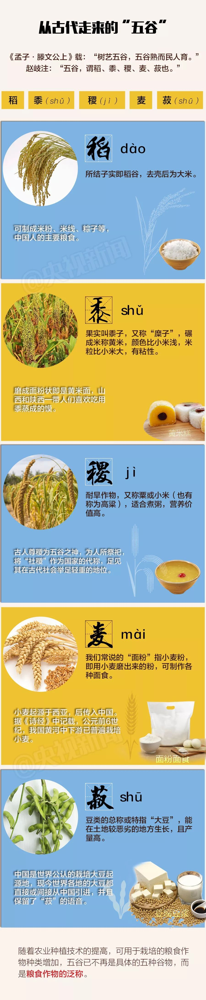
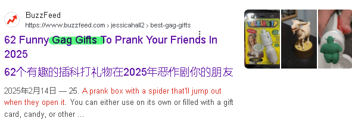

=  English pod 141-160
:toc: left
:toclevels: 3
:sectnums:
:stylesheet: ../../myAdocCss.css

'''

== Elementary ‐ Daily Life ‐ What If? Part 2 (C0141)

A: This is the good life! We *have it good*
don’t you think?

B: Yeah of course! Although 但是，然而, don’t you ever
wonder (v.)想知道，好奇 *what ”could have been”*?

[.my2]
这就是美好生活！我们过得不错，你不觉得吗？ +
当然啦！不过，你难道没想过"本来可能怎样"吗？

[.my1]
.案例
====
- "the good life"：固定表达，指理想中的美好生活，带有哲学意味。
- "have it good"：口语表达，表示生活状态良好。
- "could have been"：虚拟语气，表示过去未实现的可能性。
====

A: What do you mean?

B: Well, sometimes I think of how things
could have turned out 结果是，最后是 if I had done things a
little differently.

[.my1]
.案例
====
- 虚拟语气完整结构：if I had done...could have turned out，表示与"过去事实"相反的假设。
====

A: For example?

B: Like for example, if I hadn’t studied
architecture 建筑学；结构, I would have become an artist
like  像，如同 I wanted to.

[.my2]
如果当初没学建筑，我可能已经成为我想要的艺术家了

A: I see. Yeah now that I think of it, I
wouldn’t have gotten married if I hadn’t
moved to this town and met Sally.

B: You see 强调观点(试图说服对方)! Everything happens for a reason!
We wouldn’t even have met if I hadn’t been
in that car accident ten years ago!

[.my2]
我明白了。说起来，如果当初没搬来这个镇子遇见Sally，我可能就不会结婚了。 +
你看！一切都有原因！要不是十年前那场车祸，我们甚至都不会认识！

A: Well, I have no regrets 后悔；遗憾!

B: I’ll drink to that!

[.my2]
嗯，我毫无遗憾！ +
为这个干杯！

'''

== Elementary ‐ The Weekend ‐ What Do I Wear? (C0142)

A: Honey come on! We are going to be late!
Honestly, you take longer getting ready than
I do! 你准备的时间比我还长

B: I was drying my hair 吹干头发 and ironing (v.)熨烫；熨衣服 my shirt!
Can you come here for a sec? I need your
help.

A: What is it? Why are all these clothes on
the bed?

B: I don’t know what to wear! Ok, give me
your opinion. Do you like the way this looks?
The striped (a.)有条纹的；有斑纹的 _short sleeved 有袖的 shirt_ with this
checkered (a.)多变的；有方格的；多波折的 sweater 针织套衫，毛线衫 and my lucky sandals 凉鞋；拖鞋；便鞋. I
like the cut and hemline (底边，底缘)剪裁和裙边 of these shorts 短裤 so I
think I’ll wear these *as well* 也；同样地.

[.my2]
我不知道穿什么！好吧，给我点意见。你觉得这样搭配怎么样？条纹短袖衬衫配这件格子毛衣，还有我的幸运凉鞋。我喜欢这条短裤的剪裁和裤脚，所以我觉得我也会穿这条。

[.my1]
.案例
====
- checkered -> 来自check, 棋子。
====

A: Are you joking? *What am I going to do
with you* 我该拿你怎么办? We are going to a dinner party 晚宴聚会 not
the beach 海滩，海滨! Wear the shirt with the silk tie I
bought you and these corduroy 灯芯绒 pants. It’s
chilly outside so you can wear this coat.

[.my2]
你在开玩笑吗？我该拿你怎么办？我们是去参加晚宴，不是去海滩！穿那件衬衫，配上我买给你的丝绸领带，还有这条灯芯绒裤子。外面有点冷，你可以穿这件外套。

[.my1]
.案例
====
.corduroy
( also cord ) [ U] a type of strong soft cotton cloth with a pattern of raised parallel lines on it, used for making clothes 灯芯绒  +
-> 俗词源认为该词来自royal cord, 即皇室专用绒。

image:/img/corduroy.jpg[,15%]
====

B: Thanks honey! You have such great
fashion sense. Now, what am I going to do
with my hair?

'''

== Elementary ‐ Daily Life ‐ The Butcher 屠夫；肉店；刽子手 (C0143)

Butcher: Hi. What can I get for you?

[.my1]
.案例
====
- "What can I get for you?"：请问您需要什么？ 服务行业常用语，询问顾客需求。
====

Gina: I'd like a half a pound of ground (a.)磨细的；磨碎的 beef,
please.

Butcher: Good choice! Our ground beef is
extra lean 瘦且健康的；（肉）瘦的，脂肪少的, if you know what I mean.

[.my1]
.案例
====
- "ground beef"：绞牛肉，指将牛肉绞碎后的肉末。
====

Gina: Could I also have half a dozen pork 猪肉
chops 排骨 and two pounds of boneless chicken
breasts 无骨鸡胸肉?

Butcher: No, no no no chicken breasts at
the moment, but we have some nice chicken
thighs 大腿.

Gina: No, that won’t do 那不合适. I’ll take this smoked
ham 火腿 you have here.

[.my2]
不行，那不合适。我要你这里的这块熏火腿。

[.my1]
.案例
====
- "that won’t do"：表示拒绝或不满，相当于 "that’s not acceptable"。
- "smoked ham"：熏火腿，指经过烟熏处理的火腿。
====

Butcher: Okay, is there anything else?

Gina: Do you have any other _cold cuts_ 冷切肉? Is
this salami and bologna you have here?

Butcher: Yes! It’s very fine 令人满意的，可以接受的 meat! Made it
myself...

[.my2]
你们还有其他冷切肉吗？这是你们这里的萨拉米和博洛尼亚香肠吗？

[.my1]
.案例
====
- "cold cuts"：冷切肉，指切片后可直接食用的熟肉制品。
- "salami"：萨拉米，一种意大利风味的腌制香肠。 +
image:/img/salami.jpg[,15%]

- "bologna"：博洛尼亚香肠，一种美式香肠，通常切片食用。
====

Gina: Sounds good. Okay, that’s it.

Butcher: Wait! We have T-bone 丁字牛排, rib eye 肋眼肉, and
sirloin 牛的上部腰肉；牛里脊肉 steaks 牛排. They are very fresh! Just came
from the slaughter 屠宰 house...

[.my1]
.案例
====
- "T-bone"：T骨牛排，带T形骨头的牛排。  +
image:/img/T-bone.jpg[,15%]

- "rib eye"：肋眼牛排，取自牛肋骨部位的牛排。 +
image:/img/rib eye.svg[,30%]

- "sirloin"：西冷牛排，取自牛腰部的牛排。 +
-> sirloin通常被音译为“西冷”，指的是牛的上部腰肉。其中的loin就是“腰部、腰肉”的意思。西冷牛肉连带着脂肪组织，烹饪后口感比较香、嫩、油润。同时它体积比较大，卖相很好。因此，用西冷牛肉制作的牛排，是西餐中的佳品。 +
sirloin在古英语中拼写为surloin，由sur（上部）+loin（腰肉）构成，表示“牛上部的腰肉”。 +
image:/img/sirloin.png[,30%]

- "slaughter house"：屠宰场，指处理牲畜的地方。
====

Gina: Mmm... No that’s okay, really. I think
that’s all for today.

[.my2]
嗯……不用了，真的。我想今天就这些够了。

Butcher: Okay. That will be thirty-four
dollars and fifty cents.

'''

== Elementary ‐ Global View ‐ Capital (a.)死刑的;大写的 Punishment (C0144)

Professor: That’s all for today’s class. We
will continue our lecture 讲座，讲课，演讲 on crime and
punishment tomorrow.

A: Do you think we should be tougher (比较级)严厉的；强硬的；无情的 on
crime?

B: Well, it depends on what you mean.

[.my2]
这取决于你的具体意思。

A: For example, we could *bring back* 使恢复 the
death penalty （因违反法律、规定或合同而受到的）处罚，刑罚 for murder, *give* longer _prison sentences_ 宣判，判决，判刑 *for* _lesser offences_ (n.)违法行为；犯罪；罪行 and *lock up* 把某人关进监狱;锁好门窗 juvenile 青少年的，未成年的 offenders 违法者;罪犯.

[.my2]
比如，我们可以恢复对"谋杀罪"的死刑，对"较轻的罪行"判处更长的刑期，并关押未成年罪犯。

B: Those really sound like Draconian (a.)德拉古式的，严厉的
measures. Firstly （用于引出一系列陈述）首先，第一, what do you do about
_miscarriages (n.)流产 of justice_ 误判；审判不公 if you’ve already *put*
innocent people *to death*?

[.my2]
这些听起来像是严苛的措施。首先，如果你已经处决了无辜的人，该如何处理司法不公的问题？

A: You’d only use _capital punishment_ 死刑 if you
were absolutely sure that you’d convicted 证明……有罪；宣判（某人）有罪 the
right person.

ff
只有在绝对确定定罪对象正确的情况下，才会使用死刑。

B: But, there’ve been many cases of
wrongful 不正当的；不讲道理的；不合法的 conviction 定罪，判罪 where people have been
imprisoned for many years. The authorities
were sure at the time, but later it was shown
that the evidence was unreliable 不可靠的；靠不住的. In some
cases, it’d been fabricated (v.)编造；制造 by the police.

[.my2]
但是，已经有很多错误定罪的案例，人们被关押多年。当时当局很确定，但后来证明证据不可靠。在某些情况下，证据甚至是警方捏造的。

A: Well, no system of justice can be perfect,
but surely there’s a good case 实情；事实 for longer
prison sentences to deter (v.)制止；阻止；威慑；使不敢 serious crime.

[.my2]
嗯，没有完美的司法系统，但更长的刑期, 确实可以威慑严重犯罪。

B: I doubt (v.) whether they could act as an
effective deterrent 威慑，遏制；威慑武器 while _the detection 察觉，发现；侦破（案件） rate_ 破案率 is
so low. The best way to prevent crime is *to
convince* 使确信，使信服 people who commit  犯（罪、错） it *that* they’re
going to be caught. It doesn’t make sense to
divert (v.)使转向；使绕道；转移 all your resources into the prison
system.

[.my2]
我怀疑在"破案率"如此低的情况下，它们是否能起到有效的威慑作用。预防犯罪的最佳方式, 是让犯罪者相信他们会被抓住。把所有资源都转移投入到监狱系统中, 是没有意义的。

A: But if you detect (v.)查明，察觉；测出，检测 more crimes, you’ll still
need prisons. In my reckoning 估计；估算；计算, if we could
lock up more juvenile criminals, they’d learn
that they couldn’t *get away with* 逃脱惩罚 it. Soft
sentences 轻判 will merely encourage them to do
it again.

[.my2]
但如果你侦破了更多犯罪，你仍然需要监狱。在我看来，如果我们能关押更多未成年罪犯，他们会知道自己无法逃脱惩罚。轻判只会鼓励他们再次犯罪。

B: Yes, but remember that prisons are often
schools for criminals. To remove crime from
society, you really have to tackle 应付，解决（难题或局面）;与……交涉 its causes 原因；起因.

[.my2]
是的，但别忘了监狱往往是罪犯的学校。要从社会中消除犯罪，你必须解决其根源。

A: Well, if I were president, I would impose 强制推行，强制实行
tougher laws and punishment. I would have
a peaceful society *based on* fear of
punishment, not consciousness 清醒状态；知觉;观念；看法 of doing the
right thing.

[.my2]
嗯，如果我是总统，我会实施更严厉的法律和惩罚。我会建立一个基于对惩罚的恐惧，而不是对做正确事情的意识的和平社会。

[.my1]
.案例
====
- "If I were president, I would..."（虚拟语气, 假设情况）。
====

B: You sound like a dictator 独裁者；专横的人!

[.my2]
你听起来像个独裁者！

A: Well if it works, why not?

[.my2]
如果有效，为什么不呢？

'''

== Elementary ‐ Daily Life ‐ Chicken Pox (梅毒)水痘 (C0145)

A: What’s wrong with you? Why are you
scratching （用指甲）挠，轻抓 so much?

B: I feel itchy 发痒的! I can’t stand it anymore! I
think I may be *coming down with* 得了某种病,染上（疾病） something.
I feel lightheaded 眩晕的,头昏眼花的 and weak.

[.my1]
.案例
====
- lighthead -> light-head
====

A: Let me have a look. Whoa! Get away from
me 离我远点!

B: What’s wrong?

A: I think you have _chicken pox_ 水痘! You are
contagious  (a.)（疾病）接触性传染的! Get away! Don’t breathe 呼吸；呼出 on me! 别对着我呼吸

[.my1]
.案例
====
.chicken pox 水痘

[.my3]
[options="autowidth" cols="1a,1a"]
|===
|Header 1 |Header 2

|病原体
|是一种因初次感染"水痘带状疱疹病毒"而引起的疾病，*具高度传染性*。 +
*水痘主要透过"空气"传染，可轻易透过感染者"咳嗽"与"喷嚏"传染*。 +
水痘亦可透过接触"水疱"而传染。

|症状
|- 本病会产生皮疹，而这种皮疹的特征是会形成小水疱、发痒难耐然后结痂。通常始发于脸部、胸部和背部，然后会蔓延至全身； +
- 其他可能产生的症状如：发热、倦怠和头痛，症状通常会持续五至十天。 +
- 水痘偶尔会引起肺炎、脑炎、皮肤上的伤口细菌感染等并发症。
- 成人感染时的症状, 通常比孩童严重许多。

image:/img/chicken pox.jpg[,15%]
image:/img/chicken pox 2.jpg[,15%]

|潜伏期
|一般来说，在接触病毒10到21天后，感染症状才会显现。

|免疫
|检测体内是否含有"水痘抗体"，可了解受测者对于水痘是否免疫。*大部分的人终生只会患病一次。*
|===
====

B: Maybe it’s just a rash 皮疹，疹子；一连串（不愉快的事） or an allergy 过敏反应，过敏症! We
can’t be sure until I see a doctor.

[.my1]
.案例
====
- allergy -> = all（e）（另一个）+ ergy（反应）→另一种反应→不正常反应→过敏症. +
同源词：alias（别名），energy（能量），synergy（协同）
====

A: Well in the meantime you are a biohazard 生物危害!
I didn’t get it when I was a kid and I’ve
heard that you can even die if you get it as
an adult!

[.my2]
好吧，在此期间你是个生物危害！我小时候没得过水痘，我听说如果你成年后得水痘，甚至可能会死！

B: Are you serious? You always *blow 吹气 things
out of proportion* (比例；倍数关系) 把事情夸大. In any case 不管怎样, I think I’ll go
take an oatmeal 燕麦粥；燕麦片 bath.

[.my1]
.案例
====
.oatmeal bath​
是“燕麦浴”的意思，通常用于缓解皮肤瘙痒或过敏。

.oatmeal
燕麦片，又称麦片或麦皮，是由燕麦做成的食品。由于麦片食品的制作过程简单，而且省时，有些种类的麦片只要经过开水冲泡就可以食用，也可以炒来吃，所以受到了许多人欢迎。

[.my3]
[options="autowidth" cols="1a,1a"]
|===
|水稻 |小麦

|水稻多栽种于南方水田当中
|- "小麦"则多栽种于北方的旱田当中。
- 藏区的青稞, 就是"大麦"的变种。

|
|- 小麦的籽粒呈椭圆，表面光滑，一般呈白色或红色
- 大麦的籽粒长椭圆、两头尖，呈黄色。

image:/img/004.png[,100%]

麦芒的区别:

- 小麦的麦芒, 短。 +
image:/img/小麦.png[,40%]

- 大麦的"麦芒", 长而粗硬. 所以成熟后，大麦麦穗更有垂坠感。
image:/img/大麦.png[,40%]

image:/img/005.png[,100%]

|*水稻去壳后即"大米"*，可制成米粉、米线等，是中国人的主要粮食之一。
|五谷中的麦，有小麦、大麦、燕麦等，我们常说的**“面粉”就是指小麦粉，**可制作各种面食。

.小麦
- *小麦主要用于制作"面粉", 和各种面食制品，如馒头、面条、饺子等。*

.大麦
- **大麦在做主食时口感上比小麦粗糙，产量也较低。因此主要用于生产牲畜饲料。**它还用于酿造啤酒和制作面包。 +
大麦被广泛应用于酿造啤酒、制作大麦茶、大麦粥等食品，同时还是重要的饲料作物，广泛应用于畜牧业中。
- **大麦种子在发芽时, 会合成大量"淀粉酶"，**迅速把麦粒中的淀粉分解成简单的糖类。**这些"糖类"配合"酵母"，就可以进一步转化为"酒精"，所以大麦是所有谷物中最适合用来酿酒的一种。**威士忌和啤酒，都是大麦酿造的。
|===

====

A: Ewww!

'''

== Elementary ‐ Global View ‐ Animal Rights  动物权利,动物权益 (C0146)

A: You should have seen 你真应该看看 the T.V. show that
was on last night, the topic 主题 it covered was
really interesting; animal rights.

[.my1]
.案例
====
- ​You should have seen​ 是一个虚拟语气的表达，表示“你本应该看”，但实际上可能没看。A认为B错过了这个节目。
====

B: Do you really believe in that? If they are
going to focus on something, they should do
it on _civil rights_ 民权.

A: Yes, but we can't deny (v.)否认；拒绝承认；拒绝给予 that animals are
vulnerable （身体或精神）脆弱的，易受伤的, defenseless 无防备的, and are completely
*at the mercy of* 受……摆布,任由……处置 human beings.

B: I understand your point 观点，论点, but we continue
to have transgressions (n.)违反，侵犯 against human rights.
If so much attention *weren’t devoted 献身，致力；用于 to* 专注于, 投入于 the
topic of animals, we would then *concentrate
more on* saving a human being instead of
protecting a koala.

[.my2]
我理解你的观点，但我们仍然存在侵犯人权的行为。如果没有那么多注意力放在动物问题上，我们就能更专注于拯救人类，而不是保护考拉。

A: You can’t *compare (v.)比较，对比 apples and oranges* 把完全不同的事物相提并论; I
believe that both topics are important and
that we can’t ignore them, the mistreatment 虐待
of animals can cause a great environmental 自然环境的，生态环境的；环保的
imbalance. I believe that governments
should prohibit （通过法律、条例等）禁止；阻止，使不可能 activities like poaching 非法猎取；挖走（人员等）.

[.my2]
你不能把苹果和橘子相提并论；我认为这两个话题都很重要，我们不能忽视它们，虐待动物会导致严重的环境失衡。我认为政府应该禁止像偷猎这样的活动。

[.my1]
.案例
====
- ​compare (v.) apples and oranges​ 是一个习语，意思是“把完全不同的事物相提并论”。
====

B: Well, you are right on that point. This is
the reason that I don’t buy leather 皮，皮革 and I try
to buy synthetic 合成的，人造的；（感情，行动）不诚恳的，虚假的 products.

[.my1]
.案例
====
- ​synthetic products​ 是“合成产品”的意思，指人工制造的材料，通常不涉及动物。
====

B: At least you'**re doing your part** 尽自己的一份力. My
contribution is to have a pet 宠物；宠儿 in the house
that I treat  (v.)对待，看待 like a member of the family.

[.my2]
至少你在尽自己的一份力。我的贡献是在家里养一只宠物，我把它当作家庭成员一样对待。

A: *As long as* 只要 you don't treat it better than
your wife, it's fine.

[.my2]
只要你不把它看得比你妻子还重要，那就没问题。

'''

== Elementary ‐ Daily Life ‐ The Argument 争论，争吵；论据，理由 (C0147)

A: Wow, that terrible movie is finally over 终于结束了.
Next time I’m picking the film 选电影, because I
don’t want to *end up* 最终成为,最后落得 seeing a _chick 雏鸟，小鸡；少女，小妞儿 flick_ (电影；电影院) 女性电影.

B: Well you should have 本应该 picked, in the end
you always complain about everything.

[.my2]
哇，那部糟糕的电影终于结束了。下次我来选电影，因为我不想再看爱情片了。 +
好吧，你本应该选的，结果你总是对一切抱怨。

[.my1]
.案例
====
- chick flick​指以女性为主要观众的爱情片或浪漫喜剧。
- ​should have picked​ 是虚拟语气的表达，表示“本应该选”，但实际上没选。
====

A: Not everything, just this film. Even the
title is ridiculous 可笑的，荒谬的; and it’s so long, those are
_the two and a half most wasted hours_ 最浪费的时间 of my
life, *so much so* 达到这样的程度以至,如此之甚以至于 that  I’m thinking about
asking them to give me my money back.

B: I’m thinking of *taking you back home* 带你回家. I
thought we could have a nice evening, but
you’re always so negative 有害的，负面的；悲观的，消极的；否定的，拒绝的.

[.my2]
不是对一切，只是这部电影。连片名都很荒谬；而且它太长了，那是我生命中最浪费的两个半小时，以至于我在考虑让他们退钱。 +
我在考虑带你回家。我以为我们能度过一个愉快的夜晚，但你总是这么消极。

[.my1]
.案例
====
.so much so
to such a great degree 到…程度 +
- It was a great project, *so much so* that it won first prize.
這一項目非常出色，以至於得了頭獎。
====

A: I’m only complaining about a movie that *I
could have* 虚拟语气,本来可以 rented 租用 or bought *and then* thrown
in the garbage 垃圾箱;垃圾.

B: You see, that’s what I’m talking about, I
can’t stand your sarcastic (a.)讽刺的，嘲笑的，挖苦的 jokes anymore.

[.my2]
我只是在抱怨一部我本可以租或买, 然后扔进垃圾堆的电影。 +
你看，这就是我说的，我再也受不了你的讽刺玩笑了。

[.my1]
.案例
====
- could have rented or bought​ 是虚拟语气的表达，表示“本可以租或买”，但实际上没这么做。这种结构用于描述未发生的可能性。
====

A: Next time, go with your gay friend 同性恋朋友 who is
more *in touch with* 了解（某课题或领域的情况）;（与…）有（或进行、保持等）联系 his feelings 更懂感情.

B: Well he’s more of a man 更像男人 than you are; at
least he appreciates love stories.

[.my1]
.案例
====
.be, keep, etc. in ˈtouch (with sth)
to know what is happening in a particular subject or area 了解（某课题或领域的情况） +
• It is important to keep in touch with the latest research. 及时掌握最新研究情况很重要。
====

A: Love? More like 更像 one-night-stands 一夜情.

B: Don’t criticize (v.)批评，指责；评论 Mario *or else* 否则，要不然 I’ll start on
those _fat, drunk friends_ 又胖又醉的朋友 of yours; they’re no
saints 圣徒（saint 的复数）；圣人.

[.my2]
别批评马里奥，否则我就要说你那些又胖又醉的朋友了；他们也不是圣人。

A: My friends? Fat? What about those whales 鲸鱼
you call friends?

B: You’re unbearable 难以忍受的；承受不住的; you can walk home,
I’m leaving.

[.my2]
我的朋友？胖？那你那些被你称为朋友的大象呢？ +
你让人无法忍受；你可以走回家，我走了。

[.my1]
.案例
====
- ​whales​“鲸鱼”，这里用来比喻B的朋友体型庞大。A用这个词来反击B。
====

'''

== Elementary ‐ Daily Life ‐ Paranoid (a.n.)多疑的，妄想的；患偏执症的，患妄想症的 (C0148)

A: Dan, Dan dude. You have to 必须 *come over* 过来,来访 to
my house right now!

B: Is everything Ok?

A: Just get over here 赶紧过来!

[.my2]
丹，丹兄弟。你现在必须马上来我家！

A: Come in! Quickly!

B: So, *since when* 从什么时候开始 is your house a bank?

[.my2]
所以，从什么时候开始你家变成银行了？(Dan用“银行”来比喻A家严密的安保措施。)

A: What do you mean?

B: I mean, *what’s up with* (“……是怎么回事”或“……有什么问题”) the locks 锁 and
iron bars on your windows.

A: Security 保护措施，安全工作 Dan, security! *You can never be
too safe* 再安全也不为过 you know! A lot of sickos (n.)从病态行为取乐的人；（精神）变态者 out there.
Just the other day they *caught* 抓住 that _peeping 偷窥 tom_ 偷窥狂 *red handed* 当场抓到! Had a _high power telescope_ 高倍望远镜
and binoculars  双筒望远镜 by his window.

[.my2]
安全，丹，安全！你知道的，再安全也不为过！外面有很多变态。就在前几天，他们当场抓住了那个偷窥狂！他窗户旁还有高倍望远镜和双筒望远镜。

[.my1]
.案例
====
- sicko -> 来自 sick,生病的，有病的，病态的。 +
( informal ) ( especially NAmE ) a person who gets enjoyment from doing strange and cruel (a.)残酷的，残忍的；引起痛苦的 things. 从病态行为取乐的人；（精神）变态者

- peeping 偷窥 tom : “Peeping Tom”與 voyeur(偷看下流场面的人；窥淫狂者) 同義，指的是偷窺女性更衣的男性。

- voyeur    /vwaɪˈɜː(r)/ , /vɔɪˈɜː(r)/   窥淫癖者（喜欢窥视他人性行为）;刺探隐秘者（喜欢刺探他人的问题或私生活）  +
-> 来自法语 voyeur,来自拉丁语 videre,看，词源同 vision,visit.引申词义偷窥，窥淫癖者。

- caught (v.) red handed​ 是一个习语，意思是“当场抓住”。A提到有人被当场抓住偷窥。 +
在这里，“red”并不直接表示颜色，而是与“blood”（血液）有关，暗示了罪行或暴力行为的存在。而“hand”则直接指向了行为者，即那个被当场发现做坏事的人。因此，“redhanded”的字面含义可以理解为“手上沾血”，引申为“当场作案”或“被当场发现做坏事”。 +
image:/img/red handed.jpg[,15%]

- high power telescope +
image:/img/high power telescope.jpg[,15%]

- binoculars -> 前缀bin-, 二。词根oc, 眼睛，见oculist, 眼科医生。
====

B: Whats the matter with you? Why are you
acting all paranoid  多疑的，妄想的；患偏执症的，患妄想症的?

A: Paranoid? I’m not paranoid! I’m cautious 小心的，谨慎的!
You see Dan, we have to be *on guard* 保持警惕;警惕的，警觉的 at all
time! People just *invade your privacy* 侵犯你的隐私 as if
they knew you! Telemarketers 电话推销员, solicitors 律师;推销员,
even your bank! They have way (ad.)很远；大量 too much
information! I like to keep everything *on a
need to know basis* 在需要知道的基础上.

[.my2]
偏执？我不偏执！我是谨慎！你看，丹，我们必须时刻保持警惕！人们侵犯你的隐私，好像他们认识你一样！电话推销员、推销员，甚至你的银行！他们掌握了太多信息！我喜欢把一切都控制在“需要知道”的基础上。

[.my1]
.案例
====
.solicitor
-> solicit,请求，恳求，求助，-or,人。即被求助的人，用于指法务官，事务律师。

.People just invade your privacy as if they knew you!
这句话中，just 的作用是强调, 加强语气，表示**“简直、直接、毫无顾忌地”**的意思。它让语气更加强烈，表达说话人对隐私被侵犯的不满和惊讶。

可以理解为： +
- People simply invade your privacy...（人们直接侵犯你的隐私） +
- People blatantly 公然地；喧闹地；看穿了地 invade your privacy...（人们公然侵犯你的隐私） +
- People invade your privacy without hesitation (n.)犹豫，不情愿...（人们毫不犹豫地侵犯你的隐私） +
====

B: OK, well, *what* did you want to see me
*about*?

[.my2]
好吧，那么，你找我来有什么事 ？

A: You are being watched 被监视! Be careful Dan!
Be careful!

'''

== Elementary ‐ Daily Life ‐ Moving （使）改变位置，（使）移动；搬家，搬迁 (C0149)

A: Ok, that’s fine. Bye.

[.my2]
好的，没问题。再见。

B: What happened?

A: That’s it, my lease 租约，租契 is up. I have to move.

[.my2]
就是这样，我的租约到期了。我得搬家了。

[.my1]
.案例
====
- ​That’s it​ 是一个口语表达，意思是“就是这样”或“事情就是这样”。A用这句话来总结情况。
====

B: What? Why? Can’t you renew 重新开始，中止后继续；恢复;延长（执照、合同等）的有效期，使续签 it?

A: The owner apparently is selling this place
*to make way for* 为……让路,为……腾出空间 the construction of a
_parking lot_ (作某种用途的）一块地，场地) 停车场.

[.my2]
你不能续租吗？ +
房东显然要卖掉这个地方，以便建一个停车场。

[.my1]
.案例
====
.lot

[ C]an area of land used for a particular purpose（作某种用途的）一块地，场地 +
• a parking lot 停车场 +
• a vacant lot (= one available to be built on or used for sth) 一块空地 +
( especially NAmE ) +
• We're going to build a house on this lot. 我们打算在这块地上建造一座房子。 +

====

B: Well, I can help you pack (v.)（把……）打包，收拾（行李）. We should start
*looking for* a new place for you ASAP 尽快(=as soon as possible).

A: I think I might move (v.) in with my parents
for _a couple 两个，几个 of months_ until I can find
something. You know *how hard it is* to find a
decent 像样的，尚好的；得体的，合宜的 place around here. I’m gonna have to
put most of my stuff 东西，物品 *in storage* (储存，贮藏(空间)) 付费托管 for a while.

[.my2]
我想我可能会暂时搬去和父母住几个月，直到找到新地方。你知道在这附近找个像样的地方有多难。我得把大部分东西暂时存放到仓库里。

[.my1]
.案例
====
- storage
the process of paying to keep furniture, etc. in a special building until you want it 付费托管 +
-When we moved we had to put our furniture *in storage* for a while. 搬家时我们不得不把家具送出去存放一阵子。
====

B: Well, let me know if there’s anything I can
do *to help out* 帮忙,协助.

A: Actually, would you mind looking after my
pet tarantula 狼蛛 and snake for a couple of
weeks?

[.my2]
其实，你介意帮我照看我的宠物狼蛛和蛇几周吗？

[.my1]
.案例
====
.tarantula
image:/img/tarantula.jpg[,15%]

狼蛛不是某一种蜘蛛, 是一个通称.因其极善游猎，行动敏捷，捕食量大，性凶猛，得名狼蛛. 从体长1毫米左右, 到体长超过30毫米不等.
====

B: hehe.. sure

'''

== Elementary ‐ The Weekend ‐ Bug Spray (喷，喷洒（液体）) 杀虫剂 (C0150)

A: The mosquitos 蚊子 are biting  咬；抓住；刺进 me!

B: Me too, I can’t stop scratching 抓挠. They are
everywhere! Sneaky (a.)悄悄的；偷偷摸摸的；鬼鬼祟祟的 little jerks 蠢人；傻瓜；笨蛋.

[.my1]
.案例
====
- Sneaky little jerks​ 意思是“狡猾的小混蛋”。
====

A: Do you have any _bug spray_?

B: No, I forgot to buy some.

A: Then we’ll have to *put up with* 忍受,忍耐 it.

B: We can cover ourselves with beer! *That
way* 这样一来,如此一来 if they bite us, they’ll *get drunk* 喝醉 and *fall
asleep* 睡着.

[.my2]
我们可以用啤酒把自己涂满！这样如果它们咬我们，它们就会喝醉然后睡着。

[.my1]
.案例
====
- that way 的意思是 “这样一来” 或 “如此一来”. that way 常用于描述某种方法或策略的预期效果，类似于 "in this way" 或 "as a result"，表示因果关系。
====

A: That’s *without a doubt* 毫无疑问, the best idea
you've had! Let's do it!

[.my2]
毫无疑问，这是你最好的主意！我们就这样做吧！

B: Run! They are thirsty (a.)渴的，口渴的 for more!

'''

== Elementary ‐ Advanced ‐ Darwin’s Theory 学说，理论 Of Evolution 进化（论）；演变 (E0151)

A: It’s been a long time since I last saw you.
Where have you been? 你去哪儿了？

B: The exams and plans 后定 I have to *turn in* 上交,交出
are driving me crazy, I don’t even have time
to sleep.

[.my2]
我要交的考试和计划让我快疯了，我连睡觉的时间都没有。

A: It’s the same for me. I’m *up to my neck* 深陷其中,忙得不可开交 in
work, but at least finals 决赛;期末（或期中）考试 are coming soon and
we’ll have a vacation. Where are you going
now?

[.my2]
我也一样。我工作忙得不可开交，但至少期末考试快到了，我们会有假期。你现在要去哪儿？

B: I’m going to Anthropology 人类学 class and now
with _the year anniversary 周年纪念（日） of Darwin_, it’s the
only thing we study. Frankly, I’m sick 生病的，患病的；病人的；恶心的，想吐的；不快的 and
*tired 疲倦的，累的 of* 对…感到厌倦；对…腻烦 hearing about this guy.

[.my2]
我要去上人类学课，现在正值"达尔文周年纪念"，我们只学这个。说实话，我已经听腻了这个人。

A: What? Why? How can you not like
Darwin? I mean the man changed the entire
perception 看法，认识；感觉，感知；洞察力 of how things came to 事物是如何形成的 and his
theory is backed by pretty solid evidence!

[.my2]
什么？为什么？你怎么能不喜欢达尔文？我是说，这个人彻底改变了人们对事物起源的看法，而且他的理论有相当坚实的证据支持！

B: I don’t like him. His theory of human
evolution and _natural selection_ is *full of
holes* 漏洞百出. It lacks the solid evidence of which
you speak of.

[.my2]
我不喜欢他。他的"人类进化"和"自然选择"理论漏洞百出。它缺乏你所说的坚实证据。

A: That statement *puts you at odds 不利条件；掣肘的事情；逆境 with* 让你与……对立 half
of the academy. *Not to mention* 更不用说 your
professors! Furthermore, `主`  #the explanation# 解释，说明
proposed (v.)提议；建议 by Darwin about _the origin 起源，起因；出身 of
species_  （动植物的）种，物种；种类 and _the mechanism （生物体内的）机制，构造 of natural
selection_ `谓` #constitutes# (v.) （被认为或看做）是；被算作; 构成；组成 a grand step 一大步 toward _a
coherent (a.)有条理的，连贯的 understanding_ 连贯的理解 of the world and
evolutionist 进化论的 ideas.

[.my2]
这种说法让你与半个学术界对立。更不用说你的教授了！此外，达尔文提出的关于物种起源和自然选择机制的解释，为理解世界和进化论思想迈出了一大步。

B: I’m not minimizing (v.)使减少到最低限度;降低；贬低；使显得不重要 his grand 宏伟的
contributions, it’s just that his theory
*reminds of* 使想起，提醒 the conundrum 令人迷惑的难题；（尤指答案中含双关语的）谜语 of the chicken and
the egg.

[.my2]
我并没有贬低他的伟大贡献，只是他的理论让我想起了鸡和蛋的难题。

A: What are you talking about?

B: The question is, which was first? The
chicken or the egg? I feel the same regarding 关于，至于
his theory. How does _the first cell of life_
*come to be* 发生,形成?

[.my2]
我对他的理论也有同样的疑问。生命的第一个细胞是如何形成的？

A: Interesting. I think that question is better
*suited for* 适合 my philosophy class. In the
meantime, how about we *settle* (v.) this... *with* a
duel 决斗；斗争，抗争!

[.my2]
有趣。我觉得这个问题更适合我的哲学课。与此同时，我们何不用决斗来解决这个问题！

'''

== Elementary ‐ The Office ‐ Cut It Out 停止，别再做了 (C0152)

Ed: Hey, Mary, can you *cut that out* 停止做某事,别那样了?

Mary: *Cut what out* I’m not doing anything.

Ed: The tapping 轻拍，轻扣，轻敲；敲出节奏，打拍子 of your pen on your desk.
It’s driving me crazy.

[.my2]
你用笔敲桌子的声音。它让我快疯了。

Mary: Fine! By the way *would you mind* (v.)你介意……吗 not
slurping (v.)（喝东西时）发出啧啧的声音 your coffee every time you have a
cup 喝一杯!

Ed: I don’t slurp (v.) my coffee. And plus 并且, how
can you hear it when you’re shouting into
your phone all the time?

[.my2]
好吧！顺便说一句，你能别每次喝咖啡都发出声音吗！ +
我喝咖啡时没有发出声音。再说了，你一直在对着电话大喊大叫，怎么能听到我喝咖啡的声音？

Mary: You ’ve got to be kidding me! You’*re
complaining about* me talking on the phone
when you go out for a _cigarette break_ 抽烟休息 ten
times a day *to shoot (v.)开（枪），射击;狩猎 the breeze* (微风；和风) 闲聊,聊天?

Ed: Look, we have a lot of accumulated 累计的
anger 积累的怒气 from working in these conditions, and
it’s probably okay *to let off 引爆，释放（压力等） steam*  (蒸汽；力量，势头)发泄情绪,释放压力 _once in a
while_ 偶尔 But, it’s probably not a good idea *to
keep it up* 保持下去 I’m willing *to forgive and forget* 原谅并忘记
and if you are.

[.my2]
你开玩笑吧！你抱怨我打电话，可你一天出去抽十次烟，就是为了闲聊？ +
听着，我们在这种工作环境下积累了很多怒气，偶尔发泄一下是可以的。但是，一直这样可能不太好。我愿意原谅并忘记，如果你也愿意的话。

[.my1]
.案例
====
- shoot (v.) the breeze  : have a casual conversation. 进行随意的对话。
- let off steam​ 是一个习语，意思是“发泄情绪”或“释放压力”。
====

Mary: Fine. Let’s *call a truce* (停战协定，休战，停战期)宣布停战. I’ll try to more
considerate (a.)体贴的，考虑周到的 and to keep the noise down.

Ed: Yeah, I’ll try to do the same. So, I was
wondering 想知道 you wanna go out to dinner Friday
night?

[.my2]
好吧。我们休战吧。我会尽量更体贴，减少噪音。 +
是的，我也会尽量做到。所以，我在想，你周五晚上想出去吃晚饭吗？

[.my1]
.案例
====
- truce -> 来自古英语 treow,事实，承诺，忠诚，条约，词源同 true,truth.-ce,表复数，如 pence 为 penny 复数格。
====

'''

== Elementary ‐ Daily Life ‐ Homesick (a.)想家的；思乡病的 (C0153)

Sarah: Tom! How are you? We missed you at
the party last night. Are you ok?

Tom: I don’t know. I didn’t really feel like
going out. I guess I’m feeling a little
homesick  想家的；思乡病的.

[.my2]
我昨晚不太想出门。

Sarah: Come on We’ve been through 经历，度过 this
already! Look, I know *the adjustment was
hard* when you first got here, but we agreed
that you were gonna try and deal with it.

[.my2]
别这样了！我们已经讨论过这个问题了！听着，我知道你刚到这里时适应起来很困难，但我们说好了你会努力应对的。

[.my1]
.案例
====
- Come on!​ 是一个常见的口语表达，意思是“得了吧！”或“别这样了！” Sarah表示对Tom的抱怨有些不耐烦。
- ​been through this​ 意思是“已经经历过这个”或“已经讨论过这个问题”。Sarah认为他们已经讨论过Tom的适应问题。
====

Tom: I was. It’s just that the holidays are
coming up 即将到来 and I won’t be able to home
because I can’t afford the airfare 飞机票价. I’m just
*longing （尤指对看似不会很快发生的事）渴望 for* 渴望,思念 some of the comforts of home,
like my mom’s cooking and being around my
family.

[.my2]
我是努力了。只是假期快到了，我因为买不起机票而不能回家。我只是很渴望一些家的舒适感，比如我妈妈的厨艺和和家人在一起的感觉。

[.my1]
.案例
====
.long
(v.) *~ for sb/sth |~ (for sb)* : to do sthto want sth very much especially if it does not seem likely to happen soon（尤指对看似不会很快发生的事）渴望 +
- He *longed for* Pat to phone.他期盼着帕特来电话。 +
[ V to inf] +
- I'm longing to see you again.我渴望再次见到你。

====

Sarah: Yeah, it can get pretty lonely over
the holidays. When I first got here, I’d get
depressed  抑郁的，沮丧的 and nostalgic  (a.)思乡的；引人怀旧的 for anything that
reminded me of home. I almost *let it get to
me* 让它影响到我,被这种感觉压垮,被影响, but then I started going out, keeping
myself busy and *before I knew it* 在我自知之前;不知不觉中, I *was used (a.)
to*  it.

[.my2]
是啊，假期里可能会感到非常孤独。我刚到这里时，也会感到沮丧，对任何让我想起家乡的事物都感到怀旧。我差点被这种感觉压垮，但后来我开始出门，让自己忙碌起来，不知不觉中，我就习惯了。

[.my1]
.案例
====
- nostalgic for​ 意思是“对……感到怀旧”。
====

Tom: I see what you mean, but I ’m still
*bummed (a.)不高兴的；烦恼的 out* 使不安；使灰心;感到沮丧,情绪低落.

[.my1]
.案例
====
.bum
(n.)屁股;流浪乞丐；无业游民

(v.)~ sth (off sb)( informal ) to get sth from sb by asking提出要；乞讨
SYN cadge +
• Can I bum a cigarette off you?给我一根烟好吗？

(v.)~ sb (out) : ( NAmE informal ) to make sb feel upset or disappointed 使不安；使灰心

-> 拟声词，屁股落地的声音。后词义进一步贬化，指闲荡，二流子等。
====

Sarah: Ok how does this sound: let’s *get
you suited (a.)合适的;穿西装的；穿…套装的 up* 给你打扮一下,让你穿上正装 and hit the dance club 去舞厅,去夜店 tonight.
I hear that an awesome 非常棒的，极佳的 DJ is playing and
there will be a lot of pretty single girls there!

[.my2]
好吧，这样如何：我们今晚给你打扮一下，然后去舞厅。我听说有个很棒的DJ在演出，而且那里会有很多漂亮的单身女孩！

Tom: You know, I could really *go for that* 愿意做某事,接受这个建议.
You don’t mind being my wingman 僚机；僚机驾驶员 for
tonight?

[.my2]
​你知道吗，我真的很想这么做。你不介意今晚当我的僚机吧？

[.my1]
.案例
====
.wingman
1.a pilot whose plane is flying behind and to the side of a plane that is leading a group of planes flying together 僚机飞行员 +
2.a friend who supports you, especially a man who supports another man when trying to meet or talk to possible partners （尤指在某人尝试接触潜在生意伙伴时候，为其提供支持的）朋友

wingman​ 在本文中， 是一个口语词，通常用于社交场合，指帮助朋友结识异性的人。
====

Sarah: Not at all! It be fun! It will be like a
_boys night out_ 男生的夜出,男生的聚会... well kinda (=kind of)有点,差不多...

[.my2]
一点也不介意！这会很有趣！就像男生的夜出……​嗯，差不多吧……​

Tom: Great! I must warn you though 可是，不过,
whatever happens, don’t let me go on a
drinking binge  (n.v.)狂欢作乐，大吃大喝. Trust me, it’s not a pretty
picture!

[.my2]
太棒了！不过我必须警告你，无论发生什么，别让我喝得太多。相信我，那可不是什么好看的画面！

[.my1]
.案例
====
- drinking binge​ 意思是“狂饮”或“喝得太多”。Tom提醒Sarah不要让他喝得太多。
-​not a pretty picture​ 是一个习语，意思是“不好看”或“不愉快的场景”。
====

'''

== Elementary ‐ The Weekend ‐ Rock Band 摇滚乐队 (C0154)

A: I’m forming a music band 乐队；一伙，一群.

B: Do you already know how to play an
instrument 器械；乐器；仪器?

A: Uh... Yeah! I’ve told you a thousand times
that I’m learning to play the drums 鼓；鼓声. *Now that* 既然，由于
I know how to play well, I would like to form
a rock band.

[.my2]
我已经告诉过你无数次了，我正在学打鼓。既然我现在已经打得不错了，我想组建一支摇滚乐队。

B: *Aside from* 除了 yourself, who are the other
members of the band?

A: We have a guy who plays guitar  吉他，六弦琴, and
another who plays bass 低音，低音部；低音吉他. Although 虽然，尽管；但是，然而 we still
haven’t found anyone to be our singer. You
told me that you had some musical talent,
right?

[.my1]
.案例
====
- bass -> 词源同 base, 低。
====

B: Yes, I’m a singer.

A: Perfect. So you can audition (v.)试镜，试演；对（某人）进行面试，让（某人）试演 this weekend
here at my house.

[.my2]
太棒了。那你这个周末可以在我家试音。

B: Great! Wait here? You don’t have enough
room for the amplifiers 放大器，扬声器；（电子吉他等乐器）扩音器, microphones or even
your drums! *By the way* where do you keep
them or practice?

[.my2]
太好了！等等，在你家？你没有足够的空间放放大器、麦克风，甚至你的鼓！顺便问一下，你把它们放在哪里或者在哪里练习？

A: Dude  <美，非正式>家伙，小子? What are you talking about? It’s
right here! All we need is my _Nintendo Wii_
and *we are set* (a.位于（或处于）……的；安排好的) 我们准备好了,一切就绪!

[.my2]
老兄？你在说什么呢？就在这里！我们只需要我的任天堂Wii，一切就绪了！

'''

== Elementary ‐ The Weekend ‐ Bachelor 未婚男子，单身汉；学士 Party (C0155)

A: Hi honey! *You’ll never guess what* 你绝对猜不到! My
friends Julie and Alex are getting married 要结婚了!

B: Wow that’s great news! They’re a great
couple!

A: I know! Anyways 不管怎样,总之 I just talked to Alex’s
_best man_ 伴郎 and he is organizing the bachelor
party. It’s gonna be 将会 so much fun!
All the groomsmen 男傧相，伴郎 are thinking up _all the
wacky 乖僻的，古怪的 and crazy things_ we are going to do
that night.

[.my2]
我知道！不管怎样，我刚刚和亚历克斯的伴郎聊过，他正在组织单身派对。那将会非常有趣！所有的伴郎都在想那天晚上我们要做的各种古怪和疯狂的事情。

B: You aren’t going to a _strip 除去，撕掉（外皮或表层）；夺去，剥夺（地位，权力，财产）；脱衣服，脱光……的衣服；表演脱衣舞 club_ 脱衣舞俱乐部 are you? I
don’t want you getting a _lap （人坐下时的）大腿面，膝上 dance_ 大腿舞（女子坐在男子大腿上扭动身体） from
some stripper 脱衣舞演员；剥离器 *with the excuse 以……为借口 that* it’s your
friends party.

[.my2]
你们不会去脱衣舞俱乐部吧？我不希望你以朋友的派对为借口，从某个脱衣舞女郎那里得到膝上舞。

[.my1]
.案例
====
.lap dance

image:/img/lap dance.jpg[,10%]
image:/img/lap dance 2.jpg[,15%]

A _lap dance_ (or _contact (a.)接触性的 dance_) is a type of _erotic (a.)色情的；性爱的；性欲的 dance performance_ offered in many strip clubs in which the dancer typically has body contact with a seated (a.)就座的，坐下来的 patron （酒吧、旅馆等的）主顾，顾客;（艺术家的）赞助人，资助者.  +
Lap dancing is different from _table dancing_, in which the dancer is close to a seated patron, but without body contact.  +
Variant 变种，变形 terms include _couch 长沙发，长榻；诊察台 dance_, which is a lap dance where the customer is seated on a couch.

在许多脱衣舞俱乐部中提供的一种色情舞蹈表演，舞者通常与座位的顾客接触，在其中提供了一种色情舞蹈表演。圈舞与桌子舞不同，舞者靠近坐着的赞助人，但没有身体接触。变体术语包括沙发舞，这是一个圈舞，客户坐在沙发上。

With full-contact lap dances, the dancer may *engage in* 参与，从事 _non-penetrative (渗透的；有穿透力的；彻骨的)  (a.)非插入式 sexual contact_ with the patron, such as *"grinding" (v.)磨擦（发出刺耳声）;用力挤压，用力擦（入表层） or "twerking" (v.)扭；拧 their body* against the patron. Depending on the local jurisdiction (n.)司法权；审判权；管辖权;管辖区域；管辖范围 and community standards, the participants 参与者 in _lap dancing_ are sometimes allowed to touch or be touched by each other.

舞者可以在全面的"膝上舞"中, 与赞助人进行"非渗透性性接触"，例如“打磨”或“扭动”他们的身体对抗顾客。根据当地管辖权和社区标准，有时允许圈舞的参与者互相触摸或互动。

Lap dancing usually occurs (v.)发生；存在；出现 with both participants being #either# clothed *to* _more or less_ *the same degree*, #or# naked, #or# the dancer being partially 不完全地，部分地 or fully naked, depending on the laws of the jurisdiction 司法权，审判权；管辖权 and the club's policies.

Some jurisdictions require _a prohibition on alcohol_ if various degrees of nudity are allowed.

In other jurisdictions /nudity is only allowed where _skin contact_ does not occur between the dancer and the patron, requiring at least _one of them_ to wear (v.) clothing.

Where _specific licensing_ 许可；批准 exists for an establishment 机构；大型组织；企业；旅馆 to allow prostitution  卖淫；滥用；出卖灵魂, the dress requirements 服装要求 may also be dependent on that licensing.

As the dancer is rarely dressed *to a greater degree* than the patron, lap dancing is sometimes seen as _a submissive 顺从的，服从的，卑躬屈膝的 act_ by the dancer.

钢管舞（或称膝上舞）通常发生在双方穿着程度大致相同、全裸，或由舞者部分或完全裸露的情况下，这取决于当地法律法规以及俱乐部的政策。在一些地区，如果允许不同程度的裸露，法律可能要求禁止酒精供应。而在另一些地区，只有当舞者与顾客之间没有皮肤接触时才允许裸露，这意味着至少其中一方必须穿着衣物。在某些允许性交易的场所，其着装要求可能也会受到相关执照的规定。由于舞者很少比顾客穿得更多，膝上舞有时被视为一种舞者"表现顺从"的行为。
====

A: Aw come on! It’s just some innocent 天真的，幼稚的；清白的，无罪的；无辜受害的；没有恶意的，无冒犯之意的 fun!
You know how these things are! We are
gonna play _drinking games_, get him some
_gag 塞住……的口；钳制……的言论；使窒息，使作呕 gifts_ 恶搞礼物 and just have a good time. *Nothing
too over the top* 不会太过分的.

[.my2]
哦，拜托！这只是些无害的乐趣！你知道这些活动是什么样的！我们会玩些喝酒游戏，给他一些恶搞礼物，只是玩得开心。不会太过分的。

[.my1]
.案例
====
- ​gag gifts​恶搞礼物：一种有趣或滑稽的礼物，通常用于开玩笑或逗乐他人。 +

====

B: Well, I don’t know.

A: Come on! If one of your friends was
getting married I wouldn’t mind you going to
her bachelorette party!

[.my2]
如果你的一个朋友要结婚了，我不会介意你去她的单身派对的！

B: Good,because my friend Wendy is getting
married and I’m organizing her party!

A: What!

[.my1]
.案例
====
A最后吃惊的原因是什么? +
因为 B 巧妙地反击了A的论点，让A意识到自己的双重标准。

文中, A 并没有邀请 B 参加单身派对，而是在向 B 讲述自己即将去参加朋友的单身派对，并试图说服 B 让他去玩。

让我们再回顾一下对话的逻辑：

A 先分享消息：  +
他兴奋地告诉 B，朋友 Alex 要结婚了，并提到自己和其他伴郎正在计划一个疯狂有趣的单身派对。

B 表达担忧： +
她质疑 A 是否会去脱衣舞俱乐部，并强调不希望他用“朋友的单身派对”为借口去接受脱衣舞娘的膝上舞（lap dance）。

A 试图安抚 B： +
A 说这只是“无害的乐趣”，强调他们主要是玩饮酒游戏、买恶搞礼物、享受美好时光，并试图让 B 放心。

A 反驳 B，试图证明合理性： +
A 说 “如果是你的朋友结婚，我不会介意你去参加她的单身派对”，意思是**“既然我不介意你去，那你也不应该介意我去”**。 +
他的本意是用这个说法来让 B 让步，让她认可自己的行为。

B 逆转局势，让 A 吃惊：  +
B 回应：“很好，因为我的朋友 Wendy 也要结婚，而我正在组织她的单身派对！” +
这句话的妙处在于：B 不仅同意了 A 的观点，还让 A 面临同样的情境。如果 A 真的认为单身派对“没什么大不了的”，那么 B 参加自己的朋友单身派对，他也应该毫不在意才对。

A 吃惊（“What!?”）： +
A 之前只是随口说 “我不会介意你去”，但他没想到 B 真的要去组织一个单身派对。
这意味着 B 可能也会去参加一些“疯狂”的活动，甚至可能有男性脱衣舞等内容，这让 A 感到意外甚至不安。
*这暴露了 A 自己内心的双重标准——他可能希望自己可以尽情享受单身派对的乐趣，但当轮到 B 享受类似的自由时，他却下意识地吃惊甚至不愿接受。(即, 只能自己享受, 不愿别人享受)*

总结：A 的吃惊源于他自己潜在的"双重标准"——他本来想用“如果是你，我也不会介意”来让 B 让步，但当 B 真的要去时，他才意识到自己可能并不是真的这么想。

====

'''

== Elementary ‐ The Weekend ‐ Scary (a.)骇人的，恐怖的 Story (C0156)

A: Oh no! The lights went out 灯灭了! Honey can
you light a candle?

B: Sure. *What do we do* now?

A: Well, we can just talk, you know, like we
used to 过去常常. Hmm... I know! I'll tell you a scary
story! It happened to me and my dad when I
was a teenager 青少年，十几岁的孩子（13到19岁之间的孩子）... (fade out 逐渐消失,渐渐淡出 - fade in 淡入 new
scene) I was living with my father _at the
time_ 当时,那时, when he received a phone call.

Father: Hello? Yes this is him. I see, I’m
sorry to hear that. Ok no problem. I’ll be
there shortly 不久，很快，立刻. Pack (v.)（把……）打包，收拾（行李） some clothes Tony, my
great aunt 曾祖母 is very ill and no one in the family
wants *to take care of* her. We are going to
stay at her house for a few days.

[.my2]
父亲：喂？是的，我是他。我明白了，听到这个消息我很遗憾。好的，没问题。我很快就到。托尼，收拾些衣服，我的曾姑妈病得很重，家里没人愿意照顾她。我们要去她家住几天。

Kid: Aunt? What aunt? I never knew you had
a great aunt!

Father: Well,  the family doesn’t talk about
her or *get near her* 靠近她, for that matter 就此而言；至于那个；说到那一点.

[.my2]
父亲：嗯，家里人不谈论她，也不靠近她。

Kid: Why is that?

Father: Come on 来吧,快点, we have to go.

B: So we arrived at this old house on the
outskirts  市郊，郊区 of our town. There was almost no
one around and the house had _an eerie (a.)可怕的；怪异的;；神秘的；恐怖的 look_ (n.)
to it. Once inside the house, we walked to
her room and I was surprised to find my
dad’s great aunt in a wheelchair, yelling 叫喊 at
someone, but we were alone in the room.

[.my2]
于是我们到了镇郊的这所老房子。周围几乎没有人，房子看起来阴森森的。进了房子后，我们走到她的房间，我惊讶地发现我爸爸的曾姑妈坐在轮椅上，对着某人大喊大叫，但房间里只有我们。

Father: Hi, aunt Ursula 女子名! This is my son Tony.

Ursula: Why have you come? Why are you
here? Don’t you know it isn’t safe? My time is
near, he is coming for me.

[.my2]
你们为什么来？你们为什么在这里？你们不知道这里不安全吗？我的时间快到了，他来找我了。

Kid: Who is coming for you?

Ursula: The prince  王子，王孙 of darkness! The lord 主，上帝；领主;（英国）贵族 of
the underworld, the tempter 诱惑者；魔鬼；撒旦, the old serpent 蛇（尤指大蛇或毒蛇）；狡猾的人.

[.my2]
黑暗王子！冥界之主，诱惑者，古老的蛇。

[.my1]
.案例
====
serpent 和 snake 都表示“蛇”，但它们的用法和含义略有不同：

[.my3]
[options="autowidth" cols="1a,1a"]
|===
|snake  |serpent

|snake 是最常见的、日常用语中的“蛇”. *只是普通的动物，不带额外的文化色彩.* 适用于所有生物学意义上的蛇（如眼镜蛇、蟒蛇等）

比如：
I saw a snake in the garden.（我在花园里看到一条蛇。）
|serpent *更文学化、古典化，通常指神话、宗教或象征性的“蛇”.*
多用于传说、宗教典故，如《圣经》中的蛇（象征邪恶）或北欧神话中的巨蛇. +
*serpent 通常与邪恶、狡诈、神秘相关，也可以象征智慧.*

比如：
The serpent tempted Eve to eat the forbidden fruit.（蛇引诱夏娃吃禁果。）

|snake → 日常、科学、直白
|serpent → 文学、宗教、史诗感
|===

单来说，所有的 serpents 都是 snakes，但并不是所有的 snakes 都是 serpents！
====

Father: Come on, aunt Ursula let’s *lay you
down*. You need to get some rest. Tony, help
me lay her down.

B: That night, we slept in _one of_ the 12
rooms of that big old mansion 大厦，宅邸；<英>公寓楼. The trees
outside seemed to come alive 似乎活了过来 and their
shadows (n.) formed (v.) _ghoulish (a.)食尸鬼似的；令人毛骨悚然的 shapes_ on my bed.
All of a sudden, we heard screaming.

[.my2]
那天晚上，我们睡在那所大老宅的12个房间之一。外面的树似乎活了过来，它们的影子在我的床上形成了可怕的形状。突然，我们听到了尖叫声。

[.my1]
.案例
====
.ghoulish
(a.) 1.ugly and unpleasant, or frightening +
2.connected with death and unpleasant things

image:/img/ghoulish.jpg[,10%]

====

Ursula: Ahhh!  *Get off 离开 me* 放开我 beast 野兽，猛兽，牲畜! I won’t let
you take me! Ahhh!

Kid: Dad! Dad! Something is attacking aunt
Ursula!

Ursula: Take your claws  爪子 off
me! Go back to the underworld you demon 魔鬼，恶魔! I
shall be judged 裁决；审理 before you can take me!

[.my2]
把你的爪子从我身上拿开！回到冥界去，恶魔！在我被带走之前，我将被审判！

Father: The door is jammed （使）卡住，不能动弹，不能运转! Stand back!
Aunt Ursula! Where are you?

Kid: Over here!

B: And as we approached 接近 her, she was lying
on the floor, with her hands and feet open
like the _Vitruvian Man_, breathing heavily with
bloody marks 标记，记号 and scratches 划痕；刮伤 on her arms,
legs and face. Remember how I mentioned
that she was in a wheel chair? My aunt had
been paralyzed 瘫痪的，不能活动的 from the neck down for just
over a year. After this incident, strange
things would happen in the house and my
aunt would yell  叫喊，大喊；<非正式> 喊叫帮忙 and scream, according to  her 据……所述,
*warding (v.) off* 防止，避免，使防止（危险、疾病、攻击等） the evil 后定 that had come to get her.
As the days passed, she became very weak
and eventually was unable to talk. My dad
had to work during the day, so I was left *to
care for* her. When she lost her voice and laid
on her _death bed_ 临终之时；（临终）病榻;临终之时的, I would hear her breathe,
in and out.

[.my2]
当我们走近她时，她躺在地板上，手脚张开，像维特鲁威人一样，呼吸沉重，手臂、腿和脸上有血痕和抓痕。还记得我提到她坐在轮椅上吗？我的姑妈从脖子以下瘫痪了一年多。这次事件后，房子里发生了奇怪的事情，我的姑妈会大喊大叫，据她说，是在驱赶来找她的邪恶。随着日子过去，她变得非常虚弱，最终无法说话。我爸爸白天要工作，所以我留下来照顾她。当她失去声音，躺在临终床上时，我会听到她的呼吸，一进一出。

[.my1]
.案例
====
.Vitruvian Man
image:/img/Vitruvian Man.jpg[,15%]
====

B: Until finally one day, she breathed in...
and never exhaled 呼出，呼气；（使……）蒸发，散发. That night, I felt relieved 放心的，宽慰的;缓和（不快或痛苦）；减轻（问题的严重性）
that it was finally over, but it wasn’t.

B: I was so *terrified 非常害怕的，极度惊恐的 of* what I was hearing,
that I didn’t sleep all night. The following
morning, I went to the bathroom, expecting 期待；企盼
*to find a mess* 以为会看到一片狼藉 and everything torn up 撕毁，撕碎（文件等), but I
found *everything exactly as it was before*.
 +
The movers 搬家公司；搬运工人；提出动议者 came that same day /and as we
were cleaning out 清理 her drawers and personal
items, we found strange notebooks with
names and amounts of 大量的，许多的 money 名字和金额 written next
to them. We found pictures with people’s
faces *sewn (v.)缝纫，缝上 with* black or red string 线，细绳，带子. And you
want to know *what the strangest thing was* 你想知道最奇怪的是什么吗?
There was a small doll 洋娃娃，玩偶, filled with dead ants 蚂蚁,
with _a strand （绳、线、毛发等的）股，缕；串 of hair_ tied around it’s waist,
and on the doll’s face, there was a picture of
me with the numbers: ”311009”. You know
what date it is today? October 31st, 2009....

[.my2]
我听到的东西让我非常害怕，以至于整晚都没睡。第二天早上，我去了浴室，以为会看到一片狼藉，一切都乱七八糟，但我发现一切和以前一模一样。那天搬家工来了，当我们清理她的抽屉和个人物品时，我们发现了一些奇怪的笔记本，上面写着名字和金额。我们发现了一些照片，照片上的人脸用黑线或红线缝着。你想知道最奇怪的是什么吗？有一个小玩偶，里面装满了死蚂蚁，腰上系着一缕头发，玩偶的脸上有一张我的照片，上面写着数字：“311009”。你知道今天是什么日期吗？2009年10月31日……。

'''

== Elementary ‐ The Weekend ‐ Trick 花招，诡计，骗局；窍门，技巧 Or Treat （不同一般的）乐事，享受；款待，招待；请客，做东；<美>甜食；（尤指不经常吃的）美味佳肴 => 不给糖就捣蛋 (C0157)

A: Trick - or -treat

B: Tom, aren’t you a little too old to be trick-
or - treating?

[.my2]
汤姆，你年纪是不是有点太大了，不适合玩“不给糖就捣蛋”了？

A: What are you talking about? Where is
your Halloween 万圣节前夕（指十月三十一日夜晚） spirit?
Didn’t you ever dress up 打扮，装饰 in a costume  服装，装束；戏服 and go
around the neighborhood 附近；街坊；接近；街区 trick-or treating
with your friends?

[.my2]
你在说什么呢？你的万圣节精神去哪儿了？你难道没有穿着 costume（服装）和朋友们一起在 neighborhood（社区）里玩“不给糖就捣蛋”吗？

B: Of course I did, but when I was ten! Trick
–or treating is for kids, plus 而且；加上, I ’m sure people
will think you’re a kidnapper 绑匪；诱拐者 or something,
running around with kids at night.

[.my2]
我当然玩过，但那是我十岁的时候！“不给糖就捣蛋”是小孩子的活动，而且我敢肯定人们会以为你是 kidnapper（绑架犯）什么的，晚上和小孩子们一起跑来跑去。

A: Whatever 随便吧,无所谓, I’m going next door, I heard
Mrs. Robinson is giving out 发放,分发 big bags of
M&Ms 巧克力豆!

[.my2]
随便吧，我要去隔壁了，我听说罗宾逊太太在发大包的M&M’s！

'''

== Elementary ‐ Global View ‐ All Saints 圣徒；圣人 Day 万圣节 (C0158)

[.my1]
.案例
====

[.small]
[options="autowidth" cols="1a,1a"]
|===
|Header 1 |Header 2

|Halloween 萬聖節前夕,萬聖夜 (10月31日)
|Hallow 是一個動詞，是「使神聖」的意思，而**#een是一個副詞，和 even同義，也就是"晚上"的意思#，**在古詩裡常可見到 evenfall(黃昏)這個字，而我們常說的 *evening*，也就是從even變化而來的（*不過 even在現代英文中已很少被當作"夜晚"的意思，而多用 eve取代之*）。 +
因此，Hallow-een 就是「使神聖的夜晚」.

也就是因為11月1日是**"萬聖節"，所有"聖靈"都將在這一天降臨世間**，所以在前一天（10月31日）晚上，一些懼怕聖靈的惡鬼們才會一湧而出，到處竄逃。也因此才會衍生出在"萬聖節前夕"，小孩子要裝扮成怪物, 到處去敲門討糖果的習俗 (trick or treat 不給糖就搗蛋)。

萬聖夜Halloween的内涵, 有點像我們的"中元節"，是個與靈異、鬼怪有關的節日。

這原本是個異教徒(pagan)的節日，與基督教無關，起源可以追溯到古代凱爾特人(Celt)的薩溫節(Samhain，讀[ˈsɑːwɪn] 或[ˈsaʊɪn])。薩溫節在11月1日，標誌著冬天由此開始，是古凱爾特人慶祝新年的節日。**薩溫節的前一天(10月31日)是古凱爾特人的除夕，流浪在外的亡靈幽魂，據說晚上都會回到他們生前的家，**而且巫婆、地精、黑貓、鬼魂、惡靈, 都會利用黑夜出來活動，在世間四處遊走。**這個古凱爾特人的除夕, 和基督教的萬聖夜撞期，碰巧落在同一天，**異教徒的風俗因而也影響了基督教節日的內含，最後二者匯流，逐漸世俗化.

由於古凱爾特人相信，在10月31日、11月1日之間，亡靈會回到人間，所以衍生出一個習俗，生者穿上奇裝異服，遊行驅鬼。當時歐洲也有"為亡者佈施糖果"的習慣，接受者則答應以「為亡者祈禱」回報，於是發展出孩子們到各家索取糖果的習慣。

另外，雕刻南瓜(pumpkin carving)也是個重要的活動，源自於愛爾蘭的傳說，與惡魔有關。傑克南瓜燈(jack-o’-lantern)是萬聖夜的必備品，通常以橙色的大南瓜雕成，先把南瓜內部整個挖空，再於表面雕出人臉的形狀，最後在萬聖夜時放進點燃的蠟燭。

|All Saints' Day (也叫 Hallowmas) #萬聖節(*其实就是"烈士纪念日"*)(11月1日)#
|All Saints Day, a significant feast 宴会，筵席；盛会，特别的享受；宗教节日 within the Catholic tradition, is celebrated on November 1st. Following _All Hallows Eve_ 万圣节前夕,万圣夜, it is a day to honor (v.)尊敬；给……以荣誉 _all the known and unknown saints_ who have gained everlasting 永恒的；接连不断的 life in Heaven. It also aims to recognize (v.)承认；赞赏，公认；表扬，表彰 all the saints who may not have a _feast day_ 设定为纪念节日的一天，尤指定期的宗教节日 in the liturgical 礼拜仪式的 calendar, celebrating their profound （影响）深刻的，极大的 impact on the faithful.

万圣节是天主教传统中的一个重要节日，在11月1日庆祝。在万圣夜之后，**这是一个纪念所有已知和未知的圣人(烈士)的日子，**他们已经在天堂获得了永生。它还旨在表彰所有在礼仪日历中可能没有节日的圣人，庆祝他们对信徒的深远影响。

The origins of _All Saints Day_ can be traced back to the early Christian Church. Initially 开始，最初, Christians honored (v.) martyrs 烈士；殉道者 who had died for their faith, dedicating (v.)把…奉献给 specific days to remember (v.)  those who sacrificed their lives. As the number of martyrs grew, `主` assigning individual feast days for each one `谓` became increasingly difficult. To address (v.)处理，设法解决 this, the Church 教派，教会 created a _collective (a.)集体的，共同的 feast_ to honor (v.) all martyrs, which *laid the foundation for* what would eventually become _All Saints Day_.

万圣节的起源可以追溯到早期的基督教会。*最初，基督徒纪念那些为信仰而死的烈士，专门设立特定的日子来纪念那些牺牲生命的人。随着殉道者人数的增加，为每个殉道者分配单独的节日变得越来越困难。为了解决这个问题，教会创造了一个集体盛宴来纪念所有的烈士，这为最终成为"万圣节"奠定了基础。*

The celebration *took a significant turn* in the 8th century when Pope Gregory III (731-741) played a crucial role in formalizing (v.)使正式化 the day.

He *designated* (v.)命名；指定 _November 1st_ *as* the official date for the feast 宴会，筵席；盛会，特别的享受；宗教节日 when he dedicated (v.)把…奉献给 #a chapel# 小礼拜堂，小教堂 `地点状语` *in* St. Peter’s Basilica （古罗马）长方形会堂；长方形基督教堂；长方形廊柱大厅 `目的状语` *in honor of* 为了表示尊敬和钦佩 "all saints" /#entitled# 使享有权利；给……命名（或题名） _the Chapel of the Madonna  圣母玛利亚；圣母像 of Bocciata_.

image:/img/svg 008.svg[,100%]

This act gave the day `宾补` an official place in the Church’s calendar 教会的日历 and broadened (v.)拓展，扩大 its scope to include *not just* martyrs 烈士；殉道者 *but* all saints who had attained (v.)取得，得到，获得 eternal 永恒的，永存的 life in Heaven.

8世纪，教皇格里高利三世（731-741）在正式确立这一天方面发挥了关键作用，这一庆祝活动发生了重大转变。他将11月1日定为盛宴的正式日期，并在圣彼得大教堂为纪念“所有圣徒”而奉献了一座名为波西亚塔圣母教堂的小教堂。这一举动使这一天在教会的日历上有了一个正式的位置，并扩大了它的范围，不仅包括殉道者，还包括所有在天堂获得永生的圣徒。

The celebration of _All Saints Day_ has evolved （使）逐渐形成；（有机体或生物特征）进化 over the centuries. Initially *focused on* martyrs, it gradually expanded to include all who had lived holy 神圣的；圣洁的 lives and attained sainthood 圣徒；圣徒地位, *whether or not* they were canonized (v.)正式宣布（某人）为圣徒；宣圣；列入圣品. This change reflected the growing understanding 理解，看法，解释，意见 of the communion （思想感情的）交流，交融 of saints, which emphasizes 强调，着重 that sainthood  圣徒；圣徒地位 is open to all Christians who achieve spiritual perfection 完美；完善；完美的人（或物）.

万圣节的庆祝活动已经发展了几个世纪。**它最初以殉道者为中心，后来逐渐扩大到包括所有过着圣洁生活并成为圣徒的人，无论他们是否被封为圣徒。**这一变化反映了对圣徒共融的日益理解，强调圣徒是向所有达到精神完美的基督徒开放的。

- canonize -> 来自canon, 准则，典范。即使成为圣人，典范。

As time passed, different cultures *incorporated* (v.)包含；吸收；使并入 unique customs 风俗习惯 *into* the celebration. All Saints Day became a time for Mass （尤指罗马天主教的）弥撒, prayers, and visiting the graves 坟墓 of loved ones, especially in countries like France, Spain, and the Philippines. This evolution underscores (v.)(=underline)强调；突现 the feast's rich 丰富的 history and global significance 重要性，意义；意思，含义. It maintains its original intent 原始意图 of honoring those who have achieved eternal life while also *adapting 适应；调整，使适合；改编；改造 to* local customs and traditions.

随着时间的推移，不同的文化将独特的习俗融入到庆祝活动中。万圣节成为了人们做弥撒、祈祷和祭扫亲人墓地的日子，尤其是在法国、西班牙和菲律宾等国。这种演变凸显了这一节日的丰富历史和全球意义。它保留了纪念那些获得永生的人的初衷，同时也适应了当地的习俗和传统。

|All Souls' Day 萬靈節(11月2日)
|_All Souls’ Day_, in Roman Catholicism, a day for commemoration (n.)纪念，纪念活动 of all _the faithful 忠实的，忠诚的 departed_ 去世者；亡故者, those baptized 受洗礼的 Christians who are believed to be in purgatory 炼狱;受难的处所（或状态）；惩戒所；折磨；磨难 because they died with the guilt of lesser sins on their souls. It is observed (v.)庆祝 on _November 2_.

Roman Catholic doctrine 教义，主义，信条 holds (v.) that _the prayers 祈祷；祝福；祷告者；恳求者 of the faithful_ on earth will help cleanse (v.)使免除（罪过）；使净化;清洁（皮肤）；清洗（伤口） these souls in order *to fit* them *for* the vision 想象；幻象 of God in heaven, and the day is dedicated 专用的，专门用途的 to prayer and remembrance 纪念；记忆；回忆.

Requiem  安魂曲；追思弥撒 masses are commonly held, and many people visit and sometimes decorate (v.)装饰，装点；粉刷，装修；授予（某人）勋章 the graves of loved ones. It is part of the three-day triduum 三日庆典 dedicated to remembering 纪念 the dead, beginning with _Halloween_ (October 31) and followed by _All Saints’ Day_ (November 1) and _All Souls’ Day_ (November 2).

万灵节，在罗马天主教中，**是纪念所有死去的忠实信徒的日子，这些受洗的基督徒被认为是在炼狱中，因为他们死时灵魂上的罪孽较小。**每年的11月2日。罗马天主教教义认为，地球上**忠实者的祈祷, 将有助于净化这些灵魂，**以使他们适合天堂的上帝的愿景，这一天是专门为祈祷和纪念。安魂曲弥撒通常举行，许多人访问，有时装饰亲人的坟墓。这是为期三天的会议的一部分.

- purgatory : 单词 purgatory（炼狱）原本是一个基督教的术语，**指的是人死后，灵魂被“锤炼”、“净化”的地方。**单词 *purgatory 来自pure（纯净）*，字面意思就是“净化的场所”。 按照基督教的说话，**人信仰基督后, 即可灵魂得救，死后升入天堂。但是，如果生前尚有罪恶没有赎罪，或没有充分地悔罪，死后灵魂并不能马上升天，而是先要在炼狱中进行净化。**但丁在《神曲》中提到，*炼狱共有9层，生前犯有罪过，但可以得到宽恕的灵魂，按人类的七大罪过，分别在那里忏悔罪过，洗涤灵魂。* 现在，purgatory不仅表示“炼狱”，常常用来比喻磨炼、暂时的苦难。  +
purgatory：['pɜːgət(ə)rɪ] n.炼狱；涤罪；暂时的苦难. adj.涤罪的

- Requiem : -> re-,表强调，-quiem,安静，词源同 quiet.比喻用法。  +
指在安魂弥撒中所用的诗歌，称为安魂弥撒曲，简称安魂曲（Requiem），又称镇魂曲。 +
指天主教会为悼念逝者举行的弥撒，拉丁文也称为“Missa pro Defunctis”，现多称为殡葬弥撒。这种弥撒除了用作葬礼仪式，也是每年**11月2日的"诸灵节"**礼仪的一部分。天主教徒相信，*为在炼狱中的逝者举行弥撒，可缩短他们在炼狱的日子、令他们更早进入天国；但这个仪式并非必须。*

From antiquity 古代（尤指古希腊和古罗马时期） /certain days were devoted to intercession (n.)代祷;调解; 仲裁 for particular groups of the dead. The institution 建立；设立；制定 of a day for a general intercession 代祷 on November 2 is due to Odilo, abbot 男修道院院长；大寺院男住持 of Cluny 城市名 (died 1048).

The date, which became practically 几乎；差不多；很接近 universal 普遍的；全体的；全世界的；共同的 before the end of the 13th century, was chosen to follow _All Saints’ Day_. Having celebrated 庆祝，庆贺 the feast of all the members of the church who are believed to be in heaven, the church on earth *turns*, on the next day, *to commemorate*  纪念，用以纪念 those souls believed to be suffering in purgatory 炼狱；涤罪；暂时的苦难.

从古代开始，就有特定的日子专门为特定的死者群体代祷。在11月2日设立一般代祷日是由于克吕尼的住持奥迪罗（死于1048年）。这个日期在13世纪末之前变得普遍，被选在万圣节之后。在庆祝了"所有被认为在天堂的教会成员"的节日之后，地上的教会在第二天转而纪念"那些被认为在炼狱中受苦的灵魂"。

- abbot -> 词源同abba,阿爸，喻指神，上帝。比较pope,教皇，来自打丁语papa,阿爸, 最终同abba.

Priests celebrate (v.)庆祝，庆贺；赞扬，赞美；主持（宗教仪式） mass wearing vestments （(神职人员在宗教仪式上穿的）法衣，祭服 of varying colour —black (for mourning 悼念，哀悼；对……感到痛心（遗憾）), violet 紫罗兰 (symbolizing (v.)象征，用符号代表 penance 补赎；悔罪；修和圣事), or white (symbolizing the hope of resurrection 耶稣复活；（世界末日）所有亡者复活).

牧师们穿着不同颜色的法衣庆祝弥撒——黑色（哀悼）、紫色（象征忏悔）或白色（象征复活的希望）。

- vestment -> -vest-衣服 + -ment名词词尾
|===

====

C: _The Day of the Dead_ has arrived ! _All Soul’s
Day_ and _All Saint’s Day_!

[.my2]
亡灵节到了！万灵节和万圣节！

A: Your neighbor is crazy. Why is he
screaming that?

B: Because today is _the first of November_ 11月1日
, the Day of the Dead

A: Oh, that’s right.

B: This is a very special day among many
cultures around the world, especially in Latin
America

A: Seriously? I thought it was just like any
other day, except 除……外，不包括  the fact that people
visit the cemetery 公墓，墓地 and remember (v.) their loved
ones.

[.my2]
真的吗？我以为这就像其他任何一天一样，只是人们会去 cemetery（墓地）纪念他们的 loved ones（亲人）。

B: Well, that’s just part of it. People across
the world celebrate (v.) in different ways.  +
In
Mexcio, for example, it’s common to see
people building private altars （教堂内的）圣坛，祭坛 honoring the
deceased (a.)死去了的；已死的；亡故的;死者；已故者, using sugar skulls 头骨, preparing the
favorite （同类中）最受喜爱的 foods and beverages  饮料；酒水；饮料类 of _the departed_ (a.)去世的，已故的（委婉说法，与dead同义）; 去世者；亡故者,
and visiting graves with these as gifts.  +
In the Philippines , the tombs are cleaned 打扫 or
repainted 重新粉刷，重涂, candles are lit 点燃，点火 and flowers are
offered. Entire 全部的，整个的 families *camp out* 到野外露营 in
cemeteries  墓地. and sometimes spend _a night or
two_ near their relatives’ 亲属 tombs!

[.my2]
嗯，那只是其中的一部分。世界各地的人们以不同的方式庆祝。例如，在墨西哥，人们常常会建造 private altars（私人祭坛）来 honoring the deceased（纪念逝者），使用 sugar skulls（糖骷髅），准备 departed（逝者）最喜欢的食物和饮料，并带着这些作为礼物去 visiting graves（扫墓）。 +
在菲律宾，坟墓会被 cleaned（清理）或 repainted（重新粉刷），candles（蜡烛）会被点燃，flowers（鲜花）会被献上。整个家庭会在 cemeteries（墓地）露营，有时会在他们 relatives’ tombs（亲人的坟墓）附近过夜或两晚！

[.my1]
.案例
====
- sugar skulls​ “糖骷髅”，是墨西哥亡灵节的传统装饰品。
====

A: Whoa! That’s scary 骇人的，恐怖的! I don’t know if I could
do that!

[.my2]
我不知道我能不能做到

B: Why? We should （用于纠正别人）应该；（用于建议）该，可以 fear the living, not the
dead .

'''

== Elementary ‐ Daily Life ‐ Getting Flowers (C0159)

A: Hello sir, how may I help you?

B: I would like to buy some flowers, please.
Something 后定 really nice.

[.my2]
请给我一些非常漂亮的花。

A: I see, may I ask what the occasion is?

[.my2]
请问是什么 occasion（场合）？

B: It’s not really an occasion, it’s more like
I’m sorry.

[.my2]
这其实不是一个 occasion（场合），更像是“我很抱歉”。

A: Very well. This arrangement 整理好的东西；整理；排列；布置 here is very popular among regretful 后悔的，遗憾的 husbands and boyfriends. It has a dozen long stem （植物、灌木的）茎，干 red roses with a couple of 两个（事物）或几个（事物） sunflowers and a single orchid 兰科植物，兰花；淡紫色 that *stands out* 显眼，突出. It includes a small _teddy bear_ to achieve （经努力）达到，取得，实现；获得成功 the effect of immediate 立刻的，即时的 forgiveness 原谅；宽恕；宽宏大量.

[.my2]
很好。这里的这个 arrangement（花束）在 regretful husbands（后悔的丈夫）和 boyfriends（男朋友）中非常 popular（受欢迎）。它有一打 long stem red roses（长茎红玫瑰），几朵 sunflowers（向日葵）和一朵 single orchid（单枝兰花）非常显眼。它包括一个小 teddy bear（泰迪熊）来 achieve（达到） immediate forgiveness（立即原谅）的效果。

[.my1]
.案例
====
.arrangement
[ CU] a group of things that are organized or placed in a particular order or position; the act of placing things in a particular order整理好的东西；整理；排列；布置 +
• plans of _the possible seating arrangements_ 几种可行的座次安排方案 +
• the art of _flower arrangement_ 插花艺术
====

B: I think I’m gonna need more than just a
dozen red roses and a bear. What else do
you recommend?

A: Mmm, well this is our ” I’m sorry I
cheated 欺骗，哄骗 on you” package. Two dozen red
roses *lined (v.)（用…）做衬里;沿…形成行（或列、排） with* tulips 郁金香, carnations 康乃馨 and lilies 百合花.
The fragrance 芳香，香气；香水 and beauty of this flower
arrangement is sure to make her forgive you.

[.my1]
.案例
====
- carnation +
image:/img/carnation.jpg[,15%]
====

B: I don’t think that’s gonna cut (v.)足够、合适、奏效 it. I need
something bigger and better!

[.my1]
.案例
====
这句话中，cut 的意思是 “足够、合适、奏效”，这里的 *cut it 是一个常见的英语习语，意思是 “达到要求、成功、奏效”。* +
B 认为 “我出轨了”套餐（两打玫瑰+郁金香+康乃馨+百合） 仍然不足以挽回 他女友的心，所以他说 "I don’t think that’s gonna cut it."，意思是 “我觉得这还不够，我需要更大更好的东西。”
====

A: I’m sorry sir but, what exactly did you do?

B: Well, I may have accidentally 意外地，偶然地 insinuated (v.)暗示，旁敲侧击地指出（不快的事）
that she is getting chubbier 胖乎乎的，圆胖的，丰满的.

[.my2]
嗯，我可能不小心暗示她变胖了。

[.my1]
.案例
====
- insinuate -> in-,进入，使，-sin,弯曲，词源同sine,sinuous.引申词义影射，旁敲侧击。
====

A: Get out of my store you jerk 急拉，急推；<美，非正式>傻瓜，坏蛋!

[.my2]
滚出我的店，你这个混蛋！

'''

== Elementary ‐ Global View ‐ Health Insurance 健康保险 (C0160)

A: Hey honey, how was your day?

[.my2]
你今天过得怎么样？

B: It was alright  还行. I *ran into* 偶然碰见 Bill and we got to
talking for a while. He’s in a bit of a jam 堵塞，拥挤；麻烦，困境.

[.my1]
.案例
====
-​in a bit of a jam​ 意思是“遇到了一点 jam（麻烦）”
====

A: Why? What happened?

B: Well, his son had an accident and Bill
doesn’t have health insurance. This really got
me thinking 让我开始思考, and I wondered if we shouldn’t
look into 看看,调查，研究 a couple of different HMO’s.

[.my2]
他的儿子出了 accident（事故），而 Bill 没有 health insurance（健康保险）。这真的让我开始思考，我在想我们是不是应该看看几个不同的 HMO’s（健康维护组织）。

[.my1]
.案例
====
- ​HMO’s​ 是“Health Maintenance Organizations（健康维护组织）”的缩写，是一种提供健康保险的组织。
====

A: Yeah, you’re right. We aren’t getting any
younger and our kids are getting older.

[.my2]
你说得对。我们不再年轻，而我们的孩子们也在长大。

B: Exactly! I searched on the web and found
a couple of HMO’s with low _copays_ 共付额,自付 and good
coverage. The deductibles are low, too.

[.my2]
我在网上搜索，找到了几个 HMO’s（健康维护组织），它们有低 copays（共付额）和 good coverage（良好的 coverage（覆盖范围））。deductibles（免赔额）也很低。

[.my1]
.案例
====
醫療保險裡常見的概念:

[.small]
[options="autowidth" cols="1a,1a"]
|===
|Header 1 |Header 2

|Premium 保险费
|Premium：簡單來說就是會費(保险费)，概念就是每個月要繳的保險費的概念。繳了會費以後任何預防性的檢查，例如說子宮頸抹片、乳癌篩檢、膽固醇檢查等這些都是免費的。 +
會費的多寡跟年紀有關係，年紀越大，會費通常越高。

|Deductible <美>免赔额;起付現
|這個東西的意思是說，**假設保險公司跟你簽的保單 deductible 是 500 元，意思是**說在你每次去看醫生，該次看診費用，*就算你每個月都有乖乖繳會費（premium），只要該次看診費用在 500 元內，你都得自己付。保險公司一毛都不會幫你付，直到你超過 500 元，保險公司才會幫你付錢。*

看到這大家大概很困惑：為什麼我要繳保費，我還要自己付 500 元？如果不超過 500 元，保險公司就不幫我付？ +
這個 deductible 的數目其實是看你的會費（premium）而定。畢竟這些美國私人醫療保險公司都要賺錢， +
-> 如果你繳少少的會費，deductible 當然就要高一點，這樣他才能幫你少付一點錢， +
-> 但如果你會費一開始就交比較高，deductible 就會低一點。畢竟你會費都繳比較多了，每次看診費用保險公司當然要幫你多付一些啦。

|Out of pocket maximum：最大自付額
|如果我就是一個有慢性疾病的人，我固定每個月都要去看醫生。**假設我每次看醫生都要 1,000 元，但我的保險公司每次都只付超過 500 元後的那些錢。**這樣我既然要看那麼多次醫生，就算我有保醫療保險，我不是還是要花很多錢嗎？

所以"最大自付額"的意思是說，假設你這一年你和保險公司簽的約，**最大自付額是 10,000 元。**即使你每次看醫生，每次看診費用保險公司都只幫你付你超過 500 元後的錢，但**若你那年總看診費用, 你自己已經付到 10,000 元了，那么你付到 10,000 元後接下來每次看診，保險公司就會全部幫你付掉。**

這樣的概念，會讓保戶覺得自己還是有被保險公司保護到的感覺，*畢竟那一年不論看多少醫生，心裡至少會有個底，每個保戶最多只需要繳 10,000 元而已。*

|Pre-existing conditions：之前就已存在過的病
|這個 pre-existing condition 是保險公司用來過濾"高風險保戶"的方式。假設一個病人在保醫療保險之前就有多重慢性病、身體很多狀況，或是有很多特定的罕見疾病，保險公司認為你這個保戶根本不會讓他們賺錢，他們就會拒絕你的保險申請。

每個醫療保險公司都有一份長長的清單，列出擁有哪些疾病的人會被拒保。

|Co-pay 和 co-insurance
|簡單來說 Co-pay 是用"金額"來算，而 co-insurance 是用"比例"來算。

我是一個有多重慢性病的人，一年需要看很多次醫生。*我的 deductible (免赔额) 是 500 元，我每次看診都要花 1,000 元*，我每年"最大自付額"是 10,000 元，*我每個月要看診一次，也就是我每年在達到 10,000 元的"最大自付額"前，我每個月都要付 500×12=6,000 元。*

不，私人保險公司才不會讓你這麼好過，他們就是要賺錢的！所以**事實上，在你每次看診 1,000 元裡，雖然你已經自己付了 deductible的 500 元，他幫你付的剩下 500 元裡，但事實上還要再加上 co-pay 或 co-insurance 的錢, 才是你真正每次看診要付的錢。**

**如果你簽的 co-pay 約是 200 元，那保險公司幫你付的 500 元裡，他會要你再自己付 200 元，也就是你每次看診費用是實上是要付 700 元，**直到你當年度的最大自付額達到 10,000 元。

**但你如果簽的是 co-insurance 約，且是簽 20% 的話，你除了每次看診要付 deductible 的 500元，剩下 500 元保險公司幫你付的時候，會要求你付 500×20%=100 元，也就是說，事實上你每次要看的費用是 600 元，**直到你當年度自付額付到 10,000 為止，你才不再需要付任何錢。
|===

====

A: Sounds good, although, do you think we
can qualify (v.)（使）有权去做；取得资格，达到标准 for insurance? Those insurance
companies are real pirates 海盗 when it comes to
money.

[.my2]
听起来不错，不过，你觉得我们能 qualify for insurance（有资格获得保险）吗？那些 insurance companies（保险公司）在钱方面可是 real pirates（真正的海盗）。

B: Well, we don’t have any pre-existing 现存的；已存的，先于……存在（或生存）的
illnesses or conditions  (尤指健康) 状况, so we should be fine.

[.my2]
我们没有任何 pre-existing illnesses（既存疾病）或 conditions（条件），所以我们应该没问题。

A: I wish our company or country provided
us with healthcare.

[.my2]
我希望我们的公司或国家能为我们提供 healthcare（医疗保健）。

B: Not in a million years!

[.my2]
一百万年都不可能！

'''
