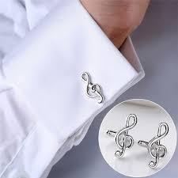

= english pod 261-280
:toc: left
:toclevels: 3
:sectnums:
:stylesheet: ../../myAdocCss.css

'''

== Daily Life ‐ Describing Someone’s Face (C0261)

A: Let’s play a game!

B: Ok! How about Scrabble 拼字游戏?

[.my1]
.案例
====
- scrabble : [ U]a board game in which players try to make words from letters printed on small plastic blocks and connect them to words that have already been placed on the board 拼字游戏（用手中的字母组成新的单词，并和台面上已存在的单词接上） +
-> 改写自 scrape,刮，擦，-le,表反复。引申词义乱翻，乱找。 +
image:/img/scrabble.jpg[,15%]

====

A: No no, a friend of mine taught me this
really fun game. I’m going to describe
someone’s face, and you guess who it is!

B: Ok!

A: Let’s see. He has a _roman 罗马的；罗马人的 nose_ 鹰钩鼻, bushy （毛发或枝叶）浓密的，茂密的
eyebrows 眉毛 and dimples 酒窝；球表面凹痕；涟漪!

[.my1]
.案例
====
- dimple -> 词源同 dip, 浸。引申词义小洞，酒窝。
====

B: Our cousin 堂（表）兄弟，堂（表）姐妹 Pete! My turn 轮到我了! She has a
_pointy 尖的；非常尖的 nose_, _sunken 沉没的；凹陷的；比周围低的 eyes_ and a mole 痣 on her
chin 颏，下巴!

A: Aunt Rose! That mole is so huge! Ok, my
turn. He has a _crooked 弯曲的，不直的；歪的 nose_ and _full lips_ 丰满的嘴唇. He
has quite a few freckles 雀斑 and an _oval 椭圆形的，卵形的 face_.
Oh, he is also bald 秃头的；光秃的!

[.my1]
.案例
====
- crooked +
image:/img/crooked.jpg[,15%]
====

B: Your future husband!

A: Not funny  一点都不好笑.

'''

== The Office ‐ Interview Skills 10 ‐ Concluding (v.)（使）结束；结束；缔结（协定） The Interview 面试，面谈 (C0262)

Mr. Parsons: Well Rebecca, is there
anything else you need to know for now?

Rebecca: I don’t think so Mr. Parsons. I
think you have covered all the main points 要点
for me.

Mr Parsons: Okay well listen, here is my
_business card_ 名片 with my mobile number. If any
other questions *spring (v.)跳，跃；突然弹开，突然移动；突然出现，涌现 to mind* 突然想到 don’t hesitate
to contact 联系，联络；接触 me. Of course you can also call
Miss Childs too.

Rebecca: Great. Ermm, when can I expect 期待
*to hear from* 收到某人的消息 you?

[.my2]
我什么时候能收到您的消息呢？

Mr. Parsons: Well, we are finishing the
_shortlist  (n.)最终候选名单，决选名单 interviews_ 面试 tomorrow, so we will
certainly have a decision made by early next
week. Miss Childs will call you to discuss
more on Monday or Tuesday. How does that
sound?

[.my2]
我们明天会结束"候选名单"的面试，所以下周初我们一定会做出决定。Miss Childs会在周一或周二打电话给您，进一步讨论。您觉得怎么样？

Rebecca: That sounds perfect. Thank you
very much for taking the time 抽出时间 to speak to me
Mr. Parsons.

Mr. Parsons: The pleasure’s all mine
Rebecca.

[.my2]
这是我的荣幸

Rebecca: I hope to hear from you very
soon.

Mr. Parsons: Absolutely. Thanks for coming
Rebecca. Goodbye.

'''

== Global View ‐ Nationalities 国籍，民族 (C0263)

A: Hey! How was your first day of class? I’m
in level two and I’m loving my class this
semester 学期，半学年! *#It#’s great* #being# in a class of
international students!

[.my2]
你第一天上课怎么样？我在二级班，这学期的课我超喜欢！在一个"国际学生"的班级里真是太棒了！

B: Mine was ok, except that no one in my
class speaks English. I guess it will force me
to converse (v.)谈话，交谈 in Chinese more in class. So at
least I should improve a lot this semester.

[.my2]
我的还行，除了班上没人说英语。我想这会迫使我更多地在课堂上用中文交流，所以至少这学期我应该会进步很多。

A: That’s both fortunate (a.)幸运的 and unfortunate. It’s
the _United Nations_ 联合国 in my class! We have
people from all over the world! There are
three Germans, a Pole 波兰人, a Scottish, two
French, an American, a Brazilian 巴西人, a Chilean 智利人, a
New Zealander, though 不过，可是，然而 he prefers to call
himself a Kiwi <非正式>新西兰人；奇异果. Who else do we have? Oh, we
also have a Moroccan 摩洛哥人, a Togolese  多哥人, a
Pakistani, and two Indonesians!

[.my2]
这既幸运又不幸。我的班级简直就是联合国！我们有来自世界各地的人！有三个德国人，一个波兰人，一个苏格兰人，两个法国人，一个美国人，一个巴西人，一个智利人，一个新西兰人，不过他更喜欢称自己为Kiwi。还有谁呢？哦，我们还有一个摩洛哥人，一个多哥人，一个巴基斯坦人，还有两个印尼人！

[.my1]
.案例
====
- Kiwi: Kiwi本来指的是新西兰盛产的奇异果，Kiwi也是一种没有翅膀无法飞行的鸟类叫几维鸟。不过，这个词语也可以用来表示“新西兰人”。 +
第一次世界大战，很多参战的新西兰军人，都愿意用Kiwi鸟的图形, 作为他们的军团标识。到了1917年，所有的新西兰士兵, 都开始被称作 Kiwi。 +
image:/img/Kiwi.jpg[,15%]
====

B: That’s quite the array  一系列，大量；数组，阵列 of nationalities  国籍，民族.
Everyone in my class is from Asia, except
me. There are a few South Koreans, several
Japanese, Malaysian, Thai, Singaporean,
Filipino, Kazakhstani, and one Russian.

[.my2]
真是各种各样的国籍啊。除了我，我班上每个人都来自亚洲。有几个韩国人，几个日本人，马来西亚人，泰国人，新加坡人，菲律宾人，哈萨克斯坦人，还有一个俄罗斯人。

A: Well, I think you’re pretty lucky actually.
You’ll have the opportunity to learn so much
about Asian culture.

B: I guess so, but I think it’s going to be
hard *to relate (v.)能够理解并同情；了解；体恤 to* my classmates, especially
with the language barrier 障碍，壁垒. I think I might
change classes.

A: Don’t! *Stay the course* (课程；过程；道路，航线；进程，进展；方针，总方向) *坚持住* ! Your _spoken (a.)以某种方式说话的；口头的
Chinese_ will be eternally 永恒地；不朽地；总是，不断地 grateful. I bet you it
will even surpass (v.)超过，胜过，优于；比（预期的或希望的）更好 mine with all that practice.

[.my2]
别换！坚持下去！你的口语中文会永远感激你的。我打赌，有了那么多练习，它甚至会超过我的水平。

B: I *highly doubt* 非常怀疑 it. Your girlfriend is
Chinese.

A: Well, there is that, yes.

'''

== Daily Life ‐ Toothache 牙痛 (C0264)

A: What seems to be the problem?

B: I have a really bad toothache! My cheek 脸颊，面颊 is
swollen (a.v.)肿胀的，肿起来的；（河流）涨水的，上涨的 and I can’t eat anything.

A: Let’s have a look. Hmmm. This doesn’t
look too good. I think we may have to pull
out 拔除 your _wisdom tooth_ 智齿. It’*s pressing against* 挤压
your molars 臼齿 and that’s one of the reasons
you are experiencing  经历；感受到 so much pain.

[.my1]
.案例
====
- molar : (n.) any of the twelve large teeth at the back of the mouth used for crushing and chewing food 磨牙；臼齿 +
-> 来自拉丁语molaris dens,磨牙，来自molaris,磨，词源同mill,dens,牙齿，词源同tooth. +
image:/img/molar.png[,30%]
====

B: When you pull my tooth, will you also have
to extract (v.)提取，提炼；取出，拔出 the nerve and the root?

[.my2]
当你拔我的牙时，你还需要拔出神经和牙根吗？

A: First we will take some x-rays and see
what we’re dealing with. I also noticed a
small cavity 洞，腔；(牙齿的) 龋洞 up front here 在前面这里, so you are going
to need a filling 填补物;补牙材料.

B: I guess *that’s what I get* 这就是我得到的 for (表原因)  *not flossing* (v.)（用牙线）清洁牙齿
or *brushing my teeth* three times a day.

[.my2]
我想, 这就是我不使用牙线, 或每天刷三次牙的后果。

[.my1]
.案例
====
"that’s what I get"：这是一种常见的表达，用来表示某人因为自己的行为或决定, 而面临的自然结果，有时带有一定的自责, 或接受惩罚的意味，即“这就是我应得的”。
====

A: It could be that, or maybe you are eating
too many sweets. In any case 无论如何, I’ll administer (v.)执行，实施；给予（药物或治疗）
an anesthetic 麻醉剂，麻药 and you won’t feel a thing!

'''

== The Weekend ‐ Pest 害虫，有害动物 Control (C0265)

A: Hi, did you call for an exterminator 灭虫专家;根除者；（美）灭鼠药；（美）职业的消灭害虫者?

B: Yes! Thank goodness you’re here. These
bugs are driving us crazy!

A: What sort of pest are we dealing with?

B: We just bought this house and it *is
infected （受）传染 with* 被感染 just about everything. We have
termites 白蚁(复数) in the wood, cockroaches 蟑螂 all over
the place, and last night I saw a huge rat out
in the backyard 后院；后庭!

[.my2]
我们刚买了这房子，它几乎被各种害虫侵占了。

A: Well, there’s nothing we can’t handle 没有我们处理不了的事情. I’ll
spray the floorboards 地板 and walls to get rid of
the cockroaches, but the termites will be
harder to get rid of. We will have to cover the
entire house and fumigate  (v.)烟熏，熏蒸（以灭虫或消毒） it. Unfortunately
that means you will have to find a place to
stay for the next three days.

[.my2]
我们需要把整个房子覆盖起来, 进行熏蒸。

[.my1]
.案例
====
- fumigate -> fume, 烟。-ig, 做，驱使，词源同agent. 即烟熏，常用做消毒。 +
image:/img/fumigate.jpg[,15%]
====

B: No problem, just get rid of the bugs!

[.my2]
只要把虫子除掉就行！

'''

== Daily Life ‐ Weather Report (C0266)

A: Those are today’s _top stories_ 头条新闻. Now let’s go
to John for the weather. John, what does the
forecast 预测；预报 look like for our weekend travelers?

[.my2]
以上就是今天的头条新闻。现在让我们连线John了解天气情况。John，对于周末出行的旅行者来说，天气预报是怎样的？

B: I’m afraid we’re in for a rough <非正式> 艰难的，不愉快的 weekend,
Mark. There is a _storm system_ 风暴系统 moving
through the East Coast. It will be drizzling 下毛毛雨 all
day today, and there’s a _60 percent chance_
of thunderstorms 雷暴 this evening. It will be
warm and humid all weekend. In the
Midwest 美国的中西部, expect _strong winds_ and a _low_ of
around 40 degrees.

[.my2]
恐怕我们要度过一个艰难的周末了，Mark。有一个风暴系统正在东海岸移动。今天一整天都会下毛毛雨，今晚有60%的概率会有雷暴。整个周末都会温暖潮湿。在中西部地区，预计会有强风，最低温度在40华氏度左右。

A: That’s pretty chilly (a.)阴冷的，寒冷的 for the summer! Will it
rain on Saturday?

B: Unfortunately, yes. It will be clear 晴朗的 early
Saturday morning but there is a high chance
of _showers and thunderstorms_ later in the
day. There is _a severe 十分严重的，极为恶劣的 thunderstorm warning_ (n.)
for some parts of the Southeast. Folks in
those areas might see some hail 冰雹 and
flooding 洪水, especially in areas that have been
experiencing _record  (a.)创纪录的 high rainfalls_ 降雨量.

[.my2]
不幸的是，是的。周六早上天气晴朗，但当天晚些时候有很高的概率, 会有阵雨和雷暴。东南部部分地区, 发布了严重雷暴警告。这些地区的人们可能会看到冰雹和洪水，尤其是在经历了"创纪录降雨量"的地区。

A: That certainly sounds like a dreary (a.)沉闷的，令人沮丧的
Saturday.

[.my2]
这听起来确实是一个沉闷的周六。

[.my1]
.案例
====
- dreary -> 来自PIE*dhreu, 滴，掉落，词源同drip, drop. 原义为滴血的，引申义沉闷的，阴深的。
====

B: It gets better on Sunday, though 不过，可是，然而. The
storm systems move (v.) east and the skies will
*clear up* 放晴 at night. It will still be rather cool,
with highs 最高温度 in the low 下限附近 50s. The West Coast
will be experiencing some unusually chilly
weather, but at least the sun will come out. I
advise (v.) weekend travelers to be careful,
especially while driving. Back to you, Mark.

[.my2]
不过，周日天气会好转。风暴系统将向东移动，晚上天空会放晴。天气仍然相当凉爽，最高温度在50华氏度出头。西海岸将经历一些异常寒冷的天气，但至少太阳会出来。我建议周末出行的旅行者要小心，尤其是在开车时。Mark，交还给你。

[.my1]
.案例
====
.with highs in the low 50s

这句话描述的是气温情况，*"low" 是指温度在50度*（假设是华氏温度）**的较低范围内。**所以，这句话的意思是最高气温会**维持在50度 Fahrenheit 的下限附近，**即大约在50到54度F之间，天气比较凉爽。

“in the low 50s”: 这里的 s, 并不是指单位，而是指温度的范围。用来表示50到59这个十年代的口语化用法, 在温度表述上的延伸，意为"接近50度, 但略低的几度"，比如51度、52度等，都是50年代（在这个上下文中指的是温度的十年代比喻，并非实际的年代）的低温部分。所以，没有具体的单位，它只是用来形容温度的一个习惯表达。

在 "low 50s" 中的 **"s" 表示的是一个范围，而不是复数。**它表示的是 "50 到 54 之间的温度"。

具体来说： +
*50s: 指的是 50 到 59 之间的温度。* +
*low 50s: 指的是 50 到 54 之间的温度。* +
*high 50s: 指的是 55 到 59 之间的温度。* +
这种用法在描述温度、年龄、年代等数字范围时很常见。

例如： +
"He's in his 30s." (他三十多岁。) +
"The 1990s were a time of great change." (20世纪90年代是一个剧烈变革的时期。)

因此，在您提供的句子中，“low 50s”表示白天的最高温度将在 50 到 54 度之间。

====

A: Thanks John, and *there you have it* 就是这样! Looks
like it’s a weekend to stay at home!

[.my2]
以上就是天气情况！

[.my1]
.案例
====
- "*there you have it*" is used *to conclude or summarize information*. +
就是这样：用于表示某件事情已经被清晰明确地展示、描述或陈述了。
====

'''

== Daily Life ‐ Making A _Bank Transfer_ (（使）转移，搬迁) 银行转帐 (C0267)

A: Good Morning /welcome to Bank of the USA. How may I help you today?

B: Hi I need to transfer （使）转移，搬迁 some money to another account. It’s urgent 紧急的.

A: Okay, have you made a _wire (n.)电线，导线 transfer_ (n.转移，转让，调动) 电汇 at our bank before?

B: No. I’ve never made a transfer before.

A: It’s alright, I will take you through the procedure 带你走一遍流程. Are you *transferring* funds 资金，现金 *to* a company or an individual account 个人账户?

B: A company account. I need to pay a bill 支付账单.

A: Okay, I’ll need the name of the company and their bank _routing number_ (路由号码) 银行路由号码 *as well as* their bank’s address and phone number.

[.my1]
.案例
====
.routing number
路由号码：银行机构用来指定"特定地理区域", 以便对查询和交易进行分类, 并将其定向到正确地区的数字。

A routing number is a nine-digit code used (v.) by financial institutions to identify (v.) other financial institutions. When *combined with* your account number, it allows institutions to locate (v.) your individual account. +
路由号码是金融机构用来识别其他金融机构的九位数字代码。当路由号码与您的帐号结合使用时，机构可以找到您的个人帐户。

A routing number is a unique, nine-digit number that functions (v.) as an address for your bank. It is used for electronic transactions 电子交易 such as _funds transfers_ 资金转移, direct deposits 存款, digital checks, and bill payments. +
路由号码是一个独特的九位数字，可作为您银行的地址。它用于电子交易，例如资金转账、直接存款、数字支票和账单支付。

image:/img/routing number.jpg[,35%]

====

B: I have all the information in this folder.

A: Well You’ve come prepared (a.)有备而来,准备充分. You have all the necessary materials /so we can go ahead /and make the transfer right now. It’s a simple transaction 简单的交易, and we can process it today.

B: Oh, that’s such a relief 松了一口气. I didn’t want the payment to be overdue 逾期. Thank you so much.

A: It’s my pleasure 我的荣幸, 不客气.

[.my1]
.案例
====

- wire transfer : /waɪər ˈtrænsfər/ (noun) An electronic transfer of money between banks. 电汇.

- transfer funds : /ˈtrænsfər fʌndz/ (phrase) To move money from one account to another. 转账.
- individual account : /ˌɪndɪˈvɪdʒuəl əˈkaʊnt/ (noun) A bank account owned by one person. 个人账户.
- bank routing number : /bæŋk ˈruːtɪŋ ˈnʌmbər/ (noun) A code used to identify a bank in a transaction. 银行路由号码.
- come prepared : /kʌm prɪˈpeərd/ (phrase) To be ready with all necessary materials. 准备充分. +
Example: She always comes prepared for meetings with all the documents. 她总是带着所有文件准备充分参加会议.
====

[.my2]
A: 早上好，欢迎来到美国银行。今天我能为您提供什么帮助？ +
B: 你好，我需要转账到另一个账户。很紧急。 +
A: 好的，您之前在我们银行办理过电汇吗？ +
B: 没有。我从来没有转过账。 +
A: 没关系，我会带您走一遍流程。您是转账到公司账户还是个人账户？ +
B: 公司账户。我需要支付账单。 +
A: 好的，我需要公司名称、银行路由号码以及银行地址和电话号码。 +
B: 我所有的信息都在这个文件夹里。 +
A: 嗯，您准备得很充分。您有所有必要的材料，所以我们可以立即进行转账。这是一个简单的交易，我们今天就能处理。 +
B: 哦，这让我松了一口气。我不想支付逾期。非常感谢。 +
A: 不客气。 +

'''

== The Office ‐ Purchasing Manager (C0268)

A: Good morning, Angela, how have you been lately 近来怎么样?

B: Morning, Michael. I’ve been very busy lately. One of our other vendors 供应商 is *going out of business* 倒闭 and I’ve been searching for a suitable replacement 合适的替代品.

A: Well, *rest assured (v.)请放心,放心，可以确信 that* /you can *count (v.) on* 依靠，指望 us 依靠我们 to be here for the _long run_ 长期合作. Sit down. Coffee?

B: No, thanks. I’ve been trying *to cut down on* 依靠，指望 the caffeine 减少咖啡因摄入.

A: Haha, I could never do that. I’d be a zombie 行尸走肉 if I didn’t have my morning coffee fix (（致瘾的东西，尤指毒品的）一次用量) 早晨咖啡. Let’s *get down to* 开始做某事，集中精力或努力做某事 business 开始谈正事 then.

[.my1]
.title
====
.fix
(n.)[ sing.] ( informal ) an amount of sth that you need and want frequently, especially an illegal drug such as heroin （致瘾的东西，尤指毒品的）一次用量 +
•to get yourself a fix (n.). 给自己注射一剂毒品 +
•I need _a fix (n.) of coffee_ before I can face the day. 我总需要喝足咖啡才有精神应付一天的工作。

====

B: Yes. I’ve come to talk with you 我是来和你谈谈 about ordering the eight megapixel 兆像素，百万像素 cameras 八百万像素摄像头 for our new MePhone. The demand for _phone cameras_ is growing, and Pear 梨，梨树 has been *falling behind* 落后 in the market.

A: That’s great! I’m glad to hear that /Pear has finally jumped on the bandwagon (风靡的活动；时尚) 加入潮流,跟风. Right now /our contract 合同，契约 is for the five megapixel cameras. Is Pear still interested in having those?

[.my1]
.title
====
.bandwagon
[ usually sing.]an activity that more and more people are becoming involved in风靡的活动；时尚 +
-> band, 乐队。wagon, 马车。指19世纪流动的音乐家或演艺团队各地巡演，通常引起轰动。

====

B: No, we’re changing all the cameras to eight megapixels. #We were hoping that# /方式状 by making your company our sole supplier 唯一供应商 for cameras /`主` #we `谓` could# negotiate a better deal 谈成更好的交易.

A: Surely. Let’s get started by drafting a new contract 起草新合同.

[.my1]
.title
====
- rest assured : /rɛst əˈʃʊərd/ (phrase) To feel confident or certain. 请放心.
Example: Rest assured, we will deliver the product on time. 请放心，我们会按时交付产品.

- get down to business : /ɡɛt daʊn tuː ˈbɪznɪs/ (phrase) To start discussing important matters. 开始谈正事. +
Example: Let’s get down to business and finalize the contract. 我们开始谈正事，敲定合同吧.

- falling behind : /ˈfɔːlɪŋ bɪˈhaɪnd/ (phrase) Not keeping up with others. 落后. +
Example: Our company is falling behind in the technology race. 我们公司在技术竞赛中落后了.

- jumped on the bandwagon : /dʒʌmpt ɒn ðə ˈbændwæɡən/ (phrase) To join a popular trend. 加入潮流. +
Example: Many companies have jumped on the bandwagon of digital transformation. 许多公司加入了数字化转型的潮流.
====

[.my2]
A: 早上好，安吉拉，最近怎么样？ +
B: 早上好，迈克尔。我最近非常忙。我们的一家供应商倒闭了，我一直在寻找合适的替代品。 +
A: 嗯，请放心，您可以依靠我们进行长期合作。请坐。要咖啡吗？ +
B: 不用了，谢谢。我一直在努力减少咖啡因摄入。 +
A: 哈哈，我永远做不到。如果没有早晨咖啡，我会变成行尸走肉。那我们开始谈正事吧。 +
B: 好的。我来和你谈谈为我们新 MePhone 订购八百万像素摄像头的事。手机摄像头的需求正在增长，而 Pear 在市场上已经落后了。 +
A: 太好了！我很高兴听到 Pear 终于加入了潮流。目前我们的合同是五百万像素摄像头。Pear 还对那些感兴趣吗？ +
B: 不，我们正在将所有摄像头改为八百万像素。我们希望通过让贵公司成为我们摄像头的唯一供应商，谈成更好的交易。 +
A: 当然。我们开始起草新合同吧。 +

'''

== The Office ‐ Marketing Plan (C0269)

A: Okay everyone, let’s begin. I called you here today to evaluate (v.)评价，评估，估值 our marketing strategy 评估营销策略 during this recession 经济衰退. I wanted to re-emphasize 再次强调 our corporate mission 企业使命 of /Aiming (v.) to give our customers the best coffee and service /in a clean and welcoming atmosphere.

B: Several other shops have reduced (v.)减少，降低 the prices for their coffees /and are *drawing in* 使卷入；使参与 more customers 吸引更多顾客. Why aren’t we doing the same thing?

A: I know that /recent sales have been slow, but we are not going *to reduce* (v.) our prices *to* the level of our competitors. We offer a superior product 优质产品 /and our focus (n.) is on long-term growth 长期增长 *rather than* short-term sales 短期销售. If we lower (v.)减少，降低 our prices, we run (v.) the risk of devaluing (v.)（使）货币贬值；贬低，降低……的价值（或重要性） our product 贬低我们的产品.

B: Customers don’t *care about* 关心，在意，重视 the coffee anymore. They only *care about* the price.

A: I disagree. Highly discerning (a.)有辨识能力的；眼光敏锐的 customers 挑剔的顾客 know (v.) that /our coffee is far better than the coffee you buy at the other places. Our coffee beans 豆类；豆子；黄豆 are artisan roasted 手工烘焙 /and we use (v.) state-of-the-art (a.)最先进的；已经发展的；达到最高水准的 equipment 最先进的设备 to brew (v.)沏（茶）；煮（咖啡）;酿制（啤酒） our coffees. When you compare the coffees side-by-side 并肩的；并行的, our coffee wins (v.) the taste test 口味测试 every time. We have never sought (v.) *to appeal to* the mass market 大众市场 with cheap coffee drinks 饮料，饮品, and we will not do so now.

[.my1]
.title
====
- brew -> 来自PIE *bhreue, 加热，蒸，词源同burn.
====

C: That’s true. We’ve certainly achieved top-of-mind 记忆中的首要位置 awareness 顶级品牌认知 /when it comes to the best-tasting 口感最好的 brews (n.)（茶）一次的冲泡量;（不同思想、事件等的）交融，混合, and it’s important to distinguish (v.)区分；辨别；分清 ourselves from our competitors 与竞争对手区分开来. I think the main question is /how we can show our appreciation 欣赏，鉴赏；感激，感谢 to our customers 向顾客表达我们的感激.

A: That’s the main question /I would like to discuss today.

B: Money is tight (a.)紧的；拮据的；不宽裕的 for everyone these days, so even our most loyal customers 最忠诚的顾客 may be reconsidering (v.)重新考虑 the money they *pay for* their morning coffee. Since `主` the superiority 优越，优势 of our coffee beans `系` is one of our core competencies 核心竞争力, why don’t we sell (v.) the beans for people to brew (v.)沏（茶），冲（咖啡）；酿（啤酒）；酝酿 coffee at home?

C: That could definitely be a way 后定 we could expand (v.) our company, but would we be undermining (v.)侵蚀（岩层）底基；暗中破坏；逐渐削弱；从根基处破坏 the essence 本质；实质；精髓 of the company 削弱公司本质 that way?

A: Let’s brainstorm (v.)集体讨论，集思广益 some more ideas, and do some research. The customer always comes first 顾客永远是第一位的, and what the customer wants, the customer gets 顾客想要什么，顾客就会得到什么. Maybe it’s time we started selling (v.) coffee beans.

[.my1]
.title
====

- drawing in more customers : /ˈdrɔːɪŋ ɪn mɔːr ˈkʌstəmərz/ (phrase) Attracting more people to buy products. 吸引更多顾客. +
Example: The new advertising campaign is drawing in more customers. 新的广告活动正在吸引更多顾客.

- superior product : /suːˈpɪəriər ˈprɒdʌkt/ (noun) A product of higher quality. 优质产品.

- highly discerning customers : /ˈhaɪli dɪˈsɜːrnɪŋ ˈkʌstəmərz/ (noun) Customers who are very particular about quality. 挑剔的顾客.

- artisan roasted : /ˈɑːrtɪzən ˈroʊstɪd/ (adj) Coffee beans roasted by skilled craftsmen. 手工烘焙.

- mass market : /mæs ˈmɑːrkɪt/ (noun) The general public as consumers. 大众市场.
- top-of-mind awareness : /tɒp əv maɪnd əˈweənəs/ (noun) When a brand is the first one people think of. 顶级品牌认知.
====

[.my2]
A: 好了，大家，我们开始吧。我今天召集大家来是为了在经济衰退期间评估我们的营销策略。我想重申我们的企业使命：在干净和温馨的环境中为顾客提供最好的咖啡和服务。 +
B: 其他几家店已经降低了咖啡价格，吸引了更多顾客。为什么我们不这么做呢？ +
A: 我知道最近的销售很慢，但我们不会将价格降到竞争对手的水平。我们提供的是优质产品，我们的重点是长期增长，而不是短期销售。如果我们降低价格，就有可能贬低我们的产品。 +
B: 顾客不再关心咖啡了。他们只关心价格。 +
A: 我不同意。挑剔的顾客知道我们的咖啡比你在其他地方买的咖啡好得多。我们的咖啡豆是手工烘焙的，我们使用最先进的设备来冲泡咖啡。当你并排比较咖啡时，我们的咖啡每次都能赢得口味测试。我们从未试图用廉价咖啡饮料吸引大众市场，现在也不会这么做。 +
C: 确实如此。在最佳口感的咖啡方面，我们已经实现了顶级品牌认知，重要的是与竞争对手区分开来。我认为主要问题是如何向顾客表达我们的感激。 +
A: 这就是我今天想讨论的主要问题。 +
B: 现在大家手头都很紧，所以我们最忠诚的顾客可能也在重新考虑他们为早晨咖啡支付的费用。既然我们的咖啡豆的优越性是我们的核心竞争力之一，为什么不卖咖啡豆让人们在家冲泡咖啡呢？ +
C: 这绝对是我们扩展公司的一种方式，但这样做会不会削弱公司的本质？ +
A: 让我们再集思广益，做一些研究。顾客永远是第一位的，顾客想要什么，我们就提供什么。也许是时候开始卖咖啡豆了。 +

'''

== Daily Life ‐ Buying A Suit (C0270)

A: Hello sir, what can I do for you today?

B: Hi, I need a new suit. I have an important interview 重要面试 next week, so I really need to look sharp (敏锐的；灵敏的；敏捷的) 看起来精神.

A: No problem! We have a broad selection of suits 多种选择, all tailored (a.)（衣服）定做的，合身的；特制的，专门的 made 量身定制 /so that it will fit perfectly.

B: Great! I want a three-piece suit 三件套, preferably made from Italian cashmere (山羊绒；克什米尔羊毛) 意大利羊绒 or wool 羊毛.

A: Very well sir. Would you like to 使动 *have* some shirts *made* also 您还想做几件衬衫吗?

B: Sure. I’ll also take some silver cufflinks (袖扣；链扣) 银袖扣 and a pair of silk ties 丝绸领带.

[.my1]
.title
====
.cufflink
[ usually pl.]one of a pair of small decorative objects used for fastening (v.) shirt cuffs together（衬衫的）袖口链扣，袖扣 +
-> cuff (袖口) + link

====

A: Very good. Now, if you will accompany 陪同；陪伴 me, we can take your measurements 量尺寸 and choose the patterns 选择款式 for your suit  套装，西装 and shirts.

[.my1]
.title
====
- tailored made : /ˈteɪlərd meɪd/ (adj) Custom-made to fit perfectly. 量身定制.
- three-piece suit : /θriː piːs suːt/ (noun) A suit with a jacket, trousers, and a vest. 三件套. 由同一种材料制成的外套、背心和裤子组成的套装。 +

- Italian cashmere : /ɪˈtæliən ˈkæʃmɪər/ (noun) High-quality wool from Italy. 意大利羊绒.
- wool : /wʊl/ (noun) A natural fiber used to make clothing. 羊毛.
- silver cufflinks : /ˈsɪlvər ˈkʌflɪŋks/ (noun) Decorative fasteners for shirt sleeves. 银袖扣. +

- silk ties : /sɪlk taɪz/ (noun) Neckties made from silk. 丝绸领带.
- take your measurements : /teɪk jʊər ˈmɛʒərmənts/ (phrase) To measure someone for clothing. 量尺寸. +
Example: The tailor took his measurements for the new suit. 裁缝为他量尺寸做新西装.
====

[.my2]
A: 您好，先生，今天我能为您做些什么？ +
B: 你好，我需要一套新西装。我下周有一个重要面试，所以我需要看起来精神。 +
A: 没问题！我们有很多种选择，都是量身定制的，所以会非常合身。 +
B: 太好了！我想要一套三件套，最好是意大利羊绒或羊毛的。 +
A: 很好，先生。您还想定制一些衬衫吗？ +
B: 当然。我还要一些银袖扣和几条丝绸领带。 +
A: 非常好。现在，如果您愿意跟我来，我们可以为您量尺寸，并为您的西装和衬衫选择款式。 +

'''

== The Office ‐ Presentation Series 1 ‐ The Overview 概述，综述 and the Agenda 待议事项，议事日程；（政治）议题 (C0271)

A: Hi everyone, Can everyone hear me? Can you guys at the back hear (v.) everything?

A: Okay great. Well I think all of you know (v.) /why we are here this afternoon. As most of you are aware, 2010 marks (v.) an important moment 重要时刻 for Alpha computers.

A: We *have bounced (v.) back* 迅速恢复力量 from the recession 从经济衰退中恢复 /and now we are set (v.)安排；确定；决定 to launch (v.) our new line 种类；类型;按时间顺序排列的人（或物、事件）；家系；家族 of laptop and desktop computers 推出新的笔记本电脑和台式电脑系列.

A: I’m really pleased to welcome (v.) Michael Ford, the Global Marketing Manager for Alpha computers, who *has flown 飞行 in* from California /to give all of you an overview of the marketing campaign 营销活动概述 /and to answer (v.) any questions you may have. So please give a warm welcome 热烈欢迎 to Mr. Ford.

B: Thank you Jonathan. It really is a pleasure to be here today. It has been three years /since I visited Beijing, and it’s clear to me that /operations 运营；运作；业务操作 here *are* obviously *going from strength to strength* 越来越强,蒸蒸日上.

B: The Alpha brand continues (v.) to grow (v.) in leaps and bounds 飞速发展 in China, and that *is certainly down (ad.)是某人的责任；由某人负责 to* the hard work of all of you here 这当然要归功于在座各位的辛勤工作. So congratulations to all of you.

[.my1]
.title
====
.be down to sb
( informal ) to be the responsibility of sb 是某人的责任；由某人负责 +
•*It's down to you* to check the door. 检查门是否关好, 是你的事。

.be down to sb/sth
to be caused by a particular person or thing 由…引起（或造成） +
•She claimed /her problems were down to the media. 她声称, 她的问题是媒体造成的。

====

B: I’d like to start (v.) /by outlining (v.)概述，略述；勾勒，描画……的轮廓 the key points of my presentation 陈述，报告，说明;展示会；介绍会；发布会 this afternoon /and giving you an idea of the topics that will be discussed. The presentation today *is divided into* five main parts.

B: First of all, I’d like *to briefly touch on* 提及；谈及 the background of the new x420 line; how _the whole concept_ has come about 如何产生的 /and how the new product *fits into* our existing brand line 现有品牌系列.

B: Secondly, I’d like to present (v.) data 呈现数据 on _projected (a.)计划的，推断的 sales_ 预计销售额 for the x420. We will then go on /to discuss (v.) our key rivals 主要竞争对手 in this sector 在这个领域. Then I would like to go on /to outline (v.) the campaign concept 活动概念 for the x420.

B: Finally, I’m happy to open up the discussion 开启讨论 for any questions or points 后定 you might have for me.

[.my1]
.title
====
- going from strength to strength : /ˈɡoʊɪŋ frɒm strɛŋθ tuː strɛŋθ/ (phrase) Continuously improving. 蒸蒸日上. +
Example: The company is going from strength to strength in the global market. 公司在全球市场上蒸蒸日上.

- grow (v.) in leaps and bounds : /ɡroʊ ɪn liːps ænd baʊndz/ (phrase) To develop very quickly. 飞速发展,巨大的改进或显著的进步. +
Example: The tech industry is growing in leaps and bounds. 科技行业正在飞速发展.

- come about : /kʌm əˈbaʊt/ (phrase) To happen or develop. 如何产生的. +
Example: The idea for the project came about during a brainstorming session. 项目的想法是在头脑风暴会议中产生的.
====

[.my2]
A: 大家好，大家能听到我吗？后面的各位能听清楚吗？ +
A: 很好。我想大家都知道我们今天下午为什么在这里。正如大多数人所知，2010 年对 Alpha 电脑来说是一个重要时刻。 +
A: 我们已经从经济衰退中恢复，现在正准备推出新的笔记本电脑和台式电脑系列。 +
A: 我非常高兴地欢迎 Alpha 电脑的全球营销经理迈克尔·福特，他从加州飞来，为大家概述营销活动并回答大家的问题。请大家热烈欢迎福特先生。 +
B: 谢谢乔纳森。今天能在这里真是非常高兴。距离我上次访问北京已经三年了，我清楚地看到这里的业务蒸蒸日上。 +
B: Alpha 品牌在中国继续飞速发展，这当然归功于在座各位的辛勤工作。所以，祝贺大家。 +
B: 我想首先概述一下今天下午演讲的要点，并让大家了解将要讨论的主题。今天的演讲分为五个主要部分。 +
B: 首先，我想简要介绍一下新 x420 系列的背景；整个概念是如何产生的，以及新产品如何融入我们的现有品牌系列。 +
B: 其次，我将介绍 x420 的预计销售数据。然后我们将讨论该领域的主要竞争对手。接着，我将概述 x420 的活动概念。 +
B: 最后，我很乐意开启讨论，回答大家可能提出的任何问题或观点。 +
'''

== Daily Life ‐ Getting A Nanny (C0272)

Grace: Hey Mel! Are you *up for* 想要或愿意做某事 some tennis today?

Mel: Sorry, I can’t! I have to go to work, pick up 接人，搭载 Jake and Maddie from school, and make them an afternoon snack 下午点心, then take Jake to _soccer practice_ 足球训练 and Maddie to _dance class_ 舞蹈课.

Grace: You sound (v.) exhausted (a. 筋疲力尽的；耗尽的，枯竭的) 听起来很累. Maybe you should hire (v.) a nanny 雇佣保姆 *to help you out* 帮助某人摆脱（困境）! She can *pick* the kids *up* /and take them to their after-school activities 课后活动. She can also help you do some household chores (杂务；零工；困难的工作) 家务, and run some errands (差使；差事) 跑腿.

[.my1]
.案例
====
.errand
a job that you do for sb that involves going somewhere to take a message, to buy sth, deliver (v.) goods, etc. 差使；差事 +
•He often runs errands for his grandmother.他经常给他的祖母跑腿儿。 +
-> 来自PIE*ei, 走，离开。其现在分词ion, 过去分词it, 词源同exit, itinerary, 该词来自其 拉丁语现在主动不完全格ire.
====

Mel: Oh, I don’t know…-  it’s hard to find the right nanny 保姆；母山羊. You have to consider her previous _work experience_ 之前的工作经验, the responsibilities 责任；职责 you give her, and how she interacts (v.)互动；相互作用 with the kids 与孩子互动. I would love to have someone to help me out, though 虽然，尽管；可是，不过.

Grace: I think you should definitely consider it! This way 通过这种方式或方法 you won’t have to juggle (v.)玩杂耍（连续向空中抛接多个物体）;尽力同时应付（两个或两个以上的重要工作或活动） such a busy schedule 应付繁忙的日程, and you’ll still get to spend time with the kids in the evenings. I can refer (v.)提到；谈及；说起;将…送交给（以求获得帮助等） you this great nanny Amy 女子名. She used to 过去常常 work for my neighbors, before they moved away. She’s very responsible, a good cook 厨师，炊事员, and great with kids.

Mel: Oh, that’s great. Thanks Grace. Can you give me her number? I’ll *talk it over 详细讨论，详谈（以达成协议或作出决定） with* Dan /and give her a call tomorrow. Maybe this way 通过这种方式或方法 I won’t be so tired every day, and Dan and I might even *get to* 有机会做某事,或被许可做某事 *go on a date* 约会 once in a while 偶尔约会.

[.my1]
.案例
====
.get to do something
informal /to have the opportunity to do something +
- She gets to travel all over the place with her job.
====

[.my2]
Grace: 嘿，梅尔！你今天想打网球吗？ +
Mel: 抱歉，我不能！我得去上班，接杰克和麦迪放学，给他们做下午点心，然后送杰克去足球训练，麦迪去舞蹈课。 +
Grace: 你听起来很累。也许你应该雇佣一个保姆来帮你！她可以接孩子放学并带他们去课后活动。她还可以帮你做些家务和跑腿。 +
Mel: 哦，我不知道……-  找到合适的保姆很难。你必须考虑她之前的工作经验、你给她的责任以及她如何与孩子互动。不过，我很希望有人能帮我。 +
Grace: 我认为你绝对应该考虑一下！这样你就不用应付这么繁忙的日程了，而且晚上还能和孩子在一起。我可以推荐一个很棒的保姆艾米。她以前为我的邻居工作，后来他们搬走了。她非常负责，厨艺很好，也很会照顾孩子。 +
Mel: 哦，那太好了。谢谢格蕾丝。你能把她的电话号码给我吗？我会和丹商量一下，明天给她打电话。也许这样我就不会每天这么累了，而且我和丹也许还能偶尔约会。 +

'''

== The Weekend ‐ The Zodiac and Horoscopes (C0273)

Angela: Hey Lydia, what are you reading?

Lydia: I’m looking at my horoscope (n.)占星预言,星座运势 for this month! My outlook 前景，展望；景色 is very positive 良好的；有助益的；正面的. It says that /I should take a vacation 休假，假期 to someplace exotic (a.)异国风情的, and that I will have a passionate (a.)拥有（或表现出）强烈性爱的；情意绵绵的；怒不可遏的 summer fling (n.)(一阵尽情欢乐；一时的放纵;短暂的风流韵事) 夏日激情.

[.my1]
.案例
====
.horoscope
a description of what is going to happen to sb in the future, based on the position of the stars and the planets when the person was born 占星预言 +
-> 该单词源自希腊语 horoskopos，由 **horo（hour，时辰）+ skopos（scope，景象，视野）**构成，字面意思就是“出生时辰所对应的星象”。
====

Angela: What are you talking about? Let me see that. . . What are horoscopes?

Lydia: It’s a prediction of your month, based on your _zodiac (n.)黄道带;黄道十二宫图（用于占星术） sign_ 星座. You have a different sign for the month and date 后定 you were born in. I was born on April 15th, so I’m an Aries 白羊座. When were you born?

[.my1]
.案例
====
- zodiac -> 字面意思是“动物组成的环”，来源于zoion（动物）。而另一单词zoo（动物园）来源于zoion（动物）。 在西方，人们说起星座时通常指的是太阳星座。星座用单词sign表示，太阳星座就是sun sign。
- Aries -> 来自拉丁语aries("ram"). (ram 公羊；白羊（星）座（the Ram）；攻城槌，撞击装置；冲压机，撞锤)
====

Angela: January  一月 5th.

Lydia: Let’s see. . . you’re a Capricorn 摩羯座. It says that /you will be feeling stress at work, but you could see new, exciting developments in your _love life_ 爱情生活,感情生活. Looks like we’ll both have interesting summers 夏季，夏天!

[.my1]
.案例
====
- Capricorn -> Capri, 山羊。-corn, 角。因该星座形似山羊角而得名。
====

Angela: That’s bogus (a.)假的;假冒的，伪造的. I don’t feel (v.) any stress at work, and my _love life_ is practically nonexistent (a.不存在的) 几乎不存在. This zodiac  黄道带 stuff is all a bunch of nonsense 胡说八道.

[.my1]
.案例
====
- bogus -> 词源不确定。通常认为来自bogey, 鬼怪，形容其突然出现。
====

Lydia: No it’s not, your _astrology (n.)占星术；占星学；星座 sign_ 星座 can tell you a lot about your personality 个性，性格；魅力，品格. See? It says that an Aries is energetic and loves (v.) to socialize (v.) 社交.

Angela: Well, you certainly match (v.) those criteria (（评判或做决定的）标准，准则，尺度) 符合这些标准, but they’re so broad they could *apply to* anyone. What does it say about me?

Lydia: A Capricorn 摩羯宫；摩羯座 is serious-minded (a.)认真的 and practical (a.)（人）明智的，务实的;实事求是的. She likes to do things in conventional  依照惯例的，遵循习俗的；老一套的，习惯的 ways 传统方式. * laughs * That sounds just like you!

[.my2]
Angela: 嘿，莉迪亚，你在看什么？ +
Lydia: 我在看这个月的星座运势！我的前景非常积极。它说我应该去一个异国风情的地方度假，而且我会有一个夏日激情。 +
Angela: 你在说什么？让我看看……-  什么是星座运势？ +
Lydia: 它是根据你的星座对你这个月的预测。你出生时的月份和日期决定了你的星座。我出生于4月15日，所以我是白羊座。你是什么时候出生的？ +
Angela: 1月5日。 +
Lydia: 让我看看……-  你是摩羯座。它说你会感到工作压力，但你的感情生活可能会有新的、令人兴奋的发展。看来我们都会有一个有趣的夏天！ +
Angela: 那是假的。我没有任何工作压力，我的感情生活几乎不存在。这些星座的东西都是一派胡言。 +
Lydia: 不，不是的，你的星座可以告诉你很多关于你性格的信息。看到了吗？它说白羊座精力充沛，喜欢社交。 +
Angela: 嗯，你当然符合这些标准，但它们太宽泛了，可以适用于任何人。关于我，它说了什么？ +
Lydia: 摩羯座是严肃而务实的。她喜欢用传统的方式做事。笑 这听起来就像你！ +

'''

== The Office ‐ Presentation Series 2 ‐ Talking about numbers, charts 图表；排行榜 and graphs 图形，图表；曲线图 (C0274)

Mr. Ford: As all of you are well aware (a.), `主` competition in the laptop computer sector `系` is intense 激烈的.

Mr. Ford: We continue to fight (v.) with our competitors for market share 市场份额, and this is the case *both* in the _developed markets_ 成熟市场 in the West, *as well as* more _developing markets_ 发展中的市场 in Asia and Africa.

Mr. Ford: You may ask yourself, why is this market so cut-throat (a.)（竞争）残酷的，激烈的；杀人的；（人）凶狠的，拼命的? Well the answer is simple. There is a huge untapped (a.)（竞争）残酷的，激烈的；杀人的；（人）凶狠的，拼命的 potential market 未开发的潜在市场 out there, with a huge untapped potential (n.)未开发的潜力 for profit 利润，盈利.

Mr. Ford: If I *bring up* 提出（讨论等） the first graph here, it shows the increase *in terms of* 就…而言；从…角度来看；就…方面而言 number of computer owners 电脑拥有者  across the globe.

Mr. Ford: As you can see in the 1980’s /`主` computer ownership `谓` *amounted (v.)总计，共计 to* around 0.5% of the total world population. Since the 1990’s, computer ownership has risen dramatically.

Mr. Ford: In the new millennium 一千年；千周年纪念日，千禧年 /we saw an even larger explosion in computer owners, with figures 数字 rising to around 4-5%, an increase of 1000% percent *compared with* the 1980’s.

Mr. Ford: If we move on to discuss (v.) the figures for China specifically /we can see in Chart B /that `主` the overall (a.)总的，全面的；所有的 figure for computer ownership `谓` stands (v.)位于 at around 60 million, which represents a huge increase /in a very short time period.

Mr. Ford: Now of course 60 million is just _a drop in the ocean_ 沧海一粟,杯水车薪 /if you compare (v.) the total population of China, and this is a key reason why the personal computer market is such a hot market 热门市场.

[.my1]
.案例
====
- a drop in the ocean : 杯水车薪：一个数量非常小，对于整体来说没有重要影响或者没有太大效果的量。
====

Mr. Ford: For us at Alpha, and of course for all our competitors  竞争对手 as well, we have millions of potential customers who are looking to join the internet generation 互联网一代.

Mr. Ford: If we do this right /we really can reap (v.)获得，收获；收割（庄稼等） huge rewards 获得巨大回报 in a very short time frame. I’d now like to move on to discuss 我想继续讨论 the x420 brand itself, and compare (v.) and contrast (v.)对比，对照 with some of our key competitors.

[.my1]
.案例
====

- drop in the ocean : /drɒp ɪn ði ˈəʊʃn/ (phrase) A very small amount compared to the whole. 沧海一粟.
====

[.my2]
Mr. Ford: 正如大家所知，笔记本电脑行业的竞争非常激烈。 +
Mr. Ford: 我们继续与竞争对手争夺市场份额，无论是在西方发达市场，还是在亚洲和非洲的发展中市场，情况都是如此。 +
Mr. Ford: 你可能会问自己，为什么这个市场如此残酷？答案很简单。那里有一个巨大的未开发的潜在市场，以及巨大的未开发的利润潜力。 +
Mr. Ford: 如果我展示第一张图表，它显示了全球电脑用户数量的增长。 +
Mr. Ford: 正如你所看到的，在1980年代，电脑用户数量约占世界总人口的0.5%。自1990年代以来，电脑用户数量急剧增加。 +
Mr. Ford: 在新千年，我们看到了电脑用户数量的更大爆炸性增长，数字上升到4-5%，与1980年代相比增长了1000%。 +
Mr. Ford: 如果我们继续讨论中国的具体数据，我们可以在图表B中看到，电脑用户总数约为6000万，这在很短的时间内是一个巨大的增长。 +
Mr. Ford: 当然，与中国总人口相比，6000万只是沧海一粟，这也是个人电脑市场如此热门的关键原因。 +
Mr. Ford: 对于我们Alpha公司，当然也包括所有竞争对手，我们有数百万潜在客户希望加入互联网一代。 +
Mr. Ford: 如果我们做得好，我们真的可以在很短的时间内获得巨大回报。现在我想继续讨论x420品牌本身，并与一些主要竞争对手进行比较和对比。 +

'''

== Daily Life ‐ Kitchen Appliances (C0275)

A: I have been looking at this online catalog 在线目录 for over an hour /and I still haven’t finished getting 弄齐 all the kitchen appliances (电器用具) 厨房电器 that we need!

B: What are you getting?

A: Well, the first thing on my list is a new blender 搅拌机. I decided to also get a juicer 榨汁机 and a new coffee maker 咖啡机.

B: Don’t forget to also get a new mixer 搅拌器. I *lent* the old one *to* my brother and he broke it.

A: Yeah I know. I also decided to throw away 丢弃 the old toaster 烤面包机 and get a new one. I am also getting a rice cooker 电饭煲 and steamer 蒸锅 to make some nice steamed (a.)蒸熟的，蒸的 fish or veggies  蔬菜；素菜类；素食主义者.

B: I’m actually thinking of completely refurnishing (v.)重新装饰，重新布置 the kitchen 重新装修厨房 and getting a new stove 炉子, oven 烤箱, dishwasher 洗碗机 and trash compactor 垃圾压缩机.

A: That’s a good idea! The kitchen will look amazing!

[.my2]
A: 我已经看了一个多小时的在线目录，但我还没有买完我们需要的所有厨房电器！ +
B: 你在买什么？ +
A: 嗯，我清单上的第一件东西是一个新的搅拌机。我还决定买一个榨汁机和一个新的咖啡机。 +
B: 别忘了还要买一个新的搅拌器。我把旧的借给我弟弟，他弄坏了。 +
A: 是的，我知道。我还决定扔掉旧的烤面包机，买一个新的。我还打算买一个电饭煲和一个蒸锅，做一些美味的蒸鱼或蔬菜。 +
B: 其实我在考虑重新装修厨房，买一个新的炉子、烤箱、洗碗机和垃圾压缩机。 +
A: 这是个好主意！厨房会看起来很棒！ +

'''

== Daily Life ‐ Telephone Services (C0276)

A: Telco Mobile, how can I help you?

B: Yes, I’d like to activate  (v.)激活，使活化；使参战 my voice mail service 语音信箱服务 please.

A: Certainly sir, we currently have a special promotion 特别促销 where we include _voice mail services_, _call waiting_ 呼叫等待,来电等待 and also three-way calling 三方通话.

[.my1]
.案例
====
- call waiting : 呼叫等待：一种电话功能，允许用户在通话过程中接听另一个来电，而不会中断当前通话。
- three-way calling : 三方通话：一种电话功能，允许三个电话号码同时进行通话。
====

B: Sure *that sounds (v.) great*! Are there any other fees?

A: Not at all. No hidden fees or surcharges 隐藏费用或附加费, it is a flat monthly rate 固定月费.

B: Perfect. I also wanted to know /if there is any _call forwarding_ ( 转递（信）；递交；运送（货物）) 呼叫转移 service 呼叫转移服务? I am usually out of town 出城,出门 and would like my calls (n.)电话 *to be forwarded to* a local number.

[.my1]
.案例
====
- call forwarding : 呼叫转移：一种电话服务，允许用户将来电转发到另一个号码。
====

A: Yes of course. We can activate (v.) all these services in about an hour.

[.my1]
.案例
====
- special promotion : /ˈspɛʃl prəˈməʊʃn/ (noun) A limited-time offer. 特别促销.
- call waiting : /kɔːl ˈweɪtɪŋ/ (noun) A feature that allows incoming calls while on another call. 来电等待.
- three-way calling : /θriː weɪ ˈkɔːlɪŋ/ (noun) A feature that allows three people to talk simultaneously. 三方通话.
- hidden fees or surcharges : /ˈhɪdn fiːz ɔːr ˈsɜːʧɑːdʒɪz/ (noun) Additional costs not initially disclosed. 隐藏费用或附加费.
- flat monthly rate : /flæt ˈmʌnθli reɪt/ (noun) A fixed cost per month. 固定月费.
- call forwarding service : /kɔːl ˈfɔːwərdɪŋ ˈsɜːvɪs/ (noun) A feature that redirects calls to another number. 呼叫转移服务.
====

[.my2]
A: Telco 移动，我能为您提供什么帮助？ +
B: 是的，我想激活我的语音信箱服务。 +
A: 当然可以，先生。我们目前有一个特别促销活动，包括语音信箱服务、来电等待和三方通话。 +
B: 听起来很棒！还有其他费用吗？ +
A: 完全没有。没有隐藏费用或附加费，这是固定月费。 +
B: 太好了。我还想知道是否有呼叫转移服务？我通常不在城里，希望把我的电话转接到一个本地号码。 +
A: 当然可以。我们可以在大约一小时内激活所有这些服务。 +

'''

== The Office ‐ Presentation Series 3 ‐ Making Comparisons 做比较 (C0277)

Mr. Ford: Now a key question you might ask yourself is /`主` what `谓` *differentiates* (v.)区分；区别；辨别 the new x420 line *with* our previous models, and also of course *with* some of our competitors.

Mr. Ford: In other words /what *makes* the x420 *stand out 显眼，突出 from* 脱颖而出 all the others? This is a key question, and is something I’d like to explore  (v.)探讨，探究；考察，探索 in a little depth. Firstly, the x420 has _a range 一系列 of_ USPs 独特卖点 that really make it _a cut (n.) above_ 比…地位高的人;高出一筹 the rest 脱颖而出.

[.my1]
.案例
====
.USP
独特卖点(Unique Selling Point) ; 独特销售主张(Unique Selling Proposition)

.a cut above
idiom : someone who is of a higher social class
比…地位高的人 +
- She thinks she's a cut (n.) above her neighbours. 她覺得自己比鄰居們高出一等。

====

Mr. Ford: The first thing to mention is that /`主` the x420 `系` is the first in a new generation of ultra-light 超轻的 laptop computers 超轻笔记本电脑. It is only 2lbs 磅（=pounds）, which *compares* very favorably 有利地；赞同地；令人满意地 *with* all our key competitors. In terms of computer performance, for such a light machine /it’s very powerful. 4Gb of RAM, with an ultra-fast processor 超快处理器.

Mr. Ford: `主` The most advanced (a.) video and sound cards on the market `谓` are installed with a crystal-clear (a.)透明如水晶的；易懂的；非常清楚的 15-inch LCD display 15英寸液晶显示屏. The x420 really *stands out* 脱颖而出 as next generation laptop. Compared with our previous x540 range /`主` it `系` really is *in a league （质量、能力等的）等级，级别，水平 of its own* 独树一帜.

[.my1]
.案例
====
.in a league of one's own
idiom : better than anyone else at doing something +
在这个短语中，“league”并不是联盟或联赛的意思，而是等级、水平或段位的意思。也就是说，**在某一等级上只有他一个人，他独领风骚，**甩对手一大截。

.league
(n.)( informal ) a level of quality, ability, etc. （质量、能力等的）等级，级别，水平
•As a painter, he is *in a league of his own* (= much better than others) . 作为画家，他独领风骚。 +
•They're *in a different league from us*. 他们与我们不属同一个级别。 +
•When it comes to cooking, I'm not **in her leagu**e (= she is much better than me) . 提到烹饪，我的水平远比不上她。

•
A house like that is out of our league (= too expensive for us) .那样的房子不是我们这号人买得起的。

====

Mr. Ford: Now, if we go on to look at projected (a.)计划的，推断的 sales for the x420 /we can see that /`主` sales revenue (n.)（企业、组织的）收入，收益 for 2010 `谓` is expected (v.)期待；预计 to hit (v.) at least 20 million dollars. Now this is really a conservative estimate 保守估计.

Mr. Ford: If our marketing campaign is successful /I’m confident (a.) that /we could see a doubling
加倍,双重的；折叠的 of this figure at the very least 至少，起码. Now please *bear (v.) in mind* 记住,保持在脑海中；牢记 that this is only for the first year of production.

Mr. Ford: I’m certain (a.)确实；确定；肯定 that /in the coming three years the x420 will actually overtake (v.)追上， 赶上并超过（汽车或人） all our existing products 产品；商品, *both* in terms of sales *and* revenue. Okay, now let’s move on to discuss (v.) our marketing concept /and *look (v.) more closely at* our key competitors.

[.my1]
.案例
====
- USPs : /juː es piːz/ (noun) Unique Selling Points. 独特卖点.
- cut above the rest : /kʌt əˈbʌv ðə rɛst/ (phrase) Better than others. 脱颖而出.

- in a league of its own : /ɪn ə liːɡ əv ɪts əʊn/ (phrase) Unique or superior. 独树一帜.
====

[.my2]
Mr. Ford: 现在，你可能会问自己的一个关键问题是，新 x420 系列与我们的前代型号以及一些竞争对手有何不同。 +
Mr. Ford: 换句话说，是什么让 x420 脱颖而出？这是一个关键问题，也是我想深入探讨的问题。首先，x420 有一系列独特卖点，确实让它脱颖而出。 +
Mr. Ford: 首先要提到的是，x420 是新一代超轻笔记本电脑中的第一款。它只有2磅重，与我们的主要竞争对手相比非常有优势。就计算机性能而言，对于如此轻便的机器来说，它非常强大。4GB 内存，配备超快处理器。 +
Mr. Ford: 市场上最先进的视频和声卡都配备了15英寸的清晰液晶显示屏。x420 确实是一款脱颖而出的下一代笔记本电脑。与我们之前的 x540 系列相比，它确实是独树一帜。 +
Mr. Ford: 现在，如果我们继续查看 x420 的预计销售数据，我们可以看到2010年的销售收入预计至少达到2000万美元。这实际上是一个保守估计。 +
Mr. Ford: 如果我们的营销活动成功，我相信这个数字至少会翻倍。请记住，这只是生产的第一年。 +
Mr. Ford: 我确信，在未来三年内，x420 实际上将在销售和收入方面超过我们所有的现有产品。好了，现在让我们继续讨论我们的营销概念，并更仔细地研究我们的主要竞争对手。 +
'''

== Global View ‐ At The Car Dealership  特许经销商（店）（尤指汽车经销商） (C0278)

A: Hi there! I am looking for a new car. I have this old _Ford Pinto_ that I would like *to trade in* 以旧换新.

[.my1]
.案例
====
- Ford Pinto +
image:/img/Ford Pinto.jpg[,15%]

====

B: I see. You are in luck this month /because all of our models are on sale 在售! It is a perfect time to buy a new car /since it’s the end of the year.

A: Perfect! I like this one.

B: That is the Ford Focus. A very light but powerful vehicle. It comes with 附带，随附 dual (a.)双的，双重的；双数的 side airbags 双侧面安全气囊, power steering 转向装置，操舵装置;动力转向 and power windows 电动车窗, tinted (a.)着色的，带色彩 windows 有色车窗 and your choice of *either* automatic *or* manual transmission (（车辆的）传动装置，变速器) 自动或手动变速器.

[.my1]
.案例
====
- Ford Focus +
image:/img/Ford Focus.jpg[,15%]

- steering +
image:/img/steering.jpg[,15%]

- transmission +
image:/img/transmission.jpg[,15%]
image:/img/transmission 2.jpg[,15%]
====

A: *Sounds like* a good car! How many miles to the gallon 每加仑行驶里程?

B: It is a very _fuel efficient_ vehicle 燃油效率高的车辆, giving you about 34 miles in the city /and 40 on the highway.

A: That is really convenient (a.)实用的；便利的；方便的；省事的. Especially now that _fuel prices_ are so high! What’s under the hood 引擎盖下?

B: A very powerful 2.5-liter 公升 turbocharged (a.)（引擎或车辆）有涡轮增压器的 engine 2.5升涡轮增压发动机. Trust me, this car is fast!

[.my1]
.案例
====
- turbocharged +
image:/img/turbocharged.jpg[,15%]
image:/img/turbocharged 2.png[,30%]
====

A: Now for the most difficult question. What is the price tag 价格标签 for this lovely vehicle?

[.my1]
.案例
====
.price tag
(n.) a label on sth that shows how much you must pay价格标签
( figurative ) +
•There is a ￡2 million price tag on the team's star player. 这位球队明星球员身价为200万英镑。
====

B: Very affordable 便宜的，付得起的 sir. You can *take* it *out of* this lot （一）组，群，批，套;（作某种用途的）一块地，场地 today /with 0% _down payment_ (首付款) 零首付 and no interest for the first year! You can *test drive* (v.)试驾 it now /and we can sign (v.) the papers 签合同 when we get back.

A: Great! Let’s do it!

[.my1]
.案例
====
- trade in : /treɪd ɪn/ (phrase) To exchange an old item for a new one. 以旧换新.
- dual side airbags : /ˈdjuːəl saɪd ˈeəbæɡz/ (noun) Safety devices on both sides of a car. 双侧面安全气囊.
- power steering : /ˈpaʊər ˈstɪərɪŋ/ (noun) A system that makes steering easier. 动力转向.
- power windows : /ˈpaʊər ˈwɪndəʊz/ (noun) Windows that can be opened and closed electronically. 电动车窗.
- tinted windows : /ˈtɪntɪd ˈwɪndəʊz/ (noun) Windows with a darkened film. 有色车窗.
- automatic or manual transmission : /ˌɔːtəˈmætɪk ɔːr ˈmænjuəl trænsˈmɪʃn/ (noun) Types of gear systems in a car. 自动或手动变速器.
- miles to the gallon : /maɪlz tuː ðə ˈɡælən/ (phrase) A measure of fuel efficiency. 每加仑行驶里程.

- price tag : /praɪs tæɡ/ (noun) The cost of an item. 价格标签.
- 0% down payment : /zɪərəʊ pɜːrsɛnt daʊn ˈpeɪmənt/ (phrase) No initial payment required. 零首付.
====

[.my2]
A: 你好！我正在找一辆新车。我有一辆旧的福特 Pinto，想以旧换新。 +
B: 我明白了。这个月你很幸运，因为我们所有的车型都在促销！现在是买新车的最佳时机，因为年底到了。 +
A: 太好了！我喜欢这辆车。 +
B: 那是福特 Focus。这是一款非常轻便但动力强劲的车辆。它配备了双侧面安全气囊、动力转向、电动车窗、有色车窗，以及你可以选择的自动或手动变速器。 +
A: 听起来是一辆好车！每加仑行驶里程是多少？ +
B: 这是一款燃油效率很高的车辆，在城市里大约能行驶34英里，在高速公路上能行驶40英里。 +
A: 这真的很方便。尤其是现在油价这么高！引擎盖下是什么？ +
B: 一个非常强大的2.5升涡轮增压发动机。相信我，这辆车很快！ +
A: 现在是最难的问题了。这辆漂亮的车价格是多少？ +
B: 非常实惠，先生。你今天就可以把它开走，零首付，第一年免利息！你现在可以试驾，我们回来后可以签合同。 +
A: 太好了！我们开始吧！ +

'''

== Global View ‐ Drugs (C0279)

A: Hey man, you wanna (v.) buy some weed 大麻;杂草，野草?

B: Some what?

A: Weed! You know? Pot, Ganja 大麻, Mary Jane (玛丽珍,一种女式低跟鞋), some chronic (（疾病）慢性的，长期的) 大麻!

[.my1]
.案例
====
.Mary Jane
玛丽珍：一种女式低跟鞋，鞋面有一条横带，通常用扣子或其他装饰物固定。 +
image:/img/Mary Jane.jpg[,15%]
image:/img/Mary Jane 2.jpg[,15%]
image:/img/Mary Jane 3.jpg[,15%]

- Weed: 这是大麻（cannabis）的常见俚语，也是最通用的一个。
- Pot: 也是大麻的常见俚语，与“weed”几乎可以互换使用。
- Ganja: 这个词来源于印度，也是指大麻。在一些文化中，这个词可能带有一定的宗教或精神含义。
- Mary Jane: 这是一个比较隐晦的俚语，也是指大麻。
- Chronic: 这个词通常指的是"高质量的大麻"，或者是指"经常吸食大麻的人"。
====

B: Oh, umm, no thanks.

A: I also have blow 可卡因 if you prefer  (v.)更喜爱，宁可 to do a few lines.

[.my1]
.案例
====
- blow: 这是一个俚语，指"可卡因"。
- a few lines: "lines" 指的是可卡因粉末, 被排列成细长的线条，以便吸食。因此，"a few lines" 指的是吸食几次可卡因。
====

B: No, I am ok, really.

A: Come on man! I even got dope <非正式>麻醉剂，毒品 and acid <非正式>迷幻药! Try some!

[.my1]
.案例
====
- dope -> 来自dip, 浸。原义为沙司，汤汁，后用在口语指大麻。
====

B: Do you really have all of these drugs 你真的有这些药吗? Where do you get them from?

A: I got my connections 我有关系! Just tell me what you want /and I’ll even give you one ounce for free 我甚至可以免费给你一盎司.

B: Sounds good! Let’s see, I want.

A: Yeah?

B: I want you to put your hands behind your head! You are under arrest 你被逮捕了!

[.my1]
.案例
====
- weed : /wiːd/ (noun) Slang for marijuana. 大麻.
- chronic : /ˈkrɒnɪk/ (noun) Slang for high-quality marijuana. 大麻.
- blow : /bləʊ/ (noun) Slang for cocaine. 可卡因.
- dope : /dəʊp/ (noun) Slang for illegal drugs. 毒品.
- acid : /ˈæsɪd/ (noun) Slang for LSD, a hallucinogenic drug. 迷幻药.
====

[.my2]
A: 嘿，老兄，你想买点大麻吗？ +
B: 什么？ +
A: 大麻！你知道的？Pot, Ganja, Mary Jane, 一些大麻！ +
B: 哦，嗯，不用了，谢谢。 +
A: 如果你更喜欢可卡因，我也有。 +
B: 不用了，我真的没事。 +
A: 来吧，老兄！我甚至还有毒品和迷幻药！试试吧！ +
B: 你真的有所有这些毒品吗？你从哪里弄来的？ +
A: 我有关系！只要告诉我你想要什么，我甚至可以免费给你一盎司。 +
B: 听起来不错！让我想想，我想要。 +
A: 什么？ +
B: 我要你把双手放在脑后！你被逮捕了！ +

'''

== The Office ‐ Presentation Series 4 ‐ Discussing the Competition (C0280)

Mr. Ford: Now, of course, with all this cutting-edge 领先的 technology 尖端技术 there must be a catch 陷阱, you might ask yourself. I bet (v.)打赌，赌博；<非正式>敢肯定 the _retail price_ 零售价格 will be too much for most consumers, you might say. Well, you’d be wrong!

Mr. Ford: Yes, of course the x420 is aimed at the luxury market 高端市场, but if you compare (v.) the price of our leading competitors, the x420 represents (v.) incredible 不可思议的，难以置信的 _value for money_ 物有所值, 物超所值. At only 15,000RMB /it is far more affordable 便宜的，付得起的 and far more attractive than almost every leading brand and model.

Mr. Ford: So, what *differentiates* (v.) us *from* our competitors? Well, if we compare (v.) Orange’s luxury MP40 range 一系列；成套产品，系列商品 /then we can really highlight (v.)突出，强调；用亮色突出；挑染 some of the differences.

Mr. Ford: Now, of course Orange has an enviable (a.)值得羡慕的，引起忌妒的 record 令人羡慕的记录 for producing revolutionary and top class products, and I must admit (v.)（勉强）承认；招认 the MP40 is a breathtaking (a.)激动人心的，令人惊叹的；非常糟糕的，令人震惊的 machine 令人惊叹的机器. However, for most consumers the MP40 is simply far too expensive 太贵了 to consider 不值得考虑.

Mr. Ford: Compared with the x420 /it is more expensive /and there’s no doubt that /考虑到 considering the quality and workmanship 工艺 that goes into the x420 /`主` we really `谓` *win (v.)hands down* 轻松取胜 on _value for money_ 物有所值.

[.my1]
.案例
====
.win (something) hands down
to win something/beat someone very easily 轻松取胜: +
- She *won* the debate 讨论，辩论 *hands down*. +
- The last time we played tennis /he beat me hands down.
====

Mr. Ford: Also, if you compare the after-sales service 售后服务 we offer /I think we can proudly 傲慢地，自负地；得意洋洋地 boast (v.)有（值得自豪的东西）；吹嘘，夸耀 the best _customer service facilities_ 客户服务设施 in the whole laptop sector. *As opposed to* 与……相对比 most of our rivals, we guarantee (v.)确保，保证；担保 quality, we guarantee (v.) service /and we guarantee (v.)  reliability 可靠性.

Mr. Ford: The questions we must ask ourselves are ” What does the Alpha brand *stand for* 代表，象征? and also ” How can we *set* ourselves *apart* 使…與眾不同 from our competitors? `主` The answer to both of these questions `系` is the same /my friends.

[.my1]
.案例
====
.set (v.) something/someone apart
If a quality or characteristic sets someone or something apart, it shows him, her, or it to be different from, and usually better than, others of the same type.
使…與眾不同 +
- `主` What *set (v.) her apart from* the other candidates for the job `系` was that /she had a lot of original ideas.
她與其他求職者不同的地方在於，她有許多獨特的見解。
====

Mr. Ford: Alpha *stands* (v.) [first and foremost 最前的，最重要的] *for* quality, *for* excellence and *for* service. If we always *stick to* this philosophy 坚持这一理念 /then I’m confident that /we will really be able to expand (v.) our market share significantly. Okay, let me move on now /to give you an idea of our marketing campaign for the x420.

[.my1]
.案例
====
- value for money : /ˈvæljuː fər ˈmʌni/ (phrase) A good deal for the price paid. 物超所值.
- after-sales service : /ˈɑːftər seɪlz ˈsɜːvɪs/ (noun) Support provided after purchase. 售后服务.
====

[.my2]
Mr. Ford: 现在，当然，有了所有这些尖端技术，你可能会问自己，一定有什么陷阱。你可能会说，零售价对大多数消费者来说太高了。嗯，你错了！ +
Mr. Ford: 是的，当然 x420 是针对高端市场的，但如果你比较我们主要竞争对手的价格，x420 代表了物超所值。仅售15,000元人民币，它比几乎所有领先品牌和型号都更实惠、更具吸引力。 +
Mr. Ford: 那么，是什么让我们与竞争对手不同呢？嗯，如果我们比较 Orange 的豪华 MP40 系列，我们确实可以突出一些差异。 +
Mr. Ford: 当然，Orange 在生产革命性和顶级产品方面有着令人羡慕的记录，我必须承认 MP40 是一款令人惊叹的机器。然而，对于大多数消费者来说，MP40 的价格太高了，无法考虑。 +
Mr. Ford: 与 x420 相比，它更贵，毫无疑问，考虑到 x420 的质量和工艺，我们在物超所值方面确实胜出。 +
Mr. Ford: 此外，如果你比较我们提供的售后服务，我认为我们可以自豪地夸耀我们在整个笔记本电脑行业中拥有最好的客户服务设施。与大多数竞争对手不同，我们保证质量，保证服务，保证可靠性。 +
Mr. Ford: 我们必须问自己的问题是：“Alpha 品牌代表什么？”以及“我们如何与竞争对手区分开来？”这两个问题的答案是一样的，朋友们。 +
Mr. Ford: Alpha 首先代表质量、卓越和服务。如果我们始终坚持这一理念，我相信我们真的能够显著扩大我们的市场份额。好了，现在让我继续介绍一下我们为 x420 制定的营销活动。 +

'''
