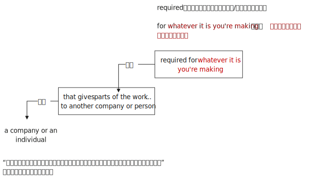
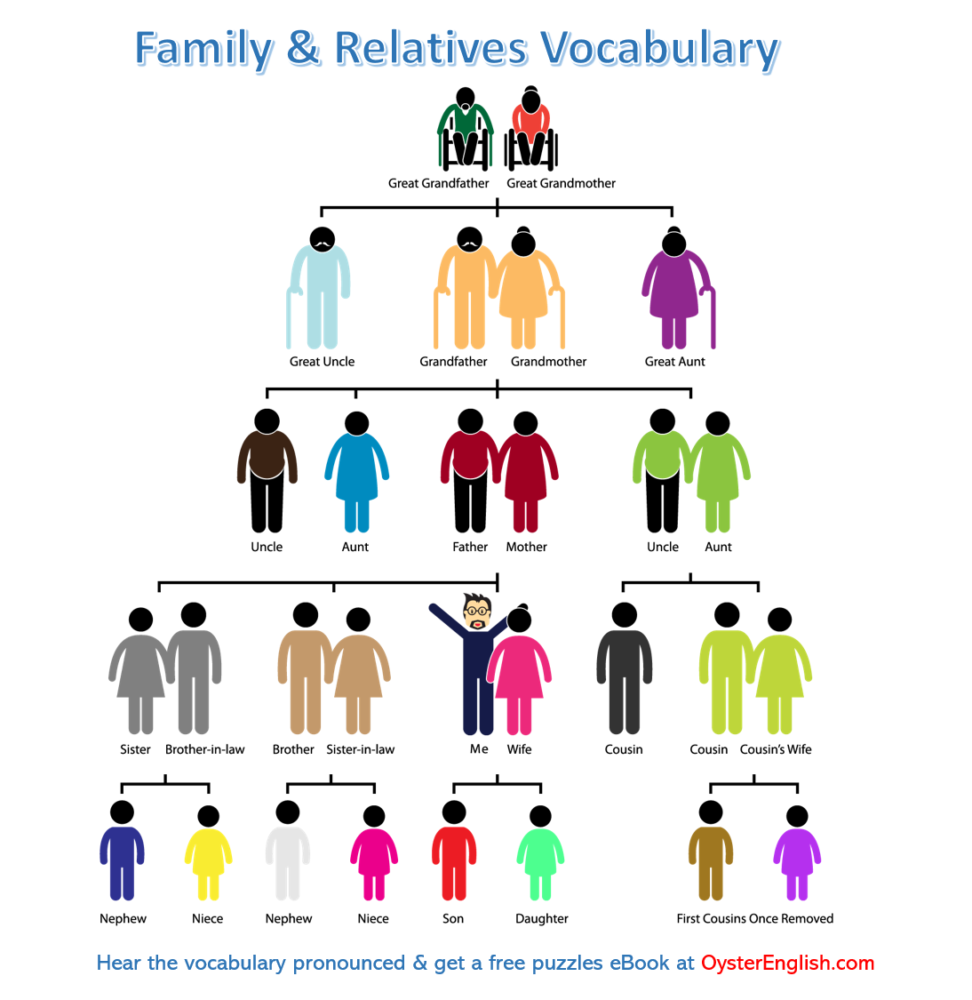
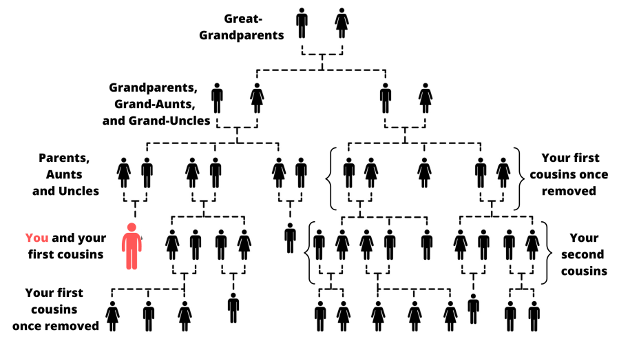

= Café number 001
:toc: left
:toclevels: 3
:sectnums:
:stylesheet: ../../../myAdocCss.css

'''

==  Café number 1.

This is _English as a Second Language_ Podcast’s English Café number 1.
I'm your host 主人；主持人, Dr. Jeff McQuillan, coming to you from _the Center for Educational Development_ 教育发展中心 in beautiful Los Angeles 洛杉矶, California 加利福尼亚州.

This is our first English Café episode. +
The format 格式；形式 of these episodes – the way we are going to do these episodes – is a little different. We’re not going to have a script 剧本 or a story or _a single dialogue_ 对话 to discuss, but instead, it's going to be more informal 非正式的. We are going to talk about American culture 文化. We're going to talk about American history 历史. We’re going to talk about movies 电影 and books 书籍 and music 音乐 – all sorts of things that are related to 与...相关 the United States.

We’re also going to be doing some different things. +
We are going to be answering your questions. We invite you *to email* (v.)发送电子邮件 your questions *to* us, and then we will answer them, at least some of them, here on the English Café.

On this Café, we’re going to talk about generations 世代 in the United States – how we describe people born (v.) during different time periods 时间段, especially in the last 100 years or so. We’re also going to talk about the idea of a “blockbuster  一鸣惊人的事物，（尤指）非常成功的书（或电影）;轰动一时的作品；大片,” especially a blockbuster movie – what that is /and what it involves 涉及. And, as always, we’ll answer some of your questions. Let's get started 开始.

[.my1]
.案例
====
- blockbuster -> block，大块。buster, 炸开，来自burst, 爆裂，字母r脱落。
====

Our first topic is going to be the names 后定 that we give different generations in the United States. +
I saw an article in _the Voice of America_ 美国之音 news channel a few years ago. The Voice of America, you may know, is a U.S. government-sponsored (v.赞助（活动、节目等）) 政府资助的 or U.S. government-supported news service 新闻机构. They have _news broadcasts_ 新闻广播. They actually have a very good section 部分 for people learning English. You might want to go to the Voice of America website and take a look at that.

`主` The title of this story I saw on the Voice of America website `谓` had the headline 标题 – which is what we call the title of an article, a “headline” – `主` “Aircraft Manufacturer 飞机制造商 `谓` Changing (v.) Design to Accommodate (v.)适应；容纳 Aging 老龄化的 Passengers 乘客.” This headline is actually a good introduction 介绍 to our topic of names given to generations.

First, let's explain the headline briefly. +
The headline was `主` “Aircraft Manufacturer `谓` Changing (v.) Design to Accommodate (v.) Aging Passengers.” “Aircraft 飞机” (aircraft) is what people fly in – airplanes, in other words. A “manufacturer 制造商” (manufacturer) is someone who makes or manufacturers something. So, an aircraft manufacturer would be a company that makes airplanes.

This story is about how these aircraft manufacturers are changing the designs of the airplanes to accommodate aging passengers. +
“Aging” (aging) means getting older. “To accommodate” here means to make room for or to provide enough space for someone. We also use this word “accommodate” /when we are talking about changing (v.) our plans /so that someone can participate in 参与 something, especially if the person has some sort of problem. We try to accommodate them. We try to find a way of solving the problem for them /so they can *participate in* whatever it is 后定 that we are doing. 所以他们可以参与我们正在做的任何事情.

Here, “accommodate” *refers to* 指的是 providing enough physical space for aging passengers. +
A “passenger” is a person who is riding in 乘坐 some sort of transportation 交通工具, some form of transportation such as a bus or a train or an airplane. The headline, then, says that these aircraft manufacturers are changing their planes *in order to* provide room and special services for aging passengers – for passengers who are getting older.

Now we come back to our main topic, which is generations 世代, and you'll see how this story *fits into* our larger topic. +
`主` The American population on average `谓` has been getting older in the last few years. There are more old people than there used to be. `主` The generation that is currently aging `系` is what *is called* the “baby boomer 婴儿潮一代” generation. The baby boomer generation was born (v.) between the years 1946 and 1964 – basically, those born (v.) after World War II *up through* 一直到……为止（包括这个时间点） the 1960s. We call that group of people _the “baby boomer” generation_.

Why “baby boomer”? +
Well, the term “boomer” (boomer) comes from a verb, “to boom (v.)激增；繁荣.” “To boom” means to increase (v.) suddenly, to increase rapidly. `主` #What happened# after World War II, when the American economy finally recovered from the economic problems before the war, `系` #was that# `主` people started having more babies. This *resulted in*, or this had the consequence of, increasing (v.) the population of the United States relatively quickly. #We call everyone# 后定 born (v.) in that generation, in that time, #“baby boomers.”#

The Census  (n.)（官方的）统计，人口普查 Bureau 人口普查局 – the department of the United States government that counts (v.) how many people are living in the United States – said that beginning in 2006, about 8,000 people _a day_ 每天 would turn 60. In other words, this generation is getting older, this baby boomer generation. And this, of course, has consequences 后果 for a lot of different things, including the design of airplanes.

If we call people 后定 born (v.)between 1946 and 1964 – people like me – “baby boomers,” what do we call people 后定 born after 1964? +
`主` The names that we give generations `谓` are sometimes invented 发明，创造 a few years after those people have been born. *That's what happened* for the generation after the baby boomer generation. `主` #People# born between 1965 and the early 1980s – say, 1982 or 1983 – `谓` #are usually called# “Generation X (X世代)” – the letter X. It's sort of a strange name. It actually comes from a popular novel that was published in 1991, called Generation X. The novel itself is about three teenagers living here in California. For whatever reason 无论出于何种原因, that term “Generation X” *was applied to* those who were born between 1964 and, say, the early 1980s.

Those born after 1983 are often called “Generation Y (Y世代).”​ +
Again, that's not a very original name, probably because Y comes after X in the alphabet. More recently 更近期地：, I think people have been calling (v.) `宾` those born after the early 1980s `宾补` the “Millennial generation 千禧一代.” “Millennial” comes from the word “millennium 千年” – *referring* 描述；涉及；与…相关, of course, *to* the new millennium in which we are now living. I'm not sure when we're going *to change* to a new name *for* the people born, say, *now and on into the future* (从现在起直到未来；从现在开始并持续进入未来) 我不确定我们什么时候会为那些比如说"现在起到未来出生的人"换一个新的名字。. That’s something impossible to predict 预测.

[.my1]
.案例
====
.这里的 “now and on into the future” 是一个地道的英语表达，意思是：
从现在起直到未来；从现在开始并持续进入未来

now：现在 +
on：这里是副词，表示“继续往前，延续” +
into the future：进入未来

所以 “now and on into the future” 可以理解为：
从现在开始, 并持续进入未来的一段时间
====

Just in case 万一,以防万一 you're interested, there are also names for the generations before 1946. +
Those born between, say, 1901 and the mid-1920s are sometimes called the “greatest generation 最伟大的一代.” They're called the “greatest generation” based on a book that was written _not too long ago_ by a journalist in the United States. The “greatest generation” was the generation, including my father's generation, who fought (v.)战斗；打架 in World War II. Because of their sacrifice 牺牲 – because of what they did for the United States – they are sometimes called the “greatest generation.”

`主` #Those# born between 1920 and the end of World War II, who were _for the most part_  在极大程度上，多半 too young to participate in World War II, `谓` #are sometimes called# the “silent generation 沉默的一代.”​ +
These are people who grew up during the Great Depression 大萧条 – the great economic problems that the United States and other countries experienced (v.) during the 1930s. They sometimes call his generation the “lucky few 幸运的少数.” “Lucky” because they were too young to *be sent off 被派往,寄出,派遣 to* war in World War II.

These generational terms 术语；措辞 *apply to* those people who were born in the United States. +
It's not a term that is used (v.) worldwide /or even in all English-speaking countries. These terms *refer to* people born in the U.S. in the last hundred years _or so_ 大约，左右.

[.my1]
.案例
====
后续世代的命名：​

- ​X世代(1965-1980年代初)：名称源自1991年小说《X世代》
- ​Y世代/千禧一代(1980年代初-2000年)：因跨入新千年得名
- ​最伟大的一代(1901-1920年代中期)：指经历二战的一代
- ​沉默的一代(1920-二战结束)：因在大萧条中成长得名

====

Our next topic is going to be “blockbuster (n.) movies 大片.”​ +
The word “blockbuster” (blockbuster) *refers to* 指的是 a movie, typically, that is very popular, a movie 后定 for which a lot of tickets are sold – basically, a movie that makes a lot of money. We sometimes use this term “blockbuster” to describe other artistic creations 艺术创作. We might *describe* a novel *as being* a “blockbuster,” 我们可以用“重磅炸弹”来形容一部小说， but usually the term is used to describe (v.) a movie that has been very successful.

[.my1]
.案例
====
.We might describe a novel as being a ‘blockbuster’.

这个句子里用了固定搭配结构：#describe + A + as being + B#

其中： +
A 是你描述的对象（a novel） +
B 是你给它的“身份”或“特征”（a blockbuster） +
**being 起连接作用，说明 A 的“状态”或“性质” **+

being 在这里是 "现在分词"，表示**“处于某种状态”，强调状态、性质的存在**。 +
用 being 是为了让句子更自然流畅地表达“*处于……状态*”的意思。

举个例子对比一下：

- describe him as a hero ✔️
→ *更强调“身份”*，他是个英雄。
- describe him as #*being*# brave ✔️
→ *更强调“状态”*，他很勇敢。

那能不能不用 being 呢？
可以的，*不加 being 也可以表达类似意思，但语气略有不同：*

- describe a novel as a blockbuster
→ 把小说说成是大片（更像“下定义”，直接说它是 blockbuster）
- describe a novel as *being* a blockbuster
→ 把小说说成处于那种很成功的**状态**（语气更生动、口语一点）
====

Now, there are a lot of movies that have made a lot of money in the United States and around the world. +
It's hard to give a list of the movies that have made the most money /because that list (n.) keeps changing (v.) every year.

One blockbuster movie that was popular a few years ago `谓` was called King Kong. +
I don't want to talk too much about the specifics 细节；特性；详情 of the movie, although 虽然，尽管 it is a very interesting American movie. I'm more interested in talking about how the movie was described, because it helps us understand a little bit about the elements that make up a blockbuster movie – the parts that are often found (v.) in very successful movies. I'll actually read a sentence that was used to describe (v.) King Kong when it was released 上映 in 2005.

The movie company *described* the movie *as being* “about a crew 全体工作人员 of explorers 探险家 and filmmakers 电影制作人 set out 出发 to investigate (v.)调查 the myths 神话 of the legendary 传奇的 creature 生物, King Kong.”​ +
The sentence begins by talking about a “crew 全体船员，全体机组人员；一组工作人员；一伙人，一帮人 (crew) of explorers.” The word “crew” is used here to describe a small group, usually a group of people who are working together. Nowadays 如今，现在, we often use “crew” to describe people who work (v.) on some sort of form of transportation 交通运输系统；运输工具, such as an airplane or a ship. We might talk about the “airplane crew 飞机机组人员,” being the people who are employees of the airline who fly (v.) the plane and who *take care of* the people inside the plane.

Here, it just *refers to* a small group of people who are trying to do something together, trying to work together. +
This is a “crew of explorers and filmmakers.” The word “explorer” (explorer) refers to someone who goes out and has adventures, but more importantly, goes out to try and discover something about a new place, a new area, somewhere where no one has gone before.

We can talk about the explorers from Europe who went out 出海 in their ships during the fifteenth and sixteenth centuries, going to new worlds like North and South America and Africa and Asia. +
Many blockbuster movies – successful blockbuster movies – have this idea of explorers. If you think of Star Wars, for example, or the Star Trek movies, these are about explorers going out to some new, exciting places.

The movie King Kong – the 2005 version of King Kong – was about “a crew of explorers and filmmakers.”​ +
“Filmmakers,” all one word, refers to people who, of course, make (v.) films. King Kong is a movie made by filmmakers about filmmakers. I guess everybody likes to talk about themselves, including people here in Hollywood.

The filmmakers in the movie “set out to investigate the myths of the legendary creature, King Kong.”​ +
“To set out” is a phrasal verb 短语动词 meaning to begin, to start – usually on a long journey or trip. Again, a long journey or a long trip is a very common theme in many movies. It's a way of connecting the movie and the characters.

In this movie, they “set out to investigate (v.) the myths of the legendary creature, King Kong.”​ +
A “myth” (myth) is basically a made-up 虚构的;捏造的；制成的；化妆过的 story, a false story that *may be* popular in a certain culture or popular in a certain group. You could think about the famous Greek myths and Roman myths from the ancient world. Myth is a very good source for stories, and a lot of movies are based on myths.

Nowadays, a lot of movies are based on things like video games, but #it# used to be 过去经常是 more common #that# we made movies based on things like myths.
*Closely related to 紧密相关 the idea of* myth, and also very popular in blockbuster movies, is the idea of a “legend 传说” (legend). When we say something is a “legend,” we are describing some event (n.) or some person who did great things. Sometimes `主` legends `系` aren’t all 100 percent true. Sometimes legends are stories about people who really lived 真实生活过的, but `主` some of the details of the story `系` may be exaggerated 夸大.

You may find things in legends that aren’t all 100 percent true.
The idea is that `主` legends `系` are about famous people in the past. The word “legendary,” then, would be about a person or an event that was part of a legend.

The movie King Kong, then, is an example of a blockbuster movie that contains (v.) some of the elements that you might find in a very popular movie, or at least in some popular movies – things like myths, legends, adventures, explorers, and that sort of thing.

Now let’s answer some of the questions that you have sent to us.
Our first question on the English Café is from Joao (Joao) from Brazil. Joao wants to know why sometimes we pronounce the letter A as “ay” /and sometimes we pronounce it as “ah.” Often, when a person is speaking slowly, like I do here on these episodes, we may pronounce words a little differently.

If I'm speaking very slowly, then I'm likely to say “a something,” such as “a book.”​
When I'm speaking more quickly, it might be something more like “a book.” “I read a book today.” There, you hear what we might call the short “a” pronunciation. Sometimes people use the pronunciation of the article “a” when *they're trying to indicate (v.)表明，标示 that* `主` there `系` was just one of something. 有时候，当人们试图表明只有一件事时，他们会使用冠词“a”的发音。 Someone may say to you, “I understand you read (v.) two books yesterday.” You might say, “No, I read ‘a’ book yesterday,” meaning (v.) I only read one book.

Since 因为，由于 we are just starting our Café series 因为我们才刚刚开始我们的咖啡英语系列, we don't have a lot of questions to answer in these early episodes.
I know we will have more in future ones. I'll talk about a few words that people have emailed me about in the past. I don't have specific 明确的，具体的 names and locations.

One of those words is “honeymoon 蜜月,度蜜月.”​
What is a honeymoon and why do we call it a honeymoon?” A “honeymoon” (honeymoon) is the period of time immediately after two people get married. The idea is that after you get married, then you go away and you have a little vacation. That vacation is often called a “honeymoon.” More generally, “honeymoon” refers to #the time# after marriage #when# everything is great, everything is pleasurable.

Why do we call it a “honeymoon?”​
“Honey 蜂蜜” is a sweet substance that bees make. Something, of course, that is `表` _sweet is pleasurable 快乐的；心情舒畅的；令人愉快的, is nice_, and the idea of “honeymoon” is `表` it's a nice period. The word “moon 月亮” in “honeymoon” is a little more interesting. “Moon” can refer to a month 月，月份 – that is, roughly the time between two full moons. We have another expression in English, “many moons ago 很久以前.” “Many moons ago” means many months ago, or a very long time ago. So, “moon” might represent (v.) just _those number of days_ between two full moons – less than a month, I guess. “月亮”可能只是代表两个满月之间的天数——我猜不到一个月。

That would be another possible explanation for “honeymoon.”​
`主` The pleasurable part of marriage `谓` only lasts `主`  about a month. So, you should really enjoy your honeymoon. You will hear the term “honeymoon” in other contexts  环境，上下文 /*to refer to* a period of good relations or positive activities 积极活动 /that happen after two companies or two groups of people /meet (v.) and start working with each other for the first time. It’*s* sometimes *referred to as* 被称为 the “honeymoon period 蜜月期.”

A common expression 常用表达 is “the honeymoon is over” or “the honeymoon period is over,” meaning (v.) `主` this initial time that _we got together_ and _everything was great_ – well, that's coming to an end.
Now we’re having problems. Just like in a marriage, the first few months may seem great, and then certain problems start to develop (v.) that you have to *deal with*, that you have to handle.

`主` Another word I sometimes have been asked about in email messages `系` is the word “outsource (n.v.)外包” (outsource).
The term “outsource” as a verb `谓` became popular especially in the 1980s and 1990s /*to refer to* a company or an individual 后定 that *#gives#* parts of the work 后定 required for _whatever it is 不管是什么 you're making_ *#to#* another company or another person, often someone even in another country. 一个公司或个人把你所做的部分工作, 交给另一个公司或另一个人，通常是另一个国家的人。 The idea behind “outsourcing” is that /`主`  there `系` are certain things 后定 *that are #either# cheaper #or# easier* to get done /outside of your own company.

[.my1]
.案例
====
.a company or an individual that gives parts of the work required for whatever it is you're making to another company or another person.

====

So, instead of hiring (v.) someone to work for your company full-time – all the time – you hire (v.) another person or another company to do part of the work for you.
“Outsourcing,” especially now _in the age of_ the Internet, has become much, much easier to do. “Outsourcing” doesn't necessarily *refer to* going to another country, however. It could also *be referred to as* 被称为 simply *getting* another person or another company *to do* part of the work that your company would normally do (v.) or might do /*in order to* produce your product or service.

Finally, I want to talk about another famous expression in English that has its origins (n.)起源 in a way 在某种程度上 here in Los Angeles, in Hollywood. 我想谈谈另一个著名的英语表达，它起源于洛杉矶，好莱坞。
That expression is “*cut to the chase* (追赶，追逐；争取) 直奔主题,切入正题.” “Cut to the chase” (chase) means usually *get to the point* 直奔主题, get on with it 继续下去, get to 到达，抵达 what you really want to tell me. When somebody is giving you an explanation 解释，说明 of something, for example, and they seem to be giving you a lot of details that aren’t really necessary for you to understand the situation, and perhaps you don't have a lot of time to sit and listen to them, you might say to them, “Cut to the chase.”

Now, I have to say that this is something you would only say (v.) *either* to someone _who works for you_ – one of your employees – *or* someone who is of a lower status or position than you.
You might also be able to say this among friends /when you want your friend to hurry up and give you the main part of the information 后定 they're trying to convey (v.)传送，运输；表达，传递 or to give to you.

Where does this expression “cut to the chase” come from?
The most likely explanation is that /in ​action movies, usually towards the end of the movie, there is a ​chase scene 追逐的场景 where typically one car is chasing (v.)追赶 another. ​​“To chase” (chase) is a verb meaning (v.)​to go after 追求、追逐、追捕, to try to catch – especially someone who is trying to escape, *to get away 逃离,摆脱 from* you. So, action movies are most exciting toward the end /when you have the chase scenes. ​​“Cut to the chase”​ would mean (v.)​get to _the exciting part_ of the movie, and that's really, I think, the origin of this very interesting expression, ​​“to cut to the chase.”​

If you have a question or comment, you can email us.
Our email address is ​eslpod@eslpod.com.

From Los Angeles, California, I'm Jeff McQuillan. Thanks for listening. Come back and listen to us again right here on the English Café. +
ESL Podcast’s English Café was written and produced by Dr. Jeff McQuillan and Dr. Lucy Tse. Copyright 2006 by the Center for Educational Development.

'''

== What Insiders 内部人员 Know (v.)

My Great-Great-Great-Great Grandfather

It’s easy to know what to call your “immediate family 直系亲属” 知道怎么称呼你的“直系亲属”很容易 (family *closely related to* 紧密相关 you, such as father, mother, and sister/brother) and even “extended family 大家庭 (family not as closely related, such as uncles/aunts, cousins, and grandparents). But what do you call your “ancestors” (family members who lived many years before you were born)?

_The father of your father_ is your grandfather. Logically, you would think that your _grandfather’s father_ 祖父的父亲 would be your “grand-grandfather,” but that is not what Americans would say. Instead, after your grandfather, you add the word “great,” so my _grandfather’s father_ is your great-grandfather 曾祖父. What do we call your _great-grandfather’s father_ 曾祖父的父亲? He is your _great-great-grandfather_ 高曾祖父. You continue to add “great” for every additional generation 额外的一代 you want, so you could talk about your great-great-great-great-great-great-grandfather (or grandmother, of course).

A similar system is used (v.) in talking about your children and your children’s children. Your _child’s child_ is called your grandchild 孙子；孙女；外孙；外孙女, and his child would be your great-grandchild 曾孙女，曾孙, and so forth 等等，诸如此类. If you have a _niece_ (your brother’s or sister’s daughter) or _nephew_ (your brother’s or sister’s son), what do I call them? Here _things get a little confusing_, because it is possible to call them your grandnieces and grandnephews, or your great-nieces and great-nephews. They would call your their great-uncle or granduncle. Great-uncle and great-aunt are much more popular, however, at least in the U.S. After this, you keep adding “greats” as you do with grandparents.

In summary 总之,概括地说,总的来说, if you are talking about your parent’s parents, you start with “grand” and then add “great(s).” If you are talking about uncles, aunts, nieces, and nephews, then you can *either* start with “great” *or* use “grand” as you do with grandmother/grandfather.

'''

