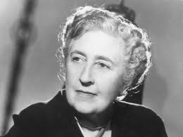
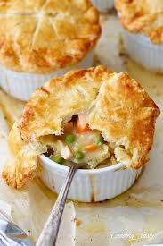

= cafe 002
:toc: left
:toclevels: 3
:sectnums:
:stylesheet: ../../../myAdocCss.css

'''

== Café number 2.

This is _English as a Second Language_ Podcast’s English Café episode 2.
I'm your host, Dr. Jeff McQuillan, coming to you from the Center for Educational Development 教育发展中心 in beautiful Los Angeles 洛杉矶, California 加利福尼亚州.

In this Café, we’re going to talk a little bit about things that Americans want to change about themselves, what we might call “resolutions 决心；决定” to change.
We’re also going to talk about “best sellers 畅销书.” What kind of books are popular in the United States? And, as always, we’ll answer a few of your questions. Let's get started 开始.

Our first topic on this Café is things 后定 that Americans want to change about themselves.
There are for all of us, I suppose 推断，料想，猜想, things that we want to change, things that we want to do differently (ad.), ways that we want to improve ourselves 提升自我. Americans are famous for _what are called “self-help 自助的 books_ – books about how they can get better, how they can improve.

One popular tradition in the U.S. and in other countries is the New Year's resolution 新年决心.
A “New Year's resolution” is when you think about what you want to change and you promise (v.)承诺，保证 yourself – you vow 发誓 – that you are going to change. The word “resolution” just means (v.) a promise to change something about yourself or about some situation.

Americans make these resolutions usually at the first of the year, during January, since *it seems like* a good time to try to do something new, do something different.
There are often #newspaper articles# during the first week of January #about# these New Year's resolutions that people have. 在一月的第一周，报纸上经常会有关于人们新年决心的文章。 Many newspapers *take (v.) polls* (民意调查) 进行民意调查; they ask people what they *think of* a certain topic.

In these particular polls 民意调查；投票 about New Year's resolutions, we find out what Americans are vowing or promising (v.) to change about themselves.
Some of the more popular New Year's resolutions include (v.) the vow 誓约，诺言 or resolution to spend more time with your loved ones 亲人. Americans often say, “I want to spend more time with my loved ones 挚爱的亲人.” Your “loved ones” are the people you care about: your brother, your sister, your parents, your wife, your husband, your girlfriend, your dog. Well, maybe not your dog. People that you like – these would be your loved ones.

Another popular resolution that Americans have, and that appears in these polls, is “to be fit (a.)健康的，健壮的.”​
“To be fit” (fit) means to be healthy – for your body to be in good condition. Usually, this means you have to exercise. You have to do some _physical activities_ 体育活动 such as walking or jogging 慢跑锻炼 or running or going to the gym 健身房.

Many Americans celebrate (v.) the holiday season at the end of the year in December, and in doing so 在这样做的过程中, they eat a little too much food.
So, in January they decide they're going to lose some weight 减肥. They're going to try to be fit (a.). They want to be in “good shape 健康状态,” we might say. The expression “to be in good shape” (shape) just means to be healthy.

Another common resolution that I just referred to – related to this idea of being healthy – is losing weight.
Many Americans, more and more each year, are becoming overweight (a.)超重的. “To be overweight” means to weigh too much, more than what you should. Probably `主` eating all of those McDonald’s hamburgers `谓` doesn't help Americans to “keep their weight down 控制体重,” we might say. “To keep your weight down” is `表` not to get too fat, not `表` to get overweight.

So, according to at least some polls, some surveys 调查, these are the three areas Americans want to change (v.) about themselves.
They want to spend more time with their loved ones, they want to be fit, and they want to lose weight. `主` Spending time with your loved ones `谓` *requires* (v.), of course, *that* you're not busy doing 忙于做某事 other things. That's one thing that many Americans say they do: they get busy with 忙于某事 other things and therefore don't have time to spend with their loved ones.

#It# also helps #to be# close physically (ad.)身体上，肉体上 to your loved ones. 身体上接近你所爱的人也会有所帮助。
I, for example, live (v.) in Los Angeles. My loved ones, at least my family, live (v.) mostly in Minnesota, so it's a little more difficult for me to do that.

Our next topic is “best sellers 畅销产品.”​
The term “best seller” means literally 按照字面意义地 something that sells (v.) the best, something that sells the most. When we say “best” here, we mean better than any other book.

The whole concept of the best seller, at least in the United States, is quite interesting.
During the late nineteenth century, there was an American magazine that published (v.) #stories and articles# about books #called# The Bookman (Bookman) 有一本美国杂志发表关于书籍的故事和文章，叫做《书人》. The Bookman magazine was one of the first publications in the United States to run 发布 _best seller lists_ 畅销书名单,排行榜.

​“To run (v.)” here means (v.) to publish, to put into the magazine, a list of the best-selling books.
This was back in 1895, so towards the end of the nineteenth century. `主` What the magazine did `系` was to go around 四处走动，到处去 to different bookstores in the country /and find out how many books were being sold for a number of different categories 类别.

`主` These _reports (n.) of sales_ 销售报告 `谓` then were put together, or “*compiled* 汇编” (compiled), *into* a list of the best-selling books.
After The Bookman magazine started to publish (v.) its list of best sellers, other publications decided to do the same thing. The most common ones were – and are – _Publishers Weekly_ 出版人周刊 and The New York Times. 最常见的是《出版人周刊》和《纽约时报》。

The New York Times, in particular, is famous for its _best seller list_.
Nowadays, there are other places where people look to find out what the best sellers are. The website Amazon.com also lists (v.) the books that are most popular, that are most sold on their website.

The New York Times list, however, is the one that most people are familiar with here in the United States.
Soon after The Bookman magazine started (v.) publishing its best seller lists, the idea of _a best seller list_ became popular in other countries as well. In England, for example, _The Sunday Times_ 星期日泰晤士报 of London also started to publish (v.) a best seller list, and still does today.

These lists are obviously important for publishers and people who sell books.
You want to know which books are popular /so you can have #more books#, perhaps, #about# that topic /or #from# that particular writer 作家，作者.

[.my2]
你想知道哪些书受欢迎，这样你就可以有更多关于那个主题，或者来自那个特定作家的书。

[.my1]
.案例
====
more books about that topic +
more books from that particular writer

注意这并不是“about or from”，而是： +
about [that topic] +
from [that particular writer] +
两个介词短语并列修饰 books，表达“更多书的两个来源/主题”。
====

However, there has been #this idea# 这种想法一直存在, at least among certain critics (评论家；批评者) 至少在某些批评者中是这样 – certain people who write (v.) professionally about books – #that# a best seller is a book that doesn't necessarily have (v.) very high literary merit (优秀品质，价值；优点，长处) 文学价值.
“Merit” (merit) here means quality. “Literary” means (v.) well written – good literature 文学，文学作品. The idea is that /if a book is really popular, it can't be very good, because most people won't buy (v.) really well-written books.

I'm not saying _that's true_. I'm saying that /_this is something_ that `主` some professional critics, some writers in magazines and newspapers, `谓` have said about these best sellers 后定 that appear (v.) on lists *in places* like The New York Times and, nowadays, Amazon.com.

`主` One #genre  体裁，类型 or category# of books, that has been popular on _best seller lists_ here in the U.S. `系` #is# that of the thriller 惊悚小说.
A “thriller （尤指关于罪案或间谍的）惊险小说” (thriller) is usually a work 作品，著作 of fiction 小说；虚构的事 – a fictional story about something that is very exciting. There's a lot of action. In a thriller, the story moves very quickly.

Mysteries 悬疑小说 are also very popular on _best seller lists_ and have been for many years in the United States.
“Mysteries” are almost always about someone being murdered, someone being killed. One of the most famous writers in English of mysteries, who is still popular today, would be _Agatha Christie_ 阿加莎·克里斯蒂（侦探小说家）, the British author whose works (n.), whose books, have been translated (v.) into many different languages.

[.my1]
.案例
====
- Agatha Christie +

====

Thrillers and mysteries are probably popular in many different countries, but there are some other kinds of books that have traditionally been very popular in the United States that you might not *think of* when you first think about best sellers.
The first *in terms of* 就……而言；从……角度来看 number of books sold 书籍销量 would be “religious 宗教的” /and what *are sometimes called* “inspirational  启发灵感的，鼓舞人心的;励志的” books. These are books that are supposed to help (v.) you with your life, make you feel better.

Religious books 宗教书籍, obviously, are related to some sort of belief in God.
It might be the Christian religion 基督教. It might be another religion 宗教信仰；宗教，教派. Christianity 基督教 is the most popular religion in the United States, and so there are a lot of books that are published in this genre 体裁，类型 – in this area.

The all-time 空前的；全部时间的；历来的 best seller – that is, the best-selling book of all time – in English would definitely be the Bible, the Christian Bible.
In the United States in the first half of the twentieth century – from 1900 to about 1950 – `主` the only book in English *that came even close to* 甚至接近 the number of sales of the Bible `系` was, interestingly enough 有趣的是, a novel that became one of the most famous movies of the twentieth century, Gone With the Wind, a historical novel that is set in or *takes place* 发生,举行 in the South during the American Civil War and the years after the war.

[.my1]
.案例
====
.Gone With the Wind
《飘》（英语：Gone with the Wind）是一部出版于1936年的美国小说，作者为玛格丽特·米切尔，在1937年获得普利策奖。由这部小说所改编的电影有《乱世佳人》.

此书名取自欧内斯特·道森的诗《希娜拉——我已不是希娜拉主宰下的我》第三段第一句 : “希娜拉！我忘了多少风流云散的事情，”（原文：I have forgot much, Cynara! *gone with the wind* ）.
====

During the twentieth century, there were other books that had religious themes that were extremely popular.
There was one book called _The Robe_ 袍服，礼袍；睡袍，浴衣 by Lloyd Douglas, another called The Cardinal 红衣主教, published in 1950, by Henry Morton Robinson. Both of these books had religious themes and, like many books with religious themes, were best sellers.

`主` #Another category 种类，范畴 of books# that have traditionally been popular in the United States, *from* the beginning of the _best seller lists_ of the nineteenth century *right on up to* 一直到……为止 the twenty-first century, `系` #are# what *are called* “self-help” or “self-improvement” books – books that sometimes combine (v.) the idea of bettering (v.)改善，提高,使变得更好 yourself, of doing better in life, with religious ideas.
There was #a book# 后定① popular (a.) a few years ago 后定② #called# _The Purpose 目的，意图；目标，计划 Driven (v.) Life_, by Rick Warren. Even before that 甚至在那之前, however, there were other books – self-help books – that tried to teach (v.) people how to live (v.) a better life.

One of the most famous of the authors in this genre was a man by the name of Dale Carnegie 戴尔·卡耐基 (Carnegie).
His most popular book was called _How to Win (v.) Friends and Influence (v.) People_, written back in 1937. Later, other self-help books became popular in the U.S. _Dr. Benjamin Spock_ wrote (v.) a book – several books, I believe – on childcare 儿童保育；儿童照管, on *taking care of* your baby.

One of his most popular ones was published (v.) right after World War II, in 1946, when Americans were starting to have a lot of babies.
“Cookbooks 烹饪书” are not self-help books, *per se* 本身，本质上.  They're not about making a better you, but making a better chicken _pot pie_ 馅饼, perhaps.

[.my1]
.案例
====
.per se
(ad.)
used meaning ‘#by itself#’ to show that you are referring to sth on its own, rather than in connection with other things本身；本质上 +
•The drug is not harmful *per se*, but is dangerous when taken with alcohol.这种药本身无害，但与酒同服就危险了。

.pot pie
馅饼：一种非常小的馅饼，其外壳完全由酥皮制成，并在自己的馅饼盘中烘烤，通常只供一人食用。 +

====

`主` These three categories of _religious books_, _self-help books_, and _cookbooks_ 食谱；烹饪书 `系` are very important /when it comes to 就……而言,及,当提到,一谈到 the number of books 说到书的数量 that are sold in the United States, even though we might not *think of* them traditionally *as* being _best sellers_.
They are, in fact, some of the best-selling books in the U.S. book market.

In the late 1930s, many publishing companies started to produce (v.) cheap _paperback books_ 平装书, what sometimes were called “mass-produced paperbacks 批量生产的平装书.”​
“Mass” just means a large number, and “produced” means made. So, there were a large number of these books being made, these “paperback” books.

As a result of this, `主` some of the folks who were making _the best seller lists_ `谓` decided to divide (v.) books by type, by physical type 物理类型.
So, you had a _best seller list_ for paperbacks /and you had a _best seller list_ for hardbacks 精装书. This started sometime in the mid 1970s.

In addition, you also had lists that *were broken down* or divided into different categories, such as the categories I've mentioned.
There are other categories as well: “fiction 小说” books (versus “nonfiction 非小说” books), “children's books” (versus books for adults).

`主` The most recent change in best sellers and best seller lists `系` would be _the arrival 到达，到来,出现 of_, and _popularity (n.)流行，普及，受欢迎 of_, e-books 电子书 – electronic books that you can read (v.) on your tablet, on your computer, on your phone, and so forth 等等，诸如此类.
They became *so* popular *that* in 2011, The New York Times introduced, or decided to publish (v.), a separate (a.)单独的，分开的；不同的 list of popular e-books *in addition to* 除了……之外 the paperback and hardback 精装本；[图情] 硬封面的书 categories that it had always published.

They began reporting (v.), in fact, the best sellers from 20 different categories, such as “e-book fiction” and “combined  联合的，共同的 print” – that is, paper and e-book nonfiction.
There are lots of these different kinds of categories that you can now find (v.) in _best seller lists_ with Amazon.com.

The situation gets even more complicated /because there are _dozens 许多 and dozens of_ 很多很多 different categories on Amazon.com.
Each one has sort 分类，排序 of their own best seller list. So, you could be a _best seller_ 卖方，销售者 in an area 后定 where `主` the total number of books `系` isn't very large, but if you sell (v.) more *than* anyone else in your category *as defined by* Amazon.com 正如亚马逊所定义的那样, 按照亚马逊的定义, then you become an Amazon best seller.

[.my2]
每家公司都有自己的畅销书排行榜。所以，你可能在一个图书总量不是很大的地区成为畅销书作家，但如果你在亚马逊定义的同一类别中比任何人都卖得多，那么你就成为了亚马逊畅销书作家。

[.my1]
.案例
====
- ...in your category *as defined by* Amazon.com...
也就是说，并不是你自己说“我属于这个类别”，而是亚马逊划分的分类标准来决定你在哪一类。
====

The word “best seller” is important for people who write (v.) and publish books /because people want to read (v.) what other people are reading.
So, if someone says, “This is a best seller,” you think, “Oh. Well, maybe I should read it.”

Now let's answer (v.) some of the questions that you have sent to us.
Our first question comes from Ahad (Ahad) in Ontario, Canada. The question *has to do with* 与……有关，与……相关 an expression that he heard: “Oh, my goodness.”

​“Oh (oh), my goodness 我的天啊” is a way of expressing (v.) surprise (n.) at something that has happened, usually _something bad_ that has happened, although it *could* sometimes *be* something good.
If _your wife_ says to you, “I had a car accident,” you might say, “Oh, my goodness.” It's a polite, somewhat _informal way_ of expressing surprise.

Of course, if your wife tells you that /she crashed the car – that she was in an accident with the car – you might say something other than “Oh, my goodness.”​
You might use what we would call a “swear 咒骂” word. The verb “to swear” (swear) means to use a bad word. I won't use any of them here. You probably know many of them already in English.

Usually the bad words are the words that you learn first in another language, and if you watch American movies, you will certainly hear lots of different swear words.
It has become more popular, especially in recent years, for people to say “Oh, my God” (G od). However, you have to be careful about that expression. There are people who have religious beliefs who would not like you using an expression such as that.

I think it's best to use something a little safer, such as, “Oh, my goodness 天哪，啊呀（用作“上帝”的替代语，表示吃惊或愤怒等）.”​ +

Our next question comes from Gerhard in Germany. Gerhard wants to know the meaning of the expression “*against all odds* (（事物发生的）可能性，机会；困难，不利条件；投注赔率；（力量、权力或资源上的）优势) 尽管情况不利，仍然能够克服困难取得成功.”

​“Against all odds” (odds) means that you were able to do something – to complete or finish something or accomplish (v.) something – that was very difficult, that perhaps you didn't think you could do.
It's usually something that most people think you won't be able to do because it's so difficult to do it.

So, let's say /it's snowing outside, and the wind is blowing very hard, and there is five feet 英尺 of snow on the ground.
You decide to go running 去跑步 outside. Well, that would be very difficult, but if you go outside and actually tried to do it, you might be able to run a few feet, maybe more.

If you are able to run like you would normally run, that would definitely be something that would be *against all odds*.
There would be a great number of difficulties in trying to do what you are trying to do.

`主` Another question that I got recently `谓` *had to do with* 与……有关，与……有联系 the use of the word “dead” /and the fact that there were #several different expressions# in English with “dead” 后定 #that# didn't seem to make a lot of sense.

[.my2]
我最近遇到的另一个问题与“dead”这个词的用法有关，事实上，英语中有几种不同的表达方式与“dead”有关，这些表达方式似乎都没有多大意义。

I want to talk about a couple of those. +
​“To be dead” means that you no longer are living.
If you are dead, you're probably not listening to this episode, for example. “Dead,” then, means without life, and there are a couple of terms in English where that notion of completion 完成，结束, of death, is _more or less_ logically connected.

For example, we talk about “dead languages 死语言.”​
A “dead language” is a language that no one speaks (v.) anymore. Often, it'*s defined as* a language that doesn't have any native speakers – people 后定 who grow up speaking that language 说着那种语言长大的人.

As far as 在……范围内, 就...而言 European languages – that is, talking about European languages – `主` Latin and ancient Greek `谓` would certainly nowadays *be considered* “dead languages.”​
*That doesn't mean that* no one learns (v.) those languages, obviously. *Both* ancient Greek *and* especially Latin are still being studied. I studied Latin. I tried to study a little ancient Greek. It was a little difficult for me. But those would be “dead languages.”

`主` Another more or less logical use (n.) of “dead” in a term `系` would be “dead weight 累赘;(难以提举的)重荷” (weight).
The term “dead weight” describes (v.) a person who doesn't help very much, a person who, instead of helping you accomplish (v.) a task, has to be helped or himself, or herself. So, if you describe someone as “dead weight,” you mean he’s not helping at all.

Two other uses of “dead” are a little different from “dead language” and “dead weight.”​
The term “dead tired 累死了,非常疲倦的” is quite common 相当普遍 in American English. If you say, “I'm _dead tired_,” you mean you are very, very, very tired. You are completely tired.

Here, “dead” is still sort of related to the idea of death, and that is _to be dead_.
So that sense of “absolutely, completely” is what is being used here when we use an expression such as “dead tired” – I'm completely tired.

Similarly, you may say that someone is “dead (ad.)完全地，全然地 right 完全正确” (right).
To say someone is “dead right” means they are absolutely right. They are absolutely correct.

​“Dead serious 极其严肃” is another _common term_ which means, once again, you are very serious.
You are extremely serious.

Finally, if you spend too much money, you may *end up* 最终成为 “dead broke 身无分文” (broke).
“To be broke (a.)<非正式>身无分文的，一文不名的” means not to have any money. I hope that you are not _dead broke_ or _dead tired_.

Email us if you have a question or comment. Our email address is eslpod@eslpod.com. From Los Angeles, California, I'm Jeff McQuillan. Thank you for listening. Come back and listen to us again right here on the English Café. ESL Podcast’s English Café was written and produced by Dr. Jeff McQuillan and Dr. Lucy Tse. Copyright 2006 by the Center for Educational Development.

What Insiders Know

The "Good Reads" Program
One of the biggest "challenges 挑战" (difficulties) for adults who want to improve their reading in another language is finding books at a low level, but that are still interesting.

Reading children and teen books that are at the right level, but that are about animals, school, or teenage problems, might not "hold their interest 保持兴趣" (keep their attention).
There is now a "relatively 相对地" (fairly) new effort to provide adults with the right reading material.

The program is called Good Reads and it is a program by a Canadian "non-profit 非营利的" (not intended to make money) organization called ABC Life Literacy Canada.
The purpose of the program is to help adults become more "literate 有读写能力的" (able to read and write).

It's not "targeting 专门针对" (made especially for) people learning English, but the books are at lower levels and are written about adult "themes 主题" (subjects; topics) – exactly what English learners need.
In this program, Canadian authors who write popular adult novels are asked to write short stories or short novels at a lower language level.

According to their website, all of the stories/novels meet these "criteria 标准" (requirements):

- Short: Less than 100 pages.
- Enjoyable: Stories you can't "put down 放下/爱不释手" (leave).
- Easy reading: Written in clear language.
- For adult learners: For people improving their reading skills.
- Canadian: By Canada's best authors.

At ESL Podcast, we don't typically mention programs outside of the U.S.
However, this seems like a very good resource for our listeners and we're including it here.

While there are some differences between Canadian and American English, the differences are very small, but of course not so small that Americans "forgo 放弃" (pass without doing something) making fun of Canadians, and "vice versa 反之亦然" (the other way around)!
But, "truth be told 说实话" (being honest), there really are very few and very minor differences.

If you'd like to learn more about the books available through this program, search on the Internet for "Good Reads."

