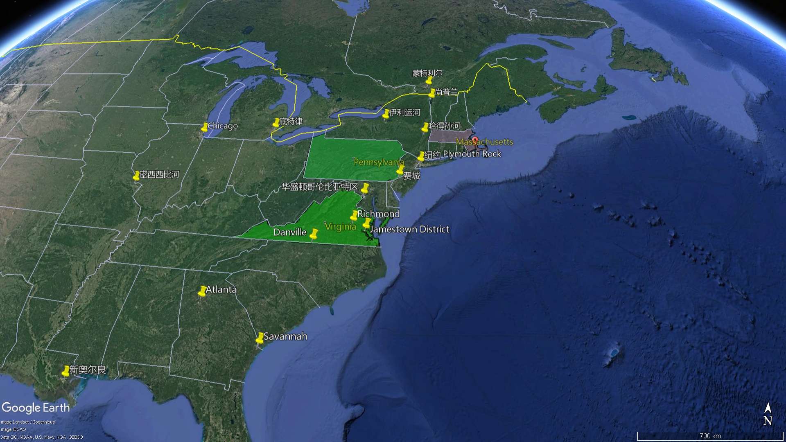

= 003 美国人民终于决定从英国独立
:toc: left
:toclevels: 3
:sectnums:
:stylesheet: myAdocCss.css

'''

== (解说) 美国人民终于决定从英国独立

`主` The distance 后定 British colonists enjoyed (v.)享有；享受 from their kings `谓` made _direct rule_ 直接统治 nearly impossible.  +
The Virginia House of Burgesses was the first representative assembly 立法机构；会议；议会 in the Western Hemisphere.  +

The Pilgrims committed themselves to self rule in the form of the Mayflower Compact before they had ever set foot on the new continent.  +
Town meetings were quickly the norm 常态；正常行为;规范；行为标准 throughout New England.  +

_The Quaker faith_ made equality (n.)平等；均等；相等  `宾补` a practice in the community and the meetinghouse 教会,礼拜堂 throughout the Middle Colonies.  +
All these important steps toward independence were already realized (v.)实现；将…变为现实 by the American colonists before 1700.  +

`主` Events in the early part of the eighteenth century `谓` made independence from Britain even more inevitable.

[.my2]
英国殖民者与国王的距离, 使得直接统治几乎不可能。弗吉尼亚众议院, 是西半球第一个代表大会。清教徒们在踏上新大陆之前, 就以《五月花号公约》的形式, 承诺实行自治。城镇会议, 很快就成为整个新英格兰的常态。贵格会信仰使平等, 成为整个中部殖民地社区和教堂的一种实践。所有这些迈向独立的重要步骤, 在1700年之前, 就已经被美国殖民者实现了。18世纪初期的事件, 使得脱离英国的独立变得更加不可避免。

Many events transpired (v.)发生 between the years of 1763 and 1776 that served as short-term causes 原因；起因 of the Revolution.  +
But the roots had already been firmly planted. In many ways, the American Revolution had been completed before any of the actual fighting began.

[.my2]
1763 年至 1776 年间发生的许多事件, 都是革命的短期原因。但根已经扎得很牢了。从很多方面来说，美国革命在任何实际战斗开始之前, 就已经完成了。

[.my1]
.案例
====
.transpire
[ V] to happen 发生 +
- You're meeting him tomorrow? Let me know what transpires. 你明天和他见面吗？把见面的情况告诉我。 +
-> trans-横过,越过(s略) + -spir-呼吸 + -e
====

New ideas shaped (v.) political attitudes as well.  +
John Locke defended (v.)辩护 _the displacement 被迫迁徙，流亡；取代 of a monarch_ 君主；帝王 who would not protect (v.) _the lives  生命（life的复数）, liberties, and property of the English people_.  +

JEAN-JACQUES ROUSSEAU 卢梭 stated that /society should be ruled by the "general will" 公意,公共意志  of the people.  +
BARON DE MONTESQUIEU 孟德斯鸠 declared that power should not be concentrated in the hands of any one individual.  He recommended separating (v.) power among executive (a.), legislative (a.), judicial branches of government.  +

American intellectuals 知识分子 began to absorb these ideas.  +
The delegates 代表 who declared independence from Britain `谓` used many of these arguments.  +

The entire opening of _the Declaration of Independence_ 独立宣言 is Thomas Jefferson's application （尤指理论、发现等的）应用，运用 of John Locke's ideas.  +
`主` The constitutions of our first states and the UNITED STATES CONSTITUTION `谓` reflect Enlightenment 启蒙运动 principles.  +

The writings of Benjamin Franklin made many Enlightenment ideas accessible to the general public.

[.my2]
新思想也塑造了政治态度。约翰·洛克为一位不愿保护英国人民的生命、自由和财产的君主的流亡辩护。让-雅克·卢梭指出，社会应该由人民的“公意”来统治。孟德斯鸠男爵宣称, 权力不应集中在任何个人手中。他建议将政府行政、立法、司法部门的权力分开。美国知识分子开始吸收这些思想。宣布脱离英国独立的代表们, 使用了许多这样的论点。 《独立宣言》的整个开头, 就是托马斯·杰斐逊对约翰·洛克思想的应用。我们最早的州的宪法, 和美国宪法, 反映了启蒙运动的原则。本杰明·富兰克林的著作, 使许多启蒙思想为公众所接受。

The old way of life was represented 作为…的象征；象征；代表 by superstition 迷信；迷信观念（或思想）, an angry God, and absolute submission to authority 当权（地位）,当权者. +
 The thinkers of the Age of Reason 理性时代 *ushered 把…引往；引导；引领 in* 开创；开始；开启 a new way of thinking. +

This new way championed (v.)为…而斗争；捍卫；声援 the accomplishments 成就；成绩 of humankind. +
 Individuals did not have to accept despair 绝望. +

Science and reason could bring happiness and progress. +
 Kings did not rule by divine (a.)天赐的；上帝的；神的 right. +

They had an obligation 义务；职责；责任 to their subjects （尤指君主制国家的）国民，臣民. +
 Europeans pondered (v.)沉思；考虑；琢磨 the implications 可能的影响（或作用、结果）;含意；暗指 for nearly a century. +
 Americans put them into practice first. +

[.my2]
旧的生活方式以"迷信"、"愤怒的上帝"和"绝对服从权威"为代表。理性时代的思想家, 开创了一种新的思维方式。这种新方式捍卫了人类的成就。个人不必接受绝望。科学和理性可以带来幸福和进步。国王并不以神权来统治。他们对自己的臣民负有义务。欧洲人思考了近一个世纪的影响。美国人首先将其付诸实践。

[.my1]
.案例
====
.usher sth in
( formal ) to be the beginning of sth new or to make sth new begin 开创；开始；开启 +
- The change of management ushered in fresh ideas and policies.更换领导班子带来了新思想和新政策。
====

No democracy 民主政体；民主制度 has existed in the modern world without the existence of a FREE PRESS 新闻自由. +
 Newspapers and pamphlets  小册子 allow (v.)使可能 for the exchange of ideas and for the voicing of dissent (n.)（与官方的）不同意见，异议. +
 When a corrupt government holds power, the press becomes a critical weapon. +

It organizes (v.) opposition （强烈的）反对，反抗，对抗; 反对党 and can help _revolutionary ideas_ spread. +
 The trial （法院的）审讯，审理，审判 of JOHN PETER ZENGER, a New York printer, was an important step toward this most precious freedom for American colonists. +

[.my2]
如果没有新闻自由，现代世界就不存在民主。报纸和小册子允许交流思想和表达异议。当腐败的政府掌权时，媒体就成为关键武器。它组织反对派，可以帮助革命思想传播。对纽约印刷商约翰·彼得·曾格 (JOHN PETER ZENGER) 的审判, 是美国殖民者走向这一最宝贵自由的重要一步。

The British had an empire to run. +
 The prevailing 普遍的；盛行的；流行的 economic philosophy 哲学体系；思想体系 of seventeenth and eighteenth century empires was called MERCANTILISM 重商主义，商业本位（认为商业可增加财富）. +

In this system, the colonies existed to enrich (v.) the mother country. +
Restrictions 限制规定；限制法规 were placed on _what 后定 the colonies could manufacture_ (v.)大量生产，成批制造, whose ships they could use, and most importantly, with whom they could trade. +

British merchants wanted American colonists to buy British goods, not French, Spanish, or Dutch products. +
 In theory, Americans would pay DUTIES 关税 on imported goods to discourage (v.)阻拦；阻止；劝阻 this practice. +

The NAVIGATION 航行 ACTS and the MOLASSES 糖蜜，糖浆 ACT are examples of royal attempts (n.) to restrict (v.) colonial trade. +
 SMUGGLING 走私（罪） is the way the colonists ignored these restrictions. +

[.my2]
英国人要经营一个帝国。十七、十八世纪帝国盛行的经济哲学, 被称为"重商主义"。在这个体系中，殖民地的存在是为了丰富母国。殖民地可以制造什么，可以使用谁的船只，最重要的是，可以与谁进行贸易都受到限制。英国商人希望美国殖民者购买英国商品，而不是法国、西班牙或荷兰的产品。理论上，美国人会对进口商品缴纳关税, 以阻止这种做法。 《航海法》和《糖蜜法》是王室试图限制殖民地贸易的例子。走私是殖民者无视这些限制的方式。

Distance and the size of the British Empire worked 产生…作用,使奏效 to colonial advantage. +
 Prior to 在前面的,先前的 1763, the British followed a policy known as SALUTARY (a.)有益的（尽管往往让人不愉快） NEGLECT. +

[.my1]
.案例
====
.SALUTARY NEGLECT
有益的忽视，是英国政府从 18 世纪早期到中期对其北美殖民地的政策，只要殖民地仍然忠于英国，对殖民地的贸易法规执行, 就可以不那么严格. 帝国对殖民地内部事务的监督也很松散。

Salutary neglect, policy of the British government *from* the early *to* mid-18th century /regarding 关于；至于 its North American colonies 后定 under which _trade regulations_ for the colonies were laxly (ad.)松懈地；缓慢地 enforced and _imperial 帝国的；皇帝的 supervision_ 监督，管理 of internal colonial affairs 殖民地内部事务 was loose *as long as* the colonies remained (v.) loyal to the British government and contributed to _the economic profitability_
盈利能力；收益性；利益率 of Britain.  +
This “salutary 有益的（尽管往往让人不愉快） neglect” contributed involuntarily 无心地；不自觉地；偶然地 to the increasing autonomy 自治；自治权 of colonial legal and legislative institutions, which ultimately led to American independence.

.involuntary +
(a.) 1.无意识的；不自觉的; 2.非自愿的；非本意的
-> in-,不，非，voluntary,自愿的。
====

They passed laws regulating (v.)（用规则条例）约束，控制，管理 colonial trade, but they knew they could not easily enforce them. +
 It cost four times 倍 #as much# to use the British navy to collect (v.) duties 关税 #as# the value of the duties themselves. +

Colonists 殖民者, particularly in New England, *thought (v.) nothing of* 看轻，把……视为平常, 毫不在乎 ignoring (v.) these laws. +
 Ships from the colonies `谓` often loaded their holds 货舱 with illegal goods from the French, Dutch, and Spanish West Indies. +

[.my1]
.案例
====
.think nothing ˈof it
( formal ) used as a polite response when sb has said sorry to you or thanked you 别在意；没什么；别客气

.think ˈnothing of sth/of doing sth
to consider an activity to be normal and not particularly unusual or difficult 不把…当一回事；对…等闲视之；觉得…无所谓 +
- She *thinks nothing of* walking thirty miles a day. 她认为一天步行三十英里不足为奇。
====

British customs officials earned a modest salary 不多的薪水,微薄的工资 from the Crown 王国政府；王国. +
 They soon found their pockets stuffed with _bribe money_ 贿赂金 from colonial shippers. +

When smugglers were caught, they were often freed (v.)释放；使自由 by sympathetic American juries 陪审团. +
 Smuggling became commonplace (a.)平凡的；普通的；普遍的. +
The British estimated that over £700,000 per year were brought into the American colonies illegally. +

[.my2]
距离, 和大英帝国的规模, 对殖民有利。在1763年之前，英国人遵循一种被称为“有益忽视”的政策。他们通过了规范殖民地贸易的法律，但他们知道执行起来并不容易。"利用英国海军来征收关税"的成本, 是"关税本身"价值的四倍。殖民者，尤其是新英格兰的殖民者，对这些法律不屑一顾。来自殖民地的船只经常装载来自法国、荷兰和西班牙西印度群岛的非法货物。英国海关官员从王室那里领取微薄的薪水。他们很快就发现自己的口袋里塞满了殖民地托运人的贿款。当走私者被抓住时，他们通常会被同情的美国陪审团释放。走私变得司空见惯。据英国估计，每年有超过70万英镑被非法带入美国殖民地。

[.my1]
.案例
====
.the Crown
[ sing.]the government of a country, thought of as being represented by a king or queen 王国政府；王国
====

approached （在距离或时间上）靠近，接近, the tradition of smuggling became vital (a.)必不可少的；对…极重要的 to the Revolutionary cause （支持或为之奋斗的）事业，目标，思想. +
 This encouraged (v.) ignoring British law, particularly in the harbors of New England. +
 American shippers soon became quite skilled at avoiding the British navy, a practice they used extensively 广阔地；广泛地；巨大地 in the Revolutionary War. +
 Soon England began to try 审理；审讯；审判 offenders 犯罪者；违法者；罪犯 in admiralty （英国旧时）海军部 courts, which had no juries. +
 All attempts to crack down merely brought (v.) further rebellion 叛乱，反抗. +

[.my2]
随着 1776 年的临近，走私传统对于革命事业变得至关重要。这鼓励了人们无视英国法律，特别是在新英格兰的港口。美国托运人很快就变得非常擅长避开英国海军，这是他们在独立战争中广泛使用的做法。很快，英国开始在没有陪审团的海事法庭, 来审判罪犯。所有镇压的尝试, 都只会带来进一步的叛乱。

American colonists had proven 证实，证明 themselves experienced 有经验的；熟练的 rebels. +
 Whenever they felt their rights were jeopardized (v.)冒…的危险；危及；危害；损害, they seemed willing (a.)愿意；乐意 to take up arms 兵器；武器. +

Economic exploitation 剥削；榨取, lack of political representation, unfair taxation, were among the causes 原因；起因 that led to these clashes （两群人之间的）打斗，打架，冲突. +

[.my2]
美国殖民者已经证明自己是经验丰富的叛逆者。每当他们感到自己的权利受到威胁时，他们似乎都愿意拿起武器。经济剥削、缺乏政治代表性、不公平的税收, 是导致这些冲突的原因之一。

The emerging American would be ready to fight for justice and if necessary independence.

[.my2]
新兴的美国人将准备好为正义而战，并在必要时争取独立。

At the time of the American Revolution, English citizens made up less than two thirds of the colonial population, excluding Native Americans. +
 Nearly one fifth of the population was of African descent. +

Of the white population, there was still tremendous 巨大的；极大的 diversity 多样性；多样化, particularly in Pennsylvania, America's first MELTING POT 熔炉（指多种民族、多种思想等融合混杂的地方或状况）. +
Most numerous (a.)众多的；许多的 of the non-English settler population /were the Germans and the Scots-Irish. +

[.my2]
美国独立战争时期，不包括美洲原住民，英国公民仅占殖民地人口的不到三分之二。近五分之一的人口是非洲人后裔。在白人人口中，仍然存在巨大的多样性，特别是在美国第一个大熔炉宾夕法尼亚州。大多数非英国定居者, 是德国人和苏格兰爱尔兰人。

[.my1]
.案例
====
.Pennsylvania

====

Soon these cultures began to blend 使混合；掺和. +
 Americans became culturally distinct (a.)截然不同的；有区别的；不同种类的 from the English. +
 Their language, culture, and religions differed greatly from those of MOTHER ENGLAND. +

Most Americans were born here and never even visited England during their lives. +
 The Germans were never loyal to England. +

The Scots-Irish had great resentment (n.)愤恨；怨恨 toward Great Britain. +
 The ties that bound them to the British Crown `谓` were weakening （使）虚弱，衰弱；减弱；削弱 fast. +

[.my2]
很快这些文化开始融合。美国人在文化上与英国人截然不同。他们的语言、文化和宗教与英国母亲有很大不同。大多数美国人出生在这里，一生中甚至从未访问过英国。德国人从来不忠于英国。苏格兰爱尔兰人对英国怀有极大的怨恨。他们与英国王室的联系正在迅速减弱。

During the century that preceded 在…之前，早于 American independence, `主` England and France `谓` would fight (v.) four major wars, with the rest of Europe often actively 积极地；活跃地 participating as well. +
 Each time there was conflict, war reached (v.) the shores of North America. +

With each conflict, France would slowly lose (v.) influence. +
 King William's War and Queen Anne's War led to the removal of French power from ACADIA, now NOVA SCOTIA 加拿大省名. +

[.my1]
.案例
====
image:/img/NOVA SCOTIA.png[,50%]
====

After losses (n.)损失；损耗 were incurred during KING GEORGE'S WAR, the French maintained (v.) their North American holdings 持有的股份 only by ceding (v.)割让；让给；转让 land to Britain elsewhere. +
 The final blow, the French and Indian War, would remove France from the continental mainland altogether. +

How could momentum 推进力；动力；势头 shift (v.) so rapidly? Much of the answer lies in the histories of France and England. +
 But profound 巨大的；深切的；深远的 differences between New France and the English American colonies `谓` contributed to the outcome. +

[.my2]
在美国独立之前的一个世纪里，英国和法国爆发了四次重大战争，欧洲其他国家也经常积极参与。每次发生冲突时，战争都会波及北美海岸。每次冲突，法国都会慢慢失去影响力。威廉国王战争和安妮女王战争, 导致法国权力从阿卡迪亚（现为新斯科舍省）消失。在乔治王战争期间遭受损失后，法国人只能通过在其他地方割让土地给英国, 来维持其在北美的领土。最后一击，即法印战争，将法国彻底从大陆上赶走。势头如何转变得如此之快？大部分答案在于法国和英国的历史。但新法兰西和英属美洲殖民地之间的深刻差异, 促成了这一结果。

The imperial struggle took its toll 产生恶果；造成重大损失（或伤亡、灾难等） on England. +
 First, the empire incurred 招致；遭受 tremendous debt 欠款，债务. +

`主` Its attempts to recoup (v.)收回（成本）；弥补（亏损） losses by charging 要价；收费 the American colonists `谓` would ultimately be one of the causes of revolution. +
 Also, `主` the leadership experience 领导经验 gained by colonial fighters such as George Washington during the wars for empire /`谓` would be used (v.) against the Redcoats 红衣军(就传红色制服的英军) in the decades that followed. +

Moreover, France did not forget the embarrassment of defeat 失败；战败；挫败. +
 What better way *to strike back* 反击 at Britain #than# to provide direct aid to the colonists fighting for freedom?

[.my2]
帝国斗争给英国带来了损失。首先，帝国背负巨额债务。它试图通过向美国殖民者发起进攻来挽回损失，这最终将成为革命的原因之一。此外，乔治·华盛顿等殖民战士在帝国战争中获得的领导经验, 将在接下来的几十年里, 用来对抗英国红衣党。而且，法国并没有忘记失败的尴尬。还有什么比"向争取自由的殖民者提供直接援助"更好的反击英国的方式呢？

[.my1]
.案例
====
.toll
（战争、灾难等造成的）毁坏；伤亡人数

.take a heavy ˈtoll (on sb/sth) | take its ˈtoll (on sb/sth)
to have a bad effect on sb/sth; to cause a lot of damage, deaths, suffering, etc.产生恶果；造成重大损失（或伤亡、灾难等）
====

About the same time /John Smith and the Jamestown settlers were setting up camp in Virginia, France was building permanent settlements of their own.

[.my2]
大约在约翰·史密斯和詹姆斯敦定居者在弗吉尼亚州扎营的同时，法国也在建设自己的永久定居点。

There were profound 巨大的；深切的；深远的 differences between New England and NEW FRANCE. +
 The English colonies, though much smaller in area, dwarfed (v.)使显得矮小；使相形见绌 the French colonization in population. +

Louis XIV was a devout (a.)笃信宗教的；虔诚的 Catholic and tolerated (v.)容忍；忍受 no other faiths 后定 within the French Empire. +
 French HUGUENOTS, the dominant religious minority 少数派, therefore found no haven in New France. +

Land was _less of an issue_ 问题不那么重要 in France than England, so French peasants 农民 had less economic incentive (n.)激励；刺激；鼓励 to leave. +
 The French Crown was far more interested in its holdings in the Far East and the sugar islands of the Caribbean, so the French monarchs did little to sponsor (v.) emigration to North America. +

Eventually, the sparse 稀少的；稀疏的；零落的 French population would be *no match for* 比不上, 不是……的对手 the more numerous British colonists /as the wars *raged on* (暴风雨、战斗、争论等)猛烈地继续；激烈进行. +

[.my2]
新英格兰和新法国之间, 存在着深刻的差异。英国殖民地虽然面积小得多，但人口却使法国殖民地相形见绌。路易十四是一位虔诚的天主教徒，不容忍法兰西帝国境内的其他信仰。因此，占主导地位的宗教少数派法国胡格诺派, 在新法兰西找不到避难所。与英国相比，土地在法国不是一个大问题，因此法国农民离开的经济动力较小。法国王室对其在远东和加勒比海糖岛(估计是有甘蔗种植园的岛)的财产更感兴趣，因此法国君主几乎没有资助移民到北美。最终，随着战争的激烈进行，稀少的法国人口将无法与数量较多的英国殖民者相抗衡。

Unlike the English colonies 后定 where self-rule had been pursued immediately, the people of New France had no such privileges 特权，特殊待遇. There were no elected assemblies 立法机构；会议；议会.  +
Decisions were made by local MAGISTRATES 地方法官 on behalf of the French king.

Trial by jury did not exist, nor did a free press. The French citizenry 全体市民（或公民） depended directly on the Crown for guidance 指导；引导；咨询. The English colonists depended on themselves.  +

In the end, despite huge claims to North American lands, the French would be overwhelmed (v.)压倒；击败；征服 by more numerous, self-directed 自主的；自我指导的 subjects （尤指君主制国家的）国民，臣民 of Britain. +

[.my2]
与立即实行自治的英国殖民地不同，新法兰西人民没有这样的特权。没有民选议会。决定由当地地方法官代表法国国王做出。陪审团审判不存在，新闻自由也不存在。法国公民直接依赖国王的指导。英国殖民者只能依靠自己。最终，尽管法国对北美土地提出了巨大的要求，但法国仍将被数量更多、自主的英国臣民所压倒。

Few figures loom (v.) *as large* in American history *as* GEORGE WASHINGTON. +
 His powerful leadership, unflagging 蓬勃的；不松懈的；不减弱的；不倦的 determination, and boundless 无限的；无止境的 patriotism 爱国主义；爱国精神 would be essential to the winning of the Revolutionary War, the creation (n.)创造；创建 of the United States Constitution, and the establishment of a new government as the nation's first president. +

As time has passed, his legend has grown. +
 Honesty — he could not tell a lie, we are told. +
 Strength — he could throw a coin across the Potomac 河名, the legend 传说；传奇故事 declares (v.)宣称；断言. +

[.my1]
.案例
====
.Potomac
image:/img/Potomac 2.jpg[,100%]

image:/img/Potomac.png[,49%]

====

Humility 谦逊；谦虚 — he was offered an American crown, but turned it down 拒绝，顶回（提议、建议或提议人） in the name of 以……的名义 democracy. +
 Time may have made great myths out of small truths, but `主` the contributions 后定 this one man made to the creation of the American nation `谓` cannot be denied. +

[.my2]
在美国历史上，很少有人物能像乔治·华盛顿那样举足轻重。他强有力的领导、坚定不移的决心, 和无限的爱国主义, 对于赢得独立战争、制定美国宪法, 以及作为国家第一任总统建立新政府, 至关重要。随着时间的推移，他的传奇故事不断流传。诚实——据我们所知，他不会说谎。力量——传说中他可以将一枚硬币扔过波托马克河。谦逊——有人向他提供一顶美国王冠，但他以民主的名义拒绝了。时间也许会从微不足道的事实中, 创造出伟大的神话。但这个人对美国国家的创建所做出的贡献是不可否认的。

[.my1]
.案例
====
.turn sb/sth down
to reject or refuse to consider an offer, a proposal, etc. or the person who makes it拒绝，顶回（提议、建议或提议人） +
- Why did she turn down your invitation?她为什么谢绝你的邀请？
====

Round four of _the global struggle_ 全球性的斗争 between England and France `谓` began in 1754. +
 Unlike the three previous conflicts, this war began in America. +

[.my2]
英法之间的第四轮全球斗争始于1754年。与前三场冲突不同，这场战争始于美国。

The terms （协议、合同等的）条件，条款 of _the Treaty of Paris_ were harsh 残酷的；严酷的；严厉的 to losing 无利可图的; 失败的 France. +
 All French territory on the mainland of North America `系` was lost. +

The British received (v.) Quebec and the Ohio Valley. +
 The port of New Orleans and the Louisiana Territory 后定 west of the Mississippi `谓` were ceded 割让; 让出 (领土、主权) to Spain for their efforts as a British ally. +

[.my2]
《巴黎条约》的条款对于失败的法国来说是严酷的。法国在北美大陆的所有领土都丧失了。英国人接收了魁北克和俄亥俄河谷。由于西班牙作为英国盟友的努力，新奥尔良港和密西西比河以西的路易斯安那领土, 被割让给西班牙。

[.my1]
.案例
====
.the Treaty of Paris 1783
image:/img/the Treaty of Paris 1783.jpg[,100%]

.Louisiana
image:/img/Louisiana 3.jpg[,100%]
====

There is nothing like fear to make a group of people feel (v.) close to a protector 保护人（或组织、装置等）. +
 The American colonists had long felt (v.) the threat of France peering 仔细看；端详 over their shoulders. +

They needed the might 强大力量；威力 of the great British military to keep them safe from France. +
 With France gone, this was no longer true. +
 They could be free to chart (v.)计划行动步骤；制订计划;绘制（区域）的地图 their own destinies. +

[.my2]
没有什么比恐惧更能让一群人感觉自己与保护者很亲近了。美国殖民者长期以来一直感受到法国在他们身后窥视的威胁。他们需要强大的英国军队的力量, 来保护他们免受法国的侵害。随着法国的消失，这不再是事实。他们可以自由地规划自己的命运。

In 1763, few would have predicted that /by 1776 a revolution would be unfolding （使）展开；打开 in British America.

[.my2]
1763 年，很少有人预料到 1776 年英属美洲将爆发一场革命。

The ingredients 成分；（尤指烹饪）原料; （成功的）因素，要素 of discontent 不满；不满足；不满的缘由 seemed lacking — at least on the surface. +
 The colonies were not in a state of economic crisis; on the contrary 正相反, they were relatively prosperous. +

Unlike the Irish, no groups of American citizens were clamoring (v.)大声（或吵闹）地要求 for freedom from England based on national identity 民族认同,国家认同. +

KING GEORGE III was not particularly despotic 暴虐的，暴君的；专横的 — surely not to the degree 后定 his predecessors of the previous century had been. +
 Furthermore, the colonies were not unified 一致的，统一的；联合的. +

[.my2]
至少在表面上，似乎缺乏不满的成分。殖民地并没有处于经济危机状态；相反，他们相对繁荣。与爱尔兰人不同，没有任何美国公民团体基于民族认同而大声疾呼脱离英国的自由。乔治三世国王并不是特别专制——肯定没有达到他上个世纪的前任们的专制程度。此外，殖民地并不统一。

How, then, in a few short years did everything change? What happened #to make# the American colonists, most of whom thought of themselves as English subjects, #want# to break the ties that bound them to their forebears 祖先? What forces led (v.) the men and women in the 13 different colonies to set aside  搁置, 留出, 把…抛在脑后 their differences /and unanimously 全体一致地 declare (v.) their independence?

[.my2]
那么，短短几年，一切是如何发生变化的呢？发生了什么让大多数自认为是英国臣民的美国殖民者, 想要打破将他们与祖先联系在一起的纽带？是什么力量, 让13个不同殖民地的男男女女抛开分歧，一致宣布独立？

Much happened (v.) between the years of 1763 and 1776. +
 The colonists felt (v.) unfairly taxed, watched over 照管；监督；保护 like children, and ignored in their _attempts to address (v.)演说；演讲;向…说话 grievances_ (n.)不平的事；委屈；抱怨；牢骚. +

Religious issues rose (v.) to the surface, political ideals crystallized (v.)变明确；使（想法、信仰等）明确;（使）形成晶体，结晶, and, as always 像往常一样, economics were the essence 本质；实质；精髓 of many debates. +

[.my2]
1763 年至 1776 年间发生了很多事情。殖民者感到自己的税收不公平，他们像孩子一样受到监视，在他们试图解决不满的过程中却被忽视。宗教问题浮出水面，政治理想具体化，而经济一如​​既往地成为许多辩论的本质。

For their part 就某人来说,就他们而言, the British found (v.) the colonists unwilling to pay their fair share for the administration 管理，行政;（尤指美国）政府 of the Empire. +
 After all, `主` citizens 后定 residing (v.)居住在；定居于 in England `谓` paid more in taxes #than# was asked of 期望；要求 any American during the entire time of crisis. +

[.my2]
就英国而言，他们发现殖民者不愿意为帝国的管理, 支付应有的份额。毕竟，在整个危机期间，居住在英国的公民缴纳的税款, 比任何美国人所要求的还要多。

This was not the first time American colonists found themselves in dispute 争论；辩论；争端；纠纷 with Great Britain. +
 But this time the cooler heads did not prevail (v.)(思想、观点等)被接受；战胜；压倒. +

`主` Every action by one side `谓` brought an equally strong response from the other. +
`主` The events during these important years  `谓` created (v.) sharp divisions 分歧；不和；差异 among the English people, among the colonists themselves, and between the English and the Colonists. +

[.my2]
这并不是美国殖民者第一次发现自己与英国发生争端。但这一次，冷静的头脑并没有占上风。一方的每一个举动, 都会引起另一方同样强烈的反应。这些重要年份发生的事件, 在英国人民、殖民者本身, 以及英国人和殖民者之间, 造成了尖锐的分歧。

Worst of all, the British now began levying (v.)征收；征（税） taxes against American colonists. What had gone wrong?

[.my2]
最糟糕的是，英国现在开始向美国殖民者征税。出了什么问题？

The British point of view 观点；态度；意见；看法; 考虑角度；判断方法 is not difficult to grasp 抓紧,抓牢;理解；领会. +
 The Seven Years' War had been terribly costly. +

`主` The TAXES 后定 asked of the American colonists `系` were lower than those 后定 asked of mainland English citizens. +
 `主` The revenue 财政收入；税收收入；收益 raised from taxing (v.) the colonies `谓` was used to pay for their own defense. +

Moreover, `主` the funds 资金，现金 received from American colonists `谓` barely covered one-third of the cost of maintaining (v.) British troops in the 13 colonies. +

[.my2]
英国人的观点并不难理解。七年战争的代价极其惨重。美国殖民者所要求的税收, 低于英国大陆公民所要求的税收。对殖民地征税所获得的收入, 被用来支付他们自己的国防费用。此外，从美国殖民者那里获得的资金, 仅够维持13个殖民地的英国军队费用的三分之一。

[.my1]
.案例
====
.ask (v.) ~ sth (of sb)
to expect or demand sth 期望；要求 +
- You're asking too much of him.你对他要求过分了。
====

The Americans, however, saw things through a different lens 透镜；镜片. +
 What was the purpose of maintaining (v.) British GARRISONS 卫戍部队；守备部队 in the colonies /*now that* the French threat was gone? Americans wondered (v.) about contributing to the maintenance of troops 后定 they felt were there only to watch them. +

[.my2]
然而，美国人却从不同的角度看待事情。既然法国的威胁已经消失，英国还在殖民地保留驻军的目的是什么？美国人想知道, 他们为"驻军的的维持"做贡献的意义是什么? 因为他们觉得, 英军部队留下的目的, 只是为了监视他们。

True, `主` those in England `谓` paid more in taxes, but Americans paid much more in sweat. +
 `主` _All the land_ that was cleared, _the Indians_ who were fought, and _the relatives_ 亲戚；亲属 who died (v.) building a colony 殖民地 that enhanced (v.)提高；增强；增进 the British Empire /`谓` made further taxation 税；税款 seem insulting (a.)侮辱的；有冒犯性的；无礼的. +

[.my2]
确实，英国人缴纳的税款更多，但美国人付出的汗水要多得多。所有被开垦的土地，被征战的印第安人，以及在建立殖民地以壮大大英帝国的过程中牺牲的亲戚，使得进一步的被税收似乎是一种侮辱。

In addition to emotional appeals, the colonists began to make a political argument 争吵；争辩;论据；理由；论点, as well. +
 `主` The tradition of receiving permission for levying taxes `谓` dated (v.) back hundreds of years in British history. +
 But the colonists had no representation in the British Parliament.  `主` To tax (v.) them without offering (v.) representation `系` was to deny (v.) their traditional rights as English subjects.  This could not stand 容忍，忍受. +

[.my2]
除了情感诉求外，殖民者也开始提出政治争论。获得"征税许可"的传统, 可以追溯到英国数百年前的历史。但殖民者在英国议会中没有代表权。在不提供代表的情况下向他们征税, 就等于否认他们作为英国臣民的传统权利。这是无法忍受的。

The Stamp Act 印花税法案 of 1765 was not the first attempt to tax (v.) the American colonies. Parliament had passed (v.) _the SUGAR ACT_ and _Currency Act_ the previous year. Because tax was collected at ports 港口 though 不过，可是，然而, it was easily circumvented (v.)设法回避；规避; 绕过；绕行；绕道旅行.  `主` Indirect taxes such as these `系` were also much less visible to the consumer.

[.my2]
1765 年的《印花税法》并不是对美洲殖民地征税的第一次尝试。议会去年通过了《糖法》和《货币法》。由于税收是在港口征收的，因此很容易规避。诸如此类的"间接税", 对消费者来说也不太明显。

When Parliament passed the STAMP ACT in March 1765, things changed. It was the first _direct tax_ on the American colonies. Every legal document 法律文件 had to be written [on specially stamped paper], showing proof of payment. Deeds （尤指房产）契约，证书, wills, marriage licenses 许可证；执照 — contracts 合同,契约 of any sort — were not recognized as legal in a court of law /unless they were prepared on this paper. In addition, newspaper, dice 骰子；色子, and playing cards also had to bear proof of tax payment 完税证明. American activists *sprang (v.)突然猛烈地移动;跳；跃；蹦 into action* 突然工作（或行动）起来.

[.my2]
当议会于 1765 年 3 月通过《印花税法》时，情况发生了变化。这是对美洲殖民地的第一个直接税。每份法律文件都必须写在专门盖章的纸上，以显示付款证明。契约、遗嘱、结婚证——任何类型的合同——除非在这张纸上准备好，否则在法庭上不会被认为是合法的。此外，报纸、骰子、扑克牌也必须附有纳税证明。美国活动人士立即采取行动。

[.my1]
.案例
====
.spring
(v.) [ Vusually+ adv./prep.] ( of a person or an animal人或动物 ) to move suddenly and with one quick movement in a particular direction跳；跃；蹦

.spring into ˈactionˌ| spring into/to ˈlife
( of a person, machine, etc.人、机器等 ) to suddenly start working or doing sth突然工作（或行动）起来
====

`主` Taxation 征税，税制 in this manner and the QUARTERING ACT (which required the American colonies to provide food and shelter for British troops) `谓` were soundly 严厉地 thrashed (v.)（作为惩罚用棍子等）抽打，连续击打 in colonial assemblies 立法机构；会议；议会. *From* Patrick Henry 人名 in Virginia *to* James Otis in Massachusetts, Americans voiced (v.) their protest. A Stamp Act 印花税法案 Congress was convened (v.)召集，召开（会议） in the colonies to decide what to do.

[.my2]
以这种方式征税, 和《驻营法》（要求美洲殖民地为英国军队提供食物和住所）, 在殖民地议会中遭到了严厉的抨击。从弗吉尼亚州的帕特里克·亨利, 到马萨诸塞州的詹姆斯·奥蒂斯，美国人表达了他们的抗议。殖民地召开了印花税法代表大会, 来决定该怎么做。

[.my1]
.案例
====
.QUARTERING
(n.)the allocation of accommodation to service personnel (为士兵等)安排住处 +
v.把……四等分 （quarter 的 ing 形式）

.Patrick Henry
美国律师、种植园主、政治家兼演说家，以1775年在第二届弗吉尼亚议会上的演讲《不自由，毋宁死！Give me liberty, or give me death! 》最富盛名。亨利是美国开国元勋，曾于1776至1779年和1784至1786年分别任第一和第六任弗吉尼亚州州长。
====

The colonists put their words into action /and enacted widespread boycotts of British goods. `主` Radical 激进的；极端的 groups such as the Sons and Daughters of Liberty `谓` did not hesitate (v.)（对某事）犹豫，迟疑不决 to harass (v.)侵扰；骚扰 tax collectors /or publish (v.) the names of those who did not comply (v.)遵从；服从；顺从 with the boycotts.

[.my2]
殖民者将他们的言论付诸行动，对英国商品进行了广泛的抵制。自由之子和自由之女等激进团体, 毫不犹豫地骚扰收税人员, 或公布那些不遵守抵制行动的人的名字。

Soon, `主` the pressure on Parliament by business-starved 饥饿的；饥肠辘辘的 British merchants `系` was too great to bear. The Stamp Act was repealed (v.)废除，撤销，废止（法规） the following year.

[.my2]
很快，缺乏生意的英国商人, 给议会带来了巨大的压力，难以承受。 《印花税法》于次年被废除。

Several issues remained unresolved. First, Parliament had absolutely no wish to send a message across the Atlantic that `主` ultimate authority 最终权威 `谓` lay (v.) in the colonial legislatures. Immediately after repealing (v.)废除，撤销（法律、规定等） the Stamp Act, Parliament issued (v.)宣布；公布；发出 the Declaratory 宣言的；公布的 Act.

[.my2]
有几个问题仍未解决。首先，议会绝对不想向大西洋彼岸传递这样一个信息：最终权力属于殖民地立法机构。废除《印花税法》后，议会立即颁布了《宣言法》。

This act proclaimed (v.)宣布；宣告；声明 Parliament's ability "to bind (v.) the colonies *in all cases whatsoever* (丝毫,任何 (用于名词词组之后，强调否定陈述)) 在任何情况下;无论任何情况下." The message was clear: *under no circumstances* 在任何情况下都决不，无论如何都不 did Parliament abandon (v.) in principle its right to legislate (v.)制定法律；立法 for the 13 colonies.

[.my2]
该法案宣称议会有能力“在任何情况下约束殖民地”。传达的信息很明确：议会在任何情况下, 原则上都不会放弃为 13 个殖民地立法的权利。

Most American statesmen 政治家 had drawn a clear line between legislation and taxation. In 1766, `主` the notion 观念；信念；理解 of _Parliamentary supremacy (n.)至高无上；最大权力；最高权威；最高地位 over the law_ `谓` was questioned only by a radical few, but _the ability to tax (v.) without representation_ was another matter. The DECLARATORY 宣言的；公布的 ACT made no such distinction 差别，区分. "All cases whatsoever" could surely mean (v.) the power to tax.

[.my2]
大多数美国政治家在"立法"和"税收"之间划出了明确的界限。 1766年，只有少数激进分子质疑"议会凌驾于法律之上"的观念，但"能否在没有代表的情况下征税"则是另一回事。 《声明法》没有做出这样的区分。 “无论何种情况”肯定意味着征税的权力。

[.my1]
.案例
====
.supremacy
(n.)~ (over sb/sth) : a position in which you have more power, authority or status than anyone else至高无上；最大权力；最高权威；最高地位 +
- The company has established total supremacy over its rivals.公司奠定了对竞争对手的绝对优势。

.Declaratory Act 声明法
the Declaratory Act of 1766 asserted that /Parliament had the absolute power to make laws and changes to the colonial government, "in all cases whatsoever", even though the colonists were not represented (v.) in the Parliament. +
1766 年的《宣言法案》声称，“在任何情况下”，议会拥有"制定法律"和"改变殖民政府"的绝对权力，即使殖民者在议会中没有代表。
====

Sure enough, the "truce" 停战协定；休战；停战期 did not last (v.) long. Back in London, CHARLES TOWNSHEND persuaded _the HOUSE OF COMMONS_ 下议院（英国） to once again tax (v.) the Americans, this time through 凭借 an _import tax_ on *such* items *as* glass, paper, lead, and tea.

[.my2]
果然，“休战”并没有持续多久。回到伦敦，查尔斯·汤森说服下议院再次对美国人征税，这次是对玻璃、纸张、铅和茶叶等物品, 征收"进口税"。

[.my1]
.案例
====
.truce
-> 来自古英语 treow,事实，承诺，忠诚，条约，词源同 true,truth.-ce,表复数，如 pence 为 penny 复数格。
====

Townshend 人名 had ulterior (a.)隐秘的；不可告人的；秘密的；矢口否认的 motives, however.  +
The revenue 收入，收益 from these duties would now be used to pay the salaries of colonial governors. This was not an insignificant 微不足道的；无足轻重的 change.  +

Traditionally 传统上；习惯上, the legislatures of the colonies held the authority to pay the governors.  +
It was not uncommon for a governor's salary to be withheld (v.)扣留, 拒绝给；不给 if the legislature 立法机关；立法机构 became dissatisfied (a.)不满意的；不高兴的 with any particular decision.  +

The legislature could, in effect, blackmail (v.)胁迫；威胁；恐吓;勒索；敲诈 the governor into submission 屈服；投降；归顺.  +
Once this important leverage 杠杆作用, 影响力 was removed, the governors could be freer (a.)更自由的 to oppose (v.)反对（计划、政策等）；抵制；阻挠 the assemblies.

[.my2]
然而，汤森德别有用心。这些关税的收入, 现在将用于支付殖民地总督的工资。这并不是一个微不足道的变化。传统上，殖民地的立法机关有权向总督支付工资。如果立法机关对任何特定决定不满意，州长的工资被扣留的情况并不少见。事实上，立法机关可以勒索州长，迫使其屈服。一旦这个重要的杠杆被消除(即法律强制规定, 殖民地立法机关不再对殖民地总督具有薪水控制权, 那么总督就可以不受立法机关的控制了)，州长们就可以更自由地反对议会。

[.my1]
.案例
====
.ulterior
(a.) ( of a reason for doing sth行事的理由 ) that sb keeps hidden and does not admit隐秘的；不可告人的；秘密的；矢口否认的 +
-> ulter-,词源同 ultra-,那边的，-or,比较级后缀，词源同 interior.引申词义隐秘的。
====

In a CIRCULAR 大量送发的；传阅的 LETTER to the other colonies, the Massachusetts legislature recommended (v.)劝告；建议 collective action 集体行动 against the British Parliament. +
 Parliament, in turn, threatened  (v.) to disband (v.)解散；解体；散伙 the body unless they repealed (v.)撤销; 废止 (法令) the letter. +

By a vote of 92 to 17, the Massachusetts lawmakers refused (v.) and were duly 适当地；恰当地,适时地 dissolved (v.)解散 (组织或机构). +
 Other colonial assemblies voiced (v.) support of Massachusetts by affirming (v.)公开肯定 the circular letter.

[.my2]
在给其他殖民地的通函中，马萨诸塞州立法机构建议对英国议会采取集体行动。反过来，议会威胁要解散该机构，除非他们废除这封信。马萨诸塞州立法者以 92 比 17 的投票结果拒绝了这一提议，并正式解散。其他殖民地议会通过确认这封通函, 来表达对马萨诸塞州的支持。

The partial repeal 部分废除 of the Townshend Acts did not bring the same reaction in the American colonies as the repeal of the Stamp Act. +
 Too much had already happened. +

#Not only# had the Crown attempted to tax (v.) the colonies *on several occasions* 屡次, 好几次 , #but# two taxes were still being collected — one on sugar /and one on tea. +

[.my2]
汤森法案的部分废除, 并没有在美洲殖民地引起与"印花法案废除"相同的反应。已经发生了太多事情。国王不仅多次试图向殖民地征税，而且仍在征收两项税——一项针对糖，一项针对茶叶。

Throughout the colonies, the message was clear: `主` what could happen in Massachusetts `谓` could happen anywhere. +
 The British had gone too far. +
 Supplies were sent to the beleaguered (a.)受到围困（或围攻）的;饱受批评的；处于困境的 colony from the other twelve. +
 For the first time since the Stamp Act Crisis, an intercolonial 殖民地间的 conference was called. +

[.my2]
在整个殖民地，信息很明确：马萨诸塞州可能发生的事情, 也可能发生在任何地方。英国人走得太远了。其他十二个殖民地都向陷入困境的殖民地, 运送了补给品。自《印花税法案》危机以来，这是第一次召开殖民地间会议。

*It was* under these tense circumstances *that* the FIRST CONTINENTAL CONGRESS convened (v.)召集，召开（会议） in Philadelphia on September 5, 1774.

[.my2]
正是在这种紧张的情况下，第一次大陆会议于 1774 年 9 月 5 日在费城召开。

image:/img/Philadelphia 2.jpg[,100%]

The DECLARATION OF INDEPENDENCE was a product of the SECOND CONTINENTAL CONGRESS 大陆会议. +
 Two earlier intercolonial conferences had occurred, each building (v.) important keystones （计划、论据的）主旨，基础;拱顶石 of colonial unity 团结一致；联合；统一. +
`主`  The Stamp Act Congress and the First Continental Congress `谓` brought the delegates from differing colonies to agreement on a message to send to the king. +

Each successive Congress 代表大会 brought (v.) greater participation 参加；参与. +
 Each time the representatives met (v.), they were more accustomed (a.)习惯于 to compromise. +
 As times grew more desperate (情况)极严重的；极危险的；很危急的;（因绝望而）不惜冒险的，不顾一切的，拼命的, the people at home became more and more willing to trust their national leaders. +

[.my2]
《独立宣言》是第二次大陆会议的产物。此前曾举行过两次殖民间会议，每次会议都奠定了殖民地团结的重要基石。印花税法大会, 和第一届大陆会议, 使来自不同殖民地的代表就"向国王发送的信息"达成一致。每届大会都带来了更多的参与。每次代表们见面，他们都更习惯于妥协。随着时代变得越来越绝望，国内人民越来越愿意信任他们的国家领导人。

"No taxation without representation!" was the cry. +
 The colonists were not merely griping 紧握；紧抓 about the Sugar Act and the Stamp Act. +

They intended to place (v.) actions behind their words. +
 One thing was clear — no colony acting alone could effectively convey (v.)表达，传递（思想、感情等） a message to the king and Parliament. +
`主`  The appeals to Parliament by the individual legislatures `谓` had been ignored. +

It was James Otis who suggested an intercolonial conference to agree on a united course 行动方式；处理方法 of action. +
 With that, the STAMP ACT CONGRESS convened in New York in October 1765. +

[.my2]
“无代表不纳税！”是哭声。殖民者不仅仅抱怨《糖法》和《印花税法》。他们打算将行动置于言语之上。有一点是明确的——任何一个殖民地单独行动, 都无法有效地向国王和议会传达信息。个别立法机关向议会提出的呼吁, 遭到忽视。詹姆斯·奥蒂斯建议召开一次殖民间会议，以商定统一的行动方针。由此，印花税法大会于 1765 年 10 月在纽约召开。

The Congress seemed at first to be an abject (a.)悲惨绝望的；凄惨的 failure. +
 In the first place 首先，最初, only nine of the colonies sent (v.) delegates. +
 Georgia, North Carolina, New Hampshire, and the all-important 极重要的 Virginia were not present (a.)出现；在场；出席. +

The Congress became quickly divided between radicals 激进分子 and moderates 持温和观点者（尤指政见）. +
 The moderates would hold (v.) sway 摇摆；摆动;统治；势力；支配；控制；影响 at this time. +

Only an extreme few *believed in* stronger measures against Britain than articulating (v.)明确表达；清楚说明 the principle of _no taxation without representation_. +
 This became the spirit of the STAMP ACT RESOLVES 决心；坚定的信念. +

The Congress humbly acknowledged (v.) Parliament's right to make laws in the colonies. +
 Only the issue of taxation was disputed. +

[.my2]
大会起初似乎是一次彻底的失败。首先，只有九个殖民地派出了代表。佐治亚州、北卡罗来纳州、新罕布什尔州和最重要的弗吉尼亚州没有出席。国会很快就分裂为激进派和温和派。此时温和派将占据主导地位。只有极少数人相信应采取比"明确提出'无代表不征税'的原则"更强硬的措施, 来对抗英国。这成为《印花法案决议》的精神所在。国会谦卑地承认议会在殖民地制定法律的权利。只有税收问题存在争议。

[.my1]
.案例
====
.abject
→ terrible and without hope 悲惨绝望的；凄惨的

.sway
(n.)( literary) power or influence over sb统治；势力；支配；控制；影响 /摇摆；摆动 +
- Rebel forces hold sway over much of the island.该岛很大一部分控制在叛军手里。 +
- He was quick to exploit those who fell under his sway .他毫不犹豫地利用受他控制的那些人。
====

Colonial and personal differences already began to surface. +
 A representative from New Jersey stormed (v.)气呼呼地疾走；闯；冲 out 愤怒地离开或离去 during the proceedings 事件；过程；一系列行动;诉讼；诉讼程序. +

The president of the Congress, TIMOTHY RUGGLES of Massachusetts, refused to sign (v.) the Stamp Act Resolves. +
 In the end, however, the spirit of the Congress prevailed (v.)(思想、观点等)被接受；战胜；压倒. +
 Every colonial legislature except one `谓` approved the Stamp Act Resolves. +

[.my2]
殖民地和个人差异已经开始显现。新泽西州的一名代表在诉讼过程中怒气冲冲地离场。国会主席、马萨诸塞州的蒂莫西·拉格尔斯拒绝签署《印花税法决议》。然而，最终大会的精神占了上风。除一个殖民地立法机构外，所有殖民地立法机构都批准了《印花税法决议》。

In the end, `主` the widespread boycotts enacted 发生；进行；举行;通过（法律） by individual colonists `谓` surely did more to secure the repeal of the Stamp Act #than# did the Congress itself. +
 But the gesture （表明感情或意图的）姿态，表示 was significant. +

For the first time, against all odds 克服了重重困难, respected (a.)受人尊敬的 delegates from differing colonies sat with each other and engaged (v.)（使）从事，参加 in  spirited (a.)精神饱满的；坚定的；勇猛的 debate. +
 They discovered that `主` [in many ways] they had more in common #than# they originally had thought. +

This is a tentative 试探性的;不确定的；暂定的; 踌躇的；犹豫不定的 but essential 完全必要的；必不可少的；极其重要的 step toward the unity that would be necessary to declare boldly their independence from mother England. +

[.my2]
最后，殖民地居民个人发起的广泛抵制运动，肯定比国会本身更能确保《印花税法案》的废除。但这一举动意义重大。尽管困难重重，来自不同殖民地的受人尊敬的代表们, 第一次坐在一起，进行了激烈的辩论。他们发现，在很多方面，他们的共同点比他们最初想象的要多。这是迈向统一的试探性但重要的一步，对于大胆宣布脱离母国英格兰独立是必要的。

[.my1]
.案例
====
.odds
( usuallythe odds ) the degree to which sth is likely to happen（事物发生的）可能性，概率，几率，机会 +
something that makes it seem impossible to do or achieve sth 不利条件；掣肘的事情；逆境 +
- Against all (the) odds , he made a full recovery.在凶多吉少的情形下，他终于完全康复了。
====

They were the ones who were not afraid. +
 They knew instinctively 本能地，凭直觉地 that /talk and politics alone would not bring an end to British tyranny (n.)暴虐；专横；苛政；专政; 暴君统治；暴君统治的国家. +
 They were willing to resort (v.)诉诸；求助于；依靠 to extralegal 不受法律支配的；法律管辖之外的 means (n.) if necessary /to end this series of injustices 不公正，不公平（的对待或行为）. +

[.my2]
他们是那些不害怕的人。他们本能地知道，仅靠言论和政治无法结束英国的暴政。如果有必要，他们愿意诉诸法律外的手段(比如军事暴力), 来结束这一系列的不公正行为。

Of course, the winners write (v.) the history books. +
 虚拟句 Had the American Revolution failed, the Sons and Daughters of Liberty would no doubt be regarded as a band of thugs 恶棍；暴徒；罪犯, or at the very least （数量）至少，不少于,（表示真实性或可能性）至少，最不济, outspoken (a.)坦率的，直言不讳的 troublemakers. +

History will be on their sides, however. +
 These individuals risked (v.) their lives and reputations 名声，声誉 to fight (v.) against tyranny 暴虐；专横；苛政；专政; 暴君统治；暴君统治的国家. +
 In the end, they are remembered as heroes. +

[.my2]
当然，历史书是由胜利者书写的。如果美国革命失败，自由之子(反英的秘密组织之一)无疑会被视为一群暴徒，或者至少会被视为直言不讳的麻烦制造者。然而，历史将站在他们一边。这些人冒着生命和名誉的危险, 与暴政作斗争。最终，他们作为英雄被人们铭记。

[.my1]
.案例
====
.在虚拟语气中，如果条件句中有had、were或should，我们就可以把had、were或should提前到句首，省略if，形成倒装句式。这三个词分, 别是三个时态下的虚拟。

一、had用于"过去时"的虚拟

- If I had read that book, I would have told you. +
Had I read that book, I would have told you.要是我读过那本书，我就告诉你了。 +
- If you had arrived ten minutes earlier, you would have seen the star. +
Had you arrived ten minutes earlier, you would have seen the star.要是你早到十分钟，你就能看见这个明星了。

二、were用于"现在时"的虚拟

- If I were you, I would take his offer. +
Were I you, I would take his offer.如果我是你，我就会接受他的出价。 +
- If it were not for your advice, I coundn’t win the match. +
Were it not for your advice, I coundn’t win the match.要不是你的建议，我不会赢得这个比赛。

三、should用于"将来时"的虚拟

- If it should be sunny this weekend, we would have a campfire party. +
Should it be sunny this weekend, we would have a campfire party.如果这个周末晴天，我们就举办一个篝火晚会。 +
- If Tom shouldn’t arrive on time, we would have to turn to John instead. +
Should Tom not arrive on time, we would have to turn to John instead.如果汤姆没有按时到达，我们就只能找约翰了。

注意，在否定句中，我们只能提前 had、were 或 should，不能提前 not，not还是放在原来位置。
====

In the summer that followed Parliament's attempt to punish Boston, `主` sentiment （基于情感的）观点，看法；情绪 for the patriot 爱国者 cause (n.)（支持或为之奋斗的）事业，目标，思想 `谓` increased (v.) dramatically.

[.my2]
在英国议会试图惩罚波士顿之后的那个夏天，爱国主义事业的情绪急剧上升。

There was agreement that this new quandary 困惑；进退两难；困窘 warranted (v.)使有必要；使正当；使恰当 another intercolonial meeting.  +
It was nearly ten years since the Stamp Act Congress had assembled 聚集；集合；收集.

[.my2]
大家一致认为，这一新的困境, 需要召开另一次殖民间会议。距印花税法案国会召开, 已有近十年了。

[.my1]
.案例
====
.warrant
(v.)( formal ) to make sth necessary or appropriate in a particular situation使有必要；使正当；使恰当 [ VN] +
- Further investigation is clearly warranted (v.). 进一步调查显然是必要的。 +
- The situation scarcely warrants (v.)their/them being dismissed.这种情况很难证明解雇他们是正当的。
====

It was time once again for intercolonial action. Thus, on September 5, 1774, the First Continental Congress was convened 召集，召开（会议） in Philadelphia.

[.my2]
又到了殖民地间采取行动的时候了。于是，1774年9月5日，第一届大陆会议在费城召开。

[.my1]
.案例
====
.Philadelphia
image:/img/Philadelphia 2.jpg[,100%]
====

This time participation was better. +
 Only Georgia withheld (v.)拒绝给；不给 a delegation. +

The representatives from each colony were often selected by almost arbitrary 任意的；武断的；随心所欲的 means, as the election of such representatives was illegal. +
Still, `主` the natural leaders of the colonies `谓` managed (v.)完成（困难的事）；勉力完成 to be selected.

[.my2]
这次的参与度比较好。只有乔治亚州没有派出代表团。每个殖民地的代表往往是通过近乎任意的方式选出的，因为选举这些代表是非法的。尽管如此，殖民地的自然领袖还是被选出了。

First and most obvious, complete nonimportation (n.)禁止进口；不进口 was resumed (v.)重新开始；（中断后）继续. The Congress set up an organization called the Association 协会；社团；联盟 to ensure (v.) compliance (n.)服从；顺从；遵从 in the colonies.

[.my2]
首先也是最明显的是，恢复了"完全禁止进口"。国会成立了一个名为“协会”的组织，以确保殖民地的遵守。

A declaration of colonial rights was drafted and sent to London. `主` Much of the debate `谓` revolved (v.)围绕；以…为中心；将…作为主要兴趣（或主题） around defining (v.) the colonies' relationship with mother England.

[.my2]
起草了一份殖民权利宣言, 并发送给伦敦。大部分争论, 都围绕着定义"殖民地与英格兰母国的关系"展开。

`主` A plan introduced by JOSEPH GALLOWAY of Pennsylvania `谓` proposed an imperial 帝国的；皇帝的 union with Britain. Under this program, `主` all acts of Parliament `谓` would have to be approved by an American assembly to take effect.

[.my2]
宾夕法尼亚州的约瑟夫·加洛威提出的一项计划, 提议与英国建立帝国联盟。根据该计划，英国议会的所有法案, 都必须得到美国议会的批准才能生效。

Such an arrangement, if accepted by London, might have postponed (v.)延期；缓办 revolution. But the delegations voted (v.) against it — by one vote.

[.my2]
这样的安排如果被伦敦接受，可能会推迟革命。但各代表团以一票之差, 投了反对票。

[.my1]
.案例
====
.might + have + 过去分词
1.表示主观猜测 +
即对已经发生动作, 或已经存在的状态, 作出主观上的猜测，通常可译为“可能(已经)”，有时需根据具体语境来翻译。
如： +
- She might have read it in the papers. 她可能在报上已读到过此事。 +

该用法也可将 might 换成 may，且用 may 时语气要确定一些。如： +
- I’ll try phoning him, but he may have gone out by now. 我要给他打电话，但他现在可能出去了。

2.表示"未曾实现"的可能性 +
即过去本来可能发生, 而实际上没有发生的情况 (即做出与"历史真实"相反的假设)，通常译为“本来可以”“本来可能”等。如： +
- A lot of men died /who might have been saved. 很多人本来可以获救的却死了。

3.用于虚拟语气 +
在虚拟条件句中 (即做出与"历史真实"相反的假设)，当谈论过去的情况时，其句型通常是：主句用“could / would / should /might +have+过去分词”，从句用"过去完成时"。如： +
- If we had taken the other road /we might have arrived earlier. 如果我们当时走了另一条路，就可能到得早一些。
====

`主` One decision by the Congress 后定 often overlooked (v.)忽略；未注意到 in importance /`系` is its decision 后定 to reconvene (v.)重新集合；重新召集 in May 1775 if their grievances 抱怨，不平 were not addressed 设法解决；处理；对付. +
 This is a major step in creating (v.) an ongoing intercolonial decision making body, unprecedented (a.)前所未有的；空前的；没有先例的 in colonial history. +

[.my2]
国会做出的一项经常被忽视的重要决定是，如果他们的不满得不到解决，它将在 1775 年 5 月重新召开会议。这是建立"一个持续的殖民间决策机构"的重要一步，这在殖民历史上是前所未有的。

When Parliament chose (v.) to ignore the Congress, they did indeed reconvene (v.)再聚会；再集会 that next May, but by this time boycotts were no longer a major issue. +
 Unfortunately, the Second Continental Congress would be grappling with choices 后定 caused by the spilling （使）洒出，泼出，溢出 of blood at Lexington and Concord 地名 the previous month. +

[.my2]
当议会选择忽视国会时，他们确实在明年五月重新召开了会议，但此时, "抵制"已不再是一个主要问题。不幸的是，第二届大陆会议将面临上个月"列克星敦"和"康科德"的流血事件所造成的选择。

It was at CARPENTERS' HALL that America came together politically for the first time on a national level /and where _the seeds of participatory （体制、活动、角色）参与式的 democracy_ were sown (v.)播种.

[.my2]
正是在卡普特斯大厅，美国首次在国家层面上在政治上聚集在一起，并播下了"参与式民主"的种子。

In May 1775, with Redcoats 红衣军, 英军 once again storming (v.)（军队）突袭 Boston, the Second Continental Congress convened in Philadelphia.

[.my2]
1775 年 5 月，英国军人再次袭击波士顿，第二次大陆会议在费城召开。

The questions were different this time. +
 First and foremost 最重要的；最著名的；最前的, how would the colonist meet (v.)接触（某物）；连接;遭遇；交锋 the military threat of the British. +
 It was agreed that a CONTINENTAL ARMY would be created. +

The Congress commissioned (v.)任命…为军官;正式委托 George Washington of Virginia to be the supreme （级别或地位）最高的，至高无上的 commander, who chose (v.) to serve without pay. +
 How would supplies be paid for? The Congress authorized (v.)批准；授权 the printing of money. +

Before the leaves had turned, Congress had even appointed a standing 长期存在的；永久性的；常设的 committee 委员会 to conduct (v.) relations with foreign governments, should the need ever （进行比较时用以加强语气）以往任何时候，曾经 arise (v.)发生；产生；出现 to ask for help. +

No longer 不再是 was the Congress dealing with mere grievances 不平的事；委屈；抱怨；牢骚.  It was a full-fledged (能飞翔的；羽翼已丰的)彻底的; 充分发展的 governing body. +

[.my2]
这次的问题有所不同。首先也是最重要的，殖民者将如何应对英国的军事威胁。会议同意建立一支大陆军。国会任命弗吉尼亚州的乔治·华盛顿为最高统帅，他选择无薪服役。物资如何支付？国会授权印钞。在树叶变黄之前，国会甚至任命了一个常设委员会, 来处理与外国政府的关系，以便在需要时寻求帮助。国会不再仅仅处理不满。这是一个成熟的管理机构。

Still, in May of 1775 the majority of delegates were not seeking independence from Britain. +
 Only radicals 激进分子  后定 like John Adams were of this mindset 观念模式；思维倾向. +
 In fact, that July /Congress approved the OLIVE BRANCH 树枝 PETITION 请愿书,申诉书；申请书, a direct appeal to the king. +

The American delegates pleaded (v.)乞求；恳求;（在法庭）申辩，认罪，辩护 with George III to attempt peaceful resolution /and declared their loyalty to the Crown. +
 The King refused to receive this petition 祈祷；祈求;请愿书 /and instead declared the colonies to be in a state of rebellion in August. +

Insult 辱骂；侮辱；冒犯 *turned to* injury (v.)（对躯体的）伤害，损伤 when George ordered (v.) the hiring 雇用；租用 of HESSIAN mercenaries 雇佣兵 to bring the colonists under control. +
 Americans now felt (v.) less and less like their English brethren （称呼教友或男修会等的成员）弟兄们. +

[.my1]
.案例
====
.HESSIAN
十八世纪的德国并不是统一国家。在北美，德国军队通常被称为“黑森雇佣兵”，但这有点不准确。英国雇佣了34,000名德国士兵，其中一半以上（18,000人）来自黑森-卡塞尔公国，这导致所有德国士兵都被统称为“黑森人”。
====

How could their fellow 同事；同辈；同类；配对物 citizens order (v.) a band of ruthless, foreign goons 暴徒,打手;愚笨者，呆子?  +
`主` The moderate voice in the Continental Congress `谓` was dealt (v.)令…震惊；给…以打击；使…受到伤害 a serious blow. +

[.my2]
尽管如此，1775 年 5 月，大多数代表并没有寻求脱离英国独立。只有像约翰·亚当斯这样的激进分子才有这种心态。事实上，那年七月国会批准了橄榄枝请愿书，直接向国王提出请求。美国代表恳求乔治三世尝试和平解决问题，并宣布效忠英国王室。国王拒绝接受这份请愿书，并于八月宣布殖民地处于叛乱状态。当乔治下令雇佣黑森雇佣兵来控制殖民者时，侮辱变成了伤害。美国人现在感觉越来越不像他们的英国同胞了。他们的同胞怎么能命令一群残忍的外国暴徒呢？大陆会议中的"温和派声音"受到严重打击。

[.my1]
.案例
====
.mercenary
-> 来自拉丁语mercari,交易，买卖，词源同market.引申词义买卖的，花钱雇的，词义贬义化，用于指只为金钱的人，最后特用于指雇佣兵。

.deal sb/sth a ˈblow | deal a ˈblow to sb/sth
( formal ) +
(1) to be very shocking or harmful to sb/sth令…震惊；给…以打击；使…受到伤害 +
- Her sudden death dealt (v.) a blow to the whole country.她突然逝世，举国上下为之震惊。 +
(2) to hit sb/sth给…一击；打击
====

As the seasons changed and hostilities (n.)敌意；对抗 continued, cries for independence grew stronger. +
 The men in Philadelphia were now wanted (a.)受通缉的 for treason 危害国家罪，叛国罪（如战时通敌）. +
 They continued to govern (v.) and *hope (v.) against hope (v.) 不抱希望地希望, 寄希望于一件不太可能发生的事情,存一线希望 that* all would end (v.) well. +
 For them, the summer of 1776 brought the point of no return — a formal declaration of independence. +

[.my2]
随着季节的变化和敌对行动的持续，要求独立的呼声越来越强烈。费城的这些人现在因叛国罪被通缉。他们继续执政，并希望一切都会有好结果。对他们来说，1776 年夏天, 是一个无法回头的时刻——正式宣布独立。

[.my1]
.案例
====
.treason
-> 来源于拉丁语中由trans-(横过,越过)和dare(给)组成的复合动词tradere(交付)。 同源词：traitor, tradition, betray

.hope against hope
to hope very strongly that something will happen, although you know it is not likely，即“抱着万一的希望，存一线希望”。 +
- These salesmen are always hoping against hope that there's still a pay rise.
====

Americans could not break their ties with Britain easily. +
 Despite all the recent hardships, `主` the majority of colonists since birth `谓` were reared (v.)抚养；养育；培养 to believe that /England was to be loved and its monarch 君主；帝王 revered (v.)尊敬；崇敬. +

[.my2]
美国人无法轻易断绝与英国的联系。尽管最近经历了种种困难，但大多数殖民者自出生起就相信英格兰值得热爱，其君主值得尊敬。

Fear was another factor. +
 Any student of history was familiar with the harsh manner 粗暴的态度 后定 the British employed (v.)应用；运用；使用 on Irish rebels. +
 A revolution could bring _mob rule_, and `主` no one, not even the potential mob, `谓` wanted that. +

Furthermore, despite 即使；尽管 taxes, times were good. +
 Arguments 论据；理由；论点;争论；争辩 can be made that 可以得出这样一个论点 /average American was more prosperous than the average Briton 大不列颠人. +

[.my2]
恐惧是另一个因素。任何学习历史的学生, 都熟悉英国人对爱尔兰叛乱分子采取的严厉手段。一场革命可能会带来暴民统治，但没有人，甚至是潜在的暴民，愿意这样。此外，尽管有税收，但日子还是过得很好。可以说，普通美国人比普通英国人更富裕。

Yet there were the terrible injustices 后定 the colonists could not forget. Americans were divided against themselves. Arguments for independence were growing. Thomas Paine would provide the extra push.

[.my2]
然而，殖民者却无法忘记那些可怕的不公正现象。美国人内部存在分裂。支持独立的呼声越来越高。托马斯·潘恩将提供额外的推动力。

COMMON SENSE was an instant 立即的；立刻的 best-seller. +
Published in January 1776 in Philadelphia, nearly 120,000 copies were in circulation by April. +

Paine's brilliant arguments were straightforward 坦诚的；坦率的；率直的. +
 He argued for 论证；说理；争辩 two main points: (1) independence from England /and (2) the creation of a democratic republic. +

[.my2]
《常识》立即成为畅销书。该书于 1776 年 1 月在费城出版，截至 4 月已发行近 120,000 册。潘恩的精彩论点直截了当。他主张两个要点：（1）脱离英国独立；（2）建立民主共和国。

In the end, his prose 散文 was common sense. +
 Why should tiny England rule (v.) the vastness 巨大；广大；广漠 of a continent?  +
How can colonists expect (v.) to gain foreign support /while still professing (v.)宣称；公开表明 loyalty to the British king?  +

*How much longer* can Americans *stand (v.) for* 容忍；忍受 the repeated abuses of the Crown?  +
All these questions *led* many readers *to* one answer /as the summer of 1776 drew (v.)（向某个方向）移动，行进 near. +

[.my2]
最后，他的散文是常识。为什么小小的英格兰要统治广阔的大陆呢？殖民者如何能在声称效忠英国国王的同时, 获得外国的支持呢？美国人还能忍受国王一再滥用权力多久？随着 1776 年夏天的临近，所有这些问题让许多读者找到了一个答案。

[.my1]
.案例
====
.stand for sth
not stand for sth: to not let sb do sth or sth happen 容忍；忍受
====

The moment had finally come. +
 Far too much bad blood 仇恨情绪,仇怨 existed between the colonial leaders and the crown /to consider a return to the past.  <- (注意: 这里有 too...to... 的结构. 有太多仇恨, 而不可能在考虑回到过去的关系状态) +
`主`  More and more colonists `谓` felt (v.) deprived (v.)剥夺；使丧失；使不能享有 by the British #not only# of their money and their civil liberties, #but# their lives as well. +

Bloodshed (n.)（战斗或战争中的）人员伤亡，流血事件 had begun over a year ago and there seemed little chance of a ceasefire. +
 The radical wing （起某种作用或持相同观点的）派，翼 of the Continental Congress was gaining strength *with each passing day* 随着时间的推移,日益地. +

It was time for a formal break with mother England. +
 It was time to declare independence. +

[.my2]
这一刻终于到来了。殖民地领导人和王室之间存在太多的不和，以至于无法考虑回到过去。越来越多的殖民者感到英国不仅剥夺了他们的金钱和公民自由，还剥夺了他们的生命。流血事件一年多前就开始了，停火的可能性似乎很小。大陆会议的激进派日益壮大。是时候与英格兰母亲正式决裂了。是时候宣布独立了。

[.my1]
.案例
====
.bad blood
angry or bitter feelings between people.
====

'''

== pure

The distance British colonists enjoyed from their kings made direct rule nearly impossible. The Virginia House of Burgesses was the first representative assembly in the Western Hemisphere. The Pilgrims committed themselves to self rule in the form of the Mayflower Compact before they had ever set foot on the new continent. Town meetings were quickly the norm throughout New England. The Quaker faith made equality a practice in the community and the meetinghouse throughout the Middle Colonies. All these important steps toward independence were already realized by the American colonists before 1700. Events in the early part of the eighteenth century made independence from Britain even more inevitable.

Many events transpired between the years of 1763 and 1776 that served as short-term causes of the Revolution. But the roots had already been firmly planted. In many ways, the American Revolution had been completed before any of the actual fighting began.

New ideas shaped political attitudes as well. John Locke defended the displacement of a monarch who would not protect the lives, liberties, and property of the English people. JEAN-JACQUES ROUSSEAU stated that society should be ruled by the "general will" of the people. BARON DE MONTESQUIEU declared that power should not be concentrated in the hands of any one individual. He recommended separating power among executive, legislative, judicial branches of government. American intellectuals began to absorb these ideas. The delegates who declared independence from Britain used many of these arguments. The entire opening of the Declaration of Independence is Thomas Jefferson's application of John Locke's ideas. The constitutions of our first states and the UNITED STATES CONSTITUTION reflect Enlightenment principles. The writings of Benjamin Franklin made many Enlightenment ideas accessible to the general public.

The old way of life was represented by superstition, an angry God, and absolute submission to authority. The thinkers of the Age of Reason ushered in a new way of thinking. This new way championed the accomplishments of humankind. Individuals did not have to accept despair. Science and reason could bring happiness and progress. Kings did not rule by divine right. They had an obligation to their subjects. Europeans pondered the implications for nearly a century. Americans put them into practice first.

No democracy has existed in the modern world without the existence of a FREE PRESS. Newspapers and pamphlets allow for the exchange of ideas and for the voicing of dissent. When a corrupt government holds power, the press becomes a critical weapon. It organizes opposition and can help revolutionary ideas spread. The trial of JOHN PETER ZENGER, a New York printer, was an important step toward this most precious freedom for American colonists.

The British had an empire to run. The prevailing economic philosophy of seventeenth and eighteenth century empires was called MERCANTILISM. In this system, the colonies existed to enrich the mother country. Restrictions were placed on what the colonies could manufacture, whose ships they could use, and most importantly, with whom they could trade. British merchants wanted American colonists to buy British goods, not French, Spanish, or Dutch products. In theory, Americans would pay DUTIES on imported goods to discourage this practice. The NAVIGATION ACTS and the MOLASSES ACT are examples of royal attempts to restrict colonial trade. SMUGGLING is the way the colonists ignored these restrictions.

Distance and the size of the British Empire worked to colonial advantage. Prior to 1763, the British followed a policy known as SALUTARY NEGLECT. They passed laws regulating colonial trade, but they knew they could not easily enforce them. It cost four times as much to use the British navy to collect duties as the value of the duties themselves. Colonists, particularly in New England, thought nothing of ignoring these laws. Ships from the colonies often loaded their holds with illegal goods from the French, Dutch, and Spanish West Indies. British customs officials earned a modest salary from the Crown. They soon found their pockets stuffed with bribe money from colonial shippers. When smugglers were caught, they were often freed by sympathetic American juries. Smuggling became commonplace. The British estimated that over £700,000 per year were brought into the American colonies illegally.

approached, the tradition of smuggling became vital to the Revolutionary cause. This encouraged ignoring British law, particularly in the harbors of New England. American shippers soon became quite skilled at avoiding the British navy, a practice they used extensively in the Revolutionary War. Soon England began to try offenders in admiralty courts, which had no juries. All attempts to crack down merely brought further rebellion.

American colonists had proven themselves experienced rebels. Whenever they felt their rights were jeopardized, they seemed willing to take up arms. Economic exploitation, lack of political representation, unfair taxation, were among the causes that led to these clashes.

The emerging American would be ready to fight for justice and if necessary independence.

At the time of the American Revolution, English citizens made up less than two thirds of the colonial population, excluding Native Americans. Nearly one fifth of the population was of African descent. Of the white population, there was still tremendous diversity, particularly in Pennsylvania, America's first MELTING POT. Most numerous of the non-English settler population were the Germans and the Scots-Irish.

Soon these cultures began to blend. Americans became culturally distinct from the English. Their language, culture, and religions differed greatly from those of MOTHER ENGLAND. Most Americans were born here and never even visited England during their lives. The Germans were never loyal to England. The Scots-Irish had great resentment toward Great Britain. The ties that bound them to the British Crown were weakening fast.

During the century that preceded American independence, England and France would fight four major wars, with the rest of Europe often actively participating as well. Each time there was conflict, war reached the shores of North America. With each conflict, France would slowly lose influence. King William's War and Queen Anne's War led to the removal of French power from ACADIA, now NOVA SCOTIA. After losses were incurred during KING GEORGE'S WAR, the French maintained their North American holdings only by ceding land to Britain elsewhere. The final blow, the French and Indian War, would remove France from the continental mainland altogether. How could momentum shift so rapidly? Much of the answer lies in the histories of France and England. But profound differences between New France and the English American colonies contributed to the outcome.

The imperial struggle took its toll on England. First, the empire incurred tremendous debt. Its attempts to recoup losses by charging the American colonists would ultimately be one of the causes of revolution. Also, the leadership experience gained by colonial fighters such as George Washington during the wars for empire would be used against the Redcoats in the decades that followed. Moreover, France did not forget the embarrassment of defeat. What better way to strike back at Britain than to provide direct aid to the colonists fighting for freedom?

About the same time John Smith and the Jamestown settlers were setting up camp in Virginia, France was building permanent settlements of their own.

There were profound differences between New England and NEW FRANCE. The English colonies, though much smaller in area, dwarfed the French colonization in population. Louis XIV was a devout Catholic and tolerated no other faiths within the French Empire. French HUGUENOTS, the dominant religious minority, therefore found no haven in New France. Land was less of an issue in France than England, so French peasants had less economic incentive to leave. The French Crown was far more interested in its holdings in the Far East and the sugar islands of the Caribbean, so the French monarchs did little to sponsor emigration to North America. Eventually, the sparse French population would be no match for the more numerous British colonists as the wars raged on.

Unlike the English colonies where self-rule had been pursued immediately, the people of New France had no such privileges. There were no elected assemblies. Decisions were made by local MAGISTRATES on behalf of the French king. Trial by jury did not exist, nor did a free press. The French citizenry depended directly on the Crown for guidance. The English colonists depended on themselves. In the end, despite huge claims to North American lands, the French would be overwhelmed by more numerous, self-directed subjects of Britain.

Few figures loom as large in American history as GEORGE WASHINGTON. His powerful leadership, unflagging determination, and boundless patriotism would be essential to the winning of the Revolutionary War, the creation of the United States Constitution, and the establishment of a new government as the nation's first president. As time has passed, his legend has grown. Honesty — he could not tell a lie, we are told. Strength — he could throw a coin across the Potomac, the legend declares. Humility — he was offered an American crown, but turned it down in the name of democracy. Time may have made great myths out of small truths, but the contributions this one man made to the creation of the American nation cannot be denied.

Round four of the global struggle between England and France began in 1754. Unlike the three previous conflicts, this war began in America.

The terms of the Treaty of Paris were harsh to losing France. All French territory on the mainland of North America was lost. The British received Quebec and the Ohio Valley. The port of New Orleans and the Louisiana Territory west of the Mississippi were ceded to Spain for their efforts as a British ally.

There is nothing like fear to make a group of people feel close to a protector. The American colonists had long felt the threat of France peering over their shoulders. They needed the might of the great British military to keep them safe from France. With France gone, this was no longer true. They could be free to chart their own destinies.

In 1763, few would have predicted that by 1776 a revolution would be unfolding in British America.

The ingredients of discontent seemed lacking — at least on the surface. The colonies were not in a state of economic crisis; on the contrary, they were relatively prosperous. Unlike the Irish, no groups of American citizens were clamoring for freedom from England based on national identity. KING GEORGE III was not particularly despotic — surely not to the degree his predecessors of the previous century had been. Furthermore, the colonies were not unified.

How, then, in a few short years did everything change? What happened to make the American colonists, most of whom thought of themselves as English subjects, want to break the ties that bound them to their forebears? What forces led the men and women in the 13 different colonies to set aside their differences and unanimously declare their independence?

Much happened between the years of 1763 and 1776. The colonists felt unfairly taxed, watched over like children, and ignored in their attempts to address grievances. Religious issues rose to the surface, political ideals crystallized, and, as always, economics were the essence of many debates.

For their part, the British found the colonists unwilling to pay their fair share for the administration of the Empire. After all, citizens residing in England paid more in taxes than was asked of any American during the entire time of crisis.

This was not the first time American colonists found themselves in dispute with Great Britain. But this time the cooler heads did not prevail. Every action by one side brought an equally strong response from the other. The events during these important years created sharp divisions among the English people, among the colonists themselves, and between the English and the Colonists.

Worst of all, the British now began levying taxes against American colonists. What had gone wrong?

The British point of view is not difficult to grasp. The Seven Years' War had been terribly costly. The TAXES asked of the American colonists were lower than those asked of mainland English citizens. The revenue raised from taxing the colonies was used to pay for their own defense. Moreover, the funds received from American colonists barely covered one-third of the cost of maintaining British troops in the 13 colonies.

The Americans, however, saw things through a different lens. What was the purpose of maintaining British GARRISONS in the colonies now that the French threat was gone? Americans wondered about contributing to the maintenance of troops they felt were there only to watch them.

True, those in England paid more in taxes, but Americans paid much more in sweat. All the land that was cleared, the Indians who were fought, and the relatives who died building a colony that enhanced the British Empire made further taxation seem insulting.

In addition to emotional appeals, the colonists began to make a political argument, as well. The tradition of receiving permission for levying taxes dated back hundreds of years in British history. But the colonists had no representation in the British Parliament. To tax them without offering representation was to deny their traditional rights as English subjects. This could not stand.

The Stamp Act of 1765 was not the first attempt to tax the American colonies. Parliament had passed the SUGAR ACT and Currency Act the previous year. Because tax was collected at ports though, it was easily circumvented. Indirect taxes such as these were also much less visible to the consumer.

When Parliament passed the STAMP ACT in March 1765, things changed. It was the first direct tax on the American colonies. Every legal document had to be written on specially stamped paper, showing proof of payment. Deeds, wills, marriage licenses — contracts of any sort — were not recognized as legal in a court of law unless they were prepared on this paper. In addition, newspaper, dice, and playing cards also had to bear proof of tax payment. American activists sprang into action.

Taxation in this manner and the QUARTERING ACT (which required the American colonies to provide food and shelter for British troops) were soundly thrashed in colonial assemblies. From Patrick Henry in Virginia to James Otis in Massachusetts, Americans voiced their protest. A Stamp Act Congress was convened in the colonies to decide what to do.

The colonists put their words into action and enacted widespread boycotts of British goods. Radical groups such as the Sons and Daughters of Liberty did not hesitate to harass tax collectors or publish the names of those who did not comply with the boycotts.

Soon, the pressure on Parliament by business-starved British merchants was too great to bear. The Stamp Act was repealed the following year.

Several issues remained unresolved. First, Parliament had absolutely no wish to send a message across the Atlantic that ultimate authority lay in the colonial legislatures. Immediately after repealing the Stamp Act, Parliament issued the Declaratory Act.

This act proclaimed Parliament's ability "to bind the colonies in all cases whatsoever." The message was clear: under no circumstances did Parliament abandon in principle its right to legislate for the 13 colonies.

Most American statesmen had drawn a clear line between legislation and taxation. In 1766, the notion of Parliamentary supremacy over the law was questioned only by a radical few, but the ability to tax without representation was another matter. The DECLARATORY ACT made no such distinction. "All cases whatsoever" could surely mean the power to tax.

Sure enough, the "truce" did not last long. Back in London, CHARLES TOWNSHEND persuaded the HOUSE OF COMMONS to once again tax the Americans, this time through an import tax on such items as glass, paper, lead, and tea.

Townshend had ulterior motives, however. The revenue from these duties would now be used to pay the salaries of colonial governors. This was not an insignificant change. Traditionally, the legislatures of the colonies held the authority to pay the governors. It was not uncommon for a governor's salary to be withheld if the legislature became dissatisfied with any particular decision. The legislature could, in effect, blackmail the governor into submission. Once this important leverage was removed, the governors could be freer to oppose the assemblies.

In a CIRCULAR LETTER to the other colonies, the Massachusetts legislature recommended collective action against the British Parliament. Parliament, in turn, threatened to disband the body unless they repealed the letter. By a vote of 92 to 17, the Massachusetts lawmakers refused and were duly dissolved. Other colonial assemblies voiced support of Massachusetts by affirming the circular letter.

The partial repeal of the Townshend Acts did not bring the same reaction in the American colonies as the repeal of the Stamp Act. Too much had already happened. Not only had the Crown attempted to tax the colonies on several occasions, but two taxes were still being collected — one on sugar and one on tea.

Throughout the colonies, the message was clear: what could happen in Massachusetts could happen anywhere. The British had gone too far. Supplies were sent to the beleaguered colony from the other twelve. For the first time since the Stamp Act Crisis, an intercolonial conference was called.

It was under these tense circumstances that the FIRST CONTINENTAL CONGRESS convened in Philadelphia on September 5, 1774.

The DECLARATION OF INDEPENDENCE was a product of the SECOND CONTINENTAL CONGRESS. Two earlier intercolonial conferences had occurred, each building important keystones of colonial unity. The Stamp Act Congress and the First Continental Congress brought the delegates from differing colonies to agreement on a message to send to the king. Each successive Congress brought greater participation. Each time the representatives met, they were more accustomed to compromise. As times grew more desperate, the people at home became more and more willing to trust their national leaders.

"No taxation without representation!" was the cry. The colonists were not merely griping about the Sugar Act and the Stamp Act. They intended to place actions behind their words. One thing was clear — no colony acting alone could effectively convey a message to the king and Parliament. The appeals to Parliament by the individual legislatures had been ignored. It was James Otis who suggested an intercolonial conference to agree on a united course of action. With that, the STAMP ACT CONGRESS convened in New York in October 1765.

The Congress seemed at first to be an abject failure. In the first place, only nine of the colonies sent delegates. Georgia, North Carolina, New Hampshire, and the all-important Virginia were not present. The Congress became quickly divided between radicals and moderates. The moderates would hold sway at this time. Only an extreme few believed in stronger measures against Britain than articulating the principle of no taxation without representation. This became the spirit of the STAMP ACT RESOLVES. The Congress humbly acknowledged Parliament's right to make laws in the colonies. Only the issue of taxation was disputed.

Colonial and personal differences already began to surface. A representative from New Jersey stormed out during the proceedings. The president of the Congress, TIMOTHY RUGGLES of Massachusetts, refused to sign the Stamp Act Resolves. In the end, however, the spirit of the Congress prevailed. Every colonial legislature except one approved the Stamp Act Resolves.

In the end, the widespread boycotts enacted by individual colonists surely did more to secure the repeal of the Stamp Act than did the Congress itself. But the gesture was significant. For the first time, against all odds, respected delegates from differing colonies sat with each other and engaged in spirited debate. They discovered that in many ways they had more in common than they originally had thought. This is a tentative but essential step toward the unity that would be necessary to declare boldly their independence from mother England.

They were the ones who were not afraid. They knew instinctively that talk and politics alone would not bring an end to British tyranny. They were willing to resort to extralegal means if necessary to end this series of injustices.

Of course, the winners write the history books. Had the American Revolution failed, the Sons and Daughters of Liberty would no doubt be regarded as a band of thugs, or at the very least, outspoken troublemakers. History will be on their sides, however. These individuals risked their lives and reputations to fight against tyranny. In the end, they are remembered as heroes.

In the summer that followed Parliament's attempt to punish Boston, sentiment for the patriot cause increased dramatically.

There was agreement that this new quandary warranted another intercolonial meeting. It was nearly ten years since the Stamp Act Congress had assembled.

It was time once again for intercolonial action. Thus, on September 5, 1774, the First Continental Congress was convened in Philadelphia.

This time participation was better. Only Georgia withheld a delegation. The representatives from each colony were often selected by almost arbitrary means, as the election of such representatives was illegal.

Still, the natural leaders of the colonies managed to be selected.

First and most obvious, complete nonimportation was resumed. The Congress set up an organization called the Association to ensure compliance in the colonies.

A declaration of colonial rights was drafted and sent to London. Much of the debate revolved around defining the colonies' relationship with mother England.

A plan introduced by JOSEPH GALLOWAY of Pennsylvania proposed an imperial union with Britain. Under this program, all acts of Parliament would have to be approved by an American assembly to take effect.

Such an arrangement, if accepted by London, might have postponed revolution. But the delegations voted against it — by one vote.

One decision by the Congress often overlooked in importance is its decision to reconvene in May 1775 if their grievances were not addressed. This is a major step in creating an ongoing intercolonial decision making body, unprecedented in colonial history.

When Parliament chose to ignore the Congress, they did indeed reconvene that next May, but by this time boycotts were no longer a major issue. Unfortunately, the Second Continental Congress would be grappling with choices caused by the spilling of blood at Lexington and Concord the previous month.

It was at CARPENTERS' HALL that America came together politically for the first time on a national level and where the seeds of participatory democracy were sown.

In May 1775, with Redcoats once again storming Boston, the Second Continental Congress convened in Philadelphia.

The questions were different this time. First and foremost, how would the colonist meet the military threat of the British. It was agreed that a CONTINENTAL ARMY would be created. The Congress commissioned George Washington of Virginia to be the supreme commander, who chose to serve without pay. How would supplies be paid for? The Congress authorized the printing of money. Before the leaves had turned, Congress had even appointed a standing committee to conduct relations with foreign governments, should the need ever arise to ask for help. No longer was the Congress dealing with mere grievances. It was a full-fledged governing body.

Still, in May of 1775 the majority of delegates were not seeking independence from Britain. Only radicals like John Adams were of this mindset. In fact, that July Congress approved the OLIVE BRANCH PETITION, a direct appeal to the king. The American delegates pleaded with George III to attempt peaceful resolution and declared their loyalty to the Crown. The King refused to receive this petition and instead declared the colonies to be in a state of rebellion in August. Insult turned to injury when George ordered the hiring of HESSIAN mercenaries to bring the colonists under control. Americans now felt less and less like their English brethren. How could their fellow citizens order a band of ruthless, foreign goons? The moderate voice in the Continental Congress was dealt a serious blow.

As the seasons changed and hostilities continued, cries for independence grew stronger. The men in Philadelphia were now wanted for treason. They continued to govern and hope against hope that all would end well. For them, the summer of 1776 brought the point of no return — a formal declaration of independence.

Americans could not break their ties with Britain easily. Despite all the recent hardships, the majority of colonists since birth were reared to believe that England was to be loved and its monarch revered.

Fear was another factor. Any student of history was familiar with the harsh manner the British employed on Irish rebels. A revolution could bring mob rule, and no one, not even the potential mob, wanted that. Furthermore, despite taxes, times were good. Arguments can be made that average American was more prosperous than the average Briton.

Yet there were the terrible injustices the colonists could not forget. Americans were divided against themselves. Arguments for independence were growing. Thomas Paine would provide the extra push.

COMMON SENSE was an instant best-seller. Published in January 1776 in Philadelphia, nearly 120,000 copies were in circulation by April. Paine's brilliant arguments were straightforward. He argued for two main points: (1) independence from England and (2) the creation of a democratic republic.

In the end, his prose was common sense. Why should tiny England rule the vastness of a continent? How can colonists expect to gain foreign support while still professing loyalty to the British king? How much longer can Americans stand for the repeated abuses of the Crown? All these questions led many readers to one answer as the summer of 1776 drew near.

The moment had finally come. Far too much bad blood existed between the colonial leaders and the crown to consider a return to the past. More and more colonists felt deprived by the British not only of their money and their civil liberties, but their lives as well. Bloodshed had begun over a year ago and there seemed little chance of a ceasefire. The radical wing of the Continental Congress was gaining strength with each passing day. It was time for a formal break with mother England. It was time to declare independence.

'''

