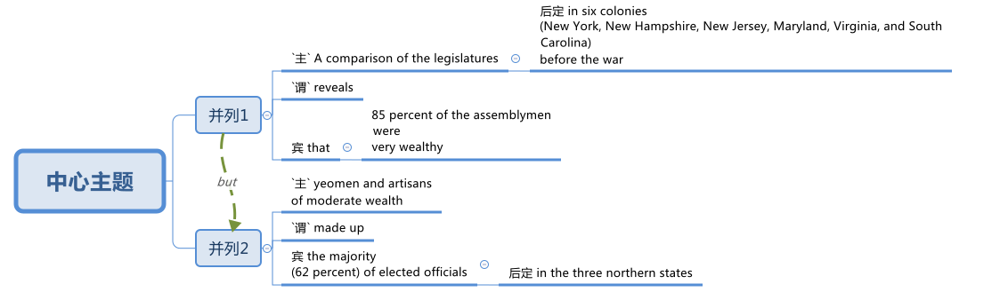

= 005 独立战争对美国各人民的影响
:toc: left
:toclevels: 3
:sectnums:
:stylesheet: myAdocCss.css

'''

== (解说) 独立战争对美国各人民的影响

The Revolution brought myriad 无数；大量 consequences to the American social fabric. +
There was no REIGN 君主统治时期 OF TERROR 惊恐；恐惧；惊骇;（通常出于政治目的）恐怖行动，恐怖 as in the French Revolution. +
There was no replacement of the ruling class by workers' groups as in revolutionary Russia.

How then could the American Revolution be described as radical 根本的；彻底的；完全的? Nearly every aspect of American life was somehow touched by the REVOLUTIONARY SPIRIT. +
From slavery 奴隶制，蓄奴 to women's rights, from _religious life_ 宗教生活 to voting, American attitudes would be forever changed.

[.my2]
革命给美国社会结构带来了无数后果。没有像法国大革命那样的恐怖统治。没有像革命的俄罗斯那样，工人团体取代了统治阶级。那么美国革命怎么能被描述为激进呢？美国生活的几乎每个方面都或多或少地受到了革命精神的影响。从奴隶制到妇女权利，从宗教生活到投票，美国人的态度将永远改变。

Some changes would be felt immediately. +
Slavery would not be abolished (v.)废除，废止（法律、制度、习俗等） for another hundred years, but the Revolution saw the dawn of an organized abolitionist 废奴主义者；废除主义者 movement. +

English traditions such as _land inheritance 继承物（如金钱、财产等）；遗产继承 laws_ were swept away almost immediately. +
The Anglican Church in America could no longer survive. +
After all, the official head of the Church of England was the British monarch 君主；帝王. +

[.my1]
.案例
====
.Anglican
a member of the Church of England or of a Church connected with it in another country 圣公会教徒

Adherents 拥护者，信徒 of Anglicanism 英国国教 are called Anglicans 圣公会的信徒; they are also called Episcopalians in some countries. The majority of Anglicans are members of national or regional ecclesiastical 基督教教会的 provinces of the international Anglican Communion 教派；教会；宗教团体,which forms the third-largest Christian communion in the world, after the Catholic Church 基督教教派 and the Eastern Orthodox Church,and the world's largest Protestant 新教教徒（16世纪脱离罗马天主教） communion.

"英国国教"的信徒, 被称为英国"圣公会"教徒 Anglicans。在一些国家，他们也被称为 Episcopalians。大多数英国圣公会教徒, 是国际圣公会国家或地区教会省份的成员，*该"圣公会"是世界上第三大基督教团体，仅次于"天主教会"和"东正教"， 和世界上最大的新教团体。*

- *"圣公会"是天主教和新教信仰的混合体。圣公宗因教义、体制与旧教（罗马天主教会）相差不大，又被称为“新教中的旧教”。*
- 圣公会也没有跨国的裁判权，每个教省都完全自治。

====

States experimented (v.)试验；尝试 with republican 共和政体的，共和国的 ideas when drafting their own constitutions during the war. +
All these major changes would be felt by Americans before the dawn 拂晓，黎明 of the nineteenth century.

[.my2]
一些变化会立即感受到。奴隶制再过一百年才被废除，但革命带来了有组织的废奴运动的曙光。土地继承法等英国传统几乎立刻就被扫除了。美国圣公会再也无法生存。毕竟，英国国教的正式领袖是英国君主。战争期间，各州在起草自己的宪法时, 尝试了共和思想。所有这些重大变化在十九世纪初之前, 就已经被美国人感受到了。

The American Revolution produced a new outlook 观点；见解；世界观；人生观 among its people 后定 that would have ramifications (n.)（众多复杂而又难以预料的）结果，后果 long into the future. +
`主` Groups 后定 *excluded from* 不包括；不放在考虑之列,把…排斥在外 immediate equality 平等 such as slaves and women `谓` would *draw* their later inspirations 启示,灵感 *from* revolutionary sentiments （基于情感的）观点，看法；情绪. +
Americans began to feel that their fight for liberty 自由，自由权 was a global fight. +

Future democracies 民主政体；民主制度;民主国家 would *model* (v.)仿效；以某人为榜样 their governments *on* ours. +
#There are few events# that would shake the world order /#like# the success of the American patriotic cause.

[.my2]
美国革命在其人民中产生了一种新的观点，这种观点将在很长一段时间内产生影响。奴隶和妇女等被排除在直接平等之外的群体, 后来会从革命情绪中汲取灵感。美国人开始觉得他们争取自由的斗争是一场全球性的斗争。未来的民主国家将会以我们的政府为榜样。很少有事件能像美国爱国事业的成功那样撼动世界秩序。

[.my1]
.title
====
.model (v.) yourself on sb
to copy the behaviour, style, etc. of sb you like and respect in order to be like them仿效；以某人为榜样 

.model (v.) sth on/after sth
to make sth so that it looks, works, etc. like sth else模仿；仿照
====

Life, liberty and the pursuit of happiness `谓` simply did not seem *consistent (a.)与…一致的；相符的；符合的；不矛盾的 with* the practice of chattel (n.)（个人的）财产，动产 slavery. +

How could a group of people feel so passionate (a.)热诚的；狂热的;拥有（或表现出）强烈性爱的；情意绵绵的；怒不可遏的 about these unalienable 不可剥夺的 rights, yet maintain the brutal practice of human bondage (n.)奴役；束缚?  +
Somehow 不知为什么；不知怎么地;以某种方式（或方法）slavery would manage to survive the revolutionary era, but great changes were brought to this PECULIAR INSTITUTION 特殊制度 nevertheless 然而，不过.

[.my2]
生命、自由和对幸福的追求, 似乎与动产奴隶制的做法完全不一致。一群人怎么可能对这些不可剥夺的权利如此热衷，却又继续残酷地奴役人类呢？不知何故，奴隶制在革命时代得以幸存，但这个特殊的制度仍然发生了巨大的变化。

Many slaves achieved their freedom during the Revolution without formal EMANCIPATION 解放. +
The British army, eager to debase (v.)降低…的价值；败坏…的名誉 the colonial economy, freed many slaves /as they moved through the American South. +

[.my1]
.案例
====
.emancipation +
解放；摆脱束缚 +
->  e-出,向外 + -man-手 + -cip-拿,取 + -ation名词词尾

.debase
[ VN] to make sb/sth less valuable or respected 降低…的价值；败坏…的名誉 +
-> de-, 向下。base, 低，贱，词源同 base metal. 即使低贱，败坏名誉。
====

Many slaves in the North were granted their freedom if they agreed to fight for the American cause. +
Although _a clear 明显的；显然的；明确的 majority of_ African Americans remained (v.) in bondage (n.)奴役；束缚, `主` the growth of free (v.) black communities 团体，群体 in America `谓` was greatly fostered (v.)促进；助长；培养；鼓励 by the War for American Independence. +

Revolutionary sentiments （基于情感的）观点，看法；情绪 *led to* the banning of the importation  进口，引进 of slaves in 1807.

[.my2]
许多奴隶在革命期间获得了自由，但没有正式解放。英国军队渴望破坏殖民地经济，在许多奴隶穿越美国南部时释放了他们。如果北方的许多奴隶同意为美国的事业而战，他们就会获得自由。尽管绝大多数非裔美国人仍处于奴役状态，但美国独立战争极大地促进了美国自由黑人社区的发展。革命情绪导致 1807 年禁止进口奴隶。

During the colonial era, Americans were bound by British law. +
Now, they were no longer governed by the Crown or by colonial charter 宪章，章程；特许状. +
INDEPENDENT 独立的；自主的；自治的, Americans could seek to eliminate 排除；清除；消除 or maintain laws as they saw fit. +
The possibilities were endless. +
REPUBLICAN revolutionary sentiment `谓` brought significant change during the immediate postwar years.

[.my2]
在殖民时代，美国人受到英国法律的约束。现在，他们不再受国王或殖民地宪章的管辖。独立后，美国人可以寻求废除或维持他们认为合适的法律。可能性是无限的。共和党的革命情绪在战后几年带来了重大变化。

Huge changes were made regarding 关于；至于 land holding 私有财产. +
English law required （尤指根据法规）规定;使做（某事）；使拥有（某物） land to be passed down [in its entirety 作为整体；整个地；全面地]  from father to eldest son. +
This practice was known as PRIMOGENITURE 长子继承权;长子身份；长嗣身份. +

This kept land concentrated in the hands of few individuals, hardly 几乎不；几乎没有 *consistent with* 与…一致的；相符的 revolutionary thinking 思想. +
Within fifteen years of the Revolution, not a single state had a primogeniture law on the books （企业的）账簿.

[.my2]
土地持有方面发生了巨大变化。英国法律要求将全部土地从父亲传给长子。这种做法被称为“长子继承法”。这使得土地集中在少数人手中，这与革命思想几乎不相符。独立战争十五年之内，没有一个州制定了长子继承权法。

[.my1]
.title
====
.IN ITS/THEIR ENTIRETY
as a whole, rather than in parts作为整体；整个地；全面地 +
- The poem is too long to quote [in its entirety].这首诗太长，不能全部引用。

.primo·geni·ture
-> 来自prime,第一的，首先的，-gen,生育，出生，词源同gene,generate.引申词义长子，长子身份。
====

The fight for _separation of church and state_ 政教分离 was on. +
In Virginia, it hardly seemed appropriate 合适的，相称的 *to support* the Anglican 圣公会教徒 Church of England *with* tax dollars 美元. +
by 1833, all states abandoned the practice of a state-supported church.

[.my2]
争取政教分离的斗争正在进行。在弗吉尼亚州，用税收来支持英国圣公会, 似乎不太合适。到了 1833 年，所有州都放弃了国家支持的教会的做法。

Every society needs a set of rules by which to operate. +
After the colonies declared independence from Great Britain, they had to write their own constitutions. +

Impassioned (v.)激起……的热情 with the republican spirit of the Revolution, political leaders pointed their ideals toward crafting (v.)（尤指用手工）精心制作 "enlightened" documents. +
The result was thirteen republican laboratories 实验室, each experimenting 实验；尝试 with new ways of realizing the goals of the Revolution. +

In addition, representatives from all the colonies worked together to craft the ARTICLES OF CONFEDERATION 邦联条例, which itself provided the nascent (a.)新生的；萌芽的；未成熟的 nation with invaluable experience 宝贵的经验.

[.my1]
.案例
====
.Articles of Confederation
十三州邦联宪法（美国第一部宪法）. 邦联条例：美国独立战争时期，13个殖民地为了联合起来共同对抗英国而制定的一部法规，它是美国宪法的前身。
====

[.my2]
每个社会都需要一套运作规则。殖民地宣布脱离英国独立后，必须制定自己的宪法。政治领导人对革命的共和精神充满热情，他们的理想是制定“开明”的文件。结果是成立了十三个共和实验室，每个实验室都在尝试实现革命目标的新方法。此外，来自所有殖民地的代表共同制定了《邦联条款》，这本身就为这个新生国家提供了宝贵的经验。

The state constitutions had much in common with （想法、兴趣等方面）相同;相同的特征（或特点等） each other . +
Fearful of a strong monarch 君主；帝王, the states were reluctant (a.) to grant (v.)授予，给予；承认 sweeping 影响广泛的；大范围的；根本性的 powers to a new government. +
Most GOVERNORS *were kept purposefully 有目的地；自觉地 weak* to deter (v.)制止；阻止；威慑；使不敢 an individual from *aspiring (v.)渴望（成就）；有志（成为） to* regal (a.)帝王的；王室的；豪华的 status or power. +
The legislative and judicial branches were elected regularly 定期选举, so voters could hold them regularly accountable for their actions. +

Most states granted (v.)（尤指正式地或法律上）同意，准予，允许 their people 宾补 a BILL OF RIGHTS 权利法案 to protect (v.) treasured  (a.)珍贵的,宝贵的 liberties 自由 from the threat 威胁，恐吓 of future despotism 专制统治；独裁制；暴政. +

Property requirements 财产要求 were still maintained, but in many cases they were lowered (v.). +
Although _the wealthy_  富人 maintained (v.) a disproportionately 不成比例地 large percentage of legislative seats, their influence was diminished (v.)减少；（使）减弱，缩减；降低. +
This is reflected in the post-Revolutionary transfer （使）转移，搬迁 of state capitals 州首府 *from* wealthy seaboard 海滨的 towns *to* the interior.

[.my2]
各州宪法彼此有很多共同点。由于害怕强大的君主，各州不愿向新政府授予广泛的权力。大多数州长都被故意保持弱势，以阻止个人渴望获得王室地位或权力。立法和司法部门定期选举，因此选民可以定期要求他们对其行为负责。大多数州授予其人民一项权利法案，以保护宝贵的自由免受未来专制主义的威胁。财产要求仍然维持不变，但在许多情况下降低了。尽管富人在立法席位中保持着不成比例的高比例，但他们的影响力却被削弱了。这反映在革命后州首府, 从富裕的沿海城镇向内陆的转移上。

[.my1]
.title
====
.have sth in common (with sb)
( of people人 ) to have the same interests, ideas, etc. as sb else（想法、兴趣等方面）相同 +
- Tim and I have nothing in common./I have nothing in common with Tim.我和蒂姆毫无共同之处。

.have sth in common (with sth)
( of things, places, etc.东西、地方等 ) to have the same features, characteristics, etc.有相同的特征（或特点等） +
- The two cultures have a lot in common.这两种文化具有许多相同之处。

.deter
(v.) ~ sb (from sth/from doing sth) : to make sb decide not to do sth or continue doing sth, especially by making them understand the difficulties and unpleasant results of their actions制止；阻止；威慑；使不敢

.aspire
(v.) ~ (to sth) : to have a strong desire to achieve or to become sth渴望（成就）；有志（成为） +
- He aspired (v.) to be their next leader.他渴望成为他们的下一届领导人。

====

Massachusetts developed an idea that would soon be implemented 实施; 执行 by the entire nation. +
They *made* any changes to their constitution 宪法，章程 `宾补` *possible* /only by constitutional convention (（某职业、政党等成员的）大会，集会)制宪会议. +
This inspired the nation's leaders to ratify (v.)正式批准；使正式生效 changes 后定 in the Articles of Confederation the same way. +
Truly _political ideals of equality_ *were set into place* in the states before the war even came to a close.

[.my2]
马萨诸塞州提出了一个很快就会被全国实施的想法。他们只有通过制宪会议, 才能对宪法进行任何修改。这促使国家领导人以同样的方式批准《邦联条例》的修改。真正的平等政治理想, 甚至在战争结束之前, 就在各州确立了。

As in the case of the abolition of slavery, changes for women would not come overnight. +
But the American Revolution ignited (v.)（使）燃烧，着火；点燃 these changes. +
Education and respect would lead to the emergence of a powerful, outspoken 直率；坦诚 middle class of women.

[.my2]
与废除奴隶制的情况一样，女性的改变也不会一蹴而就。但美国革命引发了这些变化。教育和尊重将导致强大、直言不讳的中产阶级女性的出现。

The United States was created *as a result of* 作为结果 the AMERICAN REVOLUTION, when `主` thirteen colonies on the east coast of North America `谓` fought to end (v.) their membership in the British Empire. +
This was a bold, dangerous, and even foolish thing to do at the time, since Great Britain was the strongest country in the world. +
While American success in the Revolution `谓` seems obvious today, it wasn't at the time.

[.my2]
美国是美国革命的结果，当时北美东海岸的十三个殖民地, 为结束其在大英帝国的地位而奋斗。这在当时是一件大胆、危险、甚至愚蠢的事情，因为英国是世界上最强大的国家。虽然美国在革命中的成功在今天看来是显而易见的，但在当时却并非如此。

The war for American independence `谓` began with military conflict in 1775 and lasted at least until 1783 /when the peace treaty with the British was signed. +
In fact, Native Americans in the west (who were allied with the British, but not included in the 1783 negotiations) continued to fight and didn't sign a treaty （国家之间的）条约，协定 with the United States until 1795. +
The Revolution was a long, hard, and difficult struggle.

[.my2]
美国独立战争从 1775 年的军事冲突开始，至少持续到 1783 年与英国签署和平条约。事实上，西部的美洲原住民（他们与英国结盟，但没有参与 1783 年的谈判）继续战斗，直到 1795 年才与美国签署条约。艰难的斗争。

Even among Patriots there was a wide range of opinion about how the Revolution should shape the new nation. +
For example, soldiers often resented (v.)怨恨，愤恨 civilians 平民 for not sharing the deep personal sacrifice of fighting the war. +
Even among the men who fought, major differences often separated 隔开；阻隔 officers from ordinary soldiers. +
Finally, no _consideration 仔细考虑；深思；斟酌 of the Revolution_ would be complete /条件状 without considering (v.) the experience of people who were not Patriots. +
Loyalists were Americans who remained loyal to the British Empire. +
Almost all Native American groups opposed 反对（计划、政策等）；抵制；阻挠 American Independence. +
Slaves would be made legally free if they fled Patriot masters to join the British Army, which they did in large numbers.

[.my2]
即使在爱国者中，对于革命应如何塑造新国家也存在广泛的意见。例如，士兵常常怨恨平民没有分担战争中巨大的个人牺牲。即使在参战的士兵中，军官与普通士兵之间也常常存在重大差异。最后，如果不考虑非爱国者的经历，对革命的考虑就不完整。保皇派是指仍然忠于大英帝国的美国人。几乎所有美洲原住民团体都反对美国独立。如果奴隶逃离爱国者主人并加入英国军队，他们将获得合法的自由，他们大量这样做了。

A constant question for our exploration, as well as for people at the time, `系`  is what does the Revolution mean and when did it end? Have the ideals of the Revolution been achieved even today? One of our challenges is `表` to consider the meaning of the Revolution from multiple perspectives.

[.my2]
对于我们的探索以及当时的人们来说，一个永恒的问题是革命意味着什么以及它何时结束？革命的理想今天是否实现了？我们的挑战之一是从多个角度思考革命的意义。

'''

==== 独立宣言, 当初是"理性实用性", 大于"要改变人类社会的伟大抱负"性的

"When in the Course of human events 人类事务, it becomes necessary for one people ① to dissolve (v.)解除（婚姻关系）；终止（商业协议）；解散（议会） the political bands which have connected them with another, ② and #to assume# (v.)承担（责任）；就（职）；取得（权力） [among the powers of the earth], #the separate 单独的；独立的 and equal station# 社会地位；身份 后定 to which _the Laws of Nature and of Nature's God_ entitle (v.)使享有权利；使符合资格 them, `主` a decent 得体的；合宜的；适当的 respect to _the opinions （群体的）观点，信仰 of mankind_ `谓` requires (v.) that they should declare (v.) the causes 原因；起因 后定 which impel (v.)促使；驱策；迫使 them to the separation."  +
So begins the DECLARATION OF INDEPENDENCE.

image:/img/111.svg[,100%]

[.my2]
====
“在人类事务的进程中，当一个民族必须解除与另一个民族之间的政治联系，并按照"自然法则"和"上帝赋予他们的权利"，在世界强国中获得独立和平等的地位时，出于对人类舆论的尊重，他们必须宣布促使他们分离的原因。”《独立宣言》就是这样开始的。

chatgpt 的翻译:
当人类历史上的某些时刻，一个民族有必要解除与另一个民族的政治联系，并在地球上的各个力量中，获取"自然法"和"上帝赋予他们的独立和平等的地位"时，出于对人类意见的应有尊重，要求他们声明促使他们分离的原因。
====

[.my1]
.title
====
.entitle
(v.) ~ sb to sth : to give sb the right to have or to do sth使享有权利；使符合资格 +
- You will be entitled (v.) to your pension when you reach 65.你到65岁就有资格享受养老金。

.When in the Course of human events, it becomes necessary for one people ① to dissolve the political bands which have connected them with another, ② and to assume [among the powers of the earth], _the separate and equal station_ to which _the Laws of Nature_ and _of Nature’s God_ entitle them, `主` a decent respect to _the opinions of mankind_ `谓` requires that they should declare the causes which impel (v.) them to the separation. +
在人类活动的过程中，当一个民族必须解除同另一个民族之间的政治关系，并按照自然法则和造物主的旨意，以独立平等的地位立于世界诸国之列时，出于对人类舆论的尊重，他们应该宣布驱使他们独立的原因。

- in the Course of 在...过程中，在...期间 +
- to assume (v.)承担（责任）；就（职）；取得（权力） among the powers of the earth 直译：在地球的权力中承担责任 +
- separate and equal station 独立平等的地位
- Laws of Nature 自然的法则
- Nature's God 造物主，创造世界万物的神
- the separate and equal station to which the Laws of Nature and of Nature's God entitle them 自然法则和造物主, 赋予他们独立平等的地位
- decent respect 得体的尊敬
====

But what was the Declaration? Why do Americans continue to celebrate 庆祝；庆贺 its public announcement 公告 as the birthday of the United States, July 4, 1776?

[.my2]
但是《独立宣言》是什么呢?为什么美国人继续把1776年7月4日作为美国的生日, 来庆祝呢?

On the one hand, the Declaration was a formal LEGAL DOCUMENT that announced to the world the reasons that led the thirteen colonies to separate from the British Empire. +
Much of the Declaration *sets (v.) forth* 陈述；阐明 a list of abuses 滥用；妄用;虐待 that were blamed (v.)把…归咎于；责怪；指责 on King George III. +
`主` One charge (n.)指控；控告 后定 levied (v.)征收；征（税） against the King `谓` sounds like a Biblical 《圣经》中的;宏大的；大规模的 plague 瘟疫;（老鼠或昆虫等肆虐造成的）灾害，祸患: "He has erected (v.)建立；建造;竖立；搭起 a multitude 众多；大量 of New Offices, and sent (v.) hither (ad.)到此处；向此地 swarms 一大群，一大批（向同方向移动的人）;一大群（蜜蜂等昆虫） of Officers to harrass (v.) our people, and eat out their substance 物质；物品；东西."

[.my2]
一方面，《宣言》是一份正式的法律文件，向世界宣布了导致十三个殖民地脱离大英帝国的原因。宣言的大部分内容列出了乔治三世国王的一系列虐待行为。对国王的一项指控, 听起来像是一场圣经中的瘟疫灾难：“他设立了许多新的办公室，并派出大批官员(蝗虫, 鼠患)到这里骚扰我们的人民，并吃掉他们的财产。”

[.my1]
.案例
====
.One charge 后定 levied against the King ...
chatgpt的解释:  +
levied：是 levy 动词的过去分词，作定语，修饰“charge”。这里“levied”指“提出”或“施加”，常用于正式或法律语境中，意思是“提出了（指控）”。 +
"levy"在词典上的主要意思是“征收；征（税）”。事实上，"levy" 在法律和正式语境中, 确实有时会被用来表示“提出（诉讼或指控）”，但是这种用法比较少见。
====

The Declaration was not only legalistic, but practical 切实可行的 too. +
Americans hoped to get financial or military support from other countries that were traditional enemies of the British. +
However, `主` these legal and pragmatic 实用的；讲求实效的；务实的 purposes, which make up the bulk 主体；大部分 of the actual document, `系` are not why the Declaration is remembered today as a foremost 最重要的；最著名的；最前的 expression of the ideals of the Revolution.

[.my2]
该宣言不仅是法律性的，而且也是实用性的。美国人希望从其他与英国传统为敌的国家中, 获得财政或军事支持。然而，这些构成实际文件大部分内容的法律和实用目的，并不是《独立宣言》今天被视为革命理想的首要表达的原因。

The Declaration's most famous sentence reads (v.)写着；写成: "We hold these truths to be self-evident 显而易见的，不言而喻的, THAT ALL MEN ARE CREATED EQUAL; that they are endowed (v.)天生赋有，生来具有（某种特性、品质等） by their Creator with certain unalienable 不可剥夺的 rights; that among these are life, liberty, and the pursuit of happiness." Even today, this inspirational 启发灵感的；鼓舞人心的 language expresses (v.)表达（自己的思想感情）;表示；表达；表露 a profound 巨大的；深切的；深远的 commitment to human equality.

[.my2]
《宣言》最著名的一句话是：“我们认为这些真理是不言而喻的：人人生而平等；造物主赋予他们某些不可剥夺的权利；其中包括生命权、自由权和追求幸福的权利。”。即使在今天，这种鼓舞人心的语言仍然表达了对人类平等的深刻承诺。

[.my1]
.title
====
.endow
-> en-, 进入，使。-dow, 给予，词源同donate, dowry. +
BE ENˈDOWED WITH STH : to naturally have a particular feature, quality, etc.天生赋有，生来具有（某种特性、品质等） +
- She was endowed with intelligence and wit.她天资聪颖。
====

The ideal of full human equality has been a major legacy 遗产 (and ongoing 持续存在的，仍在进行的，不断发展的 challenge) of the Declaration of Independence. +
But the signers of 1776 did not have _quite that radical an agenda_.

[.my2]
"人类完全平等"的理想是《独立宣言》的主要遗产（也是持续的挑战）。但 1776 年的签署者并没有那么激进的议程。

Thomas Jefferson provides the classic example 经典案例 of the contradictions 矛盾  of the Revolutionary Era. +
Although he was the chief author of the Declaration, he also owned slaves, as did many of his fellow signers (文件，如合同)签署人. +
They did not see 认为；看待 full human equality as a positive social goal. +
Nevertheless, Jefferson was prepared (a.)愿意 to criticize slavery much more directly than most of his colleagues 同事；同行.

[.my2]
托马斯·杰斐逊提供了革命时代矛盾的典型例子。尽管他是该宣言的主要作者，但他也拥有奴隶，就像他的许多签署者一样。他们并不认为"人类完全平等"是一个积极的社会目标。尽管如此，杰斐逊准备比他的大多数同事更直接地批评奴隶制。

[.my1]
.title
====
.prepared
(v.) ~ to do sth : willing to do sth愿意
====

So what did the signers intend (v.) by using such idealistic language? Look at what follows (v.) the line, "We hold these truths to be self-evident 显而易见的；不言而喻的；明摆着的, ① that all men are created equal, ② that they are endowed by their Creator with certain unalienable Rights, ③ that among these are LIFE, LIBERTY AND THE PURSUIT OF HAPPINESS."

[.my2]
那么签署者使用这种理想主义语言的意图是什么？看看接下来的内容：“我们认为这些真理是不言而喻的，人人生而平等，造物主赋予他们某些不可剥夺的权利，其中包括生命权、自由权和追求幸福的权利。 ”

That to secure these rights, Governments are instituted 创立；设置 among Men, deriving their just (a.)合适的；恰当的 powers from the consent of the governed 受到被统治者的同意, That whenever any Form of Government becomes destructive (a.)引起破坏（或毁灭）的；破坏（或毁灭）性的 of these ends 目的；目标, it is the Right of the People to alter (v.) or to abolish (v.)废除，废止（法律、制度、习俗等） it, and to institute new Government, laying its foundation [on such principles] /and organizing its powers [in such form], as [to them] shall seem (v.) most likely to effect (v.)使发生；实现；引起 their Safety and Happiness.

[.my2]
为了确保这些权利，政府是在人类之间建立的，其"正当权力"来自"被统治者的同意"，每当任何形式的政府破坏这些目标时，人民都有权改变或废除它，并且建立新政府，以这样的原则为基础，以这样的形式组织权力，使他们看起来最有可能实现他们的安全和幸福。

These lines suggest that the whole purpose of GOVERNMENT is to secure the PEOPLE'S RIGHTS /and that `主` government `谓` gets its power from "the CONSENT OF THE GOVERNED." If that consent 同意；准许；允许 is betrayed, then "it is the right of the people to alter or abolish" their government. +
When the Declaration was written, this was a radical statement. +
`主` The idea that ① the people could reject a monarchy (based on _the superiority of a king_) ② and replace it with a republican government (based on _the consent of the people_) /`系` was a revolutionary change.

[.my2]
这些条文表明, 政府的全部目的是保护人民的权利，政府的权力来自“被统治者的同意”。如果这种同意被背叛，那么“人民有权改变或废除”他们的政府。当宣言起草时，这是一个激进的声明。人民可以拒绝君主制（这样做的权力来自于"国王的优越性"）, 并代之以共和政府（这样做的权力来自于"基于人民的同意"），这是一个革命性的变化。

While `主` the signers of the Declaration thought of "the people" `谓` more narrowly than we do today, they articulated (v.)明确表达；清楚说明 principles that are still vital 至关重要的，必不可少的 markers 标志；标识；表示 of American ideals. +
And while the Declaration did not initially lead to equality for all, it did provide an inspiring start 后定 on working (v.) toward equality.

[.my2]
虽然《宣言》的签署者对“人民”的理解, 比我们今天更加狭隘，但他们所阐述的原则, 仍然是美国理想的重要标志。尽管《宣言》最初并没有带来人人平等，但它确实为努力实现平等, 提供了一个鼓舞人心的开端。

'''

==== 对参军士兵的影响

Americans remember (v.) the famous battles of the American Revolution such as BUNKER HILL, SARATOGA, and Yorktown, in part, because they were Patriot victories. +
But this apparent string of successes is misleading (a.)误导的；引入歧途的.

[.my2]
美国人记得美国独立战争中的著名战役，如邦克山战役、萨拉托加战役, 和约克镇战役，部分原因是爱国者取得了胜利。但这一连串明显的成功具有误导性。

The Patriots lost more battles than they won and, like any war, the Revolution was filled with hard times, loss of life, and suffering. +
In fact, the Revolution had one of the highest casualty （战争或事故的）伤员，亡者，遇难者 rates of any U.S. war; only the Civil War was bloodier.

[.my2]
爱国者队输掉的战斗比他们赢得的更多，而且像任何战争一样，革命充满了艰难时期、生命损失和痛苦。事实上，革命是美国历次战争中伤亡率最高的战争之一。只有内战更加血腥。

In the early days of 1776, most Americans were naïve when assessing (v.)评价，评估 just how difficult the war would be. +
`主` Great initial enthusiasm `谓` led many men to join local militias where they often served under officers of their own choosing. +
Yet, these volunteer forces were not strong enough to defeat (v.) the BRITISH ARMY, which was the most highly trained and best equipped in the world. +
Furthermore, because most men preferred (v.) serving in the militia 民兵组织, the Continental Congress had trouble getting volunteers for General George Washington's CONTINENTAL ARMY. +
This was in part because, the Continental Army demanded (v.) longer terms and harsher 更严厉的 discipline.

[.my2]
1776 年初，大多数美国人在评估战争的艰难程度时都很天真。最初的巨大热情, 促使许多人加入当地民兵，他们经常在自己选择的军官手下服役。然而，这些志愿军的实力, 还不足以击败世界上训练有素、装备最精良的英国军队。此外，由于大多数男人更喜欢在"民兵"中服役，大陆会议很难为乔治·华盛顿将军的大陆军, 找到志愿者。部分原因是, "大陆军"要求更长的服役期和更严格的纪律。

Washington correctly insisted on having a regular 持久的；稳定的；固定的 army as *essential (a.)完全必要的；必不可少的；极其重要的 to* any chance for victory. +
After a number of bad militia losses (n.) in battle, the Congress gradually developed a stricter 更严格的 military policy. +
It required each state to provide a larger quota 定额；限额；配额 of men, who would serve for longer terms, but who would be compensated 补偿 by a signing bonus 签约奖金 and the promise of free land after the war. +
This policy aimed (v.) to fill (v.) the ranks 普通士兵 of the Continental Army, but was never fully successful. +
While the Congress authorized (v.)批准；授权 an army of 75,000, at its peak /Washington's main force never had more than 18,000 men. +
The terms of service were such /that `主` only men 后定 with relatively (ad.)相当地，相对地 few other options `谓` chose to join the Continental Army.

[.my2]
华盛顿正确地坚持这个观点"拥有一支正规军, 对于任何胜利的机会都是至关重要的"。在一些糟糕的民兵在战斗中损失惨重之后，国会逐渐制定了更严格的军事政策。它要求每个州提供更多的男性配额，这些人的任期更长，但他们将通过"签约奖金"和"战后免费土地"的承诺得到补偿。这项政策旨在填补大陆军的空缺，但从未完全成功。虽然国会授权军队人数为 75,000 人，但在鼎盛时期，华盛顿的主力部队从未超过 18,000 人。服役条件是这样的，只有那些没有其他选择的人才会选择加入大陆军。

[.my1]
.title
====
.such that
从意义而言，such that 确实含有“如此 …… 以致“ 的意思。 +
- He made such arrangements /that everyone was happy.
他做出了这样的安排，以致大家都很高兴。 +
- He made arrangements such /that everyone was happy.
他做了安排，结果大家都很高兴。 +
- The arrangements he made were such /that everyone was happy.
他所作的安排使每个人都很高兴。

chatgpt的解释: +
“such that” 在句子中表示服役条款（如"签约奖金"和"战后提供免费土地"等）设定得如此苛刻, 或条件如此特定，以至于只有那些别无选择或其他选择很少的人, 才会选择加入大陆军。这种结构帮助解释"前面的情况, 导致了后面结果"的关系。
====

`主` Part of the difficulty in raising a large and permanent fighting force `系` was that `主` many Americans `谓` feared the army as a threat to the liberty of the new republic. +
`主` The ideals of the Revolution `谓` suggested that /`主` the MILITIA, made up of 由……组成，由……构成 local Patriotic volunteers, `谓` should be enough to win (v.) [in a good cause 原因；事业；理由] against a corrupt 受贿的；腐败的 enemy. +
Beyond this idealistic opposition （强烈的）反对，反抗，对抗 to the army, there were also more pragmatic 实用的；讲求实效的；务实的 difficulties. +
If a wartime army camped (v.) near private homes, they often seized (v.) food and personal property. +
`主` Exacerbating (v.)恶化 the situation `系` was Congress inability to pay (v.), feed (v.)喂养；饲养, and equip (v.) the army.

[.my2]
组建一支庞大且常备的战斗部队的部分困难在于，许多美国人担心军队对新共和国的自由构成威胁。革命的理想表明，由当地爱国志愿者组成的民兵, 应该足以在正义事业中战胜腐败的敌人。除了对军队的理想主义反对之外，还存在更实际的困难。如果战时军队在私人住宅附近扎营，他们经常会夺取食物和个人财产。国会无力支付军队的费用、粮食和装备，使情况更加恶化。

[.my1]
.案例
====
.exacerbate
[ VN] ( formal ) to make sth worse, especially a disease or problem使恶化；使加剧；使加重 +
- The symptoms may be exacerbated by certain drugs.这些症状可能会因为某些药物而加重。 +
-> ex-, 向外。-acerb, 尖，酸，词源同acid, acerbity.
====

As a result, soldiers often resented (v.)怨恨，愤恨 civilians 平民 whom they saw as *not sharing equally* in the sacrifices of the Revolution. +
Several MUTINIES 叛变，兵变 occurred toward the end of the war 战争快结束的时候, with ordinary soldiers protesting (v.)（公开）反对，抗议 their lack of pay and poor conditions. +
Not only were soldiers angry, but officers also felt that the country did not treat them well. +
Patriotic civilians and the Congress `谓` expected officers, who were mostly elite (n.)上层集团；（统称）掌权人物，社会精英 gentlemen, to be honorably self-sacrificing in their wartime service. +
When officers were denied a lifetime pension 终身养老金 at the end of the war, some of them threatened to conspire 密谋，共谋 against the Congress. +
General Washington, however, acted swiftly to halt （使）停止，停下 this threat before it was put into action.

[.my2]
因此，士兵们常常怨恨平民，他们认为平民没有平等地分享革命的牺牲。战争快结束时发生了几起兵变，普通士兵抗议他们的工资不足和条件恶劣。不仅士兵们愤怒，军官们也觉得国家待他们不好。爱国的平民和国会期望军官们（大多是精英绅士）在战时服务中光荣地自我牺牲。当战争结束时军官们被剥夺终身养老金时，他们中的一些人威胁要密谋反对国会。然而，华盛顿将军在这一威胁付诸行动之前迅速采取行动制止了这一威胁。

The Continental Army defeated the British, with the crucial help of French financial and military support, but the war ended 状 with very mixed feelings about the usefulness 有用；实用；可用性 of the army. +
#Not only# were civilians and those serving in the military mutually 相互地；彼此；共同地 suspicious (a.)不信任的；持怀疑态度的, #but also# even within the army soldiers and officers could harbor (v.)怀有，心怀（尤指反面感情或想法） deep grudges (n.)积怨；怨恨；嫌隙 against one another. +
`主` The war against the British `谓` ended with the PATRIOT military victory at YORKTOWN in 1781. +
However, the meaning and consequences of the Revolution had not yet been decided.

[.my2]
在法国财政和军事支持的关键帮助下，大陆军击败了英国，但战争结束时，人们对军队的用处感到非常复杂。不但平民与军中相互猜疑，就连军中官兵之间,也可能怀有深仇大恨。 1781 年，爱国者在约克敦取得军事胜利，对英战争结束。然而，革命的意义和后果尚未确定。

[.my1]
.title
====
.grudge
(n.)~ (against sb) : a feeling of anger or dislike towards sb because of sth bad they have done to you in the past积怨；怨恨；嫌隙 +
(v.) +
-> 拟声词。比较grouse, grumble.

The siege of Yorktown was the last major land battle of the American Revolutionary War in North America, and led to the surrender of General Cornwallis and the capture of both him and his army. The Continental Army's victory at Yorktown prompted the British government to negotiate an end to the conflict. +
围攻约克镇是美国独立战争在北美的最后一场重大陆战，导致康沃利斯将军投降并俘虏了他和他的军队。大陆军在约克镇的胜利促使英国政府通过谈判结束冲突。
====

'''

==== 对"亲英国派"的影响

`主` Any full assessment 看法；评估 of the American Revolution `谓` must try to understand the place of LOYALISTS, those Americans who remained faithful to the British Empire during the war.

[.my2]
对美国革命的任何全面评估, 都必须试图了解"保皇派"的地位，即那些在战争期间仍然忠于大英帝国的美国人。

Although Loyalists were steadfast (a.)坚定的；不动摇的 in their commitment to remain (v.) within the British Empire, it was a very hard decision to make and to stick to during the Revolution. +
Even before the war started, a group of Philadelphia QUAKERS were arrested and imprisoned in Virginia because of their perceived 注意到；意识到；察觉到 support of the British. +
The Patriots were not a tolerant group, and Loyalists suffered regular harassment, had their property seized, or were subject (v.)使经受；使遭受 to personal attacks 人身攻击.

[.my2]
尽管"效忠派"坚定地承诺留在大英帝国境内，但在革命期间做出并坚持这一决定, 是一个非常艰难的决定。甚至在战争开始之前，一群费城贵格会成员, 就因为被认为支持英国, 而在弗吉尼亚州被捕并被监禁。爱国者不是一个宽容的团体，保皇派经常遭受骚扰，财产被没收，或者受到人身攻击。

[.my1]
.title
====
.steadfast
(a.) ~ (in sth) : ( literary approving) not changing in your attitudes or aims坚定的；不动摇的
====

`主` The process of "TAR 用沥青涂抹；用柏油铺 AND FEATHERING 羽毛；羽状物," for example, `系`  was brutally violent. +
Stripped of clothes, covered with hot tar 焦油；焦油沥青；柏油, and splattered (v.)把（水等）泼洒在…上；淋湿；溅污 with feathers, the victim was then forced to parade (v.)游行;示览；展示 about in public. +
Unless 除非 the British Army was close [at hand] to protect (v.) Loyalists, they often suffered bad treatment from Patriots and often had to flee their own homes. +
About one-in-six Americans was an active Loyalist during the Revolution, and that number undoubtedly would have been higher if the Patriots hadn't been so successful in threatening and punishing people who made their Loyalist sympathies (n.) known in public.

[.my2]
例如，“TAR AND FEATHERING”的过程是残酷暴力的。受害者被剥光衣服，浑身沾满热焦油，身上溅满羽毛，然后被迫在公共场合游行。除非英国军队近在咫尺保护效忠派，否则他们经常受到爱国者的虐待，常常不得不逃离自己的家园。大约六分之一的美国人在革命期间是积极的保皇派，如果爱国者没有如此成功地威胁和惩罚"那些公开表示对保皇派同情的人"，这个数字无疑会更高。

[.my1]
.title
====
.tar and ˈfeather sb
to put tar on sb then cover them with feathers, as a punishment 把…浑身涂上沥青并粘上羽毛（作为惩罚）；严惩

Tarring and feathering is a form of public torture where a victim is stripped naked, or stripped to the waist, while wood tar 木焦油 (sometimes hot) is either poured or painted onto the person. The victim then either has feathers thrown on them or is rolled around on a pile of feathers so that they stick to the tar. +
涂柏油和羽毛是公开酷刑的一种形式，受害者被脱光衣服, 或脱光至腰部，同时将木焦油（有时是热的）倒在或涂在受害者身上。然后，受害者要么被扔在身上，要么被放在一堆羽毛上滚动，以便它们粘在焦油上。

.would have been
是一种虚拟语态，用于表达过去某个时间或事件, 如果有不同的选择或结果, 会怎么样。它通常用来表达对过去的猜测或假设。

could、would + have +过去分词，表达的是一种假设情况，用此来谈及过去没有发生的事情。

[.my3]
[options="autowidth" cols="1a,1a"]
|===
|Header 1 |Header 2

|could have + 过去分词
|表示过去你有能力做却没做的事情（对应could第一个意思） +
- They could have won the match, but they didn’t try their best. 他们本可以赢的，但是他们没有尽他们最大的能力。

|could have + 过去分词
|表示猜测过去可能发生的事情（对应could第二个意思） +
- Why is she absent from work today? 为什么她今天不来上班？ She could have got stuck in traffic. 她可能遇到交通堵塞了。

|would have + 过去分词：与if搭配
|假设if（过去完成时）的条件成立，将会发生什么事情（现实是没发生过这件事情的，只是假设），用此方式来表达一些情感，如幸好、后悔（对应would第一个意思） +
翻译：如果那时……，就已经（会）…… +
- If you had worked harder, you would have passed your exam. 如果你那时努力学习，你就已经通过考试了。

|would have + 过去分词：不与if搭配
|表示愿意去做某事，但是由于某些原因不能做（对应would第二个意思） +
翻译：本来很想……，但…… +
- Jane would have finished her household chores, but she felt extremely tired.
 Jane很想做完她的家务，但是她真得太累了。
|===
====

Perhaps the most interesting group of Loyalists were enslaved African-Americans who chose to join the British. +
The British promised to LIBERATE (v.)解放,使自由 slaves who fled (v.) from their Patriot masters. +
This powerful incentive (n.)激励，刺激, and the opportunities opened by the chaos of war, led some 50,000 slaves (about 10 percent of the total slave population in the 1770s) to flee their Patriot masters. +
When the war ended, the British evacuated (v.)（把人从危险的地方）疏散，转移，撤离 20,000 formerly enslaved African Americans /and resettled (v.)帮助…定居他国（或别的地区）；到他国（或别的地区）定居 them as free people.

[.my2]
也许最有趣的保皇派群体是选择加入英国的被奴役的非裔美国人。英国人承诺解放逃离爱国者主人的奴隶。这种强大的动力，加上战争混乱带来的机会，导致大约 50,000 名奴隶（约占 1770 年代奴隶总数的 10%）逃离了他们的爱国者主人。战争结束后，英国撤离了 20,000 名以前被奴役的非裔美国人，并将他们作为自由人重新安置。

Along with 除…以外（还）；与…同样地 this group of black Loyalists, about 80,000 other Loyalists chose (v.) to leave the independent United States after the Patriot victory in order to remain members of the British Empire. +
Wealthy men `谓` like Thomas Hutchinson who had the resources went to London. +
But most ordinary Loyalists went to Canada where they would come to play a large role in the development of Canadian society and government. +
In this way, the American Revolution played a central 最重要的；首要的；主要的 role shaping (v.) the future of two North American countries.

[.my2]
除了这群黑人效忠派之外，还有大约 80,000 名"效忠英国派", 在"美国爱国者"胜利后, 选择离开独立的美国，以保留大英帝国的成员身份。像托马斯·哈钦森这样拥有资源的富人去了伦敦。但大多数普通效忠派都去了加拿大，他们将在加拿大社会和政府的发展中发挥重要作用。通过这种方式，美国革命在塑造两个北美国家的未来方面发挥了核心作用。

'''

==== 对奴隶的影响

The AMERICAN REVOLUTION, as an anti-tax movement, centered (v.)把…当作中心；（使）成为中心 on _Americans' right_ to control their own property. +
In the 18th century "property" included other human beings.

[.my2]
美国革命作为一场反税收运动，以美国人控制自己财产的权利为中心。 18世纪的“财产”包括"其他人"(即奴隶)。

[.my1]
.title
====
.centre (v.) around/on/round/upon sb/sth | centre (v.) sth around/on/round/upon sb/sth
to be or make sb/sth become the person or thing around which most activity, etc. takes place把…当作中心；（使）成为中心 +
- Discussions were centred (v.) on developments /后定 in Eastern Europe.讨论围绕着东欧的发展这一中心议题进行。
====

In many ways, the Revolution reinforced (v.) 加强；巩固 American commitment to slavery. +
On the other hand, the Revolution `谓` also hinged (v.)有赖于；取决于 on radical new ideas about "liberty" and "equality," which challenged slavery's long tradition of extreme human inequality. +
`主` The changes to slavery in the REVOLUTIONARY ERA `谓` revealed (v.) *both* _the potential for radical change_ *and* _its failure_ more clearly than any other issue.

[.my2]
在许多方面，革命加强了美国对奴隶制的承诺。另一方面，革命也取决于关于“自由”和“平等”的激进新思想，这些思想挑战了奴隶制长期存在的"人类极端不平等"的传统。革命时代, 奴隶制的变化, 比任何其他问题都更清楚地揭示了彻底变革的潜力及其失败。

[.my1]
.title
====
.hinge
(v.)[ VN] [ usually passive]to attach sth with a hinge给（某物）装铰链 +

.hinge on/upon sth
( of an action, a result, etc.行动、结果等 ) to depend on sth completely有赖于；取决于 +
- Everything `谓` hinges (v.) on the outcome of these talks.一切都取决于这些会谈的结果。
====

SLAVERY was a central institution in American society during the late-18th century, and was accepted as normal and applauded 称赞；赞许；赞赏 as a positive thing by many white Americans. +
However, this broad acceptance of slavery (which was never agreed to by black Americans) `谓`  began to be challenged in the Revolutionary Era. +
The challenge came from several sources, partly from Revolutionary ideals, partly from a new evangelical 基督教福音派的 religious commitment that stressed the equality of all Christians 基督徒, and partly from a decline in the profitability 盈利能力；收益性；利益率 of TOBACCO in the most significant slave region of Virginia and adjoining 邻接的；毗连的 states.

[.my2]
奴隶制是 18 世纪末美国社会的一个中心制度，被许多美国白人视为正常现象并称赞为积极的事情。然而，这种对奴隶制的广泛接受（美国黑人从未同意这一点）在革命时代开始受到挑战。挑战来自多个来源，部分来自革命理想，部分来自强调"所有基督徒平等"的新福音派宗教承诺，部分来自弗吉尼亚州和邻近州最重要的奴隶地区, 烟草盈利能力的下降。

[.my1]
.title
====
.as ... as ...
as…as…意为"和……一样"，表示"同级的比较"。使用时要注意第一个as为副词，第二个as为连词。其基本用法为 as + adj./ adv. + as…。 +
as…as possible/can：尽可能的。 +
as…as usual/before：像以前一样……。 +
as long as：达……之久；和……一样长；只要（引导条件状语从句）。
====

The decline of slavery in the period `系` was most noticeable in the states north of Delaware, `主` all of which 后定 passed (v.) laws `谓`  outlawing (v.)宣布…不合法；使…成为非法 slavery /quite soon after the end of the war. +
However, these gradual emancipation 解放 laws were very slow to take effect — many of them only freed (v.)解放，使自由 the children of current slaves, and even then, only when the children turned 25 years old. +
Although laws `谓` prohibited (v.)（尤指以法令）禁止 slavery in the North, the "PECULIAR （某人、某地、某种情况等）特有的，特殊的 INSTITUTION" persisted (v.)维持；保持；持续存在 well into the 19th century.

[.my2]
这一时期奴隶制的衰落, 在特拉华州北部各州最为明显，所有这些州, 都在战争结束后不久, 就通过了取缔奴隶制的法律。然而，这些渐进式解放法律的生效速度, 非常缓慢——其中许多法律, 只解放了当前奴隶的孩子，而且即使如此，也只有在孩子年满 25 岁时, 才获得解放。尽管北方法律禁止奴隶制，但“特殊制度”一直持续到 19 世纪。

Even in the South, there was a significant movement toward freeing (v.) some slaves. +
In states where tobacco production no longer demanded (v.) large numbers of slaves, the free black population grew rapidly. +
By 1810 one third of the African American population in Maryland was free, and in Delaware free blacks `谓`  outnumbered (v.)（在数量上）压倒，比…多 enslaved African Americans by three to one. +
Even in the powerful slave state of Virginia, the free black population grew more rapidly than ever before in the 1780s and 1790s. +
This major new free black population `谓` created a range of public institutions 公共机构 for themselves that usually used the word "African" to announce ① their distinctive (a.)独特的；特别的；有特色的 pride ② and insistence (n.)坚决要求；坚持；固执 on equality.

[.my2]
即使在南方，也出现了一场解放一些奴隶的重大运动。在烟草生产不再需要大量奴隶的州，自由黑人人口迅速增长。到 1810 年，马里兰州三分之一的非洲裔美国人获得了自由，而在特拉华州，自由黑人与被奴役的非洲裔美国人的数量之比为三比一。即使在强大的奴隶州弗吉尼亚，自由黑人人口的增长速度也比 1780 年代和 1790 年代任何时候都快。这个主要的新自由黑人群体为自己创建了一系列公共机构，这些机构通常使用“非洲”一词, 来宣布他们独特的自豪感和对平等的坚持。

'''

==== 对女性的影响

The Revolutionary rethinking of the rules for society  /also led to some reconsideration of the relationship /between men and women. +
At this time, women were widely considered to be inferior (a.)较差的；次的；比不上…的 to men, a status /that was especially clear /in the lack of legal rights for married women. +
The law did not recognize wives' independence /in economic, political, or civic 市民的；城镇居民的 matters /in Anglo-American society of the eighteenth century.

[.my2]
对社会规则的革命性重新思考, 也导致了对男女关系的重新思考。此时，女性被广泛认为不如男性，这种地位在已婚女性缺乏合法权利方面尤为明显。在十八世纪的英美社会，法律不承认妻子在经济、政治或公民事务上的独立性。

'''

==== 对美国原住民(如印第安人)的影响

While the previous explorations of _African American and white female experience_ 经历；阅历 `谓` suggest *both* the gains *and* limitations 后定 produced in the Revolutionary Era, [from the perspective 态度；观点；思考方法 of almost all NATIVE AMERICANS] `主` the American Revolution `系` was an unmitigated  (a.)完全的，十足的，彻底的（通常指坏事） disaster 灾难；灾祸；灾害. +

At the start of the war /Patriots worked hard to try and ensure Indian neutrality 中立；中立状态,  原因状 for Indians could provide strategic military assistance 帮助；援助；支持 that might decide the struggle 搏斗；扭打；（尤指）抢夺，挣扎脱身. +
Gradually, however, it became clear to most native groups, that an independent America posed (v.)造成（威胁、问题等）；引起；产生 a far greater threat to _their interests and way of life_ than a continued British presence that restrained American westward expansion.

[.my2]
虽然之前对非裔美国人和白人女性经历的探索, 表明了革命时代产生的收益和局限性，但从几乎所有美洲原住民的角度来看，美国革命是一场彻头彻尾的灾难。战争开始时，爱国者努力确保印第安人的中立，因为印第安人可以提供可能决定战局的战略军事援助。然而，大多数土著群体逐渐意识到，独立的美国对他们的"利益"和"生活方式"构成的威胁, 这个威胁远大于"英国在北美洲的持续存在"，因为"英国的存在"能限制"美国的向西扩张"。

With remarkably 不寻常地 few exceptions 例外, `主` Native American (a.) support (n.) 后定 for the British `系` was close (a.)几乎（处于某种状态）；可能（快要做某事） to universal 普遍的；全体的；全世界的；共同的.

[.my2]
除了极少数例外，美洲原住民几乎普遍支持英国人。

[.my1]
.title
====
.Native American
(a.) +
Native American languages 美洲土著语言
====

In spite of 虽然, 不管；尽管 significant Native American aid to the British, `主` the European treaty （国家之间的）条约，协定 negotiations (n.) 后定 that concluded (v.)（使）结束，终止 the war in 1783 `谓` had no native representatives. +
Although Ohio and Iroquois Indians had not surrendered nor suffered a final military defeat, the United States claimed that `主` its victory over the British `谓` meant a victory over Indians as well. +

Not surprisingly, due to their lack of representation during treaty negotiations, Native Americans received very poor treatment in the diplomatic 外交的 arrangements. +

The British retained their North American holdings 股份；私有财产 后定 north and west of the Great Lakes, but granted (v.)（尤指正式地或法律上）同意，准予，允许 _the new American republic_ 共和国，共和政体 宾补 all land 后定 between the Appalachian Mountains and the Mississippi River. +
In fact, this region was largely unsettled 无休止的；未解决的 by whites and mostly inhabited by Native Americans.

[.my2]
尽管美洲原住民向英国提供了大量援助，但 1783 年结束战争的"欧洲条约谈判", 却没有原住民代表。尽管俄亥俄州和易洛魁印第安人没有投降，也没有遭受最终的军事失败，但美国声称, 对英国的胜利也意味着对印第安人的胜利。毫不奇怪，由于在条约谈判中缺乏代表，美洲原住民在外交安排中受到的待遇非常差。英国保留了五大湖以北和以西的北美领土，但将阿巴拉契亚山脉和密西西比河之间的所有土地, 授予了新的美国共和国。事实上，这个地区主要居住着白人，大部分居住着美洲原住民。

[.my1]
.title
====
.neither... nor... | not... nor...and not 也不
- Not a building nor a tree /was left standing.没有一栋房屋一棵树仍然站着没倒。

.Appalachian Mountains
image:/img/Appalachian Mountains 1.webp[,50%]
====

'''

==== 对"自耕农"和"城市工匠"的影响

Two groups of Americans most fully represented _the independent 独立的；自主的；自治的 ideal_ in this republican vision 想象；幻象 for the new nation 国家；民族: yeomen (旧时)自耕农; 自由民 farmers and urban artisans 手艺人,工匠. +
These two groups made up the overwhelming majority of the white male population, and they were the biggest beneficiaries 受益人；受惠人 of the American Revolution.

[.my2]
两个美国人群体, 最充分地代表了这个新国家的共和愿景中的独立理想：自耕农和城市工匠。这两个群体占白人男性人口的绝大多数，是美国革命的最大受益者。

`主` The YEOMEN FARMER who owned his own modest 些许的；不太大（或太贵、太重要等）的 farm and worked it primarily 主要地；根本地 with family labor `谓` remains the embodiment （体现一种思想或品质的）典型，化身 of the ideal American: honest, virtuous 品行端正的；品德高的；有道德的, hardworking, and independent.

[.my2]
自耕农拥有自己的小农场，主要靠家庭劳动来耕种，他们仍然是理想美国人的化身：诚实、善良、勤劳和独立。

While yeomen represented the largest number of white farmers in the Revolutionary Era, artisans were a leading urban group making up at least half the total population of seacoast cities. +
ARTISANS were skilled workers drawn （从…中）得到，获得 from all levels of society *from* poor shoemakers and tailors 裁缝 *to* elite 上层集团；（统称）掌权人物，社会精英 metal workers 金属工. +
they had contact with a broad range of urban society. +
These connections helped place (v.) artisans at the center of the Revolutionary movement and it is not surprising that the origins of the Revolution can largely be located in urban centers like Boston, New York, and Philadelphia, where artisans were numerous.

[.my2]
虽然自耕农代表了革命时期数量最多的白人农民，但工匠是主要的城市群体，占沿海城市总人口的至少一半。工匠是来自社会各个阶层的技术工人，从贫穷的鞋匠和裁缝到精英金属工人。他们与广泛的城市社会有接触。这些联系有助于将工匠置于革命运动的中心，毫不奇怪，革命的起源很大程度上位于波士顿、纽约和费城等城市中心，那里的工匠众多。

`主` The representatives 后定 elected to the new republican state governments during the Revolution `谓` reflected the dramatic rise in importance of independent yeomen and artisans. +

`主` A comparison 比较，对照 of the legislatures 立法机关 in six colonies (New York, New Hampshire, New Jersey, Maryland, Virginia, and South Carolina) before the war `谓` reveals that `主` 85 percent of the assemblymen 立法会议成员 `系` were very wealthy, but by war's end in 1784, `主` yeomen and artisans of moderate wealth `谓` made up the majority (62 percent) of elected (a.) officials 当选的官员 in the three northern states, while they formed a significant minority 少数；少数派 (30 percent) in the southern states. +

`主` The Revolution's greatest achievement, and it was a major change, `系` was the expansion of formal politics to include (v.) independent workingmen of modest wealth.

[.my2]
革命期间选出的新共和州政府代表, 反映出"独立自耕农"和"工匠"的重要性急剧上升。对战前六个殖民地（纽约州、新罕布什尔州、新泽西州、马里兰州、弗吉尼亚州和南卡罗来纳州）立法机构的比较显示，85% 的议员非常富有，但到 1784 年战争结束时，自耕农和工匠的财富都减少了。在北部三个州，中等财富的人占民选官员的大多数（62%），而在南部各州，他们只占少数（30%）。革命的最大成就，也是一项重大变革，是扩大了正式政治范围，将拥有微薄财富的独立工人, 纳入其中。

[.my1]
.title
====

====

'''

==== 革命的国际间比较

The American Revolution needs to be understood in a broader framework than simply that of domestic events and national politics. +
The American Revolution started a trans-Atlantic Age of Revolution.

[.my2]
美国革命需要在更广泛的框架内理解，而不仅仅是国内事件和国家政治。美国革命开启了跨大西洋革命时代。

The French Revolution surely sprung (v.)由某事物造成；起源于（或来自）某事物;弹簧 from important internal dynamics 动力, but `主` the connection between the French struggle 后定 that began in 1789 and the American Revolution `谓` was widely acknowledged 承认（属实） at the time.

[.my2]
法国大革命无疑源于重要的内部动力，但 1789 年开始的法国斗争与美国革命之间的联系, 在当时得到了广泛认可。

In comparison to the French and Haitian Revolutions, `主` the lack of radical change in the American Revolution `系` is glaring (a.)显眼的；明显的；易见的. +
`主` The benefits of the American Revolution for the poor, for women, and, perhaps most of all, for enslaved people, `系` were very limited. +
Nevertheless, the American Revolution did transform American society in meaningful 严肃的；重要的；重大的 ways and it accomplished its changes with comparatively little bloody violence. +
Most notably (ad.)尤其；特别 of all, the American Revolution created new republican political institutions that proved to be remarkably stable and long lasting.

[.my2]
与法国革命和海地革命相比，美国革命缺乏根本性的变革是显而易见的。美国革命给穷人、妇女，也许最重要的是，给被奴役者带来的好处是非常有限的。尽管如此，美国革命确实以有意义的方式改变了美国社会，并且以相对较少的血腥暴力实现了这一变化。最值得注意的是，美国革命创建了新的共和政治制度，事实证明这些制度非常稳定和持久。

[.my1]
.title
====
.notably
(ad.) used for giving a good or the most important example of sth尤其；特别
SYNespecially +
- The house had many drawbacks, most notably its price.这房子有很多缺陷，尤其是它的价格。
====

As ABRAHAM LINCOLN viewed it half a century later *on the verge 濒于；接近于；行将 of* the Civil War, the Union had to prevail (v.)（尤指长时间斗争后）战胜，挫败 /*so that* `主` "government of the people, by the people, for the people, `谓` shall not perish (v.)死亡；暴死;丧失；湮灭；毁灭 from the earth."

[.my2]
正如亚伯拉罕·林肯在半个世纪后在内战边缘所看到的那样，联邦必须获胜，这样“民有、民治、民享的政府才不会从地球上消失”。

[.my1]
.title
====
.verge
(n.)( BrE ) a piece of grass at the edge of a path, road, etc.（路边的）小草地，绿地

.on/to the verge of sth/of doing sth
very near to the moment when sb does sth or sth happens 濒于；接近于；行将 +
- He was on the verge of tears.他差点儿哭了出来。

.perish
-> 来自古法语periss-,来自拉丁语perire,走完，走尽，来自per-,穿过，完全的，ire,走，行程，词源同exit,itinerary.引申词义死亡，毁灭。-iss,分词格。
====

For all its limitations, the American Revolution had also built a framework that allowed for 考虑到，预留 future inclusion /and redress (n.)赔款；损失赔偿 (n.)纠正；矫正；改正 of wrongs.

[.my2]
尽管有其局限性，美国革命也建立了一个框架基础，允许未来进一步的扩大包容, 和纠正错误。

[.my1]
.案例
====
.redress
(n.)[ U]~ (for/against sth) :( formal ) payment, etc. that you should get for sth wrong /that has happened to you or harm that you have suffered 赔款；损失赔偿 +
• to seek legal redress for unfair dismissal 因横遭解雇, 而提起赔偿诉讼
• to have little prospect of redress 几乎没有获赔的希望

-> re-,再，重新，-dress,拉直，引导，词源同 direct,address,right.
====

'''

== pure

The Revolution brought myriad consequences to the American social fabric. There was no REIGN OF TERROR as in the French Revolution. There was no replacement of the ruling class by workers' groups as in revolutionary Russia.

How then could the American Revolution be described as radical? Nearly every aspect of American life was somehow touched by the REVOLUTIONARY SPIRIT. From slavery to women's rights, from religious life to voting, American attitudes would be forever changed.

Some changes would be felt immediately. Slavery would not be abolished for another hundred years, but the Revolution saw the dawn of an organized abolitionist movement. English traditions such as land inheritance laws were swept away almost immediately. The Anglican Church in America could no longer survive. After all, the official head of the Church of England was the British monarch. States experimented with republican ideas when drafting their own constitutions during the war. All these major changes would be felt by Americans before the dawn of the nineteenth century.

The American Revolution produced a new outlook among its people that would have ramifications long into the future. Groups excluded from immediate equality such as slaves and women would draw their later inspirations from revolutionary sentiments. Americans began to feel that their fight for liberty was a global fight. Future democracies would model their governments on ours. There are few events that would shake the world order like the success of the American patriotic cause.

Life, liberty and the pursuit of happiness simply did not seem consistent with the practice of chattel slavery. How could a group of people feel so passionate about these unalienable rights, yet maintain the brutal practice of human bondage? Somehow slavery would manage to survive the revolutionary era, but great changes were brought to this PECULIAR INSTITUTION nevertheless.

Many slaves achieved their freedom during the Revolution without formal EMANCIPATION. The British army, eager to debase the colonial economy, freed many slaves as they moved through the American South. Many slaves in the North were granted their freedom if they agreed to fight for the American cause. Although a clear majority of African Americans remained in bondage, the growth of free black communities in America was greatly fostered by the War for American Independence. Revolutionary sentiments led to the banning of the importation of slaves in 1807.

During the colonial era, Americans were bound by British law. Now, they were no longer governed by the Crown or by colonial charter. INDEPENDENT, Americans could seek to eliminate or maintain laws as they saw fit. The possibilities were endless. REPUBLICAN revolutionary sentiment brought significant change during the immediate postwar years.

Huge changes were made regarding land holding. English law required land to be passed down in its entirety from father to eldest son. This practice was known as PRIMOGENITURE. This kept land concentrated in the hands of few individuals, hardly consistent with revolutionary thinking. Within fifteen years of the Revolution, not a single state had a primogeniture law on the books.

The fight for separation of church and state was on. In Virginia, it hardly seemed appropriate to support the Anglican Church of England with tax dollars. by 1833, all states abandoned the practice of a state-supported church.

Every society needs a set of rules by which to operate. After the colonies declared independence from Great Britain, they had to write their own constitutions. Impassioned with the republican spirit of the Revolution, political leaders pointed their ideals toward crafting "enlightened" documents. The result was thirteen republican laboratories, each experimenting with new ways of realizing the goals of the Revolution. In addition, representatives from all the colonies worked together to craft the ARTICLES OF CONFEDERATION, which itself provided the nascent nation with invaluable experience.

The state constitutions had much in common with each other. Fearful of a strong monarch, the states were reluctant to grant sweeping powers to a new government. Most GOVERNORS were kept purposefully weak to deter an individual from aspiring to regal status or power. The legislative and judicial branches were elected regularly, so voters could hold them regularly accountable for their actions. Most states granted their people a BILL OF RIGHTS to protect treasured liberties from the threat of future despotism. Property requirements were still maintained, but in many cases they were lowered. Although the wealthy maintained a disproportionately large percentage of legislative seats, their influence was diminished. This is reflected in the post-Revolutionary transfer of state capitals from wealthy seaboard towns to the interior.

Massachusetts developed an idea that would soon be implemented by the entire nation. They made any changes to their constitution possible only by constitutional convention. This inspired the nation's leaders to ratify changes in the Articles of Confederation the same way. Truly political ideals of equality were set into place in the states before the war even came to a close.

As in the case of the abolition of slavery, changes for women would not come overnight. But the American Revolution ignited these changes. Education and respect would lead to the emergence of a powerful, outspoken middle class of women.

The United States was created as a result of the AMERICAN REVOLUTION, when thirteen colonies on the east coast of North America fought to end their membership in the British Empire. This was a bold, dangerous, and even foolish thing to do at the time, since Great Britain was the strongest country in the world. While American success in the Revolution seems obvious today, it wasn't at the time.

The war for American independence began with military conflict in 1775 and lasted at least until 1783 when the peace treaty with the British was signed. In fact, Native Americans in the west (who were allied with the British, but not included in the 1783 negotiations) continued to fight and didn't sign a treaty with the United States until 1795. The Revolution was a long, hard, and difficult struggle.

Even among Patriots there was a wide range of opinion about how the Revolution should shape the new nation. For example, soldiers often resented civilians for not sharing the deep personal sacrifice of fighting the war. Even among the men who fought, major differences often separated officers from ordinary soldiers. Finally, no consideration of the Revolution would be complete without considering the experience of people who were not Patriots. Loyalists were Americans who remained loyal to the British Empire. Almost all Native American groups opposed American Independence. Slaves would be made legally free if they fled Patriot masters to join the British Army, which they did in large numbers.

A constant question for our exploration, as well as for people at the time, is what does the Revolution mean and when did it end? Have the ideals of the Revolution been achieved even today? One of our challenges is to consider the meaning of the Revolution from multiple perspectives.

'''

==== 独立宣言, 当初是"理性实用性", 大于"要改变人类社会的伟大抱负"性的

"When in the Course of human events, it becomes necessary for one people to dissolve the political bands which have connected them with another, and to assume among the powers of the earth, the separate and equal station to which the Laws of Nature and of Nature's God entitle them, a decent respect to the opinions of mankind requires that they should declare the causes which impel them to the separation." So begins the DECLARATION OF INDEPENDENCE.

But what was the Declaration? Why do Americans continue to celebrate its public announcement as the birthday of the United States, July 4, 1776?

On the one hand, the Declaration was a formal LEGAL DOCUMENT that announced to the world the reasons that led the thirteen colonies to separate from the British Empire. Much of the Declaration sets forth a list of abuses that were blamed on King George III. One charge levied against the King sounds like a Biblical plague: "He has erected a multitude of New Offices, and sent hither swarms of Officers to harrass our people, and eat out their substance."

The Declaration was not only legalistic, but practical too. Americans hoped to get financial or military support from other countries that were traditional enemies of the British. However, these legal and pragmatic purposes, which make up the bulk of the actual document, are not why the Declaration is remembered today as a foremost expression of the ideals of the Revolution.

The Declaration's most famous sentence reads: "We hold these truths to be self-evident, THAT ALL MEN ARE CREATED EQUAL; that they are endowed by their Creator with certain unalienable rights; that among these are life, liberty, and the pursuit of happiness." Even today, this inspirational language expresses a profound commitment to human equality.

The ideal of full human equality has been a major legacy (and ongoing challenge) of the Declaration of Independence. But the signers of 1776 did not have quite that radical an agenda.

Thomas Jefferson provides the classic example of the contradictions of the Revolutionary Era. Although he was the chief author of the Declaration, he also owned slaves, as did many of his fellow signers. They did not see full human equality as a positive social goal. Nevertheless, Jefferson was prepared to criticize slavery much more directly than most of his colleagues.

So what did the signers intend by using such idealistic language? Look at what follows the line, "We hold these truths to be self-evident, that all men are created equal, that they are endowed by their Creator with certain unalienable Rights, that among these are LIFE, LIBERTY AND THE PURSUIT OF HAPPINESS."

That to secure these rights, Governments are instituted among Men, deriving their just powers from the consent of the governed, That whenever any Form of Government becomes destructive of these ends, it is the Right of the People to alter or to abolish it, and to institute new Government, laying its foundation on such principles and organizing its powers in such form, as to them shall seem most likely to effect their Safety and Happiness.

These lines suggest that the whole purpose of GOVERNMENT is to secure the PEOPLE'S RIGHTS and that government gets its power from "the CONSENT OF THE GOVERNED." If that consent is betrayed, then "it is the right of the people to alter or abolish" their government. When the Declaration was written, this was a radical statement. The idea that the people could reject a monarchy (based on the superiority of a king) and replace it with a republican government (based on the consent of the people) was a revolutionary change.

While the signers of the Declaration thought of "the people" more narrowly than we do today, they articulated principles that are still vital markers of American ideals. And while the Declaration did not initially lead to equality for all, it did provide an inspiring start on working toward equality.

'''

==== 对参军士兵的影响

Americans remember the famous battles of the American Revolution such as BUNKER HILL, SARATOGA, and Yorktown, in part, because they were Patriot victories. But this apparent string of successes is misleading.

The Patriots lost more battles than they won and, like any war, the Revolution was filled with hard times, loss of life, and suffering. In fact, the Revolution had one of the highest casualty rates of any U.S. war; only the Civil War was bloodier.

In the early days of 1776, most Americans were naïve when assessing just how difficult the war would be. Great initial enthusiasm led many men to join local militias where they often served under officers of their own choosing. Yet, these volunteer forces were not strong enough to defeat the BRITISH ARMY, which was the most highly trained and best equipped in the world. Furthermore, because most men preferred serving in the militia, the Continental Congress had trouble getting volunteers for General George Washington's CONTINENTAL ARMY. This was in part because, the Continental Army demanded longer terms and harsher discipline.

Washington correctly insisted on having a regular army as essential to any chance for victory. After a number of bad militia losses in battle, the Congress gradually developed a stricter military policy. It required each state to provide a larger quota of men, who would serve for longer terms, but who would be compensated by a signing bonus and the promise of free land after the war. This policy aimed to fill the ranks of the Continental Army, but was never fully successful. While the Congress authorized an army of 75,000, at its peak Washington's main force never had more than 18,000 men. The terms of service were such that only men with relatively few other options chose to join the Continental Army.

Part of the difficulty in raising a large and permanent fighting force was that many Americans feared the army as a threat to the liberty of the new republic. The ideals of the Revolution suggested that the MILITIA, made up of local Patriotic volunteers, should be enough to win in a good cause against a corrupt enemy. Beyond this idealistic opposition to the army, there were also more pragmatic difficulties. If a wartime army camped near private homes, they often seized food and personal property. Exacerbating the situation was Congress inability to pay, feed, and equip the army.

As a result, soldiers often resented civilians whom they saw as not sharing equally in the sacrifices of the Revolution. Several MUTINIES occurred toward the end of the war, with ordinary soldiers protesting their lack of pay and poor conditions. Not only were soldiers angry, but officers also felt that the country did not treat them well. Patriotic civilians and the Congress expected officers, who were mostly elite gentlemen, to be honorably self-sacrificing in their wartime service. When officers were denied a lifetime pension at the end of the war, some of them threatened to conspire against the Congress. General Washington, however, acted swiftly to halt this threat before it was put into action.

The Continental Army defeated the British, with the crucial help of French financial and military support, but the war ended with very mixed feelings about the usefulness of the army. Not only were civilians and those serving in the military mutually suspicious, but also even within the army soldiers and officers could harbor deep grudges against one another. The war against the British ended with the PATRIOT military victory at YORKTOWN in 1781. However, the meaning and consequences of the Revolution had not yet been decided.

'''

==== 对"亲英国派"的影响

Any full assessment of the American Revolution must try to understand the place of LOYALISTS, those Americans who remained faithful to the British Empire during the war.

Although Loyalists were steadfast in their commitment to remain within the British Empire, it was a very hard decision to make and to stick to during the Revolution. Even before the war started, a group of Philadelphia QUAKERS were arrested and imprisoned in Virginia because of their perceived support of the British. The Patriots were not a tolerant group, and Loyalists suffered regular harassment, had their property seized, or were subject to personal attacks.

The process of "TAR AND FEATHERING," for example, was brutally violent. Stripped of clothes, covered with hot tar, and splattered with feathers, the victim was then forced to parade about in public. Unless the British Army was close at hand to protect Loyalists, they often suffered bad treatment from Patriots and often had to flee their own homes. About one-in-six Americans was an active Loyalist during the Revolution, and that number undoubtedly would have been higher if the Patriots hadn't been so successful in threatening and punishing people who made their Loyalist sympathies known in public.

Perhaps the most interesting group of Loyalists were enslaved African-Americans who chose to join the British. The British promised to LIBERATE slaves who fled from their Patriot masters. This powerful incentive, and the opportunities opened by the chaos of war, led some 50,000 slaves (about 10 percent of the total slave population in the 1770s) to flee their Patriot masters. When the war ended, the British evacuated 20,000 formerly enslaved African Americans and resettled them as free people.

Along with this group of black Loyalists, about 80,000 other Loyalists chose to leave the independent United States after the Patriot victory in order to remain members of the British Empire. Wealthy men like Thomas Hutchinson who had the resources went to London. But most ordinary Loyalists went to Canada where they would come to play a large role in the development of Canadian society and government. In this way, the American Revolution played a central role shaping the future of two North American countries.

'''

==== 对奴隶的影响

The AMERICAN REVOLUTION, as an anti-tax movement, centered on Americans' right to control their own property. In the 18th century "property" included other human beings.

In many ways, the Revolution reinforced American commitment to slavery. On the other hand, the Revolution also hinged on radical new ideas about "liberty" and "equality," which challenged slavery's long tradition of extreme human inequality. The changes to slavery in the REVOLUTIONARY ERA revealed both the potential for radical change and its failure more clearly than any other issue.

SLAVERY was a central institution in American society during the late-18th century, and was accepted as normal and applauded as a positive thing by many white Americans. However, this broad acceptance of slavery (which was never agreed to by black Americans) began to be challenged in the Revolutionary Era. The challenge came from several sources, partly from Revolutionary ideals, partly from a new evangelical religious commitment that stressed the equality of all Christians, and partly from a decline in the profitability of TOBACCO in the most significant slave region of Virginia and adjoining states.

The decline of slavery in the period was most noticeable in the states north of Delaware, all of which passed laws outlawing slavery quite soon after the end of the war. However, these gradual emancipation laws were very slow to take effect — many of them only freed the children of current slaves, and even then, only when the children turned 25 years old. Although laws prohibited slavery in the North, the "PECULIAR INSTITUTION" persisted well into the 19th century.

Even in the South, there was a significant movement toward freeing some slaves. In states where tobacco production no longer demanded large numbers of slaves, the free black population grew rapidly. By 1810 one third of the African American population in Maryland was free, and in Delaware free blacks outnumbered enslaved African Americans by three to one. Even in the powerful slave state of Virginia, the free black population grew more rapidly than ever before in the 1780s and 1790s. This major new free black population created a range of public institutions for themselves that usually used the word "African" to announce their distinctive pride and insistence on equality.

'''

==== 对女性的影响

The Revolutionary rethinking of the rules for society also led to some reconsideration of the relationship between men and women. At this time, women were widely considered to be inferior to men, a status that was especially clear in the lack of legal rights for married women. The law did not recognize wives' independence in economic, political, or civic matters in Anglo-American society of the eighteenth century.

'''

==== 对美国原住民(如印第安人)的影响

While the previous explorations of African American and white female experience suggest both the gains and limitations produced in the Revolutionary Era, from the perspective of almost all NATIVE AMERICANS the American Revolution was an unmitigated disaster. At the start of the war Patriots worked hard to try and ensure Indian neutrality, for Indians could provide strategic military assistance that might decide the struggle. Gradually, however, it became clear to most native groups, that an independent America posed a far greater threat to their interests and way of life than a continued British presence that restrained American westward expansion.

With remarkably few exceptions, Native American support for the British was close to universal.

In spite of significant Native American aid to the British, the European treaty negotiations that concluded the war in 1783 had no native representatives. Although Ohio and Iroquois Indians had not surrendered nor suffered a final military defeat, the United States claimed that its victory over the British meant a victory over Indians as well. Not surprisingly, due to their lack of representation during treaty negotiations, Native Americans received very poor treatment in the diplomatic arrangements. The British retained their North American holdings north and west of the Great Lakes, but granted the new American republic all land between the Appalachian Mountains and the Mississippi River. In fact, this region was largely unsettled by whites and mostly inhabited by Native Americans.

'''

==== 对"自耕农"和"城市工匠"的影响

Two groups of Americans most fully represented the independent ideal in this republican vision for the new nation: yeomen farmers and urban artisans. These two groups made up the overwhelming majority of the white male population, and they were the biggest beneficiaries of the American Revolution.

The YEOMEN FARMER who owned his own modest farm and worked it primarily with family labor remains the embodiment of the ideal American: honest, virtuous, hardworking, and independent.

While yeomen represented the largest number of white farmers in the Revolutionary Era, artisans were a leading urban group making up at least half the total population of seacoast cities. ARTISANS were skilled workers drawn from all levels of society from poor shoemakers and tailors to elite metal workers. they had contact with a broad range of urban society. These connections helped place artisans at the center of the Revolutionary movement and it is not surprising that the origins of the Revolution can largely be located in urban centers like Boston, New York, and Philadelphia, where artisans were numerous.

The representatives elected to the new republican state governments during the Revolution reflected the dramatic rise in importance of independent yeomen and artisans. A comparison of the legislatures in six colonies (New York, New Hampshire, New Jersey, Maryland, Virginia, and South Carolina) before the war reveals that 85 percent of the assemblymen were very wealthy, but by war's end in 1784, yeomen and artisans of moderate wealth made up the majority (62 percent) of elected officials in the three northern states, while they formed a significant minority (30 percent) in the southern states. The Revolution's greatest achievement, and it was a major change, was the expansion of formal politics to include independent workingmen of modest wealth.

'''

==== 革命的国际间比较

The American Revolution needs to be understood in a broader framework than simply that of domestic events and national politics. The American Revolution started a trans-Atlantic Age of Revolution.

The French Revolution surely sprung from important internal dynamics, but the connection between the French struggle that began in 1789 and the American Revolution was widely acknowledged at the time.

In comparison to the French and Haitian Revolutions, the lack of radical change in the American Revolution is glaring. The benefits of the American Revolution for the poor, for women, and, perhaps most of all, for enslaved people, were very limited. Nevertheless, the American Revolution did transform American society in meaningful ways and it accomplished its changes with comparatively little bloody violence. Most notably of all, the American Revolution created new republican political institutions that proved to be remarkably stable and long lasting.

As ABRAHAM LINCOLN viewed it half a century later on the verge of the Civil War, the Union had to prevail so that "government of the people, by the people, for the people, shall not perish from the earth."

For all its limitations, the American Revolution had also built a framework that allowed for future inclusion and redress of wrongs.

'''

