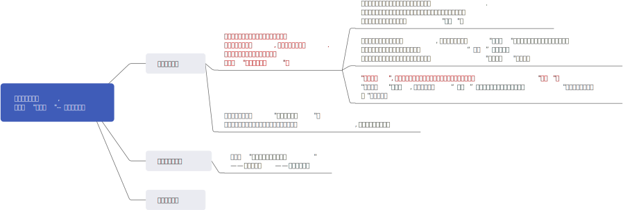

= 2025.02 Tax Power Is Public Power
:toc: left
:toclevels: 3
:sectnums:
:stylesheet: ../../../myAdocCss.css

'''

== 核心观点

== 释义

Today I'm going to talk about what taxes 税 do. Taxes do three things: they redistribute 重新分配, they raise revenue 收入 for spending 开支, and they fund 资助 the state 国家 itself. My contention 论点 is that these three functions 功能 are emancipatory 解放的. Emancipatory means freeing 解放, both in the sense of removing limitations 限制 and providing power 权力. Taxation 征税 empowers 赋予权力 the public 公众 and becomes controversial 有争议的 when we disagree about who should be included in the polity 政治体.

Let's start with redistribution. Because taxes are an exaction 强征 on private property 私有财产, taxes result in redistribution. This can be progressive 累进的, as in the case of the estate tax 遗产税, which falls exclusively on the very wealthy 富有的, or it can be regressive 递减的, as in the case of sales tax 销售税 on groceries 食品杂货, which makes poor people go hungry 挨饿. But because taxes are predictable 可预测的, they also alter 改变 the pre-distribution 预先分配 of wealth 财富. My favorite example is high top marginal income tax rates 边际所得税率. When top income tax rates were 70, 80, even 90 percent, they reduced the incentive 激励 of corporate boards 公司董事会 to overpay 超额支付 mediocre 平庸的 CEOs 首席执行官. You can see this in the data 数据: when seven out of every ten dollars was going to Uncle Sam 美国政府, corporate boards thought more carefully about whether their CEOs had actually done something to warrant 保证 a pay increase 加薪. So taxes redistribute money, and as we all know, money is power. When taxes redistribute money, they redistribute power, and when they redistribute power to the less powerful 弱势群体, that is emancipatory taxation.

But there's a mistake 错误 commonly made here. All economic policy 经济政策 alters the distribution of wealth. Do not fall into the trap 陷阱 of treating taxation or welfare spending 福利支出 as the uniquely dangerous 危险的 intervention 干预 in a natural market 自然市场. All kinds of political decisions 政治决策 change the distribution of wealth. Billions of dollars hang in the balance 悬而未决 when the US government decides what's illegal business 非法生意, like marijuana sales 大麻销售 or stock buybacks 股票回购, what can be owned and how, like a patent 专利 or an emissions credit 排放信用, or which owners deserve protection 保护 from the vagaries 变幻莫测 of the market, like corporate investors 企业投资者 or depositors 储户 at a failed bank 破产银行. All economic outcomes 经济结果 are a political product 政治产物. Remember, the three largest redistributions of wealth in US history by far are the defense 辩护 of chattel slavery 奴隶制, the genocidal expropriation 种族灭绝式剥夺 of the native nations 原住民, and emancipation 解放. They make tax-based redistribution look pretty puny 微不足道的 by comparison 相比之下.

Redistribution is not what makes taxation special. What actually makes taxes special is revenue. Taxes can be used to pay for, or at least partially offset 部分抵消, the cost of social spending 社会支出, and social spending can provide freedom from the market 市场自由. Take the case of Social Security 社会保障. It provided freedom to poor elderly people 贫困老年人: freedom from having to work until they died, freedom from feeling themselves a burden 负担 on their children. But it also made them more politically free and more likely to vote 投票. Old people were not especially reliable voters 可靠选民 before Social Security, but with Social Security, poor senior citizens 贫困老年人 had the resources 资源, the time, and the incentive to engage in politics 参与政治. Social Security made citizens 公民. This is emancipatory.

Finally, and this often gets neglected 被忽视, taxes fund the state itself. Government is not just a series of tubes 管道 connecting private pockets 私人钱包; it's not a vending machine 自动售货机. Taxes make the public sphere 公共领域 possible. They pay for the spaces with a standard of equal treatment 平等待遇标准. If I have more money, I can't check out extra library books 借更多图书馆书籍; I don't get extra space on the sidewalk 人行道. Taxes are also where private power 私人权力 is supposed to stop at the door. My boss can't stand behind me in the voting booth 投票亭, neither can my husband. If I fail my driver's test 驾照考试, I can't slip twenty bucks 20美元 across the counter 柜台 and expect a DMV agent 车管局工作人员 to give me my license 驾照. Now, our public sphere has never been as strong as it should be. Our schools do not provide equal education 平等教育; our courts do not provide equal justice 平等司法. But taxes are what fund the possibility and sometimes the practice of equality 平等.

So what do taxes do? They redistribute, they raise revenue for public investments 公共投资, and they fund the state itself. In other words, taxes redistribute money and therefore power, they raise revenue that provides freedom from the market, and they fund the state itself, which protects the places of equality. That is to say, taxes emancipate. And this is not a metaphor 隐喻. There are two groups of people in American history who knew that taxation was emancipatory, and they were the people who had every reason to know.

The first group is slaveholders 奴隶主. This is Patrick Henry, the Virginia patriot 爱国者 who famously said, "Give me liberty or give me death." He opposed the ratification 批准 of the US Constitution 美国宪法—the Constitution we live under today—at the Virginia ratifying convention 批准大会. Henry imagined a picture so horrid 可怕的, so wretched 悲惨的, so dreadful 恐怖的 that he hated to dwell on 细想 it. If Virginia ratified the Constitution, Henry predicted Congress would be able to impose a grievous 沉重的 and enormous tax on slaves and thereby compel 迫使 owners to emancipate their slaves rather than pay the tax. It was too dangerous, Henry and other slaveholders thought, to give taxing power 征税权 to the federal government 联邦政府, even one elected only by propertied white men 有产白人, because taxation could lead to abolition 废除奴隶制. Henry was wrong, of course. The Constitution gave enormous protections to slavery, including multiple limits on the federal taxing power. Those limits are still in place today. If you've ever heard that a wealth tax 财富税 is unconstitutional 违宪的, it's because of the clauses 条款 slaveholders demanded to prevent abolition by taxation. So slaveholders knew that taxation could be emancipatory.

Who else knew? Freedmen 自由民. During the Radical Reconstruction 激进重建—the brief experiment with multiracial democracy 多种族民主 in the American South after the Civil War—the federal government, for a time, protected the right of black men to vote. In South Carolina, where a majority of the population was black, a majority of the legislature 立法机构 was black too. And in South Carolina and across the South, freedmen wanted two things that would make freedom more than words on paper. One, they wanted land so they could work for themselves and not their former enslavers 前奴隶主. Two, they wanted schools for themselves and for their children. But if freedom meant land and freedom meant schools, freedom meant taxes. In the absence of federal land reform 土地改革, a new property tax 财产税 was intended to encourage big landholders 大地主 to sell some of their property. This was redistribution. It also meant revenue to build the public school system 公立学校系统, and in many states, this was the first public school system for both black children and white children. Slaveholders had hated taxes so much that they didn't have tax-funded schools 税收资助的学校 for white kids either.

We all know how Reconstruction ended: with a campaign 运动 of white supremacist violence 白人至上主义暴力 and terrorism 恐怖主义 that put former Confederates 前邦联分子 back in power. What you might not know is that anti-tax rhetoric 反税言论 was critical to the overthrow 推翻 of Reconstruction. Here's Martin Witherspoon Gary, a Confederate general 邦联将军 who famously refused to surrender at Appomattox. Former Confederates like Gary organized themselves as taxpayers 纳税人. They formed taxpayer leagues 纳税人联盟 and held taxpayer conventions 纳税人大会, and they got a resoundingly positive reception 热烈欢迎 in the North. Only a few years after the war, Northern industrialists 北方工业家 were looking at their cities, where workers were demanding unions 工会 and public investment 公共投资, and they were thinking maybe this universal suffrage 普选权 was a mistake. So when they looked at people like Gary, they did not see unreconstructed Confederates; they saw a poor beleaguered taxpayer 受困扰的纳税人. And when Gary literally planned and executed a campaign of murder 谋杀活动 to subvert 颠覆 elections in South Carolina, the North let him.

Why am I telling you this history? Because to some degree, we are reliving 重温 it. The reaction to the first Reconstruction saw sudden attention to the poor unfortunate taxpayers 不幸的纳税人—a fiscal gloss 财政幌子 on a racist cause 种族主义事业. That rhetoric returned to our politics with a vengeance 猛烈地 ever since the backlash 强烈反对 to the successes of the civil rights movement 民权运动 of the 1960s, and it remains with us today. So as we enter what may well be a turbulent period 动荡时期 of American history, I think it's important to understand what came before. Anti-tax politics 反税政治 is, and always has been, anti-democratic politics 反民主政治 because taxation empowers the public. Taxation has an emancipatory potential 解放潜力, and its potential has always provoked 激起 extraordinary periods of backlash.

[.my1]
.案例
====
"The reaction to the first Reconstruction saw sudden attention to the poor unfortunate taxpayers—a fiscal gloss on a racist cause." +
它揭示了**“反税”言论如何被用来掩盖种族主义的真实动机**。

[.my3]
[options="autowidth" cols="1a,1a"]
|===
|Header 1 |Header 2

|一、逐句解释原文这句话的意思
|- "The reaction to the first Reconstruction" +
指的是**南北战争后“重建时代”（Reconstruction, 1865-1877）**结束之后的反弹（白人至上主义势力对多种族民主改革的反击）。

- "saw sudden attention to the poor unfortunate taxpayers" +
在这种反弹中，政治话语突然聚焦“可怜的纳税人”——强调他们的负担多重、多么不公平。

- "a fiscal gloss on a racist cause" +
这是核心句式。意思是：“以财政的语言（如：纳税负担过重）来掩饰一个种族主义的目的”。

- “Gloss”是“掩饰”“粉饰”的意思。
- “Racist cause” 指的是真正的目的：反对黑人获得自由、土地、教育和政治权利。

*反对"重建时代"的一些白人政治力量，表面上打的是“纳税人受苦”的旗号，实际上是为了恢复"白人至上"的种族秩序。财政语言只是掩盖真实动机的外壳。*

|二、文章中是如何用历史事件来证明这个理论的？
|作者通过两个关键群体, 来展示“税收的解放潜力”和随之而来的反弹：

1.奴隶主知道税收有“解放”的力量 +
以**帕特里克·亨利（Patrick Henry）**为代表的**奴隶主，在美国宪法制定时, 担心联邦政府获得"征税权"。他们担忧：如果政府可以对奴隶征税，那些奴隶主就可能因经济压力而被“迫使”解放奴隶。** +
尽管后来宪法对奴隶制做了种种保护（包括限制联邦税权），*这个担忧反映出一个核心认识：税收可以成为"促进解放"的工具。*

2.自由民（freedmen）也知道税收能带来自由 +
*在重建时代（Radical Reconstruction），黑人男性获得选举权后，在南方许多州（尤其是南卡罗来纳州），黑人成为立法多数。*

*他们推动了两个关键改革：* +
-> *征收新的财产税：促使大地主出售土地，实现土地再分配。* +
-> *设立公共教育系统：通过税收, 建立首个真正的黑人和白人共同享有的"公立学校系统"。*

税收成为真正实现自由的工具，不是纸面上的自由，而是拥有土地和受教育的自由。

3.白人至上主义的反弹：用“纳税人受害论”来掩盖种族主义 +
"重建"被推翻的过程中，一个关键手段是：组织“纳税人联盟”（taxpayer leagues）和“纳税人大会”。 +

-> *以前的邦联将领（如Martin Witherspoon Gary）煽动暴力、恐吓黑人选民，但他们在北方却被当作“受害的纳税人”而不是“叛国者”。* +
-> *北方资本家也开始对"多种族民主"失去信心，认为"过度民主", 会导致公共支出（如教育、福利）过高，侵害富人利益。*
于是，他们对“纳税人受苦”的说法产生同情，哪怕这个说法是掩盖暴力和种族主义的幌子。

总结历史例证： +
*在历史上，"反对税收"的语言, 往往不仅仅是“经济”话语，而是借用经济语言包装的"反民主、反平权运动"的一部分。*

|三、今天的意义：为何作者说“我们正在重演这一切”？
|作者指出，从1960年代民权运动取得成果之后，美国再次出现“反税”情绪上升的现象。例如：
对福利、公共教育、医疗等公共开支的反对, 常以“纳税人负担重”为由。
但其深层的政治动机，很多时候与想要"种族不平等、财富不平等"的继续维持有关。

|四、归纳这个理论的核心观点：
|“反税”言论在美国历史上常常是反平权、反民主的外衣，它掩盖了对白人统治的维护、对黑人平等权利的抵制。这是一种“财政修辞”，但其背后是政治与种族的斗争。
|===
====

中文翻译

今天我要谈谈税收的作用。**税收有三重功能：重新分配财富、为开支筹集收入、以及资助国家本身。**我的论点是, **这三个功能都具有"解放性"。"解放"意味着自由，既包括"消除限制"，也包括"赋予权力"。征税会赋予公众权力，**当我们对"谁应被纳入政治体"存在分歧时，它就会变得具有争议性。

让我们从"再分配"说起。由于税收是对私有财产的强制征收，它必然导致财富再分配。这种再分配可以是累进式的，比如仅针对最富有人群的遗产税；也可以是递减式的，比如让穷人挨饿的食品销售税。但**由于税收具有可预测性，它还能改变财富的预先分配。**我最喜欢的例子是"高边际所得税率"。**当最高所得税率达到70%、80%甚至90%时，公司董事会就失去了超额支付"平庸的CEO"的动机。**数据显示：**当每十美元就有七美元要交给美国政府时，董事会会更审慎地考虑CEO是否真的值得加薪。**因此，**#税收重新分配金钱，而金钱就是权力。#**当税收重新分配金钱时，它就在重新分配权力，*#当权力被重新分配给弱势群体时，这就是"解放性的税收"。#*

但这里存在一个常见误区。**#所有经济政策都会"改变财富分配"。因此不要陷入只将税收或福利支出, 视为"对自然市场的独特危险干预"的陷阱。因为各类政治决策都在改变财富分配。#**当美国政府决定什么是非法生意（如大麻销售或股票回购）、什么可以拥有, 及如何拥有（如专利或排放信用）、哪些所有者应受保护, 免受市场波动影响（如企业投资者, 或破产银行的储户）时，数十亿美元的利益就会悬而未决。**所有经济结果都是政治产物。**记住，美国历史上规模最大的三次"财富再分配"依次是：为奴隶制辩护、对原住民的"种族灭绝式剥夺"、以及解放奴隶。相比之下，基于税收的再分配,显得微不足道。

再分配并非税收的特殊之处。真正特殊的是收入功能。税收可用于支付（或至少部分抵消）社会支出成本，而社会支出, 能提供"脱离市场的自由"。**以社会保障为例。它给予贫困老年人自由：不必工作至死的自由，不必成为子女负担的自由。但这还使他们获得更多政治自由，更可能参与投票 (一句话: 金钱能使人自由)。**在社会保障实施前，老年人并非"特别可靠的选民群体"，但**有了社会保障后，贫困老年人拥有了参与政治的资源、时间和动机。社会保障创造了公民。这就是"解放"。**

最后这点常被忽视：税收能资助国家本身。政府不只是连接私人钱包的管道，不是自动售货机。税收使公共领域成为可能。它为贯彻平等待遇标准的空间, 提供资金。就算我更有钱，也不能借更多图书馆书籍，不能占据更多人行道空间。税收还是私人权力应当止步的门槛。我的老板不能站在投票亭里监视我，丈夫也不能。如果我驾照考试不及格，不能偷偷塞给车管局工作人员20美元换取驾照。当然，*我们的公共领域从未达到应有强度：学校未能提供平等教育，法院未能实现平等司法。但##税收为"平等的可能性"——有时是实践——提供了资金。##*

那么税收究竟做什么？它重新分配财富，为公共投资筹集收入，并资助国家本身。换言之，**税收重新分配金钱, 从而重新分配权力，**它筹集的收入, 提供了脱离市场的自由，它资助的国家, 保护了"让社会更平等"的空间。也就是说，税收能解放人民。这不是比喻。美国历史上有两个群体, 深知税收的解放性，他们最有理由知道这一点。

第一个群体是奴隶主。以弗吉尼亚爱国者帕特里克·亨利为例，他 famously 说过"不自由毋宁死"。在弗吉尼亚批准大会上，他反对批准我们今天仍生活在其下的美国宪法。亨利想象出一幅如此可怕、悲惨、恐怖的画面，以至于他不愿细想。他预测如果弗吉尼亚批准宪法，国会就能对奴隶课以重税，从而迫使奴隶主解放奴隶, 而非去"缴税"。亨利等奴隶主认为，把征税权交给联邦政府（即便当时只有有产白人能投票）太危险，因为征税可能导致废奴。当然亨利错了。宪法给予奴隶制重重保护，包括对联邦征税权的多项限制。这些限制至今仍在。如果你听说过"财富税违宪"，那正是因为**奴隶主要求写入"防止通过征税来废奴"的条款。**所以奴隶主知道, 税收可能具有解放性。

另一个群体是谁？自由民。在内战后, 南方短暂尝试"多种族民主"的激进重建时期，联邦政府一度保护黑人男性投票权。在南卡罗来纳州（黑人占人口多数），立法机构多数席位也由黑人占据。在整个南方，**自由民想要两样"使自由不流于纸面"的东西：一是土地以"自食其力",而非"为前奴隶主劳作"；二是为自己和子女建立的学校。**但如果自由意味着土地和学校，自由就意味着税收。在缺乏联邦土地改革的情况下，**新财产税,旨在鼓励大地主出售部分土地——这是再分配。**税收还用于建立公立学校体系，在许多州，这是首个同时面向黑人儿童和白人儿童的公立教育体系。奴隶主如此憎恶税收，因为他们连白人的子女, 都没有过"由税收资助的学校"。

我们都知道重建如何终结：通过"前南方邦联分子"重新掌权的"白人至上主义"暴力和恐怖运动。但你可能不知道的是，**反税言论, 对推翻"重建"至关重要。**以阿波马托克斯战役中拒绝投降的南方邦联将军马丁·威瑟斯彭·加里为例。前南方邦联分子以纳税人身份组织起来，成立纳税人联盟、召开纳税人大会，在北方获得热烈响应。战后仅数年，看着城市里工人要求组建工会, 和公共投资的北方工业家们，开始怀疑"普选权"是否是个错误。因此当他们看待加里这类人时，看到的不是冥顽不化的南方邦联分子，而是可怜的"受困扰纳税人"。当加里实际策划谋杀活动, 颠覆南卡罗来纳选举时，北方听之任之。

为何讲述这段历史？因为某种程度上我们正在重蹈覆辙。**第一次"重建"后的反弹, 表现为突然关注"不幸纳税人"——给"种族主义事业"披上财政外衣。**这种言论自1960年代民权运动成功引发强烈反对后，便猛烈回归我们的政治，延续至今。因此, 当我们可能进入美国历史上又一个动荡时期时，理解过去至关重要。**"反税政治", 过去是、现在依然是反民主政治，因为征税赋予公众"权力"。**税收具有解放潜力，而这种潜力总会引发剧烈的反弹时期。

'''

== pure

Today I'm going to talk about what taxes do. Taxes do three things: they redistribute, they raise revenue for spending, and they fund the state itself. My contention is that these three functions are emancipatory. Emancipatory means freeing, both in the sense of removing limitations and providing power. Taxation empowers the public and becomes controversial when we disagree about who should be included in the polity.

Let's start with redistribution. Because taxes are an exaction on private property, taxes result in redistribution. This can be progressive, as in the case of the estate tax, which falls exclusively on the very wealthy, or it can be regressive, as in the case of sales tax on groceries, which makes poor people go hungry. But because taxes are predictable, they also alter the pre-distribution of wealth. My favorite example is high top marginal income tax rates. When top income tax rates were 70, 80, even 90 percent, they reduced the incentive of corporate boards to overpay mediocre CEOs. You can see this in the data: when seven out of every ten dollars was going to Uncle Sam, corporate boards thought more carefully about whether their CEOs had actually done something to warrant a pay increase. So taxes redistribute money, and as we all know, money is power. When taxes redistribute money, they redistribute power, and when they redistribute power to the less powerful, that is emancipatory taxation.

But there's a mistake commonly made here. All economic policy alters the distribution of wealth. Do not fall into the trap of treating taxation or welfare spending as the uniquely dangerous intervention in a natural market. All kinds of political decisions change the distribution of wealth. Billions of dollars hang in the balance when the US government decides what’s illegal business, like marijuana sales or stock buybacks, what can be owned and how, like a patent or an emissions credit, or which owners deserve protection from the vagaries of the market, like corporate investors or depositors at a failed bank. All economic outcomes are a political product. Remember, the three largest redistributions of wealth in US history by far are the defense of chattel slavery, the genocidal expropriation of the native nations, and emancipation. They make tax-based redistribution look pretty puny by comparison.

Redistribution is not what makes taxation special. What actually makes taxes special is revenue. Taxes can be used to pay for, or at least partially offset, the cost of social spending, and social spending can provide freedom from the market. Take the case of Social Security. It provided freedom to poor elderly people: freedom from having to work until they died, freedom from feeling themselves a burden on their children. But it also made them more politically free and more likely to vote. Old people were not especially reliable voters before Social Security, but with Social Security, poor senior citizens had the resources, the time, and the incentive to engage in politics. Social Security made citizens. This is emancipatory.

Finally, and this often gets neglected, taxes fund the state itself. Government is not just a series of tubes connecting private pockets; it’s not a vending machine. Taxes make the public sphere possible. They pay for the spaces with a standard of equal treatment. If I have more money, I can’t check out extra library books; I don’t get extra space on the sidewalk. Taxes are also where private power is supposed to stop at the door. My boss can’t stand behind me in the voting booth, neither can my husband. If I fail my driver’s test, I can’t slip twenty bucks across the counter and expect a DMV agent to give me my license. Now, our public sphere has never been as strong as it should be. Our schools do not provide equal education; our courts do not provide equal justice. But taxes are what fund the possibility and sometimes the practice of equality.

So what do taxes do? They redistribute, they raise revenue for public investments, and they fund the state itself. In other words, taxes redistribute money and therefore power, they raise revenue that provides freedom from the market, and they fund the state itself, which protects the places of equality. That is to say, taxes emancipate. And this is not a metaphor. There are two groups of people in American history who knew that taxation was emancipatory, and they were the people who had every reason to know.

The first group is slaveholders. This is Patrick Henry, the Virginia patriot who famously said, "Give me liberty or give me death." He opposed the ratification of the US Constitution—the Constitution we live under today—at the Virginia ratifying convention. Henry imagined a picture so horrid, so wretched, so dreadful that he hated to dwell on it. If Virginia ratified the Constitution, Henry predicted Congress would be able to impose a grievous and enormous tax on slaves and thereby compel owners to emancipate their slaves rather than pay the tax. It was too dangerous, Henry and other slaveholders thought, to give taxing power to the federal government, even one elected only by propertied white men, because taxation could lead to abolition. Henry was wrong, of course. The Constitution gave enormous protections to slavery, including multiple limits on the federal taxing power. Those limits are still in place today. If you’ve ever heard that a wealth tax is unconstitutional, it’s because of the clauses slaveholders demanded to prevent abolition by taxation. So slaveholders knew that taxation could be emancipatory.

Who else knew? Freedmen. During the Radical Reconstruction—the brief experiment with multiracial democracy in the American South after the Civil War—the federal government, for a time, protected the right of black men to vote. In South Carolina, where a majority of the population was black, a majority of the legislature was black too. And in South Carolina and across the South, freedmen wanted two things that would make freedom more than words on paper. One, they wanted land so they could work for themselves and not their former enslavers. Two, they wanted schools for themselves and for their children. But if freedom meant land and freedom meant schools, freedom meant taxes. In the absence of federal land reform, a new property tax was intended to encourage big landholders to sell some of their property. This was redistribution. It also meant revenue to build the public school system, and in many states, this was the first public school system for both black children and white children. Slaveholders had hated taxes so much that they didn’t have tax-funded schools for white kids either.

We all know how Reconstruction ended: with a campaign of white supremacist violence and terrorism that put former Confederates back in power. What you might not know is that anti-tax rhetoric was critical to the overthrow of Reconstruction. Here’s Martin Witherspoon Gary, a Confederate general who famously refused to surrender at Appomattox. Former Confederates like Gary organized themselves as taxpayers. They formed taxpayer leagues and held taxpayer conventions, and they got a resoundingly positive reception in the North. Only a few years after the war, Northern industrialists were looking at their cities, where workers were demanding unions and public investment, and they were thinking maybe this universal suffrage was a mistake. So when they looked at people like Gary, they did not see unreconstructed Confederates; they saw a poor beleaguered taxpayer. And when Gary literally planned and executed a campaign of murder to subvert elections in South Carolina, the North let him.

Why am I telling you this history? Because to some degree, we are reliving it. The reaction to the first Reconstruction saw sudden attention to the poor unfortunate taxpayers—a fiscal gloss on a racist cause. That rhetoric returned to our politics with a vengeance ever since the backlash to the successes of the civil rights movement of the 1960s, and it remains with us today. So as we enter what may well be a turbulent period of American history, I think it’s important to understand what came before. Anti-tax politics is, and always has been, anti-democratic politics because taxation empowers the public. Taxation has an emancipatory potential, and its potential has always provoked extraordinary periods of backlash.

'''
