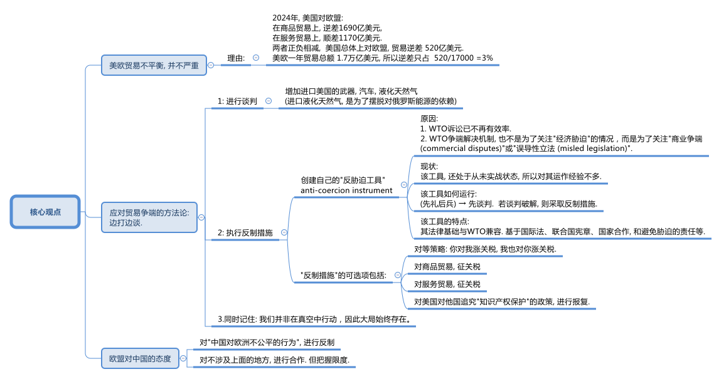
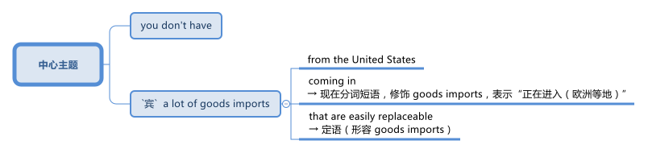
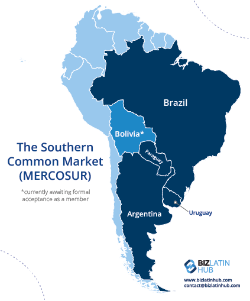

= 2025.03.06 Is Europe ready for Trump
:toc: .toc
:toclevels: 3
:sectnums:
:stylesheet: ../../../myAdocCss0.css

'''

== 释义

==== 开场白

*When it comes to* 就……而言;涉及,当提到,一谈到 International Trade 国际贸易, President Donald Trump has a special distaste (n.)厌恶;反感，不喜欢 for trade with the European Union 欧盟. At the first cabinet meeting 内阁会议 of his second term on February 26th, the president was asked by a reporter about any import tariffs 进口关税 he had in mind for the EU.

[.my2]
在国际贸易方面，美国总统唐纳德·特朗普对与欧盟的贸易特别厌恶。在他第二任期的第一次内阁会议上，记者询问了他对欧盟的进口关税计划。

"Okay, the EU tariffs, Mr. President. If you just made a decision on what level you will seek on tariffs in the European Union?"

[.my2]
“好的，欧盟关税，总统先生。如果您已经决定对欧盟征收关税的水平，您会设定在多少？”

"We have made a decision. We'll be announcing it very soon, and it'll be 25%, generally speaking, and that'll be on cars and all of the things. The European Union is a different case than Canada, a different kind of case. They've really *taken advantage of* 利用 us in a different way. They don't accept our cars. They don't accept essentially 本质上，根本上；大体上，基本上 our farm products 农产品. They use all sorts of reasons why not, and we accept everything of them, and we have about a $300 billion deficit 赤字 with the European Union. But the European Union has been—it was formed 构成；创立 in order to screw (v.)欺骗 the United States. I mean, look, let's be honest. The European Union was formed in order to screw the United States. That's the purpose of it, and they've done a good job of it. But now I'm president."

[.my2]
特朗普: “我们已经做出了决定，很快就会宣布，关税将普遍为25%，主要针对汽车和其他产品。欧盟与加拿大不同，他们以不同的方式利用了美国。他们不接受我们的汽车，也不接受我们的农产品。他们用各种理由拒绝，而我们却接受他们的一切。我们与欧盟的贸易逆差约为3000亿美元。但欧盟成立的目的是为了欺骗美国。我是说，让我们诚实一点，欧盟成立的目的是为了欺骗美国，这就是它的目的，而且他们做得很好。但现在我是总统。”

If or maybe when President Trump does impose (v.)强制推行，强制实行 tariffs on Europe, the big question becomes: How will Europe respond (v.)回应；作出反应? To help us understand Europe's position in all this 在这一切中的位置, I will be joined by a very special guest, R. Rert Schil. He is a former _European Commission_ 欧盟委员会 trade official. While he worked in the Commission 考察团，委员会 for over 30 years, for the last 5 years he was DG Trade's main official *in charge of* trade relations 贸易关系 with the United States. Hi, Rert.

[.my2]
如果或当特朗普真的开始对欧洲征收关税时，最大的问题是：欧洲将如何应对？为了帮助我们理解欧洲在这一问题上的立场，我将与一位特别嘉宾——前欧盟委员会贸易官员R. Rert Schil——进行对话。他在欧盟委员会工作了30多年，最近5年担任DG贸易的主要官员，负责与美国的贸易关系。你好，Rert。

"Hello, Chad. You are listening to an episode of _Trade Talks_ 贸易谈判, a podcast 播客 about the economics of trade and policy. I'm your host 主持人, Chad Bown, the Reginald Jones _Senior (a.)级别（或地位）高的 Fellow_ (（学术或专业团体的）会员) 资深研究员 at the Peterson Institute for International Economics in Washington. Before we get into it 参与其中, I want to provide _a quick update_ on _where things stand_ 快速更新一下目前的情况 in President Trump's latest trade war 贸易战 and a quick advertisement. If you've not already done so, do check out 调查 the Peterson Institute's new tariff tracker 关税追踪 on the PI website, titled 'Trump's Trade War Timeline 2.0: An Up-to-Date (a.)包含最新信息的 Guide.'

[.my2]
“你好，Chad。你正在收听的是《贸易对话》，一档关于贸易经济学和政策的播客。我是你的主持人Chad Bown，彼得森国际经济研究所的高级研究员。在我们深入讨论之前，我想简要介绍一下特朗普最新贸易战的现状，并做一个简短的广告。如果你还没有查看过，请务必访问##**彼得森研究所的网站，查看新的关税追踪工具**##，标题为‘特朗普贸易战时间线2.0：最新指南’。

Okay, at the moment, President Trump has tariffs 关税 后定 *coming on* 即将实施,即将生效European steel and aluminum 铝 under Section 232. This is that National Security Law 国家安全法. Those are scheduled 安排；将……列入计划表（或时间表等） to go into effect 生效 on March 12th. Trump has ordered his U.S. Trade Representative 贸易代表 to look into 调查，研究 EU member states' 欧盟成员国 Digital Services taxes 数字服务税 on American tech companies, and so we may see U.S. tariffs on Europe there sometime in the future.

He also has the _reciprocal (a.)相互的，互惠的，报答的 tariffs_ investigation 互惠关税调查 ongoing (a.)仍在进行的，不断发展的. That one is due (a.)预定；预期；预计 to wrap up 结束 on April 1st, so we could see _higher U.S. tariffs_ on whatever European products 后定 have a higher _current tariff rate_ 关税税率 than their U.S. _tariff equivalent_ 关税等价 through that rationale 理由;根本原因，逻辑依据, or we could just see 25% tariffs on Europe, like President Trump said at the cabinet meeting 内阁会议.

[.my2]
目前，*特朗普根据"第232条国家安全法",* 对欧洲钢铁和铝, 征收关税，这些关税将于3月12日生效。特朗普还命令美国贸易代表, 调查欧盟成员国对美国科技公司征收的"数字服务税"，因此, 未来我们可能会看到美国对欧洲征收关税。他还在进行"互惠关税"调查，该调查将于4月1日结束，因此, 我们可能会看到美国对欧洲产品征收更高的关税(*因此，根据这一理论，我们可以看到美国对任何"目前关税税率高于美国同等关税"的欧洲产品, 征收更高的关税.*)(通过这种逻辑，我们可能会看到, 美国对某些欧洲产品征收更高的关税，这些产品目前的关税比美国对同类产品征收的关税更高。)，或者像特朗普在内阁会议上所说的那样，对欧洲征收25%的关税。

[.my1]
.title
====
- reciprocal -> 来自*reco-proco,来来往往，来自 re-,向后，pro-,往 前，-cus,形容词后缀。引申词义互惠的，互利的。
====

There is obviously still a lot of uncertainty 不确定性, but what we also know is `主` #the likelihood# 可能性 of President Trump #后定 imposing# (v.) tariffs on Europe `谓` seems to be increasing by the day 随着每一天的过去. On March 4th, he put another round 一轮;阶段；轮次 of 10% tariffs on China. Much more surprising was President Trump's #decision# that day 后定 #to also impose 征收 25% tariffs# on most everything 后定 the United States *imports (v.) from* Mexico and Canada after initially pausing 暂停 _that tariff threat_ 关税威胁 for 30 days _back in February_. Apparently, tariffs on historical U.S. Military Allies 军事盟友 are *not just* threats (n.) _this time around_ 这一次. They are happening (v.) for real 正在发生.

[.my2]
显然，仍有很多不确定性，但我们知道的是，特朗普对欧洲征收关税的可能性, 似乎在逐日增加。3月4日，他对中国又征收了10%的关税。更令人惊讶的是，特朗普当天还决定对从墨西哥和加拿大进口的大部分商品, 征收25%的关税，此前他在2月份暂停了这一关税威胁30天。显然，这次对历史悠久的美国军事盟友征收关税, 不仅仅是威胁，而是正在发生。

'''

==== 美欧贸易之间的不平衡大么? -> 实际上并不大

Okay, Rert, to Europe. Before we get into anything specific (a.)明确的，具体的；特定的 about tariffs, let's *set the scene 提供背景信息 for* some of the underlying economics 基础经济学 here. How interdependent (a.)相互依存的;相互依赖的；互助的 are the U.S. and European economies?

[.my2]
好的，Rert，谈到欧洲。在我们深入讨论关税问题之前，让我们先了解一下背后的经济学基础。美国和欧洲经济之间的相互依存程度如何？”

So first, the European Union is *by far* 最……的程度远超其他;远远地,显然地,无可争议地 the most important economic partner 经济伙伴 of the US. `主` The second point that I would like *to make (v.) [up front* 预先；在最前面] `系` is our relationship is balanced (a.)平衡的；和谐的；安定的. No one is *taking advantage of* 利用 each other. We actually have a shared interest 共同利益 to neutralize (v.)中和;使失效，抵消 this relationship, and it's going very well. What people also maybe don't know is that `主` our bilateral trade 双边贸易 in goods and services `谓` has doubled in the last 10 years. _Where else_ do you have that growth? American exports (n.) to the EU in the last 3 years are up 35%, so that creates (v.) jobs and prosperity 繁荣 in the US.

[.my1]
.title
====
- to make (v.) [up front] :  +
"make" 指 "提出（观点、论点）"，即 "make a point"（提出一个观点）。 +
"up front" 意思是 "开门见山地、首先、事先"，表示提前说明、在一开始就提及。 +
"to make *up front*" 其实是 "make a point"（提出观点）+ "up front"（事先、首先） 的组合，意思是**“我想先提的观点是……”**。
====

There sometimes is the idea that 有时会有这样的想法 because of a deficit 赤字 in Goods, there is an imbalance 不平衡, but let me now start (v.) with something else. Let me start with Services 服务；服务项目. The US last year *exported* (v.)$462 billion worth of services *to* the EU. That *leads (v.) to* a surplus 盈余;过剩，剩余 of 117 billion. We never talk about that. There is a _Goods deficit_ (亏损，赤字，不足额) 商品贸易逆差 of 169 billion, but if you *add up the sums* 把总数加起来, you're left with 50 billion difference 差额只有500亿美元. So that's not great, and *that's not a lot* in a 1.7 trillion relationship per year. It's about 3% on the depth 深度 and the importance of the relationship.

Again, I don't want to overload (v.)使负担过重;过度堆砌 the figures 数字 here, but be aware that `主` _over 50, almost 60%_ of what the US or the EU invest (v.) in the world `谓` goes to the partner across the Atlantic. And just to give you an example, there are _3 and a half million jobs_ *directly dependent on* EU investment in the US. So if you start (v.) messing (v.) with 干扰;弄乱 this relationship, you will actually affect (v.) jobs in the US. What people can really visualize (v.)想象 is `主` the biggest BMW plant 工厂 of the world `系` is in South Carolina. It's not in Munich 慕尼黑（德国城市）, and there are similar examples of the deep investment relationship 深厚的投资关系. So that's my first point, a deep and balanced relationship.

[.my2]
====
首先，欧盟是美国最重要的经济伙伴。我想强调的第二点是，我们的关系是平衡的。没有人利用对方。我们实际上有共同的利益, 来中和这种关系，而且进展非常顺利。人们可能不知道的是，过去10年，我们的双边贸易额翻了一番。美国对欧盟的出口, 在过去三年增长了35%，这为美国创造了就业和繁荣。**有时人们认为，由于商品贸易逆差，存在不平衡，但让我从"服务贸易"开始说起。去年，##美国向欧盟出口##了价值4620亿美元的##服务，这导致了1170亿美元的盈余。##**我们从未谈论过这一点。*##商品贸易逆差为1690亿美元，但如果你把两者相加，差额只有500亿美元。##因此，#在一个每年1.7万亿美元的关系中，这并不算多，约占3%。#*

关于这种关系的深度和重要性，我不想过度堆砌数据，但要知道，美国或欧盟在全球投资的50%以上，几乎60%，都流向了跨大西洋的伙伴。举个例子，**美国有350万个工作岗位直接依赖于欧盟的投资。因此，如果你开始干扰这种关系，你实际上会影响美国的就业。**人们可以真正想象到的是，**世界上最大的宝马工厂在南卡罗来纳州，而不是在慕尼黑。**类似的例子还有很多，表明我们之间的投资关系非常深厚。这是我的第一点：深厚而平衡的关系。
====

So President Trump, when he's talking and focused on the unbalanced relationship in his view 观点，看法, he has a very, very narrow perspective 狭隘的观点, which is just looking at _Goods trade_ 货物贸易, *all the cars* 后定 coming in from 从某个地方进入 _Germany and the rest of Europe_ *into* the United States /and many fewer cars *going back* in return 作为回报. But there are a lot of cars 后定 produced by European companies in the United States, and there's an imbalance _in the other direction_ 在另一个方向 *when it comes to* 就……而言;涉及,当提到 services.

And so those services *are going to be* things like Netflix and the internet companies, financial services 金融服务, and when you *put* all those things *together*, the relationship is much more balanced.

[.my2]
**因此，当特朗普谈论并关注他认为不平衡的关系时，**他的观点非常狭隘，*只是关注"商品贸易"*——所有从德国和欧洲其他国家进口到美国的汽车，而返回的汽车(即美国出口到欧洲的汽车)却少得多。但美国有很多由欧洲公司生产的汽车. *而在服务贸易方面，不平衡则相反。 (#即, 在商品方面, 美国对欧洲是"入超" (进口 > 出口), 但在服务方面, 美国对欧洲是"出超"(出口 > 进口).#)* 这些服务包括Netflix、互联网公司和金融服务。当你把这些因素综合起来时，这种关系要平衡得多。

'''

==== 欧盟对"美国关税"的反制选项有哪些? -> 边打边谈

*That being said* 话虽如此，尽管如此, it looks like there's a really good chance that President Trump is going to end up 最终成为 *putting* some sort of tariffs *on* European Goods 后定 coming into the United States. So what I want *to ask you about* next `系` is Europe's preparedness 准备 for this.

[.my2]
====
话虽如此，特朗普很可能会对进入美国的欧洲商品, 征收某种关税。因此，我想接下来问你的是，欧洲对此的准备情况如何？
====

Now, obviously, you were part of the commission the first time around when President Trump was in office between 2017 and early 2021. You didn't **take up 开始从事（某项活动）;接受（挑战、任务等） your job **as head 领导人，负责人 of the trade relationship with the United States until 2019, so you weren't there for all of it 你不是全程都在场, but you *got to* 有机会,得以去做某事 see (v.) some of it 你有机会看到其中的一部分. What can you tell us about things that happened in the trade relationship with _the first Trump Administration_ in Europe that might be useful _Lessons Learned_ 经验教训 for this time around?

[.my2]
显然，在特朗普第一次执政期间（2017年至2021年初），你曾是欧盟委员会的一员。你直到2019年才担任与美国的贸易关系负责人，所以你没有全程参与，但你看到了一些情况。你能告诉我们一些在特朗普第一届政府期间，欧洲与美国贸易关系中发生的事情吗？这些经验对这次可能有用。

[.my1]
.案例
====
"you got to see some of it" 中的 "got to" 是 "get to" 的过去式，表示“有机会”或者“得以”去做某事。 +
所以这句话的意思是：“你有机会看到其中的一部分。”

在口语和非正式书面语中，"get to do something" 经常用来表示“有机会做某事”或“能够做某事”： +
- Did you get to visit Paris during your trip? （你在旅行时有机会去巴黎吗？） +
- He didn't get to say goodbye. （他没能来得及道别。）
====

This is not the first time we are *either* threatened (v.)受到威胁的，感到危险的 *or* experiencing US tariffs 关税, and you *refer to* 提及 the Section 232 tariffs, which *went into place* 生效,实施 on steel and aluminum and which were threatened 威胁，恐吓 on cars in that period. I think the experience 经历，往事；经验 was at the time twofold (a.)有两部分的，双重的；两倍的. First of all, you have to prepare yourself from a position where you can actually also take countermeasures 反制措施;对策, but even more importantly, you have to try to find a way to negotiate on these issues. And this is exactly what happened in 2018. We were able to —and start (v.) me with the good news 我先说好消息吧 —to avert (v.)避免;防止，转移 the car tariffs with a negotiation, doing a deal, which is one of the things that President Trump likes to do.

[.my2]
这不是我们第一次受到美国关税的威胁或实际征收，你提到了在第232条下对钢铁和铝征收的关税，以及当时对汽车征收关税的威胁。我认为, 当时的**经验是双重的。#首先，你必须从能够采取"反制措施"的立场上, 做好准备; 但更重要的是，你必须找到一种方式来谈判这些问题。(即"边打边谈".)#** 这正是2018年发生的事情。*我们通过谈判成功地避免了汽车关税，这是特朗普喜欢做的事情之一。*

[.my1]
.案例
====
.go into place
在这里，"went into place" 的意思是 “生效” 或 “实施”，指关税政策正式开始执行。 +
"go into place" 这个短语不是特别常见的固定搭配，它的意思类似于 "go into effect" 或 "be put in place"，表示某项政策、法律或规定开始生效或被实施。*在正式或书面表达中，"went into effect" 会更常用.*
====

So we did a deal to buy more _liquid natural gas_ 液化天然气 and to buy more soybeans 大豆 from the United States *in return for* not having tariffs put on cars.

We were less successful 没那么成功 on the other threat and then implemented (v.) 执行，贯彻 tariffs at the time, which were the tariffs on steel and aluminum 铝, and here we actually took countermeasures 对策；对抗措施.

It *took a while* 需要一段时间 to do that because we have a procedure 手续，步骤 to go through, but we used _a legal procedure 手续，步骤；（商业、法律或政治上的）程序 后定 for the non-initiated_ 对外行来说,对不熟悉该领域的人来说 under _the GATT 关税暨贸易总协定 WTO Safeguard rules_ 保障措施规则 *to countervail* (v.)抵消; 等量对抗，补偿 the tariffs *with* our own tariffs, and we did implement (v.)执行，贯彻 them.

So on the Trump Administration, first Administration, we actually remain stuck 卡住的，动不了的；被困住，陷入困境 with tariffs on both sides.

[.my2]
因此，我们达成了一项协议，购买更多的液化天然气和大豆，以换取不对汽车征收关税。**我们在应对其他威胁上不太成功，当时对钢铁和铝征收了关税。在这里，我们实际上采取了"反制措施"。**由于我们需要走程序，这花了一些时间，但我们根据GATT WTO保障措施规则，使用法律程序来抵消这些关税，并实施了"反制措施"。(**我们根据《关税及贸易总协定》（GATT）和世界贸易组织（WTO）的保障措施规则，**使用了一种法律程序（对外行来说可能不太熟悉），*#以我们的关税, 来反制这些关税。#*) 因此，在特朗普的第一届政府期间，我们实际上陷入了"双方都征收关税"的僵局。

[.my1]
.案例
====
.non-initiated
"for the non-initiated" 的意思是 “对外行来说” 或 “对不熟悉该领域的人来说”。 +
"initiated" 在这里指的是 “入门的、熟悉某个领域的” 人。 +
"non-initiated" 则表示 “没有入门的、不熟悉某个领域的” 人，即 “外行” 或 “不太了解这方面的人”。

在这句话中，"for the non-initiated" 暗示这个法律程序可能比较复杂，不是所有人都熟悉，因此需要特别说明。

- "This book is written for the non-initiated in economics."
（这本书是写给经济学外行看的。）
====

'''

==== 反胁迫工具 -> (先礼后兵) 先谈判, 后反制

*I want to talk a little bit more about* Europe's experience with countermeasures 对策；对抗手段；反措施.

As you mentioned, the EU was ultimately 最终，最后 effective (a.)产生预期结果的，有效的 at being able to implement (v.)执行，贯彻 a sort of rebalancing 重新平衡 when it came to the steel and aluminum tariffs, but *just* 仅仅是, 光是 having this constant (a.)持续不断的，经常发生的；恒定的 threat of other tariffs that were *out there* 存在、悬而未决、持续存在, you know, during almost the entirety of that Administration, there was a threat of 25% tariffs on cars, as you mentioned, there were also threats about potential 潜在的，可能的 tariffs if countries did Digital Services taxes.

From an outsider's 局外人， 外人 view, it seems as  that 看起来像是，似乎是 as that was happening, Europe was learning that /it might want to have all of the _policy levers_ 政策杠杆 available / 条件状语从句(省略了if) *should* 假如，万一 `主` something like that `谓` happen again.

[.my2]
我想进一步谈谈, 欧洲在反制措施方面的经验。正如你所提到的，欧盟最终能够在对钢铁和铝征收关税时, 实施某种重新平衡，但在几乎整个政府期间，都存在对其他关税的持续威胁，例如对汽车征收25%关税的威胁，以及如果国家对数字服务征税, 可能面临的关税威胁。从外部来看，欧洲似乎从中吸取了教训，可能已经掌握了所有可能需要的政策杠杆，以防类似情况再次发生。

[.my1]
.案例
====
.but just having this constant threat 但仅仅是持续存在的这种威胁
在这里，"just" 用来强调某种情况，表示 “仅仅是” 或 “光是”。

.that were out there
"that were out there" 的 "out there" 在这里表示 “存在、悬而未决、持续存在”。 +
 "there was a threat of 25% tariffs on cars that were out there" 可以理解为：
“存在着 25% 的汽车关税威胁，而且这种威胁一直悬而未决。” +
"out there" 的作用是强调 这些威胁不是短暂的，而是长期存在的，并且人们一直在关注它们。
====

**Tell us a little bit about **some of the new policy instruments 政策工具 that the European Union has developed in the meantime 在此期间，同时 since that first Trump Administration.

[.my2]
请告诉我们一些自特朗普第一届政府以来，欧盟开发的新政策工具。

Yes indeed 确实，的确；实际上；真正地, I think we learned a lesson from the first Trump Administration, and that is that `主` we `谓` might not have all the tools for a similar situation occurring in the future.

With a similar situation, I mean _what we call (v.) coercion_ (n.强迫；胁迫) 我们称之为“胁迫”的行为: weaponizing 武器化 of trade for any possible _political objective_ 政治目标, which was not done frequently, or _at all_ 在任何情况下, or _a lot_ in the first 20 years of the WTO.

[.my2]
是的，我认为**我们从特朗普第一届政府中学到了一个教训，那就是我们可能没有应对未来类似情况的所有工具。**我所说的类似情况, 是指我们称之为“胁迫”的行为：**将贸易"武器化", 以实现任何可能的政治目标，这在WTO的前20年中并不常见，**甚至几乎没有发生过。

So, it's actually 实际上，事实上；（用于开始新话题）其实 from _the experience_ with the car tariffs, plus _certain things_ 后定 also happening on the other side of the globe, that we thought (v.) we need an instrument 手段；受利用（或控制）的人，工具 _which allows us to counter (v.)抵制；抵消 any threats_ when we actually implement (v.) _what we thought (v.) were legal, non-discriminatory 非歧视的, balanced, proportionate 成比例的 policies_.

[.my2]
因此，实际上，正是由于汽车关税的经验，加上全球其他地方发生的一些事情，*#我们认为需要一种工具，使我们能够在实施我们认为合法、非歧视、平衡和成比例的政策时，应对任何威胁。#*

So, we *came up 提出，想出 with* this idea of an _anti-coercion instrument_ 反胁迫工具, which is a tool which allows us to take measures after _a quite detailed procedure_ 相当详细的程序 and within _the rules-based international order_ 基于规则的国际秩序 against what we would *define (v.) as* economic coercion 经济胁迫.

`主` One thing _which also *led to* the creation of this instrument_ `系`  is the fact that `主` #WTO litigation# (n.)诉讼，起诉, which is our _preferred 更合意的，更好的 way_ to deal with any conflict, `谓` #takes years#, and *there is no _appellate body_ 上诉机构 any longer* which would actually give a final ruling 最终裁决.

So, we wanted to be quicker (a.)快些, but let's be clear: _the anti-coercion instrument_ is not a _rapid response mechanism_ 快速反应机制.

[.my2]
**因此，我们提出了“反胁迫工具”的概念，**这是一种允许我们在经过详细程序后，**在基于规则的国际秩序框架内采取措施的工具，**以应对我们所定义的经济胁迫。**#导致这一工具创建的另一个事实是，WTO诉讼是我们解决任何冲突的首选方式，但它需要数年时间，而且不再有上诉机构来做出最终裁决。#**因此，我们希望更快，*但需要明确的是：反胁迫工具并不是一种"快速反应机制"。*

*Let's get into* some of the potential ways in which `主` use (n.) of this new anti-coercion instrument `谓` might *play out* 发生；出现.

So, let's go through a hypothetical 假设. Let's suppose (v.)假设，假定 President Trump decides (v.) to raise (v.) U.S. tariffs on European exports. You know, it could be _for any, any number of reasons_ that he's proposed 提议；计划 already, but let's suppose (v.)假设，假定 it's this reciprocity (n.)互惠，互换 rationale (n.根本原因，逻辑依据) 互惠理由 where he's basically said to countries, "If you don't lower (v.) your tariffs to my level, I'm going to raise (v.) my tariffs to your level."

Let's suppose (v.) he just does that. How would the EU actually operationalize (v.) 实施;使开始运转；使用于操作 this anti-coercion instrument *in practice* 实际上，实际操作中? How does it work?

[.my2]
让我们探讨一下这种新的"反胁迫工具"可能发挥作用的潜在方式。我们通过一个假设来展开。假设特朗普决定提高美国对欧洲出口的关税。你知道，这可能是基于他已经提出的任何理由(借口)，但假设是基于"互惠"的理由，即他对欧盟国家说：“如果你们不将关税降低到我的水平，我将把关税提高到你们的水平。”假如他这么做了, 欧盟将如何在实际中实施这一"反胁迫工具"？它是如何运作的？

It is _a carefully tailored (a.v.)定做（衣服）；专门制作，按需定制 tool_ 精心设计的工具 which starts (v.) with _an investigation 后定 to establish the facts_.

So, is there coercion  (n.)强迫，胁迫? Then it goes into a procedure where you will try to negotiate away the issue 通过谈判解决问题.

So, it's not immediately, even if there is a finding of coercion, that you *take measures* 采取措施; you try to negotiate, talk softly 温和地说话 with a big stick 大棒政策, maybe you can say that.

And only when that fails (v.), then there is the possibility to take countermeasures 反制措施. And `谓` what is also innovative (a.)革新的，新颖的；富有革新精神的 here `系` is that `主` the countermeasures which can be authorized (v.)授权；批准 under this procedure `系` are quite broad.

So, it's *not only* goods, because #that *might not be effective*# 有效的, and in any case, #with tariffs on goods# 它不仅限于商品，因为那可能无效, *you shoot (v.) yourself in your own foot* 自食其果 because you make it a tax on your own imports. So, the instrument allows also measures (n.)措施 in other areas like services, government procurement (（尤指为政府或机构）采购，购买；取得，获得) 政府采购, or the protection of _intellectual property rights_ 知识产权保护.

[.my2]
====
这是一种精心设计的工具，**它首先通过调查来确定事实-- "胁迫行为"是否的确存在？ 如果真的存在, 然后就进入一个程序，试图通过谈判解决问题。**因此，即使发现存在胁迫，也不会立即采取措施；你会尝试谈判，**用大棒政策软硬兼施，**可以这么说。**只有在谈判失败时，才有可能采取反制措施。**这里的创新之处在于，根据这一程序授权的反制措施范围相当广泛。

因此，它不仅限于"商品贸易"，因为那可能无效，而且对商品征收关税, 实际上会自食其果，因为这会增加自己的进口成本。因此，该工具还允许在其他领域采取措施，如"服务贸易"上、"政府采购"或"知识产权保护"上。
====

Now, the European Commission 欧盟委员会 has never actually utilized (v.)利用；使用 this anti-coercion 反胁迫 instrument 工具；手段 in practice 在实践中；实际上; it's primarily 主要地 a deterrent 威慑；威慑力量. So, we don't have any experience 经验 for how it would do so, but it's an interesting _intellectual 智力的；脑力的 exercise_ 练习；锻炼 to think through 仔细考虑 how the retaliation 报复；反击 actually might be used.

One option 选择 is, of course, just to impose (v.)强制实行；强加 tariffs 关税 on goods 商品, but if your relationship 关系 is asymmetric 不对称的 and you don't have a lot of _##goods imports##_ (n.)进口 后定①#from# the United States 后定② *#coming in#* 正在进入（欧洲等地） 后定③ #that are# easily replaceable 可替代的, maybe that wouldn't be an effective 有效的 deterrent 威慑；威慑力量.

[.my2]
现在，**欧盟委员会##实际上从未在实践中, 使用过这种"反胁迫工具"；它主要是一种威慑力量。因此，我们没有任何关于它将如何运作的经验，##但思考"报复可能如何被使用", 是一个有趣的智力练习。** +
*一种选择当然是"直接对商品征收关税"，但如果你们的关系不对称，并且你们没有从美国进口大量容易替代的商品，那么这可能不会是一种有效的威慑。*

[.my1]
.案例
====
from the United States → 修饰 goods imports，表示进口的来源地 +
coming in → 现在分词短语，修饰 goods imports，表示“正在进入（欧洲等地）” +
that are easily replaceable -> 定语（形容 goods imports） +

====

So, maybe you'd *go with* 选择;接受，赞同;与……一起去 something else. The other options 选择 you suggested —maybe you try to put a discriminatory 歧视性的 tax 税 on U.S. services 服务 exports 出口.

`主` Some of the versions 版本 of _the original 最初的 Digital Services Taxes_ 数字服务税 后定 coming from _EU member states_ 成员国 like France  `谓` did seem (v.) really designed (v.)设计 to target 针对 American big tech 科技 companies 公司.

If memory 记忆力，记性 serves (v.) 如果我没记错, French _Finance 财政，金融 Minister_ 财政部长 Bruno Le Maire called 称为 the French one the "GAFA tax" for targeting (v.)针对 Google, Apple, Facebook, and Amazon _at the time_ 在当时.

[.my2]
所以，也许你们会选择其他的反制方式。**你提出的其他选择——也许你们会尝试对美国的服务出口, 来征收歧视性税收。**一些来自欧盟成员国（如法国）的"原始数字服务税版本", 确实似乎是为了针对美国大型科技公司而设计的。 +
如果我没记错的话，法国财政部长布鲁诺·勒梅尔, 当时将法国的这种税, 称为“GAFA税”，针对的是谷歌、苹果、脸书和亚马逊。

Or `主` #the third one# 后定 you mentioned 提到 `系` #is# maybe the EU retaliates 报复 by *going after* 追究;追求，追逐 _intellectual property 知识产权 rights_ 权利 protection 保护. That one *has always been a little unclear 不清楚的 to me* how you would put that into practice 实践.

[.my2]
或者你提到的**第三种选择是，欧盟可能通过追究"知识产权保护"来进行报复。**这一直让我有点不清楚, 你们将如何将其付诸实践。

For example, suppose (v.)假设 the EU tries to punish 惩罚 the United States by withholding 保留；拒绝给予 IP protection 保护 for American companies 公司. Maybe the idea 想法 here is to try to hurt 伤害 Hollywood 好莱坞 by *giving away* 免费赠送;捐赠，分发 free rights 权利 in France to show (v.)放映 American movies 电影.

[.my2]
例如，**假设欧盟试图通过拒绝给予美国公司"知识产权保护", 来惩罚美国。**也许这里的想法是, 通过在法国免费放映美国电影, 来打击好莱坞。

While 尽管，虽然 French consumers 消费者 might like that, to my mind 在我看来, `主` where the retaliation 报复 breaks down 失败 `系` is France's own movie 电影 industry 产业 would likely be super (ad.)非常,极其 annoyed (a.)恼怒的, and that's because French citizens 公民 are now getting free American movies 电影, and so they're less likely 不太可能 to pay (v.)支付 to watch (v.)观看 French movies 电影.

[.my2]
虽然法国消费者可能会喜欢这一点，但在我看来，报复失败的地方在于法国自己的电影产业可能会非常恼怒，因为法国公民现在可以免费观看美国电影，因此他们不太可能花钱观看法国电影。

Anyway, these are interesting 有趣的 ideas 想法, but perhaps 也许 still some kinks 小问题 to work out 解决 in terms of 在…方面 implementation 实施, but we will be tracking 追踪 them closely 密切地.

[.my2]
无论如何，这些都是有趣的想法，但在实施方面可能仍有一些小问题需要解决，但我们将密切追踪它们。

'''

==== "反胁迫工具"的起效时间 -> 耗时很长.

Okay, you also mentioned that the ACI (Anti-Coercion Instrument 反胁迫工具) is not a rapid 迅速的 response 回应 instrument 工具；手段. In response to 作为对…的回应 Trump's tariffs 关税 this time around, we have seen countries like China and Canada retaliate (v.)报复 in potentially (ad.)可能 just days.

[.my2]
好的，*你还提到"反胁迫工具"（ACI）并不是一种"快速回应"的工具。作为对特朗普这次关税的回应，我们看到像中国和加拿大这样的国家, 可能在短短几天内就进行了报复。*

Do we have any sense 感觉；理解 _at all_ 以任何方式或方面 *for* how long _we're talking about here_ 在当前这个语境中,在我们的讨论范围内 #*between*# when the EU begins (v.) an ACI investigation 调查 #*and*# the point 时间点 at which countermeasures 反制措施 could be imposed 强加？ Is it four weeks, 6 months, 18 months? How long are we thinking?

[.my2]
我们是否**对"欧盟开始ACI调查, 到可以实施"反制措施"之间的时间",** 有任何概念？是四周、六个月, 还是十八个月？我们觉得**需要多长时间？**

Well, the regulation 法规；规章, if you look at it, it has certain deadlines 截止日期 which run into 持续 several months normally 通常. So, I think *it's safe 安全的 to say* it's not going to take four weeks; it's going to take longer for the investigation 调查 to conclude (v.)结束 and to do all of this.

[.my2]
嗯，如果你看一下法规，它有一些通常持续数月的截止日期。所以我认为可以肯定地说，这不会(仅)花四周时间；*调查的结束, 和所有相关工作的完成, 将需要更长的时间。*

And *this is the point* 这是问题的关键所在 that is difficult 困难的 to verify 验证：how much time we can spend on negotiations 谈判？ Because I really want *to put the cursor 光标 on the fact that* we are dealing with 处理 an administration 政府 in the U.S. who likes to do deals 交易, and we have *stretched out 伸出 our hand* and say we're ready to do deals, which is one phase 阶段 of the instrument 工具；手段. Ultimately 最终, it will take quite a while 一段时间, also because of the politics 政治 involved.

[.my2]
这是一个难以验证的点：我们可以在谈判上花多少时间？因为我真的想强调一个事实，**我们正在与一个"喜欢做交易的美国政府"打交道，**而我们已经伸出了手，表示我们准备好做交易，这是该工具的一个阶段。最终，由于涉及的政治因素，这将花费相当长的时间。

'''

==== "反胁迫工具" 与  "WTO仲裁" 的关系 -> 两者的法律基础是相兼容的.

Let's *go back to* one other thing with the anti-coercion 反胁迫 instrument 工具；手段. Talk us through 详细解释 how the European Commission 欧盟委员会 thinks about this ACI instrument in a WTO (World Trade Organization 世界贸易组织) context 背景.

[.my2]
让我们回到"反胁迫工具"的另一个问题。详细解释一下欧盟委员会, 会如何在WTO背景下, 看待这个ACI工具。

Normally 通常, one would say that if a country is going to do something to my trade 贸易 that I don't like, my response 回应 isn't *to take matters 事情 into my own hands* 亲自处理, but it's *to bring a dispute 争端 to* Geneva and the WTO. And that's the line 立场 that I've understood the EU to be pushing for 推动, um, *not only* for itself *but* for others as well, for decades 数十年.

[.my2]
通常，人们会说，如果一个国家要对我的贸易, 做一些我不喜欢的事情，我的回应不是亲自处理，而是将争端提交到日内瓦和WTO。这就是我理解的欧盟几十年来, 不仅为自己, 也为他人推动的立场。

How does the ACI *fit into* 适应 this? Yeah, make no mistake 不要误会, we still push —and this is the possibility 可能性 to do a little advertisement 广告 for the WTO, which is _a little bit_ 稍微；一点点；少量 the background 背景 now —we still are multilateralists 多边主义者(主张在国际事务中通过多国合作解决问题) and believe that conflicts 冲突 should be solved 解决 _wherever 无论在哪里 possible_ 只要有可能 in the WTO, because the value 价值, the predictability 可预测性 of WTO rules 规则, is something which we cherish (v.)珍视 a lot.

[.my2]
ACI如何适应这一点？是的，不要误会，我们仍然在推动——这也是为WTO做一点广告的机会，现在这有点成为背景了——我们仍然是"多边主义者"，并认为冲突应尽可能在WTO内解决，因为WTO规则的价值和可预测性, 是我们非常珍视的。

But we've also *come to the conclusion 结论 that* 得出结论 this is not always the only possible response 回应 to safeguard (v.)保护 our rights 权利, for the reasons I mentioned: the WTO dispute settlement 争端解决机制 is not functioning (v.)运作, it wasn't meant 打算；意欲；有…的目的 to look at 关注,将目光集中在 _economic coercion_ 经济胁迫 situations 情况, it was meant to look at _commercial_ 商业的, if you wish, _disputes_ 争端 or _misled 误导的,把……带错方向 legislation_ 立法.

[.my2]
**但我们也得出结论，这并不是保护我们权利的唯一可能回应，原因是**我提到的：*WTO争端解决机制并没有运作，它并不是为了关注"经济胁迫"的情况，而是为了关注"商业争端"或"误导性立法"。*

So, `主` what we did with the anti-coercion 反胁迫 instrument 工具；手段 to make sure that the legal 法律的 basis 基础 `系` is compatible 兼容的 with WTO —and this is, if you look at the explanations 解释, _the explanatory 解释性的 part_ of the regulation 法规；规章 —*it clearly 清楚地 sets out 阐述,详细陈述 that* this is based on 基于 international law 国际法, the UN Charter 联合国宪章, the duties 责任 of countries to cooperate (v.)合作 and refrain (v.) from 避免 coercion 胁迫, etc., etc.

[.my2]
因此，*我们通过"反胁迫工具", 确保法律基础与WTO兼容*——如果你看一下法规的解释部分——它清楚地阐述了, 这是**基于国际法、联合国宪章、国家合作, 和避免胁迫的责任等。**

So, we grounded (v.)以……为根据 it in 基于 public international law 国际公法 in order to have a solid 坚实的 base 基础 to react 反应—not to act (v.)行动, to react (v.) —to a breach 违反 of law 法律. And for this, we needed the public 公众 of the international law 国际法 scene 场景, because `主` the WTO *on its own* `谓` doesn't provide 提供 the measures 措施 or the tools 工具 to actually react (v.) to this situation 情况.

[.my2]
因此，我们将其基于"国际公法"，以便有一个坚实的基础, 来对违法行为作出反应——不是行动，而是反应。为此，我们需要国际法场景中的公众，因为WTO本身并没有提供应对这种情况的措施或工具。

But just as 正如 ① *we've #never# seen* the Commission operationalize (v.)使运作；实施 use of the anti-coercion 反胁迫 instrument 工具；手段 in practice 实际上，实际操作中, ② *we #also# haven't seen* litigation 诉讼 under the WTO 后定 that might challenge (v.) the legality 合法性 of _the anti-coercion instrument **actually play out**_ 展开；发生,  ③ *#nor# have we seen*  any WTO rulings 裁决 to know (v.) _just how consistent 一致的 or inconsistent 不一致的 it might be_. So, that in itself is an open question 未解决的问题.

[.my2]
但正如我们从未看到欧盟委员会在实践中实施"反胁迫工具"的使用一样，我们也尚未看到任何WTO诉讼, 来挑战"反胁迫工具"的合法性，或任何WTO裁决来确认其一致性或矛盾性。因此，这本身就是一个未解决的问题。

[.my1]
.title
====
句子结构解析： +
主干：But just as we've never seen A, we also haven't seen B, nor have we seen C. +
A（第一件没见到的事情）：the Commission operationalize use of the anti-coercion instrument in practice +
B（第二件没见到的事情）：litigation under the WTO that might challenge its legality actually play out +
C（第三件没见到的事情）：any WTO rulings to determine its consistency

正如我们从未见过欧盟委员会在实践中, 使"反胁迫工具"发挥作用; 我们也从未见过在世贸组织框架下的诉讼, 真正展开; 也未见过任何世贸组织的裁决，因此无从得知, 其"合法性"到底有多"一致"或"不一致"。
====

'''

==== 欧盟从与"第一届特朗普政府"的打交道中, 获得的教训经验 -> 就与特朗普做交易

[Music] It's certainly the case that 确实这是事实 President Trump does like (v.) to do deals 交易 as well. What can you tell us about some of the other lessons 后定 learned 吸取的教训 from the EU's side from the first administration 政府？

[.my2]
当然，**特朗普总统确实喜欢做交易。**你能告诉我们欧盟从第一届特朗普政府中学到的其他教训吗？

Just reading the reporting, *it seems as if* some senior-level 高级别的 officials 官员 have already come to Washington to meet their counterparts 对应的人；同行, uh, in the Trump administration to get some of these conversations 对话 后定 already going 进行. You will have seen that `主` _one of the first things_ the new _Trade and Economic Security Commissioner_ 贸易及经济安全专员 —meaning _minister 部长 of the EU_ — has done `系`  #was# go to the United States, and you will have seen that many other leaders from the European Union, heads of state 国家元首, went to Washington to also pass 传达 that message 后定 that we're open for business 愿意合作.

[.my2]
从报道来看，似乎一些高级官员已经来到华盛顿，与特朗普政府的同行会面，以推动这些对话的进行。你会看到，欧盟新任"贸易与经济安全专员"——即"欧盟部长"——所做的第一件事就是前往美国，*你也会看到许多其他欧盟领导人，包括国家元首，前往华盛顿, 传达我们愿意与美国合作的信息.*

I think *we are serious* 认真的 状from the EU side *to try to find* something which would satisfy 满足 our American friends or our American present administration. And you will have seen from the public statement 公开声明 that the first thing we always say `系` is we're ready to look at your demands 要求 and negotiate 谈判.

[.my2]
我认为, 欧盟方面是认真的，**试图找到能够满足美国朋友或美国现任政府的东西。**从公开声明中你会看到，我们总是首先表示愿意审视你们的要求, 并进行谈判。

And there were actually things mentioned 提及，说起，谈到 —cars was mentioned, passenger cars 乘用车. We do have a higher tariff 关税 than the U.S., and that has been a constant feature 持续的特点 in some of the remarks 评论 of our American counterparts. And there are other things that we can think about. I mean, obviously, we have a strong interest 强烈的兴趣 *in any case* to buy weapons 武器；军火; we already buy a lot of weapons in the U.S., and with the present situation, that will only increase.

[.my2]
实际上提到了一些事情——比如"乘用车"。我们的关税确实比美国高，这在美国同行的评论中, 一直是一个持续的特点。还有其他一些我们可以考虑的事情。我的意思是，显然，我们无论如何都有强烈的兴趣购买武器；我们已经在购买大量美国武器，而在当前形势下，这种情况只会增加。

Let me also add that last time, the focus 焦点 was on energy 能源, where *in any case* we had to diversify (v.)使多样化 and *wean (v.)使断奶；使断念；使放弃 ourselves off* 逐渐摆脱 the Russian supplies 供应, which is now becoming even more important. And the United States is now our biggest supplier 供应商 already on LNG 液化天然气, and there is a potential 潜力 to do more. So, there are actually real-life interests 现实利益 here that we could maybe look at and see what can be done, and that has been, I think, a constant (a.) message 持续的信息 from the EU side.

[.my2]
让我补充一点，上一次的焦点是能源问题，**无论如何我们都必须实现多样化, 并逐渐摆脱俄罗斯的供应，**这一点现在变得更加重要。而美国已经是我们在"液化天然气"方面的最大供应商，并且还有进一步合作的潜力。因此，这里确实存在一些现实利益，我们可以审视并看看能做些什么，我认为这是欧盟方面持续传达的信息。

[.my1]
.title
====
- wean -> 来自 PIE*wen,追寻，渴求，努力，词源同 win,wonted.后用于指小孩摆脱母乳，开始习惯正 常的饮食，从而引申词义断奶。
====

`主` One of the challenges 挑战, obviously, *in the timing 时机 of* _what's happening here_ with these tariff threats 关税威胁 `系` is, simultaneously 同时, you have major developments 重大进展 后定 taking place 发生、举行 in the Russia-Ukraine war. President Trump clearly wants to settle 解决 the war; he had a blow-up 争吵 in the Oval Office 椭圆形办公室 last week with Ukrainian President Zelensky, and the White House just announced it's _at least_ temporarily suspending 暂停 military aid 军事援助 to Ukraine. I think, as a policy matter 政策问题, President Trump wants to reduce 减少 U.S. involvement 参与 in NATO and its role in providing 提供 military security 军事安全 to Europe.

[.my2]
显然，这些关税威胁的时机面临的挑战之一是，与此同时俄乌战争正在发生重大进展。特朗普总统显然希望解决这场战争；他上周在椭圆形办公室, 与乌克兰总统泽连斯基发生了争吵，白宫刚刚宣布至少暂时暂停对乌克兰的军事援助。我认为，作为一个政策问题，特朗普总统希望减少美国对北约的参与, 及其在提供欧洲军事安全方面的作用。

How do these other non-trade issues 非贸易问题, but nevertheless 然而，不过 still #issues# 后定 between the United States and Europe 后定 #that# are incredibly 难以置信地；非常地 important —how are they likely to affect (v.)影响 Europe's trade response 贸易回应 to any tariffs 后定 that the Trump administration might impose 施加？ I don't have the answer to that. I mean, I think the trade officials —and I'm a former trade official —we know that we are not acting in a vacuum 在真空中行动, so the bigger picture 大局,更大的全局 is always there.

[.my2]
这些非贸易问题——但仍然是美国和欧洲之间极其重要的问题——如何可能影响欧洲对特朗普政府可能施加的任何关税的贸易回应？我没有答案。我的意思是，我认为贸易官员——*我本人曾是贸易官员——我们知道##我们并非在真空中行动，因此大局始终存在。##*

And *it's true to say that* we are at a very important and difficult point 关键时刻 _right now_ *with* the situation in the Russian aggression 侵略 *and* the developments in the United States. The European leaders, *#be# 无论是* it from the European Commission, *#be# 还是* it from the member states 成员国, have been quite clear to say that `主` a firm response 坚定的回应 `谓` would be needed, so basically arguing (v.)主张 a _separation_ 分离 of the trade discussions 贸易讨论 _from_ bigger political things 更大的政治问题, which was something which we were able to achieve 实现 in the last [Music] decades 十年.

[.my2]
确实，我们现在正处于一个非常重要且艰难的时刻，一方面是俄罗斯的侵略行为，另一方面是美国的发展。欧洲领导人，无论是来自欧盟委员会还是成员国，都明确表示需要坚定的回应，因此基本上主张, 将贸易讨论与更大的政治问题分开，这是我们在过去几十年中能够实现的事情。

[.my1]
.title
====
.be it from ... be it from ...
在 "be it from the European Commission, be it from the member states" 这两个 "be it" 中，*"be" 是 虚拟语气，表示 "无论是……还是……"*（whether it is from... or from...）。 +
"be it..." = "whether it is..."，用于强调 无论是哪种情况，结论都是一样的，是一种正式的表达方式。 +
- Be it rain or shine, we will go hiking.
（无论是晴天还是雨天，我们都会去远足。） +
- Be it ever so humble, there’s no place like home.
（无论多么简陋，没有地方比得上家。）
====

'''

==== "欧盟"与"非美国的第三国", 建立的自由贸易协定 -> 有益处

Now, I want to turn to 转向 the European Union's relationship 关系 with third countries 第三国. During President Trump's first term 任期, there were a number of other countries out there who *made a big show of* 大张旗鼓地;刻意夸大、故意炫耀、大张旗鼓地做某事 being able to conclude 达成 free trade agreements 自由贸易协定 in the absence of 在…缺席的情况下 the United States, the message being something like, "Hey, we can do _trade liberalization_ 贸易自由化 without you." The EU itself closed an important deal 协议 with Japan, for example. More recently, in December of 2024, there was news that the European Commission had agreed to a deal with Mercosur 南方共同市场.

[.my2]
现在，我想转向"欧盟与第三国的关系"。在特朗普总统的第一任期内，**有一些其他国家大张旗鼓地表示，即使没有美国，它们也能达成自由贸易协定，**传递的信息类似于：“嘿，没有你，我们也能实现贸易自由化。”例如，**欧盟本身与日本达成了一项重要协议。**更近一些，在2024年12月，有消息称欧盟委员会已与南方共同市场达成协议。

[.my1]
.title
====
.make a big show of something
故意夸大地展示某事，试图引起关注或传递某种信息。 +
"make a big show of" = "刻意夸大、故意炫耀、大张旗鼓地做某事"，通常带有 强调或讽刺意味。

.Mercosur
是巴西、阿根廷、乌拉圭、委内瑞拉（2017年被终止成员国资格）和巴拉圭五个南美洲国家的区域性贸易协定（Regional Trade Agreement, RTA）. +
*南方共同市场基于民主宪章，所以不允许"非民主国家"的加入.* 并建立了自由贸易区和共同关税协定。

南共市被认为是一个强大的经济集团，国内生产总值为4.58万亿美元，占南美洲总生产总值的82.3%。总面积1300万平方公里，并拥有超过2.75亿居民（约占南美洲人口的70%）。

====

_This was one_ that, I think, you cover 涉及 *not just* trade relations 贸易关系 with the United States *but* everybody in the hemisphere 半球, so _it's one_ that you had a big role in 扮演重要角色. What do you think? Should the United States be worried (a.)担心 that there's going to be a proliferation 激增;（数量的）激增，剧增；（细胞、组织、有机体的）繁殖，增生；大量 of free trade agreements amongst everybody else 其他每个人 this time around?

[.my2]
我认为，这项协议不仅涉及与美国的贸易关系，还涉及整个半球的国家，因此你在其中扮演了重要角色。你怎么看？美国是否应该担心这一次的"自由贸易协定"在各国之间激增？

I'm not sure whether they should be worried, and I just read that they also gave up 放弃 the APEP (=The Americas Partnership for Economic Prosperity 美洲经济繁荣伙伴关系), this initiative 倡议 with Latin America, if I'm correctly informed 通知，告知. So, they clearly don't want to do what we do. But I think it is true that `主` #those countries# who are interested in maintaining 维持 an open trading system 开放贸易体系 based on rules and predictable 可预测的, stable relations 稳定关系 `谓` #might# have more interest to work together 合作.

[.my2]
我不确定他们是否应该担心，而且我刚刚读到，如果我的信息正确的话，他们也放弃了与拉丁美洲的APEP倡议。所以，他们显然不想做我们所做的事情。但我认为，那些有兴趣维持一个"基于规则、可预测, 且稳定的"开放贸易体系的国家，可能会更有兴趣合作。

Let's put it simple as that 我们就这么简单说吧. So, with a situation as it is now, there's, I think, `主` _a heightened 增强的 or a better incentive_ 激励 to actually conclude (v.) deals `谓` *built (v.) on* trust 信任 with those partners 后定 that you do trust. And `主` *that*, I think, `谓` *means (v.)意味着 that* also we, from the EU, are trying to finish 完成 the negotiations 谈判, and we have finished New Zealand, Chile, update —I think there is a good chance that we will update 更新 the Mexico agreement, because Mexico also has an interest to have partners with a predictable policy environment 政策环境. And Mercosur is, of course, the biggest part, and *I hasten (v.)急忙进行；赶紧说（或做） to add 补充说 that* we're also restarting 重新启动 the discussions 讨论 with India, which is, of course, also a hugely important partner. All of that, I think, in the present context 当前背景下, makes a lot of sense 很有意义.

[.my2]
让我们简单地说，在当前形势下，我认为确实有更强的动力, 去与那些你信任的伙伴达成基于信任的协议。这意味着，欧盟也在努力完成谈判，我们已经完成了与新西兰和智利的协议更新——我认为, 我们很有可能更新与墨西哥的协议，因为墨西哥也有兴趣与"具有可预测政策环境的伙伴"合作。当然，南方共同市场是最大的一部分，我还想补充说，我们也在重新启动与印度的讨论，印度当然也是一个非常重要的伙伴。我认为，在当前背景下，这一切都很有意义。

'''

==== 欧盟与美国, 如何合作应对中国的挑战问题

There's another really important third country out there that is, of course, China. Also, during the Trump administration's first term, the EU, the United States, and Japan were actually working together somewhat (ad.)稍微，有点 behind the scenes 幕后 on something called the Trilateral 三边机制;有三边的. My understanding is _you were part of this_, and the goal was *to think hard about* 认真思考 potential new rules to address (v.)解决 some areas of common concern 共同关切 *when it comes to* 涉及,当提到 China, and in particular, Chinese subsidies (n.)补贴. Tell us more about that experience of working with the first Trump administration on that area of common concern 共同关注的问题.

[.my2]
还有一个非常重要的第三国，那就是中国。同样，在特朗普政府的第一任期内，欧盟、美国和日本实际上在幕后合作，进行了一项名为“三边机制”的工作。我的理解是，你参与了这项工作，其目标是认真思考潜在的新规则，以解决与中国相关的一些共同关切领域，特别是中国的补贴问题。请告诉我们更多关于与第一届特朗普政府在这一共同关切领域合作的经验。

Well, I think /for much of the last years 我认为在过去的几年里, there was no big disagreement 分歧 about the analysis 分析 on _what needs to be fixed 修正 in the rulebook 规则手册 in the WTO_ if you really want to address (v.) non-market economy practices 非市场经济行为 as we have seen them develop (v.) over the last two decades, maybe. So, the Trilateral (a.)有三边的 was one of the first attempts 尝试 to look at the rulebook and say, "*What would it be* if we just sat together 坐下来 and found a way to deal with 处理 some of these practices?" And that was actually quite successful, uh, and the idea was *to spread* 推广 this *to* like-minded countries 志同道合的国家 and make an initiative 倡议 and find a way to implement (v.)实施 these things *later on* 稍后.

*It didn't really go very far* after this first ministerial meeting 部长级会议 early 2020; there was no follow-up 后续行动 in the next couple of years. That was how the EU *dealt (v.) with* 应对 China with the first Trump administration.

[.my2]
嗯，我认为, 在过去几年的大部分时间里，对于如果真想解决过去二十年来发展的非市场经济行为，对"WTO规则手册需要进行修正"的分析, 并没有太大分歧。因此，三边机制是最早的尝试之一，旨在审视规则手册并说：“如果我们坐下来，找到处理这些行为的方法，会是什么样子？”这实际上相当成功，其想法是, 将这一机制推广到志同道合的国家，并制定一项倡议，以便以后实施这些措施。在2020年初的第一次部长级会议之后，这一机制并没有取得太大进展；在接下来的几年里也没有后续行动。这就是欧盟与第一届特朗普政府, 应对中国的方式。

How did things change when the Biden administration arrived in early 2021? Was there any progress 进展 there between the EU and U.S. on how to address (v.), or at least how to think about, the China challenge 挑战 in specific economic areas 经济领域？

[.my2]
当拜登政府于2021年初上任时，情况有何变化？欧盟和美国在如何应对，或至少如何思考中国在特定经济领域的挑战方面，是否取得了任何进展？

We then had very long discussions in the context of 在…背景下 the Trade and Tech Council 贸易与技术委员会 with the United States on the China challenge, China being the predominant (a.)明显的；占主导地位的，占支配地位的 preoccupation (n.使人全神贯注的事物，使人入神的事物；全神贯注) 主要关切 of any U.S. administration the last 10 years, 15 years. And we actually were able to do a few things to coordinate 协调 and cooperate 合作 on China-related issues, be it on medical devices 医疗设备, where we jointly (ad.)共同地；连带地 *wrote to* China on their practices on public procurement 公共采购, *be* 无论是 it on trying to find ways *to deal with* some of the cyber threats 网络威胁, and so on.

[.my2]
随后，我们在贸易与技术委员会的背景下与美国进行了非常长时间的讨论，讨论中国的挑战，中国在过去10年、15年一直是任何美国政府的主要关切。我们实际上能够在中国相关问题上进行一些协调与合作，无论是在医疗设备领域，我们联合致信中国，就其在公共采购方面的做法提出意见，还是试图找到应对一些网络威胁的方法，等等。

So, what I think the difference is, is the response to these issues, because we didn't believe that _putting tariffs on China_ —and don't forget `主` the original justification 正当理由 `系` was _a 301 intellectual property 知识产权 case_ —we also have issues with that, but we tried to find other ways. We have a very active cooperation 积极合作 on intellectual property 知识产权 with China, which works or doesn't work, you can argue about that, but we wanted to stay within the rulebook 规则手册, let's put it like that, which is quite complicated 复杂的.

[.my2]
所以，我认为不同之处在于对这些问题的回应方式，因为我们不相信对中国加征关税——别忘了最初的正当理由是一个301知识产权案件——我们也有问题，但我们试图找到其他方法。我们与中国在知识产权方面有着非常积极的合作，你可以争论它是否有效，但我们希望保持在规则手册的框架内，让我们这样说，这相当复杂。

[.my1]
.title
====
.Special 301 Report
The Special 301 Report 特别301报告 is prepared (v.) annually 每年 by the Office of the United States Trade Representative (n.a.) (USTR) 美国贸易代表办公室 that identifies (v.)识别 trade barriers 贸易壁垒 to United States companies and products (n.) *due to* the intellectual property laws 知识产权法, such as copyright 版权, patents 专利 and trademarks 商标, in other countries. By April 30 of each year, the USTR must identify (v.)  countries which do not provide "adequate and effective" protection 充分有效的保护 of intellectual property rights or "fair and equitable 公平合理的，公正的 market access 公平公正的市场准入 to United States persons that *rely upon* intellectual property rights".

特别301报告由美国贸易代表办公室（USTR）每年编制，旨在识别由于其他国家的"知识产权法"（如版权、专利和商标）对美国公司和产品造成的贸易壁垒。每年4月30日前，USTR必须确定那些__未能提供“充分有效”知识产权保护__, 或__未能为依赖知识产权的美国个人提供“公平公正市场准入”__的国家。

By statute (n.法令，法规) 根据法律规定, the annual _Special 301 Report_ includes (v.) a list of "Priority (a.n.)优先的 Foreign Countries 重点外国国家", that are judged *to have* inadequate (a.)不充分 intellectual property laws; these countries may be subject to sanctions 制裁. In addition, the report contains (v.) a "Priority (a.) Watch List 重点观察名单" and a "Watch List 观察名单", containing (v.) countries whose intellectual property regimes (统治制度，政权) 知识产权制度 are deemed (v.)认为；视为；相信 of concern (n.担心，忧虑；使人担忧的事物) 被认为存在问题.

根据法律规定，年度特别301报告包括一份“重点外国国家”名单，这些国家被认为知识产权法不充分；这些国家可能会受到制裁。此外，报告还包含“重点观察名单”和“观察名单”，列出了被认为知识产权制度存在问题的国家。

`主` Most countries 后定 included in the _Priority Watch List_ 优先观察列表 and _Watch List_ between 1996 and 2000 `谓` were requested by _Pharmaceutical 制药的 Research and Manufacturers 制造商；厂商 of America_ (PhRMA) 美国药品研究与制造商协会 or _the International Intellectual  智力的，理智的 Property Alliance_ (IIPA) 国际知识产权联盟.

1996年至2000年间，列入重点观察名单和观察名单的大多数国家是由美国药品研究与制造商协会（PhRMA）或国际知识产权联盟（IIPA）提出的。

*In response to* countries being included on _the Special 特殊的，特别的；格外看重的 301 Report Watchlists_ the U.S. government may initiate (v.)启动 _dispute settlement proceedings_ 争端解决程序 at the World Trade Organization (WTO) 世界贸易组织 or other relevant trade agreement 相关贸易协定, including _the North American Free Trade Agreement_ (NAFTA) 北美自由贸易协定. The U.S. government can also eliminate (v.)取消 tariff preferences (偏爱，偏好) 关税优惠 后定 *unilaterally  (ad.)单方面地 granted* 单方面授予, such as _the Generalized 笼统的；普遍的；概括性的；全面的 System of Preferences_ (GSP) 普惠制,普遍优惠制.

针对被列入特别301报告观察名单的国家，美国政府可能会在世界贸易组织（WTO）, 或其他相关贸易协定（如北美自由贸易协定，NAFTA）下, 启动争端解决程序。美国政府还可以取消单方面授予的关税优惠，例如普惠制（GSP）。

If an USTR investigation concludes (v.)得出结论 that a country has violated 违反 a trade agreement /`主` Section 301 `谓` allows (v.) the U.S. government to impose (v.)实施 unilateral (a.)单方的，单边的 trade sanctions 单边贸易制裁 /if the country is not a member of _the World Trade Organization_ (WTO) or any other _trade agreement_ 贸易协定 后定 establishing (v.) _dispute settlement provisions_ (（法律文件的）规定，条款) 争端解决条款, such as free trade agreements 自由贸易协定, which are *relevant (a.) to* 与……有关的 the alleged (a.)（未经证实而）声称的，所谓的；（在证据不足的情况下）被指控的 violation 涉嫌违规; 哪些与所谓的违规行为有关.

_Unilateral trade sanctions_ 单边贸易制裁 under section 301 were imposed on December 20, 2001, on Ukraine, which was not yet a WTO member, by imposing a prohibitive (a.)限制性的，禁止的 tariff 禁止性关税 on metals 金属, footwear 鞋类, and other imports because the USTR  美国贸易代表署（United States Trade Representative） concluded that the country had failed to enact (v.)制定，通过，颁布（法令） legislation 立法 to enforce (v.)实施，执行（法律、规章）；强迫，迫使 copyright *in relation to* 关于；与……相关 music CDs and their export.

Section 301 was also invoked 援引 by President Trump in March 2018, *setting off* 引发;引爆 (炸弹) the 2018 China–United States trade dispute 中美贸易争端.

如果USTR的调查得出结论，认为某个国家违反了贸易协定，而该国不是"世界贸易组织"（WTO）或任何其他制定"争端解决条款的贸易协定"（如"自由贸易协定"）的成员，301条款允许美国政府实施单边贸易制裁。2001年12月20日，根据301条款对乌克兰实施了单边贸易制裁，乌克兰当时还不是WTO成员，美国对其金属、鞋类和其他进口产品征收了禁止性关税，因为USTR认为, 该国未能制定与音乐CD及其出口相关的"版权执法立法"。2018年3月，特朗普总统援引301条款，引发了2018年中美贸易争端。

====

What about Chinese steel 钢铁 and aluminum 铝 overcapacity 产能过剩? That was one that President Biden and European Commission President _Ursula von der Leyen_ *promised (v.) publicly* 公开承诺 back in 2021 *that* the U.S. and EU would work on together. How did that _work agenda_ 工作议程 go?

[.my2]
那么，中国的钢铁和铝产能过剩问题呢？这是拜登总统, 和欧盟委员会主席乌尔苏拉·冯德莱恩, 在2021年公开承诺美欧将共同解决的问题。这项工作计划进展如何？

The most promising (a.)有希望的，有前途的 enterprise (n.事业心，进取心；事业；创业) 有前景的尝试 in all of this, in my view —but maybe I'm biased (a.)有偏见的 because I was also involved in that —was the attempt to forge (v.)建立 a coalition 联盟 of the willing 自愿者, starting with the EU and the U.S., on steel and aluminum, which was the most egregious 恶劣的;惊人的；过分的；恶名昭彰的 case of overcapacity (n.)生产能力过剩 后定 flooding 涌入 the world markets.

[.my2]
在我看来，这其中最有前景的尝试——尽管我可能有偏见，因为我也参与其中——是试图建立一个由自愿者组成的联盟，从欧盟和美国开始，针对钢铁和铝行业，这是产能过剩涌入全球市场最恶劣的案例。

[.my1]
.title
====
- egregious -> e-, 向外。-greg, 群，集中，词源同yard, gregarious. 原义为鹤立鸡群的，极好的，现义贬义化。参照拉丁文egregium, 非凡，伟业。
====

The OECD *worked on it* in a steel forum 钢铁论坛, and we were crafting (v.)制定;精心制作，手工制作 rules, very detailed rules, again, on _what kind of subsidies 补贴 are allowed or not_ to keep your steel industry afloat (a.)(（在水上）漂浮;有偿债能力；能维持下去) 维持生存, including _what kind of steel_ you would like to favor (v.)青睐 *for reasons of* 由于某种原因 low carbon content 低碳含量.

[.my2]
经合组织在钢铁论坛上对此进行了研究，我们正在制定规则，非常详细的规则，关于哪些补贴是被允许的，哪些不是，以维持钢铁行业的生存，包括因低碳含量而青睐的钢铁类型。

So, there was a climate aspect 气候因素, and those negotiations *went quite far* in the level of detail 细节层面, and I wouldn't say we were there to conclude 达成协议, but we were close to conclude, also because we would have to *make some compromises 妥协 on* imposing (v.)施加, in one way or the other, higher tariffs on China.

[.my2]
因此，这其中还涉及气候因素，这些谈判在细节层面已经取得了很大进展，我不会说我们已经达成协议，但我们已经接近达成，也是因为我们必须就如何对中国施加更高关税做出一些妥协。

So, while we differed (v.)有分歧 sometimes on the means 手段, I think we moved a lot closer 走得更近了 on the analysis 分析 on what is wrong with Chinese behavior. We'll see how that goes, but it's clear that there will be further discussions 进一步讨论 on how best to deal with, in particular, overcapacity 生产能力过剩, because what we have seen on steel and aluminum is only the beginning. There is enormous overcapacity in many sectors 行业, something which we actually knew for a long time, but nobody really has a very convincing (a.)令人信服的，有说服力的 answer 令人信服的答案 how to deal with that, because there are no rules on many of the practices.

[.my2]
因此，尽管我们在手段上有时存在分歧，但我认为, 我们在分析中国行为的错误方面, 已经更加接近。我们将拭目以待，但很明显，关于如何最好地应对产能过剩问题，特别是钢铁和铝行业的产能过剩，将会有进一步的讨论，因为我们看到的只是冰山一角。许多行业都存在巨大的产能过剩，这是我们长期以来都知道的，但**没有人真正有令人信服的答案来应对这一问题，因为许多实践都尚未形成行事规则。**

So, on that point, is it possible for policymakers 政策制定者 and politicians 政治家 to be working on both portfolios 事务;（部长或大臣的）职责，职务 at the same time? If you're a European Commission trade official, *to be dealing with* the threats of tariffs *coming in* from the United States and how you have to respond to those, and then at the same time working with the United States on a _common challenge_ 共同挑战 that is China? Is it possible to segment (v.)分割，划分 and compartmentalize (v.)分门别类;划分，区分 _in a way_ 以某种方式 后定 that ultimately 最终，最后 is going to allow you *to make progress 取得进展 on that* second issue _in particular_ 尤其,特别是?

[.my2]
那么，政策制定者和政治家, 是否有可能同时处理这两项事务？如果你是欧盟委员会的贸易官员，既要应对来自美国的关税威胁, 以及如何回应这些威胁，同时又要与美国合作, 应对中国的共同挑战，这是否可能？是否可以通过分割和分门别类的方式，最终在第二个问题上取得进展？

I think it is on us *to* _at least_ *try to do that*. I think we certainly were able to do this _to some extent_ 在某种程度上；部分地, also, I think, with the first Trump administration, because, you know, doing nothing is not the default option 默认选项. I mean, the issue is there, and we are more effective 更有效 if we deal with this together. I can't really speak on 谈论 the present administration; I have no idea whether they want to cooperate with anyone *on China* 在中国问题上. I think we're going to find out. Yeah, it's going to be complicated 复杂的.

我认为, 我们至少应该尝试这样做。我认为我们在某种程度上, 确实能够做到这一点，即使是与第一届特朗普政府合作，因为你知道，"不作为"并不是默认选项。我的意思是，问题就在那里，如果我们一起处理，我们会更有效。我无法对美国现任政府发表评论；我不知道他们是否愿意与任何人合作应对中国。我想我们会知道的。是的，这将会很复杂。

'''

==== 欧盟独自与中国打交道时, 立场是什么? -> ①对不公平竞争, 进行反制. ②在能合作的地方, 进行有限度的合作.

That's clear. Media reports 媒体报道 `系` are that China is now *reaching out to* 向（某人）提供帮助或支持，试图引起（某人）的注意和兴趣 Europe diplomatically 外交上, almost *as if* to say, "You're being bullied (v.)被欺负 by your old friend, those Americans, who seem to be going in a different direction 不同的方向. Why don't we be better friends? *Put* all those projects 后定 that you were working on with the Biden 拜登 people, maybe the first Trump people, *put that behind you*, and let's do more together." *In light of* 鉴于,考虑到 all the U.S. tariff threats, what do you think are the implications 影响 for Europe's relationship with China today?

这是显而易见的。媒体报道称，中国现在正在外交上向欧洲伸出橄榄枝，几乎是在说：“你们被你们的老朋友美国人欺负了，他们似乎正在走向不同的方向。为什么我们不成为更好的朋友呢？把你们与拜登政府，也许是第一届特朗普政府合作的所有项目都抛在脑后，让我们一起做更多的事情。”鉴于美国的所有关税威胁，你认为这对欧洲与中国的关系今天有何影响？

Well, maybe the first thing to say is that China is already experiencing the tariffs on 10% and now 20% *and so on* 等等，诸如此类, and `主` *that*, of course, `谓` *shows (v.) also that* China has an interest (n.) to work with others to do something on this. But I do think, despite _the charm offensive_ 魅力攻势 that actually did happen (v.) some months ago and maybe is continuing, we have to keep a cool head 保持冷静 and look at our interests here. We have always been maintaining 坚持 that we have to counter (v.)对抗 the unfair practices 不公平行为 of China, but not everything China does is unfair. So, we also have to cooperate (v.) in those areas where that is not *at stake* (利害攸关,在危险中)不涉及. It's a big commercial partner 商业伙伴; it will not go away 消失，结束.

But we also have to be clear that there are limits 限制, and `主` #the one thing# which you can see in the European theater 欧洲舞台 playing out 发展，演变 `系` #is# there are a lot more measures taken (v.) —anti-dumping 反倾销, anti-subsidy (补贴，津贴，补助金) 反补贴, foreign subsidy regulation 外国补贴法规 —we haven't mentioned that. So, I think we also intend to defend (v.) ourselves 自我保护 vis-à-vis 面对;关于；对于 the unfair practices of China.

嗯，也许首先要说的是，中国已经在经历10%, 和现在20%的关税，这当然也表明中国有兴趣与其他国家合作解决这一问题。但我确实认为，尽管几个月前确实发生了，甚至可能仍在继续的魅力攻势，但我们必须保持冷静，审视我们的利益。**我们一直坚持必须对抗中国的不公平行为，但并非中国所做的一切都是不公平的。因此，#我们也要在不涉及这些问题的领域进行合作。#**中国是一个重要的商业伙伴；它不会消失。**但我们也必须明确，合作是有限度的，**你可以在欧洲舞台上看到的是，采取了更多的措施——反倾销、反补贴、外国补贴法规——我们还没有提到这些。因此，我认为, 我们也打算在面对中国的不公平行为时保护自己。

As my last question 最后一个问题 for you, it's one more about China. In your view, has the European perspective 欧洲视角 on China changed (v.) over the last few years?

作为我的最后一个问题，还是关于中国的。在你看来，过去几年, 欧洲对中国的看法是否发生了变化？

So, Chad, let me remind (v.) you 提醒你 that President _von der Leyen_ actually, at the World Economic Forum 世界经济论坛 this year, talked about a "China shock 中国冲击" as a threat 威胁 because of Chinese _export subsidies_ 出口补贴. So, I think the rhetoric 言辞 has changed a little bit, also because we're a little bit clearer 更清楚 about some of the _state-sponsored 国家支持的 policies_ that we all are worried about. We have certainly also *taken a hard look 仔细审视 at* some of the things which happened in China, including that we were suffering from a _coercion (n.)强迫，胁迫 case_ 胁迫事件 on Lithuania 立陶宛. As I said, we try to separate out 区分 what is economically normal behavior 经济上的正常行为 and where do we *have to* be careful 需要谨慎. And I do think that we are a bit more critical 更批判的 about the effects of the Chinese policies, the way also they treat (v.)对待 European companies in China, without becoming paranoid 偏执的.

I think we really have to make a case 提出理由, and this is why we took a long time to do a proper (a.) investigation 适当的调查 on electric vehicles 电动汽车, for example. On the one hand, we agree that there is an issue 问题, but on the other hand, we did a proper investigation; we *came up 提出了，出台了 with* a differentiated (a.)分化型；已分化的；可区分的 response 差异化的回应. So, we didn't slap (v.)（用手掌）打，拍;（尤指生气地）啪的一声放下，随意扔放 a tariff 征收关税 on everyone; we really tried to keep the rules 遵守规则, also vis-à-vis 面对 China, where there are rules that we can assert 主张.

查德，让我提醒你，冯德莱恩总统今年在世界经济论坛上谈到了“中国冲击”作为一种威胁，因为中国的出口补贴。因此，我认为, 言辞已经发生了一些变化，部分原因是我们对某些国家支持的政策, 更加清楚了，这些政策让我们所有人都感到担忧。我们当然也仔细审视了中国发生的一些事情，包括我们因"立陶宛的胁迫事件"而遭受的损失。正如我所说，**我们试图区分什么是经济上的正常行为，以及哪些地方我们需要谨慎。**我认为, 我们对中国政策的影响更加批判，尤其是他们在中国对待欧洲公司的方式，但我们并没有变得偏执。

我认为我们确实需要提出理由，这就是为什么我们花了很长时间, 对电动汽车进行适当的调查。一方面，我们同意存在问题，但另一方面，我们进行了适当的调查，并提出了差异化的回应。因此，我们并没有对所有人征收关税；我们确实试图遵守规则，即使面对中国，我们也有可以主张的规则。

Thank you very much. You're welcome, and that is all for Trade Talks. *A huge thanks (n.) to* Robert Schuman, a former trade official 前贸易官员 at the European Commission and now _visiting (a.) professor_ 客座教授 at the College of Europe. Thanks to Melina Cobb, our _supervising  监督；管理；指导 producer_ 监制; thanks to Isabelle Robertson, our audio producer 音频制作人; and thanks to Sam Elizon, digital 数字制作. Please subscribe (v.) to 订阅 _Trade Talks_ on Apple Podcasts, on Spotify, and Amazon Music, or wherever you get your podcasts these days. You can follow Trade Talks on Blue Sky or on X, where we are at Trade_Talks —that's not one but two underscores 下划线 —at Trade_Talks. And if you do *look for* us there, you will see this week #a special photo# posted 发布 #of# an old friend as well as a new addition 新成员 to the Trade Talks family.

非常感谢。不客气，以上就是本期的《贸易对话》。特别感谢罗伯特·舒曼，他是欧盟委员会的前贸易官员，现在是欧洲学院的客座教授。感谢我们的监制梅丽娜·科布；感谢我们的音频制作人伊莎贝尔·罗伯逊；感谢数字制作人萨姆·埃利松。请在Apple Podcasts、Spotify、Amazon Music或你获取播客的任何平台订阅《贸易对话》。你可以在Blue Sky或X上关注我们，我们的账号是Trade_Talks——注意是两个下划线——Trade_Talks。如果你在那里找到我们，你会看到本周发布的一张特别照片，包括一位老朋友以及《贸易对话》家族的新成员。

'''

== pure

"When it comes to International Trade, President Donald Trump has a special distaste for trade with the European Union. At the first cabinet meeting of his second term on February 26th, the president was asked by a reporter about any import tariffs he had in mind for the EU.

"Okay, the EU tariffs, Mr. President. If you just made a decision on what level you will seek on tariffs in the European Union?"

"Uh, we have made a decision. We'll be announcing it very soon, and it'll be 25%, generally speaking, and that'll be on cars and all of the things. European Union is a different case than Canada, different kind of case. They've really taken advantage of us in a different way. They don't accept our cars. They don't accept essentially our farm products. They use all sorts of reasons why not, and we accept everything of them, and we have about a $300 billion deficit with the European Union. But European Union's been—it was formed in order to screw the United States. I mean, look, let's be honest. The European Union was formed in order to screw the United States. That's the purpose of it, and they've done a good job of it. But now I'm president."

"If or maybe when President Trump does impose tariffs on Europe, the big question becomes how will Europe respond? To help us understand Europe's position in all this, I will be joined by a very special guest, R. Rert Schil. He is a former European Commission trade official. While he worked in the commission for over 30 years, for the last 5 years he was DG Trade's main official in charge of trade relations with the United States. Hi, Rert."

"Hello, Chad. You are listening to an episode of Trade Talks, a podcast about the economics of trade and policy. I'm your host, Chad Bown, the Reginald Jones senior fellow at the Peterson Institute for International Economics in Washington. Before we get into it, I want to provide a quick update on where things stand in President Trump's latest trade war and a quick advertisement. If you've not already done so, do check out the Peterson Institute's new tariff tracker on the PI website, titled 'Trump's Trade War Timeline 2.0: An Up-to-Date Guide.' Okay, at the moment, President Trump has tariffs coming on European steel and aluminum under Section 232. This is that National Security Law. Those are scheduled to go into effect on March 12th. Trump has ordered his US Trade Representative to look into EU member states' Digital Services taxes on American tech companies, and so we may see US tariffs on Europe there sometime in the future. He also has the reciprocal tariffs investigation ongoing. That one is due to wrap up on April 1st, so we could see higher US tariffs on whatever European products have a higher current tariff rate than their US tariff equivalent through that rationale, or we could just see 25% tariffs on Europe, like President Trump said at the cabinet meeting. There is obviously still a lot of uncertainty, but what we also know is the likelihood of President Trump imposing tariffs on Europe seems to be increasing by the day. On March 4th, he put another round of 10% tariffs on China. Much more surprising was President Trump's decision that day to also impose 25% tariffs on most everything the United States imports from Mexico and Canada after initially pausing that tariff threat for 30 days back in February. Apparently, tariffs on historical US Military Allies are not just threats this time around. They are happening for real. Okay, Rert, to Europe. Before we get into anything specific about tariffs, let's set the scene for some of the underlying economics here. How interdependent are the US and European economies?"

"So first, the European Union is by far the most important economic partner of the US. The second point that I would like to make up front is our relationship is balanced. No one is taking advantage of each other. We actually have a shared interest to neutral this relationship, and it's going very well. What people also maybe don't know is that our bilateral trade in goods and services has doubled in the last 10 years. Where else do you have that growth? American exports to the EU in the last 3 years are up 35%, so that creates jobs and prosperity in the US. There sometimes is the idea that because of a deficit in Goods, there is an imbalance, but let me now start with something else. Let me start with Services. The US last year exported $462 billion worth of services to the EU. That leads to a surplus of 117 billion. We never talk about that. There is a Goods deficit of 169 billion, but if you add up the sums, you're left with 50 billion difference. So that's not great, and that's not a lot in a 1.7 trillion relationship per year. It's about 3% on the depth and the importance of the relationship. Again, I don't want to overload the figures here, but be aware that over 50, almost 60% of what the US or the EU invest in the world goes to the partner across the Atlantic. And just to give you an example, there are 3 and a half million jobs directly dependent on EU investment in the US. So if you start messing with this relationship, you will actually affect jobs in the US. What people can really visualize is the biggest BMW plant of the world is in South Carolina. It's not in Munich, and there are similar examples of the deep investment relationship. So that's my first point, a deep and balanced relationship."

"So President Trump, when he's talking and focused on the unbalanced relationship in his view, he has a very, very narrow perspective, which is just looking at Goods trade, all the cars coming in from Germany and the rest of Europe into the United States and many fewer cars going back in return. But there are a lot of cars produced by European companies in the United States, and there's an imbalance in the other direction when it comes to services. And so those services are going to be things like Netflix and the internet companies, financial services, and when you put all those things together, the relationship is much more balanced. That being said, it looks like there's a really good chance that President Trump is going to end up putting some sort of tariffs on European Goods coming into the United States. So what I want to ask you about next is Europe's preparedness for this. Now, obviously, you were part of the commission the first time around when President Trump was in office between 2017 and  early 2021. You didn't take up your job as head of the trade relationship with the United States until 2019, so you weren't there for all of it, but you got to see some of it. What can you tell us about things that happened in the trade relationship with the first Trump Administration in Europe that might be useful Lessons Learned for this time around? This is not the first time we are either threatened or experiencing US tariffs, and you refer to the Section 232 tariffs, which went into place on steel and aluminium and which were threatened on cars in that period. I think the experience was at the time twofold. First of all, you have to prepare yourself from a position where you can actually also take counter measures, but even more importantly, you have to try to find a way to negotiate on these issues. And this is what exactly what happened in 2018. We were able to—and start me with the good news—to avert the car tariffs with a negotiation, doing a deal, which is one of the things that President Trump likes to do. So we did a deal to buy more liquid natural gas and to buy more soybeans from the United States in return for not having tariffs put on cars. We were less successful on the other threat and then implemented tariffs at the time, which were the tariffs on steel and aluminium, and here we actually took countermeasures. Took a while to do that because we have a procedure to go through, but we used a legal procedure for the non-initiated under the GATT WTO Safeguard rules to countervail the tariffs with our own tariffs, and we did implement them. So on the Trump Administration, first Administration, we actually remain stuck with tariffs on both sides. I want to talk a little bit more about Europe's experience with countermeasures. As you mentioned, the EU was ultimately effective at being able to implement a sort of rebalancing when it came to the steel and aluminum tariffs, but just having this constant threat of other tariffs that were out there, you know, during almost the entirety of that Administration, there was a threat of 25% tariffs on cars, as you mentioned, there were also threats about potential tariffs if countries did Digital Services taxes. From an outsider's view, it seems as that was happening, it looks like Europe was learning that maybe have all of the policy levers that it might want available should something like that happen again. Tell us a little bit about some of the new policy instruments that the European Union has developed in the meantime since that first Trump Administration."

"Yes indeed, I think we learned a lesson from the first Trump Administration, and that is that we might not have all the tools for a similar situation occurring in the future.

With a similar situation, I mean what we call coercion: weaponizing of trade for any possible political objective, which was not done frequently, or at all, or a lot in the first 20 years of the WTO. So, it's actually from the experience with the car tariffs, plus certain things also happening on the other side of the globe, that we thought we need an instrument which allows us to counter any threats when we actually implement what we thought were legal, legal, non-discriminatory, balanced, proportionate policies. So, we came up with this idea of an anti-coercion instrument, which is a tool which allows us to take measures after a quite detailed procedure and within the rules-based international order against what we would define as economic coercion. One thing which also led to the creation of this instrument is the fact that WTO litigation, which is our preferred way to deal with any conflict, takes years, and there is no appellate body any longer which would actually give a final ruling. So, we wanted to be quicker, but let's be clear: the anti-coercion instrument is not a rapid response mechanism.

Let's get into some of the potential ways in which use of this new anti-coercion instrument might play out. So, let's go through a hypothetical. Let's suppose President Trump decides to raise U.S. tariffs on European exports. You know, it could be for any, any number of reasons that he's proposed already, but let's suppose it's this reciprocity rationale where he's basically said to countries, "Um, if you don't, you know, lower your tariffs to my level, I'm going to raise my tariffs to your level." Let's suppose he just does that. How would the EU actually operationalize this anti-coercion instrument in practice? How does it work? It is a carefully tailored tool which starts with an investigation to establish the facts. So, is there coercion? Then it goes into a procedure where you will try to negotiate away the issue. So, it's not immediately, even if there is a finding of coercion, that you take measures; you try to negotiate, talk softly with a big stick, maybe you can say that. And only when that fails, then there is the possibility to take countermeasures. And what is also innovative here is that the countermeasures which can be authorized under this procedure are quite broad. So, it's not only goods, because that might not be effective, and in any case, with tariffs on goods, you shoot yourself in your own foot because you make it a tax on your own imports. So, the instrument allows also measures in other areas like services, government procurement, or the protection of intellectual property rights.

Now, the European Commission has never actually utilized this anti-coercion instrument in practice; it's primarily a deterrent. So, we don't have any experience for how it would do so, but it's an interesting intellectual exercise to think through how the retaliation actually might be used. One option is, of course, just to impose tariffs on goods, but if your relationship is asymmetric and you don't have a lot of goods imports from the United States coming in that are easily replaceable, maybe that wouldn't be an effective deterrent. So, maybe you'd go with something else. The other options you suggested—maybe you try to put a discriminatory tax on U.S. services exports. Some of the versions of the original Digital Services Taxes coming from EU member states like France did seem really designed to target American big tech companies. If memory serves, French Finance Minister Bruno Le Maire called the French one the "GAFA tax" for targeting Google, Apple, Facebook, and Amazon at the time. Or the third one you mentioned is maybe the EU retaliates by going after intellectual property rights protection. That one has always been a little unclear to me how you would put that into practice. For example, suppose the EU tries to punish the United States by withholding IP protection for American companies. Maybe the idea here is to try to hurt Hollywood by giving away free rights in France to show American movies. While French consumers might like that, to my mind, where the retaliation breaks down is France's own movie industry would likely be super annoyed, and that's because French citizens are now getting free American movies, and so they're less likely to pay to watch French movies. Anyway, these are interesting ideas, but perhaps still some kinks to work out in terms of implementation, but we will be tracking them closely.

Okay, you also mentioned that the ACI is not a rapid response instrument. In response to Trump's tariffs this time around, we have seen countries like China and Canada retaliate in potentially just days. Do we have any sense at all for how long we're talking about here between when the EU begins an ACI investigation and the point at which countermeasures could be imposed? Is it four weeks, 6 months, 18 months? How long are we thinking? Well, the regulation, if you look at it, it has certain deadlines which run into several months normally. So, I think it's safe to say it's not going to take four weeks; it's going to take longer for the investigation to conclude and to do all of this. And this is the point that is difficult to verify: how much time we can spend on negotiations? Because I really want to put the cursor on the fact that we are dealing with an administration in the U.S. who likes to do deals, and we have stretched out our hand and say we're ready to do deals, which is one phase of the instrument. Ultimately, it will take quite a while, also because of the politics involved.

Let's go back to one other thing with the anti-coercion instrument. Talk us through how the European Commission thinks about this ACI instrument in a WTO context. Normally, one would say that if a country is going to do something to my trade that I don't like, my response isn't to take matters into my own hands, but it's to bring a dispute to Geneva and the WTO. And that's the line that I've understood the EU to be pushing for, um, not only for itself but for others as well, for decades. How does the ACI fit into this? Yeah, make no mistake, we still push—and this is the possibility to do a little advertisement for the WTO, which is a little bit the background now—we still are multilateralists and believe that conflicts should be solved wherever possible in the WTO, because the value, the predictability of WTO rules, is something which we cherish a lot. But we've also come to the conclusion that this is not always the only possible response to safeguard our rights, for the reasons I mentioned: the WTO dispute settlement is not functioning, it wasn't meant to look at economic coercion situations, it was meant to look at commercial, if you wish, disputes or misled legislation. So, what we did with the anti-coercion instrument to make sure that the legal basis is compatible with WTO—and this is, if you look at the explanations, the explanatory part of the regulation—it clearly sets out that this is based on international law, the UN Charter, the duties of countries to cooperate and refrain from coercion, etc., etc. So, we grounded it in public international law in order to have a solid base to react—not to act, to react—to a breach of law. And for this, we needed the public of the international law scene, because the WTO on its own doesn't provide the measures or the tools to actually react to this situation.

But just as we've never seen the Commission operationalize use of the anti-coercion instrument in practice, we also haven't seen litigation under the WTO that might challenge the legality of the anti-coercion instrument actually play out, nor have we seen any WTO rulings to know just how consistent or inconsistent it might be. So, that in itself is an open question. [Music] It's certainly the case that President Trump does like to do deals as well. What can you tell us about some of the other lessons learned from the EU's side from the first administration? Just reading the reporting, it seems as if some senior-level officials have already come to Washington to meet their counterparts, uh, in the Trump administration to get some of these conversations already going. You will have seen that one of the first things the new Trade and Economic Security Commissioner—meaning minister of the EU—has done was go to the United States, and you will have seen that many other leaders from the European Union, heads of state, went to Washington to also pass that message that we're open for business. I think we are serious from the EU side to try to find something which would satisfy our American friends or our American present administration. And you will have seen from the public statement that the first thing we always say is we're ready to look at your demands and negotiate. And there were actually things mentioned—cars was mentioned, passenger cars. We do have a higher tariff than the U.S., and that has been a constant feature in some of the remarks of our American counterparts. And there are other things that we can think about. I mean, obviously, we have a strong interest in any case to buy weapons; we already buy a lot of weapons in the U.S., and with the present situation, that will only increase. Let me also add that last time, the focus was on energy, where in any case we had to diversify and wean ourselves off the Russian supplies, which is now becoming even more important. And the United States is now our biggest supplier already on LNG, and there is a potential to do more. So, there are actually real-life interests here that we could maybe look at and see what can be done, and that has been, I think, a constant message from the EU side.

One of the challenges, obviously, in the timing of what's happening here with these tariff threats is, simultaneously, you have major developments taking place in the Russia-Ukraine war. President Trump clearly wants to settle the war; he had a blow-up in the Oval Office last week with Ukrainian President Zelensky, and the White House just announced it's at least temporarily suspending military aid to Ukraine. I think, as a policy matter, President Trump wants to reduce U.S. involvement in NATO and its role in providing military security to Europe. How do these other non-trade issues, but nevertheless still issues between the United States and Europe that are incredibly important—how are they likely to affect Europe's trade response to any tariffs that the Trump administration might impose? I don't have the answer to that. I mean, I think the trade officials—and I'm a former trade official—we know that we are not acting in a vacuum, so the bigger picture is always there. And it's true to say that we are at a very important and difficult point right now with the situation in the Russian aggression and the developments in the United States. The European leaders, be it from the European Commission, be it from the member states, have been quite clear to say that a firm response would be needed, so basically arguing a separation of the trade discussions from bigger political things, which was something which we were able to achieve in the last [Music] decades.

Now, I want to turn to the European Union's relationship with third countries. During President Trump's first term, there were a number of other countries out there who made a big show of being able to conclude free trade agreements in the absence of the United States, the message being something like, "Hey, we can do trade liberalization without you." The EU itself closed an important deal with Japan, for example. More recently, in December of 2024, there was news that the European Commission had agreed to a deal with Mercosur. This was one that, I think, you cover not just trade relations with the United States but everybody in the hemisphere, so it's one that you had a big role in. What do you think? Should the United States be worried that there's going to be a proliferation of free trade agreements amongst everybody else this time around? I'm not sure whether they should be worried, and I just read that they also gave up the APEP, this initiative with Latin America, if I'm correctly informed. So, they clearly don't want to do what we do. But I think it is true that those countries who are interested in maintaining an open trading system based on rules and predictable, stable relations might have more interest to work together. Let's put it simple as that. So, with a situation as it is now, there's, I think, a heightened or a better incentive to actually conclude deals built on trust with those partners that you do trust. And that, I think, means that also we, from the EU, are trying to finish the negotiations, and we have finished New Zealand, Chile, update—I think there is a good chance that we will update the Mexico agreement, because Mexico also has an interest to have partners with a predictable policy environment. And Mercosur is, of course, the biggest part, and I hasten to add that we're also restarting the discussions with India, which is, of course, also a hugely important partner. All of that, I think, in the present context, makes a lot of sense.

There's another really important third country out there that is, of course, China. Also, during the Trump administration's first term, the EU, the United States, and Japan were actually working together somewhat behind the scenes on something called the Trilateral. My understanding is you were part of this, and the goal was to think hard about potential new rules to address some areas of common concern when it comes to China, and in particular, Chinese subsidies. Tell us more about that experience of working with the first Trump administration on that area of common concern. Well, I think for much of the last years, there was no big disagreement about the analysis on what needs to be fixed in the rulebook in the WTO if you really want to address non-market economy practices as we have seen them develop over the last two decades, maybe. So, the Trilateral was one of the first attempts to look at the rulebook and say, "What would it be if we just sat together and found a way to deal with some of these practices?" And that was actually quite successful, uh, and the idea was to spread this to like-minded countries and make an initiative and find a way to implement these things later on. It didn't really go very far after this first ministerial meeting early 2020; there was no follow-up in the next couple of years. That was how the EU dealt with China with the first Trump administration.

How did things change when the Biden administration arrived in early 2021? Was there any progress there between the EU and U.S. on how to address, or at least how to think about, the China challenge in specific economic areas? We then had very long discussions in the context of the Trade and Tech Council with the United States on the China challenge, China being the predominant preoccupation of any U.S. administration the last 10 years, 15 years. And we actually were able to do a few things to coordinate and cooperate on China-related issues, be it on medical devices, where we jointly wrote to China on their practices on public procurement, be it on trying to find ways to deal with some of the cyber threats, and so on. So, what I think the difference is, is the response to these issues, because we didn't believe that putting tariffs on China—and don't forget the original justification was a 301 intellectual property case—we also have issues with that, but we tried to find other ways. We have a very active cooperation on intellectual property with China, which works or doesn't work, you can argue about that, but we wanted to stay within the rulebook, let's put it like that, which is quite complicated.

What about Chinese steel and aluminum overcapacity? That was one that President Biden and European Commission President Ursula von der Leyen promised publicly back in 2021 that the U.S. and EU would work on together. How did that work agenda go? The most promising enterprise in all of this, in my view—but maybe I'm biased because I was also involved in that—was the attempt to forge a coalition of the willing, starting with the EU and the U.S., on steel and aluminum, which was the most egregious case of overcapacity flooding the world markets. The OECD worked on it in a steel forum, and we were crafting rules, very detailed rules, again, on what kind of subsidies are allowed or not to keep your steel industry afloat, including what kind of steel you would like to favor for reasons of low carbon content. So, there was a climate aspect, and those negotiations went quite far in the level of detail, and I wouldn't say we were there to conclude, but we were close to conclude, also because we would have to make some compromises on imposing, in one way or the other, higher tariffs on China. So, while we differed sometimes on the means, I think we moved a lot closer on the analysis on what is wrong with Chinese behavior. We'll see how that goes, but it's clear that there will be further discussions on how best to deal with, in particular, overcapacity, because what we have seen on steel and aluminum is only the beginning. There is enormous overcapacity in many sectors, something which we actually knew for a long time, but nobody really has a very convincing answer how to deal with that, because there are no rules on many of the practices.

So, on that point, is it possible for policymakers and politicians to be working on both portfolios at the same time? If you're a European Commission trade official, to be dealing with the threats of tariffs coming in from the United States and how you have to respond to those, and then at the same time working with the United States on a common challenge that is China? Is it possible to segment and compartmentalize in a way that ultimately is going to allow you to make progress on that second issue in particular? I think it is on us to at least try to do that. I think we certainly were able to do this to some extent, also, I think, with the first Trump administration, because, you know, doing nothing is not the default option. I mean, the issue is there, and we are more effective if we deal with this together. I can't really speak on the present administration; I have no idea whether they want to cooperate with anyone on China. I think we're going to find out. Yeah, it's going to be complicated.

That's clear. Media reports are that China is now reaching out to Europe diplomatically, almost as if to say, "You're being bullied by your old friend, those Americans, who seem to be going in a different direction. Why don't we be better friends? Put all those projects that you were working on with the Biden people, maybe the first Trump people, put that behind you, and let's do more together." In light of all the U.S. tariff threats, what do you think are the implications for Europe's relationship with China today? Well, maybe the first thing to say is that China is already experiencing the tariffs on 10% and now 20% and so on, and that, of course, shows also that China has an interest to work with others to do something on this. But I do think, despite the charm offensive that actually did happen some months ago and maybe is continuing, we have to keep a cool head and look at our interests here. We have always been maintaining that we have to counter the unfair practices of China, but not everything China does is unfair. So, we also have to cooperate in those areas where that is not at stake. It's a big commercial partner; it will not go away. But we also have to be clear that there are limits, and the one thing which you can see in the European theater playing out is there are a lot more measures taken—anti-dumping, anti-subsidy, foreign subsidy regulation—we haven't mentioned that. So, I think we also intend to defend ourselves vis-à-vis the unfair practices of China.

As my last question for you, it's one more about China. In your view, has the European perspective on China changed over the last few years? So, Chad, let me remind you that President von der Leyen actually, at the World Economic Forum this year, talked about a "China shock" as a threat because of Chinese export subsidies. So, I think the rhetoric has changed a little bit, also because we're a little bit clearer about some of the state-sponsored policies that we all are worried about. We have certainly also taken a hard look at some of the things which happened in China, including that we were suffering from a coercion case on Lithuania. As I said, we try to separate out what is economically normal behavior and where do we have to be careful. And I do think that we are a bit more critical about the effects of the Chinese policies, the way also they treat European companies in China, without becoming paranoid. I think we really have to make a case, and this is why we took a long time to do a proper investigation on electric vehicles, for example. On the one hand, we agree that there is an issue, but on the other hand, we did a proper investigation; we came up with a differentiated response. So, we didn't slap a tariff on everyone; we really tried to keep the rules, also vis-à-vis China, where there are rules that we can assert.

Thank you very much. You're welcome, and that is all for Trade Talks. A huge thanks to Robert Schuman, a former trade official at the European Commission and now visiting professor at the College of Europe. Thanks to Melina Cobb, our supervising producer; thanks to Isabelle Robertson, our audio producer; and thanks to Sam Elizon, digital. Please subscribe to Trade Talks on Apple Podcasts, on Spotify, and Amazon Music, or wherever you get your podcasts these days. You can follow Trade Talks on Blue Sky or on X, where we are at Trade_Talks—that's not one but two underscores—at Trade_Talks. And if you do look for us there, you will see this week a special photo posted of an old friend as well as a new addition to the Trade Talks family.

'''

== The Special 301 Report

The Special 301 Report is prepared annually by the Office of the United States Trade Representative (USTR) that identifies trade barriers to United States companies and products due to the intellectual property laws, such as copyright, patents and trademarks, in other countries. By April 30 of each year, the USTR must identify countries which do not provide "adequate and effective" protection of intellectual property rights or "fair and equitable market access to United States persons that rely upon intellectual property rights".

By statute, the annual Special 301 Report includes a list of "Priority Foreign Countries", that are judged to have inadequate intellectual property laws; these countries may be subject to sanctions. In addition, the report contains a "Priority Watch List" and a "Watch List", containing countries whose intellectual property regimes are deemed of concern.

Most countries included in the Priority Watch List and Watch List between 1996 and 2000 were requested by Pharmaceutical Research and Manufacturers of America (PhRMA) or the International Intellectual Property Alliance (IIPA).

In response to countries being included on the Special 301 Report Watchlists the U.S. government may initiate dispute settlement proceedings at the World Trade Organization (WTO) or other relevant trade agreement, including the North American Free Trade Agreement (NAFTA). The U.S. government can also eliminate tariff preferences unilaterally granted, such as the Generalized System of Preferences (GSP).

If an USTR investigation concludes that a country has violated a trade agreement Section 301 allows the U.S. government to impose unilateral trade sanctions if the country is not a member of the World Trade Organization (WTO) or any other trade agreement establishing dispute settlement provisions, such as free trade agreements, which are relevant to the alleged violation. Unilateral trade sanctions under section 301 were imposed on December 20, 2001, on Ukraine, which was not yet a WTO member, by imposing a prohibitive tariff on metals, footwear, and other imports because the USTR concluded that the country had failed to enact legislation to enforce copyright in relation to music CDs and their export. Section 301 was also invoked by President Trump in March 2018, setting off the 2018 China–United States trade dispute.

'''

