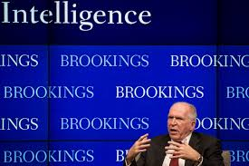
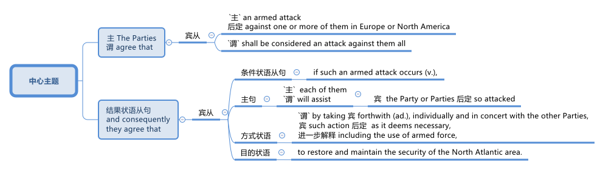

= 2025.03.07 How Is the NATO Alliance Changing Ukraine and the Future of European Security
:toc: left
:toclevels: 3
:sectnums:
:stylesheet: ../../../myAdocCss.css

'''

https://www.youtube.com/watch?v=U-d-vU-SxS8&ab_channel=CouncilonForeignRelations

== 本文的核心思想:

[.small]
[options="autowidth" cols="1a,1a"]
|===
|Header 1 |Header 2

|关于言行:
|- 你可以写下你所有的对外政策，但人们会看你实际上做了什么。**人们不在乎你说什么，他们在乎你做了什么。**世界在关注我们对欧洲和乌克兰的承诺做了什么.

|关于谈判:
|- *不要用"非母语"来进行谈判任何事情.* +
因为英文很多细节信息会在翻译的过程中丢失掉.

- 你先设定一个异常或不寻常的高标准(对对方的高要求)，这样当你退让时，你在谈判中会被视为好人。 +
先在桌上扔炸弹, 等它们平息后, 我们再进入实际的对话.

- 要有很了解"谈判的事情环境上下文"的人来进行谈判.  +
否则, 没有任何解释或上下文，你就根本不知道俄罗斯人在和你谈论什么。

- 你的软弱, 只会刺激敌人对你施加更多的压力. +
-> **特朗普只看重"力量"和"尊重"，如果你表现出软弱，他就会不断施加更多压力。**泽连斯基别无选择, 只能回到谈判桌. 这也意味着美国会继续对他施加越来越多的压力，因为他被视为处于弱势地位。*当你处于弱势时，就意味着你还有更多可以被推动的地方.* 这会增加你的压力，而不是减少压力。 +
-> 西方一直在让步, 这让**俄罗斯认为"美欧是软弱的", 他就会继续试探他能走多远.** +

|关于俄罗斯:
|- 俄罗斯的谈判习惯向来是: 虽坐在桌前, 但没谈判的诚意.

- 给俄罗斯胡萝卜后, 他可能吃掉它, 也可能会拿它打你的头. +
-> 美国不可能拉拢俄罗斯来对抗中国, 俄罗斯只会把胜利收入囊中, 然后继续前进。 +
-> 特朗普希望普京尊重他, 但普京在完全充分利用这一点. +

- 俄罗斯需要停火来修整自己, 可能要花三四年时间, 但之后除非他们遇到强硬阻力，否则他们会卷土重来。

|关于特朗普:
|- *特朗普尊重"力量", 而非"软弱". 所以他欣赏政治强人, 如普京. 而不看重自己(特朗普)身边的幕僚.*  特朗普说: 别把我跟奥巴马和拜登总统相比。他们是弱者, 没人尊重他们, 而每个人都尊重我。

- 特朗普不关心前任的美国领导人与你签了什么协议, 他只在乎现在他与你签什么协议.

- *智库中的专家,* 职业习惯决定他们**倾向于从"外交政策"和"地缘政治"的视角, 来看待世界问题的。而特朗普是从商人的"经济"和"贸易"的视角来看问题的 (喜欢做交易)。**这就导致, 特朗普的短视, 会对世界政治中的零和博弈("民主世界"与"独裁世界"间的较量), 造成长远影响.
|===

'''

== 释义

==== Introduction by Liana Fix

Liana Fix: So welcome to the second session （某项活动的）一段时间，一场；（议会等的）会议 of today’s symposium 专题研讨会, titled (v.) Ukraine and the Future of European Security 欧洲安全. I’m Liana Fix. I’m the _fellow 研究员 for Europe_ here at _the Council 委员会，理事会 on Foreign Relations_ 外交关系委员会, and I’ll be presiding over 主持 this discussion. Thanks for staying with us for this, and there will be another panel 小组讨论 afterwards.

[.my2]
Liana Fix：欢迎来到今天研讨会的第二场，主题是“乌克兰与欧洲安全的未来”。我是 Liana Fix，我是外交关系委员会的欧洲研究员，我将主持这场讨论。感谢大家继续参与，之后还会有另一场小组讨论。

[.my1]
.title
====
- symposium -> 由sym（一道）+ posis（喝酒）组合而成，字面意思就是“一道喝酒”。英语单词symposium就来源于此，由其本意延伸出“讨论会、论文集”的含义。
====

I’m more than delighted 非常高兴 to discuss “Ukraine and the Future of European Security,” to discuss what _General 将军 Kellogg_ has presented this morning, with a fantastic lineup 阵容；一组人 of speakers 演讲者.

Let me introduce first —he is going to join us virtually 虚拟地 —this is Pavlo Klimkin —(inaudible 听不见的；不可闻的, technical difficulties 技术故障). He is former _foreign (a.)外交的，涉外的 minister_ 外交部长 of Ukraine. He’s also a nonresident (a.)非常住的，暂住的；走读的，不寄宿的；非本地居民的 senior fellow 非常驻高级研究员 at _the Carnegie Endowment（给院校、医院等的）捐款，资助；天赋，才能  for International Peace_ 卡内基国际和平基金会. Hi, Pavlo.

We also have with us Philip M. Breedlove. He’s _the former supreme  (a.)最高的，至高无上的；（政府、司法或军事机构）拥有最高权力的 allied 结盟的，联盟的 commander Europe_ 欧洲盟军最高司令, and he is now a distinguished professor 杰出教授 and CETS senior fellow 高级研究员 at the Sam Nunn School of International Affairs 国际事务学院 at Georgia Tech 佐治亚理工学院. Thanks so much for joining us.

And here on stage I have with me Fiona Hill, who’s now a senior fellow 高级研究员 at Brookings 布鲁金斯学会 but formerly was the _deputy (a.)副的；代理的 assistant_ 助理，助手 to the president 总统副助理 and senior director 高级主任 for European and Russian affairs 欧洲和俄罗斯事务 at the National Security Council (委员会，理事会) 国家安全委员会 from 2017 to 2019. She’s also a CFR member 外交关系委员会成员.

[.my1]
.title
====
."And here on stage I have with me Fiona Hill."

这句话语法正确，但有些冗余：

"I have with me Fiona Hill" 是正确的表达，但 "with me" 在口语中显得有些多余，"I have Fiona Hill on stage" 会更简洁。 +
"And here on stage" 也没有问题，强调位置。 +

更自然的表达方式： +
"And here on stage, I have Fiona Hill."（加逗号，更易读） +
"And here on stage with me is Fiona Hill."（更流畅，自然） +
"Joining me here on stage is Fiona Hill."（更正式、更自然） +
====

And we have with us Alina Polyakova, the president and chief executive 首席执行官 of the Center for European Policy Analysis 欧洲政策分析中心. A great panel 出色的讨论小组 here.

[.my2]
我非常高兴能讨论“乌克兰与欧洲安全的未来”，并讨论今天上午凯洛格将军的演讲，以及我们出色的演讲阵容。 首先让我介绍一下——他将以虚拟方式加入我们—— +
-> 这是 Pavlo Klimkin（听不清，技术故障）。他是乌克兰前外交部长，也是"#卡内基国际和平基金会#"的非常驻高级研究员。你好，Pavlo。 +
-> 我们还有 Philip M. Breedlove，他是前欧洲盟军最高司令，现在是佐治亚理工学院萨姆·纳恩国际事务学院的杰出教授, 和 CETS 高级研究员。非常感谢您的加入。  +
-> 在台上，我身边还有 Fiona Hill，她现在是"#布鲁金斯学会#"的高级研究员，但曾在 2017 年至 2019 年担任总统副助理, 和国家安全委员会的欧洲和俄罗斯事务高级主任。她也是"#外交关系委员会#"的成员 +
-> 我们还有 Alina Polyakova，她是"欧洲政策分析中心"的总裁兼首席执行官。这是一个出色的讨论小组。

[.my1]
.title
====

.Brookings Institution

布鲁金斯学会，通常简称为布鲁金斯，是一家美国智库，*从事社会科学研究和教育，主要研究领域为经济学（和税收政策）、大都市政策、政府治理、外交政策、全球经济和经济发展。* +
*自 2008 年以来，宾夕法尼亚大学的"全球智库指数报告", 每年都将"布鲁金斯学会"评为“年度最佳智库”和“全球顶尖智库”。*

其既定使命是“提供创新而实用的建议，*推进三大目标： +
1.加强美国民主； +
2.促进所有美国人的经济和社会福利、安全和机会； +
3.确保一个更加开放、安全、繁荣和合作的国际体系。”*

Brookings states that its staff "represent diverse points of view" and describes itself as nonpartisan. Media outlets have variously described Brookings as centrist, conservative, liberal, center-right, and center-left.

An academic analysis of congressional records from 1993 to 2002 found that Brookings was cited by conservative politicians almost as often as by liberal politicians, earning a score of 53 on a 1–100 scale, with 100 representing the most liberal score. The same study found Brookings to be the most frequently cited think tank by U.S. media and politicians.

**布鲁金斯学会称其员工“代表不同的观点”，并称自己是无党派的。**各媒体对布鲁金斯学会的描述各不相同，有中间派、保守派、自由派、中右派、和中左派。  +
“布鲁金斯学会及其研究人员, 在工作中并不那么关心影响国家的意识形态方向”，而是倾向于“聘用学术资历过硬的研究人员”。 +
对 1993 年至 2002 年国会记录的学术分析发现，保守派政治家引用布鲁金斯学会的频率几乎与自由派政治家一样高，在 1-100 分制中获得了 53 分，其中 100 分代表最自由。 同一项研究还发现，*布鲁金斯学会是美国媒体和政治家引用次数最多的智库。*

*#与" the Council on Foreign Relations  (CFR) 外交关系委员会"和"卡内基国际和平基金会  Carnegie Endowment for International Peace"一样，"布鲁金斯学会"被普遍认为是美国最具影响力的政策研究所之一。#*

_The annual think tank index_ published by _Foreign Policy_ ranks (v.) it the number one _think tank_ in the U.S. +
*《外交政策》杂志发布的"年度智库指数", 将其列为美国第一大智库。*

此外，尽管美国媒体引用"智库信息或观点"的次数总体下降，但在全美 200 家最著名的智库中，"布鲁金斯学会"的研究, 仍然是被引用次数最多的。

- 大萧条期间，布鲁金斯学会的经济学家, 受罗斯福总统委托开展了一项大规模研究，以了解大萧条的根本原因。布鲁金斯学会首任会长哈罗德·G·莫尔顿, 和其他布鲁金斯学会学者, 后来带头反对罗斯福的"国家复兴局"，因为他们认为该局阻碍了经济复苏。
- 1948 年，布鲁金斯学会被要求提交一份管理欧洲复兴计划的计划。最终的组织方案, 确保了"马歇尔计划"的实施是谨慎而有条理的.
- 在整个 20 世纪 70 年代，"布鲁金斯学会"获得的联邦研究合同数量, 超出了它的能力。

.Council on Foreign Relations

**外交关系委员会（ CFR ）是美国的一个智库，专门研究美国外交政策和国际关系。是一个独立的、无党派的非营利组织。**其成员包括高级政治家、国务卿、中央情报局局长、银行家、律师、教授、公司董事、首席执行官和知名媒体人士。

CFR 会议召集政府官员、全球商界领袖以及情报和外交政策界的知名人士，讨论国际问题。**#CFR# 自 1922 年以来##每两个月出版一次《外交事务》杂志。##** +
它还负责管理戴维·洛克菲勒研究项目，该项目向总统政府和外交界提出建议，在国会作证，与媒体互动，并发表有关外交政策问题的研究。

.Carnegie Endowment for International Peace

卡内基国际和平基金会( CEIP ) , 是一家**无党派国际事务智库，**总部位于华盛顿特区，在美国和欧洲、南亚、东亚、中东地区均设有分支机构。 该组织由安德鲁·卡内基于 1910 年创立，*致力于促进各国之间的合作、减少全球冲突以, 及促进美国与世界各国之间的积极国际交往。它与多个领域和各个政治派别的领导人, 都有联系。*

在美国宾夕法尼亚大学发布的《2019年全球智库报告》中，卡内基被评为全球第一大智库。 *在2015年的全球智库报告中，卡内基被评为全球第三大最具影响力的智库，仅次于"Brookings Institution 布鲁金斯学会"和" Chatham House 英国皇家国际事务研究所"。* 2018年，卡内基被评为全球第一大独立智库。

安德鲁·卡内基和他那个时代的其他国际主义者一样，相信通过更强有力的国际法和组织, 可以消除战争。

- 1923年7月14日，由该基金会发起成立的"the Hague Academy of International Law 海牙国际法学院"在"The Peace Palace 海牙和平宫"正式成立。

====

Let me start straight ahead 直接开始 with a couple of questions to you. This meeting is on the record 公开记录, and then we will have enough time for questions and comments also from the audience 观众. We have a big set of issues 一系列重大问题. Perhaps let me start with you, Alina, because you have authored (v.)撰写 a piece 文章 in Foreign Affairs 外交事务 —I think it was actually December 31 that it was published —(laughs)—just *in time* 及时地；准时地 for the new year —where you argue that the Trump administration 特朗普政府 should pursue (v.)采取;追求，致力于，执行 a maximum pressure strategy 最大压力策略 towards Russia. And *it did seem*, to some extent 在某种程度上；部分地, in the first weeks of the administration *that* your advice was heard (v.)被听到. General Kellogg argued this morning that the maximum pressure strategy continues, but now there are also sticks 大棒 applied to Ukraine *to come to* the negotiation table 谈判桌. So what has changed, from your perspective （观察问题的）视角，观点;透视（画）法? And how do you read 解读 the current strategy?

[.my2]
让我直接开始向你们提出几个问题。本次会议是公开记录的，之后我们也会有足够的时间, 接受观众的提问和评论。我们有一系列重大问题。也许让我先从你开始，Alina，因为你在《外交事务》杂志上发表了一篇文章——我想是 12 月 31 日发表的——（笑）——正好赶上新年——你在文章中主张, 特朗普政府应该对俄罗斯采取最大压力的策略。在政府上任的前几周，你的建议似乎在一定程度上被采纳了。凯洛格将军今天上午表示，最大压力策略仍在继续，但特朗普政府现在也对乌克兰施加了大棒，迫使其回到谈判桌前。那么，从你的角度来看，发生了什么变化？你如何解读当前的策略？

==== Alina Polyakova’s Response

Alina Polyakova: Well, thanks so much, Liana. It’s always great to be part of these #conversations# 对话 at CFR, #which# I think tend to be quite insightful 有见地的;富有洞察力的，有深刻见解的 and revealing 揭示性的；有启迪作用的 in various ways.

[.my2]
非常感谢，Liana。能参与"外交关系委员会"的这些对话总是很棒，我认为这些对话往往非常有见地，并在多方面具有揭示性。

Of course, the maximum pressure campaign (（有计划的）活动，运动；战役，战斗) 最大压力行动 continues (v.). But it continues on Ukraine, not on Russia, is what we’ve seen. And that’s been *a pretty profound* (a.)（影响）深刻的，极大的, I think, *shift* (n.)转变 in how the United States is pursuing (v.)从事；追赶 its engagement 参与 with both Russia, Ukraine, and Europe. But I think that is an understatement 轻描淡写,不充分的陈述, in the last week of events that we have all, I think, followed 密切注意 very, very closely.

[.my2]
当然，"最大压力行动"仍在继续。但我们看到的是，它继续施加在乌克兰身上，而不是俄罗斯。我认为，这是美国在处理与俄罗斯、乌克兰和欧洲的关系时, 发生的深刻转变。但我觉得这样说还有些轻描淡写，尤其是在过去一周的事件中，我们都非常密切地关注着。

So at the beginning of the administration I think there were multiple (a.) potential pathways 多种可能的路径 that were being discussed by different individuals 个人；个体 that were entering the administration, *being appointed into* 被任命为 various roles 担任各种职务. One was —that seemed to be the trajectory 轨迹 *early on* 在早期,早些时候—where we need to get the Russians to the negotiating table, but they had *laid out* 铺开；摆开；展开 their maximalist （尤指政界）最高纲领主义的;反对妥协者 position 最大主义立场, that they were not *backing away from* 退缩,从……后退.

[.my2]
在特朗普政府上任初期，我认为它有许多可能的路径, 被不同的人讨论，这些人进入政府并担任各种职务。其中一条路径似乎是"早期的轨迹"——我们需要让俄罗斯人回到谈判桌前，但他们已经摆出了他们的最大主义立场，并且没有退缩。

So the question was how do we avoid a #situation# in #which#, you know, the Russians *show up* 如约赶到；出现；露面 but it’s not in good faith 诚意, #which# is —tends to be _the pattern 模式 of Russian negotiating_, which is just negotiations *for the sake of* 为了……的利益,目的,原因 negotiations 为了谈判而谈判, to see what the other side is willing/able to offer, what the lines are, what the constraints (n.)限制 are, But then there’s no—there’s no _follow up_ 后续行动,跟进, it’s not an actual negotiation. It’s just a way to assess (v.)评估 your opponent 对手，竞争者；反对者. The question is, how do we avoid that?

[.my2]
所以问题是, **如何避免俄罗斯人虽然"在谈判桌上露面", 但却"没有诚意"的情况，这向来是俄罗斯的谈判模式，即"为了谈判而谈判，看看对方愿意或能够提供什么，界限在哪里，限制是什么，但没有后续行动"，这不是真正的谈判，而只是评估对手的一种方式。**问题是，我们如何避免这种情况？

_My view has been always that_ `主` the only way to avoid that 后定 vis-à-vis 关于；对于;面对 the Russians `系` is *to apply far, far more pressure on them* to come to the negotiating table, make it painful 让他们感到痛苦 for them, so that they have no other choice but to compromise (v.)妥协. Because I think `宾` until we are in that situation, they have no incentive 动机;激励，刺激 to compromise (v.).

I think `主` the Russians and Mr. Putin `谓` think (v.) they’re winning. They certainly think they’re winning now. I was just looking at some Russian media, mainstream (a.)主流的 media 主流媒体, if you could call it that —state-owned propaganda outlets (出口；排放管) 国有宣传机构 —in Russia this morning. And the rhetoric (n.)华而不实的言语；花言巧语;修辞技巧；修辞;言论 on the United States is shifting (v.) quite dramatically 戏剧性地. You know, we’ve seen for decades _Russian state media_ called the United States the enemy, the adversary (n.)敌手，对手, use (v.) all kinds of _pejorative (a.)轻蔑的，贬损的 terms_ 贬义词 for the so-called West, as they say.

Shifted (v.) pretty profoundly 极大地，深刻地. And I think 宾 that’s always a signal 信号 that they see _a major geopolitical shift_ 地缘政治转变 happening (v.) right now. So the administration has obviously moved away from pursuing that kind of negotiation tactic 谈判策略. And I think, as a result, we find ourselves in a much weaker position 更弱的地位, as the United States.

[.my2]
我的观点一直是，**面对俄罗斯人，唯一的方法是施加更大的压力，迫使他们回到谈判桌前，让他们感到痛苦，这样他们别无选择，只能妥协。**因为我认为，**除非我们处于这种情况，否则他们没有妥协的动机。**我认为俄罗斯人和**普京认为他们正在获胜。他们现在当然认为自己正在获胜。**我今天早上刚刚看了一些俄罗斯媒体，如果可以称之为主流媒体的话——国有宣传机构——关于美国的言论正在发生戏剧性的转变。几十年来，我们看到俄罗斯国家媒体称美国为敌人、对手，用各种贬义词来形容所谓的西方。现在这种言论发生了深刻的转变。我认为这总是一个信号，表明他们看到了当前正在发生的重大地缘政治转变。**因此，政府显然已经放弃了这种谈判策略。**我认为，**结果是我们发现自己处于更弱的地位，**作为美国。

[.my1]
.案例
====
.vis-à-vis
(prep) +
1.in relation to 关于；对于 -
• Britain's role 后定 vis-à-vis the United States 英国对美国的作用

2.in comparison with 和…相比；与…相较 +
• It was felt that the company had an unfair advantage vis-à-vis smaller companies elsewhere. 人们感到, 这家公司与其他地方的小公司相比, 占有不公平的优势。

- pejorative -> 来自拉丁语peior,更坏的，来自PIE*ped,脚，词源同foot,impair,impeach.字母d脱落，拉丁语i在英语里音变为j,-or,比较级后缀。词义由其基本义脚引申为向下，低等，低到尘埃，卑贱，最后引申词义贬损的，轻蔑的。
====

And then, on the other hand, we have seen a strategy of carrots 胡萝卜 for the Russians, and a strategy of sticks 大棒 for the Ukrainians. You know, I hope that the carrots that we’re giving to the Russians right now, that are weakening (v.) our negotiating hand 削弱我们的谈判筹码 —because we’*re* basically *playing with* open cards 公开底牌, while the Russians are not. They have very clearly understood (v.) what we’re willing to give up, what 后定 we’re willing to give, because we’re just giving it all.

And we can talk about what those things are. And I think, on the Ukrainian side, they are being pressured 对…施加压力. They’re being pressured to probably accept a negotiation, eventually, that will not benefit them _in the short, medium or long term_ 短期、中期或长期. And that I think *we saw very much* on display (n.)展示 in the White House meeting last week, that I think we all *watched and followed very closely* 密切关注和跟踪 the implications 影响 of.

So I think that —`主` *what has shifted `系` is that* `主` the administration’s policy `谓` has obviously gone _in the maximum pressure direction_ towards Ukraine, and an incentive (n.) model 激励模式 to bring the Russians closer to the United States vis-à-vis 关于；对于 the Russians.

[.my2]
另一方面，我们看到对俄罗斯采取胡萝卜策略，对乌克兰采取大棒策略。**我希望我们现在给俄罗斯的胡萝卜不会削弱我们的谈判筹码——因为我们基本上在公开底牌，而俄罗斯人没有。他们非常清楚地理解我们愿意放弃什么，愿意给予什么，因为我们正在给予一切。**我们可以讨论这些是什么。我认为，在乌克兰方面，他们正在受到压力。他们可能会被迫接受一场谈判，最终这场谈判不会在短期、中期或长期内对他们有利。我认为这一点在上周的白宫会议中表现得非常明显，我们都非常密切地关注了其影响。因此，我认为发生的变化是，政府的政策显然朝着"对乌克兰施加最大压力"的方向发展，而对俄罗斯则采取激励模式，以拉近俄罗斯与美国的关系。

==== Liana Fix’s Transition to Fiona Hill

Liana Fix: Thank you, Alina. Now, Fiona, you have a lot of experience of negotiating 谈判；协商 with the Russians. You’ve been in Helsinki （芬兰首都） at that famous meeting between Trump and Putin, the one-on-one 一对一的；单独的 meeting. General Kellogg said this morning `主` he understands, and the Trump administration understands, `宾` how the Russians negotiate (v.). He told the anecdote 轶事；趣闻 that _Russians are coming into the negotiation room_ and standing next to the doorways 门口；出入口, the Americans are coming _half the way into the room_. What is—from your experience, what are the greatest pitfalls 陷阱；隐患 in negotiating with _the Russian side_ that you see?

[.my2]
Liana Fix：谢谢你，Alina。现在，Fiona，你有很多与俄罗斯人谈判的经验。你曾在赫尔辛基, 参加了特朗普和普京之间的那场著名会议，那是一次一对一的会议。凯洛格将军今天早上说，他理解，特朗普政府也理解，俄罗斯人是如何谈判的。他讲了一个轶事，说俄罗斯人进入谈判室后站在门口，而美国人则走进房间的一半。根据你的经验，你认为与俄罗斯方面谈判时, 最大的隐患是什么？

==== Fiona Hill’s Response

Fiona Hill: Well, first of all, I mean, I just want to commend 赞扬；称赞 the CFR for doing this, and actually also for being able to secure 确保；保证 General Kellogg. And I know, because, actually, I think it was an extraordinarily 非常；极其 important presentation 展示会；介绍会；发布会. He was _one thousand percent_ 百分之一千 honest. And I worked with General Kellogg, he was a colleague 同事；同僚, at the National Security Council 国家安全委员会 in Trump 1.0. And he was just *laying it all out* 详细说明；解释清楚 for all of us. And I know Alina didn’t manage to make it in time 及时赶到, but I hope that she will listen to it afterwards. I think everybody should go back and listen to that again because there were some very important messages there from him.

Now, General Kellogg does *know about* the Russians and how they negotiate. He’s been around that block 熟悉某事；经验丰富 many, many times. And, you know, I think if General Breedlove *was*, you know, *listening to this* as well, and Former Minister Klimkin—Ambassador Klimkin, you know, I’m sure they’ll have some comments 评论；解释, particularly from the military perspective 军事角度 and from the *on the ground* 实地；在现场;实际情况 in Ukraine. But I *wouldn’t* then, you know, *attribute* 归因于；认为是…的结果 the views of General Kellogg, his analysis, *to* everybody else on the team around President Trump, because I don’t think `主` everybody else there, including, *with all due respect 尊重地；敬重地 to* 恕我直言,无意冒犯 Special Envoy 特使 Witkoff, `谓` *have got* that same experience.

[.my2]
Fiona Hill：首先，我想赞扬CFR做了这件事，并且实际上也确保了凯洛格将军的参与。我知道，因为我认为这是一次极其重要的演讲。他百分之百诚实。我曾与凯洛格将军共事，他是我的同事，在特朗普1.0时期的"国家安全委员会"工作。他为我们所有人详细说明了情况。我知道Alina没能及时赶到，但我希望她之后会听。我认为每个人都应该回去再听一遍，因为他的演讲中有一些非常重要的信息。凯洛格将军确实了解俄罗斯人以及他们如何谈判。他在这方面经验丰富。我想，如果布里德洛夫将军也在听，还有前部长克里姆金——克里姆金大使，我相信他们会有一些评论，特别是从军事角度和乌克兰的实地情况来看。但我不会将凯洛格将军的观点和分析, 归因于特朗普总统团队中的其他人，因为我认为, 包括特使维特科夫在内的其他人, 并没有同样的经验。

[.my1]
.案例
====
.with (all due) respect
used to express polite disagreement in a formal situation
（用於正式場合禮貌地表示異議）恕我直言 +
- *With all due respect*, Sir, I cannot agree with your last statement.
恕我直言，先生，我不能同意您最後的那部分闡述。
====

And I can see Angela Stent here in the audience. And Angela’*s* `主` often *commented* in the same way that Alina did, *about*, you know, `宾` the danger of _giving carrots 胡萝卜；诱饵 to the Russians_. Depending on the texture 质地；特性 of the carrots, they’ll *either* eat them *or* they’ll take them and *hit (v.) you over the head* with them. (Laughter.) And I think that that’s kind of, you know, one of the risks that we’re seeing _at the moment_ 现在,目前,此时, because `主` #what I’ve seen# *coming back* in some of the pronouncements 声明；公告—again, *not* from General Kellogg *but* from some of the statements 声明，报告；说明，说法，表态 from _Special Envoy_ 特使 Witkoff and others —`系`  #is that# they’ve taken completely *on board* (支持的; 赞同的) 接受；采纳;完全上了船 both the Russian _talking points_ 谈话要点 and the Russian positions.

I mean, earlier was the question—Margaret Brennan tried to get to this, other people did from the audience —and the question was `表` *asking about, what was the term sheet* 条款清单, you know, from the Russians. I think we can see very clearly. First of all, `主` “_bilateral irritant_ (刺激物) 双边摩擦” 后定 that was mentioned in one of the announcements 公告；注意事项 `系` is Russian code 代码；暗号 for _absolutely every single thing_ 后定 that they’re *angry* with the United States *about*. So it’s not _bilateral irritants_ 刺激物 from the United States’ _point of view_ 观点,视点,视角, because we mostly don’t *pay attention to* some of these issues. But it’s all of the —kind of the Russian positions.

[.my2]
我看到观众席上有安吉拉·斯特恩特。安吉拉经常像Alina那样评论，*关于给俄罗斯人胡萝卜的危险。#根据胡萝卜的质地，他们要么吃掉它们，要么拿它们打你的头。#*（笑声）我认为这是我们目前看到的风险之一，因为我从一些声明中看到——再次强调，不是来自凯洛格将军，而是来自特使维特科夫和其他人的一些声明——他们完全接受了俄罗斯的谈话要点和立场。 +
我的意思是，之前就有这样一个问题——玛格丽特·布伦南试图探究这一点，观众中也有其他人提问——问题是关于俄罗斯方面的“条件清单”是什么。我认为这一点我们可以看得很清楚。 +
首先，在某份公告中提到的 “双边刺激因素”（bilateral irritant）是俄罗斯的暗语，指的是他们对美国不满的所有事情。所以这并不是从美国的角度来看所谓的“双边刺激因素”，因为我们大多数情况下根本不会关注其中的一些问题。而它实际上涵盖的都是俄罗斯方面的立场。

When General Kellogg, you know, was talking about the Ukrainian _term sheets_ 条款清单, I think the Ukrainians have been pretty consistent 一致的；始终如一的. Everything is a loss (n.)失去，丧失；亏损 to Ukraine. Let’s be clear about this. Every single thing that Ukraine is having to negotiate with is a loss. Every single thing. Every single thing is a concession 让步；妥协 because they’re the country that was invaded 入侵；侵略. And the Russians have made it very clear, which was also *laid out* 铺开；摆开；展开;布置；策划；安排；设计;清晰谨慎地提出，策划（计划、论点等） in some of the discussion, that they want (v.) territory 领土；领地 后定 that they currently do not control (v.). So  反问句 *is* the concession 让步，妥协 from the Russians *going to be* that they’ll only take parts of _Kherson, Zaporizhzhia, or Donetsk, Luhansk_ that they currently don’t control, and then they won’t go further? That would be, you know, not much of a concession, from the Ukrainian point of view. `主` Every single thing that Ukrainians are being asked to do `系` is to concede (v.)（通常指不情愿地）承认；认（输），承认（失败）；授予，让与；让对手得分.

[.my2]
当凯洛格将军谈到乌克兰的条款清单时，我认为乌克兰人一直相当一致。**对乌克兰来说，一切都是损失。**让我们明确这一点。**乌克兰不得不谈判的每一件事都是损失。每一件事。每一件事都是让步，因为他们是那个被入侵的国家。**俄罗斯人已经明确表示，正如在讨论中所提到的那样，他们想要"他们目前不控制的领土"。那么俄罗斯的让步是否会仅限于他们目前不控制的赫尔松、扎波罗热、顿涅茨克或卢甘斯克的部分地区，然后他们不会进一步推进？从乌克兰的角度来看，这不会是什么让步。乌克兰人被要求做的每一件事都是让步。

Now, I also understand from listening to General Kellogg very carefully—look, again, I just want to say, we should all be very grateful 感激的；感谢的 that he’s laid all of this out. It was very clear. That the Ukrainians obviously missed a beat 错过时机；反应迟钝 because something was completely lost in translation 翻译中丢失；误解. And, again, I think Zelensky made a fatal error 致命的错误 by not having everything translated. And my advice from, you know, basically being in the administration 政府；行政部门, or any administration—all the people here who’ve worked in Foreign Service 外交部门—would be: Do not negotiate, have a discussion, anything, that is not in your native language 母语, no matter how you speak it. I say the same to Macron. If I was the Brits, I would have somebody translate from British to American all the time as well—(laughter)—because sometimes things are lost as well, just to be very clear. And I know that, you know, Prime Minister Starmer was already here, and President Trump loved his accent. But have, you know, your American interpreter 口译员, you know, to be—because things are lost _all the time_ 一直，始终.

[.my2]
现在，我也从仔细听凯洛格将军的演讲中了解到——再次强调，我只想说，我们都应该非常感激他详细说明了这一切。这非常清楚。乌克兰人显然错过了时机，因为**#某些东西在翻译中完全丢失了。#**再次强调，**我认为泽连斯基犯了一个致命的错误，##没有把所有东西都翻译出来。我的建议是，##基本上，**无论你在哪个政府工作，或者任何政府——所有在这里工作过外交部门的人——**#不要用"非母语"进行谈判、讨论或任何事情，#**无论你如何说它。我对马克龙也这么说。*如果我是英国人，我也会一直有人把英式英语翻译成美式英语*——（笑声）——**因为有时候东西(信息)也丢失，**只是为了非常清楚。我知道，首相斯塔默已经在这里，特朗普总统喜欢他的口音。但是，要有你的美国口译员，因为东西总是会丢失。

And I think that /what Zelensky didn’t understand that he was being offered _a treaty of sorts_ 某种形式的条约. That only actually occurred to me /as I was listening to General Kellogg, because President Trump doesn’t abide by 遵守；遵循 any of the contracts or treaties （国家之间的）条约，协定 that were signed by any previous government. And when Zelensky said to President Trump —and I *watched*, actually, that press conference 新闻发布会 *five times* to try *to _kind of_ 在某种程度上；更或少地 figure out* 弄清楚；理解 where things went wrong.

There were multiple points, but one of them was when President Zelensky *pointed to* your president, he kept saying to President Trump, who already signed agreements —either Obama or Biden. And President Trump *cast (v.) those aside* 置之不理；抛弃. What President Trump was actually telling Zelensky is, you’re signing (v.) something with me. This will be the only thing that you’re signing, a basic exchange 交换，互换 of letters 书信往来, but it’s kind of a treaty of sorts 某种条约. President Trump doesn’t *care about* the Budapest Memorandum 布达佩斯备忘录 from 1994. He wasn’t there. He doesn’t *care about* any of the other commitments 承诺；义务 or recognitions 承认；认可 of Ukraine that have been made, or _U.N. resolutions_ 联合国决议, because they weren’t made by him. And *up until this point* 到目前为止 there’s been no agreement between Ukraine and President Trump. And that’s what we were being told.

And I had a bit of a _eureka （因找到某物，尤指问题的答案而高兴）我发现了，我找到了 moment_ 顿悟；灵光一现 sitting at the back when I kind of realized that _that was the case_ 事实情况就是这样. And I don’t think that President Zelensky understood that, because, again, his English is not that good. I mean, even, you know, kind of, for those of us English speakers, we’re not always understanding (v.) the import 重要性；含义 because we don’t fully understand, as General Kellogg does. Because remember (v.), General Kellogg has been with President Trump from the very beginning, from his first campaign 竞选活动. He understands him better than anyone. He’s still there with him. Other people don’t understand that *in exactly 精确地，确切地；（用于强调）恰好，完全 the same way* 以完全相同的方式.

[.my2]
====
我认为泽连斯基没有理解到他被提供了一种形式的条约。这实际上是我在听凯洛格将军的演讲时才意识到的，**因为特朗普总统不遵守任何前任政府签署的合同或条约。**当泽连斯基对特朗普总统说——我实际上看了五次那次新闻发布会，试图弄清楚哪里出了问题。有多个点，但其中一个点是, **#当泽连斯基总统指向你的总统时，他一直在对特朗普总统说，谁已经签署了协议——无论是奥巴马还是拜登。特朗普总统把这些协议置之不理。特朗普总统实际上告诉泽连斯基的是，你是在和我签署东西。#**这将是你要签署的唯一东西，一种基本的书信往来，但它是一种形式的条约。**特朗普总统不关心1994年的布达佩斯备忘录。他不在那里。#他不关心任何其他对乌克兰的承诺或承认，或者联合国决议，因为它们不是他做的。到目前为止，乌克兰和特朗普总统之间没有任何协议。#**这就是我们被告知的。 +

当我在后面坐着时，我有了一种顿悟，意识到情况就是这样。**我认为泽连斯基总统没有理解这一点，因为他的英语不太好。**我的意思是，**即使对于我们这些说英语的人来说，我们也不总是理解其中的重要性，因为我们不像凯洛格将军那样完全理解。因为记住，凯洛格将军从一开始就和特朗普总统在一起，**从他的第一次竞选活动开始。**他比任何人都更了解他。**他仍然和他在一起。其他人并不完全以同样的方式理解这一点。
====

And you *have to* have different levels of interpretation 解释；理解. What does President Trump himself mean (v.), and what does the actual translation of the words mean (v.)? It’s the context 上下文；背景 and the content 内容. And that’s why I would kind of go back to your initial question, is I —*with all due respect to* 恕我直言 _Special Envoy_ 特使 Witkoff, _Secretary of State_ 国务卿 Marco Rubio, and everybody else who went there —without any interpretation 解释，理解 or context /they have no clue (n.线索，提示)不知道；毫无头绪 what the Russians are actually talking to them about. Their interpretation is coming from *directly speaking to* Ushakov, Lavrov, and Kirill Dmitriev, who all speak (v.) excellent English, and who have been *around this block* 在这个街区附近 forever, and who completely understand who they are, how they interact (v.)相互交流，互动 in their system, how the other system interacts (v.)互动；相互作用;交互. Remember, Kirill Dmitriev was at Harvard. He’s worked (v.) for _a whole host 许多；大量 of_ —Goldman Sachs 高盛集团, *all kinds of* other, you know, *kind of* Western entities 实体；机构. He knows exactly who he is, who he’s talking *on behalf of* 代表, how far he can go. And his English is impeccable 无可挑剔的；完美的.

And so I think, you know, unfortunately —and this is what the Russians are telling us —I mean, if you *look*, as Alina is doing, *at* the Russian interpretation 理解；解释；说明 of all of this, you know, they’re being quite scathing 尖锐的；严厉的. We haven’t even got _the junior varsity_ (（尤指体育比赛中大中学校的）代表队，校队) 二队；替补队 on the team here. We’ve got the—you know, the intermural 壁间的,墙与墙间的 , or basically the _pickup (a.)临时拼凑的，临时组织的 game_ 临时比赛. And they *are thinking* (v.) right now *that* they can manipulate (v.)操纵；控制 this.

Now, General Kellogg is saying, we’ll see when we get there 等我们到了再说吧. But, you know, at this point the United States *is going out of the door* 离开；退出 with the Russians *on their side of the table*, not just reaching that point. And General Kellogg himself understands this, but *I’m not so sure that* the other people around him do.

[.my2]
====
chatgpt翻译: +
*你需要从不同层面来解读这个问题。特朗普总统本人的意思是什么？这些话字面上的意思(这些词的实际翻译)又是什么？这涉及到语境和内容的双重理解。*

这也是为什么我想回到你最初的问题。恕我直言，无论是特使维特科夫（Witkoff）、国务卿马可·鲁比奥（Marco Rubio），还是其他前往俄罗斯的人——*如果没有对话的解读和背景理解，他们根本不知道俄罗斯人真正想对他们说什么。*

**他们的理解完全依赖于直接与**乌沙科夫（Ushakov）、拉夫罗夫（Lavrov）和基里尔·德米特里耶夫（Kirill Dmitriev）*的对话。而这些人都精通英语，对这种外交博弈驾轻就熟，完全明白自己是谁，在本国体系中的角色是什么，也清楚美国体系是如何运作的。*

别忘了，基里尔·德米特里耶夫曾在哈佛求学，还曾为高盛（Goldman Sachs）等多家西方机构工作过。*他完全清楚自己的身份、代表谁发言，以及自己的行动边界在哪里。而且，他的英语无可挑剔。*

所以，我认为，很不幸的是——这也是俄罗斯方面向我们传递的信息——如果你像阿丽娜（Alina）那样关注俄罗斯人对这件事的解读，你会发现他们的评论相当尖刻。*俄罗斯方面的看法是，美国派来的甚至都不是“二队”（junior varsity），而更像是“业余队”（intermural 或 pickup game）。他们现在认为自己可以操控局势。*

**凯洛格将军（General Kellogg）的态度是：“等我们到那儿再说。” 但问题在于，美国现在正逐步退出这个谈判 (美国正在与俄罗斯人坐在谈判桌的同一侧)，而俄罗斯却已经牢牢占据了主导地位。**凯洛格将军本人当然明白这一点，但我不确定他身边的其他人是否也意识到了这一点。
====

==== Liana Fix’s Transition to Pavlo Klimkin

Liana Fix: That’s _a very helpful analysis_, Fiona, _of_ both the speech of General Kellogg but also the past meetings. Let me *turn* now *to* Pavlo Klimkin. Thanks so much for joining us for this discussion. There has been some hope, from a Ukrainian perspective （观察问题的）视角，观点, that there could be a reset 重置；重新开始 in U.S.-Ukraine relations after this meeting in the White House. Now it seems—and we’ve heard this again from General Kellogg this morning, that it is unclear how any reset would look like, that `主` some of #the negotiation levers# 谈判杠杆；谈判筹码 后定 that the administration sees (v.) it has towards Ukraine `谓` #will be kept in their hands# for longer period of time to try to use (v.) them *not only* for _the economic partnership agreement_ 经济伙伴关系协议 or _the minerals deal_ 矿产协议, *but* potentially also for other concessions 让步；妥协 that they want to see from the Ukrainian side. What is Ukraine’s strategy 策略；战略 *to react （作出）反应 to* that? And I know it’s tough *to develop a strategy* under such high pressure, but what would you recommend?

[.my2]
Liana Fix：Fiona，非常感谢你对凯洛格将军的演讲, 以及过去会议的分析。现在让我转向 Pavlo Klimkin。非常感谢你加入我们的讨论。从乌克兰的角度来看，有人希望这次在白宫的会议后，美乌关系能够重新开始。现在看来——我们今天早上又从凯洛格将军那里听到了这一点，目前还不清楚任何重新开始会是什么样子，美国政府认为其对乌克兰的一些谈判筹码, 将在他们手中保留更长时间，不仅用于经济伙伴关系协议, 或矿产协议，还可能用于他们希望从乌克兰方面看到的其他让步。乌克兰对此的反应策略是什么？我知道在如此高压下制定策略很困难，但你会推荐什么？

==== Pavlo Klimkin’s Response

Pavlo Klimkin: Good afternoon from Kyiv. We have to develop (v.) our strategy. And we have to get an answer. But if you talk to Ukrainians 乌克兰人 —and, I mean, not only in Kyiv, and I’ve been driving a lot around the country, it’s a sort of _emotional shock_ 情感冲击；情绪震动 for many, many people because, firstly, many welcomed (v.) the idea of _peace through strength_ 以实力求和平. But now people see a lot of strengths towards Ukraine and basically no strength towards the Russians. So someone should have, you know, exchanged (v.) the baskets with carrots 胡萝卜；诱饵 and something else. It’s basically the sense 感觉 if you’re not in Kyiv, if you just talk to people.

[.my2]
Pavlo Klimkin：下午好，从基辅传来。我们必须制定我们的策略。我们必须得到一个答案。但如果你和乌克兰人交谈——我的意思是，不仅在基辅，我一直在全国各地开车，这对很多人来说是一种情感冲击，因为首先，许多人欢迎"以实力求和平"的想法。但现在人们看到, 美国政府对乌克兰有很多实力，而对俄罗斯基本上没有实力。所以有人应该把胡萝卜和别的东西交换一下。如果你不在基辅，如果你只是和人们交谈，这基本上就是感觉。 +

The second point, which worries me even more, it’s a kind of focus on _eventual 最后的；最终的；结果的 NATO expansion_ 北约扩张 *as* a _fundamental origin_ 根本原因；起源 of that. And Putin has been talking about the origins. And it’s a fundamentally _flawed (a.)根本上有缺陷的；错误的 understanding_ (n.) why the war is like that, and why the war had started. The reason for that is that `主` anybody in Russia and anybody in the Russian leadership `谓` fundamentally reject 拒绝；否认 the mere fact 仅仅的事实 that Ukraine is there. Ukrainian history, Ukrainian language, Ukrainian statehood 国家地位—basically everything. And in 2014, when `主` the invasion 入侵；侵略 into the Crimea `谓` started, we were constitutionally 宪法上；法律上 a sort of non-bloc country 不结盟国家.

It’s really important to understand (v.) because the fundamental reason for that is that `主` Russia `谓` *sees* us *as* a kind of ill-fated (a.)不幸的；恶运的 role 命运多舛的角色, Russia and us *as* Russians 俄罗斯人. So if you ask an AI app 人工智能应用程序 what to do /if you need to eliminate 消除；消灭 this order （秘密）社团，集团，结社;阶级；等级；阶层, you get your answer. So if you ask a wrong question, and if you mention (v.)提到，谈到 a set of wrong origins, you are fundamentally (ad.)根本地，基础地；（用来加强语气）从根本上说 nowhere 根本上毫无进展. And I’m afraid _it’s partly what’s happening now_.

[.my2]
====
chatGPT 翻译: +
第二点让我更加担忧的是，**人们过于关注北约最终扩张，将其视为战争的根本起因。**而普京一直在谈论战争的起源。然而，这种看法存在根本性的误解，误解了战争的真正性质和起因。

*真正的原因在于，俄罗斯社会和领导层, 根本无法接受乌克兰的存在——他们拒绝承认乌克兰的历史、语言、国家地位，基本上是否定乌克兰的一切。* +
2014年克里米亚被入侵时，乌克兰在宪法上仍是一个"非结盟国家"。理解这一点非常重要，因为**战争的根本原因在于，俄罗斯认为乌克兰的存在本身就是一个错误，认为乌克兰和俄罗斯本应是同一个国家。**

换句话说，如果你问一个AI应用应该如何消除这种秩序，它会给出相应的答案。**如果你从错误的角度提出问题，并且基于错误的起因去推断，那么最终你将一无所获。**而我担心，这正是现在正在发生的事情。
====

Third point, we clearly understand that we need our European allies 欧洲盟友 on our side. We need a strategy, a common strategy 共同战略 with them, because *there is no way* `主` _European security_ 欧洲安全 or _European security architecture_ (体系结构；（总体、层次）结构;建筑学) 欧洲安全架构, but also by definition 根据定义 _European security_, `谓` *can be there* 条件状 without Ukraine. Unfortunately, this point *is coming down into* the minds of many European politicians and also militaries 军人；军队, but *not really into* European societies. There is a clear asymmetry (n.不对称)明显的不对称 here.

[.my2]
第三点，我们清楚地理解, 我们需要我们的欧洲盟友站在我们这边。我们需要一个策略，一个与他们共同的策略，因为**没有乌克兰，"欧洲安全"或"欧洲安全架构"，根据定义的"欧洲安全"，都不可能存在。**不幸的是，这一点虽然正在进入许多欧洲政治家和军人的头脑，但并没有真正进入欧洲社会。这里存在明显的不对称。

But `主` what the new U.S. administration has already achieved (v.)（经努力）达到，取得，实现；获得成功 `系` is actually 实际上，事实上;竟然，居然 the Chinese *talking directly to* the Europeans and saying, yeah, of course, you should be at the table 在谈判桌上. Of course, Europe is important. So the whole geopolitics 地缘政治 now are changing.

In our way, *we are*, of course, *ready (a.) to show again* that we need our allies. We are ready *to enter into* difficult negotiations 艰难的谈判, but not *at our expense* (代价，费用) 不以我们为代价, and not *over our head* 不凌驾于我们之上. What fundamentally would not work (v.).

Actually, both U.S. and Russia *got us wrong* 误解我们 in 2022, in the sense of our resilience 韧性；恢复力, in the sense of our emotions, and in the sense of our understanding _what is *at stake* 利害攸关；风险 in this war_. And we understand that it’s about _our existence 存在；生存 as Ukrainians_.

So we are ready *to engage in* real conversation 真正的对话. Also, it’s a backdrop 背景 of these emotional spikes (猛增；急升) 情绪波动. But now if you talk to Ukrainians, just Ukrainians, not somebody from political classes or so, many people started saying, look, maybe it’s about Europe, and us about part of Europe. But it’s a very dangerous development because it would lead to _a total fragmentation 完全分裂 of the West_ and probably the mere question _what actually the West is about now_.

And `主` our strategy in the coming weeks `系` is, of course, to get back with our engagement 重新参与, to repair what we can repair, and to build a decent conversation 体面的对话. And we are ready for that. But also *to engage* 与…建立密切关系；尽力理解 _in every way possible_ 以各种可能的方式 *with* the Europeans. And we have a European summit 欧洲峰会 now happening in Brussels. A number of ideas there. And it’s about *how to include* Europe *as* _a fundamental, intrinsic (a.)内在的，固有的 part_ 基本的、内在的部分 of _the European reality_, is how I see it now.  (that’s how I see it now.)

[.my2]
====
但新一届美国政府已经取得的一个重要成果是，中国开始直接与欧洲对话，并表示：“是的，当然，你们应该参与进来。当然，欧洲很重要。” 这表明整个地缘政治格局正在发生变化。

从我们的角度来看，我们当然愿意再次表明，**我们需要盟友，我们愿意参与艰难的谈判，但前提是不能以我们的利益为代价，也不能被绕过(不能被排除在谈判决策之外)，**否则这一切根本行不通。

事实上，美国和俄罗斯在2022年都误判了我们——误判了我们的韧性，误判了我们的情感，也误判了我们对这场战争核心问题的理解。而我们深知，**这场战争的关键是我们的"乌克兰身份"是否能够延续。**因此，我们愿意参与真正的对话，即使目前的局势仍然充满情绪化的波动。

但如果你去和普通乌克兰人交谈，而不是政治精英阶层的人，你会发现，很多人开始思考：“或许这场战争关乎欧洲，也关乎我们作为欧洲的一部分。” 但这种想法是极其危险的，因为它可能会导致西方的彻底分裂，甚至引发关于“西方到底意味着什么”的根本性质疑。

在未来几周，我们的战略当然是重回谈判桌，尽力修复可以修复的关系，并建立理性的对话，对此我们已经做好准备。同时，我们也会尽一切可能与欧洲各方接触。目前欧洲峰会正在布鲁塞尔召开，会上有许多讨论议题。我现在的理解是，欧洲必须被纳入欧洲现实的核心部分，这才是关键。
====

[.my1]
.案例
====
.engage
(v.) ~ (with sth/sb) : to become involved with and try to understand sth/sb 与…建立密切关系；尽力理解 +
• She has the ability *to engage with* young minds. 她能够与年轻人心意相通。

====

==== Liana Fix’s Transition to General Breedlove

Liana Fix: That’s very helpful. Thank you. And you mentioned two things which are so important, I think, the European strategy but also the China element 中国因素 in that. And I hope we can come back to that in the Q&A 问答环节 and in the comments section. But, General Breedlove, *if I could turn to you on the question of* 我能否向你请教关于……的问题 Europe.

Europeans have been asked and invited by the Trump administration to take over 接管；承担 _the security guarantees 安全保证 question_ in Ukraine, right? So it seems that there is an idea for _division of labor_ 劳动分工, that the United States negotiates (v.) the ceasefire 停火协议 and the Europeans secure (v.) the ceasefire. Now, Europeans have *come to town* (是一种比喻性的表达)来到华盛顿进行讨论, 前来商谈 asking for a backstop 后盾；支持 for that mission, although it’s unclear what exactly that backstop  挡球网; 支持 will look like. General Kellogg has also not specified it this morning. Under these conditions, would you recommend Europeans *to go for* 努力争取某事物;去带回某人；去取回某物 the security guarantee, *to go for* a European mission 欧洲任务 in Ukraine? And what could this look like?

[.my2]
Liana Fix：这非常有帮助。谢谢。你提到了两件我认为非常重要的事情，欧洲策略, 以及其中的中国因素。我希望我们可以在问答环节和评论部分, 回到这一点。但是，Breedlove将军，如果我可以转向你关于欧洲的问题。欧洲人已经被特朗普政府邀请接管乌克兰的安全保证问题，对吧？所以**似乎有一个分工的想法，即美国谈判停火协议，而欧洲人确保停火协议。**现在，欧洲人来到城里, 要求为这一任务提供后盾，**尽管目前还不清楚这个后盾会是什么样子。**凯洛格将军今天早上也没有具体说明。在这些条件下，你会推荐欧洲人去争取安全保证，去争取在乌克兰的欧洲任务吗？这会是什么样子？

[.my1]
.案例
====
这里的 "come to town" 是一种比喻性的表达，意思是 “来到华盛顿进行讨论” 或 “前来商谈”。在这个语境下，指的是欧洲官员来到美国（通常是华盛顿特区）与美方商讨安全担保问题。 +
这个短语在非正式英语中常用于指代某人前来讨论、参与某项事务或进行重要会谈。例如，"The investors have come to town" 可以表示投资者来到某地进行商务会谈。
====

==== General Philip M. Breedlove’s Response

Philip M. Breedlove: Well, first of all, thank you all for having me. It’s a pleasure 愉快；乐趣 to be on stage with these two and with Pavlo as well. And before I go to your question, I just want to pass (v.)给；递；传递;宣布；声明 that, of course, I *agree with* what Pavlo has said, but I want to violently 强烈地；激烈地 *agree with* a few points Alina and Fiona made, about how we’re being perceived 感知；理解 in the world at dealing with the two sides of this issue.

*On one side*, we’ve got a criminal 犯罪的 aggressor 侵略者. And in the world’s eye, we’re treating (v.) that criminal aggressor *with kid gloves* (小孩手套) 小心翼翼地对待；宽容处理 (idiom: to handle someone or something leniently 宽大地；温和地).

*On the other side* we have a nation that’s been invaded 入侵, clearly the victim 受害者. And we seem *to be dealing with them* with a hammer 严厉地；毫不留情地 (idiom: to treat harshly). And so it’s —I don’t want to resurface 重新浮现；再次提起 all the conversation, but it’s hard for _some of us 后定 who travel (v.) a lot in Europe_ to be able to sit down with our allies 盟友 and discuss why this might be happening.

[.my2]
菲利普·M·布里德洛夫：首先，非常感谢你们邀请我。能和这两个人以及帕夫洛一起站在舞台上，我感到非常愉快。在回答你们的问题之前，我想先说一下，当然，我同意帕夫洛所说的话，但我想强烈地赞同阿琳娜和菲奥娜提出的几个观点，关于我们在世界上处理这个问题两方面时是如何被感知的。一方面，我们面对的是一个犯罪的侵略者。在全世界的眼中，我们对这个犯罪侵略者采取了小心翼翼的态度。另一方面，我们有一个被入侵的国家，显然是受害者。而我们似乎在用严厉的方式对待他们。所以——我不想让所有对话重新浮现，但对于我们这些经常在欧洲旅行的人来说，很难坐下来与我们的盟友讨论为什么会发生这种情况。

And I want to highlight (v.)突出；强调 two things. Right *out of the gate* 立即；一开始 (idiom: from the very beginning) we have given Russia huge policy wins 政策胜利. For decades and decades 几十年, Mr. Putin has wanted *to deal with America about Europe* without Europe. And we’ve always kept Europe in the middle of the conversation. And we fought hard *not to allow (v.) Mr. Putin to establish 建立 this idea* that he is above Europe, and he should be able to do European matters with the American president *one on one* 一对一地, whoever the American president is. And we seem to now have caved (v.)屈服；让步;塌落；塌陷；坍塌 on that, and that we are now *doing business with* 与……做生意 Mr. Putin on Europe without Europe.

And in a similar fashion 类似的方式, since the winter of 2013 and ’14, when I was the SACEUR (Supreme (a.)最高的，至高无上的 Allied (a.) Commander Europe 欧洲盟军最高司令) and Russia first invaded (v.) Crimea 克里米亚 and then invaded the Donbas 顿巴斯, we have all said that _we will not deal about Ukraine without Ukraine_. And now *we are caving on that* as well. So before the negotiations 谈判 even 甚至 start (v.) /we *have given* _huge, huge policy concessions_ 政策让步 *to* Russia. And I don’t think *we’re walking in the door* with a strong hand 强势地位 (idiom: advantageous position) when that’s the way we begin.

[.my2]
我想突出两件事。从一开始，我们就给了俄罗斯巨大的政策胜利。**几十年来，普京先生一直希望在没有欧洲参与的情况下, 单独与美国讨论欧洲事务。**我们始终将欧洲置于对话的中心。**我们努力不让普京建立这样的观念，即他凌驾于欧洲之上，能与美国总统一对一地处理欧洲事务，**无论美国总统是谁。**而我们现在似乎在这点上屈服了，我们现在正在没有欧洲参与的情况下, (让美国单独)与普京先生处理欧洲事务。**以类似的方式，自从2013年和2014年冬天，我担任欧洲盟军最高司令时，俄罗斯首次入侵克里米亚，然后入侵顿巴斯，**我们都说过，没有乌克兰的参与，我们不会讨论乌克兰问题。而现在我们在这点上也在让步。所以在谈判甚至还没开始之前，我们已经对俄罗斯做出了巨大的政策让步。**我认为，当我们以这样的方式开始时，我们就无法以强势的地位来进入谈判了。

So I’ll get off of that, and now get to the question you asked me. I just wanted to agree with what both Alina and Fiona had said, in my own words. So, first of all, I applaud 赞扬；鼓掌 what Europe is doing, OK? So forever 永远 there has been some—and legitimate 合法的；正当的, I would add, complaints about how Europe has approached 接近；处理 Article 3—not Article 5, but Article 3. Article 3, in a Georgia boy’s words 一个乔治亚人的说法 (idiom: in simple terms), are that defense begins at home 防御从家里开始. In other words, these nations need to invest 投资 in themselves. Some people use the word wrong. They’re not paying. They don’t pay. They invest. And so these people are now really climbing on the stump 积极行动；发表意见 (idiom: taking a stand or making an effort) and investing in their own militaries 军队 and their capabilities 能力. So you can’t even have a conversation about Article 5 if you haven’t got Article 3 right. And I think we’re on our way to getting Article 3 right.

[.my2]
====
所以我就先说到这里，现在回答你们的问题。我只是想用我自己的话同意阿琳娜和菲奥娜所说的。首先，我要赞扬欧洲正在做的事情，好吗？长期以来，一直有一些——而且我认为是有正当理由的——关于欧洲如何处理**北约第三条款**的抱怨——不是第五条款，而是第三条款。用一个乔治亚人的话说，**第三条款的意思是防御从家里开始。换句话说，这些国家需要自己投资。有些人用错了词。**他们不是在付钱。**他们不是付钱，而是投资。**所以这些人现在真的在积极行动，投资于自己的军队和能力。**所以，如果你连第三条款都没做好，你甚至无法讨论第五条款。**我认为我们正在让第三条款走上正轨。

chatGPT 翻译 +
所以，我先不谈这个问题，转而回答你刚才问我的问题。我只是想用自己的话同意阿丽娜和菲奥娜所说的内容。

首先，我赞扬欧洲目前的作为，可以吗？长期以来，人们一直对欧洲如何处理《北约条约》第3条提出一些——我认为是合理的——批评。不过，这不是关于第5条，而是关于第3条。用一个乔治亚男孩的话来说，*第3条的意思是：防御始于自身。换句话说，这些国家需要对自身进行投资。*

有些人用错了词，他们说欧洲“没有支付”，但其实他们不是在“支付”，而是在“投资”。而现在，这些国家真的开始积极行动，投入资金，加强自己的军队和防卫能力。如果你连第3条都没有做好，那根本没办法讨论第5条。而我认为，我们正朝着落实第3条的方向前进。
====

Article 4 is also not being taken care of 处理；照料 right now because Article 4 says that the United States, as one of the allies—one of the allies—should be sitting at the table consulting 协商；咨询 with European allies about these matters. When Article 4 is declared 宣布, the allies of NATO come together and discuss. We don’t go off and have single conversations with the criminal aggressor about matters Europe. And so if we have Article 3 straight 正确的；妥当的, if we get Article 4 straight, then it’s much easier to talk about what we need to do now.

**现在第四条款也没有被妥善处理，因为第四条款规定，美国作为盟友之一，应该坐在谈判桌上，与欧洲盟友协商这些事务。**当第四条款被宣布时，北约的盟友们会聚集在一起讨论。**我们不会单独(即美国单独, 或欧洲单独)与犯罪的侵略者讨论欧洲事务。**所以，如果我们把第三条款弄清楚，把第四条款弄清楚，那么讨论我们现在需要做什么就容易多了。

Which is, yes, maybe it’s a good idea that the Europeans are the bulk 大部分；主体 of the land contribution 贡献 to what might happen to secure 确保；保护 Ukraine’s future. But America has to be a part of that as well. And I think we’ve sort of cleared the air 澄清误解 (idiom: resolved misunderstandings), but early in these conversations one of our seniormost ministers sort of made an intimation 暗示 that we would not honor 遵守；履行 our Article 5 if something broke out 爆发 (idiom: if conflict arises). We’re telling the Europeans to go there, take care of this problem, and we won’t be with you if a dust up occurs 冲突发生 (idiom: if a fight breaks out) with Russia? I think that’s—we’ve got to clean that up 清理；解决 (idiom: fix the issue). We need to make a public, demonstrative 展示性的, clear commitment 承诺 to Article 5 as an ally in the NATO alliance 北约联盟.

也就是说，是的，也许"欧洲人成为确保乌克兰未来的陆上贡献的主体"是个好主意。但美国也必须是其中的一部分。我认为我们已经澄清了一些误解，但早些时候在这些对话中，我们(美国)的一位最高级别部长似乎暗示，如果冲突爆发，我们不会履行第五条款。我们告诉欧洲人去那里解决问题，而如果与俄罗斯发生冲突，我们不会和你们在一起？我认为——我们必须解决这个问题。我们需要对第五条款做出公开的、展示性的、明确的承诺，作为北约联盟中的一个盟友。

[.my1]
.title
====
.The North Atlantic Treaty (1949)
北大西洋公约

条约全文: +
https://www.nato.int/cps/eu/natohq/official_texts_17120.htm

Article 3 第三条

*In order* more effectively 更有效地 to achieve (v.)实现 the objectives 目标 of this Treaty 公约, the Parties 缔约方;当事人；党派, separately 单独地 and jointly 共同地, *by means of* 通过 continuous (a.)持续的 and effective 有效的 self-help 自助 and mutual aid 互助, will maintain (v.)维持 and develop 发展 _their individual 个人的 and collective 集体的 capacity_ 能力 to resist (v.)抵御 armed attack 武装攻击.

为了更有效地实现本公约的目标，缔约方将单独地和共同地, 通过持续有效的自助与互助，**维持并发展"#各自#"**及"集体"*抵御武装攻击的能力。*

Article 4

The Parties will consult (v.)咨询，请教；商量，商讨 together whenever, in the opinion of 根据某人的观点,意见 any of them, the _territorial integrity_ 完整，完全, _political independence_ or _security_ of any of the Parties 当事人；党派 is threatened.

在任何一方认为任何一方的领土完整、政治独立或安全受到威胁时，双方将**共同协商。**

Article 5 第五条

The Parties 缔约方 *agree (v.)认同 that* `主` an armed attack 武装攻击 against one or more of them in Europe 欧洲 or North America 北美洲 `谓` shall be considered (v.)被视为 an attack 攻击 against them all 他们所有人 /and consequently 因此 they agree 认同 that, if such an armed attack 这样的武装攻击 occurs (v.)发生, `主` #each of them# 他们每一个, *in exercise (n.)行使；运用；使用 of* 在行使 the right 权利 of _individual 个人的 or collective 集体的 self-defence_ 自卫 后定 recognised (v.) by 认可的 _Article 51 第五十一条 of the Charter_ 宪章 of the United Nations 联合国, `谓` #will assist# (v.)帮助 the Party 缔约方 or Parties 缔约方 `后定` so attacked 受到攻击的  `方式状语` *#by taking#* [forthwith (ad.)立即地,不犹豫地 individually 单独地 and *in concert with* 并与;与……一起合作或协调 the other Parties 其他缔约方一起], #such action# 这样的行动  `后定` as it deems (v.) necessary 其认为必要的, including 包括 the use of _armed force_ 武装力量, to restore (v.)恢复 and maintain (v.)维护 the security 安全 of the North Atlantic area 北大西洋地区.

缔约方认同，**对欧洲或北美洲的一个或多个成员的武装攻击, 将被视为对所有成员的攻击，**因此他们同意，如果发生这样的武装攻击，每个缔约方在行使《联合国宪章》第五十一条所认可的"个人或集体自卫权"时，将立即**##单独地##或**与其他缔约方**共同采取其认为必要的行动，**包括使用武装力量，以恢复和维护北大西洋地区的安全。

`主` Any such _armed attack_ 任何此类武装攻击 and all measures 所有措施 后定 taken 采取的 *as a result* thereof (在其中，由此) 由此导致的 `谓` shall immediately 立即地 be reported to 被报告给 the Security Council 安全理事会.  +
Such measures 这些措施 shall *be terminated* 应终止 when 当 the Security Council 安全理事会 has taken the measures 采取了措施 necessary 必要的 to restore (v.)恢复 and maintain (v.)维护 international 国际的 peace 和平 and security 安全.

任何此类武装攻击以及由此采取的所有措施，应立即报告给安全理事会。在安全理事會采取恢復並維持國際和平及安全之必要措施時，此項措施應即終止。
====

==== Liana Fix’s Transition to Audience Q&A

Liana Fix: Wonderful. Thank you, General. That has been excellent 出色的；卓越的. First, Alina, do you want to come in with two fingers 用两根手指示意 (idiom: signal briefly), and then we will open up for questions or comments from the audience 观众?

丽安娜·菲克斯过渡到观众问答环节

丽安娜·菲克斯：太棒了。谢谢你，将军。这真是非常出色。首先，阿琳娜，你想用两根手指示意插话吗？然后我们将开放给观众提问或评论。

Alina Polyakova: No, just a very quick comment to what General Breedlove just laid out 阐述；布置 on the backstop conversation 支持性对话. I think one of the epiphanies 顿悟；突然醒悟 I’ve had recently in conversations with administration officials 行政官员 is that, just like the president sees the world very differently than perhaps many of us in this room, or the Ukrainians, and we need translation 翻译；解释, there’s another element 元素；因素 to this. Which is that it’s really hit me 让我意识到 (idiom: struck me) that he—and probably others around him—do not see Ukraine and NATO as connected issues. Meaning there’s a ceasefire 停火 in Ukraine. That’s one issue. And that’s what we’re trying to get to, from the perspective 观点；视角 of the president. And then there’s the NATO question, which is completely separate 分开的. But of course, in Europeans’ minds these are deeply intertwined 交织在一起的, interlinked 相互关联的 issues, because of all the reasons that General Breedlove just laid out. We’re going to have a European-led coalition 欧洲领导的联盟, may not be a full NATO coalition, five, six countries, whatever that looks like, will the U.S. be there to protect and defend those forces in Ukraine, even if it’s not a NATO force? And so in the president’s mind tying NATO, Article 5, collective defense 集体防御 to the ceasefire in Ukraine is completely incomprehensible 不可理解的. So he sees this as completely separate issues. And Europeans do not. So, to your question, I think, that you had posed 提出, Liana, Europeans are coming asking for a backstop 支持；后盾 but it’s incomprehensible to the president as to why they’re talking about it.

Liana Fix: Hmm. Yeah.

阿琳娜·波利亚科娃：不，只是对布里德洛夫将军刚刚在支持性对话中阐述的内容, 做一个非常简短的评论。我认为我最近与行政官员的对话中有一个顿悟，就像**美国总统**看待世界的方式, 可能与我们房间里的许多人或乌克兰人截然不同，我们需要解释，还有另一个因素。让我意识到的是，*他*——可能还有他周围的人——**并不认为乌克兰和北约是相关的问题。**也就是说，**乌克兰的停火**是一个问题。这是总统视角下我们试图实现的目标。然后是**北约问题，这是完全分开的问题。**但当然，**在欧洲人看来，这些问题是深深交织在一起、相互关联的，**因为布里德洛夫将军刚刚阐述的所有理由。我们将有一个欧洲领导的联盟，可能不是完整的北约联盟，可能是五六个国家，不管是什么样子，美国会在那里保护和捍卫乌克兰的那些部队吗，即使那不是北约部队？所以在特朗普总统看来，将北约、第五条款、集体防御, 与乌克兰停火联系起来, 是完全不可理解的。所以他认为这些是完全分开的问题。而欧洲人不是这样认为的。所以，对于你提出的问题，丽安娜，我认为欧洲人来请求一个后盾，但特朗普总统无法理解他们为什么在谈论这个。

丽安娜·菲克斯：嗯，是的。

Fiona Hill: I want to do a two-finger to the—(laughter)—because it’s the global dimension 全球维度 of this as well. And I was actually heartened 感到振奋的 to at least hear General Kellogg, for the first time, frankly 坦白说, of an administration official, really laying out the global dimensions of this, of China, North Korea, and also Japan being—and Japan, which I was not going to mention Japan, because this is why I’m raising this—and Iran being involved here, because this is important for our other allies—for Japan, and South Korea, and Taiwan, and many other countries out there watching all of this very closely 密切地. But I was not heartened by the same issues that Alina is laying out here.

菲奥娜·希尔：我想用两根手指示意插话——（笑声）——因为这也涉及到全球维度。我实际上很振奋，至少第一次坦白说，听到一位行政官员凯洛格将军真正阐述了这个问题的全球维度，包括中国、朝鲜，还有日本——我本来没打算提到日本，这就是我提出这个的原因——以及伊朗的参与，因为这对我们的其他盟友——日本、韩国、台湾以及许多密切关注这一切的国家来说很重要。但我对阿琳娜这里阐述的同样问题感到不振奋。

When General Kellogg said that for President Trump these have always been before separate, that everybody was trying to keep North Korea, China, and, he said, Iran, and Russia all separately. Well, they’re not separate. They’ve become pretty fused together 融合在一起 here. And that counts for Europe as well. You said it. China is an important issue. Well, Europe and Europeans have their own relationship with China. China was the biggest single country investor 投资者 in Ukraine before the war, and has then sided very consistently 一贯地 with Russia in this conflict. North Korean troops are in Europe. They’re not just in the Kursk region of Russia. They’re fighting in Europe for the first time. I think General Kellogg was absolutely 100 percent right that, are they preparing for something on the Korean Peninsula 朝鲜半岛? South Korea and Japan have to worry about all of that. So these have to be dimensions as well. And South Korea and Japan are watching this and, as I said, Taiwan and others, very closely.

当凯洛格将军说，**对于特朗普总统来说，这些问题一直以来都是分开的，每个人都试图将朝鲜、中国、伊朗和俄罗斯分开处理。好吧，它们不是分开的。它们在这里已经相当融合在一起了。**这对欧洲也是如此。你说了，中国是一个重要问题。好吧，欧洲和欧洲人自己与中国有关系。在战前，中国是乌克兰最大的单一国家投资者，然后在这次冲突中一直一贯地站在俄罗斯一边。**朝鲜部队在欧洲。他们不仅仅在俄罗斯的库尔斯克地区。他们第一次在欧洲作战。**我认为凯洛格将军百分之百正确，**他们是在为朝鲜半岛上的某事做准备吗？韩国和日本必须担心所有这些。**所以这些也必须是考虑的维度。韩国和日本在看着这些，正如我所说，台湾和其他国家也是，密切关注着。

And then the Middle East. It was fascinating 引人入胜的 as well that General Kellogg said we all started getting involved in this with Saudi Arabia because of MBS (Mohammed bin Salman). Well, yes, because they’re all watching Iran. And they’re watching how this has now become part of the Middle East conflict as well. The fact that meetings are taking place in Saudi Arabia, and in Turkey, and elsewhere just shows how things are really shifting 转变 here. So this isn’t just about Ukraine. You can’t just separate it off and then basically push Ukraine out the door 把乌克兰推出去 (idiom: exclude Ukraine), and figure out that you can then deal with this on the same kind of playing field 竞争环境 as before.

然后是中东。凯洛格将军说我们因为MBS（穆罕默德·本·萨勒曼）而开始与沙特阿拉伯一起参与其中，这也很有趣。好吧，是的，因为他们都在关注伊朗。**他们在观察这如何成为"中东冲突"的一部分。**在沙特阿拉伯、土耳其和其他地方举行的会议事实表明，事情正在发生真正的转变。**所以这不仅仅是关于乌克兰。你不能简单地把它分开，然后基本上把乌克兰推出去，**觉得你还能在以前那样的竞争环境下处理这个问题。

Liana Fix: Yeah, the global impacts 全球影响 there. General Breedlove, I’m going to pretend that I haven’t seen your two fingers, because I really—(laughter)—which is unfair, because you’re on screen, on Zoom. I know it’s unfair. But I will come back to you when we have first lot of questions, and you can tie in 联系起来 what you wanted to say, because I really want to give our audience the opportunity 机会 to ask questions here. We have an audience here in Washington and on Zoom. And I will bring you in. Please identify 确认；识别 yourself and also keep your question short. And if you can say to whom this question is directed 针对, all the better. So I’ll take the first question from the room. Over here.

丽安娜·菲克斯：是的，那里的全球影响。布里德洛夫将军，我要假装没看到你的两根手指，因为我真的——（笑声）——这不公平，因为你在屏幕上，在Zoom上。我知道这不公平。但当我们收到第一批问题时，我会回到你这里，你可以联系起来你想说的话，因为我真的想给我们的观众在这里提问的机会。我们在华盛顿和Zoom上有观众。我会请你们加入。请确认自己的身份，并保持问题简短。如果能说明这个问题是针对谁的，那就更好了。所以我将从房间里接受第一个问题。这边。

==== Audience Q&A: Question 1

Q (Alexandra Starr): I’m Alexandra Starr with International Crisis Group 国际危机组织. This is a question for Fiona. Why is Trump doing this? (Laughter.) You’ve worked with him for a long time. Well, you’ve had experience 经验 with him in the first administration 政府；行政机构. His comments during that press conference 记者招待会, talking about everything that he and Vladimir Putin had been through together seems to speak to 表明；显示 a psychological 心理的 dimension 维度；方面 to this that I’d be very grateful 感激的；感谢的 to get your comments on 听取你的看法.

我叫亚历山德拉·斯塔尔，来自国际危机组织。这是一个给菲奥娜的问题。特朗普为什么这样做？（笑声）你和他共事了很长时间。好吧，你在他第一届政府中有过与他相处的经验。他在记者招待会上谈到他和弗拉基米尔·普京一起经历的一切，似乎表明这件事有一个心理的方面，我很感激能听到你的看法。

Liana Fix: Fiona.

Fiona Hill: Well, look, I think General Kellogg also made some of the things very clear 清楚的；明确的. President Trump is very interested in strength 力量；实力, and not in weakness 弱点；软弱. And if you go back again to that press conference, I think lots of things were very clear. It’s about respect 尊重；敬意. Remember, at one point when President Zelensky was asking him about, well, does nothing matter about what Obama or Biden, your presidents—you meaning United States presidents—have committed to 承诺；保证 in the past? President Trump at that point lost his temper 发脾气 (idiom: became angry), basically saying don’t compare me with Presidents Obama and Biden. They were weak people. Nobody respected them. Everybody respects me. So it gets back to—you mentioned Helsinki 赫尔辛基, which is a painful 痛苦的 episode 事件；片段, I think, for myself personally, and for many others, where President Trump has always made it very clear that the people who he sees as his peers 同等的人；同辈 are the strong men 强硬人物 in the world. And that would be Putin. It’s not his staff 员工；幕僚. It’s certainly not his intelligence advisors 情报顾问 or anything like that. It’s people like Vladimir Putin. He respects strength.

丽安娜·菲克斯：菲奥娜。

菲奥娜·希尔：嗯，听着，我认为凯洛格将军也把一些事情说得很清楚。**#特朗普总统非常看重力量，而不是软弱。#**如果你再回顾那场记者招待会，我想很多事情都很清楚。这是关于尊重的。记得有一次，**#当泽连斯基总统问他，奥巴马或拜登——你们美国的总统——过去承诺的事情难道一点都不重要吗？特朗普总统当时发脾气了，基本上是说别把我跟奥巴马和拜登总统相比。他们是弱者。没人尊重他们。每个人都尊重我。#**所以这就回到了——你提到了赫尔辛基，我认为对我个人以及许多其他人来说，那是一个痛苦的事件，**##特朗普总统一直明确表示，他认为与他同等的人是世界上那些强硬人物。那就是普京。不是他的幕僚。##当然也不是他的情报顾问之类的人。**是像弗拉基米尔·普京这样的人。**他尊重力量。**

Now, I think General Breedlove is probably wanting to come in 插话；加入讨论. And I remember actually being on a panel 讨论小组 with him sometime before when he said a lot of the strength in Russia is illusory 虚幻的；不真实的. He commented on the—and you’ll remember this, General Breedlove—on the forces 部队 that the Russians had amassed 集结；聚集 on the border—180,000, 200,000, roughly 大约；大致. And pointed out 指出 that this was about the capacity 容量；能力 of the Tennessee Volunteers stadium 田纳西志愿者体育场, for example. I think that was one of the ones that you used. I’ve been in that stadium. And when those people basically go out and dissipate 分散；消散 across a large area, it’s almost as if there’d be nobody there at all. The strength of Russia at this point is more than it is in actuality 实际上；事实上. We haven’t mentioned, 870,000 Russian casualties 伤亡人员—people killed in action 阵亡 and severely 严重地 wounded 受伤. And I noticed, actually, General Kellogg made no mention of 提及 the Russian casualties. He mentioned the Russian—or, it was really Soviet 苏联的—casualties in World War II, and Ukrainians, Armenians, Georgians, Belarusians, you name it 你能想到的 (idiom: all kinds), Central Asians, Kazakhs, and others fought in World War II as Soviet citizens 苏联公民. It wasn’t all Russian casualties. This is a staggering 惊人的；巨大的 scale 规模 of casualties on the part of Russia because that’s what Putin is prepared to pay 准备付出, the price he’s prepared to pay.

现在，我想布里德洛夫将军可能想插话。我记得之前和他一起参加过一个讨论小组，当时他说俄罗斯的很多力量是虚幻的。他评论了——你会记得这个，布里德洛夫将军——俄罗斯在边境集结的部队，大约18万到20万。他指出，这大约是田纳西志愿者体育场的容量，例如。我想那是你用过的例子之一。我去过那个体育场。当那些人出去并分散在一个大区域时，几乎就像那里根本没有人一样。俄罗斯现在的力量比实际上的要显得多。我们还没提到，俄罗斯有87万伤亡人员——阵亡和严重受伤的人。我注意到，实际上，凯洛格将军完全没有提到俄罗斯的伤亡。他提到了俄罗斯——或者更确切地说是苏联——在二战中的伤亡，乌克兰人、亚美尼亚人、格鲁吉亚人、白俄罗斯人，你能想到的，中亚人、哈萨克人等等，作为苏联公民在二战中作战。并非全是俄罗斯人的伤亡。这是俄罗斯方面惊人规模的伤亡，因为那是普京准备付出的代价，他愿意付出的代价。

So I think in some respects 在某些方面 Putin is strong in the sense that he’s willing to preside over 主持；掌管 a slaughter 屠杀；大屠杀, which is something that clearly President Trump, and General Kellogg, and others are not, to their credit 值得称赞的是. But it’s basically a misreading 误解；误读 on the part of, I think, President Trump about who Putin is, and the way that Putin thinks about things. President Trump thinks that President Putin respects him. He wants him to respect him. He talks about this all the time. And I think most of us would be, sadly 可悲地, remiss 疏忽的；失职的 if we didn’t realize that President Putin is playing that absolutely to the hilt 充分发挥；极尽所能 (idiom: exploiting it fully). And that’s very unfortunate 不幸的. And of course, when President Zelensky tried to point that out, that was another reason that he got bludgeoned 痛打；猛击 (idiom: harshly criticized) in the White House. Anybody who points out an unpleasant 不愉快的 message gets absolutely and utterly 完全地 bludgeoned. And at some point that message will become clear, when President Putin tries to manipulate 操纵；控制 something. But then I suspect 怀疑 that President Trump will blame other people and not blame President Putin.

所以我想**在某些方面，普京是强大的，因为他愿意主持一场屠杀，这显然是特朗普总统、凯洛格将军和其他人不愿意做的，**这一点值得称赞。但我认为，**#特朗普总统对"普京是谁", 以及"普京的思维方式", 基本上存在误解。特朗普总统认为普京尊重他。他希望普京尊重他。#**他一直都在谈论这个。我想，如果我们没有意识到**#普京完全在充分利用这一点，#**我们大多数人都会很可悲地失职。这非常不幸。当然，**当泽连斯基总统试图指出这一点时，这是他在白宫被痛斥的另一个原因。**任何指出不愉快信息的人都会被完全彻底地痛斥。*#到了某个时候，当普京试图操纵某些事情时，这个信息会变得清楚。但我怀疑，特朗普总统会责怪其他人，而不是责怪普京。(即特朗普是死不认错的人, 会把责任推到其他人身上.)#*

Liana Fix: Thank you, Fiona. I’ll give General Breedlove the opportunity 机会 to also quickly come in on that question.

Philip M. Breedlove: So I want to get to that two-finger 用两根手指示意 (idiom: signal to speak) I raised before as well.

Liana Fix: That you can tie into 联系起来 (idiom: connect with). (Laughs.)

Philip M. Breedlove: Many of us remember when we were young, our parents said: People don’t care what you say. They care what you do 人们不在乎你说什么，他们在乎你做什么. I’m often asked, what is our policy 政策 towards North Korea? Or what is our policy China-Taiwan 中国-台湾? Or what is our policy about Iran? And I point out 指出 to them that these things are well stated 清楚陈述的. You can do a simple Google search 谷歌搜索 and you will see that policy. But then I make them angry because I say, none of that really matters 因为这些都不重要 because people don’t care what you say. They care what you do. Our North Korea policy, our Iran policy, our Russia, China-Taiwan—all the policies in the world are now really being written every day in Ukraine 在乌克兰每天被书写. The world is watching what we do towards our commitments 承诺 to Europe and Ukraine, about European security 欧洲安全. So you can have all those other things written you want, but people are watching what we do.

丽安娜·菲克斯：谢谢你，菲奥娜。我会给布里德洛夫将军一个机会，让他也针对这个问题快速插话。

菲利普·M·布里德洛夫：所以我想回到我之前用两根手指示意的那一点。

丽安娜·菲克斯：你可以联系起来。（笑）

菲利普·M·布里德洛夫：我们很多人记得小时候，父母说过：**#人们不在乎你说什么，他们在乎你做什么。#**我经常被问到，我们对朝鲜的政策是什么？或者**我们对中国-台湾的政策是什么？**或者我们对伊朗的政策是什么？我向他们指出，**这些东西都已经被清楚地陈述了。**你可以简单地用谷歌搜索，就会看到这些政策。但接着我会让他们生气，因为我说，**这些都不重要，因为人们不在乎你说什么，他们在乎你做什么。**我们的朝鲜政策、伊朗政策、俄罗斯政策、中国-台湾——世界上所有的政策, 现在实际上每天都在乌克兰被书写。**#世界在关注我们对欧洲和乌克兰的承诺做了什么，#**关于欧洲安全。**#所以你可以写下所有你想要的东西，但人们在看我们做什么。#**

It’s an interesting point that Fiona brings up 提出 about casualties 伤亡 and costs 代价. I believe right now that Russia needs a ceasefire 停火 worse than anybody 比任何人都更需要. They need it worse than anybody. They’re backing up 后退；撤退 in the last two days in the Donbas 顿巴斯. And they’re throwing bodies at 投入大量人力 (idiom: deploying masses) Kursk 库尔斯克 in an amazing 惊人的 way. They have now asked North Korea twice to send soldiers to help them recapture 夺回 sovereign 主权的 Russian land, OK? So twice now they are asking North Korea to help them retake Russian land. That should tell you a lot about the state 状态 of the Russian army 俄罗斯军队. They desperately 迫切地 need a ceasefire. And they want us to guarantee 保证 that ceasefire via these agreements 协议, so that they can refit 整修；重新装备, rebuild 重建. It’s going to take them three, four, maybe even five years to get really ready again, because their army has been decimated 摧毁；大幅减少 so badly. But they’ll—unless they run into something hard 遇到强硬阻力 (idiom: face strong opposition), unless the bayonet 刺刀 runs into something hard, they will be back 他们会卷土重来.

菲奥娜提出的关于伤亡和代价的观点很有趣。我相信, **现在俄罗斯比任何人都更需要停火。**他们比任何人都更需要。他们在过去两天在顿巴斯后退了。他们在库尔斯克, 以惊人的方式投入大量人力。他们现在已经两次请求朝鲜派兵帮助他们夺回主权的俄罗斯土地，好吗？所以他们两次请求朝鲜帮助他们夺回俄罗斯土地。这应该能告诉你很多关于俄罗斯军队状态的信息。他们迫切需要停火。**他们希望我们通过这些协议, 保证停火，以便他们可以整修、重建。这将需要他们三四年，甚至五年的时间才能真正重新准备好，**因为他们的军队已经被摧毁得很严重。*但他们会——除非他们遇到强硬阻力，除非刺刀撞上硬东西，否则他们会卷土重来。*

Liana Fix: Thank you, General. I think we now have a question—or, we take another one from the room. So the lady over here.

丽安娜·菲克斯：谢谢你，将军。我想我们现在有一个问题——或者，我们再从房间里接受一个问题。这边的女士。

==== Audience Q&A: Question 2

Q (Christina Segal-Knowles): Thank you. Christina Segal-Knowles, former National Security Council 国家安全委员会. I was interested in taking conversation back to 回到 the China dimension 中国维度. I think we heard from General Breedlove that he sees connections 联系；关联 here, but then when you turn to 转向 his comments on how are they putting pressure on Russia he talked about, for example, sanctioning 制裁 the shadow fleet 影子舰队. China has clearly underwritten 支持；担保 the Russian war effort 战争努力, both through supply 供应 of materials 材料 and also because it is the purchaser 购买者, and increasingly 越来越多地 the major purchaser 主要购买者, of Russian oil 俄罗斯石油, keeping the economy afloat 维持经济运转 (idiom: keeping it operational). I wondered, how should we think about—is it possible to bring about 促成 a lasting 持久的 peace deal 和平协议 without a Chinese dimension? Is it possible to put maximum pressure 最大压力 on Russia without having China at the table 在谈判桌上 (idiom: involved in discussions), or in the conversation 在对话中? And how should we think about the strategy 战略 in that context 背景下?

谢谢。我是克里斯蒂娜·西格尔-诺尔斯，前"国家安全委员会"成员。我有兴趣把话题带回到中国维度。我想我们从布里德洛夫将军那里听到，他看到了这里的联系，但当你转向他关于他们如何对俄罗斯施加压力的评论时，他谈到了，例如，制裁影子舰队。**中国显然通过供应材料, 支持了俄罗斯的战争努力，而且因为它是俄罗斯石油的购买者，并且越来越多地成为主要购买者，维持了经济的运转。**我想知道，**我们该如何思考——没有中国维度的话, 能否促成一个持久的和平协议？没有中国在谈判桌上或对话中，是否可能对俄罗斯施加最大压力？**在那个背景下我们该如何思考战略？

Liana Fix: I would—thank you so much. I would like to give this question to Pavlo Klimkin, because I think it would be particularly 特别地 interesting 有趣的 to have an answer from the Ukrainian perspective 乌克兰视角 there, how you see and Ukraine sees the China dimension. Because I think there has been partly 部分地 an ambiguous 模糊的；模棱两可的 policy 政策 towards China from Ukraine’s perspective throughout this war 在这场战争期间.

我——非常感谢。我想把这个问题交给帕夫洛·克林姆金，因为我认为从乌克兰视角来回答这个问题会特别有趣，你和乌克兰如何看待中国维度。因为我认为**在这场战争期间，乌克兰对中国的政策在某种程度上是模糊的。**

Pavlo Klimkin: China was and is helpful 有帮助的 to Russia in supplying 供应 basically 基本上 everything beyond lethal stuff 除致命性物资之外的东西. But I also believe the Chinese are not worried on Russia being eventually 最终 off hook 摆脱困境 (idiom: free from trouble), because they believe the level 程度 of dependence 依赖—and not just trade dependence 因为俄罗斯有31%的出口到中国—39 percent of export 出口 and 31 percent of import 进口. But in the sense of technology 技术 it’s basically a real dependency 真正的依赖 now. But even if you go to a normal Russian land bridge 陆上通道, in a Russian town in the middle of nowhere 偏僻之地 (idiom: remote place), you can get now a deposit 存款 in Chinese currency 中国货币. It’s something fundamentally 根本上 different 不同的. But the Chinese will be playing and are playing extremely smart 极其聪明 towards Europe, now going towards Europe and saying, look, guys, see? I mean U.S. is not reliable 可靠的 anymore 不再. And with us, you have reliability 可靠性. You have trade reliability 贸易可靠性. You have security 安全. You have all kind of dimensions 维度；方面 around Eurasia 欧亚大陆. Why not just start elevating 提升 our partnership 伙伴关系? And the Chinese are also smart, understanding their possibilities 可能性 and being engaged 参与 for the first time ever 有史以来第一次 in their history in talking about European security 欧洲安全, about Ukraine, or about everything else. And not just talking, with all kind of their initiatives 倡议, but probably being present 存在. Not at the level of troops 部队 or so but probably monitors 观察员. And the Chinese present at higher scale 以更大规模 in the Western Balkans 西巴尔干地区. Lukashenko 卢卡申科 is also under the umbrella 在保护伞下 (idiom: under protection). And probably they are instrumental 有重要作用的, in the sense of delivering on 实现 his independence 独立. So Ukraine would be extremely 极其 important 重要的 for them, in the sense of understanding their future presence 未来存在. So if they are ready to elevate their engagement 参与 with Europe, and now they feel the moment 感觉时机已到, if they are able to elevate their presence in Central and Eastern Europe 中东欧, they are in a fundamentally different position 在一个根本不同的位置 in Eurasia. So I believe the Chinese will try to use this chance 机会.

帕夫洛·克林姆金：中国过去和现在都对俄罗斯有帮助，基本上供应除"致命性物资"之外的一切。但我也相信，中国人不担心俄罗斯最终摆脱困境，因为他们相信依赖的程度——不仅是贸易依赖，因为**俄罗斯有31%的出口到中国——39%的出口和31%的进口。**但在技术方面，现在基本上是真正的依赖。但即使你去一个普通的俄罗斯陆上通道，在一个偏僻的俄罗斯小镇，你现在可以用中国货币存款。这是根本不同的东西。但中国人会, 并且正在对欧洲极其聪明地行事，现在走向欧洲说，看，伙计们，看到了吗？美国不再可靠了。而和我们在一起，你们有可靠性。你们有贸易可靠性。你们有安全。你们有围绕欧亚大陆的各种维度。为什么不开始提升我们的伙伴关系呢？中国人也很聪明，理解他们的可能性，并且有史以来第一次参与讨论欧洲安全、乌克兰或其他一切。不仅仅是讨论，还有他们的各种倡议，可能还会实际存在。不是以部队的规模，而是可能是观察员。中国人在"西巴尔干地区"以更大规模存在。卢卡申科(白俄羅斯總統)也在保护伞下。他们可能在实现他的独立方面有重要作用。所以乌克兰对他们极其重要，从理解他们未来存在的角度来看。如果他们准备提升与欧洲的参与，现在他们感觉时机已到，如果他们能在中东欧提升存在，他们在欧亚大陆上就处于一个根本不同的位置。所以我相信中国人会试图利用这个机会。

The Chinese understand that if we go towards the West 走向西方, it’s about the West to define 界定 what is possible and not possible in the sense of our security 我们安全方面. So for them to be present in the European security is something fundamentally 根本上 they would be willing to go for 愿意追求的. So it’s the real moment 真正的时刻 for the Chinese. And I believe they will use this opportunity at full speed 全速.

And last point, who could have imagined us and North Koreans fighting in the Russian Kursk region 库尔斯克地区 three years ago? It was something totally mind-blowing 令人震惊的；不可思议的. The Chinese clearly 清楚地 understand that security is now—I mean, can’t be seen in fundamentally geographical terms 地理术语上. They see it globally 全球地. And for them, it’s exactly the moment 正是时机. But it’s also about the U.S. credibility 美国信誉. We have now four areas 领域 where Russia would push to restrain 限制 our sovereignty 主权. It’s about territory 领土. It’s about our potential 潜力 to defend ourselves 保卫自己. It’s about our military forces 军事力量 and technologies 技术. It’s about our future choice 未来选择, NATO 北约 and the EU 欧盟, but also how the future Ukraine should look like 未来乌克兰的样子, in the sense of what kind of Ukraine 什么样的乌克兰. So in this sense 在这个意义上, it’s also a moment where the Chinese would see the results 结果 of these negotiations 谈判 as a fundamental weakness 根本弱点 or strengths 优势, in the sense of directions 方向. And the Chinese will use it fully 充分利用. I mean, believe me, they are good in analysis 分析 and they are good in feeling that the moment is there 感觉时机已到. There is a fundamental concept 基本概念 of the Chinese qi energy 中国气能量. It’s a kind of if you feel this moment or not 是否感觉到这个时刻. And I believe they do.

中国人明白，如果我们走向西方，由西方来界定"在安全方面什么是可能的，什么是不可能的"。所以对他们来说，存在于欧洲安全中, 是他们根本上愿意追求的东西。所以对中国人来说这是真正的时刻。我相信他们会全速利用这个机会。

grok 翻译 (不太合格):
最后一点，三年前谁能想象我们和朝鲜人在俄罗斯库尔斯克地区作战？这完全是令人震惊的。中国人清楚地明白，安全现在——我的意思是，不能从根本上的地理术语来看。他们全球地看待它。对他们来说，这正是时机。但这也关乎美国的信誉。**我们现在有四个领域，俄罗斯会推动限制我们的主权: 1.关于领土。2.关于我们保卫自己的潜力。3.关于我们的军事力量和技术。4.关于我们未来的选择，北约和欧盟，但也关于未来乌克兰应该是什么样子，什么样的乌克兰。**所以在这个意义上，这也是一个时刻，中国人会将这些谈判的结果, 视为根本的弱点或优势，从方向上看。中国人会充分利用它。相信我，他们擅长分析，擅长感觉时机已到。中国有"气能量"的基本概念。就是一种你是否感觉到这个时刻的感觉。我相信他们感觉到了。

deepseek 翻译 (更好): +
最后一点，**谁能想到三年后我们和朝鲜人会在俄罗斯的库尔斯克地区作战？**这完全是一件令人难以置信的事情。中国人清楚地明白，**现在安全已经不能仅仅从基本的地理角度来看待了。他们从全球视角来看待安全。**对他们来说，这正是关键时刻。但这同时也关乎美国的信誉。**我们现在有四个领域，俄罗斯会试图限制我们的主权：1.领土、2.我们自卫的潜力、3.我们的军事力量和技术，4.以及我们未来的选择——北约和欧盟，还包括未来乌克兰应该是什么样子，或者说乌克兰将成为一个什么样的国家。**因此，从这个意义上说，**这也是中国人会将这些谈判结果视为"根本性弱点"或"优势"的时刻，尤其是在方向性上。**中国人会充分利用这一点。相信我，他们擅长分析，也擅长感知时机。中国人有一个根本概念，叫做“气”的能量，也就是你是否能感受到这个时机。我相信他们感受到了。

Liana Fix: (Laughs.) Thank you. And let’s just add to that that, in some European capitals 欧洲首都, there certainly 肯定地 is a temptation 诱惑 to use China as a hedge 对冲；保护 against the potential 潜在的 negative consequences 负面后果, tariffs 关税 towards Europe, by the Trump administration 特朗普政府. Let’s take one more question from the virtual room 虚拟房间, from Zoom.

丽安娜·菲克斯：（笑）谢谢。让我们补充一点，在一些欧洲首都，肯定有诱惑来利用中国作为对冲，以应对特朗普政府对欧洲潜在的负面后果和关税。让我们从虚拟房间Zoom上再接受一个问题。

==== Audience Q&A: Question 3 (Virtual)

Operator: We’ll take our next question from Ambassador Peter Galbraith 彼得·加尔布雷斯大使.

Q (Peter Galbraith): Thank you. I want to—this has been terrific 极好的；精彩的. And, Fiona, I especially 特别地 appreciate 感激；欣赏 your comments about negotiating 谈判 in language 语言, having done that in the Balkans 巴尔干地区 in the 1990s. It’s a huge 巨大的 question 问题. But I’ll preface 前提；前言 this by saying we’re seeing very radical 激进的 things from the Trump administration domestically 国内—Elon Musk 埃隆·马斯克, DOGE (Department of Government Efficiency 政府效率部门), and so on 等等. And therefore 因此 I wonder, General Breedlove, whether what we are seeing are actually concessions 让步 or a reorientation 重定向；重新定位 of U.S. foreign policy 美国外交政策 to an alliance 联盟 of the strong 强者联盟, and where Trump can get what he wants—namely 即, to be part of the nexus 核心；联系 of Russia, North Korea—you remember all the talk about the love letter 情书 from Kim Jong-un 金正恩—and Iran 伊朗, noting that at the time he applied maximum pressure 最大压力 on Iran he said he regretted 后悔 doing it, or he had reservations 保留；疑虑 about doing it. And the Russians recently 最近 have been saying they’d like to patch things up 修复关系 (idiom: mend ties) between the U.S. and Iran. At the same time as he’s talking about—he’s repeatedly 反复地 critical 批评的 of NATO 北约, talked about pulling out of it 退出. And possibly 可能地 getting into a conflict 冲突 with Europe if he, in fact, goes ahead 前进；继续 and uses military force 军事力量 to seize 夺取 Greenland 格陵兰. And perhaps 也许 he would even see letting Russia have what it wants in Ukraine as a quid pro quo 等价交换 (idiom: something for something) for letting him take Greenland. I know it’s radical 激进的. We live in radical times 激进的时代.

操作员：我们将接受下一个问题，来自彼得·加尔布雷斯大使。

彼得·加尔布雷斯：谢谢。我想说——这太精彩了。菲奥娜，我特别感激你在1990年代在巴尔干地区用语言进行谈判的评论。这是一个巨大的问题。但我要先说，我们看到特朗普政府在国内有很激进的事情——埃隆·马斯克，政府效率部门，等等。因此我想知道，布里德洛夫将军，我们看到的究竟是让步，还是美国外交政策向"强者联盟"的重新定位，在那里特朗普能得到他想要的——即，成为俄罗斯、朝鲜——你记得所有关于金正恩情书的讨论——和伊朗的核心的一部分，注意到他在对伊朗施加最大压力时, 说过后悔这样做，或者对此有疑虑。最近俄罗斯人一直在说, 他们想修复美国和伊朗之间的关系。同时他(特朗普)在谈论——他反复批评北约，谈到退出北约。如果他真的继续使用军事力量夺取格陵兰，可能会与欧洲发生冲突。也许他甚至会把"让俄罗斯在乌克兰得到它想要的", 视为让"他(特朗普)拿下格陵兰"的等价交换。我知道这很激进。我们生活在激进的时代。

Liana Fix: Thank you. Yeah, so let me boil down 归纳；简化 the question too is this tactics 策略 in negotiations 谈判, or is there a strategy 战略 behind it, a strategic realignment 战略重新调整, or reorientation 重定向? General Breedlove.

Philip M. Breedlove: So I’ve told a lot of people in Europe that if anybody comes to you and tells you they know what President Trump is thinking, you should put down 放下 your pencil 铅笔 and turn off 关闭 your recording device 录音设备. And I’ll be the first to say, I cannot tell you what President Trump is thinking here. But observing 观察 what’s happening, you used the term 术语, Mr. Ambassador 大使—and thank you for the question—reorientation 重定向. I have a much more simplistic 简单的 view 看法 of this. I haven’t read his whole book, but a friend of mine gave me a copy 副本 so that I could read chapter six, about how he does negotiations 谈判. And when he—things I remember from that chapter is, set 设置 an abnormally 异常地 or unusually high bar 高标准 so that when you can back away from it 退让 you’re seen as a good guy 好人 in the negotiation. So I look at a lot of these things, Mr. Ambassador, that you’re talking about, are grenades 手榴弹 that have been thrown out on the table 被扔到桌上 (idiom: introduced explosively). And after they explode 爆炸, we all see how it sorts out 整理；解决 afterwards 之后. So I take everything that is said, these very explosive 爆炸性的 kind of things that have been said, as just that explosive grenade, and let’s get to the more serious conversation 更严肃的对话 after they clear 清理；平息.

丽安娜·菲克斯：谢谢。是的，所以让我也把问题归纳一下，**这是谈判中的策略，还是背后有战略，战略重新调整，还是重定向？**布里德洛夫将军。

菲利普·M·布里德洛夫：我告诉过很多欧洲人，**如果有人来告诉你, 他们知道特朗普总统在想什么，你应该放下铅笔，关闭录音设备。**我会第一个说，**我无法告诉你特朗普总统在这儿想什么。**但观察正在发生的事情，你用了“重定向”这个术语，大使先生——谢谢你的问题。我对此有一个更简单的看法。我没读过他的整本书，但一个朋友给了我一本副本，让我读第六章，**关于他(特朗普)如何进行谈判。**我记得那章里的事情是，**设定一个异常或不寻常的高标准，这样当你退让时，你在谈判中被视为好人。**所以我看**你谈到的很多事情，**大使先生**，是被扔到桌上的手榴弹。它们爆炸后，**我们都看到之后如何解决。所以我把所有所说的话，这些非常爆炸性的事情，当作那个爆炸性的手榴弹，**让我们在它们平息后进入更严肃的对话。**

This morning I was on another show 节目—I’m sorry—(laughter)—and I got hit with 被问到 (idiom: confronted with) the question that all of a sudden 突然 there was a statement 声明 that we might want to remove 移除 the SACEUR (Supreme Allied Commander Europe 欧洲盟军最高司令) from being an American officer 美国军官. And I said, having been the SACEUR, I have some ideas 想法 about that. But I told them, I said: Listen, we need to let the dust settle 让尘埃落定 (idiom: wait for clarity). This could be Russian disinformation 俄罗斯虚假信息. When you see something that out of orbit 离谱的 (idiom: far-fetched), you should really just take the time 花时间 to let the dust settle.

今天早上我在另一个节目上——抱歉——（笑声）——我被问到一个问题，突然有一个声明说, 我们可能想移除欧洲盟军最高司令不再是美国军官。我说，作为曾经的最高司令，我对此有些想法。但我告诉他们，我说：听着，*我们需要让尘埃落定。这可能是俄罗斯的虚假信息。当你看到一些离谱的事情时，你真的应该花时间让尘埃落定。*

Fiona Hill: Liana, could I just say one quick thing about this? Because I do actually agree with 同意 General Breedlove that there’s a lot of grenade throwing 扔手榴弹 (idiom: disruptive actions) here, cluster bombs 集束炸弹 actually more than just grenades. (Laughter.) And we can think of some other additions 添加 to the end of cluster 集束 as well—(laughter)—which is a result 结果 of all of this. But I think the problem 问题 is that other people do take it as 视为 a reorientation 重定向. And what we’re seeing now is our allies 盟友 and our not-so-allies 不太友好的盟友, adversaries 对手 and others, adjusting to 适应 this, just like the conversation about China. And other people have agency 主动权 here. It’s not just one guy and one guy’s thoughts 想法. First of all 首先, there are 330 million Americans 3.3亿美国人. But there are 550 million Europeans 5.5亿欧洲人. And there are eight billion people on the planet 地球上有80亿人 who are all making, if they’ve got some information 信息 here, their own decisions 决定 and their own analyses 分析 about what is happening and how it affects them. So once you’ve blown things up 你把事情搞乱 (idiom: disrupted everything), you can’t necessarily 未必 put them back together again 重新收拾好. And you can’t backtrack 回退 often from some of the positions 立场 that you’ve put out there 提出. Because, I mean, the Russians are already acting accordingly 相应地采取行动, and lots of other people are as well.

菲奥娜·希尔：丽安娜，我能就这个简单说一句吗？因为我确实同意布里德洛夫将军的看法，这里有很多扔手榴弹的行为，实际上是集束炸弹，而不仅仅是手榴弹。（笑声）我们可以想到集束后面还能加些别的——（笑声）——这是这一切的结果。但我认为问题是，其他人确实将其视为一种"重定向"。我们现在看到的是我们的盟友和不太友好的盟友、对手和其他人, 都在适应这个，就像关于中国的对话一样。其他人这里有主动权。不只是一个人和一个人的想法。首先，有3.3亿美国人。但有5.5亿欧洲人。地球上有80亿人，如果他们有了一些信息，都在做出自己的决定和分析，关于发生了什么以及这如何影响他们。所以一旦你把事情搞乱，你未必能重新收拾好。你往往不能从你提出的某些立场上回退。因为，我的意思是，俄罗斯人已经在相应地采取行动，其他很多人也是如此。

Liana Fix: Mmm hmm. Great. Thank you, Fiona. We’ll take one more question from the room 房间 and one more question from online 在线.

丽安娜·菲克斯：嗯，很好。谢谢你，菲奥娜。我们将从房间里再接受一个问题，从在线再接受一个问题。

==== Audience Q&A: Question 4

Q (Benjamin Schmitt): Thank you. Benjamin Schmitt, University of Pennsylvania. I just want to make a couple of points 提出几点看法 on the sanctions 制裁 discussion that we heard earlier from General Kellogg. He’s mentioning that we put a maximum pressure campaign 最大压力行动 through designation 指定；命名 of hulls 船体 of Russian shadow fleet 影子舰队 vessels 船只. Yet, as he said himself, the enforcement 执行；强制 has been lacking 缺乏；不足. I think that’s ongoing 持续进行的, but at the same time we’re also seeing what I think is to the rest of your points on a potential strategic realignment 战略重新调整 with the Russian Federation, when we see that there’s been notions 想法；概念 that Trump has actually sent his envoy 使者；特使, Richard Grenell, to Switzerland a number of times to try to negotiate 谈判 a return of the Nord Stream 2 pipeline 管道 from Russia to Germany, which is ludicrous 荒谬的；可笑的. And there cannot be a return to business as usual 一切如常 in energy 能源 because, again, these—you know, we’re talking a lot—obviously 显然地, this is a Ukraine forum 论坛；讨论会. But the Russian Federation is a malign actor 恶意的行为者 well beyond Ukraine. There is active 积极的；活跃的 and ongoing sabotage 破坏； sabotage operations 破坏行动, subsea 海底的 cable cuts 海底电缆切割, subsea pipeline incidents 海底管道事件, assassinations 暗杀, all of these sort of things going on across the West that do, as President Zelensky said, come back 回来；返回 and impact 影响 us here in the United States as well. So what can we do to kind of head off 阻止；拦截 this strategic realignment? I don’t think there’s any chance that we will actually have a, quote/unquote 所谓；引述, “reverse Nixon” and peel 剥离；拉拢 Russia to our side against China. I think they’ll just pocket the win 收入囊中；获胜后收手 and move on. But any thoughts on this, and how we can actually reorient 重新定位 ourselves to push back 反击；抵制 on this?

感谢。宾夕法尼亚大学的本杰明·施密特。我想就我们早些时候从凯洛格将军那里听到的制裁讨论, 提出几点看法。他提到, 我们通过指定俄罗斯影子舰队的船体, 实施了最大压力行动。然而，正如他自己所说，执行力度不足。我认为这仍在持续进行，但与此同时，我们也看到您提到的其他观点，即可能与俄罗斯联邦进行战略重新调整，因为有传言称, 特朗普实际上多次派遣他的特使理查德·格雷内尔前往瑞士，试图谈判恢复从俄罗斯到德国的北溪2号管道，这太荒谬了。在能源问题上不可能一切如常，因为——你知道，我们谈了很多——显然这是一个乌克兰论坛。但俄罗斯联邦远不止在乌克兰是个恶意的行为者。西方的破坏行动、海底电缆切割、海底管道事件、暗杀等一系列活跃且持续进行的事件，正如泽连斯基总统所说，这些都会回到并影响到我们美国。那么，我们能做些什么来阻止这种战略重新调整呢？我认为, **我们不可能实现所谓的“逆尼克松”，把俄罗斯拉到我们这边对抗中国。我认为他们只会把胜利收入囊中, 然后继续前行。**但对此有什么想法吗？我们如何重新定位自己, 来反击这种情况？

Liana Fix: Thank you so much. This has been reported about the Nord Stream 2 pipeline 管道, by the German Bild-Zeitung, which Grenell so far has denied 否认；拒绝承认. But I would like to give the question of sanctions 制裁 to you, Alina, because there’s—and add one more 再补充一个, if I may, to your plate 盘子；任务 (Laughs.) First of all, how much more could be done on sanctions with Russia? You have done some proposals 提议；提案 on that. But also, could you comment 评论；发表意见 on the Russian frozen assets 被冻结的资产? It almost seemed like General Kellogg in his presentation this morning was implicitly 含蓄地；暗中地 supportive 支持的 of the European position to use the Russian frozen assets as leverage 杠杆；影响力 for Russia to adhere to 遵守；坚持 a ceasefire 停火. And to say, we will not take them now, but if you break 违反；打破 a ceasefire then we take them? Which has been criticized 批评；指责 by some economists, among others Irina Bukova, as too weak 软弱的；无力的 of a position. I would love to hear your views on that.

非常感谢。德国《图片报》报道了关于北溪2号管道的消息，但格雷内尔至今予以否认。但我想把制裁的问题交给您，阿琳娜，因为——如果可以的话，我想再补充一个任务。（笑）首先，对俄罗斯的制裁还能做多少？你已经提出了一些建议。但您还能否对俄罗斯被冻结的资产发表意见？今天早上凯洛格将军的演讲中似乎含蓄地支持欧洲的立场，即利用俄罗斯被冻结的资产作为杠杆，迫使俄罗斯遵守停火。他说，我们现在不会拿走这些资产，但如果你违反停火，我们就拿走？这被一些经济学家批评为立场过于软弱，其中包括伊琳娜·布科娃。我很想听听您的看法。

Alina Polyakova: No, thanks for that. I think I would just frame 框架；表述 what you asked about sanctions 制裁, what can be done there, we haven’t used the full force 全部力量 of our sanctions abilities 能力 and enforcement 执行；强制 abilities 能力, as Ben just said. Certainly in the Russian energy sector 能源部门, but also on the broader financial sector 金融部门. The Biden administration, on its way out 离任；退出 through executive order 行政命令 did more of that. Why they waited until the very last minute 最后一刻, I don’t know. But there’s still room 空间；余地 for more. I think the question, to my mind, is how are we going to enforce all this when we’re also at the same time firing 解雇 a lot of people that work on that? Because that’s a whole machinery 机器；体系 that has to be set up 建立；设置. I don’t—I think Fiona and everyone else in this room knows that very well. So I don’t see much of a direction 方向；趋势 in which this administration is preparing 准备 for that. In fact, they’re preparing for the opposite 相反；对立, to Ben’s point. It seems to provide 提供 sanctions relief 制裁减免 to the Russians, as part of 作为……的一部分 this ongoing incentivizing 激励；刺激 with carrots 胡萝卜；奖励 strategy 策略, if you want to call it that.

不，谢谢你的提问。我想我会先表述一下你问的关于制裁的问题，我们还能做些什么。正如本刚说的，我们还没有动用我们制裁能力, 和执行能力的全部力量。特别是在俄罗斯能源部门和更广泛的金融部门。拜登政府在离任前, 通过行政命令做了更多这方面的工作。为什么他们等到最后一刻，我不知道。但还有更多的空间。我认为，关键问题是，当我们同时解雇很多从事这项工作的人时，我们如何执行这一切？因为这需要建立一个完整的体系。我想菲奥娜和在座的每个人, 都很清楚这一点。所以我看不出这个政府在朝哪个方向准备。实际上，他们准备的是相反的方向，正如本所说。看起来是在为俄罗斯提供"制裁减免"，作为一种"持续用奖励激励"的策略的一部分，如果你想这么称呼它的话。

But I think there’s also an interesting element 元素；因素 that’s emerged 出现；浮现 in the conversations here about this perception 看法；感知 of weakness 软弱；弱点 and strength 力量；实力, right? And it struck 打击；使震惊 me that there’s a similarity 相似性 between how this administration is carrying out 执行；实施 its current approach 方法；途径 to Ukraine and how the Russians are carrying out their approach to us. Meaning that, to Fiona’s point on how President Trump thinks about strength and weakness and respect 尊重；敬意, if you show weakness, what happens is they just keep pushing 推动；施压 more. So I think now that Zelensky has come back 回来；返回 to the table 谈判桌；讨论, which he has no other choice 选择；抉择. He must come back to the table, as Pavlo also said. But what that signaling 信号；暗示 is that the U.S. is going to keep pushing more and more, because now he’s seen in a weak position. And when you’re in a weak position, that means you have plenty 大量；充足 you can still push on, right? So it’s actually going to increase 增加；提高 the pressure 压力, not decrease 减少；降低 it, in my view.

但我认为, 这里还有一个有趣的因素, 在对话中浮现出来，那就是**对"软弱"和"力量"的看法，**对吗？这让我震惊，**因为"这个特朗普政府目前对乌克兰的方式", 和"俄罗斯对我们的方式"有相似之处。**也就是说，正如菲奥娜提到**#特朗普总统如何看待力量、软弱和尊重，如果你表现出软弱，他们就会不断施加更多压力。#**所以现在**#泽连斯基回到了谈判桌，他别无选择。#**正如帕夫洛也说的，他必须回到谈判桌。**#但这发出的信号是，美国会继续施加越来越多的压力，因为现在他被视为处于弱势地位。当你处于弱势时，这意味着你还有很多可以被推动的地方#**，不是吗？所以在我看来，**这实际上会增加压力，而不是减少压力。**

And the Russians are doing the exact same thing. With all of these incentives 动机；奖励 and carrots that we’re giving them, and will continue to give, they see a massive 巨大的；大规模的 historic 历史的；有历史意义的 opportunity 机会, in my view. They’re thinking about geopolitics 地缘政治. They’re thinking about restructuring 重组；改组 the—and having a seat 席位；地位 in the future of Europe’s security order 安全秩序, and beyond that, I think. And they are perceiving 感知；认为 us as weak because we’re giving things away 放弃；让步, which, to them, signals 信号；表明 we’re going to keep pushing to see how far we can get. And they’ve obviously wanted regime change 政权更替 in Ukraine for a long time. And they have gotten us to talk about that now, right? This is their ultimate 最终的；终极的 goal 目标. They can get rid of 除去；摆脱 Zelensky, put in someone that’s going to de facto 事实上；实际上 give them political control 政治控制 of Ukraine. So there’s a strange 奇怪的；陌生的 similarity 相似性 here, right? Except the Russians perceive us as weak right now, and we are perceiving Ukraine as weak, and both sides are pushing. And I think that’s really, really troubling 令人不安的；麻烦的, when you recognize 认识；察觉 that.

**俄罗斯也在做同样的事情。我们给他们的所有动机和奖励，以及我们将继续给他们的，他们看到了一个巨大的、历史性的机会。**他们在考虑地缘政治。**他们在考虑重组, 并在未来欧洲安全秩序中占有一席之地，甚至更远。我认为##他们认为我们是软弱的，因为我们一直在让步，这对他们来说表明我们会继续试探能走多远。##**他们显然早就想在乌克兰实现政权更替。现在他们已经让我们开始讨论这个，对吗？这是他们的终极目标。**他们可以摆脱泽连斯基，换上一个事实上能给他们政治控制乌克兰的人。**所以这里有种奇怪的相似性，对吗？只是俄罗斯现在认为我们是弱者，我们认为乌克兰是弱者，双方都在施压。我认为当你意识到这一点时，这真的非常令人不安。

And we’re talking about these geopolitical 地缘政治的 shifts 转变；变化. And I agree that Beijing sees this in geopolitical terms. The Russians see it in geopolitical terms. And everything that Pavlo said about China’s opportunities is really befuddling 令人困惑的；使迷惑, because there’s only one thing that we know this administration has been very clear 清楚的；明确的 on, the president has been very clear on, is how much he sees China as the key 关键的；重要的 problem 问题 for the United States. Yet, everything we’re doing right now in Ukraine, vis-à-vis 面对；关于 our allies 盟友, vis-à-vis the economic wars 经济战 that we’re setting up, it is giving China a massive, historic opportunity to emerge 出现；崭露头角 as the major 主要的；重要的 victor 胜利者 of this war, having a foothold 立足点；据点 in Europe. I think that is something that will happen unless things shift 转变；改变. Really, we’re setting ourselves up 为自己准备；让自己陷入 for another confrontation 对抗；冲突 from position of weakness 弱势地位, not a position of strength 强势地位 vis-à-vis China. It’s also moving the potential military confrontation 军事对抗 over Taiwan closer and closer in time from the Chinese perspective, right? And so that’s the thing we want to avoid 避免；避开, but everything we’re doing is speeding up 加速, I think, Chinese decision making 决策 and when they will have the opportunity to grab 抓住；夺取 Taiwan. And that is really befuddling.

我们谈论的是这些地缘政治的转变。我同意北京从"地缘政治"角度看待这个问题，俄罗斯也是如此。帕夫洛说的关于中国机会的一切, 真的很令人困惑，因为我们知道这个美国政府在这件事上非常明确，总统非常明确，**他(特朗普)认为中国是美国的关键问题。然而，我们现在在乌克兰所做的一切，面对我们的盟友，**面对我们正在发起的经济战，**却给了中国一个巨大的、历史性的机会，让它成为这场战争的主要胜利者，在欧洲获得立足点。**我认为除非事情发生转变，否则这将会发生。真的，我们正在让自己陷入另一场对抗，从弱势地位而不是强势地位, 来面对中国。从中国的角度来看，这也将潜在的台湾军事对抗时间越来越近，对吗？这是我们想避免的事情，但**我们所做的一切都在加速中国的决策，以及他们夺取台湾的机会。**这真的很令人困惑。

And it signals to me, again, that certainly probably the president, maybe others in the administration, are not thinking about this in geopolitical 地缘政治的, interconnected 相互联系的 terms, as we’re talking about it here. They’re seeing very separate 分离的；独立的 issues 问题 that, in their minds—in some of their minds, certainly—are probably not connected 联系；连接 to each other. Which, of course, is not the reality 现实；真实 that we live in. But that is the perception 看法；感知. And so the question is how do we engage 参与；接触 and how do we work with 与……合作 this White House, which I think we should, frankly—we should want the president to succeed 成功；实现目标. Any U.S. president, we should want him to succeed. But there’s a huge understanding gap 理解差距 here in the perception 看法；感知 of the world and how certain actions 行动；行为 have consequences 后果；结果 that is just not coming together 聚合；形成一致.

这再次向我表明，**总统，也许还有政府中的其他人，显然没有像我们在这里讨论的那样，从"地缘政治"和"相互联系"的角度思考这个问题。他们把这些看作"非常分离的问题"，在他们的一些人看来，这些问题可能彼此没有联系。当然，这不是我们生活的现实。**但这就是他们的看法。所以问题是我们如何参与，如何与这个白宫合作，我认为我们应该坦白说——我们应该希望总统成功。任何美国总统，我们都应该希望他成功。但这里在对世界的看法, 以及某些行动如何产生后果的理解上, 存在巨大的差距，这些还没有形成一致。

Liana Fix: Can you also quickly say something about the frozen assets 被冻结的资产?

Alina Polyakova: Yeah, sorry about that. The frozen assets part, that’s been a befuddling 令人困惑的；使迷惑—(laughs)—situation in Europe, in my view. Europe really needs to get money fast 快速地；很快地. And we’re seeing some of that happening in Germany and at the EU level as well. Those assets are just sitting there 闲置；搁置. Take them. Use them, now. You need the money. Ukraine needs the money. It’s right there. It’s not going to cost 花费；代价 you anything. I think the concerns 担忧；关注 that are being raised about the implications 影响；含义 of this, and is it precedent setting 开先例的, the concerns raised by some economists that you mentioned, can be addressed 解决；处理. The best paper that I’ve seen on this is—and work on this is by Philip Zelikow, who wrote a paper a couple of weeks ago on the Hoover website that really takes a deep 深入的；深刻的 look as to what the situation is right now, because it’s changed 改变；变化 in three years. The assets have been moved around 转移；调动. And they’re sitting 放置；闲置 as cash holdings 现金持有, which also means they’re not making any money 赚钱；盈利. Like this 300 billion dollars that can be invested 投资 and be earning 赚取；获得 interest rates 利率, and it is not. So there’s also all kinds of questions about the mismanagement 管理不善；不当处理 of these funds, basically, that could be actually also making money, far more interest rates. But I don’t understand, frankly, why there’s so much opposition 反对；对立 in some parts of Europe against the assets. That is low, low hanging fruit 唾手可得的果实；容易实现的目标.

你能否简要介绍一下冻结资产的情况?

是的，抱歉。**"冻结资产"的问题，**在我看来，在欧洲一直是个令人困惑的情况。（笑）欧洲真的需要很快拿到钱。我们看到, 德国和欧盟层面也在发生一些这样的事情。那些资产就闲置在那里。拿走它们，现在就用。你需要钱，乌克兰需要钱。它们就在那里，不会让你付出任何代价。我认为对此提出的担忧，比如它的影响，以及是否会开先例，你提到的那些经济学家提出的担忧，是可以解决的。我看到的最好的论文是菲利普·泽利科夫几周前, 在胡佛网站上写的一篇论文，深入探讨了现在的情况，因为三年来情况已经变了。这些资产被转移过。**现在它们作为"现金持有"闲置着，这也意味着它们没有被投资来赚钱。比如这3000亿美元可以投资并赚取利率，但现在没有。所以还有各种关于这些资金管理不善的问题，**实际上这些资金还能赚更多的利息。但坦白说，我不明白为什么欧洲一些地方, 对使用这些资产有这么多反对意见。这真的是唾手可得的目标。

Liana Fix: And it’s the question of will it be that leverage 杠杆；影响力 not to break 违反；打破 a ceasefire 停火. We have to come to an end 结束；终止, so I will give Fiona a quick thirty seconds last word 最后发言 here on the panel 讨论小组, because we have another great panel that is coming up 即将开始 in the end next. OK, Pavlo, thirty seconds for Fiona, thirty seconds for Pavlo, and then we will conclude 结束；总结, because we have another great session 会议；环节 coming up in just fifteen minutes.

问题在于，这是否会成为"不违反停火"的杠杆。这次会谈节目,我们必须要结束了，所以我将给菲奥娜三十秒的最后发言，因为我们接下来还有一个很棒的讨论小组即将开始。好吧，帕夫洛，菲奥娜三十秒，帕夫洛三十秒，然后我们将结束，因为十五分钟后我们还有一个很棒的会议。

==== Closing Remarks

Fiona Hill: I think there’s an important 重要的；重大的 point here, because we’re all members 成员；会员 of Council on Foreign Relations, one way or another. So we tend to 倾向于；往往 see the world from a foreign policy 外交政策 and a geopolitical 地缘政治的 perspective 观点；视角. And we heard from General Kellogg earlier this morning that that’s not President Trump—I always make that slip 失误；出错—(laughter)—because sometimes they see the world in the same ways, but very different ways. Because Putin does see it geopolitically 地缘政治地, but Trump sees it economically 经济上 and from a trade 贸易 perspective 观点；视角. He doesn’t want a war with China over Taiwan. He’d give up 放弃；让出 Taiwan in a heartbeat 瞬间；立刻 for a bigger deal 交易；协议, a trade deal. And that’s essentially 本质上；基本上 what he was telling Zelensky, that he needed to get with the program 跟上步伐；配合计划. I mean, again, it was very clear 清楚的；明确的, from what General Kellogg said that Zelensky made a mistake 犯错；失误 because Trump sees the world in terms of everybody making some money 赚钱；获利 and everybody getting something out of it 从中获益. And if there’d been a deal 交易；协议 signed on the minerals 矿物；矿产 with the United States, with Trump and Zelensky, then everybody could have made something out of that 从中获利. That’s what he’s trying to say. And he’ll make a deal 达成交易 with Russia. There’ll be all kinds of economic 经济的 deals. He did that 1.0, the same kind of thing, looking for 寻找；追求 deals. And it’s also what he’s looking for with China. So I think we have to just orient 调整；定位 ourselves in a different way and realizing 意识到；理解 that we’re all probably—(laughs)—not on the same page 一致；意见相同 as where Trump is as well. And this explains 解释；说明, getting back to 回到；重新讨论 some of these questions, why there’s a disconnect 分离；脱节 all the time. And he does see this as a big deal 大事；重要交易 between Russia, the United States, and China. That is how he sees the world, the big three sitting down 坐下；商谈 and making deals 达成交易.

我认为这里有一个重要的观点，因为**我们或多或少都是"外交关系委员会"的成员。所以我们倾向于从"外交政策"和"地缘政治"的视角看待世界。**我们今天早上从凯洛格将军那里听说，那不是特朗普总统的看法——我总是会出错——（笑声）——因为有时候他们看待世界的方式相同，但又非常不同。因为**普京确实是从"地缘政治"的角度看问题，但特朗普是从"经济"和"贸易"的视角看问题。**他不想因为台湾与中国开战。他会立刻放弃台湾，只为达成一个更大的交易，一个贸易交易。这本质上是他对泽连斯基说的，他需要跟上步伐。我的意思是，从凯洛格将军所说的话中很清楚，**泽连斯基犯了一个错误，因为特朗普认为世界是每个人都能赚钱、每个人都能从中获益的。**如果美国、特朗普和泽连斯基就矿产签署了一项交易，那么每个人都能从中获利。这就是他想说的。**他会与俄罗斯达成交易。会有各种经济交易。**他在1.0版本时就这样做了，同样的事情，追求交易。这也是他对中国所追求的。所以我认为我们必须以不同的方式调整自己，并意识到我们可能——（笑）——与特朗普的看法并不一致。这解释了为什么一直存在脱节，回到这些问题上。他确实把这看作是俄罗斯、美国和中国之间的大事。这就是他看待世界的方式，三个大国坐下来达成交易。

Liana Fix: Yeah. Yeah, let me give just very quickly, Pavlo, the opportunity 机会；时机 to say a very few last sentences, and then we will wrap this up 结束；总结. Pavlo.

Pavlo Klimkin: Yeah, one sentence about sanctions 制裁. Sanctions are actually quite good 好的；优秀的. The problem 问题 is the implementation 执行；实施. It’s a set 一套；一组 of lost opportunities 错失的机会. And now you can forget about 忘记；放弃 any sort of real 真实的；实际的 sanctions in the future towards someone else. You can play with 玩弄；利用 tariffs 关税, but playing with 玩弄；操控 sanctions is over 结束；完结. No credibility 可信度；可靠性. And what is happening with the assets 资产, what Alina has just said, is a kind of joke 笑话；玩笑 for many countries, and I know it. In one sentence, about our stakes 赌注；利害关系 now. So we are talking about why the Russian aggression 侵略；攻击 against Ukraine had started 开始；发动 and has happened. And Putin is talking in his own way about the origins 起源；起因 of the war. And if you just want to have a break 休息；中断, so fundamentally 根本上；基本上 in some moment it would backfire 适得其反；产生反效果. And it would backfire for everyone, in the sense 意义上；感觉 of lost in translation 翻译失误；误解, and would be backfire also in the sense of total 完全的；彻底的 loss 损失；丧失 of credibility. And this is a fundamental 基本的；根本的 law 法则；规律, and the world should understand 理解；明白.

是的。是的，让我很快给帕夫洛一个机会说几句最后的话，然后我们就结束。帕夫洛。

是的，关于制裁的一句话。制裁其实相当不错, 问题在于执行。这是一套错失的机会。现在你可以放弃对其他人实施任何真正制裁的念头。你可以用关税玩弄，但"操控制裁"已经结束了, 没有可信度。阿琳娜刚说的关于资产的情况，对许多国家来说是个笑话，我知道这一点。关于我们现在的利害关系的一句话。我们在讨论为什么俄罗斯对乌克兰的侵略开始并发生了。普京以他自己的方式谈论战争的起源。如果你只是想休息一下，那么从根本上来说，某个时候这会适得其反。对每个人来说都会适得其反，从误解的意义上来说，也会从完全丧失可信度的意义上适得其反。这是一个基本的法则，世界应该明白。

Liana Fix: Thank you, Pavlo. I will—thank you. Thank you so much. Those were very good last words 最后的话 here, but also great lead over 过渡；引导 to the next session 会议；环节, which will discuss also Ukraine’s economic 经济的 needs, reconstruction 重建；修复, and so on. So have a coffee break 咖啡休息时间. Thank you so much for our panelists 讨论小组成员 for joining 加入；参与 us today. (Applause.) (END)

谢谢你，帕夫洛。我会——谢谢。非常感谢。这些是非常好的最后的话，但也是对下一环节的很好引导，下一环节还将讨论乌克兰的经济需求、重建等等。所以请享受咖啡休息时间。非常感谢我们的讨论小组成员今天加入我们。（掌声）（结束）

'''

== pure

Introduction by Liana Fix

Liana Fix: So welcome to the second session of today’s symposium, titled Ukraine and the Future of European Security. I’m Liana Fix. I’m the fellow for Europe here at the Council on Foreign Relations, and I’ll be presiding over this discussion. Thanks for staying with us for this, and there will be another panel afterwards. I’m more than delighted to discuss “Ukraine and the Future of European Security,” to discuss what General Kellogg has presented this morning, with a fantastic lineup of speakers. Let me introduce first—he is going to join us virtually—this is Pavlo Klimkin—(inaudible, technical difficulties). He is former foreign minister of Ukraine. He’s also a nonresident senior fellow at the Carnegie Endowment for International Peace. Hi, Pavlo. We also have with us Philip M. Breedlove. He’s the former supreme allied commander Europe, and he is now a distinguished professor and CETS senior fellow at the Sam Nunn School of International Affairs at Georgia Tech. Thanks so much for joining us. And here on stage I have with me Fiona Hill, who’s now a senior fellow at Brookings but formerly was the deputy assistant to the president and senior director for European and Russian affairs at the National Security Council from 2017 to 2019. She’s also a CFR member. And we have with us Alina Polyakova, the president and chief executive of the Center for European Policy Analysis. A great panel here. Let me start straight ahead with a couple of questions to you. This meeting is on the record, and then we will have enough time for questions and comments also from the audience. We have a big set of issues. Perhaps let me start with you, Alina, because you have authored a piece in Foreign Affairs—I think it was actually December 31 that it was published—(laughs)—just in time for the new year—where you argue that the Trump administration should pursue a maximum pressure strategy towards Russia. And it did seem, to some extent, in the first weeks of the administration that your advice was heard. General Kellogg argued this morning that the maximum pressure strategy continues, but now there are also sticks applied to Ukraine to come to the negotiation table. So what has changed, from your perspective? And how do you read the current strategy?

Alina Polyakova’s Response

Alina Polyakova: Well, thanks so much, Liana. It’s always great to be part of these conversations at CFR, which I think tend to be quite insightful and revealing in various ways. Of course, the maximum pressure campaign continues. But it continues on Ukraine, not on Russia, is what we’ve seen. And that’s been a pretty profound, I think, shift in how the United States is pursuing its engagement with both Russia, Ukraine, and Europe. But I think that is an understatement, in the last week of events that we have all, I think, followed very, very closely. So at the beginning of the administration I think there were multiple potential pathways that were being discussed by different individuals that were entering the administration, being appointed into various roles. One was—that seemed to be the trajectory early on—where we need to get the Russians to the negotiating table, but they had laid out their maximalist position, that they were not backing away from. So the question was how do we avoid a situation in which, you know, the Russians show up but it’s not in good faith, which is—tends to be the pattern of Russian negotiating, which is just negotiations for the sake of negotiations, to see what the other side is willing/able to offer, what the lines are, what the constraints are, But then there’s no—there’s no follow up, it’s not an actual negotiation. It’s just a way to assess your opponent. The question is, how do we avoid that? My view has been always that the only way to avoid that vis-à-vis the Russians is to apply far, far more pressure on them to come to the negotiating table, make it painful for them, so that they have no other choice but to compromise. Because I think until we are in that situation, they have no incentive to compromise. I think the Russians and Mr. Putin think they’re winning. They certainly think they’re winning now. I was just looking at some Russian media, mainstream media, if you could call it that—state-owned propaganda outlets—in Russia this morning. And the rhetoric on the United States is shifting quite dramatically. You know, we’ve seen for decades Russian state media called the United States the enemy, the adversary, use all kinds of pejorative terms for the so-called West, as they say. Shifted pretty profoundly. And I think that’s always a signal that they see a major geopolitical shift happening right now. So the administration has obviously moved away from pursuing that kind of negotiation tactic. And I think, as a result, we find ourselves in a much weaker position, as the United States. And then, on the other hand, we have seen a strategy of carrots for the Russians, and a strategy of sticks for the Ukrainians. You know, I hope that the carrots that we’re giving to the Russians right now, that are weakening our negotiating hand—because we’re basically playing with open cards, while the Russians are not. They have very clearly understood what we’re willing to give up, what we’re willing to give, because we’re just giving it all. And we can talk about what those things are. And I think, on the Ukrainian side, they are being pressured. They’re being pressured to probably accept a negotiation, eventually, that will not benefit them in the short, medium or long term. And that I think we saw very much on display in the White House meeting last week, that I think we all watched and followed very closely the implications of. So I think that—what has shifted is that the administration’s policy has obviously gone in the maximum pressure direction towards Ukraine, and an incentive model to bring the Russians closer to the United States vis-à-vis the Russians.

Liana Fix’s Transition to Fiona Hill

Liana Fix: Thank you, Alina. Now, Fiona, you have a lot of experience of negotiating with the Russians. You’ve been in Helsinki at that famous meeting between Trump and Putin, the one-on-one meeting. General Kellogg said this morning he understands, and the Trump administration understands, how the Russians negotiate. He told the anecdote that Russians are coming into the negotiation room and standing next to the doorways, the Americans are coming half the way into the room. What is—from your experience, what are the greatest pitfalls in negotiating with the Russian side that you see?

Fiona Hill’s Response

Fiona Hill: Well, first of all, I mean, I just want to commend the CFR for doing this, and actually also for being able to secure General Kellogg. And I know, because, actually, I think it was an extraordinarily important presentation. He was one thousand percent honest. And I worked with General Kellogg, he was a colleague, at the National Security Council in Trump 1.0. And he was just laying it all out for all of us. And I know Alina didn’t manage to make it in time, but I hope that she will listen to it afterwards. I think everybody should go back and listen to that again because there were some very important messages there from him. Now, General Kellogg does know about the Russians and how they negotiate. He’s been around that block many, many times. And, you know, I think if General Breedlove was, you know, listening to this as well, and Former Minister Klimkin—Ambassador Klimkin, you know, I’m sure they’ll have some comments, particularly from the military perspective and from the on the ground in Ukraine. But I wouldn’t then, you know, attribute the views of General Kellogg, his analysis, to everybody else on the team around President Trump, because I don’t think everybody else there, including, with all due respect to Special Envoy Witkoff, have got that same experience. And I can see Angela Stent here in the audience. And Angela’s often commented in the same way that Alina did, about, you know, the danger of giving carrots to the Russians. Depending on the texture of the carrots, they’ll either eat them or they’ll take them and hit you over the head with them. (Laughter.) And I think that that’s kind of, you know, one of the risks that we’re seeing at the moment, because what I’ve seen coming back in some of the pronouncements—again, not from General Kellogg but from some of the statements from Special Envoy Witkoff and others—is that they’ve taken completely on board both the Russian talking points and the Russian positions. I mean, earlier was the question—Margaret Brennan tried to get to this, other people did from the audience—and the question was asking about, what was the term sheet, you know, from the Russians. I think we can see very clearly. First of all, “bilateral irritant” that was mentioned in one of the announcements is Russian code for absolutely every single thing that they’re angry with the United States about. So it’s not bilateral irritants from the United States’ point of view, because we mostly don’t pay attention to some of these issues. But it’s all of the—kind of the Russian positions. When General Kellogg, you know, was talking about the Ukrainian term sheets, I think the Ukrainians have been pretty consistent. Everything is a loss to Ukraine. Let’s be clear about this. Every single thing that Ukraine is having to negotiate with is a loss. Every single thing. Every single thing is a concession because they’re the country that was invaded. And the Russians have made it very clear, which was also laid out in some of the discussion, that they want territory that they currently do not control. So is the concession from the Russians going to be that they’ll only take parts of Kherson, Zaporizhzhia, or Donetsk, Luhansk that they currently don’t control, and then they won’t go further? That would be, you know, not much of a concession, from the Ukrainian point of view. Every single thing that Ukrainians are being asked to do is to concede. Now, I also understand from listening to General Kellogg very carefully—look, again, I just want to say, we should all be very grateful that he’s laid all of this out. It was very clear. That the Ukrainians obviously missed a beat because something was completely lost in translation. And, again, I think Zelensky made a fatal error by not having everything translated. And my advice from, you know, basically being in the administration, or any administration—all the people here who’ve worked in Foreign Service—would be: Do not negotiate, have a discussion, anything, that is not in your native language, no matter how you speak it. I say the same to Macron. If I was the Brits, I would have somebody translate from British to American all the time as well—(laughter)—because sometimes things are lost as well, just to be very clear. And I know that, you know, Prime Minister Starmer was already here, and President Trump loved his accent. But have, you know, your American interpreter, you know, to be—because things are lost all the time. And I think that what Zelensky didn’t understand that he was being offered a treaty of sorts. That only actually occurred to me as I was listening to General Kellogg, because President Trump doesn’t abide by any of the contracts or treaties that were signed by any previous government. And when Zelensky said to President Trump—and I watched, actually, that press conference five times to try to kind of figure out where things went wrong. There were multiple points, but one of them was when President Zelensky pointed to your president, he kept saying to President Trump, who already signed agreements—either Obama or Biden. And President Trump cast those aside. What President Trump was actually telling Zelensky is, you’re signing something with me. This will be the only thing that you’re signing, a basic exchange of letters, but it’s kind of a treaty of sorts. President Trump doesn’t care about the Budapest Memorandum from 1994. He wasn’t there. He doesn’t care about any of the other commitments or recognitions of Ukraine that have been made, or U.N. resolutions, because they weren’t made by him. And up until this point there’s been no agreement between Ukraine and President Trump. And that’s what we were being told. And I had a bit of a eureka moment sitting at the back when I kind of realized that that was the case. And I don’t think that President Zelensky understood that, because, again, his English is not that good. I mean, even, you know, kind of, for those of us English speakers, we’re not always understanding the import because we don’t fully understand, as General Kellogg does. Because remember, General Kellogg has been with President Trump from the very beginning, from his first campaign. He understands him better than anyone. He’s still there with him. Other people don’t understand that in exactly the same way. And you have to have different levels of interpretation. What does President Trump himself mean, and what does the actual translation of the words mean? It’s the context and the content. And that’s why I would kind of go back to your initial question, is I—with all due respect to Special Envoy Witkoff, Secretary of State Marco Rubio, and everybody else who went there—without any interpretation or context they have no clue what the Russians are actually talking to them about. Their interpretation is coming from directly speaking to Ushakov, Lavrov, and Kirill Dmitriev, who all speak excellent English, and who have been around this block forever, and who completely understand who they are, how they interact in their system, how the other system interacts. Remember, Kirill Dmitriev was at Harvard. He’s worked for a whole host of—Goldman Sachs, all kinds of other, you know, kind of Western entities. He knows exactly who he is, who he’s talking on behalf of, how far he can go. And his English is impeccable. And so I think, you know, unfortunately—and this is what the Russians are telling us—I mean, if you look, as Alina is doing, at the Russian interpretation of all of this, you know, they’re being quite scathing. We haven’t even got the junior varsity on the team here. We’ve got the—you know, the intermural, or basically the pickup game. And they are thinking right now that they can manipulate this. Now, General Kellogg is saying, we’ll see when we get there. But, you know, at this point the United States is going out of the door with the Russians on their side of the table, not just reaching that point. And General Kellogg himself understands this, but I’m not so sure that the other people around him do.

Liana Fix’s Transition to Pavlo Klimkin

Liana Fix: That’s a very helpful analysis, Fiona, of both the speech of General Kellogg but also the past meetings. Let me turn now to Pavlo Klimkin. Thanks so much for joining us for this discussion. There has been some hope, from a Ukrainian perspective, that there could be a reset in U.S.-Ukraine relations after this meeting in the White House. Now it seems—and we’ve heard this again from General Kellogg this morning, that it is unclear how any reset would look like, that some of the negotiation levers that the administration sees it has towards Ukraine will be kept in their hands for longer period of time to try to use them not only for the economic partnership agreement or the minerals deal, but potentially also for other concessions that they want to see from the Ukrainian side. What is Ukraine’s strategy to react to that? And I know it’s tough to develop a strategy under such high pressure, but what would you recommend?

Pavlo Klimkin’s Response

Pavlo Klimkin: Good afternoon from Kyiv. We have to develop our strategy. And we have to get an answer. But if you talk to Ukrainians—and, I mean, not only in Kyiv, and I’ve been driving a lot around the country, it’s a sort of emotional shock for many, many people because, firstly, many welcomed the idea of peace through strength. But now people see a lot of strengths towards Ukraine and basically no strength towards the Russians. So someone should have, you know, exchanged the baskets with carrots and something else. It’s basically the sense if you’re not in Kyiv, if you just talk to people.

The second point, which worries me even more, it’s a kind of focus on eventual NATO expansion as a fundamental origin of that. And Putin has been talking about the origins. And it’s a fundamentally flawed understanding why the war is like that, and why the war had started. The reason for that is that anybody in Russia and anybody in the Russian leadership fundamentally reject the mere fact that Ukraine is there. Ukrainian history, Ukrainian language, Ukrainian statehood—basically everything. And in 2014, when the invasion into the Crimea started, we were constitutionally a sort of non-bloc country. It’s really important to understand because the fundamental reason for that is that Russia sees us as a kind of ill-fated role, Russia and us as Russians. So if you ask an AI app what to do if you need to eliminate this order, you get your answer. So if you ask a wrong question, and if you mention a set of wrong origins, you are fundamentally nowhere. And I’m afraid it’s partly what’s happening now.

Third point, we clearly understand that we need our European allies on our side. We need a strategy, a common strategy with them, because there is no way European security or European security architecture, but also by definition European security, can be there without Ukraine. Unfortunately, this point is coming down into the minds of many European politicians and also militaries, but not really into European societies. There is a clear asymmetry here. But what the new U.S. administration has already achieved is actually the Chinese talking directly to the Europeans and saying, yeah, of course, you should be at the table. Of course, Europe is important. So the whole geopolitics now are changing. In our way, we are, of course, ready to show again that we need our allies. We are ready to enter into difficult negotiations, but not at our expense, and not over our head. What fundamentally would not work. Actually, both U.S. and Russia got us wrong in 2022, in the sense of our resilience, in the sense of our emotions, and in the sense of our understanding what is at stake in this war. And we understand that it’s about our existence as Ukrainians. So we are ready to engage in real conversation. Also, it’s a backdrop of these emotional spikes. But now if you talk to Ukrainians, just Ukrainians, not somebody from political classes or so, many people started saying, look, maybe it’s about Europe, and us about part of Europe. But it’s a very dangerous development because it would lead to a total fragmentation of the West and probably the mere question what actually the West is about now. And our strategy in the coming weeks is, of course, to get back with our engagement, to repair what we can repair, and to build a decent conversation. And we are ready for that. But also to engage in every way possible with the Europeans. And we have a European summit now happening in Brussels. A number of ideas there. And it’s about how to include Europe as a fundamental, intrinsic part of the European reality, is how I see it now.

Liana Fix’s Transition to General Breedlove

Liana Fix: That’s very helpful. Thank you. And you mentioned two things which are so important, I think, the European strategy but also the China element in that. And I hope we can come back to that in the Q&A and in the comments section. But, General Breedlove, if I could turn to you on the question of Europe. Europeans have been asked and invited by the Trump administration to take over the security guarantees question in Ukraine, right? So it seems that there is an idea for division of labor, that the United States negotiates the ceasefire and the Europeans secure the ceasefire. Now, Europeans have come to town asking for a backstop for that mission, although it’s unclear what exactly that backstop will look like. General Kellogg has also not specified it this morning. Under these conditions, would you recommend Europeans to go for the security guarantee, to go for a European mission in Ukraine? And what could this look like?

General Philip M. Breedlove’s Response

Philip M. Breedlove: Well, first of all, thank you all for having me. It’s a pleasure to be on stage with these two and with Pavlo as well. And before I go to your question, I just want to pass that, of course, I agree with what Pavlo has said, but I want to violently agree with a few points Alina and Fiona made, about how we’re being perceived in the world at dealing with the two sides of this issue. On one side, we’ve got a criminal aggressor. And in the world’s eye, we’re treating that criminal aggressor with kid gloves. On the other side we have a nation that’s been invaded, clearly the victim. And we seem to be dealing with them with a hammer. And so it’s—I don’t want to resurface all the conversation, but it’s hard for some of us who travel a lot in Europe to be able to sit down with our allies and discuss why this might be happening. And I want to highlight two things. Right out of the gate we have given Russia huge policy wins. For decades and decades, Mr. Putin has wanted to deal with America about Europe without Europe. And we’ve always kept Europe in the middle of the conversation. And we fought hard not to allow Mr. Putin to establish this idea that he is above Europe, and he should be able to do European matters with the American president one on one, whoever the American president is. And we seem to now have caved on that, and that we are now doing business with Mr. Putin on Europe without Europe. And in a similar fashion, since the winter of 2013 and ’14, when I was the SACEUR and Russia first invaded Crimea and then invaded the Donbas, we have all said that we will not deal about Ukraine without Ukraine. And now we are caving on that as well. So before the negotiations even start we have given huge, huge policy concessions to Russia. And I don’t think we’re walking in the door with a strong hand when that’s the way we begin. So I’ll get off of that, and now get to the question you asked me. I just wanted to agree with what both Alina and Fiona had said, in my own words. So, first of all, I applaud what Europe is doing, OK? So forever there has been some—and legitimate, I would add, complaints about how Europe has approached Article 3—not Article 5, but Article 3. Article 3, in a Georgia boy’s words, are that defense begins at home. In other words, these nations need to invest in themselves. Some people use the word wrong. They’re not paying. They don’t pay. They invest. And so these people are now really climbing on the stump and investing in their own militaries and their capabilities. So you can’t even have a conversation about Article 5 if you haven’t got Article 3 right. And I think we’re on our way to getting Article 3 right. Article 4 is also not being taken care of right now because Article 4 says that the United States, as one of the allies—one of the allies—should be sitting at the table consulting with European allies about these matters. When Article 4 is declared, the allies of NATO come together and discuss. We don’t go off and have single conversations with the criminal aggressor about matters Europe. And so if we have Article 3 straight, if we get Article 4 straight, then it’s much easier to talk about what we need to do now. Which is, yes, maybe it’s a good idea that the Europeans are the bulk of the land contribution to what might happen to secure Ukraine’s future. But America has to be a part of that as well. And I think we’ve sort of cleared the air, but early in these conversations one of our seniormost ministers sort of made an intimation that we would not honor our Article 5 if something broke out. We’re telling the Europeans to go there, take care of this problem, and we won’t be with you if a dust up occurs with Russia? I think that’s—we’ve got to clean that up. We need to make a public, demonstrative, clear commitment to Article 5 as an ally in the NATO alliance.

Liana Fix’s Transition to Audience Q&A

Liana Fix: Wonderful. Thank you, General. That has been excellent. First, Alina, do you want to come in with two fingers, and then we will open up for questions or comments from the audience?

Alina Polyakova: No, just a very quick comment to what General Breedlove just laid out on the backstop conversation. I think one of the epiphanies I’ve had recently in conversations with administration officials is that, just like the president sees the world very differently than perhaps many of us in this room, or the Ukrainians, and we need translation, there’s another element to this. Which is that it’s really hit me that he—and probably others around him—do not see Ukraine and NATO as connected issues. Meaning there’s a ceasefire in Ukraine. That’s one issue. And that’s what we’re trying to get to, from the perspective of the president. And then there’s the NATO question, which is completely separate. But of course, in Europeans’ minds these are deeply intertwined, interlinked issues, because of all the reasons that General Breedlove just laid out. We’re going to have a European-led coalition, may not be a full NATO coalition, five, six countries, whatever that looks like, will the U.S. be there to protect and defend those forces in Ukraine, even if it’s not a NATO force? And so in the president’s mind tying NATO, Article 5, collective defense to the ceasefire in Ukraine is completely incomprehensible. So he sees this as completely separate issues. And Europeans do not. So, to your question, I think, that you had posed, Liana, Europeans are coming asking for a backstop but it’s incomprehensible to the president as to why they’re talking about it.

Liana Fix: Hmm. Yeah.

Fiona Hill: I want to do a two-finger to the—(laughter)—because it’s the global dimension of this as well. And I was actually heartened to at least hear General Kellogg, for the first time, frankly, of an administration official, really laying out the global dimensions of this, of China, North Korea, and also Japan being—and Japan, which I was not going to mention Japan, because this is why I’m raising this—and Iran being involved here, because this is important for our other allies—for Japan, and South Korea, and Taiwan, and many other countries out there watching all of this very closely. But I was not heartened by the same issues that Alina is laying out here. When General Kellogg said that for President Trump these have always been before separate, that everybody was trying to keep North Korea, China, and, he said, Iran, and Russia all separately. Well, they’re not separate. They’ve become pretty fused together here. And that counts for Europe as well. You said it. China is an important issue. Well, Europe and Europeans have their own relationship with China. China was the biggest single country investor in Ukraine before the war, and has then sided very consistently with Russia in this conflict. North Korean troops are in Europe. They’re not just in the Kursk region of Russia. They’re fighting in Europe for the first time. I think General Kellogg was absolutely 100 percent right that, are they preparing for something on the Korean Peninsula? South Korea and Japan have to worry about all of that. So these have to be dimensions as well. And South Korea and Japan are watching this and, as I said, Taiwan and others, very closely. And then the Middle East. It was fascinating as well that General Kellogg said we all started getting involved in this with Saudi Arabia because of MBS. Well, yes, because they’re all watching Iran. And they’re watching how this has now become part of the Middle East conflict as well. The fact that meetings are taking place in Saudi Arabia, and in Turkey, and elsewhere just shows how things are really shifting here. So this isn’t just about Ukraine. You can’t just separate it off and then basically push Ukraine out the door, and figure out that you can then deal with this on the same kind of playing field as before.

Liana Fix: Yeah, the global impacts there. General Breedlove, I’m going to pretend that I haven’t seen your two fingers, because I really—(laughter)—which is unfair, because you’re on screen, on Zoom. I know it’s unfair. But I will come back to you when we have first lot of questions, and you can tie in what you wanted to say, because I really want to give our audience the opportunity to ask questions here. We have an audience here in Washington and on Zoom. And I will bring you in. Please identify yourself and also keep your question short. And if you can say to whom this question is directed, all the better. So I’ll take the first question from the room. Over here.

Audience Q&A: Question 1

Q (Alexandra Starr): I’m Alexandra Starr with International Crisis Group. This is a question for Fiona. Why is Trump doing this? (Laughter.) You’ve worked with him for a long time. Well, you’ve had experience with him in the first administration. His comments during that press conference, talking about everything that he and Vladimir Putin had been through together seems to speak to a psychological dimension to this that I’d be very grateful to get your comments on.

Liana Fix: Fiona.

Fiona Hill: Well, look, I think General Kellogg also made some of the things very clear. President Trump is very interested in strength, and not in weakness. And if you go back again to that press conference, I think lots of things were very clear. It’s about respect. Remember, at one point when President Zelensky was asking him about, well, does nothing matter about what Obama or Biden, your presidents—you meaning United States presidents—have committed to in the past? President Trump at that point lost his temper, basically saying don’t compare me with Presidents Obama and Biden. They were weak people. Nobody respected them. Everybody respects me. So it gets back to—you mentioned Helsinki, which is a painful episode, I think, for myself personally, and for many others, where President Trump has always made it very clear that the people who he sees as his peers are the strong men in the world. And that would be Putin. It’s not his staff. It’s certainly not his intelligence advisors or anything like that. It’s people like Vladimir Putin. He respects strength. Now, I think General Breedlove is probably wanting to come in. And I remember actually being on a panel with him sometime before when he said a lot of the strength in Russia is illusory. He commented on the—and you’ll remember this, General Breedlove—on the forces that the Russians had amassed on the border—180,000, 200,000, roughly. And pointed out that this was about the capacity of the Tennessee Volunteers stadium, for example. I think that was one of the ones that you used. I’ve been in that stadium. And when those people basically go out and dissipate across a large area, it’s almost as if there’d be nobody there at all. The strength of Russia at this point is more than it is in actuality. We haven’t mentioned, 870,000 Russian casualties—people killed in action and severely wounded. And I noticed, actually, General Kellogg made no mention of the Russian casualties. He mentioned the Russian—or, it was really Soviet—casualties in World War II, and Ukrainians, Armenians, Georgians, Belarusians, you name it, Central Asians, Kazakhs, and others fought in World War II as Soviet citizens. It wasn’t all Russian casualties. This is a staggering scale of casualties on the part of Russia because that’s what Putin is prepared to pay, the price he’s prepared to pay. So I think in some respects Putin is strong in the sense that he’s willing to preside over a slaughter, which is something that clearly President Trump, and General Kellogg, and others are not, to their credit. But it’s basically a misreading on the part of, I think, President Trump about who Putin is, and the way that Putin thinks about things. President Trump thinks that President Putin respects him. He wants him to respect him. He talks about this all the time. And I think most of us would be, sadly, remiss if we didn’t realize that President Putin is playing that absolutely to the hilt. And that’s very unfortunate. And of course, when President Zelensky tried to point that out, that was another reason that he got bludgeoned in the White House. Anybody who points out an unpleasant message gets absolutely and utterly bludgeoned. And at some point that message will become clear, when President Putin tries to manipulate something. But then I suspect that President Trump will blame other people and not blame President Putin.

Liana Fix: Thank you, Fiona. I’ll give General Breedlove the opportunity to also quickly come in on that question.

Philip M. Breedlove: So I want to get to that two-finger I raised before as well.

Liana Fix: That you can tie into. (Laughs.)

Philip M. Breedlove: Many of us remember when we were young, our parents said: People don’t care what you say. They care what you do. I’m often asked, what is our policy towards North Korea? Or what is our policy China-Taiwan? Or what is our policy about Iran? And I point out to them that these things are well stated. You can do a simple Google search and you will see that policy. But then I make them angry because I say, none of that really matters because people don’t care what you say. They care what you do. Our North Korea policy, our Iran policy, our Russia, China-Taiwan—all the policies in the world are now really being written every day in Ukraine. The world is watching what we do towards our commitments to Europe and Ukraine, about European security. So you can have all those other things written you want, but people are watching what we do. It’s an interesting point that Fiona brings up about casualties and costs. I believe right now that Russia needs a ceasefire worse than anybody. They need it worse than anybody. They’re backing up in the last two days in the Donbas. And they’re throwing bodies at Kursk in an amazing way. They have now asked North Korea twice to send soldiers to help them recapture sovereign Russian land, OK? So twice now they are asking North Korea to help them retake Russian land. That should tell you a lot about the state of the Russian army. They desperately need a ceasefire. And they want us to guarantee that ceasefire via these agreements, so that they can refit, rebuild. It’s going to take them three, four, maybe even five years to get really ready again, because their army has been decimated so badly. But they’ll—unless they run into something hard, unless the bayonet runs into something hard, they will be back.

Liana Fix: Thank you, General. I think we now have a question—or, we take another one from the room. So the lady over here.

Audience Q&A: Question 2

Q (Christina Segal-Knowles): Thank you. Christina Segal-Knowles, former National Security Council. I was interested in taking conversation back to the China dimension. I think we heard from General Breedlove that he sees connections here, but then when you turn to his comments on how are they putting pressure on Russia he talked about, for example, sanctioning the shadow fleet. China has clearly underwritten the Russian war effort, both through supply of materials and also because it is the purchaser, and increasingly the major purchaser, of Russian oil, keeping the economy afloat. I wondered, how should we think about—is it possible to bring about a lasting peace deal without a Chinese dimension? Is it possible to put maximum pressure on Russia without having China at the table, or in the conversation? And how should we think about the strategy in that context?

Liana Fix: I would—thank you so much. I would like to give this question to Pavlo Klimkin, because I think it would be particularly interesting to have an answer from the Ukrainian perspective there, how you see and Ukraine sees the China dimension. Because I think there has been partly an ambiguous policy towards China from Ukraine’s perspective throughout this war.

Pavlo Klimkin: China was and is helpful to Russia in supplying basically everything beyond lethal stuff. But I also believe the Chinese are not worried on Russia being eventually off hook, because they believe the level of dependence—and not just trade dependence, because Russia has 31 percent of export to China—39 percent of export and 31 percent of import. But in the sense of technology it’s basically a real dependency now. But even if you go to a normal Russian land bridge, in a Russian town in the middle of nowhere, you can get now a deposit in Chinese currency. It’s something fundamentally different. But the Chinese will be playing and are playing extremely smart towards Europe, now going towards Europe and saying, look, guys, see? I mean U.S. is not reliable anymore. And with us, you have reliability. You have trade reliability. You have security. You have all kind of dimensions around Eurasia. Why not just start elevating our partnership? And the Chinese are also smart, understanding their possibilities and being engaged for the first time ever in their history in talking about European security, about Ukraine, or about everything else. And not just talking, with all kind of their initiatives, but probably being present. Not at the level of troops or so but probably monitors. And the Chinese present at higher scale in the Western Balkans. Lukashenko is also under the umbrella. And probably they are instrumental, in the sense of delivering on his independence. So Ukraine would be extremely important for them, in the sense of understanding their future presence. So if they are ready to elevate their engagement with Europe, and now they feel the moment, if they are able to elevate their presence in Central and Eastern Europe, they are in a fundamentally different position in Eurasia. So I believe the Chinese will try to use this chance. The Chinese understand that if we go towards the West, it’s about the West to define what is possible and not possible in the sense of our security. So for them to be present in the European security is something fundamentally they would be willing to go for. So it’s the real moment for the Chinese. And I believe they will use this opportunity at full speed. And last point, who could have imagined us and North Koreans fighting in the Russian Kursk region three years ago? It was something totally mind-blowing. The Chinese clearly understand that security is now—I mean, can’t be seen in fundamentally geographical terms. They see it globally. And for them, it’s exactly the moment. But it’s also about the U.S. credibility. We have now four areas where Russia would push to restrain our sovereignty. It’s about territory. It’s about our potential to defend ourselves. It’s about our military forces and technologies. It’s about our future choice, NATO and the EU, but also how the future Ukraine should look like, in the sense of what kind of Ukraine. So in this sense, it’s also a moment where the Chinese would see the results of these negotiations as a fundamental weakness or strengths, in the sense of directions. And the Chinese will use it fully. I mean, believe me, they are good in analysis and they are good in feeling that the moment is there. There is a fundamental concept of the Chinese qi energy. It’s a kind of if you feel this moment or not. And I believe they do.

Liana Fix: (Laughs.) Thank you. And let’s just add to that that, in some European capitals, there certainly is a temptation to use China as a hedge against the potential negative consequences, tariffs towards Europe, by the Trump administration. Let’s take one more question from the virtual room, from Zoom.

Audience Q&A: Question 3 (Virtual)

Operator: We’ll take our next question from Ambassador Peter Galbraith.

Q (Peter Galbraith): Thank you. I want to—this has been terrific. And, Fiona, I especially appreciate your comments about negotiating in language, having done that in the Balkans in the 1990s. It’s a huge question. But I’ll preface this by saying we’re seeing very radical things from the Trump administration domestically—Elon Musk, DOGE, and so on. And therefore I wonder, General Breedlove, whether what we are seeing are actually concessions or a reorientation of U.S. foreign policy to an alliance of the strong, and where Trump can get what he wants—namely, to be part of the nexus of Russia, North Korea—you remember all the talk about the love letter from Kim Jong-un—and Iran, noting that at the time he applied maximum pressure on Iran he said he regretted doing it, or he had reservations about doing it. And the Russians recently have been saying they’d like to patch things up between the U.S. and Iran. At the same time as he’s talking about—he’s repeatedly critical of NATO, talked about pulling out of it. And possibly getting into a conflict with Europe if he, in fact, goes ahead and uses military force to seize Greenland. And perhaps he would even see letting Russia have what it wants in Ukraine as a quid pro quo for letting him take Greenland. I know it’s radical. We live in radical times.

Liana Fix: Thank you. Yeah, so let me boil down the question too is this tactics in negotiations, or is there a strategy behind it, a strategic realignment, or reorientation? General Breedlove.

Philip M. Breedlove: So I’ve told a lot of people in Europe that if anybody comes to you and tells you they know what President Trump is thinking, you should put down your pencil and turn off your recording device. And I’ll be the first to say, I cannot tell you what President Trump is thinking here. But observing what’s happening, you used the term, Mr. Ambassador—and thank you for the question—reorientation. I have a much more simplistic view of this. I haven’t read his whole book, but a friend of mine gave me a copy so that I could read chapter six, about how he does negotiations. And when he—things I remember from that chapter is, set an abnormally or unusually high bar so that when you can back away from it you’re seen as a good guy in the negotiation. So I look at a lot of these things, Mr. Ambassador, that you’re talking about, are grenades that have been thrown out on the table. And after they explode, we all see how it sorts out afterwards. So I take everything that is said, these very explosive kind of things that have been said, as just that explosive grenade, and let’s get to the more serious conversation after they clear. This morning I was on another show—I’m sorry—(laughter)—and I got hit with the question that all of a sudden there was a statement that we might want to remove the SACEUR from being an American officer. And I said, having been the SACEUR, I have some ideas about that. But I told them, I said: Listen, we need to let the dust settle. This could be Russian disinformation. When you see something that out of orbit, you should really just take the time to let the dust settle.

Fiona Hill: Liana, could I just say one quick thing about this? Because I do actually agree with General Breedlove that there’s a lot of grenade throwing here, cluster bombs actually more than just grenades. (Laughter.) And we can think of some other additions to the end of cluster as well—(laughter)—which is a result of all of this. But I think the problem is that other people do take it as a reorientation. And what we’re seeing now is our allies and our not-so-allies, adversaries and others, adjusting to this, just like the conversation about China. And other people have agency here. It’s not just one guy and one guy’s thoughts. First of all, there are 330 million Americans. But there are 550 million Europeans. And there are eight billion people on the planet who are all making, if they’ve got some information here, their own decisions and their own analyses about what is happening and how it affects them. So once you’ve blown things up you can’t necessarily put them back together again. And you can’t backtrack often from some of the positions that you’ve put out there. Because, I mean, the Russians are already acting accordingly, and lots of other people are as well.

Liana Fix: Mmm hmm. Great. Thank you, Fiona. We’ll take one more question from the room and one more question from online.

Audience Q&A: Question 4

Q (Benjamin Schmitt): Thank you. Benjamin Schmitt, University of Pennsylvania. I just want to make a couple of points on the sanctions discussion that we heard earlier from General Kellogg. He’s mentioning that we put a maximum pressure campaign through designation of hulls of Russian shadow fleet vessels. Yet, as he said himself, the enforcement has been lacking. I think that’s ongoing, but at the same time we’re also seeing what I think is to the rest of your points on a potential strategic realignment with the Russian Federation, when we see that there’s been notions that Trump has actually sent his envoy, Richard Grenell, to Switzerland a number of times to try to negotiate a return of the Nord Stream 2 pipeline from Russia to Germany, which is ludicrous. And there cannot be a return to business as usual in energy because, again, these—you know, we’re talking a lot—obviously, this is a Ukraine forum. But the Russian Federation is a malign actor well beyond Ukraine. There is active and ongoing sabotage operations, subsea cable cuts, subsea pipeline incidents, assassinations, all of these sort of things going on across the West that do, as President Zelensky said, come back and impact us here in the United States as well. So what can we do to kind of head off this strategic realignment? I don’t think there’s any chance that we will actually have a, quote/unquote, “reverse Nixon” and peel Russia to our side against China. I think they’ll just pocket the win and move on. But any thoughts on this, and how we can actually reorient ourselves to push back on this?

Liana Fix: Thank you so much. This has been reported about the Nord Stream 2 pipeline, by the German Bild-Zeitung, which Grenell so far has denied. But I would like to give the question of sanctions to you, Alina, because there’s—and add one more, if I may, to your plate. (Laughs.) First of all, how much more could be done on sanctions with Russia? You have done some proposals on that. But also, could you comment on the Russian frozen assets? It almost seemed like General Kellogg in his presentation this morning was implicitly supportive of the European position to use the Russian frozen assets as leverage for Russia to adhere to a ceasefire. And to say, we will not take them now, but if you break a ceasefire then we take them? Which has been criticized by some economists, among others Irina Bukova, as too weak of a position. I would love to hear your views on that.

Alina Polyakova: No, thanks for that. I think I would just frame what you asked about sanctions, what can be done there, we haven’t used the full force of our sanctions abilities and enforcement abilities, as Ben just said. Certainly in the Russian energy sector, but also on the broader financial sector. The Biden administration, on its way out through executive order did more of that. Why they waited until the very last minute, I don’t know. But there’s still room for more. I think the question, to my mind, is how are we going to enforce all this when we’re also at the same time firing a lot of people that work on that? Because that’s a whole machinery that has to be set up. I don’t—I think Fiona and everyone else in this room knows that very well. So I don’t see much of a direction in which this administration is preparing for that. In fact, they’re preparing for the opposite, to Ben’s point. It seems to provide sanctions relief to the Russians, as part of this ongoing incentivizing with carrots strategy, if you want to call it that. But I think there’s also an interesting element that’s emerged in the conversations here about this perception of weakness and strength, right? And it struck me that there’s a similarity between how this administration is carrying out its current approach to Ukraine and how the Russians are carrying out their approach to us. Meaning that, to Fiona’s point on how President Trump thinks about strength and weakness and respect, if you show weakness, what happens is they just keep pushing more. So I think now that Zelensky has come back to the table, which he has no other choice. He must come back to the table, as Pavlo also said. But what that signaling is that the U.S. is going to keep pushing more and more, because now he’s seen in a weak position. And when you’re in a weak position, that means you have plenty you can still push on, right? So it’s actually going to increase the pressure, not decrease it, in my view. And the Russians are doing the exact same thing. With all of these incentives and carrots that we’re giving them, and will continue to give, they see a massive historic opportunity, in my view. They’re thinking about geopolitics. They’re thinking about restructuring the—and having a seat in the future of Europe’s security order, and beyond that, I think. And they are perceiving us as weak because we’re giving things away, which, to them, signals we’re going to keep pushing to see how far we can get. And they’ve obviously wanted regime change in Ukraine for a long time. And they have gotten us to talk about that now, right? This is their ultimate goal. They can get rid of Zelensky, put in someone that’s going to de facto give them political control of Ukraine. So there’s a strange similarity here, right? Except the Russians perceive us as weak right now, and we are perceiving Ukraine as weak, and both sides are pushing. And I think that’s really, really troubling, when you recognize that. And we’re talking about these geopolitical shifts. And I agree that Beijing sees this in geopolitical terms. The Russians see it in geopolitical terms. And everything that Pavlo said about China’s opportunities is really befuddling, because there’s only one thing that we know this administration has been very clear on, the president has been very clear on, is how much he sees China as the key problem for the United States. Yet, everything we’re doing right now in Ukraine, vis-à-vis our allies, vis-à-vis the economic wars that we’re setting up, it is giving China a massive, historic opportunity to emerge as the major victor of this war, having a foothold in Europe. I think that is something that will happen unless things shift. Really, we’re setting ourselves up for another confrontation from position of weakness, not a position of strength vis-à-vis China. It’s also moving the potential military confrontation over Taiwan closer and closer in time from the Chinese perspective, right? And so that’s the thing we want to avoid, but everything we’re doing is speeding up, I think, Chinese decision making and when they will have the opportunity to grab Taiwan. And that is really befuddling. And it signals to me, again, that certainly probably the president, maybe others in the administration, are not thinking about this in geopolitical, interconnected terms, as we’re talking about it here. They’re seeing very separate issues that, in their minds—in some of their minds, certainly—are probably not connected to each other. Which, of course, is not the reality that we live in. But that is the perception. And so the question is how do we engage and how do we work with this White House, which I think we should, frankly—we should want the president to succeed. Any U.S. president, we should want him to succeed. But there’s a huge understanding gap here in the perception of the world and how certain actions have consequences that is just not coming together.

Liana Fix: Can you also quickly say something about the frozen assets?

Alina Polyakova: Yeah, sorry about that. The frozen assets part, that’s been a befuddling—(laughs)—situation in Europe, in my view. Europe really needs to get money fast. And we’re seeing some of that happening in Germany and at the EU level as well. Those assets are just sitting there. Take them. Use them, now. You need the money. Ukraine needs the money. It’s right there. It’s not going to cost you anything. I think the concerns that are being raised about the implications of this, and is it precedent setting, the concerns raised by some economists that you mentioned, can be addressed. The best paper that I’ve seen on this is—and work on this is by Philip Zelikow, who wrote a paper a couple of weeks ago on the Hoover website that really takes a deep look as to what the situation is right now, because it’s changed in three years. The assets have been moved around. And they’re sitting as cash holdings, which also means they’re not making any money. Like this 300 billion dollars that can be invested and be earning interest rates, and it is not. So there’s also all kinds of questions about the mismanagement of these funds, basically, that could be actually also making money, far more interest rates. But I don’t understand, frankly, why there’s so much opposition in some parts of Europe against the assets. That is low, low hanging fruit.

Liana Fix: And it’s the question of will it be that leverage not to break a ceasefire. We have to come to an end, so I will give Fiona a quick thirty seconds last word here on the panel, because we have another great panel that is coming up in the end next. OK, Pavlo, thirty seconds for Fiona, thirty seconds for Pavlo, and then we will conclude, because we have another great session coming up in just fifteen minutes.

Closing Remarks

Fiona Hill: I think there’s an important point here, because we’re all members of Council on Foreign Relations, one way or another. So we tend to see the world from a foreign policy and a geopolitical perspective. And we heard from General Kellogg earlier this morning that that’s not President Trump—I always make that slip—(laughter)—because sometimes they see the world in the same ways, but very different ways. Because Putin does see it geopolitically, but Trump sees it economically and from a trade perspective. He doesn’t want a war with China over Taiwan. He’d give up Taiwan in a heartbeat for a bigger deal, a trade deal. And that’s essentially what he was telling Zelensky, that he needed to get with the program. I mean, again, it was very clear, from what General Kellogg said that Zelensky made a mistake because Trump sees the world in terms of everybody making some money and everybody getting something out of it. And if there’d been a deal signed on the minerals with the United States, with Trump and Zelensky, then everybody could have made something out of that. That’s what he’s trying to say. And he’ll make a deal with Russia. There’ll be all kinds of economic deals. He did that 1.0, the same kind of thing, looking for deals. And it’s also what he’s looking for with China. So I think we have to just orient ourselves in a different way and realizing that we’re all probably—(laughs)—not on the same page as where Trump is as well. And this explains, getting back to some of these questions, why there’s a disconnect all the time. And he does see this as a big deal between Russia, the United States, and China. That is how he sees the world, the big three sitting down and making deals.

Liana Fix: Yeah. Yeah, let me give just very quickly, Pavlo, the opportunity to say a very few last sentences, and then we will wrap this up. Pavlo.

Pavlo Klimkin: Yeah, one sentence about sanctions. Sanctions are actually quite good. The problem is the implementation. It’s a set of lost opportunities. And now you can forget about any sort of real sanctions in the future towards someone else. You can play with tariffs, but playing with sanctions is over. No credibility. And what is happening with the assets, what Alina has just said, is a kind of joke for many countries, and I know it. In one sentence, about our stakes now. So we are talking about why the Russian aggression against Ukraine had started and has happened. And Putin is talking in his own way about the origins of the war. And if you just want to have a break, so fundamentally in some moment it would backfire. And it would backfire for everyone, in the sense of lost in translation, and would be backfire also in the sense of total loss of credibility. And this is a fundamental law, and the world should understand.

Liana Fix: Thank you, Pavlo. I will—thank you. Thank you so much. Those were very good last words here, but also great lead over to the next session, which will discuss also Ukraine’s economic needs, reconstruction, and so on. So have a coffee break. Thank you so much for our panelists for joining us today. (Applause.) (END)

'''

== The North Atlantic Treaty (1949)

北大西洋公约

条约全文: +
https://www.nato.int/cps/eu/natohq/official_texts_17120.htm

==== Article 3
In order more effectively to achieve the objectives of this Treaty, the Parties, separately and jointly, by means of continuous and effective self-help and mutual aid, will maintain and develop their individual and collective capacity to resist armed attack.

==== Article 4
The Parties will consult together whenever, in the opinion of any of them, the territorial integrity, political independence or security of any of the Parties is threatened.

==== Article 5
The Parties agree that an armed attack against one or more of them in Europe or North America shall be considered an attack against them all and consequently they agree that, if such an armed attack occurs, each of them, in exercise of the right of individual or collective self-defence recognised by Article 51 of the Charter of the United Nations, will assist the Party or Parties so attacked by taking forthwith, individually and in concert with the other Parties, such action as it deems necessary, including the use of armed force, to restore and maintain the security of the North Atlantic area.

Any such armed attack and all measures taken as a result thereof shall immediately be reported to the Security Council. Such measures shall be terminated when the Security Council has taken the measures necessary to restore and maintain international peace and security.

'''