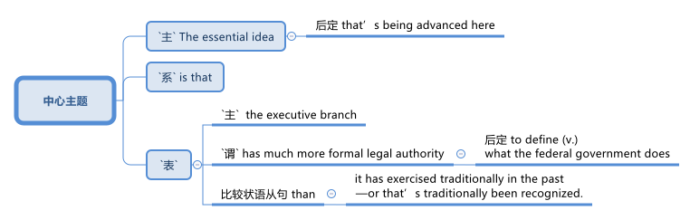

= 2025.03.14 Do eroding presidential norms undermine constitutional principles?
:toc: left
:toclevels: 3
:sectnums:
:stylesheet: ../../../myAdocCss.css

'''

视频 +
https://www.youtube.com/watch?v=CeVzDLvxU4g

'''

== 释义

==== 开场介绍
Hi, I'm Katie Dunn Tempus, a visiting fellow (（学术或专业团体的）会员)访问学者 /in Governance (n.)统治方式，管理方法 Studies 治理研究 at the Brookings Institution 布鲁金斯学会 /#and# the director 主任 of the Katzman _Initiative (n.)倡议；新方案;主动性 后定 on Improving (v.)提高；改善 Interbranch 分支机构间, 部门间 Relations and Government_.  +
This is Season Two of _Democracy in Question_, a podcast 播客 /where we examine (v.)审视；考察 current events 时事 /through the lens 视角；镜头 of America's political foundations 政治基础, thinking about how recent events *fit into* 融入,适应 the broader stream 更广泛的潮流 of democracy 民主 /that *runs throughout* 贯穿整个,遍布 our history.  +
You can find episodes 集；片段 of this podcast /at brookings.edu/democracyinquestion, all one word.

[.my1]
.案例
====
.The Katzmann Initiative (n.) on Improving (v.) Interbranch Relations and Government 卡兹曼关于"改善跨部门关系和政府"的倡议

`主` _The Katzmann Initiative (n.) on Improving (v.) Interbranch Relations and Government_ `谓` ① monitors (v.) the health of the three branches, examines (v.) the relationship between the courts 法院 and Congress 国会, #and# ② fosters (v.)培养，促进；代养，照料 civic (a.)城镇的，市政的；公民的，市民的 education.  +
The Initiative honors (v.) judge 法官，审判官, law professor, and political scientist Robert A. Katzmann (1953-2021) who joined _the Governance (n.)统治方式，管理方法 Studies program_ at Brookings from 1981 to 1999.

卡兹曼"改善跨部门关系和政府"的倡议, 监测三个部门(法院, 国会, 联邦政府)的健康状况，审查"法院"与"国会"的关系，并促进公民教育。该倡议向法官、法学教授和政治学家"罗伯特·A·卡兹曼"（1953-2021）致敬，他于 1981 年至 1999 年加, 入"布鲁金斯学会"治理研究项目。

官网 +
https://www.brookings.edu/projects/the-katzmann-initiative-on-improving-interbranch-relations-and-government/

.how recent events *fit into* the broader stream of democracy that runs throughout our history
fit into（短语动词）： +
1.适应，符合（to be suitable for a particular situation or group） +
- "She doesn’t fit into the corporate world."
（她不适合企业界。）

2.融入（某个更大的体系或模式）（to be part of a larger structure or system） +
- "This new evidence fits into our overall theory."
（这条新证据与我们的整体理论吻合。）

在你的例句中，它表示 “最近的事件, 如何在美国民主历史的长流中,占据一席之地”。
====

On today's episode （电视剧或广播剧的）集，一集, I'm posing 提出 the question: Do `主` eroding (v.a.)侵蚀；削弱 presidential norms 总统规范 `谓` undermine (v.) 破坏；削弱 constitutional principles 宪法原则?  +
In his second term 第二任期 in office, President Trump *is* already ① *shaking (v.)震动 up* 彻底改变；使震惊 American politics 政治 in a big way 在很大程度上, /② seemingly *breaking the mold (模具；铸模;（独特）类型，个性，风格) 打破常规 of* the modern presidency 现代总统职位  /③ and *showcasing (v.)展示；展现 a muscular 强有力的, aggressive 激进的；好斗的 approach* 方法；途径 to governing 治理.

==== 总统权力与规范
In terms of 在……方面 personnel 人员;（公司、组织或军队中的）全体人员，员工；人事部门, his North Star 北极星；指导原则 has been loyalty (n.)忠诚, *as demonstrated (v.)证明；展示 by* nominees 被提名者 /whose credentials 资格；证书 *pale (a.)变得比平常白；变苍白 /in comparison to* 与……相比显得逊色 their predecessors 前任. +

[.my1]
.案例
====
.pale (a.) beside/next to sthˈ |  pale (a.) in/by comparison (with/to sth)ˈ | pale (a.) into insignificance
to seem less important when compared with sth else 相形见绌；显得逊色 +
• `主` Last year's riots `谓`  *pale (a.) in comparison with* this latest outburst of violence. 去年的骚乱与最近这次暴乱相比，可说是小巫见大巫。
====

*In terms of* 就……而言；从……角度来看 foreign policy 外交政策, he seems to be avoiding (v.)避免 diplomacy 外交 /and ignoring (v.)忽视 alliances 联盟 /#in favor of# 偏向于;支持；有利于 deal-making 交易.  +
On the domestic front 国内战线, the Trump administration has fired 解雇 perceived (a.)认为的；察觉到的 adversaries 对手 /#and# *centralized (v.)集中 control* over many federal agencies 联邦机构, including independent ones.  +
These actions *call into question* 质疑;对……表示怀疑 /`宾` the Framers' 开国元勋;制宪者；筹划者 vision 愿景 for a system /#in which# each branch 分支 checked (v.)制衡;检查，核对；查看；控制 the power of the other /to prevent (v.)防止 the rise 崛起 of another king.

`主` Much of what constrained (v.)限制 prior presidents 前任总统 /`系` were norms 规范 and customs 习俗. +
While Trump’s predecessors 前任 generally *stayed clear of* 避免;避开，远离 violating 违反 these norms, President Trump has *deviated from* 偏离 _the central tenets (原理，原则；信条) 核心原则 and practices_ 实践 of the modern American presidency 主席的职位（或任期等）；总统的职位（或任期等）.

[.my2]
制约前几任总统的主要因素, 是传统规范和习俗。

To dig (v.) deeper into 深入探讨 this new version 版本 of presidential power, I’m talking with Scott Anderson, a brilliant 杰出的 scholar 学者 and fellow 研究员 /in the Governance Studies program at Brookings, general counsel (法律顾问；律师) 总法律顾问 /and senior editor 高级编辑 for Lawfare 法律战, a former U.S. diplomat 外交官, and government attorney 政府律师.  +
Anderson is an expert 专家 in foreign relations law 外交关系法, international law 国际法, and national security law and policy 国家安全法律与政策, particularly as they relate to 与……相关 the Middle East region.

Welcome to the show, Scott! I’m eager (a.)渴望的 to dive (v.) into 深入探讨 this discussion with you /#about# presidential authority 总统权力 and norms /during this pivotal 关键的 moment 时刻 in American history.

Thank you /for having me!

So, do you just want *to kick it off* 开始 /by telling me your thoughts 想法 /about the coexistence 共存 of _norm-breaking 打破规范 and constitutional principles_ 宪法原则?

[.my2]
你想先告诉我你对"打破常规"和"宪法原则", "这两种现象是共存的"的看法吗？

Yeah, absolutely. I mean, the Constitution 宪法 is defined by _a separation of powers_ 权力分立—and not always _a neatly defined 明确界定的 separation of powers_.  +
There’s cleavage (n.)分歧 between the different branches.  +
We have a number of areas /of overlapping (a.)重叠 and interdependent (a.)相互依赖 authorities 权力.  +
Sometimes there’s _reasonable (a.)合理的 ambiguity_ (n.)模糊性;模棱两可，不明确 about /① *where exactly the line is* between the branches, /② *where the assignment (n.)分配 of responsibility 责任 is*, particularly between the political branches: Congress 国会 and the executive branch 行政部门.  +

But *we do have a clear sense 明确的认识 about* a lot of authorities /#and# where traditionally *they have lain (v.)躺，位于 on* the constitutional map 宪法地图 —which `主` branch `谓` *plays (v.) a dominant 主导的 role*, what particular types of roles /*in regards to* 关于 those authorities.  +
And *we have a specific sense 具体的认识 of* the obligation 义务 /of *the branches to respect (v.)尊重 each other*.

==== 制衡机制与规范的紧张关系
Hard questions `谓`  *do arise (v.)产生，出现 inevitably* 不可避免地 between the branches, but it’s _a defining (a.)最典型的；起决定性作用的 ##precept##_ 基本原则 of the three branches now /#that#, essentially 本质上，根本上, the executive branch 行政部门 *is responsible (a.) for* implementing (v.)执行 the law  /*as 按照…的方式,被…所 enacted (v.)制定 by* Congress /#and# *as interpreted (v.)解释 and understood (v.) by* the courts. +

[.my1]
.案例
====
.as enacted by Congress
"as + 过去分词" 结构常用于正式书面语，表示 “按照……的方式” 或 “正如……所”。 +
- as enacted by Congress → “按照国会颁布的方式” / “由国会制定的法律” +
- as interpreted and understood by the courts → “按照法院的解释和理解” / “由法院解释和理解的法律”
====

Those norms —that principle, I say ‘norm’ /#because# `主` #the enforcement mechanisms# 执行机制 /后定 that could *be brought (v.) to bear* (v.)施加; 把精力用于；对…施加压力（或影响等） /to require (v.) the executive branch /to act (v.) in that manner, or the other branches, particularly the executive branch —`系` #are# sometimes a little unclear /and rarely invoked 很少被援引 /#because# it rarely gets to the point /where it’s necessary to go that far.  +

[.my2]
那些规范——或者说这一原则。我之所以称其为“规范”，是因为可以用来强制行政部门（或其他分支，尤其是行政部门）按照这种方式行事的执行机制，有时并不那么明确，而且很少被动用，因为情况很少会发展到必须采取如此极端措施的地步。

[.my1]
.案例
====
.bring sth to bear (v.)承担责任 (on sb/sth)
( formal ) to use energy, pressure, influence, etc. to try to achieve sth or make sb do sth 把精力用于；对…施加压力（或影响等） +
•We must *bring* all our energies *to bear upon* the task.我们必须全力以赴不辱使命。 +
•Pressure *was brought to bear on us* to finish the work on time. 我们得按时完成工作，没有回旋余地。
====

But `主` #that balance#, those norms /that traditionally drive (v.) that interbranch practice 分支间实践, /`系` #are# probably under a degree of #tension# 紧张关系 right now /后定 #that# is unprecedented 前所未有的 in certainly recent American history, and I think probably in any American history, although it’s still early.  +

[.my2]
但是这种平衡，那些传统上推动"跨部门运作实践"的规范，现在可能处于一定程度的紧张状态，这在美国近代史上是前所未有的，我认为可能在任何美国历史上都是前所未有的，尽管现在还为时过早。

I don’t think /*we’re quite 非常，十分；完全地，彻底地 at the point of* a crisis 危机 /that some people have described  描述，描写, /but we can see #the tensions# emerging (v.)显现 后定 /`主` #that#, if they fail to reconcile (v.)调和;（使）和解，（使）恢复友好关系 one way or the other, `谓`  #could *lead to* a crisis# down the road 未来.

How does the norm-breaking 打破规范 `谓` affect (v.) _checks and balances_ 制衡机制?

Pretty dramatically 非常显著地.  +
I mean, what we are seeing _the Trump administration do_ /in its first month in office —it’s part of _a quite deliberate (a.) strategy_ 深思熟虑的策略.  +

It’s something /后定 that, intellectually 在理论上;智力上；理智地, we’ve seen `主` the foundations 基础 `谓` *laid (v.)放；铺设；安排 for* 等待进攻；也指埋伏; 为未来储备;奠定基础 /in _the Project 2025 book_ or policy manual 政策手册  /后定  #that# *rolled out* 推出 /in advance of 在……之前 the election, #disowned# (v.)否认;否认与…的关系；断绝关系 at some point by the Trump campaign /#but# very clearly embraced (v.)接受;拥抱；欣然接受 /*in terms of* who 后定 it’s appointed (v.)任命 /#and# the policies 后定 it’s pursuing 推行.  +

image:../img/svg 012.svg[,%]

[.my1]
.title
====
上面的这句太复杂了, chatGPT 修改后的如下, 更容易理解: +
Intellectually, we have seen the foundations for this being laid in #the Project 2025 book or policy manual. It# was rolled out /in advance of the election, later disowned by the Trump campaign at some point, but still very clearly embraced —both in terms of its appointees /and the policies it is pursuing.
====

And *it’s got a longer lineage (血统，世系) 更长的渊源 #than# that*, /tied to 与……相关 _the Trump-oriented 以……为方向的，重视……的 universe_ (宇宙；领域) 特朗普导向的领域 of _think tanks 智库 and research institutes_ 研究机构 /#that# *sprang up* 涌现 /after his first term in the White House.

Are you talking about _the America First Policy Institute_ ( 研究所，学院，协会) 美国优先政策研究所?

_The America First Policy Institute_ being the most forward-leaning 最激进的 of those, but not the only one.  +
There’s _a set of_ those, and some of them predate (v.)在日期上早于（先于） even the first Trump administration.  +
We think about _the Claremont Institute_ 克莱蒙特研究所 and other groups /后定 that embraced (v.)接受 this line of thinking 这种思路.  +

`主` The essential idea 核心理念 /that’s being advanced (v.)提出（想法、理论、计划） here /`系` is that /`主` the executive branch `谓` #has much more formal legal authority# 正式法律权力 /*to define (v.) what the federal government does* /#than# it has exercised 行使 traditionally in the past —or that’s traditionally been recognized 被认可.

[.my2]
这里提出的基本观点是，行政部门在定义联邦政府的行为方面拥有比过去传统上行使的——或者传统上被认可的——多得多的正式法律权威。

Key areas of this `谓` include (v.) control of the federal bureaucracy 联邦官僚机构, meaning (v.) _the actual personnel_ 实际人员 and, to some extent 在某种程度上, _structure_ 结构.  +
Those are issues where, traditionally, `主` the legislative branch 立法部门—Congress —`谓` *has exercised* (v.) a good degree of control 行使相当程度的控制, *setting (v.) restrictions 设置限制 on* certain officials’ removal 官员的免职, *setting up* 建立 different types of institutions 机构 /*to try (v.) and provide (v.) incentives 提供激励 for* _certain types of policymaking_ 政策制定 or _certain paces 步调 of policymaking_ —*some* more bipartisan (a.)两党合作的, *others* more directly under the control of the presidency 总统的直接控制.  +

[.my2]
其中的关键领域包括, 对联邦官僚机构的控制，即对"实际人员"的控制，以及在某种程度上对"结构"的控制。 +
在这些问题上，传统上，立法部门——国会——已经行使了良好的控制程度，对某些官员的免职设置了限制，建立了不同类型的机构，试图为"某些类型的政策制定", 或"某些速度的政策制定", 提供激励——有些是两党合作的，有些是直接由总统控制的。

We have seen `主` _the Supreme Court_ 最高法院 *and* other _lower courts_ 下级法院 *as well* 也；同样地 `谓` begin *to chip (v.) away 逐步削弱;不停地削（或凿） at*  certain of those protections 保护 over the last 30 or 40 years /#because of# this idea of _the unitary 单一的；统一的；单位的 executive_ 单一行政理论 —the idea that _the president should have (v.) absolute control 绝对控制 over the executive branch_.

[.my1]
.案例
====
.chip (v.) aˈway at sth
to keep breaking small pieces off sth 不停地削（或凿） +
•He was chipping away at the stone. 他不停地凿那块石头。 +
•They chipped away at the power of the government (= gradually made it weaker) . 他们不断削弱政府的权力。

====

The Trump administration, though, ① #has taken those steps# —those chips  （木头、玻璃等的）缺口，缺损处;（木头、玻璃等上掉下来的）碎屑，碎片，碎渣 /we’ve seen in the armor 盔甲 of that theory of _congressional control (v.) over the bureaucracy_ — /② #and has leapfrogged (v.)超越;越级提升 them# by several measures 措施.  +

[.my2]
然而，特朗普政府已经采取了这些措施——这些我们在"国会控制官僚机构"理论的盔甲上看到过的碎片——并通过几项措施超越了它们。

It is taking #steps# 采取措施 /to fire (v.)解雇 federal employees 联邦雇员 /#that# directly ignore (v.) statutes 法规.  +
*It has taken steps* toward institutions like USAID 美国国际开发署 /#that# *are protected by* statute 法令，法规，成文法 /to dismantle (v.) 拆除;拆开，拆卸；废除 them, #although# it *has now prevaricated* (v.)支吾其词 a little bit /*on* to what extent 到什么程度 it is actually dismantling (v.) them /*#as opposed to#* 与……相对比 just shrinking (v.)缩减 them, because I think /it recognizes (v.) /it’s not on the strongest legal terrain 法律基础 there. +

[.my2]
它已经采取了一些措施，试图拆解诸如美国国际开发署（USAID）等受法律保护的机构，尽管现在在实际拆解的程度上有所含糊，究竟是彻底解散，还是仅仅缩减规模。这可能是因为它意识到，在法律层面上，它的立场并不十分稳固。

It’s doing a lot of these things /后定 that have traditionally been understood to be congressionally mandated (v.授权) 国会授权的 /#and# were *far down* 远离”,处于……的远端 the spectrum 范围 of what most people thought (v.) was in contestation 争议 /about *where the line* between Congress and the executive branch *is broken*.

[.my2]
它正在采取许多传统上被认为是国会授权的行动，而这些行动原本被认为远离争议范围，不属于大多数人认为的国会与行政部门权限界限存在争议的领域。

[.my1]
.案例
====
.far down
这里的 "far down the spectrum" 可以理解为 “在（争议）范围的远端”，意味着这些行为本来是公认的、几乎没有争议的，不属于国会和行政部门权力界限模糊的领域。

far down 的常见用法： +
1.表示在某个范围（spectrum/scale/range）的远端 +
- "That issue is far down the list of our priorities."
（那个问题在我们的优先事项清单上排得很靠后。） +
- "This decision is *far down* the political spectrum *from* radical policies."
（这个决定, 在政治光谱上远离激进政策。）

2.表示物理上的“更深、更远” +
- "We hiked far down the valley before setting up camp."
（我们沿着山谷走了很远才扎营。）

.chatGPT对这句英文的改进:

- 表达复杂，结构冗长:  +
句子中嵌套了多个从句，如 "that have traditionally been understood to be congressionally mandated" 和 "what most people thought was in contestation"，可能让读者迷失主干。

- “were far down the spectrum of what most people thought was in contestation” 结构不够清晰. +
“spectrum of what most people thought was in contestation” 这个结构不太自然，特别是 “was in contestation”，使得逻辑不太清楚。

- in contestation（处于争议中）虽然勉强可以理解，但更常见的表达是 "under debate" 或 "in dispute"。
- 这里的“spectrum”比喻的是一个争议的范围，但“what most people thought was in contestation”本身没有很好地修饰“spectrum”。

- “about where the line between Congress and the executive branch is broken” 句子层级混乱 +
“about where the line... is broken” 这个 about 让整个结构变得复杂，因为它试图修饰“contest”但又有些脱离主干结构。
- “where the line... is broken” 似乎想表达 国会与行政部门的界限在哪里被打破，但 “is broken” 用法不够精确，更好的表达可能是 “where the boundary is blurred”（界限变得模糊）或 “where the separation of powers is undermined”（三权分立受到削弱）。

如何修改？
更清晰、更符合语法逻辑的表达方式可以是： +
"It’s doing a lot of things #that# have traditionally been understood to be congressionally mandated (v.) #and# were considered to be _at the far end of the spectrum of_ disputes 后定 over *where the line* between Congress and the executive branch *is drawn* (v.)."
====

==== 行政权力的具体实践与挑战
Some items 后定 it’s addressing (v.)处理, like multi-member commissions 多成员委员会 or bodies — `主` #the Office# of the Special Counsel (法律顾问；律师) 特别检察官办公室  /`系` #is one# 后定 that’s being litigated (v.)被诉讼 currently /*as we’re recording* 在我们录音的时候. +
those are ones /后定 that *have always been* kind of on the target list 目标清单 /for _unitary  (a.)单一的；统一的；单位的 executive_ believers 单一行政理论的支持者, /#of which# there are ① members on _the Supreme Court_ /who are distinctly 清楚地，明白地；明显地 believers of that, /② #and# a lot of traditional legal conservatives 传统法律保守派, people who *subscribe to* 订阅 the Federalist Society 联邦党人协会, *buy into* 相信，接受 some version of this.  +

[.my2]
特朗普政府正在处理的一些事项，比如"多成员"的委员会或机构——例如"特别检察官办公室"（目前正在诉讼过程中）——一直以来都是"单一行政权理论"（unitary executive theory）支持者的目标。这一理论的支持者包括最高法院的一些成员，以及许多传统保守派法律人士，特别是"联邦党人学会"（Federalist Society）的成员。

But that doesn’t mean that /because you believe (v.) the theory, the Constitution 宪法 says (v.) the president *has to have control of* 必须控制 those officials *all the way down to* 一直延伸到 independent commissions 独立委员会 or even just 甚至，更进一步地说 bureaucrats 官僚, day-to-day staffers 日常工作人员.  +

[.my2]
然而，支持该理论, 并不意味着宪法明确规定"总统必须对所有官员拥有绝对控制权，包括独立委员会的成员，甚至日常行政人员"。

But *that’s what we see* /the Trump administration trying to assert 主张.

First, statutorily (ad.)在法律上;根据法律条文地, in #the implementation# 实施 of _Schedule 计划（表），进度表 F_ (附表F) #through regulations# 法规, where *it’s reinterpreting* (v.)重新解释 certain statutory language 法律语言 /*in an unorthodox* 非传统的 —and I think legally questionable 在法律上存疑的—*way*, but nonetheless 然而，尽管如此 trying to implement that.  +

[.my2]
首先，在法律层面，特朗普政府试图通过《F类任用令》（Schedule F）的相关法规实施，以非传统且存疑的法律解释方式, 重新解读某些法条，并推进其执行。但更深层次的核心逻辑，是它的宪法主张：即总统有权控制整个行政部门。

But then, `主` *foundationally underlying (v.)基础支撑 that*, /`系` is a constitutional assertion 宪法主张: the idea /that this is what the president can do /because he controls (v.) the executive branch.

*The same goes for* 也适用于；也适合于 the empowerment (n.)许可，授权 authority 授权权力.  +
Traditionally, it’s understood (v.) 被明白 /Congress has the power of the purse 财政权. When Congress appropriates (v.)拨款 money and says, ‘This money shall be spent (v.) on this purpose,’ the executive branch’s job /is to take care 确保 that /the law be faithfully executed 忠实执行—that’s `表` what the Constitution says its duty is 这是宪法规定的职责所在 —and to implement that /by spending that money /within the confines 范围 and parameters 决定因素；规范；范围;参数 /后定that Congress has set out （怀着目标）开始工作，展开任务 for it.

[.my2]
传统上，"国会"掌握"财政权"，当国会"拨款"并指定用途时，行政部门的责任是“确保法律得到忠实执行”（宪法明确规定），即在国会设定的限制和范围内, 合理使用这笔资金。

But we have seen /the Trump administration stop (v.) funding 停止拨款 *across the board* 全面地，包括所有方面地 /in ways that would generally *be seen* —and have traditionally been seen —*as* 被看做为 /beyond the president’s authority 超出总统权限 后定 to direct (v.)管理；监督；指导 or implement (v.)/#because# they require an interruption 中断 of _this empowerment (n.)许可，授权 authority_, of _the distribution of funds_ 资金分配 /and _use of funds_ /*in the way Congress directed* 按照国会指示的方式.

[.my2]
但我们已经看到，特朗普政府全面停止资金支持，而这种做法通常被认为——并且一贯被认为——超出了总统的指挥或执行权限，因为这需要中断"国会授予的支出权力，以及资金的分配和使用方式"，而这些本应按照国会的指示进行。

Again, the executive branch—the Trump administration—has complicated 使复杂化 this /a little bit. It’s said at various points 在不同的地方, ‘No, we’re not really relying on 依赖 a constitutional argument 论据，理由; we have _statutory  (a.)依照法令的，法定的 authorities 当局，官方；官方机构_ —sometimes _contracting authorities_ 合同权力, sometimes _regulatory 管理的，控制的，监管的 authorities_ 监管权力—that let us do this,’ this kind of piecemeal argument 零碎论点. But it’s implemented (v.)执行，贯彻；为……提供工具 them through one big whole 一个大整体 that says, ‘Stop (v.) all payments for 90 days.’

[.my2]
再一次，行政部门——特朗普政府——把这个问题复杂化了一点。有很多人说，‘不，我们并不是真的依靠宪法论点；我们有法定机构——有时是合同机构，有时是监管机构——允许我们这样做，这是一种零碎的论点。但它是通过一个大整体来实施的，上面写着，‘在90天内停止所有付款。

And so /#the real challenge# with cases like these, and on the personnel (a.)人员的，有关人事的 side, #is#: Are courts and judges viewing (v.) these as a forest 森林 or trees 树木?  +
Is this a case /where there are just 10,000 little _legal disputes_ 法律纠纷,法律争议 /that have individual 单独的，个别的 little #legal arguments 论据，理由 /that# may or may not support them, and we have to fight over all 10,000 of those disputes —which normally we get channeled into 被引导进入 very specialized 专业的，专门的 administrative procedures 行政程序 /to resolve for *both* payments *and* for personnel —or is this _what President Trump said it was_ on day one, what Elon Musk said at various points: #an effort# /to implement a very big policy change 政策变革, a forest, *so to speak* 可以说；打个譬喻说, #that# really foundationally changes (v.) government, even if `主` the lawyers in court `谓` are arguing /`宾` it’s actually 10,000 little things?

[.my2]
因此，在人事方面，这类案件面临的真正挑战是：法院和法官是将其视为森林还是树木？在这种情况下，是否只有一万个小的法律纠纷，每个小的法律论据可能支持或不支持他们，我们必须为所有这一万个纠纷而战——通常我们会通过非常专门的行政程序来解决"支付和人员问题"——或者这是特朗普总统第一天说的，这是埃隆·马斯克在不同的时候说的：努力实施一个非常大的政策变化，一个森林，可以这么说，这真的从根本上改变了政府，即使律师在法庭上争辩说这实际上是10,000个小事情？

Does it all *amount to* 相当于 one big thing /that needs to be viewed as a cohesive 团结的，有凝聚力的 whole 整体? That’s really _what courts are wrestling with 努力解决 now_, because that really dictates (v.)（尤指以令人不快的方式）指使，强行规定;决定 the sorts of #remedies# (n.)补救措施 后定 they look to /and #procedures# 后定 they look to in resolving (v.) these.

[.my2]
所有这些是否都是一个需要被视为一个有凝聚力的整体的大事情？这确实是法院现在正在努力解决的问题，因为这确实决定了他们在解决这些问题时, 所寻求的补救措施和程序。

==== 问题的根源
Yeah, and this might be a difficult question, but how did we get here?

It’s a very good question. It’s worth *taking a step back* 退一步思考 and recognizing /there has been #a thread of thought# 一条思路 —particularly prevalent 特别普遍, but not necessarily isolated to 不局限于 the conservative political wing 保守政治派系 of American politics —#that# ① the bureaucracy 官僚机构 *is* an enemy /② and *is* particularly invested with 被赋予 its own ideological agenda 意识形态议程, or some would argue (v.), I think a little more reasonably 我认为更合理一些, ③ institutional inclinations 制度倾向 /that can impede (v.)阻碍 the implementation 实施 of a president’s policy agenda 政策议程 when he’s elected.

[.my2]
这是一个非常好的问题。我们有必要退后一步，认识到有一种思想——尤其普遍，但不一定孤立于"美国政治中的保守政治派别"—— 这种思想: 1.官僚机构是敌人，2.特别投入自己的意识形态议程，或者有些人会认为，我认为更合理的是，3.制度有这种倾向, 会阻碍"总统当选后, 政策议程的实施"。

This idea was really *staked 桩 out* 明确提出 in the 1970s, coming into and out of the Nixon administration.  +
You saw a lot of people *view* (v.) both the bureaucracy —and actually *specifically view* (v.) the bureaucracy —*as* kind of a tool of Congress 国会的工具 /to try and constrain 限制 the president, and so would *push back against* 反抗，抵制 a lot of the idea /that the president couldn’t do a lot of policies /they wanted to implement in very strong ways.  +

[.my2]
这个想法在20世纪70年代被明确提出，在尼克松政府执政期间反复出现。你看到很多人把官僚机构——实际上是特别地把官僚机构——看作是国会试图约束总统的一种工具，因此会推翻很多观点，即总统不能以非常有力的方式来执行很多他们想要实施的政策。

And it’s been a part of that sort of _conservative legal view_ 保守法律观点 /that we often associate with 与……相关联 the Federalist Society 联邦党人协会 and similar institutions /since that point 自那时起, and `主` threads of it /`谓` have really *caught on* 变得流行 /in ways 后定 that `主` people across the legal academy 法律学术界 `谓` now buy into 接受.

[.my2]
自那时起，这种保守派法律观点——我们常将其与"联邦主义者协会"及类似组织, 联系起来——已成为主流，其部分主张, 甚至以某种方式被整个法律学术界所接纳。

What’s an example?

So an example is this idea about bureaucracy being a slowing element 减缓因素. Elena Kagan—you know, Democratic appointee 民主党任命的 to the Supreme Court, a justice on the Supreme Court now—her kind of seminal academic work 开创性学术著作 was a piece called ‘Presidential Administration,’ a law review article 法律评论文章 which drew out 阐述 the argument saying, actually, there are good reasons why the president can push 推动 the bureaucracy and make the bureaucracy break free of 摆脱 its usual confines 通常限制 and inclinations, because the bureaucracy actually is a small-c conservative institution 小写c的保守机构, a check on 制衡 presidential policymaking 总统政策制定 that—some would call it undemocratic 不民主的; I think that goes too far—I think it is more of a long-term, installed-by-democratic-process-over-a-long-period 通过长期民主进程建立的, again, that kind of small-c conservative, Burkean conservative model 伯克式保守模式. And she argued, actually, it’s a good thing the president can do this, can disrupt 打破 the bureaucracy. That’s an idea that has cachet 影响力 on the left and the right, because the truth is presidents from both political parties have felt at different times like the bureaucracy wasn’t doing enough to implement their policies or was setting up more barriers 设置更多障碍.

I think the true answer is that bureaucracy is there because Congress has set it up 建立 in a certain way, as have presidents over many years. This didn’t just happen overnight 一夜之间.

Yeah, exactly. And it’s designed to present these checks 制衡 and present certain barriers because they reflect a longer-term consensus 长期共识 over many years, particularly in Congress, that this is a way to get what we want—maybe not the most efficient, but a reliable and stable way 可靠且稳定的方式 to produce certain public goods 公共产品. Doesn’t mean it’s always perfect, doesn’t mean there aren’t ways to improve—everyone recognizes there are—but dismantling 拆除 that architecture 架构 poses real threats 构成真正威胁 to that.

==== 特朗普政府的策略与后果
That’s really what the Trump administration is doing. They’re stepping in 介入 and foundationally dismantling 从根本上拆除 big parts of this federal bureaucracy 联邦官僚机构 and intend to do more. Again, at the time of recording, we’re only about a month into the Trump administration. They’re very vocal about 公开表示 intending to do much, much more, and they’re doing it in a way that we have always understood would require congressional support 国会支持. And they know they can’t get the congressional support for that, both because you have the filibuster 阻挠议事 in the Senate, which even Senate Republicans are committed to, and so you would need 60 votes to implement most of this by statute 通过法律实施—they’re not going to get 60 votes because there aren’t 60 Republicans in the Senate. And even if you did, on a strict majority line 严格的多数线, I think there’s good reason to question whether you could get 51 Republican senators or 50 senators plus the vice president on board 支持 to implement the full swath 全面实施 of what they’re trying to do, because it’s going to be disruptive 破坏性的 and costly 代价高昂的. It’s high risk to a lot of things that people really care about, a lot of goods 产品 the government delivers. But the Trump administration seems willing to roll the dice 冒险 on that.

And that’s really what we’re going to see play out 展开 over the next few months: How costly does this prove? How much do those risks manifest 显现? And what benefits manifest that have been promised—you know, economic benefits 经济利益 that have been promised by the Trump administration and others? And how is the public going to perceive 看待 that as we begin to look ahead to 展望 the 2026 midterm elections 中期选举 and kind of the broader political universe 更广泛的政治领域 and timeline 时间线 that we live in?

Right. And in a sense, there seems to be kind of this lag 滞后, right? So they’ve made—they’ve issued these executive orders 行政命令, and his base 支持者 seems to be very happy because he’s basically checking boxes 打勾 of all his campaign promises 竞选承诺, but the rubber doesn’t meet the road 落实 for a while. And when it does, it will presumably hurt 伤害 a lot of Republican districts 共和党选区, and then maybe at that point there’s sort of a backlash 反弹 to it amongst public opinion 公众舆论 at large. Do you think—or, you know, we’ll have to see?

We are beginning to see signs of discontent 不满—some very real, some amplified 放大 by mobilizers 动员者 and activists 活动家 on the left who oppose these policies and have from the outset 从一开始, but not solely by them. I mean, we are seeing job cuts 裁员 really hit 影响 different districts around the country, parts of the country that might not have thought from the front end 一开始 that cutting government jobs or cutting bureaucracy would hurt them. We are seeing real interruptions 中断 in the delivery of benefits 福利发放, and states have been able to work around it 绕过它 so far—they’ve sued over it, they’ve tried to get injunctions 禁令 to do it. Those may only go so far. We’re going to see more disruptions 混乱 in the future. We’ve seen a lot of different consequences 后果 in small ways pile up 积累.

The real question is: How big do they pile up? When do they start hitting the public mentality 公众心态, the public awareness 公众意识, that they begin to really recognize and factor this in 考虑 as a cost of these policies? And the sad truth is, sometimes that only happens after you really have a disaster 灾难, after something really happens where people are really hurt or killed in an irrevocable way 不可逆转的方式. And I fear that that is the sort of thing that will really take to begin to see a sharp pendulum swing 剧烈摇摆 back in the other direction. But I think we are beginning to see that pendulum swinging.

==== 政治支持与反对的动态
The trick 关键在于 here is that Donald Trump, even though he won by a very slim majority 微弱多数 in the popular vote 普选票 in 2024, has a lot of control over his party. And he has the support of Elon Musk with very deep pockets 财力雄厚, who seems to be willing to threaten—in a way that’s perceived as credible 可信的—to challenge in primaries 初选 or otherwise make the political lives difficult for people who oppose the Trump agenda. It’s a bigger concern for House members 众议员, particularly a big concern for House members from Republican districts 共和党选区.

So, you know, first I think you’ll see pushback 反弹 come from folks from blue districts 蓝区 that happen to go Republican in 2024—folks who are going to be in danger in a few years—or senators who may be thinking about retirement 退休 or may not have to look for election for many years, a little less sensitive to those pressures. And those people are there. I think we’ll see them begin to push back. We’re already seeing Lisa Murkowski, for example, really become more and more vocal 越来越直言不讳 about concerns about some of this stuff, as someone who’s relatively independent 相对独立的 in her seat in Alaska.

But it’s going to take time for people to stir up 激起 the political courage, frankly, for the threat that Musk and others leverage 利用 to diminish—not just because, I mean, he probably will always be able to bring the money to bear 施加金钱压力, but at a certain point, his brand and his name may become tarnished 受损 enough that people accepting money from him doesn’t become as real a threat because it seems to have its own political costs 政治代价. There’s lots of counterpoints 反论点, but they all take time, and we’re only a month in at this point, right? It’s February right now, so who knows?

==== 国会的角色
And tell me a little bit about your perspective on Congress. Is Congress sort of guilty of aiding and abetting 共谋? Has Congress lost complete sight of 完全忽视了 the fact that they are an institution that’s supposed to be competing for power 争夺权力 with the presidency as opposed to letting the president do whatever he pleases? What’s happening in the legislative branch 立法部门?

So, you know, I think it’s fair to say a majority in both chambers 两院—and that’s the Republican majority that controls both chambers—is tacitly participating 默许参与 in what the Trump administration is doing. They have had opportunities where they could push back. In particular, the fact that we are in the process of negotiating budget requests 预算请求 and we’ll need additional funding 额外资金 to keep the government open in the next several weeks—those are points of leverage 杠杆点 that a Congress that wanted to rein in 约束 the executive branch really could use to do it, even in spite of the threat of the veto 否决权威胁 that the president otherwise is able to wield to really raise the threshold 提高门槛 of what you want to do. But they’re not interested in doing that.

In fact, it looks like they’re going to enact 制定 a budget and other measures that—if they get their way 如愿以偿, if they have enough internal cohesion 内部凝聚力 to pass both chambers—will not really push back in a meaningful way 有意义地反弹 against what the Trump administration is doing, even reinforce it in certain ways, although not implement it statutorily 通过法律实施 as many legal scholars 法律学者 would say that’s what’s actually necessary to comply with the law 遵守法律. And that would get it out of the risk of courts pushing back 法院反弹 and reversing at least parts of it.

So, you know, that question about what Congress is doing—they really are standing down on the job 玩忽职守. They’re not fully implementing this, and they’re doing it for partisan reasons 党派原因, because Congress is increasingly an institution where institutional interests 机构利益 have become secondary to partisan political interests 党派政治利益. And that’s been a long-term trend 长期趋势 in American politics, really for decades at this point.

Doesn’t mean it will always lie that way?

No, not necessarily. I mean, the margins are very slim for Republican control. Even just a few Republicans willing to push back and say, ‘No, we actually do want to look into these matters or take steps and stances 采取步骤和立场 against them,’ could complicate things for the Trump administration—although having control of the chambers allows them to stifle 压制 a lot of dissent 异议 at small levels, even within their caucus 党内. But, you know, you’ll begin to hear the sort of vocal pushback. You’ll have little points of pushback by Democrats, but really, the pushback can only meaningfully come after the 2026 midterm elections 中期选举 when there’s a chance another party will control one chamber or the other—barring some huge break 除非重大分裂 between Trump and his own party, that seems very unlikely right now.

And the most likely scenario 最可能的情景 then is Democrats control the House, which is a definite possibility. I think most people projecting this far out 预测这么远 say that’s more likely than not, but they’re unlikely to take the Senate. And so then the issue becomes kind of a repeat 重复 of the last two years of Donald Trump’s first term in the White House, where you have a Democratic House that’s able to engage in a lot of oversight 监督, able to push for a lot of information, ask a lot of questions, make things difficult for the Trump administration to evade political accountability 逃避政治责任—but can’t really enact contrary statutory measures 相反的法律措施, which is what you would really need to put a hard legal stop 法律上彻底阻止 on some of these things, although they’ll be in a better position to negotiate 谈判 for certain items in key must-pass legislation 必须通过的立法 like annual appropriations 年度拨款, annual funding, the National Defense Authorization Act 国防授权法案, things like that.

==== 国家安全与外交政策
Let’s shift gears 换个话题 and talk a little bit about what was your original expertise 专业领域, which is national security 国家安全 and foreign policy 外交政策. How does the norm-breaking 打破规范 vary, and do the consequences vary when it’s in that sphere 领域 as opposed to maybe domestic policy 国内政策?

It’s a fair question, and we are seeing definite, very real norms being broken at the international plane 国际层面 as well. A lot of that is in a zone where the president exercises a lot more authority 行使更多权力 traditionally on his own authority than Congress or any other branch of government. The president really does drive the boat 主导 in foreign relations—not exclusively in all domains, but has the dominant hand 主导权. So when it comes to things like negotiating a peace deal 和平协议 in Ukraine or determining policy toward Gaza, the president can steer 引导 a lot in that direction within the traditional understanding of the legal boundaries 法律界限.

International law 国际法 traditionally sets some limits on that, but international law has always been something that American politics doesn’t fully take on board 完全接受—more of a soft constraint 软约束. One concern that tends to boil down to 归结为: To what extent are we going to get pushback 反弹 from allies 盟友, from the international institutions 国际机构, about what we’re doing because it’s being perceived as contrary to 违反 international law? And it’s not always a hard barrier 硬性障碍, for better or for worse, in terms of U.S. policymaking 美国政策制定. It is significant in the serious consideration 认真考虑, even under all administrations of any stripe 任何派别—no one should discount it entirely 完全忽视—but it’s not determinative 决定性的; it’s not a hard line 硬性界限 like U.S. law sometimes is.

So on the international level, we are seeing things that are moving toward unlawful conduct 违法行为 under international law, certainly. What’s an example?

Well, the clearest example is Gaza—you know, a case where the president has discussed relocating 重新安置 Gazans, potentially contrary to their will 违背他们的意愿, which is something pretty clearly contrary to human rights law 人权法 and the law of armed conflict 武装冲突法. The United States somehow ‘owning’ a share of Gaza—not clear what he means by that—that seems to be buying into 接受, at a minimum, some degree of conquering territory 征服领土 by use of armed force 使用武力, which is kind of the number one thing international law prohibits 禁止 and the whole reason why we’ve opposed Russia’s invasion of Ukraine, among other things.

And you know, you also hear murmurings 传闻 about his stance 立场 on the West Bank and on potentially Israeli reoccupation 重新占领 of parts of Gaza that fit in that same vein 同样的脉络, where, at least to the international community 国际社会, those very much look like territories under military occupation 军事占领. That’s been the international community—the United Nations—position for many, many decades. The United States’ position has been a little more wishy-washy 模棱两可, off and on 断断续续, but certainly the Biden administration’s view that it ended up on at the end of its time in office, and several Democratic administrations before that. The Trump administration seems willing to buck 挑战 that in ways that even prior Republican administrations would never have considered. Who knows if it’ll follow through on that—that’s always the question—but we don’t know.

==== 法院的角色与希望
I know that some people, when they’re looking at the status of Congress and its unwillingness to uphold its constitutional duties 宪法职责 and its ability to check the executive, wonder: Do you have hope in the courts that some of their rulings 裁决 might curb 遏制 the behavior of an aggressive administration?

I do. I think the courts are, for the next 12 to 18 months until the political cycle 政治周期 really begins to rev up 加速 for midterm elections, probably the place where you’ll see the biggest pushback—and from private litigants 私人诉讼人 who are advocacy groups 倡导团体 that are very bravely pushing back on lots of different fronts 多方面 in the courts. Because, foundationally, what the Trump administration is doing really pushes the limit of the law 法律界限 as we understand it. I think a lot of it is unlawful 非法的. There may be some in gray areas 灰色地带 where they have arguments, and the Trump administration really is relying upon obfuscation 混淆—the kind of ‘forest and trees’ point I made before—trying to focus on these as a bunch of small measures 小措施 while distracting from the big, actual macro-policy objective 宏观政策目标 that’s being advanced.

There is an effort underway 正在进行 right now in litigation 诉讼 around foreign assistance funding 对外援助资金 that’s really extraordinary, where they have spent the last two weeks openly ignoring—under a very loose and flimsy legal pretext 法律借口—a direct order from the court to implement certain types of payments back in place. And they’ve pushed back on it and pushed back on it. Now the court has really slapped them down 严厉斥责, and they’re seeking an appeal 上诉. We’ll see what comes of it, but in the end, those sorts of case management measures 案件管理措施 are things traditionally district courts 地方法院 get a fair amount of leeway 回旋余地 on. So unless you get some big overriding constitutional principle 重大宪法原则 a higher court—in this case, it would probably have to be the Supreme Court—intervenes on, and that may happen in certain of the cases where you’ve seen officials removed contrary to statutory restrictions 违反法定限制 and there’s that unitary executive theory 单一行政理论, I don’t think you’re likely to see it in these funding cases, but it’s possible.

But I don’t think so. You know, that’s going to be a real pushback for the courts for the Trump administration. They’re going to be called out 被点名, saying, ‘What you’re doing is unlawful, and you’re not even complying with 遵守 the temporary measures 临时措施 to keep things static 保持现状 while we resolve the bigger legal questions.’ Then the question becomes: What if the Trump administration just ignores these things and doesn’t comply with them? And that is a hard question.

Traditionally, the courts have really relied on the executive branch actually acting in good faith 善意行事. It’s worth noting the executive branch, even under the first Trump administration, did always abide by 遵守 these. There’s no real clear example of them really meaningfully ignoring these judicial orders 司法命令. And the types of pushback we’ve seen so far—while I think not in good faith and highly problematic, particularly on the foreign assistance front 对外援助方面 and other funding fronts—are not yet to the point that you would say that they’re beyond the pale 超出可接受范围, that they’re clearly ignoring the law. They are putting legal pretexts 法律借口 and arguments around what the administration is doing and kind of daring the courts to push back on that. And now the court has in this particular case, and we’ll see what happens.

You know, that might be where we get to a constitutional crisis 宪法危机—if you really see these orders reach final resolution 最终裁决 and the executive branch just refuses to implement them or abide by them. I think that is going to bear a political cost 政治代价 and other costs that’s really going to make it harder for the Trump administration to persevere 坚持 in that for a long time. Although in the first few cases, maybe they won’t get that much pushback from their own party and supporters—we’ll have to wait and see. Probably depends on the issue and the case. But there are ways that courts and litigants can really make those bite down the road 在未来产生后果, and that sort of threat will matter.

And in the end, I don’t think the Supreme Court actually is going to back the administration up 支持 on the full scale of what it’s doing. And when you get a contrary ruling 相反的裁决 by the Supreme Court—of which you’ve appointed a third of them—and they still are not on board 不支持, and I think several of his appointees 他任命的人 are unlikely to get on board with this, then it’s hard to hide the fact you’re just acting lawlessly 无法无天. And openly acting lawlessly is something that I still think a lot of Americans are not going to be able to stomach 忍受 when it’s so clear as that. And maybe even people who voted for him will have difficulty with that. I think so, but that may be a glass-half-full perspective 乐观的看法. We’ll have to wait and see.

Right. I’ll have to have you back in the summer or something like that.

==== 对民主的反思与教育
Shifting gears 换个话题 into a final question that I ask all of my interviewees: Imagine you’re teaching a high school class about democracy 民主. What’s one lesson that you’d want them to leave your classroom with? What’s one pivotal lesson 关键课程 about democracy that everybody should be holding close 牢记 right now?

It is that the separation of powers 权力分立 that’s really central to our system—the checks and balances 制衡机制 everyone talks about that you learn about in Civics 101 公民学基础—isn’t self-executing 自动执行的. It really has come to rely on a lot of norms 规范 and underlying practices 基础实践 that, if you have someone willing to defect from 背离 those expectations, don’t have clear mechanisms for pushback 反弹机制 beyond maybe the democratic process 民主进程 that, in our case, operates on a two-year cycle 两年周期, depending on which branch you’re talking about. That can be a long time where a lot of pain 痛苦 can accrue 积累 when you see people and institutions acting unlawfully 非法行事.

There is more the branches could do. There are ways Congress could implement legislation 立法 to have more bite 更有力, to establish more safety guardrails 安全护栏 against an executive branch 行政部门 that’s not willing to act consistent with 符合 its laws, to help the courts enforce laws 执行法律. But it hasn’t installed that. And in fact, during the Biden administration, after the first Trump administration, it probably didn’t do everything that it could have—or that Democrats in Congress should have, along with Republicans who sympathized with them—to solidify their prerogatives 巩固特权 as an institution and set up a bulwark 堡垒 against this sort of executive branch behavior moving forward.

That’s something they will have to seriously consider. And in good faith 善意地, you know, norms is not something we probably want to rest our system of government on so exclusively or so centrally moving forward.

Right. We never thought they’d be tested to this degree 这种程度.

I think that’s right. And again, it’s early—we’ll see how far they are tested—but the trajectory 轨迹 we’re on is a pretty serious test right now.

Yeah. Well, Scott, thank you so much for your time. It was a really fascinating discussion.

Absolutely. Thank you for having me.

==== 结尾与制作信息
Democracy in Question is a production of the Brookings Podcast Network. Thank you for listening, and thank you to my guests for sharing their time and expertise 专业知识 on this podcast. Also, thanks to the team at Brookings that makes this podcast possible, including Fred Dews, producer 制作人; Daniel Morales, audio engineer 音频工程师 and video manager 视频经理; the team in Governance Studies, including associate producer 副制作人 Adele P. Plus, Antonio Sadur, and Tara Molson; and our government affairs 政府事务 and promotion 推广 colleagues in the Office of Communications at Brookings. Shante Mendez designed the beautiful logo 标志 and show art 节目艺术.

You can find episodes of Democracy in Question wherever you like to get your podcasts and learn more about the show on our website at brookings.edu/democracyinquestion, all one word. I’m Katie Dunn Tempus. Thank you for listening.

'''

== 翻译参考

大家好，我是凯蒂·邓恩·坦普斯，"布鲁金斯学会-治理研究项目"的访问学者，也是"卡茨曼'改善分支关系与政府'的倡议"的主任。这是《民主问题》第二季，这是一档播客节目，我们通过美国政治基础的视角, 来审视当前时事，思考近期事件如何融入贯穿我们历史的更广泛的民主潮流。你可以在brookings.edu/democracyinquestion（一个单词）找到这档播客的节目。

在今天的节目中，我提出的问题是：总统规范的侵蚀, 是否会破坏宪法原则？特朗普总统在他的第二个任期内，已经在很大程度上彻底改变了美国政治，似乎打破了现代总统职位的常规，展示了一种强有力的、激进的治理方式。

在人员方面，他的指导原则一直是"忠诚"，这体现在被提名者的"资格", 与其前任相比, 显得逊色。在外交政策方面，他似乎避免外交，忽视联盟，而倾向于"做交易"。在国内战线上，特朗普政府解雇了他们认为的对手，并集中控制了许多联邦机构，包括独立机构。这些行动质疑了开国元勋对于一个"制衡系统"的愿景，即"每个分支制, 衡其他分支的权力"，以防止另一个国王的崛起。

美国限制前任总统权力的因素, 许多是来自规范和习俗。虽然特朗普的前任通常避免违反这些规范，但特朗普总统已经偏离了现代美国总统职位的核心原则和实践。

为了深入探讨这种新版本的总统权力，我正在与斯科特·安德森交谈，他是布鲁金斯治理研究项目的杰出学者和研究员，Lawfare的总法律顾问和高级编辑，前美国外交官和政府律师。安德森是外交关系法、国际法, 和国家安全法律与政策方面的专家，特别是与中东地区相关的领域。

欢迎来到节目，斯科特！我渴望在这个美国历史上的关键时刻, 与你深入探讨总统权力和规范。

谢谢邀请我！

那么，你愿意开始谈谈你对打破规范与宪法原则共存的看法吗？

是的，当然。我的意思是，**美国宪法是由"权力分立(三权分立)"定义的——而且##并不总是明确界定的"权力分立"。##不同分支之间存在分歧。##我们有许多权力重叠和相互依赖的领域。有时关于分支之间的界限在哪里，责任的分配在哪里，特别是在"政治分支"之间##："国会"和"联邦政府行政部门"，#存在合理的模糊性#。但我们对许多权力, 以及它们在宪法地图上传统上的位置——哪个分支起"主导作用"，关于这些权力的特定角色——有明确的认识。**我们对分支之间相互尊重的义务, 也有具体的认识。

分支之间不可避免地会出现棘手的问题，但现在是"三个分支(三权分立)"的一个**基本原则，即"行政部门"负责执行由"国会"制定, 并由"法院"解释和理解的法律。**这些规范——我说‘规范’是因为可以施加的执行机制，要求"行政部门"或其他分支，特别是行政部门以这种方式行事——有时有些模糊，而且很少被援引，因为很少有必要走到那一步。**但这种平衡，那些传统上推动分支间实践的规范，现在可能正处于一定程度的紧张关系中，**这在美国近代历史上是前所未有的，我认为可能在美国历史上也是前所未有的，尽管现在还早。我认为我们还没有达到某些人描述的危机点，但我们可以看到紧张关系正在显现，*如果它们无法以某种方式调和，未来可能会导致危机。*

打破规范如何影响制衡机制？

非常显著地。我的意思是，我们在特朗普政府上任的第一个月看到的行为——这是其深思熟虑策略的一部分。在理论上，我们已经看到这种策略在2025计划书或政策手册中奠定了基础，这些手册在选举前推出，尽管特朗普竞选团队在某个时候否认了它们，但在任命的人员和推行的政策上, 非常明显地接受了它们。而且它的渊源更久远，与特朗普导向的智库和研究机构有关，这些机构在他第一任总统任期后涌现。

你指的是"美国优先政策"研究所吗？

美国优先政策研究所, 是其中最激进的，但不是唯一的。还有一些其他机构，其中一些甚至早于第一届特朗普政府。我们想到克莱蒙特研究所, 和其他接受这种思路的团体。这里提出的核心理念是，行政部门在定义联邦政府行为方面, 拥有比过去传统行使或被认可的更多的正式法律权力。

这些关键领域包括, 对联邦官僚机构的控制，即实际的工作人员以及在某种程度上对其结构的控制。 这些问题传统上由立法部门（国会）掌握相当大的控制权，例如对某些官员的罢免, 设定限制，建立不同类型的机构，以提供激励机制，从而影响某些政策制定的方式或节奏——其中一些更加"两党合作"，另一些则更"直接地受总统的控制"。 +
在过去的30到40年间，**最高法院以及其他下级法院, 开始逐步削弱其中一些保护措施，其背后的理念是“单一行政权”（unitary executive）——即总统应该对行政部门, 拥有绝对控制权**。

然而，**特朗普政府不仅仅是延续了"国会对官僚机构控制权逐步削弱"的趋势，而是大幅跨越了多个层级。它正在采取措施解雇联邦雇员，甚至公然无视相关法律。**此外，它还试图拆解像"美国国际开发署"（USAID）这样的法定机构，尽管目前在实际执行方面有所犹豫，从彻底解散转向缩减规模，因为它意识到自己在法律层面的立足点并不稳固。 +
*特朗普政府正在做的这些事情，传统上被认为是"国会"的职权范围，而且在大多数人的认知中，这些举措远远超出了"国会"与"行政部门"权限界限的争议范围。*

特朗普政府正在处理的一些事项，比如"多成员"的委员会或机构——例如"特别检察官办公室"（目前正在诉讼过程中）——一直以来都是"单一行政权理论"（unitary executive theory）支持者的目标。这一理论的支持者包括最高法院的一些成员，以及许多传统保守派法律人士，特别是"联邦党人学会"（Federalist Society）的成员。**然而，支持该理论, 并不意味着宪法明确规定总统必须对所有官员拥有绝对控制权，包括独立委员会的成员，甚至日常行政人员。**但特朗普政府正在试图强化这一主张。

首先，在法律层面，特朗普政府试图通过《F类任用令》（Schedule F）的相关法规实施，*以非传统且存疑的法律解释方式, 重新解读某些法条，并推进其执行。但更深层次的核心逻辑，是它的宪法主张：即总统有权控制整个行政部门。*

同样的问题, 也出现在"拨款权"（empowerment authority）上。*传统上，"国会"掌握"财政权"，当国会"拨款"并指定用途时，行政部门的责任是“确保法律得到忠实执行”（宪法明确规定），即在国会设定的限制和范围内, 合理使用这笔资金。然而，特朗普政府已经多次全面停止拨款，这种做法通常被视为超出了总统的权限，因为它直接干预了资金的分配和使用，违背了国会的授权。*

此外，**特朗普政府在法律策略上模糊处理。它有时声称并未依赖"宪法主张"，而是依据"法定授权"（statutory authority），比如合同权（contracting authority）或监管权（regulatory authority），从而为其行为提供"合法性依据"。**然而，政府实际执行时，却采用了整体性策略——比如全面冻结所有支付90天。

**目前，法院和法官在这些案件中的核心争议在于：他们应该聚焦"个别案件"，还是将其视为整体性的"政策变革"？**换句话说，法院是应该把这些问题当作一系列独立的法律争议，分别进行行政审查和裁决，还是应该把它们视为特朗普政府推动的"全面政府变革"？特朗普本人在第一天就明确表示，这是一场深远的"政策变革"，埃隆·马斯克等人也曾公开支持这一观点。因此，法院面临的真正问题是：这是一片森林，还是一棵棵树？

如果法院认为这只是10,000个单独的法律争议，那么每个案件都需要依据具体的行政程序, 来进行裁决，包括拨款问题和人员问题。但如果法院认为这是一个"整体性的政府改革计划"，那么它可能需要从更广泛的"宪法框架"来审视，并采取不同的救济措施和裁决程序。目前，法院正在权衡这一问题，而这将直接影响最终的法律判决和政策走向。

这可能是一个难回答的问题，但我们是如何走到今天这一步的？

这是个很好的问题。值得退一步思考，我们需要认识到，**##一种特定的思想流派一直存在，##特别是在美国政治的保守派阵营中, 占主导地位（但并不局限于此）。##这种观点认为"官僚体系是敌人"，它不仅有自己的"意识形态"议程，##甚至有些人（以更温和的角度来看）认为，官僚体系在体制上存在一定的倾向性，从而阻碍"当选总统"的政策执行。**这种想法最早可以追溯到20世纪70年代，特别是在尼克松政府时期前后。当时，**许多人将"官僚体系"视为"国会"的一种工具，用来制衡"总统"，因此他们反对一种观点，即总统在推动自己的政策时要受到过多限制。**自那时起，这一思想便成为"保守派"法律理论的一部分，我们今天通常将其与"联邦党人学会"（Federalist Society）等机构联系在一起。随着时间推移，这种观念逐渐流行开来，如今在整个法律学界都受到一定程度的认可。

能举个例子吗？

一个典型的例子是, **官僚体系作为"政策缓冲器"的概念。**埃琳娜·卡根（Elena Kagan）——现任美国最高法院大法官，由民主党总统提名——她的代表性学术论文《总统行政权》（Presidential Administration）**提出了一个观点，即总统推动官僚体系突破其固有限制, 是有正当理由的。**她认为，官僚体系本质上是一个小写的“保守”机构（small-c conservative institution），它在总统政策制定中起到了一种制衡作用。有人认为这是一种“不民主”的现象，但她的观点更接近"伯克式"（Burkean）保守主义，**即官僚体系是长期由"民主进程"塑造出来的稳定制度。**因此，她主张总统有权干预官僚体系，使其更具灵活性，推动政策落地。这个观点在左翼和右翼都得到了认同，因为**无论是民主党还是共和党的总统，在不同的历史时期, 都曾觉得"官僚体系"没有足够积极地执行他们的政策，甚至人为设置障碍。**

真正的答案是什么？

事实上，*官僚体系之所以存在，是因为"国会"和历届"总统"共同塑造了它。这种制度并非一夜之间形成的。*

完全正确。 **这套体系的设计目的, 就是提供一种制衡机制，并设立一定的政策障碍，因为它反映的是"国会"在长时间内形成的共识。也许这种体制并不是最高效的，但它是一种稳定、可靠的方式，**用于提供某些公共服务。当然，*这并不意味着这套体系是完美的，也不意味着它不需要改进*——所有人都认识到改进的必要性。*但如果贸然拆除这套体制架构，将会带来巨大的风险。*

这正是特朗普政府正在做的事情。**他们正在介入，并从根本上拆解"联邦官僚体系"的重要部分，而且还计划做更多的调整。**目前，我们录制这段内容时，特朗普政府才上任一个月左右，但他们已经明确表态，将会采取更多、更大规模的行动。

**然而，他们的做法是我们以往一直认为需要"国会支持"才能做到的事情。而他们清楚地知道自己无法获得国会的支持，原因有以下几点：**

- *参议院的"阻挠议事（filibuster）制度"*——即便是共和党参议员本身也支持这一制度，*这意味着, 要想通过大多数法案，需要至少60票。然而，参议院中没有60名共和党人，因此他们无法通过"正式立法"来推进这些政策。*
- 即便按严格的党派路线表决，是否能够拿到51张共和党票（或50票+副总统的决定性一票），也是存疑的。因为他们正在推进的改革破坏性太大、成本高昂，影响到许多政府提供的重要公共服务，这让一些共和党议员也望而却步。

但即便如此，特朗普政府似乎仍愿意孤注一掷。

接下来的几个月，我们将看到：

- 这场改革的实际代价有多大？
- 这些风险最终会不会显现？
- 特朗普政府及其他支持者承诺的经济利益, 是否会兑现？
- 公众如何看待这一切，尤其是在我们即将迎来2026年中期选举的时候？

没错。从某种意义上说，似乎存在一定的滞后效应，对吧？

特朗普政府签署了一系列行政命令，他的支持者似乎也感到满意，因为**他正在兑现竞选承诺。但真正的影响不会立刻显现，等到这些政策真正开始落地，才会显现出它们的后果。**而这些后果很可能会伤害许多共和党选区，届时可能会引发民意的反弹。你认为会这样吗？还是说，我们还得再观察？

我们已经开始看到一些不满的迹象，这些不满有些是真实的，有些则是左翼活动人士和反对者放大的，他们从一开始就强烈反对这些政策。但这并不意味着不满仅仅来自于他们——现实中确实有许多政府裁员，影响到了一些本来不认为“削减政府机构”会伤害到自己的地区。此外，我们也看到"福利发放"受到干扰，*尽管一些州政府试图通过法律手段（如诉讼和禁令）来应对，但这些措施可能只能暂时缓解问题，而未来的干扰很可能会越来越严重。各种细小的影响正在不断累积。*

真正的问题是：这些影响会积累到多大的程度？什么时候它们会真正引起公众的广泛关注？

现实往往是残酷的，**人们往往只有在真正发生灾难、造成无法挽回的伤害时，才会意识到这些政策的代价。**而我担心，只有到了那个地步，政治上的钟摆, 才会迅速向反方向摆动。但就目前来看，这种钟摆似乎已经开始回摆了。

这里的关键在于，尽管特朗普在2024年的普选票, 仅以微弱优势获胜，但他对共和党仍然掌握着极大的控制权。此外，他还得到了埃隆·马斯克的强力支持，而马斯克的财力深不可测，并且他似乎愿意且有能力在初选中, 挑战那些反对特朗普议程的政客，或者通过其他方式, 让这些人的政治生涯变得更加艰难。

这种情况对众议院的共和党议员, 影响尤其大，特别是那些来自深红选区的议员。

因此，*我们可能最先看到的反对声音，很可能来自：*

- 2024年意外翻蓝的选区中当选的共和党议员，他们在未来几年面临连任压力；
- *一些可能考虑退休的参议员，或那些在短期内无需面临选举的议员，他们对这种压力相对不太敏感。*

这类议员确实存在，我们或许会看到他们逐渐开始反击。比如丽莎·穆尔科斯基（Lisa Murkowski），这位来自阿拉斯加的共和党参议员，相对而言在她的席位上具有较强的独立性，最近她已经越来越公开地表达对某些政策的担忧。

不过，想让更多共和党人鼓起政治勇气反对特朗普，仍然需要时间。毕竟，马斯克和其他金主仍然能砸钱施压，但如果他的个人品牌和名声受损，到了一定程度后，接受他的政治捐款可能反而会成为一种负担，这样他的威胁也就会减弱。

不过，这些变量都需要时间来显现。而现在我们才刚刚进入特朗普第二任期的第一个月（目前是2月），所以未来会如何发展，仍然是未知数。

chatGPt - 4o  的翻译:

-> 国会的角色 +
你怎么看国会在其中的作用？**国会是否在某种程度上成了特朗普的“帮凶”？他们是不是已经完全忘记了自己本应是与总统争夺权力的独立机构，而不是任由总统为所欲为？**目前立法机构到底发生了什么？

可以这么说，*目前掌控两院的共和党多数派，在很大程度上正在默认特朗普政府的一系列做法。* +
**他们原本有机会可以进行制衡，**比如：

- *预算谈判——我们现在正处于"预算谈判"的关键阶段，而政府在未来几周需要额外的资金来维持运转。*

国会本可以利用这一点，来制衡特朗普政府的权力，即使面对总统的否决权，也能通过"财政杠杆"进行牵制。
**但共和党控制的国会, 并没有这么做，**因为他们不愿意挑战特朗普。

相反，他们可能会通过一项预算和其他措施，如果他们能在内部达成共识, 并让这项法案在两院通过，那么它不仅不会真正限制特朗普政府，甚至在某些方面可能会加强其政策。 +
不过，他们没有通过正式立法的方式来实施这些政策——很多法律学者认为，*如果真的要合法推进这些措施，国会应该通过"正式立法"，这样才能避免"法院"推翻这些政策。但共和党人并没有选择这条路径。*

换句话说，*国会在很大程度上放弃了履行制衡职责的责任，他们选择站在党派立场上，而不是站在国会作为一个独立机构的立场上。事实上，国会机构化程度的削弱，是美国政治几十年来的一个长期趋势。*

-> 这种情况会一直持续下去吗？ +
不一定。

**共和党的优势其实非常微弱，**如果哪怕有几位共和党议员愿意站出来反对，情况可能就会变得复杂。 +
尽管共和党掌控国会，他们仍然需要尽量压制内部的不同意见，但一些共和党议员可能会逐渐表达不满。 +

*民主党一定会尝试推动反对声音，但真正有意义的反击，恐怕要等到2026年中期选举，届时可能会有一个政党重新夺回国会的一院或两院，从而产生真正的制衡。* +
目前来看，最有可能的情况是：民主党在2026年夺回"众议院"。
多数政治分析人士预测，这种可能性大于50%，但他们可能无法夺回"参议院"。

*这种情况与特朗普第一任期的后两年非常相似——民主党控制"众议院"，他们可以通过"国会调查"施加巨大政治压力，让特朗普政府难以回避责任，但他们仍然无法通过新的法律, 来实质性阻止特朗普的政策。* +
*不过，民主党仍然可以利用一些“必须通过的立法”（如年度拨款法案、国防授权法案等）进行谈判，争取一定的政策调整。* +
换句话说，*即使民主党在2026年赢得众议院，他们仍然无法从法律上彻底阻止特朗普的施政，但他们可以制造大量的政治和行政障碍，让特朗普政府更难推动某些极端政策。*

让我们换个话题，谈谈你的原始专业领域——*国家安全和外交政策。在这个领域，"打破规范"的情况如何变化？与国内政策相比，这样的后果是否也不同？*

这是一个很好的问题，**我们确实看到在国际层面上有一些非常现实的规范被打破。很多时候，这发生在一个传统上"由总统独立行使更多权力的领域"，而非由"国会"或"其他政府部门"来主导的领域。总统在外交事务中真正起到主导作用——虽然并非在所有领域都是如此，但通常是主导的。**所以当涉及到像乌克兰和平协议谈判, 或决定对加沙的政策时，总统可以在传统法律框架内推动很多事情。

**"国际法"传统上对这些行动设定了一些限制，但"国际法"始终是美国政治没有完全采纳的东西——它更多只是对美国的"软性约束"。**一个常见的担忧是：我们会在多大程度上遭遇来自盟友或国际机构的反对，因为我们的行动被认为违反"国际法"？但对于美国的政策制定来说，这种反对并不总是一个硬性障碍，不管好坏，它在严肃的考量中依然很重要——各届政府都不会完全忽视这一点——但它不是决定性的；不像美国"国内法"那样是一个明确的界限。

所以在国际层面上，我们确实看到一些行动趋向于违反"国际法"的行为，肯定如此。那么有什么例子呢？

最明显的例子就是加沙——你知道，**总统讨论过, 可能会强迫加沙人迁移，这显然违反了"人权法"和"战争法"。美国“拥有”加沙的一部分——不清楚他是什么意思——这似乎是在至少某种程度上参与通过武力征服领土，而这正是"国际法"所禁止的事情，**也是我们反对俄罗斯入侵乌克兰的原因之一。

你知道，关于他对西岸的立场, 和可能让"以色列"重新占领"加沙的部分地区"的讨论，也有类似的声音，至少对国际社会来说，这些地区确实看起来是"军事占领区"。国际社会——联合国——一直持这种立场已经很多年了。美国的立场则相对模糊，时有时无，但拜登政府在任期结束时的立场，和此前几任民主党政府的看法是类似的。特朗普政府似乎愿意以连以前的共和党政府都不会考虑的方式, 来违背这种立场。谁知道他们是否会继续推动这一点——这始终是一个疑问——但目前我们还不清楚。

我知道**#有些人，在看到"国会"的不作为,# **以及它未能履行宪法职责、制约行政权力的能力时，*#会问：你是否对"法院"抱有希望，认为它们的判决可能会遏制一个"激进政府"的行为？#*

我有希望。我认为，在接下来的12到18个月里，直到选举周期真正开始升温，**"法院"可能会是你看到最大反击的地方——而且反击者来自私人诉讼人, 和一些非常勇敢的倡导团体，他们在法院中积极推动许多不同的诉讼。**因为，从根本上讲，*特朗普政府的行为, 确实突破了我们理解的法律界限。我认为其中很多是"非法"的。虽然其中一些可能存在灰色地带，他们有一些辩论空间，但特朗普政府确实依赖于模糊化——我之前提到的“森林和树木”的问题——试图把这些看作是小的措施，从而转移公众对它所推动的大规模政策目标的注意力。*

目前在"外国援助资金"方面的诉讼努力, 非常特别，**他们在过去两周里公开无视"法院"的直接命令，**基于非常松散和不牢靠的法律借口，拒绝恢复某些支付措施。他们一直在推迟这些措施，现在'法院'确实强烈反对，并且他们正在寻求上诉。我们看看最后结果如何，*但最终，这些案件管理措施, 通常是地方法院在操作时有一定自由裁量权的领域。所以除非有一个更高法院介入, 并明确认定一个重大宪法原则——在这种情况下，很可能是"最高法院"——否则这种情况不会在这些资金案件中发生，但也有可能。*

但我不这么认为。你知道，这对特朗普政府来说是一个真正的反击。他们会被指出：“你们正在做的是非法的，而且你们甚至没有遵守临时措施，保持事物稳定，直到我们解决更大的法律问题。”然后问题就变成了：*如果特朗普政府直接无视这些裁决，并且不遵守它们呢？那结果就会是一个很难回答的问题了 (法院与联邦政府间的僵局)。*

**传统上，"法院"确实依赖"行政部门"实际诚信地行动。**值得注意的是，**即使是在特朗普政府的第一任期，行政部门始终遵守这些裁决。没有明确的例子表明他们真正有意义地无视这些法院命令。**至今为止我们看到的反击——尽管我认为这些反击并不出于诚信，并且非常有问题，尤其是在外国援助和其他资金领域——**还没有达到你可以说它们已经完全越过了界限，明确"无视法律"的程度。他们为自己正在做的事情找了法律借口和论点，基本上是挑战"法院"是否会对此做出反击。**而现在法院确实在这个具体案件中作出了反应，我们看看后续会怎样。

你知道，这可能就是我们**进入"宪法危机"的地方——如果你真看到这些命令最终得到了法院的裁决，而"行政部门"就是拒绝执行或遵守它们。**我认为，这将带来政治成本和其他成本，真的会让特朗普政府更难在这一点上坚持很长时间。尽管在最初的一些案件中，可能他们不会受到自己党派和支持者太多的反对——我们得等着看。这很可能取决于问题和案件本身。但法院和诉讼人有方法真正让这些问题在未来产生影响，这种威胁会起作用。

最终，我不认为"最高法院"会支持"政府"在全面范围内所做的所有事情。当你看到"最高法院"作出与"政府"立场相对立的裁决——而你已经任命了其中三分之一的法官——他们仍然不同意，我认为他任命的几位法官不太可能支持这种行为，那么很难掩饰你就是在无视法律。而公开无视法律, 是我认为很多美国人无法忍受的事情，特别是当事实如此明显时。也许甚至那些支持他的人，也会对此感到困惑。我认为是这样，但这可能是一种“半满的玻璃”视角。我们得等着看。

没错。我要等到夏天再请你回来，怎么样？

进入最后一个问题，我会问所有采访者：假设你在给高中生讲授民主，你希望他们从你的课堂上带走哪一课？关于民主的一个关键性教训，大家现在应该牢牢记住的是什么？

那就是，*真正对我们的制度至关重要的##'权力分立'##——大家在公民学基础课上学到的##"制衡机制"——并不是自动执行的。它实际上依赖于许多规范和基础性做法. 如果有人愿意偏离这些期望，就没有明确的机制可以进行反击，除了可能的民主过程，##在我们这个例子中，它依据的是##两年一周期的选举，##取决于你谈论的是哪个政府部门。##这个过程可能需要很长时间，##而在这段时间里，当你看到人们和机构非法行事时，很多痛苦会逐渐积累。*

**各部门本可以做得更多。"国会"有办法通过立法, 让这些政府的措施能更被约束，建立更多的安全防线，以防"行政部门"不愿意与法律保持一致，帮助"法院"执行法律。但这些措施并没有被实施。**实际上，在拜登政府任期内，继特朗普政府后，*"国会"可能并没有做他们本可以做的一切*——或者说，民主党国会成员, 应当与那些支持他们的共和党人一起，*巩固他们作为一个机构的特权，建立一个防御体系，抵御这种"行政部门"的行为。*

这是他们必须认真考虑的事情。以诚信而言，你知道，*我们或许不希望我们的"政府体制"仅仅依赖于这些规范，或者过度依赖它们作为中心支撑才能正常运行。*

没错。我们从未想到这些规范会被如此严峻地考验 (美国的民主危机)。

我认为你说得对。再说一次，这才刚开始——我们看看它们会被考验到什么程度——但我们现在所走的轨迹, 确实是一个非常严峻的考验。

是的。好吧，斯科特，非常感谢你抽出时间。这次讨论真的很有意思。

绝对的。感谢邀请我来。

《民主问题》是布鲁金斯播客网络的作品。感谢您的收听，并感谢我的嘉宾在本次播客中, 分享他们的时间和专业知识。此外，感谢布鲁金斯的团队使这个播客成为可能，包括制作人弗雷德·杜斯；音频工程师, 和视频经理丹尼尔·莫拉莱斯；治理研究团队，包括副制作人阿黛尔·P·普拉斯、安东尼奥·萨杜尔和塔拉·莫尔森；以及布鲁金斯传播办公室的政府事务, 和推广同事。尚特·门德斯设计了美丽的标志和节目艺术。

你可以在你喜欢的地方找到《民主问题》的节目，并在我们的网站brookings.edu/democracyinquestion（一个单词）上了解更多关于该节目的信息。我是凯蒂·邓恩·坦普斯。感谢您的收听。

'''

== pure

==== 开场介绍
Hi, I'm Katie Dunn Tempus, a visiting fellow in Governance Studies at the Brookings Institution and the director of the Katzman Initiative on Improving Interbranch Relations and Government. This is Season Two of Democracy in Question, a podcast where we examine current events through the lens of America's political foundations, thinking about how recent events fit into the broader stream of democracy that runs throughout our history. You can find episodes of this podcast at brookings.edu/democracyinquestion, all one word.

On today's episode, I'm posing the question: Do eroding presidential norms undermine constitutional principles? In his second term in office, President Trump is already shaking up American politics in a big way, seemingly breaking the mold of the modern presidency and showcasing a muscular, aggressive approach to governing.

==== 总统权力与规范
In terms of personnel, his North Star has been loyalty, as demonstrated by nominees whose credentials pale in comparison to their predecessors. In terms of foreign policy, he seems to be avoiding diplomacy and ignoring alliances in favor of deal-making. On the domestic front, the Trump administration has fired perceived adversaries and centralized control over many federal agencies, including independent ones. These actions call into question the Framers' vision for a system in which each branch checked the power of the other to prevent the rise of another king.

Much of what constrained prior presidents were norms and customs. While Trump’s predecessors generally stayed clear of violating these norms, President Trump has deviated from the central tenets and practices of the modern American presidency.

To dig deeper into this new version of presidential power, I’m talking with Scott Anderson, a brilliant scholar and fellow in the Governance Studies program at Brookings, general counsel and senior editor for Lawfare, a former U.S. diplomat, and government attorney. Anderson is an expert in foreign relations law, international law, and national security law and policy, particularly as they relate to the Middle East region.

Welcome to the show, Scott! I’m eager to dive into this discussion with you about presidential authority and norms during this pivotal moment in American history.

Thank you for having me!

So, do you just want to kick it off by telling me your thoughts about the coexistence of norm-breaking and constitutional principles?

Yeah, absolutely. I mean, the Constitution is defined by a separation of powers—and not always a neatly defined separation of powers. There’s cleavage between the different branches. We have a number of areas of overlapping and interdependent authorities. Sometimes there’s reasonable ambiguity about where exactly the line is between the branches, where the assignment of responsibility is, particularly between the political branches: Congress and the executive branch. But we do have a clear sense about a lot of authorities and where traditionally they have lain on the constitutional map—which branch plays a dominant role, what particular types of roles in regards to those authorities. And we have a specific sense of the obligation of the branches to respect each other.

==== 制衡机制与规范的紧张关系
Hard questions do arise inevitably between the branches, but it’s a defining precept of the three branches now that, essentially, the executive branch is responsible for implementing the law as enacted by Congress and as interpreted and understood by the courts. Those norms—that principle, I say ‘norm’ because the enforcement mechanisms that could be brought to bear to require the executive branch to act in that manner, or the other branches, particularly the executive branch—are sometimes a little unclear and rarely invoked because it rarely gets to the point where it’s necessary to go that far. But that balance, those norms that traditionally drive that interbranch practice, are probably under a degree of tension right now that is unprecedented in certainly recent American history, and I think probably in any American history, although it’s still early. I don’t think we’re quite at the point of a crisis that some people have described, but we can see the tensions emerging that, if they fail to reconcile one way or the other, could lead to a crisis down the road.

How does the norm-breaking affect checks and balances?

Pretty dramatically. I mean, what we are seeing the Trump administration do in its first month in office—it’s part of a quite deliberate strategy. It’s something that, intellectually, we’ve seen the foundations laid for in the Project 2025 book or policy manual that rolled out in advance of the election, disowned at some point by the Trump campaign but very clearly embraced in terms of who it’s appointed and the policies it’s pursuing. And it’s got a longer lineage than that, tied to the Trump-oriented universe of think tanks and research institutes that sprang up after his first term in the White House.

Are you talking about the America First Policy Institute?

The America First Policy Institute being the most forward-leaning of those, but not the only one. There’s a set of those, and some of them predate even the first Trump administration. We think about the Claremont Institute and other groups that embraced this line of thinking. The essential idea that’s being advanced here is that the executive branch has much more formal legal authority to define what the federal government does than it has exercised traditionally in the past—or that’s traditionally been recognized.

Key areas of this include control of the federal bureaucracy, meaning the actual personnel and, to some extent, structure. Those are issues where, traditionally, the legislative branch—Congress—has exercised a good degree of control, setting restrictions on certain officials’ removal, setting up different types of institutions to try and provide incentives for certain types of policymaking or certain paces of policymaking—some more bipartisan, others more directly under the control of the presidency. We have seen the Supreme Court and other lower courts as well begin to chip away at certain of those protections over the last 30 or 40 years because of this idea of the unitary executive—the idea that the president should have absolute control over the executive branch.

The Trump administration, though, has taken those steps—those chips we’ve seen in the armor of that theory of congressional control over the bureaucracy—and has leapfrogged them by several measures. It is taking steps to fire federal employees that directly ignore statutes. It has taken steps toward institutions like USAID that are protected by statute to dismantle them, although it has now prevaricated a little bit on to what extent it is actually dismantling them as opposed to just shrinking them, because I think it recognizes it’s not on the strongest legal terrain there. It’s doing a lot of these things that have traditionally been understood to be congressionally mandated and were far down the spectrum of what most people thought was in contestation about where the line between Congress and the executive branch is broken.

==== 行政权力的具体实践与挑战
Some items it’s addressing, like multi-member commissions or bodies—the Office of the Special Counsel is one that’s being litigated currently as we’re recording—those are ones that have always been kind of on the target list for unitary executive believers, of which there are members on the Supreme Court who are distinctly believers of that, and a lot of traditional legal conservatives, people who subscribe to the Federalist Society, buy into some version of this. But that doesn’t mean that because you believe the theory, the Constitution says the president has to have control of those officials all the way down to independent commissions or even just bureaucrats, day-to-day staffers. But that’s what we see the Trump administration trying to assert.

First, statutorily, in the implementation of Schedule F through regulations, where it’s reinterpreting certain statutory language in an unorthodox—and I think legally questionable—way, but nonetheless trying to implement that. But then, foundationally underlying that, is a constitutional assertion: the idea that this is what the president can do because he controls the executive branch.

The same goes for the empowerment authority. Traditionally, it’s understood Congress has the power of the purse. When Congress appropriates money and says, ‘This money shall be spent on this purpose,’ the executive branch’s job is to take care that the law be faithfully executed—that’s what the Constitution says its duty is—and to implement that by spending that money within the confines and parameters that Congress has set out for it. But we have seen the Trump administration stop funding across the board in ways that would generally be seen—and have traditionally been seen—as beyond the president’s authority to direct or implement because they require an interruption of this empowerment authority, of the distribution of funds and use of funds in the way Congress directed.

Again, the executive branch—the Trump administration—has complicated this a little bit. It’s said at various points, ‘No, we’re not really relying on a constitutional argument; we have statutory authorities—sometimes contracting authorities, sometimes regulatory authorities—that let us do this,’ this kind of piecemeal argument. But it’s implemented them through one big whole that says, ‘Stop all payments for 90 days.’ And so the real challenge with cases like these, and on the personnel side, is: Are courts and judges viewing these as a forest or trees? Is this a case where there are just 10,000 little legal disputes that have individual little legal arguments that may or may not support them, and we have to fight over all 10,000 of those disputes—which normally we get channeled into very specialized administrative procedures to resolve for both payments and for personnel—or is this what President Trump said it was on day one, what Elon Musk said at various points: an effort to implement a very big policy change, a forest, so to speak, that really foundationally changes government, even if the lawyers in court are arguing it’s actually 10,000 little things? Does it all amount to one big thing that needs to be viewed as a cohesive whole? That’s really what courts are wrestling with now, because that really dictates the sorts of remedies they look to and procedures they look to in resolving these.

==== 问题的根源
Yeah, and this might be a difficult question, but how did we get here?

It’s a very good question. It’s worth taking a step back and recognizing there has been a thread of thought—particularly prevalent, but not necessarily isolated to the conservative political wing of American politics—that the bureaucracy is an enemy and is particularly invested with its own ideological agenda, or some would argue, I think a little more reasonably, institutional inclinations that can impede the implementation of a president’s policy agenda when he’s elected. This idea was really staked out in the 1970s, coming into and out of the Nixon administration. You saw a lot of people view both the bureaucracy—and actually specifically view the bureaucracy—as kind of a tool of Congress to try and constrain the president, and so would push back against a lot of the idea that the president couldn’t do a lot of policies they wanted to implement in very strong ways. And it’s been a part of that sort of conservative legal view that we often associate with the Federalist Society and similar institutions since that point, and threads of it have really caught on in ways that people across the legal academy now buy into.

What’s an example?

So an example is this idea about bureaucracy being a slowing element. Elena Kagan—you know, Democratic appointee to the Supreme Court, a justice on the Supreme Court now—her kind of seminal academic work was a piece called ‘Presidential Administration,’ a law review article which drew out the argument saying, actually, there are good reasons why the president can push the bureaucracy and make the bureaucracy break free of its usual confines and inclinations, because the bureaucracy actually is a small-c conservative institution, a check on presidential policymaking that—some would call it undemocratic; I think that goes too far—I think it is more of a long-term, installed-by-democratic-process-over-a-long-period, again, that kind of small-c conservative, Burkean conservative model. And she argued, actually, it’s a good thing the president can do this, can disrupt the bureaucracy. That’s an idea that has cachet on the left and the right, because the truth is presidents from both political parties have felt at different times like the bureaucracy wasn’t doing enough to implement their policies or was setting up more barriers.

I think the true answer is that bureaucracy is there because Congress has set it up in a certain way, as have presidents over many years. This didn’t just happen overnight.

Yeah, exactly. And it’s designed to present these checks and present certain barriers because they reflect a longer-term consensus over many years, particularly in Congress, that this is a way to get what we want—maybe not the most efficient, but a reliable and stable way to produce certain public goods. Doesn’t mean it’s always perfect, doesn’t mean there aren’t ways to improve—everyone recognizes there are—but dismantling that architecture poses real threats to that.

==== 特朗普政府的策略与后果
That’s really what the Trump administration is doing. They’re stepping in and foundationally dismantling big parts of this federal bureaucracy and intend to do more. Again, at the time of recording, we’re only about a month into the Trump administration. They’re very vocal about intending to do much, much more, and they’re doing it in a way that we have always understood would require congressional support. And they know they can’t get the congressional support for that, both because you have the filibuster in the Senate, which even Senate Republicans are committed to, and so you would need 60 votes to implement most of this by statute—they’re not going to get 60 votes because there aren’t 60 Republicans in the Senate. And even if you did, on a strict majority line, I think there’s good reason to question whether you could get 51 Republican senators or 50 senators plus the vice president on board to implement the full swath of what they’re trying to do, because it’s going to be disruptive and costly. It’s high risk to a lot of things that people really care about, a lot of goods the government delivers. But the Trump administration seems willing to roll the dice on that.

And that’s really what we’re going to see play out over the next few months: How costly does this prove? How much do those risks manifest? And what benefits manifest that have been promised—you know, economic benefits that have been promised by the Trump administration and others? And how is the public going to perceive that as we begin to look ahead to the 2026 midterm elections and kind of the broader political universe and timeline that we live in?

Right. And in a sense, there seems to be kind of this lag, right? So they’ve made—they’ve issued these executive orders, and his base seems to be very happy because he’s basically checking boxes of all his campaign promises, but the rubber doesn’t meet the road for a while. And when it does, it will presumably hurt a lot of Republican districts, and then maybe at that point there’s sort of a backlash to it amongst public opinion at large. Do you think—or, you know, we’ll have to see?

We are beginning to see signs of discontent—some very real, some amplified by mobilizers and activists on the left who oppose these policies and have from the outset, but not solely by them. I mean, we are seeing job cuts really hit different districts around the country, parts of the country that might not have thought from the front end that cutting government jobs or cutting bureaucracy would hurt them. We are seeing real interruptions in the delivery of benefits, and states have been able to work around it so far—they’ve sued over it, they’ve tried to get injunctions to do it. Those may only go so far. We’re going to see more disruptions in the future. We’ve seen a lot of different consequences in small ways pile up.

The real question is: How big do they pile up? When do they start hitting the public mentality, the public awareness, that they begin to really recognize and factor this in as a cost of these policies? And the sad truth is, sometimes that only happens after you really have a disaster, after something really happens where people are really hurt or killed in an irrevocable way. And I fear that that is the sort of thing that will really take to begin to see a sharp pendulum swing back in the other direction. But I think we are beginning to see that pendulum swinging.

==== 政治支持与反对的动态
The trick here is that Donald Trump, even though he won by a very slim majority in the popular vote in 2024, has a lot of control over his party. And he has the support of Elon Musk with very deep pockets, who seems to be willing to threaten—in a way that’s perceived as credible—to challenge in primaries or otherwise make the political lives difficult for people who oppose the Trump agenda. It’s a bigger concern for House members, particularly a big concern for House members from Republican districts.

So, you know, first I think you’ll see pushback come from folks from blue districts that happen to go Republican in 2024—folks who are going to be in danger in a few years—or senators who may be thinking about retirement or may not have to look for election for many years, a little less sensitive to those pressures. And those people are there. I think we’ll see them begin to push back. We’re already seeing Lisa Murkowski, for example, really become more and more vocal about concerns about some of this stuff, as someone who’s relatively independent in her seat in Alaska.

But it’s going to take time for people to stir up the political courage, frankly, for the threat that Musk and others leverage to diminish—not just because, I mean, he probably will always be able to bring the money to bear, but at a certain point, his brand and his name may become tarnished enough that people accepting money from him doesn’t become as real a threat because it seems to have its own political costs. There’s lots of counterpoints, but they all take time, and we’re only a month in at this point, right? It’s February right now, so who knows?

==== 国会的角色
And tell me a little bit about your perspective on Congress. Is Congress sort of guilty of aiding and abetting? Has Congress lost complete sight of the fact that they are an institution that’s supposed to be competing for power with the presidency as opposed to letting the president do whatever he pleases? What’s happening in the legislative branch?

So, you know, I think it’s fair to say a majority in both chambers—and that’s the Republican majority that controls both chambers—is tacitly participating in what the Trump administration is doing. They have had opportunities where they could push back. In particular, the fact that we are in the process of negotiating budget requests and we’ll need additional funding to keep the government open in the next several weeks—those are points of leverage that a Congress that wanted to rein in the executive branch really could use to do it, even in spite of the threat of the veto that the president otherwise is able to wield to really raise the threshold of what you want to do. But they’re not interested in doing that.

In fact, it looks like they’re going to enact a budget and other measures that—if they get their way, if they have enough internal cohesion to pass both chambers—will not really push back in a meaningful way against what the Trump administration is doing, even reinforce it in certain ways, although not implement it statutorily as many legal scholars would say that’s what’s actually necessary to comply with the law. And that would get it out of the risk of courts pushing back and reversing at least parts of it.

So, you know, that question about what Congress is doing—they really are standing down on the job. They’re not fully implementing this, and they’re doing it for partisan reasons, because Congress is increasingly an institution where institutional interests have become secondary to partisan political interests. And that’s been a long-term trend in American politics, really for decades at this point.

Doesn’t mean it will always lie that way?

No, not necessarily. I mean, the margins are very slim for Republican control. Even just a few Republicans willing to push back and say, ‘No, we actually do want to look into these matters or take steps and stances against them,’ could complicate things for the Trump administration—although having control of the chambers allows them to stifle a lot of dissent at small levels, even within their caucus. But, you know, you’ll begin to hear the sort of vocal pushback. You’ll have little points of pushback by Democrats, but really, the pushback can only meaningfully come after the 2026 midterm elections when there’s a chance another party will control one chamber or the other—barring some huge break between Trump and his own party, that seems very unlikely right now.

And the most likely scenario then is Democrats control the House, which is a definite possibility. I think most people projecting this far out say that’s more likely than not, but they’re unlikely to take the Senate. And so then the issue becomes kind of a repeat of the last two years of Donald Trump’s first term in the White House, where you have a Democratic House that’s able to engage in a lot of oversight, able to push for a lot of information, ask a lot of questions, make things difficult for the Trump administration to evade political accountability—but can’t really enact contrary statutory measures, which is what you would really need to put a hard legal stop on some of these things, although they’ll be in a better position to negotiate for certain items in key must-pass legislation like annual appropriations, annual funding, the National Defense Authorization Act, things like that.

==== 国家安全与外交政策
Let’s shift gears and talk a little bit about what was your original expertise, which is national security and foreign policy. How does the norm-breaking vary, and do the consequences vary when it’s in that sphere as opposed to maybe domestic policy?

It’s a fair question, and we are seeing definite, very real norms being broken at the international plane as well. A lot of that is in a zone where the president exercises a lot more authority traditionally on his own authority than Congress or any other branch of government. The president really does drive the boat in foreign relations—not exclusively in all domains, but has the dominant hand. So when it comes to things like negotiating a peace deal in Ukraine or determining policy toward Gaza, the president can steer a lot in that direction within the traditional understanding of the legal boundaries.

International law traditionally sets some limits on that, but international law has always been something that American politics doesn’t fully take on board—more of a soft constraint. One concern that tends to boil down to: To what extent are we going to get pushback from allies, from the international institutions, about what we’re doing because it’s being perceived as contrary to international law? And it’s not always a hard barrier, for better or for worse, in terms of U.S. policymaking. It is significant in the serious consideration, even under all administrations of any stripe—no one should discount it entirely—but it’s not determinative; it’s not a hard line like U.S. law sometimes is.

So on the international level, we are seeing things that are moving toward unlawful conduct under international law, certainly. What’s an example?

Well, the clearest example is Gaza—you know, a case where the president has discussed relocating Gazans, potentially contrary to their will, which is something pretty clearly contrary to human rights law and the law of armed conflict. The United States somehow ‘owning’ a share of Gaza—not clear what he means by that—that seems to be buying into, at a minimum, some degree of conquering territory by use of armed force, which is kind of the number one thing international law prohibits and the whole reason why we’ve opposed Russia’s invasion of Ukraine, among other things.

And you know, you also hear murmurings about his stance on the West Bank and on potentially Israeli reoccupation of parts of Gaza that fit in that same vein, where, at least to the international community, those very much look like territories under military occupation. That’s been the international community—the United Nations—position for many, many decades. The United States’ position has been a little more wishy-washy, off and on, but certainly the Biden administration’s view that it ended up on at the end of its time in office, and several Democratic administrations before that. The Trump administration seems willing to buck that in ways that even prior Republican administrations would never have considered. Who knows if it’ll follow through on that—that’s always the question—but we don’t know.

==== 法院的角色与希望
I know that some people, when they’re looking at the status of Congress and its unwillingness to uphold its constitutional duties and its ability to check the executive, wonder: Do you have hope in the courts that some of their rulings might curb the behavior of an aggressive administration?

I do. I think the courts are, for the next 12 to 18 months until the political cycle really begins to rev up for midterm elections, probably the place where you’ll see the biggest pushback—and from private litigants who are advocacy groups that are very bravely pushing back on lots of different fronts in the courts. Because, foundationally, what the Trump administration is doing really pushes the limit of the law as we understand it. I think a lot of it is unlawful. There may be some in gray areas where they have arguments, and the Trump administration really is relying upon obfuscation—the kind of ‘forest and trees’ point I made before—trying to focus on these as a bunch of small measures while distracting from the big, actual macro-policy objective that’s being advanced.

There is an effort underway right now in litigation around foreign assistance funding that’s really extraordinary, where they have spent the last two weeks openly ignoring—under a very loose and flimsy legal pretext—a direct order from the court to implement certain types of payments back in place. And they’ve pushed back on it and pushed back on it. Now the court has really slapped them down, and they’re seeking an appeal. We’ll see what comes of it, but in the end, those sorts of case management measures are things traditionally district courts get a fair amount of leeway on. So unless you get some big overriding constitutional principle a higher court—in this case, it would probably have to be the Supreme Court—intervenes on, and that may happen in certain of the cases where you’ve seen officials removed contrary to statutory restrictions and there’s that unitary executive theory, I don’t think you’re likely to see it in these funding cases, but it’s possible.

But I don’t think so. You know, that’s going to be a real pushback for the courts for the Trump administration. They’re going to be called out, saying, ‘What you’re doing is unlawful, and you’re not even complying with the temporary measures to keep things static while we resolve the bigger legal questions.’ Then the question becomes: What if the Trump administration just ignores these things and doesn’t comply with them? And that is a hard question.

Traditionally, the courts have really relied on the executive branch actually acting in good faith. It’s worth noting the executive branch, even under the first Trump administration, did always abide by these. There’s no real clear example of them really meaningfully ignoring these judicial orders. And the types of pushback we’ve seen so far—while I think not in good faith and highly problematic, particularly on the foreign assistance front and other funding fronts—are not yet to the point that you would say that they’re beyond the pale, that they’re clearly ignoring the law. They are putting legal pretexts and arguments around what the administration is doing and kind of daring the courts to push back on that. And now the court has in this particular case, and we’ll see what happens.

You know, that might be where we get to a constitutional crisis—if you really see these orders reach final resolution and the executive branch just refuses to implement them or abide by them. I think that is going to bear a political cost and other costs that’s really going to make it harder for the Trump administration to persevere in that for a long time. Although in the first few cases, maybe they won’t get that much pushback from their own party and supporters—we’ll have to wait and see. Probably depends on the issue and the case. But there are ways that courts and litigants can really make those bite down the road, and that sort of threat will matter.

And in the end, I don’t think the Supreme Court actually is going to back the administration up on the full scale of what it’s doing. And when you get a contrary ruling by the Supreme Court—of which you’ve appointed a third of them—and they still are not on board, and I think several of his appointees are unlikely to get on board with this, then it’s hard to hide the fact you’re just acting lawlessly. And openly acting lawlessly is something that I still think a lot of Americans are not going to be able to stomach when it’s so clear as that. And maybe even people who voted for him will have difficulty with that. I think so, but that may be a glass-half-full perspective. We’ll have to wait and see.

Right. I’ll have to have you back in the summer or something like that.

==== 对民主的反思与教育
Shifting gears into a final question that I ask all of my interviewees: Imagine you’re teaching a high school class about democracy. What’s one lesson that you’d want them to leave your classroom with? What’s one pivotal lesson about democracy that everybody should be holding close right now?

It is that the separation of powers that’s really central to our system—the checks and balances everyone talks about that you learn about in Civics 101—isn’t self-executing. It really has come to rely on a lot of norms and underlying practices that, if you have someone willing to defect from those expectations, don’t have clear mechanisms for pushback beyond maybe the democratic process that, in our case, operates on a two-year cycle, depending on which branch you’re talking about. That can be a long time where a lot of pain can accrue when you see people and institutions acting unlawfully.

There is more the branches could do. There are ways Congress could implement legislation to have more bite, to establish more safety guardrails against an executive branch that’s not willing to act consistent with its laws, to help the courts enforce laws. But it hasn’t installed that. And in fact, during the Biden administration, after the first Trump administration, it probably didn’t do everything that it could have—or that Democrats in Congress should have, along with Republicans who sympathized with them—to solidify their prerogatives as an institution and set up a bulwark against this sort of executive branch behavior moving forward.

That’s something they will have to seriously consider. And in good faith, you know, norms is not something we probably want to rest our system of government on so exclusively or so centrally moving forward.

Right. We never thought they’d be tested to this degree.

I think that’s right. And again, it’s early—we’ll see how far they are tested—but the trajectory we’re on is a pretty serious test right now.

Yeah. Well, Scott, thank you so much for your time. It was a really fascinating discussion.

Absolutely. Thank you for having me.

==== 结尾与制作信息
Democracy in Question is a production of the Brookings Podcast Network. Thank you for listening, and thank you to my guests for sharing their time and expertise on this podcast. Also, thanks to the team at Brookings that makes this podcast possible, including Fred Dews, producer; Daniel Morales, audio engineer and video manager; the team in Governance Studies, including associate producer Adele P. Plus, Antonio Sadur, and Tara Molson; and our government affairs and promotion colleagues in the Office of Communications at Brookings. Shante Mendez designed the beautiful logo and show art.

You can find episodes of Democracy in Question wherever you like to get your podcasts and learn more about the show on our website at brookings.edu/democracyinquestion, all one word. I’m Katie Dunn Tempus. Thank you for listening.

'''

