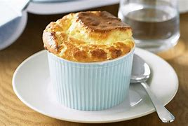
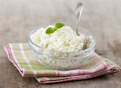

= Sex.And.The.City s01-01
:toc: left
:toclevels: 3
:sectnums:
:stylesheet: ../../../+ 美国高中历史教材 American History ： From Pre-Columbian to the New Millennium/myAdocCss.css

'''

Once upon a time +
an English journalist came to New York. +
Elizabeth was attractive and bright 快活而生气勃勃的;聪明的；悟性强的,有希望的；大有可能成功的, +
and *right away* 立刻,马上 she *hooked （使）钩住，挂住 up with* 与某人来往 one of the city's
typically eligible （婚姻）合适的，合意的 bachelors 单身汉. +
The question remains,  +
is this really a company we want to own? //问题是这家公司值得投资吗？ +

Tim was forty-two. +
A well-liked (a.)深受喜爱的；适销对路 and respected 受人尊敬的 investment banker 投资银行家, +
who made about two million a year. //年薪约两百万 +
They met [one evening] *in* typical New York *fashion* 以…方式,
at a gallery 展览馆；画廊 opening 开幕式. +

Like it? +
Yes, actually. I think it's quite interesting. +
What? +
I feel like I know you from somewhere. +
Oh, doubtful 拿不定主意；不确定；怀疑;未必；难说；不大可能. +
I only just moved here from London. +
London, really? +
That's my all-time (a.)空前的，创纪录的，一向的 favorite city. +
It is? +
Absolutely. +
It was love at first sight 一见钟情. +
You know... +
I think perhaps I have met you somewhere before. +

For two weeks they snuggled (v.)（使）依偎，紧贴，蜷伏, +
went to romantic restaurants 餐厅；[经]饭店... +
had wonderful sex... //有美妙的性爱  +
and shared the most intimate 亲密的；个人的，隐私的 secrets. +
One warm spring day he took her to a townhouse 连栋房屋 +
后定 he saw in Sunday's New York Times. +

How about if we start (v.) at the top /and work (v.)（逐渐地）移动（到某位置）；（逐步）变成（某状态） our way down? +
There are four bedrooms upstairs. +

[.my1]
.案例
====
.work
(v.) to move or pass to a particular place or state, usually gradually（逐渐地）移动（到某位置）；（逐步）变成（某状态） +
[ V] +
• It will take a while for the drug to work out of your system.这药得需要一段时间才能排出你的体外。

[ VN] +
( figurative) +
• He worked his way to the top of his profession.他一步一步努力，终于成为行业内的翘楚。

.work our way down
"work our way down" 的意思是从上往下逐步查看或参观。台词中的人物建议从顶层开始，然后逐步向下参观这栋房子的各个楼层。所以这句话的意思是：从楼上的四个卧室开始，逐渐往下走，参观整栋房子。
====

Do you have any children? +
Not yet. +

That day, Tim popped (v.)（让人意外地）突然出现；冷不防冒出 the question. +
How'd you like to have dinner with my folks 亲属；家属；（尤指）爹妈;各位；大伙儿 Tuesday night? +
I'd love to. //我很乐意 +

On Tuesday, he called with some bad news. //他打电话 通知她一些坏消息 +
My mother's not feeling very well. +
Oh, gosh （非正式，表惊讶）天哪；上帝, I'm sorry. +
Can we *take a rain check* 遇雨改期,改天吧? +
Of course. +
Tell your mom I hope she feels better. +

[.my1]
.案例
====
.take a rain check
字面意思是“拿一张雨票”。短语起源来自美国的棒球文化，如果比赛时因恶劣天气而不得不终止，官方将发给观众交换券(check)，凭借此券可以观看下一次的比赛。由此衍生出了 take a rain check，即: 改期, 改天吧.
====

When she hadn't heard from him for two weeks, she called. +
Tim, it's Elizabeth. +
That's an awfully 非常；极其 long _rain check_. +
He said he was *up to his ears* 深陷于；埋头于；忙于 and that he'd call the next day. +

[.my1]
.案例
====
.BE UP TO YOUR EARS IN STH
to have a lot of sth to deal with 深陷于；埋头于；忙于 +
•We're *up to our ears* in work. 我们工作忙得不可开交。

up to your neck/ears/eyeballs in something 是英语的一个idiom， 意思是 “忙得不可开交”、“忙得四脚朝天”,”忙得焦头烂额”. +
If *you are "up to your neck/ears/eyeballs" in something*, that means that you are very busy with it or to have more of something than you can manage. 这一词语中用得多的是 neck，也可以用 ears 或 eyeballs 代之。
====

He never did call, of course. Bastard 杂种；浑蛋；恶棍. +
She told me one day over coffee... +
I don't understand. +
In England, looking at houses together, would have meant something.

[.my2]
在英国两个人一起看房子 是有意味的(就表示他们要结婚了) +

Then I realized, no one had told her about _the end of love_ in Manhattan. +
Welcome to the age of un-innocence. 非纯真年代 +

[.my1]
.案例
====
.innocence
n.清白，无罪；天真无邪

在英国，“一起看房子”通常被视为一件很严肃的事情，意味着关系达到了一个稳定或长期的阶段，可能是在考虑共同生活甚至结婚的前奏。看房子一起决定要住在哪里，是一种承诺的象征。  +

而在这段台词中，美国纽约的背景下，提到“the end of love in Manhattan”（曼哈顿爱情的终结）以及“the age of un-innocence”（非天真的时代），暗示了在曼哈顿这样的地方，恋爱关系可能更加自由、松散和缺乏承诺。这里“看房子”不再具有英国文化中那种深刻的象征意义，可能只是关系中的一个普通活动，而不代表任何长期承诺。
====

No one has "breakfast at Tiffany's" +
and no one has "affairs to remember." +
Instead, we have breakfast at 7:00 a.m. +
and affairs we try to forget *as quickly as possible*. +
Self-protection and _closing the deal_ are paramount (a.)至为重要的，首要的.

[.my2]
自我保护,跟完成交易, 是最高原则 +

Cupid has flown the co-op. +

[.my2]
====
“Cupid has flown the co-op” 是一种比喻的表达方式，其中“Cupid”指的是希腊神话中的爱神丘比特，通常象征爱情和浪漫。 “co-op” 是“cooperative”的缩写，通常指"合作公寓"或"联合住宅"，但在这里它更多地象征了一个团体、社群或某种环境。

整句的意思是：“爱神丘比特已经飞离了这个地方。” 换句话说，这里指的是浪漫和爱情已经离开了，或者说在当前的环境中，浪漫已经不再存在。结合上下文，这句话表达的是在现代社会，特别是在像曼哈顿这样快节奏的环境中，浪漫已经不再重要，人们更加注重实际的事务和自我保护，而不是追求爱情和浪漫。
====

How the hell did we get into this mess （组织欠佳等导致的）麻烦，困境，混乱? +
There are thousands, +
maybe _tens of thousands of_ 数以万计的 women like this in the city. +
We all know them /and we all agree they're great. +
They travel, they pay (v.) taxes, +
they'll spend $400 on a pair of _Manolo Blahnik_ _strappy (a.)（鞋或衣服）有带子的 sandals_ 凉鞋；拖鞋；便鞋, +
and they're alone. +

[.my1]
.案例
====
.strappy sandals
image:../../img/strappy sandals.jpg[,10%]

====

It's like _the riddle 谜；谜语 of the Sphinx_ 狮身人面像. +
Why are there so many great 数量大的；众多的 unmarried women +
and no great unmarried men? +
I explore these sorts of issues in my column （报刊的）专栏，栏目 +
and I have terrific sources 很棒的来源, my friends. +

When you're _a young guy_ in your twenties, +
women are controlling the relationships. +
By the time you're _an eligible （婚姻）合适的，合意的 man_ in your thirties, +
you feel like you're being devoured (v.)（尤指因饥饿而）狼吞虎咽地吃光 by women. +
Suddenly the guys are holding all the chips （作赌注用的）筹码. +
I call it "the mid-thirties _power flip_ （使）快速翻转，迅速翻动." +
It's all about age and biology 生理. +
I mean, if you want to get married, +
it's to have kids, right?  //结婚就得生孩子 +
And you don't want to do it with someone older than 35 +
'cause 因为 then you have to have kids right away +
and that's about it. +

[.my2]
而且你不想跟一个35岁以上的人结婚，因为那样你得马上生孩子，就是这么一回事。

I think these women should forget about marriage... +
and have a good time. +

I have a friend +
who'd always gone out with extremely sexy 性感的，引起性欲的 guys +
and just had a good time. +
One day she woke up and she was forty-one. +
She couldn't get any more dates 约会. +
She had a complete physical breakdown 身体崩溃,体力衰竭 , +
couldn't *hold on to* 抓紧；不放开 her job, //连工作都保不住 +
and had to move back to Wisconsin +
to live with her mother. +

Trust me, +
this is not a story that makes men feel bad. +
Most men are threatened by successful women. +
If you want to get these guys, +
you have to _keep your mouth shut_ and _play by the rules_. +
I totally believe that _love conquers (v.)征服 all_. +

[.my2]
如果你想抓住这些男人, 就得闭嘴﹐乖乖地照规矩来

Sometimes you just have to give it a little space +
and that's exactly what's missing in Manhattan, +
the space for romance. +

[.my2]
曼哈顿所缺少的, 就是浪漫的情感空间

The problem is expectations 期望；预期；期望值, +
older women don't want *to settle for* 勉强接受；将就 what's available. +

[.my2]
问题出在期待, 老女人不接受垂手可得的东西

By the time you reach your mid-thirties, +
you think, why should I settle? +
You know? +
It's like /the older we get the more /we *keep* self-selecting 自我选择 *down to* a smaller and smaller group. +

[.my2]
就好像我们年纪越大，我们的自我选择范围(群体对象)就越小。

What women really want is Alec Baldwin. +
There's not one woman in New York +
who hasn't *turned down* 拒绝，顶回（提议、建议或提议人） ten wonderful guys +
because they were too short, or too fat, or too poor. +

[.my2]
在纽约每个女人 至少都拒绝过十个好男人,
只因为他们太矮﹑太胖或太穷

I have been out with some of those guys, +
the short, fat, poor ones. +
It makes absolutely no difference. +
They are just *as* self-centered 自我中心的；利己主义的 and unappreciative 不欣赏的;不赏识的 *as* the good-looking ones. +

[.my2]
我跟又矮又胖的穷男人约会过 他们都一样 +
他们跟帅哥一样自私

Why don't these women just marry a fat guy? +
Why don't they just marry
a big fat tub 盆；桶 of lard （烹调用的）猪油? +

( Happy birthday Dear Miranda ) +
 (Happy birthday to you)  +
Another thirty-something birthday 三十来岁的生日
with a group of unmarried female friends. +
We would all have preferred (v.)更喜爱，宁可 a nice celebratory (a.)庆祝的；庆贺的；快乐的 conference call. +

You were saying? +
Look... Look, if you're a successful saleswoman in this city, +
you have two choices. +
You can bang 猛敲；砸 your head against the wall +
and try and find a relationship, or you can say "screw it 管他呢," +
and just go out and have sex like a man. +
You mean with dildos 假阴茎? +
No. I mean without feeling. +

[.my1]
.案例
====
"bang your head against the wall" 是一种比喻表达，意思是“徒劳无功地努力”或者“做一些很困难、让自己挫败的事情”。在这里，它指的是在城市里试图找到一段稳定的关系，但这个过程让人感到非常困难和沮丧。

"screw it" 是一种口语表达，相当于中文中的“算了吧”或者“去他的”。它表达了放弃或不再在意某件事的态度。这里的意思是放弃寻找关系，转而选择更随意的生活方式。

"I mean without feeling" 的意思是“我的意思是没有感情”。在这个上下文中，这句话是在解释前面的说法，意思是像男人一样去发生性关系，但不带有任何情感投入或依恋，强调的是一种情感上的疏离和不在乎。
====

Samantha Jones was a New York inspiration 启发灵感的人（或事物）；使人产生动机的人（或事物）;灵感. +
A public relations 公共关系 executive 行政领导，领导层, +
she routinely 例行公事地，常规地 slept with good-looking guys in their twenties. +
Mmm! 嗯 Remember that guy 后定 that I was going out with? +
Oh, God, what was his name? Drew? +
Drew. -Drew the sex god. +
Right, well, afterwards 过后，后来, I didn't feel a thing. +
It was like, "Hey, babe, gotta go 得走了, catch you later 稍后再见." +
And I completely forgot about him after that. +
But are you sure that /that isn't just 'cause he didn't call you? +

Sweetheart, this is the first time in the history of Manhattan +
that women have had *as much* money and power *as* men, +
plus _the equal 同等的 luxury_ 不常有的乐趣（或享受、优势） of _treating (v.) men like sex objects_ 性对象; 发泄性欲的对象. +

[.my2]
甜心﹐这是曼哈顿史上第一次 +
女人的权力跟男人一样大 +
她们也有同等地享受, 能把男人当性玩物

Yeah, except 除了，只是 men in this city `谓` fail (v.) on both counts 数目; 数量. +
I mean, they don't want to be in a relationship with you, +
but *as soon as* 一…就… you only want them for sex, they don't like it. +
_All of a sudden_ 突然地，出乎意料地 they can't perform the way 后定 they're supposed to 被期望;应该. +
That's when you dump (v.)（尤指在不合适的地方）丢弃，扔掉，倾倒 them. //当你抛弃他们的时候 +

[.my1]
.案例
====
"except men in this city fail on both counts" 的意思是“只是，这个城市的男人在这两个方面都不及格。” +
"both counts" 是指两个方面：(1) 男人不想和女人建立关系；(2) 男人在女人只想要性关系时, 表现得不如预期。
====

Oh, come on, ladies, are we really that cynical 认为人皆自私的；愤世嫉俗的;悲观的；怀疑的? +
What about romance? +
-Yeah! -Who needs it? +
It's like that guy, Jeremiah, the poet. +
I mean the sex was incredible 不可思议的，难以置信的, +
but then he wanted to read me his poetry +
and go out to dinner 正餐，晚餐 and the whole chat bit 小部分，片段, +
and I'm like, let's not even go there. +

[.my1]
.案例
====
.the whole chat bit
"the whole chat bit" 指的是“全部的谈话环节”或者“聊天的部分”。这里的“bit”是一种非正式的表达方式，指的是某个特定的部分或环节。“the whole chat bit”指的是那种伴随着浪漫关系的聊天、交谈和社交互动。

.let's not even go there
"let's not even go there" 是一种表达，意思是“我们根本不要去碰那个话题”或者“我们最好不要涉及那个”。

综上所述，这句话的意思是：“他想要给我读诗，和我一起去吃晚餐，还有所有那些谈话的环节，而我当时的想法是，别跟我谈这些。” 表达出对浪漫和深入交流的排斥，更倾向于保持关系在纯粹的性层面。

.I'm like...
"I'm like" 是一种非正式的口语表达，用来引述或模仿自己当时的想法或反应。它类似于 “I said” 或 “I thought”，但更随意，更常用于年轻人或非正式的对话中。 +

====

What are you saying? Are you saying you're just gonna
*give up on* 对…不再抱希望（或不再相信） love? +
-That's sick （身体或精神）生病的，有病的;变态的；病态的! Oh, no. No, no. +
Believe me, the right guy *comes along* 出现 +
and you two right here, this whole thing, shew, right out the window.  +
-That's right! +
[.my1]
.案例
====
这里的 "shew" 是 "shoo" 的一种非正式拼写形式，模仿挥手赶走什么东西时发出的声音。它通常用来表达某物或某事迅速消失或被轻易抛开。 +

在这段对话中，"shew, right out the window" 的意思是“（这些想法）一下子就会被抛到窗外”，意思是当那个“合适的人”出现时，当前的这些关于放弃爱情的想法将迅速消失。
====

Listen, the right guy is an illusion. +
You understand that, you can start living your life. +
So you think it's really possible +
*to pull off* 做成，完成（困难的事情） this whole, um... +
women having sex like men thing? +

You're forgetting _The Last Seduction_ 诱奸;诱惑力；魅力；吸引力. +
You're obsessed (a.)（对……）着迷的，（受……）困扰的 with that movie. +

[.my2]
听着，“那个合适的人”只是个幻想。 明白了这一点，你就可以开始真正地生活了。 所以你认为真的可以实现这种，嗯…… 女人像男人一样对待性爱的情况？ 你忘了《最后的诱惑》了吗？ 你对那部电影太着迷了。

Oh, okay! Linda Fiorentino *fucking* that guy *up* against the _chain 链条 link fence_. +
And never having one of those, +
"Oh, my God, what have I done?" epiphanies 顿悟；神灵显现. +
I hated that movie. +
Was it true? +
Were women in New York really *giving up on* love +
and *throttling (v.)使窒息；掐死；勒死 up* 调节油门,加速 on power? +
What a tempting thought. +

[.my2]
琳达佛伦提诺 靠着铁栏杆跟男人乱搞 +
她从没想过 “天啊﹐我做了什么？”

[.my1]
.案例
====
.chain link fence
image:../../img/chain link fence.jpg[,20%]

.throttle (sth) ˈback/ˈdown/ˈup
to control the supply of fuel or power to an engine in order to reduce/increase the speed of a vehicle 调节油门；减╱加速
====

You know, I'm beginning to think +
the only place where one can still find love and romance in New York +
is the gay community 男同性恋圈. +
It's _straight (a.)异性恋的 love_ that's become closeted (a.)保密的，地下的；私下密谈的. +

Stanford Blatch was one of my closest friends. +
He was the owner of a _talent 人才 agency_ 经纪公司 +
who _at the moment_ was down to a single client. //他现在只剩一个客户了。 +
So are you telling me that you're in love? +
How could I possibly sustain a relationship?   +
[.my2]
我怎么可能维持一段感情呢? +

You know Derek *takes up* 占用（时间、空间等）, like, 1000% of my time. +
[.my2]
你知道德里克占用了我1000%的时间。 +

Don't you think that's a bit obsessive 着迷的；迷恋的；难以释怀的? +
Carrie, I'm a passionate (a.)热诚的；狂热的;拥有（或表现出）强烈性爱的；情意绵绵的；怒不可遏的 person. +
His career 职业，事业；职业生涯 is all I care about. +
When that's under control, +
then I can concentrate on my personal life. +

Stanford, +
he's an underwear model 内衣模特. +
With a billboard 广告牌；布告板 in Times Square 时代广场. +

Oh, my God, don't turn around 转向反方向. +
The loathe (v.)极不喜欢；厌恶 of your life is at the bar. +
[.my2]
天啊﹐别转头 你最讨厌的人就在吧台那边

It was Kurt Harrington. +
A mistake I made when I was twenty-six, +
and twenty-nine... +
and thirty-one. +
Carrie, don't even go there. +
What, do you think, I'm a masochist 受虐狂者；被虐待狂；性受虐狂者? +
The man is scum （骂人的话）渣滓，败类;浮沫；浮垢；浮渣. +
Good, because I don't have the patience +
to clean up this mess for the fourth time. +
[.my2]
我可没耐心第四次来收拾这烂摊子。

Will you relax? +
I don't have _a shred 极少量；些许；一丁点 of_ feeling left. +

[.my2]
我对他一点感觉都没了

[.my1]
.案例
====
.shred
(n.)[ usually pl.]a small thin piece that has been torn or cut from sth （撕或切的）细条，碎片
SYN scrap +
- shreds of paper碎纸片

[ usually sing.] *~ of sth* :  +
( used especially in negative sentences尤用于否定句 ) a very small amount of sth极少量；些许；一丁点 +
- There is not _a shred of evidence_ to support his claim. 没有丝毫证据支持他的说法。
====

Thank God. +
Now, if you'll excuse me 如果你不介意的话, I have to visit the ladies' room 女洗手间. +
Carrie! +
It was true, +
I no longer felt a thing for Kurt.  +

[.my2]
我对科特已经没有感觉了。

After all these years, +
I finally saw him for what he was, +
a self-centered 自我中心的；利己主义的 withholding 克制；阻挡 creep 讨厌鬼, +
who was still the best sex I ever had in my life. +

[.my2]
我终于看清了他的本来面目，一个以自我为中心的压抑的变态，他仍然是我一生中最棒的性爱对象。

However, +
I did have a little experiment 实验，试验 in mind. +
[.my2]
我心里头的确想做个小实验

Kurt... +
Wow, what are you doing here? +
Hey, babe. +
God, you look gorgeous 非常漂亮的；美丽动人的；令人愉快的. +
Thanks. +
So, how's life? +
Not bad, can't complain 没啥好抱怨的. +
You? +
Oh, you know, just writing the column, the usual 向往常一样 . +
So, you seeing anyone special? +
Not really 算不上,不完全是... You? +
Oh, just a couple guys... +
But you look good though. +
So do you. //你也是如此 +
So, uh... +
What are you doing later? +
[.my2]
你待会儿要做什么? /待会儿你有事吗？

I thought you weren't talking to me for the rest of your life. +
Who said anything about talking? //谁说要说话了?  +
*What do you say* to my place, three o'clock. +
Alright. +

[.my1]
.案例
====
.What do you say
“What do you say？”不只用在打招呼，也常用作征询意见，意思是「你觉得怎么样？你看行吗？你怎么说？」。 +
有时候会用“What say you?”，意思和“What do you say?”一样。 +
- Let's go to the movies tonight, what say you? 我们今晚去看电影，你觉得如何？

====

See you there. +
Are you _out of your mind_? 精神失常或疯狂 +
What the hell do you think you're doing? +
Oh, calm down, it's research. //这是个实验 +
Oh, God! +
Oh, Kurt! +
Kurt was just like I remembered... //柯特仍如我记忆中一样 +
-Better. -Yes. Oh... +
Because this time +
-there would be none of that messy (a.)混乱的；难以处理的；令人厌烦的 _emotional attachment_ 情感依恋. -Yes. yes. Oh! +

[.my2]
就不会有那种混乱的情感依恋了。

Alrighty. // <非正式>好的，好了 +
My turn.  //轮到我了 +
Oh, sorry. +
I have to go back to work. +
What are you kidding? You serious? //你开什么玩笑? 你认真的吗? +
Oh, yeah, completely. +
But I'll give you a call? Maybe we can do it again some time? +
But... +
As I began to get dressed 穿衣服, +
I realized that I'd done it... +
I'd just had sex like a man.  //我跟男人一样只要性 +
I left feeling (v.) powerful, potent (a.)有强效的；有力的；烈性的；影响身心的, and incredibly alive (a.)情绪饱满；激动兴奋；有生气；有活力. +

[.my2]
离开的时候，我觉得自己充满了力量跟潜能 而且活力充沛.

I felt like I owned the city. +
Nothing and no one could *get in my way* 挡道，妨碍. +

-Number one... -Here you go 干得好；就是这样. +
... he's very handsome. +
he's not wearing a wedding ring. +
he knows I carry _a personal supply_ +
of _ultra textured (a.)起纹理的；质地不平的 Trojans_ with _the reservoir (n.)（大量的）储备，储藏;水库；蓄水池 tip_ 尖端；尖儿；端;（装在顶端的）小部件. +

[.my2]
他知道我带着个人用品 , 超薄型的保险套

Thanks a lot. +
Any time. //不客气 +
Later that night, //那晚稍后 +
Skipper Johnston met me for coffee +
and confessed (v.)坦白；承认 a shocking intimate (a.)个人隐私的（常指性方面的） secret. +

Thank you. +
Do you know that it has been, like, a year? +
Really? +
I don't understand that, you're such a nice guy. +
That's the problem. +
You know, I'm too nice, you know? +
I'm a romantic (n.)浪漫的人；耽于幻想的人. +
I just have so much feeling. +
Are you sure you're not gay 同性恋者（尤指男性）? +
No! +
I'm sensitive 敏感的;体贴的；体恤的；善解人意的 +
and I don't objectify (v.)将…物化；对…进行人格物化 women. +
You know, most guys, when they meet a girl, +
the first thing that they see is, um... +
You know... +
-Pussy 屄；女阴;（儿童用语）猫咪? -Oh, God! +
Oh, I hate that word. +

Don't you have any friends that you can *hook me up with* 与某人来往? +
[.my2]
你没有朋友可以介绍给我吗？

No, they're too old for you. +
I like older women. +
Maybe. +
Maybe my friend Miranda. +
When? +
Tomorrow night. +
We're all *going downtown 市中心的，商业区的 to* this club, Chaos 混乱，无秩序状态；混沌. +
[.my2]
我们都要去市中心的俱乐部--混沌俱乐部。

Great. +
Don't tell her I'm nice. +
Mmm. +

Miranda was gonna 即将，将要（即 going to） hate Skipper. +
She'd think he was mocking (v.)嘲笑；（模仿）嘲弄 her with his sweet nature +
and decide he was an asshole. +
[.my2]
她会认为他是在嘲笑她的温和性格，并认为他是一个混蛋。

The way she had decided all men were assholes. +
[.my2]
就像她认为男人全是混蛋一样

Hello? +
Hey, Carrie, it's Charlotte. +
-Hey, sweetie （用作称呼语）亲爱的. -Hey, look, +
I can't meet you guys for dinner tomorrow night +
because I have an amazing date. +
With who? +
Capote Duncan, +
he's supposedly (ad.)据说，据传 some _big shot_ 重要人物 in the publishing world. +
-Do you know him? -Did I know him? +
He was one of the city's most notoriously (ad.)众所周知地，声名狼藉地 +
un-gettable 难以获得的，难以理解的 bachelors 单身汉. +
[.my2]
他是城里 最难钓到的单身汉之一

Wait, wait. +
Don't even answer that question +
because frankly （表示直言）老实说, +
I don't care, and another thing, +
I'm not buying 相信（尤指不大可能的事） into any of that _women having sex like men_ crap (n.)废话；胡说；胡扯. +
[.my2]
我才不信什么女人像男人一样做爱的鬼话。

I didn't want to tell her about _my afternoon of cheap and easy sex_ and how good it felt. +
[.my2]
我不想告诉她我下午的廉价和轻松的性爱感觉有多好。

Alright, fine. +
Listen, have a good time, and promise to tell me everything. +
Well, if you're lucky. +
-Bye. -Alright, bye. +

_Friday night_ at Chaos. +
It was just like that bar in Cheers +
where everybody knows your name, +
except here, they were likely to forget it five minutes later. +
[.my2]
酒吧里的每个人都在干杯, 装出一副很熟的样子 +
但五分钟后他们会忘了你是谁

Hi. +
Still, it was the _creme de la creme_ 精英；精华；精髓 of New York, +
whipped 鞭打；鞭策;（突然迅速地）除去，拉动，抽出 into a frenzy (n.)疯狂，狂乱；一阵狂热. +

[.my1]
.案例
====
.crème de la crème
( formal ) ( humorous) the best people or things of their kind精英；精华；精髓 +
•This school takes only the crème de la crème.这所学校只招收高材生。
====

Sometimes you got a soufflé 蛋奶酥, +
sometimes _cottage cheese_ 农家干酪（含小块的白色软干酪）. +

[.my1]
.案例
====
.soufflé
[ CU] a dish made from egg whites, milk and flour mixed together to make it light, flavoured with cheese, fruit, etc. and baked until it rises 蛋奶酥

.cottage cheese
[ U]soft white cheese with small lumps in it 农家干酪（含小块的白色软干酪）

====

It is like _a model bomb_ exploded (v.) in this room tonight. +
Is there a woman here *aside from me* +
that weighs (v.) more than a hundred pounds? +
[.my2]
除了我，这里还有谁体重超过一百磅的吗?

I know, it's like under-eaters anonymous. 厌食者匿名交流团体 +
That's funny, Skippy. +
Skipper. +
I have this theory that men secretly hate pretty girls +
because they feel that /they're the ones who rejected 拒绝，驳回 them in high school. +
Right, but if you're not part of the beauty Olympics 选美奥运会, +
you can still become a very, you know... interesting person. +
Are you saying that I'm not pretty enough? +
No, no, no, of course you are. +
So, *ipso facto* 根据该事实；根据事实本身, I can't be interesting? +
Women either *fall into* one of two categories 类别，范畴, +
beautiful and boring, or homely (a.)相貌平平的;简单且好的；家常的 and interesting? +
Is that what you're saying, Skippy? +
No, no, no, no, that's not what I meant. +

Excuse me, is this your hand on my knee? +
No. +
Alright, let's keep 'em where I can see 'em, alright? +
[.my2]
把你的手放在我看得见的地方

Well, I guess you must find me beautiful... +
or interesting. +
I was about *to rescue* Skipper +
*from* an increasingly hopeless situation when suddenly 突然之间... +
-Hey! -Hey! +
Lucky me 幸运的我, twice in one week. +
Well, I don't know if you're going to be getting that lucky. +
You know, I was really *pissed off* 使生气；使厌烦 the way 后定 you left the other day. +
[.my2]
我很气你那样子离开

-You were? -Yeah. +
And I thought, "How great!" +
You finally understand the kind of relationship I really want, +
and now we can have sex without commitment. +
[.my2]
你终于明白我真正想要的那种关系了，现在我们可以不用承诺就做爱了。

Yeah, right. +
Sure, I guess. +
So, whenever I feel like it, I'll give you a call. +
[.my2]
只要我想，我就会给你打电话。

Yeah, please. I mean, whenever you feel like it. +
If I'm alone, I'm all yours. +
Alright. +
I like this new you. +
Call me. +
Yup 是的（等于 yes）. +
I didn't understand, +
did all men secretly want their women _promiscuous_ (a.)淫乱的；滥交的;大杂烩的；杂乱的 and _emotionally detached_ (a.)单独的；独立的；不连接的;不带感情的；超然的；冷漠的? +
And if I was really having sex like a man, +
why didn't I feel more in control? +

You see that guy? +
He's the next Donald Trump, +
except he's younger and much better looking. +

Hi. +
Do you know him? +
No, I've never seen him in my life. +
He usually dates (v.)约会 models, but hey, +
I'm as good-looking as a model, +
plus I own my own business. +
Samantha had the kind of deluded 轻信的；受蒙骗的 self-confidence +
that caused men like _Ross Perot_ to run for 参选，寻求  president. +

[.my2]
萨曼莎有一种自欺欺人的自信，这种自信促使罗斯·佩罗(Ross Perot)等人竞选总统。

And it usually got her what she wanted. +
Well, if you're not gonna *hit on* 开始与某人调情 him , I will. +
And there she went, off *to take her best shot with* Mr. Big. +
[.my1]
.案例
====
take a shot这个短语的意思是“ 尝试”， +
而take one's best shot这个俗语的意思则是“尽全力试试”， 此外它也有“请人拿出最出色表现来秀一秀”的意思。 +
take your bestshot就是“好好表现吧”
====

Meanwhile, Charlotte York was passing 消磨；度过；打发 the most splendid 极佳的，非常好的;豪华的；华丽的 evening with Capote Duncan. +
Want to go back to my place and see the Ross Bleckner? +
I'd love to, but it's really getting late 时间已晚. +
No problem. +
Uh... +
What year was it painted again? +
'89. +

Though Charlotte was determined *to play hard to get* 故作姿态；故意摆谱；佯装拿架子, +
she didn't want to end (v.) the evening too abruptly  突然地；唐突地；陡然. +

[.my1]
.案例
====
.play hard to ˈget
( informal ) to make yourself seem more attractive or interesting by not immediately accepting an invitation to do sth故作姿态；故意摆谱；佯装拿架子
====

Well... +
Maybe just for a minute. +
This could easily go for a hundred grand (<非正式>一千美元) 十万块. +
Ross is so hot right now. +

[.my2]
或许我可以去看一下 +
这随便都能卖到十万块

It's beautiful. +
No, you're beautiful. +
Thank you... +
-for tonight. -Yeah? +
I had a wonderful time. +
-Well, it was my pleasure. -Mmm. +
I have to get up 起床 really early tomorrow. +
I'll get you a cab. //我给你叫辆出租车。 +
Charlotte told me later +
that she thought /she had played the entire evening flawlessly (ad.)完美无瑕地. +

So, what are you doing next Saturday? +
I'm having dinner with you. +
Hey... +
Hey, you're going to the West Side, right? +
Right, uh, _West 4th and Bank_ please. +
*Scoot (v.)疾行；匆匆离去 over* 往旁边挪一点,把（人或物）移到一边以让地儿, will you? +

[.my2]
坐过去一点

Two stops. +
4th and Bank, and, uh... +
West Broadway and Broome. +
You're going to Chaos? +
Oh, yeah. +
Why? +
Look, I understand _where you're coming from_, 我理解你的想法 +
and I totally respect it... +
but, uh, I really need to have sex 做爱 tonight. +

[.my1]
.案例
====
I know where you're coming from，字面上的意思是“我知道你从哪里来”，表示“我知道你的根源”，既然如此，就能了解对方在说些什么，所以引申为“我了解你为什么这样说”“我懂你的感觉”。
====

Back at Chaos, +
things were swinging into _high gear_ 高速挡,高速运转 +
and Samantha *was putting the moves on* 向(某人)提出想法(尤指性要求);试图引诱某人 Mr. Big. +

[.my1]
.案例
====
.put the moves on (one)
To make sexual advances on or propositions to someone; to try to have sex with someone. 向某人进行性挑逗或提出性建议;试着和某人做爱。 +
- I think that woman *is putting the moves on* your husband!

====

I've been smoking cigars for years, +
back when they were terminally （疾病）致命地，不治地，晚期地 uncool. +
[.my2]
那时抽雪茄还不是那么流行

I've got this _great source_ that sends me Hondurans. +
Do you want to try one? +
[.my2]
我可以拿到“洪都拉斯人” 要来一根吗？

-No, thank you. -Why? You can't find them anywhere. +
Cohibas... That's all I smoke. +
[.my2]
我只抽“柯西巴斯”

Look... I do the P.R. 公共关系,公关  for this club... +
and I have a key to the private room downstairs. +
[.my2]
我有楼下包厢的钥匙

Really? +
You want a private tour? 私人游 +
No thanks, but maybe another time. +
Meanwhile, Skipper Johnston was hopelessly *smitten (a.)突然爱上的；一下子爱上的 with* Miranda Hobbes. +

[.my2]
与此同时，约翰斯顿无可救药地迷上了米兰达·霍布斯。

[.my1]
.案例
====
.smitten
(v.) *~ (with/by sb/sth)* : ( especially humorous) suddenly feeling that you are in love with sb 突然爱上的；一下子爱上的 +
•From the moment they met, he was completely smitten by her. 从一见面的那一刻起，他就完全被她迷住了。

2.*~ with/by sth* : severely affected by a feeling, disease, etc. 痛感；备受…的煎熬
====

So where we going now? +
Listen, Skippy, you know, +
you really are a nice, sweet guy, but... +
Oh, I understand. +
Goodnight. +
Miranda told me later that she thought he was too nice, +
but that she was willing to overlook one flaw. +
And Capote Duncan found his fix （尤指简单、暂时的）解决方法 for the night. +

[.my2]
但她愿意忽视他这个缺点 +
卡波迪杜肯找到做爱的对象

-After you. No. +
Where is it? I want to see the Ross Bleckner. +
Later. +
Oh, listen, I, uh... +
I gotta get up really early, +
so you can't *stay over* 过夜. +
Cool? +
Sure, I have to get up really early too. +
Taxi! Taxi! +
And so another Friday night in Manhattan `谓` crept towards dawn. +
[.my2]
就这样，曼哈顿又一个周五的夜晚悄悄接近黎明。

Taxi! +
And just when I thought /I would have to do the unspeakable, +
walk (v.) home... +

[.my2]
就在我以为我要做那件难以启齿的事--"只能走路回家" 的时候……

Well, get in _for Christ's sakes_. //看在上帝的份上，上车吧。 +
Where can I drop you? +
72nd Street, Third Avenue. +

You got that, Al? +
Yes, sir. +
So, what have you been doing lately  近来，最近? +
You mean besides going out every night? +
Yeah, I mean what do you do for work?  //你的工作是什么? 你的工作是什么? +
Well, this is my work. +
I'm sort of a sexual 性的，性行为的 anthropologist 人类学家. +
You mean, like a hooker 妓女? +
No. +
I, um, I write a column called Sex and the City. +
Right now /I'm researching an article +
about women who have sex like men. +
You know, they have sex 性交 and then afterwards they feel nothing. +
But you're not like that. +
Well, aren't you? +
Not a drop. //一滴都没, 完全不是 +
Not even half a drop. //连半滴都没有。 +

[.my1]
.案例
====
“drop” 是指情感或感觉的一点点。台词的意思是，有些人发生性关系后会感到空虚或没有任何情感，但对方不是这样，甚至连一点点（drop）情感都没有缺失。这个表达方式强调了对方在情感上的充实和完整。
====

Wow, what's wrong with you? +
I get it.  我懂了 +
You've never been in love. +
Oh, yeah? +
Yeah. +
Suddenly I felt the wind knocked out of me. +
I wanted to crawl (v.)爬行，匍匐前进 under the covers and go right to sleep. +

[.my2]
突然间我觉得一阵晕眩 +
我想爬进被窝里立刻进入梦乡

-Thanks for the ride 谢谢你让我搭便车. Any time. 随时;别客气 +
Wait. +
Have you ever been in love? +
_Abso_-fucking-_lutely_. +

[.my1]
.案例
====
在美剧中，可能会听到把 abso- 和 -lutely 拆开，中间加上 freakin 或者 f 开头的“那个词”，Jenny 提到在《欲望都市》里就有经常用到。好朋友开玩笑当然没问题，但正式场合还是要避免使用哦。直接用上 absolutely ，你的英语听起来很地道啦!
====

'''

