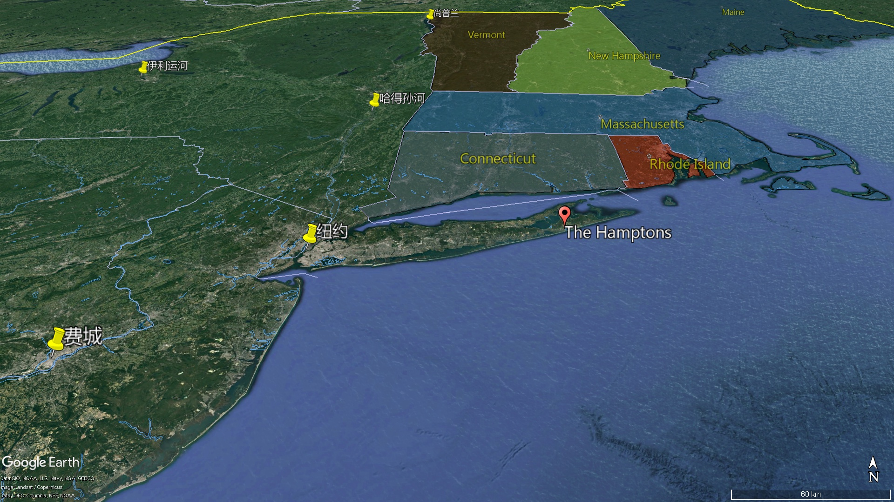
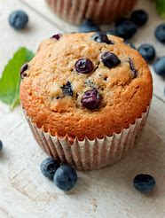
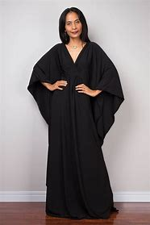
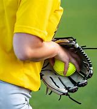

= Sex.And.The.City s01-03
:toc: left
:toclevels: 3
:sectnums:
:stylesheet: ../../../+ 美国高中历史教材 American History ： From Pre-Columbian to the New Millennium/myAdocCss.css

'''

“已婚者的光环” +
住在纽约这种城市 大家最喜欢做的事情之一… +
就是逃离它 +
我的朋友佩萱丝和她先生 +
邀请我到汉普顿度周末 +
佩萱丝和彼得是完美的一对 +
他们风趣﹑聪明﹐而且像 杰克鲁服饰目录上的模特儿 +
若他们不是住在海边的别墅 我一定会讨厌他们 +
他进了计程车 然后靠过来坐在我身边 +
然后呢？ +
我们打得火热 +
从汉普顿和西百老汇街口 一直到七十二街和麦迪逊大道 +
来汉普顿做客的人 晚餐前得和主人闲话家常 +
股票经济人提供理财方案 建筑师则给与设计的意见 +
单身朋友则将艳遇之类的事 告诉已婚友人 +
次日早晨我醒来时 觉得神清气爽 +
等不及到户外欣赏美丽风景 +
早安 +
佩萱丝去买果汁和松饼 +
马上就回来 +
他下半身一丝不挂站在那里 +
太好了 +
他就那样神情自若地站着 +
我不知所措 +
只觉得他异常兴奋 +
-早安 -早 +
我买了新鲜果汁和可口的松饼 +
你怎么了？ +
我在走廊上碰到彼得 他没穿内裤 +
你真有眼光 +
天气很好 +
甜心﹐凯莉真的在走廊 看到你的小弟弟吗？ +
当时我正要去厕所 +
-正要去厕所 -太好了﹐有好吃的松饼 +
我们今天有何安排？ +
最后我只带了一个松饼 就匆匆启程回纽约 +
他到底居心何在？ 他想勾引你吗？ +
不知道﹐感觉不像这么回事 +
可能他只是想献宝 猴子也会这样 +
-他的尺寸如何？ -来点新鲜的胡椒吗？ +
好﹐谢谢 +
够了 +
-你要来点新鲜的胡椒吗？ -宝贝﹐我求之不得 +
其实我想 这桌每个人都要加很多胡椒 +
谢谢 +
她说我还是单身 所以无法了解她的心情 +
怎么说？ +
单身女郎处心积虑 一窥朋友“丈夫”的小弟弟吗 +
-她和你的关系很好吗？ -这有什么差别？ +
结了婚﹐失去身价后 我们就成了她们的敌人 +
米兰达是律师事务所里 唯一的单身贵族 +
她仔细思考过这个问题 +
已婚女子都知道 我们可能和任何人发生关系 +
是这样吗？ +
所以怕我们和她们丈夫有染 +
-我绝不接受已婚的男人 -你确定吗？ +
结婚戒指还是能拿下来 她们认为未婚者全都不可靠 +
已婚女性并非全都这么想 +
夏绿蒂将婚姻视为妇女联谊会 且迫不及待想加入 +
你说得没错 但那些不担心的人会可怜你 +
才没有这种事 +
你真的没见过那种 “单身真可怜”表情吗？ +
-我很讨厌那种表情 -坦白说﹐我见过 +
若在派对中你是唯一单身的人 他们的表情就像在说均KA +
-没人要？ -异类 +
-荡妇 -完全正确 +
已婚者真是我们的大敌 +
米兰达说对了吗？ 已婚与未婚者真的势不两立？ +
两者之间正上演一场 秘密的冷战吗？ +
我很喜欢单身的女性朋友 +
但因为我结婚了 无法像从前时常见面 +
我觉得非常痛苦 她们让我想起从前绝望的日子 +
女性婚后会忘记自我 由“我”变成“我们” +
“我们喜欢这部电影 我们讨厌那间餐厅” +
我们… +
本来我和拍档什么事都一起做 +
结果他却娶了一个 和我合不来的女孩 +
现在我只有在 超级杯比赛时才见得到他 +
这件事取决于 自己想过何种生活 +
有些人像我一样﹐选择长大 面对现实乖乖结婚 +
至于其他人…怎么说？ +
像长不大的孩子般 过着空虚﹑恼人的生活 +
这不是一场冷战 而是激烈的大战 +
而且参战者不只是一般人 +
我认识的同性恋者 都跑到夏威夷 +
穿长袖花衬衫﹐宣誓结婚 心中想着我比不上他们 +
-穿长袖花衬衫 -没错﹐还戴兰花做的花环 +
“欢迎” +
我怀念过去 大家都还是单身的时光 +
我开始觉得自己像是被放逐… +
凯莉？ +
天啊﹐乔﹐是均KA +
好多年没见了 我一直没遇到你﹐自从… +
-还不是同性恋时？ -我是说“西贡小姐”演出后 +
-我还在表演 -我很喜欢这部音乐剧 +
这位是我的朋友﹐史丹佛 +
-这是我的亲蜜爱人﹐卢 -看﹐是结婚戒指﹐恭喜你们 +
-在哪里公证的？ -巴尼百货 +
我只是在开玩笑 +
你呢？结婚了吗？ +
也不算是…我的意思是还没有 +
-我们想的是同一件事吗？ -好极了 +
-什么事？ -我们想要一个孩子 +
我们已经找到人代产了 但还需要一颗健康的蛋 +
你愿意捐赠吗？ +
这是我们的名片 考虑一下再联络我们 +
-若你愿意﹐我们会付钱 -真高兴见到你 +
我刚遭受千禧年的第一个打击 +
朋友已经不把我当人看了 我成了蛋繁殖场 +
此时﹐在市中心 另一名单身女子也将遭到羞辱 +
米兰达被迫参加 公司的年度垒球比赛 +
律师事务所办的垒球比赛 和一般比赛没什么两样 +
但若律师盗垒成功 便能获得升迁 +
-米兰达﹐我还以为你不会来 -好了﹐走吧 +
由于担心被公司同事视为异类 +
米兰达和刻意安排的对象约会 +
米兰达﹐见过席德 席德﹐这位是米兰达 +
你们简直是天生一对 +
我要先走一步 +
-幸会 -幸会 +
我要去买杯汽水﹐你要喝吗？ +
我现在就去买 +
杰夫 +
还不错﹐对吗？ 我很会看人不是吗？ +
-没错﹐但我不是同性恋 -真的吗？ +
我已经八个月 没见过你交男朋友了 +
那只是巧合﹐杰夫 我是单身女郎 +
天啊 单身怎么会被视为同性恋？ +
难不成你要我过去… +
算了﹐我自己解决 +
勇敢的米兰达大步走过去 告诉席德她不是同性恋 +
她们相觑大笑并决定一起打球 +
米兰达和席德最后一局 演出双杀成为场中的焦点 +
-连公司的资深股东都… -真精彩﹐女士们 +
-全靠团队合作﹐查尔斯 -叫我契普 +
契普 +
我们夫妻十二号要办一个派对 +
只邀请了几对夫妻 是个普通的派对 +
-希望你们也能来 -乐意之至 +
那天晚上 米兰达对我大吐苦水 +
你想这是因为 他们以为你们是一对吗？ +
两年来我们鲜少交谈 他却突然要我叫他“契普” +
一个名叫契普的律师 令人不由得喜欢他 +
他们好不容易了解我以后 好像松了一口气 +
-你真会赴宴吗？ -没错 +
在公司里我需要战友 就算得当同性恋也再所不惜 +
米兰达离去后﹐我想了一想 +
或许冷战的起因不是恨 而是恐惧 +
对于未知的恐惧 +
已婚者并不恨单身贵族 只是想“弄清楚”我们的想法 +
该是停止猜忌 渗透敌方阵营的时侯了 +
于是我和我最喜爱的夫妻档 大卫和莉莎共进午餐 +
与其说婚姻生活 我比较倾向说共同生活 +
我们结婚了吗？ +
记得当时你披上白纱 我们还收到很多餐具吗？ +
记得 或许我不该再和其他男人约会 +
-你呢？喜欢单身生活吗？ -我觉得还不错 +
有时侯则不然 +
像家庭聚会时得和小孩坐一桌 +
或看你们用同一支叉子 吃东西﹐我… +
-那真是太甜蜜了 -别哭出来 +
他很多愁善感 +
你将来打算结婚﹐对吗？ +
不知道 我觉得自己可能不适合结婚 +
-真的吗？ -话才刚说完… +
我自己已经开始怀疑了 +
-你们好 -你好﹐西恩 +
-好一个惊喜﹐见过凯莉 -幸会 +
我们正要吃甜点 要不要一起享用？ +
好﹐我真是太意外了 +
另一个让我讨厌单身的场合… +
就是已婚的朋友 “意外”帮你介绍对象 +
喝了两杯浓咖啡 吃了一个提拉米苏后 +
我得知西恩是三兄弟中最小的 +
他有自己的投资公司 +
而且即将迁入新购置的公寓 +
你知道这全是安排好的 对吗？ +
其实你进门前我就闻出来了 +
我父母是相亲结婚的 下个月是他们结婚41周年纪念 +
真是美满 +
这时我才了解﹐他很期待结婚 +
结婚是这个魅力十足 曼哈顿男子的最终目标 +
-我可以再约你出来吗？ -当然可以 +
接下来一周半的时间… 我和西恩一起看了场电影… +
又看了另一部电影 +
我在威廉斯索诺玛 帮他挑了一个高级起司磨碎器 +
十二号我要办乔迁派对 请你参加﹐带朋友一起来 +
听起来好像很有意思 +
谢谢你陪我共度美好时光 +
他就像DKNY服饰活生生的翻版 +
虽然明知和自己的风格不合 但顺便试穿也无妨 +
十二号当天晚上… +
一对假的女同性恋到纽约东区 出席一名共和党员的晚宴 +
你们来了 +
西区则有三个单身女郎 参加一个单身汉的乔迁派对 +
-他的朋友帅吗？ -不知道﹐我从没见过他们 +
你是怎么在一周内 交上新男朋友？ +
他不是我的男朋友 我只是在试试而已 +
准备好了吗？ +
所有宾客都成双成对 +
这里简直像有房租限制的 诺亚方舟 +
他们全是夫妻档 +
莎曼珊瞪了我一眼 好像我将她出卖给敌人 +
只是为了巧克力棒和尼龙袜 +
这是给你的﹐恭喜 +
-你想必就是夏绿蒂 -幸会 +
-你一定是莎曼珊 -没错﹐请问吧台在哪里？ +
在厨房﹐你一定找得到 就是有瓦斯炉的那一间 +
-这里真漂亮 -我花了很多年规划 +
我带你参观 +
我们从已婚夫妻旁走过时 我发现一件事… +
她们眼中没有恐惧﹑怜悯 也不会对我品头论足 +
难不成西恩的朋友 都是善良的反战者吗？ +
还是因为我已经 被她们“摸清楚了”？ +
会计师告诉我 最好买低风险的股票 +
这要视清况而定 你对投资持何种心态？ +
我也不太确定 +
-甜心﹐我要介绍朋友给你 -好 +
-莎曼珊﹐莎曼珊﹐见过伊莲 -我是他太太 +
-甜心﹐我们去别的房间 -好﹐很高兴和你聊﹐莎曼珊 +
-这里是书房 -是高级皮椅﹐我爱死它们了 +
谢谢﹐目前我把这里当办公室 但有一天… +
这里会变成小孩的房间﹐看 +
三年前我在阿斯彭买的 喜欢吗？ +
这是我的错 我不知道他的朋友全都结婚了 +
-天啊﹐你在喝龙舌兰？ -你看那边那个男的 +
-我上过他 -再看那边那一个 +
我也上过他 +
我没想到还会见到他们 +
你已婚的前男友都该贴上标签 这样你才能追踪他们的动向 +
-他会向你求婚 -不可能﹐我们才约会一周 +
除非慎重考虑结婚的事 +
否则没人会在上西城区 买这么好的房子 +
有人会看手相 夏绿蒂却会观察不动产 +
若你成为那些已婚白痴的一员 我会毙了你 +
西恩好得没话说 而且又喜欢小孩 +
他不但有自己的事业 银行里还有三十万元存款 +
我们都和他有过一腿 他的床上功夫好极了 +
我在这场乔迁派对 待了一个半小时 +
从座的贵宾变成了战俘 +
莎曼珊醉得一蹋糊涂 我得送她回去休息 +
-我和你们一起走 -凯莉 +
天啊﹐又有朋友来了 +
-惊喜吧 -我的确感到讶异 +
上回我见到佩萱丝时 她在公车上推我 +
西恩告诉我们你们在约会 我们也非常高兴 +
上次在你们家发生的事… +
-别提那件事 -我不知道… +
别再说下去了 +
这场派对糟得不像话 你是哪位？ +
我的朋友佩萱丝 和她的丈夫彼得 +
久仰大名 +
-像胡椒碾磨器般的大弟弟 -我们得走了 +
我们的停火协议刹那间破灭 +
同时﹐在纽约的另一端 形势渐趋和缓 +
非常感谢你的招待 我们都玩得很尽兴 +
我也一样 +
她真是个好伴侣 不久后我们会再办一次 +
先去按电梯﹐我稍后就来 +
恐怕我们办不到 席德和我并不是一对 +
其实我们根本不是同性恋 她是﹐但我不是 +
我只是想藉机和你谈 我在公司的工作 +
很聪明的做法﹐别放在心上 +
-谢谢 -我太太会大失所望 +
她希望为我们的社交圈 增加一对女同性恋 +
搭电梯时﹐米兰达心中想着 若她有伴侣﹐生活会多自在… +
姑且不论对方是男是女 +
我真的不是同性恋 +
完全正确 +
抱歉 +
米兰达为自己 不是同性恋而懊恼 +
想着这场战争里 自己能撑多久的同时 +
夏绿蒂把错怪在龙舌兰酒上 硬逼莎曼珊搭上计程车 +
她认为莎曼珊太醉不能回家 坚持让她睡在沙发上 +
-到家了 -终于到家了 +
我帮你开门 +
-你好 -够了… +
-我喜欢他 -再见 +
她扶莎曼珊上楼﹐上床睡觉 但事情还没告一段落 +
几小时后﹐莎曼珊醒了 依然是酒醉的单身女郎 +
对她而言 单身代表一个意义 +
-可以给我一根烟吗？ -没问题 +
可以给我一个吻吗？ +
天啊… +
我真的不该这么做 或许会被人撞见 +
你何不到楼上来一下？ 一下就好 +
莎曼珊？ +
别害怕﹐小姐 是我﹐汤米﹐我正要离开 +
是你的朋友请我来的 我知道不该这么做 +
但是离开家后 我一直觉得很孤独 +
我渴望得到女人的抚摸慰藉 +
我要进洗手间 出来时别让我再看到你 +
这件事就当没发生过 +
我帮你开门﹐小姐 +
我原本希望你留下过夜 +
听我说﹐西恩 我认为我们不适合在一起 +
我们追求的是不同的生活 你想结婚… +
而我不知道自己要什么 +
-你感觉得出我的心急迫切 -不﹐只是… +
我在尝试与你相处﹐懂吗？ 看看我们合不合适 +
结果合不来 +
很抱歉 +
我真搞不懂你们女人 +
我总听你们说“我想结婚”… +
但却没有一个人答应我 到底是怎么回事？ +
我再也受不了一个一个试了 +
我只是想结婚 +
我或许认识和你一拍即合的人 +
是谁？ +
开始时他们很随性 只是吃个早午餐﹐听场音乐会 +
但很快他们就开始选购瓷器 +
正式场合我一直想用这种餐具 +
真的吗？ +
夏绿蒂当场决定分手 他们绝不可能在一起 +
他的风格是美式上流社会 她则属于法式乡村 +
为何你朋友从没打过电话？ +
不知道 +
在婚姻战争的枪林弹雨中 我产生了一个想法 +
或许已婚与未婚者的冲突 就像北爱尔兰的战争一样 +
基本上我们是一样的 只是立场截然不同 +
有另一半陪着走回家是很好 +
但有时侯… +
什么也比不过和单身女性朋友 一同看电影享受夜晚时光 +

One of the best things +
about living in a city like New York +
is leaving it. +
My friend, Patience and her husband +
invited me out to the Hamptons for the weekend. +

Patience and Peter were the perfect married couple. +
They were fun, smart, +
and they looked like they fell out of a J.Crew catalog. +

[.my2]
他们看起来就像是从J.Crew的商品目录里掉出来的模特。

If their house wasn't right on the beach, +
I would have hated them. +
So he gets in 进入 the cab 出租汽车;（公共汽车、火车、卡车的）驾驶室 and he slides up next to me. +
[.my2]
他进了计程车 然后靠过来坐在我身边

Yes?  //然后呢？ +
-And it is hot. +
It is hot all the way from Houston and West Broadway 西百老汇街 +
to 72nd and Madison. +
Hampton houseguests 在家过夜或暂住的来客 are always required +
to sing (v.) for their supper 晚餐. +
[.my2]
来汉普顿做客的人 晚餐前得和主人闲话家常

Brokers 经纪人 give investment advice, +
architects 经纪人, design advice, +
_single people_ 单身人士 give _married friends_ tidbits 花絮；趣闻；逸事 from their _sexual escapades_ 越轨行为;（危险而愚蠢的）冒险行为，恶作剧. +
[.my2]
单身朋友则将艳遇之类的事 告诉已婚友人

The next morning I *woke up* feeling rested (a.)精力充沛的；休息得好的 and fabulous 极好的；绝妙的. +
I *couldn't wait* to go out +
and *take in* 吸入，吞入（体内）;注意到；看到;欣赏 the spectacular 壮观的，令人惊叹的 view. +
[.my2]
等不及到户外欣赏美丽风景

Morning. 早安 +
Patience went out to get juice and muffins （常加有水果的）小松糕；<英> 英国松饼（通常烤热加黄油吃）. +
[.my2]
佩萱丝去买果汁和松饼

[.my1]
.案例
====
.muffin

====

She'll be right back. //她马上就回来。 +
There he was, full frontal (a.)正面的；前部的 ... +
friend. +
Good! +
He just stood there, casual 随便的，非正式的；漫不经心的，随意的, +
happy, *hanging out* 突出和下垂(这里指下半身一丝不挂);經常出入（某場所）, （與某人）廝混. +
I didn't know what to do, what to say. +
Great. +
I only knew one thing, +
that's way too much Peter before coffee. +

[.my1]
.案例
====
.that's way too much Peter before coffee.
这句话的意思是，在喝咖啡之前看到彼得的这个状态, 让人感到非常震惊或不适。强调这个情况有些超出他们的接受范围，尤其是在还没有喝咖啡提神之前。简而言之，就是这个场景让人感觉很冲击，早上没喝咖啡之前看到这样的景象实在有点难以应对。
====

-Good morning. -Hey. +
I've got some fresh juice +
and the good muffins. +
So what's happening? +
Oh, well, um, I *ran into* 偶然碰见 Peter in the hallway 门厅,过道, +
without his underwear 内衣；衬衣 on. +
P.S. Congratulations. +
Sunny day 晴天. +
Honey, did Carrie see your dick 阴茎 in the hall? +
Oh, yeah, she caught me on the way to the bathroom. +
Oh, on the way to the bathroom. +
Oh, yeah! The good muffins. +
So, um, what are we doing today? +
I barely 仅仅；刚刚；勉强可能 had time to shove 猛推；乱挤；推撞 a "good muffin" in my purse 钱包，皮夹子（尤指女用的） +
before I was on my way back to New York. +

[.my2]
在我回纽约的路上，我几乎没有时间往包里塞一块“好吃的松饼”。 +
(最后我只带了一个松饼 就匆匆启程回纽约)

I'm confused. Why would he do that? +
Did he want to have sex with you? +
I don't know. It didn't feel sexual 性的，性行为的. +
Maybe he just wanted *to show it off* 炫耀，展示, like a monkey. +
So how big was it? +
Fresh pepper 胡椒粉；辣椒，甜椒? +
Yes, please. Thank you very much. +
That'll do. +
Would you like some fresh pepper? +
Oh, honey, I'd love some fresh pepper. +
In fact, I think everyone at this table +
could use a lot of fresh pepper. +
Thanks. +
Mmm, so I told her I didn't understand +
why she was so upset 难过；不高兴；失望；沮丧. +
She said I couldn't understand it, +
-I'm single. -And what? +
Single women prowl (v.)潜行（为捕猎等）;潜行（图谋不轨等）;（因无聊、焦躁等）徘徊，走来走去 beach houses +
hoping for glimpses (n.)一瞥；一看 of their friends' husbands' dicks? +
[.my2]
单身女性在海边别墅徘徊，希望能看到朋友丈夫的鸡巴?

How good of a friend was she? +
[.my2]
她是个多好程度的朋友? (她和你的关系好吗？)

What's the difference? +
When someone gets married, *all bets are off* 结果就不好说了,那可就不一定了. +
They become married, and we become the enemy. +

[.my1]
.案例
====
.All bets are off
解释1: used to describe a situation in which *it is impossible to be sure about* what will happen ——用于描述"无法确定将要发生何种事情"的情况. +
解释2: That which seemed certain or foreseeable in the future `系` is now completely unpredictable. 原本那些"看起来未来是确定的或可以预见"的情况，现在却变成了"完全不可预测"的状态。 +

-If you would have asked me yesterday, I'd have said the merger was sure to happen, but now, it seems like all bets are off, due to legal issues.
如果你昨天问我，我会说合并肯定会发生，但现在，由于法律问题，似乎一切就不好说了(所有的赌注都落空了)。

====

As the only single lawyer working at her law firm, +
Miranda had *given* this topic *some thought*. +
[.my2]
作为她律所唯一的单身(未婚)律师，
米兰达对这个话题进行了一些思考。

You know, married women are threatened (v.)威胁，恐吓 +
because we can have sex anytime, anywhere, with anyone. +
We can? +
And they're afraid we're gonna 即将，将要（=going to） have it anytime, anywhere, with their husbands. +
I would never 永远不会 sleep with a married man. +
What makes you so sure you haven't? +
Wedding rings *come off* 能被去掉（或除去）, you know. +
[.my2]
结婚戒指还是能拿下来

Face it, ladies, if you're still single, you are not *to be trusted* (v.). +
[.my2]
面对现实吧，女士们，如果你还是单身，你就不值得信任了。

Come on, not all married women feel that way. +
Charlotte *treated* (v.) marriage *like* a sorority （美国大学里的）女生联谊会 +
后定 she was desperately hoping to pledge (v.)保证；使发誓. +
[.my2]
夏洛特对待婚姻, 就像对待一个她拼命希望加入的姐妹会。

[.my1]
.案例
====
.sorority
-> 来自拉丁语 soror,姐妹，来自 PIE*swesor,姐妹，词源同 sister.-ity,名词后缀。
====

You're right, not all. +
[.my2]
你说得对，但不是全部。
The ones who don't fear you, pity (v.)同情，怜悯 you. +
[.my2]
但那些不担心的人,会可怜你

That's not true. +
Are you telling me you haven't gotten those +
"poor single you 可怜的单身的你" looks 样子；外观；相貌；外表? +
[.my2]
你真的没见过那种 “单身真可怜”表情吗？

I hate those. +
Okay, yes, I have. +
[.my2]
我很讨厌那种表情 -坦白说﹐我见过

I hate when you're the only single person at a dinner party 晚宴聚会 +
and they all look at you like you're a-- +
-loser? -Leper （因其所为而）被大家躲避的人；别人唯恐躲之不及的人;麻风病患者. +
-Whore 娼妓；妓女. -Exactly. +

[.my1]
.案例
====
.leper
1.a person suffering from leprosy 麻风病患者 +
2.a person that other people avoid because they have done sth that these people do not approve of （因其所为而）被大家躲避的人；别人唯恐躲之不及的人 +
-> 来自拉丁语lepra,麻风，词源同 leaf.委婉语，因这种病症皮肤如同小叶片而得名。

.whore
-> 来自古英语 hore,妓女，来自 PIE*ka,爱，喜欢，渴望，词源同 cherish,charity,caress,委婉语。
====

I'm telling you, married people are the enemy! +
Was Miranda right? //米兰达说对了吗？ +
Were we enemies? +
Is there a secret cold war between marrieds and singles? +
I love my single friends, +
but now that I'm married, +
I don't see them *as much as* 和……一样多；和……一样重要 I used to. +
It's too painful. +
[.my2]
但因为我结婚了 无法像从前时常见面

They remind me of how desperate 绝望的；孤注一掷的；铤而走险的 I used to be. +
When women get married, they forget who they are. +
"I" becomes "we". +
"We loved the movie." +
"We hate that restaurant." +
We, we, we, we, we. +
My best buddy 朋友；同伴;搭档；伙伴 and I `谓` did everything together. +
Then he married this girl who doesn't like me. +
Now I only see him on Super Bowl Sunday. +
It's all about _what you want out of life_. +
[.my2]
这件事取决于, 你想从生活中得到什么。

Some people, like me, choose to grow up, +
face reality, and get married. +
And others choose to, what? +
Live _an empty, haunted (a.)忧心忡忡的；满面愁容的 life_ of _stunted (a.)发育不足的，生长不良的；未能充分发展的 adolescence_ 青春期，青春. +
[.my2]
过着空虚、困扰的青春期生活。(像长不大的孩子般 过着空虚﹑恼人的生活)

No, it's not a cold war. +
It's an *out and out* 十足的,彻头彻尾的 battle. +
And it isn't just straight 异性恋 people. +
Every _gay (a.)同性恋的 guy_ I know `谓` is running off to 迅速离开去往 Hawaii, +
*putting on* a caftan 宽松式长袖长衫, reciting (v.)背诵；朗诵 vows (n.)婚誓；誓约, +
and feeling (v.) *superior (a.)（在品质上）更好的；占优势；更胜一筹 to* me. +
[.my2]
穿长袖花衬衫﹐宣誓结婚 心中想着他们比我更优越.

[.my1]
.案例
====
.caftan = kaftan
1.a long loose piece of clothing, usually with a belt at the waist, worn by men in Arab countries （男式束腰带）阿拉伯长袍 +
2.a woman's long loose dress with long wide sleeves 宽大长袖女袍

====

Caftans? +
Oh, yes, with orchid 兰花；淡紫色 leis 花环. +
Aloha （夏威夷问候语）你好，再见. +
I miss 想念 the old times when everyone was alone. +
Now, I'm just starting to feel like +
-I'm an outcast  流浪的人；被驱逐的人 in the outcasts. Carrie? +
[.my2]
我是被放逐者中的一个。

Oh, my God! Joe! +
Hi! Wow! +
Jeez, it's been years.  //好久不见了, 好多年没见了 +
I haven't seen you since you were, um... +
Straight? +
Well, I was gonna say in Miss Saigon 西贡小姐 . +
Oh. Still am. //仍然是。 +
I love Miss Saigon . +
Oh, this is, um, this is my friend, Stanford. +
Hi. And this is my _life partner_ 人生伴侣, Lou. +

[.my1]
.案例
====
.life partner
人生伴侣：一位终身的浪漫伴侣。这个伴侣可以是同性或异性，可以结婚或不结婚，可以是一夫一妻制或多夫多妻制。
====

Oh, wow. Look at that. +
Congratulations. +
-Where are you registered? -Barney's. +
I was kidding. +
So Carrie, how about you? Are you married? +
Oh, not really. I mean, no! +
Are you thinking what I'm thinking? +
-Perfect! -What? +
Well, Lou and I are interested in having a child. +
We already have a surrogate (n.a.)代理人，替代者；代孕母亲, but we need a top-notch (a.)一流的；拔尖的 egg 卵子. +
What are your feelings about donating (v.) one? +
Well, listen, here's our card 名片. +
You think about it and give us a call. +
-We'll pay. -Yeah. +
Great seeing you. +

I had just experienced single bashing (n.)（对某人或群体的）殴打，接连打击 +
for the new millennium 千禧年. +
[.my2]
我刚刚经历了新千年的单身打击。

I *was* no longer even *considered* a person. +
I was now an egg farm. +
[.my2]
我甚至不再被认为是一个人。(朋友已经不把我当人看了 我成了卵繁殖场)

Meanwhile, in a park downtown (a.,ad.)市中心的，商业区的, +
another single woman was about to *be humiliated* (v.)（使）蒙羞，丢脸. +
Miranda was obliged (v.)强迫，迫使 +
to attend (v.) her firm's annual softball 垒球；垒球运动 game. +
[.my2]
米兰达不得不参加公司的年度垒球比赛。

[.my1]
.案例
====
.softball

====

A law firm 律师事务所 softball game is like any other, +
except when a lawyer *steals a base* 偷垒, he gets promoted (v.)提升；晋升. +

[.my2]
律师事务所办的垒球比赛 和一般比赛没什么两样.
但若律师盗垒成功 便能获得升迁

[.my1]
.案例
====
.steal a base
偷垒：指在棒球比赛中，跑者在投手投球时趁机偷跑到下一个垒位。
====

Miranda. I was afraid you wouldn't come. +
All right, let's *get it over with* 完成，结束（令人不快但免不了的事）. +

[.my1]
.案例
====
.GET STH ˈOVER (WITH)
( informal) to complete sth unpleasant but necessary 完成，结束（令人不快但免不了的事） +
• I'll be glad to *get the exam _over and done_ with*. 考试结束后我就高兴了。
====

Panicked (v.)使恐慌 at the idea of spending _another firm function_ labeled as a leper 麻疯病患者；受蔑视的人，被孤立者, +
Miranda had agreed *to be fixed up* 安排；组织;给…介绍（男友、女友） on a _blind date_ （有时由第三方安排的）男女初次约会;相亲. +
[.my2]
一想到要把另一个公司的职能部门打上麻风病人的标签，
米兰达已经同意被安排去相亲。(由于担心被公司同事视为异类,
米兰达和刻意安排的对象约会)

Miranda, this is Syd. +
Syd, Miranda. +
Look at you two. It's like the perfect match. +
[.my2]
简直是绝配。(你们简直是天生一对)

Well, I'm gonna excuse myself. +
[.my2]
我先失陪一下。(我要先走一步)

-Nice to meet you. -You too. +
I tell you what, I'm gonna get a soda 苏打；碳酸水. +
-You want a soda? -Yeah. +
I'm gonna get us a soda. Okay. +

Jeff! +
Pretty great 相当不错, huh? Can I pick 'em 他们；她们；它们（them 的缩略形式） or what? +
Yeah, I'm not gay. +
Seriously? +
I've been with the firm 公司，商行 eight months, +
I haven't once seen you with a guy. +
[.my2]
我来公司八个月了，
我从没见过你和男人在一起。

Circumstantial (a.)与特定条件（或环境、情况）有关的, Jeff. I'm single. +

[.my1]
.案例
====
.cir·cum·stan·tial
(a.)1.
( law 律)containing information and details that strongly suggest that sth is true but do not prove it按情况推测的；视情况而定的；间接的 +
•circumstantial evidence 情况证据 +
•The case against him was largely circumstantial. 对他不利的案情大多为间接推测的。

2.( formal ) connected with particular circumstances 与特定条件（或环境、情况）有关的 +
•Their problems were circumstantial rather than personal. 他们的困难是源于环境,而非个人所致。
====

Christ 基督；耶稣基督, when did _being single_ translate into _being gay_? +
Shit. +
[.my2]
天啊 单身怎么会被视为同性恋？

Uh, do you want me to go over 从一处到（另一处） there and... +
No, I'll do it. +
Brave Miranda marched right over 径直走过去 /and told Syd she wasn't. +
They had a good laugh 开怀大笑 +
and decided to stay and play ball. +
Miranda and Syd's last (a.) inning (n.)（棒球的）一局 _double play_ 双杀 +
got the attention of everyone, +
even the firm's _senior partner_ 高级合伙人. +
[.my2]
米兰达和希德最后一局的双杀, 引起了所有人的注意，包括律所的高级合伙人。

That was quite a play, ladies. //那是一出精彩的戏 +
It's all about teamwork, Charles. +
-Uh, Chip. -Chip. +
Listen, my wife and I are having a little dinner party on the 12th, +
just some couples, nothing fancy (a.)异常复杂的；太花哨的;昂贵的；奢华的. +
[.my2]
听着，我和我妻子要在12号办个小型晚宴，只有几对情侣，没什么特别的。(只邀请了几对夫妻 是个普通的派对)

We'd love it if you both could make it. +
[.my2]
如果你们俩都能来，我们会很高兴的。

We'd love to. //我们很愿意 +
Later that night, Miranda gave me the lowdown 真相；内幕 on her day. +
[.my2]
米兰达告诉了我她那天的内幕

So you think it's just because they think +
that you're in a couple? +
I know it. +
I've been with the firm for two years. +
[.my2]
我在公司工作两年了。

He's barely even 几乎没有 spoken to me. +
[.my2]
他几乎没有跟我说过话。

All of a sudden, it's "Chip." +
A lawyer named Chip, gotta love that. +
And he seemed so relieved to have finally figured me out. +
So you're actually gonna go through with the dinner? +
Yup. +
I'm determined to make partner in this firm +
even if I have to be a lesbian partner. +
After Miranda left, I had a thought. +
Maybe the cold war isn't about hate. +
Maybe it's about fear, fear of the unknown. +
Married people don't hate singles. +
They just want us "figured out." +
I felt it was time to stop all this speculation +
and infiltrate the enemy camp. +
Lunch with my favorite couple, David and Lisa. +
Well, I don't think of us as married so much as together. +
-Wait, are we married? -Uh, yeah. +
Remember that day you wore the white dress +
and we got all the flatware? +
Oh, yeah. +
I guess I should stop seeing other men. +
Hey. +
What about you? You like being single? +
Yeah. Most of the time, yeah. +
And then there are the other times, you know, like um, +
like family functions +
when you're the only one that's not married +
and they sit you at the kid's table. +
Or, um, or when you two eat off the same fork, I just... +
Oh, man, that's so sweet. +
Don't start crying. +
He's such a pussy. +
But you do want to get married someday, right? +
I don't know. +
I'm beginning to think I may not be the marrying kind. +
Really? +
No sooner had the words +
come out of my mouth +
then I wondered if they were true. +
Hey! +
-Hey, Sean! -Hey! +
What a surprise. +
-This is our friend, Carrie. -Hi. +
We're just about to have dessert. +
-Do you want to join us? Uh, sure, sure. +
This is such a surprise. +
How are you? I'm good. +
Another time I hate being single +
is when married friends "surprise" fix you up. +
Two espressos and a tiramisu later, +
I had learned that Sean was the youngest of three brothers, +
had his own investment firm +
and was about to move into an apartment +
he had just purchased. +
You know this was a fix-up, right? +
Oh, please, I could smell it before you walked in the door. +
My parents met on a fix-up, +
and they will be married 41 years next month. +
Wow, that's great. +
It was then I realized, +
I was having coffee with the marrying guy. +
That elusive and rare Manhattan man +
whose sights were set on marriage. +
So, Carrie... +
can I see you again? +
Sure. +
Over the next week and a half, I met Sean for a movie... +
I met him for another movie. +
And I helped him pick out a top of the line cheese grater +
at Williams-Sonoma. +
Oh, my buddies are giving me a big housewarming on the 12th. +
You should come, and bring your friends. +
Sounds like fun. +
Thanks for a great day. +
He was like the flesh and blood equivalent +
of a DKNY dress. +
You know it's not your style, but it's right there, +
so you try it on anyway. +
It was the night of the 12th. +
On the East Side, a pseudo lesbian couple +
attended a right-wing Republican dinner party. +
Hey! +
On the West Side, a trio of single gals +
went to a single guy's housewarming party. +
So tell me, are his friends cute? +
I don't know, I haven't met them yet. +
How did you manage to get a new boyfriend in a week? +
He's not my boyfriend. +
He's just somebody I'm trying on. +
All right. Ready? +
Everywhere I looked, people were standing in twos. +
It was like Noah's Upper West Side rent-controlled ark. +
It's all married couples. +
Samantha gave me a look like I had sold her to the enemy +
for chocolate bars and nylons. +
Oh, hey, this is for you. +
Hi. +
Oh, you must be Charlotte. +
-Hi. -Hi. +
And you have to be Samantha. +
Yeah. Where's the bar? +
Uh, kitchen, you can't miss it, room with the stove. +
This apartment is amazing! +
Thanks. I've been planning it for years. +
Come on, I'll give you guys the grand tour. +
As I moved through the married couples, +
I noticed something was different... +
No fear, no pity, no pointing. +
Were Sean's friends cold war conscientious objectors +
or was it just that I was "figured out"? +
My accountant says that it's best to go with low risk stocks. +
Well, that depends. I mean, what are your expectations? +
Well, I'm not sure. +
Honey, I need you to come over here and meet someone. +
Sure. Uh, this is Samantha, Samantha, this is Elaine. +
His wife. +
Honey, I really need you in the other room. +
Sure. +
It was nice talking to you, Samantha. +
And this is the den. +
Oh, you have one of these leather club chairs. I love these. +
Thanks. I'm using this room as an office now, +
but someday this is gonna be the kid's room. +
Look. +
I got this three years ago in Aspen. +
What do you think? +
Okay, I owe you. +
I didn't know that all his buddies were gonna be married. +
Oh, my God, you're doing tequila shots? +
You see that buddy over there? +
I fucked him. +
See that buddy over there? +
I fucked him too. +
I never thought I'd see them again. +
Well, maybe we should start tagging your married men +
and that way you can keep track of them. +
He's gonna ask you to marry him. +
He is not going to ask me to marry him. +
I've been dating him a week and a half. +
No guy buys a classic six on the Upper West Side +
unless they are seriously thinking about marriage. +
Some people read palms, Charlotte read real estate. +
If you turn into one of those married assholes, +
I'll kill you. +
Sean is the greatest guy, +
and he loves kids. +
Plus, he owns his own business, +
and he's got $300,000 in the bank. +
We both slept with him, +
-and he is great in bed. +
An hour and a half into this housewarming, +
I had gone from party guest to prisoner of war. +
Samantha is totally drunk. I've got to get her out of here. +
You're not going anywhere without me. +
Carrie! +
Oh, God, more friends. +
Surprise! +
It certainly was. +
Last time I saw Patience she was shoving me on a bus. +
When Sean told us you and he were dating, +
we were just so thrilled. +
Aw. +
Well, listen, about what happened +
at your beach house the other day-- +
Don't mention it. +
Well, I just-- I'm not even sure-- +
I said don't mention it. +
This party is terrible. +
Who are you? +
Um, this is my friend Patience, +
and this is her husband Peter. +
I heard about you. +
-Big pepper mill dick! Okay, we gotta go! +
And just as suddenly, +
our little cease-fire was over. +
Meanwhile, across town, things were winding down. +
Thank you so much. We really had a great time. +
Oh, as did we all. +
She is a real find. +
Oh. +
We'll do it again soon. +
I'll meet you at the elevator, okay? +
I just need to... +
We can't do it again soon. +
Syd and I aren't really a couple. +
In fact, we're not even really lesbians. +
Well, Syd is, I'm not. +
I just took advantage of the situation +
to bend your ear about my work at the firm. +
Shrewd move, counselor. +
No harm done. +
Thank you, sir. +
My wife will be disappointed. +
She was looking to add a lesbian couple to our circle. +
As they rode between floors, +
Miranda considered how much easier her life would be +
if she were in a couple, +
any couple. +
Yup, definitely straight. +
Yeah... you are. +
Sorry. +
While Miranda cursed her heterosexuality +
and wondered how much longer she could fight the war, +
Charlotte cursed tequila and forced Samantha into a cab. +
She decided Samantha was too drunk to get home alone +
and insisted she spend the night on her couch. +
We're home. +
We're home. Oh, boy! +
Let me get that door for you. +
Hey! +
Hi. +
All right, all right. +
-I like you! -Bye, bye. +
She got Samantha upstairs and safely to bed, +
or so she thought. +
A couple of hours later, +
Samantha woke up still drunk and still single. +
And single to Samantha meant one thing. +
Can I have a cigarette? +
Sure. +
Can I have a kiss? +
Oh, Jesus... +
I really shouldn't, somebody might see. +
Why don't you come upstairs, just for a minute? +
Samantha? +
Don't be scared, miss. +
It's me, Tommy. I'm just leaving. +
Your friend invited me up. +
I know it was wrong, +
but I've just been so lonely since I left home and... +
I wanted the feel of a woman's touch on me. +
I'm going into the bathroom now +
and when I come out you won't be here. +
And I never want this mentioned again. +
Let me get the door for you, miss. +
I was kind of hoping you'd stay over. +
Look, Sean, um... +
I don't think this is gonna work. +
We want different things. +
You obviously want to get married +
and I don't know what I want. +
You could smell my desperation, right? +
-It's... +
No, no, no. It's just... +
It's... +
I was, uh, trying you on, you know? +
To see if it fit. +
It doesn't. +
I'm sorry. +
I don't understand you women. +
All I hear is, +
"I want to get married. I want to get married." +
And none of you says yes. +
What the fuck? +
I'm so tired of going through women. +
I just want to get married. +
I may know someone who's perfect for you. +
Who? +
They started out casual, +
a brunch here, a concert there. +
But pretty soon they were visiting China. +
I always wanted this pattern for formal dining. +
Are you serious? +
Charlotte broke it off then and there. +
It would never work. +
He was American classic, she was French country. +
Your friend never called like she promised. +
Why is that? +
I don't know. +
As I sifted through the rubble of my marriage skirmish, +
I had a thought. +
Maybe the fight between marrieds and singles +
is like the war in Northern Ireland. +
We're all basically the same, +
but somehow, we wound up on different sides. +
Sure, it'd be great to have that one special person +
to walk home with, +
but sometimes, there's nothing better +
than meeting your single girlfriends +
for a night at the movies. +
♪ You know I got it ♪ +
♪ All I'm asking ♪ +
♪ Is for a little respect when you come home ♪ +
♪ Just a little bit ♪ +
♪ Hey, baby Just a little bit ♪ +
♪ When you come home ♪ +
♪ Just a little bit ♪ +
♪ Mister ♪ +
♪ Just a little bit ♪ +
♪ I ain't gonna do you wrong ♪ +
♪ While you're gone ♪ +
♪ Ain't gonna do you wrong ♪ +
♪ 'Cause I don't want to ♪ +
♪ All I'm asking ♪ +
