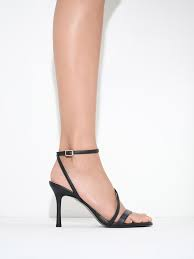
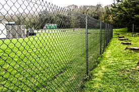

= Sex.And.The.City s01-01
:toc: left
:toclevels: 3
:sectnums:
:stylesheet: ../../+ 美国高中历史教材 American History ： From Pre-Columbian to the New Millennium/myAdocCss.css

'''

Once upon a time +
an English journalist came to New York. +
Elizabeth was attractive and bright 快活而生气勃勃的;聪明的；悟性强的,有希望的；大有可能成功的, +
and *right away* 立刻,马上 she *hooked （使）钩住，挂住 up with* 与某人来往 one of the city's
typically eligible （婚姻）合适的，合意的 bachelors 单身汉. +
The question remains,  +
is this really a company we want to own? //问题是这家公司值得投资吗？ +

Tim was forty-two. +
A well-liked (a.)深受喜爱的；适销对路 and respected 受人尊敬的 investment banker 投资银行家, +
who made about two million a year. //年薪约两百万 +
They met [one evening] *in* typical New York *fashion* 以…方式,
at a gallery 展览馆；画廊 opening 开幕式. +

Like it? +
Yes, actually. I think it's quite interesting. +
What? +
I feel like I know you from somewhere. +
Oh, doubtful 拿不定主意；不确定；怀疑;未必；难说；不大可能. +
I only just moved here from London. +
London, really? +
That's my all-time (a.)空前的，创纪录的，一向的 favorite city. +
It is? +
Absolutely. +
It was love at first sight 一见钟情. +
You know... +
I think perhaps I have met you somewhere before. +

For two weeks they snuggled (v.)（使）依偎，紧贴，蜷伏, +
went to romantic restaurants 餐厅；[经]饭店... +
had wonderful sex... //有美妙的性爱  +
and shared the most intimate 亲密的；个人的，隐私的 secrets. +
One warm spring day he took her to a townhouse 连栋房屋 +
后定 he saw in Sunday's New York Times. +

How about if we start (v.) at the top /and work (v.)（逐渐地）移动（到某位置）；（逐步）变成（某状态） our way down? +
There are four bedrooms upstairs. +

[.my1]
.案例
====
.work
(v.) to move or pass to a particular place or state, usually gradually（逐渐地）移动（到某位置）；（逐步）变成（某状态） +
[ V] +
• It will take a while for the drug to work out of your system.这药得需要一段时间才能排出你的体外。

[ VN] +
( figurative) +
• He worked his way to the top of his profession.他一步一步努力，终于成为行业内的翘楚。

.work our way down
"work our way down" 的意思是从上往下逐步查看或参观。台词中的人物建议从顶层开始，然后逐步向下参观这栋房子的各个楼层。所以这句话的意思是：从楼上的四个卧室开始，逐渐往下走，参观整栋房子。
====

Do you have any children? +
Not yet. +

That day, Tim popped (v.)（让人意外地）突然出现；冷不防冒出 the question. +
How'd you like to have dinner with my folks 亲属；家属；（尤指）爹妈;各位；大伙儿 Tuesday night? +
I'd love to. //我很乐意 +

On Tuesday, he called with some bad news. //他打电话 通知她一些坏消息 +
My mother's not feeling very well. +
Oh, gosh （非正式，表惊讶）天哪；上帝, I'm sorry. +
Can we *take a rain check* 遇雨改期,改天吧? +
Of course. +
Tell your mom I hope she feels better. +

[.my1]
.案例
====
.take a rain check
字面意思是“拿一张雨票”。短语起源来自美国的棒球文化，如果比赛时因恶劣天气而不得不终止，官方将发给观众交换券(check)，凭借此券可以观看下一次的比赛。由此衍生出了 take a rain check，即: 改期, 改天吧.
====

When she hadn't heard from him for two weeks, she called. +
Tim, it's Elizabeth. +
That's an awfully 非常；极其 long _rain check_. +
He said he was *up to his ears* 深陷于；埋头于；忙于 and that he'd call the next day. +

[.my1]
.案例
====
.BE UP TO YOUR EARS IN STH
to have a lot of sth to deal with 深陷于；埋头于；忙于 +
•We're *up to our ears* in work. 我们工作忙得不可开交。

up to your neck/ears/eyeballs in something 是英语的一个idiom， 意思是 “忙得不可开交”、“忙得四脚朝天”,”忙得焦头烂额”. +
If *you are "up to your neck/ears/eyeballs" in something*, that means that you are very busy with it or to have more of something than you can manage. 这一词语中用得多的是 neck，也可以用 ears 或 eyeballs 代之。
====

He never did call, of course. Bastard 杂种；浑蛋；恶棍. +
She told me one day over coffee... +
I don't understand. +
In England, looking at houses together, would have meant something.

[.my2]
在英国两个人一起看房子 是有意味的(就表示他们要结婚了) +

Then I realized, no one had told her about _the end of love_ in Manhattan. +
Welcome to the age of un-innocence. 非纯真年代 +

[.my1]
.案例
====
.innocence
n.清白，无罪；天真无邪

在英国，“一起看房子”通常被视为一件很严肃的事情，意味着关系达到了一个稳定或长期的阶段，可能是在考虑共同生活甚至结婚的前奏。看房子一起决定要住在哪里，是一种承诺的象征。  +

而在这段台词中，美国纽约的背景下，提到“the end of love in Manhattan”（曼哈顿爱情的终结）以及“the age of un-innocence”（非天真的时代），暗示了在曼哈顿这样的地方，恋爱关系可能更加自由、松散和缺乏承诺。这里“看房子”不再具有英国文化中那种深刻的象征意义，可能只是关系中的一个普通活动，而不代表任何长期承诺。
====

No one has "breakfast at Tiffany's" +
and no one has "affairs to remember." +
Instead, we have breakfast at 7:00 a.m. +
and affairs we try to forget *as quickly as possible*. +
Self-protection and _closing the deal_ are paramount (a.)至为重要的，首要的.

[.my2]
自我保护,跟完成交易, 是最高原则 +

Cupid has flown the co-op. +

[.my2]
====
“Cupid has flown the co-op” 是一种比喻的表达方式，其中“Cupid”指的是希腊神话中的爱神丘比特，通常象征爱情和浪漫。 “co-op” 是“cooperative”的缩写，通常指"合作公寓"或"联合住宅"，但在这里它更多地象征了一个团体、社群或某种环境。

整句的意思是：“爱神丘比特已经飞离了这个地方。” 换句话说，这里指的是浪漫和爱情已经离开了，或者说在当前的环境中，浪漫已经不再存在。结合上下文，这句话表达的是在现代社会，特别是在像曼哈顿这样快节奏的环境中，浪漫已经不再重要，人们更加注重实际的事务和自我保护，而不是追求爱情和浪漫。
====

How the hell did we get into this mess （组织欠佳等导致的）麻烦，困境，混乱? +
There are thousands, +
maybe _tens of thousands of_ 数以万计的 women like this in the city. +
We all know them /and we all agree they're great. +
They travel, they pay (v.) taxes, +
they'll spend $400 on a pair of _Manolo Blahnik_ _strappy (a.)（鞋或衣服）有带子的 sandals_ 凉鞋；拖鞋；便鞋, +
and they're alone. +

[.my1]
.案例
====
.strappy sandals

====

It's like _the riddle 谜；谜语 of the Sphinx_ 狮身人面像. +
Why are there so many great 数量大的；众多的 unmarried women +
and no great unmarried men? +
I explore these sorts of issues in my column （报刊的）专栏，栏目 +
and I have terrific sources 很棒的来源, my friends. +

When you're _a young guy_ in your twenties, +
women are controlling the relationships. +
By the time you're _an eligible （婚姻）合适的，合意的 man_ in your thirties, +
you feel like you're being devoured (v.)（尤指因饥饿而）狼吞虎咽地吃光 by women. +
Suddenly the guys are holding all the chips （作赌注用的）筹码. +
I call it "the mid-thirties _power flip_ （使）快速翻转，迅速翻动." +
It's all about age and biology 生理. +
I mean, if you want to get married, +
it's to have kids, right?  //结婚就得生孩子 +
And you don't want to do it with someone older than 35 +
'cause 因为 then you have to have kids right away +
and that's about it. +

[.my2]
而且你不想跟一个35岁以上的人结婚，因为那样你得马上生孩子，就是这么一回事。

I think these women should forget about marriage... +
and have a good time. +

I have a friend +
who'd always gone out with extremely sexy 性感的，引起性欲的 guys +
and just had a good time. +
One day she woke up and she was forty-one. +
She couldn't get any more dates 约会. +
She had a complete physical breakdown 身体崩溃,体力衰竭 , +
couldn't *hold on to* 抓紧；不放开 her job, //连工作都保不住 +
and had to move back to Wisconsin +
to live with her mother. +

Trust me, +
this is not a story that makes men feel bad. +
Most men are threatened by successful women. +
If you want to get these guys, +
you have to _keep your mouth shut_ and _play by the rules_. +
I totally believe that _love conquers (v.)征服 all_. +

[.my2]
如果你想抓住这些男人, 就得闭嘴﹐乖乖地照规矩来

Sometimes you just have to give it a little space +
and that's exactly what's missing in Manhattan, +
the space for romance. +

[.my2]
曼哈顿所缺少的, 就是浪漫的情感空间

The problem is expectations 期望；预期；期望值, +
older women don't want *to settle for* 勉强接受；将就 what's available. +

[.my2]
问题出在期待, 老女人不接受垂手可得的东西

By the time you reach your mid-thirties, +
you think, why should I settle? +
You know? +
It's like /the older we get the more /we *keep* self-selecting 自我选择 *down to* a smaller and smaller group. +

[.my2]
就好像我们年纪越大，我们的自我选择范围(群体对象)就越小。

What women really want is Alec Baldwin. +
There's not one woman in New York +
who hasn't *turned down* 拒绝，顶回（提议、建议或提议人） ten wonderful guys +
because they were too short, or too fat, or too poor. +

[.my2]
在纽约每个女人 至少都拒绝过十个好男人,
只因为他们太矮﹑太胖或太穷

I have been out with some of those guys, +
the short, fat, poor ones. +
It makes absolutely no difference. +
They are just *as* self-centered 自我中心的；利己主义的 and unappreciative 不欣赏的;不赏识的 *as* the good-looking ones. +

[.my2]
我跟又矮又胖的穷男人约会过 他们都一样 +
他们跟帅哥一样自私

Why don't these women just marry a fat guy? +
Why don't they just marry
a big fat tub 盆；桶 of lard （烹调用的）猪油? +

( Happy birthday Dear Miranda ) +
 (Happy birthday to you)  +
Another thirty-something birthday 三十来岁的生日
with a group of unmarried female friends. +
We would all have preferred (v.)更喜爱，宁可 a nice celebratory (a.)庆祝的；庆贺的；快乐的 conference call. +

You were saying? +
Look... Look, if you're a successful saleswoman in this city, +
you have two choices. +
You can bang 猛敲；砸 your head against the wall +
and try and find a relationship, or you can say "screw it 管他呢," +
and just go out and have sex like a man. +
You mean with dildos 假阴茎? +
No. I mean without feeling. +

[.my1]
.案例
====
"bang your head against the wall" 是一种比喻表达，意思是“徒劳无功地努力”或者“做一些很困难、让自己挫败的事情”。在这里，它指的是在城市里试图找到一段稳定的关系，但这个过程让人感到非常困难和沮丧。

"screw it" 是一种口语表达，相当于中文中的“算了吧”或者“去他的”。它表达了放弃或不再在意某件事的态度。这里的意思是放弃寻找关系，转而选择更随意的生活方式。

"I mean without feeling" 的意思是“我的意思是没有感情”。在这个上下文中，这句话是在解释前面的说法，意思是像男人一样去发生性关系，但不带有任何情感投入或依恋，强调的是一种情感上的疏离和不在乎。
====

Samantha Jones was a New York inspiration 启发灵感的人（或事物）；使人产生动机的人（或事物）;灵感. +
A public relations 公共关系 executive 行政领导，领导层, +
she routinely 例行公事地，常规地 slept with good-looking guys in their twenties. +
Mmm! 嗯 Remember that guy 后定 that I was going out with? +
Oh, God, what was his name? Drew? +
Drew. -Drew the sex god. +
Right, well, afterwards 过后，后来, I didn't feel a thing. +
It was like, "Hey, babe, gotta go 得走了, catch you later 稍后再见." +
And I completely forgot about him after that. +
But are you sure that /that isn't just 'cause he didn't call you? +

Sweetheart, this is the first time in the history of Manhattan +
that women have had *as much* money and power *as* men, +
plus _the equal 同等的 luxury_ 不常有的乐趣（或享受、优势） of _treating (v.) men like sex objects_ 性对象; 发泄性欲的对象. +

[.my2]
甜心﹐这是曼哈顿史上第一次 +
女人的权力跟男人一样大 +
她们也有同等地享受, 能把男人当性玩物

Yeah, except 除了，只是 men in this city `谓` fail (v.) on both counts 数目; 数量. +
I mean, they don't want to be in a relationship with you, +
but *as soon as* 一…就… you only want them for sex, they don't like it. +
_All of a sudden_ 突然地，出乎意料地 they can't perform the way 后定 they're supposed to 被期望;应该. +
That's when you dump (v.)（尤指在不合适的地方）丢弃，扔掉，倾倒 them. //当你抛弃他们的时候 +

[.my1]
.案例
====
"except men in this city fail on both counts" 的意思是“只是，这个城市的男人在这两个方面都不及格。” +
"both counts" 是指两个方面：(1) 男人不想和女人建立关系；(2) 男人在女人只想要性关系时, 表现得不如预期。
====

Oh, come on, ladies, are we really that cynical 认为人皆自私的；愤世嫉俗的;悲观的；怀疑的? +
What about romance? +
-Yeah! -Who needs it? +
It's like that guy, Jeremiah, the poet. +
I mean the sex was incredible 不可思议的，难以置信的, +
but then he wanted to read me his poetry +
and go out to dinner 正餐，晚餐 and the whole chat bit 小部分，片段, +
and I'm like, let's not even go there. +

[.my1]
.案例
====
.the whole chat bit
"the whole chat bit" 指的是“全部的谈话环节”或者“聊天的部分”。这里的“bit”是一种非正式的表达方式，指的是某个特定的部分或环节。“the whole chat bit”指的是那种伴随着浪漫关系的聊天、交谈和社交互动。

.let's not even go there
"let's not even go there" 是一种表达，意思是“我们根本不要去碰那个话题”或者“我们最好不要涉及那个”。

综上所述，这句话的意思是：“他想要给我读诗，和我一起去吃晚餐，还有所有那些谈话的环节，而我当时的想法是，别跟我谈这些。” 表达出对浪漫和深入交流的排斥，更倾向于保持关系在纯粹的性层面。

.I'm like...
"I'm like" 是一种非正式的口语表达，用来引述或模仿自己当时的想法或反应。它类似于 “I said” 或 “I thought”，但更随意，更常用于年轻人或非正式的对话中。 +

====

What are you saying? Are you saying you're just gonna
*give up on* 对…不再抱希望（或不再相信） love? +
-That's sick （身体或精神）生病的，有病的;变态的；病态的! Oh, no. No, no. +
Believe me, the right guy *comes along* 出现 +
and you two right here, this whole thing, shew, right out the window.  +
-That's right! +
[.my1]
.案例
====
这里的 "shew" 是 "shoo" 的一种非正式拼写形式，模仿挥手赶走什么东西时发出的声音。它通常用来表达某物或某事迅速消失或被轻易抛开。 +

在这段对话中，"shew, right out the window" 的意思是“（这些想法）一下子就会被抛到窗外”，意思是当那个“合适的人”出现时，当前的这些关于放弃爱情的想法将迅速消失。
====

Listen, the right guy is an illusion. +
You understand that, you can start living your life. +
So you think it's really possible +
*to pull off* 做成，完成（困难的事情） this whole, um... +
women having sex like men thing? +

You're forgetting _The Last Seduction_ 诱奸;诱惑力；魅力；吸引力. +
You're obsessed (a.)（对……）着迷的，（受……）困扰的 with that movie. +

[.my2]
听着，“那个合适的人”只是个幻想。 明白了这一点，你就可以开始真正地生活了。 所以你认为真的可以实现这种，嗯…… 女人像男人一样对待性爱的情况？ 你忘了《最后的诱惑》了吗？ 你对那部电影太着迷了。

Oh, okay! Linda Fiorentino *fucking* that guy *up* against the _chain 链条 link fence_. +
And never having one of those, +
"Oh, my God, what have I done?" epiphanies 顿悟；神灵显现. +
I hated that movie. +
Was it true? +
Were women in New York really *giving up on* love +
and *throttling (v.)使窒息；掐死；勒死 up* 调节油门,加速 on power? +
What a tempting thought. +

[.my2]
琳达佛伦提诺 靠着铁栏杆跟男人乱搞 +
她从没想过 “天啊﹐我做了什么？”

[.my1]
.案例
====
.chain link fence

.throttle (sth) ˈback/ˈdown/ˈup
to control the supply of fuel or power to an engine in order to reduce/increase the speed of a vehicle 调节油门；减╱加速
====

You know, I'm beginning to think +
the only place where one can still find love and romance in New York +
is the gay community 男同性恋圈. +
It's _straight (a.)异性恋的 love_ that's become closeted (a.)保密的，地下的；私下密谈的. +

Stanford Blatch was one of my closest friends. +
He was the owner of a _talent 人才 agency_ 经纪公司 +
who _at the moment_ was down to a single client. //他现在只剩一个客户了。 +
So are you telling me that you're in love? +
How could I possibly sustain a relationship? +
You know Derek takes up, like, 1000% of my time. +
Don't you think that's a bit obsessive? +
Carrie, I'm a passionate person. +
His career is all I care about. +
When that's under control, +
then I can concentrate on my personal life. +
Stanford, +
he's an underwear model. +
With a billboard in Times Square. +
Oh, my God, don't turn around. +
The loathe of your life is at the bar. +
It was Kurt Harrington. +
A mistake I made when I was twenty-six, +
and twenty-nine... +
and thirty-one. +
Carrie, don't even go there. +
What, do you think, I'm a masochist? +
The man is scum. +
Good, because I don't have the patience +
to clean up this mess for the fourth time. +
Will you relax? +
I don't have a shred of feeling left. +
Thank God. +
Now, if you'll excuse me, I have to visit the ladies' room. +
Carrie! +
It was true, +
I no longer felt a thing for Kurt. +
After all these years, +
I finally saw him for what he was, +
a self-centered withholding creep, +
who was still the best sex I ever had in my life. +
However, +
I did have a little experiment in mind. +
Kurt... +
Wow, what are you doing here? +
Hey, babe. +
God, you look gorgeous. +
Thanks. +
So, how's life? +
Not bad, can't complain. +
You? +
Oh, you know, just writing the column, the usual. +
So, you seeing anyone special? +
Not really... You? +
Oh, just a couple guys... +
But you look good though. +
So do you. +
So, uh... +
What are you doing later? +
I thought you weren't talking to me for the rest of your life. +
Who said anything about talking? +
What do you say to my place, three o'clock. +
Alright. +
See you there. +
Are you out of your mind? +
What the hell do you think you're doing? +
Oh, calm down, it's research. +
Oh, God! +
Oh, Kurt! +
Kurt was just like I remembered... +
-Better. -Yes. Oh... +
Because this time +
-there would be none of that messy emotional attachment. -Yes. yes. Oh! +
Alrighty. +
My turn. +
Oh, sorry. +
I have to go back to work. +
What are you kidding? You serious? +
Oh, yeah, completely. +
But I'll give you a call? Maybe we can do it again some time? +
But... +
As I began to get dressed, +
I realized that I'd done it... +
I'd just had sex like a man. +
I left feeling powerful, potent, and incredibly alive. +
I felt like I owned the city. +
Nothing and no one could get in my way. +
-Number one... -Here you go. +
... he's very handsome. +
he's not wearing a wedding ring. +
he knows I carry a personal supply +
of ultra textured Trojans with the reservoir tip. +
Thanks a lot. +
Any time. +
Later that night, +
Skipper Johnston met me for coffee +
and confessed a shocking intimate secret. +
Thank you. +
Do you know that it has been, like, a year? +
Really? +
I don't understand that, you're such a nice guy. +
That's the problem. +
You know, I'm too nice, you know? +
I'm a romantic. +
I just have so much feeling. +
Are you sure you're not gay? +
No! +
I'm sensitive +
and I don't objectify women. +
You know, most guys, when they meet a girl, +
the first thing that they see is, um... +
You know... +
-Pussy? -Oh, God! +
Oh, I hate that word. +
Don't you have any friends that you can hook me up with? +
No, they're too old for you. +
I like older women. +
Maybe. +
Maybe my friend Miranda. +
When? +
Tomorrow night. +
We're all going downtown to this club, Chaos. +
Great. +
Don't tell her I'm nice. +
Mmm. +
Miranda was gonna hate Skipper. +
She'd think he was mocking her with his sweet nature +
and decide he was an asshole. +
The way she had decided all men were assholes. +
Hello? +
Hey, Carrie, it's Charlotte. +
-Hey, sweetie. -Hey, look, +
I can't meet you guys for dinner tomorrow night +
because I have an amazing date. +
With who? +
Capote Duncan, +
he's supposedly some big shot in the publishing world. +
-Do you know him? -Did I know him? +
He was one of the city's most notoriously +
un-gettable bachelors. +
Wait, wait. +
Don't even answer that question +
because frankly, +
I don't care, and another thing, +
I'm not buying into any of that women having sex like men crap. +
I didn't want to tell her about my afternoon +
of cheap and easy sex and how good it felt. +
Alright, fine. +
Listen, have a good time, and promise to tell me everything. +
Well, if you're lucky. +
-Bye. -Alright, bye. +
Friday night at Chaos. +
It was just like that bar in Cheers +
where everybody knows your name, +
except here, they were likely to forget it five minutes later. +
Hi. +
Still, it was the creme de la creme of New York, +
whipped into a frenzy. +
Sometimes you got a soufflé, +
sometimes cottage cheese. +
It is like a model bomb exploded in this room tonight. +
Is there a woman here aside from me +
that weighs more than a hundred pounds? +
I know, it's like under-eaters anonymous. +
That's funny, Skippy. +
Skipper. +
I have this theory that men secretly hate pretty girls +
because they feel that they're the ones who rejected them in high school. +
Right, but if you're not part of the beauty Olympics, +
you can still become a very, you know... +
interesting person. +
Are you saying that I'm not pretty enough? +
No, no, no, of course you are. +
So, ipso facto, I can't be interesting? +
Women either fall into one of two categories, +
beautiful and boring, or homely and interesting? +
Is that what you're saying, Skippy? +
No, no, no, no, that's not what I meant. +
Excuse me, is this your hand on my knee? +
No. +
Alright, let's keep 'em where I can see 'em, alright? +
Well, I guess you must find me beautiful... +
or interesting. +
I was about to rescue Skipper +
from an increasingly hopeless situation when suddenly... +
-Hey! -Hey! +
Lucky me, twice in one week. +
Well, I don't know if you're going to be getting that lucky. +
You know, I was really pissed off the way you left the other day. +
-You were? -Yeah. +
And I thought, "How great!" +
You finally understand the kind of relationship I really want, +
and now we can have sex without commitment. +
Yeah, right. +
Sure, I guess. +
So, whenever I feel like it, I'll give you a call. +
Yeah, please. I mean, whenever you feel like it. +
If I'm alone, I'm all yours. +
Alright. +
I like this new you. +
Call me. +
Yup. +
I didn't understand, +
did all men secretly want their women +
promiscuous and emotionally detached? +
And if I was really having sex like a man, +
why didn't I feel more in control? +
You see that guy? +
He's the next Donald Trump, +
except he's younger and much better looking. +
Hi. +
Do you know him? +
No, I've never seen him in my life. +
He usually dates models, but hey, +
I'm as good-looking as a model, +
plus I own my own business. +
Samantha had the kind of deluded self-confidence +
that caused men like Ross Perot to run for president. +
And it usually got her what she wanted. +
Well, if you're not gonna hit on him, I will. +
And there she went, +
off to take her best shot with Mr. Big. +
Meanwhile, Charlotte York +
was passing the most splendid evening with Capote Duncan. +
Want to go back to my place and see the Ross Bleckner? +
I'd love to, but it's really getting late. +
No problem. +
Uh... +
What year was it painted again? +
'89. +
Though Charlotte was determined to play hard to get, +
she didn't want to end the evening too abruptly. +
Well... +
Maybe just for a minute. +
This could easily go for a hundred grand. +
Ross is so hot right now. +
It's beautiful. +
No, you're beautiful. +
Thank you... +
-for tonight. -Yeah? +
I had a wonderful time. +
-Well, it was my pleasure. -Mmm. +
I have to get up really early tomorrow. +
I'll get you a cab. +
Charlotte told me later +
that she thought she had played the entire evening flawlessly. +
So, what are you doing next Saturday? +
I'm having dinner with you. +
Hey... +
Hey, you're going to the West Side, right? +
Right, uh, West 4th and Bank please. +
Scoot over, will you? +
Two stops. +
4th and Bank, and, uh... +
West Broadway and Broome. +
You're going to Chaos? +
Oh, yeah. +
Why? +
Look, I understand where you're coming from, +
and I totally respect it... +
but, uh, I really need to have sex tonight. +
Back at Chaos, +
things were swinging into high gear +
and Samantha was putting the moves on Mr. Big. +
I've been smoking cigars for years, +
back when they were terminally uncool. +
I've got this great source that sends me Hondurans. +
Do you want to try one? +
-No, thank you. -Why? You can't find them anywhere. +
Cohibas... +
That's all I smoke. +
Look... +
I do the P.R. for this club... +
and I have a key to the private room downstairs. +
Really? +
You want a private tour? +
No thanks, but maybe another time. +
Meanwhile, Skipper Johnston +
was hopelessly smitten with Miranda Hobbes. +
So where we going now? +
Listen, Skippy, you know, +
you really are a nice, sweet guy, but... +
Oh, I understand. +
Goodnight. +
Miranda told me later that she thought he was too nice, +
but that she was willing to overlook one flaw. +
And Capote Duncan found his fix for the night. +
-After you. No. +
Where is it? I want to see the Ross Bleckner. +
Later. +
Oh, listen, I, uh... +
I gotta get up really early, +
so you can't stay over. +
Cool? +
Sure, I have to get up really early too. +
Taxi! Taxi! +
And so another Friday night in Manhattan crept towards dawn. +
Taxi! +
And just when I thought I would have to do the unspeakable, +
walk home... +
Well, get in for Christ's sakes. +
Where can I drop you? +
72nd Street, Third Avenue. +
You got that, Al? +
Yes, sir. +
So, what have you been doing lately? +
You mean besides going out every night? +
Yeah, I mean what do you do for work? +
Well, this is my work. +
I'm sort of a sexual anthropologist. +
You mean, like a hooker? +
No. +
I, um, I write a column called Sex and the City. +
Right now I'm researching an article +
about women who have sex like men. +
You know, they have sex and then afterwards they feel nothing. +
But you're not like that. +
Well, aren't you? +
Not a drop. +
Not even half a drop. +
Wow, what's wrong with you? +
I get it. +
You've never been in love. +
Oh, yeah? +
Yeah. +
Suddenly I felt the wind knocked out of me. +
I wanted to crawl under the covers and go right to sleep. +
-Thanks for the ride. Any time. +
Wait. +
Have you ever been in love? +
Abso-fucking-lutely. +

“欲望城市” +
从前有个英国女记者来到纽约 +
伊丽莎白既美丽又聪明 +
立刻就钓上 城里的黄金王老五 +
问题是这家公司值得投资吗？ +
提姆四十二岁 +
是位迷人且颇有声望的银行家 年薪约两百万 +
某晚在典型的纽约社交聚会中 他们相识 +
那是个艺廊的开幕典礼 +
喜欢吗？ +
是啊﹐我觉得挺有趣的 怎么了？ +
-我对你有似曾相识的感觉 -应该不会吧 +
-我刚从伦敦搬来 -真的吗？ +
那是我最爱的城市 +
-是吗？ -真的 +
他们一见钟情 +
或许我们真的曾经见过 +
两星期来他们浓情蜜意 +
共度浪漫的晚餐 +
享受鱼水之欢 +
分享彼此最不为人知的小秘密 +
某天他带她去看 纽约时报广告里的房子 +
我们何不从楼上看起？ 楼上有四间卧房 +
-你们有孩子吗？ -还没有 +
那天提姆提出一个问题 +
星期二晚上 你愿意跟我父母见个面吗 +
我很乐意 +
星期二他打电话 通知她一些坏消息 +
-我妈不太舒服 -真的是太糟糕了 +
-改天再说吧 -没问题 +
帮我向你妈妈问好 +
两个星期来他音讯全无 她忍不住地打了电话 +
提姆﹐我是伊丽莎白 你未免让我等太久了吧 +
他说她是插播 他明天会打电话给她 +
他再也没打来﹐大混蛋 +
-某天在喝咖啡时她向我倾诉 -我不明白 +
在英国两个人一起看房子 就表示他们要结婚了 +
我明白没人告诉过她 曼哈顿人如何结束一段恋情 +
欢迎光临“非纯真年代” +
没人会吃“第凡内早餐” 也没人会遵守“金玉盟” +
相反地我们在早上七点吃早餐 +
试着尽快地忘记誓言 +
自我保护跟完成交易 是最高原则 +
爱神也只好同流合污 +
为什么会这样呢？ +
纽约市数千名女人 有类似的遭遇 +
我们身边都有这样的人 也同意她们都是好女人 +
她们四处旅游﹑纳税 +
愿意花四百块买一双 曼诺罗布雷尼克的细带凉鞋 +
她们孤家寡人 +
这就像狮身人面像之谜 +
为什么有那么多未婚好女人 +
就是没有未婚的好男人？ +
我在我的专栏中探讨这些问题 朋友是我超棒的灵感来源 +
二十几岁时 由女人来主宰你们的交往 +
过了三十岁 女人开始追逐男人 +
突然间男人占尽优势 +
我称之为 “三十几岁的权力大转移” +
（彼德曼森﹐广告公司经理 中毒已深的单身汉） +
这跟年纪及生理状况有关 +
结婚就得生孩子 +
超过三十五岁结婚 就得立刻生孩子 +
就是这么一回事 +
女人该忘了婚姻 好好地放纵一下 +
（卡波迪杜肯﹐广告公司经理 中毒已深的单身汉） +
我有个朋友 老跟超级性感的男人约会 +
她也玩得很开心 +
有天她醒来发现自己41岁了 没人愿意跟她约会 +
她精神崩溃﹐连工作都保不住 +
只能搬回威斯康辛跟老妈住 +
（米兰达霍布斯﹐别号先生 律师﹐未婚女性） +
相信我﹐男人是不会伤心的 +
大部分的男人 觉得女强人是一大威胁 +
如果你想抓住这些男人 +
就得闭嘴﹐乖乖地照规矩来 +
（夏绿蒂约克﹐艺术经销商 未婚女性） +
我完全相信爱能征服一切 +
有时你得给它一点空间 +
曼哈顿所缺少的 就是浪漫的空间 +
（史奇普强斯顿﹐网站设计者 无可救药的浪漫主义分子） +
问题出在期待 老女人不接受垂手可得的东西 +
到了三十几岁 你会想为什么要安定下来 +
你知道的 +
年纪越大﹐来往的朋友就越少 +
女人真正要的是艾力克鲍温 +
在纽约每个女人 至少都拒绝过十个好男人 +
只因为他们太矮﹑太胖或太穷 +
我跟又矮又胖的穷男人约会过 他们都一样 +
他们跟帅哥一样自私 +
为什么这些女人不嫁胖子呢？ +
为什么她们不嫁给大肥猪？ +
（祝你生日快乐） +
（亲爱的米兰达） +
（祝你生日快乐） +
又是一堆未婚的女友 在一起欢度三十几岁的生日 +
我们都喜欢一起庆祝 +
你说什么？ +
如果你是纽约市的女强人 +
你不是努力地寻觅天赐良缘 +
就是跟男人一样出外打野食 +
-你是说用情趣用品来自慰？ -不﹐我是说纯上床 +
莎曼珊是纽约的奇女子 她是名公关 +
她常跟二十几岁的帅哥上床 +
记得跟我约会的那个男人吗？ 他叫什么名字来着？ +
-德鲁 -那个性感男神 +
完事后我毫无感觉 那就像是“走了﹐待会儿见” +
之后我根本就把他忘了 +
不是因为他没打电话给你吗？ +
甜心﹐这是曼哈顿史上第一次 +
女人的权力跟男人一样大 +
她们也相当富裕 能把男人当性玩物 +
对﹐但纽约男人不想跟你交往 +
因为你要的只是性 他们不喜欢这样 +
-突然间他们落居下风 -当你抛弃他们的时候 +
少来了 我们有那么玩世不恭吗？ +
-浪漫呢？ -谁需要浪漫？ +
就像那个名叫杰瑞米的诗人 +
我们在床上水乳交融 之后他想念他的诗给我听 +
我们出去用餐聊天 我摆出老大不情愿的样子 +
你在说什么？ 你要放弃爱？大变态 +
听着﹐如果真命天子真的出现 这一切都是不成立的 +
-没错 -真命天子是不存在的 +
好好去过你们的生活 +
你觉得 女人可以跟男人一样只要性 +
-你忘了“最后的诱惑” -你太迷信那部电影了 +
琳达佛伦提诺 靠着铁栏杆跟男人乱搞 +
她从没想过 “天啊﹐我做了什么？” +
我讨厌那部电影 +
那是真的吗？ +
纽约女人会放弃爱 热衷于追逐权力？ +
真的是太棒了 +
我认为纽约 唯一还能找到爱跟浪漫的地方 +
就是男同性恋圈 +
异性恋反而成了异端 +
史丹佛巴勒奇是我的密友 +
他开了一家 只有一个客户的经纪公司 +
你是在告诉我你恋爱了吗？ +
我哪有办法跟别人交往？ +
德瑞克占走了我所有的时间 +
你不觉得那算是迷恋吗？ +
凯莉﹐我是个热情的人 我唯一关心的是他的工作 +
在控制住这一点后 我才能专心在私人生活上 +
-史丹佛﹐他是内衣模特儿 -在时代广场上有他的看板 +
天啊﹐别转头 你最讨厌的人就在吧台那边 +
他是柯特哈林顿 +
我在26岁时犯下的错误 +
在29岁﹐31岁时﹐一错再错 +
凯莉﹐别过去 +
你觉得我是受虐狂吗？ 那家伙是个无赖 +
很好 我没有耐心安慰你第四次 +
-别紧张﹐我对他没感觉了 -谢天谢地 +
对不起﹐我得去一下洗手间 +
真的﹐我不再对柯特有感觉 +
过了这么多年 我终于了解他的真面目 +
他是个自私退缩的怪胎 +
也是我一生中最棒的性对象 +
我心里头的确想做个小实验 +
-柯特﹐你在这里做什么？ -你好啊﹐宝贝 +
-天啊﹐你美呆了 -谢谢 +
你过得还好吧？ +
还不错﹐没什么好抱怨的 你呢？ +
我还是在写专栏 +
你另结新欢了吗？ +
不算有﹐你呢？ +
我跟几个男人约过会 +
-但你看起来气色很好 -你也一样啊 +
待会儿你有事吗？ +
我还以为 你这辈子再也不跟我说话了 +
那只是嘴上说说 +
三点到我家见？ +
没问题﹐到时候见 +
你疯了吗？ 你以为自己在做什么？ +
冷静下来﹐这是个实验 +
天啊﹐柯特 +
柯特仍如我记忆中一样 +
这次比以前还棒 +
因为我们不再为感情所困扰 +
太棒了 +
轮到我了 +
抱歉﹐我得回去上班了 +
-你开什么玩笑？真的吗？ -真的 +
我会打电话给你 以后可以再见面吗？ +
当我开始穿衣服时 我明白我真的做到 +
我跟男人一样只要性 +
我觉得自己充满了力量跟潜能 而且活力充沛 +
我觉得我拥有纽约市 任何事跟任何人都阻挡不了我 +
一﹐他很英俊 +
二﹐他没戴婚戒 +
三﹐他知道我带着个人用品 +
超薄型的保险套 +
-谢谢 -不客气 +
那晚稍后 史奇普强斯顿约我喝咖啡 +
向我坦承一个惊人的私密 +
-谢谢 -你知道已经过了一年吗？ +
真的吗？我真是弄不懂 你是个好男人 +
问题就在这里 我太好了﹐你知道吗？ +
我是个浪漫的人 我的感情充沛 +
-你确定你不是同性恋？ -当然不是 +
我很感性﹐而且不物化女人 +
大部分的男人在认识女人时 +
第一个看到的东西是… +
-你知道的 -“小妹妹”吗？ +
天啊 +
我讨厌那个字眼 +
你没有朋友可以介绍给我吗？ +
-没有﹐对你来说她们太好了 -我喜欢姐姐型的 +
或许有吧 +
-或许我的朋友米兰达可以 -什么时候？ +
明天晚上 我们都会到混乱俱乐部去 +
太棒了 +
别告诉她我是好男人 +
米兰达一定会讨厌史奇普 +
她会觉得他的温柔是在嘲笑她 +
认为他是个大混蛋 +
就像她认为男人全是混蛋一样 +
-哪位？ -凯莉﹐我是夏绿蒂 +
-你好 -明晚我没办法跟你吃饭 +
因为我要跟一个好男人约会 +
-你要跟谁约会？ -卡波迪杜肯 +
他是出版界的名人 你认识他？ +
他是城里 最难钓到的单身汉之一 +
等一下﹐别回答那个问题 因为我并不在乎 +
我才不相信 女人能跟男人一样只要性 +
我没有告诉她 那天下午我的美好性爱游戏 +
听着﹐好好去玩 一定要把所有的细节都告诉我 +
-只要你的运气够好﹐再见 -好了﹐再见 +
星期五晚上在混乱俱乐部 +
酒吧里的每个人都在干杯 装出一副很熟的样子 +
但五分钟后他们会忘了你是谁 +
就像是 纽约的甜点大师突然抓狂 +
有时你会吃到舒芙雷 有时会吃到软干酪 +
今晚俱乐部里挤满了模特儿 +
除了我之外 哪个女人体重超过一百磅？ +
我知道 这像是厌食者的匿名治疗课 +
-真的很好笑﹐史奇皮 -是史奇普 +
我认为 男人在心里头是讨厌美女的 +
因为他们觉得那些美女 就是在中学时拒绝过他们的人 +
就算你没参加过选美 +
你还是能当个风趣的人 +
-你是说我不漂亮？ -不﹐你当然很漂亮 +
所以我不是个风趣的人？ +
女人不是木头美女 就是风趣的恐龙妹？ +
-是那样吗？史奇普 -我不是那个意思 +
对不起 你把手放在我的膝盖上吗？ +
不是 +
把你的手放在我看得见的地方 +
我猜你一定觉得我很漂亮 +
或是很风趣 +
我当时打算救史奇普脱离苦海 +
突然间… +
-一星期遇到你两次算我好运 -这不算是运气好吧 +
-我很气你那样子离开 -是吗？ +
对﹐后来我觉得那很棒 +
你终于了解 我们可以只要性﹐不要承诺 +
对﹐我猜是吧 +
我想要时就会打电话给你 +
只要你想要而我又一个人 我是你的 +
-好吧 -我喜欢现在的你 +
-打电话给我 -好啊 +
我不了解 +
男人真的只要性 不想跟女人有情感纠葛吗？ +
如果我真的能跟男人一样乱搞 为什么我并不是主宰者？ +
你看到那家伙了吗？ 他是下一个唐纳川普 +
但他年纪比较轻 长得也比较帅 +
你好 +
-你认识他吗？ -不﹐我从未见过他 +
他都跟模特儿约会 但我长得跟模特儿一样漂亮 +
而且我还有自己的事业 +
莎曼珊是个特别有自信的人 +
那种自信让裴洛想竞选总统 +
这样的自信 让她能得到她想要的东西 +
如果你不要的话 我可要发动攻势了 +
她使出浑身解数勾引大人物 +
同时夏绿蒂约克 +
跟卡波迪杜肯度过美好的一晚 +
想回我家去看 罗斯雷克纳的画吗？ +
-我很想﹐但真的很晚了 -没关系 +
是哪一年的作品？ +
八九年 +
夏绿蒂不想当个随便的女人 但她也不希望突兀地结束约会 +
或许我可以去看一下 +
这随便都能卖到十万块 罗斯现在很红 +
好漂亮 +
不﹐你才漂亮 +
谢谢 +
你今晚所做的一切 +
-我玩得很开心 -这是我的荣幸 +
我明天真的得早起 +
我帮你叫计程车 +
夏绿蒂认为这是个完美的夜晚 +
下个星期六你要做什么？ +
跟你去吃晚餐 +
你要到西区去﹐对吧？ +
对﹐麻烦到西四街跟班克街口 +
坐过去一点 +
我们要到两个地方 +
到西四街跟班克街口 和西百老汇大道跟布鲁明街口 +
-你要到混乱俱乐部去？ -对啊 +
为什么？ +
我知道你是个好女孩 也完全尊重这一点 +
但我今晚真的很想做爱 +
在混乱俱乐部好戏才刚开始 +
莎曼珊开始对大人物下手 +
我抽了很多年的雪茄 那时抽雪茄还不是那么流行 +
我可以拿到“洪都拉斯人” 要来一根吗？ +
-我不要﹐谢谢你 -那可不是随便就能弄到的 +
我只抽“柯西巴斯” +
我帮这家具乐部做公关 +
我有楼下包厢的钥匙 +
-真的吗？ -想来趟私人导览吗？ +
不要了﹐谢谢﹐下次再说吧 +
史奇普拜倒在米兰达的裙下 +
我们现在要去哪里？ +
听着﹐史奇普 你真的是个好男人﹐但是… +
我了解 +
晚安 +
米兰达说她觉得他太好了 +
但她愿意忽视他这个缺点 +
卡波迪杜肯找到做爱的对象 +
在哪里？ 我要看罗斯雷克纳的画 +
待会儿再说 +
待会儿再说 +
听着 +
我真的得早起 所以你不能留下来过夜 +
-可以吗？ -当然﹐我也得早起 +
计程车 +
曼哈顿星期五之夜又将结束 +
计程车 +
当我想到我得很丢脸地 +
走路回家时 +
快上车吧 +
-你要在哪里下车？ -七十二街跟第三大道口 +
-听到了没有？艾尔 -听到了﹐老板 +
你最近做了什么？ +
你是指 除了每晚出来鬼混之外吗？ +
我是说你是干哪一行的？ +
这就是我的工作 我可以算是性学专家 +
你是妓女？ +
不 我是“欲望城市”专栏作家 +
我在研究关于女人 能跟男人一样只要性的题材 +
她们能在做爱后 没有丝毫的感觉 +
-但你不是那种人 -你不是吗？ +
完全不是 +
你是怎么了？ +
我懂了 +
你从没爱过 +
是吗？ +
没错 +
突然间我觉得一阵晕眩 +
我想爬进被窝里立刻进入梦乡 +
-谢谢你让我搭便车 -别客气 +
等一下 +
你爱过吗？ +
我当然爱过 +
