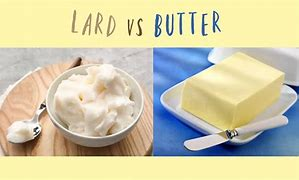
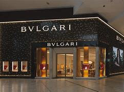
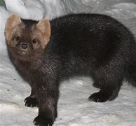
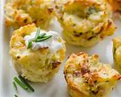
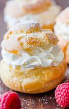
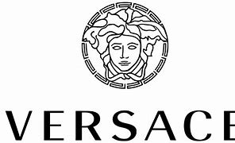
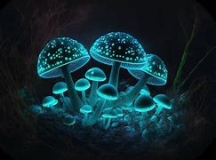
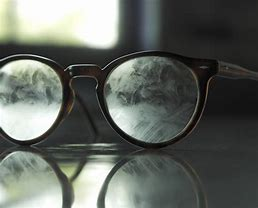
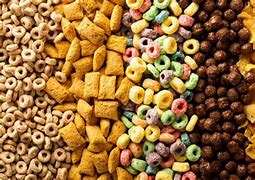

= Sex.And.The.City s01-02
:toc: left
:toclevels: 3
:sectnums:
:stylesheet: ../../+ 美国高中历史教材 American History ： From Pre-Columbian to the New Millennium/myAdocCss.css

'''

Last night, my friend Miranda got invited 被邀请 to a dinner party by a man she hardly 几乎不，几乎没有；刚刚，才 knew. +
She was the date 约会对象 of Nick Waxler,
a fairly successful sports agent 体育经纪人
who once told her she had nice legs. +

[.my2]
她当时跟尼克瓦克勒约会 他是个成功的运动经纪人 +
还曾说过她有双漂亮的腿

Okay,
old _movie stars_ you'd have liked to fuck
when they were young. +
Alive or dead? +
It doesn't matter, I'll start. +
Veronica Lake,
the year she made Sullivan's Travels . //她拍“苏利文游记”时 +
Dave? +
Huh. I'd have to say Sophia Loren. +
Probably 'cause my dad *had this thing for* 对...有好感、有意思 her. +

[.my1]
.案例
====
.have a thing for someone
当别人跟你说 I have a thing for you，可不是有东西要给你，而是“对你有好感、有意思”，相当于I like you，指还没确定恋情的阶段。

如果“对某事有强烈的喜欢或讨厌”，可以用 Have a thing about sth。

.HAVE A ˈTHING ABOUT SB/STH
( informal ) to have a strong like or dislike of sb/sth in a way that seems strange or unreasonable （莫名其妙地）对…有好感，对…有偏见 +
•She has a thing about men with beards. 她对留胡子的男人有强烈的感觉。
====

-Uh, we won't go there. +
Montgomery Clift. +
He was gay. +
Oh. +
Marilyn Monroe, +
before the Kennedys got to her. Honey? +
-Bing Crosby. +
Ah! I stand by my choice. 我坚持我的选择。 +
Sean Connery, +
yesterday, today, and tomorrow. +
For a first date, Miranda felt like _she was hitting it out of the ballpark_ 棒球场；活动领域. +
Thanks. +

[.my1]
.案例
====
.You hit it out of the ballpark.  你工作表现很棒
the ballpark 源自棒球术语，意思是“将球击出场外(全垒打)”，引申为“非常成功”。 +
- She’s quite sure she hit that driving test out of the ballpark. 她很确信她在驾驶考试中表现很棒。
====

So how long have you known Nick? +
We've been riding the same elevator line for years +
and then we had lunch 吃午餐 a few weeks ago +
and then he invited me here to dinner. +
Well, we adore 热爱，爱慕（某人） him. +
He's very smart. +
I guess he *took* our little ultimatum 最后通牒 *seriously*. +

[.my2]
我猜他把我们的最后通牒当真了。

Deanne. +
What are you talking about? +
They told Miranda +
that Nick *had this thing for* models. //尼克偏好模特儿 +
Okay, old movie stars +
you would have liked to fuck when they were young. +
I'll start. +
Veronica Lake, +
the year she made Sullivan's Travels . +
Dave? +
I'd have to go with Sophia Loren. +
Probably, my dad *had a thing for* her. +
Montgomery Clift. +
Marilyn Monroe. +
Bing Crosby. +
Yvette? +
Um, I don't know, Charlie Sheen? +
They'd come to dinner, push their food around, +
and pout (v.)撅嘴. +

[.my1]
.案例
====
“push their food around” 是指用餐时用餐具随意拨弄食物，而不是认真地吃。这通常表示对食物或整个用餐过程缺乏兴趣或不满。
====

Veronica Lake. +
Sophia Loren. +
Montgomery Clift. +
Marilyn Monroe. +
Bing Crosby. +
Marissa? +
She, um... +
had to make a phone call. +
It got to be a problem. +
They decided to take action. +

Can't you find a woman +
who can carry on 继续做；坚持干 a decent conversation （非正式的）谈话，交谈? +
Yeah, Nick. And eat without purging 清除，清洗（组织中的异己分子）. +

[.my1]
.案例
====
“eat without purging” 是指吃完东西后不进行催吐。这里的 “purging” 是指一种饮食失调行为，即通过自我催吐来清除体内食物。
====

-What are you saying? +
You can't bring around any more of these so-called models, Nick. +
Uh-uh, it's too depressing 令人沮丧的. +

[.my1]
.案例
====
“Bring around” 是带来或带到某个地方。
====

Okay, okay. +
I'll see what I can do. +
And then he brought you. +
So obviously not a model. +
In a good way! +
Nick dates (v.) models? +
Miranda confronted him, +
and it didn't take him long to fold (v.)认输;折叠，对折（纸、织物等）. +
Well, it's true. It's true, okay? +
I'm obsessed (a.)（对……）着迷的，（受……）困扰的. +
Obsessed (a.) with models. +
-Correct. -So what am I? +
Your intellectual beard for the evening? +
Look, don't be pissed (a.)烂醉的；醉醺醺的, all right? +
You got to admit, you met some nice people. +
All right, you had a good time. +
You were on a date with a modelizer 模特迷 +
and you didn't even know it? +

[.my1]
.案例
====
.modelizer
模特迷：指对模特有特殊喜好或痴迷的人，通常用于描述那些喜欢与模特交往的男性。
====

If men like Nick are dating (v.) models, +
what chance do ordinary women have? +
I mean, do you have to be a supermodel to get a date in New York? +
[.my2]
我是说，在纽约你一定要成为超模才能得到约会吗?

Modelizers are a particular breed 品种；（人的）类型，种类. +

[.my2]
模特迷是一个特殊的品种。

They're a step beyond womanizers 风流坯子，色鬼 +
who will sleep with *just about* 大约、几乎 anything in a skirt 女裙，半身裙. +
[.my2]
他们比那些愿意和任何穿裙子的人睡觉的好色之徒, 高出一步。 +
(他们排名仅次于女人狂之后, 女人狂 跟所有穿裙子的东西上床)

Modelizers are *obsessed* (a.)（对……）着迷的，（受……）困扰的, +
not *with* women, but *with* models, +
who, in most cities, are safely confined to billboards and magazines, +
but in Manhattan, actually *run (v.)  wild* 肆意蔓延 on the streets, +
turning the city into a virtual model country safari (n.)（尤指在东非、非洲南部的）观赏（或捕猎）野兽的旅行；游猎, +
where men can pet (v.)亲吻；调情；爱抚;抚摸；（爱抚地）摩挲 the creatures in their natural habitat （动植物的）生活环境，栖息地. +

[.my2]
"模特狂"是种迷恋 他们迷恋模特儿﹐而非女人 +
在大部分的城市模特儿 只能在看板及杂志上看到 +
在曼哈顿她们到处都是 +
把这个城市变成了一个虚拟的乡村野生动物园，在那里人们可以在它们(指女模特)的自然栖息地抚摸它们。 +
(把纽约变成 充满模特儿的原始大地 +
男人能将她们 豢养在原本的栖息地 )

[.my1]
.案例
====
.safari
(n.)
1._a trip_ to see (v.) or hunt (v.) wild animals, especially in east or southern Africa（尤指在东非、非洲南部的）观赏（或捕猎）野兽的旅行；游猎 +
•to be/go on safari 去游猎

2.( eafrican) a journey; a period of time spent (v.) travelling or when you are not at home or work 长途旅行；旅游期间；外出期间 +
•I just got back from a month-long safari.我外出旅游了一个月刚刚回来。
====

As if we didn't have enough problems. +
They're stupid and lazy +
and they should be shot *on sight* 一见到，一看见. +

[.my2]
一看到他们就该枪毙。

I've been out with a lot of guys +
and they say I am just *as beautiful as* a model, +
but I *work for a living*. I mean, I'm like, well, +
I'm like a model who's *taken the high road*. +
[.my2]
但我是为了生计而工作。我的意思是，我就像一个走正确道路的模特。

[.my1]
.案例
====
.take the high road
to do what you believe is right according to your beliefs. 光明磊落，堂堂正正

====

The advantages given to models and to beautiful women +
in general are so unfair, it makes me want to puke (v.)吐；呕吐. +
[.my2]
一般来说，给模特和美女的优势是如此不公平，这让我想吐。

[.my1]
.案例
====
.puke
-> 拟声词。
====

Sweetheart, you shouldn't say that, you are so cute. +
Cute *doesn't cut it* （不）如预想的一般好；（不）像所需要的那么好 in this town. +
What's cute *compared to* supermodel? +
[.my2]
可爱在纽约不吃香 +
可爱哪比得上超级模特儿 +

[.my1]
.案例
====
.(not) ˈcut it
( informal ) to (not) be as good as is expected or needed （不）如预想的一般好；（不）像所需要的那么好 +
• He *won't cut it* as a professional singer.他的歌艺未达到专业歌手水平。
====

There's nothing like _raising (v.) the subject of models_ +
among four single women +
*to spice (v.)在…中加香料;给…增添趣味；使…变得刺激 up* an otherwise dull Tuesday night. +
[.my2]
没有什么比在四个单身女人中间提起模特这个话题, 更能给一个沉闷的周二晚上增添情趣的了。

They have this distant 遥远的；不友好的；冷淡的；疏远的, sexy look. +
That's not sexy, it's starvation 饥饿. +
That's starvation in the best restaurants. +
[.my2]
她们长得既冷冷漠又性感  +
那不是性感﹐是饥饿才对 +
那些饥饿的女人 能在最高级的餐厅用餐

Yeah. What I want to know is, +
when did all the men get together and decide +
that they would only *get it up* 勃起 for giraffes 长颈鹿 with big breasts? +
[.my2]
我想知道男人何时一致决定 +
只在看到大波霸时 长颈鹿才会勃起？

In some cultures, heavy women with mustaches  胡子，髭 +
are considered beautiful. +
And you're looking at me while you're saying that? +
[.my2]
你说那句话时 眼睛是在盯着我看吗？

We should just admit that /we live in a culture +
that promotes (v.)促进；推动 impossible standards of beauty. +
[.my2]
我们的文化 为美丽树立了不可能的标准

Yeah, except 除了，只是 men think they're possible. +
[.my2]
是啊，只不过男人觉得这是可能的。

-Yeah. -I just know *no matter* 不论，不管 _how good I feel about myself_, +
if I see Christy Turlington, I just want to give up. +
[.my2]
我只知道无论我自我感觉有多好，如果我看到克里斯蒂·特灵顿，我只想放弃。

I just want *to tie her down* 限制；束缚；牵制 and force feed (v.)给（人或动物）食物；喂养；饲养 her lard （烹调用的）猪油; (在这里比喻精液), +
but that's the difference between you and me. +
[.my2]
我只想把她绑起来，强迫她吃猪油，

[.my1]
.案例
====
.tie (v.) sb ˈdown (to sth/to doing sth)
*to restrict sb's freedom*, for example by making them accept particular conditions or by keeping them busy 限制；束缚；牵制 +
• Kids *tie you down*, don't they? 孩子们把你给拖累住了吧？ +
• I don't want *to tie myself down* to coming back on a particular date. 我不想限定自己在哪一天回来。

.lard

====

What are you talking about? +
Look at you two, you're beautiful. +
I hate my thighs 大腿. +
Oh, come on! +
I *can't even* 甚至不能 open a magazine +
without thinking, "thighs, thighs, thighs." +
[.my2]
我一打开杂志就会想"大腿，大腿，大腿"

[.my1]
.案例
====
.I Can't Even
The phrase "I can't even" is a colloquial (a.)口语的，非正式的 expression often used to convey (v.)表达，传递（思想、感情等） a sense of being overwhelmed (v.)（情感）难以禁受；使应接不暇；淹没，漫过 or finding something unbelievable.  +
It's typically used to indicate (v.)表明，标示；象征，暗示 that the speaker is so affected by an emotion or situation that they can't complete (v.) their sentence /or articulate (v.)明确表达，清楚说明 their thoughts fully.  +
This phrase can be applied in various contexts, including excitement, frustration, annoyance, or amusement. +
“I can't even”这句话是一个口语表达，经常**用来表达一种"不知所措"或发现"难以置信"的感觉。**它通常用于表示说话者受到某种情绪或情境的影响如此之大，以至于他们无法完成句子或完全表达自己的想法。这个短语可以应用于各种上下文，包括兴奋、沮丧、烦恼或娱乐。

In short: 总之： +
It expresses being overwhelmed or at a loss for words.
它表达了不知所措或不知所措。 +
Used in situations of strong emotions or reactions.
用于情绪或反应强烈的情况下。

- Seeing her favorite celebrity in person, she gasped, "*I can't even believe* I'm seeing you!" +
亲眼看到她最喜欢的名人，她倒抽了一口气，“我什至不敢相信我正在见到你！

详细解释, 见: +
https://usdictionary.com/idioms/i-cant-even/

====

Well, I'll take your thighs and raise you a chin 颏，下巴 (形状上看,大概指 pussy). +
[.my2]
我要把你的大腿抬起来，提起你的下巴

[.my1]
.案例
====

raise your ˈeyebrows (at sth)
[ often passive]to show that you disapprove of or are surprised by sth 扬起眉毛（表示不赞同或惊讶）
•Eyebrows were raised when he arrived without his wife.他没有和妻子一起来，大家都很惊讶。
====

I'll take your chin and raise you a... +
-What? -Oh, come on. +
Hey, I happen to love the way I look. +
[.my2]
我喜欢自己的长相

You should, you paid enough for it.  //为了它你花大把银子 +
Hey, I resent (v.)怨恨，憎恶 that. +
I do not believe in _plastic 塑料的;做作的；虚伪的；矫饰的 surgery_ 整形手术；整形外科. +
[.my2]
嘿，我讨厌这样。
我不相信整容手术。

Well, not yet. +
I find it fascinating (a.)极有吸引力的；迷人的 that four,
beautiful, _flesh and blood_ 血肉之躯 women +
could be intimidated (v.)恐吓；威胁 by some unreal fantasy 幻想，想象. +
[.my2]
我发现四个美丽的有血有肉的女人, 会被一些虚幻的幻想吓倒，这很有趣。

I mean look. Look at this. +
Is this really *intimidating (a.)吓人的；令人胆怯的 to* any of you? +

[.my1]
.案例
====
.intimidating
(a.)~ (for/to sb) : frightening in a way which makes a person feel less confident 吓人的；令人胆怯的 +
•an intimidating manner 使人望而生畏的态度
•This kind of questioning can be very intimidating (a.) to children. 这种问话的方式可能让孩子们非常害怕。
====

I hate my thighs 大腿. +
-Pass the chicken 把鸡肉递过来. -You know, I have that dress 衣裙，套裙；（特定种类的）服装，衣服. +
Suddenly, I was interested. +
If models could cause (v.) otherwise _rational (a.)理智的；清醒的 individuals_  +
to crumble (v.)崩裂，坍塌；（使）粉碎 in their presence, +
exactly how powerful was beauty? +
[.my2]
如果模特能让理性的人在她们面前崩溃，那么美到底有多大的力量呢?

There are two types of guys that *fall for* 爱上；倾心于 beautiful women. +
#Either# they're slimeballs (n.)令人反感的人；卑劣的人；浑球 that are just out *to get laid* 与某人发生关系, +
#or# they fall in love with you instantly. +
[.my2]
他们要么是想和你上床的混蛋，要么是立刻就爱上你的人。

[.my1]
.案例
====
.slimeball
( also slime·bag  /ˈslaɪmbæɡ/
 ) ( informal ) an unpleasant or disgusting person令人反感的人；卑劣的人；浑球
-> slime : [ U]any unpleasant thick liquid substance污浊的泥浆；（令人不快的）黏液 +
-> 来自古英语 slim,污泥，淤泥，来自 Proto-Germanic*slimaz,滑的，黏滑的，来自 PIE*slei,滑 的，黏滑的，词源同 lime,slip.
====

It's pathetic 可怜的；可悲的；令人怜惜的. +
Why fuck the girl in the skirt, +
if you can fuck the girl in the ad for the skirt? +
[.my2]
如果你能上广告里的女孩，为什么要上那个穿裙子的女孩?

Being beautiful is such a power. +
You can get whatever you want. +
You can get anything. +
I've been offered trips (n.) to Aspen, +
weekends in Paris, +
Christmas 圣诞节 in St. Barts. +
[.my2]
他们邀请我去阿斯彭旅行，去巴黎度周末，
圣巴茨岛的圣诞节。

[.my1]
.案例
====
.Aspen
Aspen（阿斯彭）是全美最著名的滑雪圣地。

.St. Barts
n.<非正式>圣巴特岛（Saint-Barthélemy 的英文名，位于加勒比海）

====

A motorcycle 摩托车, +
juicer 榨汁机. +
It's not like models don't have brains. +
They have them. +
They just don't need to use them. +

[.my2]
模特并非没有大脑。
她们有。
她们只是不需要使用它们。
大多数人都觉得你很蠢，但我真的很有文学天赋。

Most guys just think you're dumb (a.)愚蠢的；傻的；笨的, +
but I'm really very literary (a.)爱好文学的；从事文学研究（或写作）的. +
I read. +
I'll sit down and I'll read a whole magazine _from cover to cover_ 从头到尾,一页不漏. +
Some scuba (a.)使用水肺的，有水下呼吸器的 gear. +

A _Herb Ritts_ photo. +

[.my1]
.案例
====
.Herb Ritts
(1952-2002），一位美国摄影家. 曾为《时尚》、《名利场》、《访谈》、《滚石》等诸多杂志拍摄名人肖像，同时为香奈儿、范思哲、阿玛尼等诸多世界品牌拍摄商业作品。
====

A _Bvlgari_ necklace. A breast job. +
[.my2]
帮赫伯瑞兹拍人像照, 为宝格丽的项链作广告, 靠我的胸部来赚钱

[.my1]
.案例
====
.Bvlgari
宝格丽（BVLGARI）是意大利奢侈品品牌. +

====

My friends think I'm shallow 肤浅的，浅薄的. +
Sometimes I think they're right. +
Other times, I think, +
"Hey, I'm fucking a model." +
Models are a lot looser than you think. +
It's way easier to screw a model than a regular girl +
'cause that's what they do all the time. +

[.my2]
“嘿，我操的是模特。”
模特比你想象的要宽松得多。(模特儿没你想像中 那么高不可攀)
搞模特可比搞普通女孩容易多了
因为她们一直都是这么做的

It's how regular people are when they're on vacation. +
[.my2]
这就是人们度假时的常态。

Barkley, a notorious 声名狼藉的，臭名昭著的 modelizer, +
was one of those SoHo wonders 奇迹,奇观 +
who maintained a fabulous 极好的；绝妙的 lifestyle 生活方式, +
despite never having sold a single painting. +

[.my2]
他是苏豪区的奇人之一，尽管从未卖出一幅画，但他仍保持着令人难以置信的生活方式。

So you're saying it's easy to meet them? +
No, it's not so easy. +
The trick is, you gotta 必须，不得不 treat them like they're regular girls. +
You gotta be able to roll into a place, +
walk up to 走向，走近 the hottest thing there. +
Otherwise, you're finished. +
It's kind of like being around dogs. +
You gotta show no fear. +
[.my2]
你得能滚进一个地方，走到最火辣的地方。(一看到她们就得发动攻击, 否则就没搞头了)
否则，你就完了。
就像和狗在一起一样。
你不能表现出恐惧。

Things? +
You call them things? +
Yeah. +
Well, they are things. +
They're beautiful things, +
and that's what my life's about, you know? +
Beauty. +
Come here, I want to show you something. +
This is my real art, +
only 不过；但是；可是 I can't really show it to the public. +
Well, not yet at least. +

[.my2]
这是我真正的艺术，只是我不能向公众展示。
好吧，至少现在还没有。

[.my1]
.案例
====
.only
( informal ) except that; but 不过；但是；可是 +
• I'd love to come, only I have to work.我很想去，但是我要上班。
====

Sit down. +
That's Vanessa. +
That's Tanya, +
Elana, +
Katrina. +
I couldn't believe it. +
The man had slept with half _the perfume ads_ in September's Vogue . +
[.my2]
这家伙跟九月“时尚杂志” 一半的香水广告模特儿上过床

Do they-- +
do they know about this? +
Maybe. +
Oh, look at that one. +
She does runway （机场的）跑道；<美>（时装模特表演时走的）伸展台，T型台 now, +
but I think she's gonna be huge (a.)非常成功的；走红的 someday. +
[.my2]
她现在在走秀，但我觉得她总有一天会走红的。

I didn't know what to say. +
There really wasn't anything to say except... +
[.my2]
真的没什么可说的，除了……  (我不知道该说什么 只能说…)

Do you have a light? //你有火吗? +
Yeah, sure. +
Later that day, I was relieved (a.)放心的，宽慰的 to discover (v.) that  +
at least one eligible (a.)符合条件的，合格的；（婚姻）合适的，合意的 bachelor got his kicks (n.)极度刺激；极度兴奋；极大的乐趣 off the runway. +
So I totally dig (v.)掘（地）；凿（洞）;赞成；看中；喜欢 your friend, Miranda. +
You're kidding 你在开玩笑吧. That's great! +
Yeah, I think she is so sexy and smart, +
and did she tell you that we *made out* 亲吻抚摸（某人）；（与某人）性交? +
No. +
Yeah, it was totally hot. +

Wow. So why don't you call her? You should call her. +
-She would love that. -I did, like 100 times. +
She totally won't return my phone calls. +
[.my2]
我打过一百次了 但她没回我电话

I don't know. Did she say anything about me? +
No. +
I don't know, maybe she's just busy, +
or I don't know, am I not cute enough for her? +
Of course, you are. 当然不是﹐你很可爱  Skipper, you're adorable 可爱的，讨人喜欢的. +
Well, I don't know. Find out 发现，查明 for me. //帮我问问看 +
I want to see if I still have a chance. +
Right now, in front of you? +
Go ahead. I can handle it. //我承受得了 +

Hi, this is Miranda. Please leave me a message. +
Oh, it's her machine. +
Hey, this is Skipper. +
I'm in the street with Carrie. +
I just told her how you won't call me back. +
[.my2]
我刚跟她说你不会回我电话。

So now you have to call me back. +
You better call me back! +
No, I'm kidding. I'm joking. +
Um, but seriously, I hope you call me back, +
and, um, did I mention this was Skipper? +
I believe there is a curse 咒骂语；骂人话;祸根；祸端；祸水 put on the head +
of anybody who tries *to fix up* 给…介绍（男友、女友） their friends. +
[.my2]
我相信任何试图撮合朋友的人, 都会受到诅咒。

Where better to find modelizers in their natural habitat +
than a _fashion show_ 时装秀? +
[.my2]
有什么地方比服装秀会场 更容易找到模特儿狂呢？

Luckily, my friend Stanford Blatch +
had a client in the hottest show in town. +
[.my2]
我朋友史丹佛巴勒奇 有个客户参加了城镇里最热门的服装秀

"The Bone" is like the human equivalent 相等的东西；等量；对应词 of the sable 紫貂；黑貂 coat. +
[.my2]
"骨头"就像是人类中的貂皮大衣。

[.my1]
.案例
====
.sable

====

He's so beautiful that I find that sometimes +
I have to look away 转移目光；扭头看别处. +
[.my2]
他真的是太美了 有时我发现自己得把眼光移开

Do you see him? +
Right over there. 就在那边 +
-Where? -Oh, my God, look at him. +
It's like he travels (v.)行进 with his own personal _lighting director_ (（某一活动的）负责人) 灯光师 . +
[.my2]
就像他和自己的私人灯光指导一起旅行一样。

Derek, a.k.a. "The Bone," was the world's biggest _underwear model_ 内衣模特 and Stanford's most important client, +
*as well as* 和，以及，还有 the subject of _his single-minded (a.)一心一意的；专心致志的 obsession_ 痴迷，困扰；令人着迷的人（或事物）. +
[.my2]
也是他单相思的对象

Hey, Stanny. +
Um, Derek, I would like you to meet a very dear friend, +
Carrie Bradshaw. +
-Hi. -Hi. +
Nice to meet you. +
Carrie writes the column "Sex in the City." +
Wow, that's great 那太好了;太棒了. +
-Oh, have you read it? -Uh, no. +
You know, the other day, Derek and I were walking past his billboard, +
and he told me he'd like to get a piece of it +
for his apartment, like maybe his nose. +
[.my2]
他跟我说, 他想拿一块(广告看板)放在他的公寓里，比如他的鼻子(部分)。

And I said, "You should get the bulge (n.)鼓起；凸起 in your pants 裤子, +
that way, when woman ask _how big you are_, +
you can say, '14 feet.'" +
[.my2]
我说“拿内裤凸出那一块 当女人问你有多大时” +
“你可以告诉她 我有十四寸大”

[.my1]
.案例
====
.bulge
-> 词源同ball, 膨胀，鼓起，球。
====

That would be very funny, wouldn't it? +
Yeah. Yeah. +
Everybody's talking about you. +
You are so great. +
You're gonna be a star, have I told you that enough times? +
You're a star, you're a star, you're a star. +
Well, we better let you *get dressed* 穿衣服. +
[.my2]
你还是先换衣服吧。

I am dressed. +
Oh. +
We'll, uh, see you after the show. +
Bye. +
Okay, bye. +
Can you believe `主` anyone that beautiful `系` can be that nice? +
[.my2]
你能相信那么帅的男人 会那么有礼貌吗？

I keep dreaming that /someday he's just gonna 即将，将要 *turn around* 转身 and say, +
"Stanford, I love you." +
Is he gay? +
He denies it. +
How can anyone that gorgeous `系` be straight (a.)异性恋的? +
[.my2]
那么帅的男人 怎么可能是异性恋？

Sweetie, over here! 快过来 +
Samantha Jones never missed a major fashion show. +
She was one of the only people I knew +
who thought that `主` *proximity (n.)（时间或空间）接近，邻近，靠近 to* beauty
`谓` made her feel more attractive. +
[.my2]
她是我认识的人中唯一一个认为接近美女会让自己更有吸引力的人。

Hey, sweetie, so wait, what happened? +
You couldn't find seats right on the runway? +
[.my2]
你在展示台边找不到座位吗？

Oh, you can see all the flaws from this angle. +
[.my2]
从这个角度 你能看到所有的缺点

Hey, Carrie. +
Hey! Hi, Barkley, how are you? +
You going to the party afterwards?  //之后你要去派对吗? +
Um, I don't know. +
Of course we are. +
Hi, I'm Samantha. +
Barkley. +
Martini _straight up_ 不加冰的 or _with a twist_? +
[.my2]
不加冰的马提尼,还是加冰的?

[.my1]
.案例
====
.Martini
马提尼（一种鸡尾酒，等于 Martini）

What Is a Martini with a Twist 转动；旋转；搓；捻；拧；扭动? +
_A martini with a twist_ is a variation 变化，变异 of the classic martini that incorporates (v.)将…包括在内；包含；吸收；使并入 a twist of lemon as a garnish （为增加色香味而添加的）配菜，装饰品.  +
This simple addition *adds* (v.) a bright, citrusy 柑橘味的 flavor *to* the cocktail 鸡尾酒；混合物, complementing (v.)补充，补足 the herbal notes of the gin and the dryness of the vermouth 苦艾酒；味美斯酒. +
加点马提尼酒是经典马提尼酒的变体，它加入了柠檬作为装饰。这种简单的添加为鸡尾酒增添了明亮的柑橘味，与杜松子酒的草本味和苦艾酒的干燥, 相得益彰。

image:../img/Martini with a twist.jpg[,20%]

====

Straight up. +
Really? He's very cute. +
You're not dating him, are you? +
Oh, God, no, he's a total modelizer. +
Is he, uh, dating any one model in particular? +
Actually, he's sleeping with all of them in general. +
Only models? +
Only models. +

Later that night, we all went downtown for a party. +
[.my2]
那天晚上晚些时候，我们都去市中心参加聚会。

I was beginning to float away 漂走 on a sea of sweet _potato puffs_ 土豆泡芙 +
with _smoked salmon_ 烟熏三文鱼 and _sour cream_ 酸奶油 when... +
It was Mr. Big 大人物, +
major tycoon, major _dream boat_ 梦中人；理想人物；爱人,  +
and majorly (ad.) _out of my league_ （质量、能力等的）等级，级别，水平. +
[.my2]
我开始在红薯泡芙、烟熏鲑鱼, 和酸奶油的海洋中飘浮，这时……
他是大人物，大大亨，梦幻之船，我根本配不上他。

[.my1]
.案例
====
.potato puffs

.puff
泡芙. 正确翻译为奶油卷心。是一种源自意大利的甜食。奶油面皮中包裹着奶油、巧克力乃至冰淇淋。制作时使用水、奶油、面和蛋做包裹的面包。

====

I thought I saw you on the runway. +
[.my2]
我想, 我在t台上看到你了。

Oh, hi. +
I started reading your column after we met. +
You did? +
Yeah, cute. +
"Cute." +
Well... +
Yeah, cute. +
What are you writing about this week? +
Um, well, I'm working on a story about... +
men who date (v.) models. +
Any thoughts? +
Only that they're very lucky. +
So what have you discovered about these men  +
who are dating models? +
Well, I'm discovering +
that some of them *treat* it *as* a competitive sport 竞技运动, +
and others I think just need the validation
验证；确认，肯定，认可. +
And probably others just *have a thing* （莫名其妙地）对…有好感，对…有偏见 for exceptionally beautiful women. +
[.my2]
也许其他人只是对特别漂亮的女人情有独钟。

[.my1]
.案例
====
.HAVE A ˈTHING ABOUT SB/STH
( informal ) to have a strong like or dislike of sb/sth in a way that seems strange or unreasonable （莫名其妙地）对…有好感，对…有偏见 +
• She *has a thing about* men with beards.她对留胡子的男人有强烈的感觉。
====

Exactly. +
And there's something wrong with that?  //有什么问题吗? +
No, there's nothing wrong. +
I just think it might become a bit monotonous 单调乏味的，毫无变化的. +
Puff? //要吃泡芙吗？  +
Um, no, thanks. +
Oh! Excuse me, baby. +
So where do you, uh, write these stories? +
My cute stories? +
Yeah, I mean /have you got an office or anything? +
[.my2]
你有办公室之类的地方吗?

No. Well, about half the time I'm at my apartment, +
and the other half /I'm over 在……的对面 at this coffee shop +
on 73rd and Madison. +
[.my2]
有一半的时间我待在家里 +
其他时间我都在七十三街 跟麦迪逊街口的咖啡馆

Oh, uh, Carrie, I'd like you to meet Misha. +
Oh, hi. +
You were great in the show. +
Thank you. +
Suddenly, I felt like I was wearing patchouli 广藿香；天竺薄荷 +
in a room full of Chanel. +
[.my2]
突然间，我觉得自己在一个满是香奈儿的房间里喷着广藿香。 +
(突然间我觉得 自己像是天鹅堆里的丑小鸭)

Well, it was nice talking to you. +
Oh, see you around sometime... 下次见 +
I hope. +
The truth was, I thought I had *come to terms with* 接受，妥协;达成协议 my looks +
the year I turned 30, +
when I realized that I no longer had the energy
to be completely superficial 表面的；外面的；外表的;浅薄的；肤浅的. +
[.my2]
事实是，在我30岁那年，当我意识到我不再有精力去做肤浅的事，我以为我已经接受了我的外表。

Your friend Barkley, +
he's really *been coming on to* 勾引，勾搭（想与其发生性关系） me. +

[.my1]
.案例
====
.come ˈon to sb
( informal ) to behave in a way that shows sb that you want to have a sexual relationship with them 勾引，勾搭（想与其发生性关系） +
—related noun come-on
====

Do you actually think he believes I'm a model? +
Well, whatever it is, you don't want to go there. +
Why not? +
He has this thing for secretly taping (v.)（用磁带）录音，录像 his conquests 征服；占领; （爱情或性方面）被俘虏的人. +
[.my2]
他会偷偷录下交欢的过程

-Really? -Mm-hmm. +
What a pervert 性变态者. +

[.my1]
.案例
====
.pervert
-> per-,完全的，-vert,转，词源同divert,convert.即转过去，颠倒，引申词义误导，堕落，性变态等。
====

As Samantha began *to get ready for* her close-up （照相、电影的）特写，特写镜头, +
I felt it was time *to call it a night* 结束一天的工作；到此为止；停止. +

[.my1]
.案例
====
.call it a ˈday
( informal ) to decide or agree to stop doing sth 结束一天的工作；到此为止；停止 +
•After forty years in politics I think it's time for me to call it a day (= to retire) . 从政四十年，我想现在也该退休了。
====

I had never felt so invisible 被忽视的，不为人注意的 in my entire life. +

[.my2]
我觉得我该回家了 +
我从未觉得如此渺小过

Taxi! +
Carrie. +
Hey! Hi! +
Did, um, did Stanford leave? +
No, he's in there *giving* a neck massage 颈部按摩 *to* a Versace model. +
[.my2]
他在里面给范思哲模特按摩脖子呢。

[.my1]
.案例
====
.versace

====

Oh. +
So where are you going now? +
Oh, I'm going home. +
Can I come? +
You want to come home with me? //你要跟我回家？ +
Sure, if it's quiet. +
I can't take 忍受；容忍；承受 these crowds. +
[.my2]
对﹐只要你家很安静 我受不了人很多的地方

The things you gotta 必须，不得不（=got to) do in the name of research. +
[.my2]
我是为了研究才这么做

Shouldn't you be spending the night +
with some girl from the show? +
No, I never date models. +
I think they're stupid. +
I wondered if there wasn't some kind of physics 物理学；物理特性，物理现象 for beauty. +
[.my2]
我想知道是否有某种关于美的物理学。

Maybe two models repelled (v.)排斥；相斥, +
Maybe models could only be attracted to ordinary humans. +

[.my2]
或许两个模特儿会互相排斥

So, I think it's so cool that you write. +
Thanks. +
I wish I could write. +
I got all these intense thoughts 强烈的想法, +
but I can't *keep* them in my head *long enough* +
to get them down on paper. +
Well, that's the big trick 窍门，技巧. +
The truth is, I'm totally neurotic 神经质的；神经过敏的. +
One minute, I can be walking down the street, totally cool, +
and the next minute I'm depressed (a.)抑郁的，沮丧的 for no reason. +
[.my2]
前一分钟我还很酷地走在街上 +
下一分钟 我毫无理由地感到沮丧

I'm totally self-conscious (a.)（因顾虑自己的外表或表现）局促不安的，害羞的，不自然的. +
Like /before I say something, I say it in my head first +
so it doesn't come out wrong. +
[.my2]
在我说什么之前，我会先在脑子里说，这样就不会说错。

Doesn't that seem like a waste of time? +
It only takes a second. //只要几秒就能搞定 +
And sometimes I get so distracted 注意力分散的，心烦意乱的. +
What's distracting (v.) you now? +
Your nose. +
Thanks a lot. +
-I hate my nose. -No, it's just so cute. +
I hate my nose, too. +
It's too big, but I think it depends on my hair. +
Yeah... +
I see what you mean. +

So what do you want to be when you grow up? +
Oh, well, I think _this might be it_. +
[.my2]
我想可能就是这个了。(我已完成了梦想﹐就是写作)

What do you want to be when you grow up? +
I'd like to move back to Iowa and have kids, +
and be a cop 警察. +
I felt like /I was in my bedroom when I was 16, +
and I used to *hang out* 常去某处；泡在某处 with this guy who was really beautiful +
and my parents thought (v.) I was helping him with his chemistry homework. +

Do you mind if we just lie here? +
[.my2]
你介意我们躺在这里吗?

I get so lonely in the city. +
Sometimes it's just nice to lie with someone. +
Sure. +
We could do that. +
It was hard to imagine that anyone so beautiful +
could ever be lonely. +
Meanwhile, somewhere below 14th street, +
two _ordinary Joes_ were doing their own _lonely late-night (a.)深夜的；午夜的 thing_. +
[.my2]
与此同时，在14街下面的某个地方，两个普通人正在做他们自己孤独深夜的事情。

[.my1]
.案例
====
.Ordinary Joe
电视剧名, 《普通人乔》
====

Anything else, miss  女士，小姐，年轻未婚女子? +
No, that's it. +
Just cat food? //只买猫食？ +
Yes, just cat food. +
Hey. +
Oh, hi, Skipper. +
So like, um, *how come* 怎么回事,为什么 you haven't been returning (v.) any of my calls? +
[.my2]
那你怎么一直不回我电话?

I'm sorry, it's been a really busy week. +
I thought we had a connection. +
Oh, I don't know. +
Could I get my change? //麻烦把零钱找给我 +
You mean *you get that way* with every guy that you're with? +
[.my2]
你是说, 你对每个和你在一起的男人都这样吗?

No, it's just... +
Don't you want to go out with a girl _your own age_? +
[.my2]
你不想 跟同年龄的女孩约会吗？

It's *got nothing to do with* 与……无关 age. +
I-- I think you're luminous 夜光的；发光的；发亮的;鲜亮的；鲜艳的.睿智的，美丽的 +
You think I'm luminous? +
Totally. +

[.my1]
.案例
====
.luminous
-> 来自拉丁语lumen,光亮，光线，词源同light.

====

Miranda couldn't resist 抵制；阻挡 the vision of herself +
reflected in Skipper's _slightly smudged 把…擦模糊（或弄得看不清楚）；变模糊;弄脏；留下污迹 lenses_ 镜头. +

[.my2]
米兰达无法抗拒自己在斯基普略显污迹的镜片上的倒影。

[.my1]
.案例
====
.smudged lenses

====

All right, let's get out of here. +
Okay, yeah, let me just pay for my _Cap'n Crunch_ . +
[.my2]
让我付嘎嘣脆船长的钱。

[.my1]
.案例
====
.Cap'n Crunch
Cap'n Crunch是一种美国的早餐麦片品牌，由Quaker Oats公司生产。
====

There's cereal （常加牛奶作早餐用的）谷类食物 at my place. +

[.my1]
.案例
====
.cereal

====

Oh. +
And Samantha found the ultimate validation 验证；确认，批准，生效；肯定，认可, +
sex with Barkley. +
[.my2]
莎曼珊找到了最终的认可 , 她跟巴克利上床了

So, uh... +
Where is it? +
What? +
The camera 照相机；摄影机. +
Your friend Carrie tell you about that? +
Uh-huh. +
Don't worry, I only tape (v.) models. +
I won't mind. 我不介意 +
Fine, I'll make an exception. //我可以破例一次 +
Samantha demanded *nothing less than* 不亚于；不低于；绝不少于 the same consideration 报酬；酬金；支付款 +
given every other model in town. +
[.my2]
萨曼莎要求得到和城里其他模特一样的待遇。

Hello. +
Carrie, it's Stanford. +
Do you have any idea what happened to Derek last night? +
Actually, +
you'll never believe it, but... +
Yes? +
It's Stanford. +
Hi, Stanford. +
Uh, uh, Derek? +
Could you put Carrie back on the phone? +
[.my2]
你能让凯莉接电话吗?

Sure. +
Hello. +
How could you? //你怎么能这样 +
I didn't. +
We just talked. +
Oh, I knew he was gay. +
It's amazing what you'll do to be with these models. +
[.my2]
和这些模特在一起，你会觉得很惊奇。

I've got to retire soon. +
They keep me from getting work done. +
[.my2]
她们让我无法完成工作。

They make me *fuck up* 弄糟；搞坏 my life. +
Look at me! +
I'm an old man at 34! +
I began to realize that being beautiful +
is like having _a rent-controlled  (a.)租金管制的 apartment_ overlooking the park, +
completely unfair, and usually *bestowed (v.)（将…）给予，授予，献给 upon* those who deserve (v.) it least (ad.)最小；最少；微不足道. +
[.my2]
我开始了解到，长得漂亮的人, 就像能住在一套可以俯瞰公园的租金管制公寓里，完全不公平，而且公寓通常被赋予了那些最不值得拥有它的人(徒有美貌而无内涵者)。

[.my1]
.案例
====
.bestow
[ VN] *~ sth (on/upon sb)* :  ( formal ) to give sth to sb, especially to show how much they are respected（将…）给予，授予，献给 +
•It was a title bestowed upon him by the king. 那是国王赐给他的头衔。

在这句台词中，“being beautiful” (美丽) 被比作这样的公寓，意味着美丽是一种不公平地分配的特权，往往是那些可能不值得或没有付出相应代价的人得到的。换句话说，美丽就像是一种额外的、没有公正基础的对某人的优待(天生丽质)，有时会显得特别不公。
====

I'm not interrupting your work, am I? +
Hey, what a surprise. +
I can't stay. I'm late for a meeting, +
but I've been thinking about that article you're writing, +
about men who date models. +
Yeah, what about them? +
First of all, +
there are so many _goddamn (a.)该死的；讨厌的；受诅咒的 gorgeous 非常漂亮的；美丽动人的；令人愉快的 women_ out there in this city. +
What an amazing observation 观察；观测；监视;（尤指据所见、所闻、所读而作的）评论. +

[.my1]
.案例
====
.observation
[ UC] the act of watching sb/sth carefully for a period of time, especially to learn sth 观察；观测；监视 +
- She has outstanding powers of observation (= the ability to notice things around her) . 她有超人的观察力。 +

[ C]~ (about/on sth) : a comment, especially based on sth you have seen, heard or read （尤指据所见、所闻、所读而作的）评论
SYN remark +
•He began by making a few general observations about the report. 开头他先对这个报告作了几点概括性的评论。
====

But the thing is this, +
after a while, +
you just want to be with the one that makes you laugh. +
[.my2]
你只想和能让你笑的人在一起。

Know what I mean? +
Okay. +
See ya. 再见 +
I *take* that *back*... +
beauty is fleeting (a.)短暂的，飞逝的, +
but `主` a _rent-controlled apartment_ overlooking the park `系` is forever. +
[.my2]
我收回那句话，美丽是短暂的，但俯瞰公园的租金管制公寓是永恒的。

'''

