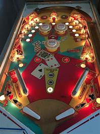
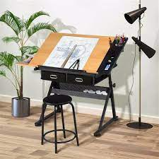

= step 2 - Lesson 13
:toc: left
:toclevels: 3
:sectnums:
:stylesheet: ../../+ 000 eng选/美国高中历史教材 American History ： From Pre-Columbian to the New Millennium/myAdocCss.css

'''

https:kekenet.comArticle201603432886.shtml

Lesson 13

== 1

Lesley: Ah ... it's such a lovely day. It reminds me of last week, doesn't it you? +
Fiona: Oh don't! I mean that was just so fantastic  极好的；了不起的, that holiday! +
Lesley: I love that city, you know. +
Fiona: I do too. Really, it's got something about it, a certain sort of charm 魅力；魔力；吸引力 ... +
Lesley: Mm, and all that wine and good food ... +
Fiona: And so cheap. Right, I mean, compared to here ... +
Lesley: Yes, although the shops are expensive. +
Fiona: Mm, yes. +
Lesley: I mean, really I bought nothing at all. I just ate and ate and drank and drank. +
Fiona: I know. Wasn't that lovely? +
Lesley: Yes, and I, I go there. I like listening to the people talking, sitting outside drinking wine. +
Fiona: Yes. Could you understand what they were saying? When they were speaking quickly, I mean. +
Lesley: Well, it is difficult, of course. And then I liked that tower, too. +
Fiona: You liked that tower? I'm not sure about it, really. (No) It's very unusual, right in the centre of the city. +
Lesley: True, but there's a lovely view from the top. +
Fiona: Oh, you went right up, didn't you? (Mm, yes) Oh no, I didn't. +
Lesley: Of course you didn't. +
Fiona: I remember that day. We weren't together. +
Lesley: No, that's right. (Mm) You went down by the river, didn't you? +
Fiona: That's it. Oh, walking along the river and all the couples (Yes) and it's so romantic ... (Is it true) and the paintings too ... +
Lesley: They do have artists down by the river, do they? (Yes) Oh, how lovely! +
Fiona: Oh, it really is super (a.) 顶好的；超级的；顶呱呱的. +
Lesley: Yes. Oh, I think we ought to go back there again next year, don't you? +
Fiona: I do, yes. (Mm) If only just to sample (v.)尝；品尝；尝试；体验 some more of the wine. +
Lesley: It'd be lovely, wouldn't it? +
Fiona: Yes.

[.my2]
====
莱斯利：啊……这是多么美好的一天。这让我想起了上周，不是吗？ +
菲奥娜：哦，不要！我的意思是，那个假期真是太棒了！ +
莱斯利：我喜欢那个城市，你知道。 +
菲奥娜：我也是。真的，它有它的一些东西，某种魅力……​ +
莱斯利：嗯，还有所有的酒和美食……​ +
菲奥娜：而且这么便宜。是的，我的意思是，与这里相比……​ +
莱斯利：是的，虽然商店里的东西很贵。 +
菲奥娜：嗯，是的。 +
莱斯利：我的意思是，我真的什么都没买。我只是吃啊吃啊喝啊喝。 +
菲奥娜：我知道。那不是很可爱吗？ +
莱斯利：是的，我，我去那里。我喜欢听人们说话，坐在外面喝酒。 +
菲奥娜：是的。你能听懂他们在说什么吗？我是说，当他们说话很快时。 +
莱斯利：嗯，这当然很困难。然后我也喜欢那座塔。 +
菲奥娜：你喜欢那座塔吗？我真的不确定。 （不）这很不寻常，就在市中心。 +
莱斯利：是的，但是从上面看风景很美。 +
菲奥娜：哦，你就上去了，不是吗？ （嗯，是的）哦不，我没有。 +
莱斯利：你当然没有。 +
菲奥娜：我记得那天。我们没有在一起。 +
莱斯利：不，没错。 （嗯）你是从河边下去的吧？ +
菲奥娜：就是这样。哦，沿着河边散步，还有所有的情侣（是的），真是太浪漫了……​（是真的吗）还有画作……​ +
莱斯利：河边确实有艺术家，是吗？ （是）噢，多么可爱啊！ +
菲奥娜：哦，真的太棒了。 +
莱斯利：是的。哦，我想我们明年应该再去那里，不是吗？ +
菲奥娜：我愿意，是的。 （嗯）如果只是为了多尝一些酒就好了。 +
莱斯利：那会很可爱，不是吗？ +
菲奥娜：是的。

====

---

== 2

(Doorbell rings.)

Peter: Hello, John. Nice to see you. Come in. How are you?

John: Fine, thanks. Peter. And how are you? I expect your patients 病人（尤指医院里的） are keeping you busy at this time of year?

Peter: Ah, well. I can't really complain. Let me take your coat. There we are. Well, now, I don't think you've met Ann Patterson, have you? Ann, this is John Middleton. He's the local schoolteacher.

Ann: Oh! How do you do?

John: How do you do?

Ann: Well, that's very interesting. Perhaps you'll be looking after my son.

Peter: Yes, that's right. Ann and her family have just moved into the old barn  简陋的大建筑物;（公共汽车、卡车等的）车库, up by the village hall 礼堂；大厅. They're in the process of doing it up 〈口〉彻底做好(某事),把(事情)干得漂亮,很好地完成  now.

[.my1]
====
.barn
image:../img/barn.jpg[,10%]
====

Ann: Yes, `主` there's an awful 非常的；很多的；过多的 lot `谓` needs doing, of course.

(Doorbell rings.)

Peter: Er, please excuse me for a moment. I think that was the doorbell.

John: Well, if I can give you a hand with anything ... I'm something of a handyman 善于做室内外杂活的人；杂活工 in my spare time, you know. I live just over the road.

Ann: That's very kind of you. I'm an architect  建筑师 myself, so ... Oh, look! There's someone I know, Eileen!

Eileen: Ann, fancy （表示惊奇或震惊）真想不到，竟然 seeing you here! How's life? 最近怎么样

Ann: Oh, mustn't grumble 咕哝；嘟囔；发牢骚. Moving's never much fun though (（用于主句后，引出补充说明，使语气变弱）不过，可是，然而) 搬家从来都不是一件有趣的事, is it? Anyway, how are things with you? You're still at the same estate agent's. I suppose?

Eileen: Oh yes. I can't see myself leaving, well, not in the foreseeable 可预料的；可预见的；可预知的 future.

Ann: Oh, I quite forgot. Do you two know each other?

John: Yes, actually, we've met on many an occasion. Hello, Eileen. You see, we play in the same orchestra 管弦乐队.

[.my1]
====
.many aan = a large number of 许多
on many an occasion = on several occasions：  屡次, 好几次 +
many a : ( formal ) used with a singular noun and verb to mean ‘a large number of' （与单数名词及动词连用）许多，大量 +
- Many a good man has been destroyed by drink. 许多好人都毁在了饮酒上。
====

Ann: Oh, really? I didn't know anything about that.

Eileen: Yes, actually, just amateur 业余爱好的 stuff, you know — once a week — I come down from London when I can get a baby-sitter 临时替人看小孩者;临时保姆 for Joanna.

Paul: Er ... excuse me, I hope you don't mind my butting in 插嘴；打断说话. My name's Paul Madison. I couldn't help overhearing 无意中听到 what you said about an orchestra.

John: Come and join the party. I'm John Middleton. This is Ann Patterson and Eileen ... or ... I'm terribly sorry. I don't think I know your surname 姓?

Eileen: Hawkes. Pleased to meet you, Paul. You play an instrument, do you?

Paul: Yes, I'm over here on a scholarship 奖学金 to study the bassoon 大管；巴松管 (loud yawn 打哈欠 from Ann) at the Royal Academy of Music for a couple of years.

Ann: Oh, I am sorry. It must be all that hard work on the barn ...

Paul: Well, anyway ...

[.my2]
====
（门铃响了。） +
彼得：你好，约翰。很高兴见到你。进来吧，你好吗？ +
约翰：好的，谢谢。彼得.你好吗？我想每年的这个时候你的病人都会让你很忙吧？ +
彼得：啊，好吧。我真的没什么可抱怨的。让我拿你的外套。我们到了。好吧，现在，我想你还没见过安·帕特森，是吗？安，这是约翰·米德尔顿。他是当地的学校老师。 +
安：哦！你好吗？ +
约翰：你好吗？ +
安：嗯，这很有趣。也许你会照顾我的儿子。 +
彼得：是的，没错。安和她的家人刚刚搬进村公所旁边的旧谷仓。他们现在正在做这件事。 +
安：是的，当然，还有很多事情需要做。 +

（门铃响了。） +
彼得：呃，请原谅我一下。我想那是门铃。 +
约翰：好吧，如果我可以帮你做任何事……​你知道，我在业余时间是个勤杂工。我住在马路对面。 +
安：你真是太好了。我自己就是一名建筑师，所以……哦，看！我认识一个人，艾琳！ +
艾琳：安，很高兴在这里见到你！最近怎么样？ +
安：噢，别发牢骚。不过，搬家从来都不是一件有趣的事，不是吗？不管怎样，你怎么样？你们仍然在同一个房地产经纪人那里。我想？ +
艾琳：哦，是的。我看不到自己离开，嗯，在可预见的未来。 +
安：哦，我差点忘了。你们两个认识吗？ +
约翰：是的，实际上，我们见过很多次。你好，艾琳。你看，我们在同一个管弦乐队里演奏。 +
安：哦，真的吗？我对此一无所知。 +
艾琳：是的，实际上，只是业余的东西，你知道——每周一次——当我能为乔安娜找个保姆时，我会从伦敦过来。 +
保罗：呃……对不起，我希望你不介意我插话。我叫保罗·麦迪逊。我无意中听到了你所说的关于管弦乐队的事情。 +
约翰：来参加聚会吧。我是约翰·米德尔顿。这是安·帕特森和艾琳……或者……我非常抱歉。我想我不知道你姓什么？ +
艾琳：霍克斯。很高兴认识你，保罗。你会演奏乐器吗？ +
保罗：是的，我拿着奖学金来到这里，在皇家音乐学院学习巴松管（安大声打哈欠）几年。 +
安：哦，对不起。谷仓里的工作一定很辛苦……​ +
保罗：好吧，无论如何……​

====

---

== 3

First speaker: 

I'm a night person 夜猫子（熬夜的人）. I love the hours, you know? I like going to work at around six at night and then getting home at two or three in the morning. I like being out around people, you know, talking to them, listening to their problems. 

Some of my regulars  常客；老主顾 are always on the lookout  监视员；观察员；瞭望员 for ways that they can stump 把…难住；难倒 me. Like last week, one of them came in and asked for a Ramos gin 杜松子酒 fizz （液体中的）气泡;（液体中的）气泡嘶嘶声，嘶嘶声；噼啪声;起泡饮料（尤指香槟）. He didn't think I knew how to make it. Hah! But I know how to make every drink in the book, and then some 而且还远不止此. 

Although some of the nights when I go in I just don't feel like dealing with all the noise. When I get in a big crowd it can be pretty noisy. People talking, the sound system  音响系统 blaring 发出（响亮而刺耳的声音）, the pinball 弹球游戏 machine, the video games. And then at the end of the night you don't always smell so good, either. You smell like cigarettes. But I like the place and I plan on 打算；期待 sticking around 不走开；待在原地 for a while.

[.my1]
====
.pinball

.plan ~ (on sthon doing sth)
to intend or expect to do sth 打算；期待
====

[.my2]
====
+

第一位演讲者：我是一个夜猫子。我喜欢这些时间，你知道吗？我喜欢在晚上六点左右上班，然后在凌晨两三点回家。我喜欢和人们在一起，和他们交谈，倾听他们的问题。我的一些常客总是在寻找可以难倒我的方法。和上周一样，其中一人进来要了一杯拉莫斯杜松子酒。他不认为我知道如何做到这一点。哈！但我知道如何制作书中的每一杯饮料，然后是一些。虽然有些晚上我进去的时候，我只是不想处理所有的噪音。当我进入一大群人时，可能会很吵。人们交谈，音响系统发出刺耳的声音，弹球机，视频游戏。然后在晚上结束时，你也并不总是闻起来那么好闻。你闻起来像香烟。但我喜欢这个地方，我打算在这里呆一段时间。
====

Second speaker: 

If I had to sit behind a desk all day, I'd go crazy! I'm really glad I have a job where I can keep moving, you know? My favourite part is picking out 精心挑选;（不用乐谱）慢慢地弹奏（乐曲）;（经仔细研究）找出，认识到 the music — I use new music for every ten-week session 一场；一节；一段时间. For my last class I always use the Beatles 披头士合唱（摇滚乐队）— it's a great beat  （音乐、诗歌等的）主节奏，节拍 to move to 使感动；打动, and everybody loves them. 

I like to sort of educate people about their bodies, and show them, you know, how to do the exercises and movements safely. Like, it just kills me when I see people trying to do situps 仰卧起坐 with straight legs — it' so bad for your back! And …​ let's see …​ I — I like to see people make progress — at the end of a session you can really see how people have slimmed （靠节食等）变苗条，减肥 down and sort of built up some muscle — it's very gratifying 令人高兴的；使人满意的.

[.my1]
====
.pick sbsth←→ˈout
(1) to choose sbsth carefully from a group of people or things 精心挑选 +
SYN select +
• She was picked out from dozens of applicants for the job. 她从大批的求职者中被选中承担这项工作。 +
• He picked out the ripest peach for me. 他给我挑了个熟透了的桃子。

(2) to recognize sbsth from among other people or things 认出来；辨别出 +
• See if you can pick me out in this photo. 看你能不能把我从这张照片上认出来。 

——note at identify

.pick sth←→ˈout +
(1) to play a tune on a musical instrument slowly without using written music （不用乐谱）慢慢地弹奏（乐曲） +
- He picked out the tune on the piano with one finger. 他凭记忆用一个手指在钢琴上慢慢弹出了那支曲子。

(2) to discover or recognize sth after careful study （经仔细研究）找出，认识到 +
- Read the play again and pick out the major themes. 请重读剧本，把主题找出来。

(3) to make sth easy to see or hear 使显著；使容易看见（或听见） +
- a sign painted cream, with the lettering picked out in black 印着醒目黑字的乳白色标牌

.move (v.) ~ sb (to sth) :
to cause sb to have strong feelings, especially of sympathy or sadness 使感动；打动 +
- We were deeply moved by her plight. 她的困境深深地打动了我们。 +
- Grown men were moved to tears at the horrific scenes. 这样悲惨的场面, 甚至让铮铮男子潸然泪下。
====

[.my2]
====
+

第二位演讲者：如果我不得不整天坐在桌子后面，我会发疯的！我真的很高兴我有一份可以继续前进的工作，你知道吗？我最喜欢的部分是挑选音乐——我每十周使用一次新音乐。在我的最后一堂课上，我总是使用披头士乐队——这是一个很棒的节拍，每个人都喜欢它们。我喜欢教育人们了解他们的身体，并向他们展示，你知道，如何安全地进行锻炼和运动。就像，当我看到人们试图用直腿做仰卧起坐时，它简直要了我的命——这对你的背部太糟糕了！和。。。我看看。。。我——我喜欢看到人们取得进步——在会议结束时，你真的可以看到人们是如何瘦下来的，并建立了一些肌肉——这是非常令人欣慰的。
====

`主` #The part# 后定向前推进 I don't like  `系` #is#, well, it's hard to keep coming up with 找到（答案）；拿出（一笔钱等） new ideas for classes. I mean, you know, there are just so many ways you can move your body, and it's hard to keep coming up with interesting routines （演出中的）一套动作，一系列笑话（等） and …​ and new exercises. And it's hard on my voice — I have to yell (v.)叫喊；大喊；吼叫 all the time so people can hear me above the music, and like after three classes in one day my voice has had 情形很糟；不能修复 it. Then again, `主` having three classes in one day `谓` has its compensations 补偿（或赔偿）物 — I can eat just about anything I want and not gain any weight!

[.my2]
我不喜欢的部分是，很难不断地为课程提出新的想法。我的意思是，你知道，有很多方法可以让你的身体运动，很难一直想出有趣的套路和新的锻炼方法。这对我的声音来说很困难——我必须一直大喊大叫，这样人们才能在音乐的噪音中听到我的声音，就像一天上了三节课一样，我的声音已经不行了。再说一次，一天上三节课也有它的补偿——我可以吃任何我想吃的东西，而且不会增加任何体重!

[.my1]
.案例
====
.come ˈup with sth
[ no passive]to find or produce an answer, a sum of money, etc.找到（答案）；拿出（一笔钱等） +
• She came up with a new idea for increasing sales. 她想出了增加销售量的一个新招儿。 +
• How soon can you come up with the money? 你什么时候能拿出这笔钱？

.have ˈhad it
( informal ) +
(1) to be in a very bad condition; to be unable to be repaired情形很糟；不能修复 +
• The car had had it. 这辆车无法修复了。

(2) to be extremely tired 极度疲乏 +
• I've had it! I'm going to bed. 我太困了！我要去睡觉了。

(3) to have lost all chance of surviving sth 毫无幸存机会；完蛋 +
• When the truck smashed into me, I thought I'd had it. 那辆卡车撞上我时，我想这下完了。

(4) to be going to experience sth unpleasant 将吃苦头 +
• Dad saw you scratch the car—you've had it now!爸爸看见你把车身划了—这下可有你好受的了！

(5) to be unable to accept a situation any longer 无法继续容忍 +
• I've had it (up to here) with him —he's done it once too often.我受够他了—他这一次太过分了。
====

Third speaker: What do I like about my job? Money. M-O-N-E-Y. No, I like the creativity, and I like my studio. All my tools are like toys to me — you know, my watercolours, pen and inks, coloured pencils, drafting table — I love playing with them. and I have lots of different kinds of clients — I do magazines, book covers, album covers, newspaper articles — so there's lots of variety, which I like. You know, sometimes when I start working on a project I could be doing it for hours and have no conception of how much time has gone by — what some people call a flow experience 心流体验. I don't like the pressure, though, and there's plenty of it in this business. You're always working against a tight deadline. And I don't like the business end of it — you know, contacting 接触；接洽联络 clients for work, negotiating contracts, which get long and complicated.

[.my2]
第三个说话者:我喜欢我的工作的哪一点?钱。M-O-N-E-Y。不，我喜欢创意，我喜欢我的工作室。我所有的工具对我来说都像玩具一样——你知道，我的水彩画、钢笔和墨水、彩色铅笔、绘图桌——我喜欢玩它们。我有很多不同类型的客户——我做杂志封面、书籍封面、专辑封面、报纸文章——所以有很多种类，我喜欢这些。你知道，有时当我开始做一个项目时，我可能会做几个小时，并且不知道有多少时间过去了——有些人称之为心流体验。但我不喜欢压力，而这一行压力太多了。你总是在紧迫的期限前工作。而且我不喜欢它的业务端——你知道，为工作联系客户，谈判合同，这些都变得又长又复杂。

[.my1]
.案例
====
.drafting table

====

Fourth speaker: Well, I'll tell you. At first it was fun, because there was so much to learn, and working with figures and money was interesting. But after about two years the thrill 震颤感；兴奋感 was gone, and now it's very routine 常规的；例行公事的;乏味的；平淡的. I keep the books 记账, do the payroll 工资名单;（公司的）工资总支出, pay the taxes, pay the insurance, pay the bills. I hate paying the bills, because there's never enough money to pay them! I also don't like the pressure of having to remember when all the bills and taxes are due (a.)到期;应支付；应给予. And my job requires a lot of reading that I don't particularly enjoy. I can have to keep up [to date 迄今，到现在为止] on all the latest tax forms, and it's pretty dull. I like it when we're making money, though, because I get to see all of my efforts rewarded.

[.my2]
第四位发言者:我来告诉你们。一开始很有趣，因为有很多东西要学，和数字和钱打交道很有趣。但大约两年后，这种兴奋感消失了，现在这已经很平常了。我记账，发工资，缴税，付保险，付账单。我讨厌付账单，因为我总是没有足够的钱来付账单!我也不喜欢记住所有的账单和税款什么时候到期的压力。我的工作需要大量的阅读，我不是特别喜欢。我可能不得不跟上所有最新的纳税表格，这很无聊。我喜欢我们赚钱的时候，因为我看到我所有的努力都得到了回报。

---

== 4

TV Interviewer: In this week's edition （报纸、杂志的）一份；（广播、电视节目的）一期，一辑 of 'Up with People' we went out into the streets and asked a number of people a question they just didn't expect. We asked them to be self-critical …​ to ask themselves exactly what they thought they lacked or — the other side of the coin — what virtues 优点；长处 they had. Here is what we heard.

[.my2]
电视采访者:在本周的“与人同行”节目中，我们走上街头，问了一些人一个他们没想到的问题。我们要求他们进行自我批评，问自己到底觉得自己缺少什么，或者反过来问自己有什么优点。以下是我们听到的。

[.my1]
.案例
====
.up with
“up with”通常用于表示跟上或了解某种情况或趋势，也可以用于表示跟随某人或某事物。 +
跟上某种情况或趋势：keep up with +
跟随某人或某事物：up with
====

Jane Smith: Well …​ I …​ I don't know really …​ it's not the sort of question you ask yourself directly. I know I'm good at my job …​ at least my boss calls me hard-working, conscientious 勤勉认真的；一丝不苟的, efficient. I'm a secretary by the way. As for when I look at myself in a mirror as it were …​ you know …​ you sometimes do in the privacy of your own bedroom …​ or at your reflection in the …​ in the shop windows as you walk up the street …​ Well …​ then I see someone a bit different. Yes …​ I'm different in my private life. And that's probably my main fault I should say …​ I'm not exactly — oh how shall I say? — I suppose （根据所知）认为，推断，料想 I'm, not coherent in my behaviour. My office is always in order …​but my flat! Well…​you'd have to see it to believe it.

[.my2]
简·史密斯:嗯，我真的不知道，这不是你直接问自己的问题。我知道我很擅长我的工作，至少我的老板说我勤奋、认真、高效。顺便说一下，我是个秘书。当我对着镜子看自己的时候，你知道，有时候你会在自己的卧室里私下照镜子，或者当你走在街上时看着商店橱窗里的自己，然后我看到了一个有点不同的人。是的，我的私生活和别人不一样。这可能是我的主要缺点，我应该说，我不完全，哦，我该怎么说呢?-我想我的行为是不连贯的。我的办公室总是井井有条，但是我的公寓!嗯，你得亲眼看到才会相信。

Chris Bonner: I think the question is irrelevant 无关紧要的；不相关的. You shouldn't be asking what I think of myself …​ but what I think of the state of this country. And this country is in a terrible mess. There's only one hope for it — the National Front. It's law and order that we need. I say get rid of these thugs 恶棍；暴徒；罪犯 who call themselves Socialist Workers …​ get rid of them I say. So don't ask about me. I'm the sort of ordinary 普通的；平常的 decent 正派的；公平的；合乎礼节的 person who wants to bring law and order back to this country. And if we can't do it by peaceful means then …​

[.my2]
克里斯·邦纳:我认为这个问题无关紧要。你不应该问我怎么看自己，而应该问我怎么看这个国家。而这个国家正处于可怕的混乱之中。只有一个希望，那就是国民阵线。我们需要的是法律和秩序。我说除掉这些自称社会主义工人的暴徒…除掉他们。所以别问我。我是那种想让这个国家恢复法律和秩序的普通正派人。如果我们不能以和平的方式解决，那么……

[.my1]
.案例
====
.ˌNational ˈFrontn. 
[ sing.+sing.pl.v.](in Britain) a small political party with extreme views, especially on issues connected with race（英国）民族阵线
====

Tommy Finch: Think of myself? Well I'm an easy-going 悠闲的；随和的；不慌不忙的 bloke 人；家伙 really …​ unless of course you wind 惹…生气；戏弄;给（钟表等）上发条 me up. Then I'm a bit vicious 狂暴的；残酷的;充满仇恨的；严厉的. You know. I mean you have to live for yourself don't you. And think of your mates. That's what makes a bloke. I ain't 不是,没有 got much sympathy like with them what's always thinking of causes （支持或为之奋斗的）事业，目标，思想 …​ civil rights and all that. I mean …​ this is a free country  innit （即isn't it）是否，是不是? What do we want to fight for civil rights for? We've got them.

[.my2]
汤米·芬奇:想想我自己?嗯，我是一个很随和的人，当然，除非你给我发条。那我就有点恶毒了。你知道的。我是说你必须为自己而活，不是吗?想想你的伙伴们。这才是真正的男子汉。我不像他们那样同情他们，他们总是想着民权之类的事情。我是说，这是一个自由的国家，不是吗? 我们为什么要争取民权?我们已经得到它们了。

[.my1]
.案例
====
.bloke
( BrE informal ) a man人；家伙 +
-> 可能来自block的变体，指大块头的家伙。

.ain't
1.am notis notare not不是 +
• Things ain't what they used to be.现在情况不比从前了。

2.has nothave not没有 +
• I ain't got no money.我没有钱。 +
• You ain't seen nothing yet.你什么都还没有看到。

IF IT AIN'T BROKE, DON'T ˈFIX IT +
( informal ) used to say that if sth works well enough, it should not be changed未损勿修；能用莫换
====

Charles Dimmak: Well …​ I'm retired you know. Used to be an army officer. And …​ I think I've kept myself …​ yes I've kept myself respectable 体面的；得体的；值得尊敬的 — that's the word I'd use — respectable and dignified the whole of my life. I've tried to help those who depended on me. I've done my best. Perhaps you might consider me a bit of a fanatic (n.)入迷者;极端分子；狂热信徒 about organization and discipline — self-discipline comes first 更重要，排在第一位 — and all that sort of thing 以及诸如此类的事情. But basically I'm a good chap （对男子的友好称呼）家伙，伙计 …​ not too polemic (n.)激烈争论；辩论文章；论战;辩论术；辩论法 …​ fond (a.)喜爱（尤指认识已久的人） of my wife and family …​ That's me.

[.my2]
查尔斯·迪马克:嗯……你知道，我退休了。曾经是一名军官。而且……我想我一直保持着自己……是的，我一直保持着自己的体面——这是我要用的词——一辈子都保持着体面和尊严。我试图帮助那些依赖我的人。我已经尽力了。也许你会认为我对组织和纪律有点狂热——自律是第一位的——诸如此类的事情。但基本上我是个好人，不太爱争论，爱我的妻子和家人，这就是我。

Arthur Fuller: Well …​ when I was young I was very shy. At times 有时候 I …​ I was very unhappy …​ especially when I was sent to boarding-school 寄宿学校 at seven. I didn't make close friends till …​ till quite late in life …​ till I was about …​ what …​ fifteen. Then I became quite good at being by myself. I had no one to rely on …​ and no one to ask for advice. That made me independent …​ and I've always solved my problems myself. My wife and I have two sons. We …​ we didn't want an only child because I felt …​ well I felt I'd missed a lot of things.

[.my2]
阿瑟·富勒:嗯……我小时候很害羞。有时我……我很不开心……尤其是当我七岁被送到寄宿学校的时候。直到很晚的时候，我才交到了亲密的朋友，大概是15岁吧。然后我变得很擅长独处。我没有人可以依靠，也没有人可以向我征求意见。这让我变得独立，而且我总是自己解决问题。我和妻子有两个儿子。我们不想要独生子，因为我觉得我错过了很多东西。

---

== 5

Bert is a natural listener. He can lose himself in 沉浸于,失去自我 conversation with friends or family. Bert has a few very close friends, and he works hard to keep his friendships strong.

[.my2]
伯特是一个天生的倾听者。他可能会在与朋友或家人的交谈中迷失自我。伯特有几个非常亲密的朋友，他努力保持他的友谊牢固。

One means of contact with friends `系`  is the regular exercise that Bert gets. He plays handball 手球 and swims with a friend twice every week. Besides that, he tries to stay in shape 保持身材 with morning exercises. Bert enjoys the exercise that he gets for its own sake 为了自己的利益 as well as 和，以及 for the fact that it has kept him healthy all his life.

[.my2]
伯特与朋友联系的一种方式是定期锻炼。他每周两次与朋友一起打手球和游泳。除此之外，他还试图通过晨练来保持身材。伯特喜欢这种锻炼，因为锻炼本身就是为了锻炼，也因为它让他一生都保持健康。

[.my1]
.案例
====
.handball

====

In general, Adam has very few hobbies. He used to enjoy collecting coins and reading, but now can never find enough time. He has practically no release (n.)释放；获释 from his job and usually brings some work home with him.

[.my2]
一般来说，亚当的爱好很少。他曾经喜欢收集硬币和阅读，但现在再也找不到足够的时间了。他几乎没有从工作中解脱出来，通常会把一些工作带回家。

Like many modern Americans, neither 两者都不 man is very religious (a.)虔诚的; 笃信宗教的. Both belong to a church, but the religious services 宗教仪式 are not a sustaining part of their lives. But the difference in their spiritual makeup 构造; 组成;天性，性格 is nonetheless然而，尽管如此  remarkable 非凡的；奇异的；显著的；引人注目的.

[.my2]
像许多现代美国人一样，两人都不是很虔诚。两人都属于教会，但宗教仪式并不是他们生活的一部分。但是，他们精神构成的差异仍然显着。

[.my1]
.案例
====
.remarkable
(a.) ~ (for sth) ~ (that...) : unusual or surprising in a way that causes people to take notice 非凡的；奇异的；显著的；引人注目的
====

Adam does not enjoy much self-confidence. He has never spent the time to think problems through carefully or to teach himself to think about other things. As a result, he is not a particularly creative problem solver. He spends quite a lot of time in compulsive 难以制止的；难控制的, repetitive 多次重复的,重复乏味的 nervous activity which only frustrates 使沮丧，使懊恼；挫败 him more.

[.my2]
亚当没有太多的自信。他从来没有花时间仔细思考问题，也没有自学去思考其他事情。因此，他不是一个特别有创造力的问题解决者。他花了很多时间在强迫性、重复性的神经活动中，这只会让他更加沮丧。

`主` Heart attack victims who have tried to change their behaviour after their first heart attack `谓` report that Type B behaviour has given them a new sense of peace, freedom, and happiness. Not for anything in the world would they return to their old lifestyle, which held them trapped (v.)使落入险境；使陷入困境 like prisoners in an unhappy world of their own making.

[.my2]
心脏病发作患者在第一次心脏病发作后, 试图改变自己的行为，他们报告说，B型行为给了他们一种新的和平、自由和幸福感。他们不会因为世界上的任何事情而回到他们过去的生活方式，这种生活方式将他们像囚犯一样困在他们自己创造的不快乐世界中。

---
