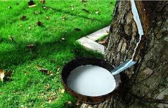
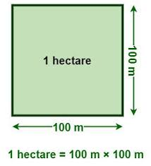
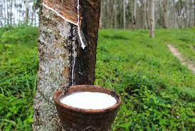

= step 2 - Lesson 26
:toc: left
:toclevels: 3
:sectnums:
:stylesheet: ../../+ 000 eng选/美国高中历史教材 American History ： From Pre-Columbian to the New Millennium/myAdocCss.css

'''

Lesson 26

== part 1. 部分

Interest in sport in Britain is widespread, as is indicated (v.)表明；显示 by the huge crowds which attend such occasions as _the Football Association Cup Final_ 足协杯决赛 at Wembley Stadium 体育场, international _rugby 英式橄榄球 matches_ at Twickenham, Murrayfield or Cardiff Arms Park, the Wimbledon _Lawn 草坪，草地 Tennis Championships_ 锦标赛 and so on.

[.my1]
.案例
====
.rugby

====

#Not only# do millions watch (v.) these matches on television #but# there is #also# growing enthusiasm for _active participation_ 积极参与 in _sport and recreation_ 娱乐；消遣 in the country as a whole.

People find (v.) they have more free time [on their hands] nowadays, so there is a duty on the part of government 政府方面 to make opportunities and facilities 设施；设备 available.  +
Apart from _the professional side_ of it, there is increasing enthusiasm for _amateur sport_ 业余体育，业余运动, which has led to a growth in interest in ① climbing, ② rambling, ③ boating 划船 and other water-based sports, as well as ④ _keep fit_ 健身, and ⑤ _movement （身体部位的）运动，转动，活动 and dance activities_.

[.my2]
英国人对体育运动的兴趣广泛存在，从大量观众观看在温布利体育场举行的足协杯决赛、在特威克纳姆、默里菲尔德, 或卡迪夫阿姆斯公园举行的国际橄榄球比赛、温布尔登草地网球锦标赛等活动中, 可以看出这一点。数百万人不仅通过电视观看这些比赛，而且整个国家积极参与体育和娱乐活动的热情, 也日益高涨。人们发现, 现在他们有更多的空闲时间，因此政府有责任提供机会和设施。除了专业方面之外，人们对业余运动的热情也日益高涨，这导致人们对攀岩、漫步、划船和其他水上运动, 以及健身、运动和舞蹈活动的兴趣, 与日俱增。

Probably the most popular spectator （尤指体育比赛的）观看者，观众 sport is _Association 协会；社团；联盟 Football_, which dates (v.) back to the nineteenth century and is controlled by separate football associations in England, Wales, Scotland and Northern Ireland.

There are well 很；相当；大大地；远远地 over 400 clubs affiliated (a.)隶属的 #to# the English Football Association or FA and some 37,000 clubs #to# regional or district associations.

The main clubs in England and Wales belong to the Football League （体育运动队的）联合会，联赛, 92 in all, and the 38 Scottish clubs belong to the Scottish League.  +
They play (v.)  in _four divisions_ in England and three in Scotland.  +
During the football season, attendances 出席人数 total (v.)总数达，总计 some 27 million.

[.my2]
最受欢迎的观赏性运动, 可能是足球协会，它的历史可以追溯到十九世纪，由英格兰、威尔士、苏格兰和北爱尔兰各自的足球协会控制。英国足球协会 (English Football Association) 或英足总 (FA) 旗下, 有超过 400 个俱乐部，地区协会 (Regional Association) 则有约 37,000 个俱乐部。英格兰和威尔士的主要俱乐部, 属于足球联盟，共有92个俱乐部，而苏格兰的38个俱乐部, 属于苏格兰联赛。他们在英格兰的四个分区, 和苏格兰的三个分区, 进行比赛。足球赛季期间，观众总数约为 2700 万人。

Local authorities provide (v.) facilities to cater (v.)（为社交活动）提供饮食，承办酒席 for 满足需要；适合 a wide range of indoor and outdoor activities; these include (v.) #such# things #as# _golf courses_ 高尔夫球场, _swimming pools_ and _leisure centres_.  +
`主` #Total expenditure# (n.)花费；消费；费用；开支 in the country as a whole on _sport_ and _outdoor recreation_ 娱乐；消遣 `谓`  #came to# well over ￡500 million last year.

[.my2]
地方当局提供设施, 以满足各种室内和室外活动的需要；其中包括高尔夫球场、游泳池, 和休闲中心等。去年，全国在体育和户外休闲方面的总支出, 远远超过 5 亿英镑。

[.my1]
.案例
====
.CATER FOR SBSTH
to provide the things that a particular person or situation needs or wants 满足需要；适合
====

Naturally, _publicly maintained schools_ 公立学校 `谓` have to provide by law for _the physical education_ 体育课；体育教育 of the pupils, and sometimes these facilities are also extended to the whole community for use [out of school hours].

[.my2]
当然，公立学校必须依法为学生提供"体育教育"，有时这些设施, 也扩展到整个社区,  供课外使用。

I’d like now to say a word or two about _water-based sports_.  +
Activities on canals, rivers, lakes and reservoirs 水库 `谓` are becoming increasingly popular and for this we must thank (v.) _the British Waterways Board_ 英国水道局,  `主` #which# as part of its work `谓` #maintains# (v.) 1760 km of _cruising 乘船游览；航行 waterways_ 巡航水道 for navigation 航行, about 960 km of other waterways and some 90 reservoirs.

[.my2]
现在我想谈谈水上运动。运河、河流、湖泊和水库上的活动, 越来越受欢迎，为此, 我们必须感谢"英国水道委员会"，作为其工作的一部分，该委员会维护着 1760 公里的巡航水道、约 960 公里的其他水道, 和约 90 座水库。

In addition to the facilities which are provided by local authorities, such as _the sports centres_ and _golf courses_ 后定 I mentioned earlier, we mustn’t forget the local _voluntary (a.)自愿的；志愿的；主动的 clubs_ such as rugby  英式橄榄球, cricket 蟋蟀；板球, tennis, golf and so on.

Some clubs are even attached to local businesses and cater (v.) for the needs of _a firm’s employees_, and in fact some companies are actively encouraging (v.) their staff to take advantage of 充分利用，利用 the facilities 后定  provided.

I’ve even heard of employees being given time off in the middle of the working day to do a little sport, a practice #which is#, I believe, #already quite popular# in the United States.

[.my2]
除了当地政府提供的设施，例如我之前提到的体育中心, 和高尔夫球场之外，我们也不能忘记当地的志愿俱乐部，例如橄榄球、板球、网球、高尔夫等。有些俱乐部甚至附属于当地企业，以满足公司员工的需求，事实上，有些公司正在积极鼓励员工利用所提供的设施。我什至听说过员工在工作日中间休息, 去做一点运动，我相信这种做法在美国已经很流行了。

'A healthy mind in a healthy body', as the saying 谚语，格言 goes, so perhaps this is what is in the minds of these employers.  +
This phrase `谓` of course applies (v.) very much to the young and, as I said before, all _publicly maintained schools_ must [by law] provide for _the physical education_ of their pupils. +
This covers (v.) gymnastics 体操, team games, athletics 田径运动, dancing and swimming.  +

Every school, except those solely 仅；只；唯；单独地 for infants 婴儿, must have a playing field, or the use of one, and most _secondary schools_ 中学 have their own gymnasium as well. +
Some have other amenities such as swimming pools, _sports halls_ 运动场馆 and halls 后定 designed for dance and movement.  +

_Sports and recreation facilities_ are likewise 同样地，类似地 provided (v.) at universities, `主` some of which `谓` have their own _physical education_ departments,  +
and there are _also so-called (a.)人称…的，号称…的 'centres of sporting excellence 优秀；杰出；卓越'_ at universities and other colleges 后定 enabling (v.)使能够；使有机会 selected (a.)挑选出来的 young athletes to develop their talents but which also provide for their educational needs 教育需求.

[.my2]
俗话说“健康的身体, 蕴藏着健康的思想”，也许这就是这些雇主的想法。这句话当然非常适用于年轻人，正如我之前所说，所有公立学校, 都必须依法为学生提供体育教育。其中包括体操、团队比赛、田径、舞蹈和游泳。每所学校，除了专门针对婴儿的学校外，都必须拥有或使用一个运动场，大多数中学也有自己的体育馆。有些还设有其他设施，例如游泳池、体育馆, 以及专为舞蹈和运动而设计的大厅。大学也提供体育和娱乐设施，其中一些大学有自己的体育系，大学和其他学院也有所谓的“卓越体育中心”，使选定的年轻运动员, 能够发展他们的才能，但也提供以满足他们的教育需求。

[.my1]
.案例
====
.athletics
1.( BrE ) ( NAmE also ˌtrack and ˈfield ) sports that people compete in, such as running and jumping 田径运动 +
2.( NAmE ) any sports that people compete in 体育运动

田径运动（Athletics），是指由走、跑、跳跃、投掷等运动项目, 及其由部分项目, 组成的全能运动项目的总称。

====

'''

== part 2. 部分

Chairperson: Good evening ladies and gentlemen. It’s nice to see so many of you here. Well, I’d like to introduce our two guests this evening: Mr. Andrew Frobisher, who has spent many years in Malaysia in the 1950s and 60s and knows the country very well indeed. And, on my right, Dr. Harry Benson who’s an agricultural economist.

[.my2]
主席：女士们先生们晚上好。很高兴在这里见到这么多人。那么，我想介绍今晚的两位嘉宾：Andrew Frobisher 先生，他在 20 世纪 50 年代和 60 年代的马来西亚, 生活了很多年，对这个国家非常了解。在我右边的是农业经济学家哈里·本森博士。

Benson: Good evening.  +
Frobisher: Good evening.

Chairperson: Well, erm …​ the purpose of this evening is to find out more about that fascinating substance, rubber 橡胶, and _the effects_ 后定 that it has [on that fascinating country, Malaysia]. Erm erm …​ I believe erm …​ er Mr. Frobisher, erm …​ that Malaysia is [at the same time] an extremely rich and rather poor country. Erm …​ how is this possible?

[.my2]
主席：嗯，嗯……今晚的目的, 是更多地了解"橡胶"这种迷人的物质，以及它对马来西亚这个迷人的国家的影响。呃呃…​我相信呃…​呃弗罗比舍先生，呃…​马来西亚同时是一个极其富裕, 而又相当贫穷的国家。呃……​这怎么可能？

Frobisher: Yes, well, that’s quite true, Monica. Malaysia’s population is by now over 12 million, and er _per head_ o …​ on paper 仅在理论上，仅从表面上看 `主` the citizens `系`  are richer than those of the UK. But …​

[.my2]
弗罗比舍：是的，嗯，确实如此，莫妮卡。马来西亚的人口目前已超过 1200 万，呃，按人均计算，公民比英国人还要富有。但是……​

Benson: But of course that wealth is not so evenly  平均地，均等地 distributed (v.)分发；分配. In fact in 1981, it was estimated that 37% of the population were below _the poverty line_ 贫穷线，贫困线 …​

[.my2]
本森：当然，财富的分配并不是那么均匀。事实上，在 1981 年，据估计 37% 的人口生活在贫困线以下……​

Frobisher: Yeah, well …​ whatever that means …​ and anyway shouldn’t it be, er, was below the poverty line.

[.my2]
弗罗比舍：是的，嗯……无论这意味着什么……无论如何，不​​应该是，呃，低于贫困线。

Benson: Yes, of course. Sorry, Andrew.

Frobisher: Yes, well, erm …​ as I was saying, er …​ much of Malaysia’s wealth is based (a.) on rubber. Now, I remember my planting days …​

[.my2]
弗罗比舍：是的，嗯……正如我所说，呃……马来西亚的大部分财富都基于橡胶。现在，我记得我的种植日子...

Benson: Yes, yes, yes yes you’re quite right there Andrew. Rubber represents (v.) about 20% of _the Gross National Product_ 国民生产总值 and 30% of _export earnings_. (Er yes I …​) This puts Malaysia in a very good position internationally since rubber is an example of what we might call a 'post-industrial 后工业化的 industry 行业'.

[.my2]
本森：是的，是的，是的，你说得很对，安德鲁。橡胶约占"国民生产总值"的20%, 和"出口收入"的30%。 （呃，是的，我……​）这使马来西亚在国际上处于非常有利的地位，因为橡胶是我们所谓的“后工业产业”的一个例子。

Frobisher: Well,  what do you mean by that? I …​

[.my2]
弗罗比舍：嗯，你这是什么意思？我……​

Chairperson: Er …​ excuse me …​ yes, what does that mean?

[.my2]
主席：呃……请问……是的，这是什么意思？

Frobisher: What is _a post-industrial erm …​ society_?

[.my2]
弗罗比舍：什么是后工业社会？

Benson: Most _manufacturing industries_ 制造业 are based on _fossil fuels_ 化石燃料, for example, coal and oil.  Now, the problem is that these will not last (v.) forever. They are finite (a.)有限的；有限制的. Sooner or late they will run out!  +

Now, rubber is a natural product. `主` The energy source 后定 involved (v.) in its creation `系` is sunlight. Now sunlight, we hope, will outlast (v.)比…持续时间长 coal and oil, and best of all, sunlight is free. So, it is much cheaper to produce (v.) natural rubber which [as we all know] comes from trees, #than# #to use (v.) up# all those _fossil fuels_, both as fuels and as raw materials, 状 #in making# _synthetic 合成的，人造的 rubber_ in factories.

Rubber is one of the world’s _strategic products_, so you can see what a good position Malaysia is in, and it would help if she could produce (v.) more …​

[.my2]
本森：大多数制造业, 都依赖"化石燃料"，例如煤炭和石油。现在，问题在于这些资源并不会永远存在。它们是有限的。迟早会耗尽！而"天然橡胶"是一种天然产品。其制造过程中涉及的能源来源是阳光(因为阳光能让橡胶树生长, 橡胶树再产生橡胶液)。现在，我们希望阳光会比煤炭和石油更持久，而且最重要的是，阳光是免费的。因此，生产"天然橡胶", 要比在工厂制造"合成橡胶"所需的所有"化石燃料"（无论是作为燃料还是原材料）要便宜得多，正如我们都知道的，橡胶来自树木。橡胶是世界上的战略性产品之一，所以你可以看到马来西亚处于多么有利的位置，如果她能生产更多的话…​

[.my1]
.案例
====
.rubber
橡胶可用来擦去铅笔字迹. 橡胶是橡胶工业的基本原料，广泛用于制造轮胎、胶管、胶带、电缆及其他各种橡胶制品。 +
在医疗卫生部门，手术用的手套、冰囊、海绵座垫等, 多是橡胶制品。 +
日常生活中, 雨衣、热水袋、松紧带、儿童玩具.

橡胶分为"天然橡胶"与"合成橡胶"二种。"天然橡胶"是从"橡胶树"、"橡胶草"等植物中提取"胶质"后, 加工制成. +

====

Chairperson: Er …​ well, what stands (v.)停滞；不流动；放着不动 in the way then?

[.my2]
主席：呃……那么，到底是什么阻碍了呢？

Frobisher: Ah. Well, well it’s the way they go about cultivating (v.)培养 it. You see, I remember in my day just after …​

[.my2]
弗罗比舍：啊。好吧，这就是他们培养它的方式。你看，我记得那天之后……​

Benson: Yes, most people have this image of _vast estates_ （通常指农村的）大片私有土地，庄园, centrally run (v.), but that’s just not the case, even if almost a quarter of the population is involved, one way and another, with the production of rubber …​

[.my2]
本森：是的，大多数人都有这样的印象：巨大的庄园，集中管理，但事实并非如此，即使近四分之一的人口以某种方式参与橡胶生产……​

Frobisher: Yeah well, that’s if you count (v.)把…算入；包括 the families …​

[.my2]
弗罗比舍：是的，如果你算上家庭的话……​

Nenson: Oh yes, yes, yes almost 3 million people are involved, but the picture is a very fragmented (a.)支离破碎的，分裂的 one. Do you realize that there are 2 million hectares 公顷 of land under _cultivation 开垦，耕作；栽培，种植 for rubber_ in Malaysia, but that 70% of this area is divided amongst small-holders — half a million of them — `主` who between them `谓` produce (v.) 60% of the country’s rubber?

[.my2]
Nenson：哦，是的，是的，是的，几乎有 300 万人参与其中，但情况非常分散。您是否意识到马来西亚有 200 万公顷的橡胶土地，但其中 70% 的土地, 都属于小农（其中有 50 万），他们生产了该国 60% 的橡胶？

[.my1]
.案例
====
.hectare
( abbr. ha) a unit for measuring an area of land; 10 000 square metres or about 2.5 acres公顷（土地丈量单位，等于1万平方米或约2.5英亩） +
-> hect-,百，are,公亩，100平方米，来自area.即公顷，1000平方米。 +

====

Frobisher: Well, there’s nothing wrong with that i …​ in terms of 就……而言；从……角度来看 _quality of life_, though I remember (yes, quite right …​) just after the war there was …​

[.my2]
弗罗比舍：嗯，就生活质量而言，我……没有任何问题，尽管我记得（是的，完全正确……）战后不久就有……​

Benson: Yes, quite right. But being a smallholder 小农；小佃农 does present problems. For example, when it comes to replacing (v.)更换；更新 old trees — you’ll know about this Andrew — and the average _useful life_ 有效寿命 of a rubber tree is about 30 years, (yes, yes,) this can cause (v.) financial problems for the small farmer.  +

The problem is being tackled 解决，处理，对付, however, by some very enlightened 开明的；有见识的；摆脱偏见的 _insurance schemes_ available to the small-holder which can give him help through the difficult years.  +
After all, the new trees take some years to mature and start (v.) producing rubber.

[.my2]
本森：是的，完全正确。但作为小农确实存在问题。例如，当谈到更换老树时——你会知道这个安德鲁——橡胶树的平均使用寿命约为 30 年，（是的，是的，）这可能会给小农带来经济问题。然而，这个问题正在通过一些非常开明的保险计划得到解决，这些保险计划可供小农户使用，可以帮助他们度过困难的岁月。毕竟，新树需要几年的时间才能成熟并开始生产橡胶。

Frobisher: Yes, indeed they do. I …​ I …​

[.my2]
弗罗比舍：是的，确实如此。我……​我……​

Benson: Look. I’ve got _an overhead projection_ 投影仪 here, which I think will be useful to make the various problems and their solutions clearer to us all.

[.my2]
本森：看。我这里有一个投影, 我认为这有助于让我们所有人更清楚地了解各种问题及其解决方案。

[.my1]
.案例
====
.overhead projection

====

Frobisher: Overhead projection. There wasn’t anything wrong with the blackboard in my time, you know …​

[.my2]
弗罗比舍：头顶投影。在我那个时代，黑板没有任何问题，你知道……​

Benson: No, but this is clearer and neater 更加整洁,整齐的；有序的 and up-to-date.  +
So, here you see ① _a summary_ 总结，概要 of _the position of rubber_ in Malaysia’s economy and here is the first problem, and ② the solution that has been found through these insurance schemes.

[.my2]
Benson：不，但是这样更清晰、更简洁并且是最新的。因此，在这里您可以看到橡胶在马来西亚经济中的地位的摘要，这是第一个问题，以及通过这些保险计划, 找到的解决方案。

Chairperson: Hm, yes, I see. That’s really very clear.

[.my2]
主席：嗯，是的，我明白了。这真的非常清楚。

Benson: Now for _the second_ and _really major problem_.

[.my2]
本森：现在来谈谈第二个, 也是非常主要的问题。

Frobisher: And may I ask what that is?

[.my2]
弗罗比舍：我可以问那是什么吗？

Benson: Boredom and fatigue.

[.my2]
本森：无聊和疲劳。

Frobisher: Boredom and fatigue? What?

[.my2]
弗罗比舍：无聊和疲劳？什么？

Chairperson: What do you mean by that?

[.my2]
主席：您这话是什么意思？

Benson: Well, as with so many societies, the young people are leaving the land for the cities, leaving no one behind to carry on 继续做，坚持干 their parents' business. The _root cause_ 根本原因 seems to be simply, boredom.  +
Rubber is just not that entertaining (a.)使人愉快的，娱乐性的 a product to be involved with. It is labour-intensive in the extreme 极度；极端；非常. Each tree on a plantation 种植园，种植场 has to be tapped (v.)在（树）上切口（导出液体）, by hand, every other day.

[.my2]
本森：嗯，就像许多社会一样，年轻人正在离开土地前往城市，没有人留下来继承父母的生意。根本原因似乎很简单，就是无聊。橡胶并不是一种令人感兴趣的产品。这是极端的劳动密集型。种植园里的每棵树都必须每隔一天手工采割一次。

Chairperson: Tapped?  +
Benson: Yes.  +
Forbisher: Yes, well, we …​

Benson: Yes. The trunk is cut and `主` the latex 乳胶；乳液 that comes out `谓` is collected in a cup. This is collected on the next day. 400 trees _per day_ is the average figure _per worker_, which means 800 trees under the care of each worker, ten hours a day.  +
Now, as I said previously, the main problem is that of (…的同类的那种东西事情) the boredom. The work is not only hard, it is also mind-blowingly 非常令人兴奋地；给人印象极深地；非常令人吃惊地 tedious 冗长的，单调乏味的.

[.my2]
本森：是的。树干被切开，流出的乳胶被收集在杯子里。这是第二天收集的。平均每个工人每天 400 棵树，这意味着每个工人每天 10 个小时照顾 800 棵树。现在，正如我之前所说，主要问题是无聊。这项工作不仅辛苦，而且还极其乏味。

[.my1]
.案例
====
.latex
1.a thick white liquid that is produced by some plants and trees, especially rubber trees. Latex becomes solid when exposed to air, and is used to make medical products. （天然）胶乳；（尤指橡胶树的）橡浆 +
• latex gloves 合成胶手套

2.an artificial substance similar to this that is used to make paints, glues, etc. 人工合成胶乳（用于制作油漆、黏合剂等）

.mind-blowing
(a.)( informal ) very exciting, impressive or surprising 非常令人兴奋的；给人印象极深的；非常令人吃惊的 +
•Watching your baby being born is a mind-blowing experience. 看你的孩子出生是一次非常难忘的经历。
====

'''

== part 3. 部分

Frobisher: So, ha …​ have you got any suggestions to make things more interesting for them?

[.my2]
弗罗比舍：那么，哈……您有什么建议, 可以让他们的事情变得更有趣吗？

Benson: Well, not so much me, but the Malaysians are doing some very good work in this field. One idea is to make the work on the plantations more varied, and profitable, by introducing other products which are compatible 兼容的；可共存的 with continuing to grow rubber trees.

[.my2]
本森：嗯，我没有很多建议，而是马来西亚人在这个领域做了一些非常好的工作。一种想法是, 通过引入与继续种植橡胶树相兼容的其他产品，使种植园的工作更加多样化、更加有利可图。

Chairperson: Yes for example?

Benson: Well, the most promising line （行进的）方向，路线；方位;路线；路径；渠道;方法；方式 seems to be to encourage (v.) small-holders to raise (v.)抚养；养育；培养 livestock 牲畜，家畜 which can live (v.) amongst 在…当中 the trees.

[.my2]
本森：嗯，最有希望的路线, 似乎是鼓励小农饲养可以生活在树林中的牲畜。

Frobisher: Yes, yes, I, I hear they’ve started trying raising (v.) chickens and turkeys.

[.my2]
弗罗比舍：是的，是的，我，我听说, 他们已经开始尝试饲养鸡和火鸡了。

Benson: Yes, yes, indeed. I have another OHP 投影仪 at this point.

[.my2]
本森：是的，是的，确实如此。此时我还有另一个 OHP。

[.my1]
.案例
====
.OHP
the abbreviation for 'overhead projector' 投影仪（全写为overhead projector）
====

Frobisher: Erm …​ OHP?

[.my2]
弗罗比舍：呃……​OHP？

Benson: Overhead projection …​
本森：头顶投影……​

Frobisher: Ah. 弗罗比舍：啊。

Benson: Anyway, you can see here the different types of animals that have been tried.  +
At first sight 乍一看；初看之下, chickens seemed ideal. After all, they did originate (v.)起源；发源；发端于 as _jungle birds_ 丛林鸟. However, hmm excuse me, so far the profits on chickens have proved disappointing.  +

The turkey 火鸡 seemed an excellent choice, since it could live (v.) amongst the tress living [very well] off 以食…为生 the seeds of the rubber trees, which lie (v.) scattered 散开；四散；使分散；驱散 all over _the forest floors_ （海等的）底；（森林等的）地面 and are put 使处于（某状态或情况） to no other use …​

[.my2]
本森：无论如何，你可以在这里看到已经尝试过的不同类型的动物。乍一看，鸡似乎很理想。毕竟，它们确实起源于丛林鸟类。然而，抱歉，到目前为止，鸡肉的利润令人失望。火鸡似乎是一个很好的选择，因为它可以生活在以"橡胶树种子"为食的树木中，这些种子散布在整个森林地面上，没有其他用途……​

[.my1]
.案例
====
.LIVE OFF SBSTH
( oftendisapproving) to receive the money you need to live from sbsth because you do not have any yourself靠…过活；依赖…生活 +
- to live off welfare 靠救济过活

.LIVE OFF STH
to have one particular type of food as the main thing you eat in order to live 以食…为生
====

Frobisher: Yes, yes …​ but, but the turkey, it’s hardly _an established (a.)已确立的；已获确认的；确定的;著名的；成名的；公认的 part_ of _the Malaysian diet_!

[.my2]
弗罗比舍：是的，是的……​但是，但是火鸡，它几乎不是马来西亚饮食的既定部分！

Benson: Exactly! So far the most successful candidate has been the sheep.

[.my2]
本森：没错！到目前为止，最成功的候选人是羊。

Frobisher: Sheep?

Benson: Now …​ Sheep. Sheep will eat the weeds, which will save the cultivator (n.)耕种者；种植者；栽培者 money and work, and they are _a source of meat_ which is acceptable both to Hindus 印度教徒 and Muslims 穆斯林.

[.my2]
本森：现在……羊。羊会吃杂草，这将为耕种者节省金钱和工作，而且它们是印度教徒和穆斯林都可以接受的肉类来源。

Frobisher: Yes, well, that’s most important in multicultural 多元文化的 Malaysia.

[.my2]
弗罗比舍：是的，这对于多元文化的马来西亚来说, 是最重要的。

Benson: Yes, yes, and of course they can also be used for their milk, their wool and their skins.

[.my2]
本森：是的，是的，当然它们也可以用来生产牛奶、羊毛和毛皮。

Frobisher: Yes, of course …​ Mmm.

Benson: And now, as you can see on my OHP …​

[.my2]
本森：现在，正如你在我的 OHP 上看到的那样……​

Chairperson: Well, erm …​ thank you both very very much to both our guests …​

[.my2]
主席：嗯，嗯……非常感谢我们的两位嘉宾……​

Well, what lies ahead for Malaysia? Can her researchers and scientists continue to find (v.) ways of _increasing (v.) the rubber yield_ (n.)产量；产出；利润? Can _the labor-intensive_ and _tedious 冗长的，单调乏味的 life_ of the rubber plantation be made interesting and varied enough to capture (v.) the young people’s interest and stop (v.) the migration to the cities?

Well, I’m sure we’ve all enjoyed and learned a lot from huh what both our guests have had to say. Huh we look forward to 期待,期望 the next meeting in the series 'Other lands, other problems' which will be [on Monday next]. That’s at 8:15 and do [please] come [on time].

[.my2]
那么，马来西亚的未来是什么？她的研究人员和科学家, 能否继续寻找提高橡胶产量的方法？橡胶园劳动密集、乏味的生活, 能否变得有趣、丰富多彩，以吸引年轻人的兴趣, 并阻止他们向城市迁移？嗯，我相信, 我们都喜欢, 并从我们两位客人所说的话中, 学到了很多东西。嗯，我们期待下周一举行的“其他土地，其他问题”系列的下一次会议。现在是 8 点 15 分，请准时来。

Frobisher: Hmm. Pushy (a.)执意强求的；死缠硬磨的 bastard （认为别人走运或不幸时说）家伙，可怜虫.

[.my2]
弗罗比舍：嗯。咄咄逼人的混蛋。

[.my1]
.案例
====
.pushy
(a.) ( informal disapproving) trying hard to get what you want, especially in a way that seems rude 执意强求的；死缠硬磨的 +
- a pushy (a.) salesman 纠缠不休的推销员 +
-> 词根：push

.bastard
1.( tabooslang) used to insult sb, especially a man, who has been rude, unpleasant or cruel 杂种；浑蛋；恶棍 +
- He's a real bastard. 他是个十足的恶棍。 +
- You bastard! You've made her cry. 你这个浑蛋！你把她弄哭了。

2.( BrE slang) a word that some people use about or to sb, especially a man, who they feel very jealous of or sorry for（认为别人走运或不幸时说）家伙，可怜虫
- What a lucky bastard! 真是个走运的家伙！ +
- You poor bastard! 你这个可怜虫！

3.( BrE slang) used about sth that causes difficulties or problems讨厌的事物；麻烦事 +
- It's a bastard of a problem. 那是个挺麻烦的问题。

4.( old-fashioneddisapproving) a person whose parents were not married to each other when he or she was born 私生子
====

'''

== part 4. 部分

Some of the Problems Facing Learners of English +

[.my2]
英语学习者面临的一些问题

Today I’d like to talk about some of the problems that students face (v.) when they follow a course of study through the medium （传播信息的）媒介，手段，方法 of English — if English is not their mother tongue.  +
The purpose is to show that we’re aware of students' problems, and that by analysing them perhaps it’ll be possible to suggest (v.) how some of them may be overcome.

[.my2]
今天, 我想谈谈学生在通过英语学习课程时, 面临的一些问题——如果英语不是他们的母语的话。目的是表明, 我们意识到学生的问题，并且通过分析这些问题, 也许可以提出如何克服其中一些问题的建议。

The problems can be divided into three broad categories 类别，范畴 : psychological, cultural and linguistic 语言的，语言学的.  +
The first two categories `谓` mainly concern (v.)与…有关；涉及 those who come to study in Britain.  +

I’ll comment (v.) only briefly on these first two and then spend (v.) most of the time looking at _linguistic difficulties_ 语言上的困难 which apply to everyone wherever they are learning English.

Some of _the common psychological problems_ really involve (v.) _fear of the unknown_: for example, whether one’s _academic studies_ will be too difficult, whether one will fail (v.)失败；未能（做到）;不及格；评定不及格 the examinations, etc.

All students share (v.) these apprehensions 忧虑；担心；疑惧；恐惧. It’s probably best for a student not to look too far ahead but to concentrate (v.) day-by-day (ad.)每天的 on increasing his knowledge and developing his ability.

_The overseas student_ in Britain `谓` may also suffer (v.) from separation from his family and possible homesickness 思乡病; `主` #enjoyment# of his activities in Britain and _the passage （时间的）流逝，推移 of time_ `系` #are# _the only real help_ here.

[.my2]
这些问题可以分为三大类：心理、文化和语言。前两类主要涉及来英国留学的人。我将仅简要评论前两个，然后花大部分时间研究语言困难，这些困难适用于每个人，无论他们在哪里学习英语。一些常见的心理问题, 确实涉及到对未知的恐惧：比如学业会不会太难，考试会不会不及格等等，这些担忧是所有学生都有的。对于学生来说，最好不要看得太远，而是每天集中精力, 增加知识和发展能力。在英国的留学生, 也可能会遭受与家人分离和可能的思乡之苦；享受他在英国的活动和时间的流逝, 是这里唯一真正的帮助。

Looking now at the cultural problems, we can see that `主` some of them `系`  are _of a very practical nature_ 实用性, e.g. arranging (v.)安排；筹备 satisfactory 令人满意的，合适的 accommodation 住宿；膳宿: getting used to 逐渐习惯于，适应 British money (or the lack of it!).

British food and weather (neither 两者都不 is always bad!). Some of the cultural difficulties are less easy 不那么容易 to define: they are bound (a.) up with 和某事物密切相关 the whole range 一系列 of _alien customs, habits and traditions_ — in other words, the British way of life.

Such difficulties include (v.):  +
① settling (v.)定居;（使）平静下来，安静下来，定下心来 into a strange environment and a new academic routine 常规，惯例;  +
② learning (v.) a new set of social habits, ranging from the times of meals 早（或午、晚）餐；一顿饭 to the meanings of gestures 手势，姿势;  +
③ expressing (v.) appropriate (a.)合适的；恰当的 greetings 问候；打招呼; +
④ understanding (v.) a different kind of humour; +
⑤ and learning (v.) how to make friends. +

Being open-minded and adaptable is the best approach to some of the difficulties listed here.

[.my2]
现在看看文化问题，我们可以看到, 其中一些问题是非常实际的，例如：安排满意的住宿：习惯英国的金钱（或缺乏它！）。英国的食物和天气（两者都不总是坏的！）。有些"文化困难"不太容易定义：它们与各种外来风俗、习惯和传统——换句话说，就是英国的生活方式——息息相关。这些困难包括：适应陌生的环境, 和新的学习习惯；学习一套新的社交习惯，从进餐时间, 到手势的含义；表达适当的问候；理解不同类型的幽默；并学习如何交朋友。思想开放和适应能力强, 是解决此处列出的一些困难的最佳方法。

[.my1]
.案例
====
.neither
not one nor the other of two things or people 两者都不 +
- Neither answer is correct.两个答案都不对。 +
- ‘Which do you like?’ ‘Neither. I think they're both ugly.’“你喜欢哪一个？”“两个都不喜欢，我觉得两个都很难看。”

.bound up with sth
closely connected with sth 和某事物密切相关 +
- From that moment my life became inextricably bound up with hers. 从那一刻起，我的生命就和她结下不解之缘。
====

The largest category is probably linguistic. Let’s look at this in some detail.

[.my2]
最大的类别, 可能是语言方面的。让我们详细看看这个。

Most students will have learnt (v.) English at school, but if they’ve already been to college or university in their own countries they’ll have studied mostly in their own language except, perhaps, for reading some textbooks and journals in English.  +
In other words, they’ll have had little everyday opportunity to practise (v.) using English.

[.my2]
大多数学生, 会在学校学习英语，但如果他们已经在自己的国家上过学院或大学，那么除了阅读一些英语教科书和期刊之外，他们大部分都会用自己的语言学习。换句话说，他们每天几乎没有机会练习使用英语。

When foreign learners first have the opportunity to speak to an English-speaking person they may have a shock: they often have great difficulty in understanding! There are a number of reasons for this. I’ll just mention (v.) three of them.

[.my2]
当外国学习者, 第一次有机会与说英语的人交谈时，他们可能会感到震惊：他们常常很难理解！有许多的原因。我只提其中三个。

Firstly, it seems to students that English people speak (v.) very quickly.  +
Secondly, they speak (v.) with a variety of accents.  +

Thirdly, different styles of speech are used in different situations, e.g. _everyday spoken English_, which is colloquial (a.)口语的，非正式的 and idiomatic 表达方式地道的；符合（某一）语言习惯的, is different from the English used (v.) for _academic purposes_.

For all of these reasons students will have difficulty, mainly because they lack (v.) practice in listening to English people speaking English.  +
Don’t forget, by the way 顺便说一下, that if students have difficulty in understanding (v.) English-speaking people, these people may also have difficulty in understanding (v.) the students!

[.my2]
首先，在学生看来，英国人说得很快。其次，他们说话有多种口音。第三，不同的场合使用不同的言语风格，例如：日常口语英语, 是口语和地道的，与学术用途的英语不同。由于所有这些原因，学生会遇到困难，主要是因为他们缺乏听英国人说英语的练习。顺便说一句，不要忘记，如果学生很难理解说英语的人，那么这些人也可能很难理解学生说的话！

[.my1]
.案例
====
.colloquial
-> col-, 强调。-loq, 说话，词源同locution, loquacious.
====

What can a student do then to overcome (v.) these difficulties?  +
Well, obviously, he can benefit (v.) from attending English classes and [if a language laboratory is available] use (v.) it as much as possible.

He should also listen (v.) to programmes in English on the radio and TV.  +
Perhaps most important of all, he should take every available opportunity to meet (v.) and speak with native English-speaking people.

He should be aware, however, that English people #are#, by temperament （人或动物的）气质，性情，性格，禀性, often #reserved# (a.)内向的；寡言少语的；矜持的 and may be unwilling to start a conversation.  +
Nevertheless, if he has the courage to take the initiative 主动性；积极性；自发性;倡议；新方案, however difficult it may seem to be, most English people will respond.  +
He will need patience 耐心；耐性 and perseverance 毅力，不屈不挠的精神 !

[.my2]
那么, 学生可以做什么来克服这些困难呢？嗯，显然，他可以从参加英语课程中受益，如果有语言实验室，请尽可能多地使用它。他还应该听广播和电视上的英语节目。也许最重要的是，他应该利用一切可能的机会, 与以英语为母语的人会面, 并交谈。然而，他应该意识到，英国人的性格, 往往比较保守，可能不愿意开始对话。然而，如果他有勇气采取主动，无论看起来多么困难，大多数英国人都会做出回应。他需要耐心和毅力！

In addition to these problems 后定 regarding 关于；至于 listening and understanding, the student probably has difficulty in speaking English fluently.

He has the ideas, he knows what to say (in his own language) but he doesn’t know how to say it in English.  +
The advice here will seem difficult to follow but it’s necessary.

Firstly, he must simplify (v.) his language so that he can express (v.) himself reasonably 尚可；过得去;合乎逻辑地；明智地 clearly: for example, _short sentences_ will be better than long ones.

Secondly, he must try to think [in English], not translate (v.) from his mother tongue.  +
This’ll only begin to take place 发生、举行 when `主` his use of English `谓` becomes automatic (a.)自动的;无意识的；不假思索的: `主` using (v.) a language laboratory 实验室，实验大楼 and listening to #as much# English #as possible# `谓` will help.

In general 通常，一般来说, he should practise (v.) speaking as much as possible.  +
He should also notice (v.) _the kind of English, and its structure_, that educated people use (v.), and try to imitate (v.)模仿，仿效 it.

[.my2]
除了听力和理解方面的问题外，学生可能在流利地说英语方面, 也存在困难。他有想法，他知道该说什么（用他自己的语言），但他不知道如何用英语说。这里的建议似乎很难遵循，但却是必要的。首先，他必须简化他的语言，以便他能够合理清晰地表达自己的意思：例如，短句会比长句更好。其次，他必须尝试用英语思考，而不是用母语翻译。只有当他自动使用英语时，这才会开始发生：使用语言实验室, 并尽可能多地听英语, 会有帮助。一般来说，他应该尽可能多地练习口语。他还应该注意, 受过教育的人使用的英语类型及其结构，并尝试模仿它。

'''
