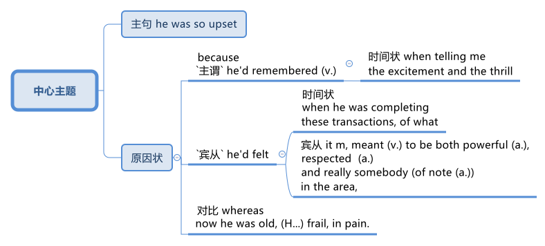

= step 2 - Lesson 29
:toc: left
:toclevels: 3
:sectnums:
:stylesheet: ../../+ 000 eng选/美国高中历史教材 American History ： From Pre-Columbian to the New Millennium/myAdocCss.css

'''

Lesson 29

== part 1. 部分

Linda: Oh, yes, I remember.  +
We were conducting (v.) a survey into the, the needs of _disabled people_ in the borough 自治市镇；（城市）行政区 (Yes) in which I work in London.  +

[.my1]
.案例
====
.borough
a town or part of a city that has its own local government 自治市镇；（城市）行政区

-> 英语单词borough 与 burg、burgh同源。 +
西方好多城市都以 burg 或 burgh 结尾，如汉堡（Hamburg）、爱丁堡（Edinburgh）、匹兹堡（Pittsburgh）。

burg或burgh就是“城镇”的意思，不过和city或town不同，burg或burgh指的是带碉堡的城市，也就是说，它们在成为城市之前其实就是一座要塞或一座城堡。

borough在英语中表示“自治市”。“带碉堡的城市”与“自治市”有何关联呢？原来，自治市的自治权是打仗打下来的，所以这些城市自然要修筑碉堡来保卫自己。

在欧洲封建时期，城镇的主权, 原本都是属于封建贵族即所谓“领主”（Lord）的，是他的封地的一部分。后来，随着工商业的发展，城镇越来越繁荣，市民的经济地位提高了，对封建贵族对城镇的压榨越来越不满。所以市民们想方设法争取城市自治。

刚开始时，市民们用钱, 从领主那里一项一项地赎回城市的各种权利，因为那个时候市民们通过经商积累了大量货币，而领主的收入主要是封地上的各种农产品，所以缺乏货币。在11、12世纪又赶上了十字军东征运动，大批领主要参加十字军，亟需便于携带的金银货币充当盘缠，所以就把很多权利都卖给市民了。

但钱不能买到所有权利，所以领主和市民免不了要开战，城市的自治权就是通过赎买和战争的方式获得了。因此自治市中常常修筑了各种防御工事，用来保卫城市的主权。

borough：['bʌrə] n.自治市，区 burg：[bɜːg] n.镇、城、村 burgh：['bʌrə] n.（苏格兰）自治市，城镇

====

And we got a request from an old man to go along 继续,进展；发展 and, and see him in connection with 与…有关（或相关） this survey.  +

Well, `主` #some# of the people that I’d seen on the survey before `系` #were# really _quite poor_ and lived (v.) in very bad housing conditions.  +
(Yes) They were also …​ tended (v.) to be elderly (a.)年纪较大的，上了年纪的 and to really have some _quite bad disabilities_ 残疾, so I was quite prepared for, for anything I thought that I might meet.  +

[.my2]
琳达：哦，是的，我记得。我们正在对我在伦敦工作的行政区（是的）残疾人的需求, 进行一项调查。我们收到一位老人的请求，希望我们能一起去见见他，以完成这项调查。嗯，我之前在调查中, 看到的一些人确实很穷，居住条件也很差。 （是的）他们也……往往年纪较大，而且确实有一些非常严重的残疾，所以我对我认为可能遇到的任何事情, 都做好了准备。

Anyway, I went along to, to this house and it was not [at all] what I’d expected.  +
It was a, a large house and really had an air of _fa, faded 褪色的,（记忆等）消褪的 gentility_ (n.)幽静古朴;文雅；彬彬有礼；高贵的身份 about it.  +
It was in _a part of the borough_ which had (Really?) once been quite fashionable.  +

Er, I knocked at the door and the old man, Mr. Sinclair, came to, to let me in and showed me into a back room, which he lived in.  +
The rest of the house, I think, must have been shut up and he was just living in one or two rooms.  +

(How extraordinary! 意想不到的；令人惊奇的；奇怪的) Anyway, we started the interview which I had to, to conduct with him and he was very, very willing (a.) to talk but he never stopped grumbling.  +
He grumbled about …​ young people, about _the rising cost of living_, about the government, about _how the area had gone down_, and so on and so forth 等等，诸如此类.  +

He didn’t seem to have a _good word_ 好话; 好消息; 佳音. to say for anybody [at all]. (S …​ )

[.my2]
不管怎样，我还是去了，去了这所房子，这根本不是我所期望的。那是一栋大房子，确实有一种法式的气息，但也有一种褪色的绅士风度。它位于该行政区的一部分，（真的吗？）曾经非常时尚。呃，我敲了敲门，老人辛克莱先生过来了，让我进去，并带我进入他住的后面的房间。我想，房子的其余部分一定是关着的, 他只住在一两个房间里。 （多么非凡！）无论如何，我们开始了我必须与他进行的采访，他非常非常愿意说话，但他从未停止抱怨。他抱怨……年轻人、生活成本上升、政府、该地区的衰落等等。他似乎根本没有对任何人说好话。 （S…​）

Janet: Got a real chip （木头、玻璃等的）缺口，缺损处 on his shoulder?

[.my2]
珍妮特：他的肩膀上真的受伤了吗？

[.my1]
.案例
====
.have a chip on one's shoulder.
表面的字面意思是: 某人”肩膀上有一块木头“。（chip是木块的意思）. 但实际上, 它是一句成语, +
Someone who has a chip on his shoulder is angry all the time. +
If you have a chip on your shoulder, you seem angry all the time because you think you have been treated unfairly or feel you are not as good as other people.

就是形容"一个人总是气哼哼的，觉得外界对不起他。"在有些场景下，也就有了"记仇"的意思。

- He has had a chip on his shoulder ever since he didn't get the promotion he was expecting. 自从他一直盼望的升职希望落空后，他心里就有了怨气了。
====

Linda: Well, he was.  +
He was _a really grumpy (a.)脾气坏的，爱抱怨的 old man_ and not very likeable (a.)可爱的；讨人喜欢的 with it.  +
But he was …​ rather frail (a.)瘦弱的;弱的；易损的；易碎的 and in his eighties and …​ I just accepted that perhaps, you know, he’d had a hard life in, in some way an, and hadn’t really resolved it.  +

Anyway, I left the, er, the house and went back to the office, wrote up （利用笔记等）详细写出 the interview and didn’t think any more about it.  +

[.my2]
琳达：嗯，他是。他是一个脾气暴躁的老人，不太讨人喜欢。但他……相当虚弱，已经八十多岁了……我只是接受了这一点，也许，你知道，他在某种程度上过着艰难的生活，而且还没有真正解决这个问题。不管怎样，我离开了，呃，房子，回到办公室，写下了采访，没有再想它。

And then about a week later, I got _a phone call_ from him saying that he thought (v.) he’d left out 遗漏,不包括，排斥 some important things about himself (Really?) 后定 that I should know, and would I go and see him again.  +

So I explained #that# it was a survey 后定 that we were doing #and that# it wasn’t really very usual (a.) to go back and see somebody a second time, but if he felt (v.) it was really important then, of course, I would go.  +

(Yeah) So I went along and _exactly 精确地；准确地；确切地 the same thing_ happened as had happened before.  +
He showed me into the back room and he started grumbling (v.) again and this went on for about half an hour and I began to wonder why on earth he’d asked me to go back a second time.

[.my2]
大约一周后，我接到他的电话，说他认为他遗漏了一些我应该知道的关于自己的重要事情（真的吗？），我会再去见他吗？所以我解释说，这是我们正在进行的一项调查，第二次回去见某人并不常见，但如果他觉得这真的很重要，那么我当然会去。 （是的）所以我就跟着去了，结果发生了和以前一模一样的事情。他带我到后面的房间，他又开始抱怨，这种情况持续了大约半个小时，我开始想知道他到底为什么要我第二次回去。

Janet: He didn’t tell you anything new about himself?

[.my2]
珍妮特：他没有告诉你任何关于他自己的新事吗？

Linda: Well, he …​ after about half an hour he started.  +
He said, 'I, I expect you wonder why I’ve asked you to come back,' (Quite) and I said, 'Well, as a matter of fact, yes I do.'  +

So he said, 'Well, I think I should tell you a bit about myself and perhaps explain why I, I seem to have a chip on my shoulder,' which took me aback （被…）吓了一跳；大吃一惊；震惊, back [a bit], you know.  +

[.my2]
琳达：嗯，他……大约半小时后他开始了。他说，“我，我希望你想知道, 为什么我要你回来，”（相当）我说，“嗯，事实上，是的，我想知道。”所以他说，“好吧，我想我应该告诉你一些关于我自己的事情，或许还可以解释一下为什么我，我似乎有一种不满，”  他的话让我有点吃惊，你知道。

[.my1]
.案例
====
.BE TAKEN AˈBACK (BY SBSTH)
to be shocked or surprised by sbsth （被…）吓了一跳；大吃一惊；震惊 +
- She was completely taken aback by his anger.他的愤怒把她吓了一大跳。
====
Anyway, apparently, he had come from a, a family which was …​ really quite well-to-do (a.)有钱的；富有的；富裕的 but not spectacularly 壮观地；引人注目地；令人印象深刻地，非常 rich and his father had _a, a small grocery 食品杂货店 business_ and had supported (v.) his mother and, and his two sisters.  +

Well, his mother and father both died (v.) quite [early on 在初期；在开始阶段；早先] in his life and he took over 接管,接手 the business (Yes) and it fell to （职责、责任）落在…身上；应由…做 him, of course, to support his two sisters.  +

(Yes) Well, gradually the, the business began to, to flourish.  +
He opened up new lines in the shops, he bought in 买入 some foreign foods and he (He …​ ) acquired (v.)购得；获得；得到 new premises （企业的）房屋建筑及附属场地，营业场所.

[.my2]
不管怎样，显然，他来自一个……非常富裕, 但不是特别富有的家庭，他的父亲有一家小杂货店，养活了他的母亲和两个姐妹。好吧，他的母亲和父亲, 在他生命的早期就去世了，他接管了生意（是的），当然，养活他的两个姐妹的责任, 就落在了他的身上。 （是）嗯，逐渐的，生意开始，蓬勃发展。他在商店里开辟了新的生产线，购买了一些外国食品，并且他（他......）购买了新的场所。

[.my1]
.案例
====
.early (ad.) ˈon
at an early stage of a situation, relationship, period of time, etc.在初期；在开始阶段；早先 +
- I knew quite [early on] that I wanted to marry her. 我老早就知道, 我想娶她。

.premises
(n.) the building and land near to it that a business owns (v.) or uses(v.) （企业的）房屋建筑及附属场地，营业场所
====

Janet: He really built (v.) the whole thing up.

[.my2]
珍妮特：他真的把整个事情都建立起来了。

Linda: Well yes. He didn’t become a multimillionaire 拥有数百万资产的富翁；千万富翁 or anything like that, but he was certainly very comfortably off 生活富裕；丰衣足食.  +
Anyway, he …​ one of his sisters got married and the other sister emigrated (v.) to Australia but he himself never, never married.

[.my2]
琳达：嗯，是的。他没有成为百万富翁或类似的人物，但他的生活确实非常舒适。不管怎样，他……他的一个姐妹结婚了，另一个姐妹移民到了澳大利亚，但他自己却从未结婚。

[.my1]
.案例
====
.comfortably
(ad.) in a comfortable way 舒服地；舒适地；安逸地

.COMFORTABLY ˈOFF
having enough money to buy what you want without worrying too much about the cost 生活富裕；丰衣足食
====

Janet: He just stayed on 留下来继续（学习、工作等） in the house by himself?

[.my2]
珍妮特：他就一个人呆在家里？

Linda: He stayed on in, in this house which had been the family house for a number of years.

[.my2]
琳达：他一直住在这栋房子里，这栋房子多年来一直是他家的房子。

Janet: Completely alone?

[.my2]
珍妮特：完全孤独吗？

Linda: Completely alone, yes. And he …​ really cut (v.) himself off 停止，中断（供给）;切断…的去路（或来路）；使…与外界隔绝 from his friends, or friends of the family, because he was giving all day, every day, to the growth of his business.  +

So he kept going for a number of years but eventually, of course, he began to, to grow older and [with age 随着年龄增长] came (v.) arthritis 关节炎 (Oh dear) and …​ gradually the, the condition worsened (v.) and he became more and more in pain, more and more frail (a.)瘦弱的 but he still battled on 坚持战斗, I think, for a number of years (Yes) but eventually he was forced to give up.  +

And it left him completely alone.  +
He was still, of course, well off 富有的；富裕的,境况良好的, (Yes) but that wasn’t [in itself] enough, and while he was telling me this he was, he was so upset 使烦恼；使心烦意乱；使生气 because #he’d remembered# [when telling me the excitement and the thrill] `宾从` #he’d felt# (Yes) [when he was completing these transactions （一笔）交易，业务，买卖, of what] `宾从` it m, meant (v.) to be both powerful, respected and really _somebody 后定 of note 重要的；引人注目的_ (Yes) in the area, #whereas# now he was old, (H…​) frail, in pain.

[.my2]
琳达：完全孤独，是的。他……真的与他的朋友或家人的朋友隔绝了，因为他整天、每一天都在为他的生意的发展, 付出努力。所以他坚持了很多年，但最终，当然，他开始变老，随着年龄的增长，关节炎（哦，天哪）……​逐渐地，病情恶化，他变得越来越痛苦，越来越痛苦。而且更加虚弱，但我认为, 他仍然奋斗了很多年（是的），但最终他被迫放弃。这让他完全孤独了。当然，他仍然很富裕，（是的）但这本身还不够，当他告诉我他是这样的时候，他很沮丧，因为他记得, 当他告诉我他的兴奋和激动时, 当他完成这些交易时，他感觉到（是的），它意味着什么，意味着在该地区既强大，受人尊敬，又真正是值得注意的人（是的），而现在他老了，（H…​）虚弱，在疼痛。

[.my1]
.案例
====

.of ˈnote
of importance or of great interest 重要的；引人注目的 +
- a scientist of note 著名的科学家 +
- The museum contains nothing of great note. 这家博物馆没有什么很有价值的东西。
====

Janet: He’d lost (v.) everything.

[.my2]
珍妮特：他失去了一切。

Linda: Yes, he had. His, his neighbours were very good to him, but it wasn’t `表` that that he wanted.  +
(No) And I felt so …​ helpless because it wasn’t that 宾从 he needed more money, it wasn’t that he really needed visitors — he didn’t particularly want (v.) visitor.  +

(No) What he wanted was `表` ① to be, to be young again ② and to be in a position of, of building (v.) something up and seeing the results (Yes) from it.

[.my2]
琳达：是的，他有。他的，他的邻居对他很好，但是这不是他想要的。 （不）我感到很……无助，因为并不是他需要更多的钱，也不是他真的需要访客——他并不特别想要访客。 （不）他想要的是，再次年轻，处于一个位置，建立一些东西并从中看到结果（是）。

Janet: Oh, what a sad story!

[.my2]
珍妮特：哦，多么悲伤的故事啊！

'''

== part 2. 部分

Los Angeles police yesterday added (v.) a new name to the list of victims of what they believe (v.) is a new serial killer.  +
Like the first four victims Joseph Griffin was a homeless 无家可归的 man 后定 shot (v.) on the head while sleeping alone.  +
NPR’s Salas Wason reports (v.) from Los Angeles.

[.my2]
洛杉矶警方, 昨天在他们认为是新连环杀手的受害者名单中, 添加了一个新名字。与前四名受害者一样，约瑟夫·格里芬也是一名无家可归者，他在独自睡觉时头部中弹。 NPR 的萨拉斯·沃森从洛杉矶报道。

Early this month _the police department_ sent (v.) notices to every _homeless shelter_ 无家可归者收容所 about _the transient (a.)短暂的；转瞬即逝的；倏忽 killer_.  +
_Staff member_ 职员 Marcotte Tears reads (v.) from _the Xerox 施乐公司 post_ near _the check-in （机场的）登机手续办理处 window_ at _the Union Rescue Mission_ down town 市中心.

[.my2]
本月初，警察局向每个无家可归者收容所, 发出了有关这名临时杀手的通知。市中心联合救援团的工作人员 Marcotte Tears,  正在看报到窗口附近复印的帖子。

[.my1]
.案例
====
.downtown
(a.) 市中心的, (n.) 市中心
====

"Four men have been shot in the head in the last three weeks. The men were all transients (n.)暂住某地的人；过往旅客；临时工 and sleeping alone at the time of the killings.  +
Please tell _everyone_ in this chapel 小教堂 and _those_ along the streets to come indoors at night to any of the missions 布道所；传教区 or shelters.  +

[When they are full] please tell the men to group (v.) together, not to be alone at night, but huddle (v.)（通常因寒冷或害怕）挤在一起 for safety.  +
The lives (n.) of the men may depend upon their following these instructions."

[.my2]
在过去的三周里，已经有四名男子被击中头部。这些男子都是流浪者，在被杀害时独自睡觉。请告诉这个教堂里的所有人，以及沿街的人晚上进入任何一个救援所或收容所。当它们已满时，请告诉男子们聚在一起，不要独自一人在夜晚，而是团结在一起以确保安全。这些男子的生命可能取决于他们遵循这些指示。

[.my1]
.案例
====
.transient
(n.)( especially NAmE ) a person who stays or works in a place for only a short time, before moving on(继续前进)   暂住某地的人；过往旅客；临时工 +
(a.) continuing for only a short time 短暂的；转瞬即逝的；倏忽 +
-> 来自 transit,中转，过渡，-ent,形容词后缀。

.chapel
[ C]a small building or room used for Christian worship in a school, prison, large private house, etc.（学校、监狱、私人宅院等基督教徒礼拜用的）小教堂 +
[ C]a separate part of a church or cathedral , with its own altar , used for some services and private prayer（教堂内的）分堂，小教堂 +

.mission
a building or group of buildings used by a Christian mission 布道所；传教区
====

Since that notice was distributed, police have searched their records and added five more victims to the list. +
Except for the victim 后定 added yesterday they are not transients 暂住某地的人；过往旅客；临时工, but they were all shot while out [on the streets] in the early morning hours.  +

Commander 负责人；（尤指）司令官，指挥官 William Booth, a spokesman for the police department, won’t confirm it, but reportedly all the men were shot with _a small caliber 口径 gun_.  +
So far Booth said `主` the _task force_ 特遣部队;（为解决某问题而成立的）特别工作组 后定 working on the case `谓` doesn’t have many clues and only _a little bit of information_ about the murderer.

[.my2]
自该通知发出以来，警方搜查了他们的记录，并在名单上增加了五名受害者。除了昨天补充的受害者外，他们都不是过路人，但他们都是在凌晨在街上被枪杀的。警察局发言人、指挥官威廉·布斯(William Booth)不愿证实这一点，但据报道，所有男子都是被小口径枪射杀的。布斯表示，到目前为止，侦办此案的专案组还没有太多线索，只有一点点关于凶手的信息。

"Frankly not nearly enough 差得远,远远不够.  +
We have a brief description: a male black, who is tall, slim, a hundred fifty to a hundred and seventy pounds, twenty-five to thirty years old. With a medium to large _Afro (a.)圆蓬式发型；非洲式发型 haircut_."

[.my2]
“坦率地说还不够。我们有一个简短的描述：一个黑人男性，身材高大，苗条，一百五十到一百七十磅，二十五到三十岁。留着中到大的非洲式发型。”

[.my1]
.案例
====
.Afro

====

The first victim was shot on September 4th, the most recent October 7th.  +
The crime took place 发生 in several Los Angeles neighborhoods 社区.  +
All five homeless men 后定 killed `谓`  were sleeping outside downtown  城镇的中心区.  #Not# in _the skid 侧滑；打滑；突然向一侧滑行 road area_, #but# nearby.  +

Although the city’s transients have been urged to sleep (v.) in shelters, there are thousands more men than beds are available.  +
And not all the homeless `谓` choose to stay (v.) in the shelters.  +
Still most of the men at the Union Rescue Mission `谓` know (v.) about the transient killer and admit (v.) to some concern.

[.my2]
第一个受害者于 9 月 4 日被枪杀，最近一次是在 10 月 7 日。这起犯罪事件发生在洛杉矶的几个街区。所有被杀的五名无家可归者, 都在市中心外睡觉。不是在防滑路区域，而是在附近。尽管该市的临时住民, 被要求睡在避难所里，但人数仍多于数千人，无法提供床位。并非所有无家可归者都选择留在避难所。尽管如此，联邦救援团的大多数人, 都知道这名短暂杀手的存在，并承认有些担忧。

Los Angeles police are still looking for another _serial murderer_ 连环杀手. This _outside slayer_ 凶手；杀人者 is suspected (v.)怀疑（某人有罪） of killing seventeen women, mostly prostitutes 妓女 during the past three years.  +
I’m Salas Wason in Los Angeles.

[.my2]
洛杉矶警方仍在寻找另一名连环杀人犯。这位外来杀手涉嫌在过去三年内杀害了十七名妇女，其中大部分是妓女。我是洛杉矶的萨拉斯·沃森。

[.my1]
.案例
====
.prostitute
-> 来自拉丁语prostituere,卖淫，来自pro-,向前，-stit,站立，词源同stand,institute.字面意思即站在前面，引申词义买卖，供挑选等。
====

'''

== How to Present a Seminar Paper

3.如何提交研讨会论文

In this talk, I am going to give some advice on how to present (v.) _a seminar （大学教师带领学生作专题讨论的）研讨课;研讨会；培训会 paper_.

[.my2]
在本次演讲中，我将就如何提交研讨会论文, 提出一些建议。

[.my1]
.案例
====
.seminar
-> 来自德语 Seminar,研讨会，讨论会，来自拉丁语 seminarium,育种室，来自 semen,种子，-arium, 表地方。
====

At one time, most university teaching (n.) `谓` took the form of giving formal lectures.  +
Nowadays, many university teachers try to involve their students more actively in the learning process.  +

`主` One of the ways in which this is done `系` is by conducting seminars.  +
In a seminar, what usually happens is this.  +
One student is chosen to give his ideas on a certain topic.  +
These ideas are then discussed by the other students (the participants) in the seminar.

[.my2]
曾经，大多数大学教学, 都采取正式讲座的形式。如今，许多大学教师, 试图让学生更积极地参与学习过程。实现这一目标的方法之一, 是举办研讨会。在研讨会上，通常会发生这样的情况。选择一名学生就某个主题发表自己的想法。然后研讨会上的其他学生（参与者）, 讨论这些想法。

What I’d like to discuss (v.) with you today `系`  is the techniques of presenting (v.) a paper at a seminar.  +
As you know, there are two main stages involved in this.  +

One is _the preparation stage_ which involves researching and writing up a topic.  +
The other stage is _the presentation 提交；授予；颁发；出示 stage_ when you actually present the paper to your audience.  +
#It is# this second stage #that# I am concerned 与…有关；涉及;担心，忧虑 with now.  +

Let us therefore imagine #that# you have been asked to lead off 开始（某事） a seminar discussion and #that# you have done all the necessary preparation.  +
In other words you have done your research and you have written it up. How are you going to present it?

[.my2]
今天我想和大家讨论的, 是在研讨会上发表论文的技巧。如您所知，这涉及两个主要阶段。一是准备阶段，涉及研究和撰写主题。另一个阶段是演示阶段，当你实际向观众展示论文时。我现在关心的是第二阶段。因此，让我们想象一下，您被要求主持一场研讨会讨论，并且您已经完成了所有必要的准备。换句话说，你已经完成了你的研究, 并且已经把它写下来了。你打算如何展示它？

[.my1]
.案例
====
.lead offˌ| lead sth off
to start sth开始（某事） +
- Who would like to lead off the debate? 谁愿带头发言开始辩论？
====

There are two ways in which this can be done.

[.my2]
有两种方法, 可以做到这一点。

The first method is to circulate (v.) copies of the paper [in advance] to all the participants.   This gives them time to read it before the seminar, so that they can come (v.) already prepared with their own ideas about what you have written.  +

The second method is where there is no time for previous circulation, or there is some other reason why the paper cannot _be circulated_.  In that case, of course, the paper will have to read aloud to the group, who will probably make their own notes 笔记；记录;注释；按语；批注 on it while they are listening.

[.my2]
第一种方法是, 提前将论文副本分发给所有参与者。这让他们有时间在研讨会之前, 阅读它，这样, 他们就可以对你所写的内容, 有自己的想法。 +
第二种方法是, 以前没有时间流通，或者有其他原因导致报纸不能流通。在这种情况下，当然，论文必须大声朗读给小组听，他们可能会在听的时候自己做笔记。

In this talk, I am going to concentrate on the first method, where the paper is circulated in advance, as 因为 this is the most efficient way of conducting a seminar; but `主` most of what I am going to say `谓` also applies to the second method; and indeed may be useful to remember (v.) 时间状 [any time] you have to speak in public.

[.my2]
在这次演讲中，我将重点讨论第一种方法，即提前分发论文，因为这是举办研讨会最有效的方法；但我要说的大部分内容, 也适用于第二种方法；事实上，任何时候你必须在公共场合演讲时, 记住这一点可能会很有用。

You will probably be expected to introduce your paper even if it has been circulated beforehand.  +
There are two good reasons for this. One is that the participants 参与者；参加者 may have read the paper but forgotten some of the main points.  +
The second reason is that some of the participants may not in fact have had time to read your paper, although they may have glanced through it quickly.  They will therefore not be in a position to comment on it, unless they get some idea of what it is all about.

[.my2]
即使您的论文, 已经事先分发过，您也可能需要介绍它。这有两个很好的理由。一是参与者可能已经阅读了论文，但忘记了一些要点。第二个原因是，一些参与者实际上可能没有时间阅读你的论文，尽管他们可能很快地浏览了一遍。因此，除非他们了解事情的全部内容，否则他们无法对此发表评论。

When you are introducing (v.) your paper, what you must not do `系`  is simply read (v.) the whole paper aloud. This is because:

[.my2]
当你介绍你的论文时，你绝对不能只是大声朗读整篇论文。这是因为：

Firstly, if the paper is a fairly 相当地，颇 long one, there may not be enough time for discussion.  +
From _your point of view_, the discussion is the most important thing.  +
It is very helpful for you if other people criticize (v.) your work: [in that way] you can improve it.

[.my2]
首先，如果论文相当长，可能没有足够的时间进行讨论。从你的角度来看，讨论是最重要的。如果其他人批评你的工作，这对你非常有帮助：这样你就可以改进它。

Secondly, a lot of information can be understood when one is reading. It is not so easy to pick up detailed information when one is listening.   In other words, there may be lack of comprehension or understanding.

[.my2]
其次，阅读时可以理解很多信息。当一个人在听的时候，要获取详细的信息并不是那么容易的。换句话说，可能缺乏理解或理解。

Thirdly, it can be very boring listening to something 后定 being read aloud.  +
Anyway 不管怎样，无论如何 some of your audience may have read your paper carefully and will not thank you for having to go through all of it again.

[.my2]
第三，听大声朗读的内容, 可能会很无聊。不管怎样，你的一些读者可能已经仔细阅读了你的论文，并且不会感谢你必须再次阅读所有内容。

Therefore, what you must do is follow the following nine points:

[.my2]
因此，你必须做到以下九点：

Decide 决定；选定 on _a time limit_ for your talk. Tell your audience what it is.  +
Stick to your _time limit_. This is very important.

[.my2]
确定演讲的时间限制。告诉你的听众这是什么。遵守你的时间限制。这个非常重要。

Write out your _spoken presentation_ 口头陈述 in the way that you intend to say it.  +
This means that you must do some of the work of writing the paper again, in a sense 在某种意义上.  +

You may think that this is a waste of time, but it isn’t.  +
If a speaker tries to make a summary of his paper while he is standing in front of his audience 观众，听众；读者, the results are usually disastrous.

[.my2]
按照您想要的方式, 写下您的口头演讲。从某种意义上来说，这意味着你必须重新做一些写论文的工作。您可能认为这是浪费时间，但事实并非如此。如果演讲者试图在听众面前总结他的论文，结果通常是灾难性的。

Concentrate (v.) only on the main points. Ignore (v.)details.  +
Hammer (v.) home 反复讲透，重点讲清（要点、想法等） the essence 本质；实质；精髓 of your argument.  +
If necessary, find (v.) ways of making your basic points so that your audience will be clear about what they are.

[.my2]
只关注要点。忽略细节。锤炼你的论点的本质。如有必要，想办法阐述你的基本观点，以便你的听众清楚这些观点是什么。

[.my1]
.案例
====
.hammer
(v.) ~ sth (inintoonto sth) : to hit sth with a hammer （用锤子）敲，锤打

.hammer (v.) sth [home]
(1)to emphasize a point, an idea, etc. so that people fully understand it 反复讲透，重点讲清（要点、想法等） +
(2)to kick a ball hard and score a goal 用力踢球得分；把球猛踢进球门
====

Try to make your _spoken presentation_ lively (a.)生动有趣的 and interesting.  +
This doesn’t necessarily mean _telling (v.) okes and anecdotes_ 奇闻轶事.  +
But if you can think of _interesting or amusing examples_ to illustrate (v.) your argument, use (v.) them.

[.my2]
尽量让你的演讲生动有趣。这并不一定意味着讲笑话和轶事。但如果你能想出有趣的例子来说明你的论点，那就使用它们。

If you are not used to 不习惯 speaking (v.) in public, write out everything 后定 you have to say, including examples, etc.  +
Rehearse (v.)排练；排演;默诵；背诵；默默地练习 what you are going to say until you are word (a.)措辞严谨的演讲  perfect.

[.my2]
如果您不习惯在公共场合演讲，请写下您要说的所有内容，包括示例等。排练您要说的话，直到您的单词完美为止。

[.my1]
.案例
====
.word
(n.)[ VN] [ often passive]to write or say sth using particular words 措辞；用词
(a.) +
- a carefully worded (a.)speech 措辞严谨的演讲
====

When you know exactly what you are going to say, reduce it to outline 概述；梗概 notes.  +
Rehearse (v.) your talk again, this time from the outline notes.  +
Make sure you can find your way easily from the outline notes to the full notes, in case 以防万一 you forget something.

[.my2]
当你确切知道自己要说什么时，将其简化为大纲笔记。再次排练你的演讲，这次是根据大纲笔记。确保您可以轻松地从大纲笔记到完整笔记，以防您忘记某些内容。

At the seminar 研讨会；培训会, speak from the outline notes. But bring both sets of notes and your original paper to the meeting.  +
`主` Knowing that you have _a full set of_ notes available `谓` will be good for your self-confidence.

[.my2]
在研讨会上，根据大纲笔记进行发言。但请携带两套笔记和原始论文, 参加会议。知道你有一整套可用的笔记, 将有利于你的自信。

Look at your audience while your are speaking.  +
The technique to use is this. First read (v.) _the appropriate parts_ of your notes silently (if you are using outline notes, this won’t take you long).  +

Then look up at your audience and say what you have to say.  +
Never speak while you are still reading.  +
While you are looking at your audience, try to judge what they are thinking.  Are they following you?  +
You will never make contact with 与…接触 your audience if your eyes are fixed on the paper 后定 in front of you.

[.my2]
演讲时看着听众。使用的技术是这样的。首先默读笔记的适当部分（如果您使用大纲笔记，这不会花费您很长时间）。然后抬头看着你的听众, 并说出你要说的话。阅读时切勿说话。当你看着你的听众时，试着判断他们在想什么。他们在跟踪你吗？如果你的眼睛盯着面前的纸，你将永远无法与观众接触。

Make _a strong ending_. One good way of doing this is to repeat (v.) your main points briefly and invite (v.) questions or comments.

[.my2]
做出一个强有力的结局。这样做的一个好方法, 是简短地重复您的要点, 并邀请问题或评论。

Perhaps I can sum up 总结，概括 by saying (v.) this.  +
Remember (v.) that `宾从` listening is very different from reading.  +
`主` #Something# 后定 that is going to be listened to `谓` has therefore got to be prepared in a different way from #something# 后定 that is intended to be read.

[.my2]
也许我可以这样总结。请记住，听力与阅读有很大不同。因此，"要听的东西"必须以与"要读的东西", 用不同的方式来准备。

'''
