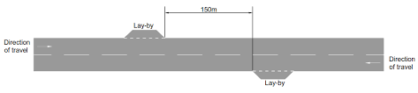
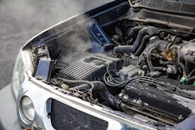
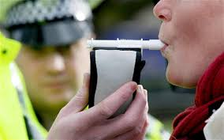

= step 2 - Lesson 30
:toc: left
:toclevels: 3
:sectnums:
:stylesheet: ../../+ 000 eng选/美国高中历史教材 American History ： From Pre-Columbian to the New Millennium/myAdocCss.css

'''

Lesson 30

== part 1

Jane: Now look, er, what’s all this, er, story about you and this car I’ve been hearing so much about? Everybody else has been hearing it, but you haven’t told me. (Mhm)

[.my2]
简：现在看看，呃，关于你和我经常听到的这辆车的故事, 是什么？其他人都听到了，但你没有告诉我。 （嗯）

John: Well, I was driving to Norwich with a friend, erm, we teach (v.) there and, erm, I was driving behind _a Lotus Elan sports-car_ 跑车 (Yes) on dual-carriageway 双向行驶道路  and, erm, after about, er, three or four miles, er, behind this car, er, we, we left (the) dual-carriageway and, erm, entered a two-way 双行的；双向的 road.  +
And, er, this Lotus suddenly slowed down for no reason whatsoever 丝毫（用于强调否定句）. (There …​)

[.my2]
约翰：嗯，我和一个朋友开车去诺维奇，嗯，我们在那里教书，嗯，我开在一辆莲花Elan跑车后面，在双车道上行驶，嗯，大约，嗯，三四英里后，嗯，在这辆车后面，我们离开了双车道，嗯，进入了双向道路。然后，这辆莲花突然莫名其妙地慢了下来。(那里……)

[.my1]
.案例
====
.dual-carriageway
image:../img/dual-carriageway.jpg[,10%]

.two-way

====

Jane: Not _a side road_ 支线；叉道；旁路 or anything?

[.my2]
简：不是小路之类的吗？

John: No, no, no turning off 拐弯；转入另一条路, no lay-bys 路侧停车带, and it just slowed down, and, er, I thought, that’s, that’s odd and, er, I overtook (v.)超过；赶上 the Lotus, er, slowly and, erm, looked over 查看；检查 at the driver, …​ and as I did, I saw him slump 重重地坐下（或倒下） over 从直立位置向下和向外；落下；倒下 the wheel.

[.my2]
约翰:不，不，没有转弯，没有停车，它只是慢了下来，我想，这很奇怪，我超了那辆莲花，嗯，慢慢地，我看了看司机，我看到他摔倒在方向盘上。

[.my1]
.案例
====
.lay-by
image:../img/lay-by.jpg[,10%]

====

Jane: Oh, how awful 骇人听闻的；可怕的;糟透了的情况 !

[.my2]
简：噢，太糟糕了！

John: Yes.

Jane: So what did you do next?

[.my2]
简：那你接下来做什么了？

John: So, erm, I pulled into the kerb （由条石砌成的）路缘；道牙；马路牙子 about thirty yards or so 大约，左右, er, in front of the Lotus 莲花（汽车品牌） (Yes) and, erm…​my, er, passenger and myself got out and we, we walked back towards his car.  +

My friend was on the _grass verge_ （路边的）小草地，绿地 and, er, I was in the middle of the road. We never even, erm, reached the car.  +
I was about five yards from the car when, er, suddenly, erm, there was _a noise of full acceleration_ 加速；加快 and the car just shot (v.)射击；发射;（使朝某方向）冲，奔，扑，射，飞驰 forward — nearly ran (v.) me down. +
So I had to leap for my life. +

[.my2]
约翰：嗯，我把车停在离莲花车大约三十码左右的路边（是的），然后，我，呃，和我的乘客下了车，我们朝着他的车走去。我的朋友站在草地的路沿上，而我站在马路中间。我们甚至没有到达车辆。我距离车大约五码远，突然间，呃，听到了全速加速的声音，车子就向前冲了过来 —— 差点把我撞倒。所以我不得不为了自己的生命跳起来。

[.my1]
.案例
====
.verge
( BrE ) a piece of grass at the edge of a path, road, etc.（路边的）小草地，绿地 +
- a grass verge 长了草的路边
====

I was absolutely shaken (a.)震惊；烦恼；恐惧 because the car must have missed 未击中，未抓住 me by about half an inch or so, (I mean), (How dread 恐惧；令人惧怕的事物…​) it just shot (v.) past me and I saw my car smashed (v.)（哗啦一声）打碎，打破，破碎;（使）猛烈撞击，猛烈碰撞 in front of my eyes. (How dreadful!)  +

Yea, just, just smashed to smithereens 碎片, pieces of car flying all over the road and, erm, both cars locked together 状 went down the road and there was a bend （尤指道路或河流的）拐弯，弯道 at the bottom of the road and I thought well, th…​, the next thing is going to be _a head-on (a.)迎头相撞的；正面相撞的 collision_. (Yes, of course.)  +

[.my2]
我绝对吓坏了，因为那辆车差点就撞到了我，（我是说），（多么可怕……）它就这样从我身边飞驰而过，我看到我的车就在我眼前被撞成了碎片。（多么可怕！）是的，完全被撞成了碎片，车的碎片飞到了整个路面，呃，两辆车紧紧相连地沿着路冲下去，路的尽头有个弯道，我想好吧，接下来就要发生正面相撞了。（是的，当然。）

[.my1]
.案例
====
.SMASH, BLOW, ETC. STH TO SMITHEˈREENS
( informal ) to destroy sth completely by breaking it into small pieces 把某物砸（或打等）得粉碎
====

Erm. But, fortunately, nothing came [in the opposite direction] and, erm, and then both cars went across 穿过，越过 the road and, erm, up a grass bank, which …​ it was quite a tall bank and, erm, and, er, at the top of the bank there was a large hedge 树篱.  +

[.my1]
.案例
====
.hedge
(n.) a row of bushes or small trees 后定  planted close together, usually along the edge of a field, gardenyard or road 树篱 +
image:../img/hedge.jpg[,10%]
====

Well, my car left the Lotus a, and literally took off （飞机）起飞 and shot (v.) through 穿过 the hedge (Oh, goodness!) and landed in _a ploughed 犁 (地) field_.  +

[.my2]
呃。但是，幸运的是，没有任何东西从对面冲过来，呃，然后两辆车穿过了路，呃，冲上了一个草坡，呃…那是一个相当高的坡，呃，而且，在坡顶上有一片大篱笆。我的车离开了莲花车，简直就像是起飞了，穿过了篱笆（天哪！）然后降落在了一片翻耕的田地里。

(Yes) But the Lotus veered (v.)突然变向；猛然转向;偏离；改变；转变 to the left and got stuck 被卡住了 in the hedge 树篱, in the thick 浓密的；稠密的；茂密的 part of the hedge.  +

And, erm, the acceleration 加速；加快 was still on full and the back wheels were tearing up 撕毁，撕碎（文件等） the grass verge, throwing _mud and soil, earth and grass_ all over the road, er, it was just, you know, absolutely terrif …​ (How terrify (v.)使恐惧；使十分害怕；使惊吓…​) Yes, (Yes) because the Lotus, erm, radiator 散热器；暖气片;（车辆或飞机发动机的）冷却器，水箱 burst (v.)（使）爆裂，胀开 and, and there was steam everywhere; it was like a, like a cloud of steam and smoke, and, er, `主` #the first thing#, erm, of course, we thought of doing `系` #was# to get the driver out (Well, of course.) Yes.  +

[.my2]
（是的）但是莲花车向左转了方向，并卡在了篱笆里，卡在了篱笆的浓密部分。而且，呃，加速还一直保持在全速，后轮撞起了路沿的草坡，扬起了泥土和土壤，把路面上的草坡，土壤和草全都弄得到处都是，呃，真的，你知道，简直是…（多么恐怖…）是的，（是的）因为莲花车的，呃，散热器爆裂了，到处都是蒸汽；就像是一团蒸汽和烟雾，呃，当然，我们首先想到的是把司机救出来（嗯，当然。）是的。

(Quite) So, erm, we tried to get _the passenger door_ open, (Yes) but it was locked, so we had to climb through the hedge and, er, get round to the driving-door.  +
Well, by that time, there was so much steam we couldn’t see, so it was _a matter_ of fumbling (v.)笨手笨脚地做（某事）；胡乱摸找（某物） in the, in the steam and smoke and thinking (v.) [any moment 任何时刻（现在）] the car was going to explode.

[.my2]
（当然）所以，呃，我们试图打开副驾驶门（是的），但是它被锁住了，所以我们不得不从篱笆上爬过去，呃，走到驾驶座门那边。到那时，蒸汽已经太大了，我们什么都看不见了，所以只能在蒸汽和烟雾中摸索，随时都觉得车要爆炸了。

[.my1]
.案例
====
.radiator
1.a hollow metal device for heating rooms. Radiators are usually connected by pipes through which hot water is sent. 散热器；暖气片 +
- a central heating system with a radiator in each room每个房间都配有一个散热器的中央供暖系统

2.a device for cooling the engine of a vehicle or an aircraft （车辆或飞机发动机的）冷却器，水箱 +
-> 来自 radiate,放射，发散。后用于指暖气片，散热器等。 +

====

Jane: Yes, it wasn’t on fire, in fact, that, at that point, was it?

[.my2]
简：是的，事实上，当时它并没有着火，不是吗？

John: No, no, it wasn’t on fire, but, erm, [with the noise of the engine, an…​ and all the steam] it was just you know, very, frightening.  +
(Oh, how dreadful!) Erm, well we managed to get the driver out, turn the ignition 点火装置；点火开关 off.  +

We laid (v.) him in the mud actually because it was _a ploughed (a.)已翻犁过的 field_ and, (Yes) er, I ran out in the road and shouted for help and, erm …​ er, a car driver told me `主` help, er, `系` was already on its way and, erm, I, er, managed (v.) to get blankets 毛毯；毯子 from people that had stopped and, er, we tried to make the man comfortable, and erm …​ a man appeared [shortly afterwards 不久以后;没过多久 ] and he was from a nearby _American airbase_ and, er, he was a medical man, so he was able to, erm, (Examine him) e…​ examine him and, er, I helped him, tried to, you know, er, make the man, er, well, you know, do all 后定 we could for the man. Erm …​

[.my2]
约翰：不，不，它没有着火，但是，呃，由于引擎的噪音，和所有的蒸汽，你知道，非常，令人恐惧。（哦，多可怕！）呃，我们设法把司机救了出来，关掉了点火。我们实际上把他放在泥土里，因为那是一片犁过的田地，（是的）呃，我跑到马路上呼喊帮助，呃…一个汽车司机告诉我, 帮助已经在路上了，呃，我，呃，从停下来的人那里拿到了毯子，我们试图让这个人舒服些，呃…不久之后，一个男人出现了，他来自附近的美国空军基地，呃，他是一个医生，所以他能够，呃，（检查他）检查他，呃，我帮助他，努力让这个人，你知道，呃，做一切我们能为他做的事情。呃…

Jane: He was unconscious (a.)无知觉的；昏迷的；不省人事的, was he?

[.my2]
简：他失去知觉了，是吗？

John: Yes, yes; …​ and then the police, a…​ police arrived and (the) _fire brigade_ 旅（陆军编制单位）;（主张相同或其他某方面相似的）伙，帮，派 (Yes) and, er, …​ er, we were told to, er, leave (v.) the scene by the police and go to _the police station_ and, erm, there we had to make a statement, (Yes, of course.) and, er, I had to _have a breathalyser  （测量酒精含量的）呼吸分析器 test_, and…​

[.my2]
约翰：是的，是的； ……然后警察，……警察到了，消防队（是的），呃，……呃，警察告诉我们，呃，离开现场，去警察局，然后，嗯，我们必须发表声明，（是的，当然。）而且，呃，我必须进行酒精测试，并且……​

[.my1]
.案例
====
.fire brigade
消防队；消防队员

.breathalyser

====

Jane: But they thought you’d been in the car …​ of course they did. Yes.

[.my2]
简：但他们以为, 你在车里……当然他们确实是这样。是的。

John: Because, because they thought I’d, th…​ they automatically thought I’d been driving the car (Of course. Yes) and, er, when I told them the story they had to apologize for giving me a breathalyser and they said, 'Gosh,' you know, 'how, how incredible'.

[.my2]
约翰：因为，因为他们认为我会，他们自然而然地认为我一直在开车（当然。是的），呃，当我告诉他们这个故事时，他们不得不为给我酒精分析仪而道歉，并且他们说，‘天哪，’你知道，‘多么、多么令人难以置信’。

Jane: So, what happened to the man?

[.my2]
简：那么，那个男人怎么了？

John: And, erm, we were in the middle of making the statements and, erm, the telephone rang and the, the policeman, erm, was told that, that the man was dead, (Oh!) and, erm, and then two days later we had to attend _a Coroner’s 验尸官 inquest_ where we were told that the man had died of a heart attack and, in fact, he was dead, erm, before he crashed (v.) into my car.

[.my2]
约翰：呃，我们正在做陈述，呃，电话响了，警察，呃，被告知，那个人死了，（哦！）然后，呃，然后两天后，我们必须参加验尸官的调查，我们被告知该男子死于心脏病，事实上，他在撞上我的车之前就已经死了。

[.my1]
.案例
====
.coroner
-> 来自corona（crown，王冠）. 在该制度设立的初期，coroner主要负有如下两项职责：一是维护和增加国王的国库收入。coroner通过查明死因、确定个案的类型而分别予以处理.
====

Jane: Oh-h-h! What an alarming story! How dreadful!

[.my2]
简：噢-哈-哈！这是一个多么令人震惊的故事啊！多么可怕啊！

John: Yes. 约翰：是的。

'''

== part 2

Today _the Federal Aviation 航空 Administration_ `谓` reviewed （对书籍、戏剧、电影等的）评介，评论;评审，审查，检查，检讨（以进行必要的修改） that `主` five _air traffic controllers_ based in Kansas City `谓` have been taken off 调离，解除（工作、职务等）；撤掉，拆除（器械） the job because of _drug use_.  +
Earlier this month thirteen controllers at _the southern California centre_ were removed from their jobs for off-duty (a.)非值勤的；歇班的 drug use.  +

Also 而且；此外；也；同样 today the FAA continued to investigate (v.) alleged _drug use_ at the nation’s sixth largest airlines, US Air.  +
NPR’s _Wendy Kaufman_ reports (v.).

[.my2]
今天，美国联邦航空管理局, 审查了驻扎在堪萨斯城的五名空中交通管制员, 因吸毒而被解除职务的情况。本月早些时候，南加州中心的十三名控制员, 因下班后吸毒, 而被解除了工作。同时，美国联邦航空管理局, 今天还在继续调查美国第六大航空公司"美国航空"被指控的毒品使用问题。NPR的温迪·考夫曼报道。

"Drug use, even off-duty, is banned for controllers under _Federal Aviation Administration_ rules.  +
So far the FAA has conducted (v.) investigations into _alleged (a.)（未经证实而）声称的，所谓的；（在证据不足的情况下）被指控的 drug use_ by controllers at two facilities （供特定用途的）场所 — Palmdale 地名 in southern California and now Kansas City.

[.my2]
根据美国联邦航空管理局规定，空中交通管制员即使在下班后, 也禁止使用毒品。到目前为止，美国联邦航空管理局, 已经对加利福尼亚州南部的帕尔默代尔, 和堪萨斯城的控制员涉嫌毒品使用, 进行了调查。

In southern California thirty-four controllers were taken off (常指突然且出人意料地) 离开 their _radar scopes_ 镜（观察仪器）; 雷达屏.  +
Pending (v.)等候判定或决定 the outcome of investigation, `主` thirteen `谓` tested positive for drugs, and we were told they could quit (v.) 离开（工作职位、学校等）；离任；离校 or enter (v.) a treatment program, or opt for 选择 treatment.  +

In Kansas City thirty-six controllers were investigated.  +
The five who tested (v.) positive for drugs `谓` have all agreed (v.) to undergo treatment. Three controllers are still under investigation.  +

The proportion 比例；倍数关系 of drug users is small. [Of the roughly 粗略地，大约 five hundred controllers at the two facilities] `主` only seventy `系` were suspect (a.)可疑的；可能有危险的；有违法嫌疑的, #and# [of those] `主` only eighteen `谓` tested (v.) positive for drugs.  +
_Air traffic control_ supervisors 监督人；指导者；主管人 say they don’t see _drug use_ as a serious problem in their _work force_  工作人员 ; 劳动力.  +
Still （虽然…）还是；但；不过 as one FAA official put it, one drug user is one too many.

[.my2]
在南加州，三十四名控制员, 被从他们的雷达屏前离开。在调查结果出来之前，有十三人测试呈阳性，我们被告知, 他们可以选择辞职、接受治疗计划, 或自愿接受治疗。在堪萨斯城，有三十六名控制员接受了调查。其中五人测试呈阳性，并都同意接受治疗。还有三名控制员仍在接受调查。 +
毒品使用者的比例很小。在这两个设施的大约五百名控制员中，只有七十人受到怀疑，其中只有十八人测试呈阳性。空中交通管制主管表示，他们并不认为毒品使用, 是他们的工作人员中的严重问题。然而，正如一位美国联邦航空管理局官员所说，即使一个毒品使用者也已经太多了。

Right now there is no _routine (a.)常规的；例行公事的；日常的 drug testing_ for controllers though that will change (v.) around 大约 the first of the year.  +
There will be _pre-employment urine 尿液，小便 test_ and test (v.) along with 除…以外（还）；与…同样地 the annual _physical exam_ 体检.  +

According to the FAA, there has never been _a fatal accident_ involving a major US airline in which alcohol or drug abuse was a factor for the controllers or for the pilots.  +
But there have been _a sizeable 相当大的 number of_ fatal accidents in which _commuter （远距离）上下班往返的人 pilots_ 飞行员, _air taxi pilots_ and _private pilots_ had been drinking, and _a much smaller number of_ cases in which drugs were a factor.

[.my2]
目前，控制员没有例行的毒品测试，尽管这种情况将在年初左右发生变化。将进行"职前尿检", 以及"年度身体检查"。根据"美国联邦航空管理局"的说法，在美国主要航空公司发生的致命事故中，从未有控制员或飞行员, 因酗酒或吸毒而成为因素。但是，已经发生了相当数量的致命事故，其中通勤飞行员、航空出租车飞行员, 和私人飞行员饮酒，而毒品是一个较小的因素。

On another matter, `主`  _drug use_, or, more precisely, _alleged drug use_ by _flight crews_ at _US Air_ `谓` has been _front-page （新闻等的）头版的；重要的 news_ in Pittsburgh 匹兹堡, the airline’s operating base.  +
A _grand jury_ 大陪审团 is conducting (v.) an investigation into _alleged drug use_, sales and distribution （商品）运销，经销，分销.  +

Over the weekend 整个周末, `主` a Pittsburgh _press newspaper_ `谓` quoted (v.) area hospital officials, who said they had treated about twenty _US Air flight_ crew members for _cocaine overdoses_ （一次用药）过量.  +

US Air acknowledges  (v.) that one pilot nearly died of an overdose.  +
He had [last] flown (v.)飞行 on September 7th, and was taken to the hospital on September 10th.  +

The airline has removed him from flight duty, and the FAA is considering revoking (v.) 取消；废除；使无效 his _medical certificate_ 医疗证明 that would mean (v.) he could not fly (v.) any aircraft.  +
Meanwhile the FAA is conducting (v.) an investigation of the airline and is working with _the grand jury_ and _the FBI_.  +

I’m Wendy Kaufman in Washington.

[.my2]
另一个问题是, 美国航空公司在其运营基地匹兹堡的飞行员团队, 被指控吸毒，或者更准确地说，被指控吸毒。一家大陪审团, 正在对涉嫌吸毒、销售和分销的情况, 进行调查。上周末，匹兹堡新闻报, 引用了当地医院官员的话，称他们已经为约二十名美国航空公司的飞行员成员, 治疗了可卡因过量。美国航空公司承认, 一名飞行员几乎死于过量。他最后一次飞行是在9月7日，于9月10日被送往医院。航空公司已经将他从飞行任务中撤下，并且美国联邦航空管理局, 正在考虑撤销他的医疗证明，这意味着他不能驾驶任何飞行器。与此同时，美国联邦航空管理局正在对航空公司进行调查，并与大陪审团和联邦调查局合作。我是温迪·考夫曼在华盛顿的报道。

'''

== Lectures and Note-taking

3.讲授和笔记

Note-taking 记笔记，随手记 is a complex activity which requires (v.) a high level of ability in many separate skills.  +
Today I’m going to analyse (v.) the four most important of these skills.

[.my2]
记笔记, 是一项复杂的活动，需要在许多单独的技能方面, 具有高水平的能力。今天, 我将分析其中四个最重要的技能。

Firstly, the student has to understand what the lecturer 讲授者，讲演者；（大学的）讲师 says (v.) as he says it.  +
The student cannot stop (v.) the lecture in order to look up （在词典、参考书中或通过电脑）查阅，查检 a new word or check an unfamiliar sentence pattern.  This puts the non-native speaker of English under a particularly severe strain.  +

Often — as we’ve already seen in a previous lecture — he may not be able to recognize (v.) words in speech which he understands [straight away 马上；即刻 in print].  +
He’ll also meet (v.) words in a lecture which are completely new to him. +

While he should, of course, try to develop the ability to infer 推断；推论；推理 (v.) their meaning from the context, he won’t always be able to do this successfully.  +
He must not allow (v.) failure of this kind to discourage (v.)使泄气，使灰心 him however.  +

It’s often possible to understand much of a lecture by concentrating solely on those points (n.) which are most important.  +
But how does the student decide what’s important? This is [in itself] another skill he must try to develop.  +

It is, in fact, the second of the four skills I want to talk about today.

[.my2]
首先，学生必须理解讲师所说的内容。学生不能为了查找新单词, 或检查不熟悉的句型, 而停止授课。这使得非英语母语的人, 承受着特别严重的压力。通常，正如我们在之前的讲座中已经看到的那样，他可能无法识别言语中的单词，而他可以立即理解印刷品中的单词。他还会在讲座中, 遇到对他来说完全陌生的单词。当然，虽然他应该尝试培养从上下文中推断其含义的能力，但他并不总是能够成功地做到这一点。然而，他决不能因为这种失败而灰心丧气。通过仅关注最重要的要点，通常可以理解讲座的大部分内容。但学生如何决定什么是重要的呢？这本身就是他必须努力培养的另一项技能。事实上，这是我今天要谈论的四项技能中的第二项。

Probably the most important piece of information in a lecture is the title itself.  +
If this is printed (or referred to) beforehand 事先，预先，提前 the student should study it carefully and make sure he’s in no doubt about its meaning.  +

Whatever happens 无论发生什么事情 he should make sure that he writes it down accurately and completely.  +
A title often implies (v.) many of the major points that will later be covered in the lecture itself.  +
It should help the student therefore 因此，所以 to decide what _the main point of the lecture_ will be.

[.my2]
讲座中最重要的信息, 可能就是标题本身。如果事先打印（或参考）此内容，学生应该仔细研究它, 并确保他对其含义没有疑问。无论发生什么，他都应该确保准确完整地写下来。标题通常暗示了稍后将在讲座本身中涵盖的许多要点。因此，它应该帮助学生决定讲座的要点是什么。

A good lecturer, of course, often signals (v.)发信号；发暗号；示意 what’s important or unimportant.  +
He may give _direct signals_ or _indirect signals_.  +
Many lecturers, for example, explicitly 清楚明确地，详述地；直截了当地，坦率地 #tell# their audience #that# a point is important and #that# the student should write it down.  +

Unfortunately, `主` the lecturer who’s trying to establish a friendly relationship with his audience `系` is likely [on these occasions] to employ (v.)应用；运用；使用 a colloquial 会话的；口语的 style.  +

He might say such things as 'This is, of course, _the crunch_ 紧要关头；困境；症结；令人不快的重要消息' or 'Perhaps you’d like to get it down'.  +
Although this will help the student who’s a native English-speaker, it may very well cause (v.) difficulty for the non-native English speaker. +

He’ll therefore have to make a big effort to get used to 逐渐习惯于，适应 the various styles of his lecturers.

[.my2]
当然，一位好的讲师, 经常会指出什么是重要的, 或什么是不重要的。他可以给出直接信号或间接信号。例如，许多讲师明确告诉听众，某一点很重要，学生应该把它写下来。不幸的是，试图与听众建立友好关系的讲师, 在这些场合很可能采用口语风格。他可能会说“这当然是紧要关头”或“也许你想把它记下来”之类的话。虽然这会对以英语为母语的学生有所帮助，但很可能会给非英语母语的学生带来困难。因此，他必须付出很大的努力, 来适应讲师的各种风格。

It’s worth remembering that most lecturers also give _indirect signals_ to indicate 表明；显示 what’s important.  +
They #either# （对两事物的选择）要么…要么 pause #or# speak slowly #or# speak loudly #or# use a greater range of intonation, #or# they employ _a combination 结合体；联合体；混合体 of_ these devices 手段；策略；方法；技巧, when they say something important.  +

[.my1]
.案例
====
.either... or...
used to show a choice of two things（对两事物的选择）要么…要么，不是…就是，或者…或者
====

Conversely 相反地，反过来说, their sentences are delivered quickly, softly, within _a narrow range 视觉（或听觉）范围 of_ intonation  声调，语调 and with short or infrequent 不常发生的；罕见的 pauses when they are saying something which is incidental 附带发生的；次要的；非有意的.  +
It is, of course, helpful for the student to be aware of this and for him to focus his attention accordingly 照着；相应地;因此；所以.

[.my2]
值得记住的是，大多数讲师, 也会给出间接信号, 来表明什么是重要的。当他们说一些重要的事情时，他们要么停顿，要么放慢语速，要么大声说话，或者使用更大范围的语调，或者他们使用这些手段的组合。相反，当他们说一些偶然的事情时，他们的句子快速、轻柔、语调范围狭窄，并且有短暂或不频繁的停顿。当然，学生意识到这一点, 并相应地集中注意力是有帮助的。

Having sorted out 理顺；整理;（从…中）区分出来，辨别出来 the main points, however, the student still has to write them down.  +
And he has to do this quickly and clearly. This is, in fact, the third basic skill he must learn to develop.  +

In order to write at speed 迅速地、快速地 most students find it helps to abbreviate (v.)缩略；把（词语、名称）缩写（成…）.  +

They also try to select only those words which give maximum information.  +
These are usually nouns, but sometimes verbs or adjectives.  +
Writing only one point on each line also helps the student to understand his notes when he comes to read them later.  +

An important difficulty is, of course, finding  time to write the notes.  +
If the student chooses the wrong moment to write he may miss a point of greater importance.  +

[.my2]
然而，在整理了要点之后，学生仍然要把它们写下来。他必须快速而清晰地做到这一点。事实上，这是他必须学习培养的第三项基本技能。大多数学生发现, 为了加快写作速度，缩写很有帮助。他们还尝试只选择那些提供最多信息的单词。这些通常是名词，但有时是动词或形容词。每行只写一个点, 也有助于学生稍后阅读笔记时理解笔记。当然，一个重要的困难是, 找到时间写笔记。如果学生选择了错误的写作时机，他可能会错过更重要的一点。  +

_Connecting words_ 连接词  or connectives 连接词 may guide (v.) him to a correct choice here.  +
`主` ##Those connectives ##which indicate that the argument is proceeding (v.)行进；前往 in the same direction also tell  the listener that it’s safe time to write 'Moreover', 'furthermore', 'also', etc., `系` #are# examples of this.  +

`主` Connectives such as 'however', 'on the other hand' or 'nevertheless' `谓` usually mean that `主` new and perhaps unexpected information `谓` is going to follow.  +
Therefore, it may, on these occasions, be more appropriate 合适的；恰当的 to listen.

[.my2]
连接词或连接词, 可能会引导他在这里做出正确的选择。那些表明论证正朝同一方向进行的连接词, 也告诉听众，现在是写“此外”、“进一步”、“也”等的安全时间，就是这样的例子。 “然而”、“另一方面”或“尽管如此”等连接词, 通常意味着新的、可能是意想不到的信息将会随之而来。因此，在这些场合，倾听可能更合适。

`主` The fourth skill that the student must develop `系` is one that is frequently neglected.  +
He must learn to show the connections between the various 各种各样的；迥异的 points 后定 he’s noted.  +

This can often be done more effectively by a visual presentation 视觉展示 than by _a lengthy statement_ in words.  +
Thus #the use of# spacing 字距，行距, underlining, and #of# conventional 传统的；习惯的 symbols plays (v.) an important part in efficient note-taking.  +
Points (n.) should be numbered (v.)标号；给…编号, too, wherever possible. In this way the student can see [at a glance 一瞥，一眼] the framework of the lecture.

[.my2]
学生必须培养的第四项技能, 经常被忽视。他必须学会展示他所注意到的各个点之间的联系。通过视觉呈现, 通常比冗长的文字陈述更有效。因此，间距、下划线, 和传统符号的使用, 对于高效记笔记起着重要作用。只要有可能，点也应该编号。这样学生就可以一目了然地看到讲座的框架。

'''

== The Way We Were

4.我们的过去

Memories, light (v.) the corners of my mind, +
Misty 模糊的；不明晰的;多雾的；薄雾笼罩的 _water colour_ 水彩 memories, +
Of the way we were, +

[.my2]
回忆，照亮我心灵的角落，
朦胧的水彩回忆，
我们本来的样子，

Scattered (v.) pictures of the smiles 后定 we left behind, +
Smiles 后定 we gave to one another,

[.my2]
我们留下的笑容的散落的照片，
我们互相给予微笑，

For the way we were, +
Can it be that it was all _so simple_ then, +
Or has time rewritten (v.) every line,

[.my2]
对于我们本来的样子，
难道当时的一切, 就这么简单吗？
或者时间重写了每一行，

If we had the chance to do it all again, +
Tell me, would we, could we.

[.my2]
如果我们有机会重来一次,
告诉我，我们愿意吗，我们可以吗？

Memories may be beautiful and yet 然而，尽管如此, +
What’s too painful to remember,

[.my2]
回忆或许很美好，但
回忆起来太痛苦了，

We simply choose (v.) to forget, +
So it’s the laughter we will remember, +
Whenever we remember the way we were,
The way we were.

[.my2]
我们只是选择忘记，
所以我们会记住的是笑声，
每当我们想起曾经的样子,
我们的方式。

'''
