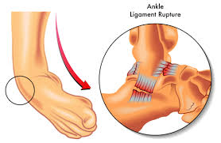
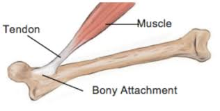
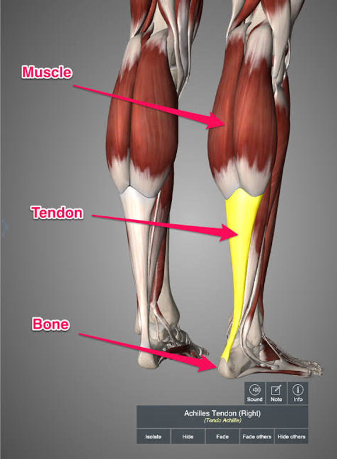
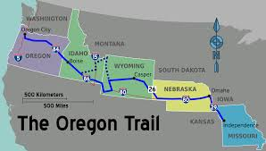

= step 2 - Lesson 32
:toc: left
:toclevels: 3
:sectnums:
:stylesheet: ../../+ 000 eng选/美国高中历史教材 American History ： From Pre-Columbian to the New Millennium/myAdocCss.css

'''

Lesson 32

== part 1

Interviewer: Could you tell me how we should keep fit?

[.my2]
采访者：您能告诉我, 我们应该如何保持健康吗？

Dr. Davis: Well really what we should do is to try to [erm （思索该说什么话时发出的声音）哦，嗯] keep fit all round 全面的；多方面的.  +
Now what do I mean by that? I mean er such things as keeping up our _strength_ and our _suppleness_ 柔软；易弯曲；顺从;柔韧度 and our _stamina_ (n.)耐力；耐性；持久力.  +

[.my1]
.案例
====
.stamina
-> stamina（活力）来自拉丁语stamina，是stamen的复数形 式，而stamen的原意是"织布机上的经线"，是纺织时的基础，其中的sta表示“stand”（站立）。因此stamina的本意就是“多根经线”。 +

由于 在罗马神话中，人的生命取决于命运三女神手中的命运之线，因此stamina也就与人的生命力产生了联系，表示构成生命的基本要素、生命活力。

原本表示“经线”的stamen现在则用来表示植物的“雄蕊”，因为雄蕊的形状与“经线”相似，在植物繁殖过程中的基础作用, 也与“经线”在纺织时的基础作用相同。  +

stamina：['stæmɪnə] n.活力，精力，生命力，持久力，耐力，康复能力 stamen：['steɪmən] n.雄蕊
====

Now er you may say why do we need all three of those things?  +
Well, erm strength is useful really just (ad.)真正地；确实；完全 so that we erm don’t strain (v.)拉伤，扭伤；绷紧 muscles or pull ligaments 韧带 and tendons 肌腱 when we suddenly have to do something er a bit energetic 精力充沛的；充满活力的；需要能量的；积极的 like ① lift (v.) a heavy suitcase or er perhaps er ② shift (v.)转移；挪动 a wardrobe or even ③ get out of a chair or a bath 浴缸，浴盆.

[.my1]
.案例
====
.just
(ad.)
( informal ) really; completely 真正地；确实；完全 +
• The food was just wonderful! 那吃的实在是好极了！ +
• I can just imagine his reaction. 我完全可以想象出他的反应。

.ligament
->  -lig-捆,约束 + -a- + -ment 名词词尾 +

.tendon
a strong band of tissue in the body that joins a muscle to a bone 腱 +
-> tend-,延伸，伸长，-on,名词后缀。用于指腱，肌腱。 +

====

Erm. Suppleness 柔韧度 is important er obviously so that you can bend and move freely and reach (v.) things, again without injuring yourself.  +
And stamina 耐力，持久力 is particularly important so that you can [sort of 有点儿] keep going 继续；维持下去 without …​ without losing breath 无法呼吸 so you have endurance (n.).  +

`主` One other #great plus# 优势；好处；长处 about developing stamina 耐力 `系` #is# that if you er maintain (v.) your stamina over a period of years, it actually has an effect of protecting the heart against heart disease.

[.my2]
戴维斯博士：嗯，我们真正应该做的, 是努力保持全面健康。我这是什么意思？我的意思是, 保持我们的"力量"、我们的"柔软度", 和我们的"耐力"之类的事情。现在你可能会说, 为什么我们需要这三样东西？嗯，"力量"确实很有用，这样当我们突然需要做一些需要精力的事情时，比如举起一个沉重的手提箱，或者呃也许呃移动一个衣柜，甚至走出去时，我们就不会拉伤肌肉, 或拉伤韧带和肌腱。一把椅子或一个浴缸。 +
嗯。"柔软度"显然很重要，这样您就可以自由弯曲、移动, 并够到东西，而且不会伤害自己。"耐力"尤其重要，这样你就可以继续前进, 而不会……​而不会失去呼吸，这样你就有耐力。 +
培养耐力的另一大好处是，如果你在几年内保持耐力，它实际上具有保护心脏免受"心脏病"的作用。

Interviewer: So out of those three, which is the most important?

[.my2]
记者：那么这三个中，哪个是最重要的呢？

Dr. Davis: Well, it depends who you are and what you want to do.  +
I mean, the …​ `主` the reason for keeping fit `系` is to keep fit for your way of life 生活方式, the life you choose.  +

Now, you may say 'Well, if I choose to [sort of] flop  (v.)（因疲惫而）猛然坐下，沉重地躺下 about in an armchair all day watching telly 电视, I don’t need to keep very fit, do I?'  +
Well, that’s unfortunately not true because there are always times when you have to make _a little bit of extra demand_ on your body.  +

Erm by force of circumstance. You may have to suddenly lift (v.) something heavy or move (v.) something or may have to er run for a bus or whatever.  +
In which case you could do yourself an injury and you may even actually erm harm something important, like your heart.  +

So it is important to actually to try to keep your fitness a little bit ahead of the sort of erm way of life that you have.  +
Just to give you …​ to push yourself just that little bit harder and get yourself just that little bit fitter.

[.my2]
戴维斯博士：嗯，这取决于你是谁以及你想做什么。我的意思是，......保持健康的原因, 是为了适应你的生活方式，你选择的生活。现在，你可能会说，“好吧，如果我选择整天坐在扶手椅上看电视，我不需要保持非常健康，不是吗？”不幸的是，事实并非如此，因为有时, 您必须对自己的身体提出一点额外的要求。嗯，迫于环境的力量。您可能必须突然举起重物或移动某物，或者可能必须跑去公交车或其他什么。在这种情况下，您可能会伤害自己，甚至可能伤害一些重要的东西，例如您的心脏。因此，重要的是要真正尝试让自己的健康状况, 比现有的生活方式提前一点。只是为了给你……​让自己更加努力一点，让自己变得更健康一点。

Interviewer: So how do you do it?

[.my2]
采访者：那你是怎么做到的呢？

Dr. Davis: Well it doesn’t have to be all grim 严肃的；坚定的；阴冷的;令人不快的；令人沮丧的 and irksome (a.)使人烦恼的；令人生气的.  +
I mean, people have this view of _fitness er freaks_ 畸形; 怪物;狂热爱好者 you know, who sort of are jogging 慢跑 grim-faced 表情严肃,面孔铁青的 round the park you know, or who are er working weights, doing _all sorts of horrible exercises_ you know.

[.my1]
.案例
====
.irksome +
-> irk,愤怒，-some,形容词后缀。
====

PT …​ Very grim indeed. It doesn’t have to be like that. To keep yourself fit, or get yourself fitter, which is really what it’s about, you just have to do a little bit more [each day, erm or even every other day] for that matter.  +
By a little bit more I mean erm for instance just er walking a bit more often, a bit further, perhaps getting off （使某人）离开，出发，动身 the bus a stop or two sooner 更早地.  +

Erm perhaps er doing a bit of …​ a bit of cycling 骑自行车 instead of travelling by public transport.  Using the stairs instead of going up in the lift.   +
It’s surprising the number of #people# that erm I see [on the London tube 伦敦地下铁道] #who# are actually standing [on the escalators 自动扶梯] going down you know, just standing there slowly going down.  +

And the same with lifts 升降机，电梯. People who take the lift down I mean, that’s ridiculous 可笑的，荒谬的. You should at least walk down, but preferably 更合意地，最好是 walk up, because by walking upstairs you actually perform (v.) really quite _a useful aerobic 需氧的；好氧的;有氧的；增强心肺功能的 exercise_, that’s an exercise that develops stamina 耐力, and that’s having a beneficial effect on your whole body, toning (v.) you up 使更健壮；使更结实；使更有力 and helping to protect against _heart disease_.

[.my2]
戴维斯博士：嗯，这并不一定都是残酷和令人厌烦的。我的意思是，人们对健身怪胎有这样的看法，你知道，他们在公园里, 面色严峻地慢跑，或者你知道，他们正在举重，做各种可怕的运动。  +
PT……确实非常严峻。它不一定是那样的。为了让自己保持健康，或者让自己变得更健康，这才是真正的意义所在，你只需要每天多做一点，呃，甚至每隔一天, 就做一点。我所说的多一点，是指呃，比如，多走一点，走远一点，也许早一两站下车。呃，也许呃，骑一点自行车，而不是乘坐公共交通工具。使用楼梯, 而不是乘坐电梯。令人惊讶的是，我在伦敦地铁上看到, 有多少人实际上站在自动扶梯上，你知道，只是站在那里慢慢地下。电梯也是如此。我的意思是，那些乘电梯下来的人，这太荒谬了。你至少应该走下去，但最好是走上楼，因为走上楼实际上是一种非常有用的有氧运动，这是一种增强耐力的运动，对你的整个身体产生有益的影响，使你强身健体，帮助你预防"心脏病"。

[.my1]
.案例
====
.aerobic
-> 词根aero, 空气。 -b同词根bio, 生命，见biology, 生物。存活生命的空气，即氧气。

.tone
(n.) [ U] how strong and firm your muscles or skin are（肌肉）结实，健壮；（皮肤）柔韧 +
- how to improve your muscleskin tone 如何使肌肉发达╱皮肤柔韧 +

(v.)[ VN] ~ sth (up) : to make your muscles, skin, etc. firmer and stronger使更健壮；使更结实；使更有力 +
• Massage will help to tone (v.) up loose skin under the chin.按摩有助于使颏下松弛的皮肤柔韧起来。 +
• a beautifully toned body 优美矫健的身体
====

Interviewer: So it isn’t necessary to play squash （软式）墙网球；壁球 three times a week or go swimming three times a week?

[.my2]
采访者：所以一周打3次壁球、游泳3次是没有必要的吗？

Dr. Davis: It isn’t necessary. Er actually swimming is a rather good way of keeping fit because it’s particularly excellent for erm _all three of the S-Factors_ if you like, the strength, the suppleness 柔韧度 and the stamina.  +
It helps to develop _all three of those_ rather well, and er it’s also a very pleasant and relaxing way to keep yourself in shape.

Three times a week would be just about right actually, or even _twice a week_, or even _once a week_.  +
Em. Squash though 不过，可是，然而 is not a good way to get fit 健壮的；健康的. You have to actually get fit to play squash.  +
Squash is a very demanding (a.)要求高的；需要高技能（或耐性等）的；费力的 game. A very very er energetic （活动）剧烈的，费力气的；高能的 game, and in fact you could do yourself a lot of damage 损害；伤害 by playing squash if you’re not in good physical shape to start with.

[.my2]
戴维斯博士：没有必要。嗯，实际上, 游泳是一种很好的保持健康的方式，因为它对于呃所有三个 S 因素（如果你愿意的话）尤其出色，即力量、柔软度, 和耐力。它有助于很好地发展这三个方面，而且这也是一种非常愉快和放松的, 保持身材的方式。其实一周三次就差不多了，甚至一周两次，甚至一周一次。嗯。不过，壁球并不是健身的好方法。您必须真正保持健康, 才能打壁球。壁球是一项要求非常高的运动。这是一项非常非常精力充沛的运动，事实上，如果你一开始的身体状况不佳，打壁球可能会对你自己造成很大的伤害。

Interviewer: I have a lot of friends who play sport, and they always seem to have bad backs and pulled tendons 肌腱, so what would you say to them?

[.my2]
采访者：我有很多运动的朋友，他们总是感觉腰不好、筋拉伤，你想对他们说什么？

Dr. Davis: I’d say to them they’re …​ they’re going about it the wrong way. Erm. They’re forcing themselves into …​ into sports, perhaps before they’re ready, before they’ve got themselves in shape 处于良好状态 first.  +
You have to get in shape to play these sports. Erm. And also for people who force themselves into these things generally. That’s bad. Mustn’t do that.  +

Whenever you’re exercising, or …​ or just carrying out some physical activity, never push yourself beyond 超出（范围） comfort.  +
Anything that’s uncomfortable, don’t do it. Stop. Slow down.  +

It’s basically got to be fun. I mean, to keep yourself in shape you’ve got to carry on 继续做；坚持干 exercising week in week out 一周又一周, month in month out, year in year out, Now that sounds (v.) awful, but if you choose something which you enjoy doing, er, it’s fun, then you will keep it up.  +

You see you can’t put fitness in the bank as it were. If you don’t carry on exercising, `主` all the benefits that you get from exercising `谓` will all disappear within about 6 to 8 weeks.  +
All go and you’ll be back where you stared so you have to keep it up, and to keep it up, it has to be something you enjoy, it has to be fun.  +
So choose (v.) something which you get a lot of pleasure out of, and that way it won’t seem irksome (a.)使人烦恼的；令人生气的 at all.

[.my2]
戴维斯博士：我会对他们说，他们…​ 他们的做法是错误的。嗯。他们可能在他们准备好之前，甚至在他们把自己调整好之前, 就强迫自己参加运动。你必须先使自己身体适应, 才能参加这些运动。嗯。对于那些通常迫使自己参加这些活动的人来说，这是不好的。不能这样做。无论何时你在运动，或者…​ 或者只是进行一些身体活动，永远不要超出舒适范围。任何让你感到不舒服的事情，都不要做。停下来。放慢速度。 +
基本上，运动必须是有趣的。我的意思是，要保持身体健康，你必须每周、每月、每年坚持锻炼。现在听起来很可怕，但如果你选择一些你喜欢做的事情，嗯，这是有趣的，那么你就会坚持下去。你看，你不能把健康存进银行。如果你不继续锻炼，你从锻炼中获得的所有好处, 都会在大约6到8周内消失。一切都会消失，你将回到起点，所以你必须坚持下去，而要坚持下去，就必须选择一些你喜欢的事情，它必须是有趣的。所以选择一些你能从中得到很多乐趣的事情，这样它就不会看起来令人讨厌了。

Interviewer: What do you do to keep fit?

[.my2]
采访者：你会做什么来保持身材？

Dr. Davis: Ah well, I’m glad you asked me that question. Actually, what I …​ I live in London and I work in London, er so what I do to keep fit is to certainly do quite a lot of walking.  +
I certainly walk upstairs er a lot, but also I do a fair amount of cycling, er and as I’m dashing 猛冲 round London I use the bike.  +

I find it the fastest way to get around town and it’s er it’s really good for keeping in shape. +
I’m a little worried about the traffic fumes 刺鼻（或有害）的气，烟, I have to admit （勉强）承认；招认, but actually er it makes me feel (v.) very good to cycle (v.) around there and I get there on time!

[.my2]
戴维斯博士：嗯，我很高兴你问我这个问题。事实上，我……​我住在伦敦，在伦敦工作，所以我为了保持健康所做的, 就是做大量的步行。我当然经常步行上楼，呃，但我也骑了很多自行车，呃，当我在伦敦奔跑时，我会骑自行车。我发现这是游览城镇最快的方式，而且它对于保持身材, 真的很有好处。我不得不承认，我有点担心交通烟雾，但实际上，呃，在那里骑自行车让我感觉非常好，而且我准时到达那里！

'''

== part 2. 部分

In September bombs went off 开火；爆炸 in Coeur d’Alene, Idaho. They were #the work# allegedly 据说，据宣称 #of# a group of Neo-Nazis 纳粹分子, three of whom now sit (v.) in an Idaho jail awaiting trial.  +
While they wait, commentator （电台、电视台或报刊的）评论员,现场解说员 Clay Morgan has been thinking about the bombings, the bombers 扔炸弹的人 and what it all means (v.) for his part of the country.

[.my2]
九月，爱达荷州科达伦发生炸弹爆炸。据称，这些作品是一群新纳粹分子的作品，其中三人, 目前关押在爱达荷州的一所监狱中等待审判。在他们等待的同时，评论员克莱·摩根一直在思考爆炸事件、扔炸弹的人, 以及这一切对他所在的地区意味着什么。

[.my1]
.案例
====
.ˌgo ˈoff
(1)to leave a place, especially in order to do sth 离开（尤指去做某事） +
• She went off to get a drink.她拿饮料去了。

(2)to be fired; to explode  开火；爆炸 +
• The gun went off by accident.  枪走火了。 +
• The bomb went off in a crowded street.炸弹在挤满人群的大街上爆炸了。
====

I lived in _a promised land_. We got trouble here right now. Some Neo-Nazis declared the north-west to be the homeland for the white races 人种；种族.  +

In the past several weeks we’ve had four bombs blow up. The situation here is serious. I had a hope that they just go away. I was embarrassed by the news coverage. Every time I saw a story, I cringed (v.) 感到尴尬不安；觉得难为情; 畏缩；怯退 and thought (v.) my God this will make four more of them move here. Then the bombs exploded in Coeur d’Alene.  +

[.my1]
.案例
====
.cringe
-> 来自PIEsker, 弯，转，词源同ring, curve. 词义由弯，转过渡到蜷缩，畏缩。
====

Let me describe these people to you. They are men mostly. They like (v.) to live in forts 堡垒，[军]要塞, and dress up like Hitler.  +
They wear (v.) jackboots 马靴, brown shirts 衬衫 and _military caps_ 便帽，制服帽.  +
They march (v.) around and act (v.) tough (ad.a.)严厉的；强硬的；无情的. _What they are_ is evil. These are _the cowardly 怯懦的，胆小的；恃强凌弱的 little boys_ who never grow up. It is our misfortune that they came here.  +

The north-west `谓` attracts (v.) these people [with all the attributes  属性 of _a promised land_]. A promised land you see is a place that’s far away, isolated 遥远的，偏僻的 and sparsely 稀疏地；贫乏地  populated (v.)居住于；生活于；构成…的人口 by people who try to mind (v.)关心，照看（人或物） their own business.  +

The north-west fits (v.) that bill 符合要求；合格. Ninety percent of some of our states are _public lands_ 公有土地, owned by everybody. That’s everybody.  +
This is a place to breath in. The pioneers came here on _the Oregon trail_ 俄勒冈小径. The Mormons 摩门教徒 came here to practice their religion.

[.my1]
.案例
====
.fillfit the ˈbill
to be what is needed in a particular situation or for a particular purpose符合要求；合格

.Oregon Trail
俄勒冈小道（美国西进运动中的重要通道）. 19世纪中期美国拓荒者用于迁徙的一条西部开拓路线，从密苏里州的独立城开始，穿越北美大陆，最终到达俄勒冈州的威拉米特河谷。 +

====

The Basques 巴斯克人 came here to escape poverty and persecution （尤指因种族、宗教或政治信仰而进行的）迫害，残害；烦扰 in Spain. +
Wyoming 美国州名 was the first state to give women the vote, the first to elect a woman governor. +
Idaho was the first to have a Jewish 犹太人的；犹太族的；犹太教的 governor.  +

Now we are attracting (v.) fascists 法西斯主义的支持者 like we were Paraguay 巴拉圭（南美洲一国名）. Bad things are happening in a good place.

[.my2]
我曾生活在一个允诺之地。现在我们这里有麻烦。一些新纳粹分子宣称, 西北部是白人种族的故乡。在过去的几周里，我们遭受了四次爆炸袭击。这里的情况很严重。我曾希望他们离开。我为新闻报道感到尴尬。每次看到一则报道，我都感到不安，想着我的天，这将又有四个人搬到这里来。然后炸弹在科尔德兰爆炸了。 +
让我向你描述这些人。他们大多是男性。他们喜欢住在堡垒里，穿得像希特勒。他们穿着军靴、棕色衬衫和军帽。他们围着走来走去，表现得很强硬。他们是邪恶的。这些人是永远长不大的懦夫小男孩。不幸的是，他们来到了这里。 +
西北部吸引了这些人，具有允诺之地的所有特征。允诺之地就是一个远离的、孤立的地方，人们试图专心做自己的事情。西北部符合这一条件。我们某些州的百分之九十, 是公共土地，属于每个人。那是每个人的。这是一个可以呼吸的地方。开拓者们走上俄勒冈之路, 来到这里。摩门教徒来到这里, 信仰他们的宗教。巴斯克人来到这里, 逃避西班牙的贫困和迫害。怀俄明州是第一个给予妇女选举权的州，也是第一个选举女州长的州。爱达荷州是第一个有犹太州长的州。现在，我们吸引了法西斯分子，就像我们是巴拉圭一样。在一个美好的地方发生了糟糕的事情。

We would like 想要做某事想让某人做某事 to have the sheriff 县治安官，城镇治安官（美国民选地方官员） go to them and say, "Pack up 整理行李! Clear up 整理，清理! Get out of the state by sundown 日落!" But we cannot. It is not against the law to believe in evil.  +

[.my1]
.案例
====
.would
(v.) ~ like, love, hate, prefer, etc. sth(sb) to do sth | ~ rather do sthsb did sth : used to say what you like, love, hate, etc.（表示愿意、喜欢、不愿意等） +
• I'd love a coffee. 我想喝杯咖啡。 +
• I'd be only too glad to help. 我非常愿意帮忙。
====

`主` The white supremacists 至上主义者 后定 protected (v.) by laws `谓` are meant (v.) to protect everybody. That’s everybody. And #we are to# keep those laws.  +

[.my1]
.案例
====
.be to do sth.
The phrase "be to do something" can have 4 meanings - depending on context: +
短语“be to do some”可以有 4 种含义 - 取决于上下文：

a) used to talk about arrangements for the future +
a) 用于谈论未来的安排

b) used to give an order or to tell someone about a rule +
b) 用于发出命令, 或告诉某人规则

c) used to say or ask what someone should do or what should happen +
c) 用于说或问某人应该做什么, 或应该发生什么

d) used to ask how something can be done +
d) 用于询问如何做某事

-First, we have to understand the nature of the virus, if we are to overcome it. +
首先，如果我们要战胜病毒，我们就必须了解病毒的本质。
====

We can only watch these creeps 讨厌鬼;讨好卖乖的人；谄媚奉承的人；马屁精 and be ready when they make their move 采取行动.

`主` The people who set off those bombs in Coeur d’Alene `谓` meant to rob (v.) the bank and ransack (v.)洗劫；（为找东西）把…翻腾得乱七八糟 the armory 军械库；兵工厂.  +

[.my1]
.案例
====
.ransack
-> 来自古诺斯语 ransakka,入室抢劫，来自 rann,屋子，房屋，词源同 barn,saka,搜寻，翻找，词 源同 seek.
====

But when the bombs went off 开火；爆炸, `主` the law `谓` came down so fast and hard 冷酷无情的；硬心肠的；苛刻的;准备战斗的；不软弱退缩的 the perpetrators 犯罪者，作恶者 lost (v.) their nerve 勇气；气魄. They got caught.  +
There were several others who were not in jail yet. But we know about them.  +

We can stand up 抵抗，对抗 to them. Those bombs did not scare (v.)使惊恐，吓唬 Coeur d’Alene. So get ready for _a good ending_ to _a bad story_.  +
After all this embarrassment, Coeur d’Alene would be the town that stands up to evil and wins. And _this Promised Land_, maybe, would drop out 不再参加；退出；脱离 the news and we can mind (v.) our own business again.

[.my2]
我们希望警长能去找他们，说：“打包！收拾！在日落前离开这个州！”但我们不能。相信邪恶, 并不违法。受法律保护的白人至上主义者, 旨在保护每个人。这是每个人。我们必须遵守这些法律。我们只能观察这些怪胎，并在他们采取行动时做好准备。 +
在科尔德兰引爆那些炸弹的人, 本意是抢劫银行, 和搜查军械库。但当炸弹爆炸时，法律迅速而严厉地制裁，使犯罪者失去了胆量。他们被抓住了。还有几个人尚未被关进监狱。但我们知道他们。我们可以对抗他们。那些炸弹并没有吓倒科尔德兰。所以准备好让这个糟糕的故事有一个好结局。 +
经历了所有这些尴尬，科尔德兰将成为站起来对抗邪恶, 并取得胜利的城镇。也许这个允诺之地, 会从新闻中消失，我们可以重新专注于自己的事务。

Writer 作者 Clay Morgan `谓` lives in McCall, Idaho. He comes to us by way of _member station_ KBSU in Voizy, Idaho.

[.my2]
作家克莱·摩根, 住在爱达荷州麦考尔。他通过爱达荷州 Voizy 的 KBSU 会员站来, 到我们这里。

'''

== What Your Sense of Time Tells about You (I)

你的时间观念, 告诉你什么（一）

Imagine you are _a high school principal_ 大学校长；学院院长. A teacher bursts (v.)猛冲；突然出现 breathless 喘不过气来的；停止呼吸的 into your office. "There’s _a fist fight_ in the lunchroom （学校或办公楼的）食堂，餐厅," she gasps (v.)喘气. The responsibility is yours to stop the fight. How do you meet 满足；使满意 it?

[.my2]
假设你是一位高中校长。一位老师气喘吁吁地冲进你的办公室。“午餐室里有一场打架，”她喘着气说。停止这场打架的责任就落在了你的肩上。你会如何应对呢？

(1) Perhaps you, as a youngster 年轻人，少年, took part in fights and `主` _your present-day 现在的；现时的 ties (n.) with students_ `系` are warm and strong. You can stop the fight because your prestige 声望，威信 is high among them.

[.my2]
(1) 也许你年轻时曾参与过打架，而你与学生之间现如今的关系, 是温暖而紧密的。你可以制止这场打架，因为你在他们中间的威望很高。

(2) You have a plan 后定 prepared. Other schools have been disrupted so you have already planned a way to stop any fight.

[.my2]
(2) 你已经准备好了一个计划。其他学校已经被打乱了，所以你已经计划好了一种方式来阻止任何打斗。

(3) You are totally confident (a.)肯定的；确信的；有把握的 of your abilities in a crisis 危机，紧要关头.   +
You are ready to stride  (v.)大步走，阔步走；跨越 into the lunchroom and take charge 承担责任，掌管 without a single qualm 疑虑；不安.  +
`主` Stopping the fight `谓` will be easy.

[.my2]
(3) 你对自己在危机中的能力完全自信。你准备好走进午餐室，毫不犹豫地掌控局面。制止这场打斗将会很容易。

(4) You fervently  热心地；热诚地 wish (v.) that you could delegate (v.)授（权）；把（工作、权力等）委托（给下级） the job since you know that you’re not a talented 有天资的，有才能的 peacemaker 调解者；和事佬.  +
You wish (v.) you could return to the job of planning for the school’s needs 后定 ten years hence 因此；之后;（从现在开始）…天、星期等之后.

[.my2]
(4) 你非常希望能够委托别人去做这件事，因为你知道自己并不是一个有天赋的和平使者。你希望能够回到规划学校未来十年需求的工作中去。

[.my1]
.案例
====
.hence
...DAYS, WEEKS, ETC. ˈHENCE
( formal ) a number of days, etc. from now （从现在开始）…天、星期等之后 +
• The true consequences will only be known several years hence. 真正的后果, 只有在几年之后才能知道。
====

`主` One of these four reactions `系` would be the first you’d feel, but only one — not two or three of them, say three psychologists.  +
These psychologists 心理学家 — Dr. Harriet Mann, Dr. Humphrey Osmond and Miriam Siegler — have come up with 找到（答案）;想出，提出；拿出（一笔钱等） a scheme for sorting (v.) people regardless of their education, age or situation.

[.my2]
以上四种反应中会是你首先感觉到的，但只有一种，而不是两种或三种，说三位心理学家。这些心理学家——哈里特·曼博士、汉弗莱·奥斯蒙德博士, 和米里亚姆·西格勒——提出了一个方案，无论教育、年龄或情况如何，都能够对人们进行分类。

The concept is based on the premise 前提，假设 that all people have a basic way of seeing time. Each of us is predisposed (a.)先有倾向的，先有意向的 to seeing (v.) all events from one time vantage 优势；有利情况；有利地位 point.  +
#Either# （对两事物的选择）要么…要么，不是…就是，或者…或者 it reminds (v.)使想起 you of the past (past-oriented), how the event fits (v.) in to (这里估计是错的) today, yesterday and tomorrow (time line), _what it is_ today (present), #or# how _it will develop_ (future).

[.my2]
这一概念基于一个前提，即所有人都有一种基本的"时间看待方式"。我们每个人都倾向于从一个时间角度, 来看待所有事件。要么是回忆过去（过去导向），看事件如何与今天、昨天和明天联系在一起（时间轴），今天它是什么（现在），或者它将如何发展（未来）。

[.my1]
.案例
====
.either... or...
used to show a choice of two things（对两事物的选择）要么…要么，不是…就是，或者…或者 +
- Either he could not come or he did not want to.他要么是不能来要么就是不想来。
====

The three began working in 1968 when Dr. Mann and Mrs. Siegler were assistants 助理；助手 to Dr. Osmond, director, at the Bureau 局，处，科；办事处 of Research, New Jersey _Neuro-Psychiatric 精神病学的，精神病治疗的 Institute_ in Princeton. +

Dr. Osmond is currently devising (v.)发明 ways to make _empirical 以实验（或经验）为依据的；经验主义的 studies_ of the theory and Dr. Mann is in Cambridge, Massachusetts, writing a book on _the Worlds of Time_ 时间的世界.  +

Their _take-off （飞机的）起飞 point_ was an interest (n.) in observations 观察，观察值；观察结果 made by _Swiss psychologist_ Carl Gustav Jung, who described in the 1920s `宾`  the temperamental 气质的；性情的；性格的 differences of four psychological types.  +

Jung is known as the founder of _analytic psychology_ 分析心理学.  +
Since Jung’s work in 1921, however, no one had conceived of 想出（主意、计划等）；想象；构想；设想 _a theoretical framework_ that would account for 解释，说明 the four types.  +

Without such a framework, there was no possibility of substantiating (v.)证实，使确凿 that `宾从` `主` people of different types `谓` experience (v.) the world very differently.  +

Time and space are the touchstones 试金石；（检验）标准 in the system.  +
Each person, after all 毕竟;终究, uses (v.) _his time_ somehow 以某种方式（或方法） and _exists_ 后定 within and acts (v.) upon 根据（建议、信息等）行事 the space 后定 around him.  +

Dr. Mann and company propose (v.)提议，建议；提出（理论或解释） that certain traits  特性，特质，性格 are shared by persons falling in each of the four categories.

[.my2]
三人于1968年开始合作，当时曼博士和西格勒女士. 担任新泽西州普林斯顿的"新泽西州神经精神研究所"的主任奥斯蒙德博士的助手。奥斯蒙德博士, 目前正在设计一种方法, 来对该理论进行实证研究，曼博士则正在马萨诸塞州剑桥, 写一本关于时间世界的书。 +
他们的出发点, 是"对瑞士心理学家卡尔·古斯塔夫·荣格在1920年代所做的观察"的兴趣，他描述了四种心理类型的性格差异。荣格被称为"分析心理学"的创始人。然而，自1921年荣格的工作以来，没有人构想出一个理论框架，可以解释这四种类型。没有这样的框架，就不可能证实不同类型的人对世界的体验有很大不同。 +
时间和空间是该系统的基石。毕竟，每个人都以某种方式, 利用他的时间，存在于并影响着他周围的空间。曼博士等人提出，某些特质, 被共享者落入了四个类别中的每一个。

The first type, the past type, sees time as being circular 圆形的；环形的；圆的. For him, the past crops up （尤指意外地）出现，发生 in the present and then returns to the past as a memory.  +
He enjoys collecting souvenirs 纪念品，纪念物 and keeping diaries 日记，日记簿. He tells stories about Great Aunt Hattie and always remembers (v.) your birthday.

[.my2]
第一种类型是"过去型"，他将时间看作是循环的。对他来说，过去出现在现在，然后作为记忆返回到过去。他喜欢收集纪念品和写日记。他讲述了有关哈蒂大婶的故事，并始终记得你的生日。

Past types #are pegged# (v.)视为；看做;用夹子夹住；用楔子钉住 by this system #as# emotional people who see the world in a highly subjective (a.)个人的；主观的 way.  +

[.my1]
.案例
====
.peg
(v.) ~ sb as sth : ( NAmE informal ) to think of sb in a particular way 视为；看做 +
• She pegged him as a big spender. 她觉得他是个大手大脚的人。
====

For instance, _School Principal_ I (past type) could identify (v.)确认；认出；鉴定 with the fight and know (v.) how to handle it because of some past experience — #whether# it be similar fights as a child himself #or# ones 后定  previously dealt with as the school principal.  +

In addition, `主` _past types_ `谓` usually follow (v.) strict _moral codes_ 道德准则 and often are valued (v.) #more# for _what they are_ #than# for _what they do_.  +
This quality itself — because `主` it lends  (v.)借出;提供，给予 authoritarian strength to one who possesses it — `谓` might cause the students to quit (v.) fighting.  +

_Past types_ often have been found (v.) to be skillful at assessing (v.) the exact emotional tenor 大意；要旨；要领 of an event and are adept (a.)内行的；熟练的；擅长的 at influencing (v.) others' emotions, according to the Mann group.

[.my2]
根据这一系统，过去型的人, 被定义为情感丰富的人，他们以一种高度主观的方式, 看待世界。例如，校长I（过去型）, 可能会与这场打架产生共鸣，并且知道如何处理它，因为他可能有过类似的童年经历——无论是作为孩子自己参与的打架, 还是之前作为学校校长处理过的打架。 +
此外，过去型的人, 通常遵循严格的道德准则，往往更受人们的重视，因为他们是谁，而不仅仅是他们所做的事情。这种特质本身——因为它赋予了拥有者权威力量——可能导致学生们停止打架。 +
根据曼氏小组的研究，过去型的人通常擅长评估事件的确切情感氛围，并善于影响他人的情绪。

Research reveals (v.) that many past-oriented people are flexible (a.) in early years when they do not have much of a personal past to draw upon 借鉴，利用.  +
However, the dash 猛冲；突进；急奔 of youth is often replaced by a need for stability 稳定（性） and usually is rooted by age thirty-five or so. From this age onward 继续的；向前的, they are conservatives (a.n.)保守的；守旧的;保守者，因循守旧者.

[.my2]
研究表明，许多过去型的人在早年, 通常是灵活的，因为他们没有太多个人经历可以借鉴。然而，年轻时的活力, 往往会被稳定性的需求所取代，通常在三十五岁左右根深蒂固。从这个年龄开始，他们就会变得保守。

"They need to see (v.) things in the ways which were _popular, fashionable and appropriate_ in their younger days," explains Dr. Mann.  +
This applies (v.), with exceptions 规则的例外；例外的事物 of course, to _personal taste_ in clothing fashions, music appreciation 欣赏，鉴赏, and other social and environmental factors.  +

In short 总之, _the past type_ often clings (v.)抓紧；紧握；紧抱 to the well-established way with _nostalgic (a.)思乡的；引人怀旧的 verve_ 精力；激情；热情；热忱.  +
Also, _the past type_ finds (v.) it difficult to be punctual (a.)准时的，守时的 since _the on-going 正在进行的；继续的，持续的 feeling_ is more important than his next task.

[.my2]
“他们需要以年轻时流行、时尚和合适的方式看待事物，”曼博士解释道。当然，这也适用于个人对服装时尚的品味、音乐欣赏, 以及其他社会和环境因素。简而言之，过去的类型往往怀着怀旧的神韵，固守既定的道路。此外，过去型的人发现很难"准时"，因为正在进行的感觉, 比他的下一个任务更重要。

[.my1]
.案例
====
.verve
(n.)[ Using.]energy, excitement or enthusiasm 精力；激情；热情；热忱
SYN gusto +
• It was _a performance_ of verve and vitality. 这是一场充满激情与活力的演出。 +

-> 来自拉丁语 verba,灵光闪现想出的字词，灵感，词源同 word.原指在写作和艺术方面特殊的 才能，引申词义神韵，热情等。
====

The goal of these people is "to develop _a language of the heart_, #rather than# _of the mind_.  +
To develop (v.) those techniques which make memories live (v.), and to dignify (v.)使有尊严；使崇高；使显贵；使增辉 any act of remembrance 纪念，怀念；记忆，回忆; those are _the essential 完全必要的；必不可少的；极其重要的 concerns_ of _past-oriented types_," explain (v.) the authors in the Journal of _Analytical Psychology_.

[.my2]
这些人的目标, 是发展一种心灵的语言，而不是思想的语言。发展那些让记忆活起来的技巧，并尊重任何纪念行为，这是过去型人群的基本关注点，作者在《分析心理学杂志》中解释道。

'''
