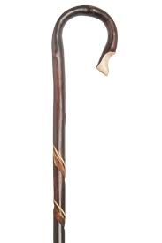
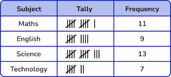
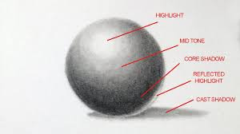

= step 2 - Lesson 33
:toc: left
:toclevels: 3
:sectnums:
:stylesheet: ../../+ 000 eng选/美国高中历史教材 American History ： From Pre-Columbian to the New Millennium/myAdocCss.css

'''

Lesson 33

== part 1. 部分

Angela: Would you like …​ to tell me about it?

[.my2]
安吉拉：你愿意……告诉我这件事吗？

Denise: Yes, I think …​ it’s rather a unique experience, actually.

[.my2]
丹尼斯：是的，我认为……实际上，这是一次相当独特的体验。

I was in New York, er, er, a few years ago /and I wanted to read a particular poem, so I went along (ad.)向前 to the public library.

[.my2]
几年前我在纽约，呃，呃，我想读一首特别的诗，所以我就去了公共图书馆。

[.my1]
.案例
====
.along
(ad.) forward 向前 +
• I was just walking along /singing to myself. 我独自唱着歌向前走着。
====

(I see) Now, the public library is different from any, er, library that I’d ever seen, because you never see a book on a shelf, and, er, I went into the building and I was directed to Room 101, where I had to fill in a form with the author and the title of the book that I wanted.

[.my2]
(我明白了)现在，公共图书馆与我以前见过的任何图书馆都不同，因为你在书架上看不到书，我进了建筑物，被指引到101室，我必须填写一个表格，写上我想要的作者和书名。

I was handed a disc /and directed to another room which looked like a cinema.

[.my2]
他们递给我一张光盘, 并引导我到另一个看起来像电影院的房间。

I sat down in this room and waited for _the number on my disc_ to flash (v.) on the screen.

[.my2]
我坐在这个房间里，等待光盘上的数字在屏幕上闪烁。

I waited and waited and waited /and noticed that #people# who came in after me, er, #were leaving# (Mhm) /and so I went back to the original room to find out what had happened /and I was told that, erm, they couldn’t read the writing on my form, (oh dear) so I filled in another form /and was on my way to, er, th, the cinema-like room /when, erm, I saw, er, a woman standing in the …​ in the corridor （建筑物或火车内的）通道，过道. +
Now she was obviously trying to attract somebody’s attention.

[.my2]
我等待了很久，发现在我之后进来的人，后来都离开了，所以我回到原来的房间想知道发生了什么事，我被告知他们看不清我的表格上的字迹，所以我填写了另一张表格，然后在去那个看电影般的房间的路上，当时我看到一个女人站在走廊里，她显然在试图吸引某人的注意。

She was dressed very poorly and she #had# what looked like, er, a sor…​, some kind of #fur hat# 裘皮帽, a rather mangy (a.)污秽的；疥癣的；肮脏的 fur hat, and on this hat was fixed a ra, a crook （旧时牧羊人捕羊的）曲柄杖;骗子-like feather 羽毛, a very, very long crook-like feather.

[.my2]
她穿着很差，戴着一顶像羊皮帽子的帽子，上面固定着一个弯曲的羽毛，一个非常长的弯曲的羽毛。

[.my1]
.案例
====
.fur hat

.mangy
(a.)( of an animal动物 ) suffering from mange 患疥癣 jiè xuǎn 的 +
( informal ) dirty and in bad condition 污秽的；糟糕的

疥癣（Mange），其他类传染病、寄生虫病.

.crook +
(n.) a long stick with a hook at one end, used especially in the past by shepherds for catching sheep（旧时牧羊人捕羊的）曲柄杖 +
( informal ) a dishonest person 骗子 +

-> 弯钩，骗子. 来自PIEsker, 转，弯，词源同curve, crank. +

====

And, er, this, this attracted (v.), er, my attention /后定 I think more than anything, so I stopped and asked her if I could help her /and she told me what I thought then was a rather a, an appalling 令人震惊的；使人惊骇的；极为恶劣的 story.

[.my2]
这吸引了我的注意，比其他任何事情都吸引了我的注意，所以我停下来问她是否需要帮助，她告诉我一个当时我认为是一个令人震惊的故事。

She’d come in from the outskirts 市郊，郊区 of New York, erm, to see a sick friend, and just as, as she had been coming out of the underground train 地铁, the doors had closed and her handbag had been snatched 一把抓起；一下夺过 and her umbrella, er, was caught in the closing door. +
She managed to wrench (v.)猛拉，猛扭，挣脱 the umbrella out /and a little bit was chipped off （小块地）损坏，毁坏，剥落，被损坏，被毁坏. She showed me where it had been chipped off.

[.my2]
她从纽约郊区来看一个生病的朋友，就在她从地铁里出来时，车门关闭了，她的手提包被抢走了，她的伞被夹在关闭的车门里。她设法把伞拔出来，有一点掉了下来。她给我看了伞上被掉下来的地方。

(M) She said that she had no money to return home and also she’d had nothing to eat all day. +
So I forgot about the poetry and we *went* over the road *to* a little tea-shop.

[.my2]
(哦)她说她没有钱回家，也一整天都没吃东西。所以我忘了诗歌，我们就去了对面的一家小茶馆。

And I must say #it was# /[when we got to the tea-shop and I was getting the tea /and had left my bag on the chair] /#that# I began just to be _a tiny little bit suspicious_ /and I looked back at her but she was sitting quite innocently 纯洁地；无罪地 at the table.

[.my2]
我必须说，当我们到了茶馆，我正要倒茶，把我的包放在椅子上时，我开始有一点点怀疑，我回头看了她一眼，但她却坐在桌子旁，一副无辜的样子。

(M) Anyway, we had a little conversation — she was quite an interesting woman — and then I sa…​, I realized that it was about time I was making my way home. +
So I said to her, 'Well, erm, I’ve got two dollars and ten dollars. Er, how much will you need?' And she said, 'Well, the ten dollars will do me fine'.

[.my2]
(嗯)无论如何，我们进行了一番交谈，她是个很有趣的女人，然后我意识到是时候回家了。所以我对她说，“嗯，我有两美元和十美元。你需要多少？”她说，“十美元就够了。”

I thought (v.) that was little bit much at the time /so I said, 'No, I’ll give you the two dollars', which I did.

[.my2]
那时我觉得有点过分，所以我说，“不，我给你两美元”，我确实给了她。

And then we, we, we bade (v.)向（某人）问候、道别等 each other good-bye /and I was just …​ going off when she called me back and said, 'May I, er, take your address, so that I can return the two dollars?' which, er, I gave her and then I went off. +
I had _sundry (a.)杂项的 other things_ to do.

[.my2]
然后我们告别了，我正要离开时，她叫住了我，说，“我可以拿你的地址吗，这样我就能还给你两美元？”我把地址给了她，然后就走了。我还有其他事要做。

[.my1]
.案例
====
.bid
(v.)~ (sb) good morning, farewell, etc.  : ( formal ) to say ‘good morning’, etc. to sb向（某人）问候、道别等 +
• I bade farewell to all the friends I had made in Paris. 我告别了我在巴黎结交的所有朋友。 +
• I bade all my friends farewell. 我告别了所有的朋友。
====

I think I went to a book-shop, #and# I went to buy _a scarf 围巾，披巾，头巾 or pair of gloves and, er, er, all these things_ on my way home /#and# when I got home I was still thinking about the two dollars /#and# I opened my purse to, to count (v.) my money /#and# I found that I had about fourteen or fifteen dollars when I’d, when I had only had the twelve when I set off 出发，启程 originally.

[.my2]
我想我去了一家书店，然后去买了一条围巾或一双手套，我回家后还在想那两美元，我打开钱包数钱，我发现我大约有14或15美元，而我最初出发时只有12美元。

(Mm) (Nasty 极差的；令人厌恶的；令人不悦的) So somebody along the way had given me the wrong change 找给的零钱；找头. +
I did think about retracing (v.)沿原路返回；折回 my steps, but it seemed too much trouble, so I didn’t.

[.my2]
所以路上有人找错了钱给我。我确实想过回去，但似乎太麻烦了，所以我没有。

I waited about a week, half expecting (v.) my two dollars back /but, of course, it didn’t come back, so I realized that, er, I’d been conned (v.)欺骗，诈骗, I think the word is.

[.my2]
我等了大约一个星期，半期望着我的两美元会回来，但当然没有回来，所以我意识到，我被骗了，我想这个词是。

(Yes) Well, a month later, I was walking around — it was the end of January — I was walking around, er, in New York /and it really was freezing (a.)极冷的；冰点以下的，冰冻的. +
I couldn’t feel my hands or my feet.

[.my2]
(是的)一个月后，我在纽约四处走动，那天是一月底，天气真的很冷，我的手和脚都冻僵了。

So I went into the Barbazon Plaza Hotel to warm myself, because all the buildings in New York are centrally 集中 heated, and as soon as I’d got into the hotel, I noticed that /the foyer （剧院或旅馆的）门厅，休息厅 was covered with mirrors /and, in one corner of the foyer, I saw this old woman.

[.my2]
于是我就走进巴巴松广场酒店取暖，因为纽约的所有建筑都是集中供暖，一进酒店，我就发现门厅里布满了镜子，在一个角落里，到了门厅，我看到了这个老妇人。

[.my1]
.案例
====
.foyer
1.a large open space inside the entrance of a theatre or hotel where people can meet or wait（剧院或旅馆的）门厅，休息厅 +
SYN lobby +
2.( NAmE ) an entrance hall in a private house or flat/apartment（私宅或公寓的）前厅，门厅 +

====

Now the reason why I recognized her `系`  was that /she was dressed in _a Persian 波斯的；伊朗的 lamb coat_ (外套，大衣) 羊皮外套 this time — very, very expensive _Persian lamb coat_ — and she had _a Persian lamb hat_ on her head.

[.my2]
现在我之所以认出她，是因为她这次穿着一件波斯羊羔毛大衣——非常非常昂贵的波斯羊羔毛大衣——头上还戴着一顶波斯羊羔毛帽子。

[.my1]
.案例
====
.lamb coat

====

But affixed (v.)粘上；贴上；附上 to this Persian lamb hat `系`  was the same long crook-like feather!

[.my2]
但这顶波斯羊羔帽上, 却贴着同样长长的弯状羽毛！

Angela: How funny! +

Denise: So I thought (v.) to myself, 'Well, it’s amazing. I, I, I wonder if I will get the same story if I go over there.'  +
So I went over to the mirror and took out my comb 梳子 and compact 带镜小粉盒 /and pretended (v.) to set about 开始做；着手做, er, _righting (v.) 改正；纠正；使恢复正常 my face_, when the lady came up to 接近，靠近：移动到（某人或某物）附近 me /and *without any ado 毫不迟延；干脆；立即 at all* poured (v.)倾倒，倒出 out the same story.  +

So I turned to her and looked her straight in the face /and I said, 'You and I met a month ago in the public library'. And then I walked off.

[.my2]
安吉拉：真有趣！ +
丹尼斯：所以我心里想，‘嗯，这太棒了。我，我，我想知道如果我去那里我是否会得到同样的故事。于是我走到镜子前，拿出梳子和粉盒，假装要开始，呃，矫正我的脸，这时那位女士走到我面前，毫不犹豫地讲述了同样的故事。于是我转向她，直视她的脸，说道：“你和我一个月前在公共图书馆见过面”。然后我就走开了。

[.my1]
.案例
====
.ado
n.麻烦，困难；纷扰，忙乱

.WITHOUT FURTHER/MORE ADO
( old-fashioned) without delaying; immediately毫不迟延；干脆；立即
====

'''

== part 2. 部分

In this country, today was a day of waiting (v.) by voters to learn (v.)  if their candidate won (v.) or lost (v.).  +
That provides more suspense (n.)（对即将发生的事等的）担心；焦虑；兴奋；悬念 *than* is typical in elections in Mexico.  +

In that country, the ruling _Institutional Revolutionary Party_ has not lost (v.) a single state or national election /since its founding in 1929.  +
Critics 评论家；批评者 of the system in Mexico say (v.) it is not truly democratic (a.)民主的 /because _the opposition parties_ had virtually 事实上，几乎 no chance of taking power.  +

But those parties have grown stronger in recent years /and there  is increasing (a.) pressure to change (v.) the procedures 程序；规程 for elections.  +
Today the Mexican Congress began work on _a package of （必须整体接收的）一套东西，一套建议；一揽子交易 reforms_ 后定 that eventually could give _opposition parties_ a greater voice in politics in Mexico.  +

NPR’s Tom Julton reports (v.) in Mexico City.

[.my2]
在这个国家，今天是选民等待了解他们的候选人是否获胜或失败的一天。这比墨西哥选举中的典型选举更具悬念。在该国，执政的"革命制度党", 自 1929 年成立以来, 从未输过一次州或全国选举。墨西哥这一制度的批评者表示，它不是真正的民主，因为反对党几乎没有夺取权力的机会。但这些政党近年来变得越来越强大，改变选举程序的压力也越来越大。今天，墨西哥国会开始制定一系列改革方案，最终可以让反对党在墨西哥政治中, 拥有更大的发言权。 NPR 的汤姆·朱尔顿在墨西哥城报道。

A week ago Sunday, voters in the Mexican state of Sinaloa `谓`  elected a new governor.  +
But in a few days, spokesmen for _the National Action Party_, the opposition 反对党；在野党, were claiming (v.)声称 victory.  +

But yesterday the government announced (v.) a different result.  +
The winner, the government said, was the candidate 候选人，申请者 of _the ruling party_, the PRI, by its initials  首字母；缩写 in Spanish, and by a three-to-one margin.  +

_The National Action Party_ immediately charged (v.)控告，指控 that `主` the PRI with the government’s help `谓` has stolen (v.) the election.  +
The accusation has become routine (a.)常规的；例行公事的；日常的;平常的；正常的；毫不特别的.  +

`主` _Opposition parties_ in Mexico *from* the left *to* the right `谓` claimed (v.) the government here manipulates (v.) elections to guarantee (v.) that the PRI always wins.  +
① Government funds (n.)资金，现金, the opposition says, *pay (v.) for* PRI campaigns,  ② and government employees are forced to support (v.) PRI candidates /as the price of keeping their jobs.  +

When that is not enough to ensure (v.) a PRI victory, _opposition leaders_ say, the government will stuff (v.)填满；装满；塞满；灌满 the ballot boxes, falsify (v.)篡改，伪造（文字记录、信息） voter registrations (n.)(注册，登记) 选民登记 /or even change (v.) the final tally (n.)记录；积分表；账.

[.my2]
一周前的周日，墨西哥锡那罗亚州的选民, 选举了一位新州长。但几天后，反对党"国家行动党"的发言人, 宣布获胜。但昨天政府宣布了不同的结果。政府表示，获胜者是执政党"革命制度党"（PRI（其西班牙语缩写））的候选人，以三比一的优势获胜。 +
"国家行动党"立即指责, "革命制度党"在政府的帮助下, 窃取了选举结果。这种指责已成为常态。墨西哥从左到右的反对党, 都声称政府操纵选举, 以保证"革命制度党"总是获胜。 +
反对派称，政府资金用于支付 PRI 竞选费用，政府雇员被迫支持 PRI 候选人，作为保住工作的代价。反对派领导人表示，如果这还不足以确保"革命制度党"获胜，政府就会塞满投票箱、伪造选民登记，甚至改变最终计票结果。

[.my1]
.案例
====
.tally
(n.)a record of the number or amount of sth, especially one /that you can keep adding to 记录；积分表；账 +
• He hopes to improve on his tally of three goals /in the past nine games.他希望提高在过去九场比赛中打进三球的纪录。 +
• Keep a tally of how much you spend /while you're away. 在外出期间，把你的花费都记录下来。 +

-> 来自古法语 taille,木头上的刻痕，来自拉丁语 talea,砍，切，小枝，词源同 tailor,retail.引申词 义记录，积分表等，词义一致来自古代的一种借贷方法，把一块记录有欠债的小木条从中劈 成两半，债务人和债权人各持一半，以做为还款凭证。比较 indenture,契约，合同。 +

====

Government officials say the charges are unfair, but they admit to having a credibility (n.)可靠性，可信度 problem *both* at home *and* abroad.  +
So Mexican President Miguel de la Madrid announced (v.) last summer that /he would propose (v.)提议，建议；提出（理论或解释） _sweeping (a.)影响广泛的；大范围的；根本性的 changes_ in election system.  +

This morning his suggestions were presented to the Mexican Congress.  +
Some of the proposals satisfy (v.) _long standing (a.) demands_ of the opposition.  +
① The most important may be the introduction of _the translucent 透明的；半透明的 ballot boxes_ /so that _official poll watchers_ can verify (v.)核实，查证 that no one has stuffed the boxes beforehand.  +

② A new _federal elections commission_ 联邦选举委员会 will be established *with the power* to judge (v.) _the fairness 公平，公正 of the elections_ / ③ and a permanent 永久的，永恒的 list of voters would be prepared *with the assistance 帮助，援助 of* all political parties.

[.my2]
政府官员表示, 这些指控不公平，但他们承认在国内外都存在信誉问题。因此，墨西哥总统米格尔·德拉马德里去年夏天宣布，他将提议对选举制度, 进行彻底改革。今天早上，他的建议已提交给墨西哥国会。其中一些提案, 满足了反对派长期以来的要求。最重要的可能是, 引入半透明投票箱，以便"官方投票观察员"可以核实没有人事先填充了投票箱。将成立新的联邦选举委员会，有权判断选举的公平性，并在各政党的协助下, 制定永久选民名单。

[.my1]
.案例
====
.translucent
-> 来自 trans-,进入，穿过，-luc,发光，照射，词源同 lucent,light.引申词义半透明的。 transmigration 转生，转世
====

The reforms would also give opposition parties more representation 代理人；代表 in the national Congress.  +
Two hundred out of five hundred _congressional seats_ 国会议席 will be awarded to opposition parties *in proportion* 比例；倍数关系 to the number of votes they receive.  +

It’s the most ambitious political reform in recent Mexican history /but opposition leaders here are still not satisfied.  +
#Sisirial Romaro#, a Congress woman from the National Action Party, #says# (v.) no real reform is possible in Mexico /until `主` #the bond# between the government and its official party the PRI `谓` #is broken#.

[.my2]
这些改革, 还将赋予反对党在国会中更多的代表权。 500个国会席位中的200个, 将按照反对党获得的票数比例, 分配给反对党。这是墨西哥近代史上最雄心勃勃的政治改革，但反对派领导人仍不满意。国家行动党的国会女议员西西里尔·罗马罗表示，在"政府"与"其官方政党革命制度党"之间的联系, 被打破之前，墨西哥不可能进行真正的改革。

Opposition leaders today responded to the President’s _reform package_ 改革方案 by offering (v.) one of their own.  +

They propose (v.) that /all the seats in the national Congress be distributed *in proportion to* 与……成比例，与……相称 party votes.  +
And they want (v.) the elections to be overseen 视察；监视 by a separate tribunal (n.)特别法庭；裁判所 后定 completely independent (a.) of the government.  +

But the opposition’s proposals (n.) have no chance of being approved (v.) /since the PRI totally controls (v.) the national Congress /and enacts (v.)制定，通过（法律） virtually 事实上，几乎 everything 后定 the government proposes (v.).  +

In Mexico City, I’m Tom Julton.

[.my2]
今天，反对派领导人提出了自己的改革方案，以回应总统的改革方案。他们提议，全国代表大会的所有席位, 均按政党得票比例分配。他们希望选举由一个完全独立于政府的独立法庭监督。但反对派的提议, 没有机会获得批准，因为革命制度党完全控制了国会，并几乎颁布了政府提出的所有提议。在墨西哥城，我是汤姆·朱尔顿。

'''

== (这篇文章所说的内容很难理解, 该主题我也不感兴趣. 索性跳过, 不要在上面浪费时间)  What _Your Sense of Time_ Tells /about You (II)

3.你的时间观念告诉你什么（II）

Time line people see time as flowing, too. For them, however, no one situation is important. Rather, life is a carpet, rolling *from* the past *into* the present and *onward (a.,ad.)继续的；向前的 to* the future. Any instance 例子，实例 is but a footfall  脚步；脚步声 on the carpet.

[.my2]
时间轴型的人也认为时间在流动。对于他们来说，然而，并没有一个特定的情境是重要的。相反，生活就像一块地毯，从过去滚动到现在，然后向前滚动到未来。任何情况只是地毯上的一个脚步。

For _the time line people_, [for whom] yesterday, today and tomorrow are an integrated (a.)各部分密切协调的；综合的；完整统一的 whole, the past is not a past of personal feeling.  +
It is _the detached 单独的；独立的；不连接的;不带感情的；超然的；冷漠的;客观的；公正的；无偏见的, historical past_.  +
Any _given event_ must fit into a larger picture, even if pushed (v.) and tugged (v.)（用力地）拉，拖，拽 into place.

[.my1]
.案例
====
.integrated
(a.) [ usually before noun]in which /many different parts are closely connected (v.)/and work (v.) successfully together 各部分密切协调的；综合的；完整统一的 +
• an integrated transport system (= including buses, trains, taxis, etc.) 综合联运体系 +
• an integrated school (= attended by students of all races and religions) 混合学校（招收不同种族和宗教信仰的学生）
====

`主` #The desire# 后定 to put (v.) events in historical order `谓` #enables# (v.) _the time line type_ to frame (v.)制订；拟订 hypotheses 假定；臆测, to draw conclusions /and to make predictions 预测，预言; in short, to be scientific 科学的,使用科学方法的.  +
Naturally, only a few are likely to have true scientific insights /but all share (v.) the mental process 思维过程, initial research 初步探究 indicates (v.).

[.my2]
对于时间轴型的人来说，昨天、今天和明天是一个整体，过去不是个人感觉的过去，而是一个超然的、历史的过去。任何特定事件必须适应一个更大的图景，即使需要推拉来将其放入位置。将事件置于"历史顺序"中的愿望, 使"时间轴型的人"能够构建假设，得出结论并进行预测；简言之，进行科学研究。当然，可能只有少数人会拥有真正的科学见解，但所有人都分享这种思维过程，最初的研究表明。

Before starting any project /the time line person examines (v.) the whole situation and tries to see it [in ideal terms].  +
He wants to make up his mind 下定决心 and arrive at a logical conclusion before he acts.  +
School Principal 大学校长；学院院长 2 — a time line type — is probably prepared to deal with a fight before it even occurs (v.), since _fights among students_ are a potential hazard in most schools.

[.my2]
在开始任何项目之前，时间轴型的人会审查整个情况，试图以理想的方式看待它。他希望在行动之前下定决心，得出逻辑结论。校长2号——一个时间轴型——可能会在打斗发生之前就已经做好准备，因为学生之间的打斗在大多数学校都是潜在的危险。

`主` The desire to envision (v.)想象，预想 the whole picture `谓` is often seen as a lack of enthusiasm /in _the time line people_.  +
They are often reputed (a.)所谓；普遍认为；号称 to be cold, detached (a.)不带感情的；超然的；冷漠的 and uncaring (a.)心不在焉的，不注意的.  +
They are really none of these things. However, they are happiest when they can project their view far forward and far backward in time.

[.my2]
想要想象整个画面的欲望, 通常被认为是对时间线缺乏热情的人。他们通常被认为是冷漠、超然和不关心的。但事实上，他们并不是这些东西。然而，当他们能够将自己的视野延伸到时间的远方时，他们会感到最幸福。

[.my1]
.案例
====
.reputed
(a.)~ (to be sth/to have done sth) : generally thought to be sth or to have done sth, although this is not certain所谓；普遍认为；号称 +
- He is reputed to be the best _heart surgeon_ in the country.他号称是这个国家最好的心脏外科医生。
====

You say (v.) to your _time line father_, "Let’s buy a boat. Joe saw one 后定 that’s going to be auctioned 拍卖 this afternoon. It looks great."

[.my2]
你对你的时间轴型父亲说：“我们去买艘船吧。乔看到一艘下午将要拍卖的船。它看起来很棒。”

An inquisition 调查；审讯 will follow:  +
"Whose boat was it?  +
Has it ever been in a wreck 沉船；严重损毁的船?  +
Is it fiberglass 玻璃纤维；玻璃丝 or wood?  +
How do you know it is seaworthy 适于航海的；经得起航海的?  +
Where would you use it?  +
How do you know it won’t be bid (v.)出（价）；（尤指拍卖中）喊价 up to a huge price?  +
Does it have a trailer 拖车；挂车?  +
Have you shopped (v.)购物 enough for boats to know if it is a good one?  +
Where would you store (v.) it in the winter?"  +

When the questions are through (a.)（使用）完成，结束；（关系）了结，断绝, you probably wish you had never mentioned the boat in the first place, but you know from past experience that `主` a time line person `谓` will always ask (v.) lots of questions.

[.my2]
接下来将是一场审问：“这是谁的船？它有没有出过事故？是玻璃纤维还是木头的？你怎么知道它是适航的？你会在哪里使用它？你怎么知道它不会被高价竞标？它有拖车吗？你买过足够的船来知道它是好船吗？你会在冬天把它存放在哪里？”当问题结束时，你可能希望你根本没有提到船，但你知道根据过去的经验，时间轴型人总是会问很多问题。

[.my1]
.案例
====
.fiberglass
玻璃纤维. 优点是绝缘性好、耐热性强、抗腐蚀性好、机械强度高，但缺点是性脆，耐磨性较差。 +

.trailer
(n.) a truck, or a container with wheels, that is pulled by another vehicle 拖车；挂车 +

====

On the other hand, if you do buy (v.) the boat, _a time line person_ is a comfort 令人感到安慰的人（或事物） at the helm (舵柄；舵轮) 掌舵.  +

He will have checked (v.) all of _the safety factors_, will know _the weather forecast_, will have _a good liferaft_ 救生筏 stowed (v.)装填，收藏起来；存放, will have purchased _charts 海图 of the area_, will have seen that /extra supplies are available /and will know where the best fishing 钓鱼，捕鱼 is reported.  +
He will be a competent 能干的，能胜任的 captain /and will know #not only# his own duties, #but# the jobs of the crew.

[.my2]
另一方面，如果你真的买了船，时间轴型的人在舵上是一种安慰。他会检查所有安全因素，了解天气预报，备好救生艇，购买当地海图，确保有额外的补给品，并知道哪里有最好的垂钓地点。他将是一个称职的船长，不仅知道自己的职责，还了解船员的工作。

[.my1]
.案例
====
.AT THE ˈHELM
(1) in charge of an organization, project, etc. 负责；掌管 +
(2) steering a boat or ship 掌舵
====

The third type of person /is _the present type_.  +
He is totally concerned (a.)感兴趣的；关切的；关注的 with the immediate 立刻的，即时的；目前的，紧迫的 and the present, reports (v.) the Mann research team.  +

He has the greatest ability /to understand (v.) the present moment /with all of its shadings （同一事物不同层面之间的）细微差别 and ramifications （众多复杂而又难以预料的）结果，后果.  +

`主` This total reliance (n.)依靠，信任 on the present /`谓` creates (v.) most of his strongest traits.  +
For him, life is a happening (n.)事件；发生的事情（常指不寻常的）. `主` Where it is going, where it comes from, `系`  is of little interest.  +
He does not integrate (v.)（使）合并，成为一体 past experiences into present activities.

[.my2]
第三种人是"现在型"。他完全关注即时和当前，曼研究团队报告。他有最大的能力理解当前时刻的所有细微差别和影响。对"现在"的完全依赖, 形成了他大多数最强的特质。对他来说，生活就是正在发生的事情。它将去往何方，来自何处，这些都不太重要。他不会将过去的经验融入到当前的活动中。

[.my1]
.案例
====
.shading
(n.)1.[ U] the use of colour, pencil lines, etc. to give an impression of light and shade /in a picture /or to emphasize (v.) areas of a map, diagram, etc. （绘画的）明暗法；（地图、图表等中）颜色浓淡强调某些部分的运用 +
2.shadings[ pl.] slight differences /that exist between different aspects of the same thing （同一事物不同层面之间的）细微差别 +

.ramification
(n.) [ usually pl.]one of the large number of complicated and unexpected results that follow an action or a decision（众多复杂而又难以预料的）结果，后果 +
SYN complication +
•These changes are bound to have widespread social ramifications. 这些变化, 注定会造成许多难以预料的社会后果。

.integrate
(v.) 1.~ (A) (into/with B) | ~ A and B : to combine two or more things so that they work together; to combine with sth else in this way（使）合并，成为一体 +
2. ~ (sb) (into/with sth) : to become or make sb become accepted as a member of a social group, especially when they come from a different culture（使）加入，融入群体 +
- The policy is to integrate children with special needs into ordinary schools. 这项政策旨在使有特殊需要的儿童, 融入普通学校。
====

_School Principal_ 3, `主` the one /who knew he could take charge 承担责任，掌管, `系` was _a present type person_.  +
Dr. Mann and her colleagues `谓` theorize (v.)从理论上说明；形成理论；理论化 that /_this time type_ responds (v.) without hesitation to the stimulus 刺激（物）, 促进因素 /后定 presented by _the object 物体，实物 or person_ before him.  +
No _prearranged  (a.)预定的，预先安排的 plan or commitment_ gets （表示发生或存在） in this type’s way, according to Mann’s research.

[.my2]
校长3号，那位知道自己能够掌控局面的人，是一个"现在型"的人。曼博士及其同事推测，这种时间类型, 会毫不犹豫地对眼前的对象或人所呈现的刺激, 做出反应。根据曼的研究，事先安排的计划或承诺, 不会妨碍这种类型的行动。

A present type is superbly 雄伟地；壮丽地；上等地；庄重地 equipped /to deal with crises and emergencies 紧急事件；紧急需要.  +
He responds to slight cues 细微的线索 /and acts (v.)immediately.  He doesn’t have to decide between various courses 路线 of action. The event itself tells (v.) him what to do.

[.my2]
一个现在型的人, 非常适合处理危机和紧急情况。他对微小的线索作出反应，并立即行动。他不必在各种行动方案之间做出决定。事件本身告诉他该做什么。

Your brother, for example, might be a present type. He is happy as a policeman, making (v.) quick decisions /and acting promptly. Or he is a volunteer _Red Cross organizer_, quick with answers in a flood disaster area.

[.my2]
举个例子，你的兄弟可能是一个现在型的人。他作为一名警察感到快乐，能够迅速做出决定并立即行动。或者他是一个志愿者红十字组织者，在洪水灾害区能够迅速提供答案。

Because he does not feel (v.) any future, even _a slight delay_ will annoy (v.) a present type. Waiting is the same as denial (n.)拒绝给予，剥夺（应有的权利）. He will not wait. He may try to manoeuvre (v.)（使谨慎或熟练地）移动，运动；转动 others into his wishes /and, if unable to get his own way, is quite likely to dissolve (v.)溶解;解除（婚姻关系）；终止（商业协议）；解散（议会） the relationship.

[.my2]
因为他不感受任何未来，即使稍微延迟也会让现在型感到恼火。等待对他来说等同于拒绝。他不会等待。他可能会试图将他人引导到他的愿望中，如果无法如愿，很可能会结束关系。

The fourth type /is the person /who places (v.) faith in the future. He first perceives (v.)注意到；意识到；察觉到 the future /and then works (v.) backwards /from that vision /into, for him, the lesser (a.)较小的；较少的；次要的 _reality of the present_ 当下的现实.

[.my2]
第四种类型是"对未来寄予信心"的人。他首先感知未来，然后从那个愿景开始向后推演，对他来说，现在的现实是次要的。

Future types are more concerned (a.)感兴趣的；关切的；关注的 with trying (v.) to ascertain (v.)查明，确定 _what is possible_ /#rather than# _what exists (v.) now_.  +

"For one of this type, the present is a pale shadow 苍白的影子, the past (这里省略了is) _a mist 薄雾，水汽, warmth (n.)温暖；暖和 and sunshine_, bright lights and excitement are to be found (v.) /beyond the next bend (n.)（道路或河流的）拐弯，弯道 in the road, on the other side of the mountain.  +

But `主` rounding (v.) a bend `谓`  only leads (v.) temporarily to a straight path; there is always another curve," explain the psychologists.  +
All of _the life of a future type_ is spent (v.) dashing (v.)急奔；急驰；猛冲 around the next bend.

[.my2]
未来型更关心试图确定"什么是可能的"，而不是现在存在的东西。 "对于这种类型的人来说，现在只是一个苍白的影子，过去是一片雾，温暖和阳光、明亮的灯光和兴奋, 都存在于道路下一个弯道的后面，山的另一边。但是转过一个弯道, 只会暂时通向一条直路；永远都会有下一个转弯，"心理学家解释道。未来型的生活, 全部都在追逐下一个弯道。

Principal 4 is a future type, happier with his plans /for breaking up 粉碎；破碎 future fights /#than# the one 后定 that has materialized (v.)实现；发生；成为现实.

[.my2]
校长4是一个未来型，他更愿意制定打击未来打斗计划，而不是现实中出现的那种。

[.my1]
.案例
====
.materialize
(v.)
1.( usually used in negative sentences通常用于否定句 ) to take place or start to exist as expected or planned 实现；发生；成为现实 +
• The promotion he had been promised /failed to materialize.答应给他晋升的许诺, 未能实现。 +

2.to appear suddenly and/or in a way that cannot be explained 突然显现；神奇地出现 +
• A tall figure suddenly materialized at her side. 一个高高的身影突然出现在她的身边。 +
( informal ) +
• The train failed to materialize (= it did not come) .列车始终没有来。 +

-> 来自material,物质，-ize,使。即使成为客观的物质和事实，引申词义使实现，发生。
====

If you are a future type, you might have looked at _a course catalogue_ 课程目录 in college /and found you lacked _a listed (a.)在表列的，已登录的 prerequisite_ 先决条件，前提；预备课程 for just the course /后定 you wanted to take.  +
Chances are you were always a little lost /because you didn’t have _the prescribed 规定的，法定的 background_.  +
"Why does it have to be typed (v.) letter-perfect (a.)准确无误的；一字不差的；无讹的?" You’ve always exclaimed 大叫，呼喊 /when you handed (v.) in a paper.

[.my2]
如果你是一个未来型的人，你可能看过大学的课程目录，发现你缺少"你想要学习的课程的"先决条件。很可能你一直有点迷茫，因为你没有规定的背景。 "为什么它必须完全符合格式？" 当你交论文时，你总是会惊叹。

You also inspire (v.) others with your ideas. If you are active (a.) in _the local Citizens for Environment_ 当地的环境公民组织, you were the one /that dreamed (v.) up 凭空想出，虚构出（尤指荒诞不经的事） the biggest _fund-raising scheme_ in years. However, most likely someone else worked out the details /because you are terribly  很，非常 impatient (a.) with them.

[.my2]
你也会用你的想法, 激发他人的灵感。如果你在当地的环保公民团体中活跃，你可能是数年来想出最大筹款计划的人。然而，最有可能的是，其他人会制定详细计划，因为你对此非常不耐烦。

If the three psychologists are correct, we have a new tool /for understanding one another.  +
It will make it easier /to get along with 相处融洽 those /who basically differ (v.) from us.  +

Dr. Osmond envisions (v.)想像，展望 a time /when we could use (v.) the theory /to aid (v.) 帮助，援助；促进，有助于 in selecting (v.) the kind of politician /后定 best suited for the current problems.  +
"If we are right," he explains, "there is no such thing as a philosopher 哲学家-king. You #either# get _a philosopher_ 后定 with an interest in ruling /#or# _a king_ who enjoys philosophy, but you will never get a philosopher-king; it doesn’t happen."

[.my2]
如果这三位心理学家是正确的，我们就有了一种新的工具来理解彼此。这将使我们更容易与基本上与我们不同的人相处。奥斯蒙博士设想了一个时代，我们可以利用这一理论, 来帮助选择最适合当前问题的政治家类型。 "如果我们是正确的，"他解释道，"就没有什么哲学君主。你要么得到一个对统治感兴趣的哲学家，要么得到一个喜欢哲学的国王，但你永远不会得到一个哲学君主；这是不可能的。"

'''
