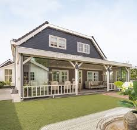
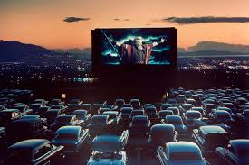
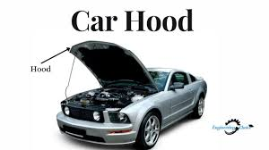
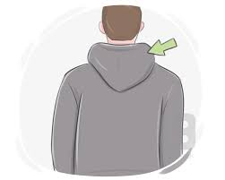
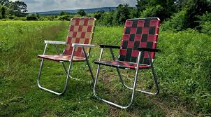

= step 2 - Lesson 35
:toc: left
:toclevels: 3
:sectnums:
:stylesheet: ../../+ 000 eng选/美国高中历史教材 American History ： From Pre-Columbian to the New Millennium/myAdocCss.css

'''

Lesson 35

== part 1. 部分

Tom: …​ when I was living …​ in North Africa, and I had a cook 厨师, and I’d been there for several years, you see.

[.my2]
汤姆：……当我住在北非时……我有一个厨师，你看，我在那里已经好几年了。

And I was just going to come on 开始 leave to England, you see, and obviously it was quite a long leave 假期；休假, you know.

[.my2]
我正要去英国休假，你看，显然这是一个很长的假期，你知道。

[.my1]
.案例
====
.come ˈon
(6) ( of an illness or a mood疾病或某种心情 ) ( usually used in the progressive tenses通常用于进行时 ) to begin 开始 +
• I can feel a cold coming on. 我觉得要感冒了。 +
• I think there's rain coming on. 我看要下雨了。 +

[+ to inf] +
• It came on to rain.天下起雨来了。

(7) ( of a TV programme, etc.电视节目等 ) to start 开始 +
• What time does the news come on? 新闻报道什么时候开始？

(8)to begin to operate 开始运转（或运行） +
• Set the oven to come on at six.把烤箱设定在六点钟开始烘烤。 +
• When does the heating come on? 什么时间来暖气？
====

I was coming /for …​ three months, I think it was.

[.my2]
我要来……三个月，我想是的。

So I had to, I had a house and I had to sort of *close* (v.) the house *up* （尤指临时）关门停业，锁上门, obviously, and, erm, this chap （对男子的友好称呼）家伙，伙计 who worked for me, who was a sort of …​ cook, erm, he was …​ obviously going to go off 离开，离去, you know, for three months - there wasn’t any point in him staying there - so it was, I was getting everything ready, anyway.

[.my2]
所以我必须这样做，我有一所房子，显然我必须把房子关起来，而且，呃，这个为我工作的家伙，他是一个……厨师，呃，他……显然要去要离开，你知道，三个月——他留在那里没有任何意义——所以，无论如何，我已经准备好了一切。

And I had a lot of things to fix up 修理；装饰；准备好, so I’d *got* rather 颇，相当 a lot of cash *out of* the bank.

[.my2]
而且我还有很多事情要处理，所以我从银行取出了相当多的现金。

[.my1]
.案例
====
.ˌfix sth up
to repair, decorate or make sth ready 修理；装饰；准备好 +
• They fixed up the house before they moved in.他们把房子装修了以后才迁入。
====

You know, I had a lot of bills to pay (Yes) and things to do, and, erm, I had about sixty-five pounds, I think it was.

[.my2]
你知道，我有很多账单要付（是的）和很多事情要做，而且，呃，我有大约六十五英镑，我想是的。

And one particular evening, I was just sort of, you know, clearing up the sitting-room and going to go to bed, I put the sixty-five quid 一英镑 under the papers 后定 in the top left-hand drawer of my desk /and then I *went out of* the door *on to* the veranda （房屋底层有顶半敞的）走廊，游廊 and locked the door.

[.my2]
一个特别的晚上，我只是，你知道，清理起居室并准备上床睡觉，我把六十五英镑放在桌子左上方抽屉里的文件下面，然后我出了门，走到阳台上，锁上了门。

[.my1]
.案例
====
.veranda
( especially BrE ) ( NAmE usually also porch ) a platform /with an open front and a roof, built onto the side of a house on the ground floor（房屋底层有顶半敞的）走廊，游廊 +

====

And the point was, `主` all the rooms of the house `谓` sort of *opened (v.) on to* a veranda, *on to* a courtyard 庭院，院子, if you see what I mean.

[.my2]
重点是，房子的所有房间, 都通向阳台，通向庭院，如果你明白我的意思的话。

There weren’t passages inside the house.

[.my2]
屋内没有通道。

And, erm, then I went to bed.

[.my2]
然后，呃，然后我就去睡觉了。

So, the next morning I got up, and, erm …​ after I’d had my breakfast, I was going out into the town to do various things 后定 for which I needed the money, you see (Yes) and, erm, I went to the drawer to get it …​ and it wasn’t there! I immediately thought, well maybe my cook, Idris, has taken this, because, the thing was, that the rooms were all locked /and you couldn’t have got in to the, erm, to the room, or any of the rooms of the house, without showing some sort of _sign 迹象，征兆 of entry_ 进入, if you see what I mean.

[.my2]
所以，第二天早上我起床，嗯……吃完早餐后，我要去城里做各种我需要钱的事情，你看（是的），嗯，我去抽屉里拿……​但它不在那里！我立即想到，也许我的厨师伊德里斯拿走了这个，因为，问题是，房间都锁着，你不可能进入，呃，进入这个房间，或者任何一个房间。房子，没有任何进入的迹象，如果你明白我的意思的话。

[.my1]
.案例
====
.sort of
( informal)
(1) to some extent /but in a way that you cannot easily describe 有几分；有那么一点 +
• She sort of pretends (v.) that /she doesn't really care. 她摆出一副并不真正在乎的样子。 +
• ‘Do you understand?’ ‘Sort of.’“你懂了吗？”“有点懂了。”

(2) ( also sort of like ) ( BrE informal ) used when you cannot think of a good word /to use to describe (v.) sth, or what to say next （想不出恰当的词或不知下面该怎么说时用）可以说，可说是 +
• We're sort of doing it the wrong way. 我们的方法好像有点不对头。
====

(Yes) And, er, he had access (n.) to all the keys in the house, you know.

[.my2]
（是的）而且，呃，他可以使用房子里的所有钥匙，你知道。

(Oh, I see.) So, erm, I went to his room.

[.my2]
（哦，我明白了。） 所以，呃，我去了他的房间。

And, erm, he’d gone off already.

[.my2]
而且，呃，他已经走了。

He’d gone shopping, in fact.

[.my2]
事实上，他去购物了。

In fact, his room was locked.

[.my2]
事实上，他的房间是锁着的。

Erm, I got the keys, unlocked it, went in, sort of searched the room, …​ felt (v.) rather sort of …​ guilty, you know, at sort of going through 仔细检查,审查某事物 his personal possessions /in this way.

[.my2]
嗯，我拿到了钥匙，打开了门，进去，搜查了房间，……感觉有点……内疚，你知道，以这种方式翻阅他的个人物品。

But there was nothing there.

[.my2]
但那里什么也没有。

So, you know, I thought, 'Well, hell, what do I do next? I’d better go to the police'.

[.my2]
所以，你知道，我想，‘好吧，见鬼，接下来我该怎么办？我最好去警察局。”

And, erm, my mind was still very much on him, that …​ it must be him.

[.my2]
而且，呃，我的心思仍然在他身上，那……一定是他。

Erm, so I went down to the police station /and, erm, said that /the money’d been stolen /and would the police please come to the house, and investigate (v.).

[.my2]
呃，所以我去了警察局，呃，说钱被偷了，请警察来家里调查一下。

And would they also …​ investigate (v.) my cook, whom I suspected.

[.my2]
他们还会……调查我怀疑的我的厨师吗？

And they said, erm, well, they wouldn’t come /and search the cook /or look round the house /unless I made _a definite accusation_ against him.

[.my2]
他们说，呃，好吧，除非我对他提出明确的指控，否则他们不会来搜查厨师或搜查房子。

And if I made _a definite accusation_ against him, they’d come along 到达；抵达；出现 /and, er, take him back to the police station /and really sort it out 解决问题.

[.my2]
如果我对他提出明确的指控，他们就会过来，呃，把他带回警察局，真正解决问题。

Well, I wasn’t very happy about that, because I felt, erm, I didn’t really have any evidence, you know, I was just extremely suspicious of him /because of the circumstances.

[.my2]
嗯，我对此不太高兴，因为我觉得，呃，我真的没有任何证据，你知道，我只是因为当时的情况而对他非常怀疑。

So, erm, I said, 'No,' and, but felt (v.) pretty desperate (a.)绝望的；孤注一掷的；铤而走险的 about it then.

[.my2]
所以，呃，我说，“不”，但是当时我感到非常绝望。

So I went back to the house …​ Anyway, later in the day, I said to him, 'You know, I had sixty-five pounds, which I put in the desk, and it’s disappeared.' And he sort of said, 'Oh, yeah'.

[.my2]
所以我回到了房子……无论如何，那天晚些时候，我对他说，“你知道，我有六十五英镑，我把它放在桌子上，然后它就消失了。”他有点说，“哦，是的”。

You know, he didn…​ didn’t register (v.)（正式地或公开地）发表意见，提出主张 anything at all.

[.my2]
你知道，他……根本没有提出任何话。

Er, so I said, 'Yes, sixty-five pounds has disappeared /and nobody seems to have come into the house'.

[.my2]
呃，所以我说，‘是的，六十五磅不见了，而且似乎没有人进过房子’。

And he sort of said, 'Oh yeah, well', (you know).

[.my2]
他有点说，“哦，是的，好吧”，（你知道）。

So I said, 'Yes, I’m going to get the police'.

[.my2]
所以我说，‘是的，我要去报警’。

And he still didn’t sort of register anything, you know.

[.my2]
你知道，他仍然没有提出任何反对话语。

He just sort of shrugged (v.)耸肩 his shoulders.

[.my2]
他只是耸了耸肩。

So then /I thought, 'Well, the only thing to do is that /I’ll have to tell him that, erm, that’s it, you know, I don’t want him to work for me any more'.

[.my2]
所以我想，‘好吧，唯一要做的就是我必须告诉他，嗯，就是这样，你知道，我不想让他再为我工作了’。

But, erm, being a coward 胆小鬼；懦夫；胆怯者 over these sort of things, I let it drift (v.)流动；趋势；逐渐变化（尤指向坏的方面） /for about a couple of days, and then, the day I was actually going, erm, I said to him, er, you know, 'Idris, I’m afraid that, er, I don’t want you to come back /after the holidays. I think it’s better /if you don’t work for me any more.'

[.my2]
但是，呃，作为这类事情上的胆小鬼，我让它漂流了大约几天，然后，在我真正要去的那天，呃，我对他说，呃，你知道，‘伊德里斯，我恐怕，呃，假期结束后我不想让你回来。我想, 你最好不要再为我工作了。”

And, er, he immediately made a tremendous 极好的；精彩的；了不起的 speech, he said what the hell （表示不在乎、无可奈何、气恼、不耐烦等）究竟，到底 did I think I was doing, etcetera 等等, etcetera, why, what were my reasons, etcetera, etcetera.

[.my2]
然后，呃，他立即发表了一场精彩的演讲，他说我到底在做什么，等等，等等，为什么，我的理由是什么，等等，等等。

So I said, probably very stupidly, but I said to him, 'Well, you know about that sixty-five pounds that disappeared, well, I’m not saying you took it, but I just think /you might’ve taken it, and therefore I don’t feel /I can trust you any more /and, er, so I just don’t think /you can go on working for me.'  So, of course, that was it!  +

He absolutely went through the roof 冲破屋顶,突然非常生气,怒气冲天 at this! And, erm, you know, gave me a sort of tremendous …​ tirade （批评或指责性的）长篇激烈讲话.

[.my2]
所以我说，可能非常愚蠢，但我对他说，‘好吧，你知道那六十五磅消失了，好吧，我不是说你拿走了它，但我只是认为你可能拿走了它，因此我觉得我不能再信任你了，呃，所以我认为你不能继续为我工作。所以，当然，就是这样！他在这件事上绝对是气炸了！而且，呃，你知道，给了我一种巨大的……长篇大论。

[.my1]
.案例
====
.tirade
(n.) ~ (against sb/sth) : a long angry speech criticizing sb/sth or accusing sb of sth （批评或指责性的）长篇激烈讲话 +
• She launched into a tirade of abuse against politicians.她发表了长篇演说，愤怒地谴责政客。 +
-> 来自 tirer,拉，拉长，来自 PIEder,撕，撕开，词源 同 tear,tier,tire.引申词义抨击，严厉批评，特指长篇大论的连续批评
====

Anyway, I’d quite 完全；十分；非常；彻底 made up my mind 下定决心, although I’d taken so long /to tell him …​ /And I said, 'Well, sorry', you know, 'that’s it.'  +
Then, in fact, erm, a friend dropped in 顺便访问；顺便进入, erm, who, who, who was a great friend.

[.my2]
不管怎样，我已经下定决心了，尽管我花了很长时间才告诉他……我说，“好吧，抱歉”，你知道，“就是这样。”然后，事实上，呃，一个朋友过来了，他是一个很好的朋友。

[.my1]
.案例
====
.ˌdrop ˈby/ˈin/ˈroundˌ | drop ˈin on sbˌ | drop ˈinto sth
to pay an informal visit to a person or a place 顺便访问；顺便进入 +
• Drop by sometime. 有空儿来坐坐。 +
• I thought I'd drop in on you /while I was passing.我曾想路过时顺便来看看你。 +
• Sorry we're late — we dropped into the pub /on the way. 对不起，我们迟到了—我们半路上顺便到酒馆坐了坐。
====

He, he, he lived there, he was a local person.

[.my2]
他住在那里，他是当地人。

And, erm, Osman came in /and he sort of …​ started getting involved in the conversation, …​ anyway, I wasn’t going to change my attitude over it.

[.my2]
而且，呃，奥斯曼进来了，他有点……开始参与谈话，……无论如何，我不会改变我对此的态度。

Then Idris got terribly upset (n.v.)不痛快；烦闷；失望；苦恼 /and was all sort of sad about it /and upset about it /and started to cry, said /I was ruining his life, etcetera.

[.my2]
然后伊德里斯变得非常沮丧，对此感到非常难过，并开始哭泣，说我毁了他的生活，等等。

But, anyway, I was completely sort of hard-hearted (a.)铁石心肠的；无情的 about it /and didn’t do anything about it /and that was it.

[.my2]
但是，无论如何，我对此完全是铁石心肠，没有采取任何行动，仅此而已。

And he went.

[.my2]
他就走了。

I, er, I mean I …​ paid (v.) him, …​ you know, quite a bit of money /in lieu 替代 of notice and everything /but, I mean, he still felt extremely upset, and it was _one of those, erm, very kind of unpleasant things_, which left (v.) one …​ feeling (v.) …​ rather …​ upset about it /and not knowing…​ I never knew /whether I’d done _quite the right thing_ or not.

[.my2]
我，呃，我的意思是我……付给了他，……你知道，一大笔钱代替通知等等，但是，我的意思是，他仍然感到非常沮丧，这是其中之一，呃，非常友善一些不愉快的事情，这让一个人……感觉……更确切地说……感到不安，却不知道……我从来不知道我是否做了正确的事情。

[.my1]
.案例
====
.IN LIEU (OF STH)
instead of替代
- We work on Saturdays /and have a day off 休息一天 in lieu /during the week. 我们每周星期六上班，用其他的日子补休一天。
====

Well, I worked there /for a couple of years more /and when I was finally leaving /after two years /I was throwing out lots and lots of things /like magazines, books and so on, and this chap, Osman, who’d actually been there /时间状 the afternoon  后定 Idris 人名 had finally left (v.) [amidst 在……之中 all these rows 严重分歧；纠纷,吵架；争吵], I gave him some old magazines, including actually, er, an old Encounter 遭遇；偶遇，邂逅(这里应该是杂志名) and, erm, he came back a few days later /and he said, 'You know, I didn’t know /whether to actually come and tell you or not, but I was looking through that copy of Encounter you gave me /and I found sixty-five pounds (laughter) in the back of the magazine.'  +

[.my1]
.案例
====
.row
(n.) [ C] ~ (about/over sth) : a serious disagreement between people, organizations, etc. about sth 严重分歧；纠纷 +
• A row has broken out over education.在教育问题上出现了严重分歧。

2.[ C]a noisy argument between two or more people 吵架；争吵
SYN quarrel +
• She left him after a blazing row .大吵一场之后，她离他而去。 +
• family rows 家庭里的争吵
====

Terribly difficult /because I was leaving the country, never to come back, you know, in about twenty-four hours after that …​ /feeling that `主` one `谓` had done something wrong /which `主` one `谓` couldn’t put right 使恢复正常；校正! And I didn’t have any idea /what had happened to Idris, in fact. Pretty unfortunate!

[.my2]
嗯，我在那工作了另外两年，最后离开时，我扔掉了很多东西，比如杂志、书籍等等。有个叫做奥斯曼的人，在伊德里斯终于在这些争执中离开的那个下午实际上在那儿，我给了他一些旧杂志，包括实际上，嗯，一本旧的《Encounter》，然后，几天后他回来了，他说，“你知道吗，我不知道是否应该告诉你，但我在那本《Encounter》里翻到了六十五英镑（笑声）。”这真是很困难，因为我要离开这个国家，永远不再回来，你知道，在那之后大约二十四小时……感觉自己做了一些无法弥补的错事！而且我实际上对伊德里斯发生了什么一无所知。相当不幸！

'''

== part 2. 部分

In the summer of 1933, the world’s first _drive-in 免下车的；路边服务的 movie theatre_ /opened in Camden, New Jersey.  +
Drive-ins became popular /after World War II /and in the '50s /there were nearly five thousand theatres across the country. But today, less than three thousand remained.  +

Drive-ins 露天电影院 are in trouble. _Land values_ 土地价值 near cities are increasing /and drive-ins are being torn down 拆除 /to make way for 为……让路 malls.  +

And families are more likely to stay home /for an evening of cheap entertainment /with their VCRs 录像机 and cable TV.  +
When _one more drive-in_ closed (v.) recently /outside Jeffersonville, Indiana, `主` reporter Bob Hanson `系` was there, the last night /at _the Lakewood Drive-in_.

[.my2]
1933年夏天，世界上第一家汽车影院, 在新泽西州卡姆登开业。二战后，汽车影院变得流行起来，在50年代，全国几乎有五千家影院。但如今，仅剩不到三千家。汽车影院陷入了困境。城市附近的土地价值不断上涨，汽车影院被拆除, 以建设购物中心。家庭更有可能呆在家里，通过他们的录像机和有线电视, 享受廉价的娱乐。最近，印第安纳州杰斐逊维尔外的又一家汽车影院关闭时，记者鲍勃·汉森在那里，最后一个夜晚在莱克伍德汽车影院度过。

[.my1]
.案例
====
.Drive-ins

.VCRs
录像机（video cassette recorders）
====

The sun set (v.)落（下） /as the last cars entered the Lakewood Drive-in. At _the ticket booth_ 售票亭 /Laura Boyle filled in for 暂时代替；临时补缺 her daughter /who’s away at college. No money changed (v.) hands 换主人；易主；转手. The show was on the house （餐馆或酒吧）免费招待的.

[.my2]
太阳落山时，最后几辆车驶入了莱克伍德汽车影院。售票亭里，劳拉·博伊尔代替她正在上大学的女儿工作。没有交易现金。电影是免费的。

[.my1]
.案例
====
.fill ˈin (for sb)
to do sb's job for a short time /while they are not there 暂时代替；临时补缺

.change ˈhands
to pass to a different owner 换主人；易主；转手 +
• The house has changed hands several times.这房子已几易其主。

.on the house
免单. 这里的“house”，指的是：商家免单，店里请客, 费用算在商家的头上. +

"免费"的说法有: +

[.my3]
[options="autowidth" cols="1a,1a"]

|===
|Header 1 |Header 2

|for free -- 免费
|Are the meals for free? 这些饭是免费的吗？

|free of charge -- 免费
|Could I have this sample free of charge？ 这个样品可以免费送我吗？

|on the house -- 商家免单, 费用算在商家的头上
|It's on the house. 这道菜免单，是我们店家请客，（免费送的）。
|===
====

Thirty years ago /John Walley opened _the Lakewood Drive-in_ /on his father’s farmland in southern Indiana. Corn fields 玉米田 still surround the theatre.  +
Since 1956 /people have driven (v.) for miles /to get to the drive-in. They came in Studebakers, and Fords, Ramblars, and Corvats.  +
But the '80s haven’t been so kind (a.) to the drive-in. And on this night /John Walley is closing up （尤指临时）关门停业，锁上门.

[.my2]
三十年前，约翰·沃利在印第安纳州南部的父亲农场上, 开办了莱克伍德汽车影院。玉米田依然围绕着剧院。自1956年以来，人们开车数英里来到这家汽车影院。他们开着斯图德贝克、福特、兰布勒和科尔沃特。但是80年代对汽车影院来说并不那么友好。在这个夜晚，约翰·沃利要关门了。

Before the show started, parents took their children to a playground /in the front of the theatre. Framed (v.)给…做框；给…镶边 by an orange sky /and in the humid 潮湿的，湿热的 Mid-western air, they played on swings 秋千 and slides 滑梯.  +
Inside _the snack 零食，点心，小吃；快餐 bar_, the menu was timeless (a.)不受时间影响的；无时间性的；永不过时的.

[.my2]
在电影开始前，家长们带着孩子来到剧院前的游乐场。在橙色天空的映衬下，在潮湿的中西部空气中，他们在秋千和滑梯上玩耍。在小吃部里，菜单是永恒的。

"Forty cents is your change, thank you."
“四十美分是你的零钱，谢谢。”

Thelma Wilson stuffed (v.)塞进，填进 hotdogs in buns 圆面包 /and wrapped them in _aluminum 铝 foil 箔;金属制成的薄片；箔纸 bags_.  +
For twenty-three years /Thelma has cooked hotdogs, _popped (a.v.)突然爆开；突然地出现 popcorn_ 爆米花，爆玉米花 /and filled (v.)装满，注满 drinks in the Lakewood Drive-in.

[.my2]
塞尔玛·威尔逊将热狗塞进面包里，然后用铝箔袋包起来。二十三年来，塞尔玛一直在莱克伍德汽车餐厅里煮热狗、爆米花和倒饮料。

[.my1]
.案例
====
.foil
( BrE also also ˌsilver ˈfoil ) [ U]metal made into very thin sheets that is used for covering or wrapping things, especially food（尤指包装食物等用的）箔;金属制成的薄片 +

.popped popcorn

====

In the mid-sixties, five hundred cars would fill (v.) the ashfall 火山灰沉降层；火山灰下降 and dirt theatre. But in the eighties, seventy-five cars was considered a good night. And sometimes the movie’s played to just twenty.

[.my2]
在六十年代中期，五百辆汽车会把充满着灰烬和尘土的剧院填满。但在八十年代，七十五辆汽车就被认为是一个美好的夜晚。有时电影只播放到二十点。

Carlo Crown switched on the thirty-five millimeter 毫米 projector  放映机，投影仪 /for the last time. About a hundred seventy-five cars pointed at the crumbling  破碎；崩溃;摇摇欲坠 /while screen (v.)放映（电影）；播放（电视节目）.  +
As word 信息；消息 got out that `主` the Lakewood Drive-in was closing up, people came from _throughout 遍及，到处 the area_.  +

As the black and white images flickered (v.)闪烁，摇曳 on the screen, some people found themselves back in time 回到过去. Like Linda King, who spent her _wedding night_ here /twenty-two years ago.

[.my2]
卡洛·克朗最后一次打开了三十五毫米投影仪。大约有一百七十五辆汽车指向摇摇欲坠的屏幕。当莱克伍德汽车电影院即将关闭的消息传出后，人们从整个地区涌来。随着屏幕上黑白图像的闪烁，一些人发现自己回到了过去。就像琳达·金 (Linda King) 一样，二十二年前她在这里度过了新婚之夜。

"There’s a lot of memories here. I’ve brought all my kids here, my grandkids （外）孙；（外）孙女, and they are not going to be here any more. So they aren’t going to bring their children here /when they’re grown."

[.my2]
“这里有很多回忆。我把我所有的孩子和孙子都带到了这里，他们不会再来这里了。所以当他们的孩子长大后，他们不会再把他们带到这里了。”

Johnny Buckman and his wife Merilyn /watched the movie from their _tinted 着色的，带色彩的；（玻璃）有色的 glass window_. The two went out on dates 约会 here /twenty-seven years ago.

[.my2]
约翰尼·巴克曼和他的妻子梅里琳, 通过有色玻璃窗观看了这部电影。二十七年前，两人曾在这里约会过。

"I have been thinking about, you know, when we were young, and when he put his arms around me /and . . . and just a lot of old memories, you know."

[.my2]
“我一直在想，你知道，当我们年轻的时候，当他用双臂搂住我的时候......还有很多旧的回忆，你知道。”

John Walley stood outside _the snack bar_ /and talked to old friends and customers. He talked about how hard it was /to compete with _air-conditioned theatres_ /and couldn’t get _first-run 首轮的,首轮放映 movies_ any more. And most of all 最重要的是；首先 he just reminisced (v.)回忆，追忆，缅怀（昔日的快乐时光）.

[.my2]
约翰·沃利站在小吃店外面，与老朋友和顾客交谈。他谈到与空调影院竞争是多么困难，无法再获得首映电影。最重要的是，他只是回忆起来。

[.my1]
.案例
====
.reminisce
[ V] ~ (about sth/sb) : to think, talk or write about a happy time in your past 回忆，追忆，缅怀（昔日的快乐时光） +
-> re-,再，重新，-min,思考，记忆，词源同 mind,mention.-esce,表起始。引申词义回忆，缅怀。
====

"This is nice /to go out to the country /and watch movies on a big screen. The young people just don’t know /what they are missing /because there won’t be any drive-ins around /in another ten years.

[.my2]
“到乡下看大屏幕电影真是太好了。年轻人只是不知道他们错过了什么，因为再过十年，周围就不会再有汽车影院了。”

Some people watched the movie /from the hood （汽车等的）折叠式车篷;（设备或机器的）防护罩，罩 of their car. Others sat on _lawn chairs_ 草坪椅. Many just walked around.  +

John Walley plastered (v.)贴满，遍贴（画片或招贴画）;抹灰；用灰泥抹（墙等） auction (n.)拍卖 off  the equipment /from the drive-in. But in the dark /people tried not to think about that.  +
By the way, tonight’s _final film_ — The Last Picture Show.  +

For National Public Radio, I’m Bob Henson /in southern Indiana.

[.my2]
有些人在汽车引擎盖上观看了这部电影。其他人则坐在草坪椅上。许多人只是四处走走。约翰·沃利在汽车电影院拍卖了设备。但在黑暗中，人们试图不去想这个。顺便说一下，今晚的最后一部电影是——《最后一场电影》。我是国家公共广播电台的鲍勃·汉森，来自印第安纳州南部。

[.my1]
.案例
====
.hood +
1.a cover placed over a device or machine, for example, to protect it（设备或机器的）防护罩，罩 +
2.( especially BrE ) a folding cover /over a car, etc.（汽车等的）折叠式车篷 +

.lawn chair

.auction (v.) sth←→ˈoff
to sell sth at an auction , especially sth that is no longer needed or wanted拍卖掉（尤指不再需要的物品）
====

'''

== 3. Technology and the Future (II)

三、科技与未来（二）

Now I would like to say a word about communications. `主` #The revolution# in communications /that has already taken place /`系` #is# still not fully understood.   +
One way of appreciating it /is to do a kind of communications strip tease 脱衣舞（表演）.  +

[.my1]
.案例
====
.tease
(n.v.) +
爱戏弄人的人；逗弄者；取笑者 +
戏弄；捉弄；取笑 +
• Don't get upset—I was only teasing (v.). 别不高兴，我只是在逗你玩。
====

I would like you to abolish (v.)废除，废止，取消 [in your minds] TV, then radio, then telephones, then _the postal service_ 邮政服务, then the newspapers.  +
In other words, to revert 回复；恢复 to the Middle Ages. In such a situation, we should feel (v.) deaf 聋的；置若罔闻的 and blind, like prisoners _in solitary (a.)独自的；单独的 confinement_ (n.)禁闭；监禁；关押.

[.my2]
现在我想谈谈沟通。已经发生的通信革, 命尚未完全被理解。欣赏它的一种方法是, 进行一种通讯脱衣舞表演。我希望你们在心中废除电视，然后是广播，然后是电话，然后是邮政服务，然后是报纸。换句话说，就是回到中世纪。在这种情况下，我们应该感到又聋又瞎，就像单独监禁的囚犯一样。

[.my1]
.案例
====
.REˈVERT (v.) TO STH
( formal )
(1)to return to a former state; to start doing sth again that you used to do in the past回复；恢复 +
- His manner seems to have reverted (v.) to normal.他的举止好像已经恢复了正常。 +

(2)to return to an earlier topic or subject 重提，回到，恢复（先前的话题或主题）
====

Well, we’ll appear this way to our grandchildren. Don’t forget that /a generation has already grown up /that never knew a world without TV.  +

One communications revolution has taken place in our lifetime.  +
The next revolution, perhaps the final one, will be the result of satellites and microelectronics 微电子学, which will enable us to do literally 按照字面意义地 anything we want to /in the field of communications and information transfer （使）转移，搬迁 — including, ultimately 最终，最后, #not only# sound and vision /#but# all sense impressions 感觉印象.

[.my2]
好吧，我们会以这样的方式出现在我们的孙子面前。不要忘记，已经长大的一代人永远不知道没有电视的世界。我们一生中发生了一场通信革命。下一场革命，也许是最后一场革命，将是卫星和微电子技术的结果，这将使我们能够在通信和信息传输领域做任何我们想做的事情——最终不仅包括声音和视觉，还包括所有感官印象。

I am particularly interested in TV /后定 broadcasting (v.)播放；广播节目 from satellites directly into the home, bypassing (v.)绕过 today’s ground stations 地面站 — a proposal /I first described  描述，描写 twenty-two years ago.  +
This will mean (v.) /the abolition （法律、制度、习俗等的）废除，废止 of all present geographical restrictions 地理限制 to TV; via satellites, any country can broadcast (v.) to any other.  +

Direct-broadcast 卫星直播 TV will be possible /within five years /and may be most important to _undeveloped countries_ /后定 that have no ground stations, and now may never require (v.) any.  +

[.my2]
即对于现在没有地面基站的落后国家, 他们未来也不需要有了. 因为能用更高级的卫星直播了.

Africa, China, and South America could be opened up 张开；裂开；拓展；打开 /by direct TV broadcast, and whole populations brought into the modern world.  +
I believe that /_communications satellites_ may bring about 引起，导致 _the long-overdue 早该做的，过期已久的 end_ of _the Stone Age_.

[.my2]
我对绕过今天的地面站，直接从卫星向家庭发送电视广播, 特别感兴趣——这是我二十二年前首次描述的提议。这将意味着, 取消目前对电视的所有地域限制；通过卫星，任何国家都可以向其他国家广播。直播电视将在五年内成为可能，这对于没有地面站的不发达国家来说, 可能是最重要的，但现在可能永远不需要任何地面站。非洲、中国和南美, 可以通过电视直播打开大门，把所有人口, 带入现代世界。我相信, 通信卫星可能会带来早该结束的石器时代。

They will certainly lead to a global telephone system /and end (v.) _long-distance calls_ 长途电话 — for _all calls_ will be 'local'! There will be the same _flat 水平的；平坦的 rate_ 统一费率 everywhere.

[.my2]
它们肯定会带来全球电话系统, 并结束长途电话——因为所有电话都将是“本地”的！各地均采用相同的统一费率。

`主` Newspapers will, I think, `谓` receive (v.) their final _body blow_ 严重打击；挫折 /from these new communications techniques.  +
How I look forward to the day /when I can press (v.) a button /and get any type of news, editorials 社论；述评, book and theatre reviews 综述；评论, etc., merely by dialing (v.)拨（电话号码） the right channel.  +

Moreover, #not only# today’s /#but# `主` any newspaper ever published `谓` will be available.  +
`主` Some sort of #TV-like console# (n.)（机器、电子设备等的）控制台，操纵台，仪表板 /后定 connected to a central electronic library, `谓` #could make available# any information 后定 ever printed in any form.  +

_Electronic 'mail' delivery_ 传送；递送；交付 is another exciting prospect 前景；展望；设想 of the very near future.  +
Letters, will be automatically read (v.) /and flashed (v.)（向…）用光发出（信号） [from continent to continent] /and reproduced (v.)复制 at _receiving stations_ /within a few minutes of transmission （电子信号、信息或广播、电视节目的）播送，发射，发送，传输.

[.my2]
我认为，这些新的通讯技术, 将给报纸带来最后的打击。我多么期待有一天，我只需拨打正确的频道，按下一个按钮，就能获得任何类型的新闻、社论、书籍和剧院评论等。此外，不仅是今天的报纸，任何曾经出版过的报纸都可以使用。某种类似电视的控制台, 连接到中央电子图书馆，可以提供以任何形式印刷的任何信息。电子“邮件”传递, 是不久的将来另一个令人兴奋的前景。信件将被自动读取并从一个大陆闪到另一个大陆，并在传输后几分钟内在接收站复制。

All these things are associated with information processing, and `主` one-third of _the Gross National Product_ `谓` is now spent on this /in one form of another — data storage 数据存储, TV, radio, books, and so forth 等等，诸如此类.  +

This radio is increasing; our society is changing from a goods-producing society to an information-processing one.  +
I have #devoted# (v.)献身；致力；专心 much of one book (Voices from the Sky) #to# the social consequences 社会后果 of this, and can mention (v.)提到，谈到 only a few here.

[.my2]
所有这些事情, 都与信息处理有关，国民生产总值的三分之一, 现在以一种或另一种形式, 花费在信息处理上——数据存储、电视、广播、书籍等等。这种广播正在增加；我们的社会正在从商品生产社会, 转变为信息处理社会。我在一本书（《天空之声》）中, 用了很多篇幅来讨论这种现象的社会后果，这里只能提及其中的一小部分。

One could be the establishment 建立；创立；确立 of English as the world language, through _the direct telecast satellites_ 后定 mentioned above.  +
Within 在（某段时间）之内；在……限度内 the next ten years /`主` the future language of mankind /`谓` will be decided, in a bloodless battle /twenty-two thousand miles above the equator.

[.my2]
其中之一可能是, 通过上面提到的直播卫星, 将英语确立为世界语言。在接下来的十年内，人类未来的语言, 将在赤道上空两万两千英里的一场不流血的战斗中决定。

Another very important consequence /will be a change in the patterns of transport, for a man and his work /need no longer be in the same place.  +
When these new information-and-communications consoles are available, `主` almost #anybody# /who does(v.) any kind of _mental work_ 脑力工作 /`谓` #can live# (v.) wherever he pleases.  +

Beyond this, any kind of _manipulative (a.)熟练操作的；有操作能力的 skill_ /can also be transferred from one point to another.  +
I can imagine a time /when even _a brain surgeon_ /can live (v.) in one place /and operate (v.) on patients all over the world, through 以；凭借；因为；由于 _remote-controlled artificial hands_, like those 后定 used (V.) in _atomic energy 原子能 plants 工厂_.

[.my2]
另一个非常重要的后果将是, 交通方式的改变，因为人和他的工作, 不再需要在同一个地方。当这些新的信息和通信控制台可用时，几乎任何从事任何脑力工作的人, 都可以住在他喜欢的任何地方。除此之外，任何一种操作技能, 也可以从一个点转移到另一个点。我可以想象有一天，即使是脑外科医生, 也可以住在一个地方，通过遥控人造手（就像原子能工厂使用的人造手）为世界各地的患者进行手术。

Yet these developments will not necessarily mean an overall reduction 减小，降低 of transport.  +
I see a great reduction of _transport 运输；运送；输送；搬运 for work_, but increased transport for pleasure.

[.my2]
然而，这些发展, 并不一定意味着交通运输总量的减少。我发现工作交通大幅减少，但娱乐交通却增加。

A result of this will be that /vast _uninhabited 无人居住的，杳无人迹的 areas_ of the Earth /could be opened up, because people will have far greater freedom /to choose (v.) where they will live.

[.my2]
其结果将是, 地球上大片无人居住的地区将被开放，因为人们将有更大的自由, 来选择他们的居住地点。

These trends will inevitably accelerate (v.)（使）加快，促进 the disintegration 分裂，解体；蜕变，衰变 of the cities, whose _historical function_ 历史功能 is now passing 转变；变化；过渡.  +
Cities will go on growing, of course, like dinosaurs — for the same reasons, and with the same results.

[.my2]
这些趋势, 将不可避免地加速城市的解体，而城市的历史功能正在消失。当然，城市会像恐龙一样继续发展——出于同样的原因，也会产生同样的结果。

'''

