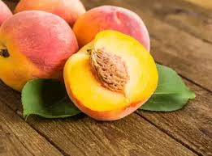

= step 3- Lesson 1
:toc: left
:toclevels: 3
:sectnums:
:stylesheet: ../../+ 000 eng选/美国高中历史教材 American History ： From Pre-Columbian to the New Millennium/myAdocCss.css

'''

---

== 01

Lesson 1

Freed American hostage, David Jacobsen, appealed 呼吁；吁请；恳求 today for the release of the remaining captives(n.) 囚徒；俘虏；战俘 in Lebanon, saying, "Those guys are in hell and we've got to get them home."  +
Jacobsen made his remarks as he arrived at Wiesbaden, West Germany, accompanied 陪伴，伴随 by Anglican 圣公会教徒 Church envoy 使者；使节；（谈判等的）代表, Terry Waite, who worked to gain his release.  +

[.my1]
====
- hostage 人质
- appeal (v.)~ (to sb) (for sth) 呼吁；吁请；恳求
- captive 囚徒；俘虏；战俘 (a.)被监禁的；被关起来的；被困住的
- remark 谈论；言论；评述
====

And Waite says his efforts will continue.  +

Jacobsen had a checkup 审查，检查；健康检查 at the air force hospital in Wiesbaden.  +

And hospital director, Colonel Charles Moffitt says he is doing well.
"Although Mr. Jacobsen is tired 疲倦的；疲劳的；困倦的, our initial impression 初步印象 is that he is physically in very good condition.
It also seems that he has dealt with the stresses of his captivity 监禁；关押；困住 extremely well."  +

Although Jacobsen criticized the US government's handling （形势、人、动物等的）处理，对付，对待 of the hostage  人质 situation in a videotape 录像带 made during his captivity, today he thanked the Reagan 里根 Administration and said he was darn 极其，非常（婉辞，与damn同义） proud (a.) to be an American.  +

The Reagan Administration had little to say today about the release of Jacobsen or the likelihood 可能；可能性 that other hostages may be freed.  +

Boarding (v.)上船（或火车、飞机、公共汽车等） Air Force One in Las Vegas, the President said, "There's no way to tell right now.  +

We've been working on 使奏效；（由于努力）造成，产生 that.

We've had heart-breaking disappointments." Mr. Reagan was in Las Vegas campaigning (v.)从事运动,从事竞选活动 for Republican candidate, Jim Santini, who is running behind Democrat, Harry Reed.

[.my2]
被释放的美国人质戴维·雅各布森, 今天呼吁释放黎巴嫩剩余的俘虏，他说：“那些人已经在地狱里了，我们必须让他们回家。”雅各布森是在英国圣公会特使特里·韦特（Terry Waite）的陪同下, 抵达西德威斯巴登时, 发表上述言论的，特里·韦特曾努力争取雅各布森获释。韦特表示, 他将继续努力。雅各布森在威斯巴登空军医院, 接受了检查。医院院长查尔斯·莫菲特上校表示，他状况良好。 “虽然雅各布森先生很累，但我们的初步印象是, 他的身体状况非常好。而且他似乎很好地应对了囚禁期间的压力。”尽管雅各布森在他被囚禁期间录制的录像带中, 批评了美国政府对人质局势的处理方式，但今天他感谢里根政府，并表示他为自己是一名美国人感到非常自豪。今天，里根政府没有就雅各布森的释放, 或其他人质获释的可能性, 发表任何言论。总统在拉斯维加斯登上空军一号时说：“现在还无法确定。我们一直在努力解决这个问题。我们经历过令人心碎的失望。”里根先生在拉斯维加斯为共和党候选人吉姆·桑蒂尼竞选，后者的竞选对手是民主党人哈里·里德。

'''

== 02

In Mozambique 莫桑比克 today a new president was chosen to replace Samora Machel who died in a plane crash two weeks ago.  +

NPR's John Madison reports: "The choice of the 130-member Central Committee 委员会 of the ruling FRELIMO Party was announced on Mozambique radio this evening.  +

He is Joaquim Chissano, Mozambique's Foreign Minister, No. 3 in the Party.  +

Chissano, who is forty-seven, was Prime Minister of the nine-month transitional 过渡的,过渡时期的 government that preceded (v.)在…之前发生（或出现）；先于;走在…前面 independence from Portugal 葡萄牙 in 1975.  +

He negotiated 谈判；磋商；协商 the transfer 搬迁；转移；调动；变换 of power with Portugal.

[.my2]
今天，莫桑比克选出了一位新总统, 来接替两周前在空难中丧生的萨莫拉·马谢尔。 NPR的约翰·麦迪逊报道：“今晚莫桑比克广播电台宣布了, 执政党解阵党130名中央委员会委员的人选。他就是若阿金·希萨诺，莫桑比克外交部长，党内三号人物。 四十七岁的希萨诺是 1975 年脱离葡萄牙独立之前的, 为期九个月的过渡政府的总理。他与葡萄牙进行了权力移交谈判。

---

== 03

This much is clear tonight: #an American# 后定向前推进 held in Lebanon for almost a year and a half `系`  #is# free.

[.my2]
今晚这一点已经很清楚了：一名在黎巴嫩被关押了近一年半的美国人重获自由。

David Jacobsen is recuperating (v.)康复；恢复；恢复健康 in a hospital in Wiesbaden, West Germany.

[.my2]
大卫·雅各布森正在西德威斯巴登的一家医院康复。

Twenty-four hours earlier, Jacobsen was released in Beirut by Islamic Jihad.

[.my2]
二十四小时前，雅各布森在贝鲁特被伊斯兰圣战组织释放。

But this remains a mystery: what precisely led to his freedom? Jacobsen will spend the next several days in the US air force facility in Wiesbaden for a medical examination.

[.my2]
但这仍然是一个谜：到底是什么导致了他的自由？雅各布森将在接下来的几天里, 在威斯巴登的美国空军设施中, 接受体检。

Diedre Barber reports.

[.my2]
迪德烈·巴伯报道。

After preliminary 预备性的；初步的；开始的 medical checkups 审查，检查；健康检查 today, David Jacobsen’s doctor said he was tired but physically 身体上，肉体上 in very good condition.

[.my2]
今天经过初步体检后，大卫·雅各布森的医生表示他很累，但身体状况非常好。

US air force hospital commander, Charles Moffitt, said in a medical briefing this afternoon that Jacobsen had lost little weight and seemed extremely fit.

[.my2]
美国空军医院指挥官查尔斯·莫菲特在今天下午的医疗简报中表示，雅各布森的体重几乎没有减轻，而且看起来非常健康。

He joked that he would not like to take up 接受挑战 Jacobsen’s challenge to reporters earlier in the day to a six-mile jog (n.)慢跑，慢步长跑（尤指锻炼） around the airport.

[.my2]
他开玩笑说，他不想接受雅各布森当天早些时候, 向记者提出的围绕机场慢跑六英里的挑战。

Despite his obvious fatigue, Jacobsen spent the afternoon being examined by hospital doctors.

[.my2]
尽管雅各布森明显感到疲劳，但他整个下午, 都在接受医院医生的检查。

He was also seen by a member of the special stress-management team 后定向前推进 sent from Washington.

[.my2]
从华盛顿派出的特别压力管理小组的一名成员, 也见过他。

Colonel Moffitt #said that# after an initial evaluation 评价，评估 #it seems# as if Jacobsen coped extremely well with the stresses of his captivity (n.)囚禁；被关.

[.my2]
莫菲特上校表示，经过初步评估，雅各布森似乎很好地应对了囚禁期间的压力。

He said there was also no evidence at this point that the fifty-five-year-old hospital director （某一活动的）负责人 had been tortured 拷打；拷问；严刑逼供 or physically abused.

[.my2]
他说，目前还没有证据表明, 这位 55 岁的医院院长曾遭受酷刑或身体虐待。

Jacobsen seemed very alert 警惕的，警觉的, asking detailed questions about the facilities of the Wiesbaden medical complex （类型相似的）建筑群, according to Moffitt.

[.my2]
据莫菲特说，雅各布森似乎非常警惕，询问了有关威斯巴登医疗中心设施的详细问题。

So far, Jacobsen has refused to answer questions about his five hundred and twenty-four days as a hostage.

[.my2]
到目前为止，雅各布森拒绝回答有关他作为人质的五百二十四天的问题。

Speaking briefly to reports after his arrival in Wiesbaden this morning, he said `主` his joy 后定向前推进 at being free `谓` was somewhat diminished by his concern for the other hostages 后定向前推进 left behind 被遗留.

[.my2]
今天早上抵达威斯巴登后，他对报道进行了简短的讲话，他说，由于担心其他人质，他获得自由的喜悦有所减弱。

He thanked the US government and President Ronald Reagan for helping to secure (v.)（尤指经过努力）获得，取得，实现 his release.

[.my2]
他感谢美国政府和罗纳德·里根总统帮助他获释。

Jacobsen also gave special thanks to Terry Waite, an envoy 使者；使节；（谈判等的）代表 of the Archbishop 大主教；总教主 of Canterbury 英国城市名, for his help 后定向前推进 in the negotiation.

[.my2]
雅各布森还特别感谢坎特伯雷大主教特使特里·韦特, 在谈判中提供的帮助。

#Waite# 人名 who accompanied Jacobsen from Beirut to Wiesbaden today, `谓` #said# he might be going to Beirut in several days.

[.my2]
今天陪同雅各布森从贝鲁特前往威斯巴登的韦特说，他可能会在几天后前往贝鲁特。

There are still seven American hostages 后定向前推进 being held in Lebanon by different political groups.

[.my2]
目前仍有七名人质, 被不同政治团体扣押在黎巴嫩。

Jacobsen will be joined in Wiesbaden tomorrow by his family.

[.my2]
雅各布森的家人, 将于明天在威斯巴登与他会合。

Hospital officials said they still do not know how many days Jacobsen will remain for tests and debriefing sessions before returning to the United States with his family.

[.my2]
医院官员表示，他们仍然不知道雅各布森在与家人返回美国之前, 将继续接受检查和汇报会多少天。

For National Public Radio, this is Diedre Barber, Wiesbaden.

[.my2]
我是国家公共广播电台的 Diedre Barber，威斯巴登。

'''

== 04

The leader of Chinese revolution, Mao Tsetong, died ten years ago today.

[.my2]
中国革命领袖毛泽东, 在十年前的今天逝世。

During his lifetime, Mao became a cult (a.)受特定群体欢迎的；作为偶像崇拜的 figure, but the current government has tried to change that.

[.my2]
毛泽东在世时就成为了一个崇拜的人物，但现任政府试图改变这一点。

Now his tomb and embalmed 对（尸体）进行防腐处理 body in Beijing are just another tourist 旅游者；观光者；游客 attraction 向往的地方；有吸引力的事.

[.my2]
现在，他在北京的坟墓和防腐尸体只是另一个旅游景点。

And no longer do `主` millions of Chinese `谓` study (v.) or wave (v.) aloft (ad.)在高空 the famous "Little Red Book" of Quotations 引语；引文；语录 from Chairman （会议的）主席，主持人;（委员会的）委员长，主席；（公司等的）董事长 Mao.

[.my2]
数以百万计的中国人不再学习或高举著名的毛主席语录“红宝书”。

Along with 连同,和…一起 the political writing, Mao wrote (v.) poetry as well — poems about the revolution, the Red Army 红军, poems about nature.

[.my2]
除了政治写作之外，毛泽东还写诗——关于革命、红军、关于自然的诗。

Willis Barnstone has translated some of Mao’s work and considers him an original 首创的；独创的；有独创性的 master , one of China’s most important poets.

[.my2]
威利斯·巴恩斯通翻译了毛泽东的一些作品，并认为他是一位原创大师，也是中国最重要的诗人之一。

"Had he not been a revolutionary 革命者，革命家, perhaps `主` his poetry `谓` would not have been as interesting because his personal poetry was the history of China.

[.my2]
“如果他不是革命者，也许他的诗就不会那么有趣，因为他个人的诗就是中国的历史。

At the same time because he was a famous revolutionary and leader, it has prejudiced (v.)使怀有（或形成）偏见;损害；有损于 most people, almost correctly  正确地；合适地；得体地, to dismiss 不予考虑；摒弃；对…不屑一提 his poetry as simply the work of a man who achieved fame elsewhere."  +
"But his work was not dismissed within China though?"  +
"Well, now it’s almost consciously 有意识地，清楚地；有意地，故意地 forgotten.

[.my2]
同时，由于他是一位著名的革命家和领导人，这使得大多数人在评价他的诗歌时持有偏见，几乎可以说是正确的，他们简单地将其视为一个只是在其他领域取得成就的人的作品, 而置之不理。 (即, 并不是毛的诗有多好, 只不过是毛作为革命家的光环, 而让他的诗连带着会被人关注到而已, 所以根本就没必要去在乎他的诗.)” “但他的作品在中国并没有被忽视？ ” “好吧，现在已经快有意识地忘记了。

[.my1]
.案例
====
.prejudice
(v.) ~ sb (against sbsth) : to influence sb so that they have an unfair or unreasonable opinion about sbsth 使怀有（或形成）偏见 +
SYN bias +
• The prosecution lawyers have been trying to prejudice (v.) the jury against her. 控方律师一直力图使陪审团对她形成偏见。

2.( formal ) to have a harmful effect on sth 损害；有损于 +
• Any delay will prejudice (v.) the child's welfare. 任何延误都会损及这个孩子的身心健康。 +
——note at damage

-> pre-,在前，早于，预先，-judic,判断，裁决，词源同judge,judiciary.引申词义偏见，偏心。

.dismiss
(v.)~ sbsth (as sth) : to decide that sbsth is not important and not worth thinking or talking about 不予考虑；摒弃；对…不屑一提 +
-
He dismissed the opinion polls as worthless.他认为民意测验毫无用处而不予考虑。

====

But when I was there in '72, you could see his poems on every dining room wall, engraved (v.)在…上雕刻（字或图案） on peach-pits 桃核 …​

[.my2]
但当我72年在那里时，你可以在每间餐厅的墙上看到他的诗，刻在桃核上……​

[.my1]
.案例
====
.peach-pits

====

During lunch hours, workers would study his poems. They were every place."

[.my2]
午餐时间，工人们会学习他的诗。他们无处不在。”

"Is there, though, a revisionist 修正主义的 thinking within literary (a.)文学的；文学上的 circles? Are people saying Mao wasn’t any good as a poet either?"  +

[.my2]
“文学界有修正主义思想吗？人们是否也说毛泽东也不是一个优秀的诗人？”

[.my1]
.案例
====
.revisionist
ADJ If you describe a person or their views as revisionist, you mean that they reject traditionally held beliefs about a particular historical event or events. (对历史事件)持修正主义论的 +
修正主义, 通常是指对德国思想家卡尔·马克思所提出的一系列学术理论（即马克思主义）做出“修正”的一种思潮和流派。一般都会违背马克思主义的基本原则，所以就被有些人认为是并非对马克思主义的继承与发展。
====

"No. Well, at least in my conversations （非正式）交谈，谈话 in the year 后定向前推进 I recently spent in Peking teaching at the university there, I found very few people who didn’t think he was a very good poet.

[.my2]
嗯，至少在我最近在北京大学任教的那一年的谈话中，我发现很少有人不认为他是一位非常好的诗人。

But they did feel that `主` #his suggestions# which were that people not write (v.) in the classical style, that they write (v.) in what he called the modern style, `系` #was# very repressive.

[.my2]
但他们确实觉得, 他的建议是非常压抑的，即人们不要以古典风格写作，而应以他所谓的现代风格写作。

And as a result, of course, the restriction of publication during the ten years of the Cultural Revolution, poetry was abysmal 极坏的；糟透的."  +
"When you say the modern style, would that be, for example, free verse 诗；韵文?"  +
"It would be free verse as opposed to （表示对比）而，相对于 classical rhymes （诗、歌曲）押韵；押韵小诗 or classical forms."  +

[.my2]
当然，结果是文革十年期间限制出版，诗歌很糟糕。” “你说的现代风格，是不是就是自由诗？” “是自由诗吗？” "它将是自由诗，而不是古典押韵或古典形式。”

[.my1]
.案例
====
.abysmal
-> 深不可测的；糟透的；极度的 +
abysmal = abyss = a（没有）+byss（底部）→没有底部→无底深渊 词源解释：bysm（byss）←希腊语byssos（bottom，底部） 背景知识：abyss指的是基督教中关押恶魔和反叛天使的无底洞。按照但丁在《神曲》中的描写，abyss位于地狱的最底层。

.AS OPPOSED TO
( formal ) used to make a contrast between two things（表示对比）而，相对于 +
• 200 attended, as opposed to 300 the previous year. 出席的有200人，而前一年是300人。 +
• This exercise develops suppleness as opposed to (= rather than) strength.这项锻炼不是增强力量，而是增强柔韧性的。
====

"You write (v.) [in the introduction to one of your translations of poems of Mao Tsetong] that people … ​you explain that `主` #leaders# in China, and indeed in the East, `谓` #are expected# to be accomplished 才华高的；技艺高超的；熟练的 poets."

[.my2]
“你在你的毛泽东诗歌翻译之一的序言中写道，人们……​你解释说，中国乃至东方的领导人, 都应该是有成就的诗人。”

"Yes, I think that’s true. The night that Tojo …​ before Tojo died, he, …​ in Japan, he wrote some poems. Ho Chi Minh was a poet. It was common.

[.my2]
“是的，我想这是真的。东条去世的那天晚上，在日本，他写了一些诗。胡志明是一位诗人。这很常见。

In fact, I think until early in the twentieth century, even to pass a bureaucratic 官僚的；官僚主义的 exam, one had to know a huge number of classical forms. +
And especially, a leader should at least be a poet."

[.my2]
事实上，我认为直到二十世纪初，即使是为了通过官僚考试，也必须了解大量的古典形式。尤其是，一个领导人至少应该是一位诗人。”

"There is one poem which is political in nature 本质上，事实上 which has to do with a parasitic (a.)寄生生物引起的 disease in China."

[.my2]
“有一首诗是政治性的，它与中国的一种寄生虫病有关。”

"Yes. Mao wrote some poems, two poems actually, about getting rid of a disease that was a plague 瘟疫，传染病 for the country. +
And it’s called 'Saying goodbye to the God of Disease 疾病之神.' And the poem needs annotation  注释,加注释.
[.my2]
“是的。毛泽东写了一些诗，实际上是两首诗，内容是关于消除给国家带来瘟疫的疾病。它的名字叫“告别病神”。这首诗还需要注释。

In that sense, it’s typical of classical Chinese poetry; he makes references to 提到，谈及 earlier emperors and places.

[.my2]
从这个意义上说，它是典型的中国古典诗歌；他提到了早期的皇帝和地方。

Saying Goodbye to the God of Disease  +
Mauve 淡紫色的 waters and green mountains are nothing 无关紧要的东西；毫无趣味的事 When the great ancient doctor Hua Tuo Could not defeat a tiny worm.

[.my2]
绿水青山枉自多，华佗无奈小虫何！  +
祖国大地上白白有这么多的绿水青山，连神医华佗拿小小的血吸虫也没有根治的办法。

[.my1]
.案例
====
.mauve
(a.) pale purple in colour 淡紫色的 +

====

A thousand villages collapsed, were choked (v.)（使）窒息，哽噎; 阻塞，塞满，堵塞（通道、空间等） with weeds 野草, Men were lost arrows, ghosts sang (v.) In the doorway of a few desolate 无人居住的；荒无人烟的；荒凉的 houses.

[.my2]
千村薜荔人遗矢，万户萧疏鬼唱歌。  +
许多村庄荒草丛生，杳无人迹，瘟疫无情蔓延，千门万户家破人亡，听到的只是鬼在唱歌。

Yet now in a day, we leap 跳跃；跳越;猛冲；突然做（某事） around the earth, Or explore a thousand milky ways.

[.my2]
坐地日行八万里，巡天遥看一千河. +
坐在地球上每天行走八万里的路程，沿着天路遥遥地看过浩渺的银河。

And if `主` the cowherd 牧牛者 who loves on a star `谓` Asks about the God of plagues, Tell him, happy or sad, "The God is gone, Washed away in the waters."  +

[.my2]
牛郎欲问瘟神事，一样悲欢逐逝波. +
牛郎如问起血吸虫病的事，一切悲欢离合都已随着时光的流逝而成为过去。 +

A poem by Mao Tsetong read by Willis Barnstone, Professor of Comparative Literature 比较文学 at Indiana University in Bloomington. He talked with us from WFIU.

[.my2]
印第安纳大学布卢明顿分校"比较文学"教授威利斯·巴恩斯通, 朗读了毛泽东的一首诗。他从 WFIU 与我们进行了交谈。

'''
