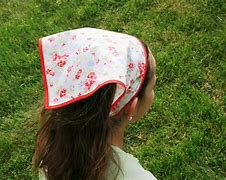
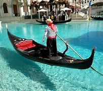
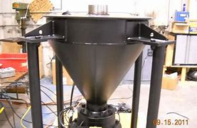
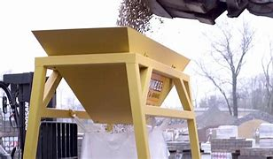
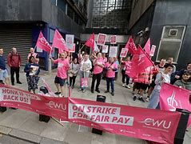
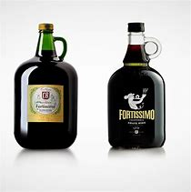
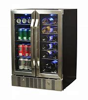

= step 3- Lesson 10
:toc: left
:toclevels: 3
:sectnums:
:stylesheet: ../../+ 000 eng选/美国高中历史教材 American History ： From Pre-Columbian to the New Millennium/myAdocCss.css

'''

== 简讯目录

President Reagan said today he will veto a defense spending bill if it is approved, as expected, by the House.

[.my2]
如果如预期所料，众议院批准国防开支法案的话，他将行使否决权。 +

Speaking to a private group in Washington today, the President said he was concerned about provisions （法律文件的）规定，条款;提供；供给 in the bill that would ban nuclear testing and cut funding for his Star Wars defense system.  +

The President also charged 指责；谴责 that the Soviet-backed ban on nuclear testing is "a backdoor to a nuclear freeze." And he accused the Soviets of a major propaganda campaign on the testing issue.  +

[.my2]
总统还指责说，苏联支持的核试验禁令是“核冻结的后门”。
他指责苏联在核试验问题上大肆宣传。 +

Israeli warplanes 战斗机 bombed (v.) suspected Palestinian guerrilla 游击队员 bases in Southeast Beirut today.  +

[.my2]
今天以色列战机轰炸了贝鲁特东南部的可疑游击队基地。 +

Police said the bomb set at least four targets on fire.

[.my2]
警方说，炸弹至少引燃了四个目标。  +

There are reports (n.) that two people were wounded in the attacks.

At a news conference in Pretoria today, South African Foreign Minister Pic Botha called international sanctions against his country "a mad perverse 执拗的；任性的；不通情理的 action" that will put many blacks 黑人 out of work.  +

[.my1]
====
.perverse
--> per-完全,贯穿 + -vers-转 + -e → 逆驶的
====

But Botha said the South African government "accepts the challenge to overcome the effect of sanctions."

White House spokesman Larry Speakes said today President Reagan will veto on Friday a sanctions bill passed by Congress, but he admitted it will be tough to sustain (v.)使保持；使稳定持续;支撑；承受住 the veto.  +

On Wall Street today, the Dow Jones Industrial Average 平均数 was up four and a half points, closing at 1797.81.  +

[.my2]
华尔街今日，道琼斯工业指数上涨了4.5点，收于1797.81点。 +

Trading 贸易；经商；营业；交易 was moderate, one hundred thirty-two million shares.

[.my2]
交易稳健，1.32亿股。 +

Israeli warplanes today bombed four suspected Palestinian guerrilla bases in Lebanon.  +

'''

== 以色列战机轰炸

Reports from Beirut 黎巴嫩一港口名 say at least two people were wounded and a number of 几个；一些 fires started (v.) in the four villages.  +

[.my2]
来自贝鲁特的报道说，轰炸至少造成两人受伤，并引燃了四个村庄。 +

From Jerusalem, Jerry Cheslow filed (v.)发送（报道给报社） this report which was subject (v.)使经受；使遭受 to censorship (n.)审查；检查；审查制度 by Israeli authorities.  +

[.my2]
来自耶路撒冷方面消息，杰瑞·彻斯洛提交了这份报告，该报告由以色列当局进行审查。 +

According to the Israeli army spokesman, the targets were bases (n.) belonging to two pro-Syrian Palestinian guerrilla organizations.  +

[.my2]
据以色列军方发言人称，这些目标属于两个亲叙利亚的巴勒斯坦游击组织。 +

Israeli military sources say one of the targets was a staging (n.) 临时工作台（或工作架） base 中途补给基地；前进基地 for raids against northern Israel.  +

[.my2]
以色列军方消息人士称，其中一个目标是"敌方用来袭击我们以色列北部"的一个集散基地。

Lebanese radio stations reported that at least two people were wounded in the attack south of Beirut and that Beirut International Airport was closed for half an hour.  +

Israeli military sources stress (v.)强调；着重 that the air raid had nothing to do with 与…无关 this week's tensions along Israel's border with Lebanon.  +

[.my2]
以色列军方消息人士强调，空袭与本周以色列与黎巴嫩边界的紧张局势无关。 +

They were #between# the Shi'ite 什叶派 Muslim Hizbullah 真主党 (Party of God) Militia 民兵组织；国民卫队  #and# the Israeli-backed South Lebanese Army Militia 民兵组织；国民卫队.  +

[.my2]
他们是真主党什叶派穆斯林民兵, 与以色列支持的南黎巴嫩民兵部队之间的冲突。 +

Over the past two weeks, large Hizbullah 真主党 forces stormed  (v.)突袭；攻占 dozens of South Lebanese Army positions.  +

Israeli military sources say that at least fifteen South Lebanese Army men and some fifty members of Hizbullah were killed.  +

According to the sources the attacks also badly damaged the morale  士气 of the South Lebanese Army, and this led Israel to deploy 部署，调度（军队或武器）; 有效地利用；调动 a large force along its border with Lebanon.  +

The force included troops, armor  装甲部队；装甲车辆 and artillery （统称）火炮 , and according to knowledgeable 博学的；有见识的；知识渊博的 observers it was equipped 目的状 for offensive 进攻；攻击；侵犯 action against Hizbullah.

[.my2]
该部队全副武装，准备应对真主党的进攻。  +

Senior Israeli defense sources say that Hizbullah 真主党  was trying to take over all of southern Lebanon.  +

Hizbullah 真主党  has also been attacking Unifil 联合国驻黎巴嫩临时部队, the UN force in Southern Lebanon.  +

Over the past six weeks, four French Unifil 联合国驻黎巴嫩临时部队 troops were killed by Hizbullah 真主党 , and just this morning a French UN base was rocketed 用火箭弹攻击 in Southern Lebanon.  +

There were no casualty （战争或事故的）伤员，亡者，遇难者, but some of its soldiers were blown off their seats.

[.my2]
但有一些士兵从自己的座位上被震飞。  +

And the sources said that Hizbullah 真主党 's domination 控制，统治 of Southern Lebanon would be a direct threat to Israel.  +

[.my2]
而消息人士称，真主党对南黎巴嫩地区的统治, 将直接威胁到以色列。 +

`主` Some of its men who were killed `谓` were wearing kerchiefs 方头巾；方围巾 with the words "Onward (a.) 继续的；向前的 to Jerusalem" printed on them.  +

[.my1]
====
.kerchief

====

But since the Israeli troops deployed along the border three days ago, there have been no Hizbullah 真主党  attacks on the South Lebanese Army.  +

By nightfall 黄昏；傍晚 here in the Middle East, the Israeli troops had returned to their bases.  +

For National Public Radio, I'm Jerry Cheslow in Jerusalem.  +

'''

== 酿酒厂工人罢工

This week, Californian wine workers vote (v.)投票（赞成╱反对）；表决（支持╱不支持）；选举 on a contract 合同；合约；契约 proposal from winery owners.  +

[.my2]
本周，加州葡萄酒商就酒厂老板的合同提案, 进行表决。 +

The workers have now been on strike 罢工；罢课；罢市 for six weeks.  +

The contract proposal calls for cuts in wages and cuts in benefits.  +

`主` The prospects for rank and file  普通成员,普通士兵 approval `谓` seem slim.

[.my2]
普通民众批准它的前景, 似乎很渺茫。 +

[.my1]
====
.rank and file
--> rank,行，file,列。比喻用法。
====

A central issue of the strike is the economic well-being 健康；安乐；康乐 of the California wine industry.  +

[.my2]
此次罢工的核心问题, 是加利福尼亚葡萄酒业的经济福利。 +

William Drummond reports.  +

`主` A gondola 威尼斯小划船；贡多拉；凤尾船;（热气球、飞船上的）吊舱，吊篮 containing tons of freshly picked Chardenay grapes `谓` is dumped 丢下；抛弃；推卸 into a hopper V形送料斗；漏斗 as the process begins for bottling  (v.)把（液体）装入瓶中 the 1986 vintage.  +

[.my2]
一艘载满数吨新鲜采摘的霞多丽葡萄的贡多拉货船, 把它们倒入料斗中，开始给1986年的葡萄酒装瓶。 +

[.my1]
====
.gondola

.hopper
a container shaped like a V, that holds grain, coal, or food for animals, and lets it out through the bottom V形送料斗；漏斗 +

====

The harvest has continued despite the fact that more than two thousand winery workers have struck 突击；攻击 twelve of the biggest wineries in Northern and Central California.  +

[.my2]
尽管有超过二千名酿酒工人，在加利福尼亚北部和中部最大的12家酿酒厂举行罢工，但这样的大丰收仍在继续。 +

Relying on automated plants 工厂 and non-union labor, members of the Winery Owners' Association have succeeded in carrying on  继续,开展; 参与 what looks like business is usual.  +

[.my2]
依靠自动化工厂和非工会劳工，酿酒厂业主协会的成员, 已经成功地使生意看起来像往常一样。

But out on the picket （罢工期间纠察妥协分子的）纠察员，纠察队；罢工警戒 line, union worker Pat Scoley is anything but 根本不, 决不(一点也不是)  pleased.  +

[.my2]
但在警戒线外，工会工人帕特·斯克里一点也高兴不起来。 +

[.my1]
====
.picket
a person or group of people who stand outside the entrance to a building in order to protest about sth, especially in order to stop people from entering a factory, etc. during a strike; an occasion at which this happens （罢工期间纠察妥协分子的）纠察员，纠察队；罢工警戒 +
a pointed piece of wood that is fixed in the ground, especially as part of a fence （尤指栅栏的）尖木桩，尖板条 +
-> 来自法语piquet,尖木桩，来自piquer,刺，刺穿，词源同pike,pique.原指对抗骑兵的竖在地上的尖刺或木桩，引申词义看守敌人的巡逻队，后引申现词义。 +

.picket line
a line or group of pickets 纠察线；纠察队人墙 +
- Fire crews refused to cross the picket line. 消防人员拒不冲破围厂队伍人墙。 +

.anything but
根本不，一点也不
- The food was anything but delicious. 这食物一点也不好吃。
====

"I guess they're doing all right 过得还好. If they aren't, they want us to think they are.  I hope to hell they aren't, between you and me."  +

[.my2]
我猜他们过得还不错。如果不是的话，他们会希望我们认为他们过得不错。我希望他们真的过得不错，这是我们之间的谈话。 +

[.my1]
====
.doing all right
过得还好,一切都好;一切如常：表示某人的生活或状况良好，没有什么大问题。 +
-  How are you doing? - I'm doing all right, thanks for asking. 你怎么样？-我过得还好，谢谢关心。

.hope to hell wish to hell
If you say you hope to hell or wish to hell that something is true, you are emphasizing that you strongly hope or wish it is true. +
- I hope to hell you're right.

chatGpt :  +
"I hope to hell" 是一个口语表达，表示强烈的希望或担忧。这里的 "hell" 并不是指地狱，而是用来强调说话人的情感，类似于“我真是希望”或“我真是担心”的意思。
====

The union contract expired （因到期而）失效，终止；到期 at the end of July, which is the beginning of the harvest, the time when wine makers usually need all the help they can get.

[.my2]
工会合同七月底到期，恰逢收获时节，葡萄酒制造商通常会倾尽全力寻求帮助。 +

But many plants are like the Charles Krug Winery 葡萄酒厂；酿酒厂, which has been completely automated 使自动化.

[.my2]
但许多如查尔斯·克鲁格这样的酒厂，已完全实现了自动化生产。 +

Owner Peter Mondaby says the strike has no effect on producing the product.

[.my2]
老板彼得·曼达比说，罢工对生产没有影响。 +

"We feel that we can go on indefinitely 无限期地, because there's a lot of people who want to work.  +

And it's only a question of training these people and, of course, with the system that we have, very well computerized 用计算机做；使计算机化；使电脑化, that they can fit in with a reasonable amount of training, that they can fit in.  +

[.my2]
这只是一个培训这些人的问题，当然，有了我们现有的系统，计算机化的很好，他们可以适应合理数量的培训，他们可以适应。  +

So, I mean, we're not concerned about it." Actually, `主` the heavy rainfall 降雨量；下雨 several days ago in the Napa Valley `谓` seemed to disturb  打扰；干扰；妨碍 the owners more than the strike.  +

Mondaby produces (v.) around a million cases a year, super premium 高昂的；优质的 brands under the Charles Krug label, mid-range premium wines and jug 壶，罐 wines 大罐酒.  +

[.my2]
曼达比的产量, 大约每年一百万例，包括查尔斯·克鲁格旗下的高档葡萄酒，中档优质葡萄酒和壶酒。 +

[.my1]
====
.jug wine
大罐酒（尤指大瓶装的廉价佐餐酒） +

====

Mondaby says the industry took a beating during the last several years because of cheap wine imports from Europe.

[.my2]
曼达比说葡萄酒产业在过去几年里遭受打击，由于欧洲廉价葡萄酒进入国内市场。 +

Even though Americans today are drinking more wine chiefly (ad.)主要地；首要地 in the form of wine coolers （通常有冰和酒的）清凉饮料, wine makers say there's not that much profit in the coolers, and they're still in a financial pinch  捏；掐；拧,一撮.  +

[.my2]
尽管现在美国人饮用葡萄酒，更多情况下饮用的是葡萄酒类果汁饮品，但葡萄酒制造商说, 葡萄酒类果汁饮品里面没有太多利润，他们在财政上仍然处于拮据状态。 +

[.my1]
====
.wine cooler
1.( NAmE ) a drink made with wine, fruit juice, ice and soda water （用葡萄酒、果汁、冰和苏打水制成的）冰镇果酒饮料 +
2.ˈwine cooler a container for putting a bottle of wine in to cool it 镇酒冰壶 +

.pinch
可以作： Pressure, stress (usually of want, misfortune, or the like); difficulty, hardship.
====

"I feel that the industry has hit its low point and now in on the uptrend （商业活动的）上升趋势，改善，增强，活跃.

[.my2]
我觉得这个行业已经触底，现在正处于上升趋势。  +

Of course, it's not an uptrend that you will see overnight, but it is a healthy uptrend in a gradual growth manner  方式；方法 now.

[.my2]
当然，这种上升趋势并不会发生在一夜之间，但它是一个渐进的健康上升趋势。 +

But I wouldn't necessarily 必然地；不可避免地 say a greater profitability 盈利能力；收益性；利益率 because the profit is very, very marginal.

[.my2]
但我不一定是说利润更大，因为利润非常非常薄。 +

The volume 量；额 is there, it's true, but the profit is very, very marginal.

[.my2]
成交量是有的，这是真的，但利润非常非常薄。 +

Mondaby's marginal profit argument 论据；理由；论点 does not win (v.) much support among striking workers, like Hannah Stockton, who works in the bottling plant at Christian Brothers.

[.my2]
曼达比关于超薄利润的说法, 并没有在工人中赢得更多的支持，像汉纳·斯托弗科顿，他在Christian Brothers装瓶厂工作。 +

"I don't believe it, 'because I read the paper every day, and I listen to the news.
I mean, there has been increase in sale.
I mean, ... I believe three or four years back, we had a slump （价格、价值、数量等）骤降，猛跌，锐减 in the industry. But wine is coming back.  +

[.my2]
我的意思是，销售额增加了。我的意思是，我相信三年或四年前，我们经历了葡萄酒行业的萧条期。但现在这个行业正在回归。 +

Now they are coming out 出版；发行；发表 with wine coolers; they are making money.  +
We don't want a raise 加薪; we just want to keep what we've got."

Wages for workers in the winery industry range from around eight dollars to fifteen dollars an hour.  +

The union was willing to give up a slight 轻微的；略微的 reduction 减少；缩小；降低 in wages, but refused to accept cuts in the pension 养老金；退休金；抚恤金 and health benefits.  +
[.my2]
工会愿意接受工资的降低，但拒绝接受削减养老金和健康福利。 +

The employers reportedly want a twenty percent reduction in the wages and benefits package.

[.my2]
据说，雇主希望工资和福利待遇有一个20%的降低。 +

Winery owners say the union has to recognize that overall costs have increased.  +

"Not only is your gross 毛收入，总收入 down; the competition has forced us to increase marketing and advertising, which is further eroding whatever margin was there." David Spualding is general manager of a winery in Calistoga.  +

[.my2]
不仅是你的总利润额下降了，竞争迫使我们增加了市场及广告投入，这让利润进一步降低了。 戴维·斯伯丁是卡利斯托加一家酒厂的总经理。 +

Spaulding Vineyards （为酿酒而种植的）葡萄园；（以葡萄园自种葡萄进行生产的）酿酒厂 is tiny compared to Charles Krug and Gallo, and Spaulding Vineyards is not on strike, but David Spaulding says he faces the same market forces as the big guys.  +

[.my2]
相比于查尔斯·克鲁格和加洛，斯伯丁葡萄园很小，斯伯丁葡萄园的工人们没有举行罢工，但戴维·斯伯丁说，他和那些大酒厂一样，面临着同样的市场压力。 +

"I think the big problem is the same problem that faces agriculture all over this country; and that is surplus (n.)过剩；剩余；过剩量；剩余额.  +

[.my2]
我认为我们所面临的最大的问题, 和全国的农业所面临的一样；那就是过剩。 +

You know we are producing more and producing it more efficiently, and we have a production that exceeds  超过（数量） the demand in the market."

Spaulding says wine coolers have taken up  占用 (时间、空间或精力) some of the over-production, but not all of it.  +
[.my2]
斯伯丁说，葡萄酒类果汁饮品, 占了生产过剩的一部分，但不是全部。 +

As for 至于 the union leaders, they don't think it's good idea to give back wages and benefits when the demand for the product is on the increase.  +

Winery workers are voting all this week on the wages and benefits cuts proposed by management.  +
[.my2]
酿酒工人们, 本周一直在就管理层所提出的削减工资和福利一事进行投票。

Jerry Davis is an official of the union.  +

"From the people I talked to today and what the negotiating committee is stating 陈述；说明；声明, we ask a NO vote on this proposal." The results are expected to be known by Thursday.

[.my2]
根据今天与我谈话的人和谈判委员会所说的话，我们要求对这项提案投反对票。 预计结果将于星期四公布。 +

For National Public Radio, I'm William Drummond reporting.

'''
