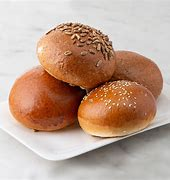
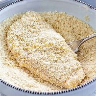
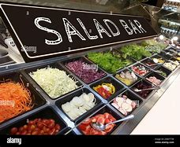

= step 3- Lesson 18
:toc: left
:toclevels: 3
:sectnums:
:stylesheet: ../../+ 000 eng选/美国高中历史教材 American History ： From Pre-Columbian to the New Millennium/myAdocCss.css

'''

https:www.kekenet.comArticle201806555976.shtml

== 简讯目录

Much of the flood-plagued 泛滥;使困扰 Midwest got more rain today. Flood waters have forced more than 2,000 families out of their homes. +
Illinois has suffered heavily with 4 deaths and $ 30,000 damage blamed 把…归咎于；责怪；指责 on flooding. +

[.my2]
受洪水困扰的中西部大部分地区, 今天降雨较多。洪水迫使2000多个家庭逃离家园。
伊利诺伊州因洪水遭受重创，造成 4 人死亡，损失达 30,000 美元。

There are also reports (n.) that one man was killed today in Oklahoma when his car was swept off a bridge. +
A partially-ruptured （使体内组织等）断裂，裂开，破裂 dam was in Wisconsin and remains standing but leaking, and officials are fearful (a.) more rain could cause (v.) it to burst （使）爆裂，胀开. +

[.my2]
还有报道称，今天在俄克拉荷马州，一名男子因汽车被冲下桥而丧生。
威斯康星州一座部分破裂的大坝仍然矗立，但正在泄漏，官员们担心更多的降雨可能会导致大坝决堤。

'''

`主` A French television cameramen  后定 reported (v.) kidnapped in Lebanon on Sunday `谓` has been freed according to the French Foreign Ministry. +

[.my2]
据法国外交部称，周日在黎巴嫩被绑架的一名法国电视摄影师已被释放。

A spokesman says Jean Marc Srucie was released today in the southern suburbs of Beirut and has returned to the Christian _east sector_ of the city. +
No group claimed responsibility (n.) for his kidnapping and the Foreign Ministry did not provide any details about his captivity or his return. +

[.my2]
一位发言人表示，吉恩·马克·斯鲁西今天在贝鲁特南郊获释，并已返回该市的基督教东区。
没有任何组织声称对他的绑架负责，外交部也没有提供有关他被囚禁或返回的任何细节。

'''

President Reagan paid tribute （尤指对死者的）致敬，颂词；悼念；致哀；吊唁礼物 today to _former president_ Jimmy Carter during _dedication （建筑物等的）奉献典礼，落成典礼;献身；奉献 ceremonies_ for Mr. Carter's _presidential library_  总统图书馆 near Atlanta. +

[.my2]
今天，在亚特兰大附近卡特总统图书馆的落成仪式上，里根总统向前总统吉米·卡特致敬。

`主` President Reagan, who soundly 完全彻底地;坚固地；牢固地 defeated 击败；战胜 Carter in the 1980 election, `谓` said there was no need to downplay (v.)对…轻描淡写；使轻视；贬低 differences between the two men: "Our very differences attest (v.)证实；是…的证据 to the greatness of our nation, for I can think of no other country on earth where two _political leaders_ could disagree (v.) so widely, yet come together in mutual respect."  +

Mr. Reagan went on to say (v.) former President Carter graced (v.)为增色；使荣耀;为锦上添花 the White House with his passion, intellect and commitment.

[.my2]
在1980年大选中大胜卡特的里根总统说，没有必要淡化两人之间的分歧:“我们的分歧恰恰证明了我们国家的伟大，因为我想不出世界上还有哪个国家的两位政治领导人, 能有如此广泛的分歧，但又能在相互尊重中走到一起。” 里根接着说，前总统卡特以他的热情、智慧和承诺为白宫增光添彩。

The library was dedicated on Mr. Carter's sixty-second birthday. +
And President Reagan advised his predecessor 前任 that life begins at seventy. +

[.my2]
该图书馆专门纪念卡特六十二岁生日。
里根总统告诉他的前任，生命从七十岁开始。

'''

== 洪水

There was more rain in the Midwest today, where several states are facing rising flood waters. +
Thousands of people in Illinois and Wisconsin have been forced from their homes. +

And in Oklahoma, the State _National Guard_ （美国）后备役军人，国民警卫队 was called upon 请求，要求，要（某人做某事） to rescue (v.) _stranded 使搁浅;使滞留 homeowners_ who had been cut off 切断,隔离 and trapped. +

[.my2]
今天中西部地区降雨较多，部分州面临洪水上涨的威胁。
伊利诺伊州和威斯康星州的数千人被迫离开家园。
在俄克拉荷马州，州国民警卫队被要求营救被困的受困房主。

[.my1]
====
.call onupon sb
to ask or demand that sb do sth 请求，要求，要（某人做某事）
====

In northeastern Illinois, the floods follow (v.) _5 straight  连续的；不间断的 days_ of heavy rain. +
Cheryl Coralie of member station 成员电台, WBEZ, reports that the governor of Illinois was on the scene with a promise for the people: "They're coming. They're coming.  They're on the way."  +

[.my2]
在伊利诺伊州东北部，洪水是在连续5天的大雨之后发生的。
WBEZ 会员站的谢丽尔·科拉莉 (Cheryl Coralie) 报道说，伊利诺伊州州长在现场向人民做出承诺：“他们来了。他们来了。他们正在路上。”

[.my1]
====
.straight
(a.) one after another in a series, without interruption 连续的；不间断的
SYN consecutive +
=> The team has had five straight (a.) wins. 这支队已连赢五场比赛了。

.member station
成员电台：指加入某个广播电视网络的电台，通常为非营利性质的公共广播电台。
====

During his tour 巡视;游览；参观；观光 of the damaged areas, Illinois governor, James Thompson, tried to buoy (v.)鼓舞；鼓励;使漂浮；使浮起 the spirits of _weary （尤指长时间努力工作后）疲劳的，疲倦的，疲惫的 residents_, alerting them that much _coveted 令人垂涎的 sandbags_ were on the way. +

[.my2]
在视察受损地区时，伊利诺伊州州长詹姆斯·汤普,  森试图鼓舞疲惫居民的精神，提醒他们许多令人垂涎的沙袋正在路上。

`主` Three northern and western counties near Chicago, hard hit (v.) by storms, `谓`  have seen the burgeoning  (a.)激增；迅速发展 _Foy and Desplaines Rivers_ spill (v.)（使）洒出，泼出，溢出;涌出；蜂拥而出 into their streets, their garages and, ultimately 最终；最后；终归, their homes. +

[.my2]
芝加哥附近的三个北部和西部县, 遭受暴风雨的严重袭击，汹涌的福伊河和德斯普兰河, 涌入了他们的街道、车库，并最终侵入了他们的家园。

[.my1]
====
.burgeon
[ V] ( formal ) to begin to grow or develop rapidly 激增；迅速发展 +
--> bur, 蓓蕾，繁殖，来自bear, 生育。 +
=> a burgeoning population 急剧增长的人口
====

Residents and authorities had been pinning (v.)（用大头钉等）固定，别上，钉住 their hopes on 完全依赖；寄希望于；指望 sandbagging. +
_Public works_ 公共工程（或建设） trucks `谓` line (v.) up to load (v.) sand onto their flatbeds 平板车；平板拖车. +

[.my2]
居民和当局一直把希望寄托在沙袋上。公共工程卡车, 排队将沙子装载到平板上。

[.my1]
====
.pin (all) your ˈhopes on sbsth |  pin your ˈfaith on sbsth
to rely on sbsth completely for success or help 完全依赖；寄希望于；指望

.flatbed
1.= flatbed scanner +
2.( also [ "ˌflatbed ˈtruck", "ˌflatbed ˈtrailer" ] ) ( especially NAmE ) an open truck or trailer without high sides, used for carrying large objects 平板车；平板拖车

====

`主` The US Army _Corps （由两个或两个以上师组成的）军，兵团;（从事某工作或活动的）一群人，一组人 of Engineers_ with state officials today `谓` are distributing _a quarter million_ of the bags to communities (n.)社区；团体，群体 后定 stricken (a.)受煎熬的；患病的；遭受挫折的;遭受…的；受…之困的 or threatened by ever 不断地；总是；始终 expanding flood waters. +

[.my2]
今天，美国陆军工程兵团和州政府官员, 正在向遭受不断扩大的洪水袭击或威胁的社区, 分发 25 万个袋子。

But for some residents, even the sandbags have failed. +
"The water, from flowing this way, went through and [by the pressure] finally knocked (v.) the sandbags over 打倒（或击倒、撞倒）某人;推倒（或拆掉、拆毁）建筑物. And, _within a matter 事态；当前的状况 of_ a minute, every wall came down, and I was standing in water this deep." +

[.my2]
但对于一些居民来说，连沙袋都失效了。
“水从这里流过，最后在压力的作用下把沙袋打翻了。不到一分钟的时间，每堵墙都倒塌了，我就站在这么深的水中。”

State emergency officials say the state could suffer $ 30,000,000 in damages and what is one of Illinois' worst flooding disasters. +

[.my2]
州紧急事务官员表示，该州可能遭受 3000 万美元的损失，这也是伊利诺伊州最严重的洪水灾害之一。

[.my1]
====
.Within a matter of…
它最常用于指代某个特定的时间范围——无论是秒、分钟、小时还是天。 it is most commonly used to refer to a certain time frame – be it seconds, minutes, hours or days.

=> You'll notice the ink fading within a matter of minutes  and it will be completely gone within 48 hours.  你会发现，几分钟后，写下的文字就会慢慢变淡，在48小时内会完全消失。
====

Most residents have been trying to tough  坚持；挨过 it out, but _rescue worker_, Dave Besh, says `宾` that's changing: "I know there's people 后定向前推进① calling up now 后定向前推进② #that# refused (v.) evacuation 撤离，疏散 yesterday, #that# are calling here now, getting hold of 得到;（通常指好不容易）获得;领会;设法和…取得联络 our trucks verbally 口头上（而非书面或行动上） because their phones are out, #that# want to be evacuated (v.)（把人从危险的地方）疏散，转移，撤离 now and they're trying to get the boats to get them out of there."  +

[.my2]
大多数当地人一直在咬牙坚持渡过难关，但援救人员戴夫·贝什表示，抗洪的挑战性极高：据我所知，有些居民昨天还拒绝我们的疏散，但今天就打电话给我们进行求助。他们高喊着想乘上卡车得到援救，因为座机已经没法用了，他们现在就想得救，他们希望救援的船只能带他们离开这里。

[.my1]
====
.tough sth out
(v.) to stay firm and determined in a difficult situation 坚持；挨过 +
=> You're just going to have to tough it out . 你只好硬着头皮撑到底了。

====

The floods have driven (v.) more than 2,000 people from their homes. They have also forced road closures and businesses and schools to shut down. +

[.my2]
洪水还迫使道路封闭、企业和学校关闭。洪水已导致2000多人逃离家园。

In Gurney, Illinois, the _elementary 初级的；基础的 school_ （美国）小学 classrooms sit (v.) under 5 feet of water and Gurney _Deputy  副手；副职；代理; （美国协助地方治安官办案的）警官 Fire Chief_, Tim McGrath, says there's little that can be done. +

"We know we're going to displace 取代；替代；置换;迫使（某人）离开家园. We know that we're going to sustain (v.)遭受；蒙受；经受 more loss. There's no way of confining 限制；限定;监禁；禁闭 the river, of course, there's no controlling the river."  +
[.my2]
在伊利诺伊州格尼，小学教室位于 5 英尺深的水下，格尼副消防队长蒂姆·麦格拉思 (Tim McGrath) 表示，对此无能为力。 +
“我们知道我们会被取代。我们知道我们将承受更多的损失。没有办法限制河流，当然，也无法控制河流。”

Today, Governor Thompson declared (v.) a number of additional community state disaster areas, setting up the first step for Federal help. +
`主` The rainy _weather forecast_ `系` is not of much comfort, and some _weary workers and homeowners_ say (v.) `主` the only thing left to do now `系` is wait until the flooding passes (v.) and put everything back together again. +

[.my2]
今天，汤普森州长宣布了一些额外的社区州灾区，为联邦援助迈出了第一步。 +
下雨的天气预报并不让人感到多少安慰，一些疲惫的工人和房主表示，现在唯一要做的就是等到洪水过去，然后把一切重新组装起来。

For _National Public Radio_, I'm Cheryl Coralie in Chicago. +

[.my2]
我是国家公共广播电台的谢丽尔·科拉莉，来自芝加哥。

'''

== 快餐的营养问题

_Fast food_ restaurants have made some Americans rich. +
It's been more than 30 years since the first McDonald's opened, and this nation's _eating habits_ have been transformed by fast food. +

Today, we spend over $50,000,000,000 a year on Whopper's 特大的（或硕大的）东西 _Big Macs_ 巨无霸（麦当劳汉堡名） and the Colonel's 上校 _Fried Chicken_ 炸鸡. The key is convenience. _The ignored factor_ is nutrition.

That's something Michael Jacobson cares about. He's written a Fast Food Guide to tell consumers what's under the bun 圆面包;小圆甜蛋糕；小圆甜饼. +

[.my2]
快餐店已经让一些美国人致富了。自从第一家麦当劳开业以来已经超过30年了，这个国家的饮食习惯已经被快餐所改变。如今，我们每年在汉堡包、巨无霸和肯德基炸鸡上花费超过500亿美元。关键在于便利性，而被忽视的因素是营养。这是迈克尔·雅各布森关心的事情。他写了一本快餐指南，告诉消费者汉堡包下面都有什么。

[.my1]
====
.Whopper
(n.) something that is very big for its type 特大的（或硕大的）东西 +
=> Pete has caught a whopper (= a large fish) . 皮特捕到了一条特大的鱼。
====

As far as hamburgers go, Jacobson says one chain's burger is as good nutritional as the next. +

[.my2]
就汉堡包而言，雅各布森说，一家连锁店的汉堡与另一家的汉堡, 在营养上是一样的。

[.my1]
====
.bun

.as far as XX go
就……而言

asso far as sbsth is concerned |  asso far as sbsth goes +
used to give facts or an opinion about a particular aspect of sth 就…而言
====

"Each chain has _a variety （同一事物的）不同种类，多种式样 of_ hamburgers: singles, doubles, triples; in some restaurants, cheeseburger, baconburger, mushroom burgers, and generally, when they start gussying up 把自己打扮得漂漂亮亮（或花枝招展） the hamburger with the toppings （菜肴、蛋糕等上的）浇汁，浇料，配料，佐料, you're going to get _more fat, more salt, and less nutritious product_."

[.my2]
“每个连锁店都有各种各样的汉堡包：单层、双层、三层；在一些餐厅里还有芝士汉堡、培根汉堡、蘑菇汉堡，一般来说，当他们开始给汉堡包加配料时，你会得到更多的脂肪、更多的盐，而营养价值更低的产品。”

.案例
====
.GUSSY ˈUP
( NAmE informal ) to dress yourself in an attractive way 把自己打扮得漂漂亮亮（或花枝招展） SYN dress up +
=> Even the stars get tired of gussying up for the awards. 连明星们也厌烦了把自己打扮起来去领奖。

====

"So you think you #shouldn't# be so concerned with `宾` which chain it is you're eating at [as far as 就…而言 the burger], #but rather# whether you're getting _the simple, naked burger_, or the burger with all the fillings （糕点等的）馅 on it. That's where a lot of the fat comes in." +

[.my2]
“所以你认为你不应该过分关注你在哪家连锁店吃汉堡，而应该关注你是选择了简单、原味的汉堡，还是带着所有配料的汉堡。那就是脂肪的来源。”

[.my1]
.案例
====
.asso far as sbsth is concerned | asso far as sbsth goes
used to give facts or an opinion about a particular aspect of sth就…而言

.asso far as ˈI am concerned
used to give your personal opinion on sth 就我而言 +
• As far as I am concerned, you can do what you like. 就我而言，你想干什么就可以干什么。
====

"For instance, at Wendy's, you can just get a regular little hamburger, which has about _4 teaspoons of fat_, or you can get then triple cheeseburger with _15 teaspoons of fat_, and that's a tremendous  巨大的；极大的 difference. +
I think `主` the message for hamburgers and many other fast foods `系` is to keep it simple, keep it small."  +

[.my2]
“例如，在温迪的，你可以只点一个普通的小汉堡，里面含有约4茶匙的脂肪，或者你可以点一个三层芝士汉堡，里面含有15茶匙的脂肪，这是一个巨大的差别。我认为对于汉堡和许多其他快餐食品的建议是保持简单、保持小份量。”

"Is the meat that's used (v.) in most of these chains fattier than what I'd buy if I went to the butcher 屠夫；肉贩;肉店；肉铺 and bought (v.) meat?"  +

[.my2]
“这些连锁店使用的肉, 比我去肉店买的肉, 脂肪含量更高吗？”

"We actually had these meats analyzed, and we found they were pretty average  普通的；平常的；一般的. +
It was _an ordinary grade hamburger meat_ for most of the chains. +
You can get much leaner 更精瘦而且健康的，脂肪更少的 meat at the grocery store, or if you get _ground round_ 一种碎牛肉（馅）. +

If you want _red meat_ 红肉（指牛肉、羊肉等） and you want to eat at a fast food restaurant, I recommend going for 去参加，去从事（某项活动或运动） the roast  烘，烤，焙（肉等） beef 牛肉. All _roast beef_ was leaner than all hamburger meat in the tests we conducted." +

[.my2]
“我们实际上对这些肉进行了分析，发现它们的质量都很普通。对于大多数连锁店来说，它们使用的是普通等级的汉堡肉。你在杂货店或者肉店购买的肉可以更瘦一些，或者如果你选择瘦肉碎。如果你想吃红肉并且想在快餐店吃饭，我建议你选择烤牛肉。在我们进行的测试中，所有的烤牛肉都比所有的汉堡肉瘦。”

[.my1]
====
.ground round
是一种碎牛肉（馅），是由round steak（牛后腿肉）研磨搅碎作成的牛肉馅。

chatGpt : "ground round" 是一种磨碎的牛肉，通常指脂肪含量较低的瘦肉。

剑桥词典:  ground  磨细的；磨碎的 beef : meat, usually beef, that has been cut up into very small pieces, often using a special machine
====

"Now this does differ (v.) from chain to chain because, for instance, the Roy Roger's _roast beef_, you have listed as having 2% fat whereas Arby's roast beef, 13%." +

[.my2]
“这确实因连锁店而异，因为例如，罗杰斯的烤牛肉，你列出的脂肪含量是2%，而阿比的烤牛肉是13%。”

"The differences in roast beef are really remarkable 显著的；引人注目的. Arby's and Hardy's have 7 times as much fat as Roy Roger's.  +

Also, Roy Roger's had _real roast beef_ 烤牛肉, #whereas# Arby's has kind of _a composite (a.)合成的，复合的 roast beef_, where the beef is chipped (v.)削；碎裂;小块东西; 碎屑 and scrunched (v.)使蜷缩;把…揉成一团;把…发咔嚓咔嚓声；发出嘎吱声;（用手揉捏头发）做松鬈发型 together with _sodium 钠 phosphate_ (磷酸盐；含磷化合物；磷肥)磷酸钠 and other chemicals." +

[.my2]
“烤牛肉的差异确实很显著。阿比和哈迪的烤牛肉的脂肪含量, 是罗杰斯的7倍。此外，罗杰斯的烤牛肉是真正的烤牛肉，而阿比的烤牛肉则是一种复合烤牛肉，牛肉经过切碎并与磷酸钠和其他化学物质混合在一起。”

[.my1]
====
.scrunch

.sodium phosphate
N any sodium salt of any phosphoric acid, esp one of three salts of orthophosphoric acid having formulas NaH2PO4 (monosodium dihydrogen orthophosphate), Na2HPO4 (disodium monohydrogen orthophosphate), and latexmath:[ Na_3PO_4] (trisodium orthophosphate) 磷酸钠

在食品添加剂中，"磷酸钠"常被写作"磷酸盐"，这是因为磷酸钠是磷酸盐的一种。 +
食品中常用到的"磷酸盐"包括：三聚磷酸钠、六偏磷酸钠、焦磷酸钠，主要其保持水分的作用。
三聚磷酸钠在食品中常用作水分保持剂, 用于蚕豆罐头生产使豆皮软化、用于果蔬中降低外皮的坚韧度等。
====

"It is impossible now to watch TV without seeing commercials （电台或电视播放的）广告 for _chicken nuggets_ （某些食品的）小圆块; 天然贵重金属块；（尤指）天然金块 from one chain 连锁商店 or another. What are chicken nuggets made out of?" +

[.my2]
“现在看电视, 都不可能不看到来自这家或那家连锁店的鸡块广告了。鸡块是由什么制成的？”

"Chicken McNuggets 麦当劳鸡肉块 at McDonald's, probably the original chicken nuggets, are not whole pieces of chicken. #Rather# it's _composite chicken_ 后定 made with ground-up 碾碎的；磨成粉的 chicken skin 后定 held together with _sodium phosphate_ 磷酸钠 and _salt_.

It's a relatively fatty product, about _5 teaspoons of fat_ for _a small order 点菜；所点的饮食菜肴;订货；订购；订单 of_ McNuggets. +

The competition 后定 #at#, say, #Burger King#, which makes chicken tenders 嫩的；柔软的, uses (v.) real chicken.  +
And `主` the fat content, partly because it doesn't have _ground up chicken skin_ in it, `系`  is much lower, about 2 teaspoons for _a small order 订货；订购；订单;点菜；所点的饮食菜肴 of_ chicken tenders." +

[.my2]
“麦当劳的麦乐鸡块，可能是最早的鸡块，不是整块鸡肉。而是由碎鸡皮用磷酸钠和盐黏合在一起制成的复合鸡肉。这是一个相对富含脂肪的产品，一个小份的麦乐鸡块含有大约5茶匙的脂肪。而在汉堡王这样的竞争对手那里，比如说，他们做鸡条，使用的是真正的鸡肉。而且脂肪含量要低得多，一个小份鸡条含有约2茶匙的脂肪，部分原因是因为它没有碎鸡皮。”

"Chicken is a food that is highly recommended by people who are very _calorie 卡路里(热量单位) conscious_ (a.)有知觉的；有意识的;慎重的；有意的；刻意的 and are very _fat conscious_, because it's a food后定  low in fat. +
But once you get the chicken and you deep fry (v.)油炸；油煎；油炒 it, as they do [at _all the fast food chains_], is it still a nutritionally good food?" +

[.my2]
“鸡肉是那些非常注重卡路里和脂肪的人高度推荐的食物，因为它是一种低脂肪的食物。但是一旦你把鸡肉炸起来，就像所有的快餐连锁店一样，它还是一种营养丰富的食物吗？”

"Well, _chicken products_ tend to have less fat than beef products partly because the fat stays (v.) on the outside.  +
If you're getting _fried chicken_, you ought to take off the skin, take off the breading 面包屑,拌粉. That's where _most of the fat, most of the sodium_ are.  +
So you can turn kind of _a mediocre 平庸的；普通的；平常的 product_ into really quite a nutritious product."  +

[.my2]
“嗯，鸡肉制品的脂肪含量, 往往比牛肉制品要少，部分原因是因为脂肪留在了表面。如果你吃的是炸鸡，你应该把皮和面包糠都去掉。那才是大部分的脂肪、大部分的钠。所以你可以把一个一般的产品, 变成一个真正富含营养的产品。”

[.my1]
====
.breading

====

"If _the fast food industry_ came to you for advice about how they could nutritionally improve (v.) their menus, what would you tell them?" +

[.my2]
“如果快餐行业向您寻求关于如何在营养上改善他们的菜单的建议，您会告诉他们什么？”

"Fresh fruit, low-fat dairy 牛奶的；奶制的；乳品的 products, low-fat or _skim 撇去（液体上的油脂或乳脂等） milk_ 脱脂牛奶, keep up those _salad bars_ 色拉自助柜；凉拌菜自助长条桌, baked fish, baked chicken, and that _lean roast beef_.  +
It is possible to offer nutritious tasty 味美的 foods at a fast food restaurant, and I hope that the chains are moving in the right direction with the proliferation 激增；涌现；增殖；大量的事物 of salad, salad bars, and the like 等等，诸如此类."   +

[.my2]
"新鲜水果、低脂乳制品、低脂或脱脂牛奶，保持沙拉吧、烤鱼、烤鸡和那种瘦瘦的烤牛肉。
快餐店完全有可能提供营养丰富又美味的食物，我希望这些连锁店在推广沙拉、沙拉吧等方面, 朝着正确的方向发展。"

[.my1]
====
.salad bars

====

In Washington, Michael Jacobson, Director of the Center for _Science in the Public Interest_. +

[.my2]
感谢收听 公共利益科学中心负责人 迈克尔·雅各布森为您带来的资讯。

'''
