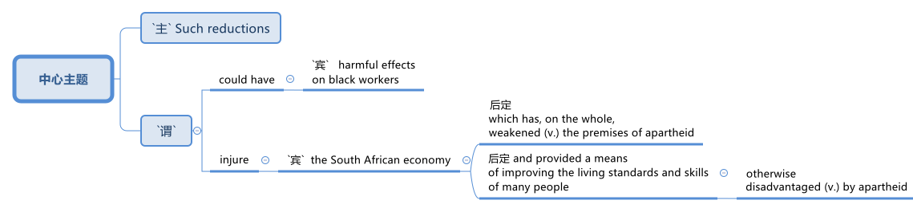

= step 3- Lesson 3
:toc: left
:toclevels: 3
:sectnums:
:stylesheet: ../../+ 000 eng选/美国高中历史教材 American History ： From Pre-Columbian to the New Millennium/myAdocCss.css

'''

== 01.

IBM, following the lead of General Motors 通用汽车, announced today it’s pulling out of South Africa.

[.my2]
IBM 继通用汽车之后，今天宣布退出南非。

Like General Motors, IBM says it’s selling its South African holdings 股份,私有财产 because of the political and economic situation there.

[.my2]
与通用汽车一样，IBM 表示，由于南非的政治和经济形势，该公司正在出售其在南非的股份。

Anti-apartheid 种族隔离（前南非政府推行的政策） groups have praised (v.)称赞，表扬 the decision, but the State Department says business pullouts (n.)拔；撤离 are regrettable (a.)令人惋惜的；可惜的；令人遗憾的.

[.my2]
反种族隔离团体赞扬了这一决定，但国务院表示，企业撤出令人遗憾。

Spokesman Charles Redmond said today the Reagan Administration believes `主` US corporate 公司的；法人的 involvement in South Africa `谓` has been a progressive 进步的；先进的；开明的 force against apartheid （南非政府过去推行的）种族隔离制度.

[.my2]
发言人查尔斯·雷德蒙德今天表示，里根政府相信, 美国企业对南非的参与, 是"反对种族隔离"的进步力量。

"We regret (v.) any decision to reduce US private sector involvement in South Africa.

[.my2]
“我们对减少美国私营部门在南非的参与的任何决定, 感到遗憾。

Such reductions (n.)减少；缩小；降低 could have harmful effects on black workers, injure (v.) the South African economy which has, on the whole, weakened (v.) the premises 前提；假定 of apartheid 种族隔离制度 and provided a means of improving the living standards and skills of many people otherwise 在其他方面；另；亦  disadvantaged (v.)使处于不利地位，损害 by apartheid, and it might limit (v.) the extent 程度；限度;大小；面积；范围 of US influence (n.) in South Africa." State Department spokesman Charles Redmond.

[.my2]
这种减少可能对黑人工人产生有害影响，损害南非经济，而南非经济总体上削弱了种族隔离的前提，并提供了一种手段来提高许多因种族隔离而处于不利地位的人的生活水平和技能，而且可能限制美国在南非的影响程度。

[.my1]
.案例
====

.otherwise
in a different way to the way mentioned; differently 在其他方面；另；亦 +
- Bismarck, otherwise known as ‘the Iron Chancellor’ 俾斯麦，亦称为“铁血首相” +
- You know what this is about. Why pretend otherwise (= that you do not) ?你明明知道这是怎么回事，为什么装作不知道？ +
- I wanted to see him but he was otherwise engaged (= doing sth else) .我想见他，但他正忙着别的事情。
====

IBM employs (v.) some 1,500 people in South Africa.

[.my2]
IBM 在南非拥有约 1,500 名员工。

More than fifty black youths were arrested today in Harare, Zimbabwe, when police broke up 散开；解散;粉碎；破碎 demonstrations 集会示威；游行示威 at South African offices and the US embassy.

[.my2]
今天，当警察驱散南非办事处和美国大使馆的示威活动时，津巴布韦哈拉雷有五十多名黑人青年被捕。

Julie Fredricks reports.

[.my2]
朱莉·弗雷德里克斯报道。

"A group of more than a thousand students and youths `谓` caused thousands of dollars of damage by burning (v.) and stoning (v.)the offices of the South African trade mission 使团；代表团；执行任务的地点, South African Airways, Air Malawi, and the Malawian High Commission （英联邦国家相互派驻的）高级专员公署;（政府或国际组织的）重大项目工作组；特别事务公署.

[.my2]
“一千多名学生和青年组成的团体, 焚烧和投掷南非贸易代表团、南非航空公司、马拉维航空公司, 和马拉维高级委员会的办公室，造成了数千美元的损失。

[.my1]
.案例
====
.High Commission
1.the office and the staff of an embassy that represents the interests of one Commonwealth country in another（英联邦国家相互派驻的）高级专员公署 +
2.a group of people who are working for a government or an international organization on an important project（政府或国际组织的）重大项目工作组；特别事务公署
====

The demonstrators ① suspected (v.) South African complicity (v.)同谋；共犯；勾结 in the plane crash that killed Mozambiquan President Machel in South Africa and ② blamed (v.) Malawi for supporting (v.) the Pretoria-backed (a.) insurgents 叛乱分子 that are attacking (v.) Mozambique.

[.my2]
示威者怀疑, 南非参与了导致莫桑比克总统马谢尔在南非丧生的飞机坠毁事件，并指责"马拉维支持比勒陀利亚支持的反叛分子, 袭击莫桑比克"。

Zimbabwean government officials appealed for calm, and `主` #a statement# from Prime Minister Mugabe 后定向前推进 just back from a trip to London `谓` #is expected# (v.)预料；预期；预计 tomorrow.

[.my2]
津巴布韦政府官员呼吁保持冷静。刚从伦敦访问回来的津巴布韦总理穆加贝, 预计将于明天发表声明。

For National Public Radio, this is Julie Fredricks in Harare.

[.my2]
我是国家公共广播电台的朱莉·弗雷德里克斯，来自哈拉雷。

'''

==  02.

President Reagan met (v.) for about an hour today with West German Chancellor Helmut Kohl at the White House.

[.my2]
里根总统, 今天在白宫会见了西德总理赫尔穆特·科尔约一个小时。

Kohl is the first European Leader to visit the President since the Reykjavik summit.

[.my2]
科尔是雷克雅未克峰会以来, 第一位拜访总统的欧洲领导人。

US officials say Kohl expressed (v.) support for the President’s SDI program.

[.my2]
美国官员称, 科尔表达了对总统战略防御计划的支持。

[.my1]
.案例
====
.SDI
Strategic Defense Initiative
====

West German Chancellor Helmut Kohl is in Washington D.C. for four days of meetings.

[.my2]
西德总理赫尔穆特·科尔, 正在华盛顿参加为期四天的会议。

Among the issues on his agenda are economic relations with the US and Germany’s policy towards southern Africa.

[.my2]
他议程上的问题包括, 与美国的经济关系, 以及德国对南部非洲的政策。

But today, `主` Kohl’s talk (n.) with President Reagan `谓` was dominated by the recent US-Soviet summit meeting in Iceland.

[.my2]
但今天，科尔与里根总统的谈话内容, 主要是关于最近在冰岛举行的美苏峰会。

NPR’s Brenda Wilson reports.

[.my2]
NPR 的布伦达·威尔逊报道。

While no major agreement was signed by the United States and the Soviet Union in Reykjavik, the two countries made (v.) progress in arms control talks (n.) in areas 后定向前推进 that are a central concern to America’s European allies.

[.my2]
尽管美国和苏联在雷克雅未克没有签署任何重大协议，但两国在美国欧洲盟友最关心的领域的军控谈判, 取得了进展。

Those particular areas `谓` involve (v.) disarmament (n.)裁军，裁减军备（尤指核武器） proposals 后定向前推进 made in Iceland, affecting medium-range missiles and long-range missiles over which allies 盟国 have voiced (v.) some reservations 保留意见；疑惑.

[.my2]
这些具体领域涉及冰岛提出的裁军建议，涉及中程导弹和远程导弹，盟国对此表示了一些保留意见。

This was a major topic of discussion with Chancellor Kohl today, even though his Foreign Minister was briefed (v.)给（某人）指示；向（某人）介绍情况 by the US Secretary of State only last week.

[.my2]
这是今天与科尔总理讨论的一个主要话题，尽管他的外交部长上周才听取了美国国务卿的通报。

In remarks (v.)说起；谈论；评论 welcoming Chancellor Kohl, President Reagan sounded (v.)听起来…的; （使）发出声音，响;听起来好像；让人听着好像 a positive note 特征；口气；调子；气氛, saying that there was ample 足够的；丰裕的 reason for optimism.

[.my2]
里根总统在欢迎科尔总理的讲话中, 表达了积极的态度，称有充分的理由保持乐观。

"When the next agreement is finally reached with the Soviet Union, and I say when, not if, it will not be the result of weakness of timidity (n.)胆怯，胆小，羞怯 on the part of 就……而言 Western nations.

[.my2]
“当最终与苏联达成下一份协议时，我说的是"何时做"，而不是"是否会"，这不会是西方国家胆怯的结果。

Instead, it will flow 来自；由…引起 from our strength, realism 务实作风；现实主义方式 and unity." The President also explained that `主` achieving (v.)（凭长期努力）达到（某目标、地位、标准） such an agreement `谓` would depend upon pushing ahead with his Strategic Defense Initiative 倡议；新方案, SDI, because it offered (v.) protection against cheating.

[.my2]
相反，它将来自我们的力量、现实主义和团结。”总统还解释说，达成这样的协议, 将取决于推进他的战略防御计划（SDI），因为它提供了防止作弊的保护。

[.my1]
.案例
====
.flow from sth
( formal ) to come or result from sth来自；由…引起
====

But members of NATO, including Germany, have expressed concern that `主` eliminating (v.)排除；清除；消除 medium-range missiles in Europe as was proposed in Reykjavik `谓` would potentially leave (v.) Europe vulnerable (a.)（身体上或感情上）脆弱的，易受…伤害的 to the Soviet ① shorter-range missiles and ② greater superiority 优越（性）；优势 in conventional 非核的；常规的 forces.

[.my2]
但北约成员国，包括德国，对在雷克雅未克提出的在欧洲消除中程导弹的提议表示担忧，认为这可能使欧洲面临苏联短程导弹的威胁，并导致在常规武装力量上苏联拥有更大的优势。

They expressed doubts that SDI could make up for 弥补，补偿，抵消 those deficiencies 缺乏，不足；缺陷.

[.my2]
他们对 SDI 能否弥补这些缺陷表示怀疑。

The allies 盟国, in particular West Germany, want reductions (n.) in medium-range missiles tied to 连接；联合；使紧密结合 reductions in shorter-range missiles and conventional forces.

[.my2]
盟国，特别是西德，希望在削减中程导弹的同时, 削减短程导弹和常规部队。

Chancellor Kohl was expected to press (v.) these points and to urge (v.) President Reagan to compromise (v.)（为达成协议而）妥协，折中，让步 on SDI to keep talks (n.) between the US and the Soviets moving.

[.my2]
预计科尔总理将强调这些观点，并敦促里根总统在 SDI 问题上做出妥协，以保持美国和苏联之间的谈判继续进行。

Speaking through an interpreter 口译工作者；口译译员 in his arrival remarks, Kohl did not mention (v.) SDI, "It remains (v.) our goal, and I know that I shared (v.) with you, Mr. President, to create peace and security with ever fewer weapons.

[.my2]
科尔在抵达致辞中通过翻译发表讲话，并没有提及 SDI，“这仍然是我们的目标，总统先生，我知道我和你分享过，以更少的武器, 创造和平与安全。

In Reykjavik, thanks to your serious and consistent efforts in pursuit (n.) of peace, a major step was taken in this direction.

[.my2]
在雷克雅未克，由于你们为追求和平而作出的认真而持续的努力，我们已朝这个方向迈出了重要的一步。

And we must now take the opportunities that present (v.)（以某种方式）展现，显示，表现 themselves without endangering (v.)使遭危险；危及；危害 our defensive capability." After the meeting between Kohl and the President, `主` a senior administration official `谓` #quoted# 引用；引述 Kohl #as saying that# he has always been in favor of the Strategic Defense system.

[.my2]
我们现在必须抓住出现的机会，而不危及我们的防御能力。”在科尔与总统会面后，一位高级政府官员援引科尔的话说，他一直支持战略防御系统。

[.my1]
.案例
====
.quote
(v.)~ (sth) (from sbsth) |~ (sb) (#as doing# sth) :to repeat the exact words that another person has said or written引用；引述
[ VN] +
- He quoted a passage from the minister's speech. 他引用了部长的一段讲话。 +
- The President was quoted in the press as saying that he disagreed with the decision. 报刊援引总统的话，说他不赞成这项决定。
====

At the White House, I’m Brenda Wilson.

[.my2]
在白宫，我是布伦达·威尔逊。

'''

==  03.

A group of business leaders in Boston today announced plans to expand a college scholarship 奖学金 program to include any eligible 有资格的；合格的；具备条件的 Boston high school graduate.

[.my2]
波士顿的一群商界领袖今天宣布, 计划扩大大学奖学金计划，以涵盖任何符合条件的波士顿高中毕业生。

The business leaders announced plans for a permanent five-million dollar endowment (n.)捐款；捐赠；资助 fund, and they also promise to hire (v.) any of the students who go on to complete (v.) their college educations.

[.my2]
商界领袖宣布了设立 500 万美元永久性捐赠基金的计划，他们还承诺雇用任何继续完成大学教育的学生。

Andrew Kaffery of member station WBUR has the report.

[.my2]
WBUR 会员站的安德鲁·卡弗里 (Andrew Kaffery) 收到了这份报告。

The Boston business community’s 社区；社会 involvement in the Boston public school dates (v.) back almost twenty years, from work internships 实习 to an endowment 捐款；捐赠；资助 program for Boston teachers.

[.my2]
波士顿商界对波士顿公立学校的参与, 可以追溯到近二十年前，从工作实习, 到波士顿教师的捐赠计划。

Business has pumped 用泵（或泵样器官等）输送 more than one million dollars into the public schools.

[.my2]
企业已向公立学校注入了超过一百万美元。

Now business leaders say they’re ready to make their biggest commitment 承诺；许诺；允诺承担；保证 yet: a multi-million dollar scholarship program that will enable the city’s poorest kids to go on to college and to jobs afterward.

[.my2]
现在，商界领袖表示，他们已准备好做出迄今为止最大的承诺：一项数百万美元的奖学金计划，该计划将使该市最贫困的孩子能够继续上大学并随后找到工作。

The program is called Action Center for Educational Services and Scholarships, or ACESS.

[.my2]
该计划, 称为"教育服务和奖学金行动中心"，或 ACESS。

According to Daniel Cheever, the President of Boston’s Wheelock College, ACESS in not a blank check for the eligible graduates.

[.my2]
波士顿会德丰学院 (Wheelock College) 校长丹尼尔·奇弗 (Daniel Cheever) 表示，对于符合条件的毕业生来说，ACESS 并不是一张空白支票。

"First We’ll help them get as much aid as they can from other sources, and secondly, we’ll provide the last dollar scholarship.

[.my2]
“首先，我们将帮助他们从其他来源获得尽可能多的援助，其次，我们将提供最后一美元的奖学金。

I should add (v.), of course, they have to qualify (v.)使合格；使具备资格 for financial aid; that is, we’re not handing out money to students who don’t need it." The average grant (n.)（尤指正式地或法律上）同意，准予;（政府、机构的）拨款，允许 is around five hundred dollars and already the program has given one hundred Boston students more than fifty thousand dollars in scholarship money.

[.my2]
当然，我要补充一点，他们必须有资格获得经济援助；也就是说，我们不会向不需要的学生发放资金。”平均助学金约为 500 美元，该项目已经为 100 名波士顿学生提供了超过 5 万美元的奖学金。

Other assistance from the program has helped those students raise more than six hundred thousand dollars in additional financial aid.

[.my2]
该计划的其他援助已帮助这些学生筹集了超过六十万美元的额外经济援助。

School officials say this program will help a system where 43% of the students live (v.) below the poverty 贫穷；贫困 level, and `主` almost #half# 后定向前推进 who enter (v.) high school `谓` #drop out# 退学,辍学.

[.my2]
学校官员表示，该计划将帮助一个 "43% 的学生生活在贫困线以下、几乎一半进入高中的学生辍学"的系统。

Robert Weaver was on Boston high school graduate who could not afford (v.)  college.

[.my2]
罗伯特·韦弗 (Robert Weaver) 是波士顿高中毕业生，无法负担大学费用。

He’s in the ACESS program now and will get a degree in airplane mechanics 机械学，力学；机制，运作方式 next year from the Wentworth Institute of Technology in Boston.

[.my2]
他现在正在参加 ACESS 项目，明年将从波士顿温特沃斯理工学院获得飞机力学学位。

"I got the Pale grant （政府、机构的）拨款 and the state scholarship, but there was still a gap.

[.my2]
“我获得了帕莱助学金和国家奖学金，但仍然存在差距。

There was like a twenty-three hundred-dollar gap.

[.my2]
大约有两千三百美元的差距。

Wentworth’s total bill `系` was fifty-seven hundred, so I had to fill that amount with working (v.) over the summer, my family contribution.

[.my2]
温特沃斯的账单总额为五千七百美元，所以我必须通过暑假的工作来填补这笔钱，这是我家庭的贡献。

I paid for my own books, my own tools, things like that.

[.my2]
我为自己的书、工具等东西付费。

But without ACESS I wouldn’t be where I am today." This program comes at an important time for the city of Boston.

[.my2]
但如果没有 ACESS，我就不会取得今天的成绩。” 该计划的推出正值波士顿市的一个重要时刻。

Unemployment here is among the lowest in the nation and business leaders say they’re having a hard time finding qualified job applicants.

[.my2]
这里的失业率是全国最低的，商界领袖表示，他们很难找到合格的求职者。

So the ACESS program is not just good public relations.

[.my2]
所以 ACESS 计划不仅仅是良好的公共关系。

Business leaders, like Edward Philips, who is the chairman of the ACESS program, say there’s a bit of self-preservation 自我保存；自我保护 involved.

[.my2]
ACESS 计划主席爱德华·飞利浦 (Edward Philips) 等商界领袖表示，这涉及到一些自我保护。

"Over time, we believe this program will increase the flow 持续生产；不断供应;流；流动 of Boston residents into Boston businesses and that, of course, is a self-serving 只为个人打算的；一心谋私利的 opportunity.

[.my2]
“随着时间的推移，我们相信, 该计划将增加波士顿居民进入波士顿企业的人数，当然，这是一个服务自己的机会。

If where you are has a supply of qualified people to enter managerial 经理的；管理的 and technical-professional level jobs, that can’t be anything but a plus."  +
Philips says any scholarship student who finishes college will be given hiring (v.) priority 优先；优先权；重点 over other job applicants by the participating businesses.

[.my2]
如果你所在的地方, 有足够的合格人才进入管理和技术专业级别的工作，那只能是一个加分。”飞利浦表示，任何完成大学学业的奖学金学生, 都将比其他求职者获得招聘优先权。参与企业。

College student Robert Weaver says the program has inspired 激励，鼓舞 other high school students to stay in school.

[.my2]
大学生罗伯特·韦弗表示，该计划激励了其他高中生留在学校。

"I went back to my high school yesterday, Brighton High School, and I talked to a senior class, the general assembly, and I was telling them basically what I’m involved in, and basically, to get yourselves motivated (v.) and go look for those ACESS advisers.

[.my2]
"昨天我回到了我的高中，布莱顿高中，我和一群高三学生进行了交流，进行了一个全校大会。我告诉他们我基本上参与了什么活动，还鼓励他们激发动力，主动去寻找那些ACESS顾问。"

They’re not going to come to you all the time.

[.my2]
他们不会一直来找你。

You have to get out there and get it if you want to take account 考虑到；顾及 for your own life, because no one else is going to do it for you.

[.my2]
如果你想为自己的生活负责，你就必须走出去并得到它，因为没有人会为你做这件事。

And that really pumped them up 给（某人）打气；鼓励, and now that they’re aware, and they know that ACESS advisers are there, things will be a lot easier for them." The business group is in the middle of a five-million-dollar fund drive.

[.my2]
这确实让他们兴奋不已，现在他们意识到了，而且他们知道 ACESS 顾问就在那里，事情对他们来说会容易得多。” 该业务集团正在进行 500 万美元的资金筹集活动。

Two million dollars has already been collected.

[.my2]
已经筹集到200万美元。

Thirty-two of Boston’s most influential corporations have already joined in, with twenty more soon to follow.

[.my2]
波士顿最有影响力的 32 家公司已经加入，不久还将有 20 家公司加入。

The program has drawn the praise of US Education Secretary William Bennett, who predicted it will become a national model.

[.my2]
该项目得到了美国教育部长威廉·贝内特的赞扬，他预测该项目将成为全国典范。

For National Public Radio, I’m Andrew Kaffery in Boston.

[.my2]
我是国家公共广播电台的安德鲁·卡弗里，来自波士顿。

'''
