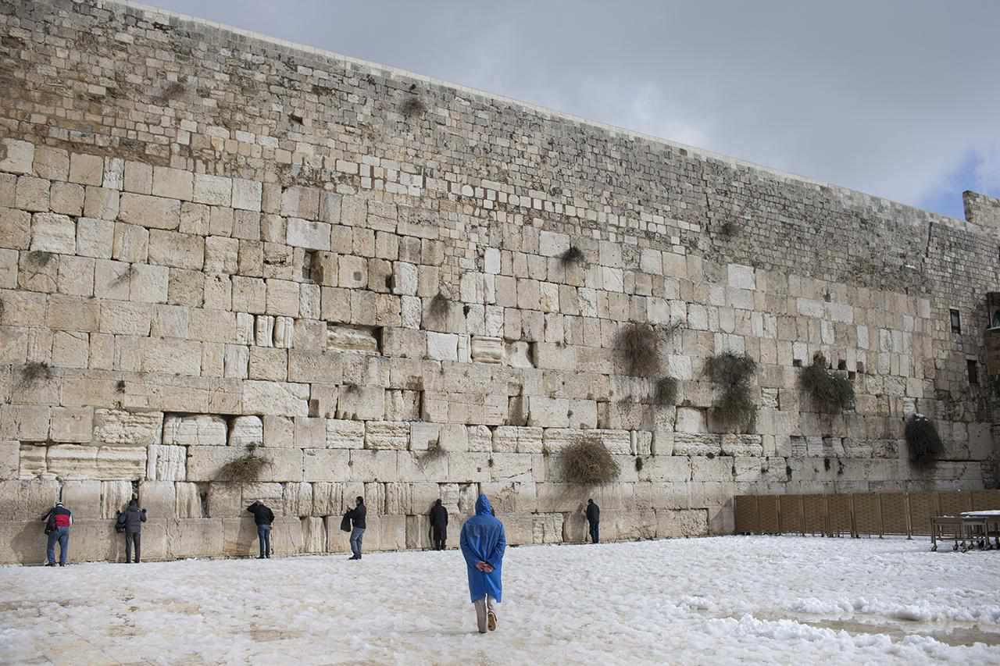
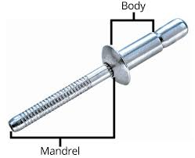

= step 3- Lesson 30
:toc: left
:toclevels: 3
:sectnums:
:stylesheet: ../../+ 000 eng选/美国高中历史教材 American History ： From Pre-Columbian to the New Millennium/myAdocCss.css

'''

Israeli warplanes raided (v.) _suspected 有嫌疑的，疑似……的 Palestinian targets_ in southern Lebanon today, a day after _a grenade 榴弹；手榴弹 attack_ near Jerusalem's _Wailing （因悲伤或疼痛）哭号，恸哭 Wall_. +
NPR's Deborah Amis reports (v.).

[.my2]
今天，在耶路撒冷哭墙附近发生手榴弹袭击一天后，以色列战机袭击了黎巴嫩南部的可疑巴勒斯坦目标。
NPR 的黛博拉·艾米斯报道。

[.my1]
.案例
====
.grenade
-> 英语单词grenade（手榴弹）来自英语中表示“石榴”的单词pomegranate。之所以得此名称是因为早期的手榴弹形状很像石榴，而且里面填充的大量杀伤性碎片很像石榴里面的石榴籽。它的中文名称“手榴弹”中的“榴”指的就是“石榴”。 grenade：[grə'neɪd] n.手榴弹，手雷vt.扔手榴弹

.wail
-> 拟声词。比较woe.

.wailing wall

西墙，又名哭墙. 位于耶路撒冷旧城内，圣殿山山下西侧。这是环绕第二圣殿庭院的古城墙的残存部分。在四面墙之中，西墙被认为是当年最靠近圣殿的，使它成为犹太教信仰中除"圣殿山"本身以外最神圣的地点。 +
许多个世纪以来，西墙一直是犹太人祈祷和朝圣的地点。西墙一词最早出现于犹太经典，但其“圣殿西墙”所指, 是否与今日相同，亦或是圣殿群内其他墙壁不得而知。
====

"This afternoon four Israeli jets streaked (v.)飞奔；疾驰;裸奔 over the Palestinian _refugee camp_ of Miamia near the south Lebanese town of Sidon within the Palestinian targets.

[.my2]
“今天下午，四架以色列喷气式飞机, 在巴勒斯坦目标内的黎巴嫩南部城镇西顿附近的, 迈阿密巴勒斯坦难民营上空飞行。

According to reports from Sidon, one Israeli _Phantom 鬼魂；幽灵;幻觉；幻象 jet_ was shot (v.) down by _a Sam-5 missile_ during the raid. +
Two of the crewmen 船员；乘务员 on board parachuted (v.)跳伞 out.
One died; the other was captured by Amal, the Lebanese _Shi'ite 什叶派 Muslim group_.

[.my2]
据西顿报道，一架以色列“幻影”喷气式飞机, 在袭击中被萨姆-5导弹击落。
机上两名船员跳伞跳伞。一名死亡；一名死亡。另一个被黎巴嫩什叶派穆斯林组织阿迈勒抓获。

[.my1]
.案例
====
.parachute
-> 在法语中para-意为warding off（防，避）。chute意为fall（降落，下降），所以在字面上parachute是“防止降落”的意思，但汉语却将之译为“降落伞”。英语还有一个词parasol，结构和parachute极为相似。 +
parasol意为“阳伞”，它源自意大利语parasole，由para -‘warding off’（防，避）和sole‘sun’（太阳）合成，按字面讲是“防太阳晒”的意思。表示“雨伞”的法语单词parapluie，其结构也大致相同，字面上含有“防雨水”之义。
====

The Israeli _military spokesman_ in Jerusalem would only confirm that a raid had taken place in south Lebanon, but wouldn't comment (v.) on any of the other details coming from Lebanese reports.

[.my2]
耶路撒冷的以色列军方发言人, 只会证实黎巴嫩南部发生了一次袭击，但不会对黎巴嫩报道中的任何其他细节, 发表评论。

Meanwhile in Israel, `主` a government crisis that has riveted (v.) 吸引住;铆接；（用铆钉）固定 the attention of most Israelis `谓` was resolved today, but hardly noticed in _the unfolding 展开，打开;被披露，被呈现 drama_ 戏剧性事件；戏剧性情节 of the day's events.

[.my2]
与此同时，在以色列，一场引起大多数以色列人关注的政府危机, 今天得到了解决，但在当天发生的戏剧性事件中, 却几乎没有引起人们的注意。

[.my1]
.案例
====
.rivet

====

In a rotation 轮换；交替；换班 agreement made by the two _major political parties_, Yitzhak Shamir will become the new _Prime Minister_ of Israel on Monday. +
For _National Public Radio_, this is Deborah Amis in Jerusalem."

[.my2]
根据两大政党达成的轮流协议，伊扎克·沙米尔将于周一成为以色列新总理。
对国家公共广播电台来说，这是耶路撒冷的黛博拉·艾米斯。”

Nigerian _playwright 剧作家, poet and novelist_ Wole Soyinka `谓` was named today as the first black to win _the Nobel Prize for Literature_ 诺贝尔文学奖. +
Soyinka has published about twenty works that denounce (v.)谴责，痛斥 racism and fascism 法西斯主义, and praise (v.) _everyday man_ 普通人 of every color.

[.my2]
尼日利亚剧作家、诗人和小说家沃勒·索因卡, 今天被任命为第一位获得诺贝尔文学奖的黑人。索因卡出版了大约二十部作品，谴责种族主义和法西斯主义，赞扬各种肤色的普通人。

And at the news conference in Paris today, Soyinka said the award 奖，奖品 represented (v.) _world recognition_ of the long misunderstood culture and traditions of Africa. +

[.my2]
索因卡今天在巴黎举行的新闻发布会上表示，该奖项代表了世界对"长期被误解的非洲文化和传统"的认可。

The winner of _the 1986 Nobel Prize for Economics_ was also named today. +
James Buchanan of _George Mason University_ is recognized for discoveries (n.) 后定 demonstrating (v.)证明；证实；论证；说明 the link between _political decisions_ and _a nation's economic performance_.

[.my2]
1986年诺贝尔经济学奖的获得者也于今天揭晓。乔治梅森大学的詹姆斯·布坎南, 因证明"政治决策"与"国家经济表现"之间的联系的发现, 而受到认可。

Congress approved (v.) another _emergency funding bill_ to keep the government operating (v.) another day, while lawmakers continued (v.) debate on _an overall spending package_ for the year. +
NPR's Cokie Roberts reports.

[.my2]
国会批准了另一项"紧急拨款法案"，以使政府继续运转，而立法者则继续就"今年的总体支出方案"进行辩论。 +
NPR 的 Cokie Roberts 报道。

"Big orange and white buttons reading 'Free the 99th Congress' have sprouted on the lapels all over Capitol Hill.

[.my2]
“国会山各地的翻领上都出现了写着‘解放第 99 届国会'的橙色和白色大纽扣。

Members of Congress, ready to hit the campaign trail, just don't seem able to get out of Washington.

[.my2]
准备好参加竞选活动的国会议员似乎无法离开华盛顿。

The big five hundred and seventy-six billion dollar spending bill needed to keep the government functioning through this fiscal year is being debated on the Senate floor.

[.my2]
参议院正在就维持政府在本财年正常运转所需的 5760 亿美元的巨额支出法案进行辩论。

The House passed the measure last night.

[.my2]
众议院昨晚通过了这项措施。

But the other must-pass piece of legislation, the measure to allow the government to keep borrowing in order to pay its bills, is now not expected before tomorrow.

[.my2]
但另一项必须通过的立法，即允许政府继续借贷以支付账单的措施，目前预计在明天之前不会通过。

Two other big bills still need one house to act on them.

[.my2]
另外两项大法案仍需要一个众议院来实施。

The House passed immigration reform yesterday.

[.my2]
众议院昨天通过了移民改革。

The Senate will deal with it tomorrow.

[.my2]
参议院将于明天处理此事。

The Senate passed a drug bill yesterday and now it looks like it will be tomorrow before that measure reaches the House floor.

[.my2]
参议院昨天通过了一项毒品法案，现在看起来该法案要到明天才能到达众议院。

I'm Cokie Roberts at the Capitol." Israel reacted swiftly today both diplomatically and militarily to a grenade attack in Jerusalem last night.

[.my2]
我是国会大厦的科基·罗伯茨。”以色列今天在外交和军事上对昨晚耶路撒冷发生的手榴弹袭击做出了迅速反应。

The Palestine Liberation Organization claimed responsibility for the attack from its office in Cairo.

[.my2]
巴勒斯坦解放组织驻开罗办事处声称对此次袭击负责。

Today, according to reports from news agencies in Lebanon, Israeli war planes bombed and shelled a Palestinian refugee camp in south Lebanon.

[.my2]
今天，据黎巴嫩通讯社报道，以色列战机轰炸了黎巴嫩南部一处巴勒斯坦难民营。

From Jerusalem, Deborah Amis reports.

[.my2]
黛博拉·艾米斯在耶路撒冷报道。

Event unfolded quickly today.

[.my2]
今天事件进展很快。

According to reports from Lebanon, Israeli jets bombed and shelled Miamia, a Palestinian refugee camp near the Lebanese port city of Sidon.

[.my2]
据黎巴嫩报道，以色列战机轰炸了黎巴嫩港口城市西顿附近的巴勒斯坦难民营迈阿密亚。

According to witnesses there three civilians were wounded as the planes hit their targets.

[.my2]
据目击者称，飞机击中目标时造成三名平民受伤。

Sidon and the refugee camp nearby have become a stronghold for Al-Fatah guerrillas, loyal to Yasir Arafat, Chairman of the PLO.

[.my2]
西顿和附近的难民营已成为效忠巴解组织主席亚西尔·阿拉法特的法塔赫游击队的据点。

The raid today appears to be in retaliation for yesterday's grenade attacks in Jerusalem.

[.my2]
今天的袭击似乎是对昨天耶路撒冷发生的手榴弹袭击的报复。

Although other groups claimed responsibility throughout the day, the Israeli government chose to take the PLO claim seriously as shown in their choice of targets.

[.my2]
尽管其他组织全天声称对此事负责，但以色列政府选择认真对待巴解组织的声明，这一点从他们对目标的选择中可见一斑。

According to reports out of Lebanon tonight, an Israeli plane was shot down in the raid, and one crewman was captured; the other one died.

[.my2]
据黎巴嫩今晚报道，一架以色列飞机在袭击中被击落，一名机组人员被俘；另一个死了。

The Israeli military spokesman would only confirm that a raid had taken place in south Lebanon, but would not comment on any of the other details.

[.my2]
以色列军方发言人仅证实黎巴嫩南部发生了袭击，但不会评论任何其他细节。

On the diplomatic front earlier today Mohammed Basuni, Egypt's Ambassador to Israel was summoned to the Foreign Ministry.

[.my2]
在外交方面，今天早些时候埃及驻以色列大使穆罕默德·巴苏尼被传唤到外交部。

There a senior Israeli official presented him with a formal protest.

[.my2]
一名以色列高级官员向他提出正式抗议。

Basuni was told that the PLO office in Cairo was incompatible with the terms of the peace treaty with Israel.

[.my2]
巴苏尼被告知巴解组织驻开罗办事处不符合与以色列签订的和平条约的条款。

This morning, when the PLO claimed responsibility for the grenade attack in Jerusalem, the statement was made from the Cairo office.

[.my2]
今天上午，巴解组织声称对耶路撒冷的手榴弹袭击负责，这一声明是从开罗办事处发表的。

Fizo Awada, the PLO representative, was interviewed on Cairo radio.

[.my2]
巴解组织代表菲索·阿瓦达接受开罗电台采访。

Ambassador Basuni said today that Egypt condemns terrorism and that Egyptian authority has summoned the PLO representative for an explanation.

[.my2]
巴苏尼大使今天表示，埃及谴责恐怖主义，埃及当局已传唤巴解组织代表作出解释。

However, the fact that Egypt is the only Arab country to have an Ambassador in Israel and a PLO representative in Cairo presents some problems.

[.my2]
然而，埃及是唯一在以色列设有大使并在开罗设有巴解组织代表的阿拉伯国家，这一事实带来了一些问题。

Today, some Israeli military authorities were making the semantic distinction on last night's grenade attack.

[.my2]
今天，一些以色列军事当局对昨晚的手榴弹袭击进行了语义区分。

Some called it "a guerrilla attack" rather than "a terrorist one." Yitzhak Shamir, Israel's Prime Minister, said he saw no difference.

[.my2]
一些人称其为“游击队袭击”，而不是“恐怖分子袭击”。以色列总理伊扎克·沙米尔表示，他认为没有什么区别。

"Civilians or military, the PLO was out to kill Jews," he said.

[.my2]
“无论是平民还是军人，巴解组织都是为了杀害犹太人，”他说。

Clearly, that was the reason for today's raids on Palestinian refugee camps in south Lebanon.

[.my2]
显然，这就是今天袭击黎巴嫩南部巴勒斯坦难民营的原因。

For National Public Radio, this is Deborah Amis in Jerusalem.

[.my2]
我是国家公共广播电台的黛博拉·艾米斯，在耶路撒冷。

The recipient of this year's Nobel Prize for Literature was announced today.

[.my2]
今年的诺贝尔文学奖获奖者今天揭晓。

He is Wole Soyinka, a fifty-two-year-old Nigerian playwright and an author.

[.my2]
他就是 Wole Soyinka，一位五十二岁的尼日利亚剧作家和作家。

Soyinka's best known work in this country is probably Ake , his childhood memoir.

[.my2]
索因卡在这个国家最著名的作品可能是他的童年回忆录《阿克》。

Soyinka is the first African and the first black to win the distinguished prize for literature.

[.my2]
索因卡是第一位获得该杰出文学奖的非洲人和第一位黑人。

And he was in Paris today when he heard the news.

[.my2]
今天他听到这个消息时正在巴黎。

Melodie Walker reports.

[.my2]
梅洛迪·沃克报道。

Wole Soyinka is in Paris to attend a meeting of International Theatre Institute, a non-governmental organization at UNESCO headquarters.

[.my2]
沃勒·索因卡 (Wole Soyinka) 正在巴黎参加联合国教科文组织总部的非政府组织国际戏剧学院的会议。

Appearing somewhat annoyed by the crowd of reporters who cornered him in a lounge at UNESCO, the Nigerian writer confessed that he wasn't really prepared for the onslaught of instant Nobel prize fame.

[.my2]
这位尼日利亚作家似乎对被一群记者把他困在联合国教科文组织休息室里感到有点恼火，他承认自己并没有真正准备好迎接诺贝尔奖的瞬间名声。

"I am not really enjoying it, honestly.

[.my2]
“老实说，我并不是真的喜欢它。

It's …​

[.my2]
这是……​

I had no psychological preparation.

[.my2]
我没有任何心理准备。

You know, I'm just into it like that, you know.

[.my2]
你知道，我只是喜欢那样，你知道。

If I'd had some notice and I'd been able to, you know, prepare myself, you know, like an athlete going into combat, into competition perhaps, but this was rather sudden.

[.my2]
如果我有一些注意，并且我能够，你知道，准备好自己，你知道，就像一名运动员进入战斗，也许进入比赛，但这相当突然。

You know, really, really sudden, totally unexpected." Soyinka says he accepted the news of the Nobel Prize for Literature with the deep sense of honor, but not for himself alone.

[.my2]
你知道，真的非常突然，完全出乎意料。”索因卡说，他怀着深深的荣誉感接受了诺贝尔文学奖的消息，但不仅仅是为了他自己。

He says the award goes beyond his individual work and honors all African writers.

[.my2]
他说，该奖项超越了他的个人作品，向所有非洲作家致敬。

"I don't believe in literally prizes.

[.my2]
“我不相信真正的奖项。

And therefore when I view the literary prize, I tend to see the prize in a much larger context than the individual writer, because how do you judge works of literature? How do you compare works of literature from different cultures? It's an almost impossible task.

[.my2]
因此，当我看待文学奖时，我倾向于在比单个作家更大的背景下看待该奖项，因为你如何评判文学作品？您如何比较不同文化的文学作品？这几乎是一项不可能完成的任务。

So certain contradictions must go into the choice of somebody to receive an award of this kind.

[.my2]
因此，选择某人获得此类奖项必然存在一定的矛盾。

And that, those contradictions must go outside of the person himself.

[.my2]
而且，这些矛盾必须超出人本身的范围。

It has to do with the context.

[.my2]
这与上下文有关。

Without any compromise in literary qualities, I do not believe that I'm considered a bad writer; that's why I've been given this prize.

[.my2]
在不影响文学品质的情况下，我不认为我是一个糟糕的作家；这就是我获得这个奖项的原因。

No, don't misunderstand me.

[.my2]
不，别误会我的意思。

But I'm saying that it's more than just being an acceptable writer who gives some kind of literary pleasure to discerning, sophisticated people.

[.my2]
但我想说的是，这不仅仅是成为一个可以接受的作家，为眼光敏锐、经验丰富的人们带来某种文学乐趣。

It goes beyond that.

[.my2]
它超出了这一点。

It has to do with the significance of this occasional symbolic event.

[.my2]
这与这个偶然的象征性事件的重要性有关。

And it is very much a symbolic event.

[.my2]
这在很大程度上是一个具有象征意义的事件。

It's for all the African writers, for even the third would, for even the universal literature, because it opens the universe to the literature not merely of the recipient of the prize, but of the society from which his literature comes.

[.my2]
这是为了所有非洲作家，甚至是第三个作家，甚至是普世文学，因为它不仅向获奖者的文学开放了宇宙，而且向其文学来源的社会开放了文学的宇宙。

It opens, then, certain nuggets, literary and artistic nuggets which they have taken for granted, which they have relegated to the exotica.

[.my2]
然后，它打开了某些他们认为理所当然的金块，文学和艺术金块，他们将其归为异国情调。

So it's a symbolic prize, and I view it as such …​" Wole Soyinka writes poetry, plays and novels in his native Yoruba and in English.

[.my2]
所以这是一个象征性的奖项，我认为它是这样的......”沃勒·索因卡用他的母语约鲁巴语和英语创作诗歌、戏剧和小说。

He studied theatre in England in the 1950s after attending Leeds University.

[.my2]
进入利兹大学后，他于 20 世纪 50 年代在英国学习戏剧。

Then he returned to Nigeria in 1960 to form a highly successful and popular theatre group.

[.my2]
1960 年，他回到尼日利亚，组建了一个非常成功且受欢迎的剧团。

His works, including political satire sketches, have been translated into many languages and performed all over the world.

[.my2]
他的作品，包括政治讽刺小品，已被翻译成多种语言并在世界各地演出。

Soyinka says he is a writer for the theatre above all else, and he feels perfectly comfortable writing in both his native tribal language as well as in English.

[.my2]
索因卡说，他首先是一位戏剧作家，他对用自己的母语部落语言和英语写作感到非常自在。

"In the history of the world, there have been many writers, in fact, who ended up writing in a language which is not their first language.

[.my2]
“事实上，在世界历史上，有许多作家最终都用非母语的语言进行写作。

I think it's possible to evaluate the angst which goes with this kind of imposition, which becomes almost second nature.

[.my2]
我认为可以评估这种强加所带来的焦虑，这几乎成为第二天性。

But I think if one examines the question of translation …​

[.my2]
但我认为如果有人审视翻译问题……​

and African, the works of African writers have been translated into all languages (the works of Chinow Tado, like mine, have been translated into Japanese, Arabic, Russian, Bulgarian, and of course, African languages as well) —then the problem becomes much smaller." Soyinka was reluctant to talk about his work amid the microphones, clicking cameras and glaring TV lights.

[.my2]
和非洲，非洲作家的作品被翻译成各种语言（多度知现在的作品和我一样，被翻译成日语、阿拉伯语、俄语、保加利亚语，当然还有非洲语言）——那么问题就变成了小得多。”索因卡不愿意在麦克风、摄像机的咔嗒声和刺眼的电视灯光下谈论他的工作。

With a smile, he criticized reporters for preventing him from attending his UNESCO meeting today, and said he hoped to return to Nigeria as soon as possible where he can have some peace and quiet and time to write.

[.my2]
他微笑着批评记者阻止他参加今天的联合国教科文组织会议，并表示他希望尽快返回尼日利亚，在那里他可以享受一些平静和写作的时间。

For National Public Radio, this is Melodie Walker in Paris.

[.my2]
我是国家公共广播电台的梅洛迪·沃克 (Melodie Walker)，在巴黎。

'''
