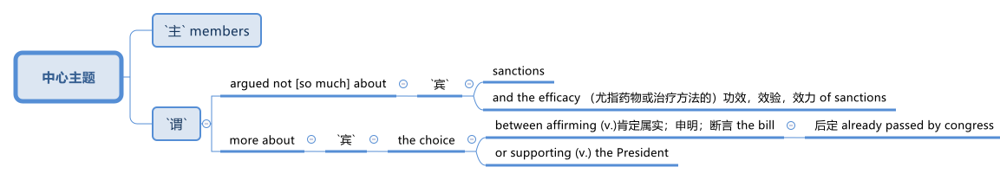

= step 3- Lesson 6
:toc: left
:toclevels: 3
:sectnums:
:stylesheet: ../../+ 000 eng选/美国高中历史教材 American History ： From Pre-Columbian to the New Millennium/myAdocCss.css

'''

== 军事欺骗

The Senate has voted to override President Reagan's veto 否决权 of sanctions 制裁 against South Africa by a decisive 决定性的；关键的 seventy-eight to twenty-one.

[.my2]
参议院投票，以决定性的七十八票比二十一票，推翻了里根总统对南非制裁的否决权。 +

As the House has already voted to override, the sanctions now become law.

[.my2]
由于众议院已经投票否决，制裁现已成为法律。 +

NPR's Linda Wertheimer reports.  +

"American civil rights leaders, including Mrs. Caretta Scott King, watched the Senate debate from the Senate family gallery （大厅的）楼座，楼上旁听席 as members argued #not [so much] about# ① sanctions  ② and the efficacy （尤指药物或治疗方法的）功效，效验，效力 of sanctions, #more about# the choice between ① affirming (v.)肯定属实；申明；断言 the bill already passed by congress  ② or supporting (v.) the President."

[.my1]
.案例
====

====

[.my2]
参议员们并没有就"制裁"和"制裁效果"大加辩论，而是努力在"支持国会通过的法案"还是"支持总统"两者之间做出选择。 +

American food aid (n.) to southern African countries could be cut off if South Africa carries out its threat 后定向前推进 to ban (v.) imports of US grain 谷物；谷粒. +

Foreign Minister Pic Botha said if US sanctions were imposed, his government would stop imports and would not allow its transport 交通运输系统 service to carry (v.) US grain 谷物；谷粒 to neighboring countries.  +

The White House today denied that it planted misleading (a.)误导的；引入歧途的 stories in the American news media as part of a plan to topple (v.)（使）失去平衡而坠落，倒塌，倒下;打倒；推翻；颠覆 Libyan leader Muammar Quddafi.  +

The Washington Post reported this morning that stories were leaked this summer alleging 指控，声称 Quddafi was resuming (v.)重新开始；（中断后）继续 his support for terrorist activities, even though National Security Adviser 国家安全顾问 John Poindexter knew (v.) otherwise  或其相反.  +

Today, White House spokesman Larry Speakes said Poindexter denied `主` the administration `谓` had involved the media in an anti-Quddafi campaign but Speakes left open the possibility 后定向前推进 a disinformation （尤指政府机构故意发布的）虚假信息，假消息 campaign was conducted in other countries.

[.my2]
波因德克斯特否认政府与媒体共同参与了反对卡扎菲的运动，但斯皮克斯并未否定在其他国家展开政府运动的可能性。 +

The question in Washington today is this: Did the federal government try to scare  惊吓；使害怕；使恐惧 Libya's Colonel 上校 Muammar Quddafi 穆阿迈尔·卡扎菲 in August by way of a disinformation campaign （有计划的）活动，运动；战役，战斗 in the American media?

The Washington Post Bob Woodward reports (v.) today that there was an elaborate 复杂的；详尽的；精心制作的 disinformation program set up by the White House to convince  使确信；使相信；使信服 Quddafi that the United States was about to attack again, or that he might be ousted 剥夺；罢免；革职 in a coup 政变.  +

The White House today denies that officials tried to mislead 误导；引入歧途；使误信 Quddafi by using the American media.  +

NPR's Bill Busenburg has our first report on the controversy （公开的）争论，辩论，论战. NPR的比尔·布森博格, 就此项争议为我们进行首次报道。 +

The story starts (v.) on August 25th when the Wall Street Journal ran a front page story saying that Libya and the United States were once again on a collision course  进展；进程.  +

Quoting 引用；引述 multiple official sources 援引了多条官方消息来源, the paper said Quddafi was plotting new terrorist attacks and the Reagan Administration was preparing to teach him another lesson.  +

The Journal reported that the Pentagon  五角大楼（指美国国防部） was completing plans for a new and wider bombing of Libya in case the President ordered it.  +

That story caused a flurry 一阵忙乱（或激动、兴奋等） of press attention.  那一事件引起了新闻界的广泛关注。 +

`主` Officials in Washington and at the western White House in California `谓` were asked `宾`  if it was true.  +

"The story was authoritative 权威性的," said the White House spokesman Larry Speakes.  +

Based on that official confirmation 证实；确认书；证明书, other news organizations, including the New York Times , the Washington Post , NPR and the major TV networks, all ran (v.)包含（某种词语、内容等） stories suggesting Libya should watch out  (提醒别人) 小心.  +

[.my1]
====
.run
(v.) to have particular words, contents, etc. 包含（某种词语、内容等） +
- Their argument ran something like this... 他们的论点大致是这样的… +
- ‘Ten shot dead by gunmen,' ran the newspaper headline. 报纸的标题为“枪手击毙十人”。 +
====

`主` #US naval 海军的 maneuvers# 军事演习 后定向前推进 then taking place in the Mediterranean `谓` #might# be used as a cover  掩护；防护 for more attacks on Libya [as in the past].

[.my2]
和过去一样，美国可能用当时在地中海进行的美国海军演习，作为对利比亚更大规模打击的掩护。 +

`主` Today's Washington Post , however, `谓` quotes (v.) [from an August 14th] `宾` secret White House plan, 后定向前推进 adopted (v.)采用（某方法）；采取（某态度） eleven days before the Wall Street Journal story.

[.my2]
然而，今天的《华盛顿邮报》引用了白宫8月14日的一项秘密计划，该计划是在《华尔街日报》报道的11天前通过的。+

It was outlined 概述；略述 in a memo 备忘录 written by the President's National Security Advisor 国家安全顾问 John Poindexter.  +

That plan called for （公开）要求 a strategy of real and illusory 虚假的；幻觉的；迷惑人的 events, using a disinformation program to make Quddafi think the United States was about to move against 对抗；与……作对 him militarily.  +

Here are some examples the Post cites 引用，援引, suggesting `主` disinformation `谓` was used domestically 国内地: Number one, while some US officials told the press Quddafi was stepping up 增加,提高或推进 his terrorist plans, President Reagan was being told in a memo that Quddafi was temporarily quiescent 静止状态的;沉寂的；静态的, in other words, that he wasn't active.  +

[.my2]
下面是邮报引用的一些例子，表明国内用了虚假情报：第一，一些美国官员告诉媒体，卡扎菲正在加紧实施他的恐怖计划，而里根总统却在一个备忘录中被告知，卡扎菲暂无动作，换句话说，他并不活跃。

Number two, while some officials were telling the press of internal 内部的；里面的 infighting 团体内部的争权夺利；内讧 in Libya to oust  剥夺；罢免；革职 Quddafi, US officials really believed he was firmly in power and that CIA's efforts to oust him were not working.  +

[.my2]
第二，当一些官员告诉媒体，利比亚内部发生内讧，要赶卡扎菲下台时，美国官员真心相信他的掌权不会动摇，中央情报局试图推翻卡扎菲的努力并未奏效。

Number three, while officials were telling the press the Pentagon was planning new attacks, in fact nothing new was being done.  +

Existing contingency 可能发生的事；偶发（或不测、意外）事件 plans were several months old, and the naval maneuvers were just maneuvers.

[.my2]
现有应急计划已出台几个月之久，而海军演习只是演习。  +

The Post says this policy of deception 欺骗；蒙骗；诓骗 was approved at a National Security Planning Group meeting chaired by President Reagan and his top aides （尤指从政者的）助手. +

[.my2]
邮报说，这一欺骗政策得到了国家安全规划小组会议的批准，会议由里根总统和他的高级助手主持。

[.my2]
参议院以 78 比 21 的决定性投票结果推翻了里根总统对南非制裁的否决。由于众议院已经投票推翻，制裁现已成为法律。 NPR 的琳达·韦特海默报道。 “包括卡雷塔·斯科特·金夫人在内的美国民权领袖在参议院家庭旁听席上观看了参议院的辩论，议员们的争论与其说是关于制裁和制裁的效力，不如说是关于在肯定国会已经通过的法案还是支持之间做出选择。总统。”如果南非兑现其禁止进口美国谷物的威胁，美国对南部非洲国家的粮食援助可能会被切断。外交部长皮克·博塔表示，如果美国实施制裁，他的政府将停止进口，并不允许其运输服务将美国粮食运往邻国。白宫今天否认在美国新闻媒体上植入误导性报道，作为推翻利比亚领导人穆阿迈尔·库扎菲计划的一部分。 《华盛顿邮报》今天早上报道称，今年夏天有报道称库达菲重新支持恐怖活动，尽管国家安全顾问约翰·波因德克斯特并不知情。今天，白宫发言人拉里·斯皮克斯表示，波因德克斯特否认政府让媒体参与了反库扎菲运动，但斯皮克斯保留了在其他国家开展虚假信息运动的可能性。今天华盛顿的问题是：联邦政府是否试图在八月份通过美国媒体的虚假信息宣传来恐吓利比亚的穆阿迈尔·库达菲上校？ 《华盛顿邮报》鲍勃·伍德沃德今天报道称，白宫制定了一个精心设计的虚假信息计划，目的是让库扎菲相信美国即将再次发动袭击，或者他可能会在政变中被赶下台。白宫今天否认官员试图利用美国媒体误导库达菲。美国国家公共广播电台 (NPR) 的比尔·布森伯格 (Bill Busenburg) 为我们带来了关于这一争议的第一份报道。故事要从8月25日《华尔街日报》的头版报道说起，利比亚和美国再次陷入冲突。该报援引多个官方消息称，库达菲正在策划新的恐怖袭击，里根政府正准备再给他一个教训。据《华尔街日报》报道，五角大楼正在完成对利比亚进行新的、更广泛的轰炸的计划，以防总统下令。这个故事引起了媒体的广泛关注。华盛顿和加州西部白宫的官员被问及这是否属实。 “这个故事具有权威性，”白宫发言人拉里·斯皮克斯说。根据这一官方确认，其他新闻机构，包括《纽约时报》、《华盛顿邮报》、NPR 和主要电视网络，都发表了建议利比亚应该警惕的报道。美国当时在地中海进行的海军演习可能会像过去一样，成为对利比亚发动更多袭击的掩护。然而，今天的《华盛顿邮报》引用了 8 月 14 日白宫秘密计划的内容，该计划是在《华尔街日报》报道前 11 天通过的。总统国家安全顾问约翰·波因德克斯特撰写的一份备忘录对此进行了概述。 该计划要求采取真实和虚幻事件的策略，利用虚假信息计划让库扎菲认为美国即将对他采取军事行动。以下是《华盛顿邮报》引用的一些例子，表明国内使用了虚假信息：第一，当一些美国官员告诉媒体库扎菲正在加强他的恐怖计划时，里根总统在一份备忘录中被告知库扎菲暂时处于静止状态，换句话说，他不活跃。第二，虽然一些官员向媒体讲述利比亚的内讧，以推翻库扎菲，但美国官员确实相信他牢牢掌握权力，中央情报局驱逐他的努力没有奏效。第三，虽然官员们告诉媒体五角大楼正在计划新的袭击，但事实上并没有采取任何新的行动。现有的应急计划已经制定了几个月，海军演习也只是演习。 《华盛顿邮报》称，这一欺骗政策是在里根总统及其高级助手主持的国家安全规划小组会议上批准的。

'''

== 关于"媒体中的自杀报道, 会增加真实自杀率"的问题

Two new studies were published today on the links between television coverage 新闻报道 of suicide and subsequent 随后的；之后的 teenage suicide rates.  +

The New England Journal of Medicine reports that both studies suggest that some teenagers might be more likely to take their own lives 自杀,杀死某人 after seeing TV programs dealing with suicide.  +

NPR's Lorie Garrett reports.  +

The first suicide study, done by a team from the University of California in San Diego, examines television news coverage of suicides.  +

David Philips and Lundy Carseson looked at forty-five suicide stories carried 刊登；登载；播出；报道 on network news-casts 新闻广播 between 1973 and '79.  +

The researchers then compared the incidence of teen suicides in those years to the dates 日期；日子 of broadcast 播送（电视或无线电节目）；广播 of these stories.  +

David Philips says news coverage of suicides definitely prompted 促使；导致；激起 an increase in the number of teens in America who took their lives.  +

"The more TV programs that carry a story, the greater they increase in teen suicides just afterwards." The suicide increase (n.) among teens 十几岁，青少年时期（指从13岁到19岁） was compared by Philips to adult suicide trends.

[.my2]
菲利普斯还对青少年自杀趋势, 与成年自杀趋势, 进行了比较。  +

"The teen suicides go up 上升 by about 2.91 teen suicides per story.

[.my2]
（平均）每次事件报道, 造成青少年自杀率增加2.91人次 +

And adult suicides go up by, I think, around two adult suicides per story.  而（平均）每次事件报道, 造成成年自杀率增加2人次 +

The increase for teens, the percentage increase for teens is very, very much larger than the percentage increase for adults.  +

It's about, I think, fourteen or fifteen times （用于比较）倍  #as big# a response 反应；响应 for teens percentagewise (ad.)从百分比来看，按百分率 #as# it is for adults."  我认为，按百分比计算，青少年自杀率的增加是成人的十四五倍。

The TV news coverage appears to have prompted a greater increase #than# is seen around other well-known 众所周知的 periods of adolescent depression, such as holidays, personal birthdays, the start of school and winter.  +

[.my2]
比起其它众所周知的青春期抑郁时期，新闻报道似乎，更会造成青少年自杀率的增加，如假期、个人生日、开学季及冬季时段。

Philips could not find any specific 明确的；具体的;特有的；独特的 types of stories  新闻报道 that seem to trigger a greater response among depressed teens.

[.my2]
菲利普斯似乎再找不到任何比电视新闻报道，更能激发抑郁青少年自杀的事情了。 +

Philips says it seems to （强调简单）仅仅，只，不过 simply be the word "suicide" and the knowledge that somebody actively executed 实行；执行；实施 the act that pushes buttons in depressed teenagers.  +

[.my2]
菲利普斯说，似乎正是“自杀”这个词，以及知道有人真的做了，让这些抑郁的青少年，启动了自杀的按钮。

Psychiatrists call (v.) this "imitative 模仿的；仿制的；仿效的 behavior." "What my study showed was that there seems to be imitation 模仿；效仿 #not only# of relatively bland 平淡的；乏味的 behavior like dress, dressing or hairstyles, #but# there seems to be imitation of really quite deviant 不正常的；异常的；偏离常轨的 behavior as well.  +

[.my2]
“我的研究表明，模仿似乎不仅限于那些稀松平常的事情，比如像衣服，着装或发型，人们也会对一些相当离经叛道的行为加以模仿。这些青少年显然是在全面模仿，不仅仅是自杀，还有其他一切。”

[.my1]
====
.deviant
(a.)different from what most people consider to be normal and acceptable 不正常的；异常的；偏离常轨的 +
--> de-, 向下，离开。-vi, 路，词源同way, trivia. +
=> deviant behavioursexuality 偏常行为╱性行为 +
====

`主` The teenagers imitate (n.) `谓` apparently across the board 全面的，普遍的, not just suicides, but everything else as well."  +
In a separate study, Madeline Gould and David Shaeffer of Columbia University found that `主` made-for-television 为电视制作的 movies about suicide `谓` also stimulated imitative behavior.  +

[.my2]
这些青少年显然是在全面模仿，不仅仅是自杀，还有其他一切。影视作品中的自杀情节, 也会刺激自杀模仿行为的发生。

Even though the movies were intended to portray 描绘；描画 the problem of teen suicide and offered 提供（东西或机会）；供应, in some cases, suicide hot line numbers and advice on counselling 咨询；辅导, the team believes the four network movies prompted (v.) eighty teen suicides.  +

[.my2]
尽管电影旨在描述青少年自杀问题, 并提供，比如在某些情况下，提供自杀（救助）热线及咨询意见. 该研究团队仍认为, 这四部网络电影促使80名青少年最终选择了自杀。

`主` One of #the made-for-TV movies# 后定向前推进 examined by the Columbia University team `系` #was# a CBS （美国）哥伦比亚广播公司 production.  +

[.my1]
====
.CBS
Columbia Broadcasting System (an American recording and broadcasting company that produces records, television programmes, etc.) （美国）哥伦比亚广播公司 +

====

George Schweitzer, a CBS's Vice President, is well aware of 察觉到；发觉,知道；意识到；明白 this research.  +

He says, "It is terribly unfortunate 极为不幸 that any teens took their lives after the broadcast, but if they had it to do over 重做；重新开始," says Schweitzer, "CBS would still run the movie."  +
"`主` Studies like these `谓` do not measure the most, what we think is the most important thing, which I don't think can be measured, and that is the hundreds and hundreds 数以百计 and probably thousands of teenagers who were positively moved by these kinds of broadcasts." Moved to call (v.) suicide hot lines, moved to seek counseling, and moved to discuss their depressions with family members.  +

[.my2]
他说，“有青少年在收听了自杀性报道后选择了自杀，真的极为不幸，但如果他们(指CBS自己)可以重新选择一次，”斯维泽说，“CBS仍会播放这部影片。” "像学者做的这些媒体影响自杀研究, 虽然重要, 但我们认为它并不是最重要的，我们认为最重要的是，成百上千，可能是数以千计的青少年, 能被我们所播放的影片驱使。他们会去拨打自杀（救助）热线，赶紧去找心理咨询，和家人一起讨论他们沮丧的状态。我认为这些由影片带来的价值, 才是难以估量的."

Schweitzer does not dispute 对…提出质询；对…表示异议（或怀疑）;争论；辩论；争执 today's studies: some teens may moved to suicide.  +

"But ignoring the issue 原因状 for fear of that, I think, would be far more disastrous than addressing 设法解决；处理；对付 important social issues to help create awareness 知道；认识；意识；兴趣 and again to have a positive effect."  +
But researcher David Philips suggests the media ① could decrease （使大小、数量等）减少，减小，降低 the teen suicide problem by avoiding some suicide stories all together ② and changing (v.) the way 后定向前推进 the others are covered (v.)报道；电视报道.  +

[.my2]
“但因为害怕而忽视这个问题，我认为这将比解决重要的社会问题更为灾难性，因为解决问题有助于提高意识，再次产生积极效果。 但研究者 David Philips 提出，媒体可以通过完全避免报道一些自杀事件，并改变对其他事件的报道方式, 来减少青少年自杀问题。

For example, says Philips, "Don't make suicide seem (v.) heroic 英勇的；英雄的."  +
He cites (v.) the story of a young Czechoslovakian  (前)捷克斯洛伐克人 dissident 持不同政见者 who set (v.) himself on fire.

[.my2]
他引用了年轻的捷克斯洛伐克持不同政见者的故事，他自焚了。
  +

But `主`  the dissident action `谓` was taken to draw attention to government repression in Czechoslovakia.

[.my2]
但持不同政见者这样做, 是为了促使人们关注捷克斯洛伐克政府的镇压。  +

Should the news media really have ignored 忽视；对…不予理会 such a story? "I think it's a really difficult question.  +

There are all these goods on all sides of the issue.

[.my2]
问题的各个方面都有好处。 +

And thank God, I don't have to be the one 后定向前推进 to disentangle 解开…的结；理顺;使解脱；使脱出；使摆脱 that issue." 感谢上帝，我不是那个必须要解决这个问题的人。 +

One prominent expert in this field said `主` #the young people# 后定向前推进 moved (v.) to take their lives, following a news story or movie, `系`  #are# particularly vulnerable （身体上或感情上）脆弱的，易受…伤害的, suicidal 想自杀的；有自杀倾向的 individuals.

[.my2]
那些受影片影响而自杀的年轻人, 本身就是情感脆弱的, 并有自杀倾向的那些人. +

In the absence of television stories, `主` some other events in their lives `谓` might well have triggered their actions.  即使没有电视报道，他们生活中的一些其他事件，也很可能已经触发了他们的自杀行为。 +

So while most psychiatrists 精神病医生 agree there is an imitative 模仿的 component 组成部分；成分；部件 to teenage suicides, that tendency, they say, should not lead society to repress  压制；镇压 information.

[.my2]
虽然大多数医生同意, 青少年的自杀, 会有效仿因素，他们说，这种趋势不应该迫使社会去压制信息的曝光。 +

On the contrary 与之相异的；相对立的；相反的, some say we are now facing a major epidemic （迅速的）泛滥，蔓延; 流行病 of adolescent suicide in America.  +

We must publicize (v.)宣传；推广；宣扬；传播 and confront (v.)使面对，使面临，使对付（令人不快或难处的人、场合） the problem. 我们必须（进行正向）宣传，并正视这个问题。 +

Last year `主` some fifty-five hundred adolescents between fifteen and twenty-four years of age `谓` took their lives.  +

At least ten times that tried.  试图自杀的人至少是其十倍。 +

Some estimates (n.)（对数量、成本等的）估计；估价 are that 275 thousand teens attempted suicide last year.  +

The rate of teenage suicide in America has tripled 使成为三倍; 变成三倍 since 1955.

[.my2]
今天发表了两项关于电视自杀报道与随后的青少年自杀率之间联系的新研究。 《新英格兰医学杂志》报道称，这两项研究都表明，一些青少年在观看有关自杀的电视节目后可能更有可能自杀。 NPR 的洛里·加勒特报道。第一项自杀研究由圣地亚哥加利福尼亚大学的一个团队进行，调查了电视新闻对自杀的报道。大卫·菲利普斯 (David Philips) 和伦迪·卡森 (Lundy Carseson) 研究了 1973 年至 79 年间网络新闻广播中报道的 45 个自杀故事。研究人员随后将这些年青少年自杀的发生率与这些故事的播出日期进行了比较。 大卫·菲利普斯表示，有关自杀的新闻报道无疑导致了美国自杀青少年人数的增加。 “报道故事的电视节目越多，随后青少年自杀的人数就越多。”飞利浦将青少年自杀率的上升趋势与成人自杀趋势进行了比较。 “每个故事的青少年自杀人数增加了约 2.91 人。我认为，每个故事的成人自杀人数增加了大约 2 人。青少年的增加，青少年的百分比增加比百分比要大得多。成年人的比例有所增加。我认为，青少年的反应比例大约是成年人的十四或十五倍。”电视新闻报道似乎比其他众所周知的青少年抑郁时期（例如假期、个人生日、开学和冬季）导致的青少年抑郁症增加幅度更大。飞利浦找不到任何特定类型的故事似乎能在抑郁的青少年中引发更大的反应。飞利浦表示，这似乎只是“自杀”这个词，以及知道有人主动执行了对抑郁青少年进行按钮的行为。精神病学家称之为“模仿行为”。 “我的研究表明，人们似乎不仅模仿衣着、打扮或发型等相对平淡的行为，而且似乎也模仿非常不正常的行为。青少年显然是全面模仿，而不仅仅是自杀。” ，但其他一切也是如此。”在另一项研究中，哥伦比亚大学的马德琳·古尔德和大卫·谢弗发现，有关自杀的电视电影也会刺激模仿行为。 尽管这些电影的目的是描绘青少年自杀问题，并在某些情况下提供自杀热线电话号码和咨询建议，但研究小组认为，这四部网络电影导致了 80 起青少年自杀事件。哥伦比亚大学团队检查的其中一部电视电影是哥伦比亚广播公司制作的。哥伦比亚广播公司副总裁乔治·施韦策 (George Schweitzer) 非常了解这项研究。他说，“非常不幸的是，任何青少年在播出后自杀，但如果他们能重来一次，”施韦策说，“哥伦比亚广播公司仍然会播放这部电影。” “像这样的研究并没有衡量最多的，我们认为最重要的事情，我认为无法衡量，那就是成百上千甚至可能成千上万的青少年被此类广播所积极感动”。拨打自杀热线，寻求咨询，并与家人讨论他们的抑郁症。施韦策对当今的研究没有异议：一些青少年可能会走向自杀。 “但我认为，因为担心这个问题而忽视这个问题，比解决重要的社会问题以帮助提高认识并再次产生积极影响更具灾难性。”但研究人员大卫·菲利普斯认为，媒体可以通过避免某些自杀故事并改变报道其他故事的方式来减少青少年自杀问题。例如，飞利浦说，“不要让自杀看起来很英雄。”他引用了一位年轻的捷克斯洛伐克持不同政见者自焚的故事。但持不同政见者采取的行动是为了引起人们对捷克斯洛伐克政府镇压的关注。新闻媒体真的应该忽视这样的故事吗？ “我认为这是一个非常困难的问题。问题的各个方面都有所有这些商品。 感谢上帝，我不必成为解决这个问题的人。”该领域的一位著名专家表示，这些年轻人在看到新闻报道或电影后自杀，是特别脆弱、有自杀倾向的人。由于没有电视故事，他们生活中的其他一些事件很可能引发了他们的行为。因此，尽管大多数精神病学家都认为青少年自杀存在模仿成分，但他们表示，这种倾向不应导致社会压制信息。相反，有人说我们现在在美国面临着青少年自杀的严重流行。我们必须宣传并正视这个问题。去年，大约有 5500 名 15 至 24 岁的青少年自杀了。至少是这个数字的十倍。据估计，去年有 27.5 万名青少年试图自杀。自 1955 年以来，美国青少年自杀率增加了两倍。

'''
